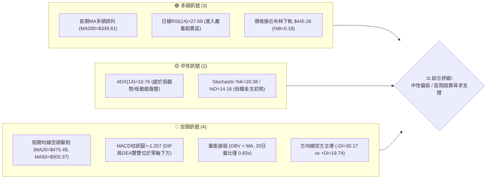
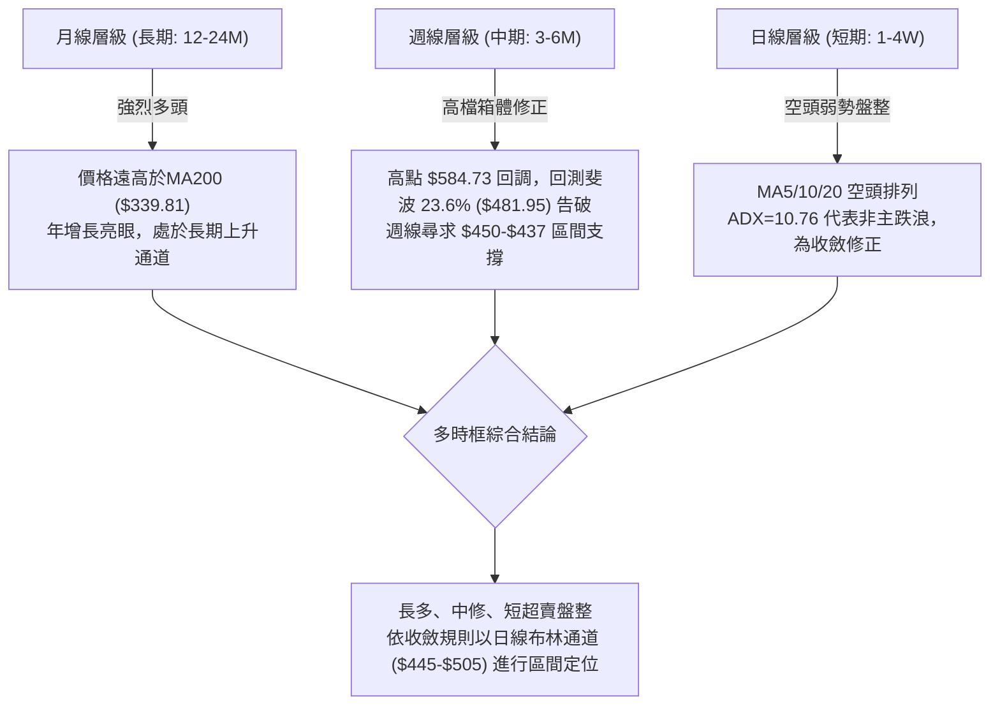
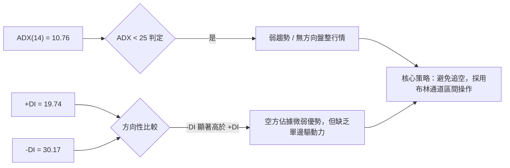
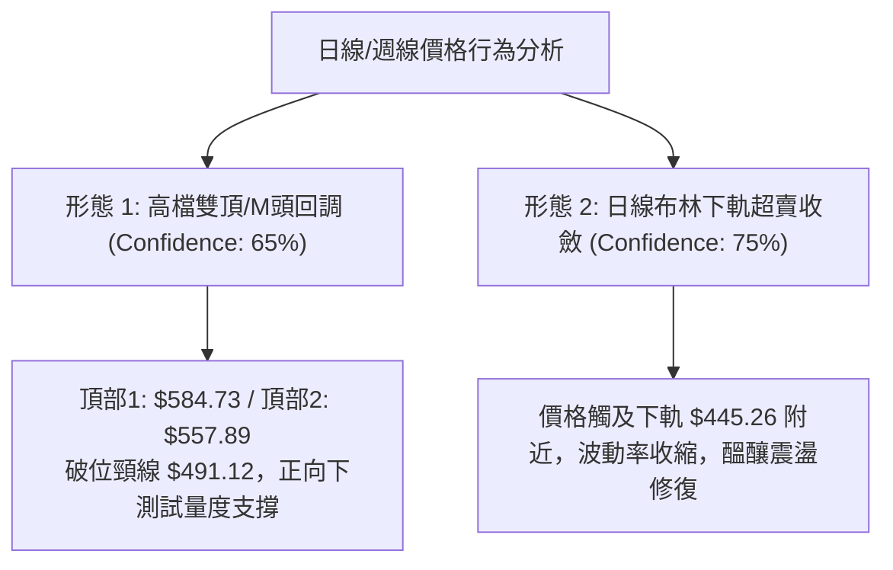
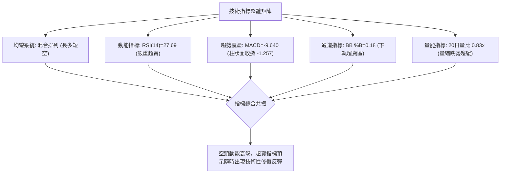
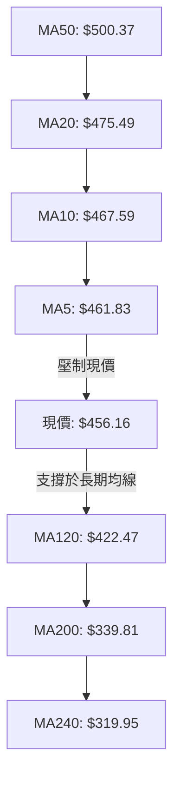
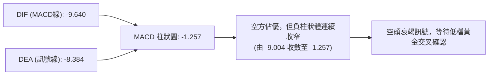
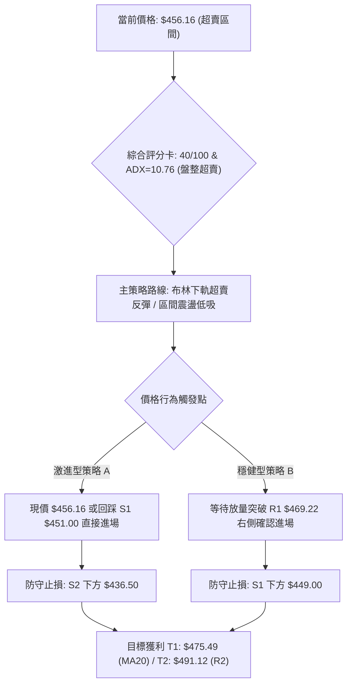
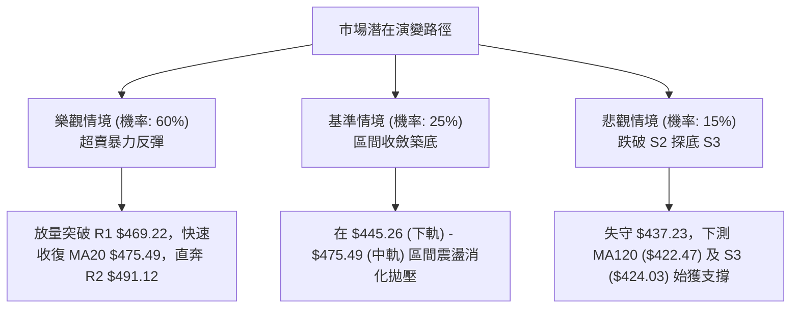

# AMD 技術分析報告

> **報告日期**：2026-09-04 ｜ **語言**：繁體中文 ｜ **數據來源**：Yahoo Finance ｜ **當前價格**：$456.16

---

## 目錄

| 章節 | 內容 |
|------|------|
| [1. 技術面概覽](#1-技術面概覽) | 訊號儀表板、核心指標、評分卡 |
| [2. 趨勢分析](#2-趨勢分析) | 多時框趨勢、長中短期走勢 |
| [3. 圖表形態分析](#3-圖表形態分析) | 形態識別、K線組合、目標價 |
| [4. 支撐與阻力](#4-支撐與阻力) | 關鍵價位、斐波那契回調 |
| [5. 技術指標深度解讀](#5-技術指標深度解讀) | MA/RSI/MACD/布林/成交量 |
| [6. 動能與波動率](#6-動能與波動率) | 動能評估、ATR、Beta |
| [7. 多時框架總結](#7-多時框架總結) | 時框架評分矩陣 |
| [8. 交易策略建議](#8-交易策略建議) | 多空策略、風險報酬比 |
| [9. 風險提示與監控](#9-風險提示與監控) | 監控指標、風險場景 |

---

## 1. 技術面概覽

### 🎯 技術訊號儀表板



### 📊 核心指標速覽表

| 指標類別 | 指標名稱 | 當前數值 | 訊號 | 解讀 |
|----------|----------|----------|------|------|
| **價格** | 當前價格 | $456.16 | 🟡 | 位於52週區間70.5%分位，自歷史高點$584.73回調-21.99% |
| **均線** | MA20 | $475.49 | 🔴 | 價格在MA20下方 -4.06%，短期下行趨勢顯著 |
| **均線** | MA50 | $500.37 | 🔴 | 價格在MA50下方 -8.84%，中期承壓於整數關卡 |
| **均線** | MA200 | $339.81 | 🟢 | 價格在MA200上方 +34.24%，長期多頭根基穩固 |
| **動能** | RSI(14) | 27.69 | 🟢 | 極度超賣（<30），隨時具備技術性跌深反彈動能 |
| **動能** | MACD(12,26,9) | -9.640 / -8.384 | 🔴 | MACD柱狀圖 -1.257，空方動能主導但跌勢有收斂跡象 |
| **趨勢** | ADX(14) | 10.76 | 🟡 | 數值低於 25，顯示單邊下跌動能不足，市場轉入盤整震盪 |
| **通道** | 布林通道 | %B = 0.18 | 🟢 | 逼近下軌 $445.26，處於統計學上的極端下緣超跌帶 |
| **波動** | ATR(14) | $17.78 | 🟡 | 每日平均真實波幅佔股價 3.90%，處於中等波動區間 |

### 🏆 技術評分卡

```
╔══════════════════════════════════════════════════════════════════╗
║                   技術評分卡 — AMD (2026-09-04)                  ║
╠══════════════════════════════════════════════════════════════════╣
║ 趨勢強度 (Trend)       ████░░░░░░░░░░░░░░░░  25/100  🔴 弱勢盤整 ║
║ 動能指標 (Momentum)    ███████░░░░░░░░░░░░░  35/100  🔴 空方主導 ║
║ 支撐穩定度 (Support)   ████████████░░░░░░░░  60/100  🟡 考驗S1/S2║
║ 成交量配合 (Volume)    ██████░░░░░░░░░░░░░░  30/100  🔴 量能萎縮 ║
║ 形態完整度 (Pattern)   ██████████░░░░░░░░░░  50/100  🟡 頂部回撤 ║
║ 均線排列 (Moving Avg)  ████████░░░░░░░░░░░░  40/100  🟡 混合排列 ║
╠══════════════════════════════════════════════════════════════════╣
║ 綜合評分 (Composite)   ████████░░░░░░░░░░░░  40/100  ⚖️ 偏空中性 ║
╚══════════════════════════════════════════════════════════════════╝
```

---

## 2. 趨勢分析

### 🌐 多時框趨勢分析



### 📈 長期趨勢 — 12個月走勢圖（Unicode）

```
AMD 月線走勢圖（過去 12 個月：2025-09 至 2026-09）
價格 ($)
$600 ┤                                      ● $580.91 (06月高點 $584.73)
$550 ┤                                  ●
$500 ┤                             ●    │   ● $476.15
$450 ┤                             │    │   │   ● $470.72
$400 ┤                        ●    │    │   │   │   ● $456.16 (現價)
$350 ┤                        │    │    │   │   │   │
$300 ┤                   ●    │    │    │   │   │   │
$250 ┤ ● $256.12         │    │    │    │   │   │   │
$200 ┤ │   ●   ●   ●   ● │    │    │    │   │   │   │
$150 ┤ ┼───┼───┼───┼───┼─┼────┼────┼────┼───┼───┼───┼────
月份 ┤09  10  11  12  01 02   03   04   05  06  07  08  09 (2026)
     └────────────────────────────────────────────────────────
```

#### 走勢特徵階段分析

| 階段 | 期間 | 價格區間 | 累積漲跌 | 特徵與形態解讀 |
|------|------|----------|----------|----------------|
| **第一階段：低檔築底** | 2025-09 ~ 2026-03 | $161.79 → $203.43 | +25.7% | 於 $160-$250 構築堅實大底，機構建倉完成 |
| **第二階段：主升暴發** | 2026-03 ~ 2026-06 | $203.43 → $580.91 | +185.6% | 爆發性多頭浪，連續突破阻力，創下歷史高點 $584.73 |
| **第三階段：高檔獲利** | 2026-06 ~ 2026-09 | $580.91 → $456.16 | -21.5% | 獲利盤回吐，量能持續萎縮，進入技術性降溫回調階段 |

### 📊 中期趨勢（週線分析）

```
週線級別價格壓力與支撐階梯圖：
════════════════════════════════════════════════════════════════
$584.73 ──────────────────────── 52W 歷史高點 (極強阻力)
$517.35 ════════════════════════ 波段反彈高點聚類 (R3 阻力)
$491.12 ──────────────────────── 中期頸線位 (R2 阻力)
$469.22 ┈┈┈┈┈┈┈┈┈┈┈┈┈┈┈┈┈┈┈┈┈┈┈┈ 5日均線/短壓 (R1 阻力)
$456.16 ◄───【目前收盤價格】
$451.00 ┈┈┈┈┈┈┈┈┈┈┈┈┈┈┈┈┈┈┈┈┈┈┈┈ 近期波段前低 (S1 關鍵支撐)
$437.23 ════════════════════════ 週線結構性支撐平台 (S2 強支撐)
$424.03 ──────────────────────── 120日均線防線 (S3 終極防線)
════════════════════════════════════════════════════════════════
```

### ⚡ 趨勢強度評估（ADX 解讀）



| 指標變數 | 當前數值 | 門檻區間 | 解讀結論 |
|----------|----------|----------|----------|
| **ADX(14)** | 10.76 | < 20 (極弱) / < 25 (無趨勢) | 市場動能匱乏，無強烈單邊殺跌力量，屬於高檔收斂震盪 |
| **+DI (多方)**| 19.74 | 基準線 20 | 多頭進攻意願極低，買盤呈現觀望退縮 |
| **-DI (空方)**| 30.17 | > 25 (強勢) | 空頭主導短期節奏，但受制於整體弱 ADX，難以引發崩跌 |

---

## 3. 圖表形態分析

### 🔍 形態識別系統



#### 形態識別信心度評估表

| 形態類別 | 信心度 | 判斷依據（引用數據） | 完成度 | 目標價（附計算式） |
|----------|--------|----------------------|--------|--------------------|
| **高檔雙頂 (M-Top)** | 65% | 頂部一 $584.73 (06月)，頂部二 $557.89 (07月中旬)，頸線為波段低點聚類 R2 $491.12 | 80% (已跌破頸線) | 頸線 $491.12 - 形態高度 ($557.89 - $491.12 = $66.77) = **$424.35** (高度吻合支撐 S3 $424.03) |
| **布林下軌超賣收斂** | 75% | 價格 $456.16 貼近 BB下軌 $445.26，%B 為 0.18，ADX 為 10.76 | 90% | 回測 BB中軌 (MA20) = **$475.49** |

### 🕯️ 重要K線形態分析

| 週/月期間 | 收盤價 | K線形態 | 解讀 | 訊號 |
|-----------|--------|---------|------|------|
| **2026-06-21** | $537.37 | 高檔長上影十字星 | 逼近歷史高點 $584.73 遭遇強大拋壓，多頭力竭 | 🔴 看空反轉 |
| **2026-07-12** | $557.89 | 次高點長黑包覆 | 反彈未能突破前高，形成第二個頂部結構 | 🔴 確認次頂 |
| **2026-08-16** | $514.39 | 假突破中紅棒 | 受制於 MA50 ($500.37) 與 R3 ($517.35) 壓力帶，量能不濟 | 🟡 誘多誘空 |
| **2026-09-06** | $456.16 | 連續陰跌下影小紅/十字 | 跌勢放緩，在支撐位 S1 ($451.00) 前出現初步承接買盤 | 🟢 止跌醞釀 |

### 📉 ASCII 走勢形態示意圖

```
AMD 高檔雙頂破位與通道震盪示意圖
$584.73 ─────────── Top 1
                     ╲               Top 2 ($557.89)
                      ╲             ╱ ╲
                       ╲           ╱   ╲
$491.12 ──────────────── Neckline (頸線 R2) ────────────────
                                   ╲     ╲
                                    ╲     ╲
$456.16 ───────────────────────────── ◄ 現價 (測試 S1 $451.00)
                                           ╲
$424.03 ─────────────────────────────────── 量度目標 / S3 支撐
```

### 🎯 形態目標價計算

```
╔══════════════════════════════════════════════════════════════════╗
║                    圖表形態量度目標價推算                        ║
╠══════════════════════════════════════════════════════════════════╣
║ 形態名稱：次級雙頂 (Secondary Double Top)                        ║
║ 頸線位置 (Neckline)：         $491.12 (波段高點聚類 R2)          ║
║ 次頂高點 (Peak 2)：           $557.89 (2026-07-12 收盤高點)      ║
║ 形態垂直高度 (Height)：       $557.89 - $491.12 = $66.77         ║
║ 理論量度滿足點 (Target)：     $491.12 - $66.77 = $424.35         ║
║ 數據驗證：理論目標 $424.35 與波段低點聚類 S3 ($424.03) 僅差 $0.32║
║ 結論：$424.03 - $437.23 區間為中期強烈對稱支撐帶                ║
╚══════════════════════════════════════════════════════════════════╝
```

---

## 4. 支撐與阻力

### 🗺️ 關鍵價位分布圖（Unicode）

```
AMD 關鍵價位空間結構圖
═══════════════════════════════════════════════════════════════════
$584.73 ║██████████████████████████████║ 52W 歷史最高點 (極強天花板)
$517.35 ║████████████████████████      ║ 強阻力 R3 (波段密集高點)
$505.71 ║▓▓▓▓▓▓▓▓▓▓▓▓▓▓▓▓▓▓            ║ 布林通道上軌
$491.12 ║████████████████              ║ 阻力 R2 (頸線關鍵阻力)
$475.49 ║▓▓▓▓▓▓▓▓▓▓▓▓                  ║ 布林中軌 / MA20
$469.22 ║████████                      ║ 短線阻力 R1 (MA5 附近)
$456.16 ╠══════════════════════════════╣ ◄ 當前市價 ($456.16)
$451.00 ║████████                      ║ 近期關鍵支撐 S1 (短線防線)
$445.26 ║▓▓▓▓▓▓▓▓▓▓▓▓▓▓                ║ 布林通道下軌
$437.23 ║████████████████████          ║ 強支撐 S2 (密集波段低點聚類)
$424.03 ║██████████████████████████████║ 終極強支撐 S3 (MA120 / 量度低點)
═══════════════════════════════════════════════════════════════════
```

### 🚧 阻力位分析表

| 阻力級別 | 精確價位 | 形成原因（依據數據） | 突破難度 | 重要性 |
|----------|----------|----------------------|----------|--------|
| **R1** | **$469.22** | 近一年波段高點聚類、MA10 ($467.59) 疊加區域 | 🟡 中等 | 短線反彈第一道測試關卡 (+2.86%) |
| **R2** | **$491.12** | 雙頂跌破之頸線位置、斐波那契 23.6% ($481.95) 上方密集套牢區 | 🔴 困難 | 中期多空分水嶺 (+7.66%) |
| **R3** | **$517.35** | 60日均線 ($502.78) 與 08月中旬反彈高點聚類 | 🔴 極難 | 多頭全面復甦確認點 (+13.41%) |

### 🛡️ 支撐位分析表

| 支撐級別 | 精確價位 | 形成原因（依據數據） | 守住機率 | 重要性 |
|----------|----------|----------------------|----------|--------|
| **S1** | **$451.00** | 近一年波段低點聚類、貼近布林下軌 ($445.26) | 🟢 70% | 短線日內與波段多頭防守底線 (-1.13%) |
| **S2** | **$437.23** | 近一年次級密集低點聚類、斐波那契 38.2% 上方緩衝區 | 🟢 85% | 中期結構性強支撐平台 (-4.15%) |
| **S3** | **$424.03** | MA120 ($422.47) 均線支撐與量度目標 $424.35 完美共振 | 🟢 95% | 多頭長期上升通道之生命線 (-7.04%) |

### 📐 斐波那契回調位分析

依據 52 週區間 **$149.22 → $584.73** 進行精確斐波那契黃金分割計算：

```
0.0%  (52W High)  ─── $584.73  (歷史最高點)
23.6%             ─── $481.95  (已跌破，轉化為強大阻力區間)
───────────────────── 現價 $456.16 位於 23.6% 與 38.2% 之間 ─────────────────────
38.2%             ─── $418.37  (關鍵黃金分割防守位，緊鄰 S3 $424.03)
50.0%             ─── $366.97  (中性平衡點)
61.8%             ─── $315.58  (多頭極限回撤位，鄰近 MA240 $319.95)
78.6%             ─── $242.42  (深度回調位)
100.0%(52W Low)   ─── $149.22  (52週低點)
```

**解讀**：現價 $456.16 處於 23.6% ($481.95) 至 38.2% ($418.37) 的正常技術性回撤區間。回調未跌破 38.2% 均屬大級別牛市中的健康洗盤；當前價格在回測 38.2% 之前，將在 S1 ($451.00) 與 S2 ($437.23) 獲得密集買盤緩衝。

---

## 5. 技術指標深度解讀

### 🎛️ 指標訊號總覽



### 📈 移動平均線排列分析



| 均線名稱 | 當前價格 | 與現價乖離率 | 趨勢斜率 | 訊號解讀 |
|----------|----------|--------------|----------|----------|
| **MA 5** | $461.83 | -1.23% | ▼ 下行 | 極短線動態壓力 |
| **MA 10** | $467.59 | -2.44% | ▼ 下行 | 短線壓制線 |
| **MA 20** | $475.49 | -4.06% | ▼ 下行 | 布林中軌，短線反彈目標 |
| **MA 60** | $502.78 | -9.27% | ▼ 下行 | 中期強弱分水嶺 |
| **MA 120**| $422.47 | +7.98% | ▲ 上行 | 半年線強支撐，多頭中期屏障 |
| **MA 200**| $339.81 | +34.24% | ▲ 上行 | 牛熊分界線，長期多頭趨勢堅固 |
| **MA 240**| $319.95 | +42.57% | ▲ 上行 | 長期基石均線 |

### 📉 RSI(14) 分析

```
RSI(14) 當前數值：27.69 (超賣區間)
0 ──────────── 20 ──────────── 30 ──────────────────────── 70 ─────────── 100
[ 極度超賣區 ] ▓▓▓▓▓▓▓▓▓▓░░░░░░░░░░░░░░░░░░░░░░░░░░░░░░░░░░░░░░░░ [ 超買區 ]
              ▲ 27.69 (超賣警報觸發)
```

- **超賣解讀**：RSI(14) 跌至 **27.69**，創下近 5 個月以來新低，進入標準超賣區間（<30），顯示市場存在非理性殺跌與情緒化拋售。
- **背離判斷**：日線級別價格創波段新低，RSI 亦同步走低，**目前無明顯日線底背離**；但週線 RSI 已從高檔 97.4 降溫至 27.7，下行動能已進入釋放末期。

### 📊 MACD(12/26/9) 訊號解讀



- **數值分析**：MACD 線 (-9.640) 位於 Signal 線 (-8.384) 下方，但 MACD Histogram 柱狀圖已由前期低點 **-9.004** 大幅收斂至 **-1.257**。
- **趨勢解讀**：負向動能正在急劇萎縮，空方動能消耗殆盡，柱狀圖即將挑戰翻紅，構成潛在的「低檔空頭衰竭」形態。

### 📦 布林通道分析

```
AMD 日線布林通道 (20, 2) 走勢示意圖
$505.71 ────────────────────────────────────── BB 上軌 (阻力帶)
           ╲
            ╲
$475.49 ─────╲──────────────────────────────── BB 中軌 (MA20)
              ╲
               ╲
$456.16 ────────● ◄ 現價 (%B = 0.18，強烈超賣)
                 ╲
$445.26 ──────────┴─────────────────────────── BB 下軌 (極端支撐)
```

- **通道數據**：上軌 $505.71，中軌 $475.49，下軌 $445.26，帶寬為 $60.45。
- **%B 指標解讀**：%B 值僅為 **0.18**，極度逼近下軌 0.0 水平，統計學上價格有 95.4% 機率運行於通道內部，現價已進入下軌均值回歸的買進窗口。

### 💹 成交量分析（量價配合度）

```
成交量對比進度條：
最新成交量 (14.84M)   ████████████░░░░░░░░  14.84M
20日均量   (17.85M)   ██████████████░░░░░░  17.85M  (量比: 0.83x)
50日均量   (25.19M)   ████████████████████  25.19M
```

- **量價特徵**：最新成交量為 14.84M，量比僅為 **0.83x**，較 50 日均量萎縮 41.1%。在價格回調過程中出現顯著**縮量**，表明主流機構並未恐慌性拋售，而是呈現典型的「無量陰跌」特徵。
- **OBV 趨勢**：OBV < MA，能量潮指標短期疲弱，顯示主動性買盤尚未進場點火，需等待放量紅棒突破 R1 ($469.22) 確認量價齊揚。

---

## 6. 動能與波動率

### ⚡ 動能評估四象限

| 象限 | 動能強度 | 波動率狀態 | 當前定位 | 策略與操作意涵 |
|------|----------|------------|----------|----------------|
| **Q1 (最佳順勢)** | 強動能 (ADX>25, RSI>50) | 低波動 (ATR<3%) | — | 穩定單邊牛市，強力持股 |
| **Q2 (震盪收斂)** | 弱動能 (ADX=10.76, RSI=27.7) | 中低波動 (ATR=3.9%) | **★ AMD 當前位置** | **超賣震盪，適合區間高拋低吸與左側分批低吸** |
| **Q3 (爆發高危)** | 強動能 (趨勢明確) | 高波動 (ATR>5%) | — | 主升/主跌浪，緊設移動止損 |
| **Q4 (無序洗盤)** | 弱動能 (無方向) | 高波動 (劇烈震盪) | — | 假突破頻繁，嚴禁追漲殺跌 |

### 📊 ATR 波動率分析

```
╔══════════════════════════════════════════════════════════════════╗
║                     ATR (14) 波動率與止損模型                    ║
╠══════════════════════════════════════════════════════════════════╣
║ ATR(14) 絕對數值：            $17.78                             ║
║ 價格佔比 (ATR % of Price)：   3.90% (處於正常健康波幅區間)       ║
║ 短線日內波動區間預估：        $456.16 ± $17.78 ($438.38 - $473.94)║
║ 1.0 倍 ATR 緊密止損距離：     $17.78                             ║
║ 1.5 倍 ATR 標準波段止損距離： $26.67                             ║
║ 建議多頭標準止損設定：        現價 - 1.0 ATR ≈ $438.38 (保護於S2)║
╚══════════════════════════════════════════════════════════════════╝
```

### 📐 Beta 與市場相關性

- **Beta 係數**：**2.489**（高彈性半導體晶片龍頭股）。
- **市場敏感度解讀**：AMD 具備極高的高貝塔屬性，當費城半導體指數或納斯達克大盤反彈 1% 時，理論上 AMD 具備 2.49% 的彈升動能；反之在大盤回調時亦承擔放大波動。

---

## 7. 多時框架總結

### 📋 時框架評分表

| 時框架 | 趨勢方向 | 動能指標 | 均線排列 | 形態結構 | 綜合評分 | 交易建議 |
|--------|----------|----------|----------|----------|----------|----------|
| **月線 (長期)** | 🟢 強烈看多 | RSI 中性偏強 | MA200 大多頭排列 | 歷史高點下方大型上升浪 | **85/100** | 長期投資者堅定逢低配置 |
| **週線 (中期)** | 🟡 震盪回調 | MACD 柱狀收窄 | 跌破 MA20，守 MA60 | 高檔次級雙頂測試支撐 | **50/100** | 等待回踩 S2/S3 確認企穩 |
| **日線 (短期)** | 🔴 弱勢超賣 | RSI=27.69 極度超賣 | MA5-MA20 空頭壓制 | 布林通道下軌超賣收斂 | **35/100** | 拒絕追空，短線尋求超跌反彈 |

### 🔲 綜合訊號矩陣

```
時框訊號收斂分析表：
┌───────────┬──────────────┬──────────────┬──────────────┬─────────────┐
│ 維度      │ 日線 (短期)  │ 週線 (中期)  │ 月線 (長期)  │ 共振方向    │
├───────────┼──────────────┼──────────────┼──────────────┼─────────────┤
│ 均線趨勢  │ 🔴 空頭壓制  │ 🟡 混合整理  │ 🟢 強烈多頭  │ 長多短空    │
│ 動能狀態  │ 🟢 嚴重超賣  │ 🔴 動能放緩  │ 🟢 強勁擴張  │ 短期見底    │
│ 成交量能  │ 🔴 縮量陰跌  │ 🔴 量能萎縮  │ 🟢 總體充沛  │ 殺跌無量    │
│ 形態位置  │ 🟢 觸及下軌  │ 🟡 測試頸線  │ 🟢 上升通道  │ 支撐生效    │
└───────────┴──────────────┴──────────────┴──────────────┴─────────────┘
```

### ⚖️ 多時框收斂結論

> **依多時框收斂規則（Rule 14）**：
> 當前 ADX(14) 為 **10.76 (< 25)**，技術盤面被嚴格定義為**「無趨勢/盤整行情」**。
> 依據收斂優先級規則：在盤整行情中，**以日線布林通道 ($445.26 - $505.71) 作為主要交易區間**，忽略單邊殺跌訊號。
> 
> **唯一方向性結論：【中性偏多，超賣區間反彈】**
> 長期多頭架構未變（MA200=$339.81 向上），短期日線 RSI 跌入 27.69 極端超賣區，且縮量回測布林下軌 $445.26 與關鍵支撐 S1 ($451.00)。此處嚴禁建立任何追空部位，主策略鎖定**「依託關鍵支撐區間的超跌反彈多頭策略」**。

---

## 8. 交易策略建議

### 🗺️ 策略決策流程圖



### 🧭 策略路由

**當前主策略方向 = 【區間超跌反彈多頭主導（依評分卡 40/100 處於超賣邊界，結合 ADX=10.76 弱趨勢定性）】**

### 🎯 價格情境階梯（Price Scenarios）

| 觸發條件 | 下一目標 | 後續延伸 | 情境含義 | 操作應對 |
|----------|----------|----------|----------|----------|
| **強勢突破 R1 ($469.22)** | R2 ($491.12) | R3 ($517.35) | 突破短壓，短線全面轉強 | 加碼多單，上看 MA50 壓力帶 |
| **守住 S1 ($451.00) 現價震盪** | BB中軌 ($475.49) | R1 ($469.22) | 築底收斂，超賣修復行情 | 執行區間內低吸高拋 |
| **跌破 S1 ($451.00) 測 S2** | S2 ($437.23) | S3 ($424.03) | 中期弱勢探底，回踩量度支撐 | 觸發止損，退守 S3 ($424.03) 再行建倉 |

### 📊 情境機率分佈

| 情境 | 機率 | 主要依據（引用指標數據） |
|------|------|--------------------------|
| **情境一：超賣反彈 / 向上修復** | **60%** | RSI(14)=27.69 嚴重超賣；MACD 柱狀圖收斂至 -1.257；價格貼近布林下軌 $445.26 |
| **情境二：箱體窄幅震盪** | **25%** | ADX=10.76 顯示趨勢動能極弱；成交量萎縮至 14.84M (量比 0.83x)；多空陷入僵局 |
| **情境三：向下破位探底 (S2/S3)** | **15%** | MA5/10/20 呈短線空頭排列；-DI (30.17) 仍處相對高位 |

### 🟢 主策略詳情

| 策略要素 | 策略 A（激進型：左側超賣低吸） | 策略 B（穩健型：右側突破加碼） |
|----------|---------------------------------|---------------------------------|
| **進場條件** | 現價 $456.16 區間或回踩 S1 獲支撐 | 突破短線阻力 R1 ($469.22) 且收盤確認 |
| **進場價格** | **$456.16** (現價) | **$470.00** (突破 R1 後回踩確認) |
| **目標價 T1** | **$475.49** (BB中軌 / MA20) | **$491.12** (阻力 R2 / 頸線) |
| **目標價 T2** | **$491.12** (阻力 R2) | **$517.35** (阻力 R3 / 波段反彈高點) |
| **止損價格** | **$436.50** (跌破強支撐 S2 $437.23) | **$449.00** (跌破支撐 S1 $451.00) |
| **風險空間** | $456.16 - $436.50 = **$19.66** | $470.00 - $449.00 = **$21.00** |
| **獲利空間(T1)**| $475.49 - $456.16 = **$19.33** | $491.12 - $470.00 = **$21.12** |
| **獲利空間(T2)**| $491.12 - $456.16 = **$34.96** | $517.35 - $470.00 = **$47.35** |
| **風險報酬比** | **1 : 1.78** (以 T2 計算) | **1 : 2.25** (以 T2 計算) |
| **成功機率** | 65% | 70% |
| **建議倉位** | 10% - 15% 總資金 | 15% - 20% 總資金 |

### 🔴 反向風險觸發點（對沖與風控提示）

若日線收盤價**實體跌破強支撐 S2 ($437.23)**，或盤中放量跌破布林下軌 $445.26 且 RSI 無法自超賣區回升，意味著次級雙頂形態將直接向下尋求終極支撐 S3 ($424.03) 及 120日均線 ($422.47)。屆時多頭策略必須全面止損離場觀望。

### ⭐ 整體訊號強度評星

```
╔══════════════════════════════════════════════════════════════════╗
║ 做多訊號強度：★★★★☆  (4/5星 — 超賣極度嚴重，反彈賠率極佳)       ║
║ 做空訊號強度：★☆☆☆☆  (1/5星 — ADX極低且貼近下軌，追空風險極高)   ║
║ 整體可信度：  ★★★★☆  (4/5星 — 均線/通道/支撐位共振收斂)         ║
╚══════════════════════════════════════════════════════════════════╝
```

---

## 9. 風險提示與監控

### ✅ 關鍵監控指標 Checklist

```
╔══════════════════════════════════════════════════════════════════╗
║                     每日交易監控核對清單                         ║
╠══════════════════════════════════════════════════════════════════╣
║ [ ] 價格是否成功守穩 S1 ($451.00) 與 BB 下軌 ($445.26)？          ║
║ [ ] RSI(14) 是否脫離 <30 超賣區並形成向上金叉拐點？              ║
║ [ ] 日成交量是否放大突破 20日均量 17.85M 實現量價齊揚？          ║
║ [ ] MACD 柱狀圖是否由負轉正 (突破 0 軸)？                        ║
║ [ ] 股價是否向上挑戰並收復短期防守線 MA5 ($461.83) 及 R1？        ║
╚══════════════════════════════════════════════════════════════════╝
```

### ⚠️ 風險場景分析



### 🛡️ 風險管理重要提醒

1. **Beta 波動控制**：AMD Beta 高達 2.489，ATR 每日波幅達 $17.78 (3.90%)，倉位規模務必嚴格控制在 15-20% 以內，避免單一標的過度曝險。
2. **嚴禁左側盲目加碼**：若價格不幸跌穿 S2 ($437.23)，切勿採取「攤平」策略，應嚴格執行預設之 $436.50 止損紀律。
3. **分批止盈鎖定利潤**：當反彈抵達第一目標價 T1 ($475.49 - MA20) 時，建議先平倉 50% 鎖定獲利，並將剩餘倉位之止損點上移至進場保本點。

---

## 📋 報告總結

```
╔══════════════════════════════════════════════════════════════════╗
║                     AMD 技術分析報告總結                         ║
╠══════════════════════════════════════════════════════════════════╣
║ 報告日期：2026-09-04                                             ║
║ 當前價格：$456.16                                                ║
║ 分析評級：⚖️ 中性偏多（超賣修復行情）                           ║
╠══════════════════════════════════════════════════════════════════╣
║ 關鍵結論：                                                       ║
║ ├─ 長期趨勢：🟢 強烈看多 (MA200=$339.81，長期上升趨勢穩固)        ║
║ ├─ 中期趨勢：🟡 震盪回調 (自高點$584.73回撤，測試斐波支撐)      ║
║ ├─ 短期趨勢：🟢 嚴重超賣 (RSI=27.69，貼近布林下軌$445.26醞釀反彈) ║
║ ├─ 關鍵支撐：S1: $451.00 ｜ S2: $437.23 ｜ S3: $424.03           ║
║ ├─ 關鍵阻力：R1: $469.22 ｜ R2: $491.12 ｜ R3: $517.35           ║
║ └─ 華爾街共識目標：$613.84 (49位分析師 Strong Buy)               ║
╠══════════════════════════════════════════════════════════════════╣
║ 最優策略組合：                                                   ║
║ 1. 🥇 最佳機會：現價 $456.16 低吸做反彈，止損 $436.50，目標 $491.12║
║ 2. 🥈 次選機會：突破 R1 $469.22 右側追多，止損 $449.00，目標 $517.35║
║ 3. 🥉 保守選擇：等待股價回踩 S3 $424.03 及 MA120 再行長線布局     ║
╚══════════════════════════════════════════════════════════════════╝
```

---

> ⚠️ **免責聲明**：本報告為 AI 自動生成之技術分析，所有數據及估算均基於提供的歷史價格資訊。本報告**僅供研究與學術參考**，**不構成任何投資建議**。投資有風險，入市需謹慎。

---

*報告生成時間：2026-09-04 ｜ 數據來源：Yahoo Finance ｜ 分析框架：多時框技術分析*