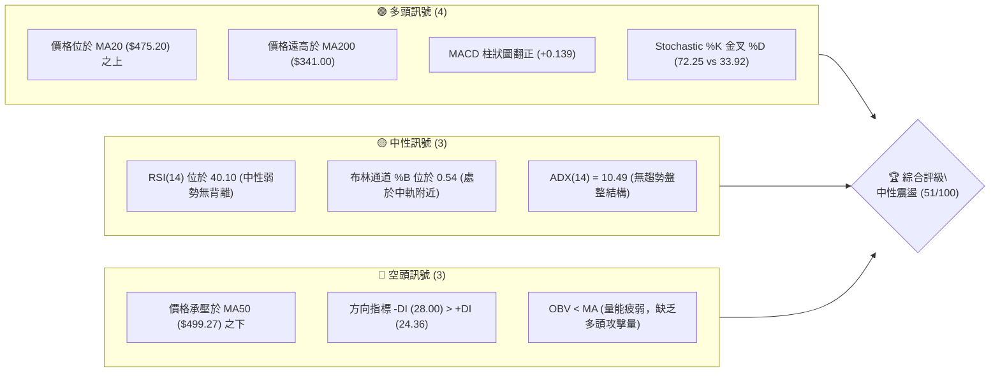
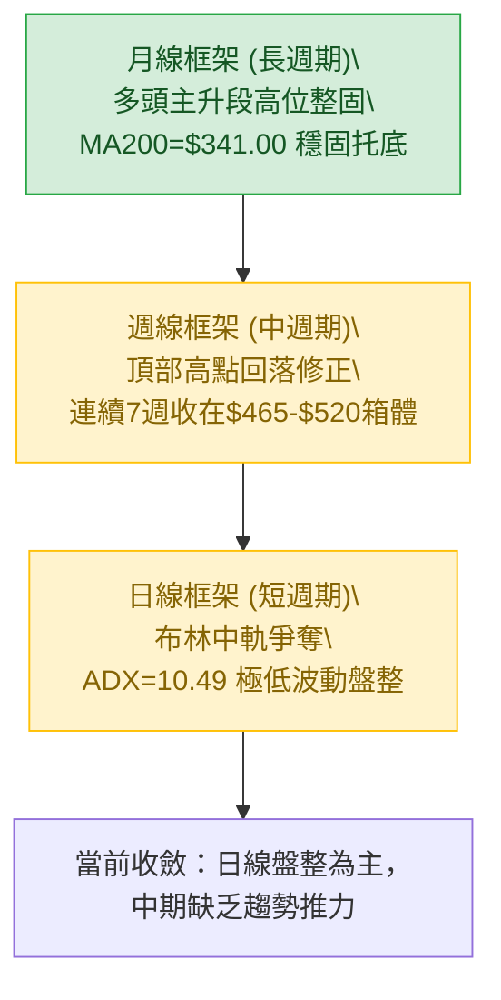
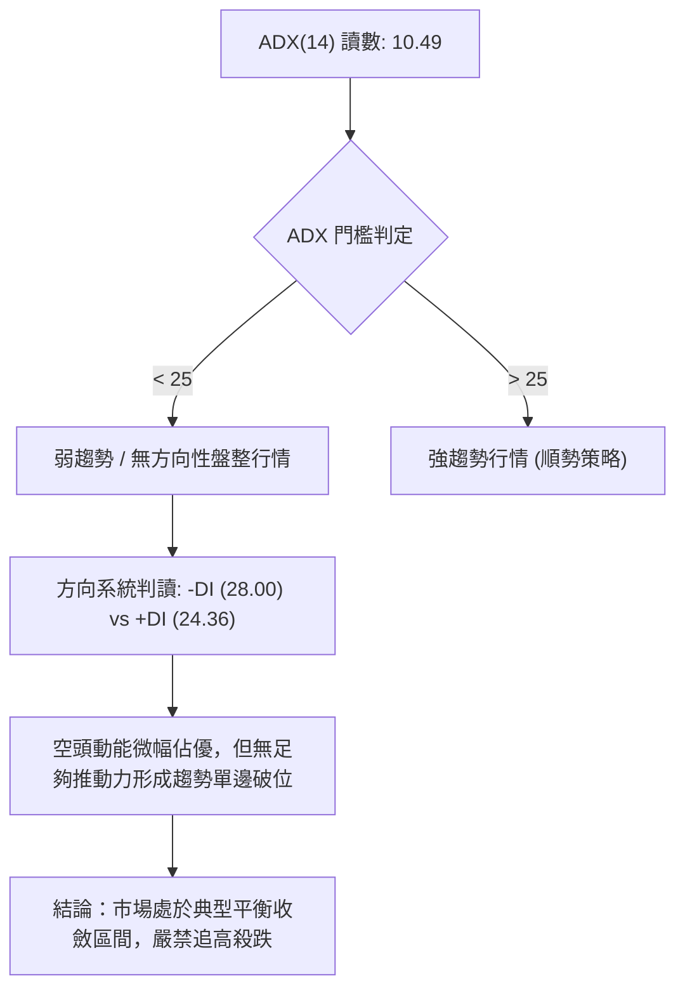
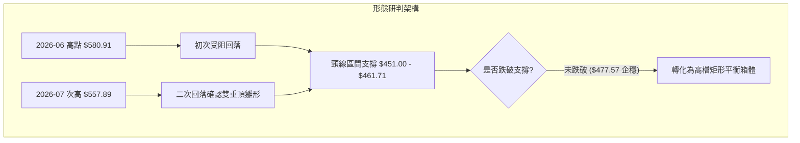
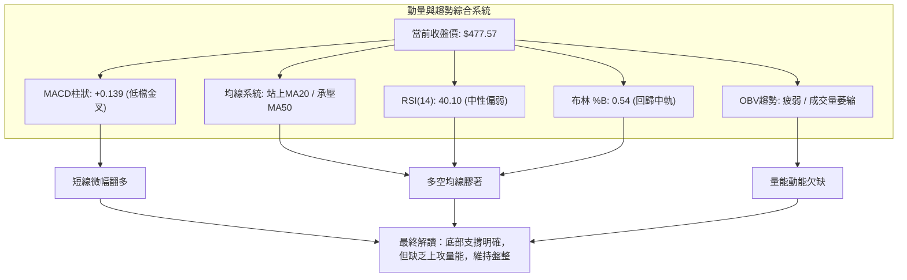
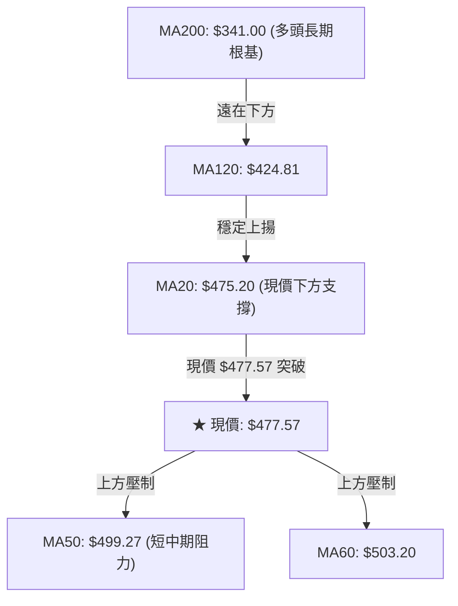
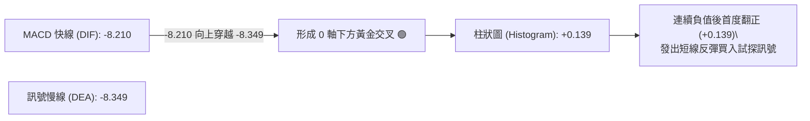
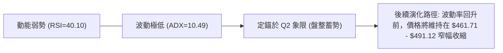
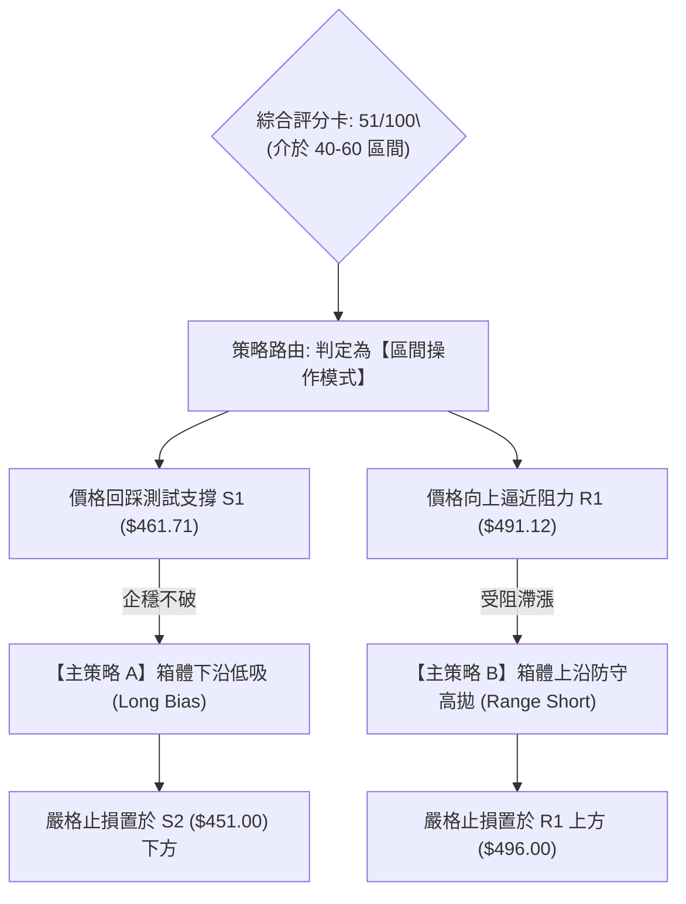
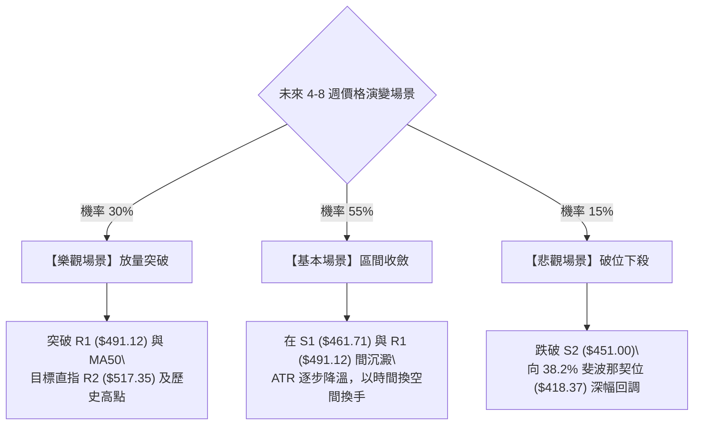

# AMD 技術分析報告

> **報告日期**：2026-09-05 ｜ **語言**：繁體中文 ｜ **數據來源**：Yahoo Finance ｜ **當前價格**：$477.57

---

## 目錄

| 章節 | 內容 |
|------|------|
| [1. 技術面概覽](#1-技術面概覽) | 訊號儀表板、核心指標、評分卡 |
| [2. 趨勢分析](#2-趨勢分析) | 多時框趨勢、長中短期走勢 |
| [3. 圖表形態分析](#3-圖表形態分析) | 形態識別、K線組合、目標價 |
| [4. 支撐與阻力](#4-支撐與阻力) | 關鍵價位、斐波那契回調 |
| [5. 技術指標深度解讀](#5-技術指標深度解讀) | MA/RSI/MACD/布林/成交量 |
| [6. 動能與波動率](#6-動能與波動率) | 動能評估、ATR、Beta |
| [7. 多時框架總結](#7-多時框架總結) | 時框架評分矩陣 |
| [8. 交易策略建議](#8-交易策略建議) | 多空策略、風險報酬比 |
| [9. 風險提示與監控](#9-風險提示與監控) | 監控指標、風險場景 |
| [📋 報告總結](#-報告總結) | 核心結論與交易執行清單 |

---

## 1. 技術面概覽

### 🎯 技術訊號儀表板



### 📊 核心指標速覽表

| 指標類別 | 指標名稱 | 當前數值 | 訊號 | 解讀 |
|:---|:---|:---|:---:|:---|
| **價格結構** | 當前收盤價 | $477.57 | 🟡 | 位於52週區間75.4%高位，自歷史高點$584.73回檔盤整 |
| **均線系統** | MA20 (短天期) | $475.20 | 🟢 | 現價站上MA20 (+0.50%)，短線取得支撐，具止跌意願 |
| **均線系統** | MA50 (中天期) | $499.27 | 🔴 | 現價受制於MA50 (-4.35%)，中期多頭結構遭遇動能壓制 |
| **均線系統** | MA200 (長天期) | $341.00 | 🟢 | 遠高於長期均線 (+40.05%)，超級大週期多頭架構未變 |
| **動能指標** | RSI(14) | 40.10 | 🟡 | 處於40-50中性偏弱區間，未觸及超賣區，無背離訊號 |
| **趨勢強度** | ADX(14) / ±DI | 10.49 / -DI 28.00 | 🔴 | ADX<25顯示無方向性盤整，空方力量-DI略佔上風 |
| **動能指標** | MACD (12,26,9) | 柱狀圖 +0.139 | 🟢 | 快線-8.210金叉慢線-8.349，低檔微弱黃金交叉 |
| **波動指標** | ATR(14) | $18.48 | 🟡 | 佔股價3.87%，單日震盪幅度可控，屬於常規波動水準 |

### 🏆 技術評分卡

```
╔══════════════════════════════════════════════════════════════════╗
║                 技術評分卡 — AMD (2026-09-05)                   ║
╠══════════════════════════════════════════════════════════════════╣
║ 趨勢強度 (ADX=10.49)      ████░░░░░░░░░░░░░░░░  20/100   🔴 弱勢 ║
║ 動能指標 (RSI/MACD)       ██████████░░░░░░░░░░  52/100   🟡 中性 ║
║ 支撐穩定度 (Fib/S1/MA20)  ██████████████░░░░░░  70/100   🟢 偏強 ║
║ 成交量配合 (OBV弱/量比)   ████████░░░░░░░░░░░░  40/100   🔴 疲弱 ║
║ 形態完整度 (箱型收斂)     ████████████░░░░░░░░  60/100   🟡 中性 ║
║ 均線排列 (短強中弱長強)   ██████████████░░░░░░  65/100   🟡 混合 ║
╠══════════════════════════════════════════════════════════════════╣
║ 綜合技術評分              ██████████░░░░░░░░░░  51/100   ⚖️ 中性 ║
║ 核心定調：高檔箱型震盪整理（$461.71 - $491.12），靜待方向突破   ║
╚══════════════════════════════════════════════════════════════════╝
```

---

## 2. 趨勢分析

### 🌐 多時框趨勢分析



### 📈 長期趨勢 — 12個月走勢圖（Unicode）

自 2025 年 9 月至 2026 年 9 月的月線收盤價走勢如下圖所示：

```
AMD 月線收盤走勢圖（2025-09 至 2026-09）
價格軸 ($)
$600 ┤                                      ● (2026-06: $580.91)
$550 ┤                                  ●
$500 ┤                              ●               ●      ● (現在 $477.57)
$450 ┤                                          ●
$400 ┤                          
$350 ┤                      ● (2026-04: $354.49)
$300 ┤                  
$250 ┤          ● (2025-10: $256.12)
$200 ┤              ●   ●       ●   ●
$150 ┤  ● (2025-09: $161.79)
     └──────┬───┬───┬───┬───┬───┬───┬───┬───┬───┬───┬───┬───►
           09  10  11  12  01  02  03  04  05  06  07  08  09 (月份)
```

**走勢特徵分析表格**：

| 週期階段 | 時間區間 | 起始至結束價 | 區間漲跌幅 | 核心形態與量能特徵 |
|:---|:---:|:---:|:---:|:---|
| **第一階段：底部突破** | 2025-09 ~ 2025-10 | $161.79 → $256.12 | +58.30% | 脫離百元長期平台，爆發式跳空上攻 |
| **第二階段：寬幅整理** | 2025-11 ~ 2026-03 | $217.53 → $203.43 | -6.48% | 在 $200.00-$236.73 間築底整固，籌碼換手 |
| **第三階段：主升暴漲** | 2026-03 ~ 2026-06 | $203.43 → $580.91 | +185.56% | 伴隨業績與AI浪潮，連拉大陽線創歷史高點$584.73 |
| **第四階段：高檔滯漲** | 2026-06 ~ 2026-09 | $580.91 → $477.57 | -17.79% | 頂部量縮回撤，在 23.6% 斐波那契位 ($481.95) 附近窄幅築台 |

### 📊 中期趨勢（週線分析）

中期走勢自 2026 年 6 月創下 $584.73 天價後進入箱型震盪。近 20 週數據顯示，週成交量由 5 月高鋒時的每週近 3 億股（2026-05-10：296,987,900 股）急劇萎縮至當前每週約 7,500 萬股（2026-09-06：75,134,600 股），量能縮減近 75%。這反映出市場追高意願減弱，同時籌碼沉澱，賣壓亦逐步耗盡。

```
週線箱型波動區間示意圖 ($451.00 - $530.13)
$530.13 ┬──────────────────────────────────────────── R3 (波段頂部阻力)
        │       ▲              ▲
$517.35 ┼───────┼──────────────┼──────────────────── R2 (箱體上沿阻力)
        │       │   ┌──────┐   │
$491.12 ┼───────┼───┤現價  ├───┼──────────────────── R1 (近期突破頸線)
$477.57 ┼───────┼───┤$477.5│───┼──────────────────── ◄ 當前收盤價位
$461.71 ┼───────┴───┴──────┴───┴──────────────────── S1 (箱體短線支撐)
        │
$451.00 ┴──────────────────────────────────────────── S2 (波段核心支撐)
```

### ⚡ 趨勢強度評估（ADX 解讀）



| 指標名稱 | 實際讀數 | 評判標準 | 狀態確認 | 戰略指導 |
|:---|:---:|:---:|:---:|:---|
| **ADX (14)** | **10.49** | < 20 極度低迷 / < 25 盤整 | 弱無趨勢 | 放棄順勢突破單，採用區間反轉高拋低吸 |
| **+DI** | **24.36** | 衡量多方趨勢推動力 | 多頭推力中等 | 多頭動能衰減，不足以單邊突破阻力 |
| **-DI** | **28.00** | 衡量空方趨勢打壓度 | 空方稍強 | -DI > +DI 表明局部偏空，但無趨勢加速度 |

---

## 3. 圖表形態分析

### 🔍 形態識別系統

在日線與週線結構中，價格在觸及 $584.73 高點後呈現雙重測試與收斂整理：



**圖表形態信心度分析表**（嚴格遵照規則 15）：

| 形態名稱 | 信心度 | 判斷依據（引用數據） | 完成度 | 目標價（附嚴謹計算式） |
|:---|:---:|:---|:---:|:---|
| **高檔收斂矩形箱體** | **78%** | 價格受制於 R2 ($517.35) 與支撐 S1 ($461.71)，近 6 週在此區間密集橫盤 | 85% | **向上突破目標**：頸線 R1 ($491.12) + 箱高 ($491.12 - $461.71 = $29.41) = **$520.53** (逼近 R2) |
| **雙重頂 (M頂潛伏)** | **42%** | 峰一 $580.91、峰二 $557.89，但頸線低點聚類 S2 ($451.00) 未破 | 30% | 訊號不足且信心度 < 50%，僅作風險防範，不主觀提前預判向下破位 |
| **均線收斂突破** | **65%** | MA5 ($464.22) 金叉 MA10 ($468.02) 並向 MA20 ($475.20) 靠攏 | 70% | 依 MA 動態推算第一阻力位指向 **$491.12 (R1)** |

### 🕯️ 重要K線形態分析（過去5週動態）

| 月份/週別 | 收盤價 | K線形態特徵 | 技術面解讀 | 訊號 |
|:---:|:---:|:---|:---|:---:|
| **2026-08-09** | $483.36 | 下影中陽線 (量 1.73億) | 探底 S1 區域後強勁買盤介入，確認 $460-$470 為強多頭防禦區 | 🟢 |
| **2026-08-16** | $514.39 | 衝高受阻上影線 (量 1.00億) | 向上測試 R2 ($517.35) 未果，短線獲利盤湧出，量能出現背離 | 🔴 |
| **2026-08-23** | $473.25 | 中陰回吐線 (量 9,251萬) | 受制於 MA50 反壓快速回跌，跌破短期均線 | 🔴 |
| **2026-08-30** | $465.58 | 低檔收斂小陰十字 (量 8,176萬) | 測試 S1 ($461.71) 獲得支撐，成交量創近期新低，空方動能竭盡 | 🟡 |
| **2026-09-06** | $477.57 | 低檔反彈小陽線 (量 7,513萬) | 站上 MA20 ($475.20)，MACD 柱狀圖翻正，形成日線級別止跌孕線組合 | 🟢 |

### 📉 ASCII 走勢形態示意圖

```
箱型震盪與突破路徑推算圖
$530.13 ┼─────────────────────────────────────── R3 (頂部高壓)
        │                      ┌── 向上假突破路徑
$517.35 ┼─────────▲────────────┼──────▲───────── R2 (箱頂阻力)
        │        / \           │     / \
$491.12 ┼───────/───\──────────┼────/───\─────── R1 (箱體中軸突破線)
$477.57 ┼──────/─────\─────●───┼───/─────\────── ◄ 現價 $477.57 (站上 MA20)
        │     /       \   / └──┴──┘       \
$461.71 ┼────/─────────▼─/─────────────────▼──── S1 (箱底防禦)
$451.00 ┼───▼────────────────────────────────── S2 (終極防守)
        └────────────────────────────────────────
```

### 🎯 形態目標價計算

以目前確立度最高之「高檔收斂矩形箱體」進行計算：
1. **箱體下邊界 (支撐)**：取自波段低點聚類 **S1 = $461.71**
2. **箱體上邊界 (阻力)**：取自波段高點聚類 **R1 = $491.12**
3. **形態振幅高度 ($H$)**：$491.12 - 461.71 = \mathbf{\$29.41}$
4. **多頭向上突破目標價**：
   - 第一目標 ($T_1$) = 頸線突破點 + 形態高度 = $491.12 + 29.41 = \mathbf{\$520.53}$（高度重合聚類阻力 **R2 = $517.35**）
   - 第二延伸目標 ($T_2$) = 直接指向近一年高點聚類 **R3 = $530.13**
5. **空頭向下跌破推算 (防守破位參考)**：
   - 若 $S1 = $461.71 跌破，等幅向下推算 = $461.71 - 29.41 = \mathbf{\$432.30}$（高度吻合聚類支撐 **S3 = $437.23**）

---

## 4. 支撐與阻力

### 🗺️ 關鍵價位分布圖（Unicode）

```
AMD 關鍵價位空間分布圖 (嚴格引用 OHLCV 計算數據)
══════════════════════════════════════════════════════════════════
$584.73 ║████████████████████████████████████████║ 52W 歷史高點 (0.0% Fib)
$530.13 ║████████████████████████████            ║ 強阻力 R3 (+11.01%)
$517.35 ║████████████████████                    ║ 波段阻力 R2 (+8.33%)
$491.12 ║██████████████                          ║ 關鍵頸線阻力 R1 (+2.84%)
$481.95 ╟────────────────────────────────────────╢ 斐波那契 23.6% 回調位
$477.57 ╠════════════════════════════════════════╣ ◄ 當前市價 ($477.57)
$461.71 ║▓▓▓▓▓▓▓▓▓▓▓▓▓▓                          ║ 近期核心支撐 S1 (-3.32%)
$451.00 ║▓▓▓▓▓▓▓▓▓▓▓▓▓▓▓▓▓▓                      ║ 波段強支撐 S2 (-5.56%)
$437.23 ║▓▓▓▓▓▓▓▓▓▓▓▓▓▓▓▓▓▓▓▓▓▓                  ║ 長期支撐 S3 (-8.45%)
$418.37 ╟────────────────────────────────────────╢ 斐波那契 38.2% 回調位
$341.00 ║████████████████████████████████        ║ 牛熊分水嶺 MA200
══════════════════════════════════════════════════════════════════
```

### 🚧 阻力位分析表

| 阻力級別 | 引用價位 | 形成技術原因 | 突破難度 | 技術重要性 |
|:---|:---:|:---|:---:|:---:|
| **R1 (關鍵阻力)** | **$491.12** | 近一年波段高點聚類、逼近 MA50 ($499.27) 心理壓制區 | 🟡 中等 | **極高**。日線轉強分水嶺，突破方能開啟多頭動能 |
| **R2 (波段阻力)** | **$517.35** | 近期週線反彈高點聚類、逼近布林通道上軌 ($505.22) | 🔴 較高 | **高**。箱體上沿，大量套牢籌碼解套區 |
| **R3 (強阻力)** | **$530.13** | 2026-06 下跌起點密集密集成交區聚類 | 🔴 極高 | **中**。波段多空轉換樞紐，需 2 億股以上週成交量方能攻克 |

### 🛡️ 支撐位分析表

| 支撐級別 | 引用價位 | 形成技術原因 | 守住機率 | 技術重要性 |
|:---|:---:|:---|:---:|:---:|
| **S1 (近期支撐)** | **$461.71** | 近一年波段低點聚類、近兩週小陽線防守低點 | 🟢 70% | **極高**。當前多頭短期防線，跌破則箱體平衡瓦解 |
| **S2 (強支撐)** | **$451.00** | 波段低點聚類、接近日線布林下軌 ($445.18) | 🟢 80% | **極高**。中期多空生命線，下破將考驗 38.2% 斐波那契 |
| **S3 (長期支撐)** | **$437.23** | 2026年4-5月主升段換手中軸支撐位聚類 | 🟢 90% | **高**。強支撐防線，跌破宣告本輪大牛市中級休整 |

### 📐 斐波那契回調位分析

依據 52 週波動區間（**最低點 $149.22 → 最高點 $584.73**，總振幅 $435.51）之精確計算：

```
斐波那契回調位位階
 0.0% ─── $584.73 (52週高點)
          │
23.6% ─── $481.95 ◄── 現價 $477.57 緊貼於此回調位下方
          │
38.2% ─── $418.37
          │
50.0% ─── $366.97
          │
61.8% ─── $315.58
          │
100.0% ── $149.22 (52週低點)
```

- **位置解讀**：現價 **$477.57** 正好落在 **0.0% ($584.73)** 與 **23.6% ($481.95)** 的極淺回調區間底部邊界，距離 23.6% 僅差 **$4.38 (-0.91%)**。
- **技術意義**：在經歷了逾 185% 的主升浪後，回撤甚至未有效摜破 23.6% ($481.95) 達到 38.2% ($418.37)，說明強勢持籌者惜售，該回調屬於強勢強盛的「淺回撤橫盤整理」型態。

---

## 5. 技術指標深度解讀

### 🎛️ 指標訊號總覽



### 📈 移動平均線排列分析



| 均線名稱 | 數值 | 現價差距 | 狀態 | 短期趨勢意義 |
|:---|:---:|:---:|:---:|:---|
| **MA 5** | $464.22 | +$13.35 (+2.87%) | 🟢 金叉上揚 | 超短線買盤活躍，推動價格自底部回升 |
| **MA 10** | $468.02 | +$9.55 (+2.04%) | 🟢 拐頭向上 | 短線空方打壓受阻，轉為多方防禦 |
| **MA 20 (布林中軌)** | $475.20 | +$2.37 (+0.50%) | 🟢 站上支撐 | 成功收復月線，打破近兩週連跌格局 |
| **MA 50** | $499.27 | -$21.70 (-4.35%) | 🔴 下行反壓 | 中期防守壓制線，500大關前多頭阻力重重 |
| **MA 60** | $503.20 | -$25.63 (-5.09%) | 🔴 走平下彎 | 與 MA50 形成雙重密集阻力帶 |
| **MA 200** | $341.00 | +$136.57 (+40.05%)| 🟢 強勢多頭 | 長期牛市基石，未破此線前長線無做空理由 |

### 📉 RSI(14) 分析

- **當前讀數**：**40.10**
- **強度條**：`████████░░░░░░░░░░░░` 40.1% 🟡 中性弱勢區
- **區間評估**：既未跌入超賣區 (<30)，亦遠離超買區 (>70)。近幾週數值自 2026-04 高點的極度超買 97.4 持續回落降溫，目前已完全消除過熱情緒。
- **背離判斷**：
  - **頂背離**：無。前期高點回落已完全反映。
  - **底背離**：無。價格在 8 月末測試 $465.58，RSI 為 48.7；最新價格回升至 $477.57，RSI 降至 40.10，呈現微弱「指標鈍化」，但未構成標準底背離形態。結論為**無明顯背離，維持中性指標特徵**。

### 📊 MACD(12/26/9) 訊號解讀



- **深度分析**：MACD 指標在零軸下方低檔運行，屬於弱勢反彈結構。但柱狀圖在連續數週負值放大（最低曾達 -9.004）後，於本週首度收斂並翻正為 **+0.139**，顯示空頭下行動能完全衰竭，短期多頭動能初現萌芽。

### 📦 布林通道分析 (Bollinger Bands)

```
布林通道當前位置示意圖
$505.22 ┬─────────────────────────────────────────── 上軌 (+2.0 SD)
        │
        │
$477.57 ┼───────────────● 現價 ($477.57, %B = 0.54)
$475.20 ┼─────────────────────────────────────────── 中軌 (MA20)
        │
        │
$445.18 ┴─────────────────────────────────────────── 下軌 (-2.0 SD)
```

- **通道參數**：週期 20，偏差 2.0。上軌 **$505.22**、中軌 **$475.20**、下軌 **$445.18**，帶寬 (Bandwidth) 為 12.63%，通道持續收斂中。
- **定位 (%B)**：現價位於 **0.54**，略高於中軌 (0.50)，表明股價已從下半通道擺脫弱勢區，重回中性偏強的上半通道。此處中軌 **$475.20** 將成為下週動態第一道回踩測試線。

### 💹 成交量分析（量價配合度）

1. **成交量對比**：
   - 最新成交量：**19,651,900 股**
   - 20日均量：**17,504,245 股**（量比：**1.12x**，微幅放量）
   - 50日均量：**25,044,506 股**（較中期均量萎縮 -21.5%）
2. **OBV (能量潮) 解讀**：
   - 目前數據明確顯示：`OBV < MA → 量能疲弱`。
   - 自 5 月主升浪結束以來，OBV 均線持續下行，顯示資金處於淨流出後的沉寂期。雖然短線有金叉反彈，但由於量能未達 50 日均量基準線，缺乏增量資金推動的突破多為虛擬突破，需提防衝高回落。

---

## 6. 動能與波動率

### ⚡ 動能評估四象限

| 象限區間 | 動能強度 (RSI/MACD) | 波動率水準 (ATR/ADX) | 當前標的位置 | 策略含義與操作指引 |
|:---:|:---:|:---:|:---:|:---|
| **第一象限 (Q1)** | 強動能 (RSI>60) | 低波動 (ATR小/ADX<25) | — | 穩定單邊蓄勢，最佳右側加碼點 |
| **第二象限 (Q2)** | **弱動能 (RSI 40.1)** | **低波動 (ADX 10.49)** | **✓ AMD 位於此象限** | **區間沉寂觀望期，波動率受到擠壓，適合網格震盪或等待突破** |
| **第三象限 (Q3)** | 強動能 (突破放量) | 高波動 (ATR激增) | — | 單邊趨勢狂熱爆發，注意利潤奔跑 |
| **第四象限 (Q4)** | 弱動能 (破位殺跌) | 高波動 (恐慌拋售) | — | 恐慌主跌浪，嚴禁抄底進場 |



### 📊 ATR 波動率分析

- **ATR(14) 讀數**：**$18.48**
- **價格佔比**：$18.48 / $477.57 = **3.87%**
- **風控指引**：
  - **短線交易止損距離**：一般設定為 **1.0 × ATR = $18.48**。若在現價 $477.57 建立多頭部位，動態止損點應設於 $477.57 - $18.48 = **$459.09**（略低於支撐 S1 $461.71，具備結構保護意義）。
  - **波段交易防守距離**：設定為 **1.5 × ATR = $27.72**，對應價格防守位為 **$449.85**（高度吻合 S2 $451.00）。

### 📐 Beta 與市場相關性

- **Beta 係數**：**2.476**（高彈性/高系統性風險曝險）
- **解讀**：AMD 屬於典型高 Beta 科技權重股。當半導體板塊（SOX）或標普500上漲 1% 時，理論上 AMD 平均變動 2.476%；反之大盤承壓時亦面臨加倍回撤。
- **當前矛盾點**：儘管歷史 Beta 高達 2.476，但近期 ADX 僅 10.49，反映個股正處於大漲後的「波動率擠壓期（Volatility Squeeze）」。當這種低波動狀態結束時，常伴隨 Beta 特性復甦的大幅單邊擴張。

---

## 7. 多時框架總結

### 📋 時框架評分表

| 時框架 | 趨勢方向 | 動能狀態 | 均線排列 | 關鍵形態 | 綜合評分 | 操作建議 |
|:---|:---:|:---:|:---:|:---:|:---:|:---|
| **長期 (月線)** | 🟢 多頭主升 | 🟡 動能修復 | 🟢 均線多頭 (遠高MA200) | 高檔橫盤旗形 | **82/100** | 長線多單底倉堅決續抱 |
| **中期 (週線)** | 🟡 橫向整固 | 🔴 動能回調 | 🟡 混合排列 (破MA50) | $460-$530 箱體 | **48/100** | 不加碼，以箱體上下軌防守 |
| **短期 (日線)** | 🟢 觸底弱彈 | 🟢 柱狀翻正 | 🟢 站上短均 (MA20) | 收斂小雙底築台 | **56/100** | 區間下沿低吸，短打高拋 |

### 🔲 綜合訊號矩陣

```
時框一致性分析矩陣
時框層級       趨勢   均線   動能   量能   形態   層級定性
═════════════════════════════════════════════════════════
長期 (月線)     🟢     🟢     🟡     🔴     🟢    大週期向上趨勢完好
中期 (週線)     🟡     🟡     🔴     🔴     🟡    中級回調尚未結束
短期 (日線)     🟢     🟢     🟢     🟡     🟢    短線超賣引發反彈
═════════════════════════════════════════════════════════
多時框收斂狀態：日線短多 衝突於 週線中空，受制於長期大牛市框架
```

### ⚖️ 多時框收斂結論（嚴格遵照規則 14）

1. **行情定性判定**：
   - 當前 **ADX(14) 讀數為 10.49**，遠低於 25 的趨勢門檻。
   - 根據多時框收斂規則：**「盤整行情（ADX<25）：以日線布林通道上下軌為主要交易區間，不依賴單邊趨勢解讀」**。
2. **時框主導取捨**：
   - 儘管月線 MA200 呈現大牛市，但短期動能無法支撐立即性主升浪；日線雖然 MACD 金叉，但上方 MA50 ($499.27) 形成實質中期壓制。因此，短線反彈將受到箱體頂部嚴密限制。
3. **唯一收斂結論**：
   - **當前定調為：【中性觀望／高檔箱體震盪】**（綜合評分 **51/100**）。
   - 交易核心邏輯為圍繞 **$461.71 (S1)** 至 **$491.12 (R1)** 的區間進行反轉操作，絕不追高。

---

## 8. 交易策略建議

### 🗺️ 策略決策流程圖



### 🧭 策略路由（依評分卡分流）

> **當前主策略方向 = 區間平衡震盪操作（依評分 51/100，處於 40–60 之中性區間，以布林通道與關鍵支撐阻力為交易界限）**

### 🎯 價格情境階梯（Price Scenarios）

價位完全取自第 4 章波段聚類與斐波那契點位：

| 觸發條件 | 下一目標 | 後續延伸 | 情境技術含義 |
|:---|:---:|:---:|:---|
| **有效放量突破 R1 ($491.12)** | **R2 ($517.35)** | **R3 ($530.13)** | 短線轉強，重新挑戰週線箱頂與前期解套密集成交區 |
| **維持在 $461.71 至 $491.12 震盪** | **MA20 ($475.20)** | **中軌整固** | 處於無趨勢平衡，多空籌碼在此進行換手沉澱 |
| **放量實體跌破 S1 ($461.71)** | **S2 ($451.00)** | **S3 ($437.23)** | 中期整理轉弱，回撤測試布林下軌及 38.2% 斐波那契防線 |

### 📊 情境機率分佈

| 價格情境 | 發生機率 | 主要技術依據 |
|:---|:---:|:---|
| **情境一：區間震盪整理** | **55%** | ADX 僅 10.49 顯示無趨勢；OBV 疲弱不足以支撐單邊突破；日線布林帶寬持續收斂 |
| **情境二：震盪反彈測試阻力** | **30%** | MACD 柱狀圖翻正 (+0.139)；Stochastic 金叉向上；現價站穩 MA20 短期走強 |
| **情境三：跌破支撐向下回踩** | **15%** | -DI (28.00) 高於 +DI；MA50 與 MA60 在上方形成空頭均線阻力壓迫 |

### 🟢 主策略詳情（區間高拋低吸）

本報告根據 **51分中性偏震盪** 定調，擬定兩套嚴格依據關鍵價位執行的邊界策略：

| 策略要素 | 策略 A（下沿回踩低吸 — 推薦） | 策略 B（上沿假突破高拋 — 次選） |
|:---|:---|:---|
| **交易邏輯** | 箱底支撐強韌，回測未破時順日線 MACD 金叉反彈 | 承壓於 MA50 與 R1 聚類阻力區，博弈箱體回調 |
| **進場條件** | 股價回撤至 S1 企穩，日線出現下影線或小陽線 | 股價衝高至 R1 阻力位受阻，出現上影滯漲陰線 |
| **進場價格** | **$463.50**（位於 S1 $461.71 上方買入） | **$489.50**（位於 R1 $491.12 緊貼處放空） |
| **目標價 T1** | **$491.12**（第 4 章關鍵阻力 R1） | **$465.00**（逼近 S1 支撐區） |
| **目標價 T2** | **$517.35**（第 4 章關鍵阻力 R2） | **$451.00**（第 4 章關鍵支撐 S2） |
| **止損價格** | **$449.50**（跌破 S2 $451.00 止損，虧損 $14.00）| **$496.50**（突破 R1 且站上 MA50 止損，虧損 $7.00）|
| **風險報酬比** | **1 : 1.97**（至 T1 為 1:1.97；至 T2 為 1:3.84） | **1 : 3.50**（以 T1 計算：獲利 $24.50 / 風險 $7.00） |
| **成功機率** | **65%** | **55%** |
| **建議倉位** | **15% 總資金**（低波動期宜控管倉位） | **10% 總資金**（逆長期趨勢需輕倉） |

### 🔴 反向風險觸發點（對沖與止損提示）

- **多頭全面棄守點**：若日線收盤價跌破 **$451.00 (S2)**，代表雙頂形態隱患爆發，矩形箱體破位，所有短多策略必須無條件停損，並啟動保護性賣權（Put）避險。
- **空頭全面認賠點**：若日線以大陽線有效站上 **$499.27 (MA50)** 並突破 **$517.35 (R2)**，配合成交量放大至 2,500 萬股以上，代表新一輪主升浪重啟，空單必須立即平倉出局。

### ⭐ 整體訊號強度評星

```
╔═════════════════════════════════════════════════════╗
║ 做多訊號強度：  ★★★☆☆  (3.0 / 5 星 — 僅限區間短多) ║
║ 做空訊號強度：  ★★☆☆☆  (2.0 / 5 星 — 受制長線多頭) ║
║ 整體訊號可信度：★★★☆☆  (3.5 / 5 星 — 盤整期雜訊多) ║
╚═════════════════════════════════════════════════════╝
```

---

## 9. 風險提示與監控

### ✅ 關鍵監控指標 Checklist

```
╔══════════════════════════════════════════════════════════════════╗
║                   核心技術指標每日監控清單 (Checklist)           ║
╠══════════════════════════════════════════════════════════════════╣
║ [ ] 價位確認：每日收盤價是否維持在 MA20 ($475.20) 之上？         ║
║ [ ] 阻力測試：衝擊 R1 ($491.12) 時，成交量是否 > 25,000,000 股？ ║
║ [ ] 動能追蹤：MACD 柱狀圖是否能持續保持在正值區間 (>0)？        ║
║ [ ] 震盪強度：ADX(14) 是否向上突破 20，釋放單邊趨勢重啟訊號？    ║
║ [ ] 支撐防守：盤中最低價是否跌破近期防守底線 S1 ($461.71)？     ║
║ [ ] 資金流向：OBV 是否止跌回升並金叉其移動平均線？               ║
╚══════════════════════════════════════════════════════════════════╝
```

### ⚠️ 風險場景分析



### 🛡️ 風險管理重要提醒

1. **高 Beta 波動懲罰風險**：
   AMD 的 Beta 值高達 **2.476**。當前市場處於低波動沉寂期（ATR $18.48，ADX 10.49），極易使投資人放鬆警惕。歷史經驗表明，低波動收斂後往往緊接著劇烈的方向性脈衝，一旦方向做反，高 Beta 將導致保證金快速虧損。
2. **量能不足帶來的「假突破」風險**：
   當前 20 日均量僅 1,750 萬股，遠低於 50 日均量的 2,504 萬股。在成交量顯著放大前，任何對 R1 ($491.12) 或 R2 ($517.35) 的突刺，都有極高機率演變成「誘多射擊之星」後迅速回落，切忌追高。
3. **倉位管理法則**：
   在 ADX 低於 25 的盤整市況中，總持倉量不宜超過常規水平的 **30%-40%**。單筆交易最大虧損風險應嚴格控制在總投資組合淨值的 **1.0%** 以內。

---

## 📋 報告總結

```
╔══════════════════════════════════════════════════════════════════╗
║                    AMD 技術分析報告總結儀表板                    ║
╠══════════════════════════════════════════════════════════════════╣
║ 報告日期：2026-09-05                                            ║
║ 當前收盤價：$477.57                                              ║
║ 綜合技術評級：⚖️ 中性觀望 (評分 51 / 100) — 高檔箱體震盪整理      ║
╠══════════════════════════════════════════════════════════════════╣
║ 趨勢結構診斷：                                                   ║
║ ├─ 長期趨勢 (月線)：🟢 強烈看多 (站穩 MA200，大牛市架構完好)    ║
║ ├─ 中期趨勢 (週線)：🟡 中性震盪 (箱體盤整，受制於 MA50 $499.27) ║
║ └─ 短期趨勢 (日線)：🟢 弱勢反彈 (站上 MA20，MACD 柱狀圖翻正)    ║
╠══════════════════════════════════════════════════════════════════╣
║ 核心關鍵價位錨定：                                               ║
║ ├─ 第一阻力位 (R1)：$491.12  (箱體上沿突破點，短線轉強訊號)     ║
║ ├─ 第二阻力位 (R2)：$517.35  (波段強阻力，布林上軌附近)         ║
║ ├─ 第一支撐位 (S1)：$461.71  (箱底防線，短線多頭生命線)         ║
║ ├─ 第二支撐位 (S2)：$451.00  (波段防守點，破位多頭停損)         ║
║ └─ 分析師共識均價：$613.84  (長線目標，較現價具備 +28.5% 溢價) ║
╠══════════════════════════════════════════════════════════════════╣
║ 最優交易執行策略：                                               ║
║ 1. 🥇 最佳機會：回踩 $463.50 (近S1) 建立區間多單，止損設 $449.50║
║ 2. 🥈 次選機會：衝高至 $489.50 (近R1) 遇阻開空，目標看 $465.00   ║
║ 3. 🥉 保守選擇：空倉觀望，靜待 ADX>20 且突破 $491.12 後再右側順勢║
╚══════════════════════════════════════════════════════════════════╝
```

---

> ⚠️ **免責聲明**：本報告為技術分析研究，所有數據及支撐阻力推算均嚴格基於提供之歷史市場資訊。本報告**僅供研究與學術參考**，**不構成任何要約、推薦或投資建議**。金融市場具有高度風險，交易決策應由投資人獨立評估並自負盈虧。

---
*報告生成時間：2026-09-05 ｜ 數據來源：Yahoo Finance ｜ 分析框架：多時框技術分析模型*