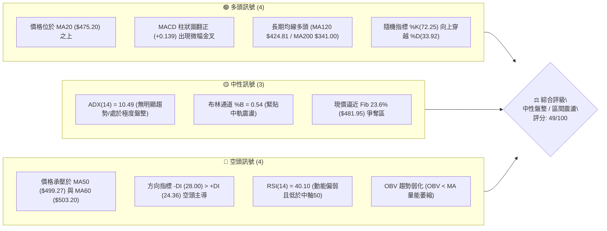
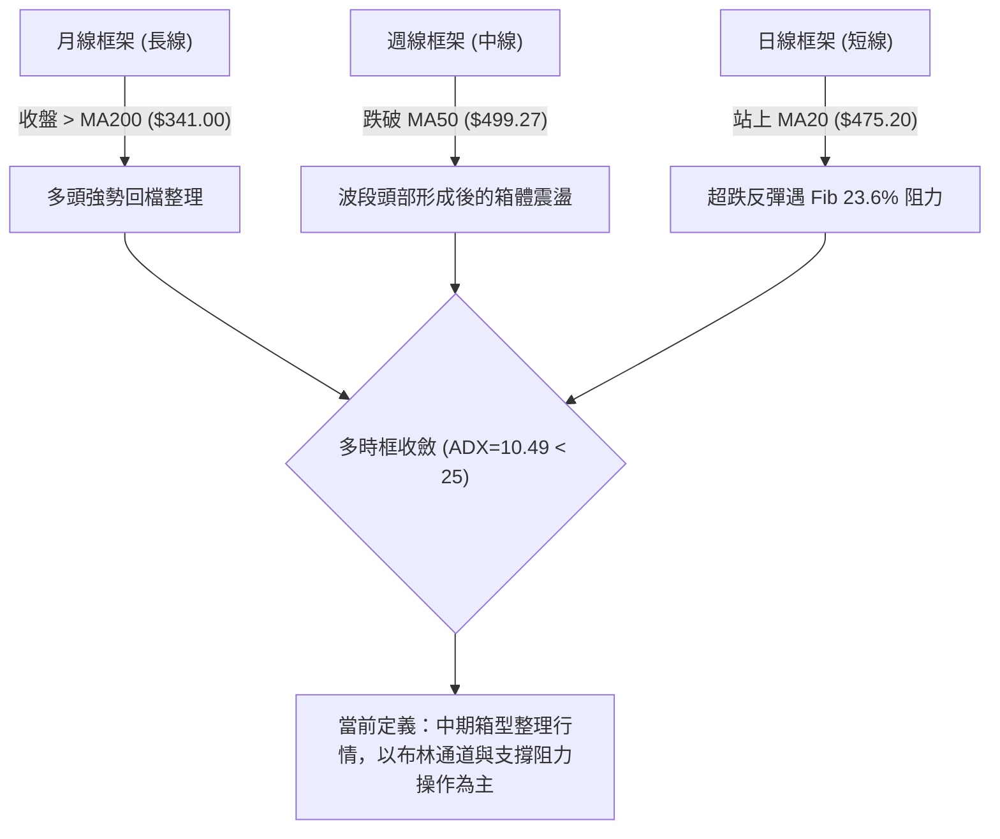
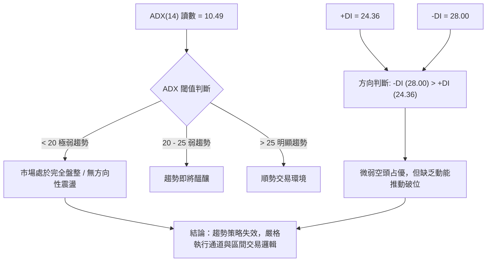
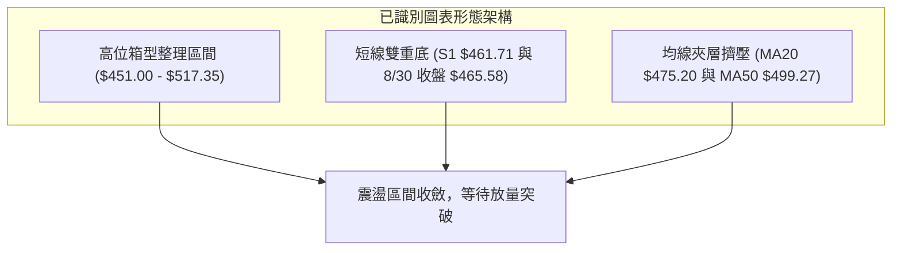
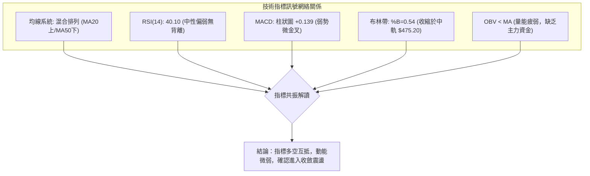
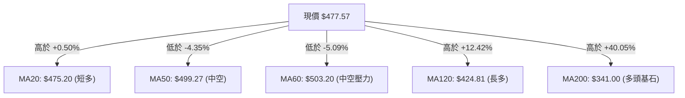
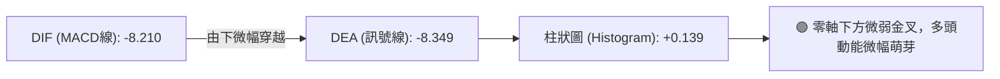
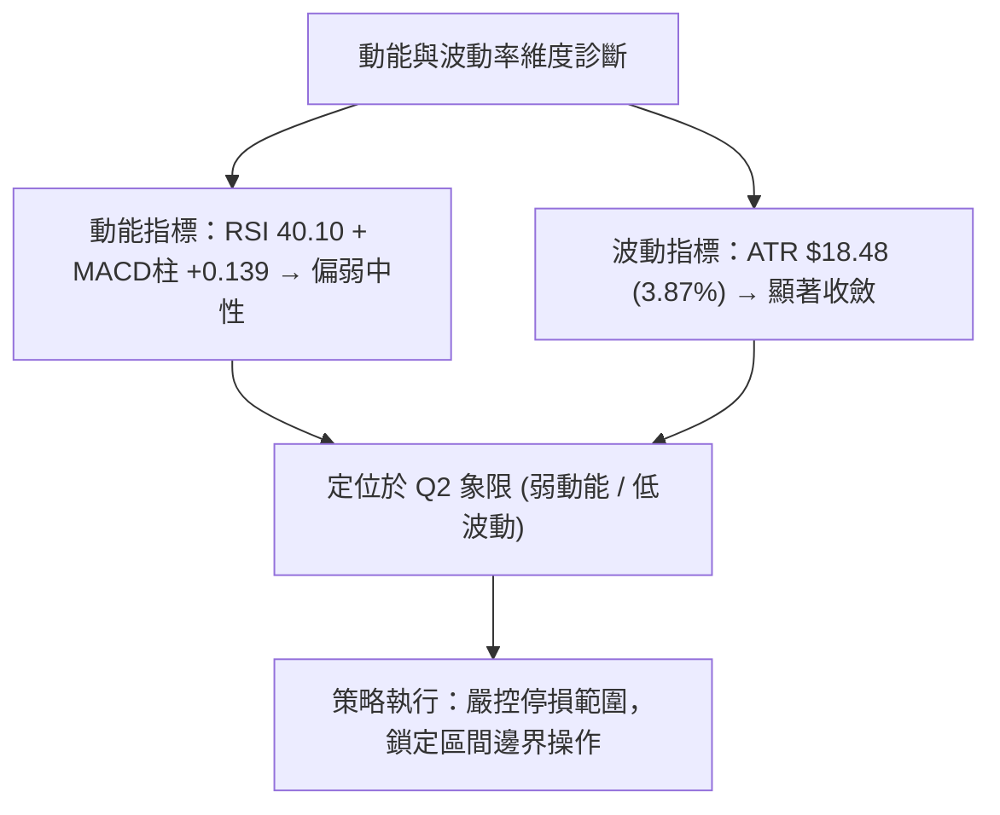
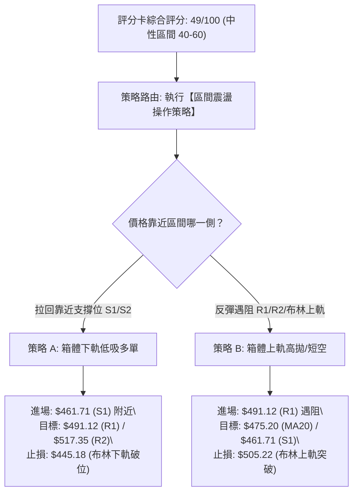
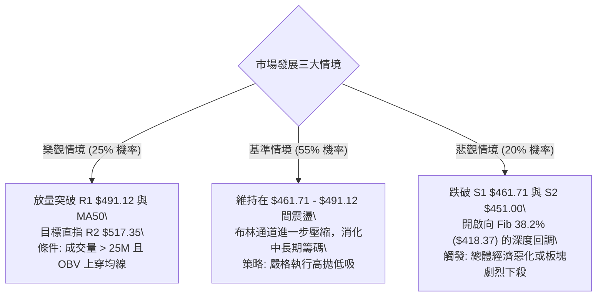

# AMD 技術分析報告

> **報告日期**：2026-09-07 ｜ **語言**：繁體中文 ｜ **數據來源**：Yahoo Finance ｜ **當前價格**：$477.57

---

## 目錄

| 章節 | 內容 |
|------|------|
| [1. 技術面概覽](#1-技術面概覽) | 訊號儀表板、核心指標、評分卡 |
| [2. 趨勢分析](#2-趨勢分析) | 多時框趨勢、長中短期走勢、ADX解讀 |
| [3. 圖表形態分析](#3-圖表形態分析) | 形態識別、K線組合、目標價推算 |
| [4. 支撐與阻力](#4-支撐與阻力) | 關鍵價位分佈、斐波那契回調結構 |
| [5. 技術指標深度解讀](#5-技術指標深度解讀) | 均線系統、RSI、MACD、布林通道、量價 |
| [6. 動能與波動率](#6-動能與波動率) | 動能四象限、ATR波動率、Beta關聯性 |
| [7. 多時框架總結](#7-多時框架總結) | 多時框矩陣、規則收斂結論 |
| [8. 交易策略建議](#8-交易策略建議) | 策略路由、情境階梯、主策略與風控點 |
| [9. 風險提示與監控](#9-風險提示與監控) | 監控清單、情境模擬、倉位管理 |

---

## 1. 技術面概覽

### 🎯 技術訊號儀表板



### 📊 核心指標速覽表

| 指標類別 | 指標名稱 | 當前數值 | 訊號 | 解讀 |
|----------|----------|----------|------|------|
| **價格** | 當前價格 | $477.57 | 🟡 | 位於52週區間 75.4% 位置，受阻於 $480 關卡 |
| **均線** | MA20 | $475.20 | 🟢 | 價格在MA20上方 (+0.50%)，短線獲得布林中軌支撐 |
| **均線** | MA50 | $499.27 | 🔴 | 價格在MA50下方 (-4.35%)，中期均線形成上方高壓帶 |
| **均線** | MA200 | $341.00 | 🟢 | 價格遠高於MA200 (+40.05%)，長線牛市格局未破 |
| **動能** | RSI(14) | 40.10 | 🟡 | 數值落於 30–70 中性偏弱區間，未見超賣或顯著背離 |
| **動能** | MACD | -8.210 | 🟢 | 快線微幅上穿慢線 (-8.349)，柱狀圖轉正 (+0.139) |
| **波動** | ATR(14) | $18.48 | 🟡 | 佔價格 3.87%，波幅收斂，符合盤整期特徵 |

### 🏆 技術評分卡

```
╔══════════════════════════════════════════════════════════════╗
║                技術評分卡 — AMD (2026-09-07)                 ║
╠══════════════════════════════════════════════════════════════╣
║ 趨勢強度 (ADX/DI)   ██████░░░░░░░░░░░░░░  30/100  🔴 弱勢盤整 ║
║ 動能指標 (RSI/MACD) ██████████░░░░░░░░░░  50/100  🟡 弱勢修復 ║
║ 支撐穩定度 (S1-S3)  ████████████░░░░░░░░  60/100  🟢 底層支撐 ║
║ 成交量配合 (OBV/VOL)████████░░░░░░░░░░░░  40/100  🔴 量能疲弱 ║
║ 形態完整度 (區間)   ███████████░░░░░░░░░  55/100  🟡 箱型整理 ║
║ 均線排列 (混亂)     ████████████░░░░░░░░  60/100  🟡 長多中空 ║
╠══════════════════════════════════════════════════════════════╣
║ 綜合評分            ██████████░░░░░░░░░░  49/100  ⚖️ 中性觀望 ║
╚══════════════════════════════════════════════════════════════╝
```

---

## 2. 趨勢分析

### 🌐 多時框趨勢分析



### 📈 長期趨勢 — 12個月走勢圖（Unicode）

```
AMD 月線走勢圖（過去12個月：2025-10 至 2026-09）
價格軸 ($)
$584.73 ┤                                      ● (2026-06 頂部 $580.91)
$516.10 ┤                                ●
$477.57 ┤                                      ▲━━━━━● $477.57 (現價)
$354.49 ┤                          ●
$256.12 ┤ ● (2025-10)
$214.16 ┤       ●     ●
$200.21 ┤                   ●     ● (2026-02/03 築底)
         └──────────────────────────────────────────────────────────
           M1    M2    M3   M4    M5    M6   M7    M8    M9   M10   M11  M12
          (10)  (11)  (12) (01)  (02)  (03) (04)  (05)  (06)  (07)  (08) (09)
```

**走勢特徵分析表格**：

| 階段 | 時間區間 | 起止價格 | 漲跌幅 | 走勢結構與特徵解讀 |
|------|----------|----------|--------|--------------------|
| 第一階段：平台整理 | 2025-10 至 2026-03 | $256.12 → $203.43 | -20.57% | 自 $256 回調至 $200 關卡獲得支撐，完成圓弧底整理 |
| 第二階段：主升浪狂飆 | 2026-03 至 2026-06 | $203.43 → $580.91 | +185.56% | 伴隨業績與AI浪潮暴量突破，創下52週高點 $584.73 |
| 第三階段：高位獲利了結 | 2026-06 至 2026-08 | $580.91 → $470.72 | -18.97% | 連續三個月收陰回吐，於 Fib 23.6% ($481.95) 附近尋求支撐 |
| 第四階段：縮量築底修復 | 2026-08 至 2026-09 | $470.72 → $477.57 | +1.46% | 波動率顯著收窄，ATR下降，轉入 $460–$500 區間打底 |

### 📊 中期趨勢（週線分析）

中期走勢自2026年6月創出歷史天價後，週線呈現「鋸齒狀高階震盪平台」：

```
中期週線震盪結構示意圖：
阻力帶  $530.13 ──┬── [R3 波段密集反彈高點]
       $517.35 ────┼── [R2 週線密集頂部區]
       $491.12 ──────┼── [R1 短線反彈頸線 / MA50 下方]
─────────────────────┼─────────────────────────────────────────────
現價   $477.57 ◄─────┴── 位於 $461.71 ~ $491.12 核心微型區間內
───────────────────────────────────────────────────────────────────
支撐帶  $461.71 ──────┬── [S1 近期四週低點支撐]
       $451.00 ────┼── [S2 強力結構支撐位]
       $437.23 ──┴── [S3 近期回調極限低點]
```

### ⚡ 趨勢強度評估（ADX 解讀）



| 指標名稱 | 數值 | 門檻標準 | 狀態定義 | 交易意涵 |
|----------|------|----------|----------|----------|
| **ADX(14)** | 10.49 | < 25 (弱趨勢) | 處於極度低迷的無趨勢狀態 | 嚴禁追高殺跌，以高拋低吸為主 |
| **+DI** | 24.36 | — | 多方能量暫居次席 | 多方無力推動單邊突破 |
| **-DI** | 28.00 | — | 空方能量略高於多方 | 盤跌尋底，但未形成單邊下殺 |

---

## 3. 圖表形態分析

### 🔍 形態識別系統



**形態信心度表格**：

| 形態 | 信心度 | 判斷依據（引用數據） | 完成度 | 目標價（附計算式） |
|------|--------|----------------------|--------|--------------------|
| **高位箱型整理** | 75% | 頂部位於 R2 $517.35，底部位於 S2 $451.00，在此區間內反覆拉鋸超過8週 | 70% | 向上破位目標：$517.35 + ($517.35 - $451.00) = $583.70（直逼 52W 高點 $584.73） |
| **短線雙重底 (W底)** | 55% | 左底 2026-08-30 收盤 $465.58，右底 8月低點支撐 S1 $461.71，現價突破 MA20 | 50% | 頸線 R1 $491.12；目標價 = $491.12 + ($491.12 - $461.71) = $520.53 |
| **頭肩頂形態** | 35% | 訊號不足，僅做指標型解讀。雖有高點回落，但頸線尚未跌破 S2/S3，信心度未達標準 | 20% | 數據不足以確立形態，不予推算 |

### 🕯️ 重要K線形態分析

| 月份/週期 | 收盤價 | K線形態 | 解讀 | 訊號 |
|-----------|--------|---------|------|------|
| **2026-06** | $580.91 | 長上影線高位避雷針 | 觸及 52W 高點 $584.73 後遭遇獲利了結拋壓 | 🔴 強烈見頂 |
| **2026-07** | $476.15 | 大陰線破位回調 | 跌破 MA50 均線，多頭獲利盤大量湧出 | 🔴 趨勢轉弱 |
| **2026-08** | $470.72 | 帶下影線十字星縮量 | 跌勢在 S1 $461.71 前放緩，空方下打無力 | 🟡 止跌企穩 |
| **2026-09 (最新)**| $477.57 | 小陽線站上 MA20 | 重新站上短天期均線，柱狀圖微翻紅 | 🟢 短線修復 |

### 📉 ASCII 走勢形態示意圖

```
高位箱型整理形態（Box Consolidation）示意：
$517.35 (R2) ─── 上軌 ───────────────────────────────┐ (箱頂阻力)
                     /\            /\               │
                    /  \          /  \              │
$491.12 (R1) ───── 頸線 ───\────────/────\─────────────┼── (短線反彈高點)
                            \      /      \   /\    │
$477.57 (現價) ──────────────\────/────────\─/──●───┼── (現價位於中樞)
                              \  /          \/      │
$461.71 (S1) ───── 次級支撐 ───\/───────────────────┼── (W底兩處低點)
$451.00 (S2) ─── 下軌 ───────────────────────────────┘ (箱底強支撐)
```

### 🎯 形態目標價計算

依據高位箱型整理架構計算：
- **箱體頂部（阻力）**：$517.35 (R2)
- **箱體底部（支撐）**：$451.00 (S2)
- **形態垂直高度**：$517.35 - $451.00 = $66.35
- **向上突破量測目標價**：頸線/箱頂 $517.35 + 垂直高度 $66.35 = **$583.70**（極度貼近 52W 高點 $584.73）
- **向下跌破量測目標價**：箱底 $451.00 - 垂直高度 $66.35 = **$384.65**（靠近 Fib 50% $366.97 與 MA200 $341.00 間的緩衝區）

---

## 4. 支撐與阻力

### 🗺️ 關鍵價位分布圖（Unicode）

```
AMD 價位結構分布圖 (OHLCV 精確計算)
═══════════════════════════════════════════════════════════════════════
$584.73 ║████████████████████████████████████████║ 52W High / Fib 0.0%
$530.13 ║████████████████████████████            ║ 強阻力 R3 (+11.01%)
$517.35 ║████████████████████                    ║ 阻力 R2 (+8.33%)
$505.22 ║▓▓▓▓▓▓▓▓▓▓▓▓▓▓▓▓▓▓                      ║ 布林通道上軌
$491.12 ║████████████████████████                ║ 關鍵阻力 R1 (+2.84%)
$481.95 ║----------------------------------------║ 斐波那契 23.6% 回調位
$477.57 ╠════════════════════════════════════════╣ ◄ 現價 (Current Price)
$475.20 ║┈┈┈┈┈┈┈┈┈┈┈┈┈┈┈┈┈┈┈┈┈┈┈┈┈┈┈┈┈┈┈┈┈┈┈┈┈┈┈┈║ 布林中軌 (MA20)
$461.71 ║▓▓▓▓▓▓▓▓▓▓▓▓▓▓▓▓                        ║ 近期支撐 S1 (-3.32%)
$451.00 ║████████████████████████                ║ 強支撐 S2 (-5.56%)
$445.18 ║┈┈┈┈┈┈┈┈┈┈┈┈┈┈┈┈┈┈┈┈┈┈┈┈┈┈┈┈┈┈┈┈┈┈┈┈┈┈┈┈║ 布林通道下軌
$437.23 ║██████████████████████████████          ║ 極限支撐 S3 (-8.45%)
$418.37 ║----------------------------------------║ 斐波那契 38.2% 回調位
$341.00 ║████████████████████████████████████    ║ 長期生命線 MA200
═══════════════════════════════════════════════════════════════════════
```

### 🚧 阻力位分析表

| 阻力級別 | 價位 | 形成原因 | 突破難度 | 重要性 |
|----------|------|----------|----------|--------|
| **R1** | $491.12 | 近一年波段高點聚類，且貼近 MA50 ($499.27) 心理整數大關 | 🟡 中等 | 短線多空強弱分水嶺 |
| **R2** | $517.35 | 2026年5月–8月多次反彈觸頂受阻價位，箱型上緣阻力 | 🔴 高 | 中期反轉確認位 |
| **R3** | $530.13 | 密集籌碼套牢峰頂，6月中旬反彈高點聚類 | 🔴 極高 | 波段牛市重啟臨界點 |

### 🛡️ 支撐位分析表

| 支撐級別 | 價位 | 形成原因 | 守住機率 | 重要性 |
|----------|------|----------|----------|--------|
| **S1** | $461.71 | 近期波段低點聚類（8月下旬回測低位），短線防守第一道關卡 | 70% | 短線多頭防線 |
| **S2** | $451.00 | 近一年波段密集低點聚類，貼近布林下軌 ($445.18) | 80% | 箱型底部結構防線 |
| **S3** | $437.23 | 近一年強支撐聚合點，接近 MA120 ($424.81) | 90% | 中期生命線防禦關口 |

### 📐 斐波那契回調位分析

依據 52 週完整區間（低點 $149.22 至 高點 $584.73，總垂直落差 $435.51）精確回調點位：

```
0.0%  (52W High)   $584.73
23.6%              $481.95  ◄ 現價 $477.57 處於 23.6% 與 38.2% 之間（貼近 23.6%）
38.2%              $418.37
50.0%              $366.97
61.8%              $315.58
78.6%              $242.42
100.0% (52W Low)   $149.22
```

**解讀**：
- 當前現價 **$477.57** 正好受制於 **Fib 23.6% ($481.95)** 關卡下方僅 0.9% 處。在強勢牛市拉回行情中，23.6% 往往是強勢整理的極限位置；若能放量收復 $481.95，代表此波回調僅為淺幅修整。
- 若 $481.95 遲遲未能突破，且跌破 S1/S2，則下檔第一個重要黃金分割支撐為 **Fib 38.2% ($418.37)**，該處與 MA120 ($424.81) 形成堅固共振支撐區。

---

## 5. 技術指標深度解讀

### 🎛️ 指標訊號總覽



### 📈 移動平均線排列分析



**均線架構解讀**：
- **短期均線**：MA5 ($464.22) 與 MA10 ($468.02) 呈多頭排列並由下往上穿越，價格站穩 MA20 ($475.20)，短線由空翻多。
- **中期均線**：MA50 ($499.27) 與 MA60 ($503.20) 下彎形成強大空頭壓制，限制短線反彈空間。
- **長期均線**：MA120 ($424.81) 與 MA200 ($341.00) 穩健向上發散，長期牛市基調完好無損。此排列為典型的「長多中空短線修復」夾層格局。

### 📉 RSI(14) 分析

```
RSI(14) 強度指標：
0 ────── 30 ───────────── 50 ───────────── 70 ────── 100
[ 超賣區 ]      [ 弱勢區 ]        [ 強勢區 ]      [ 超買區 ]
                ▲
             40.10 (中性偏弱)
進度條：████████░░░░░░░░░░░░ (40.10/100)
```

- **超買超賣狀態**：目前數值 40.10，脫離超賣區，尚未進入中性偏多的 50 以上擴張區。
- **背離分析**：
  - 檢視近20週走勢，2026-08-02 週收盤 $476.15 對應 RSI 40.6，2026-08-30 週收盤 $465.58 對應 RSI 48.7；而當前最新收盤 $477.57 對應 RSI 40.10。
  - **結論：無顯著頂背離或底背離**。RSI 數值走平，隨價格在區間內低位同步擺動，確認目前為單純的區間整理，未發出反轉背離訊號。

### 📊 MACD(12/26/9) 訊號解讀



- **線位分析**：MACD 線 (-8.210) 與訊號線 (-8.349) 均處於零軸下方深處，表明中期趨勢仍受空頭修正主導。
- **柱狀圖動能**：柱狀圖自上週的負值翻正至 **+0.139**，出現低位弱勢金叉。此金叉為熊市區域金叉，僅能視為超跌反彈或止跌整理訊號，不可過度解讀為大級別主升浪啟動。

### 📦 布林通道分析

```
布林通道 (Bollinger Bands, 20, 2) 結構圖：
$505.22 ─────────────────────────── 上軌 (強阻力區)
            \                /
             \              /
$475.20 ──────\──── ● ─────/─────── 中軌 MA20 ($475.20)
               \   ▲      /         (現價 $477.57，%B = 0.54)
                \        /
$445.18 ─────────\──────/────────── 下軌 (強支撐區)
```

- **通道帶寬與位置**：上軌 $505.22、中軌 $475.20、下軌 $445.18。通道寬度收窄至約 $60（約12.5%），預示波動率正處於收斂末期。
- **%B 指標解讀**：%B 為 **0.54**，價格剛剛跨越中軌進入上半通道，表明短線空頭下殺告一段落，價格進入中軌保護區，短線震盪區間明確介於下軌 $445.18 與上軌 $505.22 之間。

### 💹 成交量分析（量價配合度）

- **最新成交量**：19,651,900 股
- **均量對比**：相對於 20 日均量 (17,504,245 股)，量比為 **1.12x**（略有溫和放量）；但相較於 50 日均量 (25,044,506 股)，量能依然萎縮約 21.5%。
- **週量走勢**：由2026年5月的單週 2.96 億股天量，一路降至2026-09-06當週的 7,513 萬股，量能持續遞減。
- **OBV 能量潮解讀**：
  - 目前 **OBV < MA**，指標明確顯示量能疲弱。在價格回升突破 MA20 的過程中，OBV 未能同步向上突破均線，呈現「量價輕微背離」的無量反彈格局，顯示主力追價意願不足，行情偏向場內存量資金博弈。

---

## 6. 動能與波動率

### ⚡ 動能評估四象限

| 象限 | 動能強度 | 波動率水準 | 當前狀態 | 技術環境特徵與策略評估 |
|------|----------|------------|----------|------------------------|
| **Q1** | 強動能 (Bullish) | 低波動 (Low Vol) | — | 最佳單邊趨勢機會，穩健推升 |
| **Q2** | 弱動能 (Bearish) | 低波動 (Low Vol) | **✓ (當前所屬)** | **防禦觀望 / 區間收斂**：動能微弱且波動收窄，以區間低吸高拋或觀望為主 |
| **Q3** | 強動能 (Bullish) | 高波動 (High Vol) | — | 突破噴發期，高風險高回報 |
| **Q4** | 弱動能 (Bearish) | 高波動 (High Vol) | — | 恐慌拋售或劇烈洗盤，應避免介入 |



### 📊 ATR 波動率分析

- **ATR(14) 數值**：**$18.48**
- **價格佔比**：$18.48 / $477.57 = **3.87%**
- **歷史對比**：相較於5–6月爆發期單日波幅動輒 6–8%，當前 3.87% 的波動率顯示市場已大幅冷卻，進入典型的橫盤休整週期。
- **止損與波動保護建議**：
  - 日內波動保護區間：1.0 × ATR = **$18.48**
  - 短波段安全止損距離：1.5 × ATR = **$27.72**
  - 依當前現價 $477.57 計算，多頭回撤防守底線不應跌破：$477.57 - $27.72 = **$449.85**（此點位恰好與強支撐 S2 $451.00 完美吻合）。

### 📐 Beta 與市場相關性

- **Beta 係數**：**2.476**（高彈性成長股特性）
- **大盤聯動性解讀**：
  - AMD 的 Beta 高達 2.476，意味著其對那斯達克與半導體指數（SOX）的敏感度極高。當大盤波動 1% 時，理論上 AMD 波動幅度達 2.48%。
  - 在目前內部動能（ADX=10.49）極度缺乏的情況下，AMD 的走勢極易受到總體科技板塊動向的被動帶動，個股技術突破必須仰賴板塊資金的整體配合。

---

## 7. 多時框架總結

### 📋 時框架評分表

| 時框架 | 趨勢方向 | 動能狀態 | 均線排列 | 關鍵形態 | 綜合評分 | 操作建議 |
|--------|----------|----------|----------|----------|----------|----------|
| **長線 (月線)** | 🟢 偏多 | 🟡 高檔整理 | 🟢 位於 MA200 之上 | 巨型主升段後的正常回踩 | 72/100 | 長期投資者續抱 |
| **中線 (週線)** | 🔴 偏空 | 🔴 弱勢修正 | 🔴 跌破 MA50/MA60 | 高位箱型整理向下探底 | 42/100 | 波段交易者防守減倉 |
| **短線 (日線)** | 🟡 中性 | 🟢 柱狀圖微紅 | 🟡 站上 MA20 承壓 MA50| 短線 W 底築底反彈 | 52/100 | 區間高拋低吸 |

### 🔲 綜合訊號矩陣

```
訊號維度對照表：
┌──────────────────┬──────────────┬──────────────┬──────────────┐
│ 分析維度         │ 短期 (日線)  │ 中期 (週線)  │ 長期 (月線)  │
├──────────────────┼──────────────┼──────────────┼──────────────┤
│ 均線系統 (Trend) │ 🟢 短多 (MA20)│ 🔴 空頭 (MA50)│ 🟢 強多(MA200)│
│ 動能強度 (Mom)   │ 🟢 MACD金叉  │ 🔴 RSI低迷   │ 🟡 趨於平緩  │
│ 支撐阻力 (S/R)   │ 🟡 逼近 R1   │ 🟡 測試 S1/S2 │ 🟢 遠高於支撐│
│ 成交量能 (Vol)   │ 🔴 縮量反彈  │ 🔴 週量遞減  │ 🟢 累計量能厚│
└──────────────────┴──────────────┴──────────────┴──────────────┘
```

### ⚖️ 多時框收斂結論

依據多時框收斂原則（嚴格要求第14條）：
1. **趨勢/盤整識別**：當前日線 **ADX(14) 為 10.49 (< 25)**，明確定義當前市場為**「典型的無趨勢盤整行情」**，趨勢追蹤系統失效。
2. **主導時框與交易邊界**：在盤整行情中，**以日線布林通道上下軌及近一年波段高低點為主要交易區間**。日線布林下軌 $445.18 至強支撐 S2 $451.00 為區間底部，布林上軌 $505.22 至阻力 R1 $491.12 為區間頂部。
3. **唯一收斂結論**：**【中性觀望 / 區間震盪操作】**。在中期承壓 MA50 ($499.27)、短線獲 MA20 ($475.20) 支撐的夾層中，不可發動單邊趨勢性押注，策略鎖定高拋低吸。

---

## 8. 交易策略建議

### 🗺️ 策略決策流程圖



### 🧭 策略路由

> **當前主策略方向 = 【中性區間震盪操作，以箱型邊界高拋低吸為主】（依評分卡 49/100）**
> 
> 由於綜合評分落於 40–60 之間，且 ADX 僅為 10.49，禁止進行趨勢追價。核心方針為：在支撐區尋找確認訊號做多，在阻力區分批獲利減倉；若未達邊界，嚴格保持觀望。

### 🎯 價格情境階梯（Price Scenarios）

價位嚴格引用關鍵價位計算數值：

| 觸發條件 | 第一目標 | 後續延伸 | 情境含義與操作指引 |
|----------|----------|----------|--------------------|
| **強勢突破 R1 $491.12** | 阻力 R2 $517.35 | 阻力 R3 $530.13 | 短線轉強，突破 MA50 壓制，可輕倉順勢追多 |
| **維持 $461.71–$491.12 震盪** | 區間均值 $475.20 | — | 典型的布林通道收斂，嚴守區間內網格操作 |
| **跌破 S1 $461.71** | 強支撐 S2 $451.00 | 極限 S3 $437.23 | 中期弱勢顯現，測試箱底，破 S2 必須全面防守 |

### 📊 情境機率分佈

| 情境 | 機率 | 主要技術依據 |
|------|------|--------------|
| **區間震盪 (箱型整理)** | **55%** | ADX 僅 10.49，布林帶寬持續收斂，均線於 $475–$500 密集糾結 |
| **反彈上行 (突破 R1)** | **25%** | MACD 柱狀圖微幅翻紅 (+0.139)，MA20 提供短線支撐，但受阻於量能 |
| **回落探底 (回測 S2)** | **20%** | OBV 走弱顯示主力缺乏承接，-DI (28.00) 仍高於 +DI (24.36) |

### 🟢 主策略詳情

本策略組合針對當前震盪格局設計：

| 策略要素 | 策略 A（區間下軌低吸做多） | 策略 B（區間上軌遇阻短空/減倉） |
|----------|----------------------------|--------------------------------|
| **交易邏輯** | 回測支撐不破，博弈向中軌與上軌反彈 | 反彈至強阻力承壓，博弈回踩中軌 |
| **進場條件** | 價格拉回 S1 $461.71 止跌收陽線 | 價格反彈至 R1 $491.12 遇阻收上影線 |
| **進場價格** | **$461.71** | **$491.12** |
| **目標價 T1**| **$481.95** (Fib 23.6% / MA20上方) | **$475.20** (布林中軌 MA20) |
| **目標價 T2**| **$491.12** (關鍵阻力 R1) | **$461.71** (近期支撐 S1) |
| **止損價格** | **$445.18** (布林下軌完全破位) | **$505.22** (布林上軌向上突破) |
| **風險報酬比**| **1 : 1.78**（風險 $16.53 vs T2利潤 $29.41）| **1 : 2.08**（風險 $14.10 vs T2利潤 $29.41）|
| **成功機率** | 60% | 55% |
| **建議倉位** | 15% - 20%（輕倉參與） | 10% - 15%（對沖或輕倉） |

### 🔴 反向風險觸發點（對沖提示）

若發生下列技術破位事件，將徹底推翻上述震盪假設，必須立即執行停損或轉向：
1. **多頭潰敗點**：收盤價以大陰線實體**跌破 S2 $451.00**，且伴隨成交量突破 25,000,000 股（50日均量），代表箱體破位，下方將直指 S3 $437.23 及 Fib 38.2% $418.37，所有多單必須無條件止損出局。
2. **空頭止損點**：若日線放量收盤**站上 R2 $517.35**，宣告高位箱型向上突破，空頭結構被瓦解，應立即將空單平倉並反手順勢做多。

### ⭐ 整體訊號強度評星

```
╔══════════════════════════════════════════════════════════════╗
║                    技術訊號強度星級評定                      ║
╠══════════════════════════════════════════════════════════════╣
║ 做多訊號強度：  ★★☆☆☆  (2.5/5星 — 短線受阻於均線壓力)      ║
║ 做空訊號強度：  ★★☆☆☆  (2.5/5星 — 底層支撐密集未破)        ║
║ 區間震盪可信度：★★★★☆  (4.0/5星 — ADX 10.49 確認箱型格局)   ║
║ 整體技術可信度：★★★☆☆  (3.5/5星 — 指標共振處於過渡期)      ║
╚══════════════════════════════════════════════════════════════╝
```

---

## 9. 風險提示與監控

### ✅ 關鍵監控指標 Checklist

```
╔══════════════════════════════════════════════════════════════════╗
║                     關鍵技術監控清單 (Checklist)                 ║
╠══════════════════════════════════════════════════════════════════╣
║ [ ] 價位是否收復 Fib 23.6% ($481.95) 與 MA50 ($499.27)         ║
║ [ ] 下檔支撐 S1 ($461.71) 與 S2 ($451.00) 是否出現收盤破位       ║
║ [ ] ADX(14) 是否由 10.49 拐頭向上突破 20 (判斷新趨勢啟動)        ║
║ [ ] MACD 柱狀圖是否持續擴大正值（當前 +0.139）還是再次翻黑      ║
║ [ ] 單日成交量是否回升至 50日均量 (25,044,506) 以上以確認有效突破║
║ [ ] 半導體板塊指數 (SOX) 波動 (因 AMD Beta 高達 2.476)           ║
╚══════════════════════════════════════════════════════════════════╝
```

### ⚠️ 風險場景分析



### 🛡️ 風險管理重要提醒

1. **Beta 槓桿效應警示**：AMD 擁有高達 **2.476** 的 Beta 值，價格波動幅度通常為標普500的 2.5 倍。在盤整期間，極易出現「假突破、真洗盤」的假動作，切忌在布林通道中軸附近隨意建倉。
2. **ATR 倉位規模管控**：以當前每日波動 $18.48（ATR 3.87%）計算，若投資組合單筆交易的最大可承擔風險為總資產的 1%，則整體持倉規模應控制在 **15%–20%** 左右，避免在區間震盪行情中因槓桿過高遭遇連續洗盤侵蝕本金。
3. **無趨勢環境的操作紀律**：當 ADX < 20 時，所有順勢型技術指標（如均線交叉）的勝率均會顯著下降至 40% 以下。交易者必須嚴格遵守「到支撐才買、到阻力就賣」的箱體紀律，絕不追價。

---

## 📋 報告總結

```
╔══════════════════════════════════════════════════════════════════╗
║                     AMD 技術分析報告總結                         ║
╠══════════════════════════════════════════════════════════════════╣
║ 報告日期：2026-09-07                                             ║
║ 當前價格：$477.57 (52W 區間 75.4%)                                ║
║ 分析評級：⚖️ 中性觀望 / 箱型震盪 (技術評分: 49/100)               ║
╠══════════════════════════════════════════════════════════════════╣
║ 關鍵結論：                                                       ║
║ ├─ 長期趨勢：🟢 完好牛市 (遠高於 MA200 $341.00，基本面支撐穩固)    ║
║ ├─ 中期趨勢：🔴 弱勢修正 (跌破 MA50 $499.27，處於高位箱型整理)    ║
║ ├─ 短期趨勢：🟡 弱勢企穩 (站回 MA20 $475.20，受阻於 Fib 23.6%)   ║
║ ├─ 關鍵支撐：S1: $461.71  ｜ S2: $451.00  ｜ S3: $437.23         ║
║ ├─ 關鍵阻力：R1: $491.12  ｜ R2: $517.35  ｜ R3: $530.13         ║
║ └─ 法人目標：均價 $613.84 (最高 $1,250.00 / 最低 $365.00)        ║
╠══════════════════════════════════════════════════════════════════╣
║ 最優策略組合：                                                   ║
║ 1. 🥇 最佳機會：等待回落至 S1 $461.71 附近低吸，止損設於 $445.18 ║
║ 2. 🥈 次選機會：反彈至 R1 $491.12 / MA50 遇阻時，波段多單獲利了結 ║
║ 3. 🥉 保守選擇：在 ADX < 25 期間空倉觀望，靜待 $491.12 突破確認 ║
╚══════════════════════════════════════════════════════════════════╝
```

---

> ⚠️ **免責聲明**：本報告為 AI 自動生成之技術分析，所有數據及估算均基於所提供之客觀歷史價格與量能資訊。本報告**僅供研究與學術參考**，**不構成任何形式的投資買賣建議**。金融市場投資伴隨高度風險，入市前請審慎評估自身風險承受能力。

---

*報告生成時間：2026-09-07 ｜ 數據來源：Yahoo Finance ｜ 分析框架：多時框技術分析模型*