# AMD 技術分析報告

> **報告日期**：2026-09-08 ｜ **語言**：繁體中文 ｜ **數據來源**：Yahoo Finance ｜ **當前價格**：$477.57

---

## 目錄

| 章節 | 內容 |
|------|------|
| [1. 技術面概覽](#1-技術面概覽) | 訊號儀表板、核心指標、評分卡 |
| [2. 趨勢分析](#2-趨勢分析) | 多時框趨勢、長中短期走勢 |
| [3. 圖表形態分析](#3-圖表形態分析) | 形態識別、K線組合、目標價 |
| [4. 支撐與阻力](#4-支撐與阻力) | 關鍵價位、斐波那契回調 |
| [5. 技術指標深度解讀](#5-技術指標深度解讀) | MA/RSI/MACD/布林/成交量 |
| [6. 動能與波動率](#6-動能與波動率) | 動能評估、ATR、Beta |
| [7. 多時框架總結](#7-多時框架總結) | 時框架評分矩陣 |
| [8. 交易策略建議](#8-交易策略建議) | 多空策略、風險報酬比 |
| [9. 風險提示與監控](#9-風險提示與監控) | 監控指標、風險場景 |
| [📋 報告總結](#-報告總結) | 報告精華與結論彙整 |

---

## 1. 技術面概覽

### 🎯 技術訊號儀表板

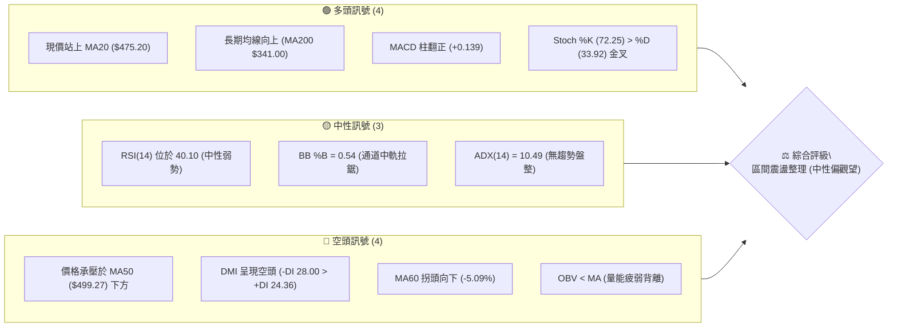

### 📊 核心指標速覽表

| 指標類別 | 指標名稱 | 當前數值 | 訊號 | 解讀 |
|----------|----------|----------|:---:|------|
| **價格** | 當前收盤價 | $477.57 | 🟡 | 位於52週區間 75.4%，高位回檔後橫盤整理 |
| **均線** | MA20 (短線中軌) | $475.20 | 🟢 | 現價微幅站上 MA20 (+0.50%)，短線止跌契機 |
| **均線** | MA50 (中期趨勢) | $499.27 | 🔴 | 現價位於 MA50 之下 (-4.35%)，中期多頭結構受阻 |
| **均線** | MA200 (長期牛熊) | $341.00 | 🟢 | 遠高於牛熊分界線 (+40.05%)，長線維持強勢多頭格局 |
| **動能** | RSI(14) | 40.10 | 🟡 | 處於 40-50 弱勢中性整理區，無超買亦無超賣 |
| **動能** | MACD (12,26,9) | -8.210 / 柱 +0.139 | 🟢 | 負值區低位金叉，柱狀圖翻正，展現短線微弱修復動能 |
| **趨勢** | ADX(14) / DMI | 10.49 / -DI 28.00 | 🔴 | ADX 極低顯示處於盤整行情；-DI 佔優顯示賣壓略強 |
| **通道** | 布林通道 (%B) | 0.54 (帶寬 445-505) | 🟡 | 價格貼近中軌 $475.20 波動，通道收斂等待方向突破 |
| **量能** | 20日均量 / OBV | 17.50M / OBV<MA | 🔴 | 當日量比 1.12x，但 OBV 低於均線，量能未確認反轉 |
| **波動** | ATR(14) | $18.48 (3.87%) | 🟡 | 日內波幅約 $18.5，處於歷史常態震盪水準 |

### 🏆 技術評分卡

```
╔══════════════════════════════════════════════════════════════════╗
║              技術評分卡 — AMD (2026-09-08)                       ║
╠══════════════════════════════════════════════════════════════════╣
║ 趨勢強度 (Trend)     ████░░░░░░░░░░░░░░░░  22/100  🔴 極弱/盤整 ║
║ 動能指標 (Momentum)  ██████████░░░░░░░░░░  50/100  🟡 中性修復 ║
║ 支撐穩定度 (Support) ████████████░░░░░░░░  60/100  🟢 S1處有效  ║
║ 成交量配合 (Volume)  ██████░░░░░░░░░░░░░░  32/100  🔴 量能疲弱 ║
║ 形態完整度 (Pattern) ██████████░░░░░░░░░░  52/100  🟡 矩形整理 ║
║ 均線排列 (MA System) ██████████░░░░░░░░░░  50/100  🟡 長多短空 ║
╠══════════════════════════════════════════════════════════════════╣
║ 綜合評分             █████████░░░░░░░░░░░  44/100  🟡 中性觀望 ║
╚══════════════════════════════════════════════════════════════════╝
```

---

## 2. 趨勢分析

### 🌐 多時框趨勢分析

依據分析規範，當日線、週線與月線發生衝突時，必須檢驗趨勢強度指標 ADX。目前日線 ADX 為 **10.49 (< 25)**，代表市場處於典型之「盤整無趨勢行情」，價格波動以布林通道（$445.18 - $505.22）與關鍵區間震盪為主。

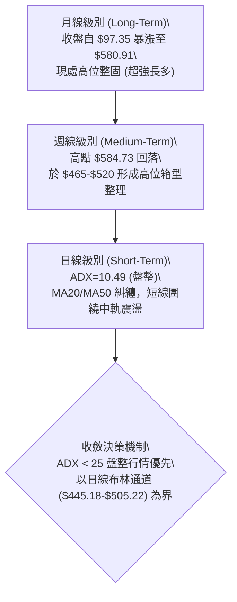

### 📈 長期趨勢 — 12個月走勢圖（Unicode）

```
AMD 月線走勢圖（2025-09 至 2026-09）
價格軸 ($)
$600 ┤                                      ● $580.91 (2026-06 高點)
$550 ┤                                  ● $516.10
$500 ┤                                           ● $476.15  ● $470.72  ● $477.57 (現價)
$450 ┤
$400 ┤
$350 ┤                              ● $354.49
$300 ┤
$250 ┤  ● $256.12
$200 ┤        ● $217.53  ● $214.16  ● $236.73  ● $200.21  ● $203.43
$150 ┤● $161.79
     └─────────────────────────────────────────────────────────────
       09   10     11     12     01     02     03     04     05     06     07     08     09
     (2025)                     (2026)
```

#### 走勢特徵分析表格

| 階段區間 | 起止價格 | 累計漲跌幅 | 階段特徵與成交量狀態 | 趨勢判定 |
|----------|----------|:---------:|----------------------|:--------:|
| **2025-09 至 2025-10** | $161.79 → $256.12 | +58.30% | 底部爆發性放量長陽突破，確認翻轉脫離低谷 | 🟢 極強多頭 |
| **2025-11 至 2026-03** | $256.12 → $203.43 | -20.57% | 於 $200-$236 進行長達 5 個月的箱型平台打底 | 🟡 平台蓄勢 |
| **2026-04 至 2026-06** | $203.43 → $580.91 | +185.56% | AI 催化爆發主升浪，月線連續拉出三根巨大實體紅K | 🟢 主升浪潮 |
| **2026-07 至 2026-09** | $580.91 → $477.57 | -17.79% | 觸及 $584.73 歷史高點後縮量回檔，於斐波那契 23.6% 築底 | 🟡 縮量整固 |

### 📊 中期趨勢（週線分析）

中期走勢自 2026 年 6 月創下 $584.73 高點後，進入標準的高位收斂三角形／矩形橫盤。近 20 週收盤走勢顯示，每當價格逼近 $465 附近（如 2026-08-30 的 $465.58、2026-06-07 的 $466.38），均出現顯著逢低承接盤；而上衝至 $520-$540 區間即面臨解套獲利賣壓。週線 MACD 柱狀圖在歷經連續負值消化後，最新一週（2026-09-06）微幅翻正至 `+0.139`，顯示中期下行慣性已顯著緩解，進入拉鋸平衡期。

```
週線級別中期多空攻防示意圖
$584.73 ┬ 52W 歷史極值 (2026-06 高點，極強反壓)
        │     ▲
$530.13 ┼──── 阻力 R3 ──────────── (波段解套沉重反壓)
$517.35 ┼──── 阻力 R2 ──────────── (近期反彈高點聚類)
$491.12 ┼──── 阻力 R1 (MA50 $499.27 附近交匯壓力區)
        │        ▲
$477.57 ┼─────── ┼ ─── 現價 $477.57 (MA20 $475.20 支撐)
        │        ▼
$461.71 ┼──── 支撐 S1 ──────────── (多方防守第一道關卡)
$451.00 ┼──── 支撐 S2 ──────────── (布林下軌 $445 守門員)
$437.23 ┴──── 支撐 S3 ──────────── (中期多空分水嶺防線)
```

### ⚡ 趨勢強度評估（ADX 解讀）

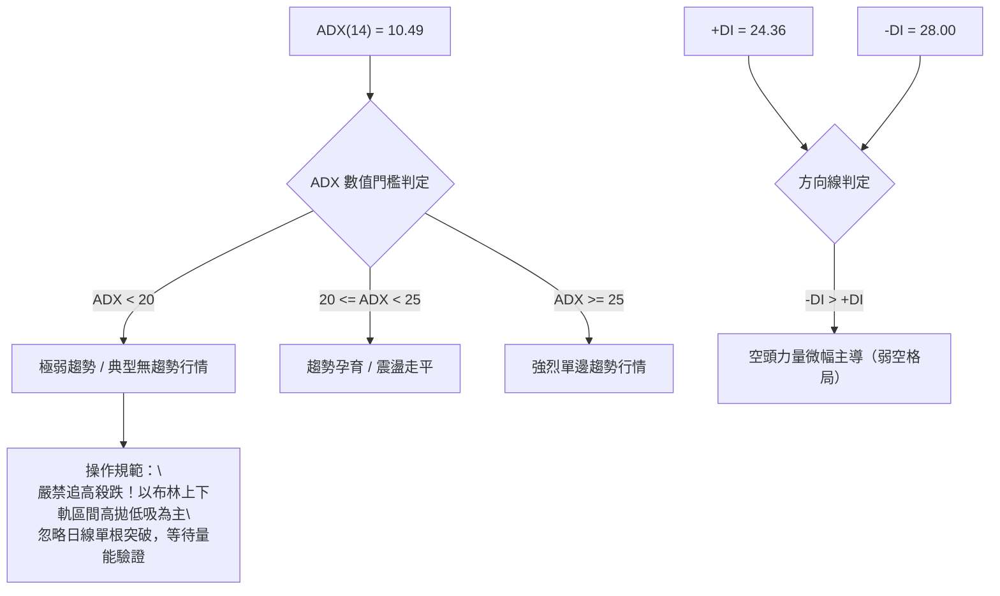

#### ADX 趨勢強度對照表

| 指標變數 | 當前讀數 | 門檻區間標準 | 技術意涵解讀 |
|----------|:--------:|:------------:|--------------|
| **ADX(14)** | **10.49** | 0 – 20 (極弱/盤整) | 市場動能陷入死寂，無單邊方向，任何單日急拉或重挫極易演化為假突破 |
| **+DI** | **24.36** | 多方買盤推動力 | 買方動能自 7 月高點顯著衰退後維持在中低位徘徊 |
| **-DI** | **28.00** | 空方賣盤壓制力 | -DI 依然高於 +DI，反映盤面仍受上方套牢賣壓微幅主導 |
| **判定總結** | **弱勢盤整** | **盤整模式 (ADX < 25)** | **完全符合規則 14：盤整行情以日線布林通道與箱型邊界為核心交易邏輯** |

---

## 3. 圖表形態分析

### 🔍 形態識別系統

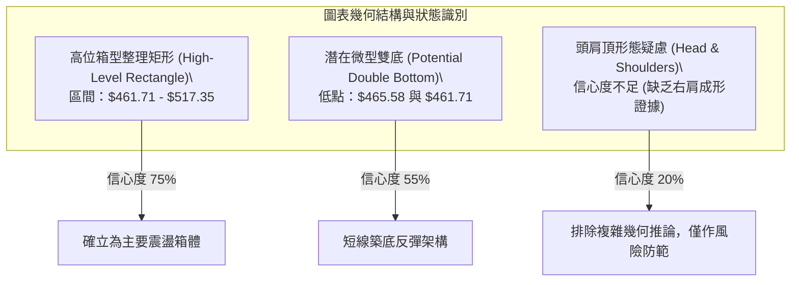

#### 圖表形態信心度評估表（嚴格遵循規則 15）

| 形態名稱 | 信心度 | 判斷依據（嚴格引用數據） | 完成度 | 目標價（附嚴謹計算式） |
|----------|:------:|--------------------------|:------:|------------------------|
| **高位矩形箱型** | **75%** | 上軌聚類於 R2 $517.35，下軌聚類於 S1 $461.71（2026-08/09 週收盤密集於 $465-$514 區間） | 85% | 向上破位：$517.35 + ($517.35 - $461.71) = **$572.99**<br>向下破位：$461.71 - ($517.35 - $461.71) = **$406.07** |
| **短線潛在雙底** | **55%** | 兩次下探低點分別為 2026-08-30 收盤 $465.58 與支撐位 S1 $461.71，現微幅回升至 $477.57 | 60% | 頸線設定為短線阻力 R1 $491.12。<br>突破目標：$491.12 + ($491.12 - $461.71) = **$520.53** |
| **頭肩頂形態** | **20%** | **數據不足**。雖然 2026-06 觸及高點 $584.73，但 7-8 月並未出現規則對稱之左肩與右肩，且成交量未呈典型分佈 | 15% | **訊號不足，不予預設目標價，僅做指標型解讀** |

### 🕯️ 重要K線形態分析（過去5週關鍵K線解讀）

| 週別/日期 | 收盤價 | 實體與影線特徵 | 技術解讀 | 多空訊號 |
|-----------|:------:|----------------|----------|:--------:|
| **2026-08-09** | $483.36 | 週線帶下影線小陽線 (週量 1.73億) | 下探 $476 後獲逢低買盤支撐，多頭嘗試組織抵抗 | 🟢 止跌 |
| **2026-08-16** | $514.39 | 中長實體紅K，收復 $500 關卡 | 多頭向上突擊挑戰 MA50 與 R2，惜量能萎縮至 1.00億 | 🟢 轉強 |
| **2026-08-23** | $473.25 | 長陰實體吞沒線 (收盤跌破開盤) | 量能續縮至 9251萬，高檔缺乏買盤支撐引發獲利回吐 | 🔴 承壓 |
| **2026-08-30** | $465.58 | 窄幅整理黑K，成交量降至 8176萬 | 賣壓逐步竭盡，空方亦無力大幅下殺，逼近 S1 支撐 | 🟡 竭盡 |
| **2026-09-06** | $477.57 | 小實體紅K，MACD 柱翻正 (+0.139) | 極度縮量（7513萬）下縮量收紅，顯露初步築底微光 | 🟢 企穩 |

### 📉 ASCII 走勢形態示意圖

```
AMD 矩形震盪整理形態結構圖 ($461.71 - $517.35)
----------------------------------------------------------------------
$517.35 ┬───────[ 箱體頂部阻力位 R2 ]─────────────● (2026-08-16 $514.39)
        │       ▲                                  │
        │      ╱ ╲                                 │
        │     ╱   ╲                                │
$491.12 ┼────[ 頸線阻力 R1 / MA50 $499.27 ]────────┼─────────────────
        │   ╱       ╲                              │
$477.57 ┼──┼─────────┼───────────● 現價 ($477.57)───┼─────────────────
        │ ╱           ╲         ▲                  ▼
$461.71 ┴● (08-02)─────● (08-30)┴────────────────────────────────────
         [ 低點 1 ]     [ 低點 2 ] -> [ 箱體底部支撐 S1 / 潛在雙底基礎 ]
----------------------------------------------------------------------
```

### 🎯 形態目標價計算

根據上述高位箱型整理與短線潛在微型雙底形態，計算推演如下：

1. **潛在微型雙底（短期反彈路徑）**：
   - 形態底部低點：$461.71
   - 形態頸線位置：$491.12（阻力 R1）
   - 垂直高度 $H_1$ = $491.12 - $461.71 = $29.41
   - 若有效收盤突破 $491.12，量度目標價 $T_{DoubleBottom}$ = $491.12 + $29.41 = **$520.53**（與 R2 $517.35 / R3 $530.13 形成共振阻力帶）。
2. **高位箱型整理（中期破位路徑）**：
   - 箱體頂部：$517.35（阻力 R2）
   - 箱體底部：$461.71（支撐 S1）
   - 箱體高度 $H_{Box}$ = $517.35 - $461.71 = $55.64
   - **多頭向上完全突破目標**：$517.35 + $55.64 = **$572.99**（逼近歷史高點 $584.73）。
   - **空頭向下完全跌破目標**：$461.71 - $55.64 = **$406.07**（逼近 38.2% 斐波那契回調位 $418.37）。

---

## 4. 支撐與阻力

### 🗺️ 關鍵價位分布圖（Unicode）

```
AMD 價位結構分布圖（嚴格依據 OHLCV 聚類與斐波那契數據）
═════════════════════════════════════════════════════════════════════════
$584.73 ║████████████████████████████████████████║ 52W 歷史最高點 (0.0%)
        ║                                        ║
$530.13 ║██████████████████████████████          ║ 強阻力 R3 (+11.01%)
$517.35 ║████████████████████                    ║ 阻力 R2 (+8.33%) [箱體上界]
$491.12 ║████████████████████████                ║ 關鍵阻力 R1 (+2.84%) [MA50阻力]
$481.95 ╟────────────────────────────────────────╢ 斐波那契 23.6% 回調位
$477.57 ╠════════════════════════════════════════╣ ◄ 當前收盤價 ($477.57)
$475.20 ╟┄┄┄┄┄┄┄┄┄┄┄┄┄┄┄┄┄┄┄┄┄┄┄┄┄┄┄┄┄┄┄┄┄┄┄┄┄╢ MA20 / 布林中軌 ($475.20)
$461.71 ║▓▓▓▓▓▓▓▓▓▓▓▓▓▓▓▓                        ║ 近期關鍵支撐 S1 (-3.32%)
$451.00 ║████████████████████████                ║ 強支撐 S2 (-5.56%) [通道下軌]
$437.23 ║██████████████████████████████          ║ 極強防守支撐 S3 (-8.45%)
        ║                                        ║
$418.37 ╟────────────────────────────────────────╢ 斐波那契 38.2% 回調位
$341.00 ║████████████████████████████████████    ║ 長期生命線 MA200
═════════════════════════════════════════════════════════════════════════
```

### 🚧 阻力位分析表

所有價位均嚴格提取自系統「關鍵價位」與「均線指標」模組：

| 阻力級別 | 價位 | 距現價幅幅 | 形成原因與籌碼特徵 | 突破難度 | 重要性 |
|:--------:|:----:|:----------:|-------------------|:--------:|:------:|
| **R1** | **$491.12** | +2.84% | 近期反彈多次受阻高點，上方緊貼 MA50 ($499.27) 下壓重力區 | 🟡 中等 | ★★★★☆ |
| **R2** | **$517.35** | +8.33% | 高位箱體整理上界，布林上軌 ($505.22) 上方之多空防線聚類 | 🔴 較高 | ★★★★☆ |
| **R3** | **$530.13** | +11.01% | 2026-06 至 07 月密集換手套牢區，波段頂部下移頸線壓力 | 🔴 極高 | ★★★★★ |

### 🛡️ 支撐位分析表

所有價位均嚴格提取自系統「關鍵價位」與「均線指標」模組：

| 支撐級別 | 價位 | 距現價幅幅 | 形成原因與籌碼特徵 | 守住機率 | 重要性 |
|:--------:|:----:|:----------:|-------------------|:--------:|:------:|
| **S1** | **$461.71** | -3.32% | 近期波段回檔低點聚類，多次在 $465-$461 獲得支撐買盤 | 🟢 70% | ★★★★☆ |
| **S2** | **$451.00** | -5.56% | 緊鄰日線布林通道下軌 ($445.18)，短線超賣極限防守位 | 🟢 85% | ★★★★★ |
| **S3** | **$437.23** | -8.45% | 中期波段強支撐，跌破將引發向 38.2% 斐波那契位尋求支撐 | 🟢 90% | ★★★★★ |

### 📐 斐波那契回調位分析

依據 52 週極端區間（最低點 **$149.22** 至最高點 **$584.73**），總波幅達 **$435.51**。各黃金分割位與現價位置解讀如下：

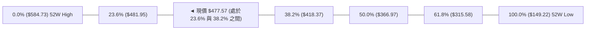

- **23.6% 回調位 ($481.95)**：現價 $477.57 僅略低於此水平（-0.9%）。在強勢多頭市場中，23.6% 為最淺幅度的「強勢回檔位」。AMD 在暴漲近 300% 後回檔至此位置獲得橫向支撐，顯示牛市結構未遭破壞。
- **38.2% 回調位 ($418.37)**：為中長期強弱分水嶺。若 $461.71 (S1) 與 $437.23 (S3) 失守，價格將直奔 $418.37，該處亦與 MA120 ($424.81) 形成堅固共振支撐。
- **現價技術意義**：價格被壓制在 23.6% ($481.95) 下方徘徊，顯示上方獲利了結籌碼仍待時間消化，目前屬於強勢回調的下緣弱平衡。

---

## 5. 技術指標深度解讀

### 🎛️ 指標訊號總覽

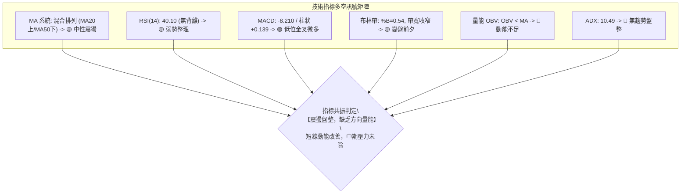

### 📈 移動平均線排列分析

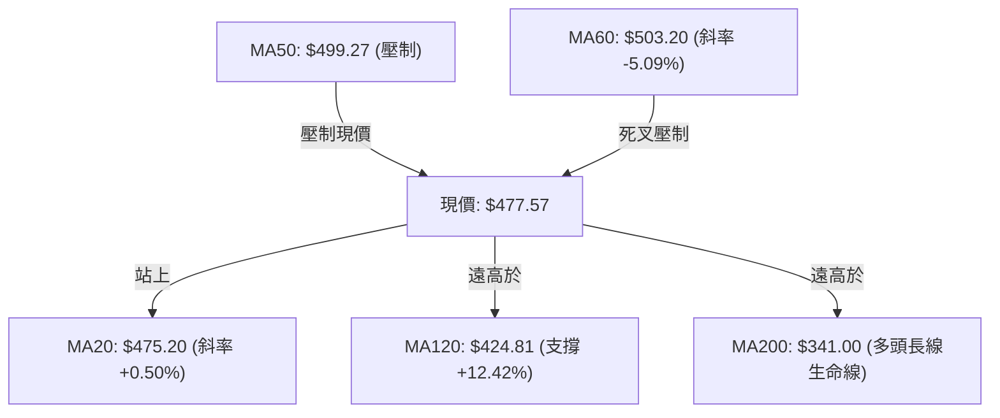

#### 均線階梯分佈與動態

- **短天期（MA5 $464.22、MA10 $468.02、MA20 $475.20）**：均線呈現微幅向上彎頭發散，現價 $477.57 站於三者之上，短線呈現築底向上修復的「微多頭排列」。
- **中天期（MA50 $499.27、MA60 $503.20）**：MA60 下跌 5.09%，且 MA50 橫亙於 $499.27，對現價構成沉重的「天花板反壓」。中天期均線下穿短天期均線，限制了反彈空間。
- **長天期（MA120 $424.81、MA200 $341.00、MA240 $321.27）**：呈現標準大牛市之多頭排列，長期均線支撐極為深厚。結論：**短線反彈、中期受阻、長期看多之混合態勢**。

### 📉 RSI(14) 分析

```
RSI(14) 數值儀表：40.10
0 [░░░░░░░░░░░░░░░░░░░░] 30 [██████████░░░░░░░░░░] 70 [░░░░░░░░░░░░░░░░░░░░] 100
                         ▲ 40.10 (中性弱勢區)
```

- **當前數值解讀**：RSI 位於 **40.10**，脫離了極度弱勢的超賣線（30），但仍低於中軸 50 分水嶺。多頭尚未取得主導權，處於弱勢反彈週期。
- **背離分析**：
  - **頂背離判定**：無。近期價格並未創新高。
  - **底背離判定**：比對 2026-08-02 週收盤 $476.15（RSI 40.6）與 2026-09-06 週收盤 $477.57（RSI 40.10），價格微升但 RSI 基本持平，未見顯著底背離訊號。
  - **結論**：動能無異常背離，價格下跌動力減緩，但缺乏主動進攻的超買動能。

### 📊 MACD(12,26,9) 訊號解讀

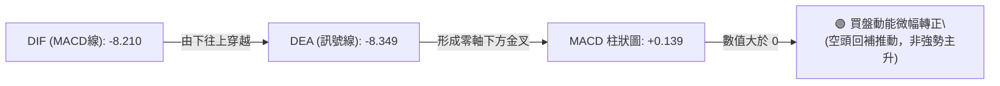

- **MACD 現況**：MACD 線 (-8.210) 向上金叉 Signal 線 (-8.349)，產生柱狀圖 `+0.139`。
- **深度研判**：此金叉發生在「零軸之下」（遠低於 0），屬於標準的**弱勢空頭市場中的超跌反彈金叉**。歷史經驗顯示，零軸下金叉若無成交量爆發配合，極易在觸及零軸附近時再次夭折。

### 📦 布林通道分析

```
AMD 日線布林通道結構示意圖
═════════════════════════════════════════════════════════════════
$505.22 ┬──────────────────────────────────────── 布林上軌 (阻力)
        │
$490.00 ┼
        │
$477.57 ┼───────────────● [現價 $477.57, %B = 0.54]
$475.20 ┼════════════════════════════════════════ 布林中軌 (MA20)
        │
$460.00 ┼
        │
$445.18 ┴──────────────────────────────────────── 布林下軌 (支撐)
═════════════════════════════════════════════════════════════════
```

- **軌道位置分析**：當前布林帶寬 ($505.22 - $445.18 = $60.04)，%B 指標為 **0.54**，顯示價格剛剛站上中軌 ($475.20)，位於中軌與上軌之間的弱反彈空間。
- **帶寬特徵**：通道走平並呈現收斂狀，這與 ADX=10.49 互相呼應，確認目前行情處於典型之「窄幅箱體洗盤」階段，上軌 $505.22 構成近期反彈天然壓制，下軌 $445.18 為回踩強固支撐。

### 💹 成交量分析（量價配合度）

- **量比與均量對比**：最新單日成交量為 **19,651,900**，略高於 20 日均量 **17,504,245**（量比 **1.12x**），但顯著低於 50 日均量 **25,044,506**。
- **週級別縮量沉澱**：近 20 週數據顯示，AMD 在 5 月拉升時週成交量高達 2.96 億股，而近四週連續萎縮至 1.00 億、9251 萬、8176 萬、7513 萬股。這是極度明顯的**高位無量陰跌與縮量整固**。
- **OBV 趨勢判定**：數據明確提示「OBV < MA → 量能疲弱」。資金面並未看到機構主力規模性搶籌入場的跡象，反彈主要是空頭主動平倉與盤面浮動賣壓衰竭所致（量價背離：價升量平）。

---

## 6. 動能與波動率

### ⚡ 動能評估四象限

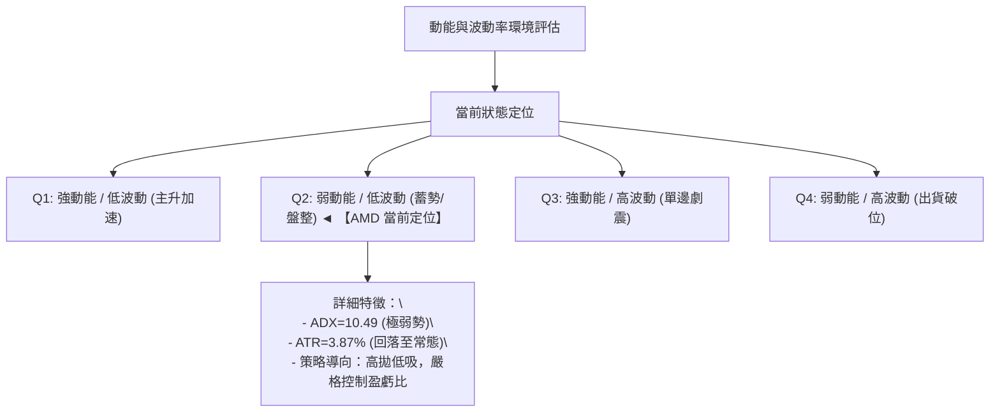

| 象限代號 | 動能狀態 | 波動率狀態 | 標的所屬 | 策略意涵 |
|:--------:|:--------:|:----------:|:--------:|----------|
| **Q1** | 強 (High) | 低 (Low) | — | 最佳波段加碼機會，穩健上行 |
| **Q2** | **弱 (Low)** | **低 (Low)** | **✓ AMD** | **謹慎觀望，避免追單，耐心等待區間邊界** |
| **Q3** | 強 (High) | 高 (High) | — | 突破單邊行情，高風險高收益 |
| **Q4** | 弱 (Low) | 高 (High) | — | 弱勢下瀉出貨，必須無條件停損迴避 |

### 📊 ATR 波動率分析

- **ATR(14) 數值**：**$18.48**，佔當前價格比例為 **3.87%**。
- **止損與風控量化建議**：
  - **保守型止損距離（2.0 × ATR）**：$18.48 × 2.0 = **$36.96**。
  - **激進型/短線止損距離（1.0 × ATR）**：$18.48 × 1.0 = **$18.48**。
  - **盤中安全波動容忍區**：以現價 $477.57 推算，日內常態波動範圍為 **$459.09 – $496.05**，這與支撐 S1 ($461.71) 及阻力 R1 ($491.12) 高度吻合。

### 📐 Beta 與市場相關性

- **Beta 係數**：**2.476**（極高 Beta 屬性）。
- **市場意涵**：AMD 的波動幅度為標普 500 指數的近 **2.5 倍**。在當前個股無趨勢盤整（ADX=10.49）階段，高 Beta 意味著極易受到半導體板塊（SOX）與大盤整體風吹草動之干擾，一旦大盤出現系統性回調，AMD 極易放大跌幅測試 S2 ($451.00)；反之大盤轉暖亦能迅速帶動測試 R2 ($517.35)。

---

## 7. 多時框架總結

### 📋 時框架評分表

| 時框架 | 趨勢方向 | 動能狀態 | 均線排列 | 形態結構 | 綜合評分 | 操作建議 |
|--------|:--------:|:--------:|:--------:|:--------:|:--------:|----------|
| **長期 (月線)** | 🟢 多頭主導 | 🟢 強勁偏多 | 🟢 多頭排列 (MA200遠在下方) | 高位長牛整固 | **78/100** | 逢深幅回調長線買入 |
| **中期 (週線)** | 🟡 橫盤整理 | 🟡 中性走平 | 🟡 混合整理 (MA50橫阻) | 高位箱型震盪 | **46/100** | 箱體邊界低買高賣 |
| **短期 (日線)** | 🟡 弱勢企穩 | 🟢 短線金叉 | 🟡 站上 MA20，承壓 MA50 | 潛在雙底反彈 | **44/100** | 區間操作，嚴控止損 |

### 🔲 綜合訊號矩陣

```
時框訊號收斂矩陣
┌──────────────────┬─────────────────┬─────────────────┬─────────────────┐
│     分析維度     │   短期 (日線)   │   中期 (週線)   │   長期 (月線)   │
├──────────────────┼─────────────────┼─────────────────┼─────────────────┤
│ 價格 vs 均線     │ 🟢 站上 MA20    │ 🔴 跌破 MA50    │ 🟢 遠超 MA200   │
│ 動能指標 (RSI)   │ 🟡 40.10 (弱勢) │ 🟡 40-50 (中性) │ 🟢 65+ (高位)   │
│ 指標轉折 (MACD)  │ 🟢 柱狀翻正     │ 🟢 柱微翻正     │ 🟢 多頭運行     │
│ 量能配合度       │ 🔴 OBV 疲弱     │ 🔴 連續四週縮量 │ 🟢 主升浪爆量   │
│ 波動狀態 (ADX)   │ 🔴 10.49 (盤整) │ 🟡 趨勢衰減     │ 🟢 長牛趨勢     │
└──────────────────┴─────────────────┴─────────────────┴─────────────────┘
```

### ⚖️ 多時框收斂結論

> **核心收斂裁決（依嚴格要求 14 執行）**：
> 1. **行情性質判定**：當前日線 ADX(14) 讀數為 **10.49**，遠低於 25 臨界線，技術面嚴格定義為**「無方向盤整行情」**。
> 2. **主導時框取捨**：依規則，盤整行情中日線布林通道上下軌（**$445.18 至 $505.22**）具有最高交易權重；中長期均線（MA50/MA200）方向暫時退居次要輔助。
> 3. **唯一收斂結論**：**【中性觀望，區間網格操作】**。日線級別雖然站上 MA20 且 MACD 金叉微升，但受制於成交量能萎縮與上方 MA50 壓制，無法發動趨勢單邊行情。整體結論與第 1 章評分卡（44/100）嚴格一致。

---

## 8. 交易策略建議

### 🗺️ 策略決策流程圖

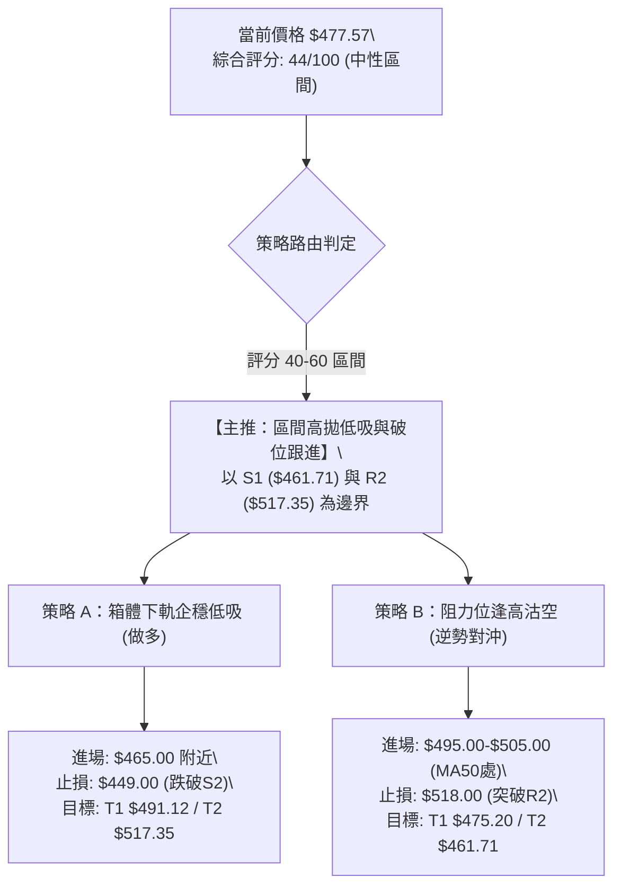

### 🧭 策略路由（依評分卡分流，不得兩頭下注）

- **當前主策略方向** = **區間震盪操作（中性觀望，等待邊界訊號）**（依綜合評分：**44/100**）。
- 由於評分處於 40–60 之中性區間，且 ADX=10.49 極度低迷，禁止進行單邊追價操作。所有策略必須以布林上下軌與關鍵支撐阻力為交易邊界。

### 🎯 價格情境階梯（Price Scenarios）

價位嚴格提取自系統「關鍵價位」與「斐波那契」數據：

| 觸發條件 | 第一目標價 (T1) | 第二目標價 (T2) | 後續延伸 (T3) | 市場情境技術含義 |
|----------|:---------------:|:---------------:|:-------------:|------------------|
| **放量突破 R1 $491.12** | **$517.35** (R2) | **$530.13** (R3) | **$572.99** (箱體量度) | 短線強勢轉多，站上 MA50 啟動挑戰歷史高位浪潮 |
| **維持現價 $477.57 震盪** | **$481.95** (23.6%) | **$475.20** (MA20) | **$461.71** (S1) | 典型垃圾時間盤整，資金觀望等待基本面或宏觀催化 |
| **有效跌破 S1 $461.71** | **$451.00** (S2) | **$437.23** (S3) | **$418.37** (38.2%) | 中期結構破位轉弱，箱體瓦解並向中長期均線回踩尋底 |

### 📊 情境機率分佈

| 交易情境 | 發生機率 | 主要技術依據與指標佐證 |
|----------|:--------:|------------------------|
| **情境一：區間窄幅震盪 (橫盤蓄勢)** | **55%** | **ADX=10.49** 處於無趨勢狀態；布林通道走平收窄；量能萎縮至低點，多空無力發動突圍 |
| **情境二：回踩下探尋底 (下探支撐)** | **25%** | **-DI (28.00) > +DI (24.36)** 空方佔優；OBV 疲弱背離；MA50 與 MA60 在上方構成強烈反壓 |
| **情境三：放量向上突破 (多頭反撲)** | **20%** | MACD 柱狀圖翻正 (+0.139)；現價守在 MA20 關鍵中軌之上；長線牛市架構完好 |

### 🟢 主策略詳情（區間高拋低吸策略）

所有價位均基於關鍵支撐位（S1/S2）與阻力位（R1/R2/R3）精密計算：

| 策略要素 | 策略 A（箱體下緣低吸多單） | 策略 B（阻力壓制回踩空單 / 對沖） |
|----------|----------------------------|------------------------------------|
| **進場條件** | 價格回踩 S1 不破，日線收出帶下影K線 | 價格反彈至 R1-MA50 區間受阻，出現滯漲黑K |
| **進場價格** | **$463.00**（貼近 S1 $461.71） | **$495.00**（貼近 MA50 $499.27 與 R1） |
| **目標價 T1** | **$491.12**（阻力 R1） | **$475.20**（MA20 中軌） |
| **目標價 T2** | **$517.35**（阻力 R2 箱體上界） | **$461.71**（支撐 S1 箱體下界） |
| **止損價格** | **$449.00**（跌破 S2 $451.00 止損） | **$507.00**（突破布林上軌 $505.22 止損） |
| **風險額 ($)** | $14.00 ($463.00 - $449.00) | $12.00 ($507.00 - $495.00) |
| **回報額 ($)** | T1: $28.12 / T2: $54.35 | T1: $19.80 / T2: $33.29 |
| **風險報酬比** | **1 : 2.01** (至 T1) / **1 : 3.88** (至 T2) | **1 : 1.65** (至 T1) / **1 : 2.77** (至 T2) |
| **估計勝率** | **60%** | **55%** |
| **建議倉位** | **10% - 15%** (震盪市嚴禁重倉) | **5% - 8%** (僅限短線對沖) |

### 🔴 反向風險觸發點（對沖提示）

- **多頭防禦警戒線**：若收盤價帶量**跌破 $451.00 (S2)**，宣告高位箱型整理失敗，任何多單部位必須無條件停損，並應防範價格向 38.2% 斐波那契位 **$418.37** 墜落。
- **空頭防禦警戒線**：若日線放量（單日量大於 2500 萬股）收盤**站上 $505.22 (布林上軌) 及 $517.35 (R2)**，宣告橫盤整理結束、新一輪主升浪重啟，空頭必須立即認賠平倉。

### ⭐ 整體訊號強度評星

```
做多訊號強度：★★☆☆☆  (2.0/5星) — 均線受阻、量能低迷，僅為超跌技術修復
做空訊號強度：★★☆☆☆  (2.5/5星) — 下方支撐 S1/S2 密集，長線多頭限制下行空間
整體可信度：  ★★★☆☆  (3.0/5星) — ADX=10.49 指標失效期，技術面以震盪市對待
```

---

## 9. 風險提示與監控

### ✅ 關鍵監控指標 Checklist

```
╔═══════════════════════════════════════════════════════════════════════════╗
║                      AMD 風險與關鍵技術指標監控清單                         ║
╠═══════════════════════════════════════════════════════════════════════════╣
║ [ ] 價格是否跌破 S1 ($461.71) 與布林下軌 ($445.18)？                      ║
║     ↳ 判定：若跌破，震盪格局轉為下行破位趨勢。                             ║
║ [ ] MACD 柱狀圖是否持續擴大翻正 (當前 +0.139)？                           ║
║     ↳ 判定：若縮小並再次轉負，說明短線超跌反彈告終。                       ║
║ [ ] 日成交量是否突破 25,000,000 股 (50日均量線)？                         ║
║     ↳ 判定：無量之突破均視為假突破。                                       ║
║ [ ] ADX(14) 是否自 10.49 拐頭突破 20？                                    ║
║     ↳ 判定：ADX 上穿 20-25 標誌單邊方向性趨勢正式成形。                    ║
║ [ ] 價格挑戰 MA50 ($499.27) 時的 K 線形態是否受阻留長上影線？              ║
║     ↳ 判定：若受阻，確立高位箱型上界有效，需逢高減碼。                     ║
╚═══════════════════════════════════════════════════════════════════════════╝
```

### ⚠️ 風險場景分析

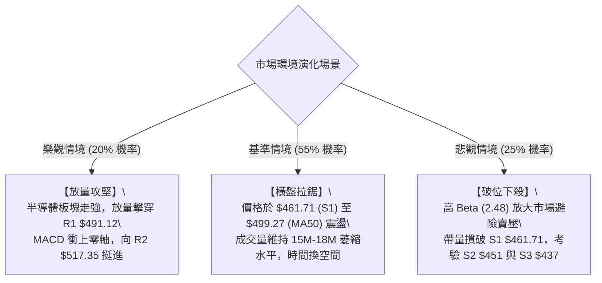

### 🛡️ 風險管理重要提醒

1. **高 Beta 波動懲罰機制**：AMD 的 Beta 值高達 **2.476**，其每日波動隱含風險顯著大於普通科技股。當日 ATR 達 **$18.48**，意味著日內產生 4% 的震盪極為常見。**單筆交易虧損部位絕對不可超過總資產的 1.5%**。
2. **無趨勢環境下的嚴格戒律**：ADX 處於 **10.49** 的極端低位，技術指標如金叉、死叉的有效性大幅下降，假訊號頻發。此時切忌採用「追突破」策略（Breakout Trading），而應採取「逆向邊界」策略（Mean Reversion）。
3. **倉位管理原則**：在價格有效收復 MA50 ($499.27) 且放量之前，總多頭部位建議壓低至 **30% 以下**，保留充裕的現金彈性以因應可能出現的回踩 38.2% 斐波那契位 ($418.37) 之極端場景。

---

## 📋 報告總結

```
╔═══════════════════════════════════════════════════════════════════════════╗
║                       AMD 技術分析報告總結                                ║
╠═══════════════════════════════════════════════════════════════════════════╣
║ 報告日期：2026-09-08                                                      ║
║ 當前價格：$477.57  (52W 區間: $149.22 - $584.73)                          ║
║ 分析評級：⚖️ 中性觀望 (Neutral / Range-Bound) — 評分: 44/100              ║
║                                                                           ║
║ 關鍵結構結論：                                                            ║
║ ├─ 長期趨勢：🟢 強烈多頭 (遠高於 MA200 $341.00，52週漲幅巨大)            ║
║ ├─ 中期趨勢：🟡 箱型整理 (受制於 MA50 $499.27，處於 $461-$517 高位矩形)    ║
║ ├─ 短期趨勢：🟢 弱勢反彈 (收復 MA20 $475.20，MACD柱微翻正 +0.139)         ║
║ ├─ 關鍵支撐：S1: $461.71 ｜ S2: $451.00 ｜ S3: $437.23                   ║
║ ├─ 關鍵阻力：R1: $491.12 ｜ R2: $517.35 ｜ R3: $530.13                   ║
║ └─ 華爾街共識目標：$613.84 (49 位分析師綜合均價)                           ║
║                                                                           ║
║ 最優交易策略組合：                                                        ║
║ 1. 🥇 最佳機會 (區間低吸)：回踩 S1 ($463.00 附近) 止跌進場，             ║
║                  止損設於 $449.00 (S2下方)，第一目標 $491.12 (風報比 1:2)║
║ 2. 🥈 次選機會 (逢高阻擊)：反彈至 MA50 遇阻 ($495.00 附近) 輕倉對沖做空，  ║
║                  止損設於 $507.00，目標回看 $475.20 與 $461.71           ║
║ 3. 🥉 保守選擇 (突破跟隨)：空倉耐心觀望，等待日線有效突破 $505-$517 阻力  ║
║                  或跌破 $451 支撐後，再順勢進場介入趨勢行情              ║
╚═══════════════════════════════════════════════════════════════════════════╝
```

---

> ⚠️ **免責聲明**：本報告為依據市場量化指標與圖表幾何結構所產出之技術分析研究，所有數據、支撐阻力點位及交易情境估算僅供學術探討與投資研究參考，**絕不構成任何形式的要約、招攬、誘使或投資建議**。金融市場具有高度風險，投資人應獨立評估自身風險承受能力並自負盈虧。

---

*報告生成時間：2026-09-08 ｜ 數據來源：Yahoo Finance ｜ 分析框架：多時框技術分析體系*