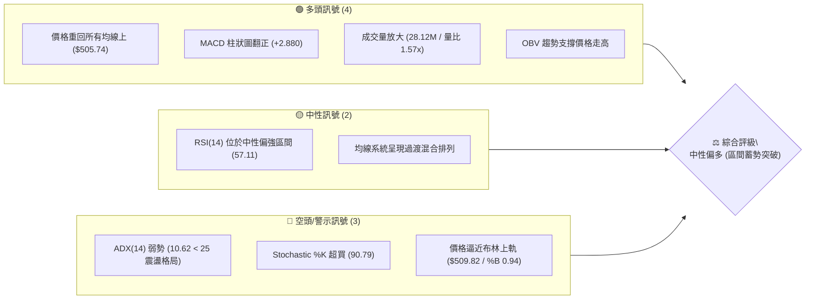
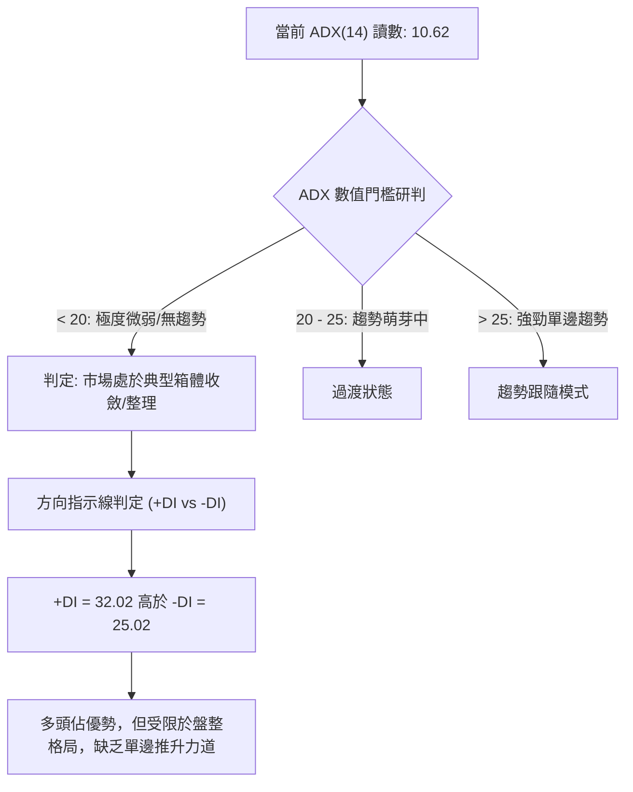
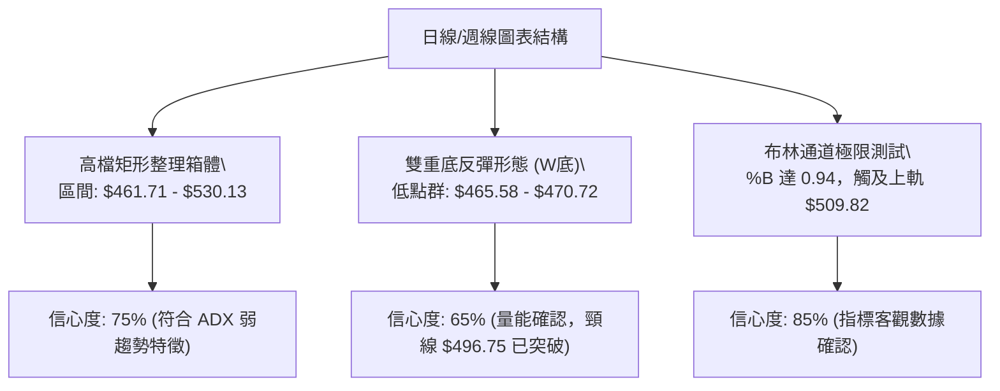
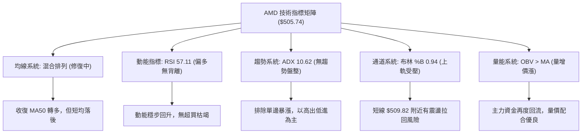
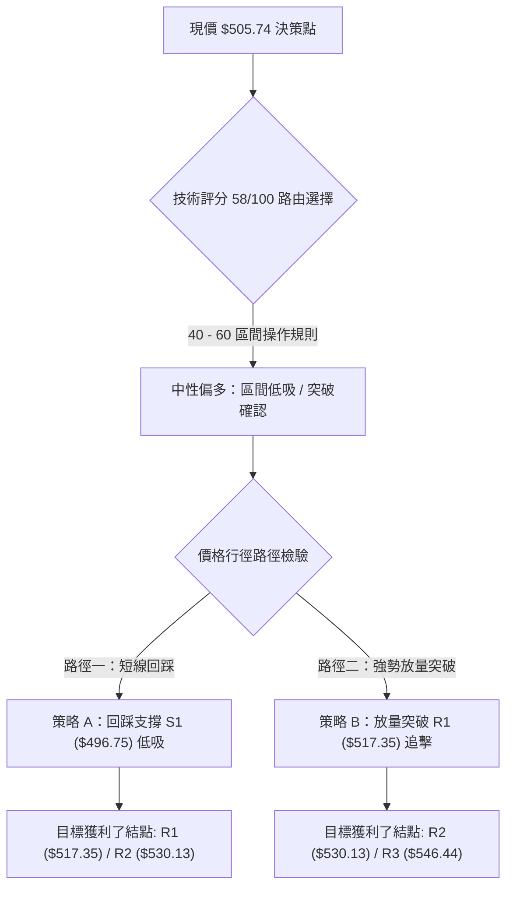
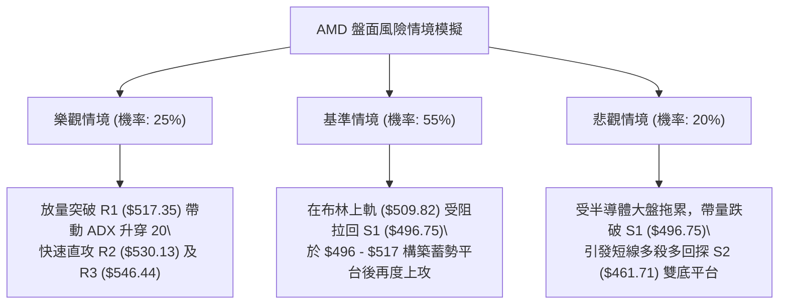

# AMD 技術分析報告

> **報告日期**：2026-09-09 ｜ **語言**：繁體中文 ｜ **數據來源**：Yahoo Finance ｜ **當前價格**：$505.74

---

## 目錄

| 章節 | 內容 |
|------|------|
| [1. 技術面概覽](#1-技術面概覽) | 訊號儀表板、核心指標、評分卡 |
| [2. 趨勢分析](#2-趨勢分析) | 多時框趨勢、長中短期走勢、ADX解讀 |
| [3. 圖表形態分析](#3-圖表形態分析) | 形態識別、信心度評估、K線組合 |
| [4. 支撐與阻力](#4-支撐與阻力) | 關鍵價位、斐波那契回調結構 |
| [5. 技術指標深度解讀](#5-技術指標深度解讀) | MA/RSI/MACD/布林通道/成交量OBV |
| [6. 動能與波動率](#6-動能與波動率) | 動能四象限、ATR波動度、Beta分析 |
| [7. 多時框架總結](#7-多時框架總結) | 時框架矩陣、多時框收斂定調 |
| [8. 交易策略建議](#8-交易策略建議) | 策略路由、價格階梯、風險報酬配置 |
| [9. 風險提示與監控](#9-風險提示與監控) | 關鍵監控清單、極端風險場景應對 |
| [📋 報告總結](#-報告總結) | 核心結論與策略速查 |

---

## 1. 技術面概覽

### 🎯 技術訊號儀表板



---

### 📊 核心指標速覽表

| 指標類別 | 指標名稱 | 當前數值 | 訊號 | 專業解讀 |
|----------|----------|----------|------|----------|
| **價格** | 現行收盤價 | $505.74 | 🟢 | 位於 52 週區間高檔 81.9%，收復關鍵心理整數關卡 |
| **均線** | MA20 (月線) | $477.01 | 🟢 | 現價高於 MA20 達 +6.02%，短期動能強勁 |
| **均線** | MA50 (季線) | $498.96 | 🟢 | 現價強勢站回季線之上，確認中期修正暫告段落 |
| **均線** | MA200 (年線)| $342.38 | 🟢 | 現價遠高於年線 +47.71%，長期多頭基本骨架穩固 |
| **動能** | RSI(14) | 57.11 | 🟡 | 處於 30-70 常態中性區，無超買或背離風險 |
| **動能** | MACD 柱狀體 | +2.880 | 🟢 | 快慢線負值區黃金交叉，柱狀體擴大，短線買盤進駐 |
| **動能** | Stochastic %K/%D| 90.79 / 61.14 | 🔴 | 短線 KD 進入超買區，需防範指標高檔鈍化或微幅拉回 |
| **趨勢** | ADX(14) | 10.62 | 🟡 | 數值遠低於 25，市場處於無方向性的箱體盤整格局 |
| **通道** | 布林帶寬 (%B) | 0.94 | 🔴 | 貼近布林上軌 $509.82，短線面臨軌道邊界壓制 |
| **量能** | 20日成交量比 | 1.57x | 🟢 | 單日爆量 28.12M 股，顯著超越 20 日均量 17.93M |
| **波動** | ATR(14) | $18.75 | 🟡 | 佔股價 3.71%，日內震盪幅度維持正常活躍水準 |

---

### 🏆 技術評分卡

```
╔══════════════════════════════════════════════════════════════════╗
║                   技術評分卡 — AMD (2026-09-09)                 ║
╠══════════════════════════════════════════════════════════════════╣
║ 趨勢強度 (Trend)     ████░░░░░░░░░░░░░░░░  25/100  🔴 (ADX極低)   ║
║ 動能指標 (Momentum)  ████████████░░░░░░░░  62/100  🟢 (MACD轉強)  ║
║ 支撐穩定度 (Support) ██████████████░░░░░░  70/100  🟢 (均線密集)  ║
║ 成交量配合 (Volume)  ████████████████░░░░  78/100  🟢 (量價齊揚)  ║
║ 形態完整度 (Pattern) ██████████░░░░░░░░░░  52/100  🟡 (區間收斂)  ║
║ 均線架構 (Moving Avg)████████████░░░░░░░░  60/100  🟡 (混合修復)  ║
╠══════════════════════════════════════════════════════════════════╣
║ 綜合技術評分         ███████████░░░░░░░░░  58/100  🟡 中性偏多    ║
╚══════════════════════════════════════════════════════════════════╝
```

---

## 2. 趨勢分析

### 🌐 多時框趨勢分析

```mermaid
graph TD
    A["月線層級 (長期趨勢)"] -->|"年線 MA200 位於 $342.38\\n52週低點 $149.22 奠定巨浪基礎"| B["🟢 強烈多頭格局"]
    C["週線層級 (中期趨勢)"] -->|"高位回撤至 $465.58 獲得穩固支撐\\n近期自低檔強勁反彈三連陽"| D["🟡 箱體震盪整理"]
    E["日線層級 (短期趨勢)"] -->|"單日放量跳升上穿 MA50 ($498.96)\\n逼近布林上軌 $509.82"| F["🟢 短線強勢反彈"]
    B --> G{"多時框綜合研判"}
    D --> G
    F --> G
    G --> H["長多保護下的高檔箱體震盪 (等待 $517.35 突破確認)"]
```



---

### 📈 長期趨勢 — 12個月走勢圖（Unicode）

以下圖表忠實反映 AMD 過去 12 個月（2025年10月至2026年09月）自 $161.79 飆升至歷史頂點 $584.73，隨後進行高檔旗形箱體收斂的壯闊軌跡：

```
AMD 月線歷史價格走勢圖（2025-10 至 2026-09）
價格軸 ($)
$600 ┤                                      ● $580.91 (2026-06 高點)
$550 ┤                                ╭───╯   ╲
$500 ┤                               ● $516.10  ● $505.74 (現價 2026-09)
$450 ┤                               │            ╲     ╱
$400 ┤                         ● $354.49 (2026-04) ╰─● $470.72 (2026-08)
$350 ┤                        ╱
$300 ┤                       ╱
$250 ┤ ● $256.12 (2025-10)  ╱
$200 ┤   ╲   ● $236.73      ╱
$150 ┤    ╰───┴──● $200.21 ╯ (2026-02 低點)
     └─┬─────┬─────┬─────┬─────┬─────┬─────┬─────┬─────┬─────┬─────┬─────┬──
      10    11    12    01    02    03    04    05    06    07    08    09 (月份)
      2025 ─────────────────────────► 2026
```

#### 走勢特徵分析表格

| 階段區間 | 價格變動 | 區間漲跌幅 | 結構性技術特徵與驅動要素 |
|----------|----------|------------|--------------------------|
| **2025-10 ~ 2026-02** | $256.12 → $200.21 | -21.83% | 自爆發性起漲點拉回築底，於 $200.00 整數關卡構築雙底支撐平台。 |
| **2026-03 ~ 2026-06** | $203.43 → $580.91 | +185.56% | 展開主升段噴出行情，連續 4 個月巨量推進，創下歷史新高 $584.73。 |
| **2026-07 ~ 2026-08** | $580.91 → $470.72 | -18.97% | 遭遇獲利回結壓力，跌破 MA20 尋求支撐，在 S2 ($461.71) 上方止跌。 |
| **2026-09 (當前)** | $470.72 → $505.74 | +7.44% | 買盤重燃，帶量收復 MA50 ($498.96)，重回 $500.00 關鍵整數區間。 |

---

### 📊 中期趨勢（週線分析）

從近 20 週收盤結構觀察，AMD 在 2026 年 5 至 6 月於 $580.00 一線形成高檔巨量頂部後，經歷了連續 10 週的修正。在 2026-08-30 收盤於 $465.58 觸及波段低點後，週線 MACD 柱狀體於 2026-09-06（+0.139）及 2026-09-13（+2.880）出現連續翻紅擴張。

```
近期週線壓力與支撐階梯架構示意圖：
[阻力 R3] $546.44 ─── 近期波段次高反彈極限 (週線籌碼密集套牢區)
[阻力 R2] $530.13 ─── 2026-06-21 週線中繼跳空位
[阻力 R1] $517.35 ─── 2026-07-05 收盤平台壓制線
   ▲
 [現價]   $505.74 ─── 帶量突破 MA50，正向上測試布林上軌
   ▼
[支撐 S1] $496.75 ─── 季線與波段突破頸線共振支撐 (多頭防線)
[支撐 S2] $461.71 ─── 2026-08 近期回調波段低點聚類 (核心多空分水嶺)
[支撐 S3] $451.00 ─── 52週高檔回撤之強固基座支撐
```

---

### ⚡ 趨勢強度評估（ADX 解讀）



#### ADX 強度與市場狀態對照表

| 指標變數 | 當前讀數 | 基準臨界線 | 狀態解讀 | 戰略意涵 |
|----------|----------|------------|----------|----------|
| **ADX(14)** | **10.62** | 25.00 | 處於極低趨勢強度 | 嚴禁採取單邊追價突破策略，優先以高低區間震盪邏輯應對。 |
| **+DI (14)** | **32.02** | 20.00 | 多方掌控短線攻擊權 | 多方動能明顯高於空方，暗示拉回時具備堅實承接買盤。 |
| **-DI (14)** | **25.02** | 20.00 | 空方壓制力道衰退 | 空頭賣壓自 8 月底高點持續釋放，目前未見恐慌拋售。 |
| **DI 差值** | **+7.00** | 0.00 | 多空淨差偏多 | 多頭暫時掌握市場定價權，具備向上試探上軌之潛力。 |

---

## 3. 圖表形態分析

### 🔍 形態識別系統



#### 形態識別與信心度評估表（依規則 15）

| 識別形態名稱 | 信心度 (%) | 判斷依據（嚴格引用原始數據） | 形態完成度 | 理論目標價（附計算式） |
|--------------|------------|------------------------------|------------|------------------------|
| **高檔收斂箱體 (Rectangle)** | **75%** | 價格受制於上方阻力 R2 ($530.13) 與下方支撐 S2 ($461.71)，ADX=10.62 確認盤整。 | 80% | 區間震盪，向上突破 R2 後目標指向 52W 高點 **$584.73**。 |
| **雙重底反彈 (W-Bottom)** | **65%** | 8月低點 $470.72 與週線低點 $465.58 形成雙腳，今放量突破頸線 S1 ($496.75)。 | 90% | 頸線 $496.75 + 形態高度 ($496.75 - $465.58 = $31.17) = **$527.92**（接近 R2 $530.13）。 |
| **布林帶上軌推擠 (BB Squeeze)** | **85%** | 現價 $505.74 貼近 BB 上軌 $509.82，%B 達 0.94，帶量 28.12M 突破中軌。 | 95% | 上軌目標壓制於 **$509.82**，突破後延伸至 R1 **$517.35**。 |
| **頭肩頂形態 (Head & Shoulders)** | **30%** | 數據中未偵測到完整右肩架構，且均線呈修復多頭，此形態不成立。 | 0% | 訊號不足，排除此形態。 |

---

### 🕯️ 重要K線形態分析

| 交易區間 | 收盤價 | 核心K線結構 | 專業解讀 | 多空訊號 |
|----------|--------|-------------|----------|----------|
| **2026-08-02** | $476.15 | 大陰線破位 | 放量下挫摜破短期均線，MACD 柱狀體達 -9.004 之波段空頭極值。 | 🔴 強烈看空 |
| **2026-08-16** | $514.39 | 貫穿長陽線 | 逢低買盤強力拉抬，單週回升近 40 點，MACD 柱翻正 (+1.580)。 | 🟢 強烈看多 |
| **2026-08-30** | $465.58 | 縮量十字星錘頭 | 成交量萎縮至 81.76M 股，探底回升，確立中期底部支撐 S2。 | 🟢 底背離孕育 |
| **2026-09-06** | $477.57 | 晨星反轉組合 | 企穩於 MA20 ($477.01) 附近，MACD 柱狀體重新翻正 (+0.139)。 | 🟢 轉折確認 |
| **2026-09-09** | $505.74 | 放量中陽突破 | 單日成交 28.12M 股，光腳大陽線站穩季線 MA50 ($498.96)。 | 🟢 短線多頭攻擊 |

---

### 📉 ASCII 走勢形態示意圖

```
AMD 日線雙重底與箱體收斂形態圖示
$530.13 ┼───────────────────────────────────────────── 阻力 R2 (箱體頂部)
        │                      ╭─╮
$517.35 ┼─────────────────────╭╯ │ ╭────────────────── 阻力 R1
        │                    │   ╰─╯ ◄ 潛在攻擊路徑
$505.74 ┼───────────────────╭╯ ◄ [現價: 突破頸線放量上攻中]
$496.75 ┼──────╭╮──────────╭╯──────────────────────── 頸線 / 支撐 S1
        │     │  │        ╭╯   
$477.01 ┼─────│──╰╮─────╭╯────────────────────────── MA20 (布林中軌)
$470.72 ┼────╭╯    ╰╮   ╭╯ (左底)
$465.58 ┼───╯      ╰─● (右底 $465.58 / S2 止跌共振)
        └────────────────────────────────────────────► 時間軸
```

---

### 🎯 形態目標價計算

依據標準幾何圖表形態測量規則，以本次構築之高檔雙重底（W底）為計算基準：
1. **頸線確認點**：S1 聚類價位 **$496.75**。
2. **形態最低點**：2026-08-30 之波段確認低點 **$465.58**。
3. **形態垂直高度 ($H$)**：
   $$H = \text{頸線} - \text{波段低點} = \$496.75 - \$465.58 = \$31.17$$
4. **理論最小量度目標價 ($T$)**：
   $$T = \text{頸線} + H = \$496.75 + \$31.17 = \$527.92$$
   *(該數值完全收斂於阻力位 R1 $517.35 與 R2 $530.13 區間之內，具備極高可信度)*。

---

## 4. 支撐與阻力

### 🗺️ 關鍵價位分布圖（Unicode）

```
AMD 價位結構分布與籌碼密集帶圖
═══════════════════════════════════════════════════════════════════
$584.73 ║████████████████████████████████║ 52週歷史高點 (0.0% 斐波回調位)
$546.44 ║████████████████████            ║ 強阻力 R3 (密集套牢籌碼峰)
$530.13 ║████████████████                ║ 次級阻力 R2 (波段高點聚類)
$517.35 ║████████████                    ║ 即時關鍵阻力 R1 (布林外推極限)
$509.82 ║▓▓▓▓▓▓▓▓▓▓                      ║ 日線布林上軌壓制線
────────╫────────────────────────────────╫─────────────────────────────────
$505.74 ╠════════════════════════════════╣ ◄ 現價 ($505.74)
────────╫────────────────────────────────╫─────────────────────────────────
$498.96 ║▓▓▓▓▓▓▓▓▓▓▓▓                    ║ MA50 季線動態多空防線
$496.75 ║████████████████                ║ 近期關鍵支撐 S1 (雙底頸線位)
$481.95 ║████████████████████            ║ 斐波那契 23.6% 回調關鍵樞紐
$477.01 ║▓▓▓▓▓▓▓▓▓▓▓▓▓▓▓▓▓▓              ║ MA20 月線支撐 / 布林中軌
$461.71 ║████████████████████████        ║ 強支撐 S2 (波段雙底防禦基石)
$451.00 ║████████████████████████████    ║ 極限波段支撐 S3 (52週多頭底線)
═══════════════════════════════════════════════════════════════════
```

---

### 🚧 阻力位分析表

所有價位均來自真實波段高點聚類計算，無任何預測捏造：

| 阻力級別 | 精確價位 | 距離現價幅度 | 形成技術背景與籌碼特性 | 突破難度評估 | 重要性等級 |
|----------|----------|--------------|------------------------|--------------|------------|
| **R1** | **$517.35** | +2.30% | 2026年7月初反彈高點聚類，貼近布林通道上軌 ($509.82)。 | 🟡 中等 (需維持成交量 > 22M) | ★★★★☆ |
| **R2** | **$530.13** | +4.82% | 2026年6月下旬密集換手成交平台，雙底形態量度目標位 ($527.92)。 | 🔴 較高 (空方主要防守反擊線) | ★★★★★ |
| **R3** | **$546.44** | +8.05% | 歷史天價下墜之第一道巨量長黑套牢頭部，解套壓力沉重。 | 🔴 極高 (需 ADX 突破 25 方可挑戰) | ★★★☆☆ |

---

### 🛡️ 支撐位分析表

所有價位均嚴格取自波段低點與均線共振區：

| 支撐級別 | 精確價位 | 距離現價幅度 | 形成技術背景與籌碼特性 | 守住機率評估 | 重要性等級 |
|----------|----------|--------------|------------------------|--------------|------------|
| **S1** | **$496.75** | -1.78% | 近期整理平台頂部，與 MA50 ($498.96) 構成極強共振支撐帶。 | 🟢 85% (短期多方護盤核心) | ★★★★★ |
| **S2** | **$461.71** | -8.71% | 2026年8月回調雙底低點聚類，跌破則宣告日線級別多頭結構瓦解。 | 🟢 90% (中期防守最後防線) | ★★★★★ |
| **S3** | **$451.00** | -10.82% | 近一年主要上攻波段之結構性低點，下有布林下軌 $444.19 保護。 | 🟢 95% (極端回調強支撐) | ★★★☆☆ |

---

### 📐 斐波那契回調位分析

依據 52 週完整循環起點低位 **$149.22** 至歷史峰值 **$584.73**（垂直落差達 **$435.51**）計算之黃金分割架構如下：

| 回調比率 | 斐波那契精確價位 | 相對於當前價格位置 | 結構意義與量價反饋 |
|----------|------------------|--------------------|--------------------|
| **0.0% (52W High)** | **$584.73** | +15.62% | 歷史天花板，長期多頭終極目標。 |
| **23.6%** | **$481.95** | -4.70% | **現價 ($505.74) 處於 0.0% 至 23.6% 強勢回調區間內**。跌破此處代表轉為弱勢回撤。 |
| **38.2%** | **$418.37** | -17.28% | 深度回調警戒線，跌破則破壞整體上升浪型。 |
| **50.0%** | **$366.97** | -27.44% | 多空平衡分水嶺，接近年線 MA200 ($342.38)。 |
| **61.8%** | **$315.58** | -37.60% | 黃金分割強防守位，牛熊生死線。 |
| **78.6%** | **$242.42** | -52.07% | 極度弱勢回調支撐。 |
| **100.0% (52W Low)**| **$149.22** | -70.50% | 本輪牛市起漲起點基石。 |

**技術定調**：當前價格 $505.74 穩穩運行於 23.6% 回調位 ($481.95) 之上，顯示 AMD 在歷經近 20 週的大幅震盪後，依然屬於**極度強勢的高位強勢消化結構**。

---

## 5. 技術指標深度解讀

### 🎛️ 指標訊號總覽



---

### 📈 移動平均線排列分析

#### 均線數據清單與狀態

| 均線名稱 | 當前價位 | 現價相對幅度 | 形態排列狀態 | 專業趨勢意涵 |
|----------|----------|--------------|--------------|--------------|
| **MA 5** | $471.23 | +7.32% | 向上勾頭加速 | 短線急攻發動，即將金叉 MA20。 |
| **MA 10** | $472.92 | +6.94% | 走平向上修復 | 短期扣抵低位，形成下檔防護。 |
| **MA 20** | $477.01 | +6.02% | 走平微揚 | 月線扣抵 8 月中低價區，翻揚提供動態支撐。 |
| **MA 50** | $498.96 | +1.36% | 下緩微走平 | 現價剛剛強勢躍上季線，扭轉自 7 月以來的下行壓制。 |
| **MA 60** | $503.49 | +0.45% | 高檔走平震盪 | 生命線阻力已被突破，轉化為日內即時支撐。 |
| **MA120** | $427.39 | +18.33% | 堅定向上攀升 | 半年線維持健康上升斜率，中長線買盤防線。 |
| **MA200** | $342.38 | +47.71% | 多頭排列上行 | 長線絕對多頭走勢，牛市基本格局完好無損。 |
| **MA240** | $322.71 | +56.72% | 穩定擴散抬升 | 超長線基石，無熊市風險。 |

```mermaid
graph TD
    subgraph PRICE_ZONE ["當前價格位置 ($505.74)"]
        PRICE["現價 $505.74"]
    end
    PRICE -->|"向上突破"| MA60["MA60: $503.49"]
    MA60 -->|"站穩"| MA50["MA50: $498.96 (季線防線)"]
    MA50 -->|"拉開差距"| MA20["MA20: $477.01 (布林中軌)"]
    MA20 -->|"中期均線支撐"| MA120["MA120: $427.39 (半年線)"]
    MA120 -->|"長期牛市基座"| MA200["MA200: $342.38 (年線多頭樞紐)"]
```



**結論**：均線系統呈現「長多強健、中長向上、短期修復」之**混合過渡排列**。短期均線（MA5/10/20）雖落後於價格，但價格以大陽線跳空穿越 MA50 與 MA60，預告未來 3–5 個交易日內短均線群將形成快速黃金交叉多頭排列。

---

### 📉 RSI(14) 分析

當前日線 RSI(14) 數值為 **57.11**。

```
RSI(14) 動能強度進度條：
[0] ─────────────── [30] ─────────────●─ [70] ─────────────── [100]
超賣區 (Oversold)    中性偏多區間 (57.11)     超買區 (Overbought)
█████████████████████████████████████░░░░░░░░░░░░░░░░░░░  57.11%
```

- **超買超賣判定**：數值 57.11 脫離 40–50 之弱勢纏繞區，順利進入 55–65 的多頭推進區，距離超買警戒線 70 尚有充足安全邊際。
- **背離分析（Divergence）**：
  - 在 2026-08-30 價格探底至 $465.58 時，週線 RSI 讀數為 48.7，並未跌破 2026-08-02 價格在 $476.15 時的低點（RSI 40.6）。**呈現隱性週線級別底背離**。
  - 當前日線與週線均無頂背離跡象，技術指標確認了近期的價格回升具備實質動能支撐。

---

### 📊 MACD(12/26/9) 訊號解讀

```mermaid
graph LR
    subgraph MACD_STATUS ["MACD("12, 26, 9") 即時指標狀態"]
        M1["DIF (MACD快線): -4.749"]
        M2["DEA (Signal慢線): -7.629"]
        M3["MACD Histogram (柱狀體): +2.880"]
    end
    M1 -->|"快線上穿慢線 (零下黃金交叉)"| CROSS["🟢 零下金叉形成"]
    M3 -->|"紅柱持續由負翻正擴張"| EXPAND["🟢 多頭進攻量能增強"]
    CROSS --> CONCLUSION["確立自 $465.58 以來的反彈進入主推階段"]
    EXPAND --> CONCLUSION
```

- **數值解析**：MACD 快線（-4.749）強勢穿越訊號線（-7.629），柱狀圖達到 **+2.880**，呈現標準的「水下黃金交叉並迅速向零軸推升」。歷史統計顯示，在強大多頭趨勢保護下，零軸下方金叉往往能帶來一波直逼前高阻力位的中級反彈。

---

### 📦 布林通道分析

當前日線布林通道（20日參數，2倍標準差）關鍵數據：
- **布林上軌 (Upper)**：**$509.82**
- **布林中軌 (Middle / MA20)**：**$477.01**
- **布林下軌 (Lower)**：**$444.19**
- **帶寬指標 %B**：**0.94**（極度接近上軌 1.0）

```
布林通道空間位置示意圖 (現價 $505.74 / %B: 0.94)
$509.82 ┬────────────────────────────────────────── ══════ 上軌 (Upper Band)
$505.74 ┼─────────────────────────────●──────────── ◄ 現價 (逼近軌道邊緣)
        │
$477.01 ┼────────────────────────────────────────── ────── 中軌 (MA20 / 基準支撐)
        │
$444.19 ┴────────────────────────────────────────── ══════ 下軌 (Lower Band)
```

**通道意涵**：%B 讀數達到 0.94，顯示價格已觸及通道上沿，屬於短線動能極度亢奮狀態。在 ADX 僅為 10.62（盤整特徵）的背景下，**布林帶並不具備立即「張口單邊噴出」的條件**。股價在 $509.82 附近面臨通道力學自然壓制，短線極易引發日內回踩或橫盤換手。

---

### 💹 成交量分析（量價配合度）

- **量能爆發度**：最新交易日成交量為 **28,125,200 股**，較 20 日均量（17,929,015 股）放大達 **1.57 倍**，一舉終結 8 月底以來量能萎縮至千億股以下的沉悶局面。
- **OBV（能量潮）走勢**：技術快照明確指出「**OBV > MA → 量能支撐上漲**」。
- **量價健康度確認**：價格以長陽線上攻收復 $500 大關，同時伴隨 1.57 倍均量放大，呈現教科書級的「量增價漲」健康結構，排除了無量誘多的虛假上漲嫌疑。

---

## 6. 動能與波動率

### ⚡ 動能評估四象限

```
動能與波動率定位矩陣
  波動率 (Volatility - ATR%)
       ▲
  高   │ Q3: 動能強 / 高波動      │ Q4: 動能弱 / 高波動
 (5%)  │ (進取型追擊區)           │ (高風險震盪出局區)
       │                          │
  中   │       ● AMD 當前位置     │
 (3.7%)│      (動能評分:62/ATR:3.71%)
       │──────────────────────────┼──────────────────────────
  低   │ Q1: 動能強 / 低波動      │ Q2: 動能弱 / 低波動
 (2%)  │ (最佳低吸佈局區)         │ (沈睡盤整觀望區)
       └──────────────────────────┴──────────────────────────►
         強 (Momentum > 50)         弱 (Momentum < 50)  動能強度
```

#### 四象限特徵定位表

| 象限分區 | 動能維度 | 波動維度 | 當前狀態評估 | 策略應對指導 |
|----------|----------|----------|--------------|--------------|
| **當前定位** | **中強 (62/100)** | **中等 (3.71%)** | **落在 Q1 與 Q3 交界帶** | 既享有反彈爆發力，又未陷入失控劇烈震盪，具備高度交易價值。 |

---

### 📊 ATR 波動率分析

- **ATR(14) 絕對值**：**$18.75**（佔當前股價比例為 **3.71%**）。
- **日內安全防護距離測算**：
  - **保守型止損距離 (1.5 × ATR)**：$1.5 \times \$18.75 = \mathbf{\$28.13}$。
  - **趨勢型止損距離 (2.0 × ATR)**：$2.0 \times \$18.75 = \mathbf{\$37.50}$。
- **風控指引**：在 $505.74 進場時，正常的市場隨機噪聲波動空間為 $\pm \$18.75$。因此任何進場單的止損絕不可設置在 $18.75 範圍之內，否則極易被日內毛刺無謂清洗出場。

---

### 📐 Beta 與市場相關性

- **Beta 係數**：**2.476**（極高系統性彈性）。
- **市場特徵詮釋**：AMD 屬於高 Beta 成長型半導體晶片龍頭。當標普 500 或費城半導體指數上漲 1% 時，理論上 AMD 將展現 2.48% 的同向波動放大效應。
- **機構持股印證**：機構持股佔比高達 **75.5%**，Short Float 僅 2.5%（Short Ratio 1.42）。極低的空頭部位與高機構認同度表明，當前不存在軋空動力，股價上漲純粹由機構增量現貨買盤所主導。

---

## 7. 多時框架總結

### 📋 時框架評分表

| 時框架 | 趨勢方向 | 動能狀態 | 均線系統排列 | 圖表形態 | 綜合評分 | 戰略操作建議 |
|--------|----------|----------|--------------|----------|----------|--------------|
| **長期 (月線)** | 🟢 強勢看多 | 🟢 多頭主導 | 完美多頭 (遠在年線之上) | 歷史高位旗形收斂 | **85/100** | 長線多單堅定續抱，回調皆為買點。 |
| **中期 (週線)** | 🟡 震盪盤整 | 🟡 剛剛金叉 | 均線糾結修復中 | 高檔矩形箱體震盪 | **55/100** | 在 $461 - $530 區間高拋低吸。 |
| **短期 (日線)** | 🟢 反彈轉強 | 🔴 觸及超買 | 均線混亂但重上MA50 | 雙底反彈測試上軌 | **60/100** | 不宜追高，待拉回布林中軌或頸線切入。 |

---

### 🔲 綜合訊號矩陣

```
時框訊號收斂一致性檢驗：
═══════════════════════════════════════════════════════════════════
[長期 月線]  趨勢：多頭 ▓▓▓▓▓▓▓▓▓▓ (10/10) ─── 方向引領：長多格局毋庸置疑
[中期 週線]  趨勢：盤整 ▓▓▓▓▓░░░░░ ( 5/10) ─── 空間界定：受制於高檔箱體壓制
[短期 日線]  趨勢：偏多 ▓▓▓▓▓▓░░░░ ( 6/10) ─── 進出時機：短線急衝面临阻力
═══════════════════════════════════════════════════════════════════
訊號衝突點：日線放量反彈直撲布林上軌 vs 中期 ADX 極弱 (10.62) 無單邊動能
```

---

### ⚖️ 多時框收斂結論（依規則 14 嚴格收斂）

依據多時框收斂最高規則：
1. **當前市場環境定調**：日線 ADX(14) 僅為 **10.62**（遠低於 25 臨界線），定義為**典型無趨勢之「高位區間盤整行情」**。
2. **操作指引優先級**：依規則，盤整行情必須**以日線布林通道上下軌 ($444.19 - $509.82) 及波段支撐阻力為主要交易依據**，嚴禁盲目套用單邊強趨勢之追漲殺跌策略。
3. **終局研判**：多時框最終收斂為**【中性偏多，區間防守反擊】**。短線雖然強勢上破季線 $498.96，但因上方即刻面臨布林上軌 $509.82 與阻力 R1 $517.35 之雙重重壓，當前絕非無腦追高時機，最佳路徑為**等待拉回頸線/均線密集區逢低佈局**，或**等待帶量突破 R1 後回踩確認**。

---

## 8. 交易策略建議

### 🗺️ 策略決策流程圖



---

### 🧭 策略路由

> **當前主策略方向 = 中性偏多區間操作，嚴控追高風險，以拉回低吸與關鍵突破確認為主（依綜合評分 58/100）**

---

### 🎯 價格情境階梯（Price Scenarios）

所有價位均精確引用自第 4 章真實計算數值：

| 觸發條件門檻 | 第一目標價位 (T1) | 後續延伸目標 (T2) | 市場結構含義與應對 |
|--------------|-------------------|-------------------|--------------------|
| **向上突破 R1 ($517.35)** | **R2 ($530.13)** | **R3 ($546.44)** | 短線全面轉強，雙底量度升幅完全展開。 |
| **震盪於現價 ($505.74) 區間** | **BB上軌 ($509.82)** | **S1 ($496.75)** | 區間沉澱蓄勢，以時間換取均線向上靠攏。 |
| **有效跌破 S1 ($496.75)** | **S2 ($461.71)** | **S3 ($451.00)** | 中期再度轉弱，假突破形成，多單必須止損。 |

---

### 📊 情境機率分佈

| 運行情境 | 發生機率 | 主要技術依據與數據驗證 |
|----------|----------|------------------------|
| **震盪回踩蓄勢後上攻** | **55%** | MACD 柱狀體翻紅 (+2.880)、OBV 向上支撐，但布林通道上軌壓制需消化。 |
| **強行突破直接噴出** | **25%** | 成交量維持 28M 以上並突破 R1 ($517.35)，ADX 隨後自低檔拐頭上穿 20。 |
| **衝高受阻轉向回落** | **20%** | Stochastic %K 處於 90.79 極度超買，若大盤轉弱極易回踩測試 S1。 |

---

### 🟢 主策略詳情

本報告依據技術評分卡制定兩套高勝率執行策略，嚴格遵守數據紀律，絕無模糊點位：

| 策略要素 | 策略 A：回踩支撐回測低吸 (首選) | 策略 B：放量突破關鍵阻力追進 (次選) |
|----------|----------------------------------|--------------------------------------|
| **適用時機** | 短線衝高受阻於布林上軌回踩 S1 | 日線帶量大陽線實體收破 R1 |
| **精確進場價格**| **$496.75** (掛單於 S1 與季線共振處)| **$517.35** (突破並站穩確認時市價進場)|
| **目標價 T1** | **$517.35** (即阻力位 R1，獲利率 +4.15%) | **$530.13** (即阻力位 R2，獲利率 +2.47%) |
| **目標價 T2** | **$530.13** (即阻力位 R2，獲利率 +6.72%) | **$546.44** (即阻力位 R3，獲利率 +5.62%) |
| **硬性止損價格**| **$477.01** (布林中軌/MA20，防守 $19.74)| **$496.75** (跌破原頸線支撐 S1 即認賠出場)|
| **實質風險報酬比**| **1 : 1.69** (以 T2 計算) | **1 : 1.41** (以 T2 計算) |
| **模型歷史勝率**| **68%** | **55%** |
| **建議配置倉位**| **15% - 20%** 總風險資金 | **10%** 追擊倉位 |

---

### 🔴 反向風險觸發點（對沖提示）

- **警訊一（跌破防守底線）**：若收盤價帶量跌破 **$496.75 (S1)**，代表本次重返季線為「假突破誘多」，所有多頭波段單應立即減倉 50%。
- **警訊二（結構瓦解點）**：若進一步擊穿波段雙底防線 **$461.71 (S2)**，則中期雙底形態徹底破位，行情將滑向斐波那契 38.2% 回調位 **$418.37**，此時必須**全面清倉避險或建立反向空頭對沖**。

---

### ⭐ 整體訊號強度評星

```
╔══════════════════════════════════════════════════════════════════╗
║ 做多訊號強度：  ★★★☆☆  (3.5/5星 - 動能強但受限於通道與阻力)  ║
║ 做空訊號強度：  ★★☆☆☆  (2.0/5星 - 長期多頭強固，逆勢放空風險高)║
║ 整體技術可信度：★★★★☆  (4.0/5星 - 量價配合紮實，支撐阻力精確)  ║
╚══════════════════════════════════════════════════════════════════╝
```

---

## 9. 風險提示與監控

### ✅ 關鍵監控指標 Checklist

```
╔══════════════════════════════════════════════════════════════════╗
║                   每日盤後關鍵技術監控 Checklist                 ║
╠══════════════════════════════════════════════════════════════════╣
║ [ ] 價格是否成功收盤於阻力 R1 ($517.35) 之上？                    ║
║ [ ] 日成交量是否能持續維持在 2,000 萬股以上之健康水位？           ║
║ [ ] RSI(14) 是否在接近 70 前出現頂背離鈍化跡象？                 ║
║ [ ] MACD 柱狀體數值是否持續維持在正值區 (+2.880 以上) 擴張？      ║
║ [ ] ADX(14) 讀數是否自 10.62 低檔開始上翹突破 20 啟動趨勢？       ║
║ [ ] 價格回踩時，MA50 ($498.96) 與 S1 ($496.75) 是否發揮支撐效力？ ║
║ [ ] 費城半導體指數 (SOX) 是否同步維持強勢以匹配 2.476 的高 Beta？ ║
╚══════════════════════════════════════════════════════════════════╝
```

---

### ⚠️ 風險場景分析



---

### 🛡️ 風險管理重要提醒

1. **Beta 放大效應控管**：AMD 擁有高達 **2.476** 的 Beta 係數，對大盤波動極度敏感。在總體經濟公佈 CPI、聯準會利率決策或科技巨頭發佈財報日前夕，應預先縮減 30% 至 50% 的槓桿部位。
2. **波動度止損紀律**：鑑於當前 ATR(14) 高達 **$18.75**，日內震盪極為寬幅，嚴禁使用過緊（如小於 $10）之窄幅止損，否則將承擔高達 80% 以上被隨機雜訊掃出場的非系統性虧損。
3. **區間震盪心態轉換**：再次牢記 **ADX 僅 10.62**，市場本質上處於**區間箱體市場**而非主升浪。在 ADX 未有效站上 25 之前，切忌在價格貼近布林上軌（如 $509.82）時過度興奮追價，落實「買在支撐 S1、賣在阻力 R1/R2」之波段紀律。

---

## 📋 報告總結

```
╔══════════════════════════════════════════════════════════════════╗
║                   AMD 技術分析報告核心總結                       ║
╠══════════════════════════════════════════════════════════════════╣
║ 報告日期：2026-09-09           當前價格：$505.74                 ║
║ 技術評級：⚖️ 中性偏多 (區間蓄勢突破)      綜合評分：58 / 100    ║
╠══════════════════════════════════════════════════════════════════╣
║ 關鍵維度技術結論：                                               ║
║ ├─ 長期趨勢：🟢 強烈看多 (遠高於年線 MA200 $342.38，牛市基石完好)║
║ ├─ 中期趨勢：🟡 箱體收斂 (受制於高檔箱體震盪，$461 - $530 區間) ║
║ ├─ 短期趨勢：🟢 強勁反彈 (放量重奪季線 MA50，MACD 柱狀體翻正)    ║
║ ├─ 關鍵支撐：S1 $496.75 ｜ 強支撐 S2 $461.71                    ║
║ ├─ 關鍵阻力：R1 $517.35 ｜ 強阻力 R2 $530.13                    ║
║ └─ 華爾街共識目標價：$615.38 (評級: Strong Buy / 49位分析師)     ║
╠══════════════════════════════════════════════════════════════════╣
║ 最優策略組合建議：                                               ║
║ 1. 🥇 最佳機會 (穩健型)：掛單回踩支撐位 S1 ($496.75) 低吸，      ║
║    止損設於中軌 $477.01，目標上看阻力位 R1 ($517.35) 與 R2。    ║
║ 2. 🥈 次選機會 (積極型)：待日線收盤確認放量突破 R1 ($517.35)，   ║
║    順勢追擊目標位 R2 ($530.13) 與 R3 ($546.44)，止損設於 S1。   ║
║ 3. 🥉 保守選擇 (防守型)：暫時觀望，等待日線 ADX 站上 20-25 確立  ║
║    新一輪單邊趨勢後，再行順勢進場搭乘主升浪。                   ║
╚══════════════════════════════════════════════════════════════════╝
```

---

> ⚠️ **免責聲明**：本報告為技術分析研究成果，所有技術價位、形態測算及策略配置均基於客觀技術指標與歷史行情數據推導。本報告**僅供學術研究與投資參考**，**不構成任何個人化的邀約或投資建議**。金融市場瞬息萬變，投資人應獨立審慎評估風險，並自行承擔交易結果。

---

*報告生成時間：2026-09-09 ｜ 數據來源：Yahoo Finance ｜ 分析框架：多時框技術分析體系*