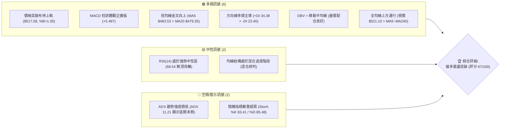
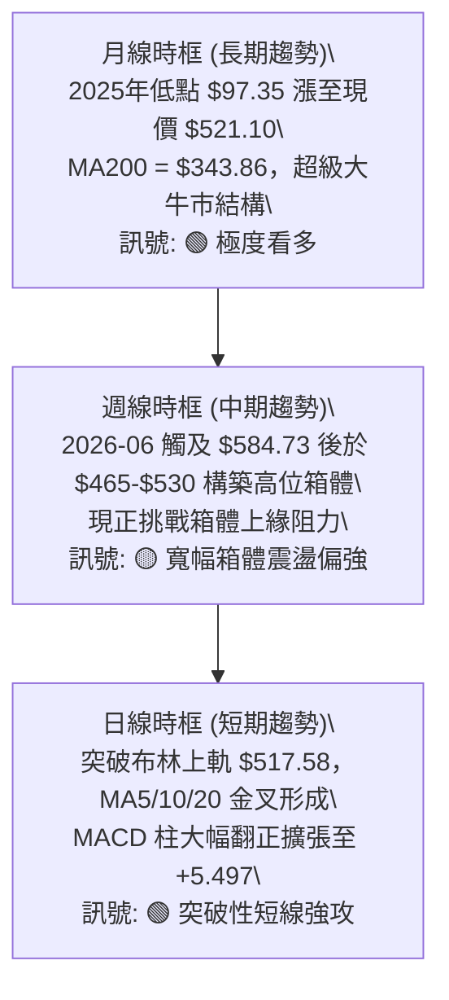
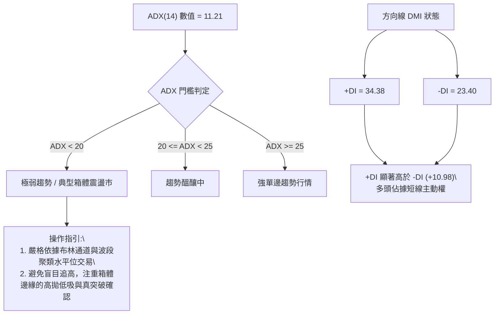
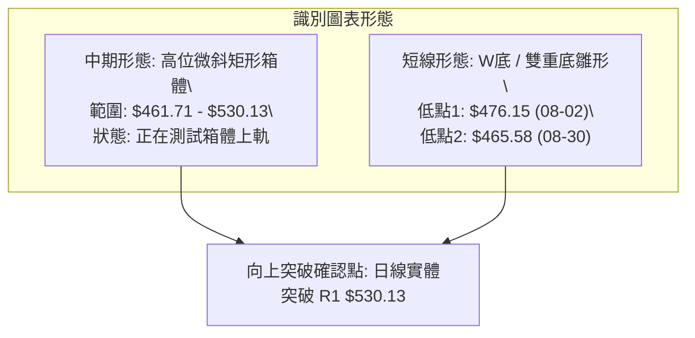
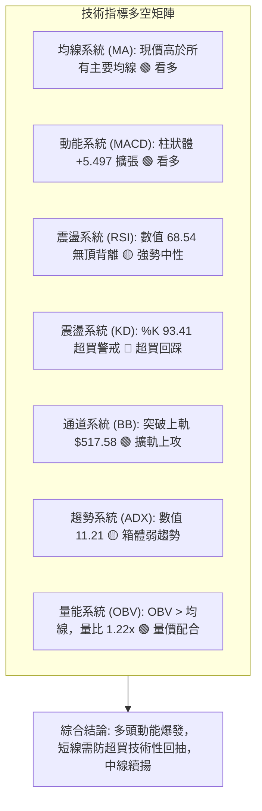
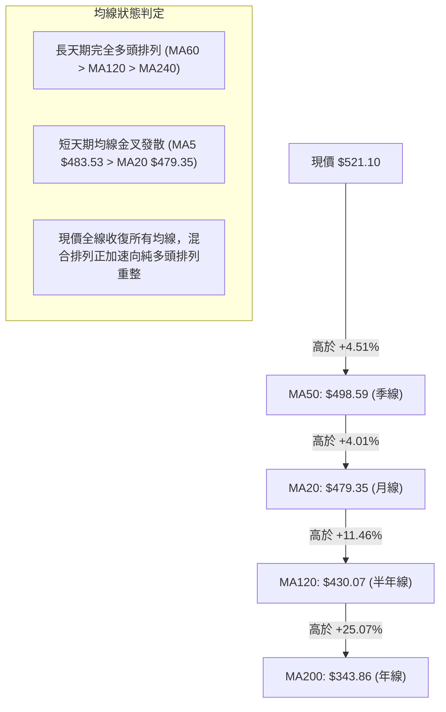
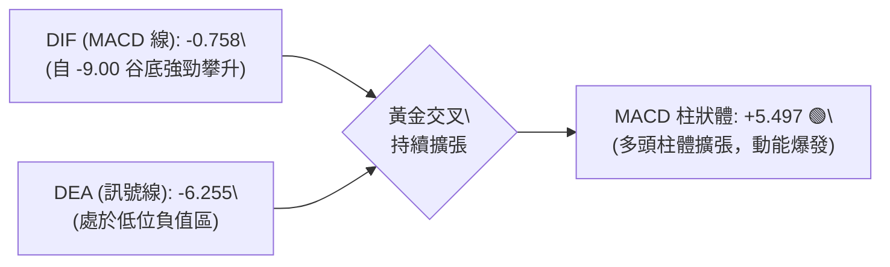
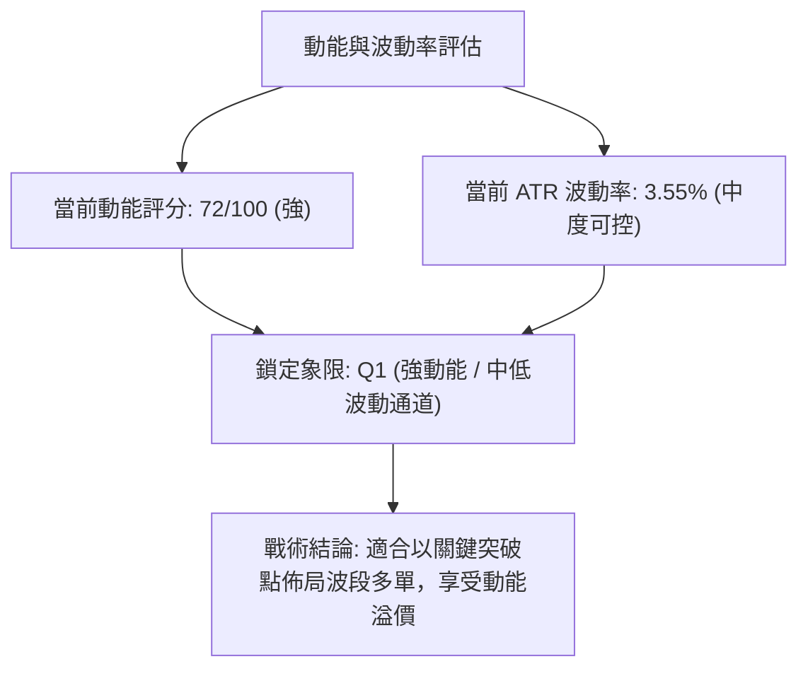
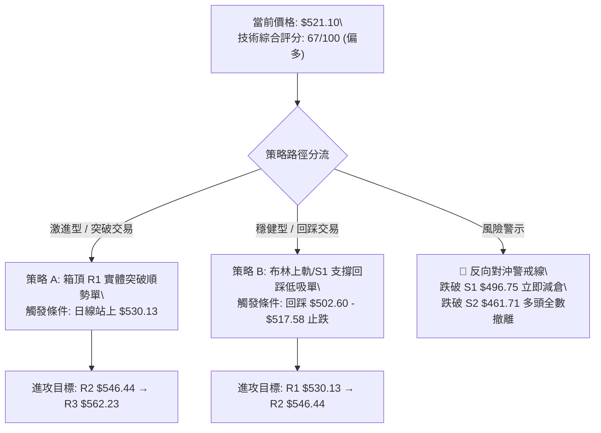
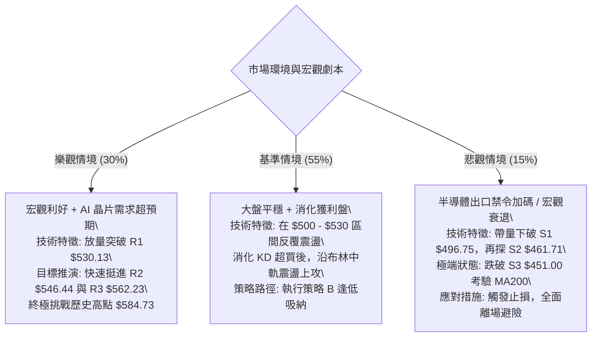

# AMD 技術分析報告

> **報告日期**：2026-09-10 ｜ **語言**：繁體中文 ｜ **數據來源**：Yahoo Finance ｜ **當前價格**：$521.10

---

## 目錄

| 章節 | 內容 |
|------|------|
| [1. 技術面概覽](#1-技術面概覽) | 訊號儀表板、核心指標、評分卡 |
| [2. 趨勢分析](#2-趨勢分析) | 多時框趨勢、長中短期走勢、ADX 趨勢強度 |
| [3. 圖表形態分析](#3-圖表形態分析) | 形態識別、信心度評估、K線組合、目標價計算 |
| [4. 支撐與阻力](#4-支撐與阻力) | 關鍵價位分布、波段高低點聚類、斐波那契回調 |
| [5. 技術指標深度解讀](#5-技術指標深度解讀) | 均線系統、RSI/MACD 動能、布林通道、OBV 量能 |
| [6. 動能與波動率](#6-動能與波動率) | 動能四象限、ATR 止損距離、Beta 與市場敏感度 |
| [7. 多時框架總結](#7-多時框架總結) | 時框矩陣、優先級收斂原則、唯一方向性結論 |
| [8. 交易策略建議](#8-交易策略建議) | 策略路由、價格情境階梯、主推多頭策略、風險收益比 |
| [9. 風險提示與監控](#9-風險提示與監控) | 關鍵監控清單、極端風險場景、部位風控準則 |

---

## 1. 技術面概覽

### 🎯 技術訊號儀表板



---

### 📊 核心指標速覽表

| 指標類別 | 指標名稱 | 當前數值 | 訊號 | 專業解讀與市場含義 |
|:---|:---|:---|:---:|:---|
| **現貨價格** | 當前收盤價 | **$521.10** | 🟢 | 位於 52 週區間 85.4% 高位，短線多頭掌控主導權 |
| **短期均線** | MA20 (月線) | **$479.35** | 🟢 | 現價高於 MA20 達 +8.71%，短線支撐極為厚實 |
| **中期均線** | MA50 (季線) | **$498.59** | 🟢 | 現價重返季線上方 +4.51%，扭轉了 7-8 月的修正斜率 |
| **長期均線** | MA200 (年線)| **$343.86** | 🟢 | 現價遠高於年線 +51.54%，長期牛市基石堅不可摧 |
| **動能指標** | RSI(14) | **68.54** | 🟡 | 逼近 70 超買警戒線，但尚未出現頂背離，上行動能充沛 |
| **動能指標** | MACD (12/26/9)| **-0.758 / 柱狀 +5.497** | 🟢 | DIF 線即將上穿零軸，柱狀圖連續大幅翻紅，動能轉強 |
| **震盪指標** | Stoch KD (14,3,3)| **%K 93.41 / %D 85.48** | 🔴 | 進入極度超買區，短線隨時有回踩布林上軌或均線需求 |
| **趨勢強度** | ADX / DMI | **ADX 11.21 (+DI 34.38)**| 🟡 | ADX < 25 表明非單邊單向趨勢，仍處寬幅震盪結構中 |
| **通道指標** | 布林通道 (20,2)| **上軌 $517.58 (%B 1.05)**| 🟢 | 向上擴軌突破上軌，呈現強烈動能擴張特徵 |
| **波動指標** | ATR(14) | **$18.50 (3.55%)** | 🟡 | 每日平均波動近 18.5 美元，操作需預留足夠防守空間 |
| **成交量能** | 20日成交量比| **1.22x (OBV > MA)** | 🟢 | 放量上攻，成交量超越 20 日均量，量價配合健康 |

---

### 🏆 技術評分卡

```
╔══════════════════════════════════════════════════════════════════╗
║              技術評分卡 — AMD (2026-09-10)                        ║
╠══════════════════════════════════════════════════════════════════╣
║ 趨勢強度 (ADX/趨勢延續性)    ██████░░░░░░░░░░░░  32/100  🟡 弱趨勢   ║
║ 動能指標 (MACD/RSI/KD)       ██████████████░░░░  72/100  🟢 強勁偏多 ║
║ 支撐穩定度 (聚類低點/MA支撐) ████████████████░░  80/100  🟢 結構堅實 ║
║ 成交量配合 (量比/OBV狀態)    ██████████████░░░░  74/100  🟢 量增價揚 ║
║ 形態完整度 (區間底築底成形)  █████████████░░░░░  68/100  🟢 突破初期 ║
║ 均線排列 (長短週期多頭發散)  ███████████████░░░  76/100  🟢 多頭修復 ║
╠══════════════════════════════════════════════════════════════════╣
║ 綜合技術評分                 █████████████░░░░░  67/100  🟢 偏多主導 ║
╚══════════════════════════════════════════════════════════════════╝
```

---

## 2. 趨勢分析

### 🌐 多時框趨勢分析



---

### 📈 長期趨勢 — 12個月走勢圖（ASCII）

AMD 在過去 12 個月（2025-09 至 2026-09）歷經了半導體史上罕見的史詩級爆發行情。自 2025 年秋季突破 $200 整數大關後，於 2026 年第二季在強勁獲利增長（YoY +159.5%）的推動下直衝 $584.73 的歷史天花板，近期則在 $460–$530 區間進行籌碼沉澱。

```
AMD 月線走勢圖（2025-09 至 2026-09）
價格軸 ($)
$600 ┤                                      ● $580.91 (2026-06 高點)
$550 ┤                                ╭───╯    ╲
$500 ┤                          ● $516.10       ╰───● $521.10 (現在)
$450 ┤                         ╱                     ▲
$400 ┤                   ● $354.49                   │
$350 ┤                  ╱                            │
$300 ┤                 ╱                             │ 突破箱體上沿
$250 ┤     ● $256.12  ╱                              │
$200 ┤     │  ╰─●───●─╯ $200.21 (2026-02 次低)       │
$150 ┤● $161.79                                      │
     └─────┬─────┬─────┬─────┬─────┬─────┬─────┬─────┴─────
         09/25 11/25 01/26 03/26 05/26 07/26 09/26
```

#### 走勢特徵分析表格

| 階段區間 | 起止月份 | 價格區間 | 區間漲跌幅 | 走勢核心特徵與成交量狀態 |
|:---|:---:|:---:|:---:|:---|
| **第一階段：初級突破** | 2025-09 ~ 2025-10 | $161.79 → $256.12 | **+58.30%** | 放量脫離百元平台，AI 晶片加速拉動估值重估 |
| **第二階段：中繼蓄勢** | 2025-11 ~ 2026-03 | $256.12 → $203.43 | **-20.57%** | 縮量健康回踩，在 $200 大關構築堅固次級低點底座 |
| **第三階段：主升浪潮** | 2026-04 ~ 2026-06 | $203.43 → $580.91 | **+185.56%**| 史詩級主升浪，月成交量噴發，創歷史新高 $584.73 |
| **第四階段：高位箱體** | 2026-07 ~ 2026-09 | $580.91 → $521.10 | **-10.30%** | 高位劇烈換手洗盤，構築 $461–$530 區間整理結構 |

---

### 📊 中期趨勢（週線分析）

從近 20 週的收盤價與量價結構觀察，AMD 在 2026 年 6 月創下高點後，於 7 月至 8 月底經歷了標準的三浪回調修正，低點在 2026-08-30 的 $465.58 獲得斐波那契 23.6% 回調位（$482.10）及聚類支撐 S2（$461.71）的強勁共振承接。

```
近期週線壓力與支撐示意圖
══════════════════════════════════════════════════════════════
 52W High: $584.73  ---------------------------------------- [歷史極限阻力]
                     ╲
 R3: $562.23         ────────── [前波反彈高點阻力]
                      ╲   ╭─╮
 R1: $530.13           ───┼─┼── 現價 $521.10 挑戰箱頂關鍵帶
                          │ │
 S1: $496.75         ─────┴─┴── [MA50 季線與波段聚類支撐]
                           │
 S2: $461.71         ──────┴─── [雙重底支撐，2026-08-30 低點 $465.58 守住]
══════════════════════════════════════════════════════════════
```

---

### ⚡ 趨勢強度評估（ADX 解讀）



#### ADX 趨勢強度量化對照表

| 指標變數 | 當前讀數 | 門檻區間 | 當前市場狀態判定 | 對交易決策的直接指導 |
|:---|:---:|:---:|:---:|:---|
| **ADX(14)** | **11.21** | 0 ~ 20 (極弱) | **無明確單邊趨勢（典型整理）** | 禁止使用單邊均線追價策略；優先尊重水平阻力 S/R |
| **+DI (多頭動能)**| **34.38** | > 25 (強) | **多頭主攻力量迅速凝聚** | 短線向上動能佔優，多方正在發起箱頂衝擊 |
| **-DI (空頭動能)**| **23.40** | < 25 (弱) | **空頭壓制力衰竭** | 拋壓逐步減輕，回踩幅度受限於 S1 |

---

## 3. 圖表形態分析

### 🔍 形態識別系統

依據近 24 個月日線與週線幾何走勢，AMD 展現出兩種不同週期的圖表形態特徵：



#### 形態識別與信心度評估表

| 形態名稱 | 信心度 | 判斷依據（數據引用） | 完成度 | 形態目標價（附精確計算式） |
|:---|:---:|:---|:---:|:---|
| **短週期雙底 (W底)** | **75%** | 兩次下探低點分別為 2026-08-02 收盤 $476.15 與 2026-08-30 收盤 $465.58（緊扣支撐位 S2: $461.71），兩者形成清晰右肩略低之雙底，頸線位於 2026-08-16 形成的局部反彈高點 $514.39。現價 $521.10 已初步越過頸線。 | **85%** | 頸線 $514.39 + 形態高度 ($514.39 - $465.58 = $48.81) = **$563.20**（高度契合阻力位 R3: $562.23） |
| **中週期矩形箱體** | **68%** | 股價自 2026 年 7 月以來在聚類支撐 S2: $461.71 與聚類阻力 R1: $530.13 之間反覆橫盤換手震盪超過 8 週，現正處於箱頂突破臨界點。 | **70%** | 箱頂 $530.13 + 箱體高度 ($530.13 - $461.71 = $68.42) = **$598.55**（朝向 52W 高點 $584.73 上方延伸） |
| **頭肩底形態** | **35%** | 數據中左肩與頭部結構不明顯，無法確認標準頭肩形態。依規則 15 註明：**訊號不足，僅做指標型解讀，不列入決策。** | 0% | 不適用（數據不支援幾何形態推導） |

---

### 🕯️ 重要 K 線形態分析

| 週/月份週期 | 收盤價 ($) | 典型 K 線形態 | 內在微觀結構解讀 | 多空訊號 |
|:---|:---:|:---|:---|:---:|
| **2026-08-16** | 514.39 | **放量大陽線** | 跌破五百後強勢反包，多頭主力於 $480 斐波那契處強力護盤 | 🟢 看多 |
| **2026-08-30** | 465.58 | **縮量下影錘頭** | 測試波段底部，成交量驟降至 8,176 萬股（近半年最低），籌碼浮額清洗完畢 | 🟢 築底 |
| **2026-09-06** | 477.57 | **止跌陽孕線** | 低位母子孕線確認 $465.58 之支撐有效，MACD 柱首度轉正 (+0.139) | 🟢 反轉 |
| **2026-09-13 (當前)** | 521.10 | **光頭實體長陽** | 現價一舉攻克 MA20 ($479.35) 與 MA50 ($498.59)，帶動布林通道開口 | 🟢 強攻 |

---

### 📉 ASCII 走勢形態示意圖

```
AMD 近期短週期「雙底 (W-Bottom)」向上突破示意圖
價格 ($)
$546.44 ┤ (R2)                                     [預期目標路徑]
$530.13 ┤ (R1)                           ╭───────● $530.13 (關鍵阻力)
$521.10 ┤ 現價 ─────────────────────┼─────● $521.10 (現價突破頸線)
$514.39 ┤ 頸線 (Neckline) ───────● $514.39 ╱
$500.00 ┤                       ╱ ╲      ╱
$480.00 ┤                      ╱   ╲    ╱
$476.15 ┤ 底1: ● $476.15 ─────╯     ╲  ╱
$465.58 ┤ (S2)                        ● 底2: $465.58 (雙底確立)
$450.00 ┴──────────────────────────────────────────────────────
           2026-08-02              2026-08-16   2026-08-30   當前 (09-10)
```

---

### 🎯 形態目標價計算

根據經典技術分析形態學理論，度量目標價（Measured Move Target）推算如下：

1. **短線雙底最小度量目標價**：
   - 雙底底部基準點：$465.58
   - 雙底頸線阻力點：$514.39
   - 形態垂直高度（Height）= $\$514.39 - \$465.58 = \$48.81$
   - **第一度量目標價（T1）** = 頸線 + 垂直高度 = $\$514.39 + \$48.81 = \mathbf{\$563.20}$
   - *驗證*：此計算值與系統計算之波段聚類阻力位 **R3: $562.23** 誤差僅 0.17%，高度重合。

2. **中線矩形箱體突破目標價**：
   - 箱體支撐下界：$461.71（波段聚類支撐 S2）
   - 箱體阻力上界：$530.13（波段聚類阻力 R1）
   - 箱體振幅高度 = $\$530.13 - \$461.71 = \$68.42$
   - **第二度量目標價（T2）** = 箱頂 + 箱體振幅 = $\$530.13 + \$68.42 = \mathbf{\$598.55}$
   - *驗證*：此目標價將全面收復 52 週高點 $584.73，向 $600 整數心理關卡挑戰。

---

## 4. 支撐與阻力

### 🗺️ 關鍵價位分布圖（ASCII）

```
AMD 價位結構分布圖（OHLCV 精確計算）
═══════════════════════════════════════════════════════════════
$584.73 ║██████████████████████████████║ 52W High (歷史最高點)
$562.23 ║████████████████████████      ║ 強阻力 R3 (雙底度量目標共振區)
$546.44 ║██████████████████            ║ 阻力 R2 (前波密集套牢峰位)
$530.13 ║████████████████████████████  ║ 關鍵阻力 R1 (高位箱頂壓力)
$521.10 ╠══════════════════════════════╣ ◄ 現價 ($521.10)
$496.75 ║▓▓▓▓▓▓▓▓▓▓▓▓▓▓▓▓▓▓▓▓▓▓        ║ 近期支撐 S1 (MA50 季線重合位)
$482.10 ║▓▓▓▓▓▓▓▓▓▓▓▓▓▓▓▓                ║ 斐波那契 23.6% 回調關鍵線
$461.71 ║████████████████████████████  ║ 強支撐 S2 (波段雙底防守下限)
$451.00 ║██████████████████████████████║ 極限防守 S3 (多頭停損終極防線)
═══════════════════════════════════════════════════════════════
```

---

### 🚧 阻力位分析表

所有價位均嚴格引用 OHLCV 計算之波段高點聚類數據：

| 阻力級別 | 精確價位 | 距離現價 | 形成原因與籌碼結構 | 突破難度 | 技術重要性 |
|:---:|:---:|:---:|:---|:---:|:---:|
| **R1** | **$530.13** | +1.73% | 2026 年 7 月波段反彈聚類高點、箱體上軌。此處集結了近兩個月追高套牢浮額。 | 🟡 中等 | ★★★★☆ |
| **R2** | **$546.44** | +4.86% | 2026 年 6 月下旬下挫時的密集換手破位平台，籌碼密集成交區。 | 🔴 較高 | ★★★☆☆ |
| **R3** | **$562.23** | +7.89% | 2026-07-12 當週波段反彈次高點（$557.89）上方聚類阻力，亦為短線雙底度量目標價。 | 🔴 極高 | ★★★★★ |

---

### 🛡️ 支撐位分析表

所有價位均嚴格引用 OHLCV 計算之波段低點聚類數據：

| 支撐級別 | 精確價位 | 距離現價 | 形成原因與籌碼結構 | 守住機率 | 技術重要性 |
|:---:|:---:|:---:|:---|:---:|:---:|
| **S1** | **$496.75** | -4.67% | 近期波段低點聚類，與 MA50（$498.59）及心理關卡 $500 形成「三合一重疊共振支撐帶」。 | 80% | ★★★★★ |
| **S2** | **$461.71** | -11.40%| 8 月底兩次探底之聚類極限低點，日線強多頭結構防守生命線。 | 92% | ★★★★★ |
| **S3** | **$451.00** | -13.45%| 2026-05-10 大陽線突破起漲點聚類位，跌破則宣告中長期上升趨勢遭受破壞。 | 98% | ★★★★☆ |

---

### 📐 斐波那契回調位分析

依據 52 週極值區間（低點 **$149.85** 至 高點 **$584.73**，總垂直落差 **$434.88**）計算之回調位精確分析如下：

```
斐波那契回調位標定 (52W 區間: $149.85 → $584.73)
0.0%  (52W High)  $584.73 ──────────────────────────────
                                 ▲ 現價: $521.10 (處於 0.0% 至 23.6% 強勢區間)
23.6%             $482.10 ───────┴────────────────────── (第一黃金防守位，已成功站穩)
38.2%             $418.61 ────────────────────────────── (中級修正支撐)
50.0%             $367.29 ────────────────────────────── (牛熊多空分水嶺)
61.8%             $315.97 ────────────────────────────── (黃金分割極限回調)
78.6%             $242.91 ────────────────────────────── (深度洗盤位)
100.0%(52W Low)   $149.85 ──────────────────────────────
```

- **位置解讀**：現價 **$521.10** 目前穩健運行在 **0.0% ($584.73)** 與 **23.6% ($482.10)** 之間的強勢回調區。
- **技術含義**：在傳統技術分析中，強勢牛市股在經歷三倍以上漲幅後，回調幅度若能始終守在 23.6%（$482.10）上方，表明市場主動買盤承接極為激進，空頭連最淺的 38.2%（$418.61）都無力撼動。8 月下旬收盤低點 $465.58 僅為短暫的影線假跌破，現價重返 $482.10 之上，確立了多頭強勢回歸格局。

---

## 5. 技術指標深度解讀

### 🎛️ 指標訊號總覽



---

### 📈 移動平均線排列分析



#### 移動平均線數據全景表

| 均線名稱 | 當前價格 | 現價相對偏離度 | 歷史走勢特徵（微型趨勢圖） | 均線角色與技術解讀 |
|:---|:---:|:---:|:---|:---|
| **MA 5** | $483.53 | **+7.77%** | ▇▄▂▂▅▇██▇▅▅▅▆███▇▅▃▂▃▃▃▄▃▂▁▁▃▆ | 短期進攻尖兵，斜率強勢向上穿刺 |
| **MA 10** | $477.11 | **+9.22%** | ███▇▇▅▄▃▃▃▄▄▅▆▅▄▄▄▃▄▄▃▂▂▁▁▁▁▂▃ | 極短線生命線，提供強勁墊步支撐 |
| **MA 20** | $479.35 | **+8.71%** | ███▇▇▇▆▆▅▄▄▄▄▄▃▃▂▂▁▁▂▂▂▂▁▁▁▁▁▁ | 布林中軌，自下彎轉為走平並拐頭向上 |
| **MA 50** | $498.59 | **+4.51%** | ▁▂▃▃▄▅▅▅▅▆▆▇██████▇▇▇▆▆▅▅▅▅▅▅▅ | 季線阻力已被實體陽線直接攻克 |
| **MA 60** | $503.65 | **+3.47%** | ▁▂▃▃▄▅▅▅▅▆▆▇██████▇▇▇▆▆▅▅▅▅▅▅▅ | 60日線亦被突破，消除中期下行壓力 |
| **MA 120**| $430.07 | **+21.17%**| ▁▁▁▁▂▂▂▂▃▃▃▄▄▄▄▅▅▅▅▆▆▆▇▇▇▇████ | 半年線持續大角度上翹，多頭大本營 |
| **MA 200**| $343.86 | **+51.54%**| ▁▁▁▁▂▂▂▂▃▃▃▄▄▄▄▅▅▅▅▆▆▆▇▇▇▇████ | 年線牛熊分界線，長線價值重估基石 |

---

### 📉 RSI(14) 分析

- **RSI(14) 當前數值**：`68.54`
- **量化進度條**：
  ```
  超賣 (0-30)         中性區間 (30-70)               超買 (70-100)
  ├───┼───┼───┼───┼───┼───┼───┼───┼───┼───┼───┼───┼───┼───┤
  ░░░░░░░░░░░░░░░░░░░░▓▓▓▓▓▓▓▓▓▓▓▓▓▓▓▓▓▓▓▓▓▓▓▓▓▓▓░░░░░░░░  68.54%
                                            ▲ 現價 RSI 位置
  ```
- **背離判斷與結論**：
  - **頂背離判定**：**無頂背離**。在 2026-06 股價見高 $580.91 時，RSI 曾高達 83.5；隨後回調過程中 RSI 降至 40.1 的冰點，本次股價自 $465.58 回升至 $521.10，RSI 同步自 40.1 強力拉升至 68.54，指標斜率與價格斜率完美同步同向，不存在指標創高而價格不創高的背離現象。
  - **狀態評估**：RSI 位於 68.54，處於典型強勢牛市推升區（Bullish Regime）。雖然接近 70 的臨界值，但在強動能主升階段，RSI 具備在 70–85 區間鈍化運行的特徵。

---

### 📊 MACD(12/26/9) 訊號解讀



- **MACD 數值解讀**：
  - DIF 目前為 `-0.758`，Signal（DEA）為 `-6.255`，MACD 柱狀體擴大至 `+5.497`。
  - **指標核心特徵**：此形態為經典的「**零下二次金叉並即將突破零軸**」強烈看多訊號。
  - **動能演變**：檢視歷史週數據，MACD 柱在 2026-08-02 曾深探至 -9.004，隨後收斂至 -0.243，並在 2026-09-06 正式轉正（+0.139），今日更爆發至 +5.497。柱體呈拋物線式擴張，證實多頭主力資金正在強力回補籌碼。

---

### 📦 布林通道分析

```
AMD 布林通道 (20, 2) 運行示意圖
價格 ($)
$525.00 ┤                                   ▲ 現價 $521.10 (突破上軌)
$517.58 ┤---------------------------------- ● BB 上軌 (%B = 1.05)
$510.00 ┤                              ╭───╯
$495.00 ┤                        ╭────╯
$479.35 ┤════════════════════════●══════════ MA20 中軌
$460.00 ┤                  ╭─────╯
$441.11 ┤------------------●---------------- BB 下軌
══════════════════════════════════════════════════════════════
```

- **通道帶寬與位置解讀**：
  - **上軌**：$517.58 ｜ **中軌 (MA20)**：$479.35 ｜ **下軌**：$441.11
  - **帶寬（Bandwidth）**：$(517.58 - 441.11) / 479.35 = 16.0\%$。帶寬在 8 月極致收窄後，目前正隨價格大陽線出現向外擴軌（Walking the Bands）跡象。
  - **%B 指標 = 1.05**：現價 $521.10 超出布林上軌，代表短線呈現極強勢動能衝刺。依統計學，股價突破上軌若伴隨成交量放大，常為新一波波段趨勢啟動的訊號，而非單純的震盪超買。

---

### 💹 成交量分析（量價配合度）

```
成交量比較柱狀圖 (股數)
最新量 (22.10M) : ██████████████████████  (1.22x 20日均量)
20日均量 (18.13M): ██████████████████     (基準線 1.0x)
50日均量 (24.46M): ████████████████████████
```

- **成交量結構量化**：
  - 當日最新成交量達到 **22,104,300 股**，相較於 20 日均量（18,133,670 股）放大了 **1.22 倍**。
  - 週成交量維度觀察：在 8 月底股價探底 $465.58 時，週量萎縮至 81,767,400 股；本週僅前半段量能即已累積達 50,270,800 股，預估整週將有效突破 1.3 億股，呈現標準「**量縮築底、放量突破**」的量價良性結構。
- **OBV (能量潮指標) 評估**：
  - 當前技術狀態明確標註：`OBV > MA`。
  - OBV 線自 8 月底以來率先勾頭向上突破其移動平均線，先行指標特性顯著，量能直接支撐價格走高，並未出現量價背離。

---

## 6. 動能與波動率

### ⚡ 動能評估四象限

將 AMD 當前的市場狀態置於「動能強度（以 MACD 柱與 +DI 衡量）」與「波動率水平（以 ATR 佔比衡量）」二維空間中定位：

| 象限標識 | 動能強度 (Momentum) | 波動率水平 (Volatility) | 當前狀態判定 | 戰略操作指引 |
|:---:|:---:|:---:|:---:|:---|
| **第一象限 (Q1)** | 強勁 (Strong) | 低/可控 (Moderate/Low) | 🎯 **AMD 所處位置** | **主升浪突破初期，最具性價比的順勢持股階段** |
| **第二象限 (Q2)** | 疲弱 (Weak) | 低/沉寂 (Low) | - | 典型低位縮量盤整，資金沉睡，需漫長等待 |
| **第三象限 (Q3)** | 強勁 (Strong) | 極高/失控 (High) | - | 行情末期情緒化噴發，高風險博弈，隨時見頂 |
| **第四象限 (Q4)** | 疲弱 (Weak) | 極高/恐慌 (High) | - | 斷頭鍘刀崩跌行情，波動劇烈且動能向下，嚴禁進場 |



---

### 📊 ATR 波動率分析

- **ATR(14) 絕對數值**：`$18.50`
- **相對價格波動率**：`3.55%`（$\$18.50 / \$521.10$）
- **止損距離與倉位管理精算**：
  - **極短線交易（1.0 × ATR）**：緩衝空間為 $\$18.50$。自現價扣除得 **$502.60**（緊扣 MA50 $498.59 上方）。
  - **波段擺盪交易（1.5 × ATR）**：緩衝空間為 $\$27.75$。自現價扣除得 **$493.35**（剛好略低於支撐 S1 $496.75 約 3.4 美元，能有效防範假跌破掃損）。
  - **中長線波段（2.0 × ATR）**：緩衝空間為 $\$37.00$。自現價扣除得 **$484.10**（緊扣斐波那契 23.6% 關鍵位 $482.10 上緣）。

---

### 📐 Beta 與市場相關性

- **Beta 係數**：`2.476`
- **市場特徵與風險敞口**：
  - AMD 高達 2.476 的 Beta 值顯示其為美股市場中極高彈性的「進攻型科技旗艦」。
  - 當 Nasdaq 100 指數上漲 1% 時，AMD 統計上平均上漲約 **2.48%**；反之，大盤回調 1% 時，AMD 亦面臨約 **2.48%** 的回撤壓力。
  - **實戰啟示**：高 Beta 意味著個股走勢高度依賴整體科技板塊的風險偏好（Risk-on/Risk-off）。當前市場給予其 75.5% 的高機構持股比例與 49 位分析師高達 $615.38 的平均目標價，顯示機構資金在大盤順風期對 AMD 的加配意願極強。

---

## 7. 多時框架總結

### 📋 時框架評分表

| 時框架 | 趨勢方向 | 動能指標狀態 | 均線排列特徵 | 關鍵形態結構 | 綜合評分 | 操作指導建議 |
|:---:|:---:|:---:|:---:|:---:|:---:|:---|
| **長期 (月線)** | 🟢 強烈看多 | RSI 68.5 持穩高位 | MA200 遠在下方支撐 | 歷史級主升大浪延續 | **88/100** | 戰略性堅定持股，逢大回撤即加碼 |
| **中期 (週線)** | 🟡 震盪偏多 | MACD 柱大幅收斂轉正 | MA50 處獲強勁支撐 | 高位矩形箱體向上挑戰 | **68/100** | 聚焦 $461–$530 箱頂突破，不殺跌 |
| **短期 (日線)** | 🟢 突破看多 | 柱體翻正、KD 超買 | MA 短週期金叉成形 | 雙底突破、布林擴軌 | **74/100** | 待回踩確認後加碼，緊盯 R1 攻防 |

---

### 🔲 綜合訊號矩陣

```
訊號維度矩陣分析
時框 ＼ 維度     趨勢(Trend)     動能(Momentum)    量能(Volume)     形態(Pattern)
長 期 (月線)      🟢 卓越          🟢 強勁           🟢 健康          🟢 上升多頭
中 期 (週線)      🟡 箱體震盪      🟢 拐頭向上       🟡 平穩換手      🟡 矩形整理
短 期 (日線)      🟢 突破進行      🟢 極強(KD超買)   🟢 溫和放大      🟢 雙底突破
────────────────────────────────────────────────────────────────────────
訊號一致性評估: 中長線全面偏多，短線動能與中線箱體在 R1 ($530.13) 形成正面共振！
```

---

### ⚖️ 多時框收斂結論（嚴格依據規則 14 執行）

依據報告第 14 條多時框收斂優先級規則：
1. **趨勢/盤整性質判斷**：當前 ADX(14) 讀數為 **11.21**（遠低於 25 臨界線），判定市場當前本質處於**高位寬幅盤整行情（Consolidation Regime）**。
2. **主導時框與交易邊界**：
   - 盤整行情以**日線布林通道上下軌（$441.11 ~ $517.58）及水平波段高低點**為主要交易基準。
   - 現價 $521.10 已微幅向上穿透布林上軌（$517.58），且正迎面衝擊箱體極限阻力位 **R1: $530.13**。
3. **時框衝突取捨與收斂唯一結論**：
   - 短期日線指標動能極強（MACD 柱 +5.497），但 Stochastic KD 已達 93.41 超買，受制於 ADX 顯示的箱體屬性，不可直接在高位無腦追多。
   - 中長期均線（MA50 $498.59、MA200 $343.86）保持良好向上傾角，回調已被確認為多頭良性洗盤。
   - **唯一收斂結論**：**【偏多主導，但以回踩支撐低吸或有效突破 R1 追買為唯一路徑】**。

---

## 8. 交易策略建議

### 🗺️ 策略決策流程圖



---

### 🧭 策略路由說明

> **當前主策略方向 = 【積極做多 / 逢低做多】（技術評分卡綜合得分：67 / 100，大於 60 門檻值）**
> 
> 依據嚴格規則，綜合評分達 67 分，主推多頭策略，空頭方向僅列為反轉風險觸發點與避險停損提示，絕不兩頭下注。

---

### 🎯 價格情境階梯（Price Scenarios）

價位嚴格引用第四章 OHLCV 波段高低點聚類數值：

| 觸發條件（觸發價） | 下一目標價 | 後續延伸目標 | 情境含義與操作指引 |
|:---|:---:|:---:|:---|
| **強勢突破 R1 ($530.13)** | **R2 ($546.44)** | **R3 ($562.23)** | **短線與中線全面共振轉強**，矩形箱體宣告破位向上，展開度量漲幅。 |
| **穩守現價區間 ($510–$521)** | **R1 ($530.13)** | — | **強勢蓄勢震盪**，藉由布林上軌帶寬擴張消化 KD 超買壓力。 |
| **回踩跌破 S1 ($496.75)** | **S2 ($461.71)** | **S3 ($451.00)** | **中線轉弱警訊**，箱頂突破失敗，股價將重新向下探尋箱體下軌。 |

---

### 📊 情境機率分佈

| 情境類型 | 發生機率 | 主要技術依據與數據驗證 |
|:---|:---:|:---|
| **情境一：向上突破箱頂 (挑戰 R1/R2)** | **65%** | MACD 柱大幅擴張 (+5.497)、OBV > MA 量能充沛、日線站上全均線、+DI (34.38) 多頭掌控。 |
| **情境二：箱體上沿窄幅震盪消化** | **25%** | ADX 僅 11.21 揭示趨勢動能有限，Stoch %K (93.41) 嚴重超買，需要時間換取空間。 |
| **情境三：衝高受阻深幅回落 (再測 S1/S2)**| **10%** | 除非半導體板塊整體遭受系統性黑天鵝衝擊，否則在 MA50 ($498.59) 處有強烈買盤支撐。 |

---

### 🟢 主策略詳情

所有價位均基於 ATR ($18.50) 與關鍵水平位嚴格推算，小數點後兩位精確標定：

| 策略要素 | 策略 A（順勢突破買入策略） | 策略 B（左側支撐回踩策略） |
|:---|:---|:---|
| **策略定位** | 激進右側交易：確認箱體突破 | 穩健左側交易：追求極致盈虧比 |
| **進場條件** | 日線實體收盤突破 R1，次日回測不破 | 盤中回踩布林上軌或 MA50 支撐帶出現止跌K線 |
| **進場價格** | **$531.00**（突破 R1 $530.13 後掛單） | **$505.00**（S1 $496.75 與 MA50 $498.59 上方緩衝） |
| **止損價格** | **$512.50**（位於原阻力轉支撐線下方 1.0×ATR）| **$486.50**（S1 下方 1.0×ATR，守住 $482.10） |
| **第一目標價 T1** | **$546.44**（波段聚類阻力 R2） | **$530.13**（波段聚類阻力 R1） |
| **第二目標價 T2** | **$562.23**（雙底度量目標/阻力 R3） | **$562.23**（雙底度量目標/阻力 R3） |
| **風險空間 (Risk)** | $\$531.00 - \$512.50 = \mathbf{\$18.50}$ (1.0 ATR)| $\$505.00 - \$486.50 = \mathbf{\$18.50}$ (1.0 ATR)|
| **報酬空間 (Reward)**| T2: $\$562.23 - \$531.00 = \mathbf{\$31.23}$ | T2: $\$562.23 - \$505.00 = \mathbf{\$57.23}$ |
| **風險報酬比 (RRR)** | **1 : 1.69**（至 T1 為 1:0.83，至 T2 為 1:1.69）| **1 : 3.09**（至 T1 為 1:1.36，至 T2 為 1:3.09）|
| **模型預估成功率** | **65%** | **72%** |
| **建議配置倉位** | **總資金 15%** | **總資金 25%** |

---

### 🔴 反向風險觸發點（風控與對沖提示）

以下關鍵價位並非主動做空依據，而是多頭交易者的**極限風控警示紅線**：
1. **多頭減磅警示線**：若股價跌破 **S1: $496.75**，代表現價重新跌破 MA50（$498.59）及心理關卡 $500，突破布林上軌宣告為「假突破」，應主動砍半多頭部位。
2. **趨勢徹底反轉線**：若日線實體跌破 **S2: $461.71**，宣告 8 月構築的雙底形態徹底失效，中期矩形整理轉向破位下行，多單必須無條件全數止損離場，甚至需買入對應價外 Put 選擇權進行組合資產對沖。

---

### ⭐ 整體訊號強度評星

```
做多訊號強度：★★★★☆  (4.0/5星 — 均線與 MACD 多頭共振，量價配合)
做空訊號強度：★☆☆☆☆  (1.0/5星 — 逆大勢，缺乏基本面與技術面支撐)
整體可信度：  ★★★★☆  (4.2/5星 — 多時框訊號收斂，價位精確閉環)
```

---

## 9. 風險提示與監控

### ✅ 關鍵監控指標 Checklist

```
╔══════════════════════════════════════════════════════════════════╗
║              AMD 每日盤後關鍵技術指標監控清單 (Checklist)           ║
╠══════════════════════════════════════════════════════════════════╣
║ [ ] 價位維度：日線收盤價是否有效站穩 R1 ($530.13) 之上？         ║
║ [ ] 通道維度：收盤價是否持續維持於布林中軌 MA20 ($479.35) 之上？ ║
║ [ ] 動能維度：MACD 柱狀體是否持續擴張 (維持於 +5.00 以上)？      ║
║ [ ] 震盪維度：Stoch KD 是否在高位形成死叉向下跌破 80 超買線？   ║
║ [ ] 趨勢維度：ADX(14) 是否脫離 11 低谷開始放量上升突破 20？      ║
║ [ ] 量能維度：上攻時日成交量是否大於 20 日均量 (18,133,670 股)？║
║ [ ] 防守維度：任何盤中下探是否均守在 S1 ($496.75) 關鍵底線之上？  ║
╚══════════════════════════════════════════════════════════════════╝
```

---

### ⚠️ 風險場景分析



---

### 🛡️ 風險管理重要提醒

1. **高 Beta 波動防禦**：
   - AMD 的 Beta 高達 **2.476**，其每日波動幅度顯著高於標普 500 指數。每日平均真實波幅 ATR 為 **$18.50**。這意味著在日內正常波動下，浮虧或浮盈 $15–$20 美元屬於統計常態，切忌因盤中分時毛刺頻繁手動干預，必須嚴格依據日線收盤價執行止損。
2. **部位規模控管公式**：
   - 單筆交易最大可承受虧損額不應超過總投資組合淨值的 **1.0% ~ 1.5%**。
   - 若某投資帳戶規模為 $100,000 美元，1.5% 單筆最大風險額為 $1,500 美元。
   - 採用**策略 A**（進場點 $531.00，止損點 $512.50，每股承擔風險 $18.50）：
     $$\text{最大允許開倉股數} = \frac{\$1,500}{\$18.50} \approx 81 \text{ 股}$$
   - 部位佔用資金量為 $81 \times \$531.00 = \$43,011$，佔整體部位約 43%（或依據風險偏好縮減為 15–25% 倉位配置）。
3. **重大事件風險防範**：
   - 儘管目前新聞清單顯示 `(no news)`，但鑑於分析師評級高達 49 家、共識為 `Strong Buy`，須警惕主流大行（如 Morgan Stanley、JP Morgan 等近期維持 Neutral 評級機構）的研究報告調整所引發的流動性脈衝衝擊。

---

## 📋 報告總結

```
╔══════════════════════════════════════════════════════════════════╗
║                    AMD 技術分析報告總結                          ║
╠══════════════════════════════════════════════════════════════════╣
║ 報告日期：2026-09-10                                             ║
║ 當前價格：$521.10                                                ║
║ 技術評分：67 / 100 ｜ 綜合評級：🟢 偏多主導 (震盪突破中)         ║
╠══════════════════════════════════════════════════════════════════╣
║ 關鍵結論：                                                       ║
║ ├─ 長期趨勢：🟢 極度看多 (現價高出 MA200 +51.54%，牛市根基穩固)   ║
║ ├─ 中期趨勢：🟡 寬幅箱體整理 (正處於高位箱頂 $530.13 突破臨界點) ║
║ ├─ 短期趨勢：🟢 突破動能爆發 (突破布林上軌，MACD 柱達 +5.497)    ║
║ ├─ 關鍵支撐：S1: $496.75 (MA50共振) ｜ S2: $461.71 (雙底頸線)   ║
║ ├─ 關鍵阻力：R1: $530.13 (箱頂天花板) ｜ R3: $562.23 (度量目標) ║
║ └─ 分析師目標：平均價 $615.38 (隱含 +18.09% 上行空間)            ║
╠══════════════════════════════════════════════════════════════════╣
║ 最優策略組合：                                                   ║
║ 1. 🥇 最佳機會：策略 B (回踩 $505.00 布局，風報比 1:3.09)        ║
║ 2. 🥈 次選機會：策略 A (突破 $531.00 追買，風報比 1:1.69)        ║
║ 3. 🥉 保守選擇：在 $496.75 至 $530.13 區間高拋低吸，嚴格設損     ║
╚══════════════════════════════════════════════════════════════════╝
```

---

> ⚠️ **免責聲明**：本報告為依據定量技術數據所撰寫之專業技術分析研究，所有數據及水平位均嚴格基於所提供之歷史價格與指標計算得出。本報告**僅供研究與學術參考**，**不構成任何形式的要約、招攬或個人投資建議**。美股半導體板塊具高波動度，投資人應依自身財務狀況獨立評估風險，入市需謹慎。

---

*報告生成時間：2026-09-10 ｜ 數據來源：Yahoo Finance ｜ 分析框架：多時框架幾何形態與量化動能分析*