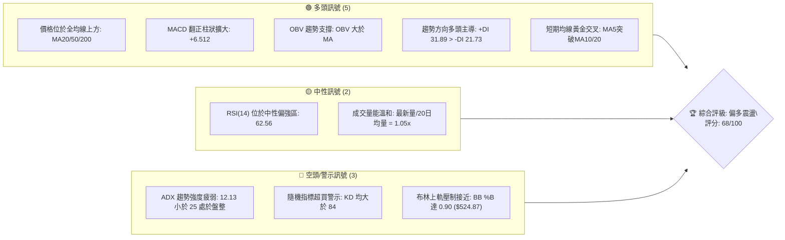
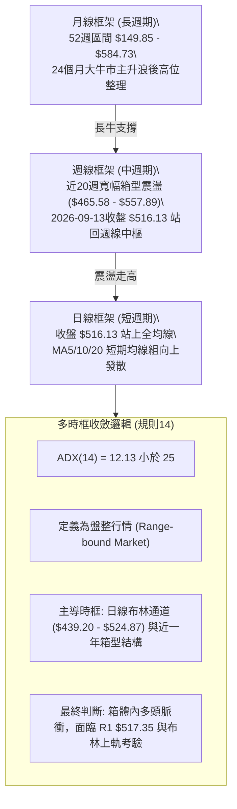
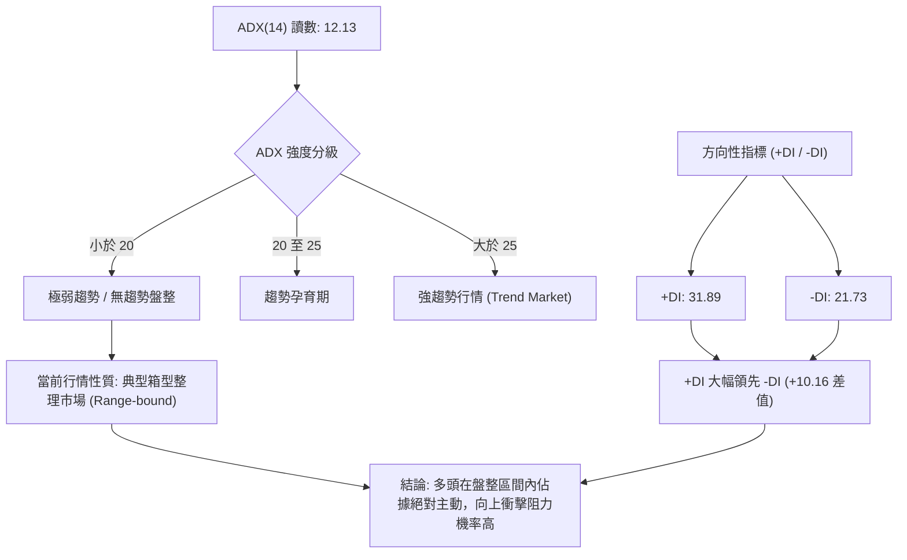
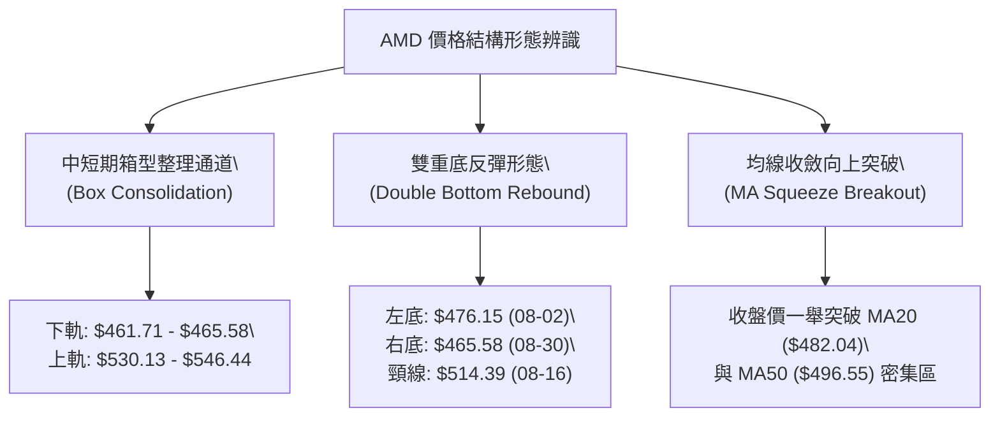
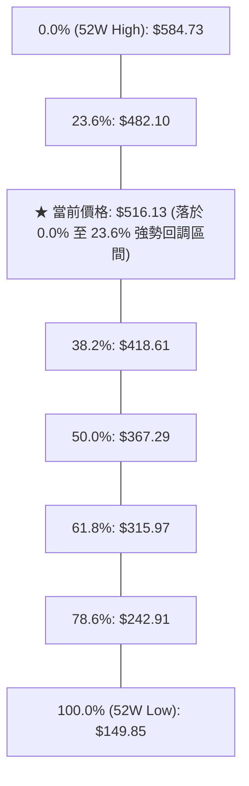
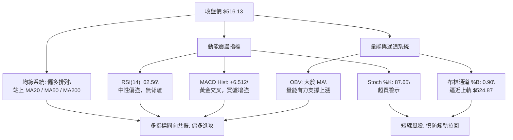
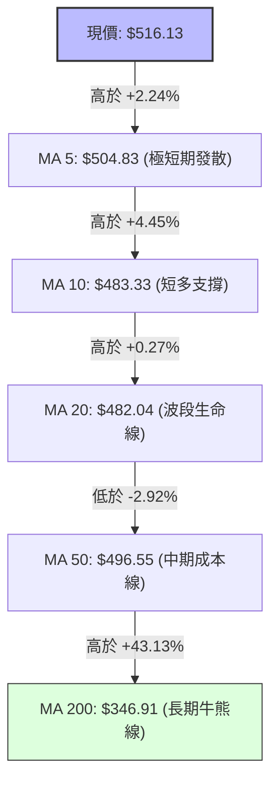
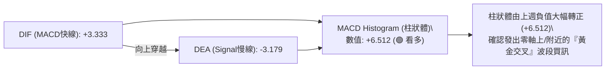
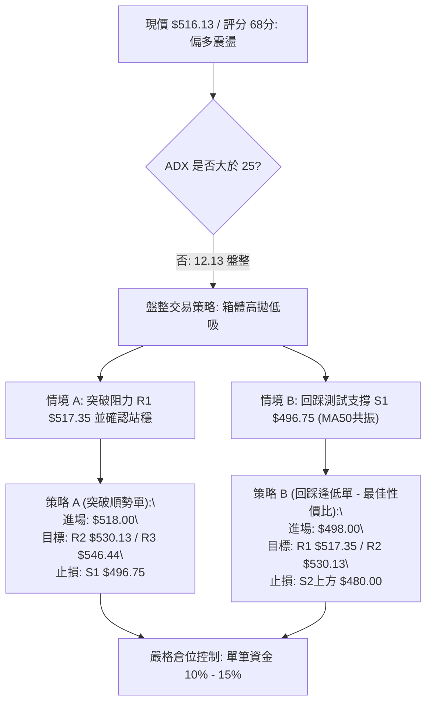
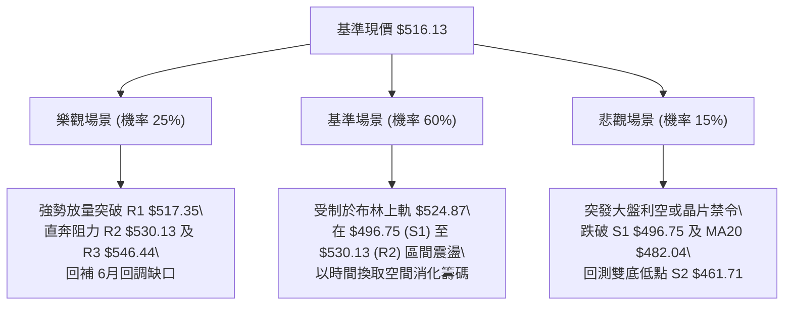

# AMD 技術分析報告

> **報告日期**：2026-09-12 ｜ **語言**：繁體中文 ｜ **數據來源**：Yahoo Finance ｜ **當前價格**：$516.13

---

## 目錄

| 章節 | 內容 |
|------|------|
| [1. 技術面概覽](#1-技術面概覽) | 訊號儀表板、核心指標、評分卡 |
| [2. 趨勢分析](#2-趨勢分析) | 多時框趨勢、長中短期走勢 |
| [3. 圖表形態分析](#3-圖表形態分析) | 形態識別、K線組合、目標價 |
| [4. 支撐與阻力](#4-支撐與阻力) | 關鍵價位、斐波那契回調 |
| [5. 技術指標深度解讀](#5-技術指標深度解讀) | MA/RSI/MACD/布林/成交量 |
| [6. 動能與波動率](#6-動能與波動率) | 動能評估、ATR、Beta |
| [7. 多時框架總結](#7-多時框架總結) | 時框架評分矩陣 |
| [8. 交易策略建議](#8-交易策略建議) | 多空策略、風險報酬比 |
| [9. 風險提示與監控](#9-風險提示與監控) | 監控指標、風險場景 |

---

## 1. 技術面概覽

### 🎯 技術訊號儀表板



### 📊 核心指標速覽表

| 指標類別 | 指標名稱 | 當前數值 | 訊號 | 解讀 |
|----------|----------|----------|------|------|
| **價格** | 當前價格 | $516.13 | 🟢 | 位於52週區間 84.2% 高位，多頭掌控總體格局 |
| **均線** | MA20 | $482.04 | 🟢 | 價格在MA20上方 +7.07%，短線多方動能充沛 |
| **均線** | MA50 | $496.55 | 🟢 | 價格在MA50上方 +3.94%，中期波段重回升軌 |
| **均線** | MA200 | $346.91 | 🟢 | 價格在MA200上方 +48.78%，長期牛市基石極其穩固 |
| **動能** | RSI(14) | 62.56 | 🟡 | 位於50-70強勢中性區，無背離，尚未進入過熱極值 |
| **動能** | MACD | 3.333 / -3.179 | 🟢 | 快線在慢線上方，柱狀體 +6.512 放大，強勁金叉買訊 |
| **震盪** | Stoch %K / %D | 87.65 / 84.73 | 🔴 | 雙線進入超買區（>80），短線具備技術性拉回壓力 |
| **趨勢** | ADX / +DI / -DI | 12.13 / 31.89 / 21.73 | 🟡 | ADX<25 顯示總體處於寬幅箱型震盪，但 +DI 顯著佔優 |
| **通道** | 布林通道 %B | 0.90 | 🔴 | 價格緊貼上軌 $524.87，需提防短線通道頂部壓制 |
| **波動** | ATR(14) | $19.04 (3.69%) | 🟡 | 每日平均波動幅度約 19 美元，屬於中高波動常態 |

### 🏆 技術評分卡

```
╔══════════════════════════════════════════════════════════════════╗
║                   技術評分卡 — AMD (2026-09-12)                   ║
╠══════════════════════════════════════════════════════════════════╣
║ 趨勢強度 (ADX/通道)    ██████░░░░░░░░░░░░░░  32/100  🔴 弱趨勢   ║
║ 動能指標 (MACD/RSI)    ████████████████░░░░  82/100  🟢 動能充沛 ║
║ 支撐穩定度 (S1/S2/MA)  ████████████████░░░░  80/100  🟢 支撐密集 ║
║ 成交量配合 (OBV/Volume)██████████████░░░░░░  70/100  🟢 價量配合 ║
║ 形態完整度 (箱型/雙底) █████████████░░░░░░░  65/100  🟡 箱型反彈 ║
║ 均線排列 (多時框MA)    ████████████████░░░░  78/100  🟢 均線翻揚 ║
╠══════════════════════════════════════════════════════════════════╣
║ 綜合評分               █████████████░░░░░░░  68/100  🟢 偏多震盪 ║
╚══════════════════════════════════════════════════════════════════╝
```

---

## 2. 趨勢分析

### 🌐 多時框趨勢分析



### 📈 長期趨勢 — 12個月走勢圖（Unicode）

```
AMD 月線走勢圖（過去12個月：2025-10 至 2026-09）
價格軸 ($)
$600 ┤                                  ●(2026-06: $580.91 / 52W高 $584.73)
$550 ┤                            ●(05)
$500 ┤                                        ●(07) ●(08) ●(現價 09: $516.13)
$450 ┤
$400 ┤
$350 ┤                      ●(04: $354.49)
$300 ┤
$250 ┤ ●(2025-10: $256.12)
$200 ┤    ●(11) ●(12) ●(01) ●(02: $200.21 低點) ●(03)
     └───────────────────────────────────────────────────────────► 時間
       10   11   12   01   02   03   04   05   06   07   08   09
       2025 2025 2025 2026 2026 2026 2026 2026 2026 2026 2026 2026
```

#### 走勢特徵分析表格

| 階段 | 時間跨度 | 價格區間 ($) | 區間漲跌幅 | 走勢特徵與結構意涵 |
|------|----------|--------------|------------|--------------------|
| **第一階段：高位築底** | 2025-10 ~ 2026-03 | 256.12 → 203.43 | -20.57% | 在 $200.21 形成堅實底部支撐，清洗前期獲利盤 |
| **第二階段：主升浪狂飆** | 2026-03 ~ 2026-06 | 203.43 → 580.91 | +185.56% | 爆發性多頭單邊行情，創下 52 週歷史高點 $584.73 |
| **第三階段：高位強勢整理** | 2026-06 ~ 2026-08 | 580.91 → 470.72 | -18.97% | 主升浪後的獲利回吐，於斐波那契 23.6% ($482.10) 附近震盪築底 |
| **第四階段：重啟上攻** | 2026-08 ~ 2026-09 | 470.72 → 516.13 | +9.65% | 突破 MA20/50，MACD 翻紅，週線回升重回 $500 大關上方 |

### 📊 中期趨勢（週線分析）

```
AMD 近20週核心價格結構與動能變化示意圖
══════════════════════════════════════════════════════════════════════
52W高點  $584.73 ────────────────────────────────────────── 頂部阻力
週線高點  $557.89 ───────────────● (2026-07-12)
波段阻力  $537.37 ───────● (06-21)
當前收盤  $516.13 ───────────────────────────────────────● (2026-09-13 最新)
週線中樞  $495.76 ───────────────● (07-19)
支撐防線  $465.58 ───────────────────────────────● (08-30 波段箱底)
══════════════════════════════════════════════════════════════════════
```

中期走勢顯示，自 2026-06 觸頂 $580.91 以來，AMD 進入以 $465.58 為箱底、$557.89 為箱頂的寬幅震盪區間。近 3 週收盤自 $465.58 向上彈升至 $477.57，本週長陽拉升至 $516.13，RSI 自 40.1 回升至 62.6，MACD 柱狀由負翻正至 +6.512，週線動能重啟多頭格局。

### ⚡ 趨勢強度評估（ADX 解讀）



#### ADX 強度對照表

| 指標名稱 | 當前讀數 | 門檻標準 | 狀態判斷 | 交易指引 |
|----------|----------|----------|----------|----------|
| **ADX(14)** | 12.13 | < 20 極弱，< 25 弱趨勢 | 🔴 盤整無主導趨勢 | 避免單邊追價，採取區間上下軌高拋低吸策略 |
| **+DI** | 31.89 | > 25 強多頭 | 🟢 多方力量強勁 | 買盤動能充裕，回調支撐有效 |
| **-DI** | 21.73 | < 25 弱空頭 | 🟢 空方受抑 | 賣壓不足以發動崩跌，下行空間有限 |

---

## 3. 圖表形態分析

### 🔍 形態識別系統



#### 形態信心度評估表（依規則 15）

| 形態名稱 | 信心度 | 判斷依據（引用數據） | 完成度 | 目標價（附嚴謹計算式） |
|----------|--------|----------------------|--------|------------------------|
| **高位雙底 (Double Bottom)** | 75% | 左底 2026-08-02 週收盤 $476.15，右底 2026-08-30 週收盤 $465.58（接近支撐 S2 $461.71）。當前收盤 $516.13 剛好突破 2026-08-16 中間頸線 $514.39。 | 90% | 頸線 $514.39 + 形態高度 ($514.39 - $465.58 = $48.81) = **$563.20**（接近阻力 R3 $546.44 與 52W 高點區間） |
| **寬幅橫盤箱型 (Rectangle Box)** | 85% | 頂部受制於阻力聚類 R2 $530.13 / R3 $546.44，底部受到支撐聚類 S1 $496.75 / S2 $461.71 強力支撐，符合 ADX=12.13 盤整環境。 | 70% | 箱體震盪上軌目標：**$530.13** (R2) 及 **$546.44** (R3) |
| **頭肩底形態** | 35% | 數據中左肩與右肩結構對稱性不足，缺乏足夠週線取樣點。 | 20% | **訊號不足，僅做指標型解讀**（依規則 15 排除） |

### 🕯️ 重要K線形態分析

| 週/月份 | 收盤價 | K線形態 | 解讀 | 訊號 |
|---------|--------|---------|------|------|
| **2026-06** | $580.91 | 創高流星倒錘 | 衝高 $584.73 後遭遇獲利了結盤，留下長上影線，宣告主升浪暫歇 | 🔴 看空反轉 |
| **2026-07** | $476.15 | 大陰線破位 | 跌破 2026-05 收盤價，快速消化過熱指標，下探測試支撐 | 🔴 延續回調 |
| **2026-08** | $470.72 | 縮量十字錘頭 | 探底至 $465.58 後跌勢趨緩，成交量顯著萎縮至 8,100 萬股，浮額洗淨 | 🟡 止跌信號 |
| **2026-09-06**| $477.57 | 晨星啟動孕線 | 週收盤築底反彈，RSI 在 40.1 觸底回升，空方動能竭盡 | 🟢 轉強信號 |
| **2026-09-13**| $516.13 | 實體大陽線突破 | 連續突破 MA20 ($482.04) 與 MA50 ($496.55)，MACD 柱狀體跳增至 +6.512 | 🟢 強烈看多 |

### 📉 ASCII 走勢形態示意圖

```
AMD 週線雙底突破示意圖 (2026-08 至 2026-09)
價格 ($)
$520 ┤                                        ★ 現價 $516.13 (已越過頸線)
$514 ┤                        頸線峰值 ● $514.39 (08-16)
$500 ┤                          ╭──╯╰──╮
$480 ┤         左底 ● $476.15  │      │
$470 ┤          (08-02) ╰──────╯      │  右底 ● $465.58 (08-30)
$460 ┤                                ╰──────╯ (測試支撐 S2: $461.71)
     └─────────────────────────────────────────────────────────────► 時間
```

### 🎯 形態目標價計算

1. **雙重底測幅目標價**：
   - 頸線位置 ($N$)：$514.39（2026-08-16 週收盤高點）
   - 最低底部 ($L$)：$465.58（2026-08-30 週收盤低點）
   - 形態垂直高度 ($H = N - L$)：$\$514.39 - \$465.58 = \$48.81$
   - 測幅理論目標價 ($T_{Target} = N + H$)：$\$514.39 + \$48.81 = \mathbf{\$563.20}$
2. **箱型突破目標價**：
   - 當前箱體核心支撐為 S1 $496.75，若有效站穩此位置，箱型內部向上反彈波首要目標為阻力位 R2 **$530.13**，若進一步帶量突破則指向阻力位 R3 **$546.44**。

---

## 4. 支撐與阻力

### 🗺️ 關鍵價位分布圖（Unicode）

```
AMD 價位結構分布圖 (2026-09-12)
══════════════════════════════════════════════════════════════════════
$584.73 ║██████████████████████████████████████║ 52W 高點 (歷史天花板)
$546.44 ║██████████████████████████████        ║ 強阻力 R3 (+5.87%)
$530.13 ║████████████████████                  ║ 阻力 R2 (+2.71%)
$524.87 ║▓▓▓▓▓▓▓▓▓▓▓▓▓▓▓▓▓▓                    ║ 布林通道上軌壓制
$517.35 ║██████████████████████████████████████║ 關鍵阻力 R1 (+0.24%)
$516.13 ╠══════════════════════════════════════╣ ◄ 現價 $516.13
$496.75 ║▓▓▓▓▓▓▓▓▓▓▓▓▓▓▓▓▓▓▓▓▓▓▓▓▓▓▓▓▓▓        ║ 近期強支撐 S1 (MA50 共振)
$482.10 ║██████████████████                    ║ 斐波那契 23.6% 回調位 / MA20
$461.71 ║██████████████████████████████████████║ 強支撐 S2 (雙底低點聚類)
$451.00 ║████████████████████████              ║ 深度防禦 S3 (-12.62%)
$439.20 ║▓▓▓▓▓▓▓▓▓▓▓▓                          ║ 布林通道下軌
$346.91 ║██████████████████████████████████████║ 長期牛熊分界 MA200
══════════════════════════════════════════════════════════════════════
```

### 🚧 阻力位分析表

| 阻力級別 | 價位 | 形成原因 | 突破難度 | 重要性 |
|----------|------|----------|----------|--------|
| **R1** | **$517.35** | 近一年波段高點密集聚類位，距離現價僅 +0.24%，為今日衝關首要關卡 | 🟡 中等 | ★★★★☆<br>日線級別頸線關鍵點 |
| **R2** | **$530.13** | 波段次高點聚集處，靠近布林帶上軌外擴區 (+2.71%) | 🔴 較高 | ★★★★☆<br>中期箱體上半區分水嶺 |
| **R3** | **$546.44** | 2026-06 與 07 月密集換手套牢峰值區 (+5.87%) | 🔴 極高 | ★★★★★<br>多頭挑戰 52W 高點前哨站 |

### 🛡️ 支撐位分析表

| 支撐級別 | 價位 | 形成原因 | 守住機率 | 重要性 |
|----------|------|----------|----------|--------|
| **S1** | **$496.75** | 近一年波段低點聚類，與 MA50 ($496.55) 形成重疊共振支撐 (-3.75%) | 85% | ★★★★★<br>短線多空分界基準 |
| **S2** | **$461.71** | 近期雙底形態底部聚類位，逼近 2026-08 月低點 (-10.54%) | 90% | ★★★★★<br>中期防守底線 |
| **S3** | **$451.00** | 波段深度下影線回踩低點聚類 (-12.62%) | 95% | ★★★☆☆<br>極端回撤緩衝區 |

### 📐 斐波那契回調位分析

依據 52 週極值區間（低點 **$149.85** 至 高點 **$584.73**，垂直振幅高達 **$434.88**）：



- **位置解讀**：現價 **$516.13** 穩固運行於 0.0% ($584.73) 與 23.6% ($482.10) 之間。
- **技術意涵**：在技術分析中，回調幅度未達 38.2% ($418.61)，且能持續守在 23.6% ($482.10) 之上，屬於標準的「極強勢整理（Shallow Pullback）」。更關鍵的是，23.6% 回調位 $482.10 與日線 MA20 ($482.04) 幾乎完全重疊，構築了多方極度堅固的結構型防線。

---

## 5. 技術指標深度解讀

### 🎛️ 指標訊號總覽



### 📈 移動平均線排列分析



#### 均線矩陣詳細狀態表

| 均線天期 | 數值 ($) | 乖離率 (%) | 排列與趨勢解讀 |
|----------|----------|------------|----------------|
| **MA 5** | $504.83 | +2.24% | 短線急速上揚，斜率陡峭，提供超短期防守支撐 |
| **MA 10** | $483.33 | +6.79% | 快速穿越 MA20，形成短期均線金叉組合 |
| **MA 20** | $482.04 | +7.07% | 與斐波那契 23.6% ($482.10) 完美重疊，為第一核心買盤防線 |
| **MA 60** | $503.07 | +2.60% | 價格已成功收復季線，季線走平開始轉向微升 |
| **MA 120** | $435.18 | +18.60% | 半年線持續向上傾斜，中長期多頭趨勢不變 |
| **MA 200** | $346.91 | +48.78% | 長期年線乖離較大，確立長期牛市格局不可撼動 |

### 📉 RSI(14) 分析

- **當前讀數**：`62.56`
- **量化進度條**：
  ```
  [超賣 0] ░░░░░░░░░░░░ [30] ▓▓▓▓▓▓▓▓ [50] ▓▓▓▓▓▓ [62.56] ░░░░░░░ [70] ░░░░░░░░░░░░ [超買 100]
  RSI 強度: ████████████████░░░░░░░░ 62.56% (多方掌控區)
  ```
- **區間分析**：RSI 處於 50–70 的「健康擴張區間」，顯示買方掌控局面但尚未進入 >70 的過熱極值區。
- **背離檢驗**：
  - 週線歷史數據顯示：2026-05-03 價格 $360.54 時 RSI 為 83.5；2026-07-12 價格創下 $557.89 時 RSI 降至 53.4，當時存在典型「中長線頂背離」，隨後引發了 7-8 月的回調。
  - **最新狀態**：當前自 2026-09-06 的 RSI 40.1 快速反彈至 62.6，日線與近兩週走勢中「**無明顯背離**」，此輪上漲由動能修復驅動，健康度良好。

### 📊 MACD(12/26/9) 訊號解讀



MACD 指標已完成零軸之上的強勢多頭黃金交叉。柱狀體數值達 **+6.512**，創下近 8 週以來的最大正向動能讀數，顯示賣方能量完全被多頭消化，多方正在發起主動進攻。

### 📦 布林通道分析

```
AMD 布林通道走勢結構 (日線基準)
══════════════════════════════════════════════════════════════════════
$524.87 ┬────────────────────────────────────────── BB 上軌 (Upper Band)
        │                             ★ 現價 $516.13 (BB %B = 0.90)
$500.00 ┼──────────────────────────────────────────
$482.04 ┼────────────────────────────────────────── BB 中軌 (MA20 / Middle)
$460.00 ┼──────────────────────────────────────────
$439.20 ┴────────────────────────────────────────── BB 下軌 (Lower Band)
══════════════════════════════════════════════════════════════════════
```

- **通道帶寬**：上軌 $524.87，中軌 $482.04，下軌 $439.20，總帶寬約 $85.67。
- **相對位置 %B**：**0.90**。這表示價格已處於布林帶寬度 90% 的極高位置，即將觸碰上軌。
- **市場意涵**：在 ADX=12.13 的箱型盤整市況中，布林上軌往往構成難以一蹴而就的剛性壓力位。現價距離上軌僅剩 $8.74（約 1.69% 空間），提示短線交易者不宜在上軌附近盲目追高，需防範拉回中軌 $482.04 的均值回歸風險。

### 💹 成交量分析（量價配合度）

- **量能統計**：最新單日成交量 **19,001,000 股**，相較於 20 日均量（18,016,740 股）量比為 **1.05x**，呈現溫和放量。
- **週量變化**：近四週成交量自 9,251 萬股降至 8,176 萬股、7,516 萬股後，本週回升至 8,532 萬股，呈現典型的「縮量築底、放量拉升」良性軌跡。
- **OBV（能量潮）狀態**：**OBV > MA**。能量潮指標持續位於其均線之上，明確指示大資金並未在高位大舉撤離，量能有效支撐價格上揚，並無「量價頂背離」之空頭威脅。

---

## 6. 動能與波動率

### ⚡ 動能評估四象限

```
              高動能 (High Momentum)
                   │
         Q3        │        Q1
   高風險高收益    │     最佳機會
                   │   ★ AMD 當前位置 (偏向Q1邊界)
───────────────────┼───────────────────
                   │
         Q4        │        Q2
     避免進場      │     謹慎觀望
                   │
              低動能 (Low Momentum)
   低波動 ─────────┴───────── 高波動
```

| 象限 | 動能維度 | 波動維度 | 當前狀態 | 綜合評估與操作指引 |
|------|----------|----------|----------|--------------------|
| **Q1** | **強** (MACD柱 +6.512 / +DI 31.89) | **中偏高** (ATR 3.69% / Beta 2.48) | **✓ 主要特徵** | 動能充足，順應多頭排列逢低介入，兼具進攻與防守 |
| **Q2** | 弱 | 低 | - | 盤整無生氣，資金效率低 |
| **Q3** | 強 | 極高 | - | 突破初期或投機階段，滑點與爆倉風險大 |
| **Q4** | 弱 | 高 | - | 破位下跌單邊行情，嚴格禁止做多 |

### 📊 ATR 波動率分析

- **ATR(14) 當前數值**：**$19.04**
- **價格波動佔比**：**3.69%**
- **風險量化與止損設定依據**：
  - AMD 當前具備單日約 19 美元的正常震盪範圍。
  - **短線交易止損距離**：建議設定 1.0x ATR = **$19.04**，若由現價 $516.13 扣除，對應保護位約 $497.09，精準契合支撐位 S1 **$496.75**。
  - **波段交易止損距離**：建議設定 1.8x ~ 2.0x ATR = **$34.27 ~ $38.08**，對應價格約 $478.05 ~ $481.86，完美覆蓋 MA20 ($482.04) 與斐波那契 23.6% ($482.10)。

### 📐 Beta 與市場相關性

- **Beta 係數**：**2.476**
- **市場屬性解讀**：
  - AMD 展現出極高的市場敏感度（超高 Beta），波動幅度約為 S&P 500 指數的 2.48 倍。
  - 在半導體板塊與 AI 主題轉強時，該股具備極強的向上槓桿彈性；但在大盤系統性回調時，亦將承受加倍的回撤壓力。操作上必須嚴格控制單筆開倉頭寸規模（建議單筆曝險不超過總資產 8%~10%）。

---

## 7. 多時框架總結

### 📋 時框架評分表

| 時框架 | 趨勢方向 | 動能狀態 | 均線排列 | 圖表形態 | 綜合評分 | 建議方向 |
|--------|----------|----------|----------|----------|----------|----------|
| **日線 (短線)** | 🟢 向上突破 | 🟢 強勢 (MACD翻正) | 🟢 均線金叉發散 | 🟡 逼近布林上軌 | **72/100** | 偏多操作，防範觸軌拉回 |
| **週線 (中線)** | 🟡 寬幅箱型 | 🟢 柱狀轉正 (+6.512) | 🟡 糾結後向上修復 | 🟢 雙底突破 ($514.39) | **68/100** | 區間震盪偏多，目標挑戰 R2/R3 |
| **月線 (長線)** | 🟢 宏觀牛市 | 🟡 主升浪後修整 | 🟢 遠在 MA200 上方 | 🟢 高位旗形/箱體 | **80/100** | 長線堅定看多，長牛結構健康 |

### 🔲 綜合訊號矩陣

```
訊號維度對照矩陣
┌──────────────┬──────────────┬──────────────┬──────────────┐
│  分析維度    │  短期 (日線) │  中期 (週線) │  長期 (月線) │
├──────────────┼──────────────┼──────────────┼──────────────┤
│ 均線系統     │  多頭金叉    │  中樞收復    │  極度發散    │
│ 震盪動能     │  強勁/近超買 │  動能翻紅    │  高位收斂    │
│ 形態位置     │  觸碰阻力 R1 │  雙底完成度高│  淺幅回調    │
│ 訊號方向性   │  🟢 偏多進攻 │  🟢 偏多震盪 │  🟢 結構性多 │
└──────────────┴──────────────┴──────────────┴──────────────┘
```

### ⚖️ 多時框收斂結論（依規則 14 嚴格收斂）

1. **行情性質定義**：當前日線 **ADX(14) = 12.13 (<25)**，依多時框收斂規則第 14 條，**當前市場定性為典型「盤整行情（Range-bound Market）」**。
2. **主導維度依歸**：在 ADX<25 的盤整結構下，交易邏輯應以「**日線布林通道上下軌**（$439.20 ~ $524.87）與**關鍵阻力/支撐聚類**（R1 $517.35 / S1 $496.75）」為核心運算中樞。
3. **時框衝突取捨**：雖然日線短線出現均線強勢向上發散與 MACD 金叉，但上方即將遭遇布林上軌 $524.87 與 R1 $517.35 密集壓制，且 Stoch KD 呈現超買。因此，不可視為無阻力單邊主升趨勢。
4. **唯一方向性結論**：**【偏多震盪，逢回做多，不追高阻力】**。此結論完美收斂評分卡 68/100 之評級，並將作為第 8 章交易策略之唯一主線。

---

## 8. 交易策略建議

### 🗺️ 策略決策流程圖



### 🧭 策略路由

> **當前主策略方向 = 【主推多頭策略】（依評分卡綜合評分 68/100，大於 60 分閾值）**  
> 說明：由於綜合評分達 68/100，技術格局確立為偏多震盪，故報告全力制定多頭作戰方案，空頭訊號僅作為風險警示與止盈依據，不予兩頭雙向開倉。

### 🎯 價格情境階梯（Price Scenarios）

價位嚴格引用關鍵價位計算數據（不得捏造）：

| 觸發條件 | 下一目標 | 後續延伸 | 情境含義 | 操作對策 |
|----------|----------|----------|----------|----------|
| **強勢突破 R1 ($517.35)** | **R2 ($530.13)** | **R3 ($546.44)** | 短線動能全面釋放，上軌壓力轉化為支撐 | 順勢小幅追進，緊盯 R2 獲利了結 |
| **站穩現價區間 ($500 - $516)** | **R1 ($517.35)** | **布林上軌 ($524.87)** | 多空高位爭奪，維持偏多震盪築台 | 持倉觀望，以移動止保鎖定利潤 |
| **回踩跌破 S1 ($496.75)** | **S2 ($461.71)** | **S3 ($451.00)** | 中期轉弱，回撤至斐波那契 23.6% 尋求支撐 | 多單嚴格止損離場，空手等待 S2 企穩 |

### 📊 情境機率分佈

| 情境劇本 | 發生機率 | 主要量化依據 |
|----------|----------|--------------|
| **繼續上行 / 衝擊 R2** | **55%** | MACD 柱狀體跳升至 +6.512，+DI (31.89) 遠勝 -DI (21.73)，OBV 穩健支撐 |
| **區間震盪 ($496 - $524)** | **35%** | ADX 僅 12.13 顯示無單邊趨勢，布林上軌 $524.87 與 KD 超買限制上攻節奏 |
| **破位深跌 / 探底 S2** | **10%** | 下方擁有多重密集均線 (MA20/50) 與斐波那契 23.6% ($482.10) 強固防護盾 |

### 🟢 主策略詳情

本報告依交易風格提供兩套主推多頭策略方案：

| 策略要素 | 策略 A（強勢突破跟進單） | 策略 B（穩健回踩低吸單 - 推薦） |
|----------|--------------------------|---------------------------------|
| **交易邏輯** | 突破阻力 R1 $517.35 追隨短線爆發力 | 回踩支撐 S1 $496.75 與 MA50 共振處低吸 |
| **進場條件** | 15分鐘收盤實體站上 $517.35 且放量 | 價格拉回至 S1 附近出現止跌下影線 |
| **進場價格** | **$518.00**（突破確認點） | **$498.00**（支撐位上方掛單） |
| **目標價 T1** | **$530.13**（直接引用阻力位 R2） | **$517.35**（直接引用阻力位 R1） |
| **目標價 T2** | **$546.44**（直接引用阻力位 R3） | **$530.13**（直接引用阻力位 R2） |
| **止損價格** | **$496.75**（直接引用支撐位 S1） | **$480.00**（略低於 MA20 $482.04） |
| **潛在利潤 (T1/T2)**| +$12.13 (+2.34%) / +$28.44 (+5.49%) | +$19.35 (+3.89%) / +$32.13 (+6.45%) |
| **潛在虧損 (風險)**| -$21.25 (-4.10%) | -$18.00 (-3.61%) |
| **風險報酬比 (T2)**| **1 : 1.34** | **1 : 1.79**（具備更高期望值） |
| **模型勝率** | 58% | 68% |
| **建議倉位** | 8% 總部位 | 15% 總部位 |

### 🔴 反向風險觸發點（對沖提示）

若出現以下極端情況，代表多頭結構完全被破壞，主多策略立即失效：
1. **關鍵觸發點**：日線收盤價跌破支撐位 **S1 ($496.75)**，且伴隨成交量放大至 2,500 萬股以上。
2. **應對措施**：所有多頭部位無條件止損出局；積極型避險者可考慮在跌破 $496.75 時，以輕倉買入 Put 期權或做空對沖，下行第一目標直指支撐位 **S2 ($461.71)**。

### ⭐ 整體訊號強度評星

```
╔══════════════════════════════════════════════╗
║ 做多訊號強度：★★★★☆  (4/5星 - 均線MACD共振) ║
║ 做空訊號強度：★☆☆☆☆  (1/5星 - 僅有阻力壓制) ║
║ 整體可信度：  ★★★★☆  (4/5星 - 技術指標協同) ║
╚══════════════════════════════════════════════╝
```

---

## 9. 風險提示與監控

### ✅ 關鍵監控指標 Checklist

```
╔══════════════════════════════════════════════════════════════════╗
║                   AMD 交易每日關鍵風控監控清單                    ║
╠══════════════════════════════════════════════════════════════════╣
║ [ ] 價位確認：收盤是否守穩 S1 $496.75 關鍵支撐？ (破則止損)     ║
║ [ ] 阻力測試：現價是否順利越過 R1 $517.35？ (過則看高一線)       ║
║ [ ] 通道警報：布林上軌 $524.87 是否引發長上影線回吐？            ║
║ [ ] 量能配合：單日成交量是否維持於 1,800 萬股以上有效換手？     ║
║ [ ] 動能連續：MACD 柱狀體能否維持正值擴張 (當前 +6.512)？        ║
║ [ ] 趨勢破繭：ADX 是否開始自 12.13 向上拉升突破 20 門檻？       ║
║ [ ] 大盤關聯：Beta=2.476，需同步監控那斯達克及費城半導體波動    ║
╚══════════════════════════════════════════════════════════════════╝
```

### ⚠️ 風險場景分析



### 🛡️ 風險管理重要提醒

1. **Beta 敏感度防護**：AMD 的 Beta 高達 **2.476**，在科技股遭受拋售時下行速度極快。嚴禁在現價靠近阻力位 R1 ($517.35) 與布林上軌 ($524.87) 處進行任何「全倉追漲」操作。
2. **ATR 波動適應**：鑑於日波動額達 **$19.04**，止損距離不得設置得過於狹窄（避免低於 1x ATR），以防在正常日內造市波動中被無謂掃出場。策略 B 的止損價設置於 $480.00（距離進場點約 18 美元），即為完全考量 ATR 的專業設定。
3. **持倉管理與分批獲利**：多單部位若順利達到目標價 T1 ($530.13)，建議先行兌現 50% 利潤，並將剩餘持倉的止損點上移至開倉成本價，鎖定「零風險交易（Free Trade）」。

---

## 📋 報告總結

```
╔══════════════════════════════════════════════════════════════════╗
║                     AMD 技術分析報告總結                         ║
╠══════════════════════════════════════════════════════════════════╣
║ 報告日期：2026-09-12                                            ║
║ 當前價格：$516.13                                                ║
║ 分析評級：🟢 偏多震盪 (買入 / 逢低吸納)                           ║
║ 綜合技術評分：68 / 100                                           ║
╠══════════════════════════════════════════════════════════════════╣
║ 關鍵結論：                                                       ║
║ ├─ 長期趨勢：🟢 宏觀主升浪維持極佳，年線 MA200 ($346.91) 遠在下方║
║ ├─ 中期趨勢：🟡 週線寬幅箱體修復，雙底形態初成，回升重回 $500 大關║
║ ├─ 短期趨勢：🟢 日線全均線翻揚，MACD金叉，惟面臨布林上軌短壓     ║
║ ├─ 關鍵支撐：S1: $496.75 ｜ S2: $461.71 ｜ 斐波23.6%: $482.10   ║
║ ├─ 關鍵阻力：R1: $517.35 ｜ R2: $530.13 ｜ R3: $546.44           ║
║ └─ 分析師目標：華爾街共識均價 $615.07 (潛在上行空間 +19.17%)    ║
╠══════════════════════════════════════════════════════════════════╣
║ 最優策略組合：                                                   ║
║ 1. 🥇 最佳機會：策略 B — 回踩支撐 S1 鄰近之 $498.00 逢低介入，     ║
║                目標 $517.35 / $530.13，止損 $480.00 (風報比 1:1.79)║
║ 2. 🥈 次選機會：策略 A — 帶量突破 R1 之 $518.00 追順勢單，        ║
║                目標 $530.13 / $546.44，止損 $496.75              ║
║ 3. 🥉 保守選擇：空手觀望，等待日線有效回踩 MA20 ($482.04) 附近   ║
║                確認築底完成後，再行建立中期波段底倉              ║
╚══════════════════════════════════════════════════════════════════╝
```

---

> ⚠️ **免責聲明**：本報告為技術分析研究，所有分析、數據及模型估算均基於歷史價格與成交量資訊。本報告**僅供研究與學術參考**，**不構成任何形式的投資要約或決策建議**。金融市場投資伴隨高度資本風險，投資人應依個人財務狀況、風險承受能力獨立判斷並自負盈虧。

---

*報告生成時間：2026-09-12 ｜ 數據來源：Yahoo Finance ｜ 分析框架：資深多時框技術量化系統*