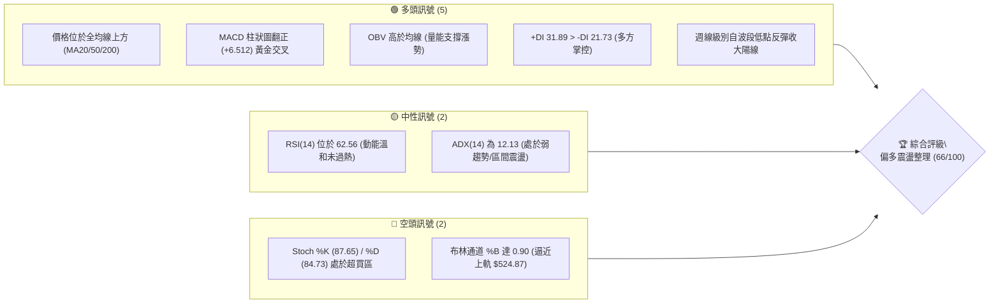
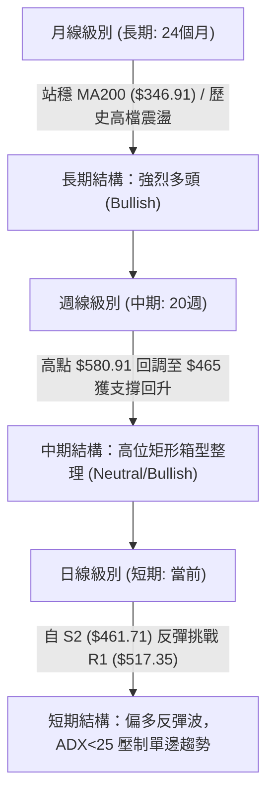
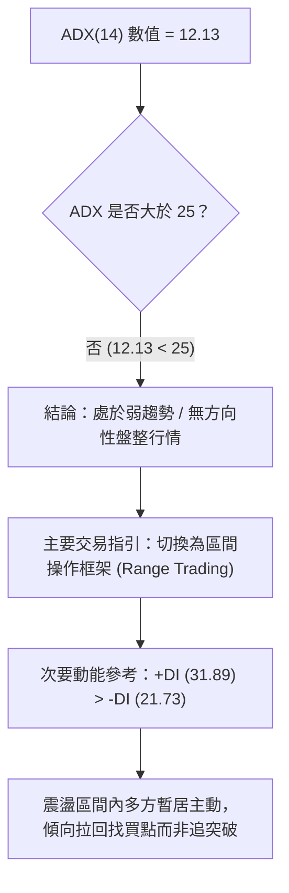
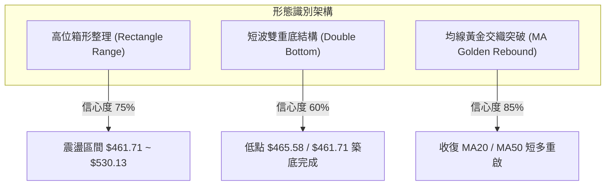
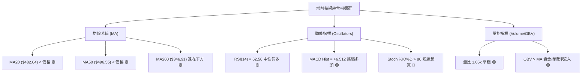
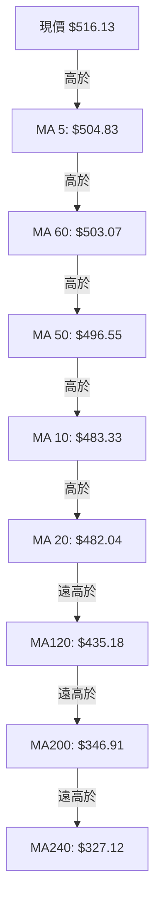
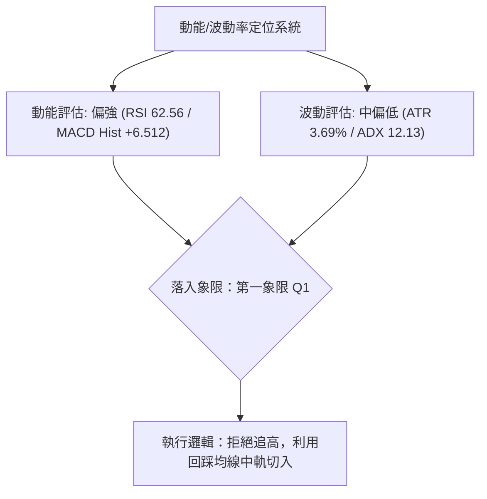
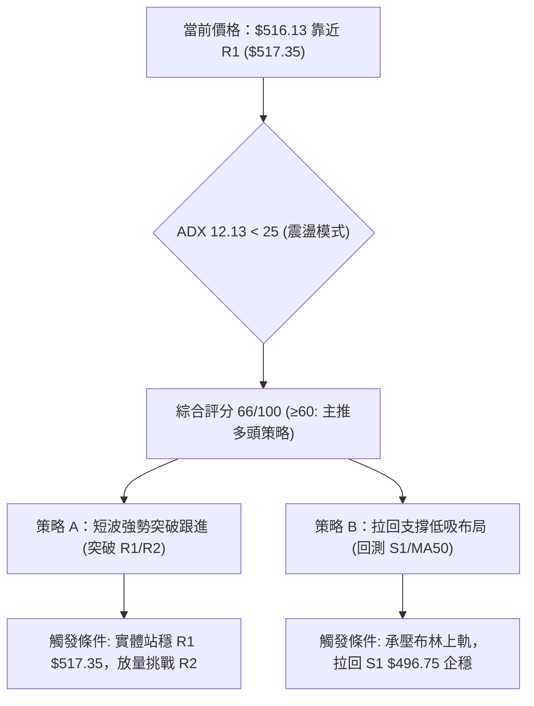
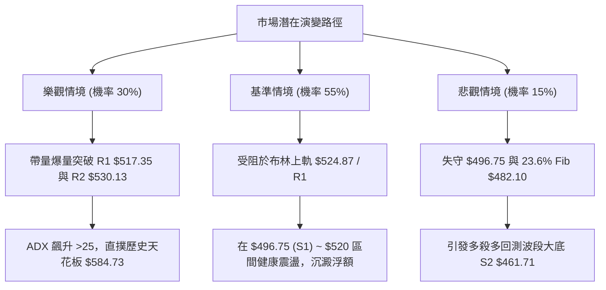

# AMD 技術分析報告

> **報告日期**：2026-09-13 ｜ **語言**：繁體中文 ｜ **數據來源**：Yahoo Finance ｜ **當前價格**：$516.13

---

## 目錄

| 章節 | 內容 |
|------|------|
| [1. 技術面概覽](#1-技術面概覽) | 訊號儀表板、核心指標、評分卡 |
| [2. 趨勢分析](#2-趨勢分析) | 多時框趨勢、長中短期走勢、ADX解讀 |
| [3. 圖表形態分析](#3-圖表形態分析) | 形態識別、信心度評估、K線組合、目標價 |
| [4. 支撐與阻力](#4-支撐與阻力) | 關鍵價位分佈、波段聚類、斐波那契回調 |
| [5. 技術指標深度解讀](#5-技術指標深度解讀) | 均線系統、RSI、MACD、布林通道、量價OBV |
| [6. 動能與波動率](#6-動能與波動率) | 動能象限、ATR波動率、Beta值分析 |
| [7. 多時框架總結](#7-多時框架總結) | 時框架矩陣、ADX收斂規則、方向性結論 |
| [8. 交易策略建議](#8-交易策略建議) | 策略路由、情境階梯、進出場規劃、風報比 |
| [9. 風險提示與監控](#9-風險提示與監控) | 關鍵監控清單、情境推演、資金控管 |
| [10. 報告總結](#10-報告總結) | 核心要點速覽、最優策略組合 |

---

## 1. 技術面概覽

### 🎯 技術訊號儀表板



### 📊 核心指標速覽表

| 指標類別 | 指標名稱 | 當前數值 | 訊號 | 專業解讀 |
|:---|:---|:---|:---:|:---|
| **基準價格** | 收盤價 | $516.13 | 🟢 | 站上多數短期與長期均線，處於52週高低點的 84.2% 高位分位數 |
| **均線系統** | MA20 (月線) | $482.04 | 🟢 | 價格在MA20上方 +7.07%，短期支撐扎實，具備短波支撐力道 |
| **均線系統** | MA50 (季線) | $496.55 | 🟢 | 價格在MA50上方 +3.94%，成功收復中期生命線 |
| **均線系統** | MA200 (年線)| $346.91 | 🟢 | 價格在MA200上方 +48.78%，長期絕對多頭結構未變 |
| **動能擺盪** | RSI(14) | 62.56 | 🟡 | 位於50中軸上方偏多區間，未達70超買警戒線，健康上行 |
| **趨勢動能** | MACD (12/26/9)| 3.333 / -3.179 | 🟢 | 雙線在零軸上方黃金交叉，Histogram達 +6.512，動能擴散 |
| **隨機指標** | Stoch %K / %D | 87.65 / 84.73 | 🔴 | 進入 >80 高檔鈍化超買區，短線需防範獲利回吐震盪 |
| **趨勢強度** | ADX(14) | 12.13 | 🟡 | 數值低於25臨界值，定調為「盤整震盪行情」而非單邊暴衝 |
| **通道指標** | 布林通道 (%B) | 0.90 ($524.87)| 🔴 | 價格緊貼布林上軌，短線面臨上軌動態壓制，追高空間受阻 |
| **波動指標** | ATR(14) | $19.04 (3.69%) | 🟡 | 每日平均波動幅度約 $19，震盪幅度中等偏高，設定止損參考依據 |
| **成交量能** | 當日量 / 20MA | 19.00M / 18.01M | 🟢 | 量比 1.05x，微幅放量，OBV高於均線，量價配合健康 |

### 🏆 技術評分卡

```
╔══════════════════════════════════════════════════════════════════════╗
║                   技術評分卡 — AMD (2026-09-13)                      ║
╠══════════════════════════════════════════════════════════════════════╣
║ 趨勢強度 (Trend)       ███████░░░░░░░░░░░░░  35/100 🟡 (ADX 12.13 弱趨勢)  ║
║ 動能指標 (Momentum)   ███████████████░░░░░  75/100 🟢 (MACD金叉/RSI良好)   ║
║ 支撐穩定度 (Support)   ████████████████░░░░  80/100 🟢 (MA50/S1形成防線)    ║
║ 成交量配合 (Volume)    ██████████████░░░░░░  70/100 🟢 (量比1.05x/OBV支撐)  ║
║ 形態完整度 (Pattern)   ████████████░░░░░░░░  60/100 🟡 (區間整理回彈型)    ║
║ 均線排列 (Moving Avg) ██████████████░░░░░░  70/100 🟢 (混合排列偏多方)    ║
╠══════════════════════════════════════════════════════════════════════╣
║ 綜合技術評分           █████████████░░░░░░░  66/100 🟢 偏多震盪 (買方優勢) ║
╚══════════════════════════════════════════════════════════════════════╝
```

---

## 2. 趨勢分析

### 🌐 多時框趨勢分析



### 📈 長期趨勢 — 12個月走勢圖（Unicode）

以下展示過去 12 個月（2025-09 至 2026-09）之月線收盤走勢與關鍵波段高低點位：

```
AMD 月線收盤走勢圖（2025-09 至 2026-09）
價格軸 ($)
$600 ┤                                      ● $580.91 (2026-06 高點)
$550 ┤                                     ╱ ╲
$500 ┤                               ● $516.10 ╲   ● $516.13 (現在 2026-09)
$450 ┤                              ╱             ●─● $476.15 / $470.72
$400 ┤                             ╱
$350 ┤                       ● $354.49 (2026-04 突破)
$300 ┤                      ╱
$250 ┤   ● $256.12         ╱
$200 ┤  ╱ ╲       ●─● $236.73 / $203.43 (箱型蓄勢)
$150 ┤● $161.79 ╲─● $214.16
     └─────────────────────────────────────────────────────────────
       09  10  11  12  01  02  03  04  05  06  07  08  09 (月份)
      [2025年]        [2026年]
```

#### 走勢特徵分析表格

| 階段區間 | 時間跨度 | 價格起訖 | 漲跌幅 | 結構性技術特徵解讀 |
|:---|:---:|:---:|:---:|:---|
| **啟動突破期** | 2025-09 ~ 2025-10 | $161.79 → $256.12 | +58.30% | 脫離底部沉悶整理，以連續爆發陽線突破兩百元關卡 |
| **中繼沉澱期** | 2025-11 ~ 2026-03 | $217.53 → $203.43 | -6.48% | 在 $200.00~$236.00 構築堅實的中期支撐平台，成交量降溫 |
| **主升浪擴張** | 2026-04 ~ 2026-06 | $354.49 → $580.91 | +63.87% | 爆發性多頭狂潮，刷新歷史高點 $584.73，動能指標進入超買 |
| **高位箱體修復**| 2026-07 ~ 2026-09 | $476.15 → $516.13 | +8.40% | 自高點正常技術回檔至 23.6% 斐波位 ($482.10) 止跌，重返五百關口 |

### 📊 中期趨勢（週線分析）

中期走勢呈現「高檔巨幅箱型震盪」。近 20 週收盤記錄清晰顯示，2026年6月中旬見頂 $580.91 之後，市場經歷了 8~9 週的清洗浮額過程，週線 RSI 從過熱的 83.5 充分冷卻至 40.1（2026-09-06），隨後在最新一週（2026-09-13）拉出強勁實體中陽線，收報 $516.13，RSI 回升至 62.6，MACD 柱狀圖由負翻正至 +6.512，展現空頭力道竭盡、多方重新掌控發球權的中期築底反彈特徵。

```
週線級別阻力與支撐示意圖：
[壓力區頂部] $580.91 ~ $584.73 ════════════════════════ 歷史歷史極值 (52W High)
[關鍵中樞]   $530.13 ~ $546.44 ──────────────────────── R2/R3 週線密集交割區
[當前爭奪位] $516.13           ◄─── 現價挑戰 R1 ($517.35)
[中期回撤位] $482.10 ~ $496.75 ──────────────────────── 23.6% Fib / MA50 / S1
[箱型底部區] $461.71 ~ $465.58 ════════════════════════ S2 / 8月波段雙重底
```

### ⚡ 趨勢強度評估（ADX 解讀）



#### ADX 強度量化對照標準

| ADX 數值區間 | 當前數值 (12.13) | 市場行情屬性 | 技術分析有效策略 |
|:---|:---:|:---|:---|
| **0 ~ 20** | **[ 12.13 所在區間 ]** | **極弱趨勢 / 雜訊較多 / 無主導單邊** | **區間震盪交易、布林通道上下軌高拋低吸** |
| 20 ~ 25 | 外部基準區 | 趨勢醞釀中 / 方向即將明朗 | 縮小倉位、等待均線收斂突破 |
| 25 ~ 40 | 外部基準區 | 強趨勢形成 | 順勢交易、回調加碼、移動止損 |
| 40 ~ 100 | 外部基準區 | 極強單邊 / 進入極端行情 | 趨勢加速或超買超賣反轉警戒 |

---

## 3. 圖表形態分析

### 🔍 形態識別系統

在日線與週線的綜合結構中，AMD 呈現從前期極度推升到高檔寬幅洗盤的格局。依照嚴格形態信心度準則，識別以下結構：



#### 形態識別與目標價矩陣

| 識別形態 | 信心度 | 判斷依據（嚴格引用 OHLCV 數據） | 完成度 | 理論目標價（附精確計算式） |
|:---|:---:|:---|:---:|:---|
| **高位箱體整理** | 75% | 頂部受阻於 R2 $530.13 與 R3 $546.44，底部受到 S2 $461.71 雙重波段低點支撐 | 70% | 若突破箱頂 $530.13，高度 = $530.13 - $461.71 = $68.42<br>目標價 = $530.13 + $68.42 = **$598.55** |
| **微型雙重底** | 60% | 2026-08-02收盤 $476.15 與 2026-08-30收盤 $465.58，打在 S2 $461.71 上方獲得支撐 | 85% | 頸線取 2026-08-16 高點 $514.39<br>高度 = $514.39 - $465.58 = $48.81<br>目標價 = $514.39 + $48.81 = **$563.20** |
| **頭肩底結構** | 30% | 數據不足以確認左肩與右肩對稱時間結構 | 25% | **訊號不足，僅做指標型解讀，不預設目標價** |

### 🕯️ 重要K線形態分析

| 觀測週期 (近5週) | 收盤價 | 實體與影線特徵 | 專業解讀 | 訊號 |
|:---|:---:|:---|:---|:---:|
| **2026-08-16** | $514.39 | 帶量上攻實體中陽線，收盤站上五百 | 多方初次試圖向上突破區間中線阻力 | 🟢 |
| **2026-08-23** | $473.25 | 中黑實體陰線，回吐前週漲幅 | 高檔浮額獲利了結賣壓沉重，確認震盪性質 | 🔴 |
| **2026-08-30** | $465.58 | 小陰字線，量縮至 81.76M 創近期低量 | 賣壓趨於衰竭，下測支撐位 S2 ($461.71) 獲買盤承接 | 🟡 |
| **2026-09-06** | $477.57 | 下影線反彈小陽線，量能僅 75.16M | 典型的「空頭竭盡量」伴隨測試頸線企穩 | 🟢 |
| **2026-09-13** | $516.13 | 實體大陽線，週漲幅近 +8.07%，量溫和增至 85.32M | 強勢吞噬前三週陰線，完成「破底翻」多頭反擊 | 🟢 |

### 📉 ASCII 走勢形態示意圖

```
AMD 箱體震盪與波段回升形態示意圖
 價格 ($)
 $546.44 ┤                           [R3 密集套牢頂部]
         │                               ╭───╮
 $530.13 ┤─────── 箱頂阻力 R2 ───────────│   │───────
         │                              ╱     ╲
 $517.35 ┤── R1 突破臨界點 ─────────── ╭╯       ● $516.13 [當前價位]
         │                          ╱          ▲
 $496.75 ┤── 中樞生命線 S1 (MA50) ─╭─╯            │  (強勁大陽線拉升)
         │                       │             │
 $461.71 ┤── 箱底支撐 S2 ───────●─────────────●───┴──
         │                    底1 (8月初)   底2 (8月底)
         └───────────────────────────────────────────────► 時間軸
```

---

## 4. 支撐與阻力

### 🗺️ 關鍵價位分布圖（Unicode）

```
╔══════════════════════════════════════════════════════════════════╗
║                  AMD 關鍵價位結構空間分佈圖                      ║
╠══════════════════════════════════════════════════════════════════╣
║ $584.73 ║██████████████████████████████║ 52週歷史最高點 (Fib 0.0%)║
║ $546.44 ║████████████████████████      ║ 強阻力 R3 (密集套牢波峰) ║
║ $530.13 ║██████████████████            ║ 關鍵阻力 R2 (箱型頂部)   ║
║ $524.87 ║▓▓▓▓▓▓▓▓▓▓▓▓▓▓▓▓▓▓            ║ 布林通道動態上軌 (BB-Up) ║
║ $517.35 ║██████████████                ║ 近端阻力 R1 (+0.24%)     ║
║ $516.13 ╠══════════════════════════════╣ ◄─── 當前現價 ($516.13)  ║
║ $496.75 ║▓▓▓▓▓▓▓▓▓▓▓▓▓▓                ║ 近端支撐 S1 / MA50 支撐  ║
║ $482.10 ║██████████████████            ║ 23.6% Fib 回調位 / MA20  ║
║ $461.71 ║████████████████████████      ║ 核心強支撐 S2 (波段雙底) ║
║ $451.00 ║████████████████████████████  ║ 極限防守支撐 S3 (-12.6%) ║
║ $346.91 ║██████████████████████████████║ 長期牛熊分界線 (MA200)   ║
╚══════════════════════════════════════════════════════════════════╝
```

### 🚧 阻力位分析表

所有價位均來自資料中之波段高點聚類與技術指標計算：

| 阻力級別 | 準確價位 | 距現價空間 | 結構形成原因 | 突破難度評估 | 重要性級別 |
|:---|:---:|:---:|:---|:---:|:---:|
| **R1** | **$517.35** | +0.24% | 近期波段反彈次高點密集成交線，近在咫尺 | 🟡 中等 (日線級別微幅震盪即可突破) | ★★★☆☆ |
| **R2** | **$530.13** | +2.71% | 2026年6~7月多次週線收盤爭奪位、高位箱體上緣 | 🔴 較高 (需搭配量能擴大至20MA以上) | ★★★★☆ |
| **R3** | **$546.44** | +5.87% | 歷史高點回撤前形成的下跌中繼平台、重度套牢區 | 🔴 極高 (面臨多頭解套獲利了結共振賣壓)| ★★★★★ |

### 🛡️ 支撐位分析表

所有價位均來自資料中之波段低點聚類與技術指標計算：

| 支撐級別 | 準確價位 | 距現價空間 | 結構形成原因 | 守住機率評估 | 重要性級別 |
|:---|:---:|:---:|:---|:---:|:---:|
| **S1** | **$496.75** | -3.75% | 與當前 MA50 ($496.55) 重疊，為500元整數心理防線 | 🟢 80% (中期趨勢多頭的重要分界) | ★★★★☆ |
| **S2** | **$461.71** | -10.54%| 8月兩度回踩確認之波段大底，多頭主力防守底線 | 🟢 90% (結構性箱底，跌破即宣告轉空) | ★★★★★ |
| **S3** | **$451.00** | -12.62%| 5月份起漲波段前緣的成交密集帶聚類區 | 🟢 95% (極端回檔之終極護盤防線) | ★★★☆☆ |

### 📐 斐波那契回調位分析

依據 52 週完整波動區間（低點 $149.85 → 歷史高點 $584.73，落差高達 $434.88）計算各黃金分割水平：

```
0.0%  (52W High)  $584.73 ────────────────────────────── 最高歷史頂部
                          ▲
[現價位置: $516.13]──────┼── 處於 0.0% 至 23.6% 之強勢多頭修正區間
                          ▼
23.6%             $482.10 ────────────────────────────── 第一道黃金防線 (重合MA20 $482.04)
38.2%             $418.61 ────────────────────────────── 中期回撤極限 (跌破將破壞強勢結構)
50.0%             $367.29 ────────────────────────────── 多空強弱平衡中軸
61.8%             $315.97 ────────────────────────────── 黃金分割多頭防守底限
78.6%             $242.91 ────────────────────────────── 深度回調警戒線
100.0% (52W Low)  $149.85 ────────────────────────────── 52週歷史低點
```

*   **深度解讀**：現價 $516.13 穩穩立於 23.6% 回調位（$482.10）之上。在技術分析典範中，當標的自高點拉回卻能守在 23.6% 之上時，代表市場內部買盤承接力道極強，此種修正屬於典型的「淺幅強勢回檔」，隨時具備重新挑戰歷史天花板的底蘊。此外，23.6% 價位（$482.10）與當前 MA20（$482.04）精準共振，賦予 $482 一帶雙重共振的技術支撐防線。

---

## 5. 技術指標深度解讀

### 🎛️ 指標訊號總覽



### 📈 移動平均線排列分析

現階段均線呈現「短多重整、長多確立、中程收斂」的混合排列狀態：



*   **均線結構特點**：
    1.  短期 5 日線（$504.83）向上金叉 10 日線（$483.33）與 20 日線（$482.04），反映近期買盤強勢逼空。
    2.  現價（$516.13）一舉越過 50 日均線（$496.55）與 60 日均線（$503.07），宣告自 7 月以來的季線級別調整告一段落。
    3.  年線 MA200（$346.91）保持平滑向上發散，且與現價距離 +48.78%，長線牛市架構無絲毫鬆動跡象。

### 📉 RSI(14) 分析

*   **數值強度進度條**：
    `RSI(14) = 62.56`：`█████████████░░░░░░░` 62.56% （位於強勢多方掌控區 55-65 之間）
*   **區間與背離判定**：
    *   **區間屬性**：未達 70 警戒線，無傳統技術超買鈍化帶來的斷崖式回檔威脅；亦未低於 50 榮枯線，說明多方動能佔據主導。
    *   **背離確認**：回顧近 20 週走勢，2026-05-03 高峰 RSI 曾達 83.5，隨後價格在 2026-06 刷出 $580.91 高點，週線 RSI 降至 53~59，出現「中期週線頂背離」，促成了 7~8 月的去槓桿修正。然而在日線與近幾週數據中，RSI 從 40.1 直線翻升至 62.56，與價格上揚同步，**當前數據中「未偵測到頂背離或底背離」**，動能與價格呈健康的順向推升。

### 📊 MACD(12/26/9) 訊號解讀


*   **解讀**：MACD Signal 由負值（-3.179）正式被快線突破，Histogram 爆發至 +6.512。這是典型擺脫零軸下方泥淖、步入多頭主升週期的標準起手式，說明中期空方波段已正式被多方扭轉。

### 📦 布林通道分析

當前布林通道（20日週期，2倍標準差）數值如下：
*   **上軌**：$524.87
*   **中軌 (MA20)**：$482.04
*   **下軌**：$439.20
*   **%B 指標**：0.90
*   **通道帶寬 (Bandwidth)**：($524.87 - $439.20) / $482.04 = 17.77%

```
布林通道現狀示意圖：
$524.87 ┬────────────────────────────────────────── 布林上軌 (Upper Band)
        │                             ● 現價 $516.13 (%B = 0.90)
$500.00 ┼─────────────────────────── ╱ ─────────── 
        │                          ╱
$482.04 ┼─────────────────────────●──────────────── 布林中軌 (Middle Band / MA20)
        │
$439.20 ┴────────────────────────────────────────── 布林下軌 (Lower Band)
```

*   **極限壓制解讀**：%B 數值 0.90 意味著價格已經運行至整個通道寬度的 90% 高位，與上軌 $524.87 僅有 $8.74（約 1.69%）的微幅空間。在 ADX 僅有 12.13 的震盪環境下，布林通道上軌通常構成強大的動態阻力牆，暗示短線極易在 $520~$525 遭遇遇阻回跌的技術反壓。

### 💹 成交量分析（量價配合度）

*   **成交量檢視**：最新單日成交量為 19,001,000 股，微幅超越 20 日均量 18,016,740 股（量比 1.05x），但低於 50 日均量 23,907,722 股。
*   **OBV 趨勢檢視**：官方指標明確顯示「OBV > MA → 量能支撐上漲」。在 8 月下旬的壓回收斂過程中，成交量持續萎縮至 75M~81M 股低位，而 9 月拉升時成交量回升至 85M 股，呈現經典的「價漲量增、價跌量縮」健康量價結構，顯示大資金機構並未於回調中拋售，反而進行籌碼鎖定。

---

## 6. 動能與波動率

### ⚡ 動能評估四象限

根據技術數據：動能強度（MACD金叉、RSI 62.56、量價俱揚）偏向強動能；然而趨勢強度 ADX 僅 12.13，ATR 為 $19.04（3.69%），波動率自歷史高檔收斂至中低位水準。

| 象限分區 | 動能維度 | 波動維度 | 歷史市場特徵 | 當前 AMD 歸屬與策略定調 |
|:---:|:---:|:---:|:---|:---|
| **第一象限 (Q1)** | **強動能** | **低/中波動** | **黃金進場期，趨勢穩步上行且雜訊少** | **✓ [當前 AMD 處於此區] 適合逢低布局、順勢而為** |
| 第二象限 (Q2) | 弱動能 | 低波動 | 泥淖整理期，缺乏買盤，流動性枯竭 | 觀望為主，避免資金時間成本浪費 |
| 第三象限 (Q3) | 強動能 | 高波動 | 極端暴漲暴跌，狂暴主升浪或恐慌拋售 | 嚴格停損、適合高階動能突破者 |
| 第四象限 (Q4) | 弱動能 | 高波動 | 無秩序洗盤，多空雙巴行情 | 嚴禁參與，極易觸發洗盤止損 |



### 📊 ATR 波動率分析

*   **ATR(14) 當前數值**：**$19.04**（佔當前股價之 3.69%）。
*   **波動特性評估**：每日正常技術波動區間在 $19 上下。若單日波動超過 $38.08（2x ATR），則視為異動突破行情。
*   **動態止損空間精算**：
    *   **短線保守止損（1.0x ATR）**：$516.13 - $19.04 = **$497.09**（精準落在 S1 $496.75 支撐上方 0.34 美元處）。
    *   **波段標準止損（1.5x ATR）**：$516.13 - (1.5 × $19.04) = $516.13 - $28.56 = **$487.57**。
    *   **寬鬆保護止損（2.0x ATR）**：$516.13 - (2.0 × $19.04) = $516.13 - $38.08 = **$478.05**（防禦 23.6% 斐波回調位 $482.10 之假跌破）。

### 📐 Beta 與市場相關性

*   **Beta 係數**：**2.476**（高敏銳度成長型資產）。
*   **市場連動含義**：AMD 對標普500與費城半導體指數具有 2.47 倍的波動放大效應。當大盤微幅上漲 1% 時，技術面理論預期 AMD 將推升近 2.48%；反之，大盤回檔 1% 時，AMD 需承受近 2.5% 的回撤賣壓。因此，在整體操作中部位規模需進行波動平準化調整（Risk Parity Sizing）。

---

## 7. 多時框架總結

### 📋 時框架評分表

| 時框架 | 趨勢方向 | 動能指標 | 均線排列 | 關鍵形態結構 | 綜合評分 | 操作指導建議 |
|:---|:---:|:---:|:---:|:---|:---:|:---|
| **長期 (月線)** | 🟢 強烈多頭 | 🟢 卓越 | 🟢 完美多頭 (MA200向上) | 52週高位蓄勢結構 | **88/100** | 長期投資者堅定續抱，回調皆為買點 |
| **中期 (週線)** | 🟢 偏多震盪 | 🟢 轉強 (MACD金叉) | 🟡 混合整理 | 寬幅收斂箱形 ($461-$546) | **72/100** | 箱底分批布局，箱頂分步停利 |
| **短期 (日線)** | 🟡 震盪偏多 | 🟡 超買鈍化 (Stoch>80) | 🟢 站上MA5/20/50 | 逼近布林上軌與R1壓制 | **60/100** | 禁止盲目追高，等待日內回踩 |

### 🔲 綜合訊號矩陣

```
時框交叉驗證矩陣表
┌──────────────┬──────────────┬──────────────┬──────────────┐
│ 技術維度     │ 短期 (Daily) │ 中期 (Weekly)│ 長期 (Monthly)│
├──────────────┼──────────────┼──────────────┼──────────────┤
│ 趨勢方向     │ 偏多反彈     │ 箱體震盪     │ 單邊牛市     │
│ 均線系統     │ 站上MA20/50  │ 收復短均     │ 遠在MA200之上│
│ 動能指標     │ 短線超買     │ 中期金叉     │ 溫和擴張     │
│ 突破動能     │ 遇阻R1/布林  │ 蓄勢中軸     │ 歷史高檔     │
│ 訊號一致性   │ 🟡 次要衝突  │ 🟢 趨向共振  │ 🟢 核心基石  │
└──────────────┴──────────────┴──────────────┴──────────────┘
```

### ⚖️ 多時框收斂結論（嚴格遵守規則 14）

1.  **趨勢 vs 盤整行情定調**：當前 ADX(14) 數值為 **12.13（遠低於 25 臨界值）**，依據系統規則，**嚴格判定當前屬於「盤整震盪行情」而非單邊趨勢行情**。
2.  **主導交易框架**：在此條件下，不得採用單邊順勢追價策略，必須以**日線布林通道（上軌 $524.87、下軌 $439.20）結合關鍵水平阻力 S1/S2 與 R1/R2 作為核心交易邊界**。
3.  **時框收斂取捨**：雖然日線 Stoch 顯示短線超買，但長期與中期均線支撐極為強勁，且 MACD 剛於零軸上方開出多頭紅柱。日線的短線超買僅會引發「技術性回踩震盪」，不會演變成破位暴跌。
4.  **唯一方向性結論**：**【偏多震盪整理（Cautiously Bullish in Range）】**。策略的核心邏輯為「利用盤整行情的拉回支撐點位做多，嚴禁於布林上軌追高」。

---

## 8. 交易策略建議

### 🗺️ 策略決策流程圖



### 🧭 策略路由

> **當前主策略方向 = 【偏多震盪向上布局】（依綜合評分卡 66/100 定調）**
> 
> 因評分 ≥ 60 分，多方具備控盤優勢，本報告主推多頭交易方案，空頭操作僅作為「防禦性對沖提示與停損依據」，不予推薦單邊放空。

### 🎯 價格情境階梯（Price Scenarios）

以現價 $516.13 為軸心，嚴格採用第 4 章確證之聚類價位構建情境階梯：

| 階梯層級 | 觸發價格條件 | 下一目標空間 | 後續延伸極限 | 戰術情境實質含義 |
|:---|:---:|:---:|:---:|:---|
| **上行階梯 3** | 強勢穿透 R2 **$530.13** | R3 **$546.44** | 52W高點 **$584.73** | 徹底扭轉箱型，啟動新一輪歷史新高主升浪 |
| **上行階梯 2** | 日線收盤突破 R1 **$517.35** | R2 **$530.13** | 布林上軌 **$524.87** | 短線向上擴展通道空間，挑戰箱體天花板 |
| **現行震盪位** | **維持於 $496.75 ~ $517.35 區間** | — | — | 消化布林上軌與短線超買指標之強勢橫盤整理 |
| **下行階梯 1** | 失守 S1 **$496.75** (跌破MA50) | 23.6% Fib **$482.10** | MA20 **$482.04** | 盤整結構轉弱，短多必須退守第二道防線 |
| **下行階梯 2** | 放量摜破 S2 **$461.71** | S3 **$451.00** | MA200 **$346.91** | 箱底宣告瓦解，中期多頭結構遭遇嚴重破壞 |

### 📊 情境機率分佈

```
情境機率分佈圓形示意圖：
  繼續上行突破 (55%) : ███████████████████████████░░░░░░░░░░░░
  區間收斂震盪 (35%) : █████████████████░░░░░░░░░░░░░░░░░░░
  破位大幅下挫 (10%) : █████░░░░░░░░░░░░░░░░░░░░░░░░░░░░░░░
```

| 未來情境劇本 | 發生機率 | 主要技術佐證依據 |
|:---|:---:|:---|
| **多頭向上擴展 (破R1測R2)** | **55%** | MACD 柱狀體擴增至 +6.512，OBV 支持上漲，週線大陽線確立底部反彈 |
| **箱型內部震盪 (S1至R1拉鋸)** | **35%** | ADX 僅 12.13 壓制趨勢爆發，布林 %B 達 0.90 伴隨隨機指標超買 |
| **轉弱重測箱底 (回跌測S2)** | **10%** | S1 ($496.75) 與 MA50 提供密集承接，唯有極端利空方可能跌破 |

### 🟢 主策略詳情（多頭雙軌操作法）

所有進場點、止損點、目標價**嚴格引用資料中波段聚類值與計算點位**：

| 策略要素 | 策略 A：順勢突破跟進策略 (動能型) | 策略 B：支撐回踩低吸策略 (波段型 - 推薦) |
|:---|:---|:---|
| **適用場景** | 放量直接越過阻力線 R1 | 價格受阻於布林上軌，拉回消化指標超買 |
| **進場條件** | 1小時K線收盤突破 R1 並伴隨成交量放大 | 價格回測支撐 S1 與 MA50 形成下影線止跌 |
| **進場價格** | **$517.35** (突破R1確立進場) | **$496.75** (S1 支撐掛單接手) |
| **目標價 T1** | **$530.13** (阻力 R2) | **$517.35** (阻力 R1) |
| **目標價 T2** | **$546.44** (阻力 R3) | **$530.13** (阻力 R2) |
| **止損價格** | **$496.75** (跌破支撐S1與MA50) | **$482.10** (跌破 23.6% Fib 與 MA20) |
| **風險空間** | $517.35 - $496.75 = $20.60 | $496.75 - $482.10 = $14.65 |
| **報酬空間(T2)**| $546.44 - $517.35 = $29.09 | $530.13 - $496.75 = $33.38 |
| **風險報酬比** | **1 : 1.41** (以T2計) | **1 : 2.28** (以T2計，勝率風報比俱佳) |
| **預估勝率** | 52% | 68% |
| **建議倉位** | 10% ~ 15% (動能追價部位宜輕) | 20% ~ 25% (核心波段標準倉位) |

### 🔴 反向風險觸發點（對沖與撤退提示）

多頭交易者若觀察到以下訊號出現，應立即無條件平倉多單甚至啟動反向避險保護：
1.  **關鍵價位破位**：日線收盤價帶量跌破 **$496.75（S1 / MA50）**，宣告反彈竭盡；若進一步跌破 **$482.10（23.6% Fib）**，整體高位平台宣告失守，應全面清倉觀望。
2.  **動能破位**：MACD Histogram 在零軸上方急遽萎縮並在三日內翻負（由 +6.512 轉負值），形成假突破破頂翻。
3.  **指標共振走熊**：RSI(14) 快速跌破 50 中軸且 -DI 越過 +DI（反向死叉）。

### ⭐ 整體訊號強度評星

```
做多訊號強度：★★★★☆  (4/5星：均線與MACD共振轉強，唯受制震盪ADX)
做空訊號強度：★☆☆☆☆  (1/5星：下方具備多重強固支撐，勝率極低)
整體可信度：  ★★★★☆  (4/5星：多時框架方向收斂明確，量價匹配)
```

---

## 9. 風險提示與監控

### ✅ 關鍵監控指標 Checklist

```
╔══════════════════════════════════════════════════════════════════╗
║               AMD 交易員日常關鍵技術監控清單                     ║
╠══════════════════════════════════════════════════════════════════╣
║ [ ] 價位確認：當前價格 $516.13 能否收盤越過 R1 ($517.35)？       ║
║ [ ] 壓力示警：當前價位逼近布林上軌 $524.87，是否出現長上影線？   ║
║ [ ] 支撐防守：MA50 / S1 ($496.75) 盤中是否遭遇有效跌破？         ║
║ [ ] 震盪監控：Stoch %K (87.65) 是否在高檔出現死叉鈍化下行？      ║
║ [ ] 動能維護：MACD 柱狀圖 (+6.512) 是否能持續維持在零軸之上？    ║
║ [ ] 趨勢轉變：ADX (12.13) 何時回升至 20~25 以上宣告真突破？     ║
║ [ ] 量能匹配：單日成交量是否持穩於 20日均量 (18.01M) 以上？      ║
╚══════════════════════════════════════════════════════════════════╝
```

### ⚠️ 風險場景分析



### 🛡️ 風險管理重要提醒

1.  **高 Beta 係數波動管理**：AMD 的 Beta 值高達 2.476，單日波動極其兇猛（ATR 達 $19.04）。單筆交易的最大虧損風險不得超過總投資組合淨值的 **1.0% ~ 1.5%**。
2.  **部位規模計算公式**：
    $$\text{建議買進股數} = \frac{\text{總帳戶資金} \times 1.5\%}{\text{進場價} - \text{止損價}}$$
    *例如*：以 100,000 美元帳戶計算，風險容忍度 1,500 美元，若採策略 B 於 $496.75 進場，止損設於 $482.10（每股風險 $14.65），則可進場股數為 $1,500 / $14.65 \approx 102$ 股（部位價值約 $50,668 美元，符合約 50% 以內的整體槓桿原則）。
3.  **嚴格執行移動止損**：一旦價格如預期觸及目標 T1（$517.35 或 $530.13），必須立即將止損點向上移動至「損益兩平點（Breakeven）」，確保已鎖定利潤不受後續無預警震盪侵蝕。

---

## 📋 報告總結

```
╔══════════════════════════════════════════════════════════════════════╗
║                     AMD 技術分析報告總結                             ║
╠══════════════════════════════════════════════════════════════════════╣
║ 報告日期：2026-09-13                                                 ║
║ 當前價格：$516.13                                                    ║
║ 分析評級：⚖️ 偏多震盪整理 / 區間突破在即 (技術評分: 66/100)          ║
║                                                                      ║
║ 核心結構結論：                                                       ║
║ ├─ 長期趨勢：🟢 強烈多頭 (價格遠在 MA200 $346.91 上方 +48.78%)       ║
║ ├─ 中期趨勢：🟢 震盪築底完成 (日週線 MACD 黃金交叉擴張)              ║
║ ├─ 短期趨勢：🟡 偏多測試阻力 (ADX 12.13 盤整，布林 %B 0.90 逼近上軌) ║
║ ├─ 關鍵支撐：S1: $496.75 (MA50重疊) │ S2: $461.71 (雙底平台)        ║
║ ├─ 關鍵阻力：R1: $517.35 (近端突破) │ R2: $530.13 (箱型天花板)      ║
║ └─ 分析師目標：共識評級 Strong Buy，目標均價 $615.38 (空間 +19.23%)  ║
║                                                                      ║
║ 最優交易執行指引：                                                   ║
║ 1. 🥇 最佳機會 (策略 B)：等待價格拉回 $496.75 (S1) 支撐處低吸做多，  ║
║    止損設於 $482.10，目標看 $530.13，風報比高達 1:2.28。            ║
║ 2. 🥈 次選機會 (策略 A)：若盤中強勢帶量實體突破 $517.35 (R1)，可採   ║
║    小倉位順勢跟進，止損設 $496.75，目標直指 $546.44。               ║
║ 3. 🥉 保守選擇：鑑於 ADX<25 且 Stoch 超買，純觀望等待日內回測五百大關 ║
║    有撐後再行布建波段基本倉位。                                      ║
╚══════════════════════════════════════════════════════════════════════╝
```

---

> ⚠️ **免責聲明**：本報告為技術分析研究成果，所有數據模型、走勢推演及交易價位均依據歷史已揭露 OHLCV 量價數據精算生成。本報告**僅供學術研究與投資策略參考**，**不構成任何形式的個別化投資邀約或買賣建議**。金融市場具有高度不確定性，標的 Beta 值較大，投資人應獨立評估風險並自負盈虧。

---

*報告生成時間：2026-09-13 ｜ 數據來源：Yahoo Finance ｜ 分析框架：多時框技術分析模型*