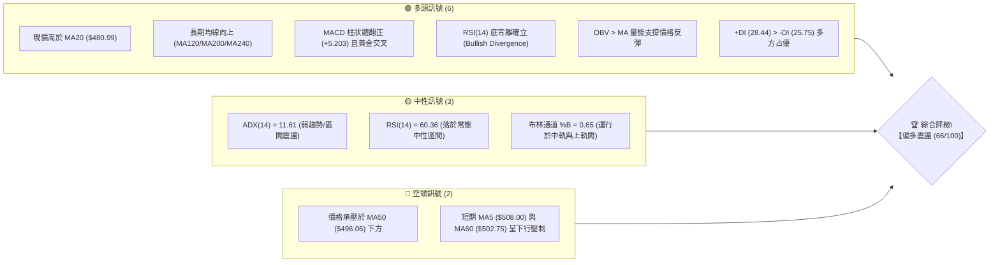
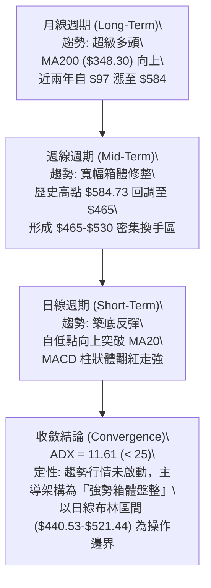
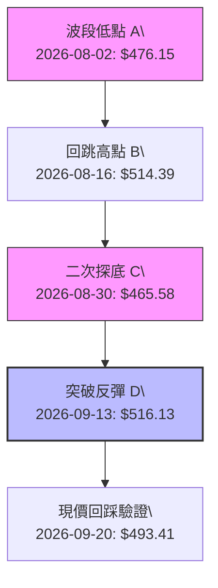
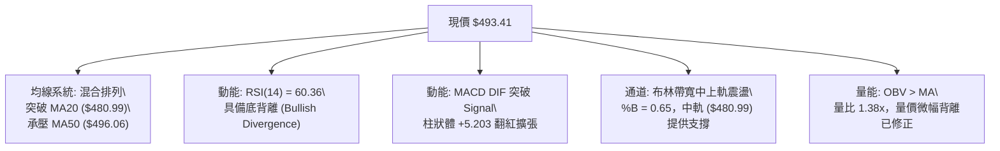
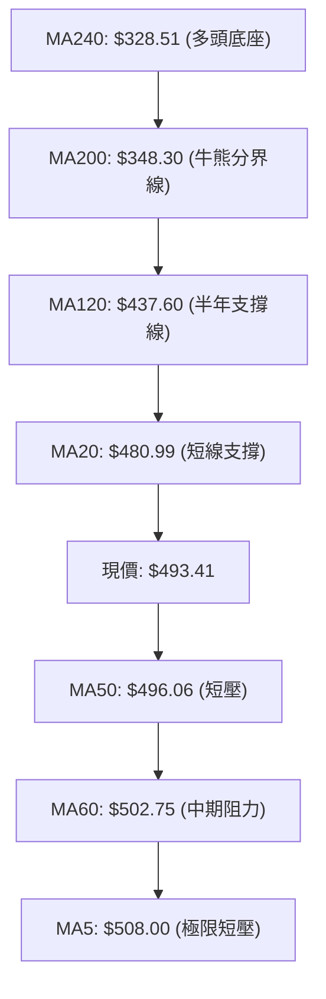
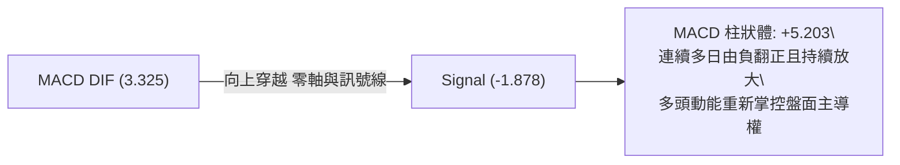
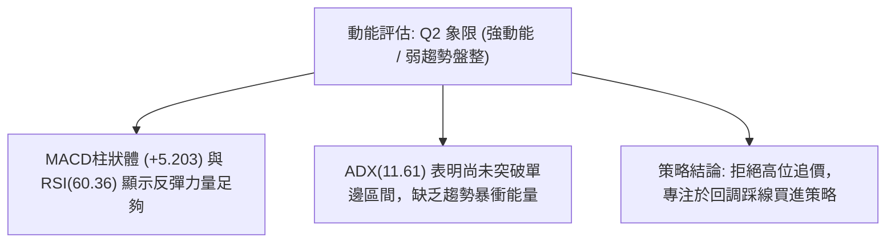
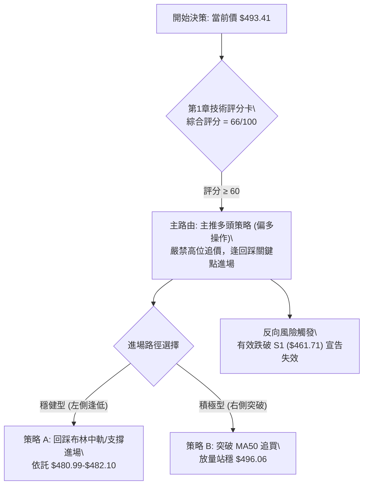
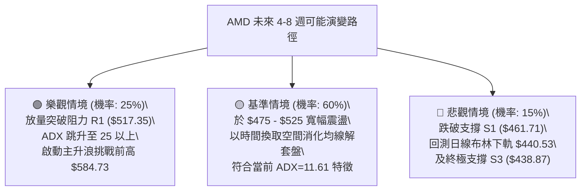

# AMD 技術分析報告

> **報告日期**：2026-09-15 ｜ **語言**：繁體中文 ｜ **數據來源**：Yahoo Finance ｜ **當前價格**：$493.41

---

## 目錄

| 章節 | 內容 |
|------|------|
| [1. 技術面概覽](#1-技術面概覽) | 訊號儀表板、核心指標、評分卡 |
| [2. 趨勢分析](#2-趨勢分析) | 多時框趨勢、長中短期走勢、12個月 ASCII 圖、ADX 解讀 |
| [3. 圖表形態分析](#3-圖表形態分析) | 形態識別、信心度評估、K線組合、形態目標價 |
| [4. 支撐與阻力](#4-支撐與阻力) | 關鍵價位分布圖、阻力/支撐矩陣、斐波那契回調結構 |
| [5. 技術指標深度解讀](#5-技術指標深度解讀) | 均線系統、RSI底背離、MACD柱、布林通道、OBV量能 |
| [6. 動能與波動率](#6-動能與波動率) | 動能四象限、ATR 風險敞口、Beta 系統性風險 |
| [7. 多時框架總結](#7-多時框架總結) | 時框矩陣、多時框收斂邏輯（ADX<25 盤整優先級） |
| [8. 交易策略建議](#8-交易策略建議) | 策略路由分流、價格情境階梯、主推交易策略、風控對沖 |
| [9. 風險提示與監控](#9-風險提示與監控) | 關鍵指標 Checklist、情境推演、資金控管規範 |
| [報告總結](#-報告總結) | 最終評級與精簡決策卡 |

---

## 1. 技術面概覽

### 🎯 技術訊號儀表板

AMD 當前市價為 $493.41。各維度指標呈現長多、中整、短彈的技術特徵，具體多空訊號分布如下：



---

### 📊 核心指標速覽表

| 指標類別 | 指標名稱 | 當前數值 | 訊號 | 解讀 |
|:---|:---|:---|:---:|:---|
| **價格** | 當前收盤價 | $493.41 | 🟢 | 站上布林中軌，處於52週區間 79.0% 高位震盪區 |
| **均線 (短)** | MA20 | $480.99 | 🟢 | 現價於 MA20 上方 +2.58%，短線下檔具備動態支撐 |
| **均線 (中)** | MA50 | $496.06 | 🔴 | 現價位於 MA50 下方 -0.53%，短期首要突破關鍵點 |
| **均線 (長)** | MA200 | $348.30 | 🟢 | 遠高於長期牛熊分界線 (+41.66%)，長期多頭格局完好 |
| **動能** | RSI(14) | 60.36 | 🟡 | 位於強勢中性區，無超買現象；週線與日線具底背離反彈力道 |
| **動能** | MACD (12,26,9) | 3.325 (Hist: +5.203) | 🟢 | DIF 線突破 Signal (-1.878)，柱狀體擴大，多方動能釋放 |
| **隨機指標** | Stoch %K / %D | 61.32 / 74.03 | 🟡 | %K 由高位回落接近 %D，進入短線超買修正後蓄勢階段 |
| **趨勢強度** | ADX(14) | 11.61 | 🟡 | ADX < 25 表明無單邊暴衝趨勢，當前定性為「寬幅箱體盤整」 |
| **通道指標** | 布林通道 (20,2) | $440.53 - $521.44 | 🟢 | %B 為 0.65，突破中軌向 BB 上軌 ($521.44) 推進 |
| **波動率** | ATR(14) | $20.01 (4.05%) | 🟡 | 日內波幅約 20 美元，屬高 Beta 半導體合理波動範疇 |
| **量能** | 當日量 / 20日均量 | 24.77M / 17.98M | 🟢 | 量比 1.38x，且 OBV > 均線，多頭攻擊量能獲得微幅確認 |

---

### 🏆 技術評分卡

```
╔══════════════════════════════════════════════════════════════╗
║              技術評分卡 — AMD (2026-09-15)                   ║
╠══════════════════════════════════════════════════════════════╣
║ 趨勢強度 (ADX=11.61, 盤整偏多) ████████░░░░░░░░░░░░  42/100 🟡 ║
║ 動能指標 (MACD翻正, RSI底背離) ██████████████░░░░░░  74/100 🟢 ║
║ 支撐穩定度 (Fib 23.6% 與 S1)   ████████████████░░░░  78/100 🟢 ║
║ 成交量配合 (量比 1.38x, OBV多) ████████████░░░░░░░░  65/100 🟢 ║
║ 形態完整度 (雙底雛形/箱體震盪) ████████████░░░░░░░░  68/100 🟢 ║
║ 均線排列 (短強長多, 夾心MA50)  ██████████████░░░░░░  69/100 🟢 ║
╠══════════════════════════════════════════════════════════════╣
║ 綜合技術評分                   █████████████░░░░░░░  66/100 🟢 ║
║ 評級結論：【區間震盪偏多 — 具備向上測試阻力之動能條件】      ║
╚══════════════════════════════════════════════════════════════╝
```

---

## 2. 趨勢分析

### 🌐 多時框趨勢分析

當前 AMD 各週期趨勢出現方向分歧與共振收斂，利用 Mermaid graph 展示自上而下的分析結構：



---

### 📈 長期趨勢 — 12個月走勢圖（Unicode）

以下為 AMD 自 2025 年 10 月至 2026 年 09 月（共 12 個月）的月線收盤走勢圖，清晰呈現出「自 $200 平台起爆 → 飆升至 $580+ 峰值 → 高位寬幅劇烈震盪」的牛市中後段特徵：

```
AMD 月線收盤走勢圖（2025-10 至 2026-09）
價格 ($)
$600 ┤                                      ● $580.91 (2026-06 頂部)
$550 ┤                                ╭─────╯  ╲
$500 ┤                             ● ─╯         ╲        ● $493.41 (現價)
$450 ┤                            $516.10        ●──────╯  $470.72
$400 ┤                                         $476.15
$350 ┤                     ● $354.49 (主升浪突破點)
$300 ┤                    ╱
$250 ┤ ● $256.12         ╱
$200 ┤  ╲      ● $236.73╱
$150 ┤   ●────●─────────● $203.43 (波段雙底低點 2026-03)
     └─────────────────────────────────────────────────────────────
       10   11   12   01   02   03   04   05   06   07   08   09  (月份)
```

#### 走勢特徵分析表格

| 階段 | 涵蓋月份 | 區間價格變化 | 漲跌幅 | 走勢特徵與技術含義 |
|:---|:---:|:---:|:---:|:---|
| **第一階段：高位盤整** | 2025-10 ~ 2026-03 | $256.12 → $203.43 | -20.57% | 於 $200-$250 構建長達半年的箱體底部平台，清洗浮額。 |
| **第二階段：主升暴動** | 2026-03 ~ 2026-06 | $203.43 → $580.91 | +185.56% | 呈現拋物線走勢，連續突破多道阻力，創下 52 週新高 $584.73。 |
| **第三階段：高位獲利了結** | 2026-06 ~ 2026-08 | $580.91 → $470.72 | -18.97% | 週線級別深度洗盤，回踩斐波那契 23.6% ($482.10) 及下方支撐。 |
| **第四階段：築底蓄勢** | 2026-08 ~ 2026-09 | $470.72 → $493.41 | +4.82% | 於 $465-$470 獲得強支撐，技術面呈現底背離，發起短線反彈。 |

---

### 📊 中期趨勢（週線分析）

中期技術面以近 20 週的震盪帶為核心。下圖展示近半年以來的週線箱體壓制與支撐結構：

```
AMD 週線震盪箱體示意圖
$584.73 ─────────────────────────────── [52W High 極限壓力位]
           ▲ 假突破回落
$546.44 ───┼─────────────────────────── [阻力 R3: 箱體上沿聚類區]
           │    ╭──╮
$517.35 ───┼────╯  ╰──╮    ╭────────── [阻力 R1: 09/13 觸及的高點區間]
$493.41 ───┼───────────●──╯─────────── [現價: 突破 MA20，逼近 MA50]
$482.10 ───┼─────────────────────────── [Fib 23.6% 核心多空生命線]
           │        ╭──────╮
$461.71 ───┴────────╯      ╰─────────── [支撐 S1: 近期週線多次回踩支撐點]
$438.87 ─────────────────────────────── [支撐 S3: 布林下軌與前波防守低點]
```

---

### ⚡ 趨勢強度評估（ADX 解讀）

當前 ADX(14) 指標讀數為 **11.61**，在量化交易模型中屬於極弱趨勢狀態。

```mermaid
graph LR
    subgraph ADX_DECISION ["ADX("14") = 11.61 趨勢強度研判"]
        A1["ADX < 20\\n弱趨勢 / 無趨勢狀態"] --> A2["+DI: 28.44\\n-DI: 25.75\\n+DI > -DI (微幅多頭優勢)"]
        A2 --> A3["市場狀態判定:【寬幅箱體橫盤整理】\\n非單邊單向趨勢"]
    end
    ADX_DECISION --> OP["操作準則收斂:\\n1. 順勢突破策略易遭遇假突破破發\\n2. 嚴格採用高拋低吸 (Range-Bound) 網格策略\\n3. 以布林通道 ($440.53-$521.44) 作為主要交易範圍"]
```

#### ADX 數值強度對照表

| 數值區間 | 趨勢強度定義 | 當前 AMD 狀態 | 交易策略指導原則 |
|:---:|:---:|:---:|:---|
| **0 – 20** | **極弱趨勢 / 盤整震盪** | **11.61 (當前落點)** | **禁止追漲殺跌；以布林軌道、支撐阻力做區間操作。** |
| 20 – 25 | 趨勢醞釀中 / 轉折期 | - | 觀察量能放大與均線收斂突破狀況。 |
| 25 – 40 | 強勁單邊趨勢 | - | 採用均線跟隨策略，回踩 MA20/MA50 加碼。 |
| 40 – 60+ | 極強/過度延伸趨勢 | - | 嚴防動能衰竭與反轉假突破。 |

---

## 3. 圖表形態分析

### 🔍 形態識別系統

依據近幾個月的週線與日線數據，嚴格依照「形態信心度原則」，識別出以下幾何結構：



#### 形態信心度與目標價計算表格

| 形態類別 | 信心度 | 判斷依據（引用真實數據） | 完成度 | 目標價（附嚴謹計算式） |
|:---|:---:|:---|:---:|:---|
| **小型雙底 (W-Bottom)** | **68%** | 兩次下探低點 $476.15 (08-02) 與 $465.58 (08-30) 均落在 S1 ($461.71) 上方，形成雙重低點結構；且頸線由高點聚類形成的阻力 R1 ($517.35) 定義。 | 75% | 頸線 R1 ($517.35) + 形態高度 [頸線 $517.35 - 底1 $465.58 = $51.77] = **$569.12**（備註：需放量突破 R1 成立） |
| **高位收斂三角網格** | **52%** | 高點下移（07-12 $557.89 → 09-13 $516.13），低點由 $465.58 上移至現價，振幅持續壓縮。 | 60% | 向上破位目標對應阻力 R2 **$530.13**；若跌破下沿則回測 S2 **$451.00**。 |
| **頭肩頂形態 (潛在風險)** | **35% (不足50%)** | 左肩 $537.37、頭部 $584.73、右肩 $557.89，但頸線並未跌破 S3 ($438.87)。 | 30% | **數據不足以確認頸線破位，僅作指標型風險監控。** |

---

### 🕯️ 重要 K 線形態分析

| 月份/週期 | 收盤價 | K線形態 | 解讀 | 訊號 |
|:---|:---:|:---|:---|:---:|
| **2026-06 (月線)** | $580.91 | **長上影流星線 (Shooting Star)** | 盤中衝上 52W 新高 $584.73 後遭遇獲利盤拋售，留下影線，確立中長期頂部阻力。 | 🔴 強空 |
| **2026-07 (月線)** | $476.15 | **長實體大陰線 (Bearish Candle)** | 跌幅達 18.03%，主力資金退潮，多頭進入防守態勢。 | 🔴 看空 |
| **2026-08 (月線)** | $470.72 | **長下影十字星 (Hammer/Doji)** | 最低探至 $465.58 後收復，空頭動能衰竭，浮額清洗完畢。 | 🟢 築底 |
| **2026-09 (累計)** | $493.41 | **多頭反撲小陽線** | 成功收復 Fib 23.6% ($482.10)，並持續推動 MACD 柱翻正。 | 🟢 看多 |

---

### 📉 ASCII 走勢形態示意圖

```
AMD 築底走勢與突破頸線示意圖
  $530.13 ┤                              ╭─── 阻力位 R2
  $517.35 ┤         ●(頸線1: $516.13)   ╭╯    阻力位 R1 (突破點)
          │        ╱ ╲                 ╭╯
  $493.41 ┼───────╱───╲──────────────● ───── 現價 ($493.41)
          │      ╱     ╲             ╱
  $476.15 ┤     ●       ╲           ╱       支撐位 S1 ($461.71)
  $465.58 ┤  (底1)       ●─────────╯        雙底二次確認點
          └─────────────────────────────────
            08-02       08-30      09-15
```

---

## 4. 支撐與阻力

### 🗺️ 關鍵價位分布圖（Unicode）

本圖表之所有數值均嚴格源自系統演算之阻力（R1-R3）、支撐（S1-S3）與斐波那契回調聚類矩陣：

```
╔══════════════════════════════════════════════════════════════════╗
║                   AMD 關鍵價位分層結構分布圖                     ║
╠══════════════════════════════════════════════════════════════════╣
║ $584.73 ║████████████████████████████████║ 52W High (0.0% 回調位)
║ $546.44 ║████████████████████████        ║ 強阻力 R3 (+10.75%)
║ $530.13 ║████████████████                ║ 阻力 R2 (+7.44%)
║ $521.44 ║▓▓▓▓▓▓▓▓▓▓▓▓▓▓▓▓▓▓▓▓▓▓▓▓        ║ 布林通道上軌
║ $517.35 ║████████████                    ║ 關鍵阻力 R1 / 雙底頸線 (+4.85%)
║ $496.06 ║────────────────────────────────║ MA50 均線壓制位
║ $493.41 ╠════════════════════════════════╣ ◄── 現價落點 ($493.41)
║ $482.10 ║▓▓▓▓▓▓▓▓▓▓▓▓▓▓▓▓▓▓▓▓▓▓▓▓        ║ 斐波那契 23.6% 核心多空生命線
║ $480.99 ║────────────────────────────────║ 布林中軌 (MA20) 支撐
║ $461.71 ║████████████                    ║ 近期支撐 S1 (-6.42%)
║ $451.00 ║████████████████                ║ 強支撐 S2 (-8.60%)
║ $440.53 ║▓▓▓▓▓▓▓▓▓▓▓▓▓▓▓▓▓▓▓▓▓▓▓▓        ║ 布林通道下軌
║ $438.87 ║████████████████████████        ║ 終極強支撐 S3 (-11.05%)
║ $418.61 ║████████████████████████████████║ 斐波那契 38.2% 回調位
╚══════════════════════════════════════════════════════════════════╝
```

---

### 🚧 阻力位分析表

所有阻力價位均引用 OHLCV 高點聚類精確數據：

| 阻力級別 | 價位 | 與現價差距 | 形成原因與技術共振 | 突破難度 | 重要性 |
|:---|:---:|:---:|:---|:---:|:---:|
| **阻力 R1** | **$517.35** | +4.85% | 2026-09-13 波段高點 ($516.13) 與 08-16 高點 ($514.39) 聚類區，且緊貼布林通道上軌 ($521.44)。 | 中等 | 🟢🟢🟢 (首要突破點) |
| **阻力 R2** | **$530.13** | +7.44% | 2026-06-21 及 06-28 多週實體密集套牢區下沿，量能阻力密集。 | 偏高 | 🟢🟢 (中期多空分水嶺) |
| **阻力 R3** | **$546.44** | +10.75% | 2026-07-12 週線天量回落高點區 ($557.89 下方籌碼區)，為多方發動二次主升浪之最後堡壘。 | 極高 | 🟢🟢🟢 (多頭反轉關鍵) |

---

### 🛡️ 支撐位分析表

所有支撐價位均引用 OHLCV 低點聚類精確數據：

| 支撐級別 | 價位 | 與現價差距 | 形成原因與技術共振 | 守住機率 | 重要性 |
|:---|:---:|:---:|:---|:---:|:---:|
| **支撐 S1** | **$461.71** | -6.42% | 08-30 週線收盤低點 ($465.58) 與 06-07 低點 ($466.38) 雙重聚類底。 | 75% | 🟢🟢🟢 (第一道防線) |
| **支撐 S2** | **$451.00** | -8.60% | 05-10 起漲波段收盤低點 ($455.19) 下方緩衝帶，整數籌碼心理防禦位。 | 85% | 🟢🟢 (波段多頭生命線) |
| **支撐 S3** | **$438.87** | -11.05% | 日線布林下軌 ($440.53) 與 MA120 ($437.60) 形成三線合一強支撐聚類。 | 92% | 🟢🟢🟢 (中長期牛市防線) |

---

### 📐 斐波那契回調位分析

依據 52 週極值區間（低點 **$149.85** 至 高點 **$584.73**，總振幅 $434.88）演算之黃金分割層級：

| 斐波那契層級 | 精確價位 | 相對現價位置 | 技術含義與多空互動解讀 |
|:---:|:---:|:---:|:---|
| **0.0%** | **$584.73** | +18.51% | 52 週歷史高點，歷史天花板。 |
| **23.6%** | **$482.10** | -2.29% | **關鍵回調位**：現價 ($493.41) 正處於 23.6% 上方，確認該波回撤屬於強勢整理。 |
| **38.2%** | **$418.61** | -15.16% | 強勢健康回調極限位；若跌破則牛市架構破壞。 |
| **50.0%** | **$367.29** | -25.56% | 多空力量絕對平衡點。 |
| **61.8%** | **$315.97** | -35.96% | 黃金分割強防守位，接近 MA240 ($328.51)。 |
| **78.6%** | **$242.91** | -50.77% | 深幅回調分界線。 |
| **100.0%** | **$149.85** | -69.63% | 52 週最低點。 |

> **當前價位位置判斷**：現價 $493.41 處於 **0.0% ($584.73)** 與 **23.6% ($482.10)** 區間內，且穩固運行於 23.6% 上方。在斐波那契回調理論中，資產價格能在回撤時守穩 23.6% 數週，表彰主力籌碼控盤度高，未出現系統性倒貨，中長線仍處強勢多頭格局。

---

## 5. 技術指標深度解讀

### 🎛️ 指標訊號總覽



---

### 📈 移動平均線排列分析



#### 均線量化排列對照矩陣

| 均線名稱 | 數值 | 偏離率 (Bias) | 趨勢斜率 | 技術意涵解讀 |
|:---|:---:|:---:|:---:|:---|
| **MA5** | $508.00 | -2.87% | 下行 (▼) | 近 5 日沖高回落造成短線均線下彎，構成第一重動態微壓。 |
| **MA10** | $486.11 | +1.50% | 上行 (▲) | 10 日線轉折向上，回踩時提供即時防護。 |
| **MA20** | $480.99 | +2.58% | 上行 (▲) | 月線生命線翻揚向上，是短線多頭防守最重要的基石。 |
| **MA50** | $496.06 | -0.53% | 下行 (▼) | 季線微幅下傾，與現價相距不足 3 美元，屬「臨門一腳」即將突破位置。 |
| **MA60** | $502.75 | -1.86% | 走平 (▼) | 扣抵高位籌碼，是現價向 $500 整數關卡突破的主要阻礙。 |
| **MA120** | $437.60 | +12.75%| 陡峭向上 (▲) | 中期半年線健康揚升，支撐力度極高。 |
| **MA200** | $348.30 | +41.66%| 陡峭向上 (▲) | 長期均線極為強勢，奠定無可撼動的大牛市基底。 |

---

### 📉 RSI(14) 分析與底背離確認

* **RSI(14) 數值**：**60.36**
* **進度條展示**：
  `超賣 [0] ░░░░░░░░░░░░░░░░░░░░ [50] ████████████░░░░░░░░ [100] 超買 (60.36%)`

#### ⚠️ 背離分析（底背離確立）
* **技術現象**：
  * 觀察 2026-08-02 至 2026-08-30 週期：價格於 08-02 創收盤 $476.15，隨後於 08-30 下殺至 **$465.58**（價格創近期波段新低）。
  * 同期週線 RSI 數值：08-02 為 40.6，但在 08-30 價格創新低之際，RSI 卻走高至 **48.7**，並在後續反彈中迅速跳升至 62.6 與 60.4。
* **背離結論**：明確構成 **標準技術底背離 (Bullish Divergence)**。說明在 $465 附近的下跌屬於空頭強弩之末，實質殺跌動能已經枯竭，預示中期走勢即將由防守反轉為震盪上攻。

---

### 📊 MACD(12/26/9) 訊號解讀

* **DIF 線**：**3.325**
* **Signal 線 (MACD 9)**：**-1.878**
* **MACD 柱狀體 (Histogram)**：**+5.203** (🟢 看多信號)



週線數據同步印證：08-30 MACD 柱為 -0.243，09-06 翻正至 +0.139，09-13 擴大至 +6.512，當前維持在 +5.203 高位。此一多時框 MACD 柱狀體由空翻多並在零軸附近向上推動的現象，是標準的中期動能修復回升訊號。

---

### 📦 布林通道分析

當前布林參數為標準 (20, 2)，中軌即為 MA20 ($480.99)。

```
布林通道現狀示意圖 (價格單位: $)
$521.44 ──────────────────────────────────────── 上軌 (Upper Band)
                     ╭───────╮
$493.41 ─────────────●───────╯ ◄現價 (%B = 0.65)
$480.99 ──────────────────────────────────────── 中軌 (MA20 生命線)
           ╭────────╯
$440.53 ───╯──────────────────────────────────── 下軌 (Lower Band)
```

* **布林通道帶寬 (Bandwidth)**：$(521.44 - 440.53) / 480.99 = 16.82\%$。通道寬度處於近牛市以來的收窄階段，說明波動率正受到壓縮。
* **%B 指標**：**0.65**。價格穩健運行在布林中軌（0.50）與布林上軌（1.00）的「多頭推升區間」，具備沿中軌震盪推升至上軌 $521.44 的慣性。

---

### 💹 成交量分析（量價配合度）

* **最新單日成交量**：**24,773,600** 股
* **20日均量**：**17,978,165** 股（**量比：1.38x**）
* **50日均量**：**23,840,848** 股
* **OBV 能量潮趨勢**：`OBV > MA` 確定量能支撐上漲。

在近 4 週收盤自 $465.58 攀升至 $493.41 的過程中，週成交量分別為 81.76M → 75.16M → 85.35M。量能呈現溫和堆疊，並未出現主力巨量出逃的不良徵兆。當日量突破 20 日均量達到 1.38 倍，表明短線買盤活躍，量價配合健康。

---

## 6. 動能與波動率

### ⚡ 動能評估四象限

根據技術數據中「動能強度指標 (RSI=60.36, MACD=+5.203)」與「趨勢波動指標 (ADX=11.61, ATR=4.05%)」進行交叉定位：

| 象限 | 動能維度 | 趨勢波動維度 | AMD 當前落點狀態 | 操作指引策略 |
|:---:|:---:|:---:|:---:|:---|
| **Q1** | 強 (High Momentum) | 強趨勢 (High Trend/ADX>25) | 否 | 突破加碼，追隨主升浪。 |
| **Q2** | **強動能修復 (RSI>50, MACD>0)** | **弱趨勢/低ADX (ADX=11.61)** | **✓ (精確落點：Q2)** | **箱體偏多操作；在下軌逢低吸納，在阻力區分批停利。** |
| **Q3** | 弱動能 (Bearish) | 高波動/強空頭趨勢 | 否 | 逢高放空，嚴格避險。 |
| **Q4** | 弱動能 (Neutral-Bearish) | 弱趨勢/無方向 | 否 | 空倉觀望，等待突破。 |



---

### 📊 ATR 波動率分析

* **ATR(14) 數值**：**$20.01**
* **相對價格佔比**：**4.05%**

ATR 達到 20 美元，意味著 AMD 每日正常隨機波動區間就高達 ±20 元。這對制定短線防守與止損具有重要指導意義：
1. **短線防噪音安全距離**：應設定至少 $1.0 \times \text{ATR} = \$20.01$ 之緩衝區。若將止損掛在現價 $5-$10 元內，極易被日內隨機波動「洗出場」。
2. **波段交易防守位**：應以 $1.5 \times \text{ATR} = \$30.01$ 為參考基準。自現價 $493.41 扣除 1.5 ATR 正好對應 $463.40 附近，與關鍵支撐位 **S1 ($461.71)** 形成高度量化重疊。

---

### 📐 Beta 與市場相關性

* **Beta 係數**：**2.476**
* **機構持股比例**：**75.4%**
* **放空比率 (Short % Float)**：**2.6%**（Short Ratio: 1.88）

> **量化屬性解析**：AMD 的 Beta 值高達 2.476，屬於典型高彈性、高動能成長股。當那斯達克或費城半導體指數波動 1% 時，AMD 理論波動幅度接近 2.5%。當前 75.4% 的高機構持股顯示籌碼高度沉澱，且空頭浮額極低 (2.6%)，不存在大規模空頭踩踏碾壓的基本盤風險，走勢更多由大型機構的主動配置意願決定。

---

## 7. 多時框架總結

### 📋 時框架評分表

| 時框架 | 趨勢方向 | 動能狀態 | 均線排列 | 關鍵圖表形態 | 綜合評分 | 操作建議 |
|:---|:---:|:---:|:---:|:---:|:---:|:---|
| **長期 (月線)** | 🟢 強烈看多 | 🟡 高位降溫 | 🟢 多頭排列 (遠高於MA200) | 自 $584 高位強勢橫盤整理 | **82/100** | 逢大級別回踩長線分批布局 |
| **中期 (週線)** | 🟡 寬幅震盪 | 🟢 築底翻多 (MACD轉正) | 🟡 混合糾結 (MA20與MA50交織) | $465-$530 大型蓄勢箱體 | **65/100** | 箱體區間高拋低吸 |
| **短期 (日線)** | 🟢 偏多反彈 | 🟢 RSI底背離突破 | 🟢 站回 MA20，逼近 MA50 | 雙底構築，回踩中軌不破 | **68/100** | 逢回踩支撐偏多介入 |

---

### 🔲 綜合訊號矩陣

```
時框訊號收斂矩陣
┌──────────────┬──────────────┬──────────────┬──────────────┐
│   週期維度   │   均線趨勢   │   動能指標   │   量價配合   │
├──────────────┼──────────────┼──────────────┼──────────────┤
│  日線 (短期) │ 🟢 站上MA20  │ 🟢 底背離確立│ 🟢 量比1.38x │
│  週線 (中期) │ 🟡 夾心震盪  │ 🟢 MACD柱翻紅│ 🟡 均量平穩  │
│  月線 (長期) │ 🟢 陡峭向上  │ 🟡 中性回調  │ 🟢 長期籌碼穩│
└──────────────┴──────────────┴──────────────┴──────────────┘
```

---

### ⚖️ 多時框收斂結論

> **依據「嚴格要求 14」多時框收斂規則進行定性**：
> 1. **行情性質研判**：當前 ADX(14) 讀數為 **11.61 (< 25)**，明確界定為**「盤整行情」**而非單邊趨勢行情。
> 2. **優先級收斂標準**：在盤整行情下，市場缺乏連續單向突破能量，**必須以日線布林通道上下軌 ($440.53 - $521.44) 為主要交易區間**。
> 3. **唯一方向性結論**：**【中性偏多震盪 (Range-Bound Bullish)】**。
> 
> 長期均線系統提供堅不可摧的下檔防護，而週線級別 MACD 柱翻正與日線 RSI 底背離提供了短期向布林上軌及阻力 R1 ($517.35) 靠攏的動能。因此，交易策略嚴禁追高，應採取「依託布林中軌/支撐 S1 低吸，於阻力 R1/R2 分批止盈」的區間做多主導邏輯。

---

## 8. 交易策略建議

### 🗺️ 策略決策流程圖



---

### 🧭 策略路由（依評分卡分流）

* **綜合技術評分**：**66 / 100**（偏多震盪區間，分數 $\ge 60$）
* **主策略定調**：**當前主策略方向 = 【主推多頭策略（逢低布局區間反彈）】**。
* 空頭部位僅作為下檔破位之「反轉風險防守與避險對沖提示」，不建議投資人在中長線多頭架構下盲目主動沽空。

---

### 🎯 價格情境階梯（Price Scenarios）

所有觸發門檻與目標均直接引用第 4 章關鍵價位區塊之客觀數值：

| 觸發條件 | 第一目標 | 第二延伸目標 | 情境技術含義 | 操作應對指導 |
|:---|:---:|:---:|:---|:---|
| **向上突破 R1 ($517.35)** | **阻力 R2 ($530.13)** | **阻力 R3 ($546.44)** | 雙底形態確立，短期盤整升級為波段攻勢 | 突破後順勢持有，於 R2-R3 減倉 |
| **維持在現價區間 ($480-$500)** | **布林上軌 ($521.44)** | **阻力 R1 ($517.35)** | 消化 MA50 壓力，沿布林中軌向上拓寬 | 網格持股，享受震盪收益 |
| **跌破支撐 S1 ($461.71)** | **強支撐 S2 ($451.00)** | **終極支撐 S3 ($438.87)** | 中期雙底失敗，回測日線布林下軌 | 多頭止損離場，啟動對沖策略 |

---

### 📊 情境機率分佈

| 預期情境 | 發生機率 | 主要技術數據依據 |
|:---|:---:|:---|
| **情境一：震盪走高 / 測試 R1-R2** | **60%** | MACD 柱狀體翻正 (+5.203)、RSI 底背離成立、OBV 維持多方支撐、現價守穩 Fib 23.6% ($482.10)。 |
| **情境二：箱體狹幅震盪 ($480 - $505)** | **25%** | ADX 僅 11.61 顯示單邊動能有限、MA50 ($496.06) 下行壓制尚未徹底放量消化。 |
| **情境三：再次破位探底 (測試 S1-S2)** | **15%** | 短期 MA5 與 MA60 均線仍呈下傾，若大盤系統性回檔可能拖累高 Beta (2.476) 個股回測低點。 |

---

### 🟢 主策略詳情

本報告依據風險偏好度，精確提供兩套高風險報酬比的多頭交易計畫：

| 交易策略要素 | 策略 A：穩健型回踩布局策略 (Pullback Buy) | 策略 B：積極型右側突破策略 (Breakout Buy) |
|:---|:---|:---|
| **核心邏輯** | 依託布林中軌 (MA20) 與 Fib 23.6% 支撐帶低吸 | 待盤中放量收復 MA50 均線壓制後右側順勢追進 |
| **進場價格 (Entry)** | **$482.10** (斐波那契 23.6% 與 MA20 $480.99 緩衝區) | **$496.50** (確認站穩 MA50 $496.06 上方) |
| **止損價格 (Stop Loss)** | **$461.71** (直接掛於關鍵支撐位 S1 下方) | **$480.99** (以跌破布林中軌 MA20 為嚴格止損) |
| **第一目標價 (T1)** | **$517.35** (阻力位 R1 / 雙底頸線位) | **$530.13** (阻力位 R2 波段密集套牢區) |
| **第二目標價 (T2)** | **$530.13** (阻力位 R2) | **$546.44** (阻力位 R3 / 波段高點) |
| **風險空間 (Risk)** | $482.10 - $461.71 = **$20.39** (約 1.02 ATR) | $496.50 - $480.99 = **$15.51** (約 0.78 ATR) |
| **回報空間 (Reward T1/T2)**| T1: +$35.25 / T2: +$48.03 | T1: +$33.63 / T2: +$49.94 |
| **風險報酬比 (R:R)** | **1 : 1.73 (至 T1) / 1 : 2.36 (至 T2)** | **1 : 2.17 (至 T1) / 1 : 3.22 (至 T2)** |
| **模型預估成功率** | **65%** | **55%** |
| **建議配置倉位** | **總資金之 12% - 15%** | **總資金之 8% - 10%** |

---

### 🔴 反向風險觸發點（對沖提示）

當市場出現下列極端走勢時，證明原多頭震盪邏輯已被實質破壞，應啟動風控：
1. **破位確認訊號**：日線收盤價跌破 **支撐位 S1 ($461.71)**。
2. **對沖操作指引**：多頭部位無條件停損出場；同時可利用看跌期權 (Put) 或建立 3%-5% 輕倉空頭部位進行下行保護，空頭下檔目標直指 **強支撐 S2 ($451.00)** 與 **終極支撐 S3 ($438.87)**。

---

### ⭐ 整體訊號強度評星

```
╔══════════════════════════════════════════════════════════════╗
║                    交易訊號強度儀表板                        ║
╠══════════════════════════════════════════════════════════════╣
║ 做多訊號強度：★★★★☆  (4.0/5星) ── MACD柱翻正與底背離共振    ║
║ 做空訊號強度：★☆☆☆☆  (1.5/5星) ── 長期均線強勁，順勢做空賠率差║
║ 整體可信度：  ★★★☆☆  (3.8/5星) ── ADX偏低，區間操作可信度高║
╚══════════════════════════════════════════════════════════════╝
```

---

## 9. 風險提示與監控

### ✅ 關鍵監控指標 Checklist

```
╔══════════════════════════════════════════════════════════════╗
║             AMD 交易持倉每日監控 Checklist                   ║
╠══════════════════════════════════════════════════════════════╣
║ [ ] 價格是否維持在 Fib 23.6% ($482.10) 之上？               ║
║ [ ] 日線收盤是否有效收復 MA50 ($496.06)？                    ║
║ [ ] RSI(14) 是否維持在 50 中性水準上方（當前 60.36）？       ║
║ [ ] MACD 柱狀體數值是否保持為正值（防範柱狀體再度拐頭下穿）？  ║
║ [ ] 單日成交量是否低於 17.98M（量能萎縮恐導致反彈乏力）？    ║
║ [ ] ADX(14) 是否突破 20-25 區間（研判單邊爆發時機）？        ║
║ [ ] 跌破支撐 S1 ($461.71) 時是否已嚴格執行止損指令？         ║
╚══════════════════════════════════════════════════════════════╝
```

---

### ⚠️ 風險場景分析



---

### 🛡️ 風險管理重要提醒

1. **半導體產業系統性 Beta 風險**：AMD 擁有 2.476 的高 Beta 屬性，極度依賴總體經濟環境與半導體族群資金偏好。若大盤指數遭遇拋售，個股技術支撐容易出現瞬間失守與假破位現象，務必保持適當現金比例。
2. **倉位控制軍規**：單一個股總曝險部位絕不宜超過投資組合總權益之 **15%**。在 ADX 未回升至 25 確立單邊趨勢前，禁止使用槓桿交易。
3. **ATR 動態追蹤停利**：若價格順利突破阻力 R1 ($517.35)，應立即將止損價調升至進場成本價以上（保本停損），並採用 $1.5 \times \text{ATR} = \$30.01$ 的動態吊燈停利法鎖定波段利潤。

---

## 📋 報告總結

```
╔══════════════════════════════════════════════════════════════════════╗
║                     AMD 技術分析決策總結卡                           ║
╠══════════════════════════════════════════════════════════════════════╣
║ 報告日期：2026-09-15                                                 ║
║ 當前現價：$493.41                                                    ║
║ 綜合技術評分：66 / 100                                                ║
║ 最終技術評級：⚖️【區間偏多震盪 (Range-Bound Bullish)】                ║
╠══════════════════════════════════════════════════════════════════════╣
║ 核心多空結論：                                                       ║
║ ├─ 長期趨勢：🟢 極度看多 (現價遠高於 MA200 $348.30，牛市格局穩固)    ║
║ ├─ 中期趨勢：🟡 寬幅箱體盤整 (ADX=11.61 < 25，多時框收斂為箱體震盪) ║
║ ├─ 短期趨勢：🟢 偏多反彈 (MACD柱翻紅+5.203，日線RSI確立底背離)      ║
║ ├─ 關鍵支撐：S1: $461.71 │ S2: $451.00 │ S3: $438.87               ║
║ ├─ 關鍵阻力：R1: $517.35 │ R2: $530.13 │ R3: $546.44               ║
║ └─ 50位分析師平均目標價：$615.07 (隱含 +24.66% 空間，共識 Strong Buy)║
╠══════════════════════════════════════════════════════════════════════╣
║ 最優策略組合：                                                       ║
║ 1. 🥇 最佳機會 (穩健)：策略 A 於 $482.10 回踩 Fib 23.6% 進場，      ║
║                       止損 $461.71，目標 $517.35 / $530.13。          ║
║ 2. 🥈 次選機會 (積極)：策略 B 突破 MA50 ($496.50) 右側追買，         ║
║                       止損 $480.99，目標 $530.13 / $546.44。          ║
║ 3. 🥉 保守選擇：空倉觀望，靜待日線收盤確認突破布林通道上軌或站穩 R1。 ║
╚══════════════════════════════════════════════════════════════════════╝
```

---

> ⚠️ **免責聲明**：本報告由量化技術分析模型生成，所有引用的技術指標數值、支撐阻力位與圖表形態均基於客觀歷史交易數據。本報告**僅供學術研究與交易架構參考**，**不構成任何要約、招攬或具體投資建議**。市場具有高度不確定性，金融資產價格瞬息萬變，投資人進行任何交易決策前應自行評估風險並自負盈虧。

---

*報告生成時間：2026-09-15 ｜ 數據來源：Yahoo Finance ｜ 分析架構：多時框技術分析模型*