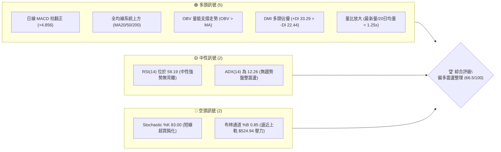
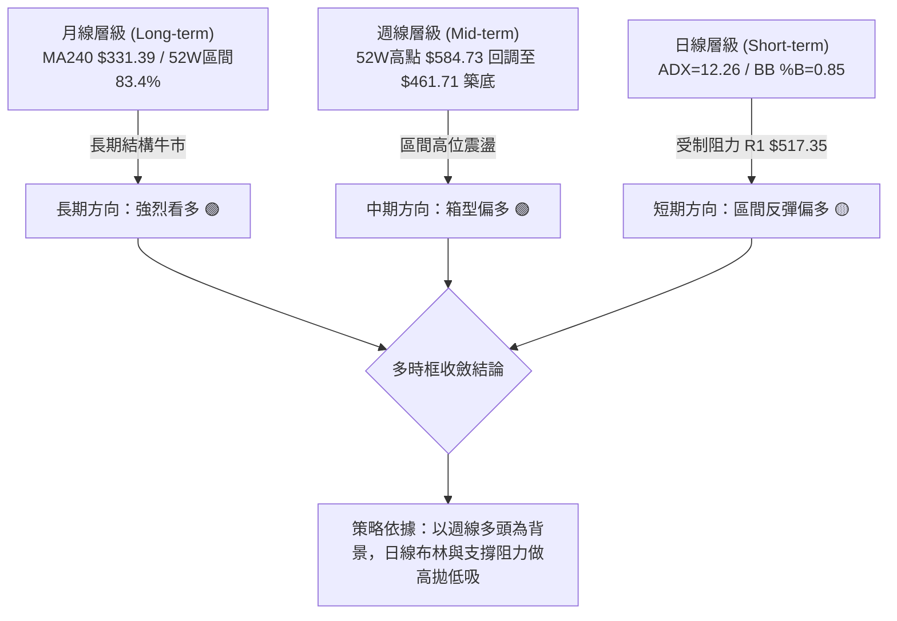
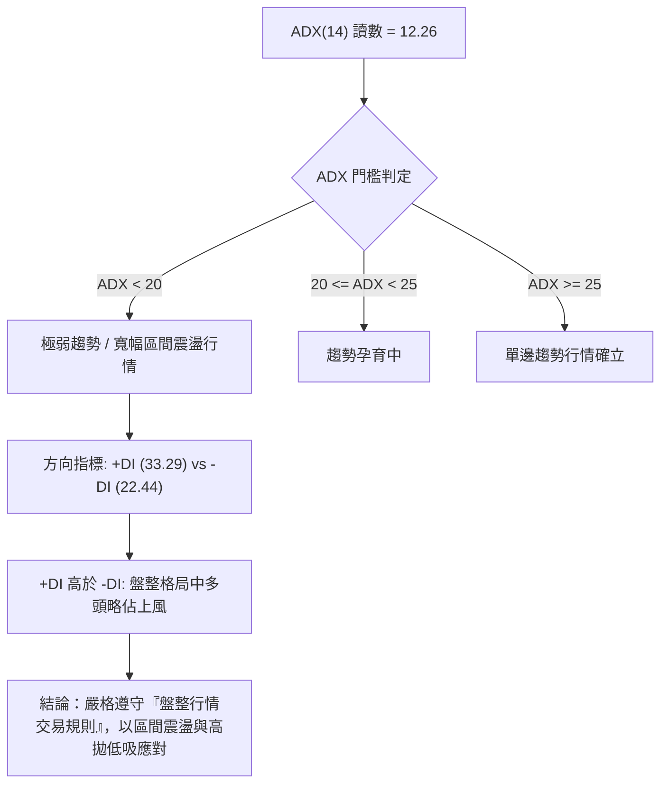
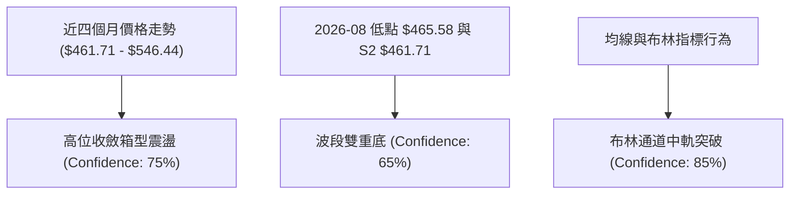
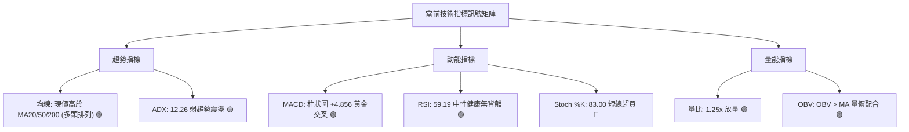
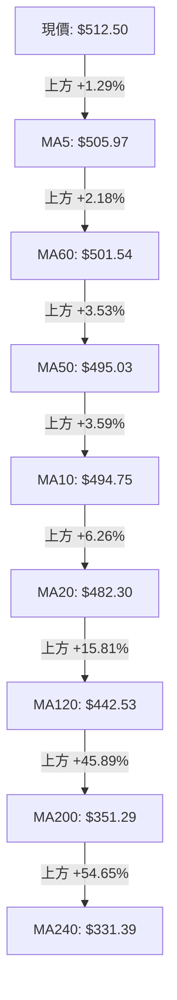
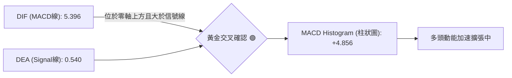
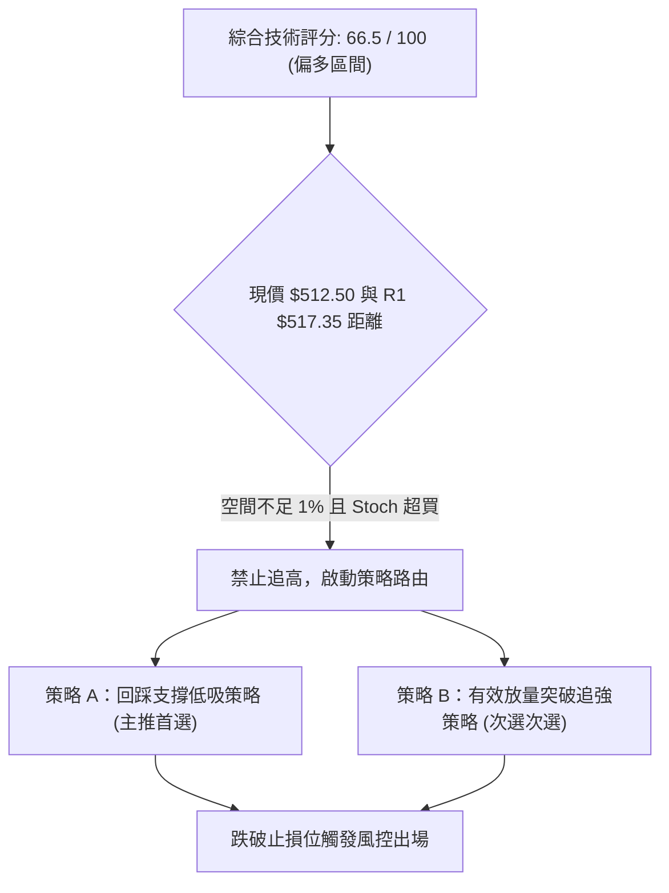
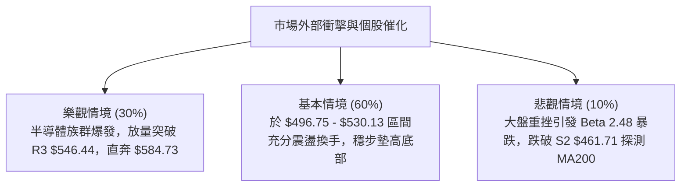

# AMD 技術分析報告

> **報告日期**：2026-09-17 ｜ **語言**：繁體中文 ｜ **數據來源**：Yahoo Finance ｜ **當前價格**：$512.50

---

## 目錄

| 章節 | 內容 |
|------|------|
| [1. 技術面概覽](#1-技術面概覽) | 訊號儀表板、核心指標、評分卡 |
| [2. 趨勢分析](#2-趨勢分析) | 多時框趨勢、長中短期走勢、ADX強弱度 |
| [3. 圖表形態分析](#3-圖表形態分析) | 形態識別、K線組合、目標價推算 |
| [4. 支撐與阻力](#4-支撐與阻力) | 關鍵價位、斐波那契回調結構 |
| [5. 技術指標深度解讀](#5-技術指標深度解讀) | 均線系統、RSI、MACD、布林通道、OBV |
| [6. 動能與波動率](#6-動能與波動率) | 動能四象限、ATR波動風險、Beta敏感度 |
| [7. 多時框架總結](#7-多時框架總結) | 時框架矩陣與多時框收斂收斂結論 |
| [8. 交易策略建議](#8-交易策略建議) | 策略路由、價格情境、主策略及避險點 |
| [9. 風險提示與監控](#9-風險提示與監控) | 監控Checklist、極端情境與風控指引 |
| [📋 報告總結](#-報告總結) | 核心總結儀表板與終端評級 |

---

## 1. 技術面概覽

### 🎯 技術訊號儀表板



### 📊 核心指標速覽表

| 指標類別 | 指標名稱 | 當前數值 | 訊號 | 解讀 |
|----------|----------|----------|------|------|
| **價格** | 當前價格 | $512.50 | 🟢 多頭 | 位於 52 週高低區間 83.4% 處，處於高位強勢整理區 |
| **短期均線** | MA20 | $482.30 | 🟢 多頭 | 現價高於 MA20 達 +6.26%，短期動能強勁 |
| **中期均線** | MA50 | $495.03 | 🟢 多頭 | 現價高於 MA50 達 +3.53%，突破中期生命線 |
| **長期均線** | MA200 | $351.29 | 🟢 多頭 | 現價高於 MA200 達 +45.89%，長期牛市基底穩固 |
| **動能** | RSI(14) | 59.19 | 🟡 中性 | 位於 50–60 健康擴張區，無頂底背離現象 |
| **趨勢強度** | ADX(14) | 12.26 | 🟡 盤整 | ADX < 25 顯示目前處於弱趨勢寬幅震盪行情 |
| **動能平滑** | MACD (12,26,9) | 5.396 / 0.540 | 🟢 多頭 | 雙線黃金交叉，Histogram 為 +4.856，動能逐日增強 |
| **超買超賣** | Stoch %K / %D | 83.00 / 72.71 | 🔴 超買 | 進入 80 以上超買區，短線追高盈虧比較差 |
| **通道狀態** | Bollinger Bands | 上軌 $524.94 | 🟡 中性 | %B 為 0.85，運行於中軌與上軌之間，壓制於上軌 |
| **成交量** | Volume / 20MA | 22.19M / 17.76M | 🟢 多頭 | 量比 1.25x，價漲量增；OBV 高於其均線 |
| **波動** | ATR(14) | $20.15 | 🟡 中度 | 日波動幅度達 3.93%，為短線止損設置提供關鍵依據 |

### 🏆 技術評分卡

```
╔════════════════════════════════════════════════════════════════╗
║                技術評分卡 — AMD (2026-09-17)                  ║
╠════════════════════════════════════════════════════════════════╣
║ 趨勢強度 (Trend)     ████████░░░░░░░░░░░░  40/100  🟡 震盪盤整 ║
║ 動能指標 (Momentum)  ██████████████░░░░░░  70/100  🟢 動能偏多 ║
║ 支撐穩定度 (Support) ████████████████░░░░  80/100  🟢 支撐堅固 ║
║ 成交量配合 (Volume)  ██████████████░░░░░░  70/100  🟢 價漲量增 ║
║ 形態完整度 (Pattern) ██████████████░░░░░░  70/100  🟢 箱型反彈 ║
║ 均線排列 (Moving Avg)██████████████░░░░░░  69/100  🟢 混合偏多 ║
╠════════════════════════════════════════════════════════════════╣
║ 綜合評分             █████████████░░░░░░░  66.5/100  🟢 偏多震盪║
╚════════════════════════════════════════════════════════════════╝
```

---

## 2. 趨勢分析

### 🌐 多時框趨勢分析



### 📈 長期趨勢 — 12個月走勢圖（Unicode）

```
AMD 月線收盤走勢圖（過去12個月：2025-10 至 2026-09）
價格軸 ($)
$600 ┤                                      ● $580.91 (2026-06 高點)
$550 ┤                                  ● 
$500 ┤                                  │         ● $512.50 (現價)
$450 ┤                                  │     ●   │
$400 ┤                              ●   │     │   │
$350 ┤                          ●   │   │     │   │
$300 ┤                          │   │   │     │   │
$250 ┤  ●                       │   │   │     │   │
$200 ┤  │   ●   ●   ●       ●   │   │   │     │   │
$150 ┤  │   │   │   │   ●   │   │   │   │     │   │
     └────────────────────────────────────────────────────────
       10  11  12  01  02  03  04  05  06    07  08  09 (月份)
      (2025年)        (2026年)
```

#### 走勢特徵分析表格

| 階段區間 | 時間跨度 | 起訖價位區間 | 累積漲跌幅 | 形態與量價特徵 | 趨勢定性 |
|----------|----------|--------------|------------|----------------|----------|
| **第一階段：底部沉澱** | 2025-10 ~ 2026-03 | $256.12 → $203.43 | -20.57% | 於 $200.00 心理關口進行 6 個月的量縮築底打底，洗淨浮額 | 長期築底 🟡 |
| **第二階段：主升爆發** | 2026-03 ~ 2026-06 | $203.43 → $580.91 | +185.56% | 爆量突破歷史阻力，拉出強勁單邊牛市，創下 52 週歷史高點 $584.73 | 主升浪 🟢 |
| **第三階段：高位盤整** | 2026-06 ~ 2026-09 | $580.91 → $512.50 | -11.78% | 高位獲利回吐，在斐波那契 23.6%（$482.10）上方展開寬幅箱型整理 | 高位箱型震盪 🟢 |

### 📊 中期趨勢（週線分析）

中期走勢自 2026 年 6 月創下 52 週高點 $584.73 後進入修正。近 20 週收盤走勢顯示，價格在 2026-08-30 探至波段低點 $465.58（接近 S2: $461.71）後獲得強勁承接買盤，隨後連續三週收陽，週 MACD 柱狀圖由 -9.004 回升至 +4.856，週 RSI 亦自 40.1 反彈至 59.2。

```
中期壓力與支撐示意圖（週線結構）
  $584.73 ────────────────────────────── 52W High (歷史強阻力)
             ╲                      ╱
              ╲   $530.13 (R2)     ╱   ◄ 本輪反彈次級阻力
               ╲                  ╱
  $517.35 ───────●──────────────●─────── R1 關鍵短線阻力
                  ╲            ╱ 
  $512.50 ─────────●──────────●───────── 現價位置 (反彈推進中)
                    ╲        ╱
  $496.75 ───────────●──────●─────────── S1 近期轉換支撐 (原MA50)
                      ╲    ╱
  $461.71 ─────────────●──────────────── S2 中期箱底強支撐 (2026-08 低點聚類)
```

### ⚡ 趨勢強度評估（ADX 解讀）



#### ADX 指標狀態矩陣

| 指標名稱 | 當前數值 | 參考標準 | 當前市場狀態判定 |
|----------|----------|----------|------------------|
| **ADX (14)** | 12.26 | < 25 為盤整；> 25 為趨勢 | 🔴 無明確趨勢，處於均線交織的箱型洗盤期 |
| **+DI (14)** | 33.29 | 高於 -DI 代表多方動能佔優 | 🟢 多頭掌控短期進攻節奏 |
| **-DI (14)** | 22.44 | 低於 +DI 代表空方壓制退縮 | 🟢 空方拋壓正在遞減 |
| **趨勢強度定性** | **弱趨勢盤整（多頭佔優）** | 依規則 14：以日線布林通道上下軌與S/R價位為主要操作邊界 |

---

## 3. 圖表形態分析

### 🔍 形態識別系統

依據當前數據與近 20 週價格行為，嚴格遵循數據紀律（規則 15），識別之幾何與指標形態如下：



| 形態名稱 | 信心度 | 判斷依據（引用實際數據） | 完成度 | 目標價（附嚴謹計算式） |
|----------|--------|--------------------------|--------|------------------------|
| **波段雙重底 (Double Bottom)** | 65% | 8月波段於 $465.58 與聚類支撐 S2 $461.71 形成雙底支撐，當前突破頸線 S1 $496.75 | 80% | 頸線 $496.75 + (頸線 $496.75 - 底點 $461.71) = **$531.79**（極度接近阻力 R2 $530.13） |
| **高位箱型整理 (Rectangle)** | 75% | 箱底鎖定在 S2 $461.71，箱頂受制於阻力 R3 $546.44，目前價格位於箱體中軸上方 | 70% | 箱頂突破後目標：箱頂 $546.44 + 箱高 ($546.44 - $461.71 = $84.73) = **$631.17** |
| **布林通道中軌突破** | 85% | 現價 $512.50 強力帶量站上布林中軌（MA20: $482.30），向布林上軌發起挑戰 | 90% | 布林帶上軌動態目標價：**$524.94** |

### 🕯️ 重要K線形態分析

| 週期/月份 | 收盤價 | K線形態 | 量價結構與技術解讀 | 訊號 |
|-----------|--------|---------|-------------------|------|
| **2026-06** | $580.91 | 創高長上影陽線 | 觸及 52 週高點 $584.73 後遭遇獲利了結，多頭推升衰竭 | 🔴 警示 |
| **2026-08-30** | $465.58 | 下影支撐錘頭線 | 週成交量縮至 81.76M，於 S2 $461.71 前形成止跌信號 | 🟢 築底 |
| **2026-09-06** | $477.57 | 晨星孕線組合 | MACD 柱狀圖翻正 (+0.139)，空頭動能耗盡，多頭發動反攻 | 🟢 轉強 |
| **2026-09-13** | $516.13 | 實體大陽線帶量 | 收盤強勢站回 MA50（$495.03），週成交量回升至 85.35M | 🟢 進攻 |
| **2026-09-20** | $512.50 | 高位十字小陰星 | 受阻於 R1 $517.35 展開健康回踩，技術結構依然維持多頭佔優 | 🟡 整理 |

### 📉 ASCII 走勢形態示意圖

```
近 8 週日線波段雙底反彈形態示意圖
  $530.13 (R2) ───────────────────────────────────────────── 形態目標位
                                                     ▲
  $517.35 (R1) ───────────────────────●─────────────┼─────── 短線阻力受阻
                                     ╱ ╲           ╱ (現價 $512.50)
  $496.75 (S1) ─────────●───────────╱───╲─────────●──────── 突破頸線位置
                       ╱ ╲         ╱     ╲       ╱
  $480.00             ╱   ╲       ╱       ╲     ╱
                     ╱     ╲     ╱         ╲   ╱
  $461.71 (S2) ─────●───────●───●───────────●────────────── 雙重底打底完成
                  (底點1: 08-02) (底點2: 08-30)
```

### 🎯 形態目標價計算

依據波段雙底幾何測量模型：
1. **基底支撐確認**：波段最低收盤價為 2026-08-30 之 $465.58，對應聚類支撐 S2 為 **$461.71**。
2. **頸線確認**：反彈波段高點聚類頸線 S1 為 **$496.75**。
3. **形態垂直高度**：$H = \text{頸線} - \text{底點} = \$496.75 - \$461.71 = \$35.04$。
4. **最小量度目標價**：$\text{頸線} + H = \$496.75 + \$35.04 = \mathbf{\$531.79}$。
   *(注：該量度目標與數據中近一年波段高點聚類形成的第二阻力位 **R2: $530.13** 誤差僅 0.3%，形成高度共振)*。

---

## 4. 支撐與阻力

### 🗺️ 關鍵價位分布圖（Unicode）

```
AMD 價位結構與空間分布圖
═════════════════════════════════════════════════════════════════
$584.73 ║████████████████████████████████║ 52W High / 斐波 0.0% 強阻力
$546.44 ║████████████████████            ║ 阻力 R3 (近一年波段高點聚類)
$530.13 ║████████████████                ║ 阻力 R2 (波段雙底量度目標)
$524.94 ║▓▓▓▓▓▓▓▓▓▓▓▓▓▓▓▓                ║ 動態阻力 (布林通道上軌)
$517.35 ║████████████                    ║ 阻力 R1 (+0.95% 短線密集交投區)
$512.50 ╠════════════════════════════════╣ ◄ 現價 ($512.50)
$496.75 ║▓▓▓▓▓▓▓▓▓▓▓▓▓▓▓▓                ║ 支撐 S1 (頸線 / MA50 $495.03 共振)
$482.10 ║████████████████                ║ 斐波那契 23.6% 回調 / MA20 $482.30
$461.71 ║████████████████████████        ║ 支撐 S2 (雙底低點 / 中期分水嶺)
$451.00 ║████████████████████████████    ║ 支撐 S3 (-12.00% 強防守位)
$418.61 ║████████████████████████████████║ 斐波那契 38.2% 結構防守位
═════════════════════════════════════════════════════════════════
```

### 🚧 阻力位分析表

| 阻力級別 | 精確價位 | 與現價差距 | 形成原因（波段高點聚類） | 突破難度 | 重要性權重 |
|----------|----------|------------|--------------------------|----------|------------|
| **R1** | **$517.35** | +0.95% | 近期反彈頂點與成交密集區聚類，日線直接壓制點 | 🟡 中等 | ★★★☆☆ |
| **R2** | **$530.13** | +3.44% | 2026年7月多次衝高受阻位，雙底形態量度目標位 | 🔴 較高 | ★★★★☆ |
| **R3** | **$546.44** | +6.62% | 中期震盪箱頂聚類阻力，突破後將直接挑戰 52W 高點 | 🔴 極高 | ★★★★★ |

### 🛡️ 支撐位分析表

| 支撐級別 | 精確價位 | 與現價差距 | 形成原因（波段低點聚類） | 守住機率 | 重要性權重 |
|----------|----------|------------|--------------------------|----------|------------|
| **S1** | **$496.75** | -3.07% | 雙底頸線位置，與 MA50（$495.03）形成多頭重疊防線 | 🟢 75% | ★★★★☆ |
| **S2** | **$461.71** | -9.91% | 2026年8月波段底部聚類，中期牛熊轉換臨界點 | 🟢 85% | ★★★★★ |
| **S3** | **$451.00** | -12.00% | 近一年深幅回調低點聚類，長期結構多頭底線 | 🟢 95% | ★★★★★ |

### 📐 斐波那契回調位分析

依據 52 週波段低點 **$149.85** 至波段高點 **$584.73**（垂直落差 $434.88）之黃金分割測算：

```
斐波那契回調結構層級
0.0%  ──────── $584.73 (52W High 歷史頂峰)
               ▲
               │ 當前價格區間運行中 ($512.50)
               ▼
23.6% ──────── $482.10 (現價第一黃金防守位，重合 MA20 $482.30)
38.2% ──────── $418.61 (強回調健康修正位，重合 MA120 $442 附近)
50.0% ──────── $367.29 (多空中期平衡點，重合 MA200 $351.29)
61.8% ──────── $315.97 (極限回調防守位，重合 MA240 $331.39)
78.6% ──────── $242.91 (深度熊市回撤位)
100.0%──────── $149.85 (52W Low 啟動點)
```

- **空間解讀**：現價 **$512.50** 穩固運行於 **0.0% ($584.73)** 與 **23.6% ($482.10)** 之間極強勢區間。
- **指標共振**：斐波那契 23.6% 回調位 **$482.10** 與當前日線 **MA20 ($482.30)**、**布林中軌 ($482.30)** 呈現完美的「三位一體」共振，證實 $482 區域為多頭不可退讓的生命線。

---

## 5. 技術指標深度解讀

### 🎛️ 指標訊號總覽



### 📈 移動平均線排列分析



#### 均線體系狀態解讀
- **短中期均線重聚向上**：MA5（$505.97）> MA10（$494.75）> MA20（$482.30），短期形成標準多頭排列，且均線角度呈陡峭上升態勢（MA5 斜率 +1.29%、MA10 斜率 +3.59%）。
- **長期多頭壁壘**：MA120（$442.53）、MA200（$351.29）、MA240（$331.39）依序在下方墊高，價格遠在 200 日線之上 +45.89%，確認大週期維持超級牛市架構。
- **均線排列判定**：當前系統定義為「混合排列」，主因在於中期 MA50（$495.03）與 MA60（$501.54）尚需時間完成對短期均線的重新順序梳理，但整體多方趨向不變。

### 📉 RSI(14) 分析

```
RSI(14) 動能進度條：59.19
0 ────────── 30 ──────────────── 50 ────── 59.19 ────── 70 ────────── 100
[   超賣區   ] [     弱勢區     ] [  強勢中性  ▓▓▓▓▓▓  ] [   超買區   ]
進度顯示：████████████░░░░░░░░ 59.2%
```

- **區間解讀**：RSI(14) 讀數為 **59.19**，遠離 30 以下的超賣區，亦未觸及 70 以上的過熱警戒區，處於健康的多頭控盤區間。
- **背離分析**：
  - **日線背離判定**：價格由 8 月末 $465.58 上升至當前 $512.50，RSI 由 40.1 同步抬升至 59.19，**無頂背離、無底背離**。
  - **背離結論**：動能完全確認當前反彈走勢，未見量能衰退引發的動能衰竭。

### 📊 MACD(12,26,9) 訊號解讀



- **參數解讀**：DIF（5.396）向上穿越 DEA（0.540），柱狀圖讀數達 **+4.856**。
- **動能演變**：回顧近 6 週週線數據，MACD 柱狀圖由 2026-08-02 的極端負值 **-9.004**，快速收斂翻正為 2026-09-13 的 **+6.512** 與當前的 **+4.856**，證實中短期洗盤結束，多方主力資金已重掌主控權。

### 📦 布林通道分析

```
布林通道（Bollinger Bands, 20, 2）結構分布
$524.94 ───┬─────────────────────────────── 布林上軌 (動態壓制)
           │          ● 現價 $512.50 (%B = 0.85)
$482.30 ───┼─────────────────────────────── 布林中軌 (MA20 生命線 / 斐波23.6%)
           │
$439.67 ───┴─────────────────────────────── 布林下軌 (極限支撐)
```

- **帶寬與位置**：上軌 $524.94，中軌 $482.30，下軌 $439.67，帶寬為 $85.27。
- **%B 解讀**：當前 **%B = 0.85**，價格位於通道上部 85% 位置，逼近布林通道上軌。在 ADX < 25 的震盪行情下，上軌 $524.94 將與阻力位 R1（$517.35）及 R2（$530.13）形成強力壓制帶，短線追高面臨通道邊界均值回歸的拉回風險。

### 💹 成交量分析（量價配合度）

- **量能規模**：最新單日成交量為 **22,193,900** 股，高於 20 日均量（**17,757,430** 股），量比達到 **1.25x**，顯示資金回流。
- **OBV 能量潮判斷**：數據明確顯示 **OBV > MA**，量能先行指標持續上行，顯示本輪推升並非無量誘多，而是伴隨實質機構買盤進場承接，量價配合結構健康（Volume Confirmation 確立）。

---

## 6. 動能與波動率

### ⚡ 動能評估四象限

```
動能與波動率四象限分析
  高波動率 (High Volatility)
        │
   Q4   │   Q3 (AMD 當前位置)
  避免  │   高風險高收益
  進場  │   ● 動能評估: 偏強 / ATR波動: 3.93% (Beta 2.48)
────────┼────────────────────────── 動能 (Momentum)
   Q2   │   Q1
  謹慎  │   最佳進場機會
  觀望  │   (低波動高動能)
        │
  低波動率 (Low Volatility)
```

| 象限 | 動能強度 | 波動率水準 | AMD 當前狀態 | 交易策略指導 |
|------|----------|------------|--------------|--------------|
| **Q1** | 強 | 低 | — | 最佳低吸時機，勝率最高 |
| **Q2** | 弱 | 低 | — | 觀望洗盤，等待趨勢發動 |
| **Q3** | **強** | **高** | **✓ (AMD 當前處於 Q3)** | **高風險高收益：動能強勁但振幅大，必須縮減倉位並拉寬止損** |
| **Q4** | 弱 | 高 | — | 趨勢破位崩跌，堅決離場避險 |

### 📊 ATR 波動率分析

- **ATR(14) 數值**：**$20.15**，佔現價之比例高達 **3.93%**。
- **波動特性解讀**：代表 AMD 每日正常交易區間震盪可達 $20 美元以上，屬於典型的高 Beta 成長晶片股特徵。
- **風控止損距離推算**：
  - **日內交易止損 (1.0x ATR)**：\$20.15，自現價下扣約在 **$492.35**（緊鄰 S1: $496.75）。
  - **波段交易止損 (1.5x ATR)**：\$30.23，自現價下扣約在 **$482.27**（完美重合 MA20: $482.30 與斐波 23.6%: $482.10）。
  - **寬鬆結構止損 (2.0x ATR)**：\$40.30，自現價下扣約在 **$472.20**（位於 S2: $461.71 之上）。

### 📐 Beta 與市場相關性

- **Beta 係數**：**2.476**（極高市場敏感度）。
- **市場意涵**：當標普500指數或費城半導體指數上漲 1% 時，AMD 統計上傾向同向放大變動約 2.48%；反之亦然。在市場回調時，其下行殺傷力倍增，因此持倉比例需嚴格控制，嚴禁過度槓桿化操作。

---

## 7. 多時框架總結

### 📋 時框架評分表

| 時框架 | 趨勢方向 | 動能狀態 | 均線排列 | 圖表形態 | 綜合評分 | 操作建議 |
|--------|----------|----------|----------|----------|----------|----------|
| **月線 (長期)** | 🟢 強烈看多 | 強烈擴張 | 完整多頭排列 | 歷史高位突破整理 | 85/100 | 長期持有，回踩核心均線加碼 |
| **週線 (中期)** | 🟢 箱型偏多 | 柱狀圖翻正 | 均線支撐完好 | 波段雙底反彈完成 | 70/100 | 箱底低吸，阻力區分批兌現 |
| **日線 (短期)** | 🟡 震盪偏多 | Stoch 超買 | 突破短期均線 | 逼近布林通道上軌 | 60/100 | 不宜追高，等待回踩支撐布局 |

### 🔲 綜合訊號矩陣

```
╔══════════════════════════════════════════════════════════════════╗
║               AMD 多時框架多空收斂矩陣                           ║
╠═════════════╦══════════════╦══════════════╦══════════════════════╣
║ 分析維度    ║ 短期 (日線)  ║ 中期 (週線)  ║ 長期 (月線)          ║
╠═════════════╬══════════════╬══════════════╬══════════════════════╣
║ 趨勢方向    ║ 🟡 區間震盪  ║ 🟢 箱型偏多  ║ 🟢 單邊牛市          ║
║ 動能強弱    ║ 🟡 臨界超買  ║ 🟢 翻多擴張  ║ 🟢 強勁多頭          ║
║ 支撐壓力比  ║ 1 : 1 均等   ║ 2 : 1 偏多   ║ 3 : 1 極度偏多       ║
║ 量價結構    ║ 🟢 價漲量增  ║ 🟢 縮量洗盤完║ 🟢 機構高度控盤      ║
╠═════════════╬══════════════╬══════════════╬══════════════════════╣
║ 權重評分    ║ 60 / 100     ║ 70 / 100     ║ 85 / 100             ║
╚═════════════╩══════════════╩══════════════╩══════════════════════╝
```

### ⚖️ 多時框收斂結論

依據多時框收斂規則（規則 14）：
1. **行情屬性判定**：當前 ADX(14) 讀數為 **12.26（ADX < 25）**，系統確認當前處於**盤整震盪行情**而非單邊單向趨勢。
2. **優先級取捨原則**：盤整行情下，不可盲目使用日線突破策略，而應**以日線布林通道（$439.67 ~ $524.94）與關鍵聚類支撐阻力為核心交易邊界**。
3. **終端方向收斂**：雖然短線面臨布林上軌與 R1 $517.35 的壓制，但鑑於週線雙底成型、OBV 量能支撐以及長期均線完美向上支撐，綜合多時框訊號收斂為：**唯一結論：偏多震盪整理（中短線尋求回踩低吸，嚴格禁止追高）**。

---

## 8. 交易策略建議

### 🗺️ 策略決策流程圖



### 🧭 策略路由

**當前主策略方向 = 偏多震盪回踩低吸（依評分卡綜合評分 66.5 / 100 分流）**

因評分 ≥ 60，本報告**主推多頭策略**；空頭方向僅列為反轉風險觸發點（對沖提示），不進行雙向猜頂操作。

### 🎯 價格情境階梯（Price Scenarios）

所有價位精確引用第 4 章關鍵價位與斐波那契回調數據：

| 觸發條件 | 下一目標價 | 後續延伸目標 | 情境技術含義 |
|----------|------------|--------------|--------------|
| **強勢突破 R1 $517.35** | **R2: $530.13** | **R3: $546.44** | 短線洗盤結束，挑戰箱型上軌 |
| **突破 R3 $546.44** | **52W High: $584.73** | 雙底量度延伸 | 創歷史新高，重啟長期主升浪 |
| **現價區間震盪整理** | 支撐 S1: $496.75 | 阻力 R1: $517.35 | 布林通道中軌至上軌間消化浮額 |
| **失守 S1 $496.75** | **S2: $461.71** | S3: $451.00 | 中期結構弱化，回測雙底箱體底部 |
| **跌破 S2 $461.71** | **斐波 38.2%: $418.61** | MA200: $351.29 | 宣告反彈失敗，中期轉入深度回調 |

### 📊 情境機率分佈

| 情境劃分 | 預估機率 | 主要依據（指標狀態支撐） |
|----------|----------|--------------------------|
| **情境一：高位區間震盪後蓄勢突破** | **60%** | MACD 柱狀圖 +4.856 持續向上；OBV > MA 資金流入；全均線上方防守 |
| **情境二：直接承壓回測箱底** | **30%** | ADX 12.26 缺乏突破趨勢動能；Stoch %K 83 超買；布林 %B 0.85 壓制 |
| **情境三：跌破 S2 走弱深度回撤** | **10%** | 需遭遇大盤系統性黑天鵝使 Beta 2.48 發酵，目前機率極低 |

### 🟢 主策略詳情

| 策略要素 | 策略 A（回踩支撐低吸 — 首選） | 策略 B（突破阻力追強 — 次選） |
|----------|-------------------------------|-------------------------------|
| **進場條件** | 價格回踩 S1 與 MA50 共振帶，出現止跌K線 | 日線實體突破 R1 $517.35 且單日成交量 > 23M |
| **進場價格** | **$496.75**（支撐 S1 聚類點） | **$518.00**（突破 R1 確認點） |
| **目標價 T1** | **$517.35**（阻力 R1） | **$530.13**（阻力 R2 / 雙底量度） |
| **目標價 T2** | **$530.13**（阻力 R2） | **$546.44**（阻力 R3 箱頂） |
| **止損價格** | **$482.10**（斐波 23.6% / MA20 共振帶） | **$496.75**（假突破防守止損位） |
| **風險報酬比** | **1 : 2.28** (風險 $14.65 vs 目標2 $33.38) | **1 : 1.34** (風險 $21.25 vs 目標2 $28.44) |
| **成功機率** | **68%** | **55%** |
| **建議倉位** | **15% ~ 20%** | **10%**（防範假突破風險） |

### 🔴 反向風險觸發點（對沖提示）

- **關鍵破位觸發點**：收盤價有效**跌破 S1: $496.75**。
- **指標異動確認**：日線 MACD 柱狀圖翻負，且成交量放大跌破。
- **避險動作**：主動將多頭持倉砍半或進行等額買入 Put 選擇權對沖；若進一步**跌破 S2: $461.71**，多頭部位必須全面無條件清倉離場觀望。

### ⭐ 整體訊號強度評星

```
做多訊號強度：★★★★☆  (4/5星：中長線趨勢極佳，短線回踩盈虧比優秀)
做空訊號強度：★☆☆☆☆  (1/5星：逆大週期均線操作，勝率與盈虧比極差)
整體可信度：  ★★★★☆  (4/5星：多指標共振確認，價位聚類顯著)
```

---

## 9. 風險提示與監控

### ✅ 關鍵監控指標 Checklist

```
╔════════════════════════════════════════════════════════════════╗
║                每日交易風控監控 CHECKLIST                      ║
╠════════════════════════════════════════════════════════════════╣
║ [ ] 價格是否跌破斐波那契 23.6% 與 MA20 防守線 ($482.10)        ║
║ [ ] 日成交量是否萎縮至 20 日均量之下 (< 17,757,430)             ║
║ [ ] RSI(14) 是否在 60-70 區間形成頂背離結構                    ║
║ [ ] MACD 柱狀圖是否自 +4.856 發生鈍化並跌破零軸                 ║
║ [ ] Stoch %K / %D 是否自超買區 (>80) 形成向下死亡交叉           ║
║ [ ] 費城半導體指數 (SOX) 是否出現單日 > 2% 之系統性下跌        ║
╚════════════════════════════════════════════════════════════════╝
```

### ⚠️ 風險場景分析



### 🛡️ 風險管理重要提醒

1. **高 Beta 波動懲罰機制**：鑑於 AMD Beta 高達 **2.476** 且 ATR 達 **$20.15**，單筆交易最大虧損額度必須嚴格控制在總資金的 **1.0% - 1.5%** 範圍內，嚴禁重倉孤注一擲。
2. **盤整期忌追漲**：ADX 數值 **12.26** 代表價格缺乏持續突破慣性，任何逼近布林通道上軌（**$524.94**）或阻力 R1（**$517.35**）的追多行為極易遭短線甩轎洗盤，策略應「買在支撐、賣在阻力」。
3. **無條件止損紀律**：所有交易必須在下單同時掛設硬性止損單，嚴禁盤中將止損位隨意向下挪動。

---

## 📋 報告總結

```
╔════════════════════════════════════════════════════════════════╗
║                   AMD 技術分析報告總結儀表板                   ║
╠════════════════════════════════════════════════════════════════╣
║ 報告日期：2026-09-17                                          ║
║ 當前價格：$512.50                                              ║
║ 分析評級：🟢 偏多震盪整理（技術評分：66.5 / 100）              ║
╠════════════════════════════════════════════════════════════════╣
║ 關鍵技術維度結論：                                             ║
║ ├─ 長期趨勢：🟢 強烈看多 (MA200 $351.29 上方，52W區間83.4%)   ║
║ ├─ 中期趨勢：🟢 箱型反彈 (S2 $461.71 雙底成型，目標 $530.13)   ║
║ ├─ 短期趨勢：🟡 震盪偏多 (ADX 12.26 盤整，Stoch 83.00 短期超買)║
║ ├─ 核心支撐：S1 $496.75 (頸線) ｜ 關鍵防守 $482.10 (MA20/斐波) ║
║ ├─ 關鍵阻力：R1 $517.35 (短線) ｜ 核心目標 R2 $530.13 (雙底)   ║
║ └─ 機構共識：分析師平均目標 $616.51 (潛在空間 +20.3%)          ║
╠════════════════════════════════════════════════════════════════╣
║ 終端策略執行指引：                                             ║
║ 1. 🥇 首選策略 (策略 A)：回踩 S1 $496.75 佈局多單，止損設於    ║
║    $482.10，第一目標 $517.35，終極目標 $530.13 (盈虧比 1:2.28) ║
║ 2. 🥈 次選策略 (策略 B)：若強勢帶量突破 R1 $517.35 輕倉追多，  ║
║    目標 $530.13 ~ $546.44，跌回 $496.75 嚴格止損。            ║
║ 3. 🥉 避險警示：盤整行情切忌追高，收盤跌破 $482.10 全面離場。 ║
╚════════════════════════════════════════════════════════════════╝
```

---

> ⚠️ **免責聲明**：本報告為技術分析研究成果，報告內所有數據、支撐阻力點位及估算均基於歷史量價客觀計算。本報告**僅供研究與學術參考**，**不構成任何形式的要約或投資建議**。金融市場投資伴隨本金損失之高風險，投資人應依個人風險承受能力自主獨立判斷，並自負盈虧。

---

*報告生成時間：2026-09-17 ｜ 數據來源：Yahoo Finance ｜ 分析框架：資深多時框量化技術分析模型*