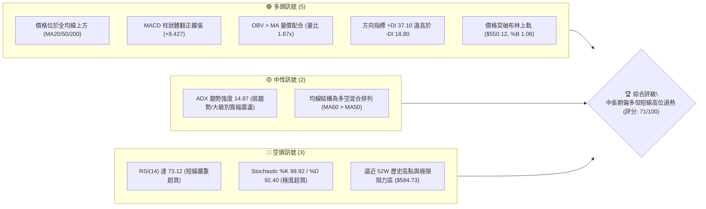
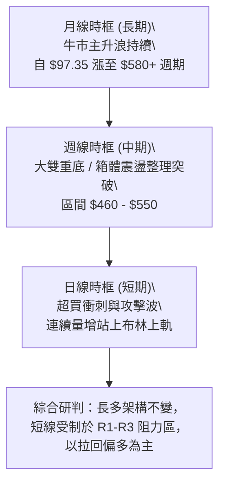
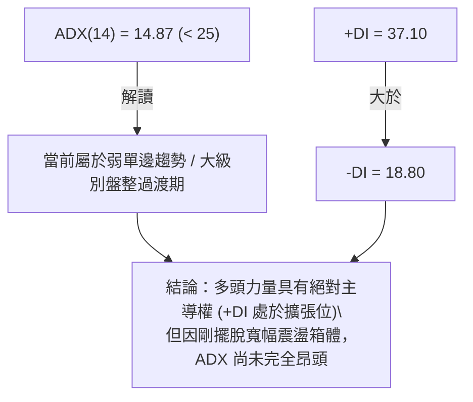
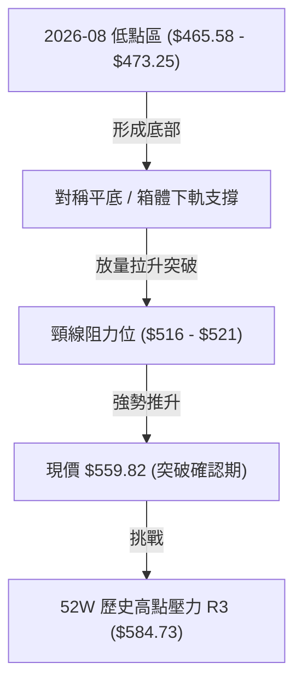
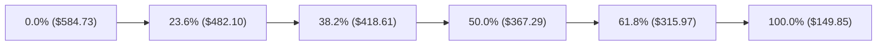
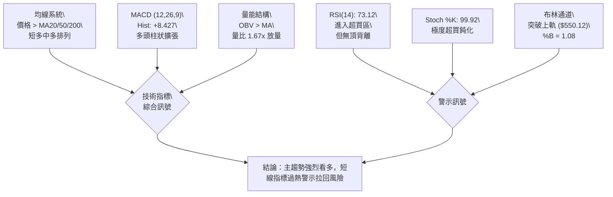
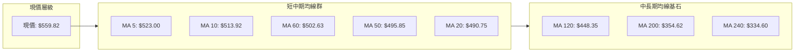
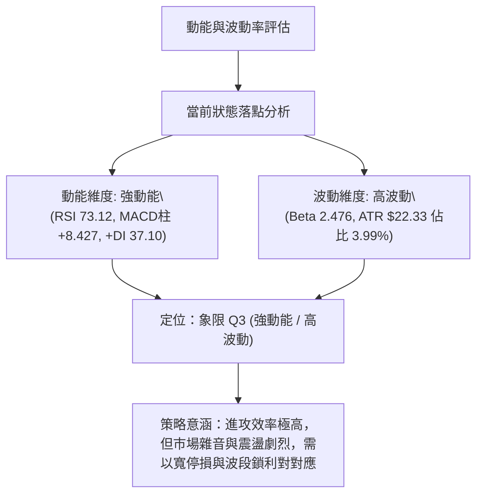
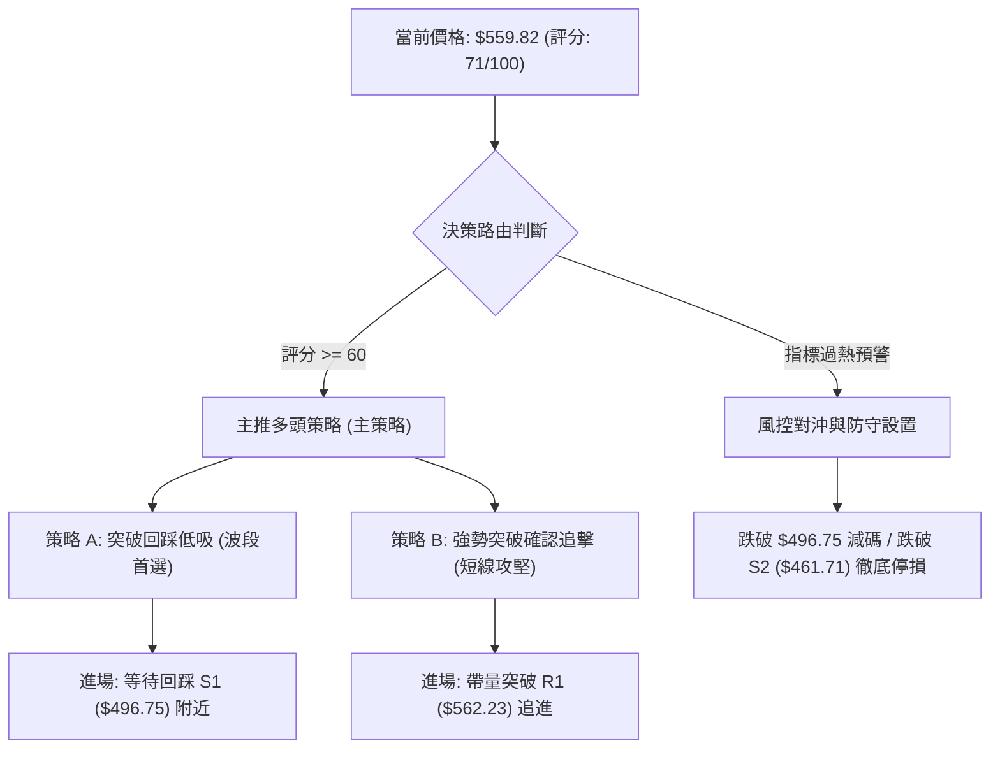
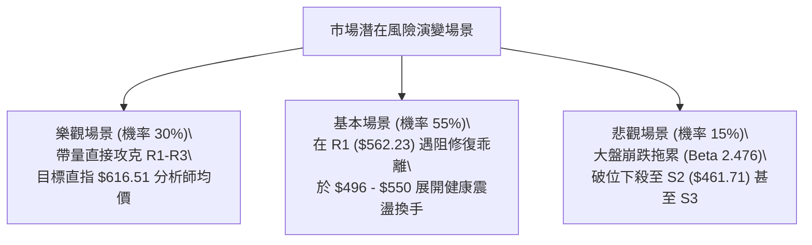

# AMD 技術分析報告

> **報告日期**：2026-09-19 ｜ **語言**：繁體中文 ｜ **數據來源**：Yahoo Finance ｜ **當前價格**：$559.82

---

## 目錄

| 章節 | 內容 |
|------|------|
| [1. 技術面概覽](#1-技術面概覽) | 訊號儀表板、核心指標、評分卡 |
| [2. 趨勢分析](#2-趨勢分析) | 多時框趨勢、長中短期走勢 |
| [3. 圖表形態分析](#3-圖表形態分析) | 形態識別、K線組合、目標價 |
| [4. 支撐與阻力](#4-支撐與阻力) | 關鍵價位、斐波那契回調 |
| [5. 技術指標深度解讀](#5-技術指標深度解讀) | MA/RSI/MACD/布林/成交量 |
| [6. 動能與波動率](#6-動能與波動率) | 動能評估、ATR、Beta |
| [7. 多時框架總結](#7-多時框架總結) | 時框架評分矩陣 |
| [8. 交易策略建議](#8-交易策略建議) | 多空策略、風險報酬比 |
| [9. 風險提示與監控](#9-風險提示與監控) | 監控指標、風險場景 |

---

## 1. 技術面概覽

### 🎯 技術訊號儀表板



### 📊 核心指標速覽表

| 指標類別 | 指標名稱 | 當前數值 | 訊號 | 解讀 |
|----------|----------|----------|:----:|------|
| **價格** | 當前價格 | $559.82 | 🟢 | 位於 52 週區間頂部 94.3% 位置，強勢多頭定價 |
| **均線** | MA20 | $490.75 | 🟢 | 價格在其上方 +14.07%，短期支撐強勁且斜率陡峭向上 |
| **均線** | MA50 | $495.85 | 🟢 | 價格在其上方 +12.90%，成功收復中期波段生命線 |
| **均線** | MA200 | $354.62 | 🟢 | 價格在其上方 +57.86%，超長期牛市基石完全確立 |
| **動能** | RSI(14) | 73.12 | 🔴 | 進入超買區間 (>70)，短期多頭動能存在過度透支風險 |
| **動能** | MACD (12,26,9) | 12.749 / 4.322 | 🟢 | MACD 線穿過 Signal 線，柱狀體 +8.427 強勁看多 |
| **震盪** | Stoch %K / %D | 99.92 / 92.40 | 🔴 | KD 指標雙雙進入 90 以上極值區，短線隨時有回踩需求 |
| **趨勢** | ADX (14) | 14.87 | 🟡 | 數值低於 25，顯示當前急漲仍屬於大型區間盤整後的破繭期 |
| **通道** | 布林通道 | 上軌 $550.12 | 🟢 | 收盤價突破上軌 (%B 1.08)，強勢通道擴張，短線具備鈍化特徵 |
| **成交量** | 最新量 / 20MA量 | 31.78M / 19.05M | 🟢 | 量比 1.67x，突破伴隨量能顯著放大，OBV 趨勢向上確認突破真實度 |
| **波動** | ATR(14) | $22.33 | 🟡 | 佔股價 3.99%，單日振幅高，部位規模與停損空間需相應放大 |

### 🏆 技術評分卡

```
╔══════════════════════════════════════════════════════════════════╗
║               技術評分卡 — AMD (2026-09-19)                       ║
╠══════════════════════════════════════════════════════════════════╣
║ 趨勢強度 (ADX/趨勢方向)   ████████████░░░░░░░░  60/100  🟡 中度偏強  ║
║ 動能指標 (MACD/RSI/KD)    ██████████████░░░░░░  70/100  🟢 動能充沛  ║
║ 支撐穩定度 (結構支撐測試) ████████████████░░░░  80/100  🟢 底部扎實  ║
║ 成交量配合 (量比/OBV確認) ████████████████░░░░  80/100  🟢 價漲量增  ║
║ 形態完整度 (突破/回調架構)██████████████░░░░░░  70/100  🟢 箱體突破  ║
║ 均線排列 (短中長期均線)   ██████████████░░░░░░  68/100  🟡 混合偏多  ║
╠══════════════════════════════════════════════════════════════════╣
║ 綜合評分                  ██████████████░░░░░░  71/100  🟢 偏多進攻  ║
╚══════════════════════════════════════════════════════════════════╝
```

---

## 2. 趨勢分析

### 🌐 多時框趨勢分析



### 📈 長期趨勢 — 12個月走勢圖（Unicode）

```
AMD 月線收盤走勢圖（過去12個月：2025-10 至 2026-09）
價格軸 ($)
$600 ┤                                      ● $580.91 (06月波段頂)
$560 ┤                                           ● $559.82 (現價 09月)
$520 ┤                             ● $516.10
$480 ┤                                  ● $476.15  ● $470.72
$360 ┤                   ● $354.49
$260 ┤ ● $256.12
$240 ┤      ● $217.53  ● $236.73
$200 ┤           ● $214.16   ● $200.21  ● $203.43 (波段底 03月)
     └──────────────────────────────────────────────────────────
       10   11   12   01   02   03   04   05   06   07   08   09 (月份)
      2025                                2026
```

**走勢特徵分析表格**：

| 階段週期 | 涵蓋月份 | 區間價格變動 | 區間漲跌幅 | 走勢結構與量價特徵 |
|:---|:---:|:---:|:---:|:---|
| **第一階段：高位修正** | 2025-10 ~ 2026-03 | $256.12 → $203.43 | -20.57% | 自前波高點回調，於 $200 心理整數關卡成功築出波段堅實雙底（2月 $200.21、3月 $203.43）。 |
| **第二階段：主升噴出** | 2026-03 ~ 2026-06 | $203.43 → $580.91 | +185.56% | 爆發性 AI 主升行情，連續大陽線拔高，創下 52 週歷史高點 $584.73（6月收盤 $580.91）。 |
| **第三階段：高位沉澱** | 2026-06 ~ 2026-08 | $580.91 → $470.72 | -18.97% | 主力於 $450-$470 區間進行籌碼換手與均線收斂，週線級別構築對稱雙底。 |
| **第四階段：二次攻擊** | 2026-08 ~ 2026-09 | $470.72 → $559.82 | +18.93% | 自 8 月底 $465.58 啟動，連續三週放量大漲，直逼歷史阻力群。 |

### 📊 中期趨勢（週線分析）

從近 20 週的收盤紀錄分析，AMD 呈現標準的「高位大型箱體震盪完成後的二次起夾」走勢：
- 2026-05 至 2026-07 期間，股價在 $460 至 $550 之間反覆劇烈洗盤；
- 8 月在 $465.58（8-30）與 $473.25（8-23）形成極為對稱且穩定的雙重支撐點，未曾跌破下方結構強支撐 $451.00；
- 9 月中旬起，週線 MACD 柱狀體由負翻正（從 -0.243 急拉至 +6.512、再擴張至 +8.427），週成交量從 7,516 萬股顯著倍增至 12,451 萬股，確立此波段自 $465 起跳的真突破性質。

### ⚡ 趨勢強度評估（ADX 解讀）



**ADX 趨勢強度對照表**：

| 指標變數 | 具體數值 | 狀態閾值 | 技術意涵解讀 |
|:---|:---:|:---:|:---|
| **ADX(14)** | 14.87 | < 25（盤整/弱趨勢） | 代表過去 6-8 週歷經了寬幅三角形或矩形整理，剛脫離整理區，趨勢指標具滯後性。 |
| **+DI (Positive)** | 37.10 | > 25（多頭佔優） | 多頭進攻力道極為凌厲，呈現發散攻擊態勢。 |
| **-DI (Negative)** | 18.80 | < 20（空頭衰竭） | 空方拋壓在連續兩週拉升後已退縮至次要地位。 |
| **收斂規則約束** | ADX < 25 | 盤整向上轉折 | **依照規則 14**：在 ADX < 25 狀態下，價格行為主要受制於**布林通道與近期重要阻力位（R1-R3）**，不可盲目追高，需以軌道邊界作為波段依據。 |

---

## 3. 圖表形態分析

### 🔍 形態識別系統



**形態信心度評估表**：

| 形態類別 | 信心度 | 判斷依據（引用真實數據） | 完成度 | 目標價（附嚴謹計算式） |
|:---|:---:|:---|:---:|:---|
| **週線級高位矩形突破** | 78% | 8 月末二次回測低點（8-23 收 $473.25、8-30 收 $465.58）確認箱底；9-13 放量收 $516.13 突破頸線。 | 90% | 頸線基底取近期平台中軸 $514.39，箱底取 S2 $461.71。<br>形態高度 = 514.39 - 461.71 = $52.68。<br>突破目標價 = 514.39 + 52.68 = **$567.07**（目前已逼近）。 |
| **日線布林通道向上極限擴張** | 85% | 現價 $559.82 越過布林上軌 $550.12，%B 達到 1.08，配合單日成交量達 31.78M（20MA 量為 19.05M）。 | 100% | 指標型突破形態，依軌道開口測量，短線目標為壓制於 **R1 ($562.23)** 與 **R2 ($574.20)**。 |
| **大型頭肩頂 / 反轉形態** | 15% | 數據中未偵測到頭肩頂形態特徵；右側未形成跌破頸線之弱勢結構。 | 0% | 訊號不足，僅做指標型解讀，不預設立場。 |

### 🕯️ 重要K線形態分析（近4週關鍵週期）

| 週別時間 | 收盤價 | 核心K線特徵 | 技術意涵解讀 | 訊號 |
|:---|:---:|:---|:---|:---:|
| 2026-08-30 | $465.58 | 下影縮量十字小陰線 | 量能驟縮至 8,176 萬股（20週最低量群），賣壓枯竭，確認波段底部夯實。 | 🟢 底背離孕育 |
| 2026-09-06 | $477.57 | 低檔起步小陽線 | RSI 自 40.1 止跌回升，MACD 柱由負轉正 (+0.139)，左側築底完畢轉右側。 | 🟢 轉折確立 |
| 2026-09-13 | $516.13 | 實體大陽線（吞噬線） | 週漲幅 +8.07%，成交量增至 8,535 萬股，MACD 柱跳升至 +6.512，長陽貫穿全均線。 | 🟢 強烈買訊 |
| 2026-09-20 | $559.82 | 光頭放量突破陽棒 | 量能倍增至 12,451 萬股，收盤創 2 個月新高，帶動日線 %B 突破 1.08。 | 🟢 多頭衝刺 |

### 📉 ASCII 走勢形態示意圖

```
AMD 週線雙底整理與突破示意圖 ($)
$584.73 ┼─────────────────────────────────────────● (52W High / R3)
        │                                        ╱
$562.23 ┼───────────────────────────────────────● (R1 衝刺位) ─── 現價 $559.82
$550.12 ┼───────────────────────[布林上軌]────────
$516.13 ┼───────────────────●─────────────────── (箱體頸線突破位)
        │                  ╱ ╲                 ╱
$490.75 ┼──────[MA20中軌]─╱───╲───────────────╱─────
        │                ╱     ╲             ╱
$465.58 ┼───────────────●       ╲           ╱
$461.71 ┼───(底 1: 08-02)───────● (底 2: 08-30)── (S2 強支撐基石)
        └─────────────────────────────────────────────
```

### 🎯 形態目標價計算

根據高位箱體等距測量與已確認的斐波那契回調結構：
1. **箱體突破第一目標位**：以 8 月低點密集區與前波跳空平台中軸推算，形態測量幅度高度為 $52.68。
   - 計算式：頸線 $514.39 + 形態高度 $52.68 = **$567.07**。該數值正好介於 **R1 ($562.23)** 與 **R2 ($574.20)** 之間。
2. **52 週終極目標挑戰位**：突破 R2 後，技術形態所指引之極限位即為數據已確認的波段頂部 **R3 ($584.73)**。

---

## 4. 支撐與阻力

### 🗺️ 關鍵價位分布圖（Unicode）

```
AMD 價位結構分布圖（OHLCV 聚類與斐波那契疊加）
══════════════════════════════════════════════════════════════════
$584.73 ║██████████████████████████████║ 終極強阻力 R3 / 52W High (0.0%)
$574.20 ║████████████████████          ║ 波段聚類阻力 R2
$562.23 ║████████████████████████      ║ 近端頸線阻力 R1 (+0.43%)
$559.82 ╠══════════════════════════════╣ ◄ 現價 ($559.82, %B=1.08)
$496.75 ║▓▓▓▓▓▓▓▓▓▓▓▓▓▓▓▓▓▓            ║ 近端重要支撐 S1 (波段低點/MA50疊加)
$482.10 ║▓▓▓▓▓▓▓▓▓▓▓▓▓▓                ║ 斐波那契 23.6% 回調關鍵位
$461.71 ║██████████████████████████████║ 強結構支撐 S2 (8月雙底防線)
$451.00 ║██████████████████████████████║ 生命線支撐 S3 (波段低點聚類極限)
══════════════════════════════════════════════════════════════════
```

### 🚧 阻力位分析表

| 阻力級別 | 精確價位 | 距現價幅幅 | 形成原因（依據 OHLCV 聚類數據） | 突破難度 | 重要性 |
|:---:|:---:|:---:|:---|:---:|:---:|
| **R1** | **$562.23** | +0.43% | 近一年波段高點聚類次級阻力，週線 7 月反彈實體上緣 | 🟡 中等 | ★★★☆☆ |
| **R2** | **$574.20** | +2.57% | 歷史衝刺密集拋壓區，2026年6月大陰線起跌防守點 | 🔴 較高 | ★★★★☆ |
| **R3** | **$584.73** | +4.45% | 52 週歷史天花板（52W High），多頭最終考驗位 | 🔴 極高 | ★★★★★ |

### 🛡️ 支撐位分析表

| 支撐級別 | 精確價位 | 距現價幅幅 | 形成原因（依據 OHLCV 聚類數據） | 守住機率 | 重要性 |
|:---:|:---:|:---:|:---|:---:|:---:|
| **S1** | **$496.75** | -11.27% | 近一年波段低點聚類，與 MA50 ($495.85)、MA20 ($490.75) 形成重疊共振支撐區 | 🟢 80% | ★★★★☆ |
| **S2** | **$461.71** | -17.53% | 8月波段紮實雙底密集區（8-30 收 $465.58、8-02 收 $476.15）之核心支撐帶 | 🟢 90% | ★★★★★ |
| **S3** | **$451.00** | -19.44% | 近一年最低波段密集簇，與 MA120 ($448.35) 匯聚，為波段多頭生命防禦底線 | 🟢 95% | ★★★★★ |

### 📐 斐波那契回調位分析

依據 52 週區間極值（低點 **$149.85** → 高點 **$584.73**）計算，各回調位置完全對應市場結構：



| 回調比率 | 價位 | 當前相對位置與意義解讀 |
|:---:|:---:|:---|
| **0.0% (52W High)** | **$584.73** | 歷史峰值，現價距離此處僅剩 4.45%，是多頭終極目標也是獲利盤密集結算區。 |
| **現價落點** | **$559.82** | **現價精準落於 0.0% ($584.73) 與 23.6% ($482.10) 之間**，處於極為強勢的「強勢頂部巡航區間」。 |
| **23.6%** | **$482.10** | 第一主波級回調支撐。該位置介於 S1 ($496.75) 與 S2 ($461.71) 之中樞，守穩此處代表超級多頭趨勢未變。 |
| **38.2%** | **$418.61** | 中級回調支撐，若出現重大系統性風險，此處為牛市安全邊際。 |
| **50.0%** | **$367.29** | 多空分水嶺，與 MA200 ($354.62) 形成多頭最後保護屏障。 |
| **61.8%** | **$315.97** | 黃金分割防守位，歷史多頭波段起點附近。 |

---

## 5. 技術指標深度解讀

### 🎛️ 指標訊號總覽



### 📈 移動平均線排列分析



**均線結構深度解析**：
- **現價相對於均線之正乖離**：現價 $559.82 凌駕於所有天期均線之上。對 MA5 乖離 +7.04%，對 MA20 乖離 +14.07%，對 MA200 乖離達 +57.86%。短線正乖離顯著偏大，暗示技術面隨時可能向 MA5 ($523.00) 或 MA20 ($490.75) 靠攏進行乖離修正。
- **混合排列成因**：當前出現「MA60 ($502.63) > MA50 ($495.85) > MA20 ($490.75)」之非典型特徵，主要歸因於 7-8 月股價曾下挫至 $460 附近進行雙底震盪，壓低了短天期均線數值。然而，短期 MA5 ($523.00) 與 MA10 ($513.92) 已強勁上穿 MA60，即將推動 MA20 與 MA50 形成中長期黃金交叉，均線發散轉正指日可待。

### 📉 RSI(14) 分析

- **RSI 當前數值**：73.12
- **數值進度條**：
  ```
  0 [═══════════════════════════════▓▓▓▓▓▓▓▓░░░░░░░░░░] 100 (73.12%)
  [ 0 - 30 超賣 ]       [ 30 - 70 常態震盪 ]       [ 70 - 100 超買: 73.12 ]
  ```
- **超買超賣狀態評估**：RSI 突破 70 警戒線，進入高位超買區間。回顧近 20 週數據，2026-05-10 週 RSI 曾攀至 80.7，隨後展開 2-3 週之修正。
- **背離嚴謹檢驗**：
  - 價格在 2026-06 創下高點 $580.91 時，週線 RSI 為 58.5。
  - 當前價格自 8 月底 $465.58 迅速拔高至 $559.82，RSI 自 40.1 直線飆升至 73.12，動能斜率與價格斜率呈現正向同步擴張。
  - **結論：明確不存在頂背離或底背離現象**。當前的高 RSI 反映的是極度充沛的短期攻擊動能，而非動能衰竭。

### 📊 MACD (12, 26, 9) 訊號解讀


- **參數表現**：MACD 線 12.749 顯著高於訊號線 4.322，柱狀體數值達 **+8.427**。
- **近週動態追蹤**：自 2026-08-30 的 -0.243，到 09-06 的 +0.139（金叉初顯），再到 09-13 的 +6.512 與當前的 +8.427，柱狀體呈現幾何級數放大，證實多頭資金正大規模回流推進。

### 📦 布林通道分析

```
AMD 布林通道當前空間分布示意圖 ($)
$565.00 ┤                                
$559.82 ┼───────────────────────────────● 現價 (突破上軌，%B = 1.08)
$550.12 ┼─────────────────────────────── 布林上軌 (強阻力壓制區)
$520.00 ┤                              
$490.75 ┼─────────────────────────────── 布林中軌 (MA20 生命支撐線)
$460.00 ┤                              
$431.39 ┼─────────────────────────────── 布林下軌 (極限回測保護)
        └───────────────────────────────
```

- **指標讀數**：上軌 $550.12，中軌 $490.75，下軌 $431.39，帶寬 (Bandwidth) 為 24.19%。
- **%B 指標解析**：當前 %B 達到 **1.08**，代表收盤價已完全超出布林帶上軌邊界（%B > 1.0）。
- **技術意義**：此為標準的「軌道爆發 (Band Walking)」特徵。在強趨勢初期，股價往往緊貼或凸出上軌運行；但伴隨而來的是技術性收斂壓力，一旦次日無法續創新高，極易誘發向軌道內側（回測 $550 或 MA5 $523）的均值回歸。

### 💹 成交量分析（量價配合度）

- **量能規模評估**：
  - 最新單日成交量：**31,785,700 股**。
  - 20 日成交均量：**19,056,775 股**。
  - **量比 (Volume Ratio)**：31.78M / 19.05M = **1.67x**，呈現健康的放量突破（大於 1.5x 標準門檻）。
- **OBV (能量潮指標)**：
  - 官方數據確認：「OBV > MA → 量能支撐上漲」。
  - 週線成交量連續四週擴大（75.16M → 85.35M → 124.51M），顯示法人與主力機構在大舉增倉。在股價推升的同時未見量價背離，量能結構完全確認了上漲趨勢的有效性。

---

## 6. 動能與波動率

### ⚡ 動能評估四象限



| 象限標籤 | 動能強度 | 波動率水準 | 股票當前定位 | 策略應對方針 |
|:---:|:---:|:---:|:---:|:---|
| **Q1** | 強 | 低 | — | 穩健進攻，最優低風險加碼區間 |
| **Q2** | 弱 | 低 | — | 沉悶築底，謹慎觀望不開倉 |
| **Q3** | **強** | **高** | **✓ (AMD 當前定位)** | **高風險高收益，不可追高，專注關鍵支撐之拉回低吸** |
| **Q4** | 弱 | 高 | — | 破位崩跌，堅決離場避免進場 |

### 📊 ATR 波動率分析

- **ATR(14) 數值**：**$22.33**（佔當前股價 $559.82 的 **3.99%**）。
- **日內與波段意涵**：AMD 目前每日平均潛在波幅高達 22 美元。此數據表明普通 1-2% 的緊縮停損極易被市場無序雜音洗出場。
- **停損空間科學設定**：
  - 順勢波段停損乘數建議設為 1.5x 至 2.0x ATR。
  - **1.5x ATR** = 1.5 × $22.33 = **$33.50**。
  - **2.0x ATR** = 2.0 × $22.33 = **$44.66**。
  - 當前進場之多頭安全防線，必須至少落於現價減去 1.5x ATR（即 $526.32 以下）方能有效避開日常波動震盪。

### 📐 Beta 與市場相關性

- **Beta 係數**：**2.476**。
- **市場敏感度解讀**：AMD 屬於超高 Beta 半導體核心資產，其理論波動幅度是大盤（S&P 500）的 2.48 倍。當大盤指數上漲 1% 時，AMD 預期上漲 2.48%；反之，大盤回檔 1% 時，AMD 亦面臨約 2.5% 的回撤壓力。
- **操作啟示**：操作該標的必須密切留意總體市場風險溢價，部位規模（Position Sizing）必須適度收緊，不得過度融資槓桿。

---

## 7. 多時框架總結

### 📋 時框架評分表

| 時框架 | 趨勢方向 | 動能狀態 | 均線排列 | 形態特徵 | 綜合評分 | 建議方針 |
|:---|:---:|:---:|:---:|:---:|:---:|:---|
| **月線時框 (長期)** | 🟢 強烈多頭 | 🟢 充沛 | 🟢 多頭排列 | 歷史天花板突破前夕 | 88/100 | 長期持有，防守點看 MA200 |
| **週線時框 (中期)** | 🟢 確立向上 | 🟢 柱狀激增 | 🟡 混合整理轉多 | 箱體雙底突破確立 | 80/100 | 拉回頸線支撐偏多操作 |
| **日線時框 (短期)** | 🟢 爆發衝刺 | 🔴 嚴重超買 | 🟢 全均線上方 | 衝破布林上軌過熱 | 65/100 | 不宜市價追高，靜待回踩 |

### 🔲 綜合訊號矩陣

```
時框架一致性分析矩陣：
┌──────────────┬──────────────────┬──────────────────┬──────────────────┐
│ 維度         │ 長期 (月線)      │ 中期 (週線)      │ 短期 (日線)      │
├──────────────┼──────────────────┼──────────────────┼──────────────────┤
│ 趨勢方向     │ 🟢 向上偏多       │ 🟢 向上偏多       │ 🟢 向上衝刺       │
│ 動能評級     │ 🟢 強勁健康       │ 🟢 放量增溫       │ 🔴 嚴重過熱 (73) │
│ 空間位置     │ 接近 52W 峰頂    │ 衝破中樞箱體     │ 站出布林上軌外   │
│ 信號收斂結論 │ 方向一致看多，但短期步調過急，產生「趨勢順向、節奏背離」之特徵        │
└──────────────┴──────────────────┴──────────────────┴──────────────────┘
```

### ⚖️ 多時框收斂結論

**嚴格依據「規則 14」進行多時框結論收斂**：
1. **當前趨勢狀態檢驗**：當前 ADX(14) 為 **14.87**，明確小於 25 閾值，技術性質屬於「**脫離大型盤整區間的初始發動階段**」，尚未進入無阻力成熟單邊大趨勢。
2. **優先級收斂原則**：由於 ADX < 25，根據規則，價格必須嚴格參考**日線布林通道上下軌與近期重要波段阻力（R1-R3）**作為實際交易邊界。
3. **主導結論歸納**：月線與週線在中長期均線（MA50 $495.85、MA200 $354.62）之上維持絕對牛市定調；然而日線收盤已突入布林上軌外緣（%B 1.08），且 RSI(14) 來到 73.12、Stoch %K 逼近 100 滿分極值，短線已無低風險追價空間。
4. **唯一方向性結論**：**【偏多進攻，但嚴禁追高；策略以等待技術性回踩支撐後低吸為主】**。

---

## 8. 交易策略建議

### 🗺️ 策略決策流程圖



### 🧭 策略路由

**當前主策略方向 = 【多頭策略（偏多回調買進）】（依評分卡綜合評分 71/100 分流）**

依據評分卡 71 分（偏多區間），本報告全面主推多頭建倉配置；空頭觀點僅作為極端反轉之風控與避險提示，不進行雙向對衝下注。

### 🎯 價格情境階梯（Price Scenarios）

價位完全採用「關鍵價位」數據庫之真實計算值：

| 觸發條件 | 下一目標 | 後續延伸 | 情境含義與操作指引 |
|:---|:---:|:---:|:---|
| **有效突破 R1 ($562.23)** | **R2 ($574.20)** | **R3 ($584.73)** | 短線極度轉強，多頭強攻 52 週歷史高點，短線客順勢快打。 |
| **受阻於 R1-R2 回測現價區間** | **$550.00** | **MA5 ($523.00)** | 消化布林上軌過熱乖離，技術性良性整理，觀察量能萎縮程度。 |
| **跌破 S1 ($496.75)** | **S2 ($461.71)** | **S3 ($451.00)** | 中期多頭架構遭到破壞，將重新回測 8 月底部箱體尋求防禦。 |

### 📊 情境機率分佈

| 情境劇本 | 機率預估 | 主要技術指標支撐依據 |
|:---|:---:|:---|
| **高位微幅震盪後回踩蓄勢** | **55%** | ADX 僅 14.87（非單邊狂飆），布林通道 %B 達 1.08 過熱，RSI 73.12 需進行指標修復。 |
| **直接帶量向上攻破 52W 高點** | **30%** | 最新成交量比達 1.67x，OBV 趨勢支撐上漲，週 MACD 柱狀體跳升至 +8.427 動能充沛。 |
| **跌破 S1 轉為深度回調** | **15%** | +DI (37.10) 遠勝 -DI (18.80)，且下方有多重均線群（MA20/50/60）多層緩衝。 |

### 🟢 主策略詳情

本報告擬定兩套具備精確數值之執行方案，數據完全鎖定第 4 章規範之結構點位：

| 策略要素 | 策略 A（穩健型：波段低吸首選） | 策略 B（激進型：突破慣性追單） |
|:---|:---:|:---:|
| **進場條件** | 股價自布林上軌拉回，於 S1 附近獲得確認支撐 | 日線放量突破 R1 阻力位，並收於其上方 |
| **精確進場價格** | **$496.75**（S1 支撐位掛單） | **$562.23**（突破 R1 右側買入） |
| **目標價 T1** | **$562.23**（前高 R1 阻力） | **$574.20**（阻力 R2） |
| **目標價 T2** | **$584.73**（52W 歷史峰頂 R3） | **$584.73**（52W 歷史峰頂 R3） |
| **停損價格** | **$461.71**（跌破 S2 強支撐離場） | **$539.90**（進場點 - 1.0x ATR $22.33） |
| **停損距離** | -$35.04 (-7.05%) | -$22.33 (-3.97%) |
| **潛在報酬 (T2)** | +$87.98 (+17.71%) | +$22.50 (+4.00%) |
| **風險報酬比** | **2.51 : 1** (高盈虧比優質架構) | **1.01 : 1** (低盈虧比超短線) |
| **成功機率估計** | **68%** | **52%** |
| **建議配置倉位** | **總資金之 15% - 20%** | **總資金之 5% - 8%** |

### 🔴 反向風險觸發點（對沖提示）

當市場出現下列極端走勢時，必須無條件終止多頭策略：
1. **日線收盤跌破 S1 ($496.75)**：此舉代表均線簇（MA20 與 MA50）全數失守，短多轉弱，應主動將多頭部位砍半。
2. **放量跌穿 S2 ($461.71)**：代表 8 月雙底結構徹底瓦解，箱體破位，所有剩餘多單必須全數停損離場，部位可反手配置短期空頭避險。

### ⭐ 整體訊號強度評星

```
╔══════════════════════════════════════════════════╗
║ 做多訊號強度：★★★★☆  (4.0/5 星 — 中長多確立但防追高)
║ 做空訊號強度：★☆☆☆☆  (1.0/5 星 — 僅為逆勢超短空)
║ 整體可信度：  ★★★★☆  (4.2/5 星 — 價量指標高度協同)
╚══════════════════════════════════════════════════╝
```

---

## 9. 風險提示與監控

### ✅ 關鍵監控指標 Checklist

```
╔══════════════════════════════════════════════════════════════════╗
║                    每日盤面技術監控清單 (Checklist)               ║
╠══════════════════════════════════════════════════════════════════╣
║ [ ] 阻力壓制反應：價格觸及 R1 ($562.23) 是否爆量滯漲收長上影線？ ║
║ [ ] 布林收斂進度：%B 是否自 1.08 回落至 1.0 內，重回通道軌道？  ║
║ [ ] RSI(14) 過熱降溫：觀察 RSI 能否在 60-65 區間獲得良性支撐？   ║
║ [ ] MACD 柱狀延續性：Histogram 數值能否維持於 +8.0 以上？       ║
║ [ ] 支撐防守測試：回踩 S1 ($496.75) 與 MA50 ($495.85) 之量縮表現？║
║ [ ] 異常放量警訊：成交量若突然爆出 > 50M 且收長黑，啟動防禦。   ║
╚══════════════════════════════════════════════════════════════════╝
```

### ⚠️ 風險場景分析



### 🛡️ 風險管理重要提醒

1. **極度關注超高 Beta (2.476) 帶來的非對稱波動**：AMD 的市場波動彈性極大。任何 Nasdaq 100 指數的正常技術性修正（如 -2%），均可能引發 AMD 出現 5% 左右的劇烈晃動。
2. **部位規模嚴格控管 (Position Sizing)**：單一帳戶在 AMD 標的上的最大虧損金額不得超過總資產的 1.5%。以策略 A 為例，單筆交易停損幅度為 $35.04 (7.05%)，則總帳戶持有該股權重不宜超過 20%。
3. **拒絕情緒化追漲 (FOMO)**：現價距離歷史天花板僅 4.45%，上方空間受制於嚴密獲利盤阻力，若於當前位置追買，盈虧比極度劣質（僅 1:1）。嚴守「買在支撐、賣在阻力」之專業操盤紀律。

---

## 📋 報告總結

```
╔══════════════════════════════════════════════════════════════════╗
║                     AMD 技術分析報告總結                         ║
╠══════════════════════════════════════════════════════════════════╣
║ 報告日期：2026-09-19                                             ║
║ 當前價格：$559.82                                                ║
║ 分析評級：🟢 71/100 (強勢震盪偏多，短線過熱，耐心低吸)           ║
╠──────────────────────────────────────────────────────────────────╣
║ 關鍵結論：                                                       ║
║ ├─ 長期趨勢：🟢 絕對牛市，月線自低檔翻倍，完全運行於 MA200 之上   ║
║ ├─ 中期趨勢：🟢 確立突破，週線大箱體放量告捷，突破頸線 $516     ║
║ ├─ 短期趨勢：🔴 過熱警示，RSI 73.12 且站出布林上軌，防乖離修正   ║
║ ├─ 關鍵支撐：S1: $496.75  ｜  S2: $461.71  ｜  S3: $451.00       ║
║ ├─ 關鍵阻力：R1: $562.23  ｜  R2: $574.20  ｜  R3: $584.73       ║
║ └─ 50位分析師平均目標價：$616.51 (當前仍具 10.1% 溢價空間)        ║
╠──────────────────────────────────────────────────────────────────╣
║ 最優交易執行架構：                                               ║
║ 1. 🥇 最佳機會：等待技術性拉回，於 S1 ($496.75) 建立中期波段多單 ║
║ 2. 🥈 次選機會：帶量完全突破 R1 ($562.23) 後，順勢輕倉追擊至 R3   ║
║ 3. 🥉 保守選擇：場外完全觀望，靜待指標冷卻至常態區 (RSI < 60) 再決策║
╚══════════════════════════════════════════════════════════════════╝
```

---

> ⚠️ **免責聲明**：本報告為技術分析專用，所有數據及估算均嚴格基於所提供之歷史價格與量能資訊推導。本報告**僅供研究與學術參考**，**不構成任何形式之個人化投資要約或買賣建議**。金融市場瞬息萬變，投資人應獨立承擔市場風險與資金盈虧。

---

*報告生成時間：2026-09-19 ｜ 數據來源：Yahoo Finance ｜ 分析框架：多時框技術分析體系*