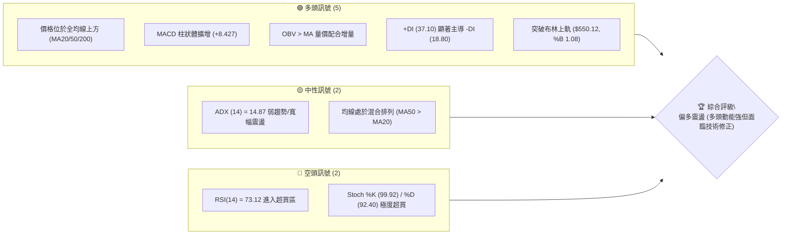
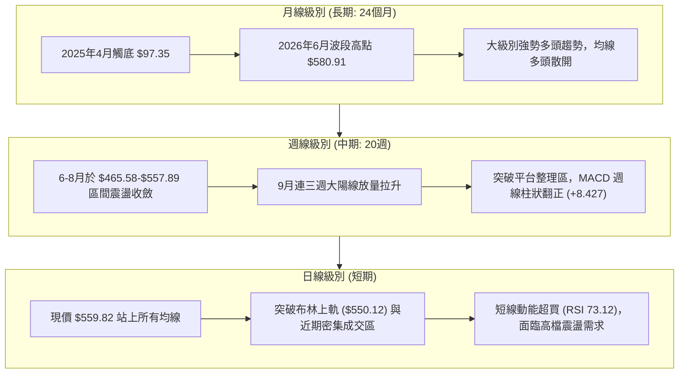
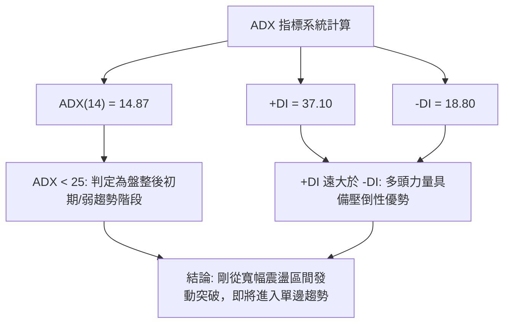
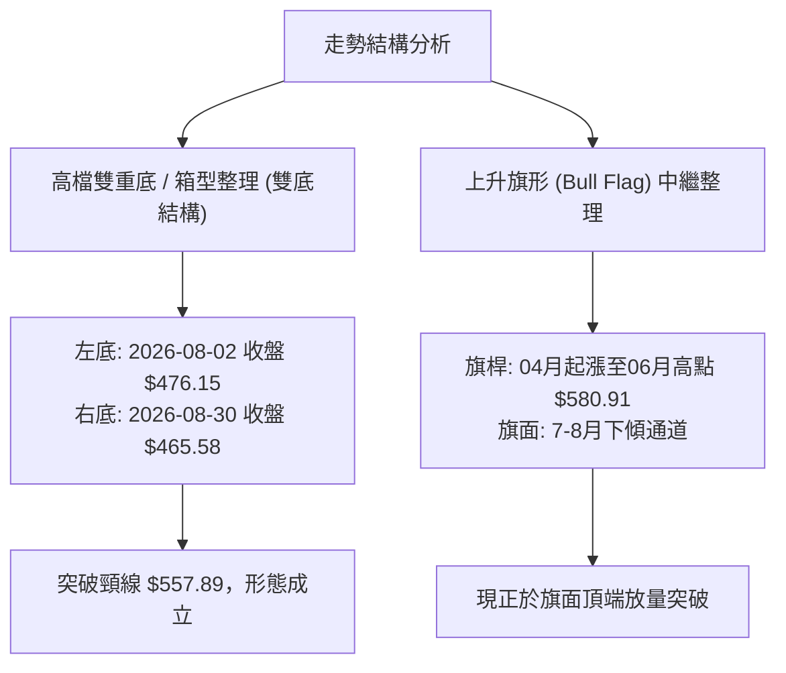
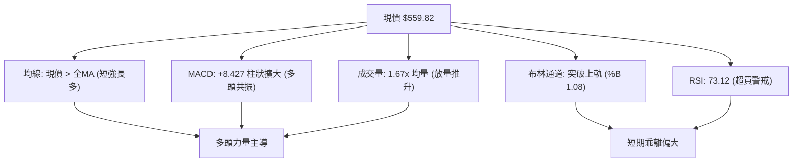
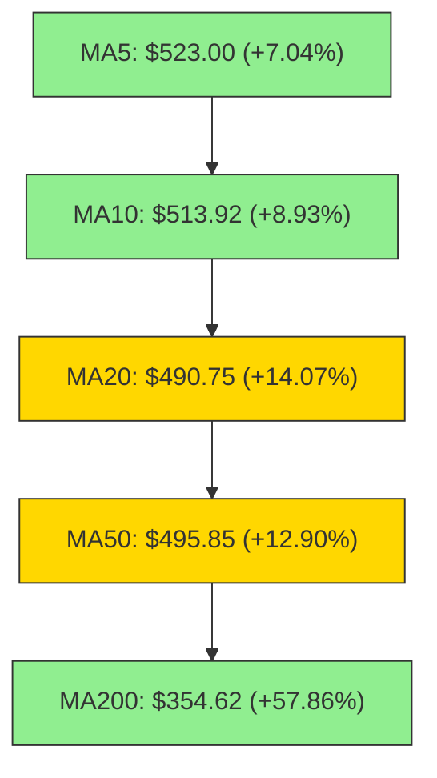
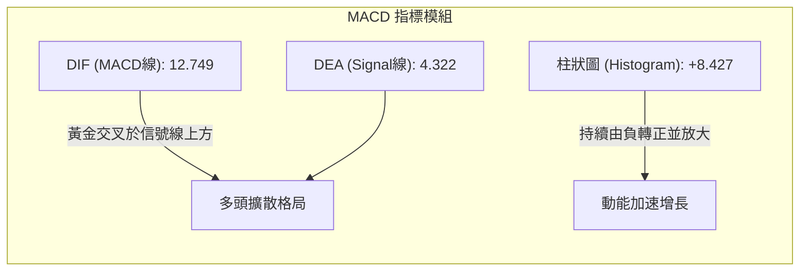
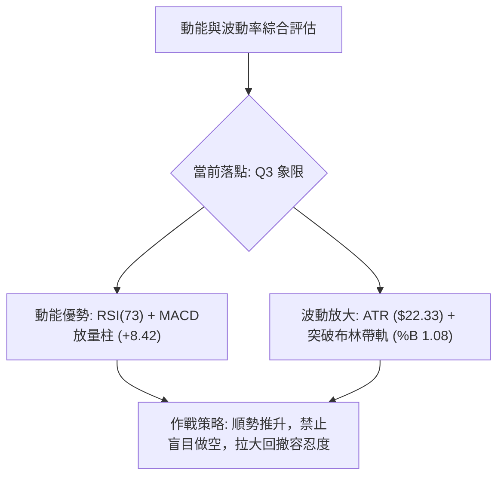
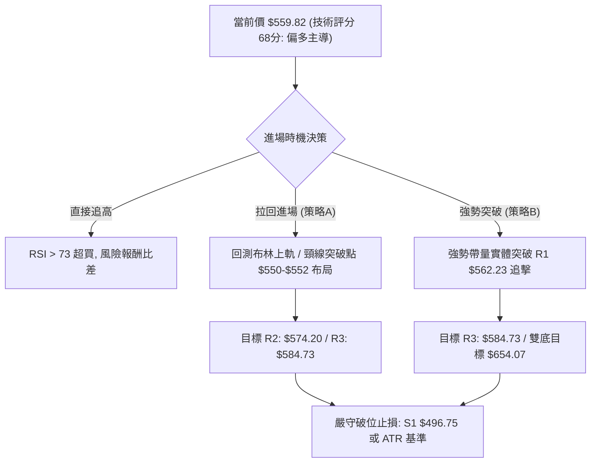
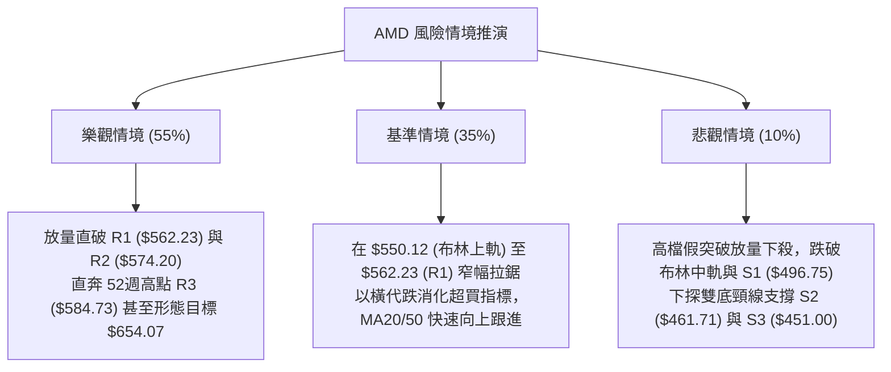

# AMD 技術分析報告

> **報告日期**：2026-09-20 ｜ **語言**：繁體中文 ｜ **數據來源**：Yahoo Finance ｜ **當前價格**：$559.82

---

## 目錄

| 章節 | 內容 |
|------|------|
| [1. 技術面概覽](#1-技術面概覽) | 訊號儀表板、核心指標、評分卡 |
| [2. 趨勢分析](#2-趨勢分析) | 多時框趨勢、長中短期走勢 |
| [3. 圖表形態分析](#3-圖表形態分析) | 形態識別、K線組合、目標價 |
| [4. 支撐與阻力](#4-支撐與阻力) | 關鍵價位、斐波那契回調 |
| [5. 技術指標深度解讀](#5-技術指標深度解讀) | MA/RSI/MACD/布林/成交量 |
| [6. 動能與波動率](#6-動能與波動率) | 動能評估、ATR、Beta |
| [7. 多時框架總結](#7-多時框架總結) | 時框架評分矩陣 |
| [8. 交易策略建議](#8-交易策略建議) | 多空策略、風險報酬比 |
| [9. 風險提示與監控](#9-風險提示與監控) | 監控指標、風險場景 |
| [📋 報告總結](#-報告總結) | 結論與行動指引摘要 |

---

## 1. 技術面概覽

### 🎯 技術訊號儀表板



### 📊 核心指標速覽表

| 指標類別 | 指標名稱 | 當前數值 | 訊號 | 解讀 |
|----------|----------|----------|------|------|
| **價格** | 當前價格 | $559.82 | 🟢 | 位於52週區間 94.3%，逼近歷史歷史高點區間 |
| **均線** | MA20 | $490.75 | 🟢 | 現價高於 MA20 達 +14.07%，短期多頭推升強勁 |
| **均線** | MA50 | $495.85 | 🟢 | 現價高於 MA50 達 +12.90%，中期趨勢轉強 |
| **均線** | MA200 | $354.62 | 🟢 | 現價高於 MA200 達 +57.86%，長期牛市基底穩固 |
| **動能** | RSI(14) | 73.12 | 🔴 | 指標大於70，進入超買警戒區，防範短線獲利回吐 |
| **動能** | MACD | 12.749 (Hist +8.427) | 🟢 | 快慢線黃金交叉後擴散，多頭動能強烈爆發 |
| **動能** | Stoch %K / %D | 99.92 / 92.40 | 🔴 | 隨機指標鈍化極度超買，追高風險增加 |
| **趨勢** | ADX(14) | 14.87 | 🟡 | ADX < 25 表明過去數月為寬幅洗盤，趨勢剛自底部萌芽 |
| **通道** | 布林通道 %B | 1.08 | 🟢 | 突破布林上軌（$550.12），呈現短線強勢單邊推升 |
| **波動** | ATR(14) | $22.33 | 🟡 | 佔現價 3.99%，每日波動幅度擴大，需注意風控距離 |
| **量能** | 成交量比 | 1.67x (31.78M vs 19.05M) | 🟢 | 顯著放量上攻，買盤量能確認價格突破 |

### 🏆 技術評分卡

```
╔══════════════════════════════════════════════════════════════════╗
║                   技術評分卡 — AMD (2026-09-20)                  ║
╠══════════════════════════════════════════════════════════════════╣
║ 趨勢強度 (Trend)      ████████████░░░░░░░░  62/100  🟢 偏多主導  ║
║ 動能指標 (Momentum)   ██████████████░░░░░░  72/100  🟢 動能強勁  ║
║ 支撐穩定度 (Support)  ██████████████░░░░░░  70/100  🟢 底部扎實  ║
║ 成交量配合 (Volume)   ████████████████░░░░  80/100  🟢 量價齊揚  ║
║ 形態完整度 (Pattern)  ████████████░░░░░░░░  60/100  🟡 區間突破  ║
║ 均線排列 (Moving Avg) ████████████░░░░░░░░  64/100  🟡 混合初聚  ║
╠══════════════════════════════════════════════════════════════════╣
║ 綜合評分              █████████████░░░░░░░  68/100  🟢 偏多主導  ║
╚══════════════════════════════════════════════════════════════════╝
```

---

## 2. 趨勢分析

### 🌐 多時框趨勢分析



### 📈 長期趨勢 — 12個月走勢圖（Unicode）

```
AMD 月線收盤走勢圖（過去12個月：2025-10 至 2026-09）
價格軸 ($)
$600 ┤                                      ● $580.91 (2026-06 高點)
$550 ┤                                              ● $559.82 (現價 2026-09)
$500 ┤                              ● $516.10   ● $476.15  ● $470.72
$450 ┤
$400 ┤
$350 ┤                      ● $354.49
$300 ┤
$250 ┤  ● $256.12
$200 ┤          ● $217.53   ● $214.16   ● $236.73   ● $200.21   ● $203.43
     └─────────────────────────────────────────────────────────────────────────────
        10/25   11/25   12/25   01/26   02/26   03/26   04/26   05/26   06/26   07/26   08/26   09/26
```

#### 走勢特徵分析表格

| 階段區間 | 月份週期 | 價格區間 ($) | 漲跌幅 | 走勢特徵與技術意義 |
|----------|----------|--------------|--------|--------------------|
| **第一階段：高檔震盪** | 2025-10 ~ 2026-03 | $256.12 → $203.43 | -20.57% | 於 $200-$250 構築箱型打底蓄勢，多次測底 $200.21 不破 |
| **第二階段：主升暴漲** | 2026-03 ~ 2026-06 | $203.43 → $580.91 | +185.56% | 突破箱型後單邊噴出，創下 52 週新高 $584.73 |
| **第三階段：高位修正** | 2026-06 ~ 2026-08 | $580.91 → $470.72 | -18.97% | 健康洗盤，回踩斐波那契 23.6% ($482.10) 及波段低點支撐 |
| **第四階段：次升啟動** | 2026-08 ~ 2026-09 | $470.72 → $559.82 | +18.93% | 連續放量陽線反撲，收復短期均線，挑戰歷史高點壓制區 |

### 📊 中期趨勢（週線分析）

從近20週數據觀察，AMD 於 2026年6月見頂後，於 2026-08-30 見週線收盤低點 $465.58（對應波段低點聚類 S2: $461.71 與 S3: $451.00），隨後量能逐週放大，自 75.16M 增長至 124.51M，推動週線收盤自 $465.58 躍升至 $559.82。

```
中期壓力與支撐示意圖：
$584.73 ──────────────────────── 52週歷史高點 (R3) ── 極強阻力
$574.20 ──────────────────────── 區間波段高點 (R2) ── 次級阻力
$562.23 ──────────────────────── 密集成交阻力 (R1) ── 當前考驗中
$559.82 ◄─────────────────────── 現價 ($559.82)
$496.75 ──────────────────────── 頸線/支撐區 (S1) ── 強支撐 (MA50/MA20交匯)
$461.71 ──────────────────────── 波段低點聚類 (S2) ── 極強防守點
```

### ⚡ 趨勢強度評估（ADX 解讀）



| 指標變數 | 當前數值 | 門檻區間 | 技術解讀 |
|----------|----------|----------|----------|
| **ADX(14)** | 14.87 | < 25 (弱趨勢/震盪) | 過去2個月處於 $460-$560 的箱型拉鋸，趨勢指標滯後反映，尚未進入純單邊大牛市 |
| **+DI** | 37.10 | > 25 (強勢多頭) | 多方買盤意願積極，控制當前盤面主控權 |
| **-DI** | 18.80 | < 20 (空頭疲弱) | 空方拋壓持續萎縮，無力發動有效反撲 |
| **方向對比** | +DI > -DI (差值 18.30) | 正向擴大 | 典型的底部反轉向上發散結構，多方佔據絕對優勢 |

---

## 3. 圖表形態分析

### 🔍 形態識別系統



#### 形態識別與信心度評估

| 形態名稱 | 信心度 | 判斷依據（引用數據） | 完成度 | 目標價（附計算式） |
|----------|--------|----------------------|--------|--------------------|
| **高位箱型/雙重底 (W底)** | 75% | 兩次下探波段低點（08-02收盤 $476.15、08-30收盤 $465.58，靠近 S2: $461.71），隨後突破 07-12 頸線收盤高點 $557.89。 | 90% (已突破頸線) | 頸線 $557.89 + 形態高度 ($557.89 - $461.71 = $96.18) = **$654.07**（此為形態理論值，短線依數據關鍵位以 R3 $584.73 為第一目標） |
| **布林通道帶軌突破** | 85% | 現價 $559.82 突破布林上軌 $550.12，且 %B 達 1.08，伴隨日成交量 31.78M 大於20日均量 19.05M。 | 100% | 依布林帶動態擴張，短期上探阻力位 **R2: $574.20** 與 **R3: $584.73** |
| **複雜頭肩形態** | 25% | 數據中未偵測到標準頭肩底/頂對稱架構，市場結構為多頭強勢整理，不強行擬合。 | N/A | 訊號不足，僅做均線與指標突破解讀。 |

### 🕯️ 重要K線形態分析

| 週/月份週期 | 收盤價 | K線形態 | 解讀 | 訊號 |
|-------------|--------|---------|------|------|
| **2026-08-30 (週)** | $465.58 | 探底長下影小陰線 | 縮量測試波段支撐 S2 ($461.71)，賣壓竭盡，確認雙底右腳 | 🟢 觸底回升 |
| **2026-09-06 (週)** | $477.57 | 低檔小陽星線 | 成交量壓縮至波段最低點 75.16M，變盤訊號確立 | 🟢 止跌企穩 |
| **2026-09-13 (週)** | $516.13 | 實體大陽線 (帶量) | 一舉吞噬前兩週整理區間，突破 MA20 ($490.75) 與 MA50 ($495.85) | 🟢 強勢買進 |
| **2026-09-20 (週)** | $559.82 | 光頭逼近長陽線 | 放量 124.51M 推升，收盤站上頸線與布林上軌，多方完全主導 | 🟢 極強推升 |

### 📉 ASCII 走勢形態示意圖

```
AMD 週線雙底突破形態示意圖
價格 ($)
$584.73 ┤                      [歷史天花板 R3: 584.73]
$562.23 ┼──────────────────────────────▲─────── 阻力 R1 (當前考驗)
$557.89 ┤          ● (頸線高點 07-12)    /
$550.00 ┤         / \                   / ◄── 現價 $559.82 放量破頸線
$500.00 ┤        /   \     ● (反彈)    /
$476.15 ┤  ●────/     \   / \         / 
$461.71 ┼───\──────────\─/───\───────/───────── 支撐 S2 (雙底水平線)
             左底 (08-02)     右底 (08-30)
             $476.15          $465.58 (最低逼近 S2: 461.71)
```

### 🎯 形態目標價計算

1. **雙底形態高度計算**：
   - 頸線水平（以 2026-07-12 週收盤點計）：$557.89
   - 雙底低點（波段低點聚類 S2）：$461.71
   - 垂直形態高度 $H$ = $557.89 - $461.71 = $96.18
2. **形態理論推算目標價**：
   - 理論延伸目標 = 頸線 $557.89 + $96.18 = **$654.07**
3. **實際交易層級階梯（紀律約束：以提供的阻力位為準）**：
   - 第一波段目標價（R2）：**$574.20**
   - 第二波段目標價（R3 / 52週高點）：**$584.73**
   - 形態等幅拓展目標（突破 R3 後）：**$654.07**（由雙底高度推算）

---

## 4. 支撐與阻力

### 🗺️ 關鍵價位分布圖（Unicode）

```
AMD 價位結構分布圖
═════════════════════════════════════════════════════════════════
$584.73 ║████████████████████████████████║ 強阻力 R3 (52W High)
$574.20 ║████████████████████            ║ 阻力 R2 (波段高點聚類)
$562.23 ║████████████████████████        ║ 關鍵阻力 R1 (次高點警戒)
$559.82 ╠════════════════════════════════╣ ◄ 現價 ($559.82)
$496.75 ║▓▓▓▓▓▓▓▓▓▓▓▓▓▓▓▓▓▓▓▓▓▓▓▓        ║ 關鍵支撐 S1 (MA50/頸線重疊)
$482.10 ║▓▓▓▓▓▓▓▓▓▓▓▓▓▓▓▓▓▓                ║ 斐波那契 23.6% 回調位
$461.71 ║████████████████████████████████║ 強支撐 S2 (波段雙底聚類)
$451.00 ║████████████████████████████████║ 核心支撐 S3 (中期多空分水嶺)
═════════════════════════════════════════════════════════════════
```

### 🚧 阻力位分析表

| 阻力級別 | 價位 | 距現價幅寬 | 形成原因 | 突破難度 | 重要性 |
|----------|------|------------|----------|----------|--------|
| **R1** | $562.23 | +0.43% | 近一年波段高點聚類，前波週線密集套牢區頂端 | 中等 | 🟢 短線突破口 |
| **R2** | $574.20 | +2.57% | 波段高點次強阻力區，2026年6月見頂過程中的震盪平台 | 高 | 🟡 次級風控位 |
| **R3** | $584.73 | +4.45% | 52週歷史最高點（52W High），空頭最後核心防線 | 極高 | 🔴 歷史大頂部 |

### 🛡️ 支撐位分析表

| 支撐級別 | 價位 | 距現價幅寬 | 形成原因 | 守住機率 | 重要性 |
|----------|------|------------|----------|----------|--------|
| **S1** | $496.75 | -11.27% | 波段低點聚類，恰好與 MA50 ($495.85) 及 MA20 ($490.75) 重疊 | 80% | 🟢 第一波段防線 |
| **S2** | $461.71 | -17.53% | 8月雙底測試低位（08-30收盤 $465.58 聚類區），中期平台底部 | 90% | 🟡 結構防守位 |
| **S3** | $451.00 | -19.44% | 波段極限低點聚類，逼近 MA120 ($448.35)，多頭牛市生命線 | 95% | 🔴 趨勢分界線 |

### 📐 斐波那契回調位分析

依據 52週極值區間（低點 $149.85 → 高點 $584.73，落差 $434.88）計算各回調位如下：

```
0.0%  (52W High)   $584.73 ──┐
                             ├─ 現價 $559.82 位於 0.0% ~ 23.6% 超強勢區間
23.6%              $482.10 ──┘
38.2%              $418.61
50.0%              $367.29
61.8%              $315.97
78.6%              $242.91
100.0% (52W Low)   $149.85
```

- **當前位置解讀**：現價 $559.82 處於 **0.0% ($584.73)** 與 **23.6% ($482.10)** 之間的「極強勢整理區間」（回撤甚至未觸及 23.6% 即止跌）。
- **技術意義**：在 7-8 月的回調中，週線最低收盤 $465.58 短暫下刺 23.6% ($482.10) 後即迅速被多頭收復，顯示市場承接力極強，淺幅回調即重拾升勢，屬於極典型的強勢牛市回踩再通膨形態。

---

## 5. 技術指標深度解讀

### 🎛️ 指標訊號總覽



### 📈 移動平均線排列分析



- **排列格局評估**：當前呈現「混合排列」（短均線 MA5 > MA10 快速發散向上，但中均線 MA50: $495.85 略高於 MA20: $490.75）。這是因為先前 7-8 月震盪洗盤導致短期 MA20 下穿，但目前 MA5 與 MA10 已經強烈拐頭向上，MA20 正在急速靠攏並即將金叉 MA50，形成標準多頭排列。
- **長線多頭基底**：MA200 位於 $354.62，MA240 位於 $334.60，現價大幅領先長期成本線 +57% 以上，年線走勢平滑且向上傾斜角度陡峭，長線大趨勢毫無敗象。

### 📉 RSI(14) 分析

```
RSI(14) 數值展示：
0                        50             70  73.12       100
├────────────────────────┼──────────────┼───▲───────────┤
[        弱勢區間        │   健康多頭   │   超買警戒    ]
進度條：███████████████████████████████████░░░░░░░░░░░░ 73.12%
```

- **背離檢查**：
  - **價格走勢**：現價 $559.82 逼近前高 $580.91。
  - **RSI 軌跡**：當前 RSI 為 73.12，與 2026-05-10 高點時的 RSI (80.7) 相比，雖然點位略低，但因前次回調後 RSI 曾重置至 40.1（2026-09-06），本次屬於低位強勁翻升，**目前無頂背離訊號**。
- **結論**：指標進入超買區（>70），代表短期買盤推進過猛，技術上隨時可能引發向 MA5 ($523.00) 或布林上軌 ($550.12) 的回踩回測，但不宜單憑超買盲目猜頂做空。

### 📊 MACD(12/26/9) 訊號解讀



- **週線 MACD 轉折驗證**：從近20週數據檢視，MACD 柱狀體在 2026-08-02 達到谷底 -9.004，隨後收斂，於 2026-09-06 正式翻正（+0.139），隨後兩週猛烈擴張至 +6.512 與 +8.427。
- **柱狀體連續加速**：顯示多方動能不僅未出現衰竭，反而呈現「三浪爆發」的加速態勢，具備極強的追價慣性。

### 📦 布林通道分析

```
AMD 布林通道結構 (帶寬 $118.73)
價格 ($)
$559.82 ┼────────────────────────────── 現價 ($559.82，突破上軌 %B=1.08)
$550.12 ┼────────────────────────────── BB 上軌 (動態壓制/轉為第一支撐)
        │
$490.75 ┼────────────────────────────── BB 中軌 (MA20)
        │
$431.39 ┼────────────────────────────── BB 下軌
```

- **通道開口狀態**：上軌 $550.12 與下軌 $431.39 開始由前期的水平收斂轉向「向上喇叭口」張開，表明市場波動率正在放大。
- **%B 指標判讀**：%B 高達 1.08，收盤價實體越過上軌，技術上定義為「布林通道帶軌推升（Walking the Bands）」，為極端強勢多頭特徵，後續若跌回 $550.12 之內則將轉為高位整固。

### 💹 成交量分析（量價配合度）

```
量能放大對比：
最新成交量  (31.78M)  ████████████████████████████████ 1.67x
20日均量    (19.05M)  ███████████████████
50日均量    (23.62M)  ███████████████████████
```

- **量價配合判定**：
  - 週成交量自 8月30日當週的 81.76M、9月6日的 75.16M，顯著放大至本週的 124.51M，增幅達 65.6%。
  - 日成交量 31.78M 達到 20日均量的 1.67 倍，價漲量增，符合標準量價確認原則。
- **OBV（能量潮）狀態**：官方數據標註「OBV > MA → 量能支撐上漲」，能量潮指標率先創出新高，證明大戶與主力資金籌碼處於持續流入狀態，非散戶被動推升。

---

## 6. 動能與波動率

### ⚡ 動能評估四象限

| 象限 | 動能維度 (MACD / RSI) | 波動維度 (ATR / BB) | 當前判定 | 技術評估與操作導引 |
|------|----------------------|----------------------|----------|--------------------|
| **Q1：強動能＋低波動** | 強 | 低 | ── | 最佳平穩買點（通常為突破初期的壓縮發散） |
| **Q2：弱動能＋低波動** | 弱 | 低 | ── | 盤整觀望期（如 7-8 月箱型整理底端） |
| **Q3：強動能＋高波動** | **強** (Hist +8.42, RSI 73) | **高** (ATR 3.99%, BB張開) | **✓ 現狀** | **高爆發與擴張期：順勢做多，但需拉寬止損並嚴格控管倉位** |
| **Q4：弱動能＋高波動** | 弱 | 高 | ── | 恐慌崩跌期（應堅決空倉或防禦） |



### 📊 ATR 波動率分析

- **ATR(14) 絕對值**：**$22.33**，約佔股價之 **3.99%**。
- **波動特性**：該數值代表 AMD 目前平均單日正常震盪範圍高達 22 美元。因此在設定日內或隔夜止損時，不可低於 1.5 倍 ATR（約 $33.50），否則極易被日常洗盤噪音震盪出局。
- **動態保護帶**：以當前價格 $559.82 推算，2.0 倍 ATR 止損距離為 $44.66，安全緩衝點約在 **$515.16**（緊貼 MA5 $523.00 與近期跳空缺口之上）。

### 📐 Beta 與市場相關性

- **Beta 係數**：**2.476**。
- **市場特徵**：Beta 高達 2.48，顯示 AMD 具備極強的高彈性與高貝塔屬性。當大盤（S&P 500 / 費城半導體指數）上漲 1% 時，AMD 平均波動幅度達 2.48%。在市場風險偏好（Risk-on）環境下，該股為半導體族群最佳進攻箭頭；但若大盤重挫，亦會承擔加倍的回撤壓力。

---

## 7. 多時框架總結

### 📋 時框架評分表

| 時框架 | 趨勢方向 | 動能表現 | 均線排列 | 圖表形態 | 綜合評分 | 戰略建議 |
|--------|----------|----------|----------|----------|----------|----------|
| **月線級別 (長期)** | 🟢 強勢多頭 | 🟢 柱狀健康 | 🟢 多頭向上 | 大級別主升浪擴張 | **85/100** | 戰略持股，忽視短期雜訊 |
| **週線級別 (中期)** | 🟢 強力反彈 | 🟢 MACD翻正 | 🟡 混合匯聚 | 雙底完成突破頸線 | **75/100** | 波段順勢加碼，瞄準前高 |
| **日線級別 (短期)** | 🟢 極強推升 | 🔴 超買警戒 | 🟢 站上全均線 | 布林上軌破位走平 | **65/100** | 追高性價比低，等待回踩 |

### 🔲 綜合訊號矩陣

| 維度 | 短期 (日線) | 中期 (週線) | 長期 (月線) | 衝突狀態與收斂對策 |
|------|-------------|-------------|-------------|--------------------|
| **趨勢方向** | 多頭上攻 | 突破整理 | 牛市多頭 | 全週期方向一致（無衝突） |
| **動能位階** | 超買 (RSI 73.12) | 剛脫離中性區加速 | 偏高擴張中 | 短期動能透支，需中長期承接 |
| **成交量能** | 放量 (1.67x) | 連續三週遞增 | 歷史高量級別 | 量價配合良好 |
| **均線支撐** | 偏離短期均線 | 站上 MA50/MA20 | 遠高於 MA200 | 等待回測均線支撐 |

### ⚖️ 多時框收斂結論

1. **行情定性與優先級收斂（依嚴格要求 14 規則）**：
   - 目前日線 **ADX(14) = 14.87 (< 25)**，技術上嚴格歸類為「盤整突破初期 / 趨勢剛醞釀」狀態。
   - 依多時框收斂規則：當 ADX < 25 且短線爆發時，日線級別面臨布林通道上軌邊界（$550.12）的拉回效應；但中長期方向（月線牛市 + 週線雙底成形突破頸線）處於壓倒性主導地位。
2. **唯一方向性結論**：
   - **偏多操作（Bullish Bias）**。禁止任何逆勢摸頂放空操作。日線級別的超買（RSI 73.12、Stoch 99.92）僅用來**約束進場時機**（不追高，等待分時級別拉回或回測支撐），不得作為轉空依據。

---

## 8. 交易策略建議

### 🗺️ 策略決策流程圖



### 🧭 策略路由（依評分卡分流）

> **當前主策略方向 = 主推多頭策略（依綜合評分 68/100，偏多主導）**
> 
> 因評分 ≥ 60，本報告全面主推順勢多頭策略，空頭操作僅列為極端反轉風險與對沖提示。

### 🎯 價格情境階梯（Price Scenarios）

價位完全採用「關鍵價位」精準數值：

| 觸發條件 | 下一目標 | 後續延伸 | 情境含義 |
|----------|----------|----------|----------|
| **突破 R1 $562.23** | **R2 $574.20** | **R3 $584.73** | 短線多頭完全釋放，挑戰52週歷史高點 |
| **站穩現價區間 ($550-$560)** | **R1 $562.23** | 消化超買 | 於布林上軌附近以橫代跌，強勢蓄勢 |
| **跌破 S1 $496.75** | **S2 $461.71** | **S3 $451.00** | 雙底頸線假突破，中期轉為弱勢寬幅震盪 |

### 📊 情境機率分佈

| 情境劇本 | 機率 | 主要指標依據 |
|----------|------|--------------|
| **強勢突破 / 繼續上行** | **55%** | MACD 柱狀體快速放大 (+8.427)、OBV > MA 量能確認、+DI (37.10) 絕對壓制 |
| **高檔強勢震盪 / 消化超買** | **35%** | ADX (14.87) 顯示強趨勢未完全閉合、RSI (73.12) 與隨機指標高檔鈍化需時間整固 |
| **假突破回落 / 重測雙底** | **10%** | 均線仍處於 MA50/MA20 混合排列，若有外部系統性利空跌破 S1 ($496.75) 則轉弱 |

### 🟢 主策略詳情

本報告提供兩套多頭作戰計劃：**策略 A（穩健回踩進場）** 與 **策略 B（強勢追隨突破）**。

| 策略要素 | 策略 A（回踩支撐布局型 - 優先推薦） | 策略 B（動量突破追隨型） |
|----------|-----------------------------------|--------------------------|
| **進場邏輯** | 利用日內波動回踩布林上軌與轉換位布局 | 帶量突破前高波段聚類阻力 R1 順勢跟進 |
| **進場價格** | **$550.12**（精確對應布林上軌支撐） | **$562.50**（確認突破 R1: $562.23 之確認點） |
| **目標價 T1** | **$574.20**（阻力位 R2，漲幅 +4.38%） | **$584.73**（阻力位 R3 / 52W High，漲幅 +3.95%） |
| **目標價 T2** | **$584.73**（阻力位 R3 / 52W High，漲幅 +6.29%） | **$654.07**（雙底高度推算之理論目標，漲幅 +16.28%）|
| **止損價格** | **$527.79**（進場點扣除 1.0x ATR $22.33） | **$540.17**（進場點扣除 1.0x ATR $22.33） |
| **風險空間** | $22.33 (4.06%) | $22.33 (3.97%) |
| **報酬空間 (T1/T2)**| T1: +$24.08 / T2: +$34.61 | T1: +$22.23 / T2: +$91.57 |
| **風險報酬比** | **1 : 1.55** (至T2) | **1 : 4.10** (至T2) |
| **預估勝率** | **65%** | **55%** |
| **建議倉位** | **15% - 20%** 資金 | **10%** 資金（動態加碼） |

### 🔴 反向風險觸發點（對沖提示）

若行情未如預期發展，出現下列條件時，必須認定多頭架構被破壞，主策略即刻終止並進行防禦性減倉或對沖：
1. **觸發關鍵價**：收盤價以長黑K實體跌破 **S1: $496.75**（MA50 與前波整理平台交界）。
2. **指標破位確認**：MACD 週線柱狀圖由正轉負，且 RSI(14) 快速跌破 50 中軸。
3. **風控動作**：跌破 $496.75 立即全面砍除順勢多單，保守型交易者可反手買入 Put 或以 5%-10% 倉位進行反向對沖，下看支撐 **S2: $461.71**。

### ⭐ 整體訊號強度評星

```
╔══════════════════════════════════════════════════════════════════╗
║ 做多訊號強度：★★★★☆  (4.0/5星) — 量價與均線共振，突破形態扎實 ║
║ 做空訊號強度：★☆☆☆☆  (1.0/5星) — 逆大趨勢摸頂，僅具超買藉口 ║
║ 整體可信度：  ★★★★☆  (4.0/5星) — 價位由歷史聚類確認，邏輯閉環 ║
╚══════════════════════════════════════════════════════════════════╝
```

---

## 9. 風險提示與監控

### ✅ 關鍵監控指標 Checklist

```
╔══════════════════════════════════════════════════════════════════╗
║               每日盤後技術監控清單 (Daily Checklist)             ║
╠══════════════════════════════════════════════════════════════════╣
║ [ ] 價位是否收於布林上軌 ($550.12) 之上？（確認強勢推升是否延續）║
║ [ ] 是否有效向上貫穿 R1 ($562.23)？（確認多頭第二段攻勢啟動）   ║
║ [ ] 日成交量是否維持在 20日均量 (19.05M) 之上？（量能萎縮需警惕） ║
║ [ ] RSI(14) 是否在 75-80 出現頂背離死叉？（超買獲利了結訊號）   ║
║ [ ] 跌破短線停損警戒線 MA5 ($523.00)？（短線動能趨緩訊號）       ║
║ [ ] 大盤費城半導體指數 (SOX) 是否出現高檔跳水破位？             ║
╚══════════════════════════════════════════════════════════════════╝
```

### ⚠️ 風險場景分析



### 🛡️ 風險管理重要提醒

1. **高 Beta 波動懲罰**：AMD Beta 達 2.476，ATR 高達 $22.33。切忌滿倉操作，單筆交易總風險暴露度應控制在總資金的 1.5% - 2% 以內。
2. **超買鈍化與追高陷阱**：目前 RSI(73.12) 與隨機指標（%K 99.92）已處於極端值，盤中嚴禁在拉升超過 3% 以上時市價追價，必須耐心等待分時圖拉回測試關鍵價（如 $550.12）再行切入。
3. **事件驅動風險**：半導體類股易受全球宏觀利率預期、AI 伺服器資本支出調整及同業財報指引影響，需嚴格設定硬性停損（Stop-loss Order），杜絕凹單心態。

---

## 📋 報告總結

```
╔══════════════════════════════════════════════════════════════════════════════════╗
║                          AMD 技術分析報告總結                                    ║
╠══════════════════════════════════════════════════════════════════════════════════╣
║ 報告日期：2026-09-20                                                             ║
║ 當前價格：$559.82                                                                ║
║ 分析評級：🟢 偏多主導 (技術評分: 68/100)                                         ║
║                                                                                  ║
║ 關鍵結論：                                                                       ║
║ ├─ 長期趨勢：🟢 強烈牛市，現價遠高於 MA200 ($354.62)，年線斜率陡峭向上           ║
║ ├─ 中期趨勢：🟢 週線雙底形態確立，放量突破頸線平台，挑戰歷史前高阻力            ║
║ ├─ 短期趨勢：🟡 動能極強但指標嚴重超買 (RSI 73.12, %B 1.08)，面臨高檔拉鋸        ║
║ ├─ 關鍵支撐：S1: $496.75  ｜  S2: $461.71  ｜  S3: $451.00                      ║
║ ├─ 關鍵阻力：R1: $562.23  ｜  R2: $574.20  ｜  R3: $584.73                      ║
║ └─ 華爾街共識目標：$616.51 (最高標: $1250.00 / 最低標: $365.00)                  ║
║                                                                                  ║
║ 最優策略組合：                                                                   ║
║ 1. 🥇 最佳機會（策略 A）：掛單於布林上軌支撐 $550.12 布局，止損 $527.79，        ║
║                           第一目標 R2 $574.20，第二目標 R3 $584.73。             ║
║ 2. 🥈 次選機會（策略 B）：強勢放量突破 R1 $562.23 後追隨進場，止損 $540.17，     ║
║                           上看 52週高點 R3 $584.73 及形態延伸目標 $654.07。      ║
║ 3. 🥉 防守風控：跌破關鍵支撐 S1 $496.75 立即全面執行多頭停損對沖。              ║
╚══════════════════════════════════════════════════════════════════════════════════╝
```

---

> ⚠️ **免責聲明**：本報告為技術分析研究，所有數據及估算均基於歷史量價數據計算。本報告**僅供研究與學術參考**，**不構成任何形式的投資建議與邀約**。金融市場投資具備極高風險，投資人應獨立評估自身風險承受能力並自負盈虧。

---

*報告生成時間：2026-09-20 ｜ 數據來源：Yahoo Finance ｜ 分析框架：資深多時框量化技術分析*