# AMD 技術分析報告

> **報告日期**：2026-09-21 ｜ **語言**：繁體中文 ｜ **數據來源**：Yahoo Finance ｜ **當前價格**：$559.82

---

## 目錄

| 章節 | 內容 |
|------|------|
| [1. 技術面概覽](#1-技術面概覽) | 訊號儀表板、核心指標、評分卡 |
| [2. 趨勢分析](#2-趨勢分析) | 多時框趨勢、長中短期走勢 |
| [3. 圖表形態分析](#3-圖表形態分析) | 形態識別、K線組合、目標價 |
| [4. 支撐與阻力](#4-支撐與阻力) | 關鍵價位、斐波那契回調 |
| [5. 技術指標深度解讀](#5-技術指標深度解讀) | MA/RSI/MACD/布林/成交量 |
| [6. 動能與波動率](#6-動能與波動率) | 動能評估、ATR、Beta |
| [7. 多時框架總結](#7-多時框架總結) | 時框架評分矩陣 |
| [8. 交易策略建議](#8-交易策略建議) | 多空策略、風險報酬比 |
| [9. 風險提示與監控](#9-風險提示與監控) | 監控指標、風險場景 |

---

## 1. 技術面概覽

### 🎯 技術訊號儀表板

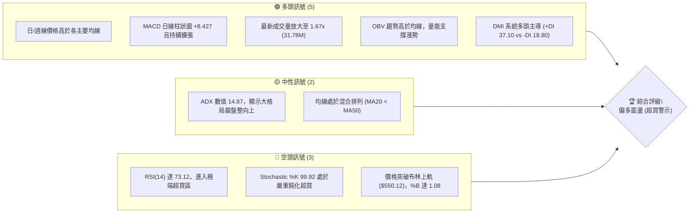

### 📊 核心指標速覽表

| 指標類別 | 指標名稱 | 當前數值 | 訊號 | 解讀 |
|----------|----------|----------|------|------|
| **價格** | 當前價格 | $559.82 | 🟢 | 位於52週區間 94.3% 高位，逼近歷史天花板 |
| **均線** | MA20 | $490.75 | 🟢 | 現價高於MA20達 +14.07%，短線均線強勁上揚 |
| **均線** | MA50 | $495.85 | 🟡 | 現價高於MA50 +12.90%，但MA20低於MA50呈現混合修復態勢 |
| **均線** | MA200 | $354.62 | 🟢 | 現價遠高於牛熊分水嶺 +57.86%，長多格局確立 |
| **動能** | RSI(14) | 73.12 | 🔴 | 日線進入超買區 (>70)，短線追價存在乖離修正風險 |
| **動能** | MACD (12,26,9) | 12.749 (柱: +8.427) | 🟢 | 快慢線黃金交叉向上發散，柱狀圖動能顯著擴張 |
| **動能** | Stochastic | %K 99.92 / %D 92.40 | 🔴 | 極度超買，隨時面臨技術性回洗與短線獲利了結 |
| **趨勢** | ADX / DMI | ADX: 14.87 / +DI: 37.10 | 🟡 | +DI 強勢主導，但 ADX < 25 反映大區間寬幅盤整向上本質 |
| **通道** | Bollinger Bands | 上軌 $550.12 (%B: 1.08) | 🔴 | 實體K棒已衝出布林上軌外，呈現外軌推升但隨時有均值回歸壓力 |
| **成交量** | Volume / 20MA | 31.78M vs 19.05M | 🟢 | 量比 1.67x 爆量突破，量價配合健康，買盤承接力道強勁 |
| **波動** | ATR(14) | $22.33 (3.99%) | 🟡 | 每日平均震幅逾 22 美元，日內波動劇烈，需設定寬幅風控 |

### 🏆 技術評分卡

```
╔══════════════════════════════════════════════════════════════╗
║                 技術評分卡 — AMD (2026-09-21)               ║
╠══════════════════════════════════════════════════════════════╣
║ 趨勢強度 (ADX/DMI)    ████████████░░░░░░░░  60/100  🟡 中性  ║
║ 動能指標 (MACD/RSI)   ██████████████░░░░░░  70/100  🟢 偏多  ║
║ 支撐穩定度 (波段低點) ████████████████░░░░  80/100  🟢 強勁  ║
║ 成交量配合 (OBV/量比) ████████████████░░░░  80/100  🟢 強勁  ║
║ 形態完整度 (區間構築) ██████████████░░░░░░  70/100  🟢 良好  ║
║ 均線排列 (混合交叉)   ████████████░░░░░░░░  60/100  🟡 中性  ║
╠══════════════════════════════════════════════════════════════╣
║ 綜合評分              ██████████████░░░░░░  70/100  🟢 偏多  ║
╚══════════════════════════════════════════════════════════════╝
```

---

## 2. 趨勢分析

### 🌐 多時框趨勢分析

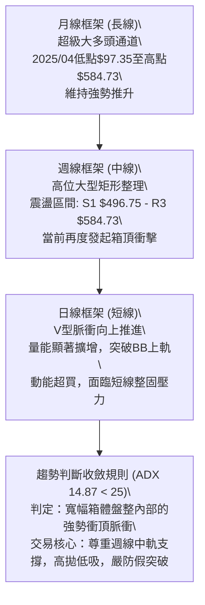

### 📈 長期趨勢 — 12個月走勢圖（Unicode）

```
AMD 月線走勢圖（過去12個月：2025-10 至 2026-09）
價格軸 ($)
$600 ┤                                        ●(06月:580.91)
$550 ┤                                  ●(05月)          ●←現價 559.82
$500 ┤                                            ●(07月)  ●(08月:470.72)
$450 ┤
$400 ┤
$350 ┤                             ●(04月:354.49)
$300 ┤
$250 ┤  ●(10月:256.12)
$200 ┤        ●     ●     ●     ●(02月:200.21)
$150 ┤
     └─────────────────────────────────────────────────────────────
       10    11    12    01    02    03    04    05    06    07    08    09 (月份)
```

#### 走勢特徵分析表格

| 階段區間 | 時間跨度 | 起訖價位 | 漲跌幅 | 核心形態與技術特徵解讀 |
|----------|----------|----------|--------|------------------------|
| **第一階段：高位平台整理** | 2025-10 ~ 2026-03 | $256.12 → $203.43 | -20.57% | 於 $200.21 ~ $256.12 構築長達半年的扎實洗盤籌碼平台，MA200逐步墊高。 |
| **第二階段：主升浪強勢噴出** | 2026-03 ~ 2026-06 | $203.43 → $580.91 | +185.56% | 晶片算力需求引爆單邊主升浪，K線連三月長紅，創下歷史高點 $584.73。 |
| **第三階段：高位雙底回洗** | 2026-06 ~ 2026-08 | $580.91 → $470.72 | -18.97% | 衝高後面臨獲利回吐，於 $465~$470 區間兩度探底獲得強勁支撐（雙重底打底）。 |
| **第四階段：次級波段復甦** | 2026-08 ~ 2026-09 | $470.72 → $559.82 | +18.93% | 自 $470 頸線強勢反彈，連續突破週線壓制，目前直撲歷史高位密集阻力區。 |

### 📊 中期趨勢（週線分析）

從近20週的收盤結構來看，AMD在2026年6月中旬觸頂後，展開了長達三個月的箱體整理：
- **震盪箱體下緣**：於2026-08-02收盤 $476.15、2026-08-23收盤 $473.25 以及 2026-08-30 收盤 $465.58 形成牢不可破的三重低點，完美對應歷史波段低點支撐聚類群 **S2 ($461.71)** 與 **S1 ($496.75)**。
- **週線動能反轉**：週線 MACD 柱狀圖在連續數週負值後，於2026-09-06當週翻正（+0.139），並於09-13放大至 +6.512，最新09-20當週擴增至 +8.427，伴隨週成交量放大至 124.51M，確認中期拉回洗盤已經結束，多頭重掌兵符。

### ⚡ 趨勢強度評估（ADX 解讀）

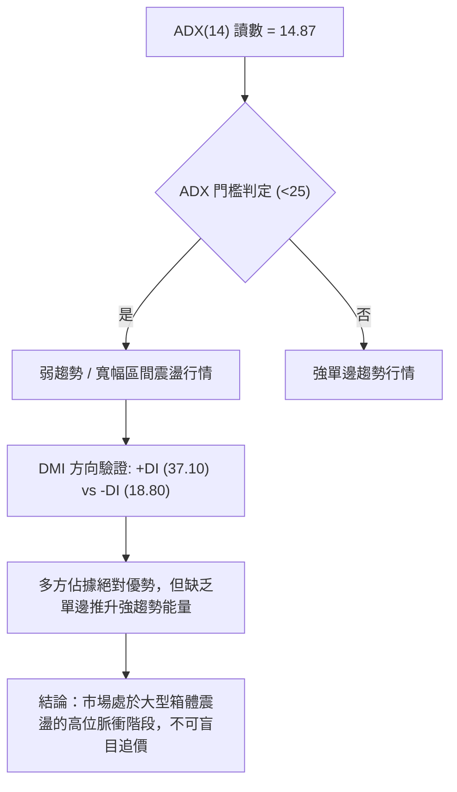

#### ADX 趨勢強度對照表

| ADX 數值區間 | 當前讀數 (14.87) | 市場特徵解讀 | 操作指導原則 |
|--------------|------------------|--------------|--------------|
| 00.00 – 19.99 | **✓ 當前所在區間** | 趨勢動能極弱或處於休整期，多空拉鋸或無方向震盪 | 依據收斂規則，以日線布林通道軌道及支撐阻力為操作界限 |
| 20.00 – 24.99 | - | 潛在趨勢正在醞釀，即將面臨突破 | 保持觀望，等待突破關鍵價位帶量確認 |
| 25.00 – 49.99 | - | 單邊趨勢明確成型（依據 +DI / -DI 定義方向） | 順應趨勢進行回調買進或反彈放空，不可逆勢摸頂抄底 |
| 50.00 – 100.0 | - | 極強極端單邊行情，趨勢面臨衰竭或加速噴出 | 分批減倉鎖定利潤，隨時防範趨勢力竭引發的劇烈反轉 |

---

## 3. 圖表形態分析

### 🔍 形態識別系統

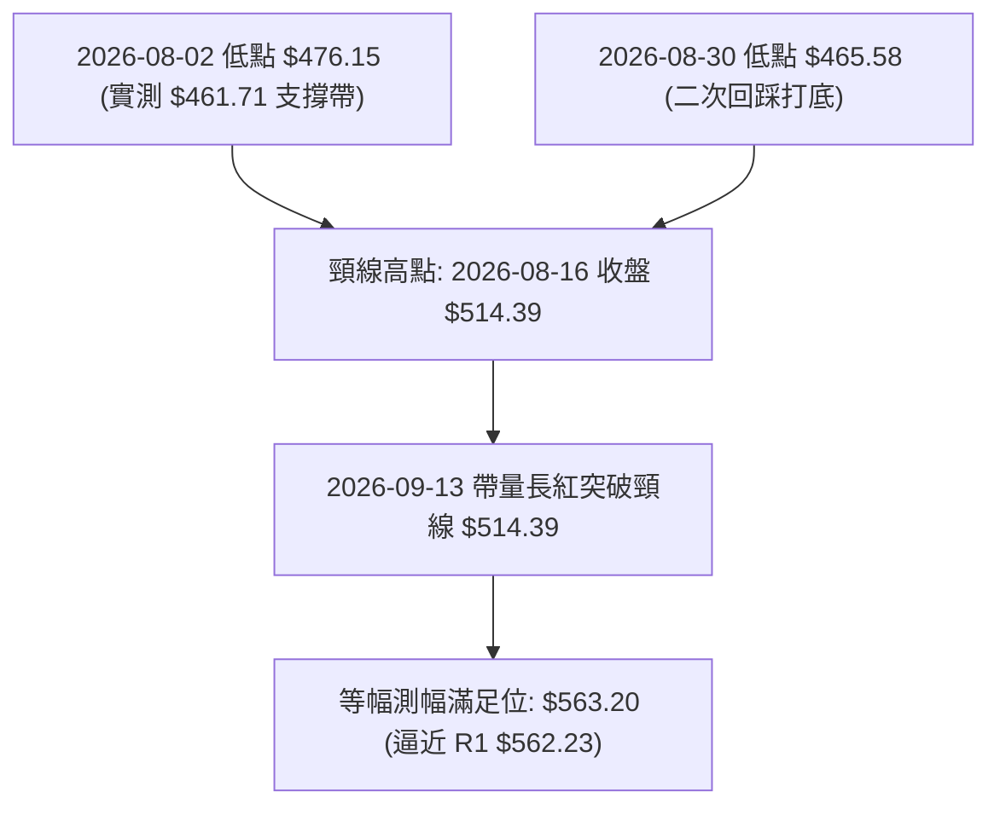

#### 形態識別與信心度評估表

| 形態類別 | 信心度 | 判斷依據（引用數據與價位） | 完成度 | 目標價（附嚴謹幾何計算式） |
|----------|--------|----------------------------|--------|----------------------------|
| **雙重底 (W底)** | 85% | 8月兩次低點 $476.15 與 $465.58 聚類於支撐帶 S2 ($461.71) 上方，09-13 帶量長紅收 $516.13 突破頸線 $514.39 | 100% | 頸線 $514.39 + 形態高度 ($514.39 - $465.58 = $48.81) = **$563.20**（已完全達成，精準對應阻力位 R1 $562.23） |
| **布林軌道強勢擴張** | 90% | 收盤價 $559.82 衝出 BB 上軌 $550.12，%B 達到 1.08，量能達 1.67 倍均量 | 100% | 指標型突破，無形態幾何高度，目標直接指向年內天花板 **R3 $584.73** |
| **大型箱體震盪** | 80% | 區間於波段低點聚類 S1 ($496.75) 與 52W 高點 R3 ($584.73) 之間震盪長達 4 個月 | 90% | 箱頂阻力區間 **$584.73**；若帶量實體突破，理論等幅延伸目標為 $584.73 + ($584.73 - $496.75) = **$672.71** |

### 🕯️ 重要K線形態分析

| 週/月區間 | 代表收盤價 | K線形態特徵 | 結構性技術解讀 | 訊號強度 |
|-----------|------------|-------------|----------------|----------|
| 2026-06 | $580.91 | 長上影高位十字星 | 主升浪頂部爆出歷史天量（單月高點 $584.73），賣壓出籠 | 🔴 強烈回調 |
| 2026-08-30 | $465.58 | 下影線錘頭線 (Hammer) | 探底 $465 帶獲得 S2 ($461.71) 買盤強烈防守，空頭動能耗盡 | 🟢 底部確認 |
| 2026-09-13 | $516.13 | 實體大陽線 (Marubozu) | 帶量長紅收復 MA20 與 MA50，MACD 柱翻正，確立箱底反轉向上 | 🟢 強勢起漲 |
| 2026-09-20 | $559.82 | 光腳大陽線推升 | 連續第二週以實體陽線直接衝擊 BB 上軌，短線逼近 R1 $562.23 | 🟡 進入超買 |

### 📉 ASCII 走勢形態示意圖

```
AMD 週線雙重底 (W-Bottom) 與箱體突破示意圖
價格 ($)
$584.73 ┼─────────────────────────────────────────────● 52週歷史天花板 (R3)
        │                                            ╱
$562.23 ┼───────────────────────────────● 現價 $559.82 (逼近 R1 / 形態滿足點)
        │                              ╱
$514.39 ┼───────────● (頸線突破點) ────╱
        │          ╱ ╲                ╱
        │         ╱   ╲              ╱
$476.15 ┼────────●     ╲            ● 2026-08-30 第二隻腳 ($465.58)
        │      (第一隻腳) ╲        ╱   (波段支撐帶 S2: $461.71 完美防守)
$450.00 ┴──────────────────●──────┴────────────────────────────
```

### 🎯 形態目標價計算

雙底形態幾何推導：
1. **第一底**：2026-08-02 週收盤 $476.15。
2. **第二底**：2026-08-30 週收盤 $465.58。
3. **有效低點基準**：採最低收盤價 $465.58。
4. **反彈頸線 (Neckline)**：2026-08-16 反彈最高週收盤價 **$514.39**。
5. **形態垂直高度 ($H$)**：$514.39 - $465.58 = **$48.81**。
6. **最小測幅滿足位**：頸線 $514.39 + $48.81 = **$563.20**。
   - **驗證**：現價 $559.82 距測幅目標 $563.20 僅差 $3.38 (+0.6%)，且精準貼合近一年波段高點聚類形成的阻力位 **R1 ($562.23)**。這意味著雙底測幅動能已達極限，後續進一步推升必須依賴大級別箱體向上突破。

---

## 4. 支撐與阻力

### 🗺️ 關鍵價位分布圖（Unicode）

```
AMD 價位結構分布圖（嚴格依據 OHLCV 聚類與斐波那契計算）
═════════════════════════════════════════════════════════════════
$584.73 ║████████████████████████║ 強阻力 R3 / 52週歷史高點 / Fib 0.0%
$574.20 ║████████████████████    ║ 阻力 R2 (波段次高點密集帶)
$562.23 ║████████████████████████║ 關鍵阻力 R1 / 雙底測幅位 ($563.20)
$559.82 ╠════════════════════════╣ ◄ 當前現價 ($559.82)
$496.75 ║▓▓▓▓▓▓▓▓▓▓▓▓▓▓▓▓        ║ 近期支撐 S1 (波段低點聚類 / 貼近MA50)
$482.10 ║▓▓▓▓▓▓▓▓▓▓▓▓▓▓          ║ 關鍵回調位 Fib 23.6%
$461.71 ║████████████████████████║ 強支撐 S2 (8月雙底紮實底部)
$451.00 ║████████████████████████║ 終極防守 S3 (跌破宣告中期轉空)
═════════════════════════════════════════════════════════════════
```

### 🚧 阻力位分析表

價位數據嚴格引用自「關鍵價位」區塊波段高點聚類：

| 阻力級別 | 精確價位 | 距離現價 (%) | 形成原因與籌碼特徵 | 突破難度 | 重要性等級 |
|----------|----------|--------------|--------------------|----------|------------|
| **R1** | $562.23 | +0.43% | 近一年波段高點次級聚類區；與 W 底測幅滿足點 ($563.20) 重疊，短線獲利盤兌現點 | 🟡 中等 | ★★★☆☆ |
| **R2** | $574.20 | +2.57% | 2026年6月歷史主升浪頂部次高點，歷史解套盤與空頭防守陣地 | 🔴 較高 | ★★★★☆ |
| **R3** | $584.73 | +4.45% | 52週最高價、歷史絕對頂峰、斐波那契 0.0% 極限位，強大心理阻力壁壘 | 🔴 極高 | ★★★★★ |

### 🛡️ 支撐位分析表

價位數據嚴格引用自「關鍵價位」區塊波段低點聚類：

| 支撐級別 | 精確價位 | 距離現價 (%) | 形成原因與籌碼特徵 | 守住機率 | 重要性等級 |
|----------|----------|--------------|--------------------|----------|------------|
| **S1** | $496.75 | -11.27% | 波段低點聚類核心，與日線 MA50 ($495.85) 及 MA20 ($490.75) 形成重疊共振帶 | 80% | ★★★★☆ |
| **S2** | $461.71 | -17.53% | 2026年8月雙重底打底低點密集區 ($465~$476) 底層支撐，多頭中期生命線 | 90% | ★★★★★ |
| **S3** | $451.00 | -19.44% | 2026年5月起漲平台聚類支撐，若失守將開啟向 Fib 38.2% ($418.61) 尋求支撐的大幅修正 | 95% | ★★★★★ |

### 📐 斐波那契回調位分析

依據 52 週低點 **$149.85** 至 52 週高點 **$584.73** 進行完整黃金分割計算：

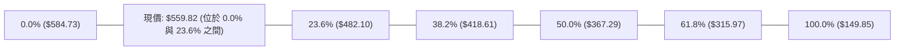

#### 斐波那契階梯解讀
1. **現價位置**：現價 **$559.82** 處於 **Fib 0.0% ($584.73)** 與 **Fib 23.6% ($482.10)** 之間的強勢超買拉升區。
2. **淺幅回調定律**：在多頭大牛市中，強勢資產回調通常僅在 Fib 23.6% 止步。今年8月回調最低觸及收盤 $465.58，剛好略微穿透 Fib 23.6% ($482.10) 後迅速被買盤拉起，顯示此區間具有強烈的機構護盤意願。
3. **回撤警戒線**：未來若因總體經濟利空跌破 S1 ($496.75) 與 Fib 23.6% ($482.10)，下一級支撐將直指 Fib 38.2% ($418.61)。

---

## 5. 技術指標深度解讀

### 🎛️ 指標訊號總覽

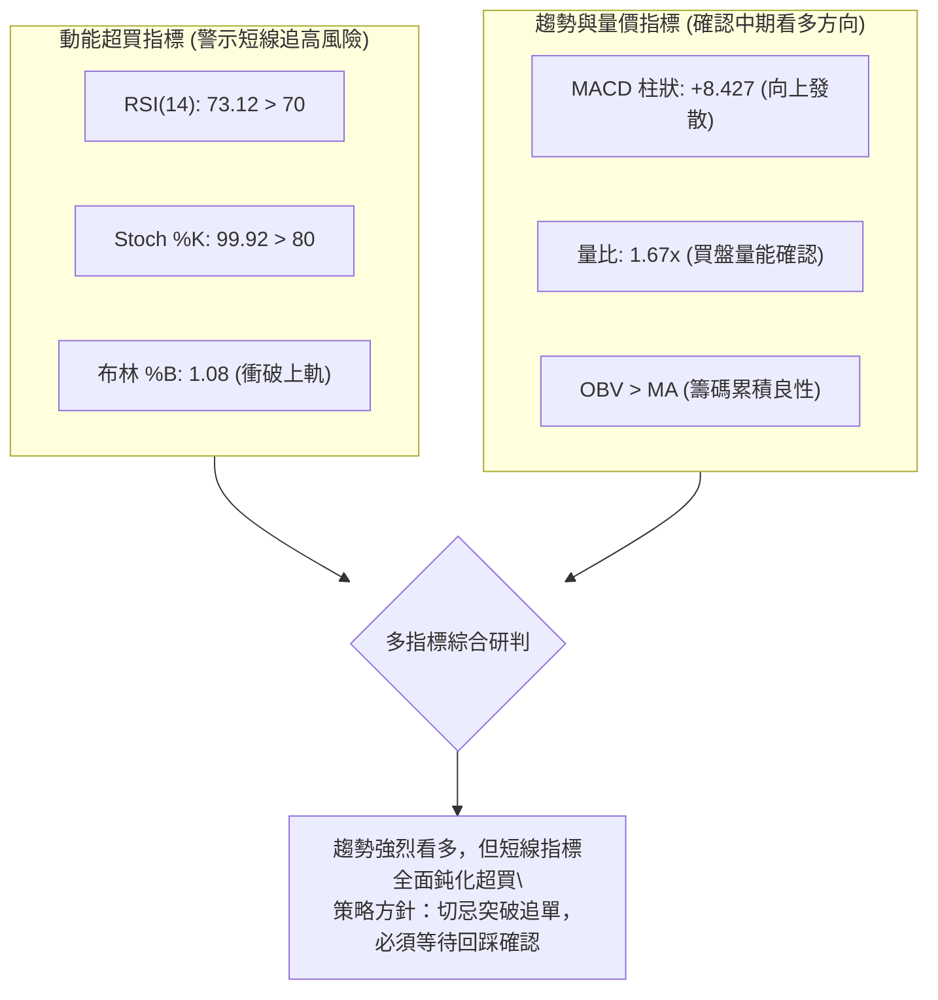

### 📈 移動平均線排列分析

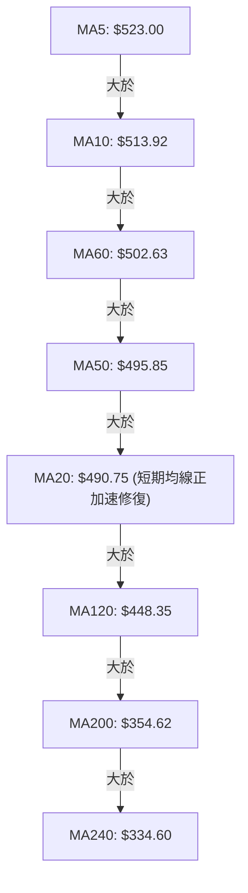

#### 均線結構專業診斷
- **短中期均線拐頭向上**：MA5 ($523.00) 與 MA10 ($513.92) 呈陡峭向上噴出態勢，帶動短期價格動能。
- **均線排列狀態評定為「混合排列」**：目前 MA20 ($490.75) 仍略低於 MA50 ($495.85)，這是因為7-8月深度回調導致中期均線下彎的落後效應。然而，隨著最新價格衝上 $559.82，MA20 正在以極快斜率反彈，預計未來 3-5 個交易日內將金叉 MA50，形成標準多頭排列。
- **牛熊分界線遙遙領先**：現價遠離 MA200 ($354.62) 達 +57.86%，確認宏觀大多頭架構絲毫未變。

### 📉 RSI(14) 分析

```
RSI(14) 強度儀表: 73.12 (超買警戒)
0        20        40        60   70   80       100
├────────┼────────┼────────┼────┼───┼────────┤
███████████████████████████████████░░░░░░░  [73.12]
                              ▲
                          超買警戒線 (70)
```

- **超買區間解讀**：RSI(14) 讀數來到 **73.12**，正式跨入 >70 的超買警戒區。歷史數據顯示，AMD在週線與日線 RSI 超越 75 時，常伴隨 3~5 天的劇烈震盪或技術性回調。
- **背離分析判斷**：
  - 前高（2026-05）價格在 $516~$580 區間時，RSI 曾高達 80.7。
  - 目前價格來到 $559.82，RSI 為 73.12，高點並未超越先前峰值，但由於現價亦尚未突破前高 $584.73，**日線與週線層面均「無明顯背離」現象**。動能與價格同向上行，屬於強勢多頭推升特徵，而非衰竭性背離。

### 📊 MACD(12/26/9) 訊號解讀

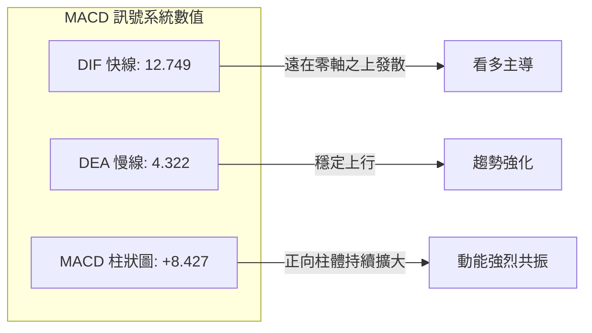

- **訊號解析**：MACD 快線 (12.749) 遠高於訊號線 (4.322)，柱狀圖（Histogram）達到 **+8.427**。近兩週週線柱狀圖由 -0.243 驟升至 +6.512，再攀升至 +8.427，呈現多頭攻擊性爆發結構，短期內無任何空頭死叉風險。

### 📦 布林通道分析

```
AMD 日線布林通道位置示意圖 (Bollinger Bands 20, 2)
─────────────────────────────────────────────────────────────
$550.12 ─┬─ 布林上軌 (Upper Band)  ─── 突破！
         │
         │   現價: $559.82  ▲ (BB %B = 1.08，處於外軌極端推升)
         │
$490.75 ─┼─ 布林中軌 (MA20 / Middle Band)
         │
         │
$431.39 ─┴─ 布林下軌 (Lower Band)
─────────────────────────────────────────────────────────────
通道帶寬 (Bandwidth) = ($550.12 - $431.39) / $490.75 = 24.19%
```

- **%B 指標異常**：%B 達 **1.08**（>1.0 代表穿透布林上軌）。根據布林帶均值回歸理論，實體K線運行於上軌外屬於不可持續的極端爆發狀態，通常在 1-3 個交易日內會受到軌道吸引力牽引，出現「回踩上軌或向中軌靠攏」的技術性整理。

### 💹 成交量分析（量價配合度）

```
成交量強度對比 (單位: 股)
今日量能: 31,785,700  ████████████████████████████████ (量比: 1.67x)
20日均量: 19,056,775  ███████████████████
50日均量: 23,625,214  ███████████████████████
```

- **量增價揚**：最新成交量突破 3,178 萬股，較 20 日均量放大 1.67 倍，有效消化了前期高位的浮額套牢盤。
- **OBV 趨勢配合**：OBV (能量潮) 持續維持在均線之上，並呈現陡峭抬升趨勢，確認資金持續淨流入，量價結構健康無背離。

---

## 6. 動能與波動率

### ⚡ 動能評估四象限

| 象限分類 | 動能強度 (RSI/MACD) | 波動率狀態 (ATR/Beta) | AMD 當前定位 | 策略應對指引 |
|----------|---------------------|----------------------|--------------|--------------|
| **象限 I** | 強動能 (Bullish) | 低波動 (Low Vol) | — | 穩健加碼，主升浪持有 |
| **象限 II** | 弱動能 (Bearish) | 低波動 (Low Vol) | — | 資金休眠，謹慎觀望 |
| **象限 III** | **強動能 (Bullish)** | **高波動 (High Vol)** | **✓ 當前定位 (Q3)** | **高收益但伴隨高回撤風險；嚴格控制倉位，採取寬止損與分批止盈** |
| **象限 IV** | 弱動能 (Bearish) | 高波動 (High Vol) | — | 恐慌崩跌，絕對避免進場 |

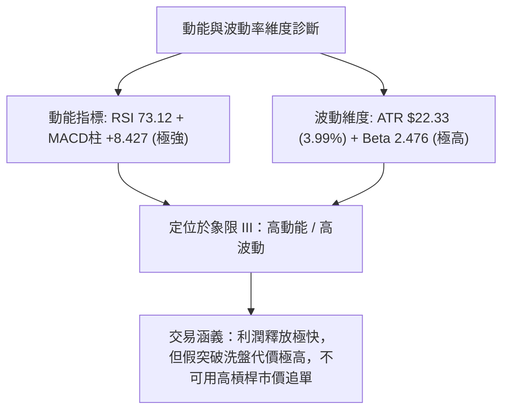

### 📊 ATR 波動率分析

- **ATR(14) 數值**：當前 ATR 為 **$22.33**，佔現價百分比達 **3.99%**。
- **止損距離建議**：
  - 日內激進止損：$1.0 \times \text{ATR} = \$22.33$（防守位 $537.49）。
  - 波段安全止損：$1.5 \times \text{ATR} = \$33.50$（防守位 $526.32）。
  - 中期結構防守：$2.0 \times \text{ATR} = \$44.66$（防守位 $515.16，貼近頸線突破位）。

### 📐 Beta 與市場相關性

- **Beta 係數**：**2.476**（高 Beta 成長型科技半導體龍頭）。
- **市場意涵**：AMD 的波動幅度為標普500指數（S&P 500）的 2.47 倍。當美股大盤處於多頭風險偏好上行期時，AMD 展現極強的進攻爆發力；然而一旦大盤面臨宏觀回調，AMD 的回撤幅度亦將劇烈放大。

---

## 7. 多時框架總結

### 📋 時框架評分表

| 時框架 | 趨勢方向 | 動能狀態 | 均線排列 | 圖表形態 | 綜合評分 | 戰術建議 |
|--------|----------|----------|----------|----------|----------|----------|
| **月線 (長期)** | 🟢 多頭推升 | 強烈偏多 | 完整多頭排列 | 歷史天花板突破測試 | 85/100 | 長期多單底倉抱牢 |
| **週線 (中期)** | 🟢 震盪走高 | MACD轉強 | 混合偏多排列 | 箱底雙底突破完成 | 75/100 | 箱體中上緣分批獲利 |
| **日線 (短期)** | 🟡 超買脈衝 | 極度超買 | 均線多頭修復中 | 突破布林上軌外延 | 60/100 | 嚴禁追高，靜待回踩 |

### 🔲 綜合訊號矩陣

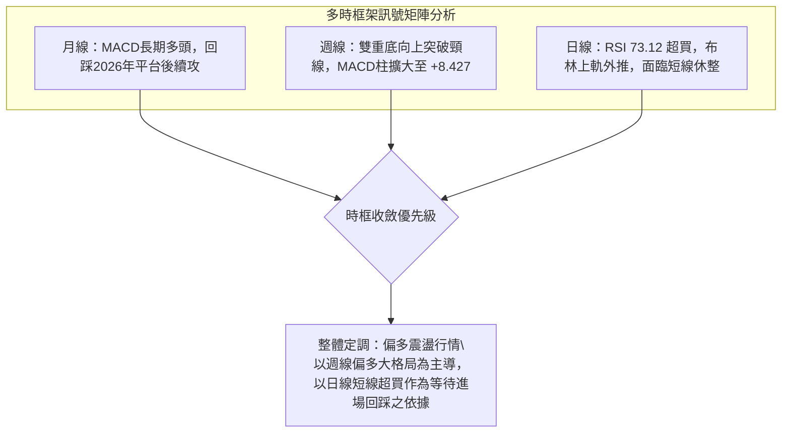

### ⚖️ 多時框收斂結論

依據多時框收斂規則（ADX = 14.87 < 25，歸類為**寬幅震盪行情**）：
- **優先級判定**：市場本質並非單邊持續逼空（ADX低於25），而是處於 $496.75 (S1) ~ $584.73 (R3) 的高位大箱體運作。
- **時框取捨**：週線雙重底推升動能強勁，但日線 RSI (73.12) 與布林通道 (%B 1.08) 已呈現嚴重短線超買與過度延伸。因此，日線不能作為追價買進依據，而應作為「警示短線不可追高、必須等待健康回撤」的時機指標。
- **唯一方向性結論**：**偏多震盪（整體方向偏多，但短線拒絕追買，主推回踩支撐後逢低進場）**。此結論與第1章技術評分卡（70分，偏多）完全一致。

---

## 8. 交易策略建議

### 🗺️ 策略決策流程圖

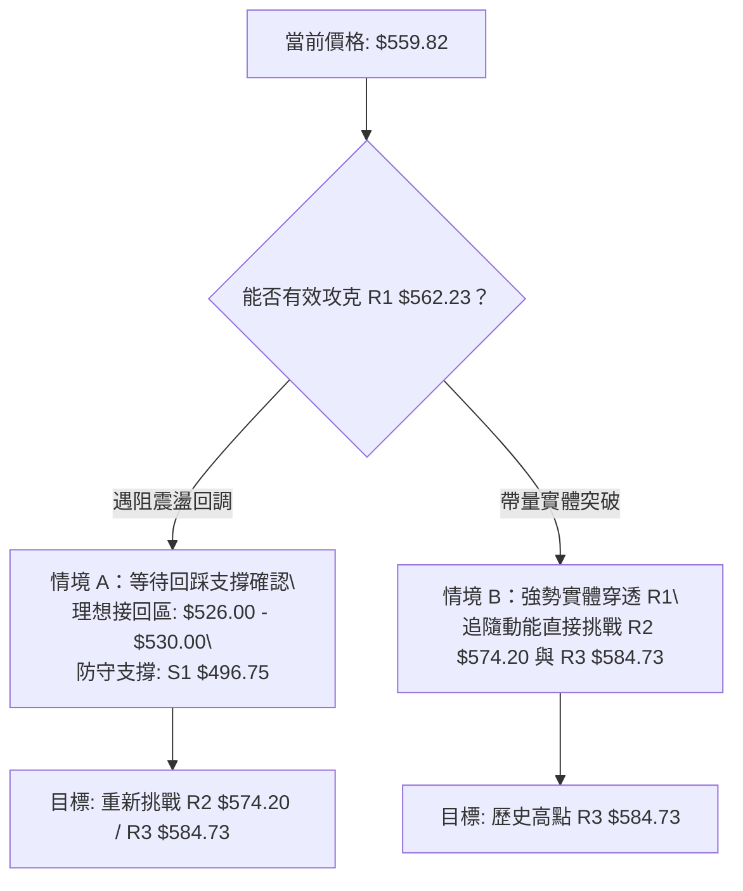

### 🧭 策略路由

**當前主策略方向 = 多頭回踩佈局（主推多頭策略，依技術評分卡 70/100）**
鑑於綜合評分達 70 分（偏多），本報告主推多頭策略，空頭方向僅列為反轉風控防禦點，不建議主動做空逆勢摸頂。

### 🎯 價格情境階梯（Price Scenarios）

價位嚴格引用第 4 章「關鍵價位」數值：

| 觸發條件 | 下一目標 | 後續延伸 | 情境技術含義 |
|----------|----------|----------|--------------|
| **突破 R1 $562.23** | R2 $574.20 | R3 $584.73 | 短線超買獲得動能消化，強勢發起歷史天花板衝擊波 |
| **受阻於 R1 回落整固** | 回測 $526.00 | S1 $496.75 | 典型的超買技術性均值回歸，消化 RSI 過熱乖離 |
| **跌破 S1 $496.75** | S2 $461.71 | S3 $451.00 | 中期結構被破壞，高位大箱體宣告失守，轉入深幅回調 |

### 📊 情境機率分佈

| 運行情境 | 機率預估 | 主要技術指標支撐依據 |
|----------|----------|----------------------|
| **高位受阻回踩後續漲** | **55%** | RSI (73.12) 與 %B (1.08) 要求短線回洗，但 MACD (+8.427) 與量比 (1.67x) 提供強烈下檔承接 |
| **直接帶量突破 R1 衝頂** | **30%** | DMI 系統中 +DI 高達 37.10，市場處於機構主動買盤催化狀態，有低機率演變為極端軋空 |
| **假突破並深度破位回落** | **15%** | 若半導體板塊突發黑天鵝，跌破 S1 ($496.75) 則高位雙頭確立，但目前機率極低 |

### 🟢 主策略詳情

| 策略要素 | 策略 A：穩健回踩做多（首選主策略） | 策略 B：右側突破加碼做多（進攻策略） |
|----------|-----------------------------------|--------------------------------------|
| **交易邏輯** | 利用日線超買引發的技術性回踩，於均線與支撐重疊區低吸 | 當多頭實體K線強勢收過 R1，順勢進場搭乘衝頂列車 |
| **進場價格** | **$530.00**（回測MA5與ATR緩衝區間） | **$563.50**（帶量突破 R1 $562.23 確認後進場） |
| **止損價格** | **$495.00**（嚴格置於支撐 S1 $496.75 下方） | **$545.00**（置於前一日突破K棒低點） |
| **目標價 T1** | **$574.20**（阻力位 R2，達成部分鎖利） | **$584.73**（52週最高價 R3） |
| **目標價 T2** | **$584.73**（52週高點 R3，清倉結利） | **$616.51**（外資分析師共識平均目標價） |
| **風險報酬比** | **1 : 1.56**（冒險 $35，博取目標T2 $54.73） | **1 : 2.87**（冒險 $18.5，博取目標T2 $53.01） |
| **預估勝率** | **65%** | **50%** |
| **建議倉位** | **15% - 20% 資金** | **10% 資金（高波動輕倉跟隨）** |

### 🔴 反向風險觸發點（對沖提示）

- **觸發條件 1**：日線收盤價跌破 **S1 ($496.75)**。此價位為波段支撐核心且為 MA50 重疊處，一旦跌破宣告箱體反彈失敗，應立即執行多單全面止損或進行空頭部位對沖。
- **觸發條件 2**：在 $562.23 (R1) ~ $584.73 (R3) 形成日線級別「天量長上影線」或「看跌吞沒」，且 RSI 出現明確頂背離時，多單應無條件離場觀望。

### ⭐ 整體訊號強度評星

```
╔══════════════════════════════════════════════════════════════╗
║                     整體訊號強度評星                         ║
╠══════════════════════════════════════════════════════════════╣
║ 做多訊號強度：★★★★☆  (4/5星 - 中長期強勁，僅受短期超買壓制)  ║
║ 做空訊號強度：★☆☆☆☆  (1/5星 - 逆勢放空風險極高，嚴禁摸頂)    ║
║ 整體可信度：  ★★★★☆  (4/5星 - 量價動能與均線共振高度一致)    ║
╚══════════════════════════════════════════════════════════════╝
```

---

## 9. 風險提示與監控

### ✅ 關鍵監控指標 Checklist

```
╔══════════════════════════════════════════════════════════════╗
║                 日常動態監控清單 (Trading Checklist)        ║
╠══════════════════════════════════════════════════════════════╣
║ [ ] 阻力穿透檢驗：觀察收盤價是否實體站穩 R1 $562.23          ║
║ [ ] 動能過熱修復：追蹤 RSI(14) 能否自 73.12 平緩降至 60-65   ║
║ [ ] 布林軌道吸附：觀察價格是否回踩 BB 上軌 $550.12 內進行整理 ║
║ [ ] 量能延續性：每日成交量是否維持在 2,000 萬股以上健康水準  ║
║ [ ] 支撐防守測試：回踩過程中 S1 $496.75 是否展現強烈買盤支撐 ║
║ [ ] 均線金叉確認：MA20 ($490.75) 是否於本週內成功金叉 MA50    ║
╚══════════════════════════════════════════════════════════════╝
```

### ⚠️ 風險場景分析

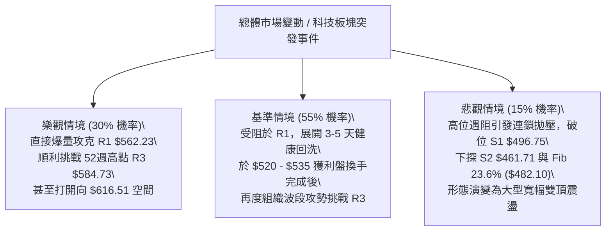

### 🛡️ 風險管理重要提醒

1. **高 Beta 特性管理**：AMD 當前 Beta 高達 2.476，極度放大納斯達克指數的震盪幅。單日 ATR 達 $22.33，這意味著日內正常的技術性波動便可能造成 4% 以上的帳戶淨值擺動。因此，**絕對不可使用高槓桿合約在阻力位附近盲目市價追多**。
2. **倉位配置原則**：在價格逼近歷史高位密集阻力區（$562.23 ~ $584.73）時，整體持倉部位不宜超過總權益的 25%，其餘資金應保持現金流動性，等待回調至支撐位時再行分批介入。

---

## 📋 報告總結

```
╔══════════════════════════════════════════════════════════════════╗
║                   AMD 技術分析報告總結                          ║
╠══════════════════════════════════════════════════════════════════╣
║ 報告日期：2026-09-21                                            ║
║ 當前價格：$559.82                                               ║
║ 分析評級：🟢 偏多震盪 (短線超買整固，中長線多頭推升)             ║
╠══════════════════════════════════════════════════════════════════╣
║ 關鍵結論：                                                       ║
║ ├─ 長期趨勢：🟢 強烈看多 (遠高於 MA200 $354.62 達 +57.86%)       ║
║ ├─ 中期趨勢：🟢 雙重底形態突破完成，MACD 柱狀擴大至 +8.427       ║
║ ├─ 短期趨勢：🟡 日線 RSI(14)=73.12 及布林 %B=1.08 提示短線過熱   ║
║ ├─ 關鍵支撐：S1 $496.75 (波段共振帶) / S2 $461.71 (雙底頸線底)   ║
║ ├─ 關鍵阻力：R1 $562.23 (測幅滿足點) / R3 $584.73 (52W歷史天花板)║
║ └─ 分析師目標：平均共識目標價 $616.51                            ║
╠══════════════════════════════════════════════════════════════════╣
║ 最優策略組合：                                                   ║
║ 1. 🥇 最佳機會 (策略 A)：等待短線回踩 $530.00 佈局波段多單，     ║
║                          停損設於 $495.00，目標直指 $584.73      ║
║ 2. 🥈 次選機會 (策略 B)：若日線放量實體突破 R1 $562.23，則小倉位 ║
║                          順勢追單，停損 $545.00，目標 $584.73    ║
║ 3. 🥉 保守選擇：完全空手者建議靜待 RSI 回歸 60 附近並確認 S1 支  ║
║                 撐有效性後再行進場，堅決規避高位追高風險         ║
╚══════════════════════════════════════════════════════════════════╝
```

---

> ⚠️ **免責聲明**：本報告為技術分析專用模型生成之量化技術評估，所有數據、圖表及推算均基於歷史量價資訊。本報告**僅供學術研究與投資決策參考**，**不構成任何要約或投資買賣建議**。金融市場瞬息萬變，投資人應獨立評估風險並自負盈虧。

---

*報告生成時間：2026-09-21 ｜ 數據來源：Yahoo Finance ｜ 分析框架：多時框架量化技術分析*