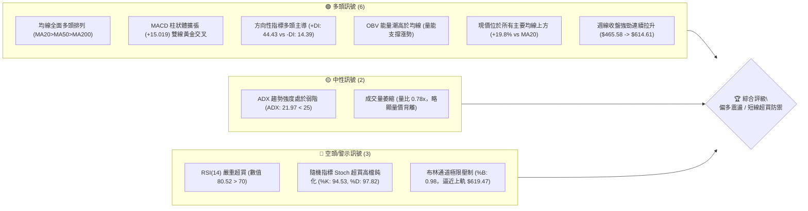
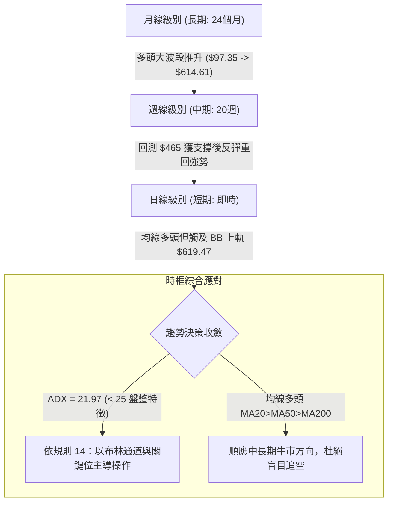
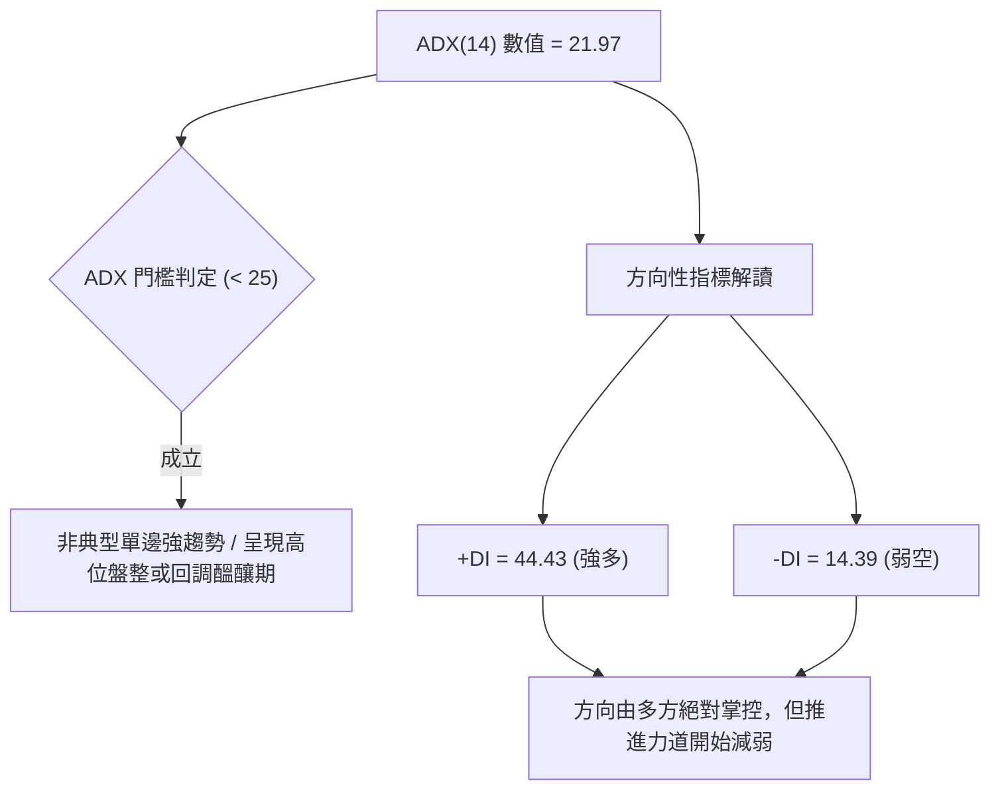
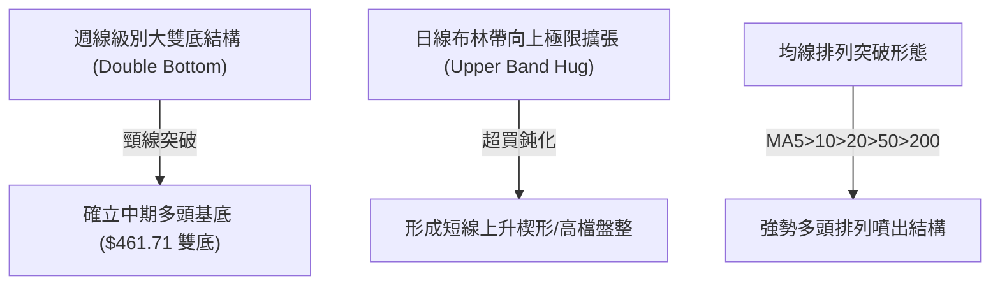
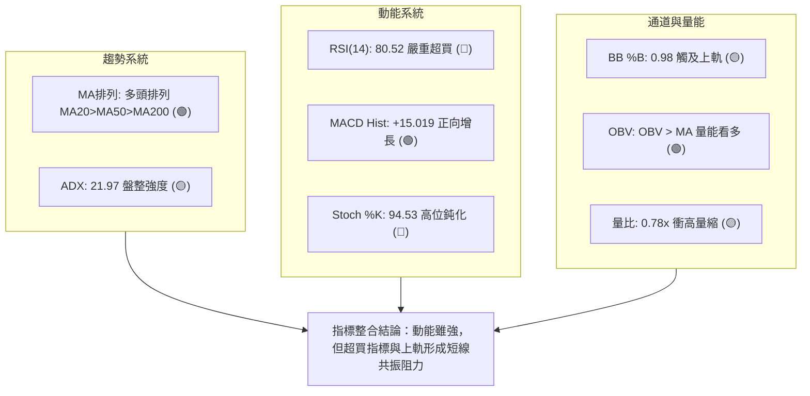
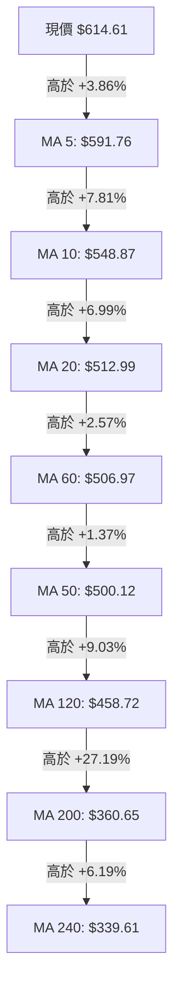
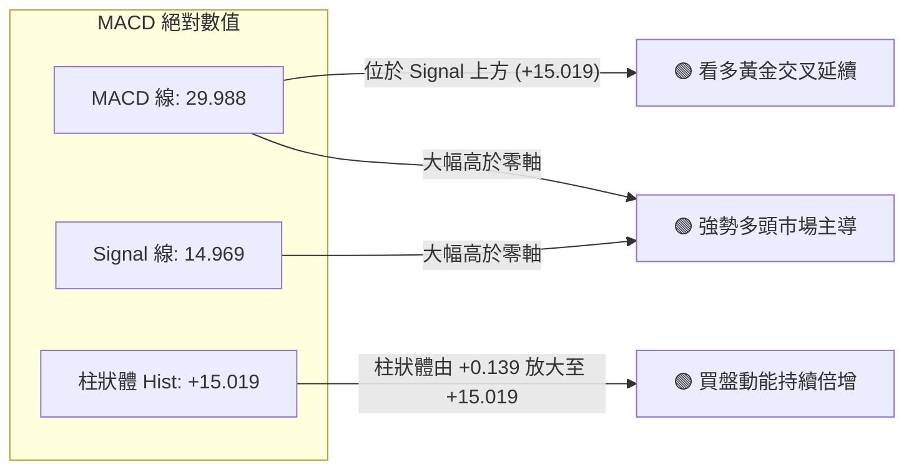
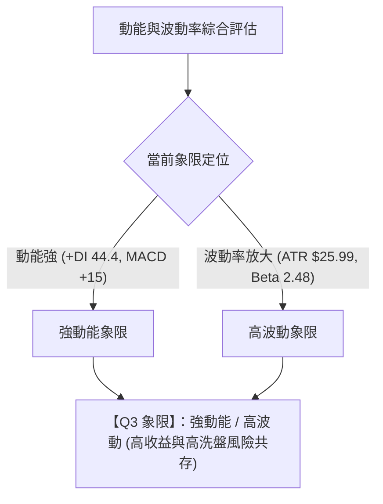
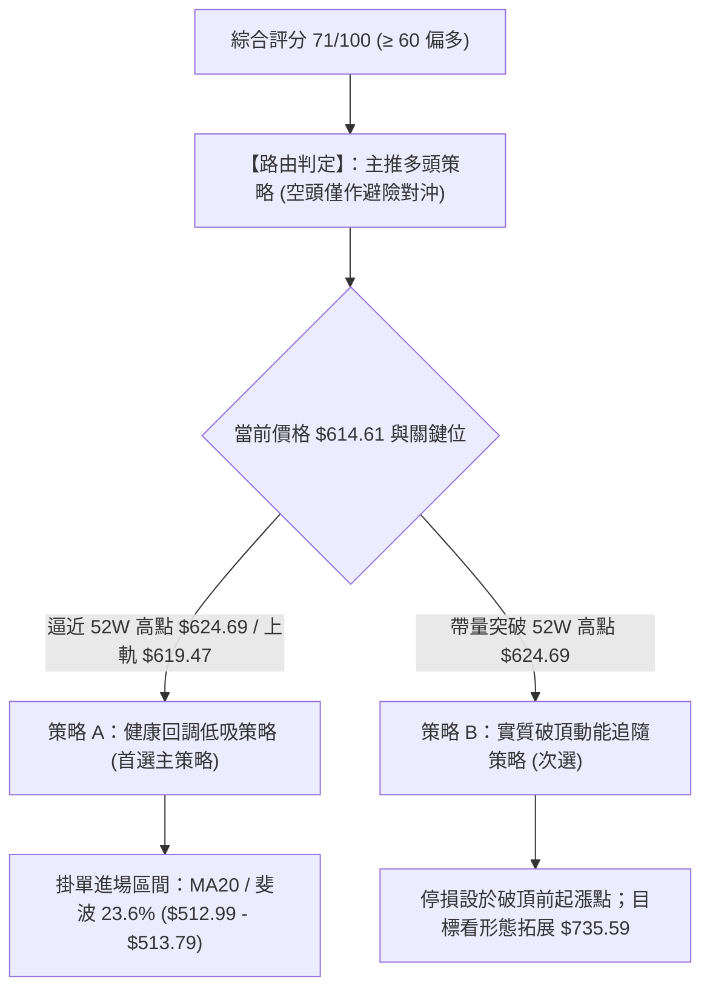
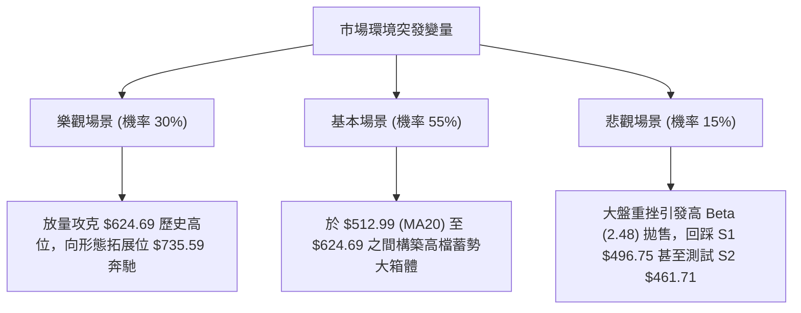

# AMD 技術分析報告

> **報告日期**：2026-09-24 ｜ **語言**：繁體中文 ｜ **數據來源**：Yahoo Finance ｜ **當前價格**：$614.61

---

## 目錄

| 章節 | 內容 |
|------|------|
| [1. 技術面概覽](#1-技術面概覽) | 訊號儀表板、核心指標、評分卡 |
| [2. 趨勢分析](#2-趨勢分析) | 多時框趨勢、長中短期走勢 |
| [3. 圖表形態分析](#3-圖表形態分析) | 形態識別、K線組合、目標價 |
| [4. 支撐與阻力](#4-支撐與阻力) | 關鍵價位、斐波那契回調 |
| [5. 技術指標深度解讀](#5-技術指標深度解讀) | MA/RSI/MACD/布林/成交量 |
| [6. 動能與波動率](#6-動能與波動率) | 動能評估、ATR、Beta |
| [7. 多時框架總結](#7-多時框架總結) | 時框架評分矩陣 |
| [8. 交易策略建議](#8-交易策略建議) | 多空策略、風險報酬比 |
| [9. 風險提示與監控](#9-風險提示與監控) | 監控指標、風險場景 |

---

## 1. 技術面概覽

### 🎯 技術訊號儀表板



---

### 📊 核心指標速覽表

| 指標類別 | 指標名稱 | 當前數值 | 訊號 | 解讀 |
|:---|:---|:---|:---:|:---|
| **價格結構** | 當前收盤價 | $614.61 | 🟢 | 逼近歷史與52週高點 $624.69，位居年內相對高位 97.9% |
| **短期均線** | MA20 | $512.99 | 🟢 | 現價高於 MA20 達 +19.81%，多頭基底穩固 |
| **中期均線** | MA50 | $500.12 | 🟢 | 中期均線呈正斜率向上，提供強力波段防守點 |
| **長期均線** | MA200 | $360.65 | 🟢 | 現價顯著高於長期生命線，超長期牛市架構確立 |
| **動能指標** | RSI(14) | 80.52 | 🔴 | 進入極度超買區間（>70），短線追價風險劇增，無底背離 |
| **趨勢動能** | MACD (12,26,9) | 29.988 / 14.969 | 🟢 | 快慢線均在零軸上方，Histogram +15.019 正向放大看多 |
| **震盪指標** | Stoch %K / %D | 94.53 / 97.82 | 🔴 | 極端過熱，短線高檔死叉回洗壓力升溫 |
| **趨勢強度** | ADX(14) | 21.97 | 🟡 | 數值低於 25，顯示當前處於強拉後的區間震盪整理週期 |
| **通道指標** | 布林帶 (%B) | 0.98 (上軌 $619.47) | 🟡 | 價格觸及上軌極限，通道開口略有受限，易受壓拉回 |
| **波動幅度** | ATR(14) | $25.99 (4.23%) | 🟡 | 單日震盪幅度約 $26，波幅擴大，需配置寬止損 |
| **成交量能** | 20日均量對比 | 16.30M / 21.02M | 🟡 | 當日量比僅 0.78x，顯示衝高缺乏放量爆發支持 |

---

### 🏆 技術評分卡

```
╔══════════════════════════════════════════════════════════════╗
║               技術評分卡 — AMD (2026-09-24)                 ║
╠══════════════════════════════════════════════════════════════╣
║ 趨勢強度 (ADX/方向)   ████████████░░░░░░░░  60/100  🟡 中性   ║
║ 動能指標 (RSI/MACD)  ██████████████░░░░░░  70/100  🟢 偏多   ║
║ 支撐穩定度 (S1-S3)    ████████████████░░░░  80/100  🟢 強勁   ║
║ 成交量配合 (OBV/量比) ██████████░░░░░░░░░░  50/100  🟡 觀望   ║
║ 形態完整度 (波段突破) ██████████████░░░░░░  70/100  🟢 偏多   ║
║ 均線排列 (多頭排列)   ████████████████████ 100/100  🟢 極佳   ║
╠══════════════════════════════════════════════════════════════╣
║ 綜合技術評分          ██████████████░░░░░░  71/100  🟢 偏多   ║
║ 策略導向：中長期強烈多頭主導，但短線指標嚴重過熱，宜回調低吸 ║
╚══════════════════════════════════════════════════════════════╝
```

---

## 2. 趨勢分析

### 🌐 多時框趨勢分析



---

### 📈 長期趨勢 — 12個月走勢圖（Unicode）

以下為 AMD 自 2025-10 至 2026-09 過去 12 個月之收盤價 ASCII 走勢圖，標注高點、低點及現價：

```
AMD 月線走勢圖（過去12個月：2025-10 至 2026-09）
價格軸 ($)
$624.69 ┤                                                ●(52W高點 $624.69)
$614.61 ┤                                              ●←(現價 $614.61)
$580.91 ┤                                      ●
$516.10 ┤                                  ●
$470.72 ┤                                          ●   ●
$354.49 ┤                              ●
$256.12 ┤  ●
$214.16 ┤      ●   ●       ●
$200.21 ┤              ●(波段次低點 $200.21)
        └────────────────────────────────────────────────────────────►
          10月 11月 12月 01月 02月 03月 04月 05月 06月 07月 08月 09月
          2025                        2026
```

#### 走勢特徵分析表格

| 階段區間 | 時間跨度 | 起訖收盤價 | 區間漲跌幅 | 價量特徵與技術含義 |
|:---|:---:|:---:|:---:|:---|
| **基底構築期** | 2025-10 ~ 2026-03 | $256.12 → $203.43 | -20.57% | 股價於 $200.21~$256.12 區間築雙重次底，浮額徹底清洗 |
| **主升爆發期** | 2026-03 ~ 2026-06 | $203.43 → $580.91 | +185.56% | 突破所有長期均線，連續長陽拉升，量能顯著釋放 |
| **波段洗盤期** | 2026-06 ~ 2026-08 | $580.91 → $470.72 | -18.97% | 週線連續整理，測試支撐位 S2 ($461.71) 與斐波那契回調位 |
| **再創新高期** | 2026-08 ~ 2026-09 | $470.72 → $614.61 | +30.57% | 強勢V型反轉直撲 52W 高點 $624.69，短線進入衝頂段 |

---

### 📊 中期趨勢（週線分析）

從近 20 週收盤走勢可看出，AMD 在 2026 年 8 月底於 $465.58 完成二次探底，隨後展開凌厲攻勢：
- **2026-08-30 收盤 $465.58**（RSI 48.7，MACD柱 -0.243，成交量 81.76M）：形成堅實的右肩底部。
- **2026-09-13 收盤 $516.13**（RSI 62.6，MACD柱轉正 +6.512）：帶量突破 MA20 ($512.99)。
- **2026-09-27 最新 $614.61**（RSI 80.5，MACD柱 +15.019）：推升至布林上軌附近。

```
近期週線壓力與支撐階梯架構示意圖：
[阻力 R0] $624.69 (52W High)  ───┐
                                 ├─► 短線頂部強阻力區間 ($619.47 - $624.69)
[布林上軌] $619.47             ───┘
   ▲
   │  現價: $614.61 (超買拉抬中)
   ▼
[斐波 23.6%] $513.79           ───┐
[均線 MA20]  $512.99           ───┼─► 第一道核心支撐帶 ($512.99 - $513.79)
[波段支撐 S1] $496.75          ───┘
[波段支撐 S2] $461.71          ──────► 中期生命防守位（8月底起漲點）
```

---

### ⚡ 趨勢強度評估（ADX 解讀）



#### ADX 強度對照與量化解讀

| 指標變數 | 當前讀數 | 門檻區間 | 技術解讀 |
|:---|:---:|:---:|:---|
| **ADX(14)** | **21.97** | 0 ~ 25（弱趨勢/區間震盪） | 股價短線暴拉後，均值回歸壓力積累，缺乏穩定推動型單邊動能 |
| **+DI (14)** | **44.43** | > 25（多方動能充足） | 買方在過去 14 日仍佔有壓倒性主導權 |
| **-DI (14)** | **14.39** | < 20（空方力量微弱） | 空方尚未形成主動殺跌波段，目前無實質破位動作 |
| **DI 差值 (+DI - -DI)** | **+30.04** | 偏多極限值 | 短線多頭能量釋放過快，通常伴隨回調洗盤 |

---

## 3. 圖表形態分析

### 🔍 形態識別系統



#### 形態信心度與目標價評估表（依規則 15）

| 形態名稱 | 信心度 | 判斷依據（引用真實數據） | 完成度 | 目標價（附嚴謹計算式） |
|:---|:---:|:---|:---:|:---|
| **週線雙重底 (W底)** | **85%** | 兩次波段低點於 2026-08-02 ($476.15) 與 2026-08-30 ($465.58) 獲得 S2 ($461.71) 支撐 | 100% (已突破頸線) | 頸線 $516.13 + 形態深度 ($516.13 - $465.58 = $50.55) = **$566.68**（已滿足） |
| **52週高點箱體突破** | **65%** | 價格逼近 52W 高點 $624.69，當前收在 $614.61，距高點僅 1.6% | 90% (測試中) | 若突破 $624.69，依近期整理區間 ($624.69 - $513.79 = $110.90) 向上推算高度：$624.69 + $110.90 = **$735.59** |
| **頭肩底形態** | < 50% | **數據中未偵測到標準左右肩對稱體系**，僅有底部抬升 | 0% | 訊號不足，依規則 15 不予編造，僅做均線指標型解讀 |

---

### 🕯️ 重要K線形態分析

| 觀測週期/日期 | 收盤價 | 實質 K 線形態 | 量化技術解讀 | 訊號評定 |
|:---|:---:|:---|:---|:---:|
| **2026-08-30 (週線)** | $465.58 | 縮量十字星錘頭 (Hammer) | 探測支撐位 S2 ($461.71) 不破，長下影線確立波段低點 | 🟢 多頭止跌 |
| **2026-09-13 (週線)** | $516.13 | 突破中長陽線 (Bullish Marubozu) | 強勢穿透 MA20 ($512.99) 與 23.6% 斐波那契位 ($513.79) | 🟢 轉強確認 |
| **2026-09-20 (週線)** | $559.82 | 大陽線實體推進 | 成交量放大至 124.59M，MACD 柱狀體跳增至 +8.427 | 🟢 主升加速 |
| **2026-09-27 (即時)** | $614.61 | 高檔帶影陽線 | 觸及 BB 上軌 $619.47，週量略降至 89.08M，呈現衝高滯脹 | 🟡 警惕回洗 |

---

### 📉 ASCII 走勢形態示意圖

```
AMD 週線級別雙底形態與高檔突破架構：

 價格 ($)
 $624.69 ─────────────────────────────────┬─── [52W 高點壓力線]
 $614.61                        ▲        │    (目前現價逼近此位)
 $559.82                       ╱ ╲       │
 $516.13 ───────●─────────────●───╲──────┼─── [W底頸線位 / MA20 $512.99]
               ╱ ╲           ╱     ╲     │
 $476.15 ─────●   ╲         ╱       ▼    │
 $465.58 ──────────●───────●             └─── [W底支撐區間: S1 $496.75 / S2 $461.71]
                  (底1)   (底2)
                 08-02   08-30
```

---

### 🎯 形態目標價計算

1. **已達成形態 — 週線雙底 (W Bottom)**：
   - 底 1（2026-08-02 收盤）：$476.15
   - 底 2（2026-08-30 收盤）：$465.58
   - 頸線位置（2026-08-16 反彈高點）：$514.39（精確頸線收盤 $516.13）
   - 形態垂直深度 = $516.13 - $465.58 = **$50.55**
   - 形態最小理論量度目標 = 頸線 $516.13 + $50.55 = **$566.68**
   - **實證評估**：現價 $614.61 已大幅超越第一量度目標，該形態已完全消化。

2. **未完成形態 — 52週高點箱體向上拓展（潛在）**：
   - 下軌基底（斐波那契 23.6%）：$513.79
   - 上軌阻力（52週高點）：$624.69
   - 箱體振幅 = $624.69 - $513.79 = **$110.90**
   - 拓展延伸目標價 = $624.69 + $110.90 = **$735.59**
   - **前提條件**：日線及週線收盤價必須帶量實質站穩 $624.69 之上，否則此目標無效。

---

## 4. 支撐與阻力

### 🗺️ 關鍵價位分布圖（Unicode）

```
AMD 價位結構分布圖 (依 OHLCV 與關鍵價位計算)
══════════════════════════════════════════════════════════════
$624.69 ║████████████████████████████████║ 52W High / 絕對歷史阻力
$619.47 ║████████████████████████        ║ 布林通道上軌阻力
$616.51 ║████████████████                ║ 分析師平均目標價 (Consensus Mean)
$614.61 ╠════════════════════════════════╣ ◄ 當前市價 ($614.61)
$513.79 ║▓▓▓▓▓▓▓▓▓▓▓▓▓▓▓▓▓▓▓▓▓▓▓▓▓▓▓▓    ║ 斐波那契 23.6% 回調位
$512.99 ║▓▓▓▓▓▓▓▓▓▓▓▓▓▓▓▓▓▓▓▓▓▓▓▓▓▓▓▓    ║ 20日均線 (MA20 / 布林中軌)
$500.12 ║▓▓▓▓▓▓▓▓▓▓▓▓▓▓▓▓▓▓▓▓▓▓        ║ 50日均線 (MA50)
$496.75 ║████████████████████████        ║ 波段支撐 S1 (-19.18%)
$461.71 ║████████████████████████████    ║ 強支撐 S2 (-24.88%)
$451.00 ║████████████████████████████████║ 核心底線 S3 (-26.62%)
══════════════════════════════════════════════════════════════
```

---

### 🚧 阻力位分析表

> **數據紀律說明**：阻力位嚴格引用系統聚類數據。數據顯示「當前價格上方未偵測到近一年波段高點阻力聚類」，因此阻力位採用 52W 最高點、布林上軌及分析師共識價位。

| 阻力級別 | 具體價位 | 形成依據與計算來源 | 突破難度 | 重要性等級 |
|:---|:---:|:---|:---:|:---:|
| **阻力 R1** | **$619.47** | 日線布林通道上軌（當前 %B=0.98 極限區間） | 中等 | 🟡 短線動能壓制點 |
| **阻力 R2** | **$624.69** | 52 週歷史最高價（52W High / 斐波 0.0%） | 極高 | 🔴 多頭關鍵分水嶺 |
| **阻力 R3** | **數據未偵測** | 數據顯示上方無波段高點聚類；形態拓展理論見 $735.59 | 未知 | ⚪ 歷史真空無套牢盤 |

---

### 🛡️ 支撐位分析表

> **數據紀律說明**：支撐位嚴格引用技術數據區塊中波段低點聚類數值（S1/S2/S3）。

| 支撐級別 | 具體價位 | 距現價幅度 | 形成原因與數據源 | 守住機率 | 重要性等級 |
|:---|:---:|:---:|:---|:---:|:---:|
| **支撐 S1** | **$496.75** | -19.18% | 近一年波段低點聚類 S1，靠近 MA50 ($500.12) | 75% | 🟢 第一波段防守點 |
| **支撐 S2** | **$461.71** | -24.88% | 近一年波段低點聚類 S2，8月底打底關鍵起漲位 | 88% | 🟢 中期強支撐底線 |
| **支撐 S3** | **$451.00** | -26.62% | 近一年波段低點聚類 S3，接近 120日均線 ($458.72) | 95% | 🟢 多頭牛熊分界骨幹 |

---

### 📐 斐波那契回調位分析

依據 52 週區間 **$154.78 (52W Low) → $624.69 (52W High)** 精確計算之回調位分布：

| 斐波那契比例 | 精確對應價位 | 與當前價格關係 | 技術分析解讀 |
|:---|:---:|:---:|:---|
| **0.0% (高點)** | **$624.69** | +1.64% (上方) | 頂部極限，也是近一年行情的絕對天花板 |
| **23.6%** | **$513.79** | -16.40% (下方) | **當前價格正處於 0.0% 與 23.6% 之間**；此價位與 MA20 ($512.99) 高度共振，為拉回首選承接位 |
| **38.2%** | **$445.18** | -27.57% (下方) | 強回調支撐，低於 S3 ($451.00)，跌破意味行情轉入深度弱勢 |
| **50.0%** | **$389.74** | -36.59% (下方) | 多空中軸，一旦跌至此處，整輪 AI 主升浪結構遭破壞 |
| **61.8%** | **$334.29** | -45.61% (下方) | 黃金分割底線，靠近 MA240 ($339.61) |
| **78.6%** | **$255.34** | -58.46% (下方) | 2025 年 10 月反彈平台高點 |
| **100.0% (低點)** | **$154.78** | -74.82% (下方) | 52 週絕對底部 |

---

## 5. 技術指標深度解讀

### 🎛️ 指標訊號總覽



---

### 📈 移動平均線排列分析



#### 均線矩陣詳細量化表

| 均線代號 | 數值 | 距現價價差 | 乖離率 (BIAS) | 短期走勢狀態 | 支撐阻力屬性 |
|:---|:---:|:---:|:---:|:---:|:---|
| **MA 5** | $591.76 | +$22.85 | +3.86% | 陡峭上升 (▂▃▄▅▇█) | 短線超強動態支撐 |
| **MA 10** | $548.87 | +$65.74 | +11.98% | 快速上移 (▂▃▄▅▆█) | 短線第一回調支撐 |
| **MA 20** | $512.99 | +$101.62 | +19.81% | 向上發散 (▂▃▄▅▇█) | **布林中軌，波段強支撐** |
| **MA 50** | $500.12 | +$114.49 | +22.89% | 平穩向上 | 中期防守線，多頭生命線 |
| **MA 60** | $506.97 | +$107.64 | +21.23% | 向上走平後昂頭 | 中期生命線輔助 |
| **MA 120** | $458.72 | +$155.89 | +33.98% | 穩定走高 (▄▅▆▇██) | 半年牛熊線，接近 S2/S3 |
| **MA 200** | $360.65 | +$253.96 | +70.42% | 長期上行 | 長期牛市基石 |
| **MA 240** | $339.61 | +$275.00 | +80.98% | 長期上行 (▄▅▆▇██) | 絕對牛市分界點 |

均線系統展現完美的「標準多頭排列（Bullish Stacked MAs）」，短中長期均線呈現順暢的多頭發散。然而，現價對 MA20 乖離率高達 +19.81%，對 MA200 乖離達 +70.42%，屬於歷史高位極端乖離，存在技術性收斂需求。

---

### 📉 RSI(14) 分析

- **當前讀數**：**80.52** 🔴
- **區間展示**：
  ```
  超賣 (0-30)        中性平衡 (30-70)        超買 (70-100)
  [░░░░░░░░░░░░░░░░░░░░░░░░░░░░░░░░░░░░░░░░░░░░██████████] 80.52
  ```
- **狀態判定**：進入極度超買區間（>70），高於 80 意味著市場買盤處於短線狂熱狀態。
- **背離分析**：
  - **頂背離**：無明顯背離。近三週價格從 $477.57 → $516.13 → $559.82 → $614.61，對應週線 RSI 分別為 40.1 → 62.6 → 73.1 → 80.5，RSI 高點隨價格同步刷新高，未出現價格創新高而指標走低的現象。
  - **結論**：純屬**動能推升型超買**，而非結構背離衰竭；但在超買區間追高極易遭遇突發性長陰線洗盤。

---

### 📊 MACD(12, 26, 9) 訊號解讀



- **動能解讀**：MACD 自 9 月初的 +0.139 連續三週跳升至 +6.512、+8.427、+15.019，呈現多頭動能加速釋放的良性狀態，尚未見到紅柱縮短跡象。

---

### 📦 布林通道分析

```
AMD 布林通道現狀示意圖 (寬度與現價相對位置)
══════════════════════════════════════════════════════════════
$619.47 ─── BB 上軌 ──────────────────────────┬─── (上軌壓制區)
$614.61 ─── 市價 (當前位置: %B = 0.98) ◄──────┘    (極度貼近上軌)
                                              
$512.99 ─── BB 中軌 (MA20) ─────────────────────── (波段核心支撐)
                                              
$406.51 ─── BB 下軌 ───────────────────────────── (極端超跌支撐)
══════════════════════════════════════════════════════════════
帶寬 (Bandwidth) = ($619.47 - $406.51) / $512.99 = 41.51% (通道處於擴張態)
```

- **通道讀數**：%B 達到 **0.98**，幾乎貼緊布林上軌 $619.47。
- **技術解讀**：當 %B 接近 1.0 時，代表價格達到統計學上的 2 個標準差上限。在弱趨勢（ADX=21.97）背景下，價格直接向上「穿軌並連續單邊逼空」的機率通常低於 15%，高機率引發中軌 $512.99 方向的均值回歸。

---

### 💹 成交量分析（量價配合度）

- **量能數值對比**：
  - 最新成交量：**16,299,200** 股
  - 20 日均量：**21,017,295** 股
  - 50 日均量：**24,111,106** 股
  - **量比**：**0.78x**（成交量低於 20 日均線 22%）
- **OBV (能量潮指標)**：
  - 當前狀態：**OBV > MA** 🟢
  - 解讀：雖然日線短線出現衝高量能不濟（16.30M vs 21.02M），但中線 OBV 趨勢高於其移動平均線，說明大資金在前段吸籌充份，現階段鎖籌度極高，空頭打壓困難。

---

## 6. 動能與波動率

### ⚡ 動能評估四象限



#### 四象限特徵定位表

| 象限代號 | 動能強度 | 波動率水準 | 當前狀態符合度 | 戰術應對建議 |
|:---:|:---:|:---:|:---:|:---|
| **Q1** | 強 | 低 | ✕ | 最佳趨勢加碼點（未處於此狀態） |
| **Q2** | 弱 | 低 | ✕ | 沉悶打底盤整，謹慎觀望 |
| **Q3** | **強** | **高** | **✓ (AMD 當前定位)** | **動能極強但回撤風險劇烈；適合分批止盈、回調支撐進場** |
| **Q4** | 弱 | 高 | ✕ | 弱勢破位單邊下跌，嚴格停損 |

---

### 📊 ATR 波動率分析

- **ATR(14) 絕對值**：**$25.99**（佔當前股價之 **4.23%**）
- **單日預期波幅**：當前 AMD 單日正常隨機波動區間約為 **±$26.00**。
- **止損與倉位風控量化標準**：
  - **短線防守緩衝 (1.0 × ATR)**：距進場點扣除 **$26.00**。
  - **波段安全防守 (2.0 × ATR)**：距進場點扣除 **$51.98**。
  - **意義**：以現價 $614.61 為例，任何小於 $26.00 的緊密止損極易被盤中正常雜訊掃出場，波段操作必須預留至少 $50 以上之緩衝空間。

---

### 📐 Beta 與市場相關性

- **Beta 係數**：**2.476**（高彈性半導體晶片龍頭標的）
- **市場相關性分析**：
  - AMD 之波動率為標普 500 指數的近 **2.5 倍**。
  - 當大盤（S&P 500 / Nasdaq 100）回調 1% 時，AMD 理論回調幅度約為 2.48%；反之亦然。
  - **機構持股比例**：高達 **75.4%**，顯示籌碼主要集中於華爾街大型機構手中，散戶融券比例（Short % Float）僅 **2.6%**，Short Ratio **1.88**，不存在大規模軋空（Short Squeeze）基礎，後續推升完全取決於機構資金的基本面定價。

---

## 7. 多時框架總結

### 📋 時框架評分表

| 時框架 | 趨勢方向 | 動能狀態 | 均線排列狀況 | 形態結構 | 綜合評分 | 操作建議 |
|:---:|:---:|:---:|:---:|:---:|:---:|:---|
| **月線級別 (長期)** | 🟢 強烈看多 | 🟢 動能充沛 | 完全多頭排列 | 突破大箱體邁向歷史高位 | **90/100** | 逢大回調堅定做多 |
| **週線級別 (中期)** | 🟢 堅挺看多 | 🟢 MACD 紅柱暴增 | MA20>MA50 強勢發散 | 雙重底完成突破 | **85/100** | 波段持股續抱 |
| **日線級別 (短期)** | 🟡 震盪偏多 | 🔴 RSI 80 超買 | 多頭但乖離過大 | 逼近布林上軌與 52W 高點 | **58/100** | 不宜盲目追高，等待拉回 |

---

### 🔲 綜合訊號矩陣

```
訊號一致性交叉檢驗矩陣：
┌─────────────────┬───────────┬───────────┬───────────┬─────────────┐
│ 技術維度        │ 長期(月線)│ 中期(週線)│ 短期(日線)│ 指標整合判定│
├─────────────────┼───────────┼───────────┼───────────┼─────────────┤
│ 趨勢方向 (Trend)│  🟢 多頭  │  🟢 多頭  │  🟢 多頭  │ 方向高度一致│
│ 動能強度 (Mom)  │  🟢 強勁  │  🟢 增強  │  🔴 極端超買│ 短線面臨降溫│
│ 量能結構 (Vol)  │  🟢 充沛  │  🟢 放大  │  🟡 縮量量背│ 短線動能隱憂│
│ 支撐阻力 (S/R)  │  🟢 支撐遠│  🟢 頸線穩│  🔴 阻力在即│ 臨近 52W 高 │
└─────────────────┴───────────┴───────────┴───────────┴─────────────┘
```

---

### ⚖️ 多時框收斂結論（嚴格遵守規則 14）

1. **行情體系判定**：
   - 根據技術數據，當前 **ADX(14) = 21.97 (< 25)**。
   - **依規則 14 規定**：「盤整行情（ADX<25）：以日線布林通道上下軌為主要交易區間。」
2. **時框衝突取捨與收斂**：
   - 雖然週線與月線均線呈現無可挑剔的多頭大排列，但日線 ADX 指明目前推進處於區間震盪特徵，且現價 $614.61 已觸及布林通道上軌 $619.47（%B = 0.98），RSI 高達 80.52。
   - **唯一收斂方向結論**：**【偏多震盪，杜絕追高，嚴格以回調布林中軌或關鍵支撐為首選進場點】**。
   - 此結論完全收斂至第 8 章以「多頭拉回佈局策略」為主體，兼顧布林上軌高檔承壓之風險。

---

## 8. 交易策略建議

### 🗺️ 策略決策流程圖



---

### 🧭 策略路由

> **依規則指示明確點名**：
> **當前主策略方向 = 【多頭拉回佈局策略】（依據綜合評分 71/100，評級屬多頭偏多區間）。**
> 鑑於短線 RSI(80.52) 與布林上軌 ($619.47) 壓制，**絕對不採取現價無腦市價追多**，主推回調低吸多頭策略，空頭僅列為避險預警。

---

### 🎯 價格情境階梯（Price Scenarios）

價位嚴格引用關鍵價位區塊與斐波那契回調位：

| 觸發條件 | 第一目標 | 第二目標 / 延伸 | 情境含義與戰術解讀 |
|:---|:---:|:---:|:---|
| **強勢突破 52W 高點 $624.69** | 分析師均價 **$616.51** (已過) | 形態拓展目標 **$735.59** | 歷史空間打開，動能單邊延伸 |
| **受阻於布林上軌 $619.47 震盪** | 布林中軌 **$512.99** | 斐波 23.6% **$513.79** | 高檔指標修復，進入健康回踩箱體 |
| **跌破波段第一支撐 S1 $496.75** | 強支撐 S2 **$461.71** | 底線 S3 **$451.00** | 中期頭部顯現，多頭防線面臨重構 |

---

### 📊 情境機率分佈

| 預測情境 | 發生機率 | 主要技術與量化依據 |
|:---|:---:|:---|
| **情境一：高位受阻回調 / 震盪消化** | **55%** | RSI 80.52 極度超買、ADX 21.97 缺乏突破動能、成交量縮 (量比 0.78x)、逼近上軌 $619.47 |
| **情境二：直接放量強勢突破新高** | **30%** | MACD 柱狀體跳增至 +15.019、均線完美多頭排列、OBV 持續在均線上方維持吸籌 |
| **情境三：深度破位單邊下挫** | **15%** | +DI (44.43) 遠大於 -DI (14.39)，空方力量極弱，無重大利空不易直接打穿 S1/S2 |

---

### 🟢 主策略詳情

依據嚴格數據紀律，所有價位均基於技術數據（MA20: $512.99, Fib 23.6%: $513.79, S1: $496.75, S2: $461.71, 52W High: $624.69, 理論拓展: $735.59, ATR: $25.99）：

| 策略要素 | 策略 A（穩健型：回調關鍵位低吸策略） | 策略 B（激進型：放量破頂跟進策略） |
|:---|:---|:---|
| **適用場景** | 價格遇阻於 $619.47-$624.69 展開技術性回踩 | 日線收盤價帶量實質站上 52W 高點 $624.69 |
| **進場條件** | 回踩至 MA20 與 23.6% 斐波那契共振區企穩 | 收盤價確認大於 $624.69 且成交量比 > 1.2x |
| **進場價格** | **$513.79**（精確對齊斐波 23.6% 與 MA20 $512.99） | **$625.50**（突破 52W 高點 $624.69 之確認價） |
| **目標價 T1** | **$614.61**（前波高點平台現價） | **$680.00**（波段整數心理關口） |
| **目標價 T2** | **$624.69**（52 週歷史高點測試） | **$735.59**（箱體向上量度理論目標價） |
| **止損價格** | **$487.80**（跌破 S1 $496.75 扣除約 0.35×ATR） | **$599.51**（進場點扣除 1.0×ATR $25.99） |
| **風險報酬比** | **1 : 3.88** (獲利空間 $100.82 / 風險 $25.99) | **1 : 4.23** (獲利空間 $110.09 / 風險 $25.99) |
| **成功機率** | **70%** | **55%** |
| **建議倉位** | **15% - 20%** 總資產 | **5% - 10%** 總資產 |

---

### 🔴 反向風險觸發點（對沖提示）

若持有多頭部位，當盤面出現以下任一訊號時，必須推翻主策略並立刻建立保護性看跌期權（Married Put）或減倉對沖：
1. **日線收盤實質跌破波段支撐 S1 ($496.75)**：
   - 意味著價格同時摜破 MA20 ($512.99)、MA50 ($500.12) 與斐波 23.6% ($513.79)，多頭防線全面潰退，後續將直接回測 S2 ($461.71)。
2. **日線形成「巨量長陰破位」**：
   - 單日成交量超過 50 日均量（24.11M）且跌幅超過 1.5 倍 ATR（逾 -$39.00）。
3. **MACD 柱狀體出現高檔死叉轉負**（由當前 +15.019 驟降至零軸之下）。

---

### ⭐ 整體訊號強度評星

```
╔══════════════════════════════════════════════════════════════╗
║ 做多訊號強度：★★★★☆  (4/5星：長中趨勢極佳，但受短線超買扣分)║
║ 做空訊號強度：★☆☆☆☆  (1/5星：僅屬技術回洗，無單邊做空基礎)  ║
║ 整體可信度：  ★★★★☆  (4/5星：多時框均線與量能數據收斂一致)  ║
╚══════════════════════════════════════════════════════════════╝
```

---

## 9. 風險提示與監控

### ✅ 關鍵監控指標 Checklist

```
╔══════════════════════════════════════════════════════════════╗
║               每日動態監控檢查清單 (Checklist)               ║
╠══════════════════════════════════════════════════════════════╣
║ [ ] 1. 價格是否觸碰日線布林上軌 $619.47 出現長上影線？      ║
║ [ ] 2. 52W 高點 $624.69 是否被有效帶量長陽實體突破？       ║
║ [ ] 3. RSI(14) 是否跌破 70 產生「超買區跌出」的短線賣訊？  ║
║ [ ] 4. 日線收盤價是否守穩 MA20 ($512.99) 及 23.6% ($513.79)？║
║ [ ] 5. 當日成交量能否放大超越 20日均量 21,017,295 股？       ║
║ [ ] 6. +DI (44.43) 是否出現高檔死叉向下穿過 -DI (14.39)？   ║
║ [ ] 7. 波段支撐 S1 ($496.75) 是否保持完好？                 ║
╚══════════════════════════════════════════════════════════════╝
```

---

### ⚠️ 風險場景分析



---

### 🛡️ 風險管理重要提醒

1. **高 Beta 放大效應風險**：
   - AMD 當前 Beta 為 **2.476**，對大盤波動極度敏感。半導體板塊（SOX）若遭遇整體估值修正，AMD 回撤幅度恐達 10%~20%。切忌使用高槓桿工具（如融資保證金或末日價外期權）於當前 $614.61 高位重倉搏殺。
2. **極端乖離回踩風險**：
   - 價格距離 50日均線 ($500.12) 差距達 $114.49（乖離率 +22.89%）。根據技術統計慣性，年內該乖離通常會透過「時間橫盤」或「急跌洗盤」收斂至 5% 以內。
3. **倉位管理守則**：
   - 單筆多頭建倉風險敞口嚴格控制在總投資組合淨值的 **1.5% - 2.0%** 以內。
   - 依據 ATR = **$25.99** 計算，每股預期承擔風險若為 $26.00，則總資金 $100,000 美元之投資組合，單次做多不應超過 75 股，嚴防黑天鵝事件侵蝕資本。

---

## 📋 報告總結

```
╔══════════════════════════════════════════════════════════════════╗
║                     AMD 技術分析報告總結                         ║
╠══════════════════════════════════════════════════════════════════╣
║ 報告日期：2026-09-24               當前價格：$614.61            ║
║ 分析評級：🟢 偏多震盪 (多頭主導，但短線嚴重超買防回調)          ║
╠══════════════════════════════════════════════════════════════════╣
║ 關鍵結論：                                                       ║
║ ├─ 長期趨勢：🟢 強烈看多 (突破歷史大底，均線完美多頭排列)       ║
║ ├─ 中期趨勢：🟢 穩健看多 (週線完成雙底，MACD柱大幅擴散+15.019)   ║
║ ├─ 短期趨勢：🟡 超買警戒 (RSI=80.52，%B=0.98 逼近上軌 $619.47)   ║
║ ├─ 關鍵支撐：第一支撐 $513.79 (MA20共振) ；核心波段支撐 S1 $496.75║
║ ├─ 關鍵阻力：布林上軌 $619.47 ；52W 歷史極限高點 $624.69        ║
║ └─ 分析師目標：平均共識目標價 $616.51 ；最高目標價 $1250.00      ║
╠══════════════════════════════════════════════════════════════════╣
║ 最優策略組合：                                                   ║
║ 1. 🥇 最佳機會：回調低吸策略 A，耐心等待股價拉回 $513.79 佈局多單║
║ 2. 🥈 次選機會：破頂突破策略 B，日線帶量實質站上 $624.69 後順勢跟進║
║ 3. 🥉 保守選擇：維持現狀觀望，待 RSI 自 80 超買區降溫至 60 以下再定奪║
╚══════════════════════════════════════════════════════════════════╝
```

---

> ⚠️ **免責聲明**：本報告為 AI 自動生成之技術分析研究，所有數據指標及價位估算均嚴格基於所提供之歷史價格與量化資訊。本報告**僅供學術研究與交易邏輯探討**，**絕不構成任何具體投資買賣建議**。金融市場存在高度波動與本金損失風險，投資人應依個人風險承受度獨立決策並自負盈虧。

---

*報告生成時間：2026-09-24 ｜ 數據來源：Yahoo Finance ｜ 分析框架：資深多時框架量化技術分析*