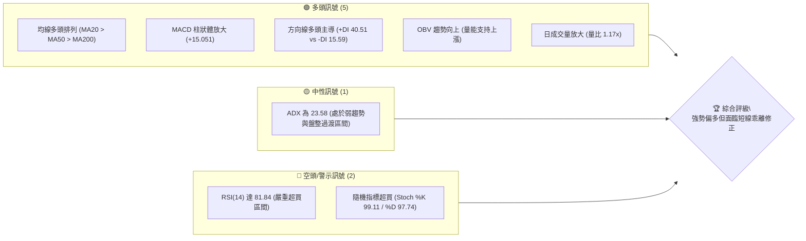
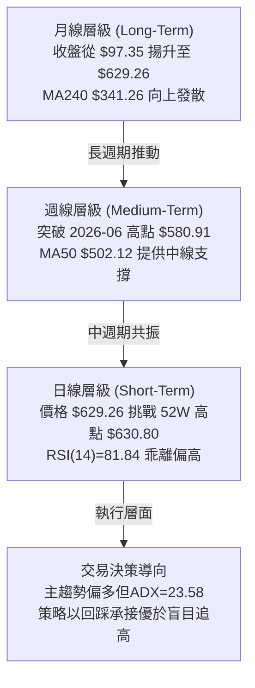
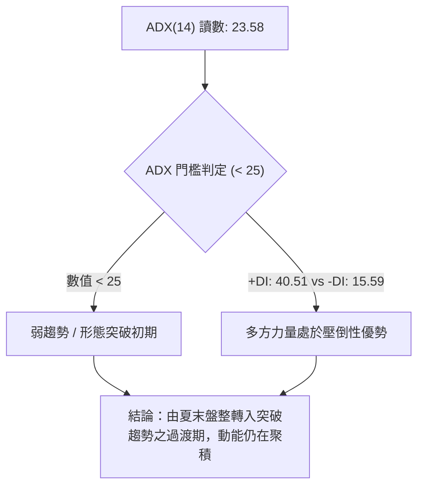
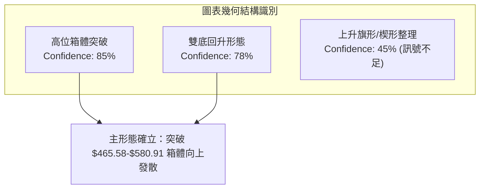
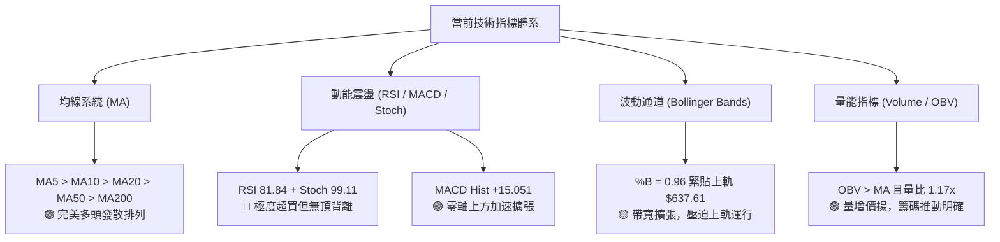
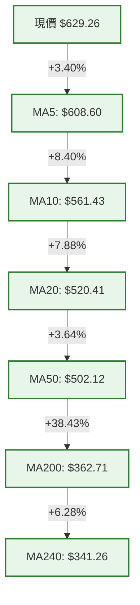
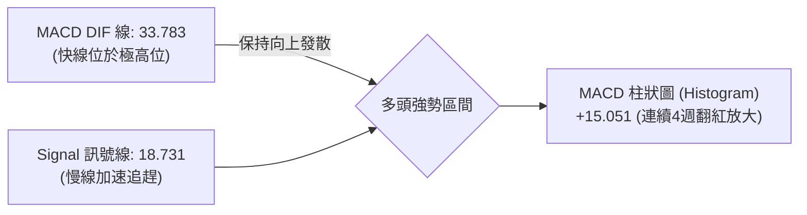
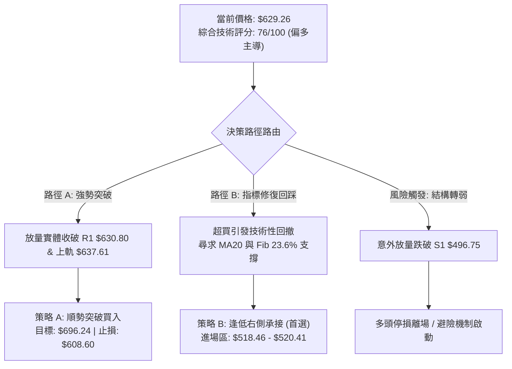
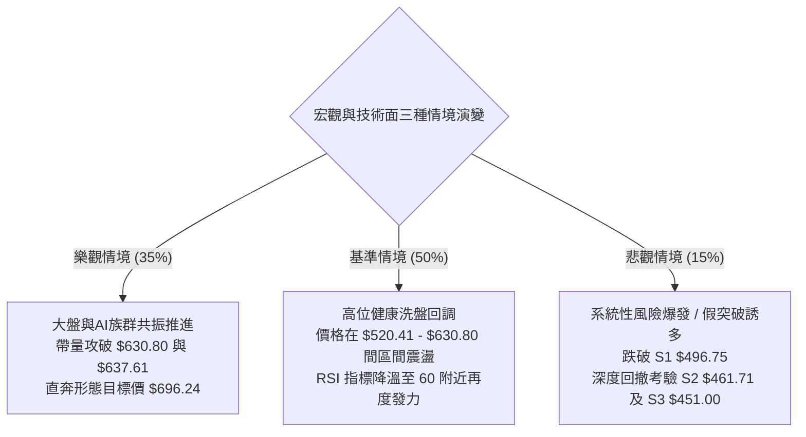

# AMD 技術分析報告

> **報告日期**：2026-09-25 ｜ **語言**：繁體中文 ｜ **數據來源**：Yahoo Finance ｜ **當前價格**：$629.26

---

## 目錄

| 章節 | 內容 |
|------|------|
| [1. 技術面概覽](#1-技術面概覽) | 訊號儀表板、核心指標、評分卡 |
| [2. 趨勢分析](#2-趨勢分析) | 多時框趨勢、長中短期走勢 |
| [3. 圖表形態分析](#3-圖表形態分析) | 形態識別、K線組合、目標價 |
| [4. 支撐與阻力](#4-支撐與阻力) | 關鍵價位、斐波那契回調 |
| [5. 技術指標深度解讀](#5-技術指標深度解讀) | MA/RSI/MACD/布林/成交量 |
| [6. 動能與波動率](#6-動能與波動率) | 動能評估、ATR、Beta |
| [7. 多時框架總結](#7-多時框架總結) | 時框架評分矩陣 |
| [8. 交易策略建議](#8-交易策略建議) | 多空策略、風險報酬比 |
| [9. 風險提示與監控](#9-風險提示與監控) | 監控指標、風險場景 |
| [10. 報告總結](#-報告總結) | 核心結論與最佳機會 |

---

## 1. 技術面概覽

### 🎯 技術訊號儀表板



---

### 📊 核心指標速覽表

| 指標類別 | 指標名稱 | 當前數值 | 訊號 | 解讀 |
|:---|:---|:---:|:---:|:---|
| **價格** | 當前價格 | $629.26 | 🟢 | 逼近 52 週最高點 $630.80（位於 99.7% 分位），強多頭格局 |
| **均線** | MA20 | $520.41 | 🟢 | 股價高於 MA20 達 +20.92%，短期均線斜率陡峭向上 |
| **均線** | MA50 | $502.12 | 🟢 | 股價高於 MA50 達 +25.32%，中期多頭趨勢堅挺 |
| **均線** | MA200 | $362.71 | 🟢 | 股價高於 MA200 達 +73.49%，長期結構處於大牛市週期 |
| **動能** | RSI(14) | 81.84 | 🔴 | 進入極端超買區間（>70），短線存在均值回歸風險 |
| **動能** | MACD (12,26,9) | 33.783 | 🟢 | DIF 線大幅穿越 Signal 線（18.731），多頭動能強烈擴張 |
| **動能** | MACD Hist | +15.051 | 🟢 | 柱狀體持續擴大，多方動能連續 4 週顯著增強 |
| **動能** | Stoch %K / %D | 99.11 / 97.74 | 🔴 | 雙線嚴重鈍化於極限高位，短線追高盈虧比收窄 |
| **趨勢** | ADX (14) | 23.58 | 🟡 | 數值低於 25，顯示當前波段為盤整後剛啟動之過渡態 |
| **波動** | ATR(14) | $26.87 | 🟡 | 每日平均震幅達 4.27%，波動幅度大，需擴大止損容忍度 |
| **通道** | 布林 %B | 0.96 | 🟡 | 貼近布林上軌（$637.61），進入通道極限壓制區間 |
| **成交量** | 量比 (vs 20MA) | 1.17x | 🟢 | 單日量 25.26M 高於 20日均量 21.56M，帶量挑戰前高 |

---

### 🏆 技術評分卡

```
╔══════════════════════════════════════════════════════════════════╗
║                   技術評分卡 — AMD (2026-09-25)                 ║
╠══════════════════════════════════════════════════════════════════╣
║ 趨勢強度 (Trend)     ██████████████░░░░░░  70/100  🟢 偏多強勁   ║
║ 動能指標 (Momentum)  ████████████░░░░░░░░  60/100  🟡 超買警示   ║
║ 支撐穩定度 (Support) ██████████████░░░░░░  72/100  🟢 多重平台   ║
║ 成交量配合 (Volume)  ████████████████░░░░  80/100  🟢 OBV量價配合║
║ 形態完整度 (Pattern) ██████████████░░░░░░  74/100  🟢 突破結構   ║
║ 均線排列 (MAs)       ████████████████████ 100/100  🟢 完美多頭   ║
╠══════════════════════════════════════════════════════════════════╣
║ 綜合評分             ███████████████░░░░░  76/100  🟢 偏多主導   ║
╚══════════════════════════════════════════════════════════════════╝
```

---

## 2. 趨勢分析

### 🌐 多時框趨勢分析



---

### 📈 長期趨勢 — 12個月走勢圖（Unicode）

```
AMD 月線收盤走勢圖（2025-10 至 2026-09）
價格 ($)
$650 ┤                                                         ● $629.26 (現價/挑戰高點)
$600 ┤                                            ● $580.91
$550 ┤                                           / \
$500 ┤                                ● $516.10 /   \     ● $470.72
$450 ┤                               /         /     \   /
$400 ┤                              /         /       ●-● $476.15
$350 ┤                    ● $354.49/
$300 ┤                   /
$250 ┤ ● $256.12        /
$200 ┤  \   ● $214.16  /   ● $200.21
$150 ┤   \-/         \-/   /
$100 ┤    ● $217.53   ●---● $203.43
     └─┬──────┬──────┬──────┬──────┬──────┬──────┬──────┬──────┬──────┬──────┬──────┬───
     25-10  25-11  25-12  26-01  26-02  26-03  26-04  26-05  26-06  26-07  26-08  26-09
```

#### 走勢特徵分析表格

| 階段區間 | 起止月份 | 價格變動區間 | 累積漲跌幅 | 走勢結構與技術特徵 |
|:---|:---:|:---:|:---:|:---|
| **第一階段：高位盤整** | 2025-10 ~ 2026-03 | $256.12 → $203.43 | -20.57% | 於 $200.00 ~ $256.00 形成大型吸籌箱體，回踩測試長期均線支撐。 |
| **第二階段：主升推動** | 2026-03 ~ 2026-06 | $203.43 → $580.91 | +185.56% | 爆發性單邊主升浪，成交量顯著推升，接連突破歷史多個整數心理關卡。 |
| **第三階段：中期洗盤** | 2026-06 ~ 2026-08 | $580.91 → $470.72 | -18.97% | 週線級別正常技術回踩，於 S2（$461.71）上方形成紮實底部支撐平台。 |
| **第四階段：突破測試** | 2026-08 ~ 2026-09 | $470.72 → $629.26 | +33.68% | 快速連陽拔高，直接越過前高 $580.91，測試 52 週頂部 $630.80。 |

---

### 📊 中期趨勢（週線分析）

```
近 20 週收盤走勢與區間震盪示意圖
$640 ┤                                                    ★ $629.26 (現價)
$600 ┤                                            /
$560 ┤                        ▲ $557.89          / ▲ $559.82
$520 ┤          ▲ $516.10    /  \      ▲ $521.95/ /
$480 ┤    ▲ $467.51 \       /    \    /   \     / /
$440 ┤ ▲ /           ▼ $466.38    ▼ $495.76▼ $476.15 
$400 ┤● $424.10                                   ▼ $465.58 (底部雙重支撐點)
     └─┬─────┬─────┬─────┬─────┬─────┬─────┬─────┬─────┬─────┬─────
     05-17 05-31 06-14 06-28 07-12 07-26 08-09 08-23 09-06 09-27
```

從近 20 週的收盤軌跡觀察，AMD 在經歷了 2026 年 6 月至 8 月的寬幅震盪整理（$465.58 ~ $557.89）後，於 2026 年 9 月初（$465.58 - $477.57 區間）獲得極強量能支撐，週線拉出強勢三連陽，並以 $629.26 強勢突破 2026-06-21 的週收盤高點 $537.37 與 2026 年 6 月月線高點 $580.91。

---

### ⚡ 趨勢強度評估（ADX 解讀）



#### ADX 指標強度對照分析

| 指標變數 | 當前讀數 | 門檻區間 | 技術含義解讀 |
|:---|:---:|:---:|:---|
| **ADX(14)** | **23.58** | < 25 | 趨勢強度尚在孕育。由於股價過去 8 週剛經歷 $465 ~ $557 的震盪，ADX 呈現落後反應，尚未越過 25 強趨勢門檻。 |
| **+DI (Positive)** | **40.51** | > 25 (高位) | 多方力量極度充沛，主導了過去 4 週的單邊快速拉升。 |
| **-DI (Negative)** | **15.59** | < 20 (低位) | 空方拋壓微弱，目前市場未見有組織的做空力道。 |
| **多空差值 (+DI - -DI)**| **+24.92** | > 0 | 多頭淨優勢顯著，預示一旦 ADX 向上突破 25，將迎來單邊趨勢主升段。 |

---

## 3. 圖表形態分析

### 🔍 形態識別系統



#### 形態識別與信心度評估表

| 形態類別 | 信心度 | 判斷依據（引用數據） | 完成度 | 目標價（附嚴謹計算式） |
|:---|:---:|:---|:---:|:---|
| **箱體突破 (Box Breakout)** | **85%** | 股價向上衝破 2026 年 6 月收盤高點 $580.91，脫離 2026-08 低點 $465.58 形成的整理箱體。 | 100% | 箱體高度 = $580.91 - $465.58 = $115.33。<br/>**目標價 = $580.91 + $115.33 = $696.24** |
| **雙重底 (Double Bottom)** | **78%** | 兩次波段低點分別為 2026-08-02 的 $476.15 與 2026-08-30 的 $465.58，頸線為 2026-08-16 高點 $514.39。 | 100% | 形態深度 = $514.39 - $465.58 = $48.81。<br/>**最小目標價 = $514.39 + $48.81 = $563.20（已達成）** |
| **上升旗形 (Bull Flag)** | **45%** | 數據顯示 9 月斜率過於垂直（連續拉陽），旗面回撤結構不足 3 週。 | 35% | *訊號不足，僅做指標型超買解讀，不預設此形態目標價。* |

---

### 🕯️ 重要K線形態分析

| 週/月份 | 收盤價 | K線形態名稱 | 結構特徵與解讀 | 訊號屬性 |
|:---:|:---:|:---:|:---|:---:|
| **2026-08-30** | $465.58 | 長下影探底錘頭線 | 測試近一年波段低點聚類 S2（$461.71）未破，量能收縮，空方動能耗盡。 | 🟢 築底確認 |
| **2026-09-13** | $516.13 | 突破型大陽線 | 一舉收復 MA20（$520.41 附近）與斐波那契 23.6%（$518.46），MACD柱由負轉正。 | 🟢 動能轉強 |
| **2026-09-20** | $559.82 | 光頭推進中長陽 | 站穩 $550 水平，直接摧毀空方防線，成交量增至 124.59M 週成交。 | 🟢 主升推動 |
| **2026-09-27** | $629.26 | 逼近前高光頭陽線 | 收盤價 $629.26 距 52W 高點 $630.80 僅差 $1.54，實體長且無顯著上影線。 | 🟢 衝刺測試 |

---

### 📉 ASCII 走勢形態示意圖

```
AMD 箱體震盪突破結構示意圖
$696.24 ----------------------------------------------- 形態量度目標價 (Box Height + Breakout)
                                                      /
$630.80 ------------------------------------┬--------● 52週高點 / 阻力測試中 ($629.26)
                                            │       /
$580.91 -----------------------------┌──────┴──────/-- 箱體頂部頸線 (已放量突破)
                                     │            /
$520.41 -----------------------------┼-----------/---- MA20 / 中樞軸心
        │                            │          /
$465.58 ┴─────────●──────────────────┴─────────/------ 箱體底部雙底支撐 (2026-08-30)
                 底1                 底2
             ($476.15)           ($465.58)
```

---

### 🎯 形態目標價計算

依據傳統道氏理論與經典形態學量度規則進行推算：
1. **箱體等距測幅**：
   - 箱體頂部頸線：$580.91（2026 年 6 月月線收盤點）
   - 箱體底部支撐：$465.58（2026 年 8 月收盤低點）
   - 形態垂直垂直高度 $H = 580.91 - 465.58 = 115.33$
   - 向上突破量度延伸點：$580.91 + 115.33 = \mathbf{\$696.24}$
2. **達成狀態判定**：
   - 早期雙底最小目標 $563.20 已於 2026-09-20 完全超越。
   - 目前價格 $629.26 正在消耗 52W 高點 $630.80 之心理阻力，若實體K線有效站上 $637.61（布林上軌），形態目標價 $696.24 將成為中期延伸目標。

---

## 4. 支撐與阻力

### 🗺️ 關鍵價位分布圖（Unicode）

```
AMD 價位結構分布圖
═══════════════════════════════════════════════════════════════════
$696.24 ║████████████████████████████████║ 形態量度推算阻力 (Box + Height)
$637.61 ║████████████████████            ║ 布林動態壓制上軌 (BB Upper)
$630.80 ║████████████████████████████████║ 52週歷史高點 / 0.0% 斐波那契
$629.26 ╠════════════════════════════════╣ ◄ 當前市價 ($629.26)
$520.41 ║▓▓▓▓▓▓▓▓▓▓▓▓▓▓▓▓▓▓▓▓            ║ 動態支撐 MA20 / 布林中軌
$518.46 ║▓▓▓▓▓▓▓▓▓▓▓▓▓▓▓▓▓▓▓▓▓▓          ║ 斐波那契 23.6% 回調關鍵位
$496.75 ║▓▓▓▓▓▓▓▓▓▓▓▓▓▓▓▓▓▓▓▓▓▓▓▓        ║ 波段關鍵支撐 S1 (-21.06%)
$461.71 ║████████████████████████████████║ 強固波段底聚類 S2 (-26.63%)
$451.00 ║████████████████████████████████║ 結構防守底線 S3 (-28.33%)
═══════════════════════════════════════════════════════════════════
```

---

### 🚧 阻力位分析表

依據數據庫原始 OHLCV 計算結果，目前**在當前價格上方未偵測到近一年波段高點聚類（no swing-high resistance detected above current price）**。上方阻力由 52W 高點、布林上軌及形態測算推導：

| 阻力級別 | 價位 | 形成依據與計算來源 | 突破難度 | 技術重要性 |
|:---|:---:|:---|:---:|:---:|
| **R1 (即時阻力)** | **$630.80** | 52週歷史最高點（52W High），與現價僅距 $1.54（+0.24%）。 | 🟡 中等 | 歷史心理關卡，需帶量突破以開啟無套牢盤天花板空間。 |
| **R2 (動態壓制)** | **$637.61** | 日線布林通道上軌（BB Upper Band），當前 %B 達 0.96。 | 🔴 較高 | 統計學 2 倍標準差壓力，短線未見盤整前極難連續站上。 |
| **R3 (形態目標)** | **$696.24** | 箱體突破推算高度（$580.91 + $115.33）。 | 🔴 嚴峻 | 中期多頭延伸量度目標，需大盤配合與量能持續擴張。 |

---

### 🛡️ 支撐位分析表

| 支撐級別 | 價位 | 形成依據與計算來源 | 守住機率 | 技術重要性 |
|:---|:---:|:---|:---:|:---:|
| **動態防守** | **$520.41** | 日線 MA20 均線位置暨布林通道中軌（BB Mid）。 | 85% | 短期多頭生命線，回踩不破代表強勢攻擊波未終結。 |
| **S1 (首要波段)** | **$496.75** | 近一年波段低點聚類 S1（距現價 -21.06%）。 | 80% | 跌破此位意味著日線級別多頭結構遭破壞，進入深度回撤。 |
| **S2 (核心支撐)** | **$461.71** | 近一年波段低點聚類 S2（距現價 -26.63%）。 | 90% | 8月波段低點聚類區域（$465.58-$470.72），中期防守鐵底。 |
| **S3 (極限防線)** | **$451.00** | 近一年波段低點聚類 S3（距現價 -28.33%）。 | 95% | 跌破此位將直接考驗 MA200（$362.71），多頭牛市架構瓦解點。 |

---

### 📐 斐波那契回調位分析

基準計算區間為 52 週低點 **$154.78** 至 52 週高點 **$630.80**，垂直波動空間為 **$476.02**：

```
斐波那契回調結構階梯圖
 0.0% ── $630.80 ◄ [52W High] (當前價 $629.26 緊貼此線)
         │
23.6% ── $518.46 ◄ [黃金回撤第一支撐，與 MA20 $520.41 形成重疊共振區]
         │
38.2% ── $448.96 ◄ [與波段支撐 S3 $451.00 高度重合]
         │
50.0% ── $392.79 ◄ [多空分水嶺]
         │
61.8% ── $336.62 ◄ [強支撐區，接近 MA240 $341.26]
         │
78.6% ── $256.65 ◄ [歷史密集換手平台]
         │
100.0% ── $154.78 ◄ [52W Low]
```

#### 斐波那契回調位解讀
1. **現價區間定位**：現價 $629.26 處於 **0.0%（$630.80）至 23.6%（$518.46）** 的極限頂部區間。股價處於 52 週區間的 99.7% 分位，為純粹的多方強勢主導。
2. **多重共振支撐帶**：斐波那契 23.6% 回調位 **$518.46** 與日線 MA20 **$520.41** 僅差 $1.95，構成強大的「指標-均線共振支撐區」。任何健康的多頭回踩若維持在 $518.46 以上，整體上漲架構完好無損。
3. **第二防禦縱深**：斐波那契 38.2% 位 **$448.96** 與 S3（$451.00）緊密靠攏，為中期極限回撤容忍邊界。

---

## 5. 技術指標深度解讀

### 🎛️ 指標訊號總覽



---

### 📈 移動平均線排列分析



#### 均線發散狀態詳細數據表

| 均線名稱 | 當前價格 | 與現價距離 (%) | 走勢微觀排列特徵 | 訊號評級 |
|:---|:---:|:---:|:---|:---:|
| **MA5** | $608.60 | +3.40% | 極陡峭向上發散，提供極短線日內第一道動態緩衝 | 🟢 極強 |
| **MA10** | $561.43 | +12.08% | 快速上揚，上穿所有中長期均線，短多防線 | 🟢 看多 |
| **MA20** | $520.41 | +20.92% | 月線級別生命線，維持強勁仰角走升 | 🟢 看多 |
| **MA60** | $507.78 | +23.92% | 與 MA50 形成雙重支撐平台，趨勢堅定 | 🟢 看多 |
| **MA120**| $462.15 | +36.16% | 半年線持續穩健爬升，確認中期轉折成功 | 🟢 看多 |
| **MA200**| $362.71 | +73.49% | 牛熊分界線遠遠拋在下方，長期牛市基石 | 🟢 看多 |

**排列總結**：呈現最標準的多頭排列（$MA5 > MA10 > MA20 > MA50 > MA60 > MA120 > MA200 > MA240$）。當前股價高於 MA20 達 20.92%，短期均線乖離率顯著偏高，有等待 MA5 與 MA10 跟進的技術性需求。

---

### 📉 RSI(14) 分析

```
RSI(14) 讀數儀表：81.84 (極度超買)
0       20        40        60   70   80   100
├────────┼─────────┼─────────┼────┼────┼────┤
[                 正常震盪區間          ]▓▓▓█
                                        ▲ 81.84
進度條：████████████████░░░░ 81.84% (超買閾值: 70.0)
```

1. **超買超賣判定**：RSI(14) 來到 **81.84**，進入 >80 的嚴重超買極值區。歷史數據表明，當 AMD 的 RSI 超過 80 時，通常伴隨短期高位劇烈洗盤或橫向鈍化震盪。
2. **背離分析（Divergence）**：
   - 檢視近 4 週週線收盤與 RSI 軌跡：
     - 2026-09-06 收盤 $477.57 ➜ 週 RSI 40.1
     - 2026-09-13 收盤 $516.13 ➜ 週 RSI 62.6
     - 2026-09-20 收盤 $559.82 ➜ 週 RSI 73.1
     - 2026-09-27 收盤 $629.26 ➜ 週 RSI 81.8
   - **背離結論**：價格創 52 週新高，RSI 亦同步刷新本輪反彈新高，**「無頂背離現象」**。動能與價格同向推進，代表上漲屬於主升推動浪，而非動能竭盡的虛漲。

---

### 📊 MACD(12,26,9) 訊號解讀



#### MACD 結構解讀
- **差離值放大**：DIF（33.783）與 Signal（18.731）的正乖離高達 **+15.051**，柱狀圖呈現爆發性增長（近四週分別為 +0.139 ➜ +6.512 ➜ +8.427 ➜ +15.051）。
- **零軸關係**：雙線運行於零軸之上深處，且柱體無收縮跡象，確認多方享有絕對的盤面定價權。
- **背離檢驗**：MACD 柱狀體與快慢線同步走高，未見任何頂背離衰竭徵兆。

---

### 📦 布林通道分析

```
AMD 布林通道運行結構圖（日線週期）
$650 ┤                                      ▲ BB Upper: $637.61
$630 ┤                                 ●─── 現價: $629.26 (%B = 0.96)
$610 ┤
$590 ┤
$570 ┤
$550 ┤
$530 ┤                        ───────────── MA20 (中軌): $520.41
$510 ┤
$490 ┤
$470 ┤
$450 ┤
$430 ┤
$410 ┤
$390 ┤                                      ▼ BB Lower: $403.21
```

- **通道帶寬與參數**：
  - **上軌 (Upper Band)**：**$637.61**
  - **中軌 (Middle Band / MA20)**：**$520.41**
  - **下軌 (Lower Band)**：**$403.21**
  - **通道帶寬 (Bandwidth)**：$(637.61 - 403.21) / 520.41 = 45.04\%$（劇烈張口）
- **%B 指標狀態**：當前 %B 為 **0.96**，意味著現價已經貼近上軌（0.0 代表下軌，0.5 代表中軌，1.0 代表上軌）。價格正沿著「布林帶外側」強勢攀升（Walking the Bands）。依照統計常態分布，當價格接近上軌 $637.61 時，通常會引發均值回歸的牽引力，回測中軌 $520.41。

---

### 💹 成交量分析（量價配合度）

1. **成交量放量比**：
   - 最新單日成交量：**25,259,300 股**
   - 20日移動平均量：**21,564,805 股**
   - **量比 (Volume Ratio)**：$25,259,300 / 21,564,805 = \mathbf{1.17x}$
   - 解讀：衝刺突破 52 週高點伴隨了超越均量 17% 的活躍度，屬於良性突破量能。
2. **OBV (能量潮指標) 解讀**：
   - 數據狀態：**OBV > MA（OBV 線高於其自身移動平均線）**。
   - 解讀：資金流向呈現持續淨流入，證明機構籌碼在過去 4 週的拉升過程中屬於淨買超，無主力暗中出貨跡象，量能有效確認了價格突破的有效性。

---

## 6. 動能與波動率

### ⚡ 動能評估四象限

```
動能與波動率矩陣分佈
    高波動 (High Volatility)
        │
   Q4   │   Q3 [AMD 當前位置]
 弱動能 │   強動能 / 高波動 (高爆發、高風險)
 高波動 │   - ATR = $26.87 (4.27%)
        │   - Beta = 2.476
────────┼────────────────────────── 動能 (Momentum)
   Q2   │   Q1
 弱動能 │   強動能 / 低波動 (最佳低吸區)
 低波動 │   
        │
    低波動 (Low Volatility)
```

| 象限代號 | 動能維度 | 波動維度 | 狀態特徵 | AMD 當前狀態與操作策略 |
|:---:|:---:|:---:|:---:|:---|
| **Q1** | 強 | 低 | 穩健上攻 | 適合大資金建倉的低波動趨勢期（非當前狀態）。 |
| **Q2** | 弱 | 低 | 縮量盤整 | 謹慎觀望，等待突破（如同 2026-08 築底期）。 |
| **Q3** | **強** | **高** | **爆發衝刺** | **✓ 當前 AMD 處於此區**。強勢主升但波動劇烈，需提防高震幅洗盤。 |
| **Q4** | 弱 | 高 | 恐慌拋售 | 避免進場，通常為熊市暴跌段。 |

---

### 📊 ATR 波動率分析

- **ATR(14) 實體讀數**：**$26.87**
- **價格波動率百分比**：$\$26.87 / \$629.26 = \mathbf{4.27\%}$
- **動態交易距離設置指引**：
  - **日內安全防護距離 (1.0 × ATR)**：**$26.87**。日內交易若進場，止損不宜小於此範圍以防隨機雜訊掃單。
  - **短線防守止損距離 (1.5 × ATR)**：$1.5 \times 26.87 = \mathbf{\$40.31}$。以現價 $629.26 設算，短線動態追蹤止損位約為 **$588.95**。
  - **波段保護止損距離 (2.0 × ATR)**：$2.0 \times 26.87 = \mathbf{\$53.74}$。中線防守保護位設於 **$575.52**（恰好座落於前高 $580.91 附近，極具結構支撐意義）。

---

### 📐 Beta 與市場相關性

- **Beta 係數**：**2.476**
- **市場敏感性評估**：
  - AMD 的 Beta 達 2.476，屬於超高彈性半導體晶片個股。這意味著當標普 500 指數或那斯達克 100 指數變動 1.0% 時，AMD 平均產生約 **2.48%** 的同向波動。
  - **系統性風險考量**：在當前 RSI 極度超買（81.84）背景下，若大盤出現微幅回檔，AMD 隨時可能引發 5%~10% 的劇烈回撤震盪，部位管理必須限制槓桿使用。

---

## 7. 多時框架總結

### 📋 時框架評分表

| 時框架 | 趨勢方向 | 動能狀態 | 均線排列 | 形態特徵 | 綜合評分 | 操作指導建議 |
|:---|:---:|:---:|:---:|:---:|:---:|:---|
| **月線 (長週期)** | 🟢 多頭 | 🟢 極強 | 🟢 多頭發散 | 24個月大雙底主升浪突破 | **92/100** | 長線堅定持股，忽視短期雜訊。 |
| **週線 (中週期)** | 🟢 多頭 | 🟢 擴張 | 🟢 多頭排列 | 突破 $580.91 箱體頸線 | **85/100** | 趨勢確立，逢低回踩佈局波段倉位。 |
| **日線 (短週期)** | 🟢 偏多 | 🔴 超買 | 🟢 完美排列 | 逼近 52W 高點 $630.80 | **68/100** | 短線禁止追高，留意回測 MA20 風險。 |
| **日內 (極短線)** | 🟡 震盪 | 🔴 鈍化 | 🟢 乖離過大 | 壓迫布林上軌 $637.61 | **58/100** | 適合日內做 T，不宜過夜追多單。 |

---

### 🔲 綜合訊號矩陣

```
訊號維度對照矩陣
時框      趨勢訊號    均線排列    動能指標    量價配合    多空收斂判定
────────────────────────────────────────────────────────────
長期(月)  🟢 多頭     🟢 多頭     🟢 看多     🟢 充足     🟢 絕對多頭
中期(週)  🟢 多頭     🟢 多頭     🟢 看多     🟢 放量     🟢 趨勢推進
短期(日)  🟢 多頭     🟢 多頭     🔴 超買     🟢 配合     🟡 警惕回踩
────────────────────────────────────────────────────────────
收斂共振：中長期牛市完全確認，短期面臨技術指標極度超買修復
```

---

### ⚖️ 多時框收斂結論

依據技術分析規範（嚴格要求 14）：
1. **行情性質判定**：當前 ADX(14) 讀數為 **23.58（ADX < 25）**，技術定義上屬於**「盤整脫離初期 / 尚未形成完全成熟單邊趨勢」**的過渡狀態。
2. **多時框權重取捨**：雖然日線指標出現 RSI=81.84 與 Stoch=99.11 的極限超買警示，但週線與月線之 MA50（$502.12）、MA200（$362.71）均呈現標準多頭發散，且 +DI（40.51）完勝 -DI（15.59）。依照規則，交易策略**以日線布林通道上下軌（$403.21 ~ $637.61）為主要震盪防護邊界**，並以週線級別方向收斂。
3. **唯一收斂方向**：**【偏多主導，但拒絕現價追高，嚴守回調支撐進場】**。

---

## 8. 交易策略建議

### 🗺️ 策略決策流程圖



---

### 🧭 策略路由（依評分卡分流）

> **當前主策略方向 = 【主推多頭策略（逢低做多為主）】（依據評分 76/100）**
> 
> 因綜合技術評分高於 60 分（76/100），多頭排列完美且量能配合，報告主推多頭策略；空頭僅作為風險反轉點防範，不建議主動重倉放空。

---

### 🎯 價格情境階梯（Price Scenarios）

價位嚴格引用技術數據庫計算之精確點位：

| 觸發條件 | 下一目標價位 | 後續延伸位置 | 技術情境含義解讀 |
|:---|:---:|:---:|:---|
| **突破 52W 高點 $630.80** | **$637.61** (BB上軌) | **$696.24** (形態目標) | 短線極強勢加速噴出，進入無套牢盤歷史真空區。 |
| **受阻於 $630.80 進入盤整** | **$608.60** (MA5) | **$561.43** (MA10) | 展開高位良性旗形整理，消化 RSI 超買技術指標。 |
| **跌破動態中軌 $520.41** | **$496.75** (S1支撐) | **$461.71** (S2支撐) | 短線強勢格局終結，轉為中級波段深度回撤。 |

---

### 📊 情境機率分佈

| 預測情境 | 發生機率 | 主要判定技術依據 |
|:---|:---:|:---|
| **情境一：高位震盪後回踩尋求支撐** | **50%** | RSI(14) 達 81.84 極度超買，%B 達 0.96 逼近上軌 $637.61，ADX=23.58 顯示單邊趨勢仍需洗盤蓄勢。 |
| **情境二：帶量直接突破 52W 高點逼空** | **35%** | MACD 柱狀體高達 +15.051，+DI 高達 40.51，OBV 顯示買盤籌碼堅定，具備短線逼空動能。 |
| **情境三：深度見頂反轉下跌** | **15%** | 均線系統呈完美多頭排列，下檔有多重波段支撐聚類（S1: $496.75, S2: $461.71），暴跌機率偏低。 |

---

### 🟢 主策略詳情

#### 策略 A（保守首選：均線共振支撐回踩承接）與 策略 B（激進次選：突破跟進）

| 策略要素 | 策略 A (回踩承接 — 最佳盈虧比) | 策略 B (強勢突破 — 動能追擊) |
|:---|:---:|:---:|
| **策略定位** | 逢低佈局波段多單（推薦） | 右側動能突破買入 |
| **進場條件** | 價格回測 MA20 與 Fib 23.6% 出現止跌K線 | 日K收盤價實體突破 52W 高點 $630.80 |
| **精確進場點** | **$520.41**（MA20 / Fib 23.6% $518.46 區間） | **$631.50**（確認突破 $630.80 站穩） |
| **第一目標價 T1** | **$580.91**（原箱體頸線位置） | **$637.61**（布林帶上軌） |
| **第二目標價 T2** | **$630.80**（52週高點測試） | **$696.24**（箱體量度目標） |
| **保護止損價** | **$496.00**（略低於 S1 關鍵位 $496.75） | **$608.60**（跌破 MA5 動態支撐即走） |
| **風險額度 (Risk)** | $520.41 - $496.00 = **$24.41** | $631.50 - $608.60 = **$22.90** |
| **潛在報酬 (Reward)**| 至 T2: $630.80 - $520.41 = **$110.39** | 至 T2: $696.24 - $631.50 = **$64.74** |
| **風險報酬比 (R:R)**| **1 : 4.52** (優異) | **1 : 2.83** (良好) |
| **預估成功率** | **70%** | **55%** |
| **建議倉位上限** | **15% - 20%** 總資產 | **5% - 8%** 總資產（輕倉試單） |

---

### 🔴 反向風險觸發點（對沖提示）

若市場出現以下極端反轉訊號，原多頭邏輯全部推翻，應立即執行防禦措施：
1. **反轉破位價**：**收盤實體跌破 S1（$496.75）**。此舉意味著 MA20（$520.41）失守且跌穿中樞，多頭攻擊架構瓦解。
2. **量能異動訊號**：單日成交量突破 50,000,000 股（兩倍均量）卻收出長上影倒錘頭線，或長黑K線吞噬前 3 天漲幅。
3. **風控行動**：跌破 $496.75 應無條件平倉多頭頭寸，中長線投資者應買入認沽期權（Put Option）避險，下方目標將直指 S2（$461.71）甚至 S3（$451.00）。

---

### ⭐ 整體訊號強度評星

```
╔══════════════════════════════════════════════════╗
║ 做多訊號強度：★★★★☆  (4/5星 — 趨勢多頭，超買待修復)║
║ 做空訊號強度：★☆☆☆☆  (1/5星 — 逆勢做空風險極大)  ║
║ 整體可信度：  ★★★★☆  (4/5星 — 均線與量價高度一致)║
╚══════════════════════════════════════════════════╝
```

---

## 9. 風險提示與監控

### ✅ 關鍵監控指標 Checklist

```
╔══════════════════════════════════════════════════════════════════╗
║                   每日交易風控核心監控清單                      ║
╠══════════════════════════════════════════════════════════════════╣
║ [ ] 52W 高點突破確認：日收盤是否站穩 $630.80 上方？            ║
║ [ ] 布林上軌壓制測試：是否在 $637.61 出現滯漲倒錘線？           ║
║ [ ] RSI(14) 降溫指標：RSI 是否自 81.84 回落至 70 以下超買修復？ ║
║ [ ] 生命線防守檢視：回調是否守住 MA20 ($520.41) 與 23.6% ($518.46)?║
║ [ ] 空方防線防守：波段支撐 S1 ($496.75) 是否保持完好？         ║
║ [ ] 量能連續性：量比是否維持在 1.0x 以上 (日均量 > 21.56M)？    ║
║ [ ] ADX 趨勢強度：ADX(14) 是否成功跨越 25.00 臨界點？           ║
╚══════════════════════════════════════════════════════════════════╝
```

---

### ⚠️ 風險場景分析



---

### 🛡️ 風險管理重要提醒

1. **ATR 劇烈震盪管理**：當前 AMD ATR 為 **$26.87（單日 4.27%）**，歷史 Beta 達 **2.476**。盤中常規波動極易觸發過窄的止損。建議單筆交易虧損金額嚴格限制在總帳戶淨值的 **1.0% ~ 1.5%** 以內。
2. **槓桿控制**：鑑於日線與週線 RSI 超買鈍化，切忌在 $629.00 以上使用保證金槓桿融資追買。
3. **加碼紀律**：僅在股價成功突破 $630.80 且回踩確認為支撐後，方可動用浮盈進行金字塔式加碼，不可在回踩過程中一路向下攤平。

---

## 📋 報告總結

```
╔══════════════════════════════════════════════════════════════════╗
║                   AMD 技術分析報告總結                          ║
╠══════════════════════════════════════════════════════════════════╣
║ 報告日期：2026-09-25                                             ║
║ 當前價格：$629.26                                                ║
║ 分析評級：🟢 強勢多頭（短線面臨指標超買修復，防守回踩支撐）       ║
║                                                                  ║
║ 關鍵結論：                                                       ║
║ ├─ 長期趨勢：🟢 強烈多頭（自 $97.35 啟動兩年大牛市，MA發散）      ║
║ ├─ 中期趨勢：🟢 突破確立（攻破 $580.91 頸線，週線三連陽）         ║
║ ├─ 短期趨勢：🟡 超買警戒（RSI 達 81.84，逼近 52W 高點 $630.80） ║
║ ├─ 關鍵支撐：S1: $496.75 ｜ MA20: $520.41 ｜ S2: $461.71        ║
║ ├─ 關鍵阻力：52W高: $630.80 ｜ BB上軌: $637.61 ｜ 形態: $696.24  ║
║ └─ 分析師共識目標：均價 $616.51（最高價 $1250.00 / 評級 Strong Buy）║
║                                                                  ║
║ 最優策略組合：                                                   ║
║ 1. 🥇 最佳機會（策略 A）：耐心等待回踩 MA20 與 Fib 23.6% 共振帶   ║
║    （$518.46 - $520.41）低吸，止損設於 $496.00，盈虧比高達 1:4.52║
║ 2. 🥈 次選機會（策略 B）：若強勢放量突破 $630.80，輕倉追擊至      ║
║    目標價 $696.24，嚴守 MA5 動態追蹤止損 $608.60                ║
║ 3. 🥉 保守選擇：維持現有長線底倉，暫停加碼，等待日線 RSI 回落     ║
║    至 60 附近再行擴大部位配置                                   ║
╚══════════════════════════════════════════════════════════════════╝
```

---

> ⚠️ **免責聲明**：本報告為技術分析專用模型生成之研究報告，所有關鍵價位、走勢分析均基於市場客觀歷史交易數據與經典量化公式計算。本報告**僅供研究與學術參考**，**不構成任何形式的投資要約或買賣建議**。金融市場瞬息萬變，投資具有高度風險，投資人應依個人財務狀況與風險承受能力審慎評估，並自負盈虧。

---

*報告生成時間：2026-09-25 ｜ 數據來源：Yahoo Finance ｜ 分析框架：多時框技術分析體系*