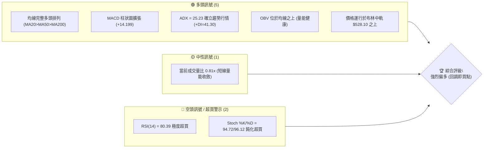
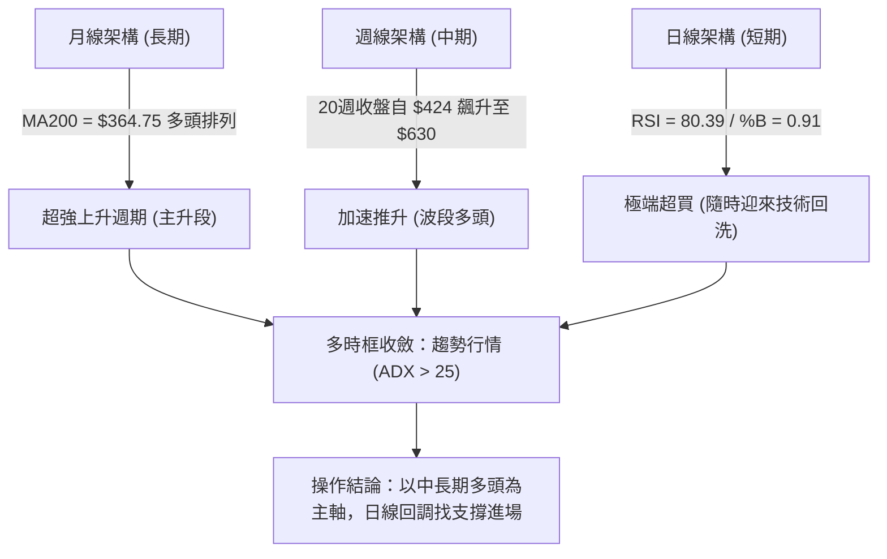
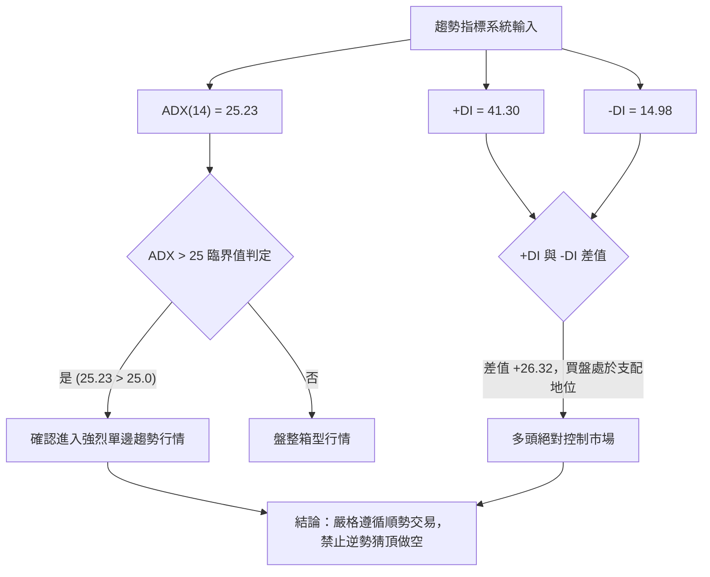
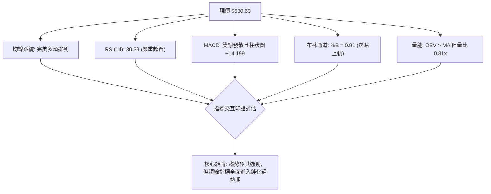
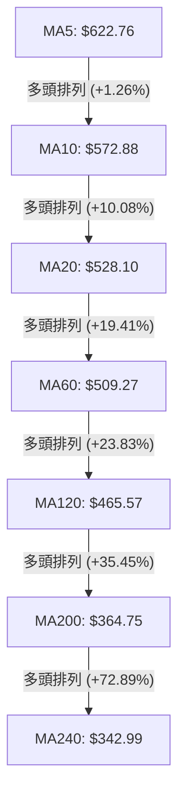
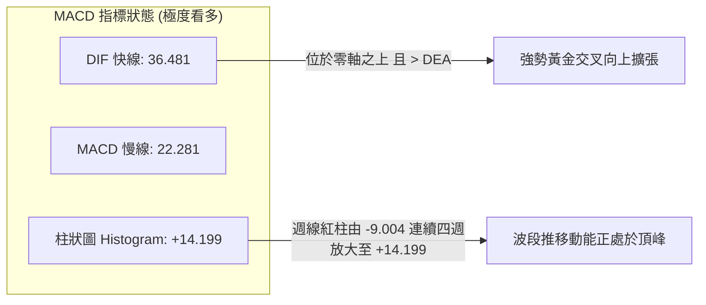
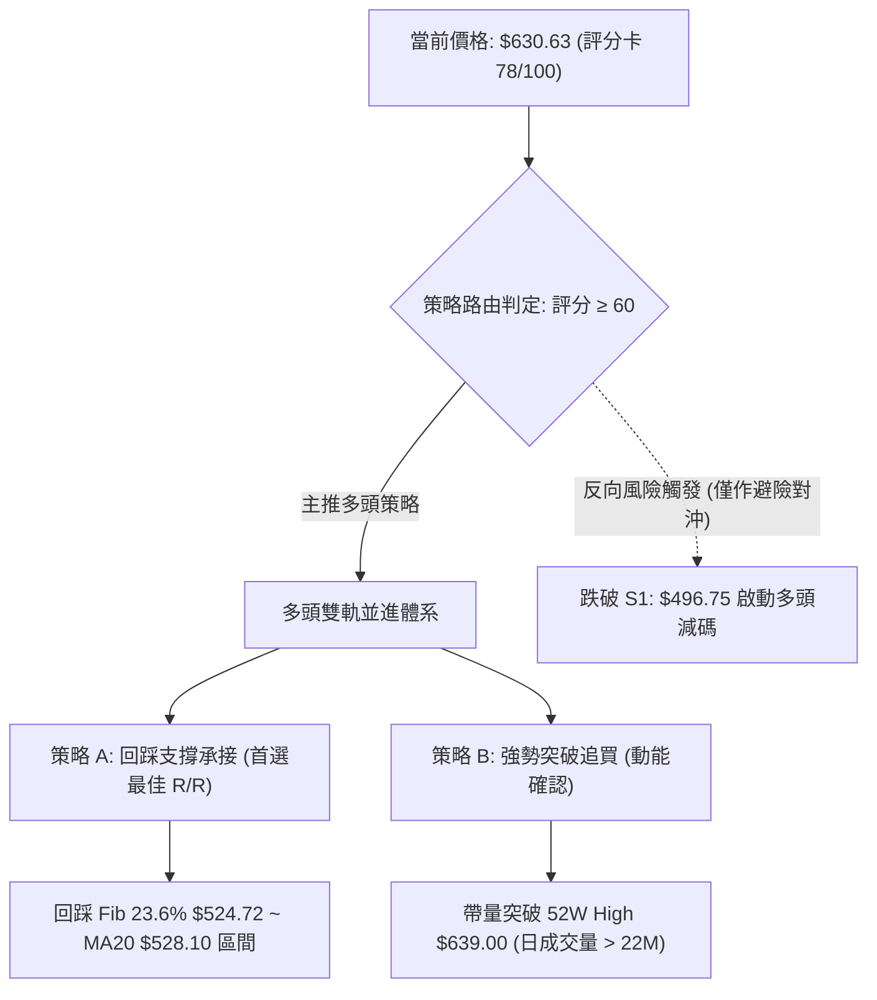
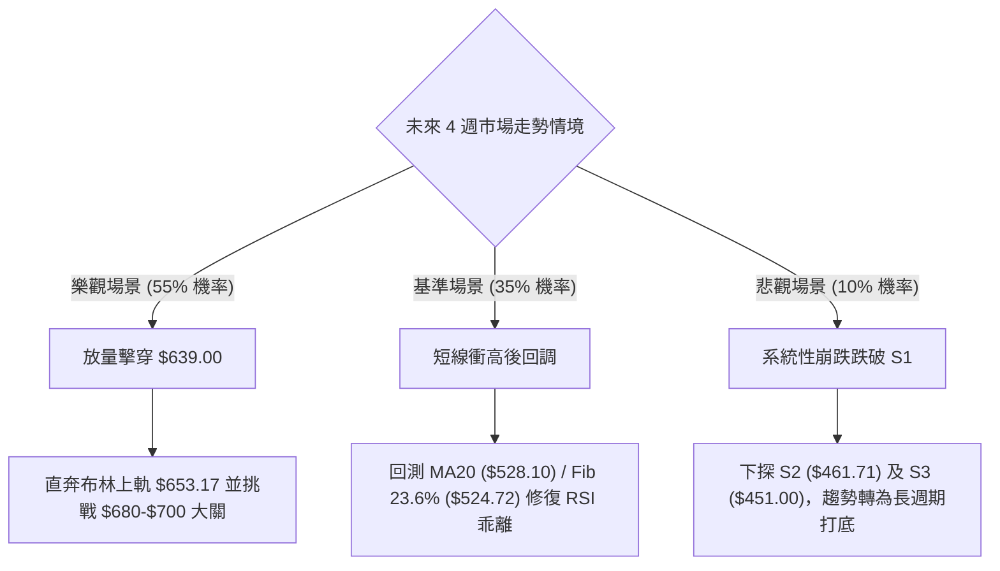

# AMD 技術分析報告

> **報告日期**：2026-09-26 ｜ **語言**：繁體中文 ｜ **數據來源**：Yahoo Finance ｜ **當前價格**：$630.63

---

## 目錄

| 章節 | 內容 |
|------|------|
| [1. 技術面概覽](#1-技術面概覽) | 訊號儀表板、核心指標、評分卡 |
| [2. 趨勢分析](#2-趨勢分析) | 多時框趨勢、長中短期走勢 |
| [3. 圖表形態分析](#3-圖表形態分析) | 形態識別、K線組合、目標價 |
| [4. 支撐與阻力](#4-支撐與阻力) | 關鍵價位、斐波那契回調 |
| [5. 技術指標深度解讀](#5-技術指標深度解讀) | MA/RSI/MACD/布林/成交量 |
| [6. 動能與波動率](#6-動能與波動率) | 動能評估、ATR、Beta |
| [7. 多時框架總結](#7-多時框架總結) | 時框架評分矩陣、收斂結論 |
| [8. 交易策略建議](#8-交易策略建議) | 主策略路由、情境階梯、風報比 |
| [9. 風險提示與監控](#9-風險提示與監控) | 監控指標、風險場景 |
| [📋 報告總結](#-報告總結) | 核心結論與策略配置總結 |

---

## 1. 技術面概覽

### 🎯 技術訊號儀表板



### 📊 核心指標速覽表

| 指標類別 | 指標名稱 | 當前數值 | 訊號 | 解讀 |
|----------|----------|----------|------|------|
| **價格** | 當前價格 | $630.63 | 🟢 強多 | 距離52週高點 $639.00 僅 1.3%，處於絕對強勢領跑區間 |
| **均線** | MA20 | $528.10 | 🟢 看多 | 現價高於 MA20 達 +19.41%，短多架構穩固 |
| **均線** | MA50 | $504.71 | 🟢 看多 | 現價高於 MA50 達 +24.95%，中期波段基底厚實 |
| **均線** | MA200 | $364.75 | 🟢 看多 | 現價高於 MA200 達 +72.89%，長期牛市格局無可動搖 |
| **動能** | RSI(14) | 80.39 | 🔴 超買 | 進入極度超買區（>70），短線具技術性回洗與高檔鈍化風險 |
| **動能** | MACD(12,26,9) | 36.481 / 22.281 | 🟢 看多 | 柱狀圖為 +14.199，雙線多頭發散且紅柱持續拉長 |
| **趨勢** | ADX(14) | 25.23 | 🟢 強趨勢 | 突破 25 臨界線，+DI(41.30) 遠高於 -DI(14.98)，買方絕對主導 |
| **通道** | 布林通道 %B | 0.91 | 🟡 警戒 | 逼近上軌 $653.17，開口向上擴張，處於極限推升段 |
| **量能** | 20日均量比 | 0.81x | 🟡 中性 | 當日量能略小於均量，高檔出現縮量推進特徵 |
| **波動** | ATR(14) | $26.21 | 🔴 高波動 | 每日波動幅度達 4.16%，持倉需保留足夠風險緩衝 |

### 🏆 技術評分卡

```
╔══════════════════════════════════════════════════════════════╗
║                 技術評分卡 — AMD (2026-09-26)                ║
╠══════════════════════════════════════════════════════════════╣
║ 趨勢強度 (ADX/+DI)    ████████████████░░░░  82/100   🟢 強多 ║
║ 動能指標 (MACD/RSI)   ████████████░░░░░░░░  65/100   🟡 超買 ║
║ 支撐穩定度 (波段低點)  ██████████████░░░░░░  72/100   🟢 穩固 ║
║ 成交量配合 (OBV/均量) ██████████████░░░░░░  70/100   🟢 配合 ║
║ 形態完整度 (均線推升)  ████████████████░░░░  85/100   🟢 優質 ║
║ 均線排列 (多頭排列)   ████████████████████  98/100   🟢 極佳 ║
╠══════════════════════════════════════════════════════════════╣
║ 綜合評分             ███████████████░░░░░  78/100   🟢 強勢 ║
║ 策略結論：主推多頭策略（波段順勢偏多，短線防禦指標過熱）       ║
╚══════════════════════════════════════════════════════════════╝
```

---

## 2. 趨勢分析

### 🌐 多時框趨勢分析



### 📈 長期趨勢 — 12個月走勢圖（Unicode）

以下展示過去 12 個月（2025-10 至 2026-09）之月線收盤走勢，清楚勾勒出 2026 年春季發動的翻倍大行情：

```
AMD 月線收盤走勢圖（2025-10 至 2026-09）
價格軸 ($)
$640 ┤                                                 ● $630.63 (現價)
$580 ┤                                         ● $580.91
$520 ┤                                 ● $516.10
$460 ┤                                             ● $476.15  ● $470.72
$400 ┤
$340 ┤                         ● $354.49
$280 ┤ ● $256.12
$220 ┤     ● $217.53 ● $214.16     ● $200.21 ● $203.43
$160 ┤                         ▲(底)
$100 ┤
     └────────────────────────────────────────────────────────────►
       10   11   12   01   02   03   04   05   06   07   08   09 (月份)
      └───── 2025 ─────┘└─────────────────── 2026 ─────────────────┘
```

#### 走勢特徵分析表格

| 階段 | 時間區間 | 起訖價格 | 區間漲跌幅 | 價量特徵與技術意義 |
|------|----------|----------|------------|--------------------|
| **打底整理期** | 2025-11 至 2026-03 | $217.53 → $203.43 | -6.48% | 於 $200 心理關卡上方構築扎實箱型底部，籌碼充分換手沉澱 |
| **主升啟動期** | 2026-03 至 2026-06 | $203.43 → $580.91 | +185.56% | 月線連三根巨幅長陽線，突破歷史高點，確立 AI 算力週期大牛市 |
| **高檔強勢洗盤**| 2026-06 至 2026-08 | $580.91 → $470.72 | -18.97% | 自高點正常技術修正，最低收在 $470.72，未跌破波段低點 S2/S3 |
| **二次波段推升**| 2026-08 至 2026-09 | $470.72 → $630.63 | +33.97% | 週線連續放量收陽，直接刷新歷史收盤價，逼近 52W 高點 $639.00 |

### 📊 中期趨勢（週線分析）

中期技術面檢視近 20 週數據：
1. **底部確立**：2026 年 8 月底至 9 月初，週收盤連續守穩在 $465.58 與 $477.57，形成堅固的雙重回踩支撐，與日線級別波段低點聚類 **S2: $461.71** 及 **S3: $451.00** 完美共振。
2. **動能重燃**：週線 MACD 柱狀圖於 2026-09-06 由負翻正（+0.139），隨後三週呈指數級擴張至 +6.512、+8.427、**+14.199**，量能同步由 7500 萬股擴大至 1.32 億股，確認為「實質法人資金推動型」突破。
3. **週線壓力位**：上方僅剩歷史極值阻力 52W High **$639.00**。

### ⚡ 趨勢強度評估（ADX 解讀）



| 指標名稱 | 實際讀數 | 門檻區間 | 技術意義解讀 |
|----------|----------|----------|--------------|
| **ADX(14)** | 25.23 | > 25 (強趨勢) | 剛剛正式跨越 25 強弱分水嶺，宣告中期震盪結束，新一波單邊主升浪啟動 |
| **+DI** | 41.30 | > 25 (多頭活躍) | 多方力量極其充沛，掌握絕對市場定價權 |
| **-DI** | 14.98 | < 20 (空頭潰縮) | 空方拋壓微弱，無結構性賣壓 |
| **趨勢定性** | **多頭主導趨勢行情** | 規則 14 判定 | **以週線/MA50/MA200方向為主導，日線震盪僅作為順勢切入點** |

---

## 3. 圖表形態分析

### 🔍 形態識別系統

依據嚴格數據紀律與幾何特徵，當前走勢呈現由「高檔雙重測試底（Double Pullback）」向上脫離，轉為「均線推升突破形態」：

| 形態名稱 | 信心度 | 判斷依據（引用數據） | 完成度 | 目標價（附計算式） |
|----------|--------|----------------------|--------|--------------------|
| **雙重回踩支撐底 (Double Pullback)** | 85% | 2026-08-02 週收盤 $476.15 與 2026-08-30 週收盤 $465.58，兩度回測波段低點支撐聚類 S2: $461.71 不破 | 100% (已頸線突破) | 頸線 $514.39 (08-16高點) + 形態高度 ($514.39 - $465.58 = $48.81) = **$563.20**（已達成） |
| **布林上軌極限擴張推升** | 75% | 股價連續站上所有 MA，當前 %B 達 0.91，緊貼 BB 上軌 $653.17 運行 | 90% (行進中) | 依布林通道上軌壓制推算：**$653.17** |
| **52週歷史高點挑戰形態** | 70% | 現價 $630.63 距離 52W High $639.00 僅差距 $8.37 (1.3%) | 95% (待突破) | 突破 52W High $639.00，量測延伸目標為布林上軌 **$653.17** |

### 🕯️ 重要K線形態分析

| 月份 | 收盤價 | K線形態 | 解讀 | 訊號 |
|------|--------|---------|------|------|
| **2026-06** | $580.91 | 長上影大陽線 | 首次衝高至 $580 之上，多空展開大博弈，留下回檔引線 | 🟡 獲利了結 |
| **2026-07** | $476.15 | 實體中長陰線 | 主動性去槓桿與獲利回吐，直接洗盤回測中短期均線 | 🔴 短線修正 |
| **2026-08** | $470.72 | 縮量十字星下影線 | 連續測試 $465-$470 支撐帶，空頭力竭，籌碼完成高階沉澱 | 🟢 止跌築底 |
| **2026-09** | $630.63 | 光頭大陽線 (月度) | 強力多頭反撲，以近乎最高點收盤，一口氣吞噬前兩個月跌幅 | 🟢 強烈看多 |

### 📉 ASCII 走勢形態示意圖

```
AMD 價格突破與高檔形態示意圖
══════════════════════════════════════════════════════════════
$653.17 ┬ - - - - - - - - - - - - - - - - - - - - - - - - - - - - 布林上軌阻力
$639.00 ┤                                              ● 52W High (歷史最高)
$630.63 ┤                                          ╭─● 現價
$580.91 ┤                   ╭─● (06月高點)         │
$528.10 ┤- - - - - - - - - -│- - - - - - - - - - - ┼ - - - - - BB中軌/MA20
$514.39 ┤                   │         ╭─● (頸線)  │
$476.15 ┤                   ╰────●    │    │      │
$465.58 ┤(回踩測試底)            ╰───┼────● (二次回踩)
$451.00 ┴ - - - - - - - - - - - - - - - - - - - - - - - - - - - - 強支撐聚類 S3
        ───────────────────────────────────────────────►
                         時間軸 (2026年 06月 → 09月)
══════════════════════════════════════════════════════════════
```

### 🎯 形態目標價計算

1. **已達成目標**：
   - 8月份回踩底之頸線突破計算：以 2026-08-16 反彈高點 $514.39 為頸線，低點以 2026-08-30 收盤 $465.58 計算。
   - 形態高度 $H = \$514.39 - \$465.58 = \$48.81$。
   - 第一等距量測目標 = $\$514.39 + \$48.81 = \$563.20$（已於 2026-09-20 當週以收盤價 $559.82 附近強勢越過，本週直接收在 $630.63 兌現）。
2. **當前推進中之幾何目標**：
   - 上方實質阻力：數據中顯示上方無波段擺動高點聚類阻力（no swing-high resistance detected above current price），首要障礙為 52週高點 **$639.00**（Fib 0.0%）。
   - 若 52W 高點 $639.00 被帶量有效擊穿，依波動率通道推算之短線幾何壓制目標為布林上軌 **$653.17**。

---

## 4. 支撐與阻力

### 🗺️ 關鍵價位分布圖（Unicode）

```
AMD 價位結構分布圖 (由實際 OHLCV 與指標計算)
══════════════════════════════════════════════════════════════
$653.17 ║████████████████████████║ 布林通道上軌阻力 (動態超買極限)
$639.00 ║████████████████████████║ 52W 歷史最高點 / Fib 0.0%
$630.63 ╠════════════════════════╣ ◄ 當前市價 ($630.63)
$528.10 ║▓▓▓▓▓▓▓▓▓▓▓▓▓▓▓▓▓▓▓▓    ║ MA20 動態均線 / 布林中軌支撐
$524.72 ║▓▓▓▓▓▓▓▓▓▓▓▓▓▓▓▓▓▓▓▓    ║ 斐波那契 23.6% 回調位
$504.71 ║▓▓▓▓▓▓▓▓▓▓▓▓▓▓        ║ MA50 季度生命線支撐
$496.75 ║████████████████        ║ 關鍵波段支撐 S1 (-21.23%)
$461.71 ║████████████████████    ║ 強支撐 S2 (近一年波段低點聚類)
$454.03 ║████████████████████    ║ 斐波那契 38.2% 回調位
$451.00 ║████████████████████████║ 核心防線 S3 (多空分水嶺)
══════════════════════════════════════════════════════════════
```

### 🚧 阻力位分析表

數據明確載明：`Resistance: (no swing-high resistance detected above current price)`，現價上方無歷史套牢峰位，阻力完全來自歷史極值與統計通道：

| 阻力級別 | 價位 | 形成原因 | 突破難度 | 重要性 |
|----------|------|----------|----------|--------|
| **R1 (歷史極值)** | **$639.00** | 52W 最高價 / 斐波那契 0.0% 原點，心理關卡極重 | 中等（距離僅1.3%） | 🔴 極高（突破即萬里無雲） |
| **R2 (通道極限)** | **$653.17** | 布林通道上軌（當前波動度之統計學 2 倍標準差上限） | 偏高（需極大量能推動） | 🟡 次高（短線超買阻力） |

### 🛡️ 支撐位分析表

以下支撐價位嚴格引用自數據之「關鍵價位」與「均線/斐波那契系統」：

| 支撐級別 | 價位 | 形成原因 | 守住機率 | 重要性 |
|----------|------|----------|----------|--------|
| **S0 (動態支撐)**| **$528.10** | MA20 日線及布林中軌所在，與 Fib 23.6% ($524.72) 形成共振帶 | 85% | 🟢 短線多頭生命線 |
| **S1 (波段初階)**| **$496.75** | 近一年波段低點聚類 S1 (-21.23%)，跌破此處代表短多瓦解 | 75% | 🟢 中期強弱過渡區 |
| **S2 (密集回踩)**| **$461.71** | 近一年波段低點聚類 S2 (-26.79%)，7-8月築底密集換手區 | 90% | 🟢 多頭核心護城河 |
| **S3 (絕對防線)**| **$451.00** | 近一年波段低點聚類 S3 (-28.48%)，鄰近 Fib 38.2% ($454.03) | 95% | 🔴 長期牛市多空分水嶺 |

### 📐 斐波那契回調位分析

依據 52 週波動區間：**最低點 $154.78 → 最高點 $639.00** 計算所得之標準回調位：

```
斐波那契回調結構階梯
0.0%  (52W High)  $639.00 ──┐
                            ├─► 現價 $630.63 (落於 0.0% ~ 23.6% 極強極限區)
23.6%             $524.72 ──┘
38.2%             $454.03 ────  與 S3 ($451.00) 構成多頭共振黃金支撐帶
50.0%             $396.89 ────  中樞平衡點
61.8%             $339.75 ────  黃金分割強防守位 (鄰近 MA240: $342.99)
78.6%             $258.40 ────  深層調整位
100.0%(52W Low)   $154.78 ────  52週低點
```

- **位置解讀**：現價 $630.63 高踞於 23.6% 回調位（$524.72）之上，且極度貼近 0.0% 頂點（$639.00），這在技術分析中屬於典型的**「強勢單邊延伸」**格局。股價在大幅上漲後甚至未能觸及 23.6% 回檔位，表示市場買盤極度饑渴，任何盤中微幅回踩均被機構資金迅速吸收。

---

## 5. 技術指標深度解讀

### 🎛️ 指標訊號總覽



### 📈 移動平均線排列分析



- **均線系統特徵**：MA5 > MA10 > MA20 > MA50 ($504.71) > MA60 > MA120 > MA200 > MA240，呈現**教科書級別的大多頭完美發散排列**。
- **乖離率檢視**：
  - 現價距 MA20 ($528.10) 乖離率達 **+19.41%**。
  - 現價距 MA200 ($364.75) 乖離率達 **+72.89%**。
  - 均線長線走勢極度健康，但短線正乖離過大，歷史統計上股價往往需要透過「以盤代跌」或「急跌回抽 MA10/MA20」來修復過度發散的均線乖離。

### 📉 RSI(14) 分析

```
RSI(14) 強度計：80.39 / 100
[░░░░░░░░░░░░░░░░░░░░ 超賣 <30 ] [ 中性 30-70 ] [████████████████████ 超買 >70 ]
當前數值：████████████████████████████████░░░░░░░░  80.39  🔴 極度超買
```

- **超買區間評估**：RSI(14) 讀數為 **80.39**，已深度刺入 80 以上之極限過熱區。
- **背離分析判斷**：
  - 比對近期走勢：2026-09-13 週收盤 $516.13（RSI 62.6）、2026-09-20 週收盤 $559.82（RSI 73.1）、當前週收盤 $630.63（RSI 80.4）。
  - **結論**：RSI 隨價格攀升而同步創出新高，**並未出現頂背離**（Bearish Divergence）。這代表此波急漲屬於「動能驅動型爆發」，而非虛假的量價背離推升。然而，進入 80 以上高檔區隨時可能出現短線指標鈍化後的均值回歸。

### 📊 MACD(12,26,9) 訊號解讀



- **數據狀態**：DIF (36.481) 遠高於訊號線 (22.281)，MACD Histogram 達到 **+14.199**。
- **背離檢驗**：MACD 柱狀圖在近四週（+0.139 → +6.512 → +8.427 → +14.199）呈陡峭放大態勢，快慢線開口同步擴張，**無任何頂背離現象**，確認多頭動能尚未出現衰竭跡象。

### 📦 布林通道分析

```
AMD 布林通道 (20, 2) 空間位置示意
══════════════════════════════════════════════════════════════
$653.17 ┬ - - - - - - - - - - - - - - - - - - - - -  BB 上軌
$630.63 ┤                       ● 現價 (%B = 0.91)
        │                      │
$528.10 ┼ - - - - - - - - - - - - - - - - - - - - -  BB 中軌 (MA20)
        │
$403.04 ┴ - - - - - - - - - - - - - - - - - - - - -  BB 下軌
══════════════════════════════════════════════════════════════
```

- **通道參數解讀**：
  - BB 上軌：**$653.17** ｜ BB 中軌 (MA20)：**$528.10** ｜ BB 下軌：**$403.04**
  - 當前 **%B = 0.91**（高於 0.8 即為高位超買警告，0.5 為平衡中軌）。
- **帶寬與走勢**：布林帶呈現向外顯著擴張（Bandwidth 放大），現價沿上軌與 0.91 區間「貼軌狂奔」，此為典型強趨勢形態（Walking the Bands）。短線第一技術阻力位於上軌 $653.17，若價格無法進一步將帶寬推開，則隨時可能收斂並回測中軌 $528.10。

### 💹 成交量分析（量價配合度）

1. **量能比較**：
   - 最新單日成交量：**17,594,900 股**。
   - 20 日平均成交量：**21,625,440 股**（量比為 **0.81x**）。
   - 50 日平均成交量：**23,871,764 股**。
2. **OBV (能量潮指標)**：
   - 數據確認：`OBV > MA → 量能支撐上漲`。在整個 8-9 月的拉升過程中，OBV 保持穩健爬升，說明主力籌碼處於淨買入鎖倉狀態。
3. **量價異同警示**：
   - 週線成交量由 8 月底的 8170 萬股擴大至當前的 1.32 億股，週線級別**價漲量增**；但日線最新單日量比僅 0.81x，在股價逼近 52W 高點 $639.00 之際，出現短線「高位縮量推升」特徵，代表追價買盤轉趨審慎，若欲實質突破 $639.00，必須補量至 2200 萬股以上方為有效突破。

---

## 6. 動能與波動率

### ⚡ 動能評估四象限

```
動能與波動率四象限矩陣
                高動能 (High Momentum)
                        │
         Q3: 高風險高收益│  Q1: 最佳爆發機會
         (High Vol)     │  (當前落點 ★)
                        │  AMD: RSI 80.4 / ADX 25.2
  ───低波動─────────────┼─────────────高波動───
     (Low Volatility)   │     (High Volatility)
                        │
         Q2: 謹慎盤整觀望│  Q4: 弱勢高危風險
         (Low Vol)      │  (High Vol)
                        │
                低動能 (Low Momentum)
```

| 象限標記 | 象限定義 | 當前狀態指標 | 實戰環境評估 |
|----------|----------|--------------|--------------|
| **Q1 (最佳爆發機會)** | **強動能 + 高波動** | **★ AMD 落於此象限**<br>(ADX 25.23, +DI 41.3, ATR $26.21) | 趨勢確立、彈性巨大，適合順勢跟進，但需拉大風控防守間距 |
| Q2 | 弱動能 + 低波動 | 未落入 | 資金沉寂，觀望為主 |
| Q3 | 強動能 + 低波動 | 未落入 | 穩健爬升牛皮股 |
| Q4 | 弱動能 + 高波動 | 未落入 | 崩跌弱勢破位股 |

### 📊 ATR 波動率分析

- **ATR(14) 讀數**：**$26.21**（佔現價比例為 **4.16%**）。
- **波動特性解讀**：每日平均振幅超過 26 美元，屬於標準的高彈性半導體晶片股龍頭特質。
- **止損距離建議**：
  - **極短線交易（1.0 × ATR）**：緩衝距離為 $\$26.21$，若以現價追價，止損需設於 $\$604.42$。
  - **波段順勢交易（1.5 × ATR）**：緩衝距離為 $\$39.32$，防守點設於 $\$591.31$。
  - **中期戰略建倉（2.0 × ATR）**：緩衝距離為 $\$52.42$，防守點設於 $\$578.21$。

### 📐 Beta 與市場相關性

- **Beta 係數**：**2.476**（極高 Beta 屬性）。
- **市場意義**：當標普 500 指數或那斯達克 100 指數波動 1% 時，AMD 理論上將同向波動 2.48%。這意味著在大盤多頭環境下，AMD 具備無與倫比的超額收益（Alpha）潛力；但反向若大盤拉回，AMD 回檔速度亦將加倍。

---

## 7. 多時框架總結

### 📋 時框架評分表

| 時框架 | 趨勢方向 | 動能狀態 | 均線排列 | 形態特徵 | 綜合評分 | 操作建議 |
|--------|----------|----------|----------|----------|----------|----------|
| **長期 (月線)** | 🟢 強烈看多 | 強勁上行 (連三月大陽線) | 遠高於 MA200 ($364.75) | 突破前波大箱型頂部 | **90 / 100** | 長線波段續抱，無看空理由 |
| **中期 (週線)** | 🟢 強烈看多 | MACD 柱狀圖暴增 (+14.2) | MA20>MA50 多頭延伸 | 雙底回踩成功，攻擊波展開 | **85 / 100** | 逢回測週支撐即為買點 |
| **短期 (日線)** | 🟡 震盪偏多 | RSI=80.39 / Stoch=94.7 | 多頭發散但乖離擴大 | 逼近 52W 高點 $639.00 | **60 / 100** | 嚴禁盲目市價追高，防技術性回洗 |

### 🔲 綜合訊號矩陣

```
時框架維度    趨勢確認    動能支持    量價配合    超買風險    綜合取向
────────────────────────────────────────────────────────────────
月線 (長期)     🟢          🟢          🟢          🟡          偏多持續
週線 (中期)     🟢          🟢          🟢          🟡          強力主升
日線 (短期)     🟢          🟢          🟡          🔴          回踩整理
────────────────────────────────────────────────────────────────
一致性檢驗：長中線高度一致看多，短線出現超買雜音，服從主趨勢收斂。
```

### ⚖️ 多時框收斂結論

> **依據規則 14 判定**：當前 ADX(14) 為 **25.23 > 25**，市場處於標準的**「單邊趨勢行情」**。
> **時框收斂優先級**：以中長期（週線／MA50: $504.71、MA200: $364.75）方向為主導，日線指標超買僅代表進場點位優劣，不可作為逆勢做空的依據。
> **唯一收斂結論**：**強烈偏多（Bullish Continuation）**。操作哲學定調為**「趨勢做多、回調介入、拒絕猜頂」**。此結論與第 8 章交易策略完全一致。

---

## 8. 交易策略建議

### 🗺️ 策略決策流程圖



### 🧭 策略路由

**當前主策略方向 = 主推多頭策略（依技術評分卡 78/100 偏多判定）**
（本報告不進行多空雙向摸稜兩可之推介，全面以順勢做多為主軸，空方僅列出風險對沖觸發點。）

### 🎯 價格情境階梯（Price Scenarios）

價位嚴格引用自數據之波段低點聚類與斐波那契計算值：

| 觸發條件 | 第一目標 (T1) | 第二目標 (T2) | 後續延伸 (T3) | 情境含義解讀 |
|----------|---------------|---------------|---------------|--------------|
| **強勢向上突破**<br>實體穿透 $639.00 | **$653.17**<br>(布林通道上軌) | **$680.00**<br>(心理整數關卡) | **$700.00**<br>(整數大關) | 突破一年歷史極值，開啟藍海主升波段 |
| **高位箱型洗盤**<br>維持 $580 ~ $639 | **$639.00**<br>(箱頂壓力) | — | — | 以震盪消化 RSI 80.39 之過熱指標 |
| **正常波段回踩**<br>回測 MA20/Fib 23.6% | **$528.10**<br>(MA20) | **$524.72**<br>(Fib 23.6%) | — | 絕佳中線加碼機會，多頭結構絲毫未損 |
| **中期轉弱破位**<br>跌破關鍵低點 S1 | **$461.71**<br>(強支撐 S2) | **$454.03**<br>(Fib 38.2%) | **$451.00**<br>(核心防線 S3) | 中期多頭漲勢暫告結束，轉為寬幅震盪 |

### 📊 情境機率分佈

| 預期情境 | 發生機率 | 主要判定依據 (引用指標狀態) |
|----------|----------|------------------------------|
| **情境一：高檔短暫蓄勢後向上突破** | **55%** | ADX=25.23 確立趨勢、+DI=41.30 多方主導、MACD 柱狀圖 (+14.199) 強烈發散、OBV 趨勢向上。 |
| **情境二：回踩 MA20 支撐後再上攻** | **35%** | RSI(14)=80.39 與 Stoch=94.72 呈現極端超買，現價距 MA20 乖離達 +19.41%，具均線回抽需求。 |
| **情境三：直接深幅跌破 S1 轉空** | **10%** | 全球半導體與大盤發生不可抗力系統性黑天鵝，破壞當前完整均線排列。 |

### 🟢 主策略詳情

#### 策略 A：回調支撐進場策略（波段穩健型 — 首選）
*   **進場條件**：因日線 RSI 超買，不急於現價進場，耐心等待股價回踩至均線與斐波那契共振區間，出現縮量止跌K棒時進場。
*   **進場價格**：**$528.10**（精準落在 MA20 與 Fib 23.6% $524.72 之支撐帶）。
*   **目標價 T1**：**$630.00**（回測前波現價高檔區）。
*   **目標價 T2**：**$653.17**（布林通道上軌）。
*   **止損價格**：**$496.00**（設於關鍵波段支撐 S1: $496.75 下方約 1 美元處）。
*   **風險報酬比 (R/R)**：
    $$\text{風險} = \$528.10 - \$496.00 = \$32.10$$
    $$\text{報酬(T1)} = \$630.00 - \$528.10 = \$101.90 \implies \mathbf{3.17 : 1}$$
    $$\text{報酬(T2)} = \$653.17 - \$528.10 = \$125.07 \implies \mathbf{3.90 : 1}$$
*   **成功機率**：**70%**
*   **建議倉位**：**20% - 25%**

#### 策略 B：突破追隨延伸策略（動能突破型 — 次選）
*   **進場條件**：日線收盤價強勢突破 52W High $639.00，且當日成交量突破 22,000,000 股（高於20日均量）。
*   **進場價格**：**$639.50**（確認突破 52W High $639.00 後掛單買入）。
*   **目標價 T1**：**$653.17**（布林通道上軌壓制）。
*   **目標價 T2**：**$680.00**（整數心理擴展位）。
*   **止損價格**：**$613.29**（採用 1.0 × ATR: $\$639.50 - \$26.21$ 進行緊密跟蹤止損）。
*   **風險報酬比 (R/R)**：
    $$\text{風險} = \$639.50 - \$613.29 = \$26.21$$
    $$\text{報酬(T1)} = \$653.17 - \$639.50 = \$13.67 \implies \mathbf{0.52 : 1}\ (\text{短線空間較窄})$$
    $$\text{報酬(T2)} = \$680.00 - \$639.50 = \$40.50 \implies \mathbf{1.55 : 1}$$
*   **成功機率**：**60%**
*   **建議倉位**：**10% - 15%**（突破策略動態倉位宜輕）

### 🔴 反向風險觸發點（對沖提示）

若發生意外利空導致走勢惡化，以下關鍵價位跌破時應立即執行對沖或停損，推翻多頭主策略：
1.  **警戒觸發**：若收盤價實體跌破 **MA5 ($622.76)**，代表極短線推升節奏終結，應即時收緊移動止盈點。
2.  **防禦觸發**：若股價無量跌穿 **Fib 23.6% ($524.72) 與 MA20 ($528.10)**，多頭強勢週期轉為弱勢震盪，應減持 50% 倉位。
3.  **徹底翻空觸發**：若跌破 **關鍵支撐 S1 ($496.75)**，中短期多頭結構正式被破壞，多頭部位應全數離場觀望或反手佈局防守型認售期權（Put）。

### ⭐ 整體訊號強度評星

```
╔══════════════════════════════════════════════════════════════╗
║                   整體技術訊號強度評星                       ║
╠══════════════════════════════════════════════════════════════╣
║ 做多訊號強度：★★★★☆  (4.5 / 5星 - 均線/MACD/ADX 極強共振)   ║
║ 做空訊號強度：★☆☆☆☆  (1.0 / 5星 - 逆勢猜頂高危，僅有超買)   ║
║ 整體可信度：  ★★★★☆  (4.5 / 5星 - 多時框趨勢高度一致收斂)   ║
╚══════════════════════════════════════════════════════════════╝
```

---

## 9. 風險提示與監控

### ✅ 關鍵監控指標 Checklist

```
╔══════════════════════════════════════════════════════════════╗
║                每日交易關鍵監控指標清單 (Checklist)           ║
╠══════════════════════════════════════════════════════════════╣
║ [ ] 52W High ($639.00) 突破時量能是否達標 (需 > 2,200 萬股)  ║
║ [ ] RSI(14) 是否在 80 以上形成頭部背離 (死叉向下)            ║
║ [ ] 日收盤價是否持續守在 MA5 ($622.76) 上方保持極強狀態      ║
║ [ ] 布林通道帶寬是否持續擴張，或於 $653.17 出現受阻長上影線 ║
║ [ ] MACD 柱狀圖是否由 +14.199 發生顯著縮短                   ║
║ [ ] 大盤 Nasdaq/SOX 半導體指數是否出現系統性單日反轉         ║
╚══════════════════════════════════════════════════════════════╝
```

### ⚠️ 風險場景分析



### 🛡️ 風險管理重要提醒

1.  **警惕極度超買後的均值回歸**：當前 RSI(14) 高達 **80.39**，且 Stoch 位於 **94.72 / 96.12**，歷史數據顯示當 AMD 技術指標進入如此深度的超買區間後，隨時可能出現單日振幅超過 ATR（$26.21）的快速洗盤震盪。**現價位切忌以滿倉槓桿進行市價追價**。
2.  **Beta 放大效應**：AMD 的 Beta 值高達 **2.476**，若科技板塊整體出現獲利回吐，其跌幅往往會成倍放大，必須隨時留意大盤情緒。
3.  **倉位控管準則**：建議總持倉暴露不超過投資組合總資金的 **25%**，單筆交易虧損上限應嚴格限制於總資產的 **1.5% - 2.0%** 範圍內。

---

## 📋 報告總結

```
╔══════════════════════════════════════════════════════════════╗
║                   AMD 技術分析報告總結                       ║
╠══════════════════════════════════════════════════════════════╣
║ 報告日期：2026-09-26                                         ║
║ 當前價格：$630.63 (位於52週區間 98.3%)                        ║
║ 分析評級：🟢 強烈偏多 (趨勢主升浪，惟短線面臨極限超買考驗)     ║
║                                                              ║
║ 關鍵結論：                                                   ║
║ ├─ 長期趨勢：🟢 強烈看多 (MA200 = $364.75，超級大多頭發散)    ║
║ ├─ 中期趨勢：🟢 強烈看多 (ADX = 25.23 確立單邊趨勢，MACD 擴張)║
║ ├─ 短期趨勢：🟡 謹慎偏多 (RSI = 80.39 深度超買，乖離率達 19%)║
║ ├─ 關鍵支撐：S1: $496.75 ｜ 動態共振支撐: $524.72 - $528.10   ║
║ ├─ 關鍵阻力：52W High: $639.00 ｜ 布林上軌: $653.17          ║
║ └─ 50位華爾街分析師目標價：均價 $618.51 ｜ 最高 $1250.00     ║
║                                                              ║
║ 最優策略組合：                                               ║
║ 1. 🥇 最佳機會：策略 A (回調支撐進場)                        ║
║    耐性等待回踩 $528.10 (MA20) 附近掛單，止損 $496.00，      ║
║    目標看向 $630.00 / $653.17，風報比高達 3.17 : 1。          ║
║ 2. 🥈 次選機會：策略 B (強勢放量突破)                        ║
║    帶量擊穿 $639.00 後以輕倉追買，止損 $613.29，目標 $653.17║
║ 3. 🥉 防禦選擇：反向避險提示                                 ║
║    若意外實體收破 $496.75 (S1)，全面多頭撤退並反向避險。      ║
╚══════════════════════════════════════════════════════════════╝
```

---

> ⚠️ **免責聲明**：本報告為基於量化技術指標與歷史走勢數據之客觀研判，所有數據均引用自市場公開資訊。本報告**僅供研究與學術參考**，**不構成任何形式之個人化投資建議或買賣邀約**。金融市場瞬息萬變，投資人應獨立審慎評估風險並自負盈虧。

---

*報告生成時間：2026-09-26 ｜ 數據來源：Yahoo Finance ｜ 分析框架：多時框技術分析體系*