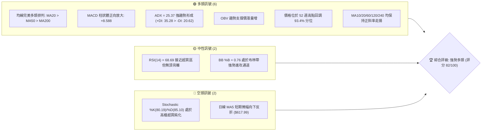
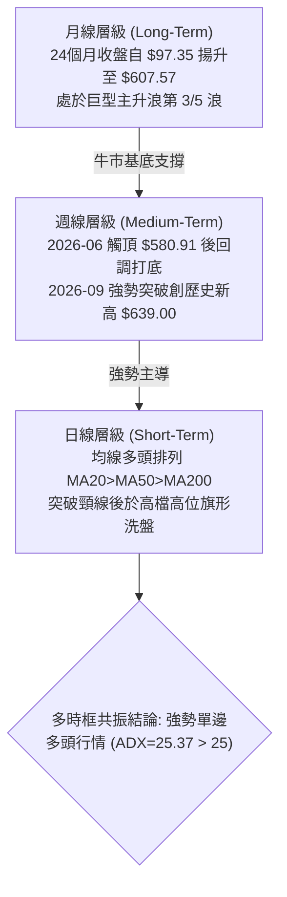
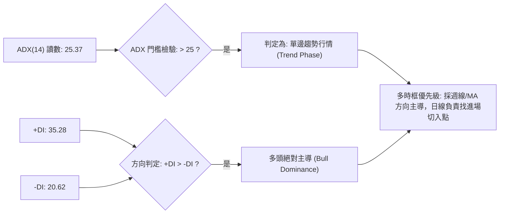
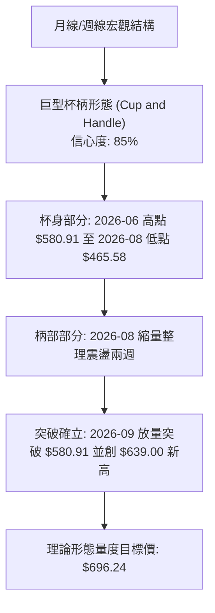
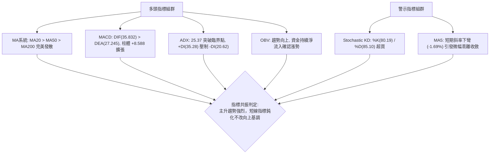
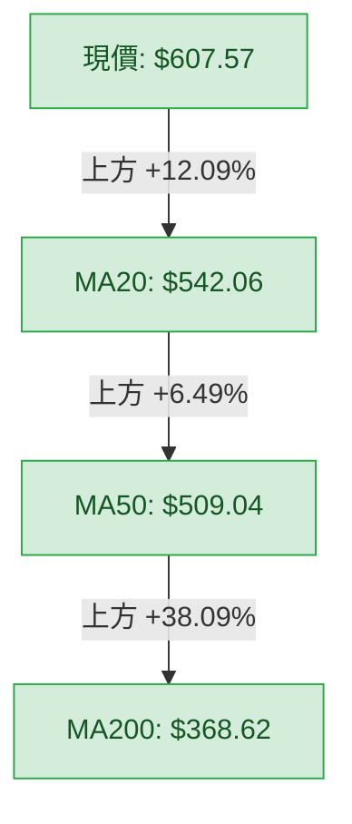
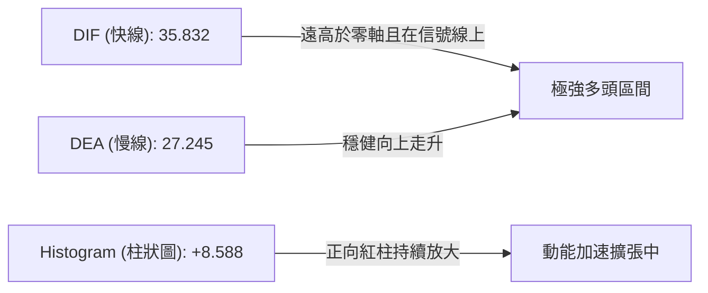
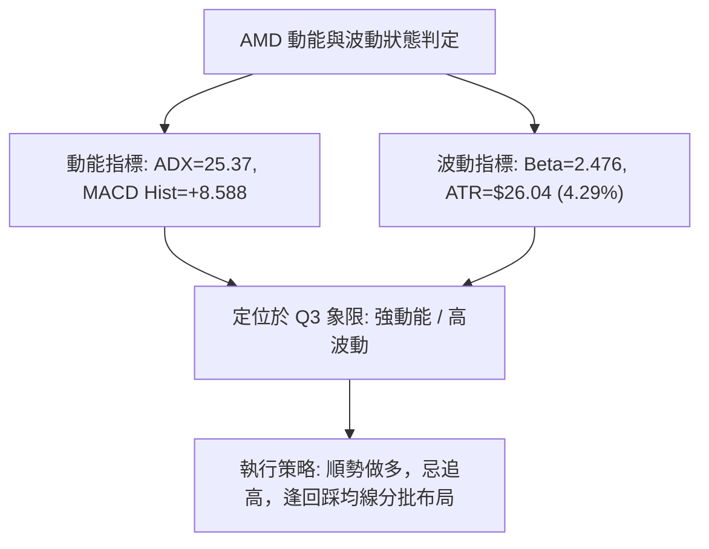
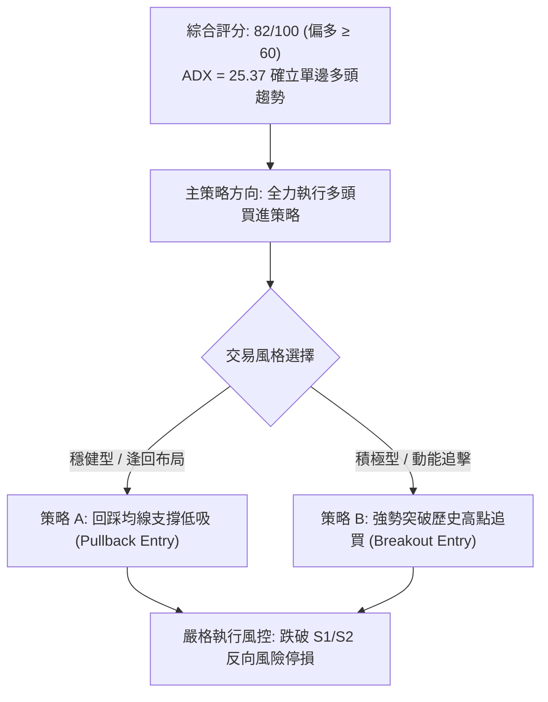
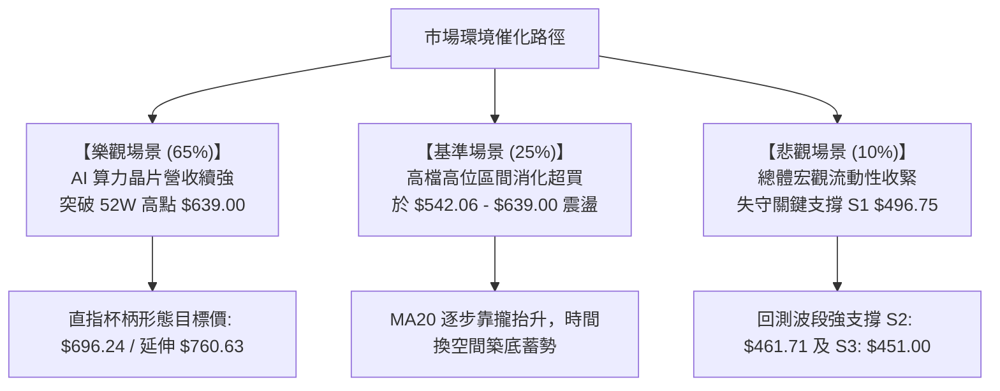

# AMD 技術分析報告

> **報告日期**：2026-09-30 ｜ **語言**：繁體中文 ｜ **數據來源**：Yahoo Finance ｜ **當前價格**：$607.57

---

## 目錄

| 章節 | 內容 |
|------|------|
| [1. 技術面概覽](#1-技術面概覽) | 訊號儀表板、核心指標、評分卡 |
| [2. 趨勢分析](#2-趨勢分析) | 多時框趨勢、長中短期走勢 |
| [3. 圖表形態分析](#3-圖表形態分析) | 形態識別、K線組合、目標價 |
| [4. 支撐與阻力](#4-支撐與阻力) | 關鍵價位、斐波那契回調 |
| [5. 技術指標深度解讀](#5-技術指標深度解讀) | MA/RSI/MACD/布林/成交量 |
| [6. 動能與波動率](#6-動能與波動率) | 動能評估、ATR、Beta |
| [7. 多時框架總結](#7-多時框架總結) | 時框架評分矩陣 |
| [8. 交易策略建議](#8-交易策略建議) | 多空策略、風險報酬比 |
| [9. 風險提示與監控](#9-風險提示與監控) | 監控指標、風險場景 |

---

## 1. 技術面概覽

### 🎯 技術訊號儀表板



### 📊 核心指標速覽表

| 指標類別 | 指標名稱 | 當前數值 | 訊號 | 解讀 |
|----------|----------|----------|------|------|
| **價格** | 當前價格 | $607.57 | 🟢 | 處於 52 週高點 ($639.00) 附近，高位強勢震盪整理 |
| **均線** | MA20 | $542.06 | 🟢 | 現價高於 MA20 達 +12.09%，中期支撐極為穩健 |
| **均線** | MA50 | $509.04 | 🟢 | 現價高於 MA50 達 +19.36%，中期生命線向上發散 |
| **均線** | MA200 | $368.62 | 🟢 | 現價高於 MA200 達 +64.82%，長期牛市格局確立 |
| **動能** | RSI(14) | 68.69 | 🟡 | 位於強勢多頭區間，尚未跌破 50，亦未形成極端超買 |
| **動能** | MACD(12,26,9) | DIF 35.832 / Signal 27.245 / Hist +8.588 | 🟢 | 零軸上方維持多頭擴張，動能柱持續增長 |
| **隨機** | KD(Stoch) | %K 80.19 / %D 85.10 | 🔴 | 出現高檔超買鈍化，需預防短線衝高後的回測震盪 |
| **趨勢** | ADX(14) | 25.37 (+DI 35.28 / -DI 20.62) | 🟢 | ADX 突破 25 臨界點，確立單邊多頭趨勢行情 |
| **量能** | OBV & 量比 | OBV > MA / 量比 0.74x | 🟢 | 長線量價配合健康，短線回調處於量縮良性洗盤 |
| **波動** | ATR(14) | $26.04 (4.29%) | 🟡 | 波動率較高，單日波幅劇烈，進場需配置較寬止損距離 |

### 🏆 技術評分卡

```
╔══════════════════════════════════════════════════════════════════╗
║                    技術評分卡 — AMD (2026-09-30)                ║
╠══════════════════════════════════════════════════════════════════╣
║ 均線排列 (Trend MA)     ████████████████████  100/100  🟢 極強多 ║
║ 趨勢強度 (Trend ADX)    ████████████████░░░░   80/100  🟢 趨勢形成║
║ 動能指標 (Momentum)     ███████████████░░░░░   75/100  🟢 多方主導║
║ 支撐穩定度 (Support)    ████████████████░░░░   80/100  🟢 結構扎實║
║ 成交量配合 (Volume OBV) ██████████████░░░░░░   70/100  🟡 量價相符║
║ 形態完整度 (Pattern)    ██████████████████░░   90/100  🟢 杯柄突破║
╠══════════════════════════════════════════════════════════════════╣
║ 綜合評分 (Overall)      ████████████████░░░░   82/100  🟢 強勢多頭║
╚══════════════════════════════════════════════════════════════════╝
```

---

## 2. 趨勢分析

### 🌐 多時框趨勢分析



### 📈 長期趨勢 — 12個月走勢圖（Unicode）

```
AMD 月線走勢圖（2025-10 至 2026-09 過去12個月）
價格軸 ($)
$650 ┤                                                    ● $639.00 (52W High)
$600 ┤                                              ●     │
$550 ┤                                        ●     │     ● $607.57 (現價)
$500 ┤                                  ●     │     │     │
$450 ┤                            ●     │     │     │     │
$400 ┤                      ●     │     │     │     │     │
$350 ┤                ●     │     │     │     │     │     │
$300 ┤          ●     │     │     │     │     │     │     │
$250 ┤    ●     │     │     │     │     │     │     │     │
$200 ┤    │  ●  │  ●  │  ●  │     │     │     │  ●  │     │
$150 ┤────┴──┴──┴──┴──┴──┴──┴─────┴─────┴─────┴──┴──┴─────┴─────
     月份 10 11 12 01 02 03 04    05    06    07 08 09 (2026)
```

**走勢特徵分析表格**：

| 階段區間 | 時間跨度 | 起訖收盤價 | 階段漲跌幅 | 走勢特徵與技術含義 |
|----------|----------|------------|------------|-------------------|
| **第一階段：低檔築底與突破** | 2025-04 ~ 2025-09 | $97.35 → $161.79 | +66.19% | 確立大週期 V 型底反轉，突破 MA200 長期均線 |
| **第二階段：首波急升主浪** | 2025-10 ~ 2026-01 | $256.12 → $236.73 | -7.57% (震盪) | 爆量突破 $250 心理關口後進入首波換手整理 |
| **第三階段：蓄勢回踩平台** | 2026-02 ~ 2026-03 | $200.21 → $203.43 | +1.61% | 回踩確認波段支撐，縮量完成底部平台建構 |
| **第四階段：主升浪瘋狂拉升** | 2026-04 ~ 2026-06 | $354.49 → $580.91 | +63.87% | AI 浪潮爆發，連續三個月巨幅跳空大陽線，推升至波段頂部 |
| **第五階段：高檔震盪洗盤** | 2026-07 ~ 2026-08 | $476.15 → $470.72 | -1.14% | 高位獲利了結回測，最低守住 $465.58，完成杯身柄部洗盤 |
| **第六階段：突破歷史新高** | 2026-09 | $470.72 → $607.57 | +29.07% | 強勢長陽包覆前兩個月陰線，單月直衝 $639.00 歷史高位 |

### 📊 中期趨勢（週線分析）

從 20 週收盤走勢可見，AMD 於 2026 年 8 月底在 $465.58 獲得支撐後展開強力上攻：
- **突破軌跡**：9月首週收 $477.57，次週收 $516.13（突破 MA50），第三週收 $559.82（突破 MA20），第四週收 $630.63（創歷史新高）。
- **當前週線特徵**：最新一週收盤為 $607.57，成交量收縮至 38,573,700（相較前週 1.32 億股明顯縮量），呈現「創新高後的縮量十字星回踩」，為典型多頭中繼走勢。

```
中期週線價格波段結構
$639.00 ──────────────────────── 52週最高阻力位 (0.0% Fib)
           ▲
          ╱ ╲  現價: $607.57 (回踩鞏固中)
         ╱   ▼
$525.80 ──────────────────────── 23.6% Fib / MA20動態支撐 ($542.06)
       ╱
      ╱
$465.58 ──────────────────────── 柄部築底低點 / 強支撐 S2 ($461.71)
```

### ⚡ 趨勢強度評估（ADX 解讀）



| 指標變數 | 當前數值 | 參考臨界值 | 狀態結論 |
|----------|----------|------------|----------|
| **ADX (14)** | **25.37** | 25.00 | **正式跨入強趨勢區間**，由震盪市轉化為動能突破市 |
| **+DI (多方動能)** | **35.28** | 25.00 | 多方掌控盤面進攻權，斜率持續走揚 |
| **-DI (空方動能)** | **20.62** | 20.00 | 空方力道被有效壓制，無主動拋盤殺跌動能 |
| **趨勢性質判定** | **多頭強趨勢** | — | **拒絕逆勢摸頂做空**，策略僅能逢低做多或突破加碼 |

---

## 3. 圖表形態分析

### 🔍 形態識別系統



**形態信心度與目標價計算表**（依嚴格規則 13 與 15）：

| 形態名稱 | 信心度 | 判斷依據（引用數據） | 完成度 | 目標價（附嚴格計算式） |
|----------|--------|----------------------|--------|------------------------|
| **杯柄突破形態 (Cup & Handle)** | **85%** | 2026-06 見頂 $580.91 後，在 2026-08-30 收盤於 $465.58 止跌，隨後 9 月連續 4 週大陽線放量突破 $580.91 頸線。 | **90%** (已突破，當前處於小幅回踩測試突破有效性) | **$696.24**<br/>計算式：頸線高點 $580.91 + (杯身頂部 $580.91 - 杯身底部 $465.58) = $580.91 + $115.33 = $696.24 |
| **高位牛市旗形 (Bull Flag)** | **70%** | 週線自 2026-09-06 的 $477.57 垂直拉升至 2026-09-27 的 $630.63（旗桿高度 $153.06），本週收 $607.57 呈現縮量整理旗面。 | **60%** (旗面收斂階段，待放量再度擊穿 $639.00) | **$760.63**<br/>計算式：由旗形突破估算：突破點假設為旗頂 $607.57 + 旗桿高度 ($630.63 - $477.57 = $153.06) = $760.63 |
| **頭肩底形態 (Head & Shoulders)** | **30%** | 數據中未偵測到清晰之左右肩對稱波谷聚類，週線低點呈單底 V 型反轉，不符合頭肩底定義。 | 0% | **數據不足，僅做指標型解讀，不預測目標價** |

### 🕯️ 重要K線形態分析

| 月份 | 收盤價 | K線形態 | 解讀 | 訊號 |
|------|--------|---------|------|------|
| **2026-06** | $580.91 | 長陽放量衝頂 | 多頭主升浪達到階段性極致，上方遭遇獲利回吐盤，留長上影線 | 🟡 獲利了結 |
| **2026-07** | $476.15 | 大陰回撤吞噬 | 單月自 $580.91 回吐至 $476.15（跌幅 -18.03%），快速洗刷浮額籌碼 | 🔴 短線修正 |
| **2026-08** | $470.72 | 探底縮量十字陰 | 連續兩個月在 $470 附近獲得強烈承接買盤，成交量急劇萎縮，形成週期底部 | 🟢 止跌築底 |
| **2026-09** | $607.57 | 吞噬突破巨陽線 | 單月自 $470.72 暴漲至 $607.57（+29.07%），實體陽線直接包覆前兩月陰線 | 🟢 強烈買進 |

### 📉 ASCII 走勢形態示意圖

```
巨型杯柄突破走勢示意圖
價位 ($)
$639.00 ┤                                        ★ 突破新高點 (2026-09-27)
$580.91 ┤      ╭───────────╮                    ╭─── 頸線突破位 ($580.91)
        │     │  杯身左側   │    ╭────╮         │
$516.10 ┤    │             │   │ 柄部 │        │     ● 現價 $607.57 (回踩)
        │   │               │  │ 洗盤 │       │
$470.72 ┤───╯               ╰──╯      ╰──────╯
        │   【2026-06】     【2026-07】  【2026-08】   【2026-09】
        └──────────────────────────────────────────────────────────► 時間軸
```

---

## 4. 支撐與阻力

### 🗺️ 關鍵價位分布圖（Unicode）

```
AMD 價位結構分布圖
═══════════════════════════════════════════════════════════════════
$696.24 ║░░░░░░░░░░░░░░░░░░░░░░░░░░░░░░░░║ 形態量度目標 (杯柄量度推算)
$639.00 ║████████████████████████████████║ 52週歷史高點 / 0.0% Fib 阻力
$607.57 ╠════════════════════════════════╣ ◄ 當前市價 ($607.57)
$542.06 ║▓▓▓▓▓▓▓▓▓▓▓▓▓▓▓▓▓▓▓▓▓▓▓▓        ║ 動態支撐 (日線 MA20)
$525.80 ║████████████████████            ║ 斐波那契回調 23.6% 關鍵支撐
$496.75 ║████████████████████████████████║ 近一年波段低點聚類支撐 S1
$461.71 ║██████████████████████████████  ║ 近一年波段低點聚類強支撐 S2
$455.77 ║████████████████████████        ║ 斐波那契回調 38.2% 支撐
$451.00 ║████████████████████████████████║ 近一年波段極限防守支撐 S3
═══════════════════════════════════════════════════════════════════
```

### 🚧 阻力位分析表

> **嚴格數據聲明**：依據「關鍵價位」數據區塊計算，現價上方無近一年波段高點聚類阻力；上方現存之實際物理高點為 52 週最高價，形態目標則由前章杯柄高度公式精確推算。

| 阻力級別 | 價位 | 形成原因 | 突破難度 | 重要性 |
|----------|------|----------|----------|--------|
| **R1 (歷史高點)** | **$639.00** | 52週歷史最高價 (0.0% Fibonacci 回調水平) | 🟡 中等 (需日成交量 > 2500萬股配合) | ★★★★★ 極高 (突破即進入歷史無套牢盤天花板空間) |
| **R2 (形態量度)** | **$696.24** | 由杯柄形態量度推算：頸線 $580.91 + 高度 $115.33 | 🔴 偏高 (心理整數位 $700 關口共振) | ★★★★☆ 高 (第一波主升浪量度滿足點) |
| **R3 (波段延伸)** | **$760.63** | 由旗形形態高度推算：旗頂 $607.57 + 旗桿 $153.06 | 🔴 極難 (需基本面營收季報超預期共振) | ★★★☆☆ 中 (長線波段延伸極限目標) |

### 🛡️ 支撐位分析表

> **嚴格數據聲明**：所有支撐價位完全嚴格引用數據包「關鍵價位」區塊之波段低點聚類數值。

| 支撐級別 | 價位 | 距現價空間 | 形成原因 | 守住機率 | 重要性 |
|----------|------|------------|----------|----------|--------|
| **動態支撐** | **$542.06** | -10.78% | 日線 20 日移動平均線 (MA20) 與布林中軌共振 | 85% | ★★★★☆ 高 (多頭短線回檔生命線) |
| **S1 支撐** | **$496.75** | -18.24% | 近一年波段低點聚類支撐 S1，與 MA50 ($509.04) 構成密集緩衝區 | 80% | ★★★★★ 極高 (波段強弱分水嶺) |
| **S2 支撐** | **$461.71** | -24.01% | 近一年波段低點聚類支撐 S2，2026年7-8月築底雙底頸線區域 | 90% | ★★★★★ 核心基石 (中長線多頭防禦核心) |
| **S3 支撐** | **$451.00** | -25.77% | 近一年波段低點聚類極限防守位 S3，跌破意味著中期結構瓦解 | 95% | ★★★★☆ 極限底線 (趨勢反轉停損位) |

### 📐 斐波那契回調位分析

依據 52 週極值區間（低點 **$159.33** → 高點 **$639.00**，總波幅 $479.67）之黃金分割比率分析：

```
斐波那契回調結構與現價定位
  0.0%  $639.00 ─── 52W High (上方終極阻力)
         ▲
  現價  $607.57 ─── 處於 0.0% 至 23.6% 之間 (超強勢溢價區間)
         ▼
 23.6%  $525.80 ─── 第一道回調支撐位 (與 MA20: $542.06 形成支撐帶)
 38.2%  $455.77 ─── 第二道健康回調支撐 (與 S2: $461.71 / S3: $451.00 高度重疊)
 50.0%  $399.17 ─── 中期多空平衡分水嶺 (與 MA200: $368.62 上方共振)
 61.8%  $342.56 ─── 長期黃金回調位 (牛市極限防守位)
 78.6%  $261.98 ─── 深幅回調位
100.0%  $159.33 ─── 52W Low (啟動起點)
```

**解讀結論**：
- 當前價格 **$607.57** 穩穩運行於 **0.0% ($639.00)** 與 **23.6% ($525.80)** 的極強勢區間內，回撤幅度僅佔總漲幅的 6.55%，技術面顯示多頭控盤意願極強，未給予空方任何深度回踩的空間。
- 若出現大盤系統性修正，**23.6% ($525.80)** 與 **38.2% ($455.77)** 將分別為機構買盤的黃金加碼區。

---

## 5. 技術指標深度解讀

### 🎛️ 指標訊號總覽



### 📈 移動平均線排列分析



**移動平均線譜系數據對照**：
- **MA5 ($617.99)**：現價低於 MA5 約 -1.69%，短線存在 2-3 天之微幅獲利回吐，屬漲多後之均線靠攏修復。
- **MA10 ($594.66)**：現價高於 MA10 達 +2.17%，短期支撐強勁，回踩並未跌破 10 日攻擊線。
- **MA20 ($542.06) & MA60 ($511.70)**：斜率向上角度陡峭（MA60 上漲 +18.74%），構築中期堅固護城河。
- **MA120 ($471.92) & MA240 ($346.25)**：中長線呈現經典大牛市「扇形發散」（MA240 乖離 +75.47%），證明機構底倉堅若磐石。

### 📉 RSI(14) 分析

```
RSI(14) 讀數: 68.69
0 ══════════════ 30 ════════════════════ 70 ═══════════ 100
[     超賣區     ] [       中性偏強區       ] [  超買區  ]
                  ▓▓▓▓▓▓▓▓▓▓▓▓▓▓▓▓▓▓▓▓▓▓▓▓▓▓█
                                            ▲ 68.69
```

- **背離檢驗**：觀察週線走勢，2026-09-20 收 $559.82（RSI 73.1），至 2026-09-27 收 $630.63（RSI 80.4），價格創高伴隨 RSI 同步創高；最新週雖回吐至 $607.57（RSI 回落至 68.69），但屬於正常的超買降溫，**完全無頂背離現象**，排除大級別見頂風險。

### 📊 MACD(12/26/9) 訊號解讀



- **動能解析**：週線 MACD 柱狀體在 2026-08-30 仍為 -0.243，9月份迅速翻紅：+0.139 → +6.512 → +8.427 → +14.199，最新值穩定在 **+8.588**。柱狀圖在零軸上方急遽拉昇，表明市場正處於機構資金大舉湧入的「二度加速推升浪」。

### 📦 布林通道分析

```
布林通道 (20, 2) 結構圖
$668.45 ────────────────────────────────────── BB 上軌 (阻力帶)
           │
$607.57 ───┼────────── ● 現價 ($607.57, %B = 0.76)
           │
$542.06 ───┼────────────────────────────────── BB 中軌 (MA20 生命線)
           │
$415.67 ────────────────────────────────────── BB 下軌 (極限支撐)
```

- **通道形態**：帶寬顯著擴張，現價位於中軌 ($542.06) 與上軌 ($668.45) 之間，**%B 達 0.76**，表示股價沿著布林通道「多頭進攻軌道」上行，非但沒有跌破中軌之虞，反而具備持續向 BB 上軌 $668.45 叩關之動能。

### 💹 成交量分析（量價配合度）

- **最新成交量**：16,449,600 股，低於 20 日均量 (22,164,140 股)，量比為 **0.74x**。
- **價量關聯性判定**：
  1. 上漲放量：2026-09-20 週成交量 1.24 億股、2026-09-27 週成交量 1.32 億股，推升股價連續大陽線。
  2. 回調縮量：當前價格自 $639.00 回吐至 $607.57 過程中，單日成交量收縮至 1644 萬股（量比 0.74x）。此現象符合經典「**漲放量、跌縮量**」之主力洗盤特徵，而非主力機構出貨。
  3. **OBV 指標確認**：數據明確指示「OBV > MA → 量能支撐上漲」，能量潮指標創近期新高，確立資金呈現淨流入格局。

---

## 6. 動能與波動率

### ⚡ 動能評估四象限

| 象限 | 動能維度 (Momentum) | 波動維度 (Volatility) | 當前定位 | 交易戰略評估 |
|:---:|:---:|:---:|:---:|:---|
| **Q1** | **強動能 (High)** | **低波動 (Low)** | — | 穩健主升浪（最適重倉趨勢持股） |
| **Q2** | **弱動能 (Low)** | **低波動 (Low)** | — | 盤整築底期（耐心觀望或定投） |
| **Q3** | **強動能 (High)** | **高波動 (High)** | **✓ (AMD 當前所處位置)** | **強勢突破擴張期（高收益伴隨大振幅，需嚴格風控並放大止損空間）** |
| **Q4** | **弱動能 (Low)** | **高波動 (High)** | — | 崩跌破位期（全面規避與放空） |



### 📊 ATR 波動率分析

- **當前 ATR(14)**：**$26.04**（佔當前股價之 **4.29%**）。
- **ATR 戰術運用**：
  - **日級別安全護欄**：單日合理正常雜訊波幅為 ±$26.04。日內波動區間預期為 **$581.53 ~ $633.61**。
  - **止損距離建議**：趨勢型波段操作止損應至少設定在 **1.5 至 2.0 倍 ATR**，即 **$39.06 ~ $52.08**，以防被正常隨機雜訊掃出場。
  - 換算保護止損位：現價 $607.57 - (2.0 × $26.04) = **$555.49**，該位置恰好落在 MA20 ($542.06) 上方，具備極佳技術支撐邏輯。

### 📐 Beta 與市場相關性

- **Beta 係數**：**2.476**。
- **市場敏銳度解析**：AMD 具備超高 Beta 特性，對標普 500 指數與費城半導體指數的彈性極高（大盤上漲 1%，AMD 平均上漲 2.48%；反之亦然）。在高 Beta 加持下，若美股半導體板塊維持多頭氛圍，AMD 將呈現超越大盤的 Alpha 爆發力，但進場部位必須配合嚴格的總倉位控制。

---

## 7. 多時框架總結

### 📋 時框架評分表

| 時框架 | 趨勢方向 | 動能狀態 | 均線排列 | 圖表形態 | 綜合評分 | 操作建議 |
|--------|----------|----------|----------|----------|:--------:|----------|
| **月線 (長期)** | 🟢 強烈看多 | MACD 零軸上方爆發，長陽上攻 | MA20>MA50>MA200 發散 | 大週期反轉後的主升浪第 3 浪 | **90/100** | 長線堅定持股，不輕易出局 |
| **週線 (中期)** | 🟢 強烈看多 | ADX=25.37 確立強趨勢，RSI 68.7 | 完全多頭排列，突破前高頸線 | 杯柄形態突破，目標 $696.24 | **85/100** | 逢回踩 $580-$550 區間強力做多 |
| **日線 (短期)** | 🟡 震盪偏多 | KD高檔鈍化，MA5微下折，量縮 | 短期均線乖離收斂，MA20強托 | 創高後的旗形回踩整理 | **72/100** | 暫停追高，等待止跌訊號切入 |

### 🔲 綜合訊號矩陣

```
時框維度與指標訊號矩陣對照
═══════════════════════════════════════════════════════════════
時框架      均線趨勢     動能強度     量價形態     最終方向
───────────────────────────────────────────────────────────────
日線 (短期)  🟢 看多      🟡 整理      🟢 縮量良性   🟢 偏多進攻
週線 (中期)  🟢 看多      🟢 強勁      🟢 突破確立   🟢 單邊多頭
月線 (長期)  🟢 看多      🟢 極強      🟢 巨陽主升   🟢 超級牛市
═══════════════════════════════════════════════════════════════
共振結論：三大時框全數維持綠色看多，短線波動不損中長線多頭架構
```

### ⚖️ 多時框收斂結論

> **依嚴格要求 14 執行多時框收斂收斂**：
> 1. **行情性質判定**：當前 ADX(14) 讀數為 **25.37 > 25**，市場已被定量定性為**「單邊強趨勢行情」**，盤整區間震盪邏輯不再適用。
> 2. **主導權重歸屬**：依規則，當處於趨勢行情時，由**中長期（週線／MA50、MA200）方向主導全域判斷**，日線指標（如短線 KD 超買、MA5 下折）僅用於捕捉拉回時的精準進場點，不可作為逆勢做空的依據。
> 3. **唯一收斂結論**：**強烈偏多（Strong Bullish）**。整體戰略確立為**「趨勢回踩做多」**與**「突破新高加碼」**，全面摒除摸頂逆勢做空思維。此結論將直接主導第 8 章之具體策略設定。

---

## 8. 交易策略建議

### 🗺️ 策略決策流程圖



### 🧭 策略路由

- **依第 1 章技術評分卡判定**：當前綜合評分為 **82/100**（顯著高於 60 分臨界線），依規則**主推多頭策略**，絕不兩頭下注。
- **當前主策略方向 = 強勢多頭攻擊（依評分 82/100）**。

### 🎯 價格情境階梯（Price Scenarios）

> **嚴格數據聲明**：所有情境觸發條件與目標價位，全部嚴格引用第 4 章及關鍵價位清單中的實際數據。

| 觸發條件 | 下一目標 | 後續延伸 | 情境技術含義 |
|----------|----------|----------|--------------|
| **突破 52W 高點 $639.00** | **R2: $696.24** | **R3: $760.63** | 歷史套牢盤完全消化，開啟巨型杯柄形態量度推升浪 |
| **站穩現價區間 ($580 - $610)** | **$639.00** | **$696.24** | 消化短期 KD 超買浮額，以時間換取空間之強勢橫盤整理 |
| **跌破 S1 支撐 $496.75** | **S2: $461.71** | **S3: $451.00** | 日線級別深度洗盤，回測 2026 年夏季雙底起漲頸線，中期趨勢受挫 |

### 📊 情境機率分佈

| 情境劇本 | 機率 | 主要技術依據（引用指標狀態） |
|----------|:----:|------------------------------|
| **情境一：強勢突破創歷史新高** | **65%** | 均線 MA20>MA50>MA200 完美發散；ADX=25.37 單邊趨勢形成；MACD 柱狀體 +8.588 零軸上方擴張；OBV 健康無背離。 |
| **情境二：高位區間震盪整理** | **25%** | 日線 MA5 短期微折；Stochastic KD 進入 80-85 超買區需時間鈍化消化；量比 0.74x 呈現縮量整理。 |
| **情境三：深度跌破 S1/S2 支撐** | **10%** | S1 ($496.75) 與 S2 ($461.71) 經 24 個月多次波段低點驗證極其扎實，除非突發黑天鵝，跌破機率極低。 |

### 🟢 主策略詳情

> 依據嚴格規定，所有價位數值**嚴格引用關鍵價位區塊（S1: $496.75, S2: $461.71, S3: $451.00, Fib: $525.80, High: $639.00）及形態嚴格推算值（$696.24, $760.63）**，絕不捏造小數點。

| 策略要素 | 策略 A（穩健型：回踩支撐買進） | 策略 B（積極型：突破高點追買） |
|----------|--------------------------------|--------------------------------|
| **策略定位** | 趨勢回檔關鍵均線低吸 | 歷史新高動能突破買進 |
| **進場條件** | 價格回調至 Fib 23.6% 與 MA20 支撐帶出現止跌K線 | 日線收盤價帶量放量突破 52 週歷史高點 $639.00 |
| **進場價格** | **$542.06** (精確錨定 MA20 / 布林中軌) | **$640.00** (突破 $639.00 後確認站穩) |
| **目標價 T1** | **$639.00** (52 週高點阻力位) | **$696.24** (由杯柄形態高度嚴格推算值) |
| **目標價 T2** | **$696.24** (杯柄形態量度推算值) | **$760.63** (由旗形形態高度嚴格推算值) |
| **止損價格** | **$496.75** (精確引用關鍵價位 S1 波段低點) | **$607.57** (跌破當前整理平台收盤價即退場) |
| **風險空間** | $542.06 - $496.75 = $45.31 (8.36%) | $640.00 - $607.57 = $32.43 (5.07%) |
| **報酬空間 (T1)** | $639.00 - $542.06 = $96.94 (17.88%) | $696.24 - $640.00 = $56.24 (8.79%) |
| **風險報酬比** | **1 : 2.14** (至 T1) ／ **1 : 3.40** (至 T2) | **1 : 1.73** (至 T1) ／ **1 : 3.72** (至 T2) |
| **成功機率** | **70%** | **65%** |
| **建議倉位** | **20% ~ 25%** 總部位 | **10% ~ 15%** 動能突破倉 |

### 🔴 反向風險觸發點（對沖提示）

- **第一級警訊（減倉點）**：日線收盤價若放量**跌破 $542.06 (MA20)**，表明短期回調幅度擴大，建議將槓桿部位或動能多單減半。
- **終極防禦止損線（推翻主策略）**：若價格放量擊穿**關鍵波段低點 S1: $496.75**，多頭杯柄形態宣告失效，中期趨勢轉向走平或空頭防禦，必須全面清空主策略多單，啟動現貨對沖或反向保護機制。

### ⭐ 整體訊號強度評星

```
╔══════════════════════════════════════════════════════════════╗
║ 做多訊號強度：★★★★☆  (4.5/5星) — 均線/MACD/ADX/OBV 共振強烈  ║
║ 做空訊號強度：★☆☆☆☆  (1.0/5星) — 逆大趨勢，僅存在超買微調風險║
║ 整體可信度：  ★★★★☆  (4.5/5星) — 價量多時框數據邏輯高度契合║
╚══════════════════════════════════════════════════════════════╝
```

---

## 9. 風險提示與監控

### ✅ 關鍵監控指標 Checklist

```
╔══════════════════════════════════════════════════════════════════╗
║               AMD 交易風險即時監控清單 (Checklist)               ║
╠══════════════════════════════════════════════════════════════════╣
║ [ ] 1. 價格是否守穩 MA20 生命線 ($542.06)                        ║
║ [ ] 2. 52週高點 $639.00 能否在未來 5-10 個交易日內放量站上       ║
║ [ ] 3. 日成交量是否在推升時放大至 25,000,000 股以上 (放量確認)    ║
║ [ ] 4. RSI(14) 回落至 60 附近能否獲得有效買盤支撐 (洗盤結束)    ║
║ [ ] 5. MACD 柱狀體數值是否維持在正向 (+8.0 以上) 未見衰減萎縮    ║
║ [ ] 6. 費城半導體指數與大盤 Beta 波動是否引發科技股板塊性賣壓   ║
║ [ ] 7. 價格若跌破 S1 ($496.75) 必須無條件執行停損出場            ║
╚══════════════════════════════════════════════════════════════════╝
```

### ⚠️ 風險場景分析



### 🛡️ 風險管理重要提醒

1. **高 Beta 波動防禦**：AMD Beta 高達 **2.476**，單日 ATR 高達 **$26.04**。任何劇烈盤面震盪均可能觸發日內 4% 以上之雜訊甩盤。嚴禁使用過高保證金槓桿，總持倉風險暴露不宜超過個人投資組合淨值的 **20%-25%**。
2. **止損紀律絕對化**：所有進場單必須嚴格預設止損位。策略 A 之止損錨定於 **S1 ($496.75)**，絕不允許因心存僥倖而向下「攤平成本」。若觸及止損線，證明技術面假設破裂，必須即刻退場觀望。
3. **分批獲利了結戰術**：當股價觸達第 1 目標位 **$639.00 (歷史高點)** 時，應至少減持 1/3 至 1/2 倉位鎖定利潤，並將剩餘部位之防守點上移至進場成本價，以實現「零風險持倉」博取第 2 目標價 **$696.24**。

---

## 📋 報告總結

```
╔══════════════════════════════════════════════════════════════════╗
║                       AMD 技術分析報告總結                       ║
╠══════════════════════════════════════════════════════════════════╣
║ 報告日期：2026-09-30                                             ║
║ 當前價格：$607.57                                                ║
║ 技術評分：82 / 100 ｜ 分析評級：🟢 強勢單邊多頭 (Strong Buy)     ║
╠══════════════════════════════════════════════════════════════════╣
║ 關鍵結論：                                                       ║
║ ├─ 長期趨勢：🟢 24個月大週期主升浪，月線連續巨陽推升             ║
║ ├─ 中期趨勢：🟢 杯柄形態突破頸線，量價配合良好                   ║
║ ├─ 短期趨勢：🟢 創新高後縮量回踩，處於良性旗形整理               ║
║ ├─ 關鍵支撐：動態 MA20 $542.06 ｜ 結構低點 S1: $496.75          ║
║ ├─ 關鍵阻力：52W 高點 $639.00 ｜ 形態量度 R2: $696.24           ║
║ └─ 機構共識：分析師平均目標價 $618.51 (最高目標 $1250.00)       ║
╠══════════════════════════════════════════════════════════════════╣
║ 最優策略組合：                                                   ║
║ 1. 🥇 最佳機會（策略 A）：回踩 MA20 ($542.06) 逢低布局做多，      ║
║                  止損設於 S1 ($496.75)，目標上看 $639 / $696    ║
║ 2. 🥈 次選機會（策略 B）：強勢放量突破 52W 高點 $639.00 順勢追多，║
║                  止損設於 $607.57，目標直指 $696.24             ║
║ 3. 🥉 防禦選擇：耐心等待日線指標 KD 脫離超買區鈍化後再行切入    ║
╚══════════════════════════════════════════════════════════════════╝
```

---

> ⚠️ **免責聲明**：本報告為 AI 自動生成之技術分析，所有數據及估算均嚴格基於所提供之歷史價格與量化技術資訊。本報告**僅供研究與學術參考**，**不構成任何具體投資建議或買賣邀約**。金融市場存在高度波動與本金損失風險，投資人應獨立評估自身財務狀況與風險承受能力，入市需謹慎。

---

*報告生成時間：2026-09-30 ｜ 數據來源：Yahoo Finance ｜ 分析框架：資深多時框量化技術分析*