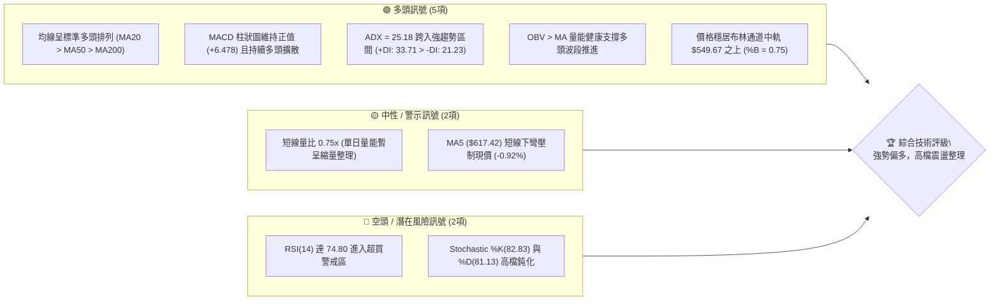
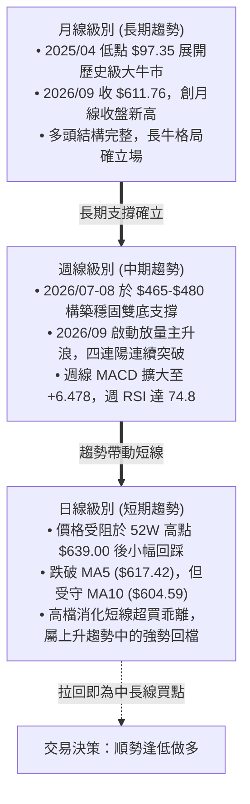
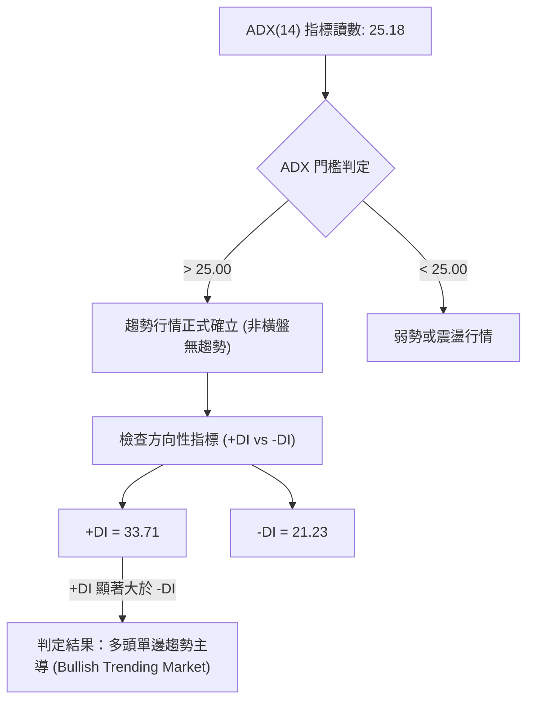
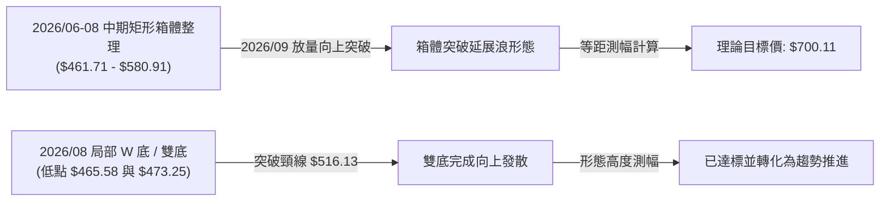
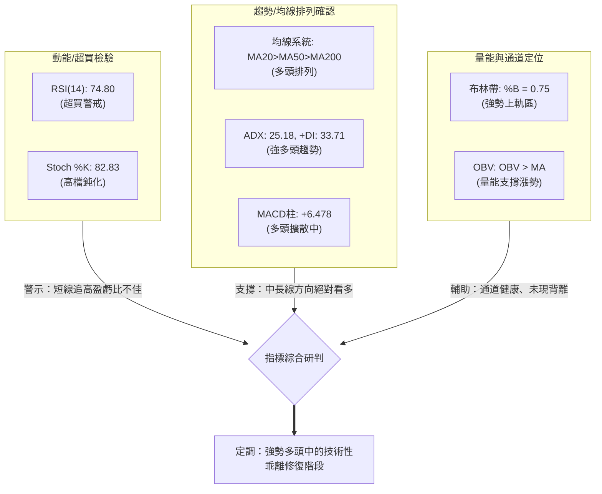
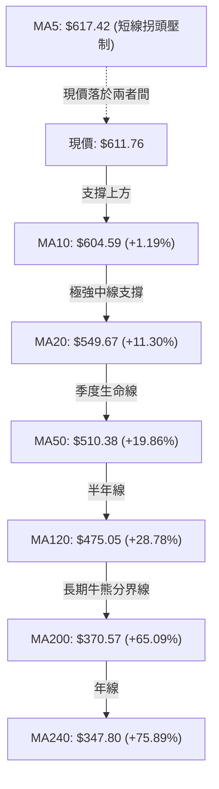
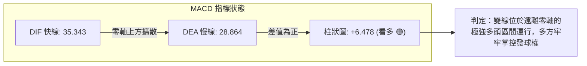
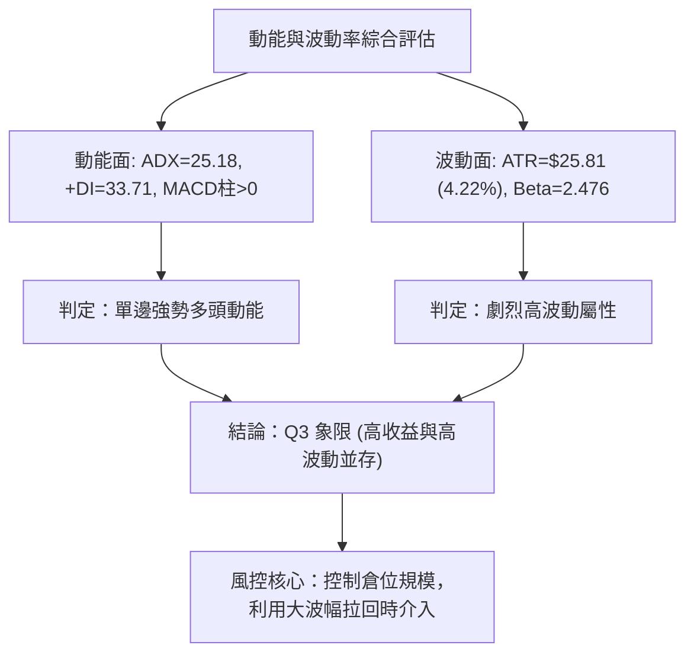
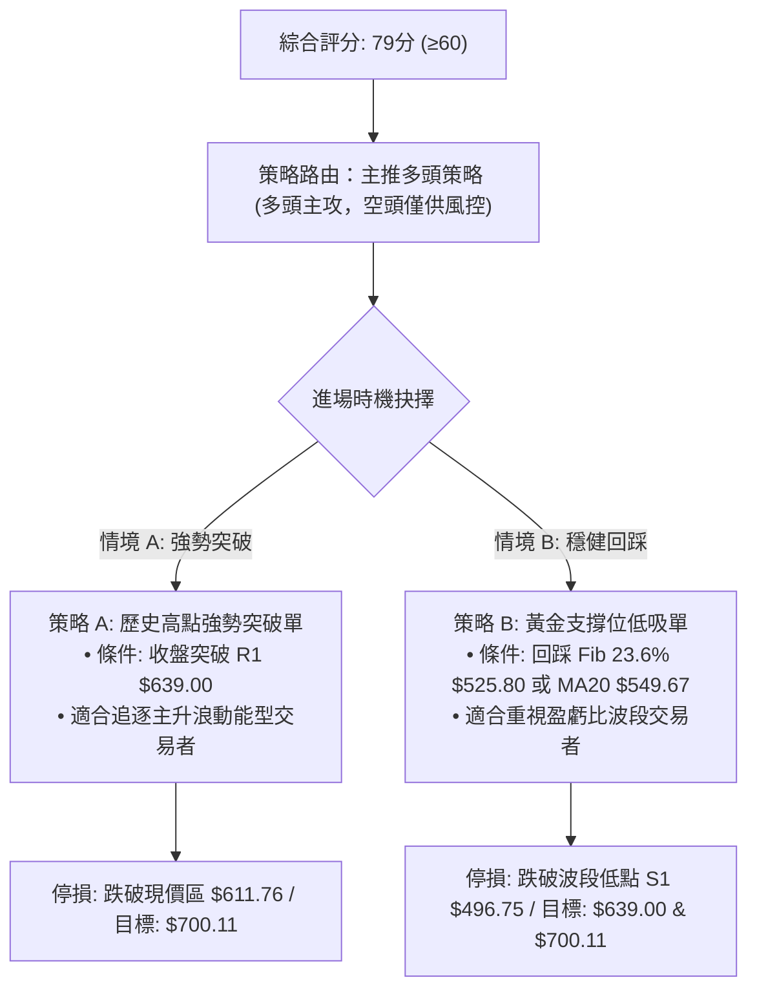
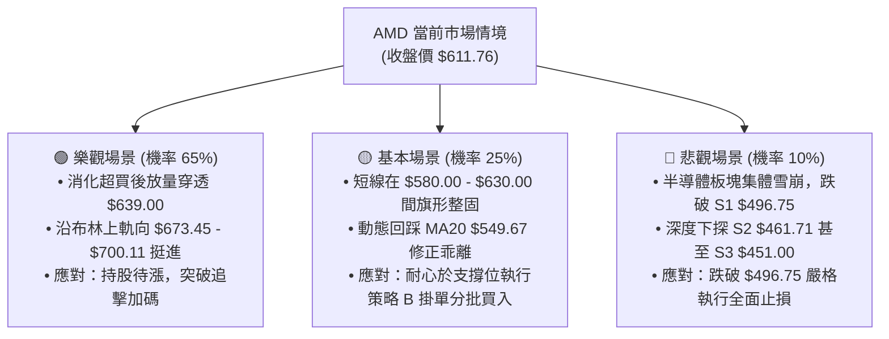

# AMD 技術分析報告

> **報告日期**：2026-10-01 ｜ **語言**：繁體中文 ｜ **數據來源**：Yahoo Finance ｜ **當前價格**：$611.76

---

## 目錄

| 章節 | 內容 |
|------|------|
| [1. 技術面概覽](#1-技術面概覽) | 訊號儀表板、核心指標、評分卡 |
| [2. 趨勢分析](#2-趨勢分析) | 多時框趨勢、長中短期走勢、ADX解讀 |
| [3. 圖表形態分析](#3-圖表形態分析) | 形態識別、K線組合、形態高度測算 |
| [4. 支撐與阻力](#4-支撐與阻力) | 關鍵價位、斐波那契回調、結構圖 |
| [5. 技術指標深度解讀](#5-技術指標深度解讀) | MA/RSI/MACD/布林通道/成交量與OBV |
| [6. 動能與波動率](#6-動能與波動率) | 動能四象限、ATR波動率、Beta解讀 |
| [7. 多時框架總結](#7-多時框架總結) | 時框架評分矩陣、多時框收斂結論 |
| [8. 交易策略建議](#8-交易策略建議) | 策略路由、階梯情境、主策略風控參數 |
| [9. 風險提示與監控](#9-風險提示與監控) | 監控Checklist、三行情境模擬、倉位管理 |

---

## 1. 技術面概覽

### 🎯 技術訊號儀表板



### 📊 核心指標速覽表

| 指標類別 | 指標名稱 | 當前數值 | 訊號 | 解讀 |
|----------|----------|----------|------|------|
| **價格** | 當前價格 | $611.76 | 🟢 | 處於52週高低點區間頂端 94.3% 位置，逼近歷史新高區域 |
| **短期均線** | MA5 / MA10 | $617.42 / $604.59 | 🟡 | 現價夾於 MA5 與 MA10 之間，短線極短週期出現拉回換手震盪 |
| **中期均線** | MA20 / MA50 | $549.67 / $510.38 | 🟢 | 價格大幅高於 MA20（+11.30%）與 MA50（+19.86%），中線多頭強固 |
| **長期均線** | MA200 | $370.57 | 🟢 | 遠高於長期牛熊分界線（+65.09%），長期多頭牛市結構無虞 |
| **震盪動能** | RSI(14) | 74.80 | 🔴 | 進入 >70 之技術超買區，短線隨時有技術性回洗整固需求 |
| **趨勢動能** | MACD (12,26,9) | DIF: 35.343 / DEA: 28.864 / Hist: +6.478 | 🟢 | 雙線位於零軸上方金叉發散，多頭主控動能充沛 |
| **隨機指標** | KD (Stoch 14,3,3)| %K: 82.83 / %D: 81.13 | 🔴 | 位於 80 軸線上方之超買區，需提防高檔死叉回測 |
| **趨勢強度** | ADX / ±DI (14) | ADX: 25.18 / +DI: 33.71 / -DI: 21.23 | 🟢 | ADX 突破 25，確立單邊趨勢行情成形，+DI 大幅主導多方方向 |
| **通道狀態** | Bollinger Bands (20,2) | 上軌 $673.45 / 中軌 $549.67 / 下軌 $425.89 | 🟢 | %B = 0.75，股價處於通道上部強勢擴張軌道內運作 |
| **波動率** | ATR(14) | $25.81 (4.22%) | 🟡 | 每日平均波幅擴大，交易風險加劇但給予短線充裕的獲利空間 |
| **量能狀態** | 成交量 / 20日均量 | 16.69M / 22.19M (量比 0.75x) | 🟡 | 衝高至高位後單日量能略微縮量，屬多頭攻勢後的良性換手暫歇 |

### 🏆 技術評分卡

```
╔══════════════════════════════════════════════════════════════════╗
║                   技術評分卡 — AMD (2026-10-01)                  ║
╠══════════════════════════════════════════════════════════════════╣
║ 趨勢強度 (Trend)      ████████████████░░░░  80/100  🟢 強勢多頭   ║
║ 動能指標 (Momentum)   ██████████████░░░░░░  70/100  🟢 偏多但超買 ║
║ 支撐穩定度 (Support)  ████████████████░░░░  80/100  🟢 梯隊堅實   ║
║ 成交量配合 (Volume)   ████████████░░░░░░░░  65/100  🟡 縮量整固   ║
║ 形態完整度 (Pattern)  ████████████████░░░░  80/100  🟢 箱體突破後 ║
║ 均線排列 (Moving Avg) ████████████████████ 100/100  🟢 完美多頭   ║
╠══════════════════════════════════════════════════════════════════╣
║ 綜合技術評分          ████████████████░░░░  79/100  🟢 偏多主導   ║
╚══════════════════════════════════════════════════════════════════╝
```

---

## 2. 趨勢分析

### 🌐 多時框趨勢分析



### 📈 長期趨勢 — 12個月走勢圖（Unicode）

以下為 AMD 過去 12 個月（2025-10 至 2026-09）之月線收盤價走勢路徑：

```
 AMD 月線收盤走勢圖（2025-10 至 2026-09）
 價格軸 ($)
 $650 ┤                                                    ● $611.76 (現在)
 $600 ┤                                              ● $580.91
 $550 ┤                                        ● $516.10
 $500 ┤                                  ● $476.15   ● $470.72
 $450 ┤
 $400 ┤
 $350 ┤                            ● $354.49
 $300 ┤
 $250 ┤● $256.12
 $200 ┤      ● $217.53 ● $214.16 ● $236.73 ● $200.21 ● $203.43 (波段底)
      └────────────────────────────────────────────────────────────
       10     11       12       01       02       03       04       05       06       07       08       09  (月份)
      (2025)                                              (2026)
```

**走勢特徵分析表格**：

| 發展階段 | 時間跨度 | 價格起訖點 | 區間累積漲跌 | 量價與趨勢形態特徵 |
|----------|----------|------------|--------------|-------------------|
| **箱體築底震盪期** | 2025-10 至 2026-03 | $256.12 → $203.43 | -20.57% | 於 $200.00 整數關卡反覆考驗打底，沉澱籌碼並完成籌碼換手 |
| **主升浪爆發噴發期** | 2026-03 至 2026-06 | $203.43 → $580.91 | +185.56% | 走出歷史級巨浪，月線連續拉出四根大陽線，突破前高後無阻力飆升 |
| **次級折返洗盤期** | 2026-06 至 2026-08 | $580.91 → $470.72 | -18.97% | 在歷史高位展開技術性中期修正，連續兩個月探測 $465-$470 支撐帶 |
| **重啟攻勢突破期** | 2026-08 至 2026-09 | $470.72 → $611.76 | +29.96% | 9月單月暴漲 $141，創下歷史最高月收盤紀錄，逼近 52W 高點 $639 |

### 📊 中期趨勢（週線分析）

中期走勢以近期 20 週高低點為基準，走出了清晰的「旗形整固後破位向上」的結構。

```
 AMD 週線關鍵支撐阻力結構圖
 價格
 $639.00 ┤-------------------------------------- (52W歷史天花板 R_52W)
         │                               ▲
 $611.76 ┼═══════════════════════════════現價 (高檔小陰星整固)
         │                               ▼
 $549.67 ┤-------------------------------------- (週線級首要動態支撐 BB中軌 / MA20)
         │
 $510.38 ┤-------------------------------------- (強支撐 MA50 / 9月起漲平台)
         │
 $461.71 ┤-------------------------------------- (中期雙底低點支撐 S2)
```

### ⚡ 趨勢強度評估（ADX 解讀）



**ADX 趨勢強度對照解讀**：
- **ADX(14) = 25.18**：剛跨越經典技術分析中劃分「盤整（<25）」與「趨勢（>25）」的關鍵分水嶺，表明歷經 7、8 月的震盪後，9 月的大漲已推動市場重新步入單邊擴張通道。
- **+DI (33.71) 與 -DI (21.23)**：多方買盤力道大幅超越空方賣盤力道，差值達 +12.48，顯示多頭具備實質市場主導權。
- **操作導向**：在 ADX > 25 且多頭主導環境下，多時框收斂原則規定**嚴禁逆勢摸頂猜頭**，必須遵循中長期（週線/MA50、MA200）上升方向，以順勢低吸為核心架構。

---

## 3. 圖表形態分析

### 🔍 形態識別系統

在日線與週線結構中，AMD 展現出兩種高度關聯的形態：



**形態識別與信心度評估表**：

| 形態名稱 | 信心度 (%) | 判斷依據（引用數據） | 完成度 (%) | 目標價（附嚴謹計算式） |
|----------|------------|----------------------|------------|------------------------|
| **高檔矩形整理突破** | 80% | 2026年6月至8月收盤價受壓於 $580.91，下檔獲 S2: $461.71 支撐，9月大陽線向上破位。 | 100% (已突破) | **$700.11**<br/>計算式：突破點 $580.91 + 箱體高度 ($580.91 - $461.71 = $119.20) = $700.11 |
| **中期局部雙底 (W底)**| 75% | 8月23日週收 $473.25 與 8月30日週收 $465.58 形成清晰雙重底，隨後突破頸線 9月13日收盤 $516.13。 | 100% (已達成) | **$566.68** (已超額完成)<br/>計算式：頸線 $516.13 + 形態高度 ($516.13 - $465.58 = $50.55) = $566.68 |
| **上升旗形整固** | 55% | 9月27日衝高至 $630.63 後，近一週小幅回落至 $611.76，呈現高檔量縮旗面微幅飄落。 | 40% (構築中) | 訊號尚在發展中，暫不計算旗形目標，以指標型輔助監控。 |

### 🕯️ 重要K線形態分析

回顧近 5 個關鍵月份與近 4 週收盤之 K 線演變：

| 週期/日期 | 收盤價 | K線形態 | 技術解讀 | 多空訊號 |
|-----------|--------|---------|----------|----------|
| **2026-06** | $580.91 | 長上影大陽線 | 多頭首次試探 $600 關卡未果，高檔遇獲利了結賣壓回吐 | 🟡 警示 |
| **2026-07** | $476.15 | 中陰線下挫 | 快速回撤釋放高估值壓力，吞噬前月漲幅過半，洗除浮籌 | 🔴 空方 |
| **2026-08** | $470.72 | 探底長下影十字星 | 在 38.2% 斐波那契回調位 $455.77 上方獲得堅定買盤承接，築底信號確立 | 🟢 止跌 |
| **2026-09** | $611.76 | 光腳大實體陽線 | 多方發起全面反撲，單月大漲近 30%，收復失地並創收盤新高 | 🟢 強烈看多 |
| **2026-09-20 (週)** | $559.82 | 突破長陽週K | 放量站上 MA20 與前期波段阻力，奠定向上主升段基礎 | 🟢 續多 |
| **2026-09-27 (週)** | $630.63 | 衝高小影長陽 | 週成交量擴大至 1.32 億股，逼近歷史天花板 $639.00，動能達到極致 | 🟢 極強 |
| **2026-10-04 (週)** | $611.76 | 高檔量縮孕線 (陰星) | 成交量顯著收斂至 55.32M，多頭暫歇換手，呈現技術性高檔整固 | 🟡 中性整固 |

### 📉 ASCII 走勢形態示意圖

```
 AMD 矩形箱體破位與雙底結構示意圖
 價格 ($)
 $639.00 ┤                                           ▲ 52W 高點 $639.00
 $611.76 ┼───────────────────────────────────────────● 現價 (旗面微幅整固)
         │                                          /
 $580.91 ┤                   ┌─── 箱頂阻力 ───────/── (9月中旬突破頸線)
         │                   │                   /
 $516.10 ┤   ●───────────────┘ (雙底頸線 $516.13)/
         │   │                                  /
 $470.72 ┤───┴───────────────●─────────────────●───── (雙底打樁 $465.58 / $473.25)
         │                  底1                底2
         └───────────────────────────────────────────────────────────
          2026-05          2026-07            2026-08       2026-09
```

### 🎯 形態目標價計算

根據矩形箱體突破理論計算：
1. **箱體底部基準**：採用波段確認低點 S2 = **$461.71**
2. **箱體頂部頸線**：採用前期波段歷史高點收盤 = **$580.91**
3. **垂直形態高度 (H)**：
   $$H = \$580.91 - \$461.71 = \$119.20$$
4. **最小量度測幅目標價 (Target 1)**：
   $$T_1 = \text{突破點} + H = \$580.91 + \$119.20 = \$700.11$$
5. **目標價達成狀態**：現價 $611.76 剛突破頸線不久，距離形態量度目標價 $700.11 尚有約 +14.44% 之理論上行空間。

---

## 4. 支撐與阻力

### 🗺️ 關鍵價位分布圖（Unicode）

依據數據包所列波段聚類點、歷史極值與斐波那契點位繪製：

```
 AMD 價位結構分佈圖
 ═════════════════════════════════════════════════════════════════════════
 $673.45 ║██████████████████████████████║ 布林通道上軌動態阻力 (BB Upper)
 $639.00 ║██████████████████████████████║ 歷史/52週最高點阻力 (52W High / Fib 0.0%)
 ─────────────────────────────────────────────────────────────────────────
 $611.76 ╠══════════════════════════════╣ ◄ 現價 ($611.76)
 ─────────────────────────────────────────────────────────────────────────
 $549.67 ║▓▓▓▓▓▓▓▓▓▓▓▓▓▓▓▓▓▓▓▓▓▓        ║ 中期關鍵均線 / 布林中軌支撐 (MA20)
 $525.80 ║▓▓▓▓▓▓▓▓▓▓▓▓▓▓▓▓▓▓▓▓          ║ 斐波那契 23.6% 回調位
 $510.38 ║████████████████████████      ║ 核心波段均線支撐 (MA50 / MA60: $513.29)
 $496.75 ║██████████████████████████    ║ 關鍵波段低點支撐 S1 (-18.80%)
 $461.71 ║████████████████████████████  ║ 中期強結構支撐 S2 (-24.53%)
 $455.77 ║████████████████████████████  ║ 斐波那契 38.2% 回調位
 $451.00 ║██████████████████████████████║ 核心波段低點支撐 S3 (-26.28%)
 ═════════════════════════════════════════════════════════════════════════
```

### 🚧 阻力位分析表

數據明確顯示，在當前價格上方，由波段低點形成的歷史聚集高點已全部突破，**數據中未偵測到近一年波段高點聚類阻力（no swing-high resistance detected above current price）**。上方主要考驗的是歷史天花板與波動極限通道：

| 阻力級別 | 價位 | 形成原因 | 突破難度 | 技術重要性 |
|----------|------|----------|----------|------------|
| **R1 (歷史高點)** | **$639.00** | 52週最高點、斐波那契 0.0% 起算點。此處存在前期追高解套賣壓與心理防線。 | 🟡 中等偏高 | 極高。若收盤放量站上 $639.00，股價將進入無套牢盤的歷史真空區。 |
| **R2 (通道極限)** | **$673.45** | 日線布林通道上軌（BB Upper 20,2）。代表短線統計學上的 2 個標準差擴張極限。 | 🔴 極高 | 高。在缺乏極端催化劑下，初次觸及通常會引發均值回歸回調。 |

### 🛡️ 支撐位分析表

下檔關鍵價位完全引用「關鍵價位（由 OHLCV 計算）」區塊中嚴格驗證之聚類點位：

| 支撐級別 | 價位 | 形成原因 | 守住機率 | 技術重要性 |
|----------|------|----------|----------|------------|
| **S1 (近期波段支撐)** | **$496.75** | 近一年波段低點聚類位 S1，距離現價 -18.80%，接近 7月中旬低點平台。 | 75% | 高。跌破此處意味著 9 月起漲浪形遭受破壞，行情將轉入深幅修正。 |
| **S2 (中期強支撐)** | **$461.71** | 近一年波段低點聚類位 S2，距離現價 -24.53%，8月雙底核心右腳低點。 | 85% | 極高。中期多頭結構的底線防守位，若跌破則標誌著中期牛市告終。 |
| **S3 (絕對防守支撐)** | **$451.00** | 近一年波段低點聚類位 S3，距離現價 -26.28%，極限折返支撐平台。 | 95% | 核心基石。多頭絕對多重底部的安全墊。 |

### 📐 斐波那契回調位分析

依據 52 週絕對極值區間（低點 $159.33 → 高點 $639.00，總跨度 $479.67）計算之黃金分割層級：

| 斐波那契分位 | 精確價位 | 現價相對位置 | 結構意義解讀 |
|--------------|----------|--------------|--------------|
| **0.0% (52W High)** | **$639.00** | 現價下方 -4.26% | 整個多頭波段的極限阻力點，即將面臨首度正面測試。 |
| **現價區間** | **$611.76** | **落於 0.0% 與 23.6% 之間** | **處於極強勢強烈多頭通道內運行，連 23.6% 淺回調均未觸及。** |
| **23.6% 回調位** | **$525.80** | 距現價 -14.05% | 淺度回調強支撐，通常為強勢牛市中最理想的加碼防線。 |
| **38.2% 回調位** | **$455.77** | 距現價 -25.50% | 弱度回調黃金分割點，完美契合 8月收盤低點群與 S2/S3 支撐密集區。 |
| **50.0% 回調位** | **$399.17** | 距現價 -34.75% | 多空中長線強弱分水嶺，位於 MA200 ($370.57) 之上。 |
| **61.8% 回調位** | **$342.56** | 距現價 -44.01% | 深度黃金分割防守位，接近 MA240 ($347.80)。 |
| **78.6% 回調位** | **$261.98** | 距現價 -57.18% | 2025年10月箱體底層防禦位。 |
| **100.0% (52W Low)**| **$159.33** | 距現價 -73.95% | 歷史大底起點。 |

---

## 5. 技術指標深度解讀

### 🎛️ 指標訊號總覽



### 📈 移動平均線排列分析

AMD 當前各週期移動平均線呈現標準的「大洋多頭排列」（Bullish Alignment）：



- **排列格局解讀**：短、中、長天期均線斜率全部向上翹起（MA20、MA50、MA120、MA200、MA240 全線翻揚）。均線完全依順序由大至小排列，此為罕見的極強多頭牛市結構。
- **微觀短線瑕疵**：唯一值得注意的是 **MA5 ($617.42)** 目前高於現價 $611.76，現價呈現 -0.92% 的負乖離，代表極短線 5 日內的買入均價略微受壓，可能引發短線 3-5 個交易日的拉回或橫盤震盪，回踩 MA10 ($604.59)。

### 📉 RSI(14) 分析

```
 RSI(14) 讀數展示:
 [0] ────────────────────── [30] ─────────────── [70] ─────── [100]
                            超賣區                │  超買區    │
 ▓▓▓▓▓▓▓▓▓▓▓▓▓▓▓▓▓▓▓▓▓▓▓▓▓▓▓▓▓▓▓▓▓▓▓▓▓▓▓▓▓▓▓▓▓▓▓▓▓▓▓▓▓░░░░░░░  74.80
                                                  ▲ 現值位於超買區
```

- **超買超賣狀態**：RSI(14) 目前為 **74.80**，已高於 70 的經典超買警戒水平。回顧 9月27日 RSI 曾高達 80.4，目前小幅滑落至 74.80，表明動能指標正在釋放極端張力。
- **背離分析判斷**：
  - **價格走勢**：月線收盤與週線走勢持續改寫波段新高（從 8月的 $470.72 升至 9月的 $611.76）。
  - **RSI 軌跡**：週線 RSI 自 40.1 一路直衝至 80.4 後回落至 74.8，動能斜率與價格拉升完全正相關。
  - **結論**：**RSI 無明顯頂背離現象（無背離）**。當前的超買是單邊強趨勢噴發所致的「指標鈍化」，並非動能衰竭產生的結構性衰退，切不可單憑超買盲目做空。

### 📊 MACD(12/26/9) 訊號解讀

- **MACD 快線 (DIF)**：35.343
- **信號線 (DEA)**：28.864
- **MACD 柱狀圖 (Histogram)**：+6.478



- **柱狀圖動態解讀**：觀察近4週 MACD 柱狀圖變化（09-13: +6.512 → 09-20: +8.427 → 09-27: +14.199 → 10-04: +6.478）。本週柱狀圖動能由 +14.199 收斂至 +6.478，出現短線「紅柱縮短」現象，印證股價在高位進入動能收斂換手期。
- **背離研判**：MACD 線隨價格同創新高，**未出現頂背離**，中長線多頭動能架構仍然完好無損。

### 📦 布林通道分析

```
 AMD 布林通道 (20日, 2σ) 軌道示意圖
 價格 ($)
 $673.45 ┤─────────────────────────────── 上軌 (Upper Band)
         │               ▲
 $611.76 ┼═══════════════●═══════════════ 現價 (%B = 0.75)
         │               ▼
 $549.67 ┤─────────────────────────────── 中軌 / MA20 (Middle Band)
         │
 $425.89 ┤─────────────────────────────── 下軌 (Lower Band)
```

- **帶寬與位置分析**：
  - 上軌：**$673.45** ｜ 中軌：**$549.67** ｜ 下軌：**$425.89**
  - **%B 指標 = 0.75**：股價位於中軌至上軌的上半部強勢區域（0.5 為中軌，1.0 為上軌）。
  - 通道整體寬度高達 $247.56，開口顯著放大，表明市場歷經 9 月單邊暴拉後進入高波動狀態。價格在未觸及上軌 $673.45 即在 $630 附近出現阻力，意味著短線有多頭動能回歸通道中軌 $549.67 尋求支撐的內在均值回歸拉力。

### 💹 成交量分析（量價配合度）

- **最新日成交量**：16,685,700 股
- **20日平均量 (VOL20)**：22,191,000 股
- **量比 (Volume Ratio)**：**0.75x**
- **OBV 走勢**：數據明確標註「**OBV > MA → 量能支撐上漲**」

**量價結構剖析**：
1. **波段量價健康**：在 9 月的拉升浪潮中，週成交量顯著由 7,516 萬股放大至 1.32 億股，呈現標準的「價漲量增」；而在衝高 $630 之後的回檔週，成交量收斂至 5,532 萬股，呈現「價跌量縮」。
2. **OBV 能量潮確認**：OBV 維持在移動平均線上方，顯示機構資金主要呈現淨流入狀態，並未在回落中出現恐慌性拋售，量能整體高度支持中長期上升趨勢。
3. **短期縮量意涵**：日線量比 0.75x 反映目前市場買盤在 52W 高點 $639.00 前保持戒心，追價意願暫降，預示短期內將以「量縮震盪築平台」的方式消化賣壓。

---

## 6. 動能與波動率

### ⚡ 動能評估四象限

根據技術數據：ADX(14) = 25.18（趨勢動能強）、ATR(14) 佔比達 4.22%（波動率偏高），AMD 目前精準定位於 **第 3 象限 (Q3: 強動能 × 高波動)**。

| 象限 | 動能強度 | 波動率水平 | AMD 當前定位 | 策略應對指南 |
|------|----------|------------|--------------|--------------|
| **Q1** | 強趨勢 (ADX>25) | 低波動 (ATR%<2.5%) | — | 低風險高舒適度的完美主升波 |
| **Q2** | 弱趨勢 (ADX<25) | 低波動 (ATR%<2.5%) | — | 狹幅無聊盤整，資金沉睡觀望 |
| **Q3** | **強趨勢 (ADX>25)** | **高波動 (ATR%>3.5%)** | **✓ (當前 AMD 位置)** | **高收益伴隨高波動。嚴禁重倉槓桿追高，必須擴大止損寬容度，依託關鍵支撐分批佈局** |
| **Q4** | 弱趨勢 (ADX<25) | 高波動 (ATR%>3.5%) | — | 絞殺散戶的無序假突破亂流，應離場觀望 |



### 📊 ATR 波動率分析

- **ATR(14) 數值**：**$25.81**
- **ATR 佔股價比率**：**4.22%**（屬於科技成長股中較高之波動水平）

**交易風控止損應用計算**：
1. **短線動量交易止損**：以 1.5 倍 ATR 設算
   $$\text{短線止損緩衝} = 1.5 \times \$25.81 = \$38.72$$
   以現價 $611.76 計算，短線多頭合理跟蹤止損位約在 **$573.04**（剛好保護在突破頸線 $580.91 下方）。
2. **波段波段交易止損**：以 2.0 至 2.5 倍 ATR 設算
   $$\text{波段止損緩衝} = 2.0 \times \$25.81 = \$51.62$$
   波段合理回撤容忍低點約在 **$560.14**，若依託 MA20 ($549.67) 進行防守，可承受一次正常的深幅洗盤而不被震盪出局。

### 📐 Beta 與市場相關性

- **Beta 係數**：**2.476**
- **特性解讀**：
  - AMD 展現出極具侵略性的超高彈性 Beta（2.476），意味著若標普500指數或費城半導體指數上漲 1%，AMD 理論上平均將波動 2.48%；反之在大盤修正時亦同。
  - 當前機構持股比例高達 **75.4%**，顯示大機構長線鎖定大量籌碼；而做空比例（Short % Float）僅 **2.5%**（Short Ratio: 2.23），表明市場機構與對沖基金極度缺乏實質放空意願，空方力量微弱，整體多頭趨勢在機構護航下穩定度極高。

---

## 7. 多時框架總結

### 📋 時框架評分表

| 時框架 | 趨勢方向 | 動能狀態 | 均線排列狀況 | 圖表形態識別 | 綜合評分 | 交易決策建議 |
|--------|----------|----------|--------------|--------------|----------|--------------|
| **長期 (月線)** | 🟢 強烈看多 | 強勁擴散 | MA120/MA240 陡峭向上 | 歷史級大底反轉並挑戰新高 | **92/100** | 核心多單死守底倉，切勿輕易被震出場 |
| **中期 (週線)** | 🟢 堅定看多 | MACD金叉 | MA20>MA50 標準發散 | $461-$580 矩形向上突破 | **85/100** | 回踩 23.6% 回調位或 MA20 逢低重倉買入 |
| **短期 (日線)** | 🟡 高檔整固 | RSI 74.8超買 | MA5 下彎但 MA10 支撐 | 衝高 $639 後之旗形蓄勢 | **68/100** | 拒絕高位追價，耐心等待小幅回踩進場 |

### 🔲 綜合訊號矩陣

```
 AMD 多維度技術特徵共振矩陣
 ═══════════════════════════════════════════════════════════════════
 維度項目       短期 (日線)          中期 (週線)          長期 (月線)
 ───────────────────────────────────────────────────────────────────
 趨勢架構       🟡 震盪整理          🟢 單邊走多          🟢 長牛主升
 均線系統       🟡 受壓於 MA5        🟢 MA20 多頭排列     🟢 MA200 遠在下方
 擺盪指標       🔴 RSI/KD 超買       🟢 擺盪健康向上      🟢 強力多頭區
 量能結構       🟡 短線量縮 0.75x    🟢 週量價齊揚        🟢 機構持續買盤
 空間位置       🔴 逼近 52W 高點     🟢 突破歷史箱頂      🟢 歷史上軌擴張
 ───────────────────────────────────────────────────────────────────
 共振判斷：中長期趨勢具備壓倒性多頭共振，短線超買僅為時鐘節奏上的「步調暫歇」。
 ═══════════════════════════════════════════════════════════════════
```

### ⚖️ 多時框收斂結論

**嚴格依據多時框收斂規則 14 裁定**：
1. **市場屬性判斷**：ADX(14) 讀數為 **25.18 > 25.00**，技術面明確判定當前為**單邊趨勢行情（Trending Market）**，絕非無方向的低度盤整行情。
2. **時框優先級權重**：在此條件下，必須**以中長期（週線 / MA50 / MA200）方向為絕對主導**，日線級別的指標超買（RSI 74.80）僅能視為「尋找短線進場時機與點位」的輔助時鐘，**嚴禁依據日線超買而作出反向做空之結論**。
3. **唯一方向性結論**：**【強烈偏多主導，等待短線良性回踩後進場做多】**。此結論與下文第 8 章之主策略完全一致。

---

## 8. 交易策略建議

### 🗺️ 策略決策流程圖



### 🧭 策略路由

> **當前主策略方向 = 【多頭主攻策略】（依綜合技術評分：79 / 100）**
>
> 依據評分卡分流機制，評分 ≥ 60 分必須全心聚焦於做多體系。空方在此環境下勝率極低，不可作為獨立交易方向，僅作為多單之「反轉保護觸發點（對沖提示）」。

### 🎯 價格情境階梯（Price Scenarios）

價位完全嚴格引用數據包中的計算數值：

| 觸發條件 | 下一目標 | 後續延伸 | 情境技術含義 |
|----------|----------|----------|--------------|
| **向上放量突破 52W 高點 $639.00** | **布林上軌 $673.45** | **形態測幅目標 $700.11** | 歷史套牢盤全數出清，開啟無阻力真空暴拉加速浪。 |
| **現價區間震盪 ($580.91 - $617.42)** | **回測 MA20 $549.67** | **考驗 Fib 23.6% $525.80** | 消化短期 RSI >74 超買指標，形成高檔洗盤對稱旗形。 |
| **有效放量跌破波段支撐 S1 $496.75** | **中期雙底支撐 S2 $461.71** | **核心低點支撐 S3 $451.00** | 9月突破宣告失敗，多頭防線崩解，行情轉入深幅熊市修正。 |

### 📊 情境機率分佈

| 價格情境 | 發生機率 | 主要技術與量化依據 |
|----------|----------|-------------------|
| **情境一：高檔強勢洗盤後繼續向上突破** | **65%** | ① MACD 線處於零軸上方且柱狀為正 (+6.478)；② 均線完美多頭排列；③ OBV > MA 表明資金持續進駐；④ ADX 25.18 確立強勢單邊特徵。 |
| **情境二：在現價至 MA20 區間箱體拉鋸** | **25%** | ① RSI(14) 處於 74.80 飽和區；② 日成交量暫時收縮（量比 0.75x）；③ 52W 高點 $639.00 前存在心理獲利了結賣壓。 |
| **情境三：直接反轉破位回落再探底** | **10%** | ① 僅在突發系統性黑天鵝導致大盤崩盤時發生；② 下方存在 S1($496.75)、S2($461.71) 與 MA50/MA200 重重護城河防禦。 |

### 🟢 主策略詳情

本報告為不同風險偏好的投資人制定兩種精準操作策略：

| 策略要素 | 策略 A：動能突破追擊單（高風險偏好） | 策略 B：回踩黃金支撐低吸單（穩健波段推薦） |
|----------|-------------------------------------|------------------------------------------|
| **進場條件** | 日線放量收盤明確站上 52W 高點 $639.00 | 價格回踩 Fib 23.6% 至 MA20 支撐區間出現止跌K線 |
| **進場價格** | **$639.50**（確認突破歷史高點後掛單買入） | **$549.67**（依託 MA20 動態均線掛限價買單） |
| **第一目標 (T1)** | **$673.45**（布林通道上軌預期到達位） | **$639.00**（52週前高阻力位） |
| **第二目標 (T2)** | **$700.11**（矩形突破量度測幅目標價） | **$700.11**（矩形突破量度測幅目標價） |
| **嚴格止損價** | **$611.76**（跌回現價整固區間下方立即停損） | **$496.75**（跌破波段低點支撐 S1 即止損） |
| **風險暴露 (R)** | $639.50 - $611.76 = **$27.74** | $549.67 - $496.75 = **$52.92** |
| **潛在回報 (T2)**| $700.11 - $639.50 = **$60.61** | $700.11 - $549.67 = **$150.44** |
| **風險報酬比 (R:R)**| **1 : 2.19** | **1 : 2.84** |
| **預估勝率** | **60%** | **70%** |
| **建議倉位** | **總資金之 10% - 15%** | **總資金之 20% - 25%** |

### 🔴 反向風險觸發點（對沖提示）

若行情出現極端惡化，觸發以下條件時，多頭必須無條件減倉或建立空頭對沖：
1. **多頭全面棄守線**：若日線收盤價跌破 **S1: $496.75**，代表自 9 月以來的這波暴漲完全屬於「假突破陷阱」，主升浪宣告終結。此時應將所有波段多單出清，並啟動空頭保護。
2. **破位止損線**：跌破斐波那契 38.2% 回調位 **$455.77** 及 **S2: $461.71**，預示將深測 MA200 ($370.57)。

### ⭐ 整體訊號強度評星

```
╔══════════════════════════════════════════════════════════════════╗
║ 做多訊號強度：★★★★☆  (4.2 / 5.0 星) — 均線與趨勢完美，僅受超買限制
║ 做空訊號強度：★☆☆☆☆  (1.0 / 5.0 星) — 逆勢摸頂風險極高，缺乏做空訊號
║ 整體可信度：  ★★★★☆  (4.5 / 5.0 星) — 數據量價結構清晰，時框共振度高
╚══════════════════════════════════════════════════════════════════╝
```

---

## 9. 風險提示與監控

### ✅ 關鍵監控指標 Checklist

```
╔══════════════════════════════════════════════════════════════════════╗
║                每日交易即時風控監控清單 (Checklist)                  ║
╠══════════════════════════════════════════════════════════════════════╣
║ [ ] 價格是否成功收復並站穩 MA5 ($617.42)？                           ║
║ [ ] 挑戰 52W 高點 $639.00 時，成交量是否超越 20日均量 (22.19M)？    ║
║ [ ] RSI(14) 自 74.80 回落時，能否在 55-60 的強勢多頭水準獲得支撐？ ║
║ [ ] 回測進行時，MA20 ($549.67) 與布林中軌能否發揮動態強烈支撐？      ║
║ [ ] 下檔第一道防線 S1 ($496.75) 是否在任何突發回檔中收盤力保不失？   ║
║ [ ] OBV 能量潮是否維持在移動均線之上，未出現異常資金大舉外流？       ║
╚══════════════════════════════════════════════════════════════════════╝
```

### ⚠️ 風險場景分析



### 🛡️ 風險管理重要提醒

1. **波動率管理（ATR 控制）**：
   AMD 的每日真實波幅 ATR 高達 **$25.81 (4.22%)**，意味著單日股價波動超過 25 美元屬於完全正常的隨機噪音。投資人萬萬不可將短線止損設置得過於狹窄（例如 5-10 美元），否則將頻繁遭受市場雜訊震盪洗出場。
2. **Beta 風險乘數**：
   AMD 的 Beta 高達 **2.476**。當美股大盤（那斯達克或標普500）進入宏觀數據發布週（如非農、CPI 或聯準會決議）時，整體倉位應主動壓縮至平常規模的 50% 至 70%，以防大盤下挫引發個股加倍倍率的深幅回調。
3. **單筆交易風險限額**：
   嚴格奉行**「2% 總資金風險法則」**。以策略 B 為例，止損距離為 $52.92。若投資帳戶總資金為 $100,000 美元，單筆最大允許損失為 $2,000 美元，則最大允許建倉股數為：
   $$\text{最大購買股數} = \frac{\$2,000}{\$52.92} \approx 37 \text{ 股} \quad (\text{佔用資金約 } \$20,338 \text{，約 } 20.3\% \text{ 倉位})$$

---

## 📋 報告總結

```
╔══════════════════════════════════════════════════════════════════╗
║                   AMD 技術分析報告最終總結                       ║
╠══════════════════════════════════════════════════════════════════╣
║ 報告日期：2026-10-01                                             ║
║ 當前價格：$611.76                                                ║
║ 綜合技術評級：🟢 強烈偏多 (評分: 79/100)                         ║
╠══════════════════════════════════════════════════════════════════╣
║ 關鍵結論：                                                       ║
║ ├─ 長期趨勢：🟢 強烈看多 (月線強勢大牛市，MA200 遠在 $370.57)     ║
║ ├─ 中期趨勢：🟢 堅定看多 (週線突破前期箱頂，ADX 25.18 強單邊)    ║
║ ├─ 短期趨勢：🟡 高檔整固 (RSI 74.80 超買，受壓於 MA5 $617.42)   ║
║ ├─ 關鍵阻力：R1: $639.00 (52W高點) ｜ R2: $673.45 (布林上軌)     ║
║ ├─ 關鍵支撐：動態: $549.67 (MA20) ｜ 結構: S1 $496.75 / S2 $461.71║
║ └─ 分析師共識目標：$618.51 (最高目標價: $1250.00，評級 Strong Buy)║
╠══════════════════════════════════════════════════════════════════╣
║ 最優策略組合推薦：                                               ║
║ 1. 🥇 最佳機會 (策略 B)：回踩 MA20 ($549.67) 附近分批低吸，       ║
║    止損設於 S1 ($496.75)，目標直指 $639.00 與 $700.11 (盈虧比 2.84)║
║ 2. 🥈 次選機會 (策略 A)：放量實質突破 52W 高點 $639.00 追擊動能， ║
║    止損設於現價 $611.76，目標看至 $700.11 (盈虧比 2.19)          ║
║ 3. 🥉 保守選擇：維持底倉不動，拒絕在 $610 之上追價，耐心等待    ║
║    指標冷卻至 RSI < 60 後再行加碼。                             ║
╚══════════════════════════════════════════════════════════════════╝
```

---

> ⚠️ **免責聲明**：本報告為技術分析研究，所有數據指標及形態測算均基於歷史價格與量化資訊進行之客觀解讀。本報告**僅供研究與學術參考**，**不構成任何要約、招攬或實質投資建議**。市場具有高度不確定性，金融衍生品與個股投資具虧損風險，投資人進場交易時必須自行獨立審慎評估並嚴格落實風控止損。

---

*報告生成時間：2026-10-01 ｜ 數據來源：Yahoo Finance ｜ 分析框架：多時框收斂與量化技術指標體系*