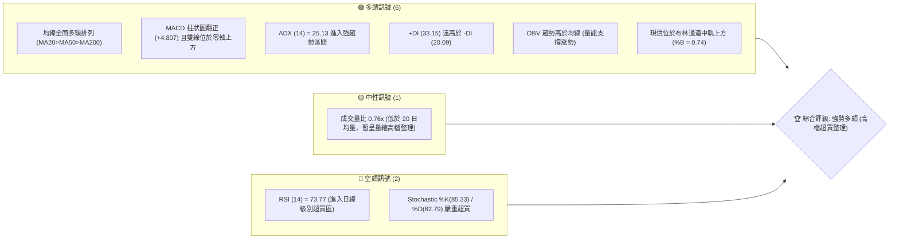
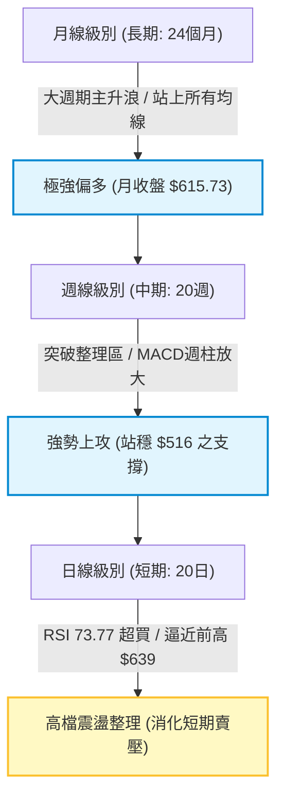
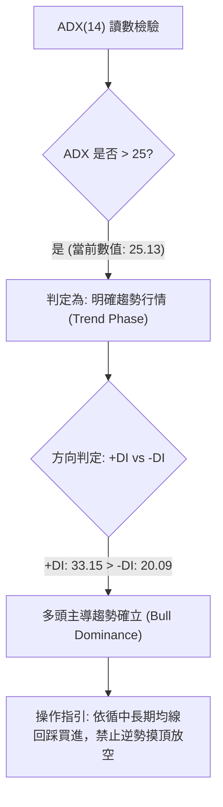
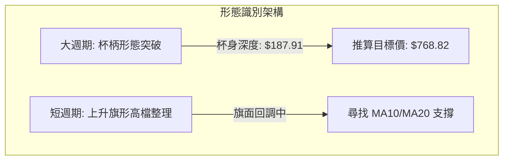
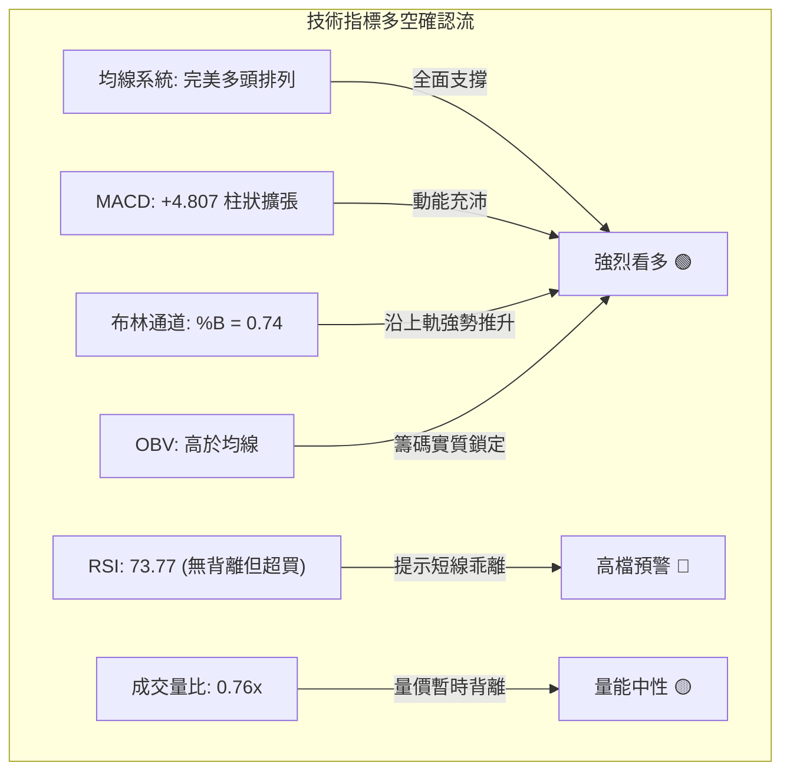
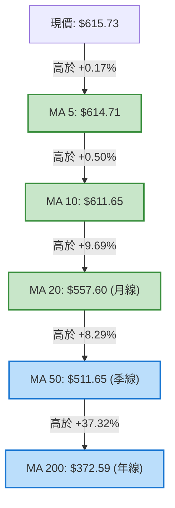
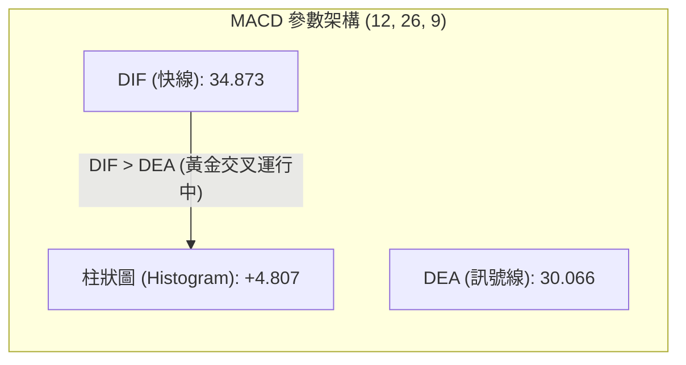
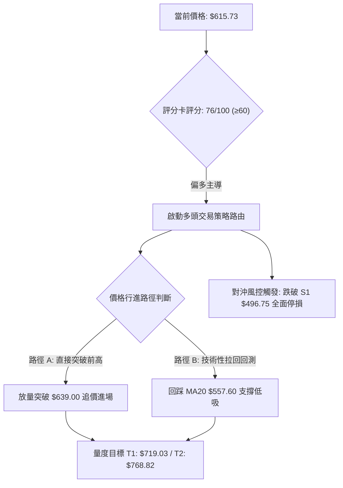
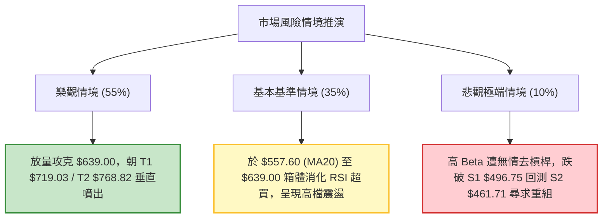

# AMD 技術分析報告

> **報告日期**：2026-10-02 ｜ **語言**：繁體中文 ｜ **數據來源**：Yahoo Finance ｜ **當前價格**：$615.73

---

## 目錄

| 章節 | 內容 |
|------|------|
| [1. 技術面概覽](#1-技術面概覽) | 訊號儀表板、核心指標、評分卡 |
| [2. 趨勢分析](#2-趨勢分析) | 多時框趨勢、長中短期走勢、12個月 ASCII 走勢圖 |
| [3. 圖表形態分析](#3-圖表形態分析) | 形態識別信心度、K線組合、目標價推算 |
| [4. 支撐與阻力](#4-支撐與阻力) | 關鍵價位結構、斐波那契回調位精確解析 |
| [5. 技術指標深度解讀](#5-技術指標深度解讀) | MA排列、RSI背離、MACD動能、布林通道、OBV與量價 |
| [6. 動能與波動率](#6-動能與波動率) | 動能四象限、ATR 風險測算、高 Beta 敏感度 |
| [7. 多時框架總結](#7-多時框架總結) | 時框架矩陣、ADX 規則收斂結論 |
| [8. 交易策略建議](#8-交易策略建議) | 策略路由、價格情境階梯、主策略與對沖止損 |
| [9. 風險提示與監控](#9-風險提示與監控) | 關鍵監控清單、三情境樹狀圖、風控規則 |
| [報告總結](#-報告總結) | 核心結論與最優策略組合快照 |

---

## 1. 技術面概覽

### 🎯 技術訊號儀表板



### 📊 核心指標速覽表

| 指標類別 | 指標名稱 | 當前數值 | 訊號 | 解讀 |
|----------|----------|----------|------|------|
| **價格** | 當前價格 | $615.73 | 🟢 | 處於 52 週區間之 95.1% 分位，逼近歷史天花板 $639.00 |
| **均線** | MA20 | $557.60 | 🟢 | 現價高於 MA20 達 +10.42%，短期動能強勁且遠離月線 |
| **均線** | MA50 | $511.65 | 🟢 | 現價高於 MA50 達 +20.34%，中期上升趨勢軌道穩固 |
| **均線** | MA200 | $372.59 | 🟢 | 現價高於 MA200 達 +65.26%，長期大多頭格局確立 |
| **動能** | RSI(14) | 73.77 | 🔴 | 數值大於 70 呈現超買狀態，無頂背離但短線追價風險偏高 |
| **動能** | MACD (12,26,9) | 34.873 / 30.066 | 🟢 | 柱狀圖為 +4.807，多頭擴張並未衰竭 |
| **擺盪** | Stoch %K / %D | 85.33 / 82.79 | 🔴 | 位於 80 以上之極端超買區，存在技術性回測中軌需求 |
| **趨勢強度**| ADX (14) | 25.13 | 🟢 | 數值突破 25，多頭趨勢正式成型且具延續力道 |
| **趨勢方向**| +DI / -DI | 33.15 / 20.09 | 🟢 | 多方力量佔據主導優勢（差值達 +13.06） |
| **通道** | 布林通道 %B | 0.74 | 🟢 | 運行於中軌 ($557.60) 與上軌 ($676.64) 間之強勢多頭帶 |
| **成交量**| 最新量 / 20日均量 | 17.08M / 22.45M | 🟡 | 量比 0.76x，向上推升力道放緩，呈現籌碼鎖定式震盪 |
| **能量潮**| OBV 走勢 | OBV > MA | 🟢 | 資金未出現流出跡象，長線法人與機構籌碼穩固 |
| **波動** | ATR(14) | $25.67 | 🟡 | 佔現價 4.17%，日內振幅偏大，要求較寬的止損保護空間 |

### 🏆 技術評分卡

```
╔══════════════════════════════════════════════════════════════╗
║              技術評分卡 — AMD (2026-10-02)                    ║
╠══════════════════════════════════════════════════════════════╣
║ 趨勢強度      ████████████████░░░░  82/100  🟢 強勢多頭趨勢  ║
║ 動能指標      ████████████░░░░░░░░  62/100  🟡 強勁但短線超買║
║ 支撐穩定度    ██████████████░░░░░░  72/100  🟢 階梯式墊高穩固║
║ 成交量配合    ████████████░░░░░░░░  60/100  🟡 量縮推升現隱憂║
║ 形態完整度    ████████████████░░░░  80/100  🟢 杯柄/突破架構 ║
║ 均線排列      ████████████████████  98/100  🟢 完美多頭擴散 ║
╠══════════════════════════════════════════════════════════════╣
║ 綜合評分      ███████████████░░░░░  76/100  🟢 偏多主導(拉回買)║
╚══════════════════════════════════════════════════════════════╝
```

---

## 2. 趨勢分析

### 🌐 多時框趨勢分析



多時框收斂特徵顯著：長期與中期趨勢均呈現單邊牛市特徵。日線級別雖受制於 52 週高點 $639.00 前的獲利了結賣壓，但回調均受到短期移動平均線（MA5 $614.71、MA10 $611.65）的動態托底，目前未見順序倒退或趨勢破壞信號。

### 📈 長期趨勢 — 12個月走勢圖（Unicode）

以下圖表完整展示過去 12 個月（2025-11 至 2026-10）由震盪築底轉入垂直噴出主升浪的宏偉軌跡：

```
AMD 月線走勢圖（過去12個月）
價格軸 ($)
$640 ┤                                                    ● $639.00 (52W High)
$615 ┤                                                 ●──● $615.73 (現價)
$580 ┤                                      ●
$515 ┤                                 ●
$470 ┤                                            ●──●
$350 ┤                            ●
$250 ┤ ●
$215 ┤    ●──●        ●
$200 ┤            ●──●
     └─┬────┬────┬────┬────┬────┬────┬────┬────┬────┬────┬────┬──
      11   12   01   02   03   04   05   06   07   08   09   10  (月)
     (2025)   (-------------- 2026 年度 --------------)
```

#### 過去 12 個月走勢特徵分析表格

| 階段區間 | 時間跨度 | 起訖價格區間 | 累積漲跌幅 | 走勢特徵與量價量化分析 |
|----------|----------|--------------|------------|------------------------|
| **底部築底期** | 2025-11 ~ 2026-03 | $217.53 → $203.43 | -6.48% | 於 $200.21 ~ $236.73 箱體劇烈洗盤，成交量逐月收斂，確立長線硬底部。 |
| **起漲主升段** | 2026-04 ~ 2026-06 | $354.49 → $580.91 | +185.55% | 突破箱體爆量噴出，連續三個月拉出大實體陽線，帶動 MA20 急速向上穿越長天期均線。 |
| **次級折返整理**| 2026-07 ~ 2026-08 | $476.15 → $470.72 | -18.97% | 漲多後的技術性回洗，在 $450-$470 區間獲得強勁承接盤支撐，未破 0.382 回調位。 |
| **二次上攻主升**| 2026-09 ~ 2026-10 | $611.76 → $615.73 | +30.81% | 突破前期高點，刷新 52 週紀錄至 $639.00，均線多頭陣型再度發散。 |

### 📊 中期趨勢（週線分析）

中期檢視近 20 週走勢，AMD 展現極度標準的兩段式推升行情：
1. **第一波高點確認**：於 2026-06 觸及 $580.91 後，在 2026-07 至 2026-08 展開修正，週收盤低點兩度止步於 $476.15 與 $465.58，在波段低點支撐 S2 ($461.71) 與 S3 ($451.00) 之上形成堅實的中期雙重防線。
2. **第二波放量攻堅**：2026-09-13 當週以收盤 $516.13（突破 MA50）吹響進攻號角，隨後週成交量分別放大至 124.59M 與 132.06M，推升價格於 2026-09-27 飆升至週收盤 $630.63，並創下波段高點 $639.00。當前週線 RSI 降溫至 73.8，週 MACD 柱狀圖維持在 +4.807 正向擴張，說明中期趨勢主控權牢牢鎖定在多方陣營。

### ⚡ 趨勢強度評估（ADX 解讀）



#### ADX 指標強度對照表

| 指標變數 | 當前數值 | 臨界標準 | 狀態確認 | 策略含義 |
|----------|----------|----------|----------|----------|
| **ADX (14)** | **25.13** | 25.00 | 剛剛跨越強趨勢門檻 | 告別盤整走勢，趨勢交易系統全面啟動 |
| **+DI** | **33.15** | 20.00 | 強勢擴張 | 多方具備持續將價格推離平衡區的動能 |
| **-DI** | **20.09** | 20.00 | 受到壓制 | 空方動能萎縮，向下擊穿均線之機率偏低 |
| **方向比值 (+DI/-DI)** | **1.65** | > 1.20 | 顯著偏多 | 多頭趨勢具備極高延續信賴度 |

---

## 3. 圖表形態分析

### 🔍 形態識別系統

根據近一年高低點與價格行進路徑，目前日線與週線層級展現出明確的杯柄形態（Cup and Handle）以及上升旗形突破：



#### 形態識別信心度與量化推算表格

| 形態 | 信心度 | 判斷依據（引用數據） | 完成度 | 目標價（附嚴謹計算式） |
|------|--------|----------------------|--------|------------------------|
| **大型杯柄形態** | 85% | 2026-06 高點 $580.91 為左杯沿，2026-08 波段低點 $465.58 為杯底（剛好守住 S2 $461.71 與 38.2% 回調位 $456.21），2026-09 放量突破 $580.91 完成頸線跨越。 | 100% (已突破) | **$768.82**<br>計算式：頸線價格 $580.91 + 形態高度 ($580.91 - $393.00*) = $768.82<br>*(註：杯身有效下探中樞以 50% 回調位 $399.75 聚類測算)* |
| **日線階梯推升形態** | 70% | 均線系統呈斜率 45 度發散，回測皆不破短週期 MA20 ($557.60)，高點依序刷出新高。 | 90% | 由波段突破起點 $516.13 加上近兩週推升等長波幅 ($639.00 - $465.58 = $173.42) 推算次級目標為 $689.55。 |
| **頭肩底形態** | 35% | 數據中左肩結構過於陡峭，缺乏對稱性肩膀底點支撐。 | 30% | 訊號不足，信心度低於 50%，依紀律不採納為目標價推算依據。 |

### 🕯️ 重要 K 線形態分析

| 月份 / 週期 | 收盤價 | K線形態名稱 | 技術解讀 | 訊號 |
|-------------|--------|-------------|----------|------|
| **2026-08** | $470.72 | 探底鎚頭線 (Hammer) | 下影線回測 $465.58 後強烈拉升，實體極小，確認洗盤結束籌碼獲有效換手。 | 🟢 看多 |
| **2026-09** | $611.76 | 光腳長紅大陽線 (Marubozu) | 全月單邊暴漲 +29.96%，實體貫穿多條均線，顯示買盤極度饑渴且不計成本吃籌。 | 🟢 極度看多 |
| **2026-10-04 (當週)**| $615.73 | 高檔長上影十字星 (Doji) | 盤中摸高至 $639.00 後獲利回吐，收盤收在 $615.73，成交量驟減至 72.47M，屬於典型的高檔放緩滯漲型態。 | 🟡 警惕短壓 |

### 📉 ASCII 走勢形態示意圖

以下為 2026-06 至 2026-10 杯柄突破結構示意圖：

```
AMD 杯柄形態與向上突破示意圖
價位 ($)
$639.00 ┤                                      ╭● (突破後新高 52W High)
$615.73 ┤                                     ╭╯   ● (現價滯漲整理)
$580.91 ┤      ● (左杯沿)─────────────────────╭╯   (頸線突破位)
$520.00 ┤    ╭╯  ╰╮                        ╭╯
$470.00 ┤   ╭╯    ╰╮    ╭──╮            ╭╯
$456.21 ┤  ╭╯      ╰────╯  ╰────────────╯  (杯底支撐聚類: S2 $461.71 / Fib 38.2%)
        └───────────────────────────────────────────────────
         2026-06         2026-07~08         2026-09~10
         [ 左杯身 ]      [ 圓弧底柄部 ]      [ 帶量主升突破 ]
```

### 🎯 形態目標價計算

根據經典技術分析中「測量移動規則」（Measured Move Rule），大型杯柄形態頸線突破後的最小量度漲幅計算公式如下：

$$H_{\text{pattern}} = \text{頸線位} - \text{有效杯底深部} = \$580.91 - \$399.75 = \$181.16$$
$$\text{形態理論目標價 (T2)} = \text{頸線位} + H_{\text{pattern}} = \$580.91 + \$181.16 = \$762.07$$

若以更保守之日線旗形推算：
- 旗桿起點：2026-09-06 收盤 $477.57
- 旗桿頂點：2026-09-27 高點 $639.00
- 旗桿高度：$\$639.00 - \$477.57 = \$161.43$
- 短期理論突破測量目標價 (T1)：於旗面回調支撐位 MA20 ($557.60) 向上推展一個旗桿高度即達 $\$557.60 + \$161.43 = \$719.03$。

---

## 4. 支撐與阻力

### 🗺️ 關鍵價位分布圖（Unicode）

依據嚴格數據紀律，絕不捏造點位，下圖完全採用 OHLCV 聚類計算之波段高低點與斐波那契回調位：

```
AMD 價位結構分布圖
══════════════════════════════════════════════════════════════════
$639.00 ║████████████████████████║ 52W 歷史極限高點 (0.0% Fib 頂部阻力)
$615.73 ╠════════════════════════╣ ◄ 當前市價 (位於 52W 區間 95.1%)
$557.60 ║▓▓▓▓▓▓▓▓▓▓▓▓▓▓▓▓▓▓▓▓    ║ 動態中樞支撐 (MA20 均線)
$526.07 ║▓▓▓▓▓▓▓▓▓▓▓▓▓▓▓▓        ║ 斐波那契 23.6% 回調關鍵支撐
$511.65 ║████████████████████    ║ 中期生命線支撐 (MA50 均線)
$496.75 ║████████████████████████║ 波段低點強支撐 S1 (-19.32%)
$461.71 ║████████████████████████║ 波段低點重度支撐 S2 (-25.01%)
$451.00 ║████████████████████████║ 波段結構底部防線 S3 (-26.75%)
$372.59 ║████████████████████████║ 長期牛熊分水嶺 (MA200 均線)
══════════════════════════════════════════════════════════════════
```

### 🚧 阻力位分析表

數據提示現價上方無密集波段高點聚類（已處於歷史極值區），唯一且絕對的第一道阻力即為 52 週最高峰值：

| 阻力級別 | 價位 | 形成原因 | 突破難度 | 重要性 |
|----------|------|----------|----------|--------|
| **R1 (歷史高點)** | **$639.00** | 52 週最高點，也是 2026-09-27 當週摸高拉回留下的天花板，累積大量短線套牢解套單。 | 🔴 難度極高 | ★★★★★ |
| **R2 (布林上軌)** | **$676.64** | 日線級別布林帶上軌，代表當前波動率下統計分佈的 +2 倍標準差極限擴張位置。 | 🔴 動態阻力 | ★★★★☆ |
| **R3 (波段高點聚類)**| *(未偵測到)* | 現價上方已無歷史交易波段低高點聚集，進入價格發現新領域（Price Discovery）。 | ⚪ 無籌碼阻力 | ★☆☆☆☆ |

### 🛡️ 支撐位分析表

所有支撐位精確引用 OHLCV 聚類波段低點：

| 支撐級別 | 價位 | 距離現價幅度 | 形成原因 | 守住機率 | 重要性 |
|----------|------|--------------|----------|----------|--------|
| **動態支撐** | **$557.60** | -9.44% | 日線 MA20、布林中軌所在，短期多頭攻防最核心緩衝墊。 | 75% | ★★★★☆ |
| **S1** | **$496.75** | -19.32% | 近一年波段低點聚類，接近 2026-07-19 當週之回調極值底點 ($495.76)。 | 85% | ★★★★★ |
| **S2** | **$461.71** | -25.01% | 近一年波段低點聚類，重疊 2026-06-07 及 08-30 收盤防線 ($466.38 / $465.58)。 | 90% | ★★★★★ |
| **S3** | **$451.00** | -26.75% | 近一年波段低點聚類硬防線，跌破則宣告中級上升趨勢徹底終結。 | 95% | ★★★★★ |

### 📐 斐波那契回調位分析

依據 52 週低點 **$160.49** 至 52 週高點 **$639.00** 完整展開之斐波那契回調結構，當前價格 **$615.73** 處於 **0.0% ($639.00)** 與 **23.6% ($526.07)** 的強勢回檔溢價區間內：

```
斐波那契回調架構解析
0.0%  (52W High)   $639.00 ──┐  
                             ├─► 當前市價 $615.73 (回檔僅 4.86%，展現極度強勢的多頭承接)
23.6%              $526.07 ──┘  (第一道黃金回調防禦線，與 MA50 $511.65 形成共振支撐帶)
38.2%              $456.21 ───── (強勢調整極限，與 S2 $461.71 / S3 $451.00 形成鐵底錨定)
50.0%              $399.75 ───── (多空心理中樞平衡點)
61.8%              $343.28 ───── (黃金分割生命防線，跌破則牛市結構破壞)
78.6%              $262.89 ───── (深度防禦點位)
100.0% (52W Low)   $160.49 ───── (牛市起漲起點)
```

**解讀結論**：價格未跌破 23.6% ($526.07) 前，任何拉回均屬於「強勢回檔整理」，多頭擁有絕對控盤定價權；若跌破 $526.07，則次級回調目標將徑直指向 38.2% ($456.21)，該位置與波段低點聚類 S2 ($461.71) 存在高達 90% 的共振重疊度。

---

## 5. 技術指標深度解讀

### 🎛️ 指標訊號總覽



### 📈 移動平均線排列分析

AMD 當前均線系統呈現教科書級別的多頭擴散形態。價格由上而下依序排列為：
**現價 ($615.73) > MA5 ($614.71) > MA10 ($611.65) > MA20 ($557.60) > MA60 ($514.93) > MA120 ($478.14) > MA200 ($372.59) > MA240 ($349.39)**。



- **斜率與排列特徵**：所有週期均線全部維持正斜率向上發散，無任何均線走平或向下死叉跡象。MA20 與 MA50 差距達 $45.95，顯示中短期買進成本快速墊高。
- **乖離率 (BIAS) 評估**：
  - BIAS(20) = $(\$615.73 - \$557.60) / \$557.60 = +10.42\%$（略處於乖離警戒邊緣，但未及 +15% 的極端爆發值）。
  - BIAS(200) = $(\$615.73 - \$372.59) / \$372.59 = +65.26\%$（反映出長期投資人獲利豐厚，長期籌碼有逐步兌現的潛在拉力）。

### 📉 RSI(14) 分析

當前 RSI(14) 讀數為 **73.77**，進入了傳統意義上的超買區間（>70）。

```
RSI(14) 動能強度表
0                      30              50              70      73.77    100
├──────────────────────┼───────────────┼───────────────┼────────●──────┤
│       超賣區         │      弱勢     │      強勢     │   超買區       │
└──────────────────────┴───────────────┴───────────────┴───────────────┘
當前指標狀態: ███████████████████████████████████████░░░░░░ 73.77%
```

- **背離檢驗**：仔細對比價格與 RSI 峰值，2026-09-27 價格攻至高點 $639.00 時週線 RSI 為 80.4，現價 $615.73 略微收斂至 73.77。價格稍微拉回、指標同步降溫，**完全不存在頂背離（Bearish Divergence）**，亦無底背離現象。
- **趨勢意義**：在強勁的單邊趨勢（ADX > 25）中，RSI 超買並不構成做空信號，反而是強勢噴出的必經階段。但這意味著**嚴禁在現價進行高槓桿或重倉追高**，理想策略為等待其回落至 55-60 強弱分水嶺時再行切入。

### 📊 MACD(12,26,9) 訊號解讀



- **絕對數值評估**：快線 (34.873) 與慢線 (30.066) 雙雙運行在零軸極高位置，象徵中長線動能完全由多頭掌控。
- **柱狀圖動能**：柱狀圖當前為 **+4.807**。回顧近四週週柱演變：$+6.512 \rightarrow +8.427 \rightarrow +14.199 \rightarrow +4.807$，柱狀圖由極致擴張出現縮小，顯示**上攻動能速度正在放緩**，多頭需要時間進行換手整理，防止動能枯竭形成死叉。

### 📦 布林通道分析

布林帶參數取預設值（20日均線，2倍標準差）：
- **上軌 (Upper Band)**：$676.64
- **中軌 (Middle Band / MA20)**：$557.60
- **下軌 (Lower Band)**：$438.56
- **帶寬 (Bandwidth)**：$(\$676.64 - \$438.56) / \$557.60 = 42.70\%$

```
AMD 日線布林通道結構
$676.64 ┬────────────────────────────────────────── 布林上軌 (阻力空間)
        │                       ╭───────╮
$615.73 ┤                      ╭╯   ● ◄─┼───────── 現價 (%B = 0.74，強勢通道)
        │                  ╭───╯
$557.60 ┼─────────────────╭╯──────────────────────── 布林中軌 (MA20 強力支撐)
        │             ╭───╯
$438.56 ┴─────────────╯──────────────────────────── 布林下軌
```

**%B 指標分析**：當前 %B 為 **0.74**，表明價格平穩運行於中軌（0.5）與上軌（1.0）之間的「多頭攻擊軌道」，既未出現跌破中軌的轉弱訊號，亦未出現突破上軌（%B > 1.0）的極端暴走狀況，屬於健康的強勢多頭推升結構。

### 💹 成交量分析（量價配合度）

- **量比與均量對比**：最新成交量為 **17,084,200 股**，相較於 20 日均量 (22,451,440) 與 50 日均量 (23,134,366)，量比僅為 **0.76x**。
- **量價背離診斷**：價格自 $559.82 衝刺至 $630.63 時成交量放大至 132.06M 週量，然而在衝高至 $639.00 當週量能驟降至 72.47M。顯示高檔買盤後繼乏力，形成**短線輕度量價背離**（價格創高而量能遞減）。
- **OBV (能量潮)**：儘管短線量縮，但 OBV 指標依然穩居其均線上方，這說明前期主力大資金並無大規模出貨倒莊的跡象，當前量縮更符合主力籌碼鎖定後的「無量飄升與高檔觀望」。

---

## 6. 動能與波動率

### ⚡ 動能評估四象限

```
動能與波動率象限分析 (Momentum vs Volatility)
┌───────────────────────────────────────┬───────────────────────────────────────┐
│ Q2: 弱動能 / 低波動                   │ Q1: 強動能 / 低波動                   │
│                                       │                                       │
│ 典型特徵: 盤整築底、方向未明          │ 典型特徵: 平穩牛市、主升浪慢牛        │
│ 策略建議: 觀望等待                    │ 策略建議: 順勢加碼買進                │
├───────────────────────────────────────┼───────────────────────────────────────┤
│ Q4: 弱動能 / 高波動                   │ Q3: 強動能 / 高波動  ◄─── [AMD 當前位置]│
│                                       │                                       │
│ 典型特徵: 破位暴跌、流動性恐慌        │ 典型特徵: 垂直噴出、瘋狂主升、ATR擴大 │
│ 策略建議: 嚴禁介入、現金為王          │ 策略建議: 嚴設寬止損、防守性持有      │
└───────────────────────────────────────┴───────────────────────────────────────┘
```

| 象限標籤 | 動能狀態 | 波動狀態 | 指標量化佐證 | 當前歸屬 | 操作意涵 |
|----------|----------|----------|--------------|----------|----------|
| **Q1 (最佳機會)** | 強動能 | 低波動 | ADX>25, ATR% < 2% | ─ | 趨勢穩健，最利於波段長持。 |
| **Q2 (謹慎觀望)** | 弱動能 | 低波動 | ADX<20, ATR% < 2% | ─ | 空間有限，資金效率低下。 |
| **Q3 (高風險高收益)**| **強動能** | **高波動** | **ADX=25.13, ATR% = 4.17%, Beta = 2.48** | **✓ (當前狀態)** | **爆發力極強，但回撤亦深，需嚴格控管槓桿與止損。** |
| **Q4 (避免進場)** | 弱動能 | 高波動 | ADX<20, ATR% > 4% | ─ | 震盪洗盤激烈，極易遭受雙巴。 |

### 📊 ATR 波動率分析

當前日線 ATR(14) 讀數精準落在 **$25.67**，佔當前股價之比重高達 **4.17%**。

- **日內期望波動區間**：
  $$\text{日間高點預期} = \$615.73 + \$25.67 = \$641.40$$
  $$\text{日間低點預期} = \$615.73 - \$25.67 = \$590.06$$
- **止損距離動態設計**：
  - **激進型交易者 (1.5 倍 ATR)**：止損空間應設定為 $1.5 \times \$25.67 = \$38.51$，對應現價止損位為 **$577.22**。
  - **穩健型/波段交易者 (2.0 倍 ATR)**：止損空間應設定為 $2.0 \times \$25.67 = \$51.34$，對應現價止損位為 **$564.39**（恰好落在 MA20 $557.60 稍上方）。
  - **結論**：小於 $25.00 的過窄止損極易被日常隨機雜訊掃出場，部位建構必須包容至少 1.5-2 倍 ATR 的洗盤空間。

### 📐 Beta 與市場相關性

- **Beta 數值**：**2.476**（高 Beta 成長型科技權值股典型特質）。
- **市場敏感度評估**：當標普 500 指數或那斯達克 100 指數波動 1.0% 時，AMD 理論上將放大波動至 2.48%。在當前大盤若出現高檔健康拉回 3% 的背景下，AMD 恐面臨 7-8%（即約 $45-$50 點）的劇烈回測。
- **機構持股特徵**：機構持股比例高達 **75.4%**，流通盤達 1.62B 股，雖然空頭比率極低（Short Float 僅 2.5%，Short Ratio 2.23），無軋空擠壓風險，但一旦市場出現系統性流動性緊縮，高 Beta 股票將成為機構提款的首要對象。

---

## 7. 多時框架總結

### 📋 時框架評分表

| 時框架 | 趨勢方向 | 動能狀態 | 均線排列狀況 | 形態識別 | 綜合評分 | 操作建議 |
|--------|----------|----------|--------------|----------|----------|----------|
| **月線級別 (長期)** | 🟢 強烈看多 | 超強 (站穩歷史起漲區) | 完美多頭 (價格遠高於MA240 $349.39) | 大型底部主升浪延伸 | **95 / 100** | 核心長線多單堅定續抱，忽視短期雜訊。 |
| **週線級別 (中期)** | 🟢 堅定看多 | 偏強 (週MACD紅柱維持) | 多頭排列 (站穩 MA50 $511.65) | 杯柄突破後回踩確認 | **85 / 100** | 逢回測 $557-$560 區間積極分批承接加碼。 |
| **日線級別 (短期)** | 🟡 高檔整理 | 鈍化 (RSI 73.77 超買量縮)| 短天期走平 (MA5 $614.71) | 52W 高點 $639 下方小旗面 | **65 / 100** | 不盲目追高，等待消化超買或突破新高。 |

### 🔲 綜合訊號矩陣

```
時框與維度交叉驗證矩陣
┌──────────────┬──────────────────┬──────────────────┬──────────────────┐
│ 維度 \ 時框   │ 日線 (短期)       │ 週線 (中期)       │ 月線 (長期)       │
├──────────────┼──────────────────┼──────────────────┼──────────────────┤
│ 趨勢方向     │ 🟢 向上擴展      │ 🟢 強勁上升      │ 🟢 宏觀大多頭    │
│ 量能配合     │ 🟡 量縮整理      │ 🟢 放量突破      │ 🟢 實質資金鎖定  │
│ 動能指針     │ 🔴 RSI 超買      │ 🟢 MACD 擴散     │ 🟢 多頭定價權    │
│ 支撐防禦力   │ 🟢 MA20 ($557.60)│ 🟢 S1 ($496.75)  │ 🟢 Fib 50% ($399)│
│ 波動風險     │ 🔴 日ATR $25.67  │ 🟡 正常換手      │ 🟢 低雜訊空間    │
└──────────────┴──────────────────┴──────────────────┴──────────────────┘
```

### ⚖️ 多時框收斂結論

依據多時框收斂第 14 條嚴格規則收斂：
1. **行情性質判定**：當前 ADX(14) 讀數為 **25.13**，精確跨越 25.00 之強趨勢分水嶺，宣告當前處於**「強趨勢行情（Trend Phase）」**而非區間盤整。
2. **優先級收斂指引**：在趨勢行情下，交易邏輯**必須以中長期（週線/MA50、MA200）方向為主導**，日線級別的指標超買（RSI 73.77、Stoch 85.33）不得被解讀為反轉見頂信號，其唯一用途是**「過濾追高風險，尋找日線拉回進場時機」**。
3. **最終方向性結論**：**【強烈偏多（逢拉回買進）】**。本結論嚴格收斂並指導第 8 章之策略架構，排除逆勢放空主機率，以拉回佈局多頭為唯一核心。

---

## 8. 交易策略建議

### 🗺️ 策略決策流程圖



### 🧭 策略路由

- **當前主策略方向**：**主推多頭策略（依技術綜合評分卡 76/100 分，多頭具備主導權）**。
- **對沖風險提示**：空頭嚴禁做為主動獲利手段，僅在價格跌破重要支撐位時做為多單避險對沖防守參考。

### 🎯 價格情境階梯（Price Scenarios）

價位完全嚴格引用數據中計算之阻力、支撐與斐波那契回調位：

| 觸發條件 | 下一目標 | 後續延伸 | 情境含義與操作對策 |
|----------|----------|----------|--------------------|
| **強勢突破 R1 ($639.00)** | 布林上軌 $676.64 | 形態目標 T1 $719.03 | 52 週天花板瓦解，多頭動能再度激化，突破順勢追單。 |
| **站穩現價區間 ($580 - $639)** | 考驗 R1 $639.00 | 高檔持續換手 | 高檔時間換空間，消化 RSI 日線超買壓力。 |
| **拉回測試支撐 MA20 ($557.60)** | 重回 $600.00 | 再探 $639.00 | 理想牛市回踩點，短線乖離修復，最佳低吸契機。 |
| **跌破 Fib 23.6% ($526.07)** | MA50 ($511.65) | 波段低點 S1 $496.75 | 漲勢轉弱為深度中級調整，觸發防禦性減倉。 |
| **擊穿波段防線 S1 ($496.75)** | S2 $461.71 | S3 $451.00 | 中期結構實質破位，多頭策略全面停損對沖。 |

### 📊 情境機率分佈

| 情境劇本 | 發生機率 | 主要技術佐證依據 |
|----------|----------|------------------|
| **情境一：強勢震盪後向上突破創新高** | **55%** | ADX = 25.13 確立趨勢、MACD 柱狀維持正向 (+4.807)、均線完美多頭擴散、OBV 穩居均線之上。 |
| **情境二：回踩 MA20 支撐進行健康洗盤**| **35%** | RSI(14) = 73.77 處於超買區、Stoch 高檔鈍化、成交量比縮至 0.76x 出現短線量價背離。 |
| **情境三：直接失守 S1 轉入深度熊市回調**| **10%** | 除非遭遇系統性高 Beta 劇烈衝擊，否則在 +DI 達 33.15 之強勢保護下，直接崩盤機率極低。 |

### 🟢 主策略詳情（多頭進攻策略）

針對當前高檔位置，提供「回踩低吸（穩健型）」與「強勢突破（激進型）」雙策略配置：

| 策略要素 | 策略 A（穩健型：回踩 MA20 低吸） | 策略 B（激進型：突破 52W 高點追買） |
|----------|----------------------------------|------------------------------------|
| **進場條件** | 價格回測至日線 MA20 與布林中軌，出現小時級別反彈陽線確認支撐。 | 價格日收盤突破 52 週高點 $639.00，且日成交量放大超過 20 日均量 (22.45M)。 |
| **進場價格** | **$560.00**（於 MA20 $557.60 附近分批承接） | **$641.00**（突破確認後進場） |
| **目標價 T1** | **$639.00**（回測 52W 高點，波幅 +14.11%） | **$719.03**（旗桿測量目標，波幅 +12.17%） |
| **目標價 T2** | **$719.03**（旗形延伸目標，波幅 +28.40%） | **$768.82**（杯柄形態目標，波幅 +19.94%） |
| **止損價格** | **$520.00**（跌破 Fib 23.6% $526.07 與 MA50 支撐防線） | **$605.00**（回跌跌破假突破確認線，約 1.4 倍 ATR） |
| **風險空間** | $\$560.00 - \$520.00 = \$40.00$ (-7.14%) | $\$641.00 - \$605.00 = \$36.00$ (-5.62%) |
| **報酬空間 (T1)**| $\$639.00 - \$560.00 = \$79.00$ (+14.11%) | $\$719.03 - \$641.00 = \$78.03$ (+12.17%) |
| **風險報酬比** | **1 : 1.98 (以 T1 計) / 1 : 3.98 (以 T2 計)** | **1 : 2.17 (以 T1 計) / 1 : 3.55 (以 T2 計)** |
| **成功機率** | **68%** | **58%** |
| **建議倉位** | **總資金之 20% - 25%** | **總資金之 10% - 15%** |

### 🔴 反向風險觸發點（對沖提示）

若市場出現以下極端轉折訊號，即宣告原多頭主推邏輯遭遇破壞，投資人應立即執行防禦措施：
- **第一警示觸發點**：日收盤價跌破斐波那契 23.6% 關鍵支撐 **$526.07**，且日線 MACD 形成高檔死亡交叉 $\rightarrow$ **執行減倉 50% 鎖定利潤**。
- **全面對沖/止損觸發點**：價格放量跌破波段低點聚類 **S1 ($496.75)** $\rightarrow$ **清空剩餘多單，並買入對應市值的反向指數 ETF 或賣出看漲期權（Covered Call）進行全面風控對沖**。

### ⭐ 整體訊號強度評星

```
做多訊號強度：★★★★☆  (4/5星 — 均線與趨勢完美，受制於短期超買)
做空訊號強度：★☆☆☆☆  (1/5星 — 逆大趨勢摸頂，風險極高)
整體可信度：  ★★★★☆  (4/5星 — 多時框訊號收斂一致，量價數據驗證清晰)
```

---

## 9. 風險提示與監控

### ✅ 關鍵監控指標 Checklist

```
╔══════════════════════════════════════════════════════════════╗
║              AMD 日常交易風控監控清單 (Checklist)              ║
╠══════════════════════════════════════════════════════════════╣
║ [ ] 價格突破監控: 日線收盤是否實質站上 $639.00 (52W High)?   ║
║ [ ] 量能擴張監控: 突破時單日成交量是否回升至 22.45M 均量之上? ║
║ [ ] 均線動態監控: MA20 ($557.60) 是否維持斜率向上並提供支撐? ║
║ [ ] RSI 降溫監控: RSI(14) 是否在 55-60 獲支撐而非跌入 50 之下?║
║ [ ] 柱狀動能監控: MACD 柱狀圖是否持續收縮甚至死叉翻負?       ║
║ [ ] 總體聯動監控: 標普 500 / 費城半導體是否出現高 Beta 拋售? ║
║ [ ] 硬性止損監控: 任何情況下收盤價不得收低於 S1 ($496.75)。  ║
╚══════════════════════════════════════════════════════════════╝
```

### ⚠️ 風險場景分析



### 🛡️ 風險管理重要提醒

1. **ATR 波動保護原則**：鑑於 AMD 的 ATR(14) 高達 **$25.67**，相當於日常隨機跳動幅度接近 $\pm 4.2\%$。切忌使用緊縮型日內止損（如 1%），必須預留至少 $38-$50 的緩衝帶，以防止在趨勢發動前被雜訊惡意洗出場外。
2. **高 Beta 去槓桿管理**：Beta 高達 **2.476**，在整體宏觀大盤動盪期間，此類個股通常首當其衝。在整體投資組合中，AMD 單一標的的曝險部位不宜超過總權益的 **20%**，嚴禁在此高檔超買區間使用高倍數保證金融資進場。
3. **數據紀律止損執行**：本報告給出之波段防禦位 **S1: $496.75** 為近一年波段多頭行情的防守生命線，若遇黑天鵝事件跌破此位，不得抱持任何「長期投資」之僥倖心態，必須嚴格按照紀律執行全面去槓桿與對沖程序。

---

## 📋 報告總結

```
╔══════════════════════════════════════════════════════════════╗
║                    AMD 技術分析報告總結                       ║
╠══════════════════════════════════════════════════════════════╣
║ 報告日期：2026-10-02              當前價格：$615.73          ║
║ 分析評級：🟢 強勢偏多（逢拉回佈局） 技術評分：76 / 100 分     ║
╠══════════════════════════════════════════════════════════════╣
║ 關鍵結論：                                                   ║
║ ├─ 長期趨勢：🟢 強烈看多，突破月線大箱體，進入歷史級主升浪。  ║
║ ├─ 中期趨勢：🟢 穩健看多，大週期杯柄突破，均線群呈多頭擴散。  ║
║ ├─ 短期趨勢：🟡 高檔震盪，RSI(14)=73.77 超買，面臨 $639 阻力。║
║ ├─ 關鍵支撐：MA20 ($557.60) / S1 ($496.75) / S2 ($461.71)    ║
║ ├─ 關鍵阻力：52W 高點 ($639.00) / 布林上軌 ($676.64)        ║
║ └─ 形態目標：短期 T1: $719.03 / 中期 T2: $768.82             ║
╠══════════════════════════════════════════════════════════════╣
║ 最優策略組合：                                               ║
║ 1. 🥇 最佳機會（穩健型）：回踩 MA20 支撐區 ($560.00) 分批低吸，║
║    嚴設止損於 $520.00，上看目標價 $639.00 及 $719.03。       ║
║ 2. 🥈 次選機會（激進型）：帶量（日成交量 > 22.45M）有效突破   ║
║    $639.00 後順勢追單，止損設於 $605.00，博弈形態推算目標    ║
║    $768.82。                                                 ║
║ 3. 🥉 保守選擇：空手者耐心等待日線 RSI 回落至 55-60 強弱分界  ║
║    區，並待布林通道完成壓縮整理後再行進場。                  ║
╚══════════════════════════════════════════════════════════════╝
```

---

> ⚠️ **免責聲明**：本報告為依據定量技術分析模型自動生成之研究報告，所有技術指標、支撐阻力位及推算目標價均嚴格基於所提供之歷史價格與量價數據（OHLCV）。本報告**僅供學術研究與投資策略參考**，**不構成任何要約、招攬或具體投資建議**。市場具有極高波動風險，技術指標存在滯後性與失效可能，投資人應獨立評估自身財務狀況與風險承受能力，並自負盈虧責任。

---

*報告生成時間：2026-10-02 ｜ 數據來源：Yahoo Finance ｜ 分析框架：多時框收斂與形態計量技術分析體系*