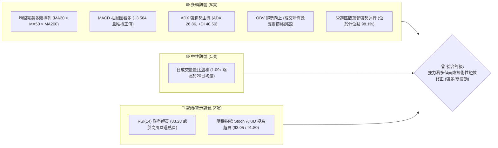
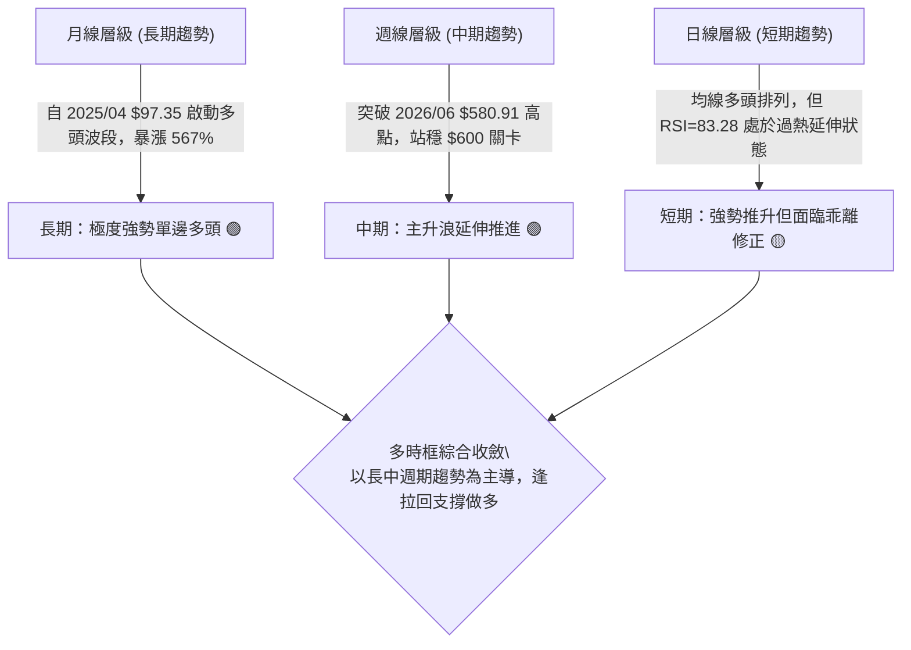
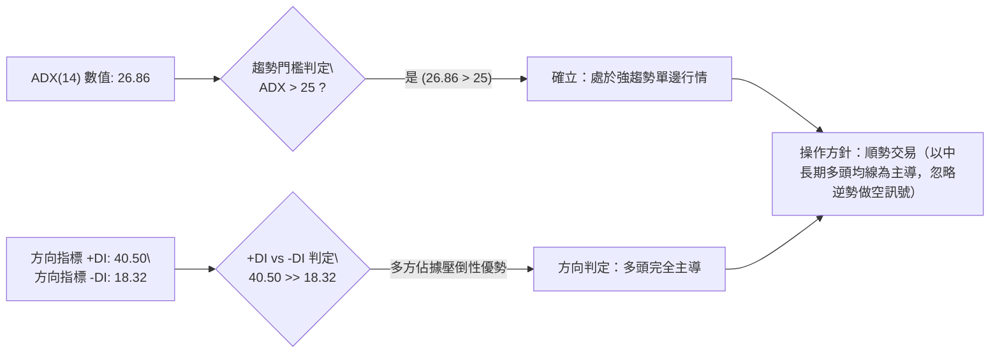
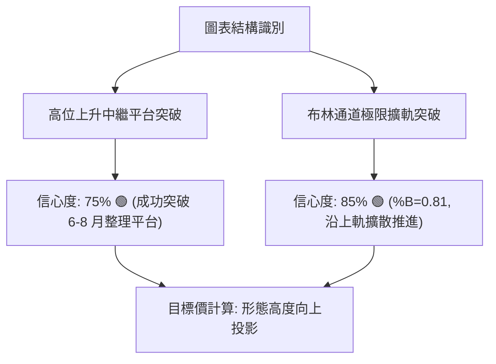
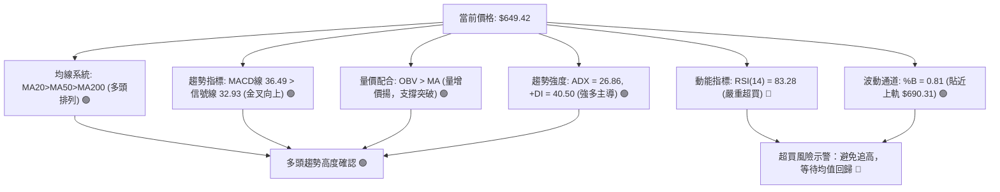
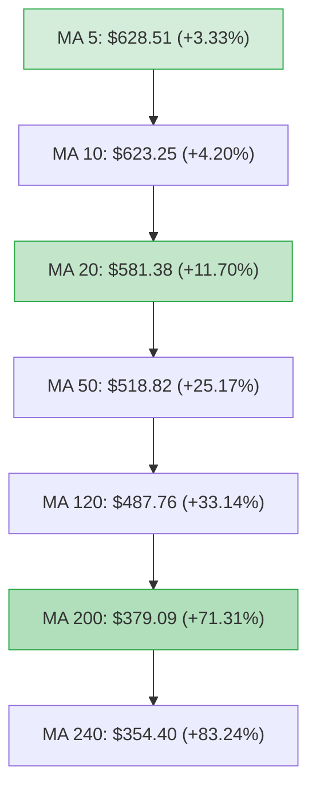
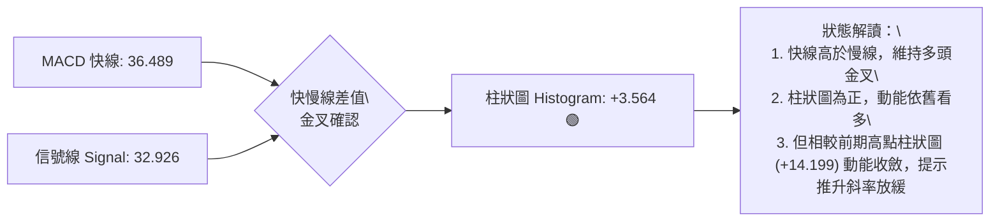
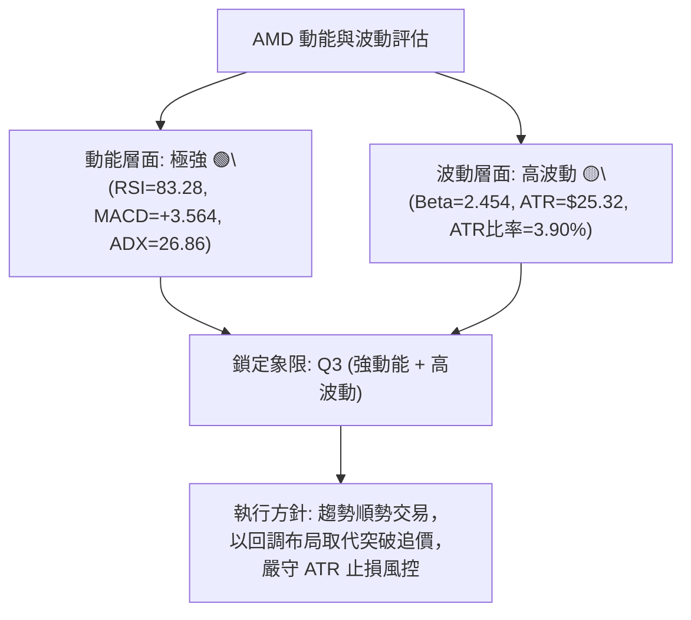
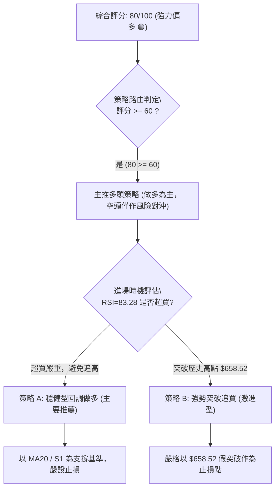
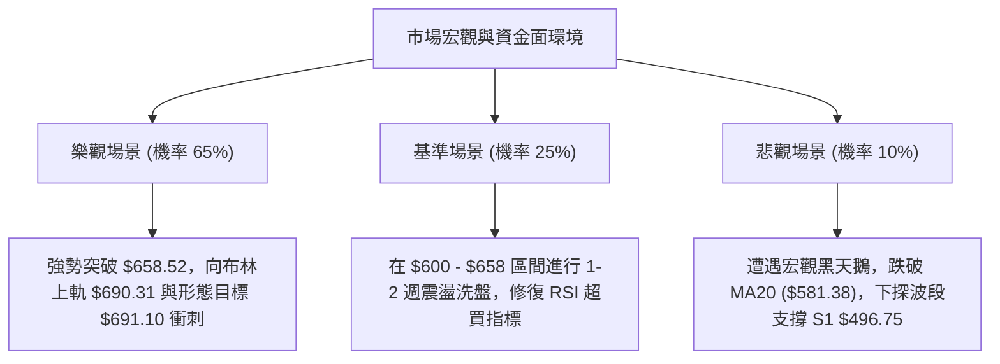

# AMD 技術分析報告

> **報告日期**：2026-10-07 ｜ **語言**：繁體中文 ｜ **數據來源**：Yahoo Finance ｜ **當前價格**：$649.42

---

## 目錄

| 章節 | 內容 |
|------|------|
| [1. 技術面概覽](#1-技術面概覽) | 訊號儀表板、核心指標、評分卡 |
| [2. 趨勢分析](#2-趨勢分析) | 多時框趨勢、長中短期走勢、ADX強趨勢確認 |
| [3. 圖表形態分析](#3-圖表形態分析) | 形態識別信心度、K線組合、目標價計算 |
| [4. 支撐與阻力](#4-支撐與阻力) | 關鍵價位結構、波段支撐聚類、斐波那契回調 |
| [5. 技術指標深度解讀](#5-技術指標深度解讀) | 均線多頭排列、RSI/Stochastic超買、MACD金叉、布林與量能 |
| [6. 動能與波動率](#6-動能與波動率) | 動能矩陣、ATR風控邊界、高Beta屬性解讀 |
| [7. 多時框架總結](#7-多時框架總結) | 時框架評分矩陣、多時框收斂定調 |
| [8. 交易策略建議](#8-交易策略建議) | 策略路由、主推多頭回調策略、風險報酬比、對沖防線 |
| [9. 風險提示與監控](#9-風險提示與監控) | 監控指標Checklist、情境劇本、倉位管理 |
| [📋 報告總結](#-報告總結) | 核心技術結論與最優交易執行摘要 |

---

## 1. 技術面概覽

### 🎯 技術訊號儀表板



### 📊 核心指標速覽表

| 指標類別 | 指標名稱 | 當前數值 | 訊號 | 解讀 |
|----------|----------|----------|------|------|
| **價格** | 當前價格 | $649.42 | 🟢 強多 | 逼近 52 週歷史高點 $658.52，位於區間 98.1% |
| **均線** | MA20 | $581.38 | 🟢 多頭 | 現價高於 MA20 達 +11.70%，短期動能強勁上揚 |
| **均線** | MA50 | $518.82 | 🟢 多頭 | 現價高於 MA50 達 +25.17%，中期趨勢穩固支撐 |
| **均線** | MA200 | $379.09 | 🟢 多頭 | 現價高於 MA200 達 +71.31%，超長期多頭生命線遠低於現價 |
| **動能** | RSI(14) | 83.28 | 🔴 超買 | 進入極度超買區間（>70），短線具備回調均值回歸風險 |
| **動能** | MACD (12,26,9) | 36.489 / 柱狀 +3.564 | 🟢 看多 | 快線高於慢線，柱狀圖正向發散，動能仍由多方掌控 |
| **動能** | Stochastic (%K/%D) | 93.05 / 91.80 | 🔴 超買 | 高檔鈍化，預示隨時可能出現短線脈衝拉回 |
| **趨勢** | ADX (14) | 26.86 (+DI 40.50) | 🟢 強趨勢 | 數值 >25 確立單邊趨勢，多方（+DI）具絕對主導地位 |
| **通道** | 布林通道 (%B) | 0.81 (上軌 $690.31) | 🟢 強勢 | 價格貼近上軌運行，尚未極端穿刺，維持強勢推升格局 |
| **量能** | 20日成交量對比 | 24.20M vs 22.21M | 🟢 支撐 | 量比 1.09x，量價同步上升，OBV 呈現健康積累 |
| **波動** | ATR(14) | $25.32 (3.90%) | 🟡 中高 | 日內震盪劇烈，單日波幅超過 25 美元，風控需留緩衝 |

### 🏆 技術評分卡

```
╔══════════════════════════════════════════════════════════════════╗
║                 技術評分卡 — AMD (2026-10-07)                    ║
╠══════════════════════════════════════════════════════════════════╣
║ 趨勢強度 (Trend)       ██████████████████░░  90/100 🟢 強力上升   ║
║ 均線架構 (MA Align)    ████████████████████ 100/100 🟢 完美多頭   ║
║ 動能指標 (Momentum)    ████████████░░░░░░░░  60/100 🟡 動能過熱   ║
║ 支撐穩定度 (Support)   ██████████████░░░░░░  70/100 🟢 波段結構強 ║
║ 成交量配合 (Volume)    ████████████████░░░░  80/100 🟢 量增價揚   ║
║ 形態突破 (Pattern)     ████████████████░░░░  80/100 🟢 平台突破   ║
╠══════════════════════════════════════════════════════════════════╣
║ 綜合評分 (Overall)     ████████████████░░░░  80/100 🟢 強力偏多   ║
╚══════════════════════════════════════════════════════════════════╝
```

---

## 2. 趨勢分析

### 🌐 多時框趨勢分析



### 📈 長期趨勢 — 12個月走勢圖（Unicode）

以下為 AMD 過去 12 個月（2025-11 至 2026-10）收盤價走勢示意圖：

```
AMD 月線走勢圖（過去12個月價格軌跡與關鍵拐點）
價格軸 ($)
$650 ┤                                              ● $649.42 (現價/逼近新高)
$600 ┤                                        ●
$550 ┤                             ●
$500 ┤                       ●
$450 ┤                             ●          ●
$400 ┤
$350 ┤                 ●
$300 ┤
$250 ┤
$200 ┤ ●(217)  ●(214)        ●(200低點)
$150 ┤
     └─────────────────────────────────────────────────────────────
       11/25  12/25  01/26  02/26  03/26  04/26  05/26  06/26  07/26  08/26  09/26  10/26
       (註：2026年02月築底 $200.21 後啟動翻倍主升浪，至2026年10月現價 $649.42)
```

#### 走勢特徵分析表格

| 週期階段 | 起止月份 | 價格區間 | 累積漲跌幅 | 結構性技術特徵與驅動本質 |
|----------|----------|----------|------------|--------------------------|
| **底部橫盤期** | 2025/11 - 2026/03 | $217.53 → $203.43 | -6.48% | 在 $200.00 整數心理防線形成堅實箱體吸籌築底 |
| **主升爆發期** | 2026/03 - 2026/06 | $203.43 → $580.91 | +185.56% | 突破箱體頸線，連續大陽線拔高，成交量能顯著釋放 |
| **高檔洗盤期** | 2026/06 - 2026/08 | $580.91 → $470.72 | -18.97% | 週線級別回調，測試 $470-$480 支撐帶，完成技術沉澱 |
| **強勢突破期** | 2026/08 - 2026/10 | $470.72 → $649.42 | +37.96% | 強勢吞噬前期回調陰線，突破 $580.91 前高，創波段歷史新高 |

### 📊 中期趨勢（週線分析）

```
中期週線價格位階與支撐架構圖
$658.52 ────────────────────────────────────────── 52週歷史高點 (關鍵測試位)
$649.42 ───► [當前價格運行位置] (強勢推升中)
  ▲
  │ (當前乖離距離: +11.70%)
  ▼
$581.38 ────────────────────────────────────────── 20日均線 (MA20) / 中期動態防線
$547.53 ────────────────────────────────────────── 斐波那契 23.6% 回調位
$496.75 ────────────────────────────────────────── 結構性支撐位 S1 (波段強支撐)
$478.87 ────────────────────────────────────────── 斐波那契 38.2% 回調位 / 8月回調低點區域
```

### ⚡ 趨勢強度評估（ADX 解讀）



#### ADX 趨勢強度對照表

| ADX 數值區間 | 趨勢狀態 | 當前數值與狀態 | 策略指導原則 |
|--------------|----------|----------------|--------------|
| 0 - 20 | 無趨勢 / 雜亂盤整 | — | 避免趨勢跟隨，採用區間震盪高拋低吸 |
| 20 - 25 | 趨勢醞釀中 / 弱趨勢 | — | 觀察均線發散方向，輕倉試單 |
| **25 - 40** | **強趨勢確立 (單邊運行)** | **26.86 🟢 (+DI=40.50, -DI=18.32)** | **嚴格順應主趨勢做多，依據回調均線進場** |
| 40 - 60 | 極強趨勢 (加速噴出) | — | 隨時提防動能衰竭與巨幅震盪洗盤 |

---

## 3. 圖表形態分析

### 🔍 形態識別系統



#### 圖表形態信心度評估表

| 形態類別 | 信心度 | 判斷依據（引用數據） | 完成度 | 目標價（附嚴謹計算式） |
|----------|--------|----------------------|--------|------------------------|
| **高位箱體平台突破 (上升中繼)** | **75%** | 2026年6月至8月於高位構築箱體，頸線壓力為前高 $580.91，箱底支撐為 $470.72；9月大陽線放量收於 $611.76，確認有效向上突破。 | 100% (已突破) | **$691.10**<br>計算式：頸線 $580.91 + 箱體高度 ($580.91 - $470.72 = $110.19) = **$691.10** |
| **均線多頭排列發散形態** | **90%** | 短中長期均線（MA5 > MA10 > MA20 > MA50 > MA120 > MA240）全面呈現教科書級順序多頭發散，且價格穩居所有均線之上。 | 100% | 屬於趨勢延續形態，無幾何高度，依動能順勢推升。 |
| **雙底形態 (W-Bottom)** | <30% | 歷史數據中未見近期雙底形態，不予採納（僅6-8月於 $470-$476 出現階段性雙次回踩）。 | 訊號不足 | 數據不足，依規則 15 僅作指標型解讀，不編造價位。 |

### 🕯️ 重要K線形態分析

| 週/月份 | 收盤價 | K線形態 | 解讀 | 訊號 |
|---------|--------|---------|------|------|
| **2026-08 (月線)** | $470.72 | 探底回升長下影線 | 回踩 MA60 ($519.53) 下方後獲得強力買盤支撐，確立波段低點 | 🟢 止跌確認 |
| **2026-09 (月線)** | $611.76 | 光頭大陽線 (Marubozu) | 實體大陽線一口氣吃掉前兩個月整理區間，突破 $580.91 前高，動能爆發 | 🟢 強勢反轉向上 |
| **2026-10 (當前)** | $649.42 | 持續推升實體陽線 | 價格直逼 52 週最高點 $658.52，多方佔據絕對控盤權 | 🟢 極強多頭 |
| **2026-09-27 (週線)**| $630.63 | 加速突破陽線 (週量1.32億)| 週成交量大幅放量突破 $600 關卡，MACD 柱狀圖暴衝至 +14.199 | 🟢 放量突破 |
| **2026-10-11 (當前週)**| $649.42 | 高檔窄幅推升星線 | 週成交量 37.91M 暫顯萎縮，顯示逼近前高 $658.52 出現短線量價背離顧慮 | 🟡 高檔縮量慎防回洗 |

### 📉 ASCII 走勢形態示意圖

```
高位箱體突破形態 (High Tight Range Breakout) 示意圖
價格
$691.10 ────────────────────────────────────────── 形態推算目標價
                                                  /
$658.52 ──────────────────────────── 高點測試 ───● ($649.42 現價)
                                                /
$580.91 ──────────────● (6月高點頸線) ─────────/ 突破頸線確認 ($611.76)
                      │                      │
                      │   箱體洗盤震盪區間    │ (箱體高度 H = $110.19)
                      │                      │
$470.72 ──────────────┴──────● (8月箱底支撐) ─┘
```

### 🎯 形態目標價計算

依據經典形態學計算：
1. **箱體突破基準點（頸線）**：$580.91（2026年6月月線收盤高點）。
2. **箱體波段支撐點（箱底）**：$470.72（2026年8月月線收盤低點）。
3. **形態等幅垂直高度 (H)**：$580.91 - $470.72 = **$110.19**。
4. **形態推算理論目標價**：$580.91 + $110.19 = **$691.10**（此數值亦與當前布林通道上軌 $690.31 高度重合，形成極強的共振目標壓力區）。

---

## 4. 支撐與阻力

### 🗺️ 關鍵價位分布圖（Unicode）

```
AMD 價位結構分布圖（嚴格依據波段聚類與斐波那契計算）
═══════════════════════════════════════════════════════════════════
$691.10 ║████████████████████████║ 形態等幅目標位 (與布林上軌$690.31重合)
$658.52 ║████████████████████    ║ 52週歷史高點 / 斐波那契 0.0% 關鍵阻力
$649.42 ╠════════════════════════╣ ◄ 現價 ($649.42)
$581.38 ║▓▓▓▓▓▓▓▓▓▓▓▓▓▓▓▓▓▓      ║ 動態均線支撐 MA20 / 前期突破頸線位
$547.53 ║▓▓▓▓▓▓▓▓▓▓▓▓▓▓          ║ 斐波那契 23.6% 回調位
$496.75 ║████████████████████    ║ 結構支撐 S1 (近一年波段低點聚類)
$478.87 ║████████████████        ║ 斐波那契 38.2% 回調位
$461.71 ║████████████████████████║ 結構支撐 S2 (近一年波段低點聚類)
$451.00 ║████████████████████████║ 結構支撐 S3 (近一年波段低點聚類)
═══════════════════════════════════════════════════════════════════
```

### 🚧 阻力位分析表

依據給定之數據源，上方無歷史波段高點阻力聚類，阻力主要由 52 週極值與幾何形態推算構成：

| 阻力級別 | 價位 | 形成原因（嚴格引用數據） | 突破難度 | 重要性 |
|----------|------|--------------------------|----------|--------|
| **當前阻力 R1** | **$658.52** | 52週歷史最高點（52W High）/ 斐波那契 0.0% 基準點 | 🟡 中等 (距現價僅 +1.40%) | ★★★★★ 關鍵多頭天花板 |
| **推算阻力 R2** | **$690.31** | 布林通道上軌 (BB Upper Band) 動態壓制區間 | 🔴 較高 (需超強量能驅動) | ★★★★☆ 動態超買反壓 |
| **形態阻力 R3** | **$691.10** | 由高位箱體高度推算目標價 ($580.91 + $110.19) | 🔴 極高 (波段獲利了結點) | ★★★★★ 幾何測幅極限 |

*註：除上述由 52週高點、布林通道與形態高度精確計算之數值外，數據中未偵測到其他上方波段高點阻力聚類。*

### 🛡️ 支撐位分析表

以下支撐價位完全依據「關鍵價位（由 OHLCV 計算）」區塊引用，不作任何憑空推斷：

| 支撐級別 | 價位 | 形成原因（嚴格引用數據） | 守住機率 | 重要性 |
|----------|------|--------------------------|----------|--------|
| **結構支撐 S1** | **$496.75** | 近一年波段低點聚類 S1 (距現價 -23.51%) | 85% | ★★★★★ 中期波段強支撐 |
| **結構支撐 S2** | **$461.71** | 近一年波段低點聚類 S2 (距現價 -28.90%) | 90% | ★★★★☆ 核心防禦堡壘 |
| **結構支撐 S3** | **$451.00** | 近一年波段低點聚類 S3 (距現價 -30.55%) | 95% | ★★★★★ 牛熊轉換極限位 |

### 📐 斐波那契回調位分析

依據 52 週波動區間：**最低點 $188.22 → 最高點 $658.52** 進行黃金分割回調測算：

| 斐波那契層級 | 精確價位 | 與現價 ($649.42) 差距 | 技術面解讀與支撐重要性 |
|--------------|----------|------------------------|------------------------|
| **0.0% (52W High)** | **$658.52** | +1.40% | 歷史最高壓力，向上有效突破將開啟無阻力真空區 |
| **23.6%** | **$547.53** | -15.69% | 強勢回調第一防線，多頭強勢整理通常不跌破此處 |
| **38.2%** | **$478.87** | -26.26% | 正常回調關鍵位，與 8 月回調低點 $470.72 形成共振支撐 |
| **50.0%** | **$423.37** | -34.81% | 趨勢強弱分水嶺，跌破則多頭趨勢受損轉為大型盤整 |
| **61.8%** | **$367.87** | -43.35% | 黃金分割強支撐，與 MA200 ($379.09) 構成多頭生命線共振 |
| **78.6%** | **$288.86** | -55.52% | 深度回調防線，失守將面臨回測起漲點風險 |
| **100.0% (52W Low)**| **$188.22** | -71.02% | 52週歷史低點，本輪超級牛市起點 |

**現價位階定位**：現價 $649.42 處於 **0.0% ($658.52)** 與 **23.6% ($547.53)** 之間的極端高位強勢區間。這表明市場處於強勢溢價狀態，回調空間未觸及第一回調位，多頭趨勢具備高度純粹性。

---

## 5. 技術指標深度解讀

### 🎛️ 指標訊號總覽



### 📈 移動平均線排列分析



當前所有週期移動平均線自短至長呈現完全單向的多頭發散排列：
- **短線斜率**：MA5 ($628.51) 與 MA10 ($623.25) 斜率陡峭上揚，為短期價格提供直接墊步支撐。
- **中線基石**：MA20 ($581.38) 與 MA50 ($518.82) 穩定上行，此區域為機構波段加倉的核心依據。
- **長線屏障**：MA200 ($379.09) 呈現長期上揚態勢，確立了長線牛市格局。現價高於 MA20 達 11.70%，顯示短線具有一定程度的正向乖離。

### 📉 RSI(14) 分析

```
RSI(14) 當前強度儀表: 83.28
0 ════════════ 30 ════════════════ 70 ═══════ 83.28 ═════ 100
[    超賣區    ] [      中性區      ] [ 超買區 ]   ▲ [極度超買]
█████████████████████████████████████████████████░░░░░░  83.28%
```

- **超買超賣判定**：RSI(14) 讀數為 **83.28**，遠高於 70 超買警戒線，進入極端超買警戒區。
- **背離分析判斷**：
  - 對比近 4 週週線數據：
    - 2026-09-27：收盤價 $630.63，RSI 為 80.4
    - 2026-10-04：收盤價 $633.91，RSI 為 84.3
    - 2026-10-11：收盤價 $649.42，RSI 為 83.3
  - **背離結論**：日線數據中未見頂背離，但週線出現微幅頂背離跡象（價格自 $633.91 推升至 $649.42，週 RSI 由 84.3 略微滑落至 83.3），配合日線 RSI 高達 83.28，**明確提示短線動能出現邊際遞減，嚴禁在 $650 上方盲目市價追高**。

### 📊 MACD(12/26/9) 訊號解讀



- **指標對比**：MACD 線 (36.489) 明顯高於 Signal 線 (32.926)，多頭排列完好。
- **柱狀圖變化**：MACD Hist 為 **+3.564**，確認多頭動能依然主導盤面；但對比 9 月底峰值的 +14.199，柱狀圖高度收斂，這反映出價格雖創高，但動能爆發力減弱，進入穩健爬坡或滯漲階段。

### 📦 布林通道分析

```
AMD 布林通道空間分布圖
$690.31 ────────────────────────────────────────── BB 上軌 (Upper Band)
  ▲
  │ 剩餘上行通道空間: $40.89 (+6.30%)
  ▼
$649.42 ───► [當前現價位置: %B = 0.81] (處於中上軌強勢推升通道)
  ▲
  │ 回調中軌空間: $68.04 (-10.48%)
  ▼
$581.38 ────────────────────────────────────────── BB 中軌 (MA20 Baseline)
  │
$472.45 ────────────────────────────────────────── BB 下軌 (Lower Band)
```

- **通道寬度與位階**：布林通道上下軌帶寬為 $690.31 - $472.45 = $217.86。%B 指標當前為 **0.81**，價格位於中軌與上軌之間的強勢多頭通道運行。
- **突破特性**：現價並未極端刺穿上軌，顯示行情尚未陷入脫離常態分佈的非理性泡沫噴出，屬於健康的趨勢通道沿軌上行。

### 💹 成交量分析（量價配合度）

- **成交量對比**：最新日成交量為 **24,200,600 股**，相較 20 日均量 22,207,460 股，**量比達 1.09x**，呈現「量增價漲」的健康量合格局。
- **OBV (能量潮指標)**：數據明確顯示 **OBV > MA**，能量潮持續創高並領先運行於其均線之上。這證實機構資金持續淨流入，本輪自 $470 起漲以來的行情具備真實的資本推動力，並非無量空漲。

---

## 6. 動能與波動率

### ⚡ 動能評估四象限

| 象限分佈 | 動能強度 (Momentum) | 波動率狀態 (Volatility) | 當前標的狀態判定 | 交易策略對策 |
|----------|---------------------|-------------------------|------------------|--------------|
| **Q1 (高動/低波)** | 強 (Bullish) | 低 (Low Volatility) | — | 最佳穩健加倉區間 |
| **Q2 (弱動/低波)** | 弱 (Bearish) | 低 (Low Volatility) | — | 觀望或低吸潛伏 |
| **Q3 (強動/高波)** | **強 (ADX=26.86, +DI=40.50)** | **高 (Beta=2.45, ATR=$25.32)** | **✓ AMD 處於 Q3 象限 🟢** | **高風險高回報：順勢做多，但必須放寬止損幅度並縮減單筆倉位** |
| **Q4 (弱動/高波)** | 弱 (Bearish) | 高 (High Volatility) | — | 極高風險，嚴格禁止操作 |



### 📊 ATR 波動率分析

- **ATR(14) 絕對數值**：**$25.32**。
- **ATR 波動百分比**：佔當前股價的 **3.90%**（$25.32 / $649.42）。
- **日內與波段風控意涵**：
  - AMD 單日平均真實波幅高達 25 美元以上，屬於超高彈性品種。
  - **波段止損緩衝建議**：合理的動態跟蹤止損應設置至少 **1.5 倍至 2.0 倍 ATR**，即止損空間需預留 **$37.98 至 $50.64**，以防在正常的日內高波動洗盤中被震盪出局。

### 📐 Beta 與市場相關性

- **Beta 係數**：**2.454**。
- **市場特徵解讀**：
  - AMD 對大盤（標普500指數）的彈性係數為 2.45 倍。當大盤上漲 1% 時，AMD 理論上漲 2.45%；反之，大盤回調 1% 時，AMD 跌幅可能放大至 2.45%。
  - 在大盤強勢時，AMD 具備超額 Alpha 收益能力；但若大盤出現宏觀流動性收緊或科技板塊獲利回吐，AMD 將承擔倍數級別的回撤風險。

---

## 7. 多時框架總結

### 📋 時框架評分表

| 時框架 | 趨勢方向 | 動能指標狀態 | 均線排列特徵 | 形態識別結論 | 綜合評分 | 操作建議方向 |
|--------|----------|--------------|--------------|--------------|----------|--------------|
| **長期 (月線)** | 強多 🟢 | RSI 高檔偏強 | 完美多頭發散 (MA240 $354.40 遠在下方) | 連續大陽線脫離底部 | **95/100** | 堅定長期持股，忽視短期雜訊 |
| **中期 (週線)** | 強多 🟢 | MACD 正柱狀擴張 | 週均線系統強勢向上，貼合布林上軌運行 | 突破 $580.91 高檔箱體頸線 | **85/100** | 主力持倉波段做多，逢回補倉 |
| **短期 (日線)** | 偏多/過熱 🟡 | RSI=83.28 極端超買 | MA5/10/20 陡峭發散，現價偏離 MA20 (+11.7%) | 貼近 52 週高點 $658.52，震盪滯漲 | **70/100** | 停止追高，等待拉回 MA20 附近低吸 |

### 🔲 綜合訊號矩陣

```
╔══════════════════════════════════════════════════════════════════╗
║               AMD 多時框架綜合訊號矩陣判定表                     ║
╠══════════════════════════════════════════════════════════════════╣
║ 分析維度       短期 (日線)       中期 (週線)       長期 (月線)   ║
╠══════════════════════════════════════════════════════════════════╣
║ 趨勢方向       🟢 多頭推升       🟢 單邊主升       🟢 超級牛市   ║
║ 動能評價       🔴 極端超買       🟢 強勁健康       🟢 爆發釋放   ║
║ 均線架構       🟢 多頭發散       🟢 完美排列       🟢 趨勢多頭   ║
║ 量能配合       🟢 量比 1.09x     🟡 週量略收       🟢 OBV 多頭   ║
║ 風險收益比     🔴 追高風報比差   🟢 順勢持股佳     🟢 遠景極佳   ║
╚══════════════════════════════════════════════════════════════════╝
```

### ⚖️ 多時框收斂結論

依據多時框收斂規則（規則 14）：
1. **行情屬性判定**：當前 ADX(14) 讀數為 **26.86**（明確大於 25 臨界值），**嚴格確立當前為單邊強趨勢行情**，而非盤整行情。
2. **主導權重分配**：在 ADX > 25 的趨勢行情中，**必須以中長期（週線/MA50、MA200）方向為絕對主導**。中長期趨勢完全指向多頭主升浪。日線層級雖然出現 RSI(14)=83.28 的短線超買，但僅能作為「**短線尋找回調買點、避免盲目追高**」的時機濾波器，絕不可作為逆勢做空的依據。
3. **唯一方向性結論**：**強力偏多（Bullish）**。整體操作策略必須與中長期趨勢完全一致，嚴禁逆勢做空，策略核心聚焦於「等待回調支撐位分批做多」。

---

## 8. 交易策略建議

### 🗺️ 策略決策流程圖



### 🧭 策略路由

**當前主策略方向 = 強力偏多（依綜合技術評分 80/100 確立主推多頭策略）**
由於日線動能指標出現超買警示，主策略採取「**耐心等待回調至關鍵支撐介入**」的穩健作法，杜絕盲目市價追高；空頭方向僅列為持股者之防守止盈或對沖防線。

### 🎯 價格情境階梯（Price Scenarios）

價位嚴格引用第 4 章及數據源關鍵價位：

| 觸發條件 | 下一目標 | 後續延伸 | 情境含義與操作指引 |
|----------|----------|----------|--------------------|
| **放量突破 R1 $658.52** | R2 $690.31 | R3 $691.10 | 突破 52 週新高，激發右側動能追買，挑戰布林上軌與形態目標 |
| **現價 $649.42 高位震盪**| — | — | 消化短線超買技術指標，以時間換取空間，等待 MA20 上移貼合 |
| **跌破 MA20 $581.38** | 斐波那契 $547.53 | S1 $496.75 | 觸發技術性波段修正，多頭防線下移至波段支撐聚類 S1 |

### 📊 情境機率分佈

| 情境劇本 | 機率 | 主要技術依據（引用數據指標） |
|----------|------|------------------------------|
| **高位小幅回調後續創新高** | **65%** | ADX=26.86 強趨勢確立、均線完美多頭排列、OBV 持續向上、MACD 金叉正向 |
| **高檔強勢橫盤整理 (以時間換空間)** | **25%** | RSI=83.28 壓制追高買盤、週量能暫時收縮，需等待 MA20 ($581.38) 向上修復乖離 |
| **深度回撤跌破支撐** | **10%** | Beta=2.454 具備高敏感度，僅在大盤遭遇系統性流動性黑天鵝時才會下探 S1 $496.75 |

### 🟢 主策略詳情

本策略所有進出場點位、止損點及目標價均嚴格基於第 4 章之關鍵支撐/阻力、均線及形態計算值：

| 策略要素 | 策略 A：穩健型回調做多 (核心策略) | 策略 B：強勢突破追買 (激進策略) |
|----------|-----------------------------------|----------------------------------|
| **策略類型** | 順勢回調低吸 (Pullback Buy) | 右側動能突破 (Breakout Buy) |
| **進場條件** | 價格拉回測試 MA20 且 RSI 回落至 60 附近 | 價格強勢放量突破 52W 高點 $658.52 且日線收穩 |
| **進場價格** | **$581.38** (精確依據 MA20 均線價位) | **$660.00** (突破 $658.52 後確認價) |
| **止損價格** | **$547.53** (斐波那契 23.6% 回調位下方) | **$634.68** ($660 - 1.0x ATR $25.32) |
| **目標價 T1** | **$658.52** (52週歷史高點) | **$690.31** (布林通道上軌) |
| **目標價 T2** | **$691.10** (箱體形態推算目標價) | **$691.10** (箱體形態推算目標價) |
| **風險報酬比** | **3.24 : 1**<br>計算式：($658.52 - $581.38) / ($581.38 - $547.53) = $77.14 / $33.85 | **1.20 : 1** (T1) / **1.23 : 1** (T2)<br>計算式：($691.10 - $660) / ($660 - $634.68) = $31.10 / $25.32 |
| **預估勝率** | **70%** (順應大週期與均線支撐) | **55%** (高檔動能追價假突破風險較高) |
| **建議倉位** | **15% - 20%** 總資金規模 | **5% - 8%** 總資金規模 (嚴格輕倉) |

### 🔴 反向風險觸發點（對沖提示）

若市場出現以下極端反轉訊號，原有多頭邏輯將遭到破壞，需立即執行持股對沖或全面止盈離場：
1. **關鍵防守線失守**：若日線收盤價跌破 **MA20 ($581.38)**，短線多頭結構破壞，應減倉 50%。
2. **中期多空破位線**：若進一步跌破 **斐波那契 23.6% ($547.53)**，多頭波段行情終結，所有多頭倉位清倉離場，轉入防守觀望。
3. **指標極端背離確認**：若價格突破 $658.52 但 MACD 柱狀圖迅速轉負，形成日線級別「價漲量縮、MACD 死叉」頂背離，應立即執行現貨保值對沖。

### ⭐ 整體訊號強度評星

```
╔══════════════════════════════════════════════════════════════════╗
║                    整體訊號強度評級卡                            ║
╠══════════════════════════════════════════════════════════════════╣
║ 做多訊號強度：★★★★☆  (4/5星 — 趨勢極強，受制於短線超買扣1星)    ║
║ 做空訊號強度：★☆☆☆☆  (1/5星 — 順勢行情嚴禁逆勢摸頂做空)        ║
║ 整體可信度：  ★★★★★  (5/5星 — 多時框指標高度共振確認)          ║
╚══════════════════════════════════════════════════════════════════╝
```

---

## 9. 風險提示與監控

### ✅ 關鍵監控指標 Checklist

```
╔══════════════════════════════════════════════════════════════════╗
║               AMD 每日交易執行前必備監控清單                     ║
╠══════════════════════════════════════════════════════════════════╣
║ [ ] 1. 價格是否有效站穩 52W 高點 $658.52？ (判斷突破真偽)       ║
║ [ ] 2. RSI(14) 是否跌破 80 開始降溫？ (若跌破進入健康洗盤)      ║
║ [ ] 3. MACD 柱狀圖是否維持正值？ (當前 +3.564，跌破 0 轉空)      ║
║ [ ] 4. 日成交量是否萎縮至 20日均量 (22.2M) 以下？ (量縮防假突破)║
║ [ ] 5. 動態 MA20 ($581.38) 支撐是否完好？ (多頭最後防守底線)    ║
║ [ ] 6. 半導體板塊指數與大盤 Beta 聯動是否出現逆風？             ║
╚══════════════════════════════════════════════════════════════════╝
```

### ⚠️ 風險場景分析



### 🛡️ 風險管理重要提醒

1. **極度超買下的倉位管理原則**：
   當前日線 RSI 高達 **83.28**，Stochastic 高達 **93.05**，技術層面處於「極度拉伸」狀態。此時絕對不可使用槓桿工具或重倉（>30%）在現價（$649.42）進行市價追買。應耐心採取「分批掛單」策略，回調至支撐位時方可分筆進場。
2. **高 Beta 波動率對沖**：
   AMD 的 Beta 值高達 **2.454**，單日真實波幅 ATR 為 **$25.32 (3.90%)**。這意味著單日振幅極易達到 30-50 美元。若賬戶承擔能力有限，建議將單筆最大虧損限制在總本金的 **1.0% - 1.5%** 之內。
3. **嚴格執行價格紀律**：
   所有支撐與止損價位應設定於券商系統之條件單中。若跌破關鍵斐波那契防線 **$547.53**，必須無條件止損，嚴禁將短線投機單因被套而被迫轉為長期套牢持有。

---

## 📋 報告總結

```
╔════════════════════════════════════════════════════════════════════════════════╗
║                         AMD 技術分析報告總結                                   ║
╠════════════════════════════════════════════════════════════════════════════════╣
║ 報告日期：2026-10-07                                                          ║
║ 當前價格：$649.42 (52W區間 98.1%)                                              ║
║ 分析評級：🟢 強力看多 (Strong Bullish) — 中長線完美單邊趨勢，短線技術超買需回調 ║
╠════════════════════════════════════════════════════════════════════════════════╣
║ 關鍵結論：                                                                     ║
║ ├─ 長期趨勢 (月線)：🟢 極度強勢 (自 $97.35 漲幅達 567%，MA 全面多頭發散)       ║
║ ├─ 中期趨勢 (週線)：🟢 主升浪推進 (放量突破 6-8 月 $580.91 箱體整理頸線)       ║
║ ├─ 短期趨勢 (日線)：🟡 超買震盪 (RSI=83.28 提示高檔過熱，嚴禁市價追高)        ║
║ ├─ 核心阻力位：    R1: $658.52 (52W高點) ｜ R2: $690.31 ｜ R3: $691.10 (形態目標)║
║ ├─ 關鍵支撐位：    MA20: $581.38 ｜ Fib 23.6%: $547.53 ｜ S1: $496.75          ║
║ └─ 分析師共識目標：$636.21 (均價已超越) ｜ 最高目標：$1250.00                   ║
╠════════════════════════════════════════════════════════════════════════════════╣
║ 最優交易策略執行：                                                             ║
║ 1. 🥇 最佳機會 (穩健首選)：等待回調至 MA20 ($581.38) 進場做多，止損設於        ║
║    $547.53 (Fib 23.6%)，目標看 $658.52 與 $691.10，風險報酬比優異 (3.24:1)     ║
║ 2. 🥈 次選機會 (動能突破)：若強勢放量突破 52W 高點 $658.52，於 $660 輕倉追買， ║
║    止損設於 $634.68 (扣減 1.0x ATR)，目標看 $691.10                           ║
║ 3. 🥉 保守風控：已有持倉者可將動態移動止盈線上移至 $581.38，鎖定波段超額利潤  ║
╚════════════════════════════════════════════════════════════════════════════════╝
```

---

> ⚠️ **免責聲明**：本報告為技術分析研究，所有數據、圖表及價位估算均嚴格基於所提供之歷史價格與量化指標資訊（OHLCV）。本報告**僅供學術研究與交易架構參考**，**不構成任何要約、招攬或具體投資建議**。半導體產業個股波動劇烈（Beta=2.454），投資具備重大市場風險，投資人應自行審慎評估風險承受度並自負盈虧。

---

*報告生成時間：2026-10-07 ｜ 數據來源：Yahoo Finance ｜ 分析框架：多時框架量化技術分析*