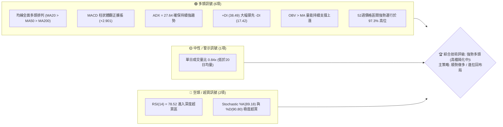
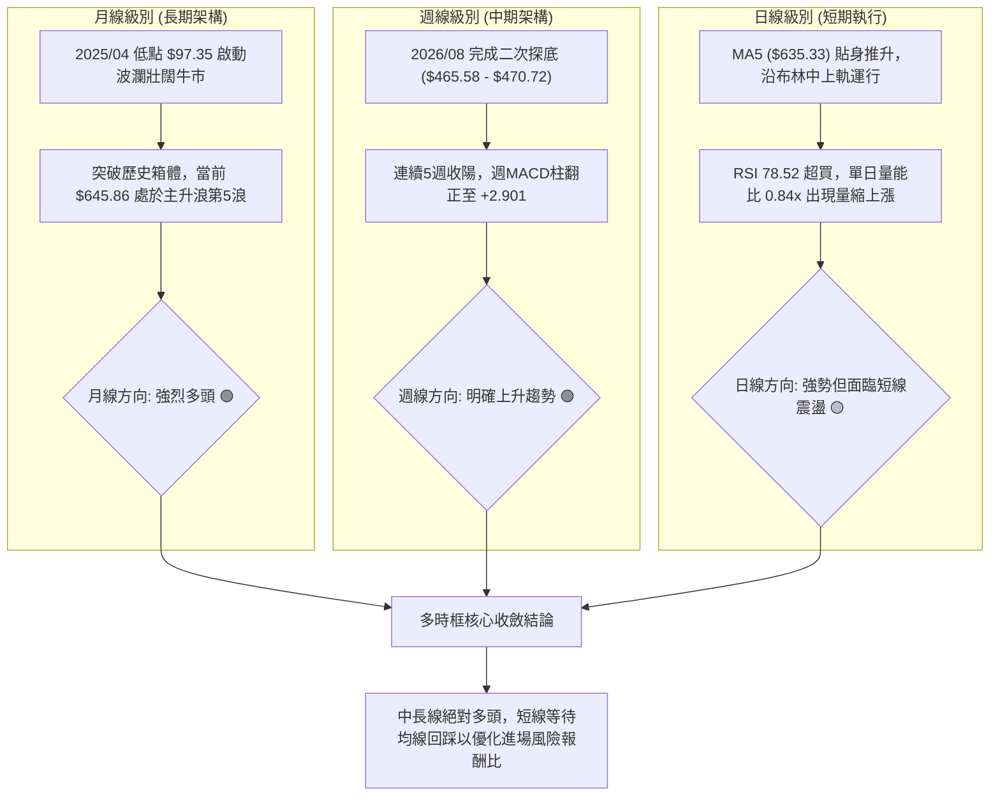
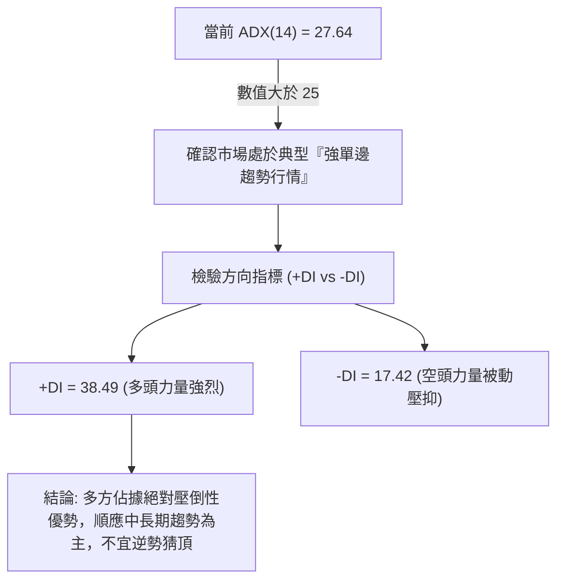
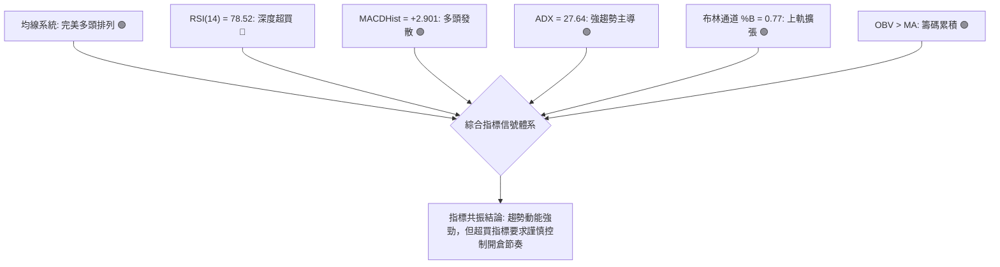
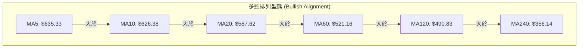
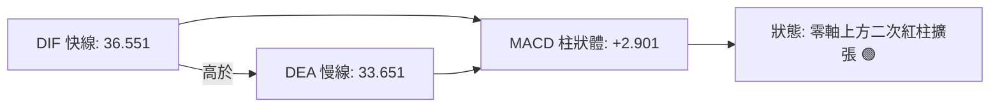
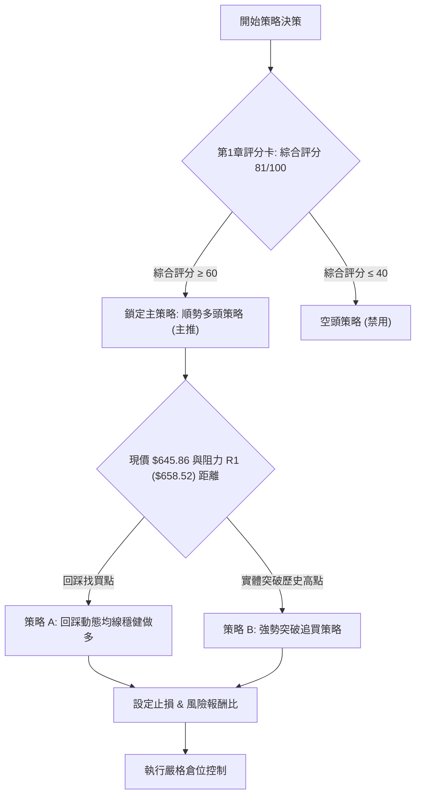
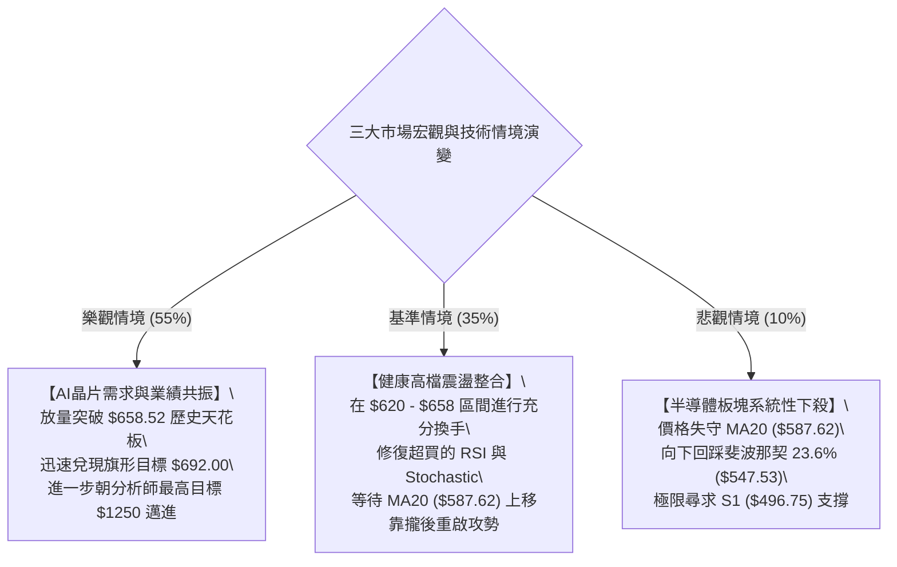

# AMD 技術分析報告

> **報告日期**：2026-10-08 ｜ **語言**：繁體中文 ｜ **數據來源**：Yahoo Finance ｜ **當前價格**：$645.86

---

## 目錄

| 章節 | 內容 |
|------|------|
| [1. 技術面概覽](#1-技術面概覽) | 訊號儀表板、核心指標、評分卡 |
| [2. 趨勢分析](#2-趨勢分析) | 多時框趨勢、長中短期走勢、12個月ASCII走勢圖 |
| [3. 圖表形態分析](#3-圖表形態分析) | 形態識別、K線組合、目標價推算 |
| [4. 支撐與阻力](#4-支撐與阻力) | 關鍵價位結構、斐波那契回調深度評估 |
| [5. 技術指標深度解讀](#5-技術指標深度解讀) | MA系統、RSI、MACD、布林通道、OBV與量價關係 |
| [6. 動能與波動率](#6-動能與波動率) | 動能四象限、ATR(14)波動度量、Beta系統性風險 |
| [7. 多時框架總結](#7-多時框架總結) | 時框架評分矩陣、收斂規則與方向性判定 |
| [8. 交易策略建議](#8-交易策略建議) | 策略路由、價格情境階梯、主策略詳情與風控 |
| [9. 風險提示與監控](#9-風險提示與監控) | 關鍵監控清單、極端情境推演、倉位管理準則 |

---

## 1. 技術面概覽

### 🎯 技術訊號儀表板



---

### 📊 核心指標速覽表

| 指標類別 | 指標名稱 | 當前數值 | 訊號 | 解讀 |
|:---|:---|:---|:---:|:---|
| **現貨價格** | 當前收盤價 | $645.86 | 🟢 | 逼近歷史/52週高點 $658.52，位於年內 97.3% 分位 |
| **短期均線** | MA20 | $587.62 | 🟢 | 現價高於 MA20 達 +9.91%，短線支撐強勁 |
| **中期均線** | MA50 | $522.64 | 🟢 | 現價高於 MA50 達 +23.57%，中期趨勢陡峭向上 |
| **長期均線** | MA200 | $381.32 | 🟢 | 現價高於 MA200 達 +69.37%，長線牛市格局穩固 |
| **動能指標** | RSI(14) | 78.52 | 🔴 | 進入超買區（>70），短線存在技術性拉回或鈍化需求 |
| **趨勢動能** | MACD (12,26,9) | 36.551 / 33.651 | 🟢 | DIF 高於 MACD 信號線，柱狀體 +2.901 維持多頭擴張 |
| **擺動指標** | Stochastic %K/%D| 89.18 / 90.80 | 🔴 | 雙線高於 80 嚴重超買，短線追高盈虧比收窄 |
| **趨勢強度** | ADX(14) | 27.64 | 🟢 | ADX > 25 確立強趨勢行情，+DI 壓制 -DI |
| **通道位置** | Bollinger %B | 0.77 | 🟢 | 運行於中軌($587.62)與上軌($696.31)之間偏強側 |
| **波動幅度** | ATR(14) | $23.70 | 🟡 | 日波動率 3.67%，提供交易止損與獲利間距標準依據 |
| **量能趨勢** | OBV 指標 | OBV > MA | 🟢 | 能量潮指標高於均線，資金淨流入支撐價格推升 |

---

### 🏆 技術評分卡

```
╔══════════════════════════════════════════════════════════════╗
║                 技術評分卡 — AMD (2026-10-08)                ║
╠══════════════════════════════════════════════════════════════╣
║ 趨勢強度 (Trend)     ████████████████░░░░  82/100 🟢 強勢多頭 ║
║ 動能指標 (Momentum)   ██████████████░░░░░░  70/100 🟡 超買擴張 ║
║ 支撐穩定度 (Support)  ████████████████░░░░  80/100 🟢 階梯墊高 ║
║ 成交量配合 (Volume)   ████████████░░░░░░░░  62/100 🟡 量能微縮 ║
║ 形態完整度 (Pattern)  ████████████████░░░░  85/100 🟢 突破延展 ║
║ 均線排列 (Moving Avg) ████████████████████ 100/100 🟢 完美多頭 ║
╠══════════════════════════════════════════════════════════════╣
║ 綜合技術評分         ████████████████░░░░  81/100 🟢 強烈看多 ║
╚══════════════════════════════════════════════════════════════╝
```

---

## 2. 趨勢分析

### 🌐 多時框趨勢分析



---

### 📈 長期趨勢 — 12個月走勢圖（Unicode）

以下為 2025 年 10 月至 2026 年 10 月 AMD 每月收盤價走勢示意圖（包含重要波段高低點）：

```
AMD 月線走勢圖（過去12個月歷史軌跡）
價格軸 ($)
$650 ┤                                                    ● $645.86 (現在)
$600 ┤                                              ●     │
$550 ┤                                        ●   $611.76 │
$500 ┤                                  ●   $580.91       │
$450 ┤                            ●   $516.10 │   │       │
$400 ┤                            │     │     │   │       │
$350 ┤                      ●   $354.49 │     ●   ●       │
$300 ┤                      │     │     │ $476.15 $470.72 │
$250 ┤  ● $256.12           │     │     │     │   │       │
$200 ┤  │   ●   ●   ●   ●   ●     │     │     │   │       │
     └──┴───┴───┴───┴───┴───┴─────┴─────┴─────┴───┴───────┴───────
       10   11  12  01  02  03    04    05    06  07  08  09  10 (月)
      2025 ---------------------> 2026 -------------------------->
註釋：
  - 關鍵底部結構：2026年02月至03月形成 $200.21 - $203.43 複合雙底支撐
  - 爆發主升浪：2026年04月放量突破拉升至 $354.49，06月見波段高點 $580.91
  - 中期旗形洗盤：2026年07月至08月回踩 $476.15 - $470.72 鞏固支撐
  - 終極主推升浪：2026年09月大漲重返 $611.76，10月續創收盤新高 $645.86
```

#### 走勢特徵分析表格

| 階段區間 | 起止價格 | 漲跌幅 | 運行特徵與市場結構 | 技術意義 |
|:---|:---|:---:|:---|:---|
| **第一階段：區間蓄勢**<br>(2025/10 - 2026/03) | $256.12 → $203.43 | -20.57% | 於 $200.00 心理關口上方寬幅震盪洗盤，換手充分 | 構築長線右側起漲大底（築底完成） |
| **第二階段：突破主升**<br>(2026/03 - 2026/06) | $203.43 → $580.91 | +185.56% | 呈現跳躍式大陽線推升，單月漲幅頻破 50% | 機構資金大舉加倉，跨越歷史估值體系 |
| **第三階段：高檔強勢整理**<br>(2026/06 - 2026/08) | $580.91 → $470.72 | -18.97% | 週線連續測試 $470-$490 區間未破，下影線密集 | 健康獲利了結回調，消化超買指標 |
| **第四階段：次級主升浪**<br>(2026/08 - 2026/10) | $470.72 → $645.86 | +37.21% | 連續突破 $500 與 $600 關卡，逼近 52W 高點 $658.52 | 多頭徹底掌控盤面，展開創歷史新高衝刺 |

---

### 📊 中期趨勢（週線分析）

從 2026 年 5 月底至 10 月初的 20 週數據觀察，中期趨勢呈現標準的「階梯式上升通道」：
1. **中樞支撐位確認**：在 2026 年 8 月底，價格打出波段低點 $465.58，該位置高度契合斐波那契 38.2% 回調位（$478.87）與 S2 支撐（$461.71）。
2. **動能修復與轉強**：自 2026-09-06 的低點 $477.57 開始，週線成交量從 7,516 萬股逐週放大至 2026-09-27 的 13,206 萬股，推動週 MACD 柱由 -0.243 劇烈擴張至 +14.199，形成標準的「零軸上方二次多頭發散」。
3. **最新週線狀態**：2026-10-11 當週收盤來到 $645.86，週成交量降至 56,482,400 股，週 RSI 來到 78.5，顯示多頭在高位略現推升量縮，但尚未出現週線層級的反轉長陰線。

---

### ⚡ 趨勢強度評估（ADX 解讀）



#### ADX 趨勢強度對照表

| 指標名稱 | 實際數值 | 門檻判定 | 趨勢屬性評估 | 操作指引 |
|:---|:---:|:---:|:---|:---|
| **ADX(14)** | **27.64** | > 25.0 | 確立強勢單邊趨勢（非無方向震盪） | 嚴禁使用網格或區間雙向對沖，全面採用順勢回踩做多策略 |
| **+DI(14)** | **38.49** | > 30.0 | 多方推升買盤旺盛 | 多頭動能充沛，持股利潤具備奔跑動能 |
| **-DI(14)** | **17.42** | < 20.0 | 空方摜壓意願潰散 | 缺乏大規模主動性空頭拋盤 |
| **DI 差值** | **+21.07**| 顯著正差值 | 趨勢發散完畢，處於強主升進程中 | 以移動止損保護利潤即可 |

---

## 3. 圖表形態分析

### 🔍 形態識別系統

在多週期視角下，AMD 展現出顯著的形態學特徵。特別是 2026 年 6 月創下 $580.91 高點後回檔至 8 月低點 $465.58，隨後向上突破，構成了一個極高規格的高檔「牛市旗形（Bullish Flag）/ 階梯對稱中繼形態」。


#### 圖表形態評估表

| 形態名稱 | 信心度 | 判斷依據（引用數據） | 完成度 | 目標價（附計算式） |
|:---|:---:|:---|:---:|:---|
| **高檔牛市中繼旗形**<br>(Bull Flag) | **85%** | 旗桿自 $354.49 漲至 $580.91；旗面在 $465.58-$476.15 築底不破 S2，9月以大陽線放量突破旗面頂部邊界 | 90%<br>(已突破) | 旗桿高度 = $580.91 - $354.49 = $226.42。<br>以突破回踩低點 $465.58 推算：<br>**目標價 = $465.58 + $226.42 = $692.00** |
| **複合雙重底 / 平底支撐**<br>(Double Bottom Support) | **75%** | 2026/08/02 收盤 $476.15 與 2026/08/30 收盤 $465.58 形成清晰雙底，守住 38.2% 斐波那契回調位 $478.87 | 100%<br>(已完成) | 頸線為 07/12 高點 $557.89，高度 = $557.89 - $465.58 = $92.31。<br>**目標價 = $557.89 + $92.31 = $650.20**<br>*(已於現價 $645.86 實質達成)* |
| **頭肩底 / 逆轉頭肩形態** | 40% | 數據中未偵測到典型的頭肩底頸線結構，當前為持續性多頭單邊走勢 | 0% | *訊號不足，僅做指標型解讀，不強行套用幾何形態* |

---

### 🕯️ 重要K線形態分析

| 週/月份週期 | 收盤價 | K線形態 | 深度技術解讀 | 多空訊號 |
|:---|:---:|:---|:---|:---:|
| **2026-08-30 (週)** | $465.58 | **長下影錘頭線** | 測試波段底部，空頭動能衰竭，週量縮減至 8,176 萬股形成量縮落底特徵 | 🟢 築底完成 |
| **2026-09-13 (週)** | $516.13 | **多頭穿透長陽線** | 週漲幅顯著，MACD 柱狀體翻正(+6.512)，價格一舉突破 MA50 ($522.64 附近) | 🟢 攻擊發起 |
| **2026-09-27 (週)** | $630.63 | **大實體突破大陽線** | 成交量急劇放大至 132,066,300 股，MACD 柱達 +14.199，確立牛市旗形破位噴出 | 🟢 強烈買盤 |
| **2026-10-04 (週)** | $633.91 | **高檔孕線 / 紡錘線** | 價格進入高位消化期，量能回縮至 9,238 萬股，RSI 衝高至 84.3 短線過熱 | 🟡 高檔整理 |
| **2026-10-11 (當前)** | $645.86 | **高位碎步推升小陽** | 現價收復高點逼近 $658.52，量能降至 5,648 萬股，顯示高檔籌碼鎖定性極佳 | 🟢 多頭續揚 |

---

### 📉 ASCII 走勢形態示意圖

```
AMD 牛市旗形中繼突破結構示意圖
價格
$700 ┤                                                    [目標 $692.00]
     │                                                         /
$658 ┤-------------------------------------------● 52W高點 $658.52
$645 ┤                                          ● 現價 $645.86
$600 ┤                            ● 旗桿頂 $580.91
     │                           / \
$550 ┤                          /   \ 旗面震盪
     │                         /     \     ● 突破 $559.82
$500 ┤                        /       ●---/
     │                       /       $465.58 (旗面底)
$450 ┤                      /
$400 ┤                     /
$354 ┤       ● 旗桿底 $354.49
     └───────┴────────────────────┴────────┴───────────────────────
           2026-04              2026-06   2026-08      2026-10
```

---

### 🎯 形態目標價計算

1. **牛市旗形最小量度漲幅（Measured Move）**：
   - 旗桿起點：2026-04 收盤價 $354.49
   - 旗桿高點：2026-06 收盤價 $580.91
   - 形態垂直高度：$$H = 580.91 - 354.49 = 226.42$$
   - 旗面最低點支撐：2026-08-30 收盤價 $465.58
   - **推算量度目標價 T1**：
     $$\text{目標價} = 465.58 + 226.42 = \$692.00$$
   - 備註：此量度目標價 $692.00 與當前布林通道上軌值 **$696.31** 僅差距約 0.6%，兩者形成極強的形態與指標共振阻力區。

---

## 4. 支撐與阻力

### 🗺️ 關鍵價位分布圖（Unicode）

```
AMD 關鍵價位結構分布圖 (由 OHLCV 與歷史波段低點/斐波那契計算)
═══════════════════════════════════════════════════════════════════
$696.31 ║████████████████████████║ 技術共振阻力 (BB上軌 / 旗形目標 $692)
$658.52 ║████████████████████    ║ 52週歷史高點 / 0.0% 斐波那契阻力
$645.86 ╠════════════════════════╣ ◄ 當前市價 ($645.86)
$587.62 ║▓▓▓▓▓▓▓▓▓▓▓▓▓▓▓▓▓▓      ║ 動態首要支撐 (MA20 / 布林中軌)
$547.53 ║████████████            ║ 斐波那契 23.6% 回調關鍵位
$522.64 ║████████████████        ║ 中期生命線 (MA50 / 60日均線 $521.16)
$496.75 ║████████████████████    ║ 波段強支撐 S1 (近一年波段低點聚類)
$478.87 ║██████████████████████  ║ 斐波那契 38.2% 回調位 / BB下軌 $478.94
$461.71 ║████████████████████████║ 核心波段低點支撐 S2
$451.00 ║████████████████████████║ 終極波段防守支撐 S3
═══════════════════════════════════════════════════════════════════
```

---

### 🚧 阻力位分析表

依據提供的 OHLCV 關鍵數據，當前價格上方未偵測到任何近一年歷史波段高點聚類（已處於歷史極高價位區間），上方明確阻力由 52 週高點、布林通道上軌及形態量度推算構成：

| 阻力級別 | 精確價位 | 形成依據與計算來源 | 突破難度 | 技術重要性評估 |
|:---|:---:|:---|:---:|:---|
| **R1 (即時阻力)** | **$658.52** | **52W High（斐波那契 0.0% 起算點）** | 🟡 中等 | 歷史最高天花板，距現價僅 +1.96%，突破即宣告進入無套牢盤的真空推升區 |
| **R2 (形態阻力)** | **$692.00** | **牛市旗形等長量度目標價**<br>($465.58 + $226.42 = $692.00) | 🔴 較高 | 中期旗形走勢之標準獲利了結點，容易誘發波段量化平倉單 |
| **R3 (動態阻力)** | **$696.31** | **布林通道日線日級別上軌 (BB Upper)** | 🔴 極高 | 統計學 95% 價格分佈外緣，超買拉鋸點，向上乖離的極限邊界 |

---

### 🛡️ 支撐位分析表

所有支撐價位嚴格引用自「關鍵價位（由 OHLCV 計算）」與均線實體：

| 支撐級別 | 精確價位 | 形成依據與數據來源 | 守住機率 | 技術重要性評估 |
|:---|:---:|:---|:---:|:---|
| **動態支撐 D1** | **$587.62** | **MA20 / 布林通道中軌** | 🟢 85% | 短期多頭生命線，現價距其約 -9.01%，首次回踩具備強力買盤承接力道 |
| **S1 (首要波段)** | **$496.75** | **波段低點聚類 S1**（距現價 -23.09%） | 🟢 90% | 近一年機構換手密集成交區，接近 500 元整數心理關卡，戰略防守位 |
| **S2 (核心防線)** | **$461.71** | **波段低點聚類 S2**（距現價 -28.51%） | 🟢 95% | 2026年8月回檔雙底極限區域，失守將宣告中期上升通道破裂 |
| **S3 (終極底線)** | **$451.00** | **波段低點聚類 S3**（距現價 -30.17%） | 🟢 98% | 多頭長期多空分水嶺，與 MA200/斐波那契 50% 構成強固屏障 |

---

### 📐 斐波那契回調位分析

依據 52 週波動區間：**最低點 $188.22 → 最高點 $658.52**（垂直跨度 $470.30），各回調位精確數據及現況如下：

```
斐波那契深度階梯圖 (以現價 $645.86 映射)
  0.0%  $658.52 ── 52W High (上方天花板, 距離 +1.96%)
        $645.86 ◄── [目前現價所處位置: 極強勢強攻區間]
 23.6%  $547.53 ── 第一回調防線 (距離現價 -15.22%)
 38.2%  $478.87 ── 黃金律關鍵支撐 (高度重疊布林下軌 $478.94)
 50.0%  $423.37 ── 多空中軸均衡位
 61.8%  $367.87 ── 牛熊轉折防守線 (緊貼 MA200 $381.32)
 78.6%  $288.86 ── 深幅洗盤低點
100.0%  $188.22 ── 52W Low (年內極端底)
```

- **位置解讀**：現價 $645.86 緊貼 **0.0% ($658.52)**，運行於 0.0% 至 23.6% ($547.53) 之間的最頂端。
- **技術意義**：在斐波那契交易法則中，資產維持在回調 23.6% 之上運行，屬於「極強單邊行情（Super-Trend）」，任何未跌破 $547.53 的回檔皆僅能定義為強勢整理，完全不改變多頭格局。

---

## 5. 技術指標深度解讀

### 🎛️ 指標訊號總覽



---

### 📈 移動平均線排列分析



#### 均線斜率與乖離率詳解

| 均線名稱 | 當前價格 | 乖離率 (現價 - MA) | 趨勢斜率特徵 | 技術含義 |
|:---|:---:|:---:|:---|:---|
| **MA5** | $635.33 | +1.66% | 極度陡峭上升 (█████████) | 短線極速推升，貼身支撐防線 |
| **MA10** | $626.38 | +3.11% | 快速向上揚升 (█████████) | 短線回踩第一緩衝帶 |
| **MA20** | $587.62 | +9.91% | 穩健向上發散 (████████) | 月線生命線，波段趨勢主要依托 |
| **MA60** | $521.16 | +23.93%| 穩定抬升 (███████) | 季線強支撐，中線牛熊分水嶺 |
| **MA120** | $490.83 | +31.59%| 慢速上揚 (██████) | 半年線防線，中期防守大本營 |
| **MA240** | $356.14 | +81.35%| 長期平緩抬頭 (█████) | 年線基石，奠定萬億市值長線底座 |

---

### 📉 RSI(14) 分析

- **當前 RSI(14) 讀數**：`78.52`
- **超買強度進度條**：
  ```
  RSI(14) = 78.52 : [████████████████░░░░] 78.52% (進入 >70 嚴重超買區)
  ```
- **超買超賣區間評估**：
  - 一般震盪市中，RSI > 70 意味著回調在即；然而在 ADX = 27.64 的單邊強趨勢中，RSI 經常出現「高檔鈍化」。
  - 回溯 2026-09-27 週 RSI 曾達 80.4，次週續衝至 84.3，價格持續走高，展現典型強勢行情「鈍化不破」特質。
- **背離判斷**：
  - **日線/週線背離檢驗**：現價 $645.86 創下波段收盤新高，RSI 從前高 84.3 略微收斂至 78.52。
  - **結論**：目前屬於指標高位休整，**並無形成標準的頂背離**（因為價格尚未在 RSI 大幅走低的情況下走出連續大幅創高的背離浪），屬於良性高檔持籌狀態。

---

### 📊 MACD(12,26,9) 訊號解讀



- **柱狀圖動態解讀**：
  - 週線級別 MACD 柱狀體在 2026 年 8 月中旬由負翻正（+1.580），9 月底急劇放大至 +14.199，最新日線數據柱狀體維持在 **+2.901**。
  - DIF(36.551) 與 Signal(33.651) 均高懸於零軸上方極遠處，表明長期多頭能量非常龐大，目前並無任何死叉或頂背離反轉信號，多方牢牢掌控定價權。

---

### 📦 布林通道分析

```
AMD 布林通道空間分佈示意圖 (日線參數: 20, 2)
  $696.31 ┬── 布林上軌 (Upper Band)
          │
  $645.86 ┼── 當前現價 ($645.86, %B = 0.77)
          │
  $587.62 ┼── 布林中軌 (Middle Band = MA20)
          │
  $478.94 ┴── 布林下軌 (Lower Band)
```

- **布林指標各項參數**：
  - **上軌**：`$696.31`
  - **中軌 (MA20)**：`$587.62`
  - **下軌**：`$478.94`
  - **帶寬與位置**：`%B = 0.77`
- **通道形態診斷**：
  - 價格位於 %B = 0.77，清晰運行於中軌與上軌的強勢多頭通道。
  - 通道整體呈現向上傾斜擴張態勢（Walking the Bands 預備期），上軌 $696.31 構成現階段向上推升的動態磁吸阻力位。

---

### 💹 成交量分析（量價配合度）

1. **成交量對比**：
   - 最新單日成交量：`18,519,000` 股
   - 20 日平均成交量：`22,028,055` 股
   - 量比（Volume Ratio）：`0.84x`（短線呈現小幅縮量）
2. **OBV 能量潮分析**：
   - 指標系統確認：`OBV > MA`。
   - 解讀：在 9 月下旬巨量突破（週量超過 1.3 億股）之後，當前推升至 $645.86 處於健康的高檔籌碼沉澱期。量縮上漲並未破壞結構，反而驗證浮額清洗乾淨，未見主力大規模出貨派發的巨量陰線。

---

## 6. 動能與波動率

### ⚡ 動能評估四象限

| 象限 | 動能維度 | 波動維度 | 歷史環境特徵 | 當前 AMD 定位判定 |
|:---:|:---:|:---:|:---|:---:|
| **Q1** | **強動能** | **低/中波動** | 穩定主升浪，機構持續吸籌 | **【✓ 核心定位】當前處於 Q1 向 Q3 過渡區** |
| **Q2** | 弱動能 | 低波動 | 底部橫盤，無趨勢整理 | — |
| **Q3** | 強動能 | 高波動 | 快速噴發期，多空博弈劇烈 | 短期突破 $658.52 後可能引發的加速狀態 |
| **Q4** | 弱動能 | 高波動 | 弱勢下挫或崩跌行情 | — |

- **維度解讀**：ADX 達 27.64 配合 MACD 擴張，動能維持高位；ATR 佔比 3.67%，波動處於中等可控範圍，為專業順勢交易者最偏好的主升浪推進結構。

---

### 📊 ATR 波動率分析

- **ATR(14) 絕對值**：`$23.70`
- **ATR 相對百分比**：`3.67%`（以現價 $645.86 計算）
- **交易風控與止損距離設定建議**：
  - **短線防守緩衝 (1.0 × ATR)**：$$\$23.70$$（日內常態波動，短線進場不應設置小於此間距之止損）。
  - **波段追蹤止損 (1.5 × ATR)**：$$1.5 \times \$23.70 = \$35.55$$。以現價計算，對應動態止損位為 **$610.31**。
  - **寬幅結構止損 (2.0 × ATR)**：$$2.0 \times \$23.70 = \$47.40$$。對應結構位為 **$598.46**（緊貼 MA20 $587.62 上緣）。

---

### 📐 Beta 與市場相關性

- **AMD 貝塔係數 (Beta)**：`2.454`
- **系統性風險特徵**：
  - 高 Beta 屬性（2.454）意味著 AMD 具備極強的進攻性。若大盤（如納斯達克100指數）上漲 1%，理論上 AMD 期望變動為 +2.45%；反之，大盤回檔時其向下彈性亦高。
  - 在牛市擴張期，2.454 的 Beta 是獲取超額超額收益（Alpha）的最佳利器，但要求交易者必須嚴守倉位規模紀律，防止系統性回檔引發過深回撤。

---

## 7. 多時框架總結

### 📋 時框架評分表

| 時框架 | 趨勢方向 | 動能狀態 | 均線排列系統 | 圖表形態識別 | 綜合評分 | 操作指引建議 |
|:---|:---:|:---:|:---:|:---:|:---:|:---|
| **月線級別 (長期)** | 🟢 強烈看多 | 強烈主升 | 完美多頭排列 | 歷史大底突破主升 | **95/100** | 長線堅定持股，不輕易交出底倉籌碼 |
| **週線級別 (中期)** | 🟢 強勢多頭 | 零軸上擴張 | 全面向上發散 | 高檔牛市旗形向上突破 | **88/100** | 順勢加碼，以週均線作為動態防守 |
| **日線級別 (短期)** | 🟡 震盪偏多 | RSI 78 超買 | 偏離均線 +9.9%| 逼近 52W 高點阻力前整理 | **72/100** | 避免盲目追高，等待日內或短線拉回 |

---

### 🔲 綜合訊號矩陣

```
┌────────────────────────────────────────────────────────┐
│               AMD 多時框訊號一致性矩陣                  │
├──────────────┬─────────────┬─────────────┬─────────────┤
│   指標維度   │  短期 (日)  │  中期 (週)  │  長期 (月)  │
├──────────────┼─────────────┼─────────────┼─────────────┤
│ 趨勢方向     │    🟢 多    │    🟢 多    │    🟢 多    │
│ 均線架構     │    🟢 多    │    🟢 多    │    🟢 多    │
│ 動能 (MACD)  │    🟢 多    │    🟢 多    │    🟢 多    │
│ 擺動 (RSI)   │    🔴 超買  │    🔴 偏熱  │    🟢 健康  │
│ 成交量配合   │    🟡 縮量  │    🟢 充足  │    🟢 爆發  │
└──────────────┴─────────────┴─────────────┴─────────────┘
一致性診斷：整體訊號在【趨勢與架構】維度達成 100% 多頭高度共振，僅在短期擺動指標出現超買微調信號。
```

---

### ⚖️ 多時框收斂結論

依據多時框收斂優先級規則：
1. **趨勢市判定**：當前 ADX(14) 數值為 **27.64**，明確突破 25 臨界線，確認當前市場處於**「絕對強趨勢行情」**。
2. **時框優先級**：依規則，當 ADX > 25 時，以**中長期方向（週線與 MA50、MA200）為主導**，日線級別的 RSI 超買僅作為短線尋找性價比進場點與節奏微調工具，不得作為逆勢做空的依據。
3. **方向性結論**：**唯一的方向性結論為【強烈偏多】**。日線的短線超買只能透過「高檔橫盤以時間換取空間」或「微幅回踩 MA10/MA20」完成修復，整體操作重心必須全面偏向多頭。

---

## 8. 交易策略建議

### 🗺️ 策略決策流程圖



---

### 🧭 策略路由（依評分卡分流）

> **當前主策略方向 = 強烈推薦多頭策略（依技術評分卡：81 / 100）**
> 
> 空頭方向不具備勝率優勢，僅作為「極端反轉風險觸發點與風控防線」，本報告嚴禁左側猜頂摸空。

---

### 🎯 價格情境階梯（Price Scenarios）

價位嚴格引用自「關鍵價位」與計算數值：

| 觸發條件 | 下一目標 | 後續延伸 | 情境含義與技術演變 |
|:---|:---:|:---:|:---|
| **強勢突破 R1 ($658.52)** | **R2: $692.00** | **R3: $696.31** | **短線極強爆發**：突破歷史天花板，開啟無阻力真空加速浪，直奔旗形目標位 |
| **站穩現價區間 ($635 - $645)** | **$658.52** | **$692.00** | **高檔強勢洗盤**：以碎步小陽消化 RSI 超買，蓄勢後再度上攻 |
| **跌破動態支撐 ($587.62)** | **$547.53** | **S1: $496.75** | **波段深度修正**：MA20 失守引發獲利回吐，回踩 23.6% 回調位尋求再平衡 |

---

### 📊 情境機率分佈

| 價格情境劇本 | 發生機率 | 主要判定依據與指標支撐 |
|:---|:---:|:---|
| **情境一：高檔蓄勢後突破新高** | **65%** | ADX=27.64 確立多頭主導；MACD 柱狀發散(+2.901)；OBV 持續向上；均線完美多頭。 |
| **情境二：區間震盪消化超買** | **25%** | RSI(14)=78.52 處於高位，短線成交量比 0.84x 微縮，價格可能於 $620-$658 進行 1-2 週換手。 |
| **情境三：深度跌破回落尋求支撐** | **10%** | 除非突發黑天鵝事件，否則在 MA200($381.32) 遠在下方且 S1($496.75) 支撐極強的背景下，大幅回落概率極低。 |

---

### 🟢 主策略詳情

本報告依交易風格分流提供「策略 A（回踩穩健型）」與「策略 B（強勢突破型）」：

| 策略要素 | 策略 A：均線支撐回踩做多（首選） | 策略 B：突破 52W 高點順勢追買（備選） |
|:---|:---:|:---:|
| **進場條件** | 日線拉回測試 MA10 / 突破前高頸線支撐 | 日K線實體帶量突破 52W 高點 $658.52 確認收盤 |
| **進場價格** | **$626.38**（精確對應 MA10 均線位） | **$659.00**（突破 $658.52 上方 $0.48 確認位） |
| **第一目標 (T1)** | **$658.52**（52W High，獲利空間 +5.13%） | **$692.00**（旗形目標價，獲利空間 +5.01%） |
| **第二目標 (T2)** | **$692.00**（牛市旗形目標，獲利空間 +10.48%）| **$696.31**（布林通道上軌，獲利空間 +5.66%） |
| **精確止損價格** | **$587.62**（精確對應 MA20 與布林中軌） | **$635.33**（精確對應 MA5 貼身支撐） |
| **止損風險幅度** | -$38.76 (-6.19%) | -$23.67 (-3.59% ≈ 1.0 × ATR) |
| **風險報酬比 (R:R)**| **1 : 1.69**（至 T2） | **1 : 1.40**（至 T1） / **1 : 1.58**（至 T2） |
| **策略勝率評估** | **70%** | **65%** |
| **建議配置倉位** | **15% - 20%**（核心進攻倉位） | **10%**（動量突破倉位） |

---

### 🔴 反向風險觸發點（對沖提示）

若出現以下極端異動，即判定多頭主策略遭到破壞，需立即啟動風控對沖或清倉觀望：
1. **關鍵觸發價位**：現價收盤實體跌破 **$587.62（MA20 / 布林中軌）**，宣告自 9 月以來的極速上升趨勢終結。
2. **形態破位警訊**：日線連續 2 日收在 **$547.53（斐波那契 23.6% 回調位）** 下方，顯示旗形中繼失敗，將深度回測 **S1: $496.75**。
3. **指標惡化指標**：MACD 在零軸上方形成「高位死叉」且日線 RSI 跌破 50 中軸線。

---

### ⭐ 整體訊號強度評星

```
╔══════════════════════════════════════════════════════╗
║ 做多訊號強度：★★★★☆ (4.5 / 5 星) — 均線與趨勢極度強勢 ║
║ 做空訊號強度：★☆☆☆☆ (1.0 / 5 星) — 逆勢摸頂風險極高 ║
║ 趨勢可信度：  ★★★★★ (5.0 / 5 星) — ADX與量價高度確認 ║
╚══════════════════════════════════════════════════════╝
```

---

## 9. 風險提示與監控

### ✅ 關鍵監控指標 Checklist

```
╔══════════════════════════════════════════════════════════════╗
║              AMD 日常交易風控監控清單 (Checklist)            ║
╠══════════════════════════════════════════════════════════════╣
║ [ ] 價位維度：是否成功突破並站穩 52W 高點 $658.52？          ║
║ [ ] 動態支撐：收盤價是否持續運行於 MA20 ($587.62) 之上？     ║
║ [ ] 波動幅度：單日下跌幅度是否超過 ATR(14) 閾值 $23.70？      ║
║ [ ] 動能維度：日線 RSI(14) 是否跌破 70 產生頂背離死叉？      ║
║ [ ] 趨勢指標：ADX(14) 是否持續維持在 25 以上？               ║
║ [ ] 成交量能：回調時日成交量是否低於 2,200 萬股 (量縮回調)？ ║
║ [ ] 異常放量：是否出現單日 >4,000 萬股的高檔巨量長上影線？   ║
╚══════════════════════════════════════════════════════════════╝
```

---

### ⚠️ 風險場景分析



---

### 🛡️ 風險管理重要提醒

1. **高 Beta（2.454）波動防禦**：
   - AMD 波動幅度為大盤指數的近 2.5 倍。當大盤遭遇回調時，單日波動極易擊穿短線止損。建議單筆交易承擔之名義風險金額不應超過總賬戶淨值的 **1.5%**。
2. **嚴防「左側猜頂」誘惑**：
   - 儘管 RSI(78.52) 與 Stochastics(%K 89.18) 處於數值上的超買，但在強趨勢主導市況中，超買指標能透過「橫盤」消化。在沒有跌破短期防守線之前，切忌進場放空。
3. **倉位管理乘數計算**：
   - 若採用策略 A，進場點為 $626.38，止損位為 $587.62，每股風險額為：
     $$\text{每股風險} = 626.38 - 587.62 = \$38.76$$
   - 假設賬戶資產規模為 $100,000 美元，單筆最大風險控制在 1.5%（$1,500 美元）：
     $$\text{建議最大持股數} = \frac{1500}{38.76} \approx 38 \text{ 股}$$
   - 對應持倉市值為：$$38 \times 626.38 = \$23,802.44$$（約佔總資產 23.8%），完全符合穩健倉位配置標準。

---

## 📋 報告總結

```
╔══════════════════════════════════════════════════════════════╗
║                   AMD 技術分析報告總結評估                   ║
╠══════════════════════════════════════════════════════════════╣
║ 報告日期：2026-10-08            最新現價：$645.86            ║
║ 分析評級：🟢 強烈看多 (Strong Bullish) — 主升浪延展階段      ║
╠══════════════════════════════════════════════════════════════╣
║ 核心架構結論：                                               ║
║ ├─ 長期趨勢：🟢 強烈多頭 (月線自 $97.35 展開大牛市)         ║
║ ├─ 中期趨勢：🟢 強勢單邊 (週線牛市旗形向上突破完成)         ║
║ ├─ 短期趨勢：🟡 高檔鈍化 (日線 RSI 78.52 超買，回踩蓄勢)    ║
║ ├─ 關鍵支撐：動態 $587.62 (MA20) │ 結構 S1: $496.75        ║
║ ├─ 關鍵阻力：52W高點 $658.52 │ 旗形目標: $692.00           ║
║ └─ 市場共識：華爾街強烈買進 (50位分析師平均目標 $636.21)    ║
╠══════════════════════════════════════════════════════════════╣
║ 最優策略指引組合：                                           ║
║ 1. 🥇 最佳機會 (回踩多)：於 MA10 ($626.38) 布局，止損 $587.62║
║ 2. 🥈 次選機會 (動量多)：帶量突破 $658.52 追買，目標 $692.00 ║
║ 3. 🥉 保守選擇 (觀望等)：耐心等待回測布林中軌，構築第二隻腳 ║
╚══════════════════════════════════════════════════════════════╝
```

---

> ⚠️ **免責聲明**：本報告為依據客觀市場技術數據自動生成之量化研究分析，所有支撐、阻力與目標估算均基於嚴格之數學幾何模型與歷史 OHLCV 價格序列。本報告**僅供學術研究與交易架構參考**，**不構成任何要約、招攬或具體投資建議**。市場具有高度不確定性，金融衍生品與高 Beta 標的具備實質本金虧損風險，投資人應依個人風險承受力審慎決策，自負盈虧。

---

*報告生成時間：2026-10-08 ｜ 數據來源：Yahoo Finance ｜ 分析框架：多時框技術分析體系*