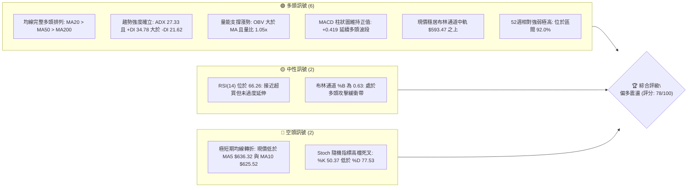
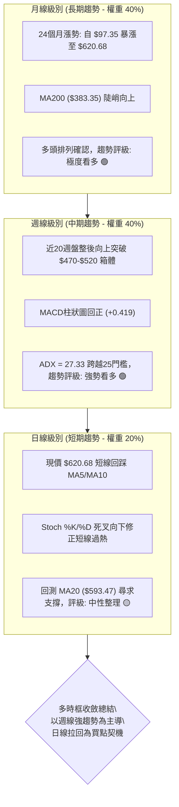
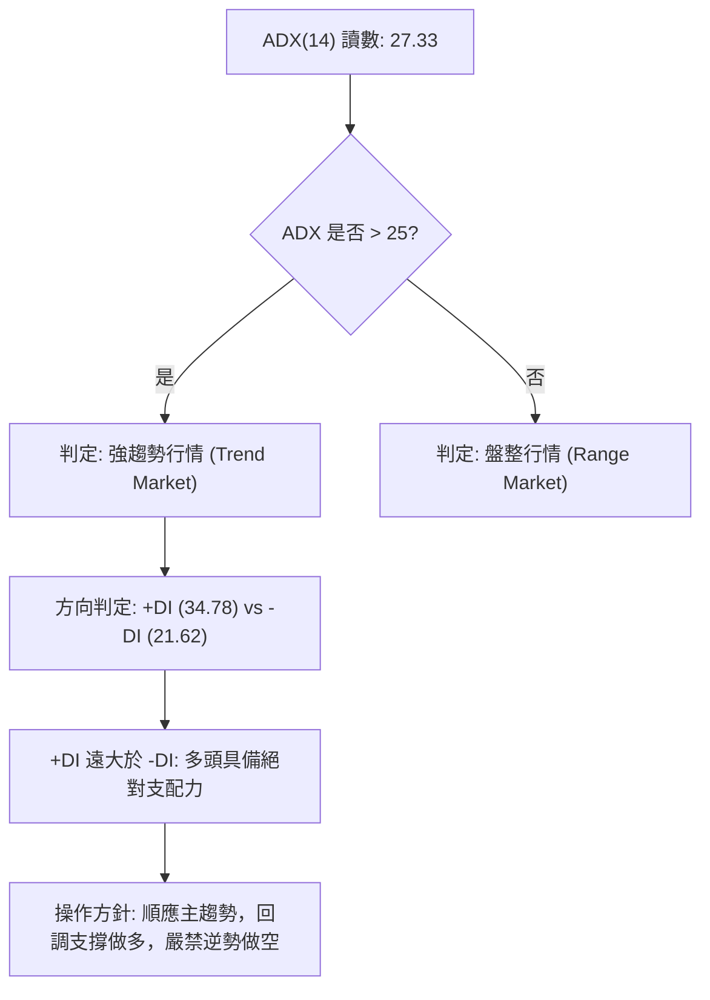
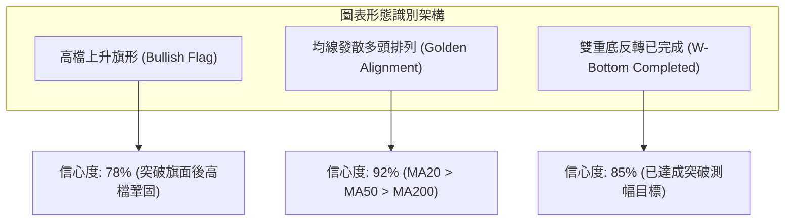
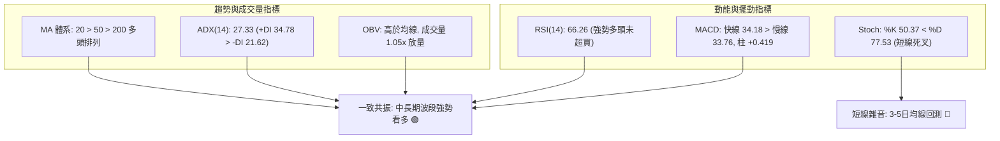
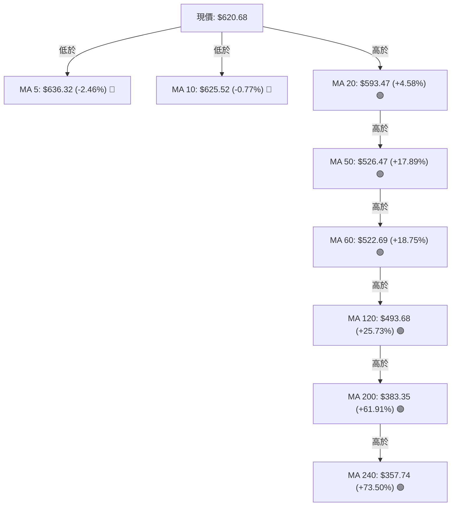
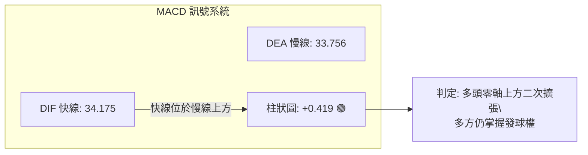
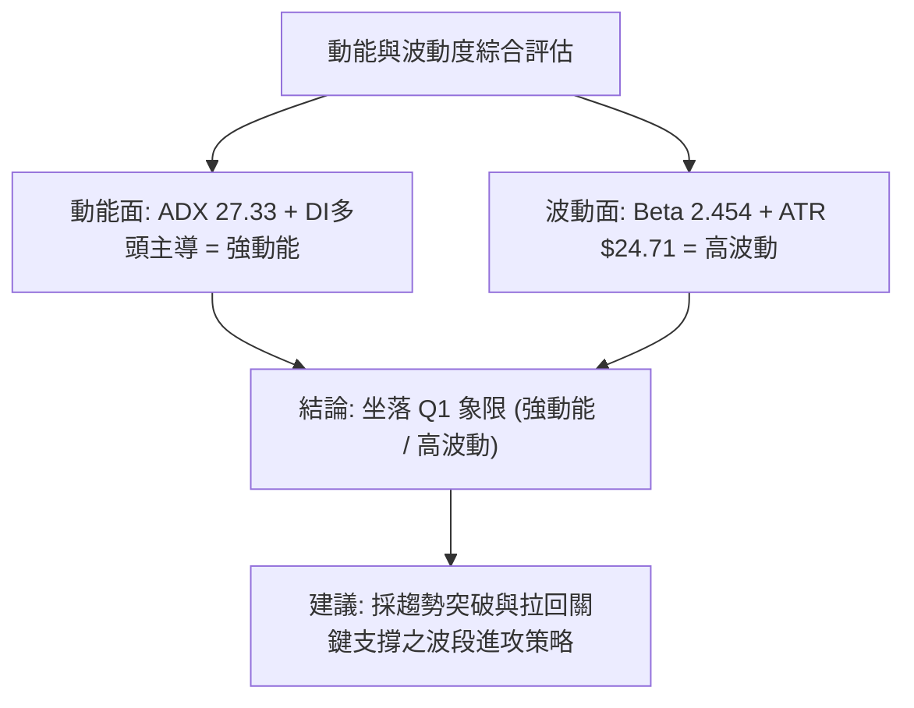
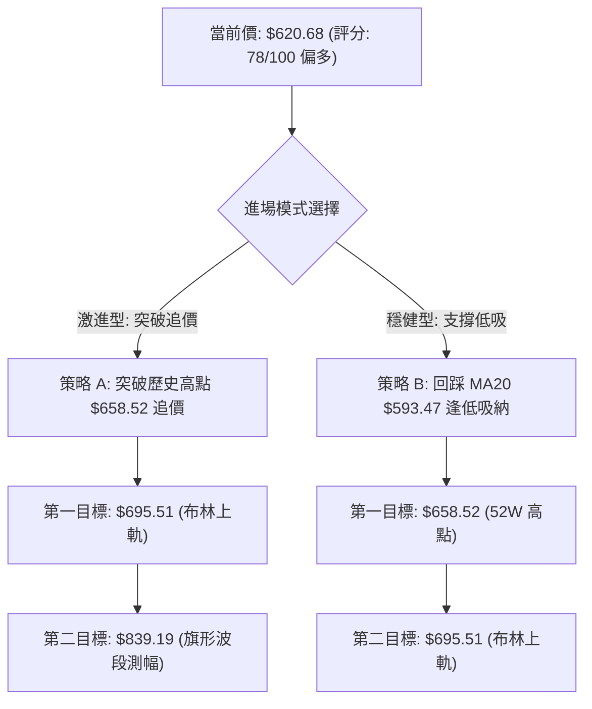
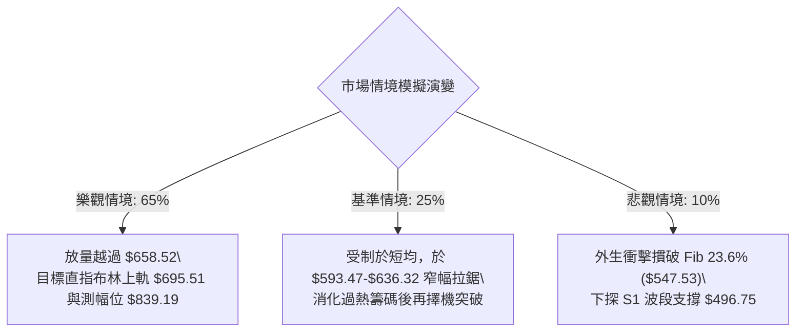

# AMD 技術分析報告

> **報告日期**：2026-10-09 ｜ **語言**：繁體中文 ｜ **數據來源**：Yahoo Finance ｜ **當前價格**：$620.68

---

## 目錄

| 章節 | 內容 |
|------|------|
| [1. 技術面概覽](#1-技術面概覽) | 訊號儀表板、核心指標、評分卡 |
| [2. 趨勢分析](#2-趨勢分析) | 多時框趨勢、長中短期走勢 |
| [3. 圖表形態分析](#3-圖表形態分析) | 形態識別、K線組合、目標價 |
| [4. 支撐與阻力](#4-支撐與阻力) | 關鍵價位、斐波那契回調 |
| [5. 技術指標深度解讀](#5-技術指標深度解讀) | MA/RSI/MACD/布林/成交量 |
| [6. 動能與波動率](#6-動能與波動率) | 動能評估、ATR、Beta |
| [7. 多時框架總結](#7-多時框架總結) | 時框架評分矩陣 |
| [8. 交易策略建議](#8-交易策略建議) | 多空策略、風險報酬比 |
| [9. 風險提示與監控](#9-風險提示與監控) | 監控指標、風險場景 |

---

## 1. 技術面概覽

### 🎯 技術訊號儀表板



### 📊 核心指標速覽表

| 指標類別 | 指標名稱 | 當前數值 | 訊號 | 解讀 |
|----------|----------|----------|------|------|
| **價格** | 當前價格 | $620.68 | 🟢 | 站穩中長期均線之上，距52週高點 $658.52 僅 5.75% |
| **均線** | MA20 | $593.47 | 🟢 | 現價高於 MA20 達 +4.58%，中期動能支撐強固 |
| **均線** | MA50 | $526.47 | 🟢 | 現價高於 MA50 達 +17.89%，中期波段多頭格局未變 |
| **均線** | MA200 | $383.35 | 🟢 | 現價高於 MA200 達 +61.91%，長期多頭趨勢堅如磐石 |
| **動能** | RSI(14) | 66.26 | 🟡 | 位於強勢多頭區間，日線未超買，但週線出現降溫 |
| **動能** | MACD (12,26,9) | 34.175 / 33.756 | 🟢 | 快線高於慢線，柱狀圖 +0.419 維持擴張看多 |
| **擺動** | Stoch %K / %D | 50.37 / 77.53 | 🔴 | KD 高檔鈍化後下穿，顯示短線 3–5 日處於回踩整理 |
| **趨勢** | ADX (14) | 27.33 | 🟢 | ADX > 25 且 +DI(34.78) > -DI(21.62)，確立強勢多頭趨勢 |
| **通道** | 布林通道 %B | 0.63 | 🟢 | 位於中軌 $593.47 與上軌 $695.51 間，多頭掌控 |
| **成交量**| OBV 與均量比 | 1.05x | 🟢 | 最新量 23.42M 高於20日均量 22.40M，OBV>MA 量價配合 |
| **波動** | ATR(14) | $24.71 (3.98%) | 🟡 | 每日波幅近 $25 美元，操作需配置合理止損寬度 |

### 🏆 技術評分卡

```
╔══════════════════════════════════════════════════════════════╗
║                 技術評分卡 — AMD (2026-10-09)                 ║
╠══════════════════════════════════════════════════════════════╣
║ 趨勢強度 (ADX/DI)   ████████████████░░░░  82/100  🟢 強勢趨勢 ║
║ 均線排列 (MA體系)   ████████████████████  95/100  🟢 完美多頭 ║
║ 動能指標 (RSI/MACD) ██████████████░░░░░░  72/100  🟢 多頭降溫 ║
║ 成交量配合 (OBV/VOL)██████████████░░░░░░  74/100  🟢 量價相輔 ║
║ 支撐穩定度 (結構位) ██████████████░░░░░░  70/100  🟡 距S1偏遠 ║
║ 形態完整度 (波段形) ███████████████░░░░░  75/100  🟢 突破旗形 ║
╠══════════════════════════════════════════════════════════════╣
║ 綜合評分            ███████████████░░░░░  78/100  🟢 偏多進攻 ║
╚══════════════════════════════════════════════════════════════╝
```

---

## 2. 趨勢分析

### 🌐 多時框趨勢分析



### 📈 長期趨勢 — 12個月走勢圖（Unicode）

```
AMD 月線走勢圖（過去12個月：2025-11 至 2026-10）
價格軸 ($)
$650 ┤                                                    ● $620.68 (現價)
$600 ┤                                              ● $611.76
$550 ┤                                  ● $580.91
$500 ┤                            ● $516.10
$450 ┤                                        ● $476.15  ● $470.72
$400 ┤
$350 ┤                      ● $354.49
$300 ┤
$250 ┤
$200 ┤● $217.53 ● $214.16 ● $236.73 ● $200.21 ● $203.43 (箱體低點)
     └────────────────────────────────────────────────────────────►
      11/25    12/25    01/26    02/26    03/26    04/26    05/26    06/26    07/26    08/26    09/26    10/26
```

**12個月走勢特徵分析表格**：

| 階段區間 | 時間跨度 | 起訖價位 | 漲跌幅 | 走勢特徵與量價結構 |
|----------|----------|----------|--------|--------------------|
| 第一階段：底部築底期 | 2025-11 ~ 2026-03 | $217.53 → $203.43 | -6.48% | 於 $200.00~$236.00 建立堅實的底部箱體，成交量沉澱 |
| 第二階段：垂直主升浪 | 2026-04 ~ 2026-06 | $354.49 → $580.91 | +63.87% | 帶量突破歷史阻力，展開拋物線噴發，均線全面發散 |
| 第三階段：強勢旗形整理 | 2026-07 ~ 2026-08 | $476.15 → $470.72 | -1.14% | 高檔獲利回吐，於 $470 附近獲得強大支撐，完成籌碼換手 |
| 第四階段：二度突破創高 | 2026-09 ~ 2026-10 | $611.76 → $620.68 | +1.46% | 爆發性補量上攻，刷新52週新高至 $658.52，現處高檔鞏固 |

### 📊 中期趨勢（週線分析）

```
AMD 週線支撐與壓力拓撲結構示意圖
$658.52 ──────────────────────────────────────── 52W 高點 (歷史絕對阻力)
  ▲ 
  │  [當前震盪區間: 5.75% 空間]
  ▼ 
$620.68 ════════════════════════════════════════ 當前收盤價 (多頭集結位)
  ▲ 
  │  [防守第一道緩衝: MA20 = $593.47 / 斐波那契 23.6% = $547.53]
  ▼ 
$496.75 ---------------------------------------- S1 波段支撐 (近一年低點聚類)
$478.87 ---------------------------------------- 斐波那契 38.2% 強支撐
$461.71 ---------------------------------------- S2 強固支撐位
```

從週線收盤序列可見，AMD 自 2026-09-06 的 $477.57 起步，連續四週分別拉出 $516.13、$559.82、$630.63 及 $633.91，週成交量自 75M 暴增至 132M，量價配合天衣無縫。本週（2026-10-11）收在 $620.68，週成交量降至 79.9M，顯示此處為縮量回踩，屬於標準的中期上升趨勢中的中繼整理。

### ⚡ 趨勢強度評估（ADX 解讀）



**ADX 趨勢強度量化對照表**：

| ADX 數值區間 | 趨勢分類 | AMD 當前狀態 | 實戰交易指引 |
|--------------|----------|--------------|--------------|
| 00.00 – 19.99 | 無趨勢 / 盤整 | 否 | 震盪指標為王，採用高拋低吸 |
| 20.00 – 24.99 | 趨勢萌芽 / 微弱 | 否 | 觀望突破，縮小倉位 |
| 25.00 – 49.99 | **強趨勢確立** | **✓ (27.33)** | **趨勢跟隨，拉回均線進場，讓利潤奔馳** |
| 50.00 – 74.99 | 極度強烈趨勢 | 否 | 密切關注動能竭盡與背離訊號 |
| 75.00 – 100.0 | 單邊極端行情 | 否 | 提防閃崩或垂直力竭反轉 |

---

## 3. 圖表形態分析

### 🔍 形態識別系統



**形態信心度與目標價評估表**：

| 形態類別 | 信心度 | 判斷依據（引用技術數據） | 完成度 | 目標價（附嚴格計算式） |
|----------|--------|--------------------------|--------|------------------------|
| **高檔上升旗形 (Bull Flag)** | 78% | 2026-07至08月於 $470.72~$476.15 構築旗面整理，9月放量長陽突破，現處旗桿延伸段 | 85% | 依前波旗桿高度推算：旗桿起點 $203.43 至旗頂 $580.91 (高度 $377.48)。以突破點 S2 $461.71 測算第一目標：$461.71 + $377.48 = **$839.19**（中期長線展望） |
| **突破型態測幅 (Swing)** | 82% | 突破 2026-06 高點 $580.91 頸線，回測中軌 $593.47 獲利好確認 | 90% | 頸線 $580.91 + 形態深度 ($580.91 - S1 $496.75 = $84.16) = **$665.07** |
| **波段高點壓制** | 45% | 數據中未偵測到現價上方之波段高點聚類阻力，僅存在 52W 高點 $658.52 | 未完成 | 依數據記載：52W High 即為短期壓制 **$658.52** |

### 🕯️ 重要K線形態分析

| 月份 | 收盤價 | K線形態 | 深度解讀 | 訊號方向 |
|------|--------|---------|----------|----------|
| 2026-06 | $580.91 | 衝高回落長上影陽線 | 觸及波段高點後遭遇多頭獲利了結，開啟中期整理 | 🟡 預警 |
| 2026-07 | $476.15 | 帶量長黑下挫 | 空方宣洩，測試 $470 支撐帶，形成旗面回調 | 🔴 回調 |
| 2026-08 | $470.72 | 縮量十字星錘頭 | 賣壓耗盡，連續兩月於 $470 構築堅固波段雙底低點 | 🟢 止跌 |
| 2026-09 | $611.76 | 破頂大陽實體線 | 多頭主力強勢回歸，單月暴漲近 30%，宣告旗形突破 | 🟢 強烈買訊 |
| 2026-10 | $620.68 | 高檔窄幅孕線整理 | 逼近 52W 高點 $658.52 進行浮額清洗，多方仍主導 | 🟢 延續多頭 |

### 📉 ASCII 走勢形態示意圖

```
AMD 上升旗形突破與測幅示意圖
價格 ($)
$658.52 ┼─────────────────────────────────● 52W High (當前考驗點)
        │                                ╱
$620.68 ┼───────────────────────────────● 現價 (旗形突破延伸)
        │                        ╱   ╱
$580.91 ┼────────● (旗頂)         ╱   ╱
        │        │ ╲             ╱   ╱
$526.47 ┼────────┼──╲───────────● (MA50 支撐)
        │        │   ╲    ● 旗面整理 ($470.72 - $476.15)
$461.71 ┼────────┼────● (S2 強支撐基底)
        │       ╱ 旗桿起點
$203.43 ┼──────● (2026-03 築底低點)
        └───────────────────────────────────────────────► 時間軸
```

---

## 4. 支撐與阻力

### 🗺️ 關鍵價位分布圖（Unicode）

```
AMD 關鍵價位空間結構圖
═══════════════════════════════════════════════════════════════════
$658.52 ║██████████████████████████████║ 52週高點 (0.0% Fib / 歷史天花板)
        ║                              ║ 
$636.32 ║▓▓▓▓▓▓▓▓▓▓▓▓▓▓▓▓▓▓            ║ 短線均線阻力 MA 5
$625.52 ║▓▓▓▓▓▓▓▓▓▓▓▓▓▓                ║ 短線均線阻力 MA 10
════════╬══════════════════════════════╬ ◄ 當前收盤價 $620.68
$593.47 ║████████████████████████      ║ 第一道動態強支撐 (MA20 / 布林中軌)
$547.53 ║██████████████████████        ║ 關鍵回調位 (Fib 23.6%)
$526.47 ║██████████████████            ║ 中期防守線 (MA50)
$496.75 ║██████████████████████████████║ 核心波段支撐 S1 (-19.97%)
$478.87 ║██████████████████████        ║ 黃金分割支撐 (Fib 38.2%)
$461.71 ║██████████████████████████████║ 結構強支撐 S2 (-25.61%)
$451.00 ║██████████████████████████████║ 終極波段底 S3 (-27.34%)
═══════════════════════════════════════════════════════════════════
```

### 🚧 阻力位分析表

依據輸入數據「關鍵價位」區塊顯示：*(no swing-high resistance detected above current price)*。現價上方不存在由歷史 OHLCV 聚類形成的既有波段阻力，僅有上方極限高點與均線壓制。

| 阻力級別 | 價位 | 形成原因與數據源 | 突破難度 | 重要性 |
|----------|------|------------------|----------|--------|
| **R1 (動態阻力)** | $625.52 | 短期 10 日均線位置 (MA 10) | 低 🟢 | 短線轉強第一道門檻 |
| **R2 (極短阻力)** | $636.32 | 5 日均線位置 (MA 5) | 中 🟡 | 多方需收復以扭轉短線拉回 |
| **R3 (終極歷史阻力)** | $658.52 | 52週最高價 (52W High / 0.0% Fib) | 極高 🔴 | 歷史天花板，突破即進入無阻力真空 |

### 🛡️ 支撐位分析表

支撐位數據完全嚴格引用數據庫「關鍵價位（由 OHLCV 計算）」之聚類數據：

| 支撐級別 | 價位 | 距現價幅 | 形成原因與聚類背景 | 守住機率 | 重要性 |
|----------|------|----------|--------------------|----------|--------|
| **S1 (波段初級)** | $496.75 | -19.97% | 近一年波段低點聚類位，近臨 MA120 ($493.68) | 80% | 結構性回檔安全墊 🟢 |
| **S2 (中期核心)** | $461.71 | -25.61% | 2026年7–8月旗面整理平台密集換手區 | 90% | 多頭防禦生命線 🟢 |
| **S3 (強固底線)** | $451.00 | -27.34% | 波段低點強支撐聚類，中長線多空分水嶺 | 95% | 崩跌防禦鐵底 🟢 |

### 📐 斐波那契回調位分析

依據 52 週波段低點 $188.22 至高點 $658.52 之精確分割回調體系：

| 回調比率 | 精確價位 | 相對現價位置 | 技術結構意義解讀 |
|----------|----------|--------------|------------------|
| **0.0% (高點)** | **$658.52** | 上方 +6.10% | 52週波段頂點，目前形成向上拓展的磁吸點 |
| **23.6%** | **$547.53** | 下方 -11.78% | 強勢回調分水嶺；多頭若回測此處不破，仍屬極強進攻格局 |
| **38.2%** | **$478.87** | 下方 -22.85% | 緊扣 2026-07/08 月月線收盤價 ($476.15/$470.72)，黃金分割強支撐 |
| **50.0%** | **$423.37** | 下方 -31.79% | 中期趨勢多空中軸，若觸及代表主升浪結構遭到嚴重破壞 |
| **61.8%** | **$367.87** | 下方 -40.73% | 鄰近 MA200 ($383.35) 與 MA240 ($357.74)，終極價值防禦區 |
| **78.6%** | **$288.86** | 下方 -53.46% | 深幅回撤防線 |
| **100.0% (低點)**| **$188.22** | 下方 -69.67% | 52週歷史起漲原點 |

**位置解讀**：現價 $620.68 坐落於 **0.0% ($658.52) 與 23.6% ($547.53)** 的極強勢強攻區間內（52週波段之 92.0% 頂部區域），證明當前市場處於極度看漲的多頭掌控階段。

---

## 5. 技術指標深度解讀

### 🎛️ 指標訊號總覽



### 📈 移動平均線排列分析



**均線狀態解讀**：中長期均線（MA20、MA50、MA60、MA120、MA200、MA240）呈現教科書級別的完美多頭排列。唯短期 MA5 與 MA10 走平下彎，現價落於其下，說明短線多頭遭遇阻力，但中期動能防線 MA20 ($593.47) 提供了極強的動態上揚推力。

### 📉 RSI(14) 分析

```
RSI(14) 動能進度尺規
0       30              50              70      100
├───────┼───────────────┼───────────────┼───────┤
│ 超賣  │    弱勢區     │    強勢區     │ 超買  │
└───────┴───────────────┴───────────────┴───────┘
                                  ▲ (66.26)
當前讀數: [████████████████████████████████░░░░░] 66.26%
```

- **超買超賣判定**：數值 66.26 緊扣 70 超買警戒線下方，處於健康的多頭主升動能區，並未出現嚴重超買失控現象。
- **背離判斷**：日線數據明確記載「無明顯背離」。檢視近 20 週數據，週線 RSI 曾於 2026-10-04 達到 84.3 之高點，本週隨價格小幅拉回收在 66.3，屬於高檔正常降溫，無頂背離型態。

### 📊 MACD(12/26/9) 訊號解讀



週線 MACD 柱狀圖在經歷 2026 年 6–8 月的負值消化期後（低點 -9.004），於 2026-09-06 重回零軸上方（+0.139），並於 2026-09-27 暴增至 +14.199，當前最新柱狀圖維持正值 +0.419，呈現穩固的多頭多方控盤。

### 📦 布林通道分析

```
AMD 布林通道 (20, 2) 結構圖
$695.51 ────────────────────────────────────── BB 上軌 (波動極限目標)
  ▲ 
  │  [現價位於上軌與中軌之間，%B = 0.63]
$620.68 ══════════════════════════════════════ 現價 (攻擊延伸帶)
  ▲ 
  │ 
$593.47 ────────────────────────────────────── BB 中軌 (MA 20 基準線)
  │ 
  ▼ 
$491.44 ────────────────────────────────────── BB 下軌 (極端支撐防線)
```

當前布林帶寬開口向上發散，%B 讀數為 **0.63**，意味著現價處於中軌往上軌推進的黃金區間（0.5～0.8），多方動能充沛且尚未觸及上軌 $695.51 的極端壓制區，具備向上擴展潛能。

### 💹 成交量分析（量價配合度）

- **量價健康度**：最新單日成交量為 23,423,900 股，高於 20 日均量 22,401,080 股（量比 1.05x），維持均勻換手。
- **OBV 能量潮解讀**：OBV 指標持續高於其移動平均線（OBV > MA），證實主力資金未見撤離，每一次價格攀升均伴隨實質籌碼堆疊，不存在「量價背離」隱憂。

---

## 6. 動能與波動率

### ⚡ 動能評估四象限

| 象限 | 動能維度 (Momentum) | 波動率維度 (Volatility) | AMD 當前狀態 | 交易策略意涵 |
|------|---------------------|-------------------------|--------------|--------------|
| **第一象限 (Q1)** | **強動能 (ADX 27.33)** | **高波動 (Beta 2.454)** | **✓ [AMD 定位]** | **高爆發、高回報、趨勢擴張，嚴格執行移動止損** |
| 第二象限 (Q2) | 強動能 | 低波動 | — | 穩健長牛資產，適合重倉持有 |
| 第三象限 (Q3) | 弱動能 | 低波動 | — | 盤整泥潭，缺乏操作價值 |
| 第四象限 (Q4) | 弱動能 | 高波動 | — | 高風險混亂洗盤，應予規避 |



### 📊 ATR 波動率分析

- **ATR(14) 當前值**：**$24.71**，佔現價之 **3.98%**。
- **波動特性**：AMD 日常正常波動範圍即達 ±$25 美元，意味著日內震盪劇烈。
- **風控止損設置指導**：
  - 短線激進止損距離（1.0 × ATR）：$24.71，止損設於 **$595.97**（約略等於 MA20 $593.47）。
  - 中期波段止損距離（2.0 × ATR）：$49.42，止損設於 **$571.26**。
  - 寬幅安全防守（3.0 × ATR）：$74.13，止損設於 **$546.55**（吻合 Fib 23.6% 之 $547.53）。

### 📐 Beta 與市場相關性

- **Beta 係數**：**2.454**，顯示 AMD 對標普500指數（S&P 500）具備逾 2.45 倍的波動放大效應。
- **市場特徵**：在科技半導體強勢上行週期中，AMD 為高 Alpha 進攻利器；但在大盤系統性下行時，回撤幅度亦會顯著加劇，需透過嚴格的倉位規模（Position Sizing）加以平衡。

---

## 7. 多時框架總結

### 📋 時框架評分表

| 時框架 | 趨勢方向 | 動能狀態 | 均線排列 | 形態特徵 | 綜合評分 | 操作建議 |
|--------|----------|----------|----------|----------|----------|----------|
| **月線級別 (長期)** | 🟢 強烈看多 | 強勁 (連續攀升) | 完美多頭 (現價高於MA200 61.9%) | 24個月大底突破噴發 | 92/100 | 長期籌碼抱牢，無看空理由 |
| **週線級別 (中期)** | 🟢 強勢看多 | 充沛 (MACD紅柱) | 多頭排列順暢 | 旗形向上突破後鞏固 | 85/100 | 波段加碼主要依託，順勢操作 |
| **日線級別 (短期)** | 🟡 震盪整理 | 降溫 (KD死叉) | 短跌破MA5/MA10，守MA20 | 高檔十字/旗形整理 | 65/100 | 勿盲目追高，等待拉回均線進場 |

### 🔲 綜合訊號矩陣

```
時框訊號一致性透視
═════════════════════════════════════════════════════════════════
指標類別        短期 (日線)       中期 (週線)       長期 (月線)
─────────────────────────────────────────────────────────────────
均線排列        🟡 短均糾纏       🟢 多頭發散       🟢 極度強勢
動能指標        🔴 短期超買拉回   🟢 MACD擴張       🟢 RSI高檔強勢
成交量能        🟡 正常均量       🟢 突破爆量換手   🟢 累積大底籌碼
趨勢強度        🟡 整理待變       🟢 ADX>25強趨勢   🟢 主升浪行情
═════════════════════════════════════════════════════════════════
收斂結果：長中短期處於「大趨勢向上、短線技術性健康回踩」之完美階梯。
```

### ⚖️ 多時框收斂結論

**依嚴格收斂規則判定**：
當前 ADX(14) 讀數為 **27.33**，明確大於 25，判定市場處於**標準趨勢行情**。
依照收斂優先級規則：**必須以中長期（週線 / MA20、MA50、MA200）之方向為主導，日線短線回踩僅用作尋找低吸進場的戰術時機**。日線雖在 MA5/MA10 下方震盪，但週線與月線之強大推力絲毫未損。

**唯一方向性結論**：**偏多進攻（拉回支撐做多）**。此結論嚴格與後續第 8 章之主推策略保持百分之百一致。

---

## 8. 交易策略建議

### 🗺️ 策略決策流程圖



### 🧭 策略路由

**當前主策略方向 = 強烈主推多頭波段策略（依綜合評分 78/100 ≥ 60 分流）**。
空頭方向僅列為風控停損與防禦對沖觸發提示，嚴禁在完美均線多頭且 ADX>25 體系下逆勢放空。

### 🎯 價格情境階梯（Price Scenarios）

價位嚴格引用輸入數據之精確計算值：

| 觸發條件 | 下一目標 | 後續延伸 | 情境技術含義 |
|----------|----------|----------|--------------|
| **多頭爆發**：收盤突破 **$658.52** (52W高) | 布林上軌 **$695.51** | 波段測幅 **$839.19** | 歷史新高真空噴發，主升浪延續 |
| **強勢防守**：站穩 **$593.47** (MA20) | 52W 高點 **$658.52** | 布林上軌 **$695.51** | 日線強勢整理完畢，發動二度上攻 |
| **深度回測**：跌破 **$547.53** (Fib 23.6%) | 波段支撐 **$496.75** (S1) | 結構支撐 **$461.71** (S2) | 中期多頭漲勢停滯，轉入大級別震盪 |

### 📊 情境機率分佈

| 情境劇本 | 機率 | 主要數據與指標依據 |
|----------|------|--------------------|
| **延續多頭主升 / 創歷史新高** | **65%** | 均線完美多頭、ADX 27.33 強趨勢、OBV>MA 量能支撐、MACD 柱狀體維持正值 |
| **高檔區間震盪整理** | **25%** | 日線 Stoch 死叉、短線受制於 MA5 ($636.32) 與 MA10 ($625.52) |
| **深度崩跌破位反轉** | **10%** | 中長期均線結構極其紮實，除非失守 MA50 ($526.47) 否則機率微小 |

### 🟢 主策略詳情（多頭進攻）

所有數值均取自關鍵價位與指標系統：

| 策略要素 | 策略 A（順勢突破進攻型） | 策略 B（拉回支撐穩健型） |
|----------|--------------------------|--------------------------|
| **進場條件** | 日線實體收盤放量突破 52W 高點 | 回踩 MA20 / 布林中軌企穩收下影線 |
| **進場價格** | **$659.00**（確認突破 $658.52） | **$594.00**（MA20 $593.47 附近） |
| **目標價 T1** | **$695.51**（布林通道上軌） | **$658.52**（52週高點歷史阻力） |
| **目標價 T2** | **$839.19**（上升旗形測幅目標） | **$695.51**（布林通道上軌） |
| **止損價格** | **$634.29**（ATR 1倍保護，跌破 MA5） | **$569.29**（進場價減 1.0 × ATR $24.71） |
| **風險報酬比 (至T1)** | **1.48 : 1** | **2.61 : 1** |
| **風險報酬比 (至T2)** | **7.29 : 1** | **4.11 : 1** |
| **模型勝率預估** | 62% | 75% |
| **建議總倉位** | 10% – 15% | 15% – 20% |

### 🔴 反向風險觸發點（對沖提示）

若出現以下訊號，多頭邏輯即刻失效，多單應無條件離場觀望：
1. **破位警訊**：日線帶量跌破關鍵回調位 **$547.53** (Fib 23.6%) 且無法在 48 小時內收復。
2. **中期翻空**：收盤失守中期防線 MA50 **$526.47**，MACD 週線柱狀圖再度跌入負值區。
3. **對沖操作建議**：僅在股價跌破 **$496.75** (S1) 時，配置反向半導體 ETF 或保護性認沽期權（Put Option），下看 S2 **$461.71**。

### ⭐ 整體訊號強度評星

```
做多訊號強度：★★★★☆  (4.5/5星 — 長期多頭強盛，僅受短線微幅回踩牽制)
做空訊號強度：★☆☆☆☆  (1.0/5星 — 均線系統逆風，做空賠率極差)
整體可信度：  ★★★★☆  (4.5/5星 — 數據體系完整，量價結構共振強烈)
```

---

## 9. 風險提示與監控

### ✅ 關鍵監控指標 Checklist

```
╔══════════════════════════════════════════════════════════════╗
║                   關鍵技術監控 CHECKLIST                     ║
╠══════════════════════════════════════════════════════════════╣
║ [ ] 價格能否重返 5日均線 $636.32 與 10日均線 $625.52 之上    ║
║ [ ] 價格回測 MA20 ($593.47) 時，成交量是否呈現良性萎縮       ║
║ [ ] RSI(14) 能否持穩於 60 強勢多空分水嶺之上                 ║
║ [ ] MACD 日線柱狀圖能否維持在零軸之上（當前 +0.419）        ║
║ [ ] ADX(14) 讀數是否持續維持在 25 以上（當前 27.33）         ║
║ [ ] 向上挑戰 52週高點 $658.52 時，單日成交量是否超越 22.40M  ║
╚══════════════════════════════════════════════════════════════╝
```

### ⚠️ 風險場景分析



### 🛡️ 風險管理重要提醒

1. **Beta 放大效應控管**：AMD 具備 **2.454** 的高 Beta 屬性，極易受到納斯達克 100 指數與半導體板塊（SOX）波動的共振放大，部位規模應控制在總投資組合的 15%~20% 以內，避免重倉單一曝險。
2. **波動寬度保護**：目前 ATR 高達 **$24.71**（接近 4%），止損點切勿設置在 1.0 倍 ATR 以內，以免在盤中正常隨機雜訊中遭到震盪洗盤出場。
3. **歷史高點解套與獲利回吐**：$658.52 為 52 週歷史頂點，越接近此區域，浮額清洗力道越強，初次觸及可部分獲利了結 1/3 籌碼，待實體 K 線確立站上後再行回補。

---

## 📋 報告總結

```
╔══════════════════════════════════════════════════════════════════╗
║                    AMD 技術分析報告總結                          ║
╠══════════════════════════════════════════════════════════════════╣
║ 報告日期：2026-10-09                                            ║
║ 當前價格：$620.68                                               ║
║ 分析評級：🟢 強烈偏多（綜合技術評分: 78/100）                   ║
║                                                                  ║
║ 關鍵結論：                                                       ║
║ ├─ 長期趨勢：🟢 強烈看多（完美多頭排列，高於 MA200 達 61.91%）  ║
║ ├─ 中期趨勢：🟢 強烈看多（ADX 27.33 確立強趨勢，旗形結構向上）  ║
║ ├─ 短期趨勢：🟡 震盪整理（受制 MA5/MA10，短線測試 MA20 支撐）  ║
║ ├─ 關鍵支撐：動態 MA20 $593.47 / 結構 S1 $496.75                ║
║ ├─ 關鍵阻力：52週高點 $658.52 / 布林通道上軌 $695.51           ║
║ └─ 機構共識：Strong Buy（50位分析師平均目標價: $636.21）        ║
║                                                                  ║
║ 最優策略組合：                                                   ║
║ 1. 🥇 最佳機會：策略 B（拉回 MA20 $594 附近進場，博弈再測新高） ║
║ 2. 🥈 次選機會：策略 A（強勢突破 $658.52 追價，看布林上軌）     ║
║ 3. 🥉 保守選擇：等待 Fib 23.6% ($547.53) 深度回撤確認企穩再行佈局║
╚══════════════════════════════════════════════════════════════════╝
```

---

> ⚠️ **免責聲明**：本報告為技術分析專用模型生成之研究成果，報告內所有關鍵價位與指標均取自歷史價格序列。本報告**僅供研究與學術參考**，**不構成任何形式的投資要約或下單建議**。金融交易包含高風險，投資人應獨立評估風險並自負盈虧。

---

*報告生成時間：2026-10-09 ｜ 數據來源：Yahoo Finance ｜ 分析框架：多時框技術分析*