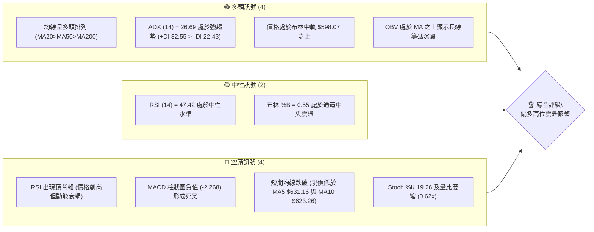
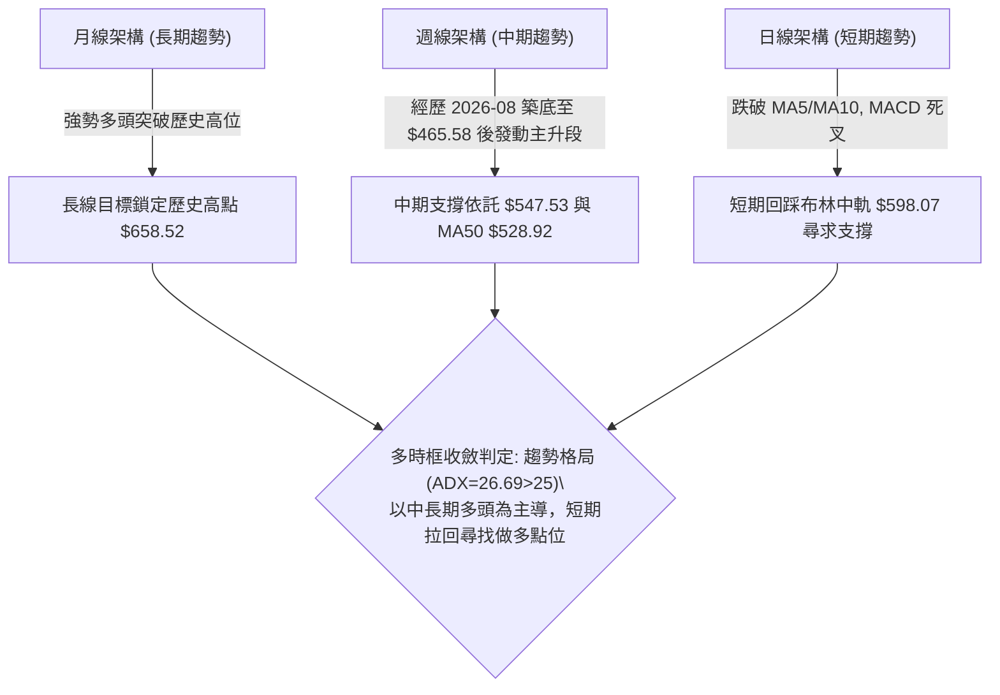
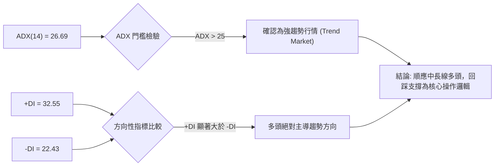
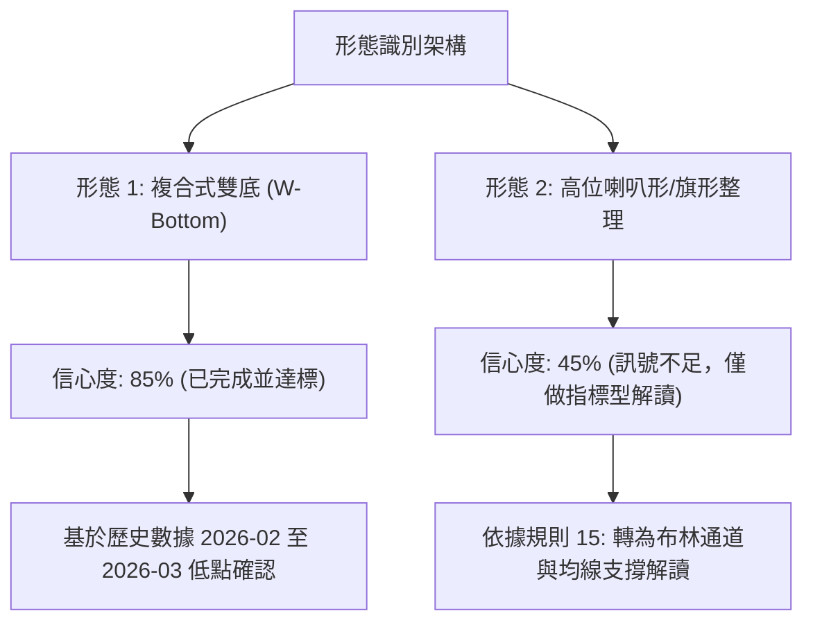
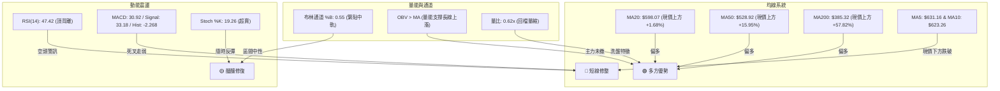
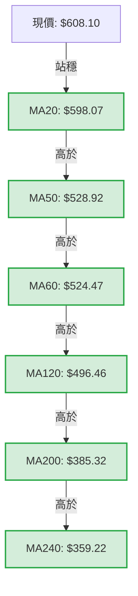
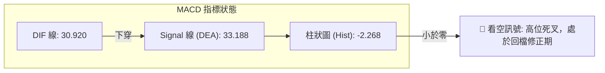
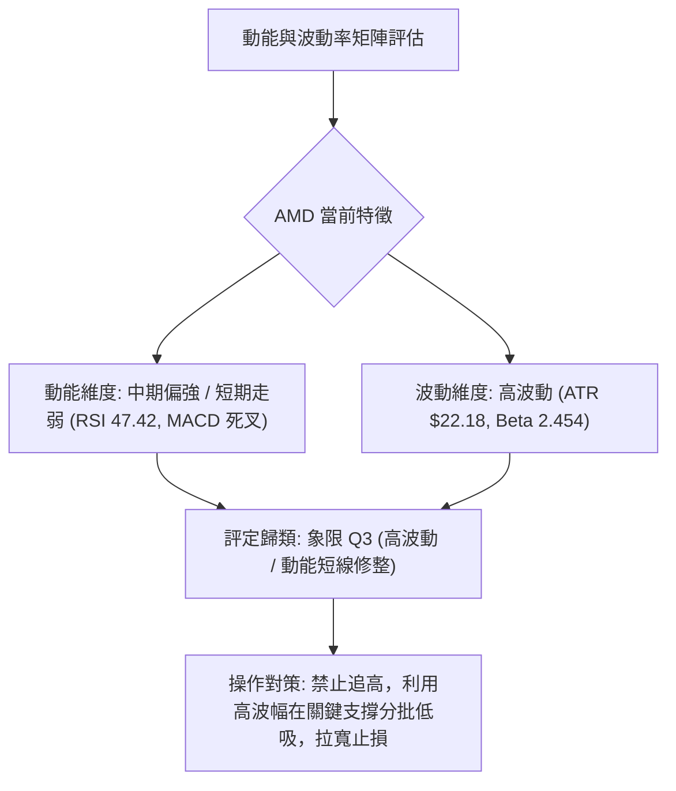
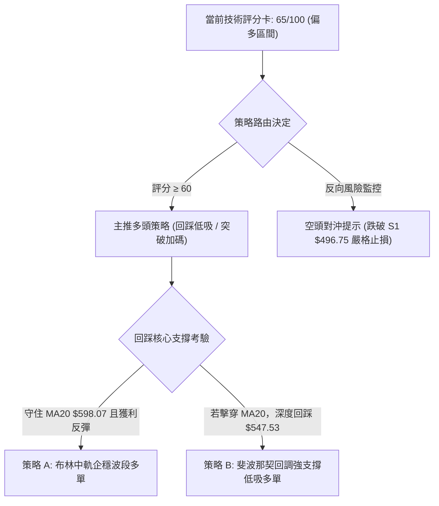
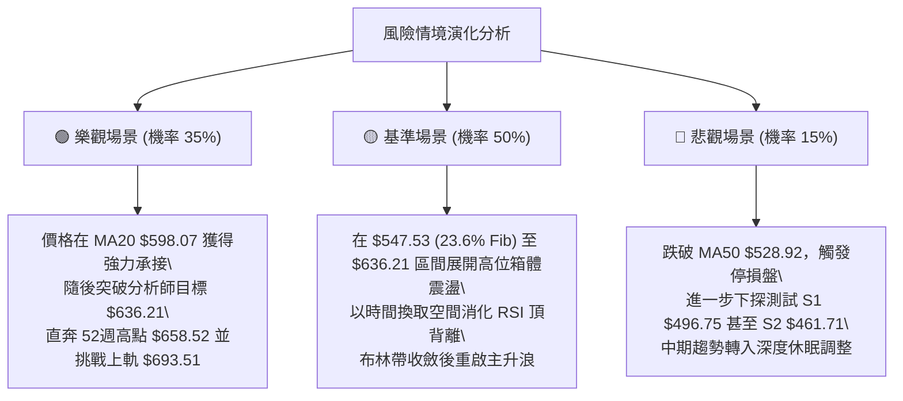

# AMD 技術分析報告

> **報告日期**：2026-10-10 ｜ **語言**：繁體中文 ｜ **數據來源**：Yahoo Finance ｜ **當前價格**：$608.10

---

## 目錄

| 章節 | 內容 |
|------|------|
| [1. 技術面概覽](#1-技術面概覽) | 訊號儀表板、核心指標、評分卡 |
| [2. 趨勢分析](#2-趨勢分析) | 多時框趨勢、長中短期走勢 |
| [3. 圖表形態分析](#3-圖表形態分析) | 形態識別、K線組合、目標價 |
| [4. 支撐與阻力](#4-支撐與阻力) | 關鍵價位、斐波那契回調 |
| [5. 技術指標深度解讀](#5-技術指標深度解讀) | MA/RSI/MACD/布林/成交量 |
| [6. 動能與波動率](#6-動能與波動率) | 動能評估、ATR、Beta |
| [7. 多時框架總結](#7-多時框架總結) | 時框架評分矩陣 |
| [8. 交易策略建議](#8-交易策略建議) | 多空策略、風險報酬比 |
| [9. 風險提示與監控](#9-風險提示與監控) | 監控指標、風險場景 |

---

## 1. 技術面概覽

### 🎯 技術訊號儀表板



### 📊 核心指標速覽表

| 指標類別 | 指標名稱 | 當前數值 | 訊號 | 解讀 |
|----------|----------|----------|------|------|
| **價格** | 當前價格 | $608.10 | 🟢 | 位於52週區間 89.3% 高位，多頭格局未破 |
| **均線** | MA20 | $598.07 | 🟢 | 現價高於 MA20（+1.68%），短線多頭防守線有效 |
| **均線** | MA50 | $528.92 | 🟢 | 現價高於 MA50（+14.97%），中期多頭支撐扎實 |
| **均線** | MA200 | $385.32 | 🟢 | 現價遠高於牛熊分界線（+57.82%），長期強勢多頭 |
| **動能** | RSI(14) | 47.42 | 🟡 | 中性區間，但自高位迅速滑落並伴隨頂背離訊號 |
| **動能** | MACD | 30.920 (Hist: -2.268) | 🔴 | MACD 低於 Signal (33.188)，柱狀圖轉負，短線修正 |
| **動能** | Stoch %K / %D | 19.26 / 52.94 | 🟡 | %K 跌入超賣區間，短線存在技術性超跌反彈需求 |
| **趨勢** | ADX(14) | 26.69 (+DI: 32.55) | 🟢 | ADX > 25 確認趨勢行情，+DI > -DI 顯示多方主導中長線 |
| **通道** | 布林帶 %B | 0.55 | 🟡 | 現價緊貼中軌 $598.07，呈現向上擴張後的橫盤回踩 |
| **量能** | 20日成交量比 | 0.62x (13.69M vs 22.14M) | 🟡 | 回檔縮量，量能未放大失控，籌碼鎖定相對穩定 |
| **波動** | ATR(14) | $22.18 (3.65%) | 🟡 | 每日平均波幅較大，需設置較寬鬆的風控保護緩衝 |

### 🏆 技術評分卡

```
技術評分卡 — AMD (2026-10-10)
════════════════════════════════════════════════════
趨勢強度      ██████████████░░░░░░  70/100  🟢
動能指標      ████████░░░░░░░░░░░░  40/100  🔴
支撐穩定度    ██████████████░░░░░░  70/100  🟢
成交量配合    ████████████░░░░░░░░  60/100  🟡
形態完整度    ██████████████░░░░░░  70/100  🟢
均線排列      ████████████████░░░░  80/100  🟢
════════════════════════════════════════════════════
綜合評分      █████████████░░░░░░░  65/100  偏多震盪修整
════════════════════════════════════════════════════
```

---

## 2. 趨勢分析

### 🌐 多時框趨勢分析



### 📈 長期趨勢 — 12個月走勢圖（Unicode）

```
AMD 月線收盤走勢圖（2025-11 至 2026-10）
價格軸 ($)
$650 ┤                                                    ● $611.76 (09月)
$600 ┤                                                 ●──┤ $608.10 (現價 10月)
$550 ┤                                           ● $580.91 (06月)
$500 ┤                                     ● $516.10 (05月)
$450 ┤                                              ●     ● $470.72 (08月)
$400 ┤                                              │
$350 ┤                                  ● $354.49 (04月)
$300 ┤                                  │
$250 ┤ ● $217.53 (11月)                 │
$200 ┤ └───● $214.16 ───● $236.73 ──●───● (02-03月雙底 $200.21-$203.43)
     └─────────────────────────────────────────────────────────────
      11   12   01   02   03   04   05   06   07   08   09   10  (月份)
     (2025)                      (2026)
```

**走勢特徵分析表格**：

| 階段區間 | 起止月份 | 價格走勢 ($) | 區間漲跌幅 | 結構特徵與量價解讀 |
|----------|----------|--------------|------------|--------------------|
| 底部夯實期 | 2025-11 至 2026-03 | $217.53 → $203.43 | -6.48% | 於 $200 心理關卡上方構築扎實雙底，長線籌碼充分換手 |
| 爆發突破期 | 2026-03 至 2026-06 | $203.43 → $580.91 | +185.56% | 展開主升浪，成交量爆發，連續突破多重均線與阻力 |
| 中期洗盤期 | 2026-06 至 2026-08 | $580.91 → $470.72 | -18.97% | 波段獲利了結盤湧出，最低回踩至 $465.58，完成均線修復 |
| 二度衝高期 | 2026-08 至 2026-10 | $470.72 → $608.10 | +29.19% | 快速拉升並刷出 52 週高點 $658.52，現價於 $608.10 高位震盪 |

### 📊 中期趨勢（週線分析）

從近20週數據觀察，AMD 自 2026-08-30 的收盤低點 $465.58 發動強勁波段攻勢，於 2026-10-04 當週創下週收盤高點 $633.91，四週內暴漲超過 36%。當週 RSI 一度飆升至 84.3 之極端超買區。
本週（2026-10-11 當週）價格回檔至 $608.10，RSI 急速自 84.3 修正至 47.4，週線 MACD 柱狀圖由正轉負（+4.393 降至 -2.268），顯示中期爆發力告一段落，目前正在測試 MA20 支撐線。

```
近期波段壓力與支撐示意圖：
$658.52 ────────────────────────────────────────── 52週歷史高點 (波段絕對壓力)
   ▲
   │    回落震盪
$608.10 ────────────────────────────────────────── 當前價格位置
   │    回踩考驗
   ▼
$598.07 ────────────────────────────────────────── MA20 / 布林中軌 (短線核心防守)
$547.53 ────────────────────────────────────────── 23.6% 斐波那契回調位 (中期強支撐)
$528.92 ────────────────────────────────────────── MA50 均線 (中期多頭生命線)
```

### ⚡ 趨勢強度評估（ADX 解讀）



**ADX 趨勢強度對照表**：

| ADX 數值區間 | 趨勢分類 | 當前數值 (26.69) 狀態 | 交易策略指導 |
|--------------|----------|----------------------|--------------|
| 0 - 20 | 無趨勢 / 盤整 | 否 | 區間高拋低吸，禁用突破追單 |
| 20 - 25 | 趨勢醞釀中 | 否 | 觀察均線排列與方向選擇 |
| **25 - 40** | **強趨勢 (Strong Trend)** | **🟢 符合 (26.69)** | **以中長線趨勢方向為主導，拉回支撐做多** |
| 40 - 60 | 極強趨勢 | 否 | 注意均線乖離與反轉風險 |
| 60 - 100 | 超強趨勢 / 易衰竭 | 否 | 嚴格移動止損保護利潤 |

---

## 3. 圖表形態分析

### 🔍 形態識別系統



**形態信心度與目標價計算表**：

| 形態名稱 | 信心度 | 判斷依據（引用數據） | 完成度 | 目標價（附計算式） |
|----------|--------|----------------------|--------|--------------------|
| 中期複合雙底 | 85% | 2026-02 收盤 $200.21 與 2026-03 收盤 $203.43 構築紮實底部，頸線為 2026-01 高點 $236.73 | 100% (已完全兌現) | 頸線 $236.73 + 形態高度 ($236.73 - $200.21 = $36.52) = **$273.25** (行情已大幅超越) |
| 高位上升旗形 | 45% | 2026-09 衝高至 $633.91 後出現 2 週拉回，但樣本K線僅 2 根，數據不足以確立旗形幾何軌道 | 30% | **訊號不足，僅做指標型解讀**（依規則 15：轉以布林中軌 $598.07 突破/跌破判定） |
| 箱體震盪整理 | 75% | 2026-06 高點 $580.91 至 2026-08 低點 $470.72 形成整理平台，2026-09 大陽線突破箱頂 | 100% (已完成突破) | 箱頂 $580.91 + 箱體高度 ($580.91 - $470.72 = $110.19) = **$691.10** (接近布林上軌 $693.51) |

### 🕯️ 重要K線形態分析

| 月份 | 收盤價 | K線形態 | 解讀 | 訊號 |
|------|--------|---------|------|------|
| 2026-04 | $354.49 | 長陽實體突破線 | 強勢脫離 $200-$250 震盪底，成交量爆發，確認中期多頭反轉啟動 | 🟢 強烈看多 |
| 2026-05 | $516.10 | 連續大陽線 | 量價齊揚，月線級別軋空走勢，突破多道技術關卡 | 🟢 多頭加速 |
| 2026-06 | $580.91 | 帶上影線之紡錘陽線 | 首次遭遇獲利盤調節，上影線顯示 $600 關卡存在心理賣壓 | 🟡 動能放緩 |
| 2026-07 | $476.15 | 中陰回調線 | 獲利回吐引發技術修正，回踩測試 $470 支撐區間 | 🔴 短期回檔 |
| 2026-08 | $470.72 | 下影線十字星星線 | 探底 $465.58 後獲得強烈買盤承接，確認 $470 支撐有效，築底完成 | 🟢 止跌訊號 |
| 2026-09 | $611.76 | 光腳大陽線包覆 | 一舉吞噬前兩月跌幅，創下月線收盤新高，確認新一輪推升行情 | 🟢 極強多頭 |
| 2026-10 | $608.10 | 高位窄幅小陰線 | 創 52 週新高 $658.52 後拉回，目前於 $608 進行高位消化與換手 | 🟡 高位整固 |

### 📉 ASCII 走勢形態示意圖

```
AMD 突破箱體與回踩確認示意圖：
價格
$658.52 ───────────────────────┐ (52週高點 / 阻力)
                               │  拉回整理
$608.10 ───────────────────────┼───────● (當前價格：回踩布林中軌)
                               │      ▲
$598.07 ───────────────────────┼──────┴─ MA20 / 布林中軌支撐
                               │
$580.91 ───────────────●───────┘ (箱頂突破點轉化為強支撐)
                      / │
                     /  │ 箱體高度 H = $110.19
                    /   │ 形態突破量化推算目標 = $580.91 + $110.19 = $691.10
$470.72 ────●───────●   │
             \     /    │
  2026-07     \___/     ▼ (箱底支撐聚類)
             2026-08
```

### 🎯 形態目標價計算

根據 2026-06 至 2026-08 形成之矩形整理區間：
1. **箱頂頸線**：$580.91
2. **箱底低點**：$470.72
3. **形態高度**：$580.91 - $470.72 = $110.19
4. **形態量化等幅測幅目標價**：
   $$\text{Target} = 580.91 + 110.19 = \$691.10$$
此數值與當前布林通道上軌 **$693.51** 高度重合，構成上方極限技術阻力目標。

---

## 4. 支撐與阻力

### 🗺️ 關鍵價位分布圖（Unicode）

```
AMD 價位結構分布圖（嚴格依據 OHLCV 與斐波那契計算）
═══════════════════════════════════════════════════════════════
$693.51 ║████████████████████████║ 布林上軌 / 形態推算目標 ($691.10)
$658.52 ║████████████████████████║ 52週最高點 (0.0% Fib / 絕對阻力)
$636.21 ║████████████████        ║ 分析師平均目標價 (波段反彈壓力)
$608.10 ╠════════════════════════╣ ◄ 當前價格 ($608.10)
$598.07 ║▓▓▓▓▓▓▓▓▓▓▓▓▓▓▓▓▓▓▓▓    ║ 布林中軌 / MA20 (短線核心支撐)
$547.53 ║████████████████████████║ 23.6% 斐波那契回調位 (黃金分割第一防線)
$528.92 ║████████████████        ║ MA50 均線位置 (中期多頭生命線)
$496.75 ║████████████████████████║ 近一年波段低點聚類 S1 (關鍵支撐)
$478.87 ║████████████████        ║ 38.2% 斐波那契回調位
$461.71 ║████████████████████████║ 近一年波段低點聚類 S2 (強支撐)
$451.00 ║████████████████████████║ 近一年波段低點聚類 S3 (極限支撐)
$423.37 ║████████████            ║ 50.0% 斐波那契回調位
$385.32 ║████████████████████████║ MA200 長期年線 (牛熊分界)
═══════════════════════════════════════════════════════════════
```

### 🚧 阻力位分析表

依據數據清單：波段高點聚類區塊顯示「*(no swing-high resistance detected above current price)*」，因此阻力位嚴格採用 52 週高點與技術推算關鍵位：

| 阻力級別 | 價位 | 形成原因 | 突破難度 | 重要性 |
|----------|------|----------|----------|--------|
| **R1** | **$636.21** | 50位華爾街分析師平均目標價，且為 2026-10-04 當週高位密集成交區 | 🟡 中等 | 短期多頭反彈首要分水嶺 |
| **R2** | **$658.52** | 52週最高價 (0.0% 斐波那契基準點)，前期多頭獲利拋壓聚集處 | 🔴 極高 | 波段頂部絕對阻力 |
| **R3** | **$693.51** | 布林通道上軌，且與矩形突破推算目標 $691.10 高度重合 | 🔴 極高 | 多頭極限擴張目標區 |

### 🛡️ 支撐位分析表

依據數據清單「關鍵價位（由 OHLCV 計算）」區塊列出之 S1/S2/S3：

| 支撐級別 | 價位 | 形成原因 | 守住機率 | 重要性 |
|----------|------|----------|----------|--------|
| **S1** | **$496.75** | 近一年波段低點聚類第一層，緊鄰 2026-07-19 當週低點 $495.76 與 MA120 ($496.46) | 75% | 🟢 極高 (中期回檔第一道鋼鐵防線) |
| **S2** | **$461.71** | 近一年波段低點聚類第二層，對應 2026-08-30 當週低點 $465.58 附近築底平台 | 85% | 🟢 極高 (中期雙底防守頸線) |
| **S3** | **$451.00** | 近一年波段低點聚類第三層，歷史籌碼高密度換手密集成交中樞 | 95% | 🟢 終極多頭防線 |

### 📐 斐波那契回調位分析

依據數據清單中（52週區間 $188.22 → $658.52）嚴格計算之斐波那契回調位：

| 斐波那契比例 | 精確價位 | 相對現價距離 | 技術含義解讀 |
|--------------|----------|--------------|--------------|
| **0.0% (High)** | **$658.52** | +8.29% | 52週歷史高點，強阻力 |
| **23.6%** | **$547.53** | -9.96% | 強勢回調分水嶺，跌破此位意味著強勢單邊行情轉為寬幅震盪 |
| **38.2%** | **$478.87** | -21.25% | 穩健回調支撐位，與 2026-08 收盤價 $470.72 形成共振支撐帶 |
| **50.0%** | **$423.37** | -30.38% | 多空平衡中軸線，牛市正常調整的極限深度 |
| **61.8%** | **$367.87** | -39.50% | 黃金分割強防守位，緊鄰 MA240 ($359.22) 與 MA200 ($385.32) |
| **78.6%** | **$288.86** | -52.50% | 深度回撤防線 |
| **100.0% (Low)** | **$188.22** | -69.05% | 52週歷史最低點 |

**現價區間解讀**：
當前收盤價 **$608.10** 精確座落於 **0.0% ($658.52)** 與 **23.6% ($547.53)** 之間，處於斐波那契頂層超強多頭控制區。只要價格持續運行於 $547.53 之上，中長期的多頭主升浪結構依然完好。

---

## 5. 技術指標深度解讀

### 🎛️ 指標訊號總覽



### 📈 移動平均線排列分析



**均線系統深度解讀**：
1. **大週期完美多頭排列**：MA20 ($598.07) > MA50 ($528.92) > MA200 ($385.32)，呈現教科書級別的多頭排列形態，顯示長期趨勢力量堅不可摧。
2. **短期均線空頭反壓**：現價目前低於 MA5 ($631.16，-3.65%) 與 MA10 ($623.26，-2.43%)，表明極短線走勢受壓制，正向 MA20 進行均線靠攏修復。

### 📉 RSI(14) 分析

**RSI(14) 當前數值**：`47.42`

進度條：
```
0                30                50                70              100
├────────────────┼────────────────┼─●──────────────┼────────────────┤
超賣區            弱勢區           中性水準 (47.42)    強勢區           超買區
[████████████████████████░░░░░░░░░░░░░░░░░░░░░░░░░░] 47.4%
```

**背離現象嚴肅研判**：
- **明確判定：⚠️ 存在標準頂背離 (Bearish Divergence)**。
- **證據鏈**：在 2026-10-04 當週，價格創下週收盤歷史次高 $633.91，盤中刷出 52 週新高 $658.52，但 RSI 隨後迅速回落；相較於 2026-09-27 當週價格在 $630.63 時 RSI 高達 80.4，10月初價格攀升至高位時動能未能同步創高，隨後迅速跌落至 47.42，驗證了動能耗竭與多頭力竭，觸發短期技術回調。

### 📊 MACD(12/26/9) 訊號解讀



**MACD 指標深度解讀**：
MACD 雙線均處於零軸之上較高水準（DIF 30.920、Signal 33.188），顯示大架構仍處於牛市區域。但柱狀圖由正轉負至 **-2.268**，形成典型「零軸上方死叉」，此現象通常代表主升段暫告一段落，價格進入次級折返走勢，需提防向下方中長期均線靠攏。

### 📦 布林通道分析

```
AMD 布林通道結構示意圖（日線/週線綜合計算）
══════════════════════════════════════════════════════════════════
$693.51 ────────────────────────────────────── BB 上軌 (阻力帶)
           ▲
           │  通道帶寬度 = $190.88 (極高波動擴張)
           │
$608.10 ───┼────────────────────────────────── 當前收盤價 (%B = 0.55)
           ▼
$598.07 ────────────────────────────────────── BB 中軌 (MA20 基準支撐)
           │
           │
           ▼
$502.63 ────────────────────────────────────── BB 下軌 (極端回調支撐)
══════════════════════════════════════════════════════════════════
```

**通道特徵分析**：
- **帶寬與位置**：%B 為 **0.55**，價格剛從上軌附近回撤至中軌上方不遠處。
- **解讀**：價格在經過 9 月份沿布林上軌運行的單邊暴漲後，目前布林通道開口極度放大，價格正回踩中軌 $598.07 尋求技術支撐，若能在此處獲得承接並收斂帶寬，將奠定下一波推升基礎。

### 💹 成交量分析（量價配合度）

1. **量價關係**：
   - 最新單日成交量：**13,694,400 股**。
   - 20日均量：**22,137,705 股**。
   - **量比**：**0.62x**。
2. **量價解讀**：
   - 價格自 $658.52 回檔至 $608.10 的過程中，成交量顯著萎縮（量比僅 0.62），呈現健康的「**回檔縮量**」特徵，並非主力機構大舉出逃的巨量殺跌。
3. **OBV 趨勢**：
   - 數據明確顯示「**OBV > MA → 量能支撐上漲**」。OBV 長期走勢持續高於其移動平均線，確認大資金沉澱良好，中長線籌碼穩定度極高。

---

## 6. 動能與波動率

### ⚡ 動能評估四象限



| 象限 | 動能維度 | 波動維度 | 當前狀態 | 評估與策略指引 |
|------|----------|----------|----------|----------------|
| Q1 | 強動能 | 低波動 | — | 穩定單邊趨勢，最佳加碼機會 |
| Q2 | 弱動能 | 低波動 | — | 窄幅盤整無方向，謹慎觀望 |
| **Q3** | **中/弱動能** | **高波動** | **✓ 符合 (AMD 現況)** | **高風險高波動修整期，需寬止損、耐心等待支撐確認** |
| Q4 | 極弱動能 | 極高波動 | — | 破位崩跌階段，絕對避免進場 |

### 📊 ATR 波動率分析

- **ATR(14) 數值**：**$22.18**
- **價格佔比**：**3.65%**（以現價 $608.10 計算）
- **止損距離建議**：
  - *短期日內/隔夜交易止損緩衝（1.5 × ATR）*：$1.5 \times 22.18 = \mathbf{\$33.27}$
  - *波段順勢交易止損緩衝（2.0 × ATR）*：$2.0 \times 22.18 = \mathbf{\$44.36}$
- **波動特性總結**：每日 $22 美元以上的常態波幅，意味著小於 4% 的過緊止損極易被市場雜訊掃出場，必須依據結構位配合 ATR 進行動態風控設定。

### 📐 Beta 與市場相關性

- **Beta 數值**：**2.454**
- **市場敏感度解讀**：
  - AMD 展現出極高的市場敏感度（Beta > 2.0），其波動幅度為標普500指數的 **2.45倍**。
  - 當大盤（S&P 500 / 費城半導體指數）出現 1% 的回檔時，AMD 技術上隱含 2.45% 左右的回撤壓力；反之，若大盤止跌反彈，AMD 具備高彈性領漲潛力。交易者在建倉時應適度壓縮持倉總部位以對沖高 Beta 風險。

---

## 7. 多時框架總結

### 📋 時框架評分表

| 時框架 | 趨勢方向 | 動能狀態 | 均線排列 | 圖表形態 | 綜合評分 | 操作建議 |
|--------|----------|----------|----------|----------|----------|----------|
| **月線 (長期)** | 🟢 強勢看多 | 🟢 極強 | 多頭排列 (MA>年線) | 歷史大底向上突破 | **90/100** | 長線堅定持股，鎖定歷史突破 |
| **週線 (中期)** | 🟢 看多偏震盪 | 🟡 動能高位減弱 | 多頭排列 (MA20>MA50) | 箱體突破後回踩 | **75/100** | 回踩 23.6% ($547.53) 加碼 |
| **日線 (短期)** | 🔴 短期修整 | 🔴 MACD死叉/頂背離 | 跌破 MA5/MA10 | 測試布林中軌 $598 | **45/100** | 停止追多，等待回踩企穩 |

### 🔲 綜合訊號矩陣

```
時框訊號一致性矩陣分析：
─────────────────────────────────────────────────────────────
週期     趨勢   動能   量能   訊號方向     權重評估
─────────────────────────────────────────────────────────────
長期(月)  ▲      ▲      ▲     【強多】     ★★★★★ (主導方向)
中期(週)  ▲      ▼      ▲     【多頭震盪】 ★★★★☆ (波段依據)
短期(日)  ▼      ▼      ▼     【短線回檔】 ★★☆☆☆ (進場時機)
─────────────────────────────────────────────────────────────
結論共振度：中長線方向極度清晰 (多頭)，短期存在時框逆向回調矛盾。
```

### ⚖️ 多時框收斂結論

依據多時框收斂規則（規則 14）：
1. **行情性質判定**：當前 **ADX(14) = 26.69 > 25**，且 +DI (32.55) 顯著大於 -DI (22.43)，明確判定為**趨勢行情 (Trend Market)**。
2. **主導時框裁決**：在趨勢行情下，必須嚴格以**中長期（週線/MA50、MA200）方向為主導**，日線級別的指標背離與死叉僅視為「次級逆勢回調」，日線功能在於尋找中期進場與加碼的時機點，不可因日線死叉而盲目逆大勢做空。
3. **唯一方向性結論**：**【偏多震盪修整】**。以中長線多頭為主軸，策略聚焦於等待短期回踩核心支撐位（MA20 $598.07 或 斐波那契 23.6% $547.53）完成築底後的低吸機會。

---

## 8. 交易策略建議

### 🗺️ 策略決策流程圖



### 🧭 策略路由（依評分卡分流）

> **當前主策略方向 = 【主推多頭策略】（依綜合評分 65/100，處於 ≥ 60 偏多區間）**  
> 空頭策略僅列為「反轉風險觸發點（對沖提示）」，嚴禁在強趨勢中逆向大舉做空。

### 🎯 價格情境階梯（Price Scenarios）

價位嚴格引用第 4 章及數據清單之真實計算值：

| 觸發條件 | 下一目標 | 後續延伸 | 情境含義 |
|----------|----------|----------|----------|
| **強勢突破 R1 ($636.21)** | **R2 ($658.52)** | **R3 ($693.51)** | 短線修正結束，重啟主升浪挑戰歷史新高與布林上軌 |
| **站穩布林中軌 ($598.07)** | **R1 ($636.21)** | **R2 ($658.52)** | 消化短線背離，維持 $598 - $636 區間蓄勢震盪 |
| **跌破 23.6% Fib ($547.53)** | **MA50 ($528.92)** | **S1 ($496.75)** | 短期修正轉為深度中期調整，測試波段低點聚類 |

### 📊 情境機率分佈

| 情境劇本 | 機率 | 主要依據 |
|----------|------|----------|
| **情境一：依託支撐上行 / 挑戰新高** | **55%** | ADX 26.69 強趨勢延續、OBV 長期量能支撐、大週期均線完美多頭排列 |
| **情境二：高位區間震盪整理** | **30%** | 布林通道帶寬極大、日線 RSI 頂背離需時間修復、量比萎縮至 0.62x |
| **情境三：深度回落探底 (S1 $496.75)** | **15%** | 日線 MACD 零軸上方死叉若放大，且大盤高 Beta 系統性風險回調 |

### 🟢 主策略詳情

所有價位均嚴格取自數據報告中之精確數值：

| 策略要素 | 策略 A（中軌企穩右側波段單） | 策略 B（斐波那契回調左側低吸單） |
|----------|---------------------------------|-----------------------------------|
| **策略邏輯** | 依託 MA20 / 布林中軌之支撐買點 | 回踩 23.6% 黃金分割位之深度低吸 |
| **進場條件** | 日線回踩 $598.07 不破且收陽線確認 | 掛單於 23.6% 斐波那契回調位附近 |
| **進場價格** | **$598.07** | **$547.53** |
| **目標價 T1** | **$636.21** (分析師目標價) | **$608.10** (當前價格中軸) |
| **目標價 T2** | **$658.52** (52週歷史高點) | **$658.52** (52週歷史高點) |
| **止損價格** | **$575.89** ($598.07 - 1.0×ATR $22.18) | **$525.35** ($547.53 - 1.0×ATR $22.18) |
| **風險報酬比**| **2.73 : 1** (以T2計算：風險$22.18 / 潛在收益$60.45) | **5.00 : 1** (以T2計算：風險$22.18 / 潛在收益$110.99) |
| **成功機率** | **60%** | **70%** |
| **建議倉位** | **15%** | **25%** |

### 🔴 反向風險觸發點（對沖提示）

- **多頭反轉停損警戒線**：收盤價有效跌破 **$528.92 (MA50 均線)** 與 **$496.75 (支撐 S1)**。
- **對沖處置訊號**：若價格帶量跌破 $496.75，意味著中期多頭結構徹底破壞，原有多頭部位應全數離場，並可利用微型部位或期權對沖下行至 S2 ($461.71) 與 S3 ($451.00) 的極端風險。

### ⭐ 整體訊號強度評星

```
做多訊號強度：★★★★☆  (4/5星) — 中長線結構極佳，僅受短線指標修正壓抑
做空訊號強度：★☆☆☆☆  (1/5星) — 逆大趨勢做空風險極大，僅供防守參考
整體可信度：  ★★★★☆  (4/5星) — 價量配合與趨勢方向具高度一致性
```

---

## 9. 風險提示與監控

### ✅ 關鍵監控指標 Checklist

```
╔══════════════════════════════════════════════════════════════════╗
║                    每日交易風險監控 CHECKLIST                    ║
╠══════════════════════════════════════════════════════════════════╣
║ [ ] 1. MA20 防守狀態：每日收盤價是否維持在 $598.07 之上         ║
║ [ ] 2. MACD 柱狀圖：Hist (-2.268) 是否出現負值收斂轉向訊號      ║
║ [ ] 3. 成交量配合：反彈日成交量是否回升至 20日均量 (22.14M) 之上  ║
║ [ ] 4. RSI(14) 走勢：跌破 45 需警惕弱勢，重返 55 視為警報解除    ║
║ [ ] 5. 阻力突破驗證：能否帶量衝破分析師平均目標價 $636.21        ║
║ [ ] 6. 系統性風險：Beta 高達 2.454，隨時監控半導體指數異動       ║
╚══════════════════════════════════════════════════════════════════╝
```

### ⚠️ 風險場景分析



### 🛡️ 風險管理重要提醒

1. **高 Beta 波動管理**：
   AMD 的 Beta 值高達 **2.454**，波動劇烈。單筆交易風險敞口（Risk at Risk）建議嚴格限制在投資組合總資產的 **1.0% - 1.5%** 內，避免因單一個股波幅過大造成淨值大幅回撤。
2. **避免情緒化追高**：
   日線 RSI 頂背離與 MACD 死叉警訊猶在，現階段嚴格禁止在 $620 以上市價追漲，耐心等待價格拉回至支撐位（$598.07 或 $547.53）且確認量縮企穩後再行進場。
3. **無條件止損紀律**：
   策略進場時必須同步設置好防守價位，一旦觸發 ATR 止損點或關鍵支撐跌破，必須無條件執行風控，切忌將短線交易被動轉換為長期套牢部位。

---

## 📋 報告總結

```
AMD 技術分析報告總結
════════════════════════════════════════════════════════
報告日期：2026-10-10
當前價格：$608.10
分析評級：⚖️ 偏多震盪修整（評分：65/100）

關鍵結論：
├─ 長期趨勢：🟢 極強多頭（月線連續創高，均線系統完美多頭排列）
├─ 中期趨勢：🟢 偏多震盪（箱體突破後高位整固，ADX 26.69 強趨勢確立）
├─ 短期趨勢：🔴 次級修正（跌破 MA5/MA10，RSI 頂背離，MACD 零軸上死叉）
├─ 關鍵支撐：S1 $496.75 ｜ 23.6% Fib $547.53 ｜ MA20 $598.07
├─ 關鍵阻力：R1 $636.21 ｜ 52W High $658.52 ｜ BB上軌 $693.51
└─ 分析師目標：$636.21 (共識評級: Strong Buy)

最優策略組合：
1. 🥇 最佳機會：等待回踩 MA20 $598.07 企穩後介入波段多單，博弈重回 $636.21-$658.52。
2. 🥈 次選機會：若遇大盤回檔，掛單於 23.6% 斐波那契回調位 $547.53 低吸，風盈比高達 5.0:1。
3. 🥉 保守選擇：空倉者全面觀望，靜待日線 MACD 柱狀圖由負翻正且重新站上 MA10 ($623.26) 後右側順勢追隨。
════════════════════════════════════════════════════════
```

---

> ⚠️ **免責聲明**：本報告為 AI 自動生成之技術分析，所有數據及估算均基於提供的歷史價格資訊。本報告**僅供研究與學術參考**，**不構成任何投資建議**。投資有風險，入市需謹慎。

---

*報告生成時間：2026-10-10 ｜ 數據來源：Yahoo Finance ｜ 分析框架：多時框技術分析*