<details>
<summary>📊 靜態圖表 (點擊展開)</summary>

</details>

<html>
<head><meta charset="utf-8" /></head>
<body>
    <div style="height:500px; width:100%;">                        <script>window.PlotlyConfig = {MathJaxConfig: 'local'};</script>
        <script charset="utf-8" src="https://cdn.plot.ly/plotly-3.7.0.min.js" integrity="sha256-jvTGqxNp8AGWEcvNLVuKr+8j5dGe9Yw51LQkmDH+IYA=" crossorigin="anonymous"></script>                <div id="candlestick-chart" class="plotly-graph-div" style="height:100%; width:100%;"></div>            <script>                window.PLOTLYENV=window.PLOTLYENV || {};                                if (document.getElementById("candlestick-chart")) {                    Plotly.newPlot(                        "candlestick-chart",                        [{"close":{"dtype":"f8","bdata":"AAAAYLiWa0AAAABguIZrQAAAAMDMRGtAAAAAwPV4a0AAAACgcMVrQAAAAIA9cmtAAAAAACmUa0AAAADAHs1rQAAAAOBRcGtAAAAAwMyca0AAAADA9bhrQAAAAEAKJ2xAAAAAIK53bEAAAAAA1wtrQAAAAIA9gmtAAAAA4HoMa0AAAACAPfJqQAAAAEAKz2pAAAAAoEehakAAAAAgXA9rQAAAAMD1wGtAAAAAYGY+a0AAAABA4aJrQAAAAGC4BmxAAAAAQApfbEAAAAAAAKhsQAAAAKCZyWxAAAAAIIXba0AAAABACoduQAAAAAAAwG9AAAAAgD0qb0AAAABgZkZvQAAAAKBHYW5AAAAAwB6NbkAAAADAzAxvQAAAAEAzI29AAAAAYGaGbkAAAABgj7JtQAAAAIAUVm1AAAAAANcbbUAAAACgmdFrQAAAAIAU1mtAAAAA4Hoka0AAAACAFJZrQAAAAMD1SGxAAAAAoHC1bEAAAADAHqVsQAAAAEAKJ21AAAAAACk8bUAAAACgcE1tQAAAAAApDG1AAAAAIIWjbEAAAADA9bBsQAAAAOB6XGxAAAAAoHB9bEAAAADA9fhsQAAAAMD1yGxAAAAAgBRGbEAAAACgR9FrQAAAAIDr0WtAAAAA4KOoa0AAAADgUVhsQAAAAEAza2xAAAAAgMKNbEAAAADgegRtQAAAAAApDG1AAAAA4KMQbUAAAACAPQJtQAAAAMD1EG1AAAAAgD3abEAAAAAAAFBsQAAAAIDrIW1AAAAAgMIdbkAAAACA6zFuQAAAAKBHyW5AAAAAACnsbkAAAABACs9uQAAAAEAzU25AAAAAwMyUbUAAAACAwsVtQAAAAADX421AAAAAAADgbEAAAACA6+lsQAAAAEDhSm1AAAAAwB7lbUAAAACgcM1tQAAAAIDClW5AAAAA4FFgbkAAAAAgXDduQAAAAKCZ6W1AAAAAYLhebkAAAAAA19NtQAAAACCuH21AAAAAgBTWa0AAAACAPUpqQAAAAEAKF2pAAAAAYLjeaUAAAABgj4JpQAAAAEAz82hAAAAAoEfZaEAAAADAzCRpQAAAAKBHmWlAAAAAIIWbaUAAAAAghUNqQAAAAOCjqGlAAAAAgOsRakAAAADgelRqQAAAAKBw\u002fWlAAAAAAABAakAAAADgegxqQAAAACBcF2pAAAAAgD0aa0AAAACAFF5rQAAAAGC4pmpAAAAAIK6vakAAAABgj8pqQAAAAMDMlGpAAAAAwPUwakAAAACgcPVpQAAAACCud2pAAAAAYGbmakAAAAAA1ztqQAAAAOBRGGpAAAAAANeraUAAAADgekRqQAAAACCu52lAAAAAYLh2akAAAACgR\u002fFpQAAAAEDh6mhAAAAAYGYeaUAAAADgowhqQAAAAIA9UmpAAAAA4KM4akAAAACgR5lqQAAAAOCjuGpAAAAAAACoa0AAAADAzDRtQAAAAAApzG1AAAAA4Hr8bUAAAADgoyBvQAAAAAAAEG9AAAAAYGY2b0AAAACA61FvQAAAAMD1CG9AAAAAwB49b0AAAAAghetvQAAAAGCP4m9AAAAAANd\u002fcEAAAACA61FwQAAAAEAzO3BAAAAA4KNwcEAAAADA9ZBwQAAAAAApxHBAAAAAwMwAcUAAAADAzBhxQAAAAADXL3FAAAAAYLjycEAAAABA4QpxQAAAAADXz3BAAAAAwB6dcEAAAACAFOJwQAAAACCFs3BAAAAAgD2CcEAAAACAwo1wQAAAAKBwNXBAAAAAACmQcEAAAAAgXMdwQAAAAMAepXBAAAAA4KOUcEAAAACgmf1wQAAAAAAAIHFAAAAAgD3qcEAAAAAAKVRwQAAAAOBRCHBAAAAA4KNAb0AAAACgR7lvQAAAAMD1wG5AAAAAQAqnbkAAAACAFIZuQAAAAAAAwG1AAAAA4FEwbkAAAACgmdFtQAAAAOCjwG5AAAAAAADAbkAAAAAAALBtQAAAAOB6jG5AAAAAoEcZbUAAAAAghUNtQAAAAOCjSG1AAAAA4FFgbEAAAACAFBZtQAAAAOB6BG5AAAAAQOHKbUAAAABgZjZuQAAAAKBwVW5AAAAAwB6FbkAAAAAgXL9uQAAAAADXc25AAAAAoEfhbkAAAABA4apuQA=="},"high":{"dtype":"f8","bdata":"AAAAIIV7bEAAAACA6xFsQAAAAKBwlWtAAAAAoJmha0AAAABAM9NrQAAAACCux2tAAAAAwMzEa0AAAACA69lrQAAAAGBmBmxAAAAAIFy3a0AAAADgetxrQAAAACBcV2xAAAAAYLiGbEAAAAAAAIhsQAAAAIDClWtAAAAAgD1qa0AAAABguDZrQAAAAEDhUmtAAAAAoJnZakAAAACAFBZrQAAAAIA96mtAAAAA4FGAa0AAAACgmalrQAAAAMDMLGxAAAAAwMyMbEAAAAAgru9sQAAAAIA9Gm1AAAAAgBSObEAAAAAAAFBvQAAAAKCZKXBAAAAAACkQcEAAAAAAAGBvQAAAAAApTG9AAAAAwMycbkAAAAAAAHhvQAAAAAAAOG9AAAAAANdLb0AAAAAAAHhuQAAAACBc121AAAAAQDNTbUAAAABgZsZsQAAAACCu92tAAAAAwB5tbEAAAABguMZrQAAAAGCPamxAAAAA4KPQbEAAAAAAAPhsQAAAAKBHKW1AAAAAoJl5bUAAAABACt9tQAAAAAApLG1AAAAAAAAwbUAAAAAgrudsQAAAAGCP2mxAAAAAgD2SbEAAAACgcA1tQAAAACCFA21AAAAAYI\u002fCbEAAAACAwn1sQAAAAMAe9WtAAAAAgBQmbEAAAAAgXKdsQAAAAAAppGxAAAAAIFyvbEAAAABgZg5tQAAAAGBmHm1AAAAAIK4fbUAAAABAMxNtQAAAAOCjGG1AAAAAIK4fbUAAAABguG5tQAAAAAAAQG1AAAAAgMJlbkAAAACgR6luQAAAAMAezW5AAAAAIIX7bkAAAACAFB5vQAAAAMAe9W5AAAAAwPUobkAAAADAzBRuQAAAAIA98m1AAAAAQOFibUAAAACgmQltQAAAAEAKd21AAAAAYGYObkAAAABgZh5uQAAAAAApnG5AAAAAwPX4bkAAAAAAAGBuQAAAAIA9am5AAAAAACm0bkAAAABAM8tuQAAAACCF221AAAAAgOtJbEAAAACAFG5qQAAAAIDrmWpAAAAAwMyUakAAAACAPRJqQAAAAGC4fmlAAAAAwB4laUAAAAAgrjdpQAAAACCF22lAAAAA4Hq0aUAAAACgcGVqQAAAAIDCDWpAAAAAIIVLakAAAABA4XJqQAAAAKCZYWpAAAAAYI9KakAAAAAgXDdqQAAAAIDCJWpAAAAAoEcxa0AAAABACo9rQAAAAIA9KmtAAAAAgD26akAAAADAzPRqQAAAAAAAIGtAAAAAYLh2akAAAACA61FqQAAAAEAKl2pAAAAAYGb2akAAAADgeuRqQAAAAADXI2pAAAAAoEfxaUAAAACgmZlqQAAAAEAzK2pAAAAAgD2iakAAAADgepxqQAAAAEAz02lAAAAAoJl5aUAAAADA9UhqQAAAAGCPsmpAAAAAYLiGakAAAABgZp5qQAAAAEAKv2pAAAAAQDNDbEAAAACgmTltQAAAAIDCDW5AAAAAAAAAbkAAAACAwoVvQAAAAIAUTm9AAAAAAABAb0AAAABA4QJwQAAAAIDCRW9AAAAAQOHib0AAAACAFP5vQAAAAOCjLHBAAAAAAACIcEAAAABgZoJwQAAAAOB6UHBAAAAAYI+ecEAAAACAFB5xQAAAAMAeFXFAAAAAoJlBcUAAAADA9WhxQAAAAMDMXHFAAAAAgBRKcUAAAAAAACBxQAAAAIAUGnFAAAAAYGa6cEAAAAAghetwQAAAAOB67HBAAAAAgMKFcEAAAACgmc1wQAAAAAAAZHBAAAAAoEeZcEAAAAAA19dwQAAAAOCj3HBAAAAAwMzUcEAAAABgjwZxQAAAAAAAKHFAAAAAAAAscUAAAACAFKpwQAAAAEAzU3BAAAAAoHARcEAAAABgj\u002fpvQAAAAIAUBnBAAAAAoHAtb0AAAACAwk1vQAAAAIA9gm5AAAAA4HpEbkAAAAAghWtuQAAAAIDr+W5AAAAA4FEwb0AAAADAHr1uQAAAACBct25AAAAAAABAbkAAAAAA15ttQAAAAKBwTW5AAAAAgD0KbUAAAADAzDxtQAAAAGC4Nm9AAAAAoEcxbkAAAADAzJxuQAAAAEAK125AAAAAoEfBbkAAAACAwh1vQAAAAKCZmW5AAAAAAADwbkAAAADA9WBvQA=="},"hovertemplate":"\u003cb\u003e%{x|%Y-%m-%d}\u003c\u002fb\u003e\u003cbr\u003e\u958b: $%{open:.2f}\u003cbr\u003e\u9ad8: $%{high:.2f}\u003cbr\u003e\u4f4e: $%{low:.2f}\u003cbr\u003e\u6536: $%{close:.2f}\u003cextra\u003e\u003c\u002fextra\u003e","low":{"dtype":"f8","bdata":"AAAAgD2Ca0AAAABgZm5rQAAAAEAKD2tAAAAA4KNAa0AAAACgmWlrQAAAAOB6PGtAAAAAIIUTa0AAAABgZl5rQAAAAEDhamtAAAAAwPUAa0AAAACgcIVrQAAAAIAUpmtAAAAAAAC4a0AAAAAAAABrQAAAAKBHIWtAAAAAQDOTakAAAADAHpVqQAAAAIDrmWpAAAAAwPVgakAAAABA4bJqQAAAACCuP2tAAAAA4KMQa0AAAACAwkVrQAAAAMDMvGtAAAAAoEcxbEAAAABguEZsQAAAAOBReGxAAAAAAADYa0AAAAAgXH9uQAAAAMDMnG9AAAAAwB4Vb0AAAADAHsVuQAAAAKBwRW5AAAAAIK7PbUAAAABA4bJuQAAAACBc525AAAAAAAB4bkAAAAAAAJBtQAAAAOB6HG1AAAAAgBSmbEAAAACgcM1rQAAAAOCjUGtAAAAAIK4Xa0AAAACAwuVqQAAAAOCjyGtAAAAAoJn5a0AAAADgo5hsQAAAAEAKx2xAAAAAAAAIbUAAAACgmTFtQAAAACCF02xAAAAAoJlZbEAAAACgmZFsQAAAAOCjSGxAAAAAIIUjbEAAAABguI5sQAAAAIAUlmxAAAAAANcjbEAAAAAAALBrQAAAAAAppGtAAAAAIK6fa0AAAADAHg1sQAAAAGCPMmxAAAAAYLhWbEAAAAAgXJdsQAAAAGCP6mxAAAAAgMLlbEAAAADgo9hsQAAAAGBmxmxAAAAAANfDbEAAAABgZhZsQAAAAIDCZWxAAAAAgD0CbUAAAADgo\u002fBtQAAAAAApPG5AAAAAIK5HbkAAAABguL5uQAAAAAAACG5AAAAAQAqHbUAAAAAAKZRtQAAAAMAejW1AAAAAQOGqbEAAAAAAKVxsQAAAAMDM3GxAAAAAgD1SbUAAAACgR7FtQAAAAGCPwm1AAAAAwPUwbkAAAAAgrpdtQAAAAOB6tG1AAAAAoHDFbUAAAABgZm5tQAAAAIA9+mxAAAAAACmMa0AAAACA6wlpQAAAAEAza2lAAAAAwB7NaUAAAAAgrk9pQAAAAIDrsWhAAAAAwPWoaEAAAAAAAIBoQAAAAOBRMGlAAAAAgOtZaUAAAAAAAHhpQAAAACCFY2lAAAAAAABoaUAAAACAwh1qQAAAAEAzq2lAAAAAYGamaUAAAABguG5pQAAAACBcT2lAAAAAwMxEakAAAABA4fJqQAAAAMD1kGpAAAAAIIXjaUAAAACAwo1qQAAAAEAza2pAAAAAwMwEakAAAABACsdpQAAAAGBm7mlAAAAAgMKNakAAAABgjxpqQAAAAKCZwWlAAAAAgD2KaUAAAADgUTBqQAAAAOB61GlAAAAAwMw8akAAAAAA1+NpQAAAAOB65GhAAAAAIFz\u002faEAAAADgeoRpQAAAAIAUBmpAAAAAwMycaUAAAABA4TJqQAAAAGCPImpAAAAAANdza0AAAADgo+hrQAAAAGC4Zm1AAAAAAAB4bUAAAADA9ThuQAAAAGBm5m5AAAAAYGaGbkAAAAAghUNvQAAAAADXq25AAAAAQDMjb0AAAABgj0pvQAAAAIA9om9AAAAAQAobcEAAAACgcEVwQAAAAIAUCnBAAAAAQDMbcEAAAABgjwJwQAAAAADXa3BAAAAAwMzMcEAAAACAFAZxQAAAACBcA3FAAAAAANfncEAAAABAM99wQAAAACCux3BAAAAAgBRqcEAAAABAM3NwQAAAAIAUqnBAAAAAgD1OcEAAAADgemhwQAAAAIAU5m9AAAAA4Ho4cEAAAACA61VwQAAAAADXo3BAAAAAwB5hcEAAAABAM5twQAAAAEAKt3BAAAAAgD3acEAAAABAM0twQAAAAADXy29AAAAAYLj2bkAAAAAAAHhvQAAAAMD1uG5AAAAAIIVrbkAAAADAzAxuQAAAAGBmrm1AAAAAgMJlbUAAAABA4TJtQAAAACBcl25AAAAAYGaubkAAAAAAAIBtQAAAAOCjgG1AAAAAIK4HbUAAAAAAAABtQAAAAGBmHm1AAAAAoJkxbEAAAAAAKURsQAAAAKCZOW1AAAAAoHClbUAAAADAzFxtQAAAAGCPIm5AAAAAACkcbkAAAABgZlZuQAAAAOCjEG5AAAAAAADIbUAAAADAHo1uQA=="},"name":"\u50f9\u683c","open":{"dtype":"f8","bdata":"AAAAYI96bEAAAADAzARsQAAAAIDrgWtAAAAAYI9ia0AAAABgj4JrQAAAAMD1wGtAAAAAIIUra0AAAADgUaBrQAAAAIAU7mtAAAAAAACga0AAAAAAKZxrQAAAAKBw3WtAAAAAAAAgbEAAAABguEZsQAAAAGBmNmtAAAAAgOvxakAAAAAA1xNrQAAAAKBw9WpAAAAAgOvRakAAAAAAKbxqQAAAAIDCTWtAAAAAoJlpa0AAAAAAAGBrQAAAAEAKv2tAAAAAwB51bEAAAABACodsQAAAAKBw9WxAAAAAgOthbEAAAABAM0NvQAAAACCF629AAAAAAClMb0AAAADA9SBvQAAAAMAeJW9AAAAAwMxcbkAAAABA4QpvQAAAAMAeDW9AAAAAIK5Hb0AAAACgmWFuQAAAAIDrYW1AAAAAAAAobUAAAABAM4NsQAAAACCu92tAAAAAoJlhbEAAAABAMwtrQAAAAIDr0WtAAAAAAClMbEAAAAAgrtdsQAAAACCu52xAAAAAQAonbUAAAADgUWBtQAAAAEAzK21AAAAA4KMYbUAAAACAPcpsQAAAAEDhsmxAAAAAQOFabEAAAACA65lsQAAAAGC41mxAAAAAANe7bEAAAACAwn1sQAAAAKBH4WtAAAAAwB4VbEAAAABguDZsQAAAAOBRWGxAAAAAIIWTbEAAAACA66FsQAAAAAApBG1AAAAAoEcBbUAAAACAFP5sQAAAAGC45mxAAAAAwB4dbUAAAABA4epsQAAAAEDhmmxAAAAAQDMDbUAAAAAghfNtQAAAAIDrYW5AAAAAgD2SbkAAAAAgXNduQAAAAMD10G5AAAAAwMwkbkAAAACA6+ltQAAAAEDh4m1AAAAA4FE4bUAAAABA4eJsQAAAAKCZQW1AAAAAYLhebUAAAAAgXP9tQAAAAIAU9m1AAAAAANfLbkAAAACAPVpuQAAAAOB6\u002fG1AAAAAgOvJbUAAAAAgXJ9uQAAAACCF221AAAAAwB4dbEAAAABgZlZpQAAAAEAKH2pAAAAAoJkZakAAAACA6wFqQAAAAGC4fmlAAAAAACncaEAAAAAAKcRoQAAAAIA9QmlAAAAAoJl5aUAAAADgUZhpQAAAAEAzA2pAAAAAQAqvaUAAAABguE5qQAAAACBcV2pAAAAAYI\u002faaUAAAACgmZFpQAAAAEAzY2lAAAAAQApPakAAAAAgXP9qQAAAACCu32pAAAAAYGZOakAAAACAFMZqQAAAAGC49mpAAAAA4HpMakAAAAAghTNqQAAAAEAzC2pAAAAAgD2aakAAAACAwr1qQAAAAIDr4WlAAAAAwMzsaUAAAACgRzlqQAAAAGBm\u002fmlAAAAAgOtxakAAAAAghVNqQAAAAGC4zmlAAAAAIFwvaUAAAABAM5tpQAAAAIAUTmpAAAAAoEfRaUAAAACgmTlqQAAAACCuZ2pAAAAAoEf5a0AAAAAgXCdsQAAAAKCZaW1AAAAAYGaubUAAAADA9ThuQAAAAAAAKG9AAAAA4FEQb0AAAAAgrt9vQAAAAIAUJm9AAAAAQOHib0AAAACAFI5vQAAAAOB67G9AAAAAIK4\u002fcEAAAAAgXHdwQAAAAIA9JnBAAAAAANcfcEAAAABguBJxQAAAAKBHmXBAAAAAwMzMcEAAAACgR0FxQAAAAIA9DnFAAAAA4FEwcUAAAACAFPpwQAAAAKBw3XBAAAAAIFyrcEAAAABA4YZwQAAAAGBm0nBAAAAAAABocEAAAACA631wQAAAAOCjYHBAAAAAwMxAcEAAAAAAAHhwQAAAAGCPynBAAAAAQAq\u002fcEAAAABgZqJwQAAAAOBRBHFAAAAA4KP0cEAAAADgo6RwQAAAAGCPEnBAAAAAYGbWb0AAAAAA16NvQAAAAOBRyG9AAAAAgMLVbkAAAAAgXPduQAAAACCFc25AAAAAgMK9bUAAAABguGZuQAAAAOCjoG5AAAAAAAAAb0AAAADAzJxuQAAAAADXA25AAAAAYI8CbkAAAACgmRFtQAAAAEAzO21AAAAA4KMAbUAAAABguGZsQAAAAEAKR21AAAAAQDOrbUAAAAAAAPhtQAAAACCFM25AAAAAoJl5bkAAAAAgXN9uQAAAAOCjiG5AAAAAgD36bUAAAADgejRvQA=="},"x":["2025-09-23T00:00:00-04:00","2025-09-24T00:00:00-04:00","2025-09-25T00:00:00-04:00","2025-09-26T00:00:00-04:00","2025-09-29T00:00:00-04:00","2025-09-30T00:00:00-04:00","2025-10-01T00:00:00-04:00","2025-10-02T00:00:00-04:00","2025-10-03T00:00:00-04:00","2025-10-06T00:00:00-04:00","2025-10-07T00:00:00-04:00","2025-10-08T00:00:00-04:00","2025-10-09T00:00:00-04:00","2025-10-10T00:00:00-04:00","2025-10-13T00:00:00-04:00","2025-10-14T00:00:00-04:00","2025-10-15T00:00:00-04:00","2025-10-16T00:00:00-04:00","2025-10-17T00:00:00-04:00","2025-10-20T00:00:00-04:00","2025-10-21T00:00:00-04:00","2025-10-22T00:00:00-04:00","2025-10-23T00:00:00-04:00","2025-10-24T00:00:00-04:00","2025-10-27T00:00:00-04:00","2025-10-28T00:00:00-04:00","2025-10-29T00:00:00-04:00","2025-10-30T00:00:00-04:00","2025-10-31T00:00:00-04:00","2025-11-03T00:00:00-05:00","2025-11-04T00:00:00-05:00","2025-11-05T00:00:00-05:00","2025-11-06T00:00:00-05:00","2025-11-07T00:00:00-05:00","2025-11-10T00:00:00-05:00","2025-11-11T00:00:00-05:00","2025-11-12T00:00:00-05:00","2025-11-13T00:00:00-05:00","2025-11-14T00:00:00-05:00","2025-11-17T00:00:00-05:00","2025-11-18T00:00:00-05:00","2025-11-19T00:00:00-05:00","2025-11-20T00:00:00-05:00","2025-11-21T00:00:00-05:00","2025-11-24T00:00:00-05:00","2025-11-25T00:00:00-05:00","2025-11-26T00:00:00-05:00","2025-11-28T00:00:00-05:00","2025-12-01T00:00:00-05:00","2025-12-02T00:00:00-05:00","2025-12-03T00:00:00-05:00","2025-12-04T00:00:00-05:00","2025-12-05T00:00:00-05:00","2025-12-08T00:00:00-05:00","2025-12-09T00:00:00-05:00","2025-12-10T00:00:00-05:00","2025-12-11T00:00:00-05:00","2025-12-12T00:00:00-05:00","2025-12-15T00:00:00-05:00","2025-12-16T00:00:00-05:00","2025-12-17T00:00:00-05:00","2025-12-18T00:00:00-05:00","2025-12-19T00:00:00-05:00","2025-12-22T00:00:00-05:00","2025-12-23T00:00:00-05:00","2025-12-24T00:00:00-05:00","2025-12-26T00:00:00-05:00","2025-12-29T00:00:00-05:00","2025-12-30T00:00:00-05:00","2025-12-31T00:00:00-05:00","2026-01-02T00:00:00-05:00","2026-01-05T00:00:00-05:00","2026-01-06T00:00:00-05:00","2026-01-07T00:00:00-05:00","2026-01-08T00:00:00-05:00","2026-01-09T00:00:00-05:00","2026-01-12T00:00:00-05:00","2026-01-13T00:00:00-05:00","2026-01-14T00:00:00-05:00","2026-01-15T00:00:00-05:00","2026-01-16T00:00:00-05:00","2026-01-20T00:00:00-05:00","2026-01-21T00:00:00-05:00","2026-01-22T00:00:00-05:00","2026-01-23T00:00:00-05:00","2026-01-26T00:00:00-05:00","2026-01-27T00:00:00-05:00","2026-01-28T00:00:00-05:00","2026-01-29T00:00:00-05:00","2026-01-30T00:00:00-05:00","2026-02-02T00:00:00-05:00","2026-02-03T00:00:00-05:00","2026-02-04T00:00:00-05:00","2026-02-05T00:00:00-05:00","2026-02-06T00:00:00-05:00","2026-02-09T00:00:00-05:00","2026-02-10T00:00:00-05:00","2026-02-11T00:00:00-05:00","2026-02-12T00:00:00-05:00","2026-02-13T00:00:00-05:00","2026-02-17T00:00:00-05:00","2026-02-18T00:00:00-05:00","2026-02-19T00:00:00-05:00","2026-02-20T00:00:00-05:00","2026-02-23T00:00:00-05:00","2026-02-24T00:00:00-05:00","2026-02-25T00:00:00-05:00","2026-02-26T00:00:00-05:00","2026-02-27T00:00:00-05:00","2026-03-02T00:00:00-05:00","2026-03-03T00:00:00-05:00","2026-03-04T00:00:00-05:00","2026-03-05T00:00:00-05:00","2026-03-06T00:00:00-05:00","2026-03-09T00:00:00-04:00","2026-03-10T00:00:00-04:00","2026-03-11T00:00:00-04:00","2026-03-12T00:00:00-04:00","2026-03-13T00:00:00-04:00","2026-03-16T00:00:00-04:00","2026-03-17T00:00:00-04:00","2026-03-18T00:00:00-04:00","2026-03-19T00:00:00-04:00","2026-03-20T00:00:00-04:00","2026-03-23T00:00:00-04:00","2026-03-24T00:00:00-04:00","2026-03-25T00:00:00-04:00","2026-03-26T00:00:00-04:00","2026-03-27T00:00:00-04:00","2026-03-30T00:00:00-04:00","2026-03-31T00:00:00-04:00","2026-04-01T00:00:00-04:00","2026-04-02T00:00:00-04:00","2026-04-06T00:00:00-04:00","2026-04-07T00:00:00-04:00","2026-04-08T00:00:00-04:00","2026-04-09T00:00:00-04:00","2026-04-10T00:00:00-04:00","2026-04-13T00:00:00-04:00","2026-04-14T00:00:00-04:00","2026-04-15T00:00:00-04:00","2026-04-16T00:00:00-04:00","2026-04-17T00:00:00-04:00","2026-04-20T00:00:00-04:00","2026-04-21T00:00:00-04:00","2026-04-22T00:00:00-04:00","2026-04-23T00:00:00-04:00","2026-04-24T00:00:00-04:00","2026-04-27T00:00:00-04:00","2026-04-28T00:00:00-04:00","2026-04-29T00:00:00-04:00","2026-04-30T00:00:00-04:00","2026-05-01T00:00:00-04:00","2026-05-04T00:00:00-04:00","2026-05-05T00:00:00-04:00","2026-05-06T00:00:00-04:00","2026-05-07T00:00:00-04:00","2026-05-08T00:00:00-04:00","2026-05-11T00:00:00-04:00","2026-05-12T00:00:00-04:00","2026-05-13T00:00:00-04:00","2026-05-14T00:00:00-04:00","2026-05-15T00:00:00-04:00","2026-05-18T00:00:00-04:00","2026-05-19T00:00:00-04:00","2026-05-20T00:00:00-04:00","2026-05-21T00:00:00-04:00","2026-05-22T00:00:00-04:00","2026-05-26T00:00:00-04:00","2026-05-27T00:00:00-04:00","2026-05-28T00:00:00-04:00","2026-05-29T00:00:00-04:00","2026-06-01T00:00:00-04:00","2026-06-02T00:00:00-04:00","2026-06-03T00:00:00-04:00","2026-06-04T00:00:00-04:00","2026-06-05T00:00:00-04:00","2026-06-08T00:00:00-04:00","2026-06-09T00:00:00-04:00","2026-06-10T00:00:00-04:00","2026-06-11T00:00:00-04:00","2026-06-12T00:00:00-04:00","2026-06-15T00:00:00-04:00","2026-06-16T00:00:00-04:00","2026-06-17T00:00:00-04:00","2026-06-18T00:00:00-04:00","2026-06-22T00:00:00-04:00","2026-06-23T00:00:00-04:00","2026-06-24T00:00:00-04:00","2026-06-25T00:00:00-04:00","2026-06-26T00:00:00-04:00","2026-06-29T00:00:00-04:00","2026-06-30T00:00:00-04:00","2026-07-01T00:00:00-04:00","2026-07-02T00:00:00-04:00","2026-07-06T00:00:00-04:00","2026-07-07T00:00:00-04:00","2026-07-08T00:00:00-04:00","2026-07-09T00:00:00-04:00","2026-07-10T00:00:00-04:00"],"type":"candlestick"},{"hovertemplate":"MA30: $%{y:.2f}\u003cextra\u003e\u003c\u002fextra\u003e","line":{"color":"#2196F3","dash":"dash","width":2},"mode":"lines","name":"MA30","x":["2025-09-23T00:00:00-04:00","2025-09-24T00:00:00-04:00","2025-09-25T00:00:00-04:00","2025-09-26T00:00:00-04:00","2025-09-29T00:00:00-04:00","2025-09-30T00:00:00-04:00","2025-10-01T00:00:00-04:00","2025-10-02T00:00:00-04:00","2025-10-03T00:00:00-04:00","2025-10-06T00:00:00-04:00","2025-10-07T00:00:00-04:00","2025-10-08T00:00:00-04:00","2025-10-09T00:00:00-04:00","2025-10-10T00:00:00-04:00","2025-10-13T00:00:00-04:00","2025-10-14T00:00:00-04:00","2025-10-15T00:00:00-04:00","2025-10-16T00:00:00-04:00","2025-10-17T00:00:00-04:00","2025-10-20T00:00:00-04:00","2025-10-21T00:00:00-04:00","2025-10-22T00:00:00-04:00","2025-10-23T00:00:00-04:00","2025-10-24T00:00:00-04:00","2025-10-27T00:00:00-04:00","2025-10-28T00:00:00-04:00","2025-10-29T00:00:00-04:00","2025-10-30T00:00:00-04:00","2025-10-31T00:00:00-04:00","2025-11-03T00:00:00-05:00","2025-11-04T00:00:00-05:00","2025-11-05T00:00:00-05:00","2025-11-06T00:00:00-05:00","2025-11-07T00:00:00-05:00","2025-11-10T00:00:00-05:00","2025-11-11T00:00:00-05:00","2025-11-12T00:00:00-05:00","2025-11-13T00:00:00-05:00","2025-11-14T00:00:00-05:00","2025-11-17T00:00:00-05:00","2025-11-18T00:00:00-05:00","2025-11-19T00:00:00-05:00","2025-11-20T00:00:00-05:00","2025-11-21T00:00:00-05:00","2025-11-24T00:00:00-05:00","2025-11-25T00:00:00-05:00","2025-11-26T00:00:00-05:00","2025-11-28T00:00:00-05:00","2025-12-01T00:00:00-05:00","2025-12-02T00:00:00-05:00","2025-12-03T00:00:00-05:00","2025-12-04T00:00:00-05:00","2025-12-05T00:00:00-05:00","2025-12-08T00:00:00-05:00","2025-12-09T00:00:00-05:00","2025-12-10T00:00:00-05:00","2025-12-11T00:00:00-05:00","2025-12-12T00:00:00-05:00","2025-12-15T00:00:00-05:00","2025-12-16T00:00:00-05:00","2025-12-17T00:00:00-05:00","2025-12-18T00:00:00-05:00","2025-12-19T00:00:00-05:00","2025-12-22T00:00:00-05:00","2025-12-23T00:00:00-05:00","2025-12-24T00:00:00-05:00","2025-12-26T00:00:00-05:00","2025-12-29T00:00:00-05:00","2025-12-30T00:00:00-05:00","2025-12-31T00:00:00-05:00","2026-01-02T00:00:00-05:00","2026-01-05T00:00:00-05:00","2026-01-06T00:00:00-05:00","2026-01-07T00:00:00-05:00","2026-01-08T00:00:00-05:00","2026-01-09T00:00:00-05:00","2026-01-12T00:00:00-05:00","2026-01-13T00:00:00-05:00","2026-01-14T00:00:00-05:00","2026-01-15T00:00:00-05:00","2026-01-16T00:00:00-05:00","2026-01-20T00:00:00-05:00","2026-01-21T00:00:00-05:00","2026-01-22T00:00:00-05:00","2026-01-23T00:00:00-05:00","2026-01-26T00:00:00-05:00","2026-01-27T00:00:00-05:00","2026-01-28T00:00:00-05:00","2026-01-29T00:00:00-05:00","2026-01-30T00:00:00-05:00","2026-02-02T00:00:00-05:00","2026-02-03T00:00:00-05:00","2026-02-04T00:00:00-05:00","2026-02-05T00:00:00-05:00","2026-02-06T00:00:00-05:00","2026-02-09T00:00:00-05:00","2026-02-10T00:00:00-05:00","2026-02-11T00:00:00-05:00","2026-02-12T00:00:00-05:00","2026-02-13T00:00:00-05:00","2026-02-17T00:00:00-05:00","2026-02-18T00:00:00-05:00","2026-02-19T00:00:00-05:00","2026-02-20T00:00:00-05:00","2026-02-23T00:00:00-05:00","2026-02-24T00:00:00-05:00","2026-02-25T00:00:00-05:00","2026-02-26T00:00:00-05:00","2026-02-27T00:00:00-05:00","2026-03-02T00:00:00-05:00","2026-03-03T00:00:00-05:00","2026-03-04T00:00:00-05:00","2026-03-05T00:00:00-05:00","2026-03-06T00:00:00-05:00","2026-03-09T00:00:00-04:00","2026-03-10T00:00:00-04:00","2026-03-11T00:00:00-04:00","2026-03-12T00:00:00-04:00","2026-03-13T00:00:00-04:00","2026-03-16T00:00:00-04:00","2026-03-17T00:00:00-04:00","2026-03-18T00:00:00-04:00","2026-03-19T00:00:00-04:00","2026-03-20T00:00:00-04:00","2026-03-23T00:00:00-04:00","2026-03-24T00:00:00-04:00","2026-03-25T00:00:00-04:00","2026-03-26T00:00:00-04:00","2026-03-27T00:00:00-04:00","2026-03-30T00:00:00-04:00","2026-03-31T00:00:00-04:00","2026-04-01T00:00:00-04:00","2026-04-02T00:00:00-04:00","2026-04-06T00:00:00-04:00","2026-04-07T00:00:00-04:00","2026-04-08T00:00:00-04:00","2026-04-09T00:00:00-04:00","2026-04-10T00:00:00-04:00","2026-04-13T00:00:00-04:00","2026-04-14T00:00:00-04:00","2026-04-15T00:00:00-04:00","2026-04-16T00:00:00-04:00","2026-04-17T00:00:00-04:00","2026-04-20T00:00:00-04:00","2026-04-21T00:00:00-04:00","2026-04-22T00:00:00-04:00","2026-04-23T00:00:00-04:00","2026-04-24T00:00:00-04:00","2026-04-27T00:00:00-04:00","2026-04-28T00:00:00-04:00","2026-04-29T00:00:00-04:00","2026-04-30T00:00:00-04:00","2026-05-01T00:00:00-04:00","2026-05-04T00:00:00-04:00","2026-05-05T00:00:00-04:00","2026-05-06T00:00:00-04:00","2026-05-07T00:00:00-04:00","2026-05-08T00:00:00-04:00","2026-05-11T00:00:00-04:00","2026-05-12T00:00:00-04:00","2026-05-13T00:00:00-04:00","2026-05-14T00:00:00-04:00","2026-05-15T00:00:00-04:00","2026-05-18T00:00:00-04:00","2026-05-19T00:00:00-04:00","2026-05-20T00:00:00-04:00","2026-05-21T00:00:00-04:00","2026-05-22T00:00:00-04:00","2026-05-26T00:00:00-04:00","2026-05-27T00:00:00-04:00","2026-05-28T00:00:00-04:00","2026-05-29T00:00:00-04:00","2026-06-01T00:00:00-04:00","2026-06-02T00:00:00-04:00","2026-06-03T00:00:00-04:00","2026-06-04T00:00:00-04:00","2026-06-05T00:00:00-04:00","2026-06-08T00:00:00-04:00","2026-06-09T00:00:00-04:00","2026-06-10T00:00:00-04:00","2026-06-11T00:00:00-04:00","2026-06-12T00:00:00-04:00","2026-06-15T00:00:00-04:00","2026-06-16T00:00:00-04:00","2026-06-17T00:00:00-04:00","2026-06-18T00:00:00-04:00","2026-06-22T00:00:00-04:00","2026-06-23T00:00:00-04:00","2026-06-24T00:00:00-04:00","2026-06-25T00:00:00-04:00","2026-06-26T00:00:00-04:00","2026-06-29T00:00:00-04:00","2026-06-30T00:00:00-04:00","2026-07-01T00:00:00-04:00","2026-07-02T00:00:00-04:00","2026-07-06T00:00:00-04:00","2026-07-07T00:00:00-04:00","2026-07-08T00:00:00-04:00","2026-07-09T00:00:00-04:00","2026-07-10T00:00:00-04:00"],"y":{"dtype":"f8","bdata":"AAAAAAAA+H8AAAAAAAD4fwAAAAAAAPh\u002fAAAAAAAA+H8AAAAAAAD4fwAAAAAAAPh\u002fAAAAAAAA+H8AAAAAAAD4fwAAAAAAAPh\u002fAAAAAAAA+H8AAAAAAAD4fwAAAAAAAPh\u002fAAAAAAAA+H8AAAAAAAD4fwAAAAAAAPh\u002fAAAAAAAA+H8AAAAAAAD4fwAAAAAAAPh\u002fAAAAAAAA+H8AAAAAAAD4fwAAAAAAAPh\u002fAAAAAAAA+H8AAAAAAAD4fwAAAAAAAPh\u002fAAAAAAAA+H8AAAAAAAD4fwAAAAAAAPh\u002fAAAAAAAA+H8AAAAAAAD4fyIiIkKn2WtAIiIisiv4a0BmZmb2KBhsQHd3d5e1MmxAmpmZOftMbEAzMzPD9WhsQLy7u2t1iGxAmpmZmZmhbEBVVVUFyLFsQM3MzCz5wWxAiYiIyL3ObEC8u7sLkM9sQAAAADDdzGxA3t3drY7BbEBERERUKsZsQCIiIhLKzGxAVVVVZfTabEDv7u5ec+lsQO\u002fu7l5z\u002fWxAVVVVFa4TbUBmZmbm0CZtQERERCTbMW1AERERkcI9bUAAAABAw0ZtQBERERGfSW1Aq6qqeqJKbUBmZmZWVU1tQAAAAOBPTW1AAAAAMN1QbUCamZkZvTltQCIiIuIzGG1AzczMXEj6bEDe3d2tR+FsQERERESL0GxAiYiIqH+\u002fbECJiIiYJ65sQLy7u+tRnGxAERERgdyPbECJiIjo+4lsQFVVVRWuh2xAzczMTH6FbECamZnptIlsQM3MzJzElGxA3t3d3SSubEBERETEZ8RsQERERNS\u002f2WxAd3d316PsbEAAAACgGv9sQN7d3f0bCW1AIiIiYhAMbUDNzMwcExBtQERERJRDF21AzczMrEcZbUC8u7u7LRttQERERBQgI21AmpmZWR0vbUAzMzODMjZtQLy7u6uORW1AZmZmpn9XbUDNzMzM92ttQAAAAPDSfW1AERERwfWUbUAzMzNTnKFtQLy7u2ugp21AVVVVBYGhbUBVVVW1OoptQDMzM\u002fP9cG1A3t3dXbpVbUCrqqo63zdtQFVVVSW\u002fFG1AERER0ZTybEAzMzOTitdsQKuqqvpiuWxAd3d3d+mSbEBVVVWFXXFsQERERFScRWxAERER4TMcbEBmZmbm+\u002fVrQCIiIvL90GtAiYiIuJC0a0ARERERypRrQCIiIpJfdGtAzczMfD9la0B3d3enDVhrQCIiIsKDQWtAMzMzIyIma0BmZmb2bwxrQDMzM6NF6mpA3t3dXY\u002fGakB3d3e3OqJqQAAAAADVhGpAq6qqqjhnakAAAAAAjkhqQHd3d5e1LmpAMzMzEzwcakC8u7vrChxqQImIiMh2GmpAmpmZ2YcfakCJiIioOCNqQImIiKjxImpAvLu7ez8lakCJiIi41yxqQM3MzAwCM2pA7+7uzj44akAAAACgGjtqQBEREbErRGpAiYiI6LRRakC8u7srQGpqQImIiMi9impA7+7uvp+qakAiIiJy9tVqQO\u002fu7k5iAGtAzczMvHQja0CrqqoaL0VrQM3MzIyXamtAMzMzo3CRa0AAAACQNL1rQImIiMh26mtA3t3d\u002fY0kbEB3d3dnkV1sQO\u002fu7q65kGxAIiIiMsHDbEDv7u6+n\u002f5sQHd3dzcXPm1AzczMTDeFbUBERER02shtQHd3d7ceEW5AMzMzQ4tQbkAzMzPTBpZuQKuqqupR4G5AERERwYMlb0CJiIiof2dvQCIiIuLso29AVVVVhevdb0DNzMwMuwpwQHd3d98II3BAq6qqkl86cEBERERM8ExwQCIiIgrXW3BAzczM\u002fGJpcEAzMzMLkHVwQM3MzKQpg3BAd3d3p1SOcEAAAACQCZRwQImIiJhumHBAVVVVnX2YcECamZlBp5dwQBEREaHTknBAZmZm5tCIcEBERERkyX9wQN7d3Z02dHBAVVVVDbtocEDe3d2Nl1pwQFVVVQ27TnBAREREXNZAcEDe3d1VnC1wQKuqqmpKHXBAvLu7Q9IIcECamZlZgOhvQKuqqnp3w29AIiIiwhGab0BEREQkInJvQO\u002fu7n4\u002fVW9A7+7uXro5b0BmZmYmBiFvQBERESE+D29AAAAAsAD5bkBmZmYmBuFuQImIiIjPyG5AAAAAEFi1bkAAAAAQEZluQA=="},"type":"scatter"},{"hovertemplate":"MA60: $%{y:.2f}\u003cextra\u003e\u003c\u002fextra\u003e","line":{"color":"#9C27B0","dash":"dash","width":2},"mode":"lines","name":"MA60","x":["2025-09-23T00:00:00-04:00","2025-09-24T00:00:00-04:00","2025-09-25T00:00:00-04:00","2025-09-26T00:00:00-04:00","2025-09-29T00:00:00-04:00","2025-09-30T00:00:00-04:00","2025-10-01T00:00:00-04:00","2025-10-02T00:00:00-04:00","2025-10-03T00:00:00-04:00","2025-10-06T00:00:00-04:00","2025-10-07T00:00:00-04:00","2025-10-08T00:00:00-04:00","2025-10-09T00:00:00-04:00","2025-10-10T00:00:00-04:00","2025-10-13T00:00:00-04:00","2025-10-14T00:00:00-04:00","2025-10-15T00:00:00-04:00","2025-10-16T00:00:00-04:00","2025-10-17T00:00:00-04:00","2025-10-20T00:00:00-04:00","2025-10-21T00:00:00-04:00","2025-10-22T00:00:00-04:00","2025-10-23T00:00:00-04:00","2025-10-24T00:00:00-04:00","2025-10-27T00:00:00-04:00","2025-10-28T00:00:00-04:00","2025-10-29T00:00:00-04:00","2025-10-30T00:00:00-04:00","2025-10-31T00:00:00-04:00","2025-11-03T00:00:00-05:00","2025-11-04T00:00:00-05:00","2025-11-05T00:00:00-05:00","2025-11-06T00:00:00-05:00","2025-11-07T00:00:00-05:00","2025-11-10T00:00:00-05:00","2025-11-11T00:00:00-05:00","2025-11-12T00:00:00-05:00","2025-11-13T00:00:00-05:00","2025-11-14T00:00:00-05:00","2025-11-17T00:00:00-05:00","2025-11-18T00:00:00-05:00","2025-11-19T00:00:00-05:00","2025-11-20T00:00:00-05:00","2025-11-21T00:00:00-05:00","2025-11-24T00:00:00-05:00","2025-11-25T00:00:00-05:00","2025-11-26T00:00:00-05:00","2025-11-28T00:00:00-05:00","2025-12-01T00:00:00-05:00","2025-12-02T00:00:00-05:00","2025-12-03T00:00:00-05:00","2025-12-04T00:00:00-05:00","2025-12-05T00:00:00-05:00","2025-12-08T00:00:00-05:00","2025-12-09T00:00:00-05:00","2025-12-10T00:00:00-05:00","2025-12-11T00:00:00-05:00","2025-12-12T00:00:00-05:00","2025-12-15T00:00:00-05:00","2025-12-16T00:00:00-05:00","2025-12-17T00:00:00-05:00","2025-12-18T00:00:00-05:00","2025-12-19T00:00:00-05:00","2025-12-22T00:00:00-05:00","2025-12-23T00:00:00-05:00","2025-12-24T00:00:00-05:00","2025-12-26T00:00:00-05:00","2025-12-29T00:00:00-05:00","2025-12-30T00:00:00-05:00","2025-12-31T00:00:00-05:00","2026-01-02T00:00:00-05:00","2026-01-05T00:00:00-05:00","2026-01-06T00:00:00-05:00","2026-01-07T00:00:00-05:00","2026-01-08T00:00:00-05:00","2026-01-09T00:00:00-05:00","2026-01-12T00:00:00-05:00","2026-01-13T00:00:00-05:00","2026-01-14T00:00:00-05:00","2026-01-15T00:00:00-05:00","2026-01-16T00:00:00-05:00","2026-01-20T00:00:00-05:00","2026-01-21T00:00:00-05:00","2026-01-22T00:00:00-05:00","2026-01-23T00:00:00-05:00","2026-01-26T00:00:00-05:00","2026-01-27T00:00:00-05:00","2026-01-28T00:00:00-05:00","2026-01-29T00:00:00-05:00","2026-01-30T00:00:00-05:00","2026-02-02T00:00:00-05:00","2026-02-03T00:00:00-05:00","2026-02-04T00:00:00-05:00","2026-02-05T00:00:00-05:00","2026-02-06T00:00:00-05:00","2026-02-09T00:00:00-05:00","2026-02-10T00:00:00-05:00","2026-02-11T00:00:00-05:00","2026-02-12T00:00:00-05:00","2026-02-13T00:00:00-05:00","2026-02-17T00:00:00-05:00","2026-02-18T00:00:00-05:00","2026-02-19T00:00:00-05:00","2026-02-20T00:00:00-05:00","2026-02-23T00:00:00-05:00","2026-02-24T00:00:00-05:00","2026-02-25T00:00:00-05:00","2026-02-26T00:00:00-05:00","2026-02-27T00:00:00-05:00","2026-03-02T00:00:00-05:00","2026-03-03T00:00:00-05:00","2026-03-04T00:00:00-05:00","2026-03-05T00:00:00-05:00","2026-03-06T00:00:00-05:00","2026-03-09T00:00:00-04:00","2026-03-10T00:00:00-04:00","2026-03-11T00:00:00-04:00","2026-03-12T00:00:00-04:00","2026-03-13T00:00:00-04:00","2026-03-16T00:00:00-04:00","2026-03-17T00:00:00-04:00","2026-03-18T00:00:00-04:00","2026-03-19T00:00:00-04:00","2026-03-20T00:00:00-04:00","2026-03-23T00:00:00-04:00","2026-03-24T00:00:00-04:00","2026-03-25T00:00:00-04:00","2026-03-26T00:00:00-04:00","2026-03-27T00:00:00-04:00","2026-03-30T00:00:00-04:00","2026-03-31T00:00:00-04:00","2026-04-01T00:00:00-04:00","2026-04-02T00:00:00-04:00","2026-04-06T00:00:00-04:00","2026-04-07T00:00:00-04:00","2026-04-08T00:00:00-04:00","2026-04-09T00:00:00-04:00","2026-04-10T00:00:00-04:00","2026-04-13T00:00:00-04:00","2026-04-14T00:00:00-04:00","2026-04-15T00:00:00-04:00","2026-04-16T00:00:00-04:00","2026-04-17T00:00:00-04:00","2026-04-20T00:00:00-04:00","2026-04-21T00:00:00-04:00","2026-04-22T00:00:00-04:00","2026-04-23T00:00:00-04:00","2026-04-24T00:00:00-04:00","2026-04-27T00:00:00-04:00","2026-04-28T00:00:00-04:00","2026-04-29T00:00:00-04:00","2026-04-30T00:00:00-04:00","2026-05-01T00:00:00-04:00","2026-05-04T00:00:00-04:00","2026-05-05T00:00:00-04:00","2026-05-06T00:00:00-04:00","2026-05-07T00:00:00-04:00","2026-05-08T00:00:00-04:00","2026-05-11T00:00:00-04:00","2026-05-12T00:00:00-04:00","2026-05-13T00:00:00-04:00","2026-05-14T00:00:00-04:00","2026-05-15T00:00:00-04:00","2026-05-18T00:00:00-04:00","2026-05-19T00:00:00-04:00","2026-05-20T00:00:00-04:00","2026-05-21T00:00:00-04:00","2026-05-22T00:00:00-04:00","2026-05-26T00:00:00-04:00","2026-05-27T00:00:00-04:00","2026-05-28T00:00:00-04:00","2026-05-29T00:00:00-04:00","2026-06-01T00:00:00-04:00","2026-06-02T00:00:00-04:00","2026-06-03T00:00:00-04:00","2026-06-04T00:00:00-04:00","2026-06-05T00:00:00-04:00","2026-06-08T00:00:00-04:00","2026-06-09T00:00:00-04:00","2026-06-10T00:00:00-04:00","2026-06-11T00:00:00-04:00","2026-06-12T00:00:00-04:00","2026-06-15T00:00:00-04:00","2026-06-16T00:00:00-04:00","2026-06-17T00:00:00-04:00","2026-06-18T00:00:00-04:00","2026-06-22T00:00:00-04:00","2026-06-23T00:00:00-04:00","2026-06-24T00:00:00-04:00","2026-06-25T00:00:00-04:00","2026-06-26T00:00:00-04:00","2026-06-29T00:00:00-04:00","2026-06-30T00:00:00-04:00","2026-07-01T00:00:00-04:00","2026-07-02T00:00:00-04:00","2026-07-06T00:00:00-04:00","2026-07-07T00:00:00-04:00","2026-07-08T00:00:00-04:00","2026-07-09T00:00:00-04:00","2026-07-10T00:00:00-04:00"],"y":{"dtype":"f8","bdata":"AAAAAAAA+H8AAAAAAAD4fwAAAAAAAPh\u002fAAAAAAAA+H8AAAAAAAD4fwAAAAAAAPh\u002fAAAAAAAA+H8AAAAAAAD4fwAAAAAAAPh\u002fAAAAAAAA+H8AAAAAAAD4fwAAAAAAAPh\u002fAAAAAAAA+H8AAAAAAAD4fwAAAAAAAPh\u002fAAAAAAAA+H8AAAAAAAD4fwAAAAAAAPh\u002fAAAAAAAA+H8AAAAAAAD4fwAAAAAAAPh\u002fAAAAAAAA+H8AAAAAAAD4fwAAAAAAAPh\u002fAAAAAAAA+H8AAAAAAAD4fwAAAAAAAPh\u002fAAAAAAAA+H8AAAAAAAD4fwAAAAAAAPh\u002fAAAAAAAA+H8AAAAAAAD4fwAAAAAAAPh\u002fAAAAAAAA+H8AAAAAAAD4fwAAAAAAAPh\u002fAAAAAAAA+H8AAAAAAAD4fwAAAAAAAPh\u002fAAAAAAAA+H8AAAAAAAD4fwAAAAAAAPh\u002fAAAAAAAA+H8AAAAAAAD4fwAAAAAAAPh\u002fAAAAAAAA+H8AAAAAAAD4fwAAAAAAAPh\u002fAAAAAAAA+H8AAAAAAAD4fwAAAAAAAPh\u002fAAAAAAAA+H8AAAAAAAD4fwAAAAAAAPh\u002fAAAAAAAA+H8AAAAAAAD4fwAAAAAAAPh\u002fAAAAAAAA+H8AAAAAAAD4fyIiIpLteGxAd3d3Bzp5bEAiIiJSuHxsQN7d3W2ggWxAERERcT2GbEDe3d2tjotsQLy7u6tjkmxAVVVVDbuYbEDv7u724Z1sQBEREaHTpGxAq6qqCh6qbECrqqp6oqxsQGZmZubQsGxA3t3dxdm3bEBEREQMScVsQDMzM\u002fNE02xAZmZmHszjbEB3d3f\u002fRvRsQGZmZq5HA21AvLu7O98PbUCamZkBchttQERERFyPJG1A7+7uHoUrbUDe3d19+DBtQKuqqpJfNm1AIiIi6t88bUDNzMzsw0FtQN7d3UVvSW1AMzMzay5UbUAzMzNz2lJtQBEREWkDS21A7+7uDp9HbUCJiIgAckFtQAAAANgVPG1A7+7uVoAwbUDv7u4mMRxtQHd3d++nBm1Ad3d3b8vybECamZmR7eBsQFVVVZ02zmxA7+7ujgm8bEBmZma+n7BsQLy7u8sTp2xAq6qqKoegbEDNzMyk4ppsQERERBSuj2xARERE3GuEbEAzMzNDi3psQAAAAPgMbWxAVVVVjVBgbEDv7u6WblJsQDMzM5PRRWxAzczMlEM\u002fbECamZmxnTlsQDMzM+tRMmxAZmZmvp8qbEDNzMw8USFsQHd3dyfqF2xAIiIiggcPbEAiIiJCGQdsQAAAAPhTAWxA3t3dNRf+a0CamZkpFfVrQJqZmQEr62tAREREjN7ea0CJiIjQItNrQN7d3V26xWtAvLu7G6G6a0CamZnxi61rQO\u002fu7mbYm2tAZmZmJuqLa0De3d0lMYJrQLy7u4MydmtAMzMzI5Rla0CrqqoSPFZrQKuqqgLkRGtAzczMZPQ2a0AREREJHjBrQFVVVd3dLWtAvLu7O5gva0CamZlBYDVrQImIiPBgOmtAzczMHFpEa0ARERFhnk5rQHd3d6cNVmtAMzMzY8lba0AzMzND0mRrQN7d3TVeamtA3t3drY51a0B3d3cP5n9rQHd3d1fHimtAZmZm7nyVa0B3d3fflqNrQHd3d2dmtmtAAAAAsLnQa0AAAACwcvJrQAAAAMDKFWxAZmZmjgk4bEDe3d29n1xsQJqZmcmhgWxAZmZmnmGlbECJiIiwK8psQHd3d3d362xAIiIiKhULbUDNzMxcSChtQAAAALgeRW1A7+7uBjpjbUAiIiJiEIJtQGZmZu41oW1ARERE3LK+bUBEREREi+BtQERERMxaA25A3t3dBQ8gbkBVVVUdoTZuQO\u002fu7l66TW5A7+7u7jVhbkCamZmJQXZuQFVVVQUPiG5AVVVV5RebbkAAAAAYkq5uQFVVVXWTvG5AZmZmppvKbkBVVVVt59luQBEREanG7W5Aq6qqAnIDb0AAAACQCRJvQGZmZsbZJW9AVVVV5Rcxb0BmZmaWQz9vQKuqqrLkUW9AmpmZwcpfb0BmZmbm0GxvQImIiDCWfG9AIiIi8tKLb0AAAAAgPptvQAAAAPCnqm9Aq6qq6t+2b0B3d3dfc71vQGZmZs4+wG9AzczMBA\u002fEb0AzMzOTGMJvQA=="},"type":"scatter"},{"hovertemplate":"MA200: $%{y:.2f}\u003cextra\u003e\u003c\u002fextra\u003e","line":{"color":"#FF6F00","dash":"solid","width":2},"mode":"lines","name":"MA200","x":["2025-09-23T00:00:00-04:00","2025-09-24T00:00:00-04:00","2025-09-25T00:00:00-04:00","2025-09-26T00:00:00-04:00","2025-09-29T00:00:00-04:00","2025-09-30T00:00:00-04:00","2025-10-01T00:00:00-04:00","2025-10-02T00:00:00-04:00","2025-10-03T00:00:00-04:00","2025-10-06T00:00:00-04:00","2025-10-07T00:00:00-04:00","2025-10-08T00:00:00-04:00","2025-10-09T00:00:00-04:00","2025-10-10T00:00:00-04:00","2025-10-13T00:00:00-04:00","2025-10-14T00:00:00-04:00","2025-10-15T00:00:00-04:00","2025-10-16T00:00:00-04:00","2025-10-17T00:00:00-04:00","2025-10-20T00:00:00-04:00","2025-10-21T00:00:00-04:00","2025-10-22T00:00:00-04:00","2025-10-23T00:00:00-04:00","2025-10-24T00:00:00-04:00","2025-10-27T00:00:00-04:00","2025-10-28T00:00:00-04:00","2025-10-29T00:00:00-04:00","2025-10-30T00:00:00-04:00","2025-10-31T00:00:00-04:00","2025-11-03T00:00:00-05:00","2025-11-04T00:00:00-05:00","2025-11-05T00:00:00-05:00","2025-11-06T00:00:00-05:00","2025-11-07T00:00:00-05:00","2025-11-10T00:00:00-05:00","2025-11-11T00:00:00-05:00","2025-11-12T00:00:00-05:00","2025-11-13T00:00:00-05:00","2025-11-14T00:00:00-05:00","2025-11-17T00:00:00-05:00","2025-11-18T00:00:00-05:00","2025-11-19T00:00:00-05:00","2025-11-20T00:00:00-05:00","2025-11-21T00:00:00-05:00","2025-11-24T00:00:00-05:00","2025-11-25T00:00:00-05:00","2025-11-26T00:00:00-05:00","2025-11-28T00:00:00-05:00","2025-12-01T00:00:00-05:00","2025-12-02T00:00:00-05:00","2025-12-03T00:00:00-05:00","2025-12-04T00:00:00-05:00","2025-12-05T00:00:00-05:00","2025-12-08T00:00:00-05:00","2025-12-09T00:00:00-05:00","2025-12-10T00:00:00-05:00","2025-12-11T00:00:00-05:00","2025-12-12T00:00:00-05:00","2025-12-15T00:00:00-05:00","2025-12-16T00:00:00-05:00","2025-12-17T00:00:00-05:00","2025-12-18T00:00:00-05:00","2025-12-19T00:00:00-05:00","2025-12-22T00:00:00-05:00","2025-12-23T00:00:00-05:00","2025-12-24T00:00:00-05:00","2025-12-26T00:00:00-05:00","2025-12-29T00:00:00-05:00","2025-12-30T00:00:00-05:00","2025-12-31T00:00:00-05:00","2026-01-02T00:00:00-05:00","2026-01-05T00:00:00-05:00","2026-01-06T00:00:00-05:00","2026-01-07T00:00:00-05:00","2026-01-08T00:00:00-05:00","2026-01-09T00:00:00-05:00","2026-01-12T00:00:00-05:00","2026-01-13T00:00:00-05:00","2026-01-14T00:00:00-05:00","2026-01-15T00:00:00-05:00","2026-01-16T00:00:00-05:00","2026-01-20T00:00:00-05:00","2026-01-21T00:00:00-05:00","2026-01-22T00:00:00-05:00","2026-01-23T00:00:00-05:00","2026-01-26T00:00:00-05:00","2026-01-27T00:00:00-05:00","2026-01-28T00:00:00-05:00","2026-01-29T00:00:00-05:00","2026-01-30T00:00:00-05:00","2026-02-02T00:00:00-05:00","2026-02-03T00:00:00-05:00","2026-02-04T00:00:00-05:00","2026-02-05T00:00:00-05:00","2026-02-06T00:00:00-05:00","2026-02-09T00:00:00-05:00","2026-02-10T00:00:00-05:00","2026-02-11T00:00:00-05:00","2026-02-12T00:00:00-05:00","2026-02-13T00:00:00-05:00","2026-02-17T00:00:00-05:00","2026-02-18T00:00:00-05:00","2026-02-19T00:00:00-05:00","2026-02-20T00:00:00-05:00","2026-02-23T00:00:00-05:00","2026-02-24T00:00:00-05:00","2026-02-25T00:00:00-05:00","2026-02-26T00:00:00-05:00","2026-02-27T00:00:00-05:00","2026-03-02T00:00:00-05:00","2026-03-03T00:00:00-05:00","2026-03-04T00:00:00-05:00","2026-03-05T00:00:00-05:00","2026-03-06T00:00:00-05:00","2026-03-09T00:00:00-04:00","2026-03-10T00:00:00-04:00","2026-03-11T00:00:00-04:00","2026-03-12T00:00:00-04:00","2026-03-13T00:00:00-04:00","2026-03-16T00:00:00-04:00","2026-03-17T00:00:00-04:00","2026-03-18T00:00:00-04:00","2026-03-19T00:00:00-04:00","2026-03-20T00:00:00-04:00","2026-03-23T00:00:00-04:00","2026-03-24T00:00:00-04:00","2026-03-25T00:00:00-04:00","2026-03-26T00:00:00-04:00","2026-03-27T00:00:00-04:00","2026-03-30T00:00:00-04:00","2026-03-31T00:00:00-04:00","2026-04-01T00:00:00-04:00","2026-04-02T00:00:00-04:00","2026-04-06T00:00:00-04:00","2026-04-07T00:00:00-04:00","2026-04-08T00:00:00-04:00","2026-04-09T00:00:00-04:00","2026-04-10T00:00:00-04:00","2026-04-13T00:00:00-04:00","2026-04-14T00:00:00-04:00","2026-04-15T00:00:00-04:00","2026-04-16T00:00:00-04:00","2026-04-17T00:00:00-04:00","2026-04-20T00:00:00-04:00","2026-04-21T00:00:00-04:00","2026-04-22T00:00:00-04:00","2026-04-23T00:00:00-04:00","2026-04-24T00:00:00-04:00","2026-04-27T00:00:00-04:00","2026-04-28T00:00:00-04:00","2026-04-29T00:00:00-04:00","2026-04-30T00:00:00-04:00","2026-05-01T00:00:00-04:00","2026-05-04T00:00:00-04:00","2026-05-05T00:00:00-04:00","2026-05-06T00:00:00-04:00","2026-05-07T00:00:00-04:00","2026-05-08T00:00:00-04:00","2026-05-11T00:00:00-04:00","2026-05-12T00:00:00-04:00","2026-05-13T00:00:00-04:00","2026-05-14T00:00:00-04:00","2026-05-15T00:00:00-04:00","2026-05-18T00:00:00-04:00","2026-05-19T00:00:00-04:00","2026-05-20T00:00:00-04:00","2026-05-21T00:00:00-04:00","2026-05-22T00:00:00-04:00","2026-05-26T00:00:00-04:00","2026-05-27T00:00:00-04:00","2026-05-28T00:00:00-04:00","2026-05-29T00:00:00-04:00","2026-06-01T00:00:00-04:00","2026-06-02T00:00:00-04:00","2026-06-03T00:00:00-04:00","2026-06-04T00:00:00-04:00","2026-06-05T00:00:00-04:00","2026-06-08T00:00:00-04:00","2026-06-09T00:00:00-04:00","2026-06-10T00:00:00-04:00","2026-06-11T00:00:00-04:00","2026-06-12T00:00:00-04:00","2026-06-15T00:00:00-04:00","2026-06-16T00:00:00-04:00","2026-06-17T00:00:00-04:00","2026-06-18T00:00:00-04:00","2026-06-22T00:00:00-04:00","2026-06-23T00:00:00-04:00","2026-06-24T00:00:00-04:00","2026-06-25T00:00:00-04:00","2026-06-26T00:00:00-04:00","2026-06-29T00:00:00-04:00","2026-06-30T00:00:00-04:00","2026-07-01T00:00:00-04:00","2026-07-02T00:00:00-04:00","2026-07-06T00:00:00-04:00","2026-07-07T00:00:00-04:00","2026-07-08T00:00:00-04:00","2026-07-09T00:00:00-04:00","2026-07-10T00:00:00-04:00"],"y":{"dtype":"f8","bdata":"AAAAAAAA+H8AAAAAAAD4fwAAAAAAAPh\u002fAAAAAAAA+H8AAAAAAAD4fwAAAAAAAPh\u002fAAAAAAAA+H8AAAAAAAD4fwAAAAAAAPh\u002fAAAAAAAA+H8AAAAAAAD4fwAAAAAAAPh\u002fAAAAAAAA+H8AAAAAAAD4fwAAAAAAAPh\u002fAAAAAAAA+H8AAAAAAAD4fwAAAAAAAPh\u002fAAAAAAAA+H8AAAAAAAD4fwAAAAAAAPh\u002fAAAAAAAA+H8AAAAAAAD4fwAAAAAAAPh\u002fAAAAAAAA+H8AAAAAAAD4fwAAAAAAAPh\u002fAAAAAAAA+H8AAAAAAAD4fwAAAAAAAPh\u002fAAAAAAAA+H8AAAAAAAD4fwAAAAAAAPh\u002fAAAAAAAA+H8AAAAAAAD4fwAAAAAAAPh\u002fAAAAAAAA+H8AAAAAAAD4fwAAAAAAAPh\u002fAAAAAAAA+H8AAAAAAAD4fwAAAAAAAPh\u002fAAAAAAAA+H8AAAAAAAD4fwAAAAAAAPh\u002fAAAAAAAA+H8AAAAAAAD4fwAAAAAAAPh\u002fAAAAAAAA+H8AAAAAAAD4fwAAAAAAAPh\u002fAAAAAAAA+H8AAAAAAAD4fwAAAAAAAPh\u002fAAAAAAAA+H8AAAAAAAD4fwAAAAAAAPh\u002fAAAAAAAA+H8AAAAAAAD4fwAAAAAAAPh\u002fAAAAAAAA+H8AAAAAAAD4fwAAAAAAAPh\u002fAAAAAAAA+H8AAAAAAAD4fwAAAAAAAPh\u002fAAAAAAAA+H8AAAAAAAD4fwAAAAAAAPh\u002fAAAAAAAA+H8AAAAAAAD4fwAAAAAAAPh\u002fAAAAAAAA+H8AAAAAAAD4fwAAAAAAAPh\u002fAAAAAAAA+H8AAAAAAAD4fwAAAAAAAPh\u002fAAAAAAAA+H8AAAAAAAD4fwAAAAAAAPh\u002fAAAAAAAA+H8AAAAAAAD4fwAAAAAAAPh\u002fAAAAAAAA+H8AAAAAAAD4fwAAAAAAAPh\u002fAAAAAAAA+H8AAAAAAAD4fwAAAAAAAPh\u002fAAAAAAAA+H8AAAAAAAD4fwAAAAAAAPh\u002fAAAAAAAA+H8AAAAAAAD4fwAAAAAAAPh\u002fAAAAAAAA+H8AAAAAAAD4fwAAAAAAAPh\u002fAAAAAAAA+H8AAAAAAAD4fwAAAAAAAPh\u002fAAAAAAAA+H8AAAAAAAD4fwAAAAAAAPh\u002fAAAAAAAA+H8AAAAAAAD4fwAAAAAAAPh\u002fAAAAAAAA+H8AAAAAAAD4fwAAAAAAAPh\u002fAAAAAAAA+H8AAAAAAAD4fwAAAAAAAPh\u002fAAAAAAAA+H8AAAAAAAD4fwAAAAAAAPh\u002fAAAAAAAA+H8AAAAAAAD4fwAAAAAAAPh\u002fAAAAAAAA+H8AAAAAAAD4fwAAAAAAAPh\u002fAAAAAAAA+H8AAAAAAAD4fwAAAAAAAPh\u002fAAAAAAAA+H8AAAAAAAD4fwAAAAAAAPh\u002fAAAAAAAA+H8AAAAAAAD4fwAAAAAAAPh\u002fAAAAAAAA+H8AAAAAAAD4fwAAAAAAAPh\u002fAAAAAAAA+H8AAAAAAAD4fwAAAAAAAPh\u002fAAAAAAAA+H8AAAAAAAD4fwAAAAAAAPh\u002fAAAAAAAA+H8AAAAAAAD4fwAAAAAAAPh\u002fAAAAAAAA+H8AAAAAAAD4fwAAAAAAAPh\u002fAAAAAAAA+H8AAAAAAAD4fwAAAAAAAPh\u002fAAAAAAAA+H8AAAAAAAD4fwAAAAAAAPh\u002fAAAAAAAA+H8AAAAAAAD4fwAAAAAAAPh\u002fAAAAAAAA+H8AAAAAAAD4fwAAAAAAAPh\u002fAAAAAAAA+H8AAAAAAAD4fwAAAAAAAPh\u002fAAAAAAAA+H8AAAAAAAD4fwAAAAAAAPh\u002fAAAAAAAA+H8AAAAAAAD4fwAAAAAAAPh\u002fAAAAAAAA+H8AAAAAAAD4fwAAAAAAAPh\u002fAAAAAAAA+H8AAAAAAAD4fwAAAAAAAPh\u002fAAAAAAAA+H8AAAAAAAD4fwAAAAAAAPh\u002fAAAAAAAA+H8AAAAAAAD4fwAAAAAAAPh\u002fAAAAAAAA+H8AAAAAAAD4fwAAAAAAAPh\u002fAAAAAAAA+H8AAAAAAAD4fwAAAAAAAPh\u002fAAAAAAAA+H8AAAAAAAD4fwAAAAAAAPh\u002fAAAAAAAA+H8AAAAAAAD4fwAAAAAAAPh\u002fAAAAAAAA+H8AAAAAAAD4fwAAAAAAAPh\u002fAAAAAAAA+H8AAAAAAAD4fwAAAAAAAPh\u002fAAAAAAAA+H8zMzOTqSptQA=="},"type":"scatter"}],                        {"template":{"data":{"barpolar":[{"marker":{"line":{"color":"rgb(17,17,17)","width":0.5},"pattern":{"fillmode":"overlay","size":10,"solidity":0.2}},"type":"barpolar"}],"bar":[{"error_x":{"color":"#f2f5fa"},"error_y":{"color":"#f2f5fa"},"marker":{"line":{"color":"rgb(17,17,17)","width":0.5},"pattern":{"fillmode":"overlay","size":10,"solidity":0.2}},"type":"bar"}],"carpet":[{"aaxis":{"endlinecolor":"#A2B1C6","gridcolor":"#506784","linecolor":"#506784","minorgridcolor":"#506784","startlinecolor":"#A2B1C6"},"baxis":{"endlinecolor":"#A2B1C6","gridcolor":"#506784","linecolor":"#506784","minorgridcolor":"#506784","startlinecolor":"#A2B1C6"},"type":"carpet"}],"choropleth":[{"colorbar":{"outlinewidth":0,"ticks":""},"type":"choropleth"}],"contourcarpet":[{"colorbar":{"outlinewidth":0,"ticks":""},"type":"contourcarpet"}],"contour":[{"colorbar":{"outlinewidth":0,"ticks":""},"colorscale":[[0.0,"#0d0887"],[0.1111111111111111,"#46039f"],[0.2222222222222222,"#7201a8"],[0.3333333333333333,"#9c179e"],[0.4444444444444444,"#bd3786"],[0.5555555555555556,"#d8576b"],[0.6666666666666666,"#ed7953"],[0.7777777777777778,"#fb9f3a"],[0.8888888888888888,"#fdca26"],[1.0,"#f0f921"]],"type":"contour"}],"heatmap":[{"colorbar":{"outlinewidth":0,"ticks":""},"colorscale":[[0.0,"#0d0887"],[0.1111111111111111,"#46039f"],[0.2222222222222222,"#7201a8"],[0.3333333333333333,"#9c179e"],[0.4444444444444444,"#bd3786"],[0.5555555555555556,"#d8576b"],[0.6666666666666666,"#ed7953"],[0.7777777777777778,"#fb9f3a"],[0.8888888888888888,"#fdca26"],[1.0,"#f0f921"]],"type":"heatmap"}],"histogram2dcontour":[{"colorbar":{"outlinewidth":0,"ticks":""},"colorscale":[[0.0,"#0d0887"],[0.1111111111111111,"#46039f"],[0.2222222222222222,"#7201a8"],[0.3333333333333333,"#9c179e"],[0.4444444444444444,"#bd3786"],[0.5555555555555556,"#d8576b"],[0.6666666666666666,"#ed7953"],[0.7777777777777778,"#fb9f3a"],[0.8888888888888888,"#fdca26"],[1.0,"#f0f921"]],"type":"histogram2dcontour"}],"histogram2d":[{"colorbar":{"outlinewidth":0,"ticks":""},"colorscale":[[0.0,"#0d0887"],[0.1111111111111111,"#46039f"],[0.2222222222222222,"#7201a8"],[0.3333333333333333,"#9c179e"],[0.4444444444444444,"#bd3786"],[0.5555555555555556,"#d8576b"],[0.6666666666666666,"#ed7953"],[0.7777777777777778,"#fb9f3a"],[0.8888888888888888,"#fdca26"],[1.0,"#f0f921"]],"type":"histogram2d"}],"histogram":[{"marker":{"pattern":{"fillmode":"overlay","size":10,"solidity":0.2}},"type":"histogram"}],"mesh3d":[{"colorbar":{"outlinewidth":0,"ticks":""},"type":"mesh3d"}],"parcoords":[{"line":{"colorbar":{"outlinewidth":0,"ticks":""}},"type":"parcoords"}],"pie":[{"automargin":true,"type":"pie"}],"scatter3d":[{"line":{"colorbar":{"outlinewidth":0,"ticks":""}},"marker":{"colorbar":{"outlinewidth":0,"ticks":""}},"type":"scatter3d"}],"scattercarpet":[{"marker":{"colorbar":{"outlinewidth":0,"ticks":""}},"type":"scattercarpet"}],"scattergeo":[{"marker":{"colorbar":{"outlinewidth":0,"ticks":""}},"type":"scattergeo"}],"scattergl":[{"marker":{"line":{"color":"#283442"}},"type":"scattergl"}],"scattermapbox":[{"marker":{"colorbar":{"outlinewidth":0,"ticks":""}},"type":"scattermapbox"}],"scattermap":[{"marker":{"colorbar":{"outlinewidth":0,"ticks":""}},"type":"scattermap"}],"scatterpolargl":[{"marker":{"colorbar":{"outlinewidth":0,"ticks":""}},"type":"scatterpolargl"}],"scatterpolar":[{"marker":{"colorbar":{"outlinewidth":0,"ticks":""}},"type":"scatterpolar"}],"scatter":[{"marker":{"line":{"color":"#283442"}},"type":"scatter"}],"scatterternary":[{"marker":{"colorbar":{"outlinewidth":0,"ticks":""}},"type":"scatterternary"}],"surface":[{"colorbar":{"outlinewidth":0,"ticks":""},"colorscale":[[0.0,"#0d0887"],[0.1111111111111111,"#46039f"],[0.2222222222222222,"#7201a8"],[0.3333333333333333,"#9c179e"],[0.4444444444444444,"#bd3786"],[0.5555555555555556,"#d8576b"],[0.6666666666666666,"#ed7953"],[0.7777777777777778,"#fb9f3a"],[0.8888888888888888,"#fdca26"],[1.0,"#f0f921"]],"type":"surface"}],"table":[{"cells":{"fill":{"color":"#506784"},"line":{"color":"rgb(17,17,17)"}},"header":{"fill":{"color":"#2a3f5f"},"line":{"color":"rgb(17,17,17)"}},"type":"table"}]},"layout":{"annotationdefaults":{"arrowcolor":"#f2f5fa","arrowhead":0,"arrowwidth":1},"autotypenumbers":"strict","coloraxis":{"colorbar":{"outlinewidth":0,"ticks":""}},"colorscale":{"diverging":[[0,"#8e0152"],[0.1,"#c51b7d"],[0.2,"#de77ae"],[0.3,"#f1b6da"],[0.4,"#fde0ef"],[0.5,"#f7f7f7"],[0.6,"#e6f5d0"],[0.7,"#b8e186"],[0.8,"#7fbc41"],[0.9,"#4d9221"],[1,"#276419"]],"sequential":[[0.0,"#0d0887"],[0.1111111111111111,"#46039f"],[0.2222222222222222,"#7201a8"],[0.3333333333333333,"#9c179e"],[0.4444444444444444,"#bd3786"],[0.5555555555555556,"#d8576b"],[0.6666666666666666,"#ed7953"],[0.7777777777777778,"#fb9f3a"],[0.8888888888888888,"#fdca26"],[1.0,"#f0f921"]],"sequentialminus":[[0.0,"#0d0887"],[0.1111111111111111,"#46039f"],[0.2222222222222222,"#7201a8"],[0.3333333333333333,"#9c179e"],[0.4444444444444444,"#bd3786"],[0.5555555555555556,"#d8576b"],[0.6666666666666666,"#ed7953"],[0.7777777777777778,"#fb9f3a"],[0.8888888888888888,"#fdca26"],[1.0,"#f0f921"]]},"colorway":["#636efa","#EF553B","#00cc96","#ab63fa","#FFA15A","#19d3f3","#FF6692","#B6E880","#FF97FF","#FECB52"],"font":{"color":"#f2f5fa"},"geo":{"bgcolor":"rgb(17,17,17)","lakecolor":"rgb(17,17,17)","landcolor":"rgb(17,17,17)","showlakes":true,"showland":true,"subunitcolor":"#506784"},"hoverlabel":{"align":"left"},"hovermode":"closest","mapbox":{"style":"dark"},"paper_bgcolor":"rgb(17,17,17)","plot_bgcolor":"rgb(17,17,17)","polar":{"angularaxis":{"gridcolor":"#506784","linecolor":"#506784","ticks":""},"bgcolor":"rgb(17,17,17)","radialaxis":{"gridcolor":"#506784","linecolor":"#506784","ticks":""}},"scene":{"xaxis":{"backgroundcolor":"rgb(17,17,17)","gridcolor":"#506784","gridwidth":2,"linecolor":"#506784","showbackground":true,"ticks":"","zerolinecolor":"#C8D4E3"},"yaxis":{"backgroundcolor":"rgb(17,17,17)","gridcolor":"#506784","gridwidth":2,"linecolor":"#506784","showbackground":true,"ticks":"","zerolinecolor":"#C8D4E3"},"zaxis":{"backgroundcolor":"rgb(17,17,17)","gridcolor":"#506784","gridwidth":2,"linecolor":"#506784","showbackground":true,"ticks":"","zerolinecolor":"#C8D4E3"}},"shapedefaults":{"line":{"color":"#f2f5fa"}},"sliderdefaults":{"bgcolor":"#C8D4E3","bordercolor":"rgb(17,17,17)","borderwidth":1,"tickwidth":0},"ternary":{"aaxis":{"gridcolor":"#506784","linecolor":"#506784","ticks":""},"baxis":{"gridcolor":"#506784","linecolor":"#506784","ticks":""},"bgcolor":"rgb(17,17,17)","caxis":{"gridcolor":"#506784","linecolor":"#506784","ticks":""}},"title":{"x":0.05},"updatemenudefaults":{"bgcolor":"#506784","borderwidth":0},"xaxis":{"automargin":true,"gridcolor":"#283442","linecolor":"#506784","ticks":"","title":{"standoff":15},"zerolinecolor":"#283442","zerolinewidth":2},"yaxis":{"automargin":true,"gridcolor":"#283442","linecolor":"#506784","ticks":"","title":{"standoff":15},"zerolinecolor":"#283442","zerolinewidth":2}}},"xaxis":{"rangeslider":{"visible":false},"title":{"text":"\u65e5\u671f"}},"font":{"size":11},"title":{"text":"AMZN  |  MA(30\u002f60\u002f200)  |  \u6700\u8fd1200\u4ea4\u6613\u65e5"},"yaxis":{"title":{"text":"\u80a1\u50f9 (USD)"}},"hovermode":"x unified","height":500},                        {"responsive": true}                    )                };            </script>        </div>
</body>
</html>

# AMZN 技術分析報告

> **報告日期**：2026-07-10 ｜ **語言**：繁體中文 ｜ **數據來源**：Yahoo Finance ｜ **當前價格**：$245.34

---

## 目錄

| 章節 | 內容 |
|------|------|
| [1. 技術面概覽](#1-技術面概覽) | 訊號儀表板、核心指標、評分卡 |
| [2. 趨勢分析](#2-趨勢分析) | 多時框趨勢、長中短期走勢 |
| [3. 圖表形態分析](#3-圖表形態分析) | 形態識別、K線組合、目標價 |
| [4. 支撐與阻力](#4-支撐與阻力) | 關鍵價位、斐波那契回調 |
| [5. 技術指標深度解讀](#5-技術指標深度解讀) | MA/RSI/MACD/布林/成交量 |
| [6. 動能與波動率](#6-動能與波動率) | 動能評估、ATR、Beta |
| [7. 多時框架總結](#7-多時框架總結) | 時框架評分矩陣 |
| [8. 交易策略建議](#8-交易策略建議) | 多空策略、風險報酬比 |
| [9. 風險提示與監控](#9-風險提示與監控) | 監控指標、風險場景 |

---

## 1. 技術面概覽

本章提供 AMZN 技術面的快速總覽，透過儀表板、核心指標速覽及專業評分卡，讓投資者迅速掌握當前市場狀態與潛在交易機會。

### 🎯 技術訊號儀表板

當前 AMZN 的技術訊號呈現多空交織的局面，短期動能偏強，但中期趨勢仍受壓，且整體趨勢強度不足。

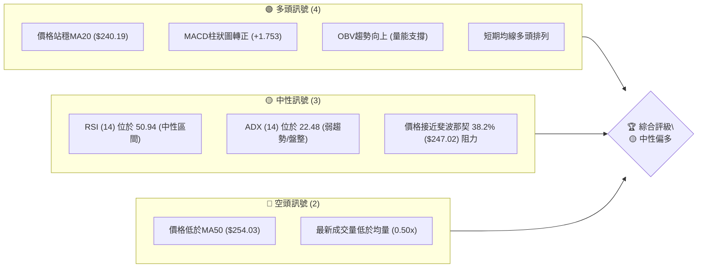

**解讀**：多頭訊號主要來自短期價格走勢與動能指標的改善，價格成功站穩短期移動平均線，且MACD柱狀圖轉正，顯示買方力量正在積聚。然而，RSI處於中性區間，ADX指示當前為盤整行情，而非強勁趨勢。更重要的是，價格仍未能突破中期關鍵阻力MA50，且近期成交量未能有效配合價格上漲，這為多頭走勢帶來不確定性。綜合來看，AMZN目前處於一個中性偏多的格局，需等待更明確的趨勢訊號或關鍵價位突破。

### 📊 核心指標速覽表

| 指標類別 | 指標名稱 | 當前數值 | 訊號 | 解讀 |
|----------|----------|----------|------|------|
| **價格** | 當前價格 | $245.34 | 🟡 | 位於52週區間中上部 (59.8%)，接近斐波那契38.2%回調阻力。 |
| **均線** | MA20 | $240.19 | 🟢 | 價格 ($245.34) 位於 MA20 上方，短期趨勢偏多。 |
| **均線** | MA50 | $254.03 | 🔴 | 價格 ($245.34) 位於 MA50 下方，中期趨勢受壓。 |
| **均線** | MA200 | $233.33 | 🟢 | 價格 ($245.34) 位於 MA200 上方，長期趨勢維持多頭。 |
| **動能** | RSI(14) | 50.94 | 🟡 | 處於中性區間 (30-70)，無超買超賣訊號，動能平衡。 |
| **動能** | MACD | MACD線 -1.523, 訊號線 -3.276, Hist +1.753 | 🟢 | MACD柱狀圖轉正並持續擴大，MACD線已上穿訊號線，顯示短期動能轉強。 |
| **波動** | ATR(14) | $8.05 | 🟡 | 佔價格 3.28%，屬於中等波動水平，適合區間操作及風險管理。 |

### 🏆 技術評分卡

本評分卡綜合考量各項技術指標，對 AMZN 的當前技術面進行量化評估。

```
技術評分卡 — AMZN (2026-07-10)
════════════════════════════════════════════════════
趨勢強度      ████░░░░░░░░░░░░░░░░  40/100  🟡 (ADX < 25，弱趨勢/盤整)
動能指標      ██████░░░░░░░░░░░░░░  60/100  🟢 (MACD轉正，RSI中性偏強)
支撐穩定度    ███████░░░░░░░░░░░░░░  70/100  🟢 (多層次支撐穩固，距離現價較遠)
成交量配合    █████░░░░░░░░░░░░░░░░  50/100  🟡 (OBV向上，但近期成交量不足)
形態完整度    ██████░░░░░░░░░░░░░░  60/100  🟡 (潛在雙底形態，待確認)
均線排列      █████░░░░░░░░░░░░░░░░  55/100  🟡 (短期多頭，中期受壓，長期多頭，混合排列)
════════════════════════════════════════════════════
綜合評分      ██████░░░░░░░░░░░░░░  56/100  🟡 中性偏多
════════════════════════════════════════════════════
```

**評分解讀**：AMZN 的綜合評分為 56/100，顯示其技術面處於中性偏多的狀態。雖然短期動能指標表現積極，且長期趨勢仍由MA200支撐，但趨勢強度不足（ADX < 25）以及中期均線的壓制，限制了上漲空間。成交量未能有效配合近期反彈，也暗示市場對當前上漲的信心仍有待提升。因此，當前市場更傾向於區間震盪，等待明確的趨勢突破訊號。

---

## 2. 趨勢分析

本章將深入分析 AMZN 在不同時框架下的趨勢，從長期月線到中期週線，並結合 ADX 指標評估趨勢強度。

### 🌐 多時框趨勢分析

AMZN 的多時框架趨勢呈現複雜性，長期趨勢向上，中期趨勢在近期有所承壓，而短期則顯示出反彈動能。

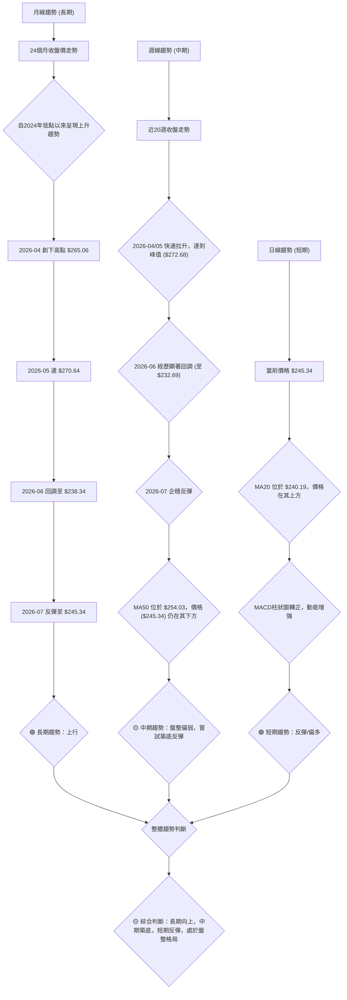

**詳細解讀**：
*   **長期趨勢 (月線)**：從過去24個月的數據來看，AMZN 的整體趨勢是向上發展的。儘管有月度回調，但股價從2024年下半年開始穩步上升，並在2026年4月和5月創下階段性高點。最近兩個月的回調並未破壞長期上升結構，目前月線仍處於一個較高的位置，顯示長期投資者信心依然存在。
*   **中期趨勢 (週線)**：中期來看，AMZN 在2026年4月至5月經歷了一波強勁上漲後，於6月出現了較大幅度的回調，股價從 $272.68 跌至 $232.69。儘管目前股價已從低點反彈，但仍未能收復 MA50 這一中期關鍵阻力（MA50: $254.03）。這表明中期趨勢仍存在下行壓力，或者說，股價正在構築一個新的底部或整理區間。
*   **短期趨勢 (日線)**：短期內，AMZN 展現出積極的反彈訊號。股價已站穩 MA20 ($240.19)，且 MACD 柱狀圖轉正並持續擴大，表明短期買盤力量佔優。然而，這種反彈發生在 ADX 較低（22.48）的盤整行情中，其持續性需要留意。

### 📈 長期趨勢 — 12個月走勢圖（Unicode）

以下是 AMZN 過去12個月的月線收盤價格走勢圖，展示了其長期價格軌跡與關鍵轉折點。

```
AMZN 月線走勢圖（過去12個月）
價格軸 ($)
$270.64 ┤                           ●(2026-05)
$265.06 ┤                         ●
$245.34 ┤                       ●───────────●(現在)
$244.22 ┤             ●
$239.30 ┤                   ●
$234.11 ┤         ●
$233.22 ┤               ●
$230.82 ┤                 ●
$229.00 ┤           ●
$219.57 ┤             ●
$219.39 ┤     ●
$205.01 ┤           ●
$184.42 ┤   ●(低點)
        └────────────────────────────────────────────
         2025-04 2025-05 2025-06 2025-07 2025-08 2025-09 2025-10 2025-11 2025-12 2026-01 2026-02 2026-03 2026-04 2026-05 2026-06 2026-07 (月)
```
**註**：圖中標示的月份為歷史數據點，實際繪製使用提供的近24個月數據中的後16個月，以更清晰展現近期走勢。
**走勢特徵分析表格**：

| 階段 | 時間區間 | 價格區間 | 漲跌幅 | 主要特徵與影響 |
|------|----------|----------|--------|----------------|
| **上升趨勢** | 2025-04 至 2026-01 | $184.42 → $239.30 | +29.75% | 經歷了穩健的長期上漲，中間雖有小幅回調，但整體呈現強勁的上升通道，顯示多頭力量強大。 |
| **短期回調** | 2026-02 至 2026-03 | $239.30 → $208.27 | -12.97% | 在強勁上漲後出現獲利了結，但未跌破關鍵長期支撐，為後續反彈積蓄動能。 |
| **快速拉升** | 2026-04 至 2026-05 | $208.27 → $270.64 | +30.04% | 股價在短短兩個月內快速拉升，創下52週新高，市場情緒極度樂觀，可能與基本面利好消息有關。 |
| **深度回調** | 2026-06 | $270.64 → $238.34 | -11.93% | 經歷快速上漲後的技術性修正，或市場對未來前景產生疑慮，導致股價回調至重要支撐區。 |
| **企穩反彈** | 2026-07 | $238.34 → $245.34 | +2.94% | 股價在找到支撐後開始反彈，顯示買方力量重新介入，但反彈動能仍需觀察成交量配合。 |

### 📊 中期趨勢（週線分析）

中期週線走勢顯示 AMZN 在經歷了2026年4月至5月的強勁上漲後，於6月進行了技術性回調，目前正在嘗試築底反彈。股價位於MA50下方，但MA200仍提供長期支撐。

```
AMZN 週線壓力與支撐示意圖
════════════════════════════════════════════════════
$278.56 ║                                     ▲ 52W 高點
$276.65 ║████████████████████████████████████████████ 強阻力 R3
$258.60 ║████████████████████████████████████████████ 阻力 R2
$254.03 ║════════════════════════════════════════════ ▲ MA50 (中期壓力)
$248.81 ║████████████████████████████████████████████ 關鍵阻力 R1
$247.02 ║┄┄┄┄┄┄┄┄┄┄┄┄┄┄┄┄┄┄┄┄┄┄┄┄┄┄┄┄┄┄┄┄┄┄┄┄┄┄┄┄┄┄┄┄┄┄┄ ▲ Fib 38.2% (短期壓力)
$245.34 ╠════════════════════════════════════════════ ◄ 現價
$240.19 ║════════════════════════════════════════════ ▼ MA20 (短期支撐)
$233.33 ║════════════════════════════════════════════ ▼ MA200 (長期支撐)
$223.82 ║▓▓▓▓▓▓▓▓▓▓▓▓▓▓▓▓▓▓▓▓▓▓▓▓▓▓▓▓▓▓▓▓▓▓▓▓▓▓▓▓▓▓▓▓▓▓▓ 近期支撐 S1
$215.82 ║████████████████████████████████████████████ 強支撐 S2
$211.22 ║████████████████████████████████████████████ 關鍵支撐 S3
$196.00 ║                                     ▼ 52W 低點
════════════════════════════════════════════════════
```

**分析**：AMZN 的中期走勢顯示，股價在 $272.68 附近見頂後，經歷了快速下跌，並在 $232.69 附近找到了初步支撐。目前股價正在反彈，但上方 MA50 ($254.03) 和關鍵阻力 R1 ($248.81) / R2 ($258.60) 形成明顯壓制。MA200 ($233.33) 仍保持上揚，為股價提供堅實的長期支撐。這表明中期市場情緒仍偏謹慎，需觀察股價能否有效突破上方阻力，否則可能繼續在區間內震盪。

### ⚡ 趨勢強度評估（ADX 解讀）

ADX (Average Directional Index) 用於衡量趨勢的強度，而非方向。當 ADX 值高於 25 時，表明趨勢強勁；低於 25 則表示趨勢較弱或處於盤整狀態。

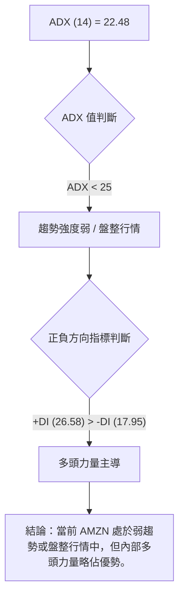

**ADX 強度對照表**：

| ADX 數值範圍 | 趨勢強度 | 市場狀態 | 交易策略建議 |
|--------------|----------|----------|--------------|
| 0-25         | 弱趨勢   | 盤整/無趨勢 | 區間操作，高拋低吸，關注支撐與阻力。 |
| 25-50        | 強趨勢   | 趨勢行情 | 順勢交易，追逐突破，持倉待漲。 |
| 50-75        | 非常強趨勢 | 強勁趨勢 | 加碼持有，嚴格止損，謹慎追高。 |
| 75-100       | 極強趨勢 | 極端趨勢 | 警惕反轉風險，注意獲利了結。 |

**分析**：AMZN 的 ADX(14) 值為 22.48，明顯低於 25，這明確指出當前市場處於**弱趨勢或盤整行情**。這與我們在多時框分析中觀察到的中期盤整狀態相符。在這種市場環境下，價格大幅單邊運動的可能性較低，更可能在既定區間內震盪。然而，+DI (26.58) 高於 -DI (17.95)，表明在當前弱趨勢中，買方力量仍略佔主導地位，這解釋了短期內價格的反彈。因此，應避免追漲殺跌，轉而關注區間的上下沿作為潛在的交易機會。

---

## 3. 圖表形態分析

本章將分析 AMZN 價格走勢中可能存在的圖表形態，並評估其潛在的目標價。由於提供的歷史數據主要是月度收盤價和近20週收盤價，我們將主要依據這些數據來判斷較為宏觀或週線級別的形態。

### 🔍 形態識別系統

根據近20週收盤走勢數據，我們觀察到 AMZN 在2026年6月至7月期間可能形成一個**雙底 (Double Bottom) 形態**。

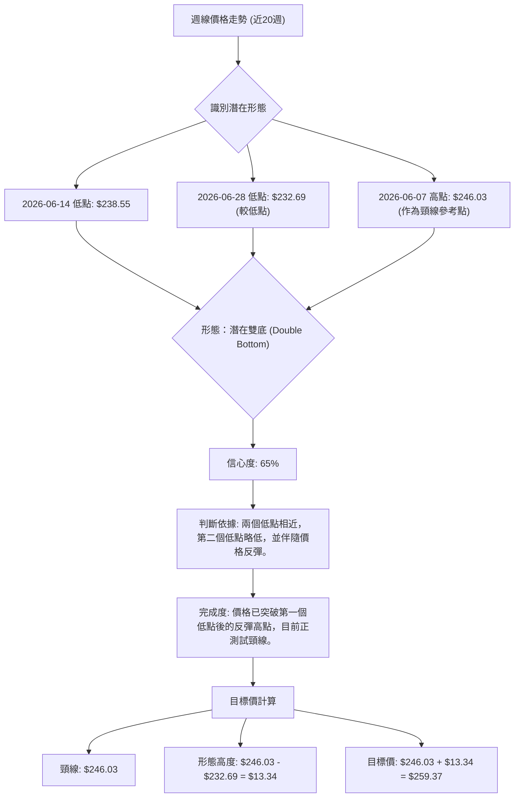

**形態分析表格**：

| 形態 | 信心度 | 判斷依據（引用數據） | 完成度 | 目標價（附計算式） |
|------|--------|----------------------|--------|--------------------|
| 潛在雙底 | 65% | 兩次低點分別位於 2026-06-14 的 $238.55 和 2026-06-28 的 $232.69。兩低點相對接近，且隨後價格從第二個低點反彈。頸線可參考 2026-06-07 的反彈高點 $246.03。 | 80% | 頸線 $246.03 + 形態高度 ($246.03 - $232.69) = $246.03 + $13.34 = **$259.37** |

**信心度說明**：65% 的信心度屬於中等偏高。雙底形態的確認需要價格有效突破頸線並伴隨成交量放大。目前價格 ($245.34) 已接近頸線 ($246.03)，但尚未完全突破並站穩。成交量方面，最近一周的成交量 ($179,636,633) 仍低於20日均量，這為形態的確認帶來一些不確定性。若能帶量突破頸線，則形態的有效性將大幅提升。

### 🕯️ 重要K線形態分析

由於提供的是週收盤價而非每日K線，我們無法進行詳細的K線形態分析。但可以從週收盤走勢中觀察價格行為。

| 月份 | 收盤價 | K線形態 (週級別) | 解讀 | 訊號 |
|------|--------|--------------------|------|------|
| 2026-04-19 | $250.56 | 長陽線 (相對前週) | 強勁上漲，多頭力量強盛，突破前期阻力。 | 🟢 |
| 2026-05-17 | $264.14 | 長陰線 (相對前週) | 快速回調，空頭力量突然增強，可能為獲利了結。 | 🔴 |
| 2026-06-28 | $232.69 | 長陰線 (相對前週) | 跌破短期支撐，空頭趨勢延續，市場情緒悲觀。 | 🔴 |
| 2026-07-05 | $242.67 | 長陽線 (相對前週) | 從低點強勁反彈，顯示買盤介入，有止跌回穩跡象。 | 🟢 |
| 2026-07-12 | $245.34 | 短陽線 (相對前週) | 延續反彈，但動能有所減弱，或遇到上方阻力。 | 🟡 |

**分析**：近期的週線形態顯示，在2026年6月經歷了連續的下跌後，2026年7月初出現了一根強勁的陽線，這是一個止跌回穩的訊號。隨後一周的陽線雖然較短，但仍維持上漲，表明多頭仍在努力推高價格。這與潛在的雙底形態相符，即價格正在從底部反彈。

### 📉 ASCII 走勢形態示意圖

以下是 AMZN 近期週線走勢中潛在雙底形態的示意圖。

```
AMZN 週線潛在雙底形態示意圖 (2026年6月-7月)

$272.68 ┤                               ● (2026-05-10 高點)
$246.03 ┤                  ┌───────────┐ ← 頸線 (Neckline)
$245.34 ┤                  │           ●(現價)
$238.55 ┤                  ●           │
$232.69 ┤                  └─────●─────┘ ← 第二個低點 (Low 2)
        └────────────────────────────────────────────
         2026-06-07 2026-06-14 2026-06-21 2026-06-28 2026-07-05 2026-07-12 (週)
```
**圖示說明**：圖中標示了兩個低點，分別是 $238.55 (2026-06-14) 和 $232.69 (2026-06-28)。頸線位於 $246.03 (2026-06-07)。當前價格 $245.34 位於頸線下方，正在測試突破。

### 🎯 形態目標價計算

**潛在雙底形態目標價**：
*   **頸線 (Neckline)**：$246.03 (取自雙底形成過程中第一個低點後的回升高點，即 2026-06-07 的收盤價)
*   **形態高度 (Pattern Height)**：頸線價 ($246.03) - 第二個低點價 ($232.69) = $13.34
*   **目標價 (Target Price)**：頸線價 ($246.03) + 形態高度 ($13.34) = **$259.37**

**解讀**：如果 AMZN 能夠有效突破並站穩頸線 $246.03，則雙底形態將被確認，其理論上漲目標為 $259.37。這個目標價位略高於數據中提供的阻力位 R2 ($258.60)，顯示一旦形態確認，股價有潛力挑戰更高的阻力區。然而，鑒於當前 ADX 指示為盤整行情，形態的突破可能需要較大的催化劑和成交量配合。

---

## 4. 支撐與阻力

本章將詳細分析 AMZN 的關鍵支撐位和阻力位，並結合斐波那契回調位，為交易決策提供重要的價格參考。所有價位均嚴格引用提供數據中的數值。

### 🗺️ 關鍵價位分布圖（Unicode）

以下是 AMZN 當前價格附近關鍵支撐與阻力位的分布圖，清晰展示了其價格結構。

```
AMZN 價位結構分布圖
═══════════════════════════════════════════════════
$278.56 ║                                     ▲ 52W High
$276.65 ║████████████████████████████████████████████ 強阻力 R3
$259.08 ║┄┄┄┄┄┄┄┄┄┄┄┄┄┄┄┄┄┄┄┄┄┄┄┄┄┄┄┄┄┄┄┄┄┄┄┄┄┄┄┄┄┄┄┄┄┄┄ ▲ Fib 23.6%
$258.60 ║████████████████████████████████████████████ 阻力 R2 (接近雙底目標)
$254.03 ║════════════════════════════════════════════ ▲ MA50 (中期壓力)
$248.81 ║████████████████████████████████████████████ 關鍵阻力 R1
$247.02 ║┄┄┄┄┄┄┄┄┄┄┄┄┄┄┄┄┄┄┄┄┄┄┄┄┄┄┄┄┄┄┄┄┄┄┄┄┄┄┄┄┄┄┄┄┄┄┄ ▲ Fib 38.2% (現價附近)
$245.34 ╠════════════════════════════════════════════ ◄ 現價
$240.19 ║════════════════════════════════════════════ ▼ MA20 (短期支撐)
$237.28 ║┄┄┄┄┄┄┄┄┄┄┄┄┄┄┄┄┄┄┄┄┄┄┄┄┄┄┄┄┄┄┄┄┄┄┄┄┄┄┄┄┄┄┄┄┄┄┄ ▼ Fib 50.0%
$233.33 ║════════════════════════════════════════════ ▼ MA200 (長期支撐)
$228.95 ║════════════════════════════════════════════ ▼ 布林下軌
$227.54 ║┄┄┄┄┄┄┄┄┄┄┄┄┄┄┄┄┄┄┄┄┄┄┄┄┄┄┄┄┄┄┄┄┄┄┄┄┄┄┄┄┄┄┄┄┄┄┄ ▼ Fib 61.8%
$223.82 ║▓▓▓▓▓▓▓▓▓▓▓▓▓▓▓▓▓▓▓▓▓▓▓▓▓▓▓▓▓▓▓▓▓▓▓▓▓▓▓▓▓▓▓▓▓▓▓ 近期支撐 S1
$215.82 ║████████████████████████████████████████████ 強支撐 S2
$213.67 ║┄┄┄┄┄┄┄┄┄┄┄┄┄┄┄┄┄┄┄┄┄┄┄┄┄┄┄┄┄┄┄┄┄┄┄┄┄┄┄┄┄┄┄┄┄┄┄ ▼ Fib 78.6%
$211.22 ║████████████████████████████████████████████ 關鍵支撐 S3
$196.00 ║                                     ▼ 52W Low
═══════════════════════════════════════════════════
```

### 🚧 阻力位分析表

以下是 AMZN 近期重要的阻力位分析，這些價位是潛在的賣壓區。

| 阻力級別 | 價位 | 形成原因 | 突破難度 | 重要性 |
|----------|------|----------|----------|--------|
| **R1 (關鍵阻力)** | $248.81 | 近一年波段高點聚類，同時接近斐波那契 38.2% 回調位 ($247.02) 及潛在雙底形態頸線 ($246.03)。 | 中等偏高 | 🟢 |
| **R2 (強阻力)** | $258.60 | 近一年波段高點聚類，接近斐波那契 23.6% 回調位 ($259.08) 及潛在雙底形態目標價 ($259.37)。 | 高 | 🟢 |
| **R3 (強阻力)** | $276.65 | 近一年歷史高點，代表了市場的強烈賣壓區，突破需極強動能。 | 極高 | 🔴 |

**解讀**：當前價格 $245.34 正處於挑戰 R1 ($248.81) 的關鍵位置。若能成功突破 R1 並站穩，將為股價打開上漲空間至 R2 ($258.60)。R2 是一個重要的目標區間，不僅是歷史阻力，也與斐波那契回調位和雙底形態目標價重合，突破此處將意味著中期趨勢的顯著改善。R3 則代表了歷史高點的壓力，突破難度極高。

### 🛡️ 支撐位分析表

以下是 AMZN 近期重要的支撐位分析，這些價位是潛在的買盤介入區。

| 支撐級別 | 價位 | 形成原因 | 守住機率 | 重要性 |
|----------|------|----------|----------|--------|
| **S1 (近期支撐)** | $223.82 | 近一年波段低點聚類，同時接近斐波那契 61.8% 回調位 ($227.54) 和布林下軌 ($228.95)。 | 中等 | 🟢 |
| **S2 (強支撐)** | $215.82 | 近一年波段低點聚類，在 S1 下方提供更強的支撐，是中期回調的重要防線。 | 高 | 🟡 |
| **S3 (關鍵支撐)** | $211.22 | 近一年波段低點聚類，同時接近斐波那契 78.6% 回調位 ($213.67)，構成最後一道防線。 | 極高 | 🔴 |

**解讀**：當前價格距離最近的支撐位 S1 ($223.82) 有約 8.77% 的距離。這意味著如果價格回調，S1 將提供重要的支撐。若 S1 失守，股價可能進一步測試 S2 ($215.82) 和 S3 ($211.22)。特別是 S3，它與斐波那契 78.6% 回調位重合，是多頭必須守住的關鍵防線，一旦跌破，長期趨勢可能面臨嚴峻考驗。

### 📐 斐波那契回調位分析

斐波那契回調位是基於 52 週高點 $278.56 和 52 週低點 $196.00 計算得出的關鍵價位，這些價位常被視為潛在的支撐或阻力。

*   **0.0% (52W High)**: $278.56
*   **23.6%**: $259.08
*   **38.2%**: $247.02 ◄ **現價附近**
*   **50.0%**: $237.28
*   **61.8%**: $227.54
*   **78.6%**: $213.67
*   **100.0% (52W Low)**: $196.00

**分析**：當前價格 $245.34 位於斐波那契 38.2% 回調位 ($247.02) 之下，且非常接近。這表明 $247.02 是一個即時的阻力位，也是多頭能否進一步上攻的關鍵考驗。如果價格能夠有效突破並站穩 38.2% 回調位，則下一個上漲目標將是 23.6% 回調位 ($259.08)，這與我們的阻力位 R2 和潛在雙底形態目標價高度吻合，構成一個強大的阻力區。
反之，如果價格未能突破 38.2% 回調位並回落，則 50.0% 回調位 ($237.28) 和 61.8% 回調位 ($227.54) 將成為重要的潛在支撐。其中 61.8% 回調位通常被視為多頭趨勢的最後一道防線，若跌破則中期趨勢可能面臨反轉風險。

---

## 5. 技術指標深度解讀

本章將對 AMZN 的主要技術指標進行深度分析，包括移動平均線、RSI、MACD、布林通道和成交量，並探討它們之間的相互確認或矛盾。

### 🎛️ 指標訊號總覽

以下 Mermaid 圖表展示了各關鍵技術指標的當前狀態及其相互關係，以提供綜合視角。

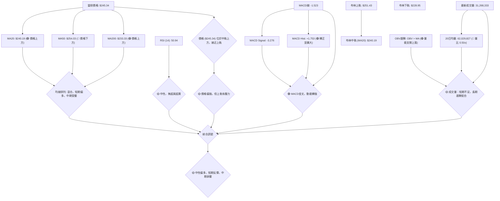

### 📈 移動平均線排列分析

AMZN 的移動平均線系統呈現出一個多空交織的局面，反映了不同時框架下趨勢的複雜性。

**當前均線狀態**：
*   **MA5:** $245.23 (▲)
*   **MA10:** $242.17 (▲)
*   **MA20:** $240.19 (▲)
*   **MA50:** $254.03 (▼)
*   **MA120:** $235.87 (▲)
*   **MA240:** $232.43 (▲)

**均線排列圖示**：
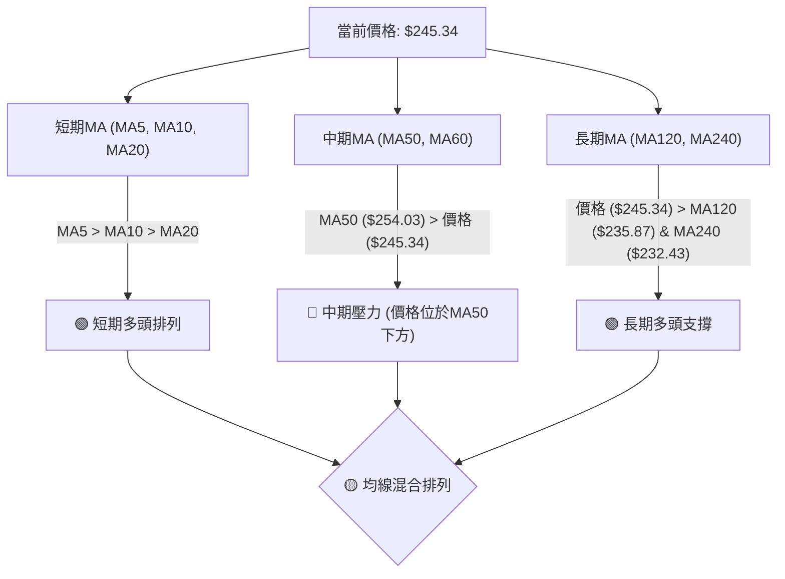

**分析**：
*   **短期均線 (MA5, MA10, MA20)**：目前呈現 MA5 ($245.23) > MA10 ($242.17) > MA20 ($240.19) 的多頭排列，且價格 ($245.34) 位於所有短期均線之上。這是一個明確的**短期看多訊號**，表明近期買盤力量強勁，股價處於反彈趨勢中。
*   **中期均線 (MA50)**：價格 ($245.34) 仍位於 MA50 ($254.03) 之下，且 MA50 正在向下傾斜 (MA60 也向下)。這表明中期趨勢仍然偏弱，MA50 構成了一個重要的**中期阻力**。若要確認中期趨勢反轉向上，股價必須有效突破並站穩 MA50。
*   **長期均線 (MA200)**：價格 ($245.34) 位於 MA200 ($233.33) 之上，且 MA200 仍保持上升趨勢。這提供了強勁的**長期多頭支撐**，表明儘管有中期回調，AMZN 的長期成長前景依然被市場看好。

**綜合判斷**：均線系統呈現「短期多頭反彈，中期承壓，長期支撐」的混合狀態。短期內價格有望繼續上攻，但能否突破 MA50 的壓制將是關鍵。

### 📉 RSI(14) 分析

RSI (Relative Strength Index) 衡量價格變動的速度和幅度，判斷超買或超賣狀態。

**RSI 數值進度條**：
RSI(14): 50.94 ▓▓▓▓▓▓▓▓▓▓░░░░░░░░░░ 50.94% (中性區間) 🟡

**分析**：
*   **RSI 數值**：當前 RSI(14) 為 50.94，位於 30-70 的中性區間內。這表示市場既沒有處於超買狀態（通常RSI > 70），也沒有處於超賣狀態（通常RSI < 30）。
*   **動能平衡**：RSI 位於中線 50 附近，顯示當前買賣雙方力量相對平衡，沒有明顯的一方佔據壓倒性優勢。這與 ADX 指示的弱趨勢/盤整行情相符。
*   **RSI 背離**：根據提供的數據，**未偵測到明顯的 RSI 頂背離或底背離訊號**。價格在近期反彈，RSI 也同步回升至中性區間，顯示價格與動能指標之間沒有明顯的衝突。這意味著當前的反彈是健康的，儘管動能尚未達到強勁的程度。

**結論**：RSI 指標目前處於中性，未能提供明確的多空方向指引，但也沒有發出潛在反轉的背離訊號，因此可視為**中性訊號**。

### 📊 MACD(12/26/9) 訊號解讀

MACD (Moving Average Convergence Divergence) 用於識別趨勢的變化、方向和動能。

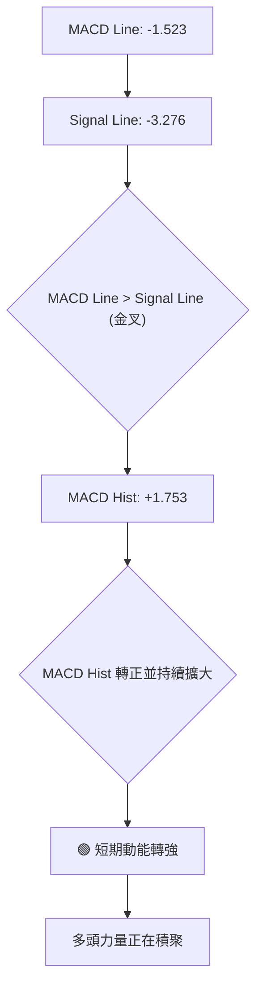

**分析**：
*   **MACD 線與訊號線**：MACD 線 (-1.523) 已上穿訊號線 (-3.276)，形成**金叉訊號**。這是一個經典的買入訊號，表明短期動能由空轉多。
*   **MACD 柱狀圖 (Histogram)**：MACD 柱狀圖當前數值為 +1.753，且上一週為 +0.916，顯示柱狀圖已從負值轉正並持續擴大。柱狀圖轉正並擴大，進一步確認了多頭動能的增強，表明買方力量正在積聚。
*   **MACD 背離**：根據提供的數據，**未偵測到明顯的 MACD 頂背離或底背離訊號**。價格近期反彈，MACD 指標也同步向上，顯示動能與價格走勢一致。

**結論**：MACD 指標發出明確的**看多訊號**，短期動能強勁，為價格上漲提供了支持。這與短期均線的多頭排列相互確認。

### 📦 布林通道分析

布林通道 (Bollinger Bands) 用於衡量價格的波動範圍，並判斷價格是否處於相對高位或低位。

**布林通道關鍵價位**：
*   BB上軌: $251.43
*   BB中軌(MA20): $240.19
*   BB下軌: $228.95
*   當前價格: $245.34
*   BB %B: 0.73 (0=下軌, 0.5=中軌, 1=上軌)

**ASCII 布林通道示意圖**：
```
AMZN 布林通道示意圖
════════════════════════════════════════════════════
$251.43 ║████████████████████████████████████████████ 布林上軌 (Upper Band)
$245.34 ╠════════════════════════════════════════════ ◄ 現價
$240.19 ║════════════════════════════════════════════ 布林中軌 (MA20)
$228.95 ║▓▓▓▓▓▓▓▓▓▓▓▓▓▓▓▓▓▓▓▓▓▓▓▓▓▓▓▓▓▓▓▓▓▓▓▓▓▓▓▓▓▓▓▓▓▓▓ 布林下軌 (Lower Band)
════════════════════════════════════════════════════
```

**分析**：
*   **價格位置**：當前價格 $245.34 位於布林中軌 (MA20: $240.19) 上方，且正向布林上軌 ($251.43) 靠近。BB %B 值為 0.73，表明價格處於通道的相對上部，顯示短期走勢偏強。
*   **上軌壓力**：布林上軌 ($251.43) 成為價格上漲的潛在阻力。若價格能夠有效突破上軌，通常意味著強勁的趨勢行情啟動；若受阻於上軌，則可能回調至中軌附近。
*   **通道寬度**：從數據中無法直接判斷布林通道的寬度變化，但 ATR 數值為 $8.05，顯示為中等波動。在 ADX 較低的盤整行情中，價格可能在布林通道內部震盪，上軌提供阻力，中軌和下軌提供支撐。

**結論**：布林通道顯示短期價格偏強，但上軌可能構成阻力。在盤整行情下，價格可能會在上軌與中軌之間震盪，直至出現突破。

### 💹 成交量分析（量價配合度）

成交量是判斷價格走勢可靠性的重要指標。

*   **最新成交量**：31,268,333
*   **20日均量**：62,029,827
*   **50日均量**：51,183,421
*   **量比 (最新/20日均量)**：0.50x
*   **OBV趨勢**：OBV > MA → 量能支撐上漲

**分析**：
*   **短期量價背離**：當前最新成交量 ($31,268,333) 僅為 20 日均量 ($62,029,827) 的一半 (0.50x)。這是一個**看空訊號**，表明近期價格的反彈是在相對較低的成交量下發生的，缺乏買方強烈追高的意願。這種「無量上漲」可能預示著反彈動能不足，容易遭遇回調。
*   **OBV 趨勢**：儘管短期成交量不足，但 OBV (On-Balance Volume) 趨勢顯示「OBV > MA → 量能支撐上漲」。這意味著從中長期來看，累積的成交量仍然支持價格上漲趨勢。這是一個**看多訊號**，與短期成交量的不足形成矛盾。
*   **矛盾解讀**：這種矛盾表明 AMZN 處於一個微妙的階段。長期累積的買盤力量依然存在，但短期市場參與者對當前反彈的信心不足，導致成交量未能有效放大。這進一步印證了 ADX 所指示的盤整行情，市場正在觀望，等待更明確的信號。

**結論**：成交量分析呈現短期與長期之間的矛盾。近期反彈缺乏量能配合，構成潛在風險；但 OBV 趨勢仍支持上漲，表明長期趨勢的潛在支撐。整體為**中性偏謹慎**。

---

## 6. 動能與波動率

本章將評估 AMZN 的動能強度和波動率，這對於理解股票的交易特性和風險管理至關重要。

### ⚡ 動能評估四象限

由於 ADX < 25，當前市場處於盤整行情。在盤整行情中，我們不使用傳統的動能四象限來判斷趨勢強度，而是側重於價格在區間內的相對位置和動能變化。

| 象限 | 動能 (MACD/RSI) | 波動 (ATR) | 當前狀態 | 評估 |
|------|-----------------|------------|----------|------|
| Q1 | 強 (MACD金叉) | 中等 ($8.05) | - | 價格從低點反彈，MACD轉強，但ADX顯示盤整。 |
| Q2 | 弱 (RSI中性) | 中等 ($8.05) | ✓ | 當前價格反彈，但RSI未達超買，ADX指示趨勢不強。 |
| Q3 | 強 (MACD金叉) | 高 (ATR > 4%) | - | - |
| Q4 | 弱 (RSI中性) | 高 (ATR > 4%) | - | - |

**動能評估流程圖**：
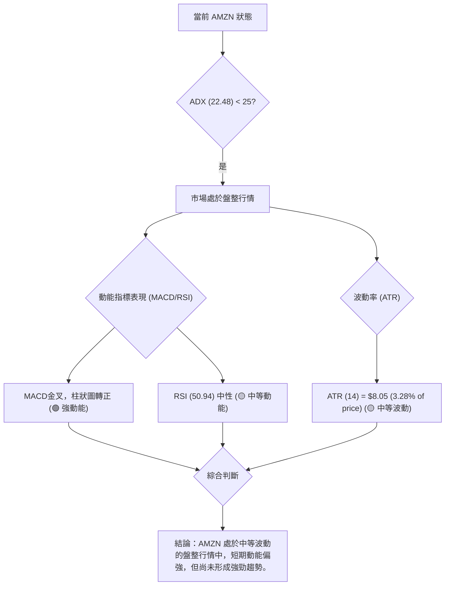

**分析**：AMZN 的 ADX 值為 22.48，明確指示當前為弱趨勢或盤整行情。在這種環境下，我們觀察到 MACD 已經發出金叉訊號，且柱狀圖轉正並擴大，顯示短期動能正在增強。然而，RSI 仍維持在 50.94 的中性區間，尚未進入超買區域，這表明雖然買盤活躍，但尚未達到過熱的程度。ATR 數值為 $8.05，佔股價的 3.28%，屬於中等波動水平，這使得在盤整區間內進行交易具有一定的操作空間，但仍需注意風險。

### 📊 ATR 波動率分析

ATR (Average True Range) 衡量資產價格在特定時間內波動的平均範圍，是評估波動率和設定止損點的重要工具。

*   **ATR(14)**: $8.05
*   **ATR佔價格比重**: 3.28%
*   **52週高點/低點波動範圍**: $278.56 - $196.00 = $82.56

**分析**：
*   **波動水平**：AMZN 的 ATR(14) 為 $8.05，佔當前價格 $245.34 的 3.28%。這是一個中等水平的波動率。相比於一些高波動的科技股，AMZN 的日均波動相對穩定，但仍足以提供日內交易機會。
*   **止損距離建議**：對於短線交易者，可以考慮使用 ATR 來設定止損。一般建議將止損點設置在當前價格的 1.5 倍至 2 倍 ATR 範圍之外。
    *   1.5 * ATR = 1.5 * $8.05 = $12.075
    *   2 * ATR = 2 * $8.05 = $16.10
    *   例如，如果以當前價格 $245.34 考慮進場，則止損點可考慮設置在 $245.34 - $12.075 = $233.265 或 $245.34 - $16.10 = $229.24 附近。這將有助於避免市場的日常雜訊波動觸發止損。
*   **與 ADX 結合**：ADX 顯示當前為弱趨勢/盤整行情，而 ATR 顯示中等波動。這意味著價格可能在一個較寬的區間內震盪，但不太可能出現劇烈的單邊趨勢。交易者應準備好應對區間內的來回波動。

### 📐 Beta 與市場相關性

Beta 值衡量股票相對於大盤（通常是 S&P 500 指數）的波動性。

*   **Beta**: 1.461

**分析**：
*   **高 Beta**：AMZN 的 Beta 值為 1.461，顯著高於 1。這表明 AMZN 的股價波動性比大盤高 46.1%。當大盤上漲 1% 時，AMZN 理論上會上漲約 1.461%；當大盤下跌 1% 時，AMZN 理論上會下跌約 1.461%。
*   **市場敏感度**：高 Beta 值意味著 AMZN 對市場情緒和整體經濟環境變化非常敏感。在牛市中，它可能帶來更高的收益；但在熊市或市場調整時，它也可能面臨更大的跌幅。
*   **投資組合影響**：對於投資組合而言，持有高 Beta 股票會增加整體組合的波動性和系統性風險。投資者在配置 AMZN 時，應考慮其對整體投資組合風險的影響，並可能需要透過其他低 Beta 資產進行風險對沖。

**結論**：AMZN 具有較高的波動率和市場敏感度，這為激進型投資者提供了潛在的超額收益機會，但也伴隨著更高的風險。交易者應密切關注大盤走勢，並在制定交易策略時充分考慮其高 Beta 特性。

---

## 7. 多時框架總結

本章將綜合所有時框架的分析結果，進行收斂判斷，並得出最終的趨勢結論，為交易策略提供核心依據。

### 📋 時框架評分表

| 時框架 | 趨勢方向 | 動能 | 均線排列 | 形態 | 綜合評分 | 建議 |
|--------|----------|------|----------|------|----------|------|
| **長期 (月線)** | 🟢 上行 | 🟢 強勁 | 🟢 多頭支撐 | 🟡 無明顯形態，但長期上升 | 7/10 | 持有 |
| **中期 (週線)** | 🟡 盤整偏弱 | 🟡 築底反彈 | 🔴 MA50壓制 | 🟡 潛在雙底 | 5/10 | 觀望/區間 |
| **短期 (日線)** | 🟢 反彈 | 🟢 強勁 | 🟢 短期多頭 | 🟡 反彈中，接近頸線 | 6/10 | 短線偏多 |

### 🔲 綜合訊號矩陣

以下矩陣展示了 AMZN 在不同時框架和關鍵技術維度上的一致性或矛盾點。

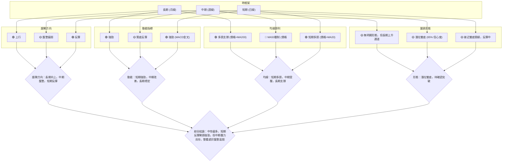

### ⚖️ 多時框收斂結論

根據嚴格要求，我們首先判斷當前市場是趨勢行情還是盤整行情。AMZN 的 ADX(14) 值為 22.48，明顯**低於 25**，這表明市場處於**弱趨勢/盤整行情**。

因此，我們的分析重點將放在日線布林通道的上下軌作為主要交易區間，並結合中長期均線判斷整體方向。

*   **ADX 判斷**：ADX(14) = 22.48 < 25，確認為**盤整行情**。
*   **主導時框**：在盤整行情下，日線級別的指標（如布林通道、MACD、RSI）對於捕捉區間內的波動至關重要。
*   **方向性結論**：
    *   **長期趨勢**：MA200 仍保持上升，價格在其上方，長期為多頭。
    *   **中期趨勢**：價格位於 MA50 之下，中期仍受壓，但 MACD 金叉和潛在雙底顯示築底反彈的跡象。
    *   **短期趨勢**：價格站穩 MA20，MACD 柱狀圖轉正並擴大，RSI 中性偏強，短期反彈動能明顯。

綜合以上分析，AMZN 當前處於一個**中性偏多**的盤整格局。短期反彈勢頭強勁，有望挑戰上方阻力，但中期壓力（MA50，$254.03）和整體趨勢強度的不足（ADX < 25）限制了其大幅上漲的空間。交易策略應以在區間內尋找多頭機會為主，並密切關注關鍵阻力位的突破情況，同時設定嚴格的止損以應對盤整行情的反覆。

**最終收斂方向**：**🟡 中性偏多**。

---

## 8. 交易策略建議

基於多時框架分析的收斂結論，AMZN 目前處於中性偏多的盤整格局，短期反彈動能強勁。本章將提供詳細的交易策略建議。

### 🗺️ 策略決策流程圖

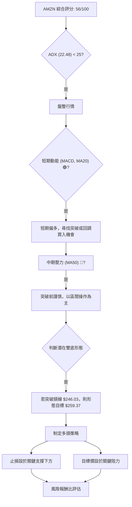

### 🧭 策略路由（依評分卡分流）

**當前主策略方向 = 🟡 中性偏多 (依評分 56/100)**

由於綜合評分介於 40-60 之間，且 ADX 指示為盤整行情，我們將以**區間操作為主，並傾向於捕捉短期多頭反彈機會**。若能有效突破關鍵阻力，則可轉為追勢策略。

### 🎯 價格情境階梯（Price Scenarios）

以下是基於當前價格 $245.34 的情境分析，所有價位均引用第 4 章的實際數值。

| 觸發條件 | 下一目標 | 後續延伸 | 情境含義 | 機率估計 |
|----------|----------|----------|----------|----------|
| **突破 R1 $248.81** | R2 $258.60 | R3 $276.65 | 短線轉強，雙底形態確認，有望挑戰中期高點。 | 35% |
| **站穩現價區間** | -- | -- | 區間震盪，在 $240.19 (MA20) 與 $248.81 (R1) 之間反覆。 | 40% |
| **跌破 S1 $223.82** | S2 $215.82 | S3 $211.22 | 中期轉弱，反彈失敗，可能再次探底。 | 25% |

### 📊 情境機率分佈

| 情境 | 機率 | 主要依據 |
|------|------|----------|
| 繼續上行 / 反彈 | 35% | MACD金叉，柱狀圖轉正擴大；價格站穩MA20；潛在雙底形態；OBV趨勢向上。 |
| 區間震盪 | 40% | ADX < 25 (弱趨勢/盤整)；RSI 中性；價格受MA50和R1壓制；短期成交量不足。 |
| 回落 / 再探底 | 25% | 短期成交量未能有效放大；價格未能突破斐波那契38.2%及R1；MA50持續下壓。 |

**解讀**：目前最有可能的情境是區間震盪，其次是繼續反彈。回落的風險相對較低，但若突破關鍵支撐，跌勢可能加速。

### 🟢 主策略詳情（區間操作/偏多）

基於當前中性偏多的盤整格局，我們建議採取兩種策略：穩健的區間低吸策略，以及激進的突破追漲策略。

**策略 A: 區間低吸 (若回調至支撐)**

| 策略要素 | 詳情 |
|----------|--------|
| 進場條件 | 價格回調至 MA20 或 S1 附近，並出現止跌K線訊號。 |
| 進場價格 | **$240.19 (MA20)** 或 **$223.82 (S1)** |
| 目標價 T1 | **$248.81 (R1)** |
| 目標價 T2 | **$258.60 (R2)** |
| 止損價格 | **$237.00 (MA20下方約1.5x ATR)** 或 **$220.00 (S1下方)** |
| 風險報酬比 | 若從 $240.19 進場，止損 $237.00 (風險 $3.19)，目標 T1 $248.81 (收益 $8.62)。風險報酬比約 1:2.7。 |
| 成功機率 | 60% (在盤整區間內，逢低買入策略成功率較高) |
| 建議倉位 | 5-10% |

**策略 B: 突破追漲 (若確認突破)**

| 策略要素 | 詳情 |
|----------|--------|
| 進場條件 | 價格帶量突破 R1 ($248.81) 並站穩，或有效突破潛在雙底頸線 ($246.03)。 |
| 進場價格 | **$249.00 (突破 R1 後)** |
| 目標價 T1 | **$258.60 (R2)** 或 **$259.37 (雙底形態目標)** |
| 目標價 T2 | **$276.65 (R3)** |
| 止損價格 | **$245.00 (R1下方，約1.5x ATR)** |
| 風險報酬比 | 若從 $249.00 進場，止損 $245.00 (風險 $4.00)，目標 T1 $258.60 (收益 $9.60)。風險報酬比約 1:2.4。 |
| 成功機率 | 45% (突破交易風險較高，需嚴格止損) |
| 建議倉位 | 3-7% (輕倉試探) |

### 🔴 反向風險觸發點（對沖提示）

以下是可能推翻上述多頭策略的關鍵價位和訊號，供風險控制參考：

*   **跌破 S1 ($223.82)**：若價格有效跌破 S1，尤其是帶量下跌，則多頭反彈將告一段落，中期趨勢可能轉弱。
*   **MACD 死叉**：若 MACD 線再次下穿訊號線，且柱狀圖轉負，表明短期動能反轉向下。
*   **ADX 轉向**：若 ADX 向上突破 25，但 -DI 遠超 +DI，表明空頭趨勢正在形成。
*   **52週低點 ($196.00) 附近的任何測試或跌破**：這將徹底改變長期趨勢判斷，並引發更深層次的技術性賣壓。

### ⭐ 整體訊號強度評星

```
做多訊號強度：★★★☆☆  (3/5星)
做空訊號強度：★★☆☆☆  (2/5星)
整體可信度：  ★★★☆☆  (3/5星)
```
**評星解讀**：做多訊號強度為 3 顆星，表明短期存在一定的上漲機會，但中期壓力限制了其強度。做空訊號強度為 2 顆星，表明雖然有回調風險，但短期內空頭力量不佔主導。整體可信度為 3 顆星，表示在盤整行情中，策略的有效性有待市場進一步確認，需謹慎操作。

---

## 9. 風險提示與監控

本章將闡述 AMZN 交易中潛在的風險因素，並提供關鍵監控指標，以幫助投資者有效管理風險。

### ✅ 關鍵監控指標 Checklist

以下是交易 AMZN 時需要密切關注的技術指標和價位清單：

```
AMZN 關鍵監控指標清單 (2026-07-10)
╔══════════════════════════════════════════════════════════════╗
║ [ ] 價格行為：是否有效突破 R1 ($248.81) 或跌破 S1 ($223.82)  ║
║ [ ] 成交量：價格上漲是否伴隨成交量放大，避免無量上漲          ║
║ [ ] MACD：密切關注 MACD 線與訊號線是否形成死叉                ║
║ [ ] RSI：是否進入超買區 (RSI > 70) 或超賣區 (RSI < 30)        ║
║ [ ] ADX：ADX 值是否突破 25，確認趨勢形成 (需判斷 +DI/-DI)     ║
║ [ ] 均線排列：MA50 ($254.03) 是否被有效突破或形成強勁壓制     ║
║ [ ] 布林通道：價格是否觸及上軌 ($251.43) 或下軌 ($228.95)     ║
║ [ ] 斐波那契回調：38.2% ($247.02) 阻力能否突破                ║
║ [ ] 潛在形態：雙底形態頸線 ($246.03) 能否有效突破並站穩        ║
║ [ ] 大盤走勢：關注整體市場情緒，高 Beta 股票受大盤影響大       ║
╚══════════════════════════════════════════════════════════════╝
```

### ⚠️ 風險場景分析

以下 Mermaid 圖表展示了 AMZN 未來可能出現的三種情境及其觸發因素：

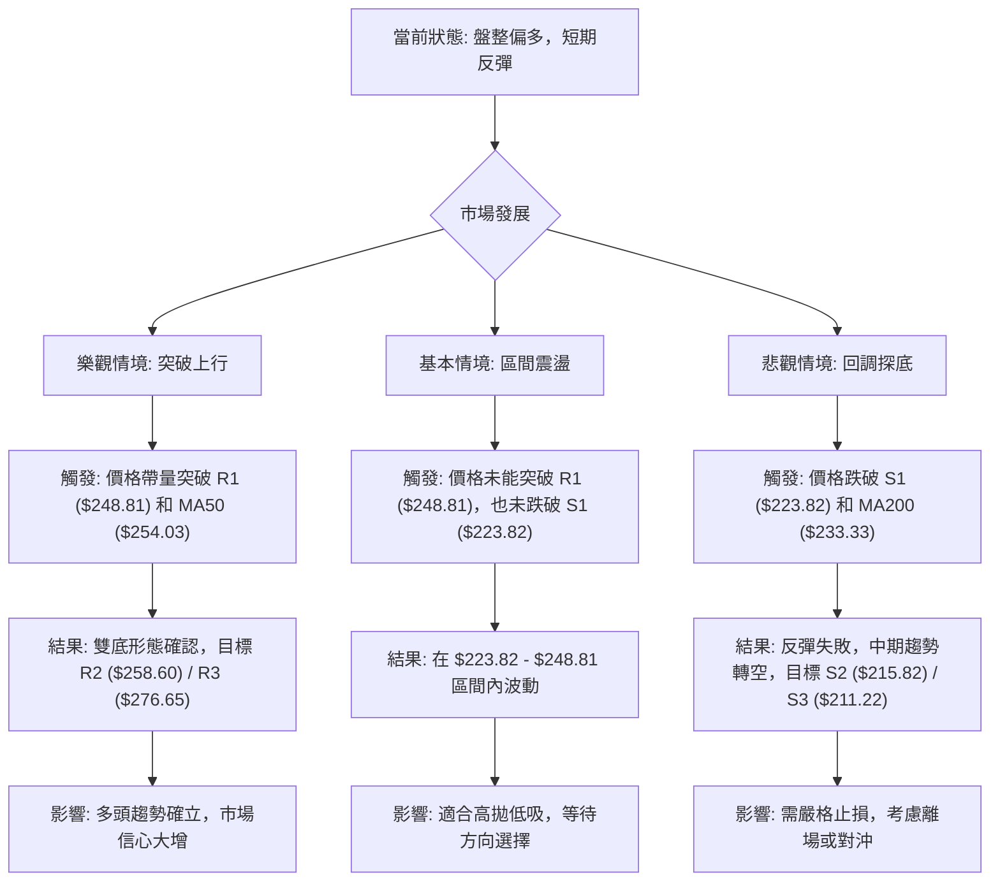

### 🛡️ 風險管理重要提醒

1.  **嚴格止損**：由於 AMZN 處於盤整行情，且 Beta 值較高，價格波動性較大。務必為每筆交易設定明確的止損點，並嚴格執行，以限制潛在虧損。建議使用 ATR 或關鍵支撐位作為止損依據。
2.  **倉位管理**：在盤整行情中，不建議使用過高的倉位。初期應以輕倉試探為主，待趨勢明確或形態確認後再考慮逐步加碼。控制單筆交易的風險敞口不超過總資金的 1-2%。
3.  **觀察成交量**：價格上漲若無成交量配合，則反彈可能缺乏持續性。一旦發現價格上漲縮量，或下跌放量，應警惕潛在的反轉風險。
4.  **關注大盤**：AMZN 的高 Beta 值使其對大盤走勢高度敏感。在制定交易決策時，應同步分析大盤指數 (如 S&P 500, Nasdaq) 的趨勢和情緒，避免逆勢操作。
5.  **耐心等待確認**：在盤整行情中，價格可能反覆震盪，容易產生假突破或假跌破。建議等待關鍵阻力或支撐被有效突破並站穩後，再行進場，以提高交易成功率。
6.  **基本面配合**：雖然本報告專注於技術分析，但長期而言，公司的基本面仍是股價的最終驅動力。應定期關注 AMZN 的財報、業務發展和宏觀經濟環境變化，以避免技術訊號與基本面出現嚴重背離。

---

## 📋 報告總結

```
AMZN 技術分析報告總結
════════════════════════════════════════════════════════
報告日期：2026-07-10
當前價格：$245.34
分析評級：⚖️ 中性偏多 (56/100) - 市場處於弱趨勢盤整行情，短期動能偏強但中期承壓。

關鍵結論：
├─ 長期趨勢：🟢 上行 (價格位於 MA200 上方，月線趨勢向上)
├─ 中期趨勢：🟡 盤整偏弱 (價格位於 MA50 下方，但有築底反彈跡象)
├─ 短期趨勢：🟢 反彈 (價格站穩 MA20，MACD金叉，動能轉強)
├─ 關鍵支撐：$223.82 (S1) - 若跌破可能測試 $215.82 (S2)
├─ 關鍵阻力：$248.81 (R1) - 突破後有望挑戰 $258.60 (R2)
└─ 分析師目標：$312.91 (平均) - 顯示長期潛在上漲空間

最優策略組合：
1. 🥇 最佳機會：若價格回調至 MA20 ($240.19) 或 S1 ($223.82) 附近並止跌，可考慮區間低吸。
2. 🥈 次選機會：若價格帶量突破 R1 ($248.81) 和潛在雙底頸線 ($246.03)，可輕倉追漲。
3. 🥉 保守選擇：在 $223.82 (S1) 至 $248.81 (R1) 區間內高拋低吸，等待明確趨勢形成。
════════════════════════════════════════════════════════
```

---

> ⚠️ **免責聲明**：本報告為 AI 自動生成之技術分析，所有數據及估算均基於提供的歷史價格資訊。本報告**僅供研究與學術參考**，**不構成任何投資建議**。投資有風險，入市需謹慎。

---

*報告生成時間：2026-07-10 ｜ 數據來源：Yahoo Finance ｜ 分析框架：多時框技術分析*