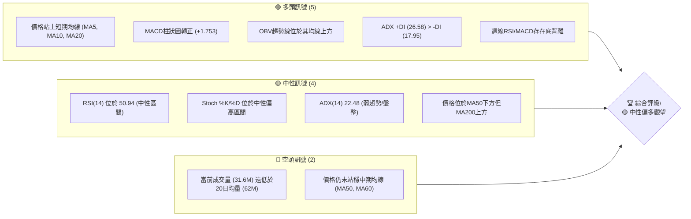
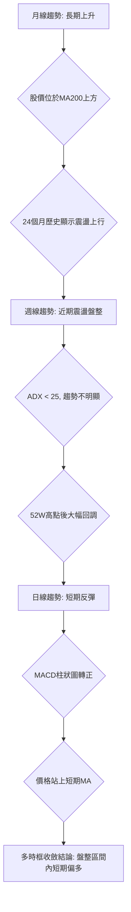
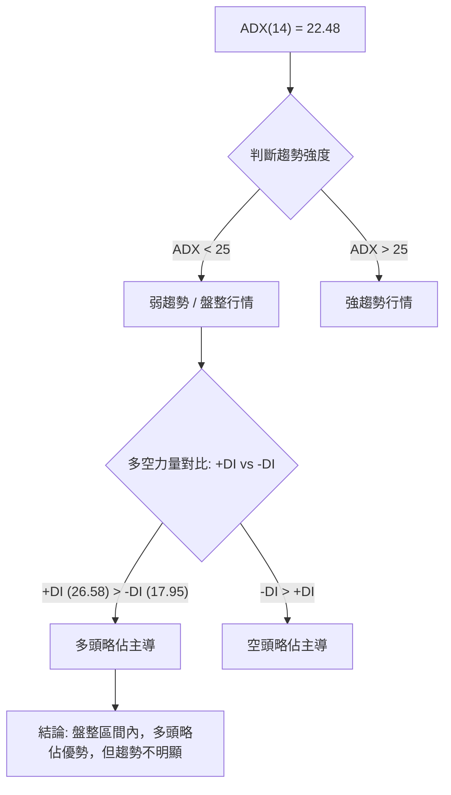
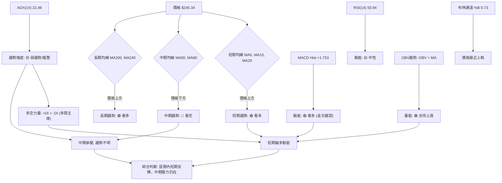
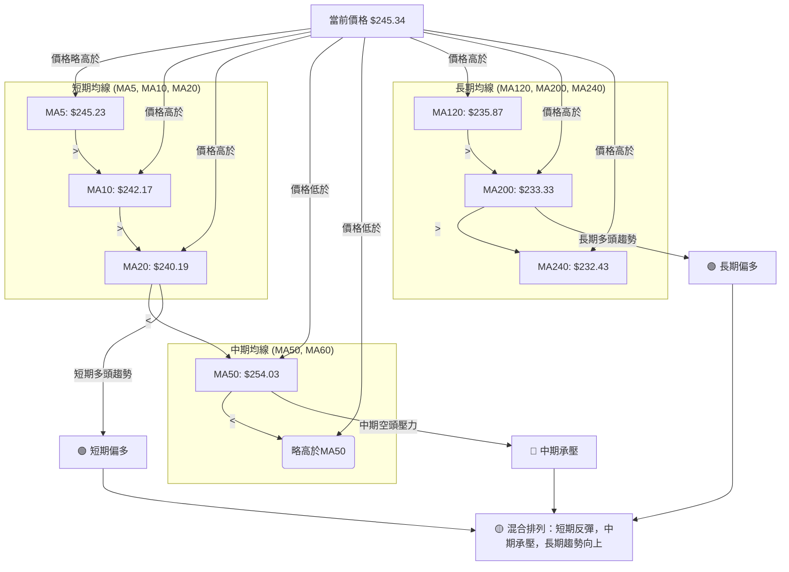
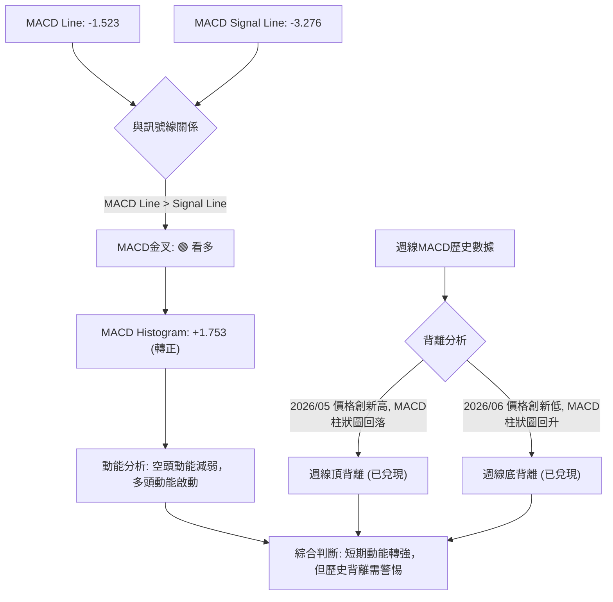
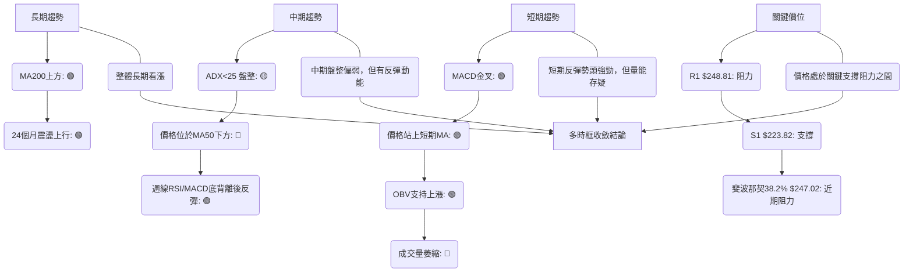
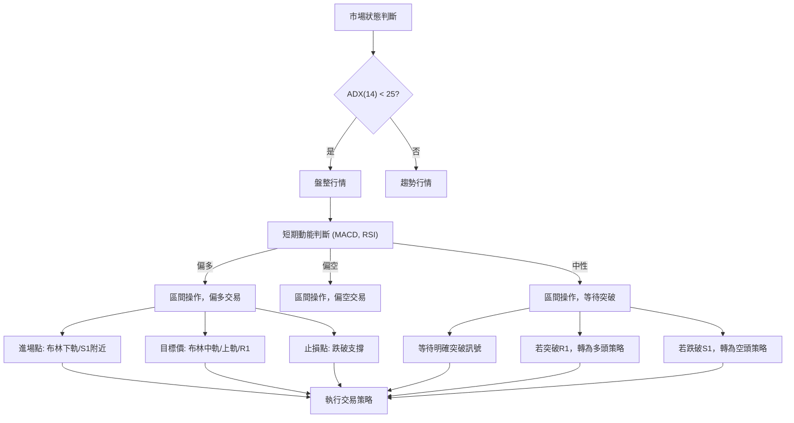
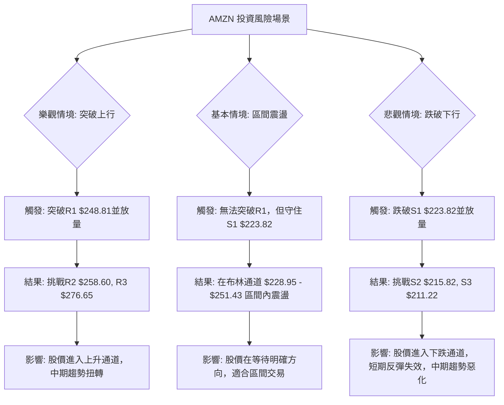

<details>
<summary>📊 靜態圖表 (點擊展開)</summary>

</details>

<html>
<head><meta charset="utf-8" /></head>
<body>
    <div style="height:500px; width:100%;">                        <script>window.PlotlyConfig = {MathJaxConfig: 'local'};</script>
        <script charset="utf-8" src="https://cdn.plot.ly/plotly-3.7.0.min.js" integrity="sha256-jvTGqxNp8AGWEcvNLVuKr+8j5dGe9Yw51LQkmDH+IYA=" crossorigin="anonymous"></script>                <div id="candlestick-chart" class="plotly-graph-div" style="height:100%; width:100%;"></div>            <script>                window.PLOTLYENV=window.PLOTLYENV || {};                                if (document.getElementById("candlestick-chart")) {                    Plotly.newPlot(                        "candlestick-chart",                        [{"close":{"dtype":"f8","bdata":"AAAAYLiWa0AAAABguIZrQAAAAMDMRGtAAAAAwPV4a0AAAACgcMVrQAAAAIA9cmtAAAAAACmUa0AAAADAHs1rQAAAAOBRcGtAAAAAwMyca0AAAADA9bhrQAAAAEAKJ2xAAAAAIK53bEAAAAAA1wtrQAAAAIA9gmtAAAAA4HoMa0AAAACAPfJqQAAAAEAKz2pAAAAAoEehakAAAAAgXA9rQAAAAMD1wGtAAAAAYGY+a0AAAABA4aJrQAAAAGC4BmxAAAAAQApfbEAAAAAAAKhsQAAAAKCZyWxAAAAAIIXba0AAAABACoduQAAAAAAAwG9AAAAAgD0qb0AAAABgZkZvQAAAAKBHYW5AAAAAwB6NbkAAAADAzAxvQAAAAEAzI29AAAAAYGaGbkAAAABgj7JtQAAAAIAUVm1AAAAAANcbbUAAAACgmdFrQAAAAIAU1mtAAAAA4Hoka0AAAACAFJZrQAAAAMD1SGxAAAAAoHC1bEAAAADAHqVsQAAAAEAKJ21AAAAAACk8bUAAAACgcE1tQAAAAAApDG1AAAAAIIWjbEAAAADA9bBsQAAAAOB6XGxAAAAAoHB9bEAAAADA9fhsQAAAAMD1yGxAAAAAgBRGbEAAAACgR9FrQAAAAIDr0WtAAAAA4KOoa0AAAADgUVhsQAAAAEAza2xAAAAAgMKNbEAAAADgegRtQAAAAAApDG1AAAAA4KMQbUAAAACAPQJtQAAAAMD1EG1AAAAAgD3abEAAAAAAAFBsQAAAAIDrIW1AAAAAgMIdbkAAAACA6zFuQAAAAKBHyW5AAAAAACnsbkAAAABACs9uQAAAAEAzU25AAAAAwMyUbUAAAACAwsVtQAAAAADX421AAAAAAADgbEAAAACA6+lsQAAAAEDhSm1AAAAAwB7lbUAAAACgcM1tQAAAAIDClW5AAAAA4FFgbkAAAAAgXDduQAAAAKCZ6W1AAAAAYLhebkAAAAAA19NtQAAAACCuH21AAAAAgBTWa0AAAACAPUpqQAAAAEAKF2pAAAAAYLjeaUAAAABgj4JpQAAAAEAz82hAAAAAoEfZaEAAAADAzCRpQAAAAKBHmWlAAAAAIIWbaUAAAAAghUNqQAAAAOCjqGlAAAAAgOsRakAAAADgelRqQAAAAKBw\u002fWlAAAAAAABAakAAAADgegxqQAAAACBcF2pAAAAAgD0aa0AAAACAFF5rQAAAAGC4pmpAAAAAIK6vakAAAABgj8pqQAAAAMDMlGpAAAAAwPUwakAAAACgcPVpQAAAACCud2pAAAAAYGbmakAAAAAA1ztqQAAAAOBRGGpAAAAAANeraUAAAADgekRqQAAAACCu52lAAAAAYLh2akAAAACgR\u002fFpQAAAAEDh6mhAAAAAYGYeaUAAAADgowhqQAAAAIA9UmpAAAAA4KM4akAAAACgR5lqQAAAAOCjuGpAAAAAAACoa0AAAADAzDRtQAAAAAApzG1AAAAA4Hr8bUAAAADgoyBvQAAAAAAAEG9AAAAAYGY2b0AAAACA61FvQAAAAMD1CG9AAAAAwB49b0AAAAAghetvQAAAAGCP4m9AAAAAANd\u002fcEAAAACA61FwQAAAAEAzO3BAAAAA4KNwcEAAAADA9ZBwQAAAAAApxHBAAAAAwMwAcUAAAADAzBhxQAAAAADXL3FAAAAAYLjycEAAAABA4QpxQAAAAADXz3BAAAAAwB6dcEAAAACAFOJwQAAAACCFs3BAAAAAgD2CcEAAAACAwo1wQAAAAKBwNXBAAAAAACmQcEAAAAAgXMdwQAAAAMAepXBAAAAA4KOUcEAAAACgmf1wQAAAAAAAIHFAAAAAgD3qcEAAAAAAKVRwQAAAAOBRCHBAAAAA4KNAb0AAAACgR7lvQAAAAMD1wG5AAAAAQAqnbkAAAACAFIZuQAAAAAAAwG1AAAAA4FEwbkAAAACgmdFtQAAAAOCjwG5AAAAAAADAbkAAAAAAALBtQAAAAOB6jG5AAAAAoEcZbUAAAAAghUNtQAAAAOCjSG1AAAAA4FFgbEAAAACAFBZtQAAAAOB6BG5AAAAAQOHKbUAAAABgZjZuQAAAAKBwVW5AAAAAwB6FbkAAAAAgXL9uQAAAAADXc25AAAAAoEfhbkAAAABA4apuQA=="},"high":{"dtype":"f8","bdata":"AAAAIIV7bEAAAACA6xFsQAAAAKBwlWtAAAAAoJmha0AAAABAM9NrQAAAACCux2tAAAAAwMzEa0AAAACA69lrQAAAAGBmBmxAAAAAIFy3a0AAAADgetxrQAAAACBcV2xAAAAAYLiGbEAAAAAAAIhsQAAAAIDClWtAAAAAgD1qa0AAAABguDZrQAAAAEDhUmtAAAAAoJnZakAAAACAFBZrQAAAAIA96mtAAAAA4FGAa0AAAACgmalrQAAAAMDMLGxAAAAAwMyMbEAAAAAgru9sQAAAAIA9Gm1AAAAAgBSObEAAAAAAAFBvQAAAAKCZKXBAAAAAACkQcEAAAAAAAGBvQAAAAAApTG9AAAAAwMycbkAAAAAAAHhvQAAAAAAAOG9AAAAAANdLb0AAAAAAAHhuQAAAACBc121AAAAAQDNTbUAAAABgZsZsQAAAACCu92tAAAAAwB5tbEAAAABguMZrQAAAAGCPamxAAAAA4KPQbEAAAAAAAPhsQAAAAKBHKW1AAAAAoJl5bUAAAABACt9tQAAAAAApLG1AAAAAAAAwbUAAAAAgrudsQAAAAGCP2mxAAAAAgD2SbEAAAACgcA1tQAAAACCFA21AAAAAYI\u002fCbEAAAACAwn1sQAAAAMAe9WtAAAAAgBQmbEAAAAAgXKdsQAAAAAAppGxAAAAAIFyvbEAAAABgZg5tQAAAAGBmHm1AAAAAIK4fbUAAAABAMxNtQAAAAOCjGG1AAAAAIK4fbUAAAABguG5tQAAAAAAAQG1AAAAAgMJlbkAAAACgR6luQAAAAMAezW5AAAAAIIX7bkAAAACAFB5vQAAAAMAe9W5AAAAAwPUobkAAAADAzBRuQAAAAIA98m1AAAAAQOFibUAAAACgmQltQAAAAEAKd21AAAAAYGYObkAAAABgZh5uQAAAAAApnG5AAAAAwPX4bkAAAAAAAGBuQAAAAIA9am5AAAAAACm0bkAAAABAM8tuQAAAACCF221AAAAAgOtJbEAAAACAFG5qQAAAAIDrmWpAAAAAwMyUakAAAACAPRJqQAAAAGC4fmlAAAAAwB4laUAAAAAgrjdpQAAAACCF22lAAAAA4Hq0aUAAAACgcGVqQAAAAIDCDWpAAAAAIIVLakAAAABA4XJqQAAAAKCZYWpAAAAAYI9KakAAAAAgXDdqQAAAAIDCJWpAAAAAoEcxa0AAAABACo9rQAAAAIA9KmtAAAAAgD26akAAAADAzPRqQAAAAAAAIGtAAAAAYLh2akAAAACA61FqQAAAAEAKl2pAAAAAYGb2akAAAADgeuRqQAAAAADXI2pAAAAAoEfxaUAAAACgmZlqQAAAAEAzK2pAAAAAgD2iakAAAADgepxqQAAAAEAz02lAAAAAoJl5aUAAAADA9UhqQAAAAGCPsmpAAAAAYLiGakAAAABgZp5qQAAAAEAKv2pAAAAAQDNDbEAAAACgmTltQAAAAIDCDW5AAAAAAAAAbkAAAACAwoVvQAAAAIAUTm9AAAAAAABAb0AAAABA4QJwQAAAAIDCRW9AAAAAQOHib0AAAACAFP5vQAAAAOCjLHBAAAAAAACIcEAAAABgZoJwQAAAAOB6UHBAAAAAYI+ecEAAAACAFB5xQAAAAMAeFXFAAAAAoJlBcUAAAADA9WhxQAAAAMDMXHFAAAAAgBRKcUAAAAAAACBxQAAAAIAUGnFAAAAAYGa6cEAAAAAghetwQAAAAOB67HBAAAAAgMKFcEAAAACgmc1wQAAAAAAAZHBAAAAAoEeZcEAAAAAA19dwQAAAAOCj3HBAAAAAwMzUcEAAAABgjwZxQAAAAAAAKHFAAAAAAAAscUAAAACAFKpwQAAAAEAzU3BAAAAAoHARcEAAAABgj\u002fpvQAAAAIAUBnBAAAAAoHAtb0AAAACAwk1vQAAAAIA9gm5AAAAA4HpEbkAAAAAghWtuQAAAAIDr+W5AAAAA4FEwb0AAAADAHr1uQAAAACBct25AAAAAAABAbkAAAAAA15ttQAAAAKBwTW5AAAAAgD0KbUAAAADAzDxtQAAAAGC4Nm9AAAAAoEcxbkAAAADAzJxuQAAAAEAK125AAAAAoEfBbkAAAACAwh1vQAAAAKCZmW5AAAAAAADwbkAAAADA9WBvQA=="},"hovertemplate":"\u003cb\u003e%{x|%Y-%m-%d}\u003c\u002fb\u003e\u003cbr\u003e\u958b: $%{open:.2f}\u003cbr\u003e\u9ad8: $%{high:.2f}\u003cbr\u003e\u4f4e: $%{low:.2f}\u003cbr\u003e\u6536: $%{close:.2f}\u003cextra\u003e\u003c\u002fextra\u003e","low":{"dtype":"f8","bdata":"AAAAgD2Ca0AAAABgZm5rQAAAAEAKD2tAAAAA4KNAa0AAAACgmWlrQAAAAOB6PGtAAAAAIIUTa0AAAABgZl5rQAAAAEDhamtAAAAAwPUAa0AAAACgcIVrQAAAAIAUpmtAAAAAAAC4a0AAAAAAAABrQAAAAKBHIWtAAAAAQDOTakAAAADAHpVqQAAAAIDrmWpAAAAAwPVgakAAAABA4bJqQAAAACCuP2tAAAAA4KMQa0AAAACAwkVrQAAAAMDMvGtAAAAAoEcxbEAAAABguEZsQAAAAOBReGxAAAAAAADYa0AAAAAgXH9uQAAAAMDMnG9AAAAAwB4Vb0AAAADAHsVuQAAAAKBwRW5AAAAAIK7PbUAAAABA4bJuQAAAACBc525AAAAAAAB4bkAAAAAAAJBtQAAAAOB6HG1AAAAAgBSmbEAAAACgcM1rQAAAAOCjUGtAAAAAIK4Xa0AAAACAwuVqQAAAAOCjyGtAAAAAoJn5a0AAAADgo5hsQAAAAEAKx2xAAAAAAAAIbUAAAACgmTFtQAAAACCF02xAAAAAoJlZbEAAAACgmZFsQAAAAOCjSGxAAAAAIIUjbEAAAABguI5sQAAAAIAUlmxAAAAAANcjbEAAAAAAALBrQAAAAAAppGtAAAAAIK6fa0AAAADAHg1sQAAAAGCPMmxAAAAAYLhWbEAAAAAgXJdsQAAAAGCP6mxAAAAAgMLlbEAAAADgo9hsQAAAAGBmxmxAAAAAANfDbEAAAABgZhZsQAAAAIDCZWxAAAAAgD0CbUAAAADgo\u002fBtQAAAAAApPG5AAAAAIK5HbkAAAABguL5uQAAAAAAACG5AAAAAQAqHbUAAAAAAKZRtQAAAAMAejW1AAAAAQOGqbEAAAAAAKVxsQAAAAMDM3GxAAAAAgD1SbUAAAACgR7FtQAAAAGCPwm1AAAAAwPUwbkAAAAAgrpdtQAAAAOB6tG1AAAAAoHDFbUAAAABgZm5tQAAAAIA9+mxAAAAAACmMa0AAAACA6wlpQAAAAEAza2lAAAAAwB7NaUAAAAAgrk9pQAAAAIDrsWhAAAAAwPWoaEAAAAAAAIBoQAAAAOBRMGlAAAAAgOtZaUAAAAAAAHhpQAAAACCFY2lAAAAAAABoaUAAAACAwh1qQAAAAEAzq2lAAAAAYGamaUAAAABguG5pQAAAACBcT2lAAAAAwMxEakAAAABA4fJqQAAAAMD1kGpAAAAAIIXjaUAAAACAwo1qQAAAAEAza2pAAAAAwMwEakAAAABACsdpQAAAAGBm7mlAAAAAgMKNakAAAABgjxpqQAAAAKCZwWlAAAAAgD2KaUAAAADgUTBqQAAAAOB61GlAAAAAwMw8akAAAAAA1+NpQAAAAOB65GhAAAAAIFz\u002faEAAAADgeoRpQAAAAIAUBmpAAAAAwMycaUAAAABA4TJqQAAAAGCPImpAAAAAANdza0AAAADgo+hrQAAAAGC4Zm1AAAAAAAB4bUAAAADA9ThuQAAAAGBm5m5AAAAAYGaGbkAAAAAghUNvQAAAAADXq25AAAAAQDMjb0AAAABgj0pvQAAAAIA9om9AAAAAQAobcEAAAACgcEVwQAAAAIAUCnBAAAAAQDMbcEAAAABgjwJwQAAAAADXa3BAAAAAwMzMcEAAAACAFAZxQAAAACBcA3FAAAAAANfncEAAAABAM99wQAAAACCux3BAAAAAgBRqcEAAAABAM3NwQAAAAIAUqnBAAAAAgD1OcEAAAADgemhwQAAAAIAU5m9AAAAA4Ho4cEAAAACA61VwQAAAAADXo3BAAAAAwB5hcEAAAABAM5twQAAAAEAKt3BAAAAAgD3acEAAAABAM0twQAAAAADXy29AAAAAYLj2bkAAAAAAAHhvQAAAAMD1uG5AAAAAIIVrbkAAAADAzAxuQAAAAGBmrm1AAAAAgMJlbUAAAABA4TJtQAAAACBcl25AAAAAYGaubkAAAAAAAIBtQAAAAOCjgG1AAAAAIK4HbUAAAAAAAABtQAAAAGBmHm1AAAAAoJkxbEAAAAAAKURsQAAAAKCZOW1AAAAAoHClbUAAAADAzFxtQAAAAGCPIm5AAAAAACkcbkAAAABgZlZuQAAAAOCjEG5AAAAAAADIbUAAAADAHo1uQA=="},"name":"\u50f9\u683c","open":{"dtype":"f8","bdata":"AAAAYI96bEAAAADAzARsQAAAAIDrgWtAAAAAYI9ia0AAAABgj4JrQAAAAMD1wGtAAAAAIIUra0AAAADgUaBrQAAAAIAU7mtAAAAAAACga0AAAAAAKZxrQAAAAKBw3WtAAAAAAAAgbEAAAABguEZsQAAAAGBmNmtAAAAAgOvxakAAAAAA1xNrQAAAAKBw9WpAAAAAgOvRakAAAAAAKbxqQAAAAIDCTWtAAAAAoJlpa0AAAAAAAGBrQAAAAEAKv2tAAAAAwB51bEAAAABACodsQAAAAKBw9WxAAAAAgOthbEAAAABAM0NvQAAAACCF629AAAAAAClMb0AAAADA9SBvQAAAAMAeJW9AAAAAwMxcbkAAAABA4QpvQAAAAMAeDW9AAAAAIK5Hb0AAAACgmWFuQAAAAIDrYW1AAAAAAAAobUAAAABAM4NsQAAAACCu92tAAAAAoJlhbEAAAABAMwtrQAAAAIDr0WtAAAAAAClMbEAAAAAgrtdsQAAAACCu52xAAAAAQAonbUAAAADgUWBtQAAAAEAzK21AAAAA4KMYbUAAAACAPcpsQAAAAEDhsmxAAAAAQOFabEAAAACA65lsQAAAAGC41mxAAAAAANe7bEAAAACAwn1sQAAAAKBH4WtAAAAAwB4VbEAAAABguDZsQAAAAOBRWGxAAAAAIIWTbEAAAACA66FsQAAAAAApBG1AAAAAoEcBbUAAAACAFP5sQAAAAGC45mxAAAAAwB4dbUAAAABA4epsQAAAAEDhmmxAAAAAQDMDbUAAAAAghfNtQAAAAIDrYW5AAAAAgD2SbkAAAAAgXNduQAAAAMD10G5AAAAAwMwkbkAAAACA6+ltQAAAAEDh4m1AAAAA4FE4bUAAAABA4eJsQAAAAKCZQW1AAAAAYLhebUAAAAAgXP9tQAAAAIAU9m1AAAAAANfLbkAAAACAPVpuQAAAAOB6\u002fG1AAAAAgOvJbUAAAAAgXJ9uQAAAACCF221AAAAAwB4dbEAAAABgZlZpQAAAAEAKH2pAAAAAoJkZakAAAACA6wFqQAAAAGC4fmlAAAAAACncaEAAAAAAKcRoQAAAAIA9QmlAAAAAoJl5aUAAAADgUZhpQAAAAEAzA2pAAAAAQAqvaUAAAABguE5qQAAAACBcV2pAAAAAYI\u002faaUAAAACgmZFpQAAAAEAzY2lAAAAAQApPakAAAAAgXP9qQAAAACCu32pAAAAAYGZOakAAAACAFMZqQAAAAGC49mpAAAAA4HpMakAAAAAghTNqQAAAAEAzC2pAAAAAgD2aakAAAACAwr1qQAAAAIDr4WlAAAAAwMzsaUAAAACgRzlqQAAAAGBm\u002fmlAAAAAgOtxakAAAAAghVNqQAAAAGC4zmlAAAAAIFwvaUAAAABAM5tpQAAAAIAUTmpAAAAAoEfRaUAAAACgmTlqQAAAACCuZ2pAAAAAoEf5a0AAAAAgXCdsQAAAAKCZaW1AAAAAYGaubUAAAADA9ThuQAAAAAAAKG9AAAAA4FEQb0AAAAAgrt9vQAAAAIAUJm9AAAAAQOHib0AAAACAFI5vQAAAAOB67G9AAAAAIK4\u002fcEAAAAAgXHdwQAAAAIA9JnBAAAAAANcfcEAAAABguBJxQAAAAKBHmXBAAAAAwMzMcEAAAACgR0FxQAAAAIA9DnFAAAAA4FEwcUAAAACAFPpwQAAAAKBw3XBAAAAAIFyrcEAAAABA4YZwQAAAAGBm0nBAAAAAAABocEAAAACA631wQAAAAOCjYHBAAAAAwMxAcEAAAAAAAHhwQAAAAGCPynBAAAAAQAq\u002fcEAAAABgZqJwQAAAAOBRBHFAAAAA4KP0cEAAAADgo6RwQAAAAGCPEnBAAAAAYGbWb0AAAAAA16NvQAAAAOBRyG9AAAAAgMLVbkAAAAAgXPduQAAAACCFc25AAAAAgMK9bUAAAABguGZuQAAAAOCjoG5AAAAAAAAAb0AAAADAzJxuQAAAAADXA25AAAAAYI8CbkAAAACgmRFtQAAAAEAzO21AAAAA4KMAbUAAAABguGZsQAAAAEAKR21AAAAAQDOrbUAAAAAAAPhtQAAAACCFM25AAAAAoJl5bkAAAAAgXN9uQAAAAOCjiG5AAAAAgD36bUAAAACgmTFvQA=="},"x":["2025-09-23T00:00:00-04:00","2025-09-24T00:00:00-04:00","2025-09-25T00:00:00-04:00","2025-09-26T00:00:00-04:00","2025-09-29T00:00:00-04:00","2025-09-30T00:00:00-04:00","2025-10-01T00:00:00-04:00","2025-10-02T00:00:00-04:00","2025-10-03T00:00:00-04:00","2025-10-06T00:00:00-04:00","2025-10-07T00:00:00-04:00","2025-10-08T00:00:00-04:00","2025-10-09T00:00:00-04:00","2025-10-10T00:00:00-04:00","2025-10-13T00:00:00-04:00","2025-10-14T00:00:00-04:00","2025-10-15T00:00:00-04:00","2025-10-16T00:00:00-04:00","2025-10-17T00:00:00-04:00","2025-10-20T00:00:00-04:00","2025-10-21T00:00:00-04:00","2025-10-22T00:00:00-04:00","2025-10-23T00:00:00-04:00","2025-10-24T00:00:00-04:00","2025-10-27T00:00:00-04:00","2025-10-28T00:00:00-04:00","2025-10-29T00:00:00-04:00","2025-10-30T00:00:00-04:00","2025-10-31T00:00:00-04:00","2025-11-03T00:00:00-05:00","2025-11-04T00:00:00-05:00","2025-11-05T00:00:00-05:00","2025-11-06T00:00:00-05:00","2025-11-07T00:00:00-05:00","2025-11-10T00:00:00-05:00","2025-11-11T00:00:00-05:00","2025-11-12T00:00:00-05:00","2025-11-13T00:00:00-05:00","2025-11-14T00:00:00-05:00","2025-11-17T00:00:00-05:00","2025-11-18T00:00:00-05:00","2025-11-19T00:00:00-05:00","2025-11-20T00:00:00-05:00","2025-11-21T00:00:00-05:00","2025-11-24T00:00:00-05:00","2025-11-25T00:00:00-05:00","2025-11-26T00:00:00-05:00","2025-11-28T00:00:00-05:00","2025-12-01T00:00:00-05:00","2025-12-02T00:00:00-05:00","2025-12-03T00:00:00-05:00","2025-12-04T00:00:00-05:00","2025-12-05T00:00:00-05:00","2025-12-08T00:00:00-05:00","2025-12-09T00:00:00-05:00","2025-12-10T00:00:00-05:00","2025-12-11T00:00:00-05:00","2025-12-12T00:00:00-05:00","2025-12-15T00:00:00-05:00","2025-12-16T00:00:00-05:00","2025-12-17T00:00:00-05:00","2025-12-18T00:00:00-05:00","2025-12-19T00:00:00-05:00","2025-12-22T00:00:00-05:00","2025-12-23T00:00:00-05:00","2025-12-24T00:00:00-05:00","2025-12-26T00:00:00-05:00","2025-12-29T00:00:00-05:00","2025-12-30T00:00:00-05:00","2025-12-31T00:00:00-05:00","2026-01-02T00:00:00-05:00","2026-01-05T00:00:00-05:00","2026-01-06T00:00:00-05:00","2026-01-07T00:00:00-05:00","2026-01-08T00:00:00-05:00","2026-01-09T00:00:00-05:00","2026-01-12T00:00:00-05:00","2026-01-13T00:00:00-05:00","2026-01-14T00:00:00-05:00","2026-01-15T00:00:00-05:00","2026-01-16T00:00:00-05:00","2026-01-20T00:00:00-05:00","2026-01-21T00:00:00-05:00","2026-01-22T00:00:00-05:00","2026-01-23T00:00:00-05:00","2026-01-26T00:00:00-05:00","2026-01-27T00:00:00-05:00","2026-01-28T00:00:00-05:00","2026-01-29T00:00:00-05:00","2026-01-30T00:00:00-05:00","2026-02-02T00:00:00-05:00","2026-02-03T00:00:00-05:00","2026-02-04T00:00:00-05:00","2026-02-05T00:00:00-05:00","2026-02-06T00:00:00-05:00","2026-02-09T00:00:00-05:00","2026-02-10T00:00:00-05:00","2026-02-11T00:00:00-05:00","2026-02-12T00:00:00-05:00","2026-02-13T00:00:00-05:00","2026-02-17T00:00:00-05:00","2026-02-18T00:00:00-05:00","2026-02-19T00:00:00-05:00","2026-02-20T00:00:00-05:00","2026-02-23T00:00:00-05:00","2026-02-24T00:00:00-05:00","2026-02-25T00:00:00-05:00","2026-02-26T00:00:00-05:00","2026-02-27T00:00:00-05:00","2026-03-02T00:00:00-05:00","2026-03-03T00:00:00-05:00","2026-03-04T00:00:00-05:00","2026-03-05T00:00:00-05:00","2026-03-06T00:00:00-05:00","2026-03-09T00:00:00-04:00","2026-03-10T00:00:00-04:00","2026-03-11T00:00:00-04:00","2026-03-12T00:00:00-04:00","2026-03-13T00:00:00-04:00","2026-03-16T00:00:00-04:00","2026-03-17T00:00:00-04:00","2026-03-18T00:00:00-04:00","2026-03-19T00:00:00-04:00","2026-03-20T00:00:00-04:00","2026-03-23T00:00:00-04:00","2026-03-24T00:00:00-04:00","2026-03-25T00:00:00-04:00","2026-03-26T00:00:00-04:00","2026-03-27T00:00:00-04:00","2026-03-30T00:00:00-04:00","2026-03-31T00:00:00-04:00","2026-04-01T00:00:00-04:00","2026-04-02T00:00:00-04:00","2026-04-06T00:00:00-04:00","2026-04-07T00:00:00-04:00","2026-04-08T00:00:00-04:00","2026-04-09T00:00:00-04:00","2026-04-10T00:00:00-04:00","2026-04-13T00:00:00-04:00","2026-04-14T00:00:00-04:00","2026-04-15T00:00:00-04:00","2026-04-16T00:00:00-04:00","2026-04-17T00:00:00-04:00","2026-04-20T00:00:00-04:00","2026-04-21T00:00:00-04:00","2026-04-22T00:00:00-04:00","2026-04-23T00:00:00-04:00","2026-04-24T00:00:00-04:00","2026-04-27T00:00:00-04:00","2026-04-28T00:00:00-04:00","2026-04-29T00:00:00-04:00","2026-04-30T00:00:00-04:00","2026-05-01T00:00:00-04:00","2026-05-04T00:00:00-04:00","2026-05-05T00:00:00-04:00","2026-05-06T00:00:00-04:00","2026-05-07T00:00:00-04:00","2026-05-08T00:00:00-04:00","2026-05-11T00:00:00-04:00","2026-05-12T00:00:00-04:00","2026-05-13T00:00:00-04:00","2026-05-14T00:00:00-04:00","2026-05-15T00:00:00-04:00","2026-05-18T00:00:00-04:00","2026-05-19T00:00:00-04:00","2026-05-20T00:00:00-04:00","2026-05-21T00:00:00-04:00","2026-05-22T00:00:00-04:00","2026-05-26T00:00:00-04:00","2026-05-27T00:00:00-04:00","2026-05-28T00:00:00-04:00","2026-05-29T00:00:00-04:00","2026-06-01T00:00:00-04:00","2026-06-02T00:00:00-04:00","2026-06-03T00:00:00-04:00","2026-06-04T00:00:00-04:00","2026-06-05T00:00:00-04:00","2026-06-08T00:00:00-04:00","2026-06-09T00:00:00-04:00","2026-06-10T00:00:00-04:00","2026-06-11T00:00:00-04:00","2026-06-12T00:00:00-04:00","2026-06-15T00:00:00-04:00","2026-06-16T00:00:00-04:00","2026-06-17T00:00:00-04:00","2026-06-18T00:00:00-04:00","2026-06-22T00:00:00-04:00","2026-06-23T00:00:00-04:00","2026-06-24T00:00:00-04:00","2026-06-25T00:00:00-04:00","2026-06-26T00:00:00-04:00","2026-06-29T00:00:00-04:00","2026-06-30T00:00:00-04:00","2026-07-01T00:00:00-04:00","2026-07-02T00:00:00-04:00","2026-07-06T00:00:00-04:00","2026-07-07T00:00:00-04:00","2026-07-08T00:00:00-04:00","2026-07-09T00:00:00-04:00","2026-07-10T00:00:00-04:00"],"type":"candlestick"},{"hovertemplate":"MA30: $%{y:.2f}\u003cextra\u003e\u003c\u002fextra\u003e","line":{"color":"#2196F3","dash":"dash","width":2},"mode":"lines","name":"MA30","x":["2025-09-23T00:00:00-04:00","2025-09-24T00:00:00-04:00","2025-09-25T00:00:00-04:00","2025-09-26T00:00:00-04:00","2025-09-29T00:00:00-04:00","2025-09-30T00:00:00-04:00","2025-10-01T00:00:00-04:00","2025-10-02T00:00:00-04:00","2025-10-03T00:00:00-04:00","2025-10-06T00:00:00-04:00","2025-10-07T00:00:00-04:00","2025-10-08T00:00:00-04:00","2025-10-09T00:00:00-04:00","2025-10-10T00:00:00-04:00","2025-10-13T00:00:00-04:00","2025-10-14T00:00:00-04:00","2025-10-15T00:00:00-04:00","2025-10-16T00:00:00-04:00","2025-10-17T00:00:00-04:00","2025-10-20T00:00:00-04:00","2025-10-21T00:00:00-04:00","2025-10-22T00:00:00-04:00","2025-10-23T00:00:00-04:00","2025-10-24T00:00:00-04:00","2025-10-27T00:00:00-04:00","2025-10-28T00:00:00-04:00","2025-10-29T00:00:00-04:00","2025-10-30T00:00:00-04:00","2025-10-31T00:00:00-04:00","2025-11-03T00:00:00-05:00","2025-11-04T00:00:00-05:00","2025-11-05T00:00:00-05:00","2025-11-06T00:00:00-05:00","2025-11-07T00:00:00-05:00","2025-11-10T00:00:00-05:00","2025-11-11T00:00:00-05:00","2025-11-12T00:00:00-05:00","2025-11-13T00:00:00-05:00","2025-11-14T00:00:00-05:00","2025-11-17T00:00:00-05:00","2025-11-18T00:00:00-05:00","2025-11-19T00:00:00-05:00","2025-11-20T00:00:00-05:00","2025-11-21T00:00:00-05:00","2025-11-24T00:00:00-05:00","2025-11-25T00:00:00-05:00","2025-11-26T00:00:00-05:00","2025-11-28T00:00:00-05:00","2025-12-01T00:00:00-05:00","2025-12-02T00:00:00-05:00","2025-12-03T00:00:00-05:00","2025-12-04T00:00:00-05:00","2025-12-05T00:00:00-05:00","2025-12-08T00:00:00-05:00","2025-12-09T00:00:00-05:00","2025-12-10T00:00:00-05:00","2025-12-11T00:00:00-05:00","2025-12-12T00:00:00-05:00","2025-12-15T00:00:00-05:00","2025-12-16T00:00:00-05:00","2025-12-17T00:00:00-05:00","2025-12-18T00:00:00-05:00","2025-12-19T00:00:00-05:00","2025-12-22T00:00:00-05:00","2025-12-23T00:00:00-05:00","2025-12-24T00:00:00-05:00","2025-12-26T00:00:00-05:00","2025-12-29T00:00:00-05:00","2025-12-30T00:00:00-05:00","2025-12-31T00:00:00-05:00","2026-01-02T00:00:00-05:00","2026-01-05T00:00:00-05:00","2026-01-06T00:00:00-05:00","2026-01-07T00:00:00-05:00","2026-01-08T00:00:00-05:00","2026-01-09T00:00:00-05:00","2026-01-12T00:00:00-05:00","2026-01-13T00:00:00-05:00","2026-01-14T00:00:00-05:00","2026-01-15T00:00:00-05:00","2026-01-16T00:00:00-05:00","2026-01-20T00:00:00-05:00","2026-01-21T00:00:00-05:00","2026-01-22T00:00:00-05:00","2026-01-23T00:00:00-05:00","2026-01-26T00:00:00-05:00","2026-01-27T00:00:00-05:00","2026-01-28T00:00:00-05:00","2026-01-29T00:00:00-05:00","2026-01-30T00:00:00-05:00","2026-02-02T00:00:00-05:00","2026-02-03T00:00:00-05:00","2026-02-04T00:00:00-05:00","2026-02-05T00:00:00-05:00","2026-02-06T00:00:00-05:00","2026-02-09T00:00:00-05:00","2026-02-10T00:00:00-05:00","2026-02-11T00:00:00-05:00","2026-02-12T00:00:00-05:00","2026-02-13T00:00:00-05:00","2026-02-17T00:00:00-05:00","2026-02-18T00:00:00-05:00","2026-02-19T00:00:00-05:00","2026-02-20T00:00:00-05:00","2026-02-23T00:00:00-05:00","2026-02-24T00:00:00-05:00","2026-02-25T00:00:00-05:00","2026-02-26T00:00:00-05:00","2026-02-27T00:00:00-05:00","2026-03-02T00:00:00-05:00","2026-03-03T00:00:00-05:00","2026-03-04T00:00:00-05:00","2026-03-05T00:00:00-05:00","2026-03-06T00:00:00-05:00","2026-03-09T00:00:00-04:00","2026-03-10T00:00:00-04:00","2026-03-11T00:00:00-04:00","2026-03-12T00:00:00-04:00","2026-03-13T00:00:00-04:00","2026-03-16T00:00:00-04:00","2026-03-17T00:00:00-04:00","2026-03-18T00:00:00-04:00","2026-03-19T00:00:00-04:00","2026-03-20T00:00:00-04:00","2026-03-23T00:00:00-04:00","2026-03-24T00:00:00-04:00","2026-03-25T00:00:00-04:00","2026-03-26T00:00:00-04:00","2026-03-27T00:00:00-04:00","2026-03-30T00:00:00-04:00","2026-03-31T00:00:00-04:00","2026-04-01T00:00:00-04:00","2026-04-02T00:00:00-04:00","2026-04-06T00:00:00-04:00","2026-04-07T00:00:00-04:00","2026-04-08T00:00:00-04:00","2026-04-09T00:00:00-04:00","2026-04-10T00:00:00-04:00","2026-04-13T00:00:00-04:00","2026-04-14T00:00:00-04:00","2026-04-15T00:00:00-04:00","2026-04-16T00:00:00-04:00","2026-04-17T00:00:00-04:00","2026-04-20T00:00:00-04:00","2026-04-21T00:00:00-04:00","2026-04-22T00:00:00-04:00","2026-04-23T00:00:00-04:00","2026-04-24T00:00:00-04:00","2026-04-27T00:00:00-04:00","2026-04-28T00:00:00-04:00","2026-04-29T00:00:00-04:00","2026-04-30T00:00:00-04:00","2026-05-01T00:00:00-04:00","2026-05-04T00:00:00-04:00","2026-05-05T00:00:00-04:00","2026-05-06T00:00:00-04:00","2026-05-07T00:00:00-04:00","2026-05-08T00:00:00-04:00","2026-05-11T00:00:00-04:00","2026-05-12T00:00:00-04:00","2026-05-13T00:00:00-04:00","2026-05-14T00:00:00-04:00","2026-05-15T00:00:00-04:00","2026-05-18T00:00:00-04:00","2026-05-19T00:00:00-04:00","2026-05-20T00:00:00-04:00","2026-05-21T00:00:00-04:00","2026-05-22T00:00:00-04:00","2026-05-26T00:00:00-04:00","2026-05-27T00:00:00-04:00","2026-05-28T00:00:00-04:00","2026-05-29T00:00:00-04:00","2026-06-01T00:00:00-04:00","2026-06-02T00:00:00-04:00","2026-06-03T00:00:00-04:00","2026-06-04T00:00:00-04:00","2026-06-05T00:00:00-04:00","2026-06-08T00:00:00-04:00","2026-06-09T00:00:00-04:00","2026-06-10T00:00:00-04:00","2026-06-11T00:00:00-04:00","2026-06-12T00:00:00-04:00","2026-06-15T00:00:00-04:00","2026-06-16T00:00:00-04:00","2026-06-17T00:00:00-04:00","2026-06-18T00:00:00-04:00","2026-06-22T00:00:00-04:00","2026-06-23T00:00:00-04:00","2026-06-24T00:00:00-04:00","2026-06-25T00:00:00-04:00","2026-06-26T00:00:00-04:00","2026-06-29T00:00:00-04:00","2026-06-30T00:00:00-04:00","2026-07-01T00:00:00-04:00","2026-07-02T00:00:00-04:00","2026-07-06T00:00:00-04:00","2026-07-07T00:00:00-04:00","2026-07-08T00:00:00-04:00","2026-07-09T00:00:00-04:00","2026-07-10T00:00:00-04:00"],"y":{"dtype":"f8","bdata":"AAAAAAAA+H8AAAAAAAD4fwAAAAAAAPh\u002fAAAAAAAA+H8AAAAAAAD4fwAAAAAAAPh\u002fAAAAAAAA+H8AAAAAAAD4fwAAAAAAAPh\u002fAAAAAAAA+H8AAAAAAAD4fwAAAAAAAPh\u002fAAAAAAAA+H8AAAAAAAD4fwAAAAAAAPh\u002fAAAAAAAA+H8AAAAAAAD4fwAAAAAAAPh\u002fAAAAAAAA+H8AAAAAAAD4fwAAAAAAAPh\u002fAAAAAAAA+H8AAAAAAAD4fwAAAAAAAPh\u002fAAAAAAAA+H8AAAAAAAD4fwAAAAAAAPh\u002fAAAAAAAA+H8AAAAAAAD4fyIiIkKn2WtAIiIisiv4a0BmZmb2KBhsQHd3d5e1MmxAmpmZOftMbEAzMzPD9WhsQLy7u2t1iGxAmpmZmZmhbEBVVVUFyLFsQM3MzCz5wWxAiYiIyL3ObEC8u7sLkM9sQAAAADDdzGxA3t3drY7BbEBERERUKsZsQCIiIhLKzGxAVVVVZfTabEDv7u5ec+lsQO\u002fu7l5z\u002fWxAVVVVFa4TbUBmZmbm0CZtQERERCTbMW1AERERkcI9bUAAAABAw0ZtQBERERGfSW1Aq6qqeqJKbUBmZmZWVU1tQAAAAOBPTW1AAAAAMN1QbUCamZkZvTltQCIiIuIzGG1AzczMXEj6bEDe3d2tR+FsQERERESL0GxAiYiIqH+\u002fbECJiIiYJ65sQLy7u+tRnGxAERERgdyPbECJiIjo+4lsQFVVVRWuh2xAzczMTH6FbECamZnptIlsQM3MzJzElGxA3t3d3SSubEBERETEZ8RsQERERNS\u002f2WxAd3d316PsbEAAAACgGv9sQN7d3f0bCW1AIiIiYhAMbUDNzMwcExBtQERERJRDF21AzczMrEcZbUC8u7u7LRttQERERBQgI21AmpmZWR0vbUAzMzODMjZtQLy7u6uORW1AZmZmpn9XbUDNzMzM92ttQAAAAPDSfW1AERERwfWUbUAzMzNTnKFtQLy7u2ugp21AVVVVBYGhbUBVVVW1OoptQDMzM\u002fP9cG1A3t3dXbpVbUCrqqo63zdtQFVVVSW\u002fFG1AERER0ZTybEAzMzOTitdsQKuqqvpiuWxAd3d3d+mSbEBVVVWFXXFsQERERFScRWxAERER4TMcbEBmZmbm+\u002fVrQCIiIvL90GtAiYiIuJC0a0ARERERypRrQCIiIpJfdGtAzczMfD9la0B3d3enDVhrQCIiIsKDQWtAMzMzIyIma0BmZmb2bwxrQDMzM6NF6mpA3t3dXY\u002fGakB3d3e3OqJqQAAAAADVhGpAq6qqqjhnakAAAAAAjkhqQHd3d5e1LmpAMzMzEzwcakC8u7vrChxqQImIiMh2GmpAmpmZ2YcfakCJiIioOCNqQImIiKjxImpAvLu7ez8lakCJiIi41yxqQM3MzAwCM2pA7+7uzj44akAAAACgGjtqQBEREbErRGpAiYiI6LRRakC8u7srQGpqQImIiMi9impA7+7uvp+qakAiIiJy9tVqQO\u002fu7k5iAGtAzczMvHQja0CrqqoaL0VrQM3MzIyXamtAMzMzo3CRa0AAAACQNL1rQImIiMh26mtA3t3d\u002fY0kbEB3d3dnkV1sQO\u002fu7q65kGxAIiIiMsHDbEDv7u6+n\u002f5sQHd3dzcXPm1AzczMTDeFbUBERER02shtQHd3d7ceEW5AMzMzQ4tQbkAzMzPTBpZuQKuqqupR4G5AERERwYMlb0CJiIiof2dvQCIiIuLso29AVVVVhevdb0DNzMwMuwpwQHd3d98II3BAq6qqkl86cEBERERM8ExwQCIiIgrXW3BAzczM\u002fGJpcEAzMzMLkHVwQM3MzKQpg3BAd3d3p1SOcEAAAACQCZRwQImIiJhumHBAVVVVnX2YcECamZlBp5dwQBEREaHTknBAZmZm5tCIcEBERERkyX9wQN7d3Z02dHBAVVVVDbtocEDe3d2Nl1pwQFVVVQ27TnBAREREXNZAcEDe3d1VnC1wQKuqqmpKHXBAvLu7Q9IIcECamZlZgOhvQKuqqnp3w29AIiIiwhGab0BEREQkInJvQO\u002fu7n4\u002fVW9A7+7uXro5b0BmZmYmBiFvQBERESE+D29AAAAAsAD5bkBmZmYmBuFuQImIiIjPyG5AAAAAEFi1bkAAAAAQEZluQA=="},"type":"scatter"},{"hovertemplate":"MA60: $%{y:.2f}\u003cextra\u003e\u003c\u002fextra\u003e","line":{"color":"#9C27B0","dash":"dash","width":2},"mode":"lines","name":"MA60","x":["2025-09-23T00:00:00-04:00","2025-09-24T00:00:00-04:00","2025-09-25T00:00:00-04:00","2025-09-26T00:00:00-04:00","2025-09-29T00:00:00-04:00","2025-09-30T00:00:00-04:00","2025-10-01T00:00:00-04:00","2025-10-02T00:00:00-04:00","2025-10-03T00:00:00-04:00","2025-10-06T00:00:00-04:00","2025-10-07T00:00:00-04:00","2025-10-08T00:00:00-04:00","2025-10-09T00:00:00-04:00","2025-10-10T00:00:00-04:00","2025-10-13T00:00:00-04:00","2025-10-14T00:00:00-04:00","2025-10-15T00:00:00-04:00","2025-10-16T00:00:00-04:00","2025-10-17T00:00:00-04:00","2025-10-20T00:00:00-04:00","2025-10-21T00:00:00-04:00","2025-10-22T00:00:00-04:00","2025-10-23T00:00:00-04:00","2025-10-24T00:00:00-04:00","2025-10-27T00:00:00-04:00","2025-10-28T00:00:00-04:00","2025-10-29T00:00:00-04:00","2025-10-30T00:00:00-04:00","2025-10-31T00:00:00-04:00","2025-11-03T00:00:00-05:00","2025-11-04T00:00:00-05:00","2025-11-05T00:00:00-05:00","2025-11-06T00:00:00-05:00","2025-11-07T00:00:00-05:00","2025-11-10T00:00:00-05:00","2025-11-11T00:00:00-05:00","2025-11-12T00:00:00-05:00","2025-11-13T00:00:00-05:00","2025-11-14T00:00:00-05:00","2025-11-17T00:00:00-05:00","2025-11-18T00:00:00-05:00","2025-11-19T00:00:00-05:00","2025-11-20T00:00:00-05:00","2025-11-21T00:00:00-05:00","2025-11-24T00:00:00-05:00","2025-11-25T00:00:00-05:00","2025-11-26T00:00:00-05:00","2025-11-28T00:00:00-05:00","2025-12-01T00:00:00-05:00","2025-12-02T00:00:00-05:00","2025-12-03T00:00:00-05:00","2025-12-04T00:00:00-05:00","2025-12-05T00:00:00-05:00","2025-12-08T00:00:00-05:00","2025-12-09T00:00:00-05:00","2025-12-10T00:00:00-05:00","2025-12-11T00:00:00-05:00","2025-12-12T00:00:00-05:00","2025-12-15T00:00:00-05:00","2025-12-16T00:00:00-05:00","2025-12-17T00:00:00-05:00","2025-12-18T00:00:00-05:00","2025-12-19T00:00:00-05:00","2025-12-22T00:00:00-05:00","2025-12-23T00:00:00-05:00","2025-12-24T00:00:00-05:00","2025-12-26T00:00:00-05:00","2025-12-29T00:00:00-05:00","2025-12-30T00:00:00-05:00","2025-12-31T00:00:00-05:00","2026-01-02T00:00:00-05:00","2026-01-05T00:00:00-05:00","2026-01-06T00:00:00-05:00","2026-01-07T00:00:00-05:00","2026-01-08T00:00:00-05:00","2026-01-09T00:00:00-05:00","2026-01-12T00:00:00-05:00","2026-01-13T00:00:00-05:00","2026-01-14T00:00:00-05:00","2026-01-15T00:00:00-05:00","2026-01-16T00:00:00-05:00","2026-01-20T00:00:00-05:00","2026-01-21T00:00:00-05:00","2026-01-22T00:00:00-05:00","2026-01-23T00:00:00-05:00","2026-01-26T00:00:00-05:00","2026-01-27T00:00:00-05:00","2026-01-28T00:00:00-05:00","2026-01-29T00:00:00-05:00","2026-01-30T00:00:00-05:00","2026-02-02T00:00:00-05:00","2026-02-03T00:00:00-05:00","2026-02-04T00:00:00-05:00","2026-02-05T00:00:00-05:00","2026-02-06T00:00:00-05:00","2026-02-09T00:00:00-05:00","2026-02-10T00:00:00-05:00","2026-02-11T00:00:00-05:00","2026-02-12T00:00:00-05:00","2026-02-13T00:00:00-05:00","2026-02-17T00:00:00-05:00","2026-02-18T00:00:00-05:00","2026-02-19T00:00:00-05:00","2026-02-20T00:00:00-05:00","2026-02-23T00:00:00-05:00","2026-02-24T00:00:00-05:00","2026-02-25T00:00:00-05:00","2026-02-26T00:00:00-05:00","2026-02-27T00:00:00-05:00","2026-03-02T00:00:00-05:00","2026-03-03T00:00:00-05:00","2026-03-04T00:00:00-05:00","2026-03-05T00:00:00-05:00","2026-03-06T00:00:00-05:00","2026-03-09T00:00:00-04:00","2026-03-10T00:00:00-04:00","2026-03-11T00:00:00-04:00","2026-03-12T00:00:00-04:00","2026-03-13T00:00:00-04:00","2026-03-16T00:00:00-04:00","2026-03-17T00:00:00-04:00","2026-03-18T00:00:00-04:00","2026-03-19T00:00:00-04:00","2026-03-20T00:00:00-04:00","2026-03-23T00:00:00-04:00","2026-03-24T00:00:00-04:00","2026-03-25T00:00:00-04:00","2026-03-26T00:00:00-04:00","2026-03-27T00:00:00-04:00","2026-03-30T00:00:00-04:00","2026-03-31T00:00:00-04:00","2026-04-01T00:00:00-04:00","2026-04-02T00:00:00-04:00","2026-04-06T00:00:00-04:00","2026-04-07T00:00:00-04:00","2026-04-08T00:00:00-04:00","2026-04-09T00:00:00-04:00","2026-04-10T00:00:00-04:00","2026-04-13T00:00:00-04:00","2026-04-14T00:00:00-04:00","2026-04-15T00:00:00-04:00","2026-04-16T00:00:00-04:00","2026-04-17T00:00:00-04:00","2026-04-20T00:00:00-04:00","2026-04-21T00:00:00-04:00","2026-04-22T00:00:00-04:00","2026-04-23T00:00:00-04:00","2026-04-24T00:00:00-04:00","2026-04-27T00:00:00-04:00","2026-04-28T00:00:00-04:00","2026-04-29T00:00:00-04:00","2026-04-30T00:00:00-04:00","2026-05-01T00:00:00-04:00","2026-05-04T00:00:00-04:00","2026-05-05T00:00:00-04:00","2026-05-06T00:00:00-04:00","2026-05-07T00:00:00-04:00","2026-05-08T00:00:00-04:00","2026-05-11T00:00:00-04:00","2026-05-12T00:00:00-04:00","2026-05-13T00:00:00-04:00","2026-05-14T00:00:00-04:00","2026-05-15T00:00:00-04:00","2026-05-18T00:00:00-04:00","2026-05-19T00:00:00-04:00","2026-05-20T00:00:00-04:00","2026-05-21T00:00:00-04:00","2026-05-22T00:00:00-04:00","2026-05-26T00:00:00-04:00","2026-05-27T00:00:00-04:00","2026-05-28T00:00:00-04:00","2026-05-29T00:00:00-04:00","2026-06-01T00:00:00-04:00","2026-06-02T00:00:00-04:00","2026-06-03T00:00:00-04:00","2026-06-04T00:00:00-04:00","2026-06-05T00:00:00-04:00","2026-06-08T00:00:00-04:00","2026-06-09T00:00:00-04:00","2026-06-10T00:00:00-04:00","2026-06-11T00:00:00-04:00","2026-06-12T00:00:00-04:00","2026-06-15T00:00:00-04:00","2026-06-16T00:00:00-04:00","2026-06-17T00:00:00-04:00","2026-06-18T00:00:00-04:00","2026-06-22T00:00:00-04:00","2026-06-23T00:00:00-04:00","2026-06-24T00:00:00-04:00","2026-06-25T00:00:00-04:00","2026-06-26T00:00:00-04:00","2026-06-29T00:00:00-04:00","2026-06-30T00:00:00-04:00","2026-07-01T00:00:00-04:00","2026-07-02T00:00:00-04:00","2026-07-06T00:00:00-04:00","2026-07-07T00:00:00-04:00","2026-07-08T00:00:00-04:00","2026-07-09T00:00:00-04:00","2026-07-10T00:00:00-04:00"],"y":{"dtype":"f8","bdata":"AAAAAAAA+H8AAAAAAAD4fwAAAAAAAPh\u002fAAAAAAAA+H8AAAAAAAD4fwAAAAAAAPh\u002fAAAAAAAA+H8AAAAAAAD4fwAAAAAAAPh\u002fAAAAAAAA+H8AAAAAAAD4fwAAAAAAAPh\u002fAAAAAAAA+H8AAAAAAAD4fwAAAAAAAPh\u002fAAAAAAAA+H8AAAAAAAD4fwAAAAAAAPh\u002fAAAAAAAA+H8AAAAAAAD4fwAAAAAAAPh\u002fAAAAAAAA+H8AAAAAAAD4fwAAAAAAAPh\u002fAAAAAAAA+H8AAAAAAAD4fwAAAAAAAPh\u002fAAAAAAAA+H8AAAAAAAD4fwAAAAAAAPh\u002fAAAAAAAA+H8AAAAAAAD4fwAAAAAAAPh\u002fAAAAAAAA+H8AAAAAAAD4fwAAAAAAAPh\u002fAAAAAAAA+H8AAAAAAAD4fwAAAAAAAPh\u002fAAAAAAAA+H8AAAAAAAD4fwAAAAAAAPh\u002fAAAAAAAA+H8AAAAAAAD4fwAAAAAAAPh\u002fAAAAAAAA+H8AAAAAAAD4fwAAAAAAAPh\u002fAAAAAAAA+H8AAAAAAAD4fwAAAAAAAPh\u002fAAAAAAAA+H8AAAAAAAD4fwAAAAAAAPh\u002fAAAAAAAA+H8AAAAAAAD4fwAAAAAAAPh\u002fAAAAAAAA+H8AAAAAAAD4fyIiIpLteGxAd3d3Bzp5bEAiIiJSuHxsQN7d3W2ggWxAERERcT2GbEDe3d2tjotsQLy7u6tjkmxAVVVVDbuYbEDv7u724Z1sQBEREaHTpGxAq6qqCh6qbECrqqp6oqxsQGZmZubQsGxA3t3dxdm3bEBEREQMScVsQDMzM\u002fNE02xAZmZmHszjbEB3d3f\u002fRvRsQGZmZq5HA21AvLu7O98PbUCamZkBchttQERERFyPJG1A7+7uHoUrbUDe3d19+DBtQKuqqpJfNm1AIiIi6t88bUDNzMzsw0FtQN7d3UVvSW1AMzMzay5UbUAzMzNz2lJtQBEREWkDS21A7+7uDp9HbUCJiIgAckFtQAAAANgVPG1A7+7uVoAwbUDv7u4mMRxtQHd3d++nBm1Ad3d3b8vybECamZmR7eBsQFVVVZ02zmxA7+7ujgm8bEBmZma+n7BsQLy7u8sTp2xAq6qqKoegbEDNzMyk4ppsQERERBSuj2xARERE3GuEbEAzMzNDi3psQAAAAPgMbWxAVVVVjVBgbEDv7u6WblJsQDMzM5PRRWxAzczMlEM\u002fbECamZmxnTlsQDMzM+tRMmxAZmZmvp8qbEDNzMw8USFsQHd3dyfqF2xAIiIiggcPbEAiIiJCGQdsQAAAAPhTAWxA3t3dNRf+a0CamZkpFfVrQJqZmQEr62tAREREjN7ea0CJiIjQItNrQN7d3V26xWtAvLu7G6G6a0CamZnxi61rQO\u002fu7mbYm2tAZmZmJuqLa0De3d0lMYJrQLy7u4MydmtAMzMzI5Rla0CrqqoSPFZrQKuqqgLkRGtAzczMZPQ2a0AREREJHjBrQFVVVd3dLWtAvLu7O5gva0CamZlBYDVrQImIiPBgOmtAzczMHFpEa0ARERFhnk5rQHd3d6cNVmtAMzMzY8lba0AzMzND0mRrQN7d3TVeamtA3t3drY51a0B3d3cP5n9rQHd3d1fHimtAZmZm7nyVa0B3d3fflqNrQHd3d2dmtmtAAAAAsLnQa0AAAACwcvJrQAAAAMDKFWxAZmZmjgk4bEDe3d29n1xsQJqZmcmhgWxAZmZmnmGlbECJiIiwK8psQHd3d3d362xAIiIiKhULbUDNzMxcSChtQAAAALgeRW1A7+7uBjpjbUAiIiJiEIJtQGZmZu41oW1ARERE3LK+bUBEREREi+BtQERERMxaA25A3t3dBQ8gbkBVVVUdoTZuQO\u002fu7l66TW5A7+7u7jVhbkCamZmJQXZuQFVVVQUPiG5AVVVV5RebbkAAAAAYkq5uQFVVVXWTvG5AZmZmppvKbkBVVVVt59luQBEREanG7W5Aq6qqAnIDb0AAAACQCRJvQGZmZsbZJW9AVVVV5Rcxb0BmZmaWQz9vQKuqqrLkUW9AmpmZwcpfb0BmZmbm0GxvQImIiDCWfG9AIiIi8tKLb0AAAAAgPptvQAAAAPCnqm9Aq6qq6t+2b0B3d3dfc71vQGZmZs4+wG9AzczMBA\u002fEb0AzMzOTGMJvQA=="},"type":"scatter"},{"hovertemplate":"MA200: $%{y:.2f}\u003cextra\u003e\u003c\u002fextra\u003e","line":{"color":"#FF6F00","dash":"solid","width":2},"mode":"lines","name":"MA200","x":["2025-09-23T00:00:00-04:00","2025-09-24T00:00:00-04:00","2025-09-25T00:00:00-04:00","2025-09-26T00:00:00-04:00","2025-09-29T00:00:00-04:00","2025-09-30T00:00:00-04:00","2025-10-01T00:00:00-04:00","2025-10-02T00:00:00-04:00","2025-10-03T00:00:00-04:00","2025-10-06T00:00:00-04:00","2025-10-07T00:00:00-04:00","2025-10-08T00:00:00-04:00","2025-10-09T00:00:00-04:00","2025-10-10T00:00:00-04:00","2025-10-13T00:00:00-04:00","2025-10-14T00:00:00-04:00","2025-10-15T00:00:00-04:00","2025-10-16T00:00:00-04:00","2025-10-17T00:00:00-04:00","2025-10-20T00:00:00-04:00","2025-10-21T00:00:00-04:00","2025-10-22T00:00:00-04:00","2025-10-23T00:00:00-04:00","2025-10-24T00:00:00-04:00","2025-10-27T00:00:00-04:00","2025-10-28T00:00:00-04:00","2025-10-29T00:00:00-04:00","2025-10-30T00:00:00-04:00","2025-10-31T00:00:00-04:00","2025-11-03T00:00:00-05:00","2025-11-04T00:00:00-05:00","2025-11-05T00:00:00-05:00","2025-11-06T00:00:00-05:00","2025-11-07T00:00:00-05:00","2025-11-10T00:00:00-05:00","2025-11-11T00:00:00-05:00","2025-11-12T00:00:00-05:00","2025-11-13T00:00:00-05:00","2025-11-14T00:00:00-05:00","2025-11-17T00:00:00-05:00","2025-11-18T00:00:00-05:00","2025-11-19T00:00:00-05:00","2025-11-20T00:00:00-05:00","2025-11-21T00:00:00-05:00","2025-11-24T00:00:00-05:00","2025-11-25T00:00:00-05:00","2025-11-26T00:00:00-05:00","2025-11-28T00:00:00-05:00","2025-12-01T00:00:00-05:00","2025-12-02T00:00:00-05:00","2025-12-03T00:00:00-05:00","2025-12-04T00:00:00-05:00","2025-12-05T00:00:00-05:00","2025-12-08T00:00:00-05:00","2025-12-09T00:00:00-05:00","2025-12-10T00:00:00-05:00","2025-12-11T00:00:00-05:00","2025-12-12T00:00:00-05:00","2025-12-15T00:00:00-05:00","2025-12-16T00:00:00-05:00","2025-12-17T00:00:00-05:00","2025-12-18T00:00:00-05:00","2025-12-19T00:00:00-05:00","2025-12-22T00:00:00-05:00","2025-12-23T00:00:00-05:00","2025-12-24T00:00:00-05:00","2025-12-26T00:00:00-05:00","2025-12-29T00:00:00-05:00","2025-12-30T00:00:00-05:00","2025-12-31T00:00:00-05:00","2026-01-02T00:00:00-05:00","2026-01-05T00:00:00-05:00","2026-01-06T00:00:00-05:00","2026-01-07T00:00:00-05:00","2026-01-08T00:00:00-05:00","2026-01-09T00:00:00-05:00","2026-01-12T00:00:00-05:00","2026-01-13T00:00:00-05:00","2026-01-14T00:00:00-05:00","2026-01-15T00:00:00-05:00","2026-01-16T00:00:00-05:00","2026-01-20T00:00:00-05:00","2026-01-21T00:00:00-05:00","2026-01-22T00:00:00-05:00","2026-01-23T00:00:00-05:00","2026-01-26T00:00:00-05:00","2026-01-27T00:00:00-05:00","2026-01-28T00:00:00-05:00","2026-01-29T00:00:00-05:00","2026-01-30T00:00:00-05:00","2026-02-02T00:00:00-05:00","2026-02-03T00:00:00-05:00","2026-02-04T00:00:00-05:00","2026-02-05T00:00:00-05:00","2026-02-06T00:00:00-05:00","2026-02-09T00:00:00-05:00","2026-02-10T00:00:00-05:00","2026-02-11T00:00:00-05:00","2026-02-12T00:00:00-05:00","2026-02-13T00:00:00-05:00","2026-02-17T00:00:00-05:00","2026-02-18T00:00:00-05:00","2026-02-19T00:00:00-05:00","2026-02-20T00:00:00-05:00","2026-02-23T00:00:00-05:00","2026-02-24T00:00:00-05:00","2026-02-25T00:00:00-05:00","2026-02-26T00:00:00-05:00","2026-02-27T00:00:00-05:00","2026-03-02T00:00:00-05:00","2026-03-03T00:00:00-05:00","2026-03-04T00:00:00-05:00","2026-03-05T00:00:00-05:00","2026-03-06T00:00:00-05:00","2026-03-09T00:00:00-04:00","2026-03-10T00:00:00-04:00","2026-03-11T00:00:00-04:00","2026-03-12T00:00:00-04:00","2026-03-13T00:00:00-04:00","2026-03-16T00:00:00-04:00","2026-03-17T00:00:00-04:00","2026-03-18T00:00:00-04:00","2026-03-19T00:00:00-04:00","2026-03-20T00:00:00-04:00","2026-03-23T00:00:00-04:00","2026-03-24T00:00:00-04:00","2026-03-25T00:00:00-04:00","2026-03-26T00:00:00-04:00","2026-03-27T00:00:00-04:00","2026-03-30T00:00:00-04:00","2026-03-31T00:00:00-04:00","2026-04-01T00:00:00-04:00","2026-04-02T00:00:00-04:00","2026-04-06T00:00:00-04:00","2026-04-07T00:00:00-04:00","2026-04-08T00:00:00-04:00","2026-04-09T00:00:00-04:00","2026-04-10T00:00:00-04:00","2026-04-13T00:00:00-04:00","2026-04-14T00:00:00-04:00","2026-04-15T00:00:00-04:00","2026-04-16T00:00:00-04:00","2026-04-17T00:00:00-04:00","2026-04-20T00:00:00-04:00","2026-04-21T00:00:00-04:00","2026-04-22T00:00:00-04:00","2026-04-23T00:00:00-04:00","2026-04-24T00:00:00-04:00","2026-04-27T00:00:00-04:00","2026-04-28T00:00:00-04:00","2026-04-29T00:00:00-04:00","2026-04-30T00:00:00-04:00","2026-05-01T00:00:00-04:00","2026-05-04T00:00:00-04:00","2026-05-05T00:00:00-04:00","2026-05-06T00:00:00-04:00","2026-05-07T00:00:00-04:00","2026-05-08T00:00:00-04:00","2026-05-11T00:00:00-04:00","2026-05-12T00:00:00-04:00","2026-05-13T00:00:00-04:00","2026-05-14T00:00:00-04:00","2026-05-15T00:00:00-04:00","2026-05-18T00:00:00-04:00","2026-05-19T00:00:00-04:00","2026-05-20T00:00:00-04:00","2026-05-21T00:00:00-04:00","2026-05-22T00:00:00-04:00","2026-05-26T00:00:00-04:00","2026-05-27T00:00:00-04:00","2026-05-28T00:00:00-04:00","2026-05-29T00:00:00-04:00","2026-06-01T00:00:00-04:00","2026-06-02T00:00:00-04:00","2026-06-03T00:00:00-04:00","2026-06-04T00:00:00-04:00","2026-06-05T00:00:00-04:00","2026-06-08T00:00:00-04:00","2026-06-09T00:00:00-04:00","2026-06-10T00:00:00-04:00","2026-06-11T00:00:00-04:00","2026-06-12T00:00:00-04:00","2026-06-15T00:00:00-04:00","2026-06-16T00:00:00-04:00","2026-06-17T00:00:00-04:00","2026-06-18T00:00:00-04:00","2026-06-22T00:00:00-04:00","2026-06-23T00:00:00-04:00","2026-06-24T00:00:00-04:00","2026-06-25T00:00:00-04:00","2026-06-26T00:00:00-04:00","2026-06-29T00:00:00-04:00","2026-06-30T00:00:00-04:00","2026-07-01T00:00:00-04:00","2026-07-02T00:00:00-04:00","2026-07-06T00:00:00-04:00","2026-07-07T00:00:00-04:00","2026-07-08T00:00:00-04:00","2026-07-09T00:00:00-04:00","2026-07-10T00:00:00-04:00"],"y":{"dtype":"f8","bdata":"AAAAAAAA+H8AAAAAAAD4fwAAAAAAAPh\u002fAAAAAAAA+H8AAAAAAAD4fwAAAAAAAPh\u002fAAAAAAAA+H8AAAAAAAD4fwAAAAAAAPh\u002fAAAAAAAA+H8AAAAAAAD4fwAAAAAAAPh\u002fAAAAAAAA+H8AAAAAAAD4fwAAAAAAAPh\u002fAAAAAAAA+H8AAAAAAAD4fwAAAAAAAPh\u002fAAAAAAAA+H8AAAAAAAD4fwAAAAAAAPh\u002fAAAAAAAA+H8AAAAAAAD4fwAAAAAAAPh\u002fAAAAAAAA+H8AAAAAAAD4fwAAAAAAAPh\u002fAAAAAAAA+H8AAAAAAAD4fwAAAAAAAPh\u002fAAAAAAAA+H8AAAAAAAD4fwAAAAAAAPh\u002fAAAAAAAA+H8AAAAAAAD4fwAAAAAAAPh\u002fAAAAAAAA+H8AAAAAAAD4fwAAAAAAAPh\u002fAAAAAAAA+H8AAAAAAAD4fwAAAAAAAPh\u002fAAAAAAAA+H8AAAAAAAD4fwAAAAAAAPh\u002fAAAAAAAA+H8AAAAAAAD4fwAAAAAAAPh\u002fAAAAAAAA+H8AAAAAAAD4fwAAAAAAAPh\u002fAAAAAAAA+H8AAAAAAAD4fwAAAAAAAPh\u002fAAAAAAAA+H8AAAAAAAD4fwAAAAAAAPh\u002fAAAAAAAA+H8AAAAAAAD4fwAAAAAAAPh\u002fAAAAAAAA+H8AAAAAAAD4fwAAAAAAAPh\u002fAAAAAAAA+H8AAAAAAAD4fwAAAAAAAPh\u002fAAAAAAAA+H8AAAAAAAD4fwAAAAAAAPh\u002fAAAAAAAA+H8AAAAAAAD4fwAAAAAAAPh\u002fAAAAAAAA+H8AAAAAAAD4fwAAAAAAAPh\u002fAAAAAAAA+H8AAAAAAAD4fwAAAAAAAPh\u002fAAAAAAAA+H8AAAAAAAD4fwAAAAAAAPh\u002fAAAAAAAA+H8AAAAAAAD4fwAAAAAAAPh\u002fAAAAAAAA+H8AAAAAAAD4fwAAAAAAAPh\u002fAAAAAAAA+H8AAAAAAAD4fwAAAAAAAPh\u002fAAAAAAAA+H8AAAAAAAD4fwAAAAAAAPh\u002fAAAAAAAA+H8AAAAAAAD4fwAAAAAAAPh\u002fAAAAAAAA+H8AAAAAAAD4fwAAAAAAAPh\u002fAAAAAAAA+H8AAAAAAAD4fwAAAAAAAPh\u002fAAAAAAAA+H8AAAAAAAD4fwAAAAAAAPh\u002fAAAAAAAA+H8AAAAAAAD4fwAAAAAAAPh\u002fAAAAAAAA+H8AAAAAAAD4fwAAAAAAAPh\u002fAAAAAAAA+H8AAAAAAAD4fwAAAAAAAPh\u002fAAAAAAAA+H8AAAAAAAD4fwAAAAAAAPh\u002fAAAAAAAA+H8AAAAAAAD4fwAAAAAAAPh\u002fAAAAAAAA+H8AAAAAAAD4fwAAAAAAAPh\u002fAAAAAAAA+H8AAAAAAAD4fwAAAAAAAPh\u002fAAAAAAAA+H8AAAAAAAD4fwAAAAAAAPh\u002fAAAAAAAA+H8AAAAAAAD4fwAAAAAAAPh\u002fAAAAAAAA+H8AAAAAAAD4fwAAAAAAAPh\u002fAAAAAAAA+H8AAAAAAAD4fwAAAAAAAPh\u002fAAAAAAAA+H8AAAAAAAD4fwAAAAAAAPh\u002fAAAAAAAA+H8AAAAAAAD4fwAAAAAAAPh\u002fAAAAAAAA+H8AAAAAAAD4fwAAAAAAAPh\u002fAAAAAAAA+H8AAAAAAAD4fwAAAAAAAPh\u002fAAAAAAAA+H8AAAAAAAD4fwAAAAAAAPh\u002fAAAAAAAA+H8AAAAAAAD4fwAAAAAAAPh\u002fAAAAAAAA+H8AAAAAAAD4fwAAAAAAAPh\u002fAAAAAAAA+H8AAAAAAAD4fwAAAAAAAPh\u002fAAAAAAAA+H8AAAAAAAD4fwAAAAAAAPh\u002fAAAAAAAA+H8AAAAAAAD4fwAAAAAAAPh\u002fAAAAAAAA+H8AAAAAAAD4fwAAAAAAAPh\u002fAAAAAAAA+H8AAAAAAAD4fwAAAAAAAPh\u002fAAAAAAAA+H8AAAAAAAD4fwAAAAAAAPh\u002fAAAAAAAA+H8AAAAAAAD4fwAAAAAAAPh\u002fAAAAAAAA+H8AAAAAAAD4fwAAAAAAAPh\u002fAAAAAAAA+H8AAAAAAAD4fwAAAAAAAPh\u002fAAAAAAAA+H8AAAAAAAD4fwAAAAAAAPh\u002fAAAAAAAA+H8AAAAAAAD4fwAAAAAAAPh\u002fAAAAAAAA+H8AAAAAAAD4fwAAAAAAAPh\u002fAAAAAAAA+H8AAAAAAAD4fwAAAAAAAPh\u002fAAAAAAAA+H8zMzOTqSptQA=="},"type":"scatter"}],                        {"template":{"data":{"barpolar":[{"marker":{"line":{"color":"rgb(17,17,17)","width":0.5},"pattern":{"fillmode":"overlay","size":10,"solidity":0.2}},"type":"barpolar"}],"bar":[{"error_x":{"color":"#f2f5fa"},"error_y":{"color":"#f2f5fa"},"marker":{"line":{"color":"rgb(17,17,17)","width":0.5},"pattern":{"fillmode":"overlay","size":10,"solidity":0.2}},"type":"bar"}],"carpet":[{"aaxis":{"endlinecolor":"#A2B1C6","gridcolor":"#506784","linecolor":"#506784","minorgridcolor":"#506784","startlinecolor":"#A2B1C6"},"baxis":{"endlinecolor":"#A2B1C6","gridcolor":"#506784","linecolor":"#506784","minorgridcolor":"#506784","startlinecolor":"#A2B1C6"},"type":"carpet"}],"choropleth":[{"colorbar":{"outlinewidth":0,"ticks":""},"type":"choropleth"}],"contourcarpet":[{"colorbar":{"outlinewidth":0,"ticks":""},"type":"contourcarpet"}],"contour":[{"colorbar":{"outlinewidth":0,"ticks":""},"colorscale":[[0.0,"#0d0887"],[0.1111111111111111,"#46039f"],[0.2222222222222222,"#7201a8"],[0.3333333333333333,"#9c179e"],[0.4444444444444444,"#bd3786"],[0.5555555555555556,"#d8576b"],[0.6666666666666666,"#ed7953"],[0.7777777777777778,"#fb9f3a"],[0.8888888888888888,"#fdca26"],[1.0,"#f0f921"]],"type":"contour"}],"heatmap":[{"colorbar":{"outlinewidth":0,"ticks":""},"colorscale":[[0.0,"#0d0887"],[0.1111111111111111,"#46039f"],[0.2222222222222222,"#7201a8"],[0.3333333333333333,"#9c179e"],[0.4444444444444444,"#bd3786"],[0.5555555555555556,"#d8576b"],[0.6666666666666666,"#ed7953"],[0.7777777777777778,"#fb9f3a"],[0.8888888888888888,"#fdca26"],[1.0,"#f0f921"]],"type":"heatmap"}],"histogram2dcontour":[{"colorbar":{"outlinewidth":0,"ticks":""},"colorscale":[[0.0,"#0d0887"],[0.1111111111111111,"#46039f"],[0.2222222222222222,"#7201a8"],[0.3333333333333333,"#9c179e"],[0.4444444444444444,"#bd3786"],[0.5555555555555556,"#d8576b"],[0.6666666666666666,"#ed7953"],[0.7777777777777778,"#fb9f3a"],[0.8888888888888888,"#fdca26"],[1.0,"#f0f921"]],"type":"histogram2dcontour"}],"histogram2d":[{"colorbar":{"outlinewidth":0,"ticks":""},"colorscale":[[0.0,"#0d0887"],[0.1111111111111111,"#46039f"],[0.2222222222222222,"#7201a8"],[0.3333333333333333,"#9c179e"],[0.4444444444444444,"#bd3786"],[0.5555555555555556,"#d8576b"],[0.6666666666666666,"#ed7953"],[0.7777777777777778,"#fb9f3a"],[0.8888888888888888,"#fdca26"],[1.0,"#f0f921"]],"type":"histogram2d"}],"histogram":[{"marker":{"pattern":{"fillmode":"overlay","size":10,"solidity":0.2}},"type":"histogram"}],"mesh3d":[{"colorbar":{"outlinewidth":0,"ticks":""},"type":"mesh3d"}],"parcoords":[{"line":{"colorbar":{"outlinewidth":0,"ticks":""}},"type":"parcoords"}],"pie":[{"automargin":true,"type":"pie"}],"scatter3d":[{"line":{"colorbar":{"outlinewidth":0,"ticks":""}},"marker":{"colorbar":{"outlinewidth":0,"ticks":""}},"type":"scatter3d"}],"scattercarpet":[{"marker":{"colorbar":{"outlinewidth":0,"ticks":""}},"type":"scattercarpet"}],"scattergeo":[{"marker":{"colorbar":{"outlinewidth":0,"ticks":""}},"type":"scattergeo"}],"scattergl":[{"marker":{"line":{"color":"#283442"}},"type":"scattergl"}],"scattermapbox":[{"marker":{"colorbar":{"outlinewidth":0,"ticks":""}},"type":"scattermapbox"}],"scattermap":[{"marker":{"colorbar":{"outlinewidth":0,"ticks":""}},"type":"scattermap"}],"scatterpolargl":[{"marker":{"colorbar":{"outlinewidth":0,"ticks":""}},"type":"scatterpolargl"}],"scatterpolar":[{"marker":{"colorbar":{"outlinewidth":0,"ticks":""}},"type":"scatterpolar"}],"scatter":[{"marker":{"line":{"color":"#283442"}},"type":"scatter"}],"scatterternary":[{"marker":{"colorbar":{"outlinewidth":0,"ticks":""}},"type":"scatterternary"}],"surface":[{"colorbar":{"outlinewidth":0,"ticks":""},"colorscale":[[0.0,"#0d0887"],[0.1111111111111111,"#46039f"],[0.2222222222222222,"#7201a8"],[0.3333333333333333,"#9c179e"],[0.4444444444444444,"#bd3786"],[0.5555555555555556,"#d8576b"],[0.6666666666666666,"#ed7953"],[0.7777777777777778,"#fb9f3a"],[0.8888888888888888,"#fdca26"],[1.0,"#f0f921"]],"type":"surface"}],"table":[{"cells":{"fill":{"color":"#506784"},"line":{"color":"rgb(17,17,17)"}},"header":{"fill":{"color":"#2a3f5f"},"line":{"color":"rgb(17,17,17)"}},"type":"table"}]},"layout":{"annotationdefaults":{"arrowcolor":"#f2f5fa","arrowhead":0,"arrowwidth":1},"autotypenumbers":"strict","coloraxis":{"colorbar":{"outlinewidth":0,"ticks":""}},"colorscale":{"diverging":[[0,"#8e0152"],[0.1,"#c51b7d"],[0.2,"#de77ae"],[0.3,"#f1b6da"],[0.4,"#fde0ef"],[0.5,"#f7f7f7"],[0.6,"#e6f5d0"],[0.7,"#b8e186"],[0.8,"#7fbc41"],[0.9,"#4d9221"],[1,"#276419"]],"sequential":[[0.0,"#0d0887"],[0.1111111111111111,"#46039f"],[0.2222222222222222,"#7201a8"],[0.3333333333333333,"#9c179e"],[0.4444444444444444,"#bd3786"],[0.5555555555555556,"#d8576b"],[0.6666666666666666,"#ed7953"],[0.7777777777777778,"#fb9f3a"],[0.8888888888888888,"#fdca26"],[1.0,"#f0f921"]],"sequentialminus":[[0.0,"#0d0887"],[0.1111111111111111,"#46039f"],[0.2222222222222222,"#7201a8"],[0.3333333333333333,"#9c179e"],[0.4444444444444444,"#bd3786"],[0.5555555555555556,"#d8576b"],[0.6666666666666666,"#ed7953"],[0.7777777777777778,"#fb9f3a"],[0.8888888888888888,"#fdca26"],[1.0,"#f0f921"]]},"colorway":["#636efa","#EF553B","#00cc96","#ab63fa","#FFA15A","#19d3f3","#FF6692","#B6E880","#FF97FF","#FECB52"],"font":{"color":"#f2f5fa"},"geo":{"bgcolor":"rgb(17,17,17)","lakecolor":"rgb(17,17,17)","landcolor":"rgb(17,17,17)","showlakes":true,"showland":true,"subunitcolor":"#506784"},"hoverlabel":{"align":"left"},"hovermode":"closest","mapbox":{"style":"dark"},"paper_bgcolor":"rgb(17,17,17)","plot_bgcolor":"rgb(17,17,17)","polar":{"angularaxis":{"gridcolor":"#506784","linecolor":"#506784","ticks":""},"bgcolor":"rgb(17,17,17)","radialaxis":{"gridcolor":"#506784","linecolor":"#506784","ticks":""}},"scene":{"xaxis":{"backgroundcolor":"rgb(17,17,17)","gridcolor":"#506784","gridwidth":2,"linecolor":"#506784","showbackground":true,"ticks":"","zerolinecolor":"#C8D4E3"},"yaxis":{"backgroundcolor":"rgb(17,17,17)","gridcolor":"#506784","gridwidth":2,"linecolor":"#506784","showbackground":true,"ticks":"","zerolinecolor":"#C8D4E3"},"zaxis":{"backgroundcolor":"rgb(17,17,17)","gridcolor":"#506784","gridwidth":2,"linecolor":"#506784","showbackground":true,"ticks":"","zerolinecolor":"#C8D4E3"}},"shapedefaults":{"line":{"color":"#f2f5fa"}},"sliderdefaults":{"bgcolor":"#C8D4E3","bordercolor":"rgb(17,17,17)","borderwidth":1,"tickwidth":0},"ternary":{"aaxis":{"gridcolor":"#506784","linecolor":"#506784","ticks":""},"baxis":{"gridcolor":"#506784","linecolor":"#506784","ticks":""},"bgcolor":"rgb(17,17,17)","caxis":{"gridcolor":"#506784","linecolor":"#506784","ticks":""}},"title":{"x":0.05},"updatemenudefaults":{"bgcolor":"#506784","borderwidth":0},"xaxis":{"automargin":true,"gridcolor":"#283442","linecolor":"#506784","ticks":"","title":{"standoff":15},"zerolinecolor":"#283442","zerolinewidth":2},"yaxis":{"automargin":true,"gridcolor":"#283442","linecolor":"#506784","ticks":"","title":{"standoff":15},"zerolinecolor":"#283442","zerolinewidth":2}}},"xaxis":{"rangeslider":{"visible":false},"title":{"text":"\u65e5\u671f"}},"font":{"size":11},"title":{"text":"AMZN  |  MA(30\u002f60\u002f200)  |  \u6700\u8fd1200\u4ea4\u6613\u65e5"},"yaxis":{"title":{"text":"\u80a1\u50f9 (USD)"}},"hovermode":"x unified","height":500},                        {"responsive": true}                    )                };            </script>        </div>
</body>
</html>

# AMZN 技術分析報告

> **報告日期**：2026-07-11 ｜ **語言**：繁體中文 ｜ **數據來源**：Yahoo Finance ｜ **當前價格**：$245.34

---

## 目錄

| 章節 | 內容 |
|------|------|
| [1. 技術面概覽](#1-技術面概覽) | 訊號儀表板、核心指標、評分卡 |
| [2. 趨勢分析](#2-趨勢分析) | 多時框趨勢、長中短期走勢 |
| [3. 圖表形態分析](#3-圖表形態分析) | 形態識別、K線組合、目標價 |
| [4. 支撐與阻力](#4-支撐與阻力) | 關鍵價位、斐波那契回調 |
| [5. 技術指標深度解讀](#5-技術指標深度解讀) | MA/RSI/MACD/布林/成交量 |
| [6. 動能與波動率](#6-動能與波動率) | 動能評估、ATR、Beta |
| [7. 多時框架總結](#7-多時框架總結) | 時框架評分矩陣 |
| [8. 交易策略建議](#8-交易策略建議) | 多空策略、風險報酬比 |
| [9. 風險提示與監控](#9-風險提示與監控) | 監控指標、風險場景 |

---

## 1. 技術面概覽

### 🎯 技術訊號儀表板

本儀表板綜合評估 AMZN 當前技術面多空訊號，提供快速的市場情緒概覽。


**解讀**：目前多頭訊號數量略佔優勢，尤其在短期動能指標上表現積極，如MACD柱狀圖轉正及價格站上短期均線。然而，成交量不足及ADX顯示的弱趨勢，將整體評級拉回中性區間。中期均線的壓制也提醒我們，上漲動能仍需進一步確認。

### 📊 核心指標速覽表

| 指標類別 | 指標名稱 | 當前數值 | 訊號 | 解讀 |
|----------|----------|----------|------|------|
| **價格** | 當前價格 | $245.34 | 🟡 | 位於52週區間的59.8%，近期反彈但未突破關鍵阻力 |
| **均線** | MA20 | $240.19 | 🟢 | 價格 ($245.34) 位於MA20上方，短期偏多 |
| **均線** | MA50 | $254.03 | 🔴 | 價格 ($245.34) 位於MA50下方，中期偏空 |
| **均線** | MA200 | $233.33 | 🟢 | 價格 ($245.34) 位於MA200上方，長期偏多 |
| **動能** | RSI(14) | 50.94 | 🟡 | 處於中性區間，無超買超賣壓力 |
| **動能** | MACD Hist | +1.753 | 🟢 | MACD柱狀圖轉正，顯示短期動能由空轉多 |
| **波動** | ATR(14) | $8.05 | 🟡 | 每日波動約3.28%，屬於中等波動水平 |
| **趨勢** | ADX(14) | 22.48 | 🟡 | 趨勢強度較弱，市場處於盤整或弱勢趨勢 |

### 🏆 技術評分卡

本評分卡從多個維度量化 AMZN 的技術面表現，提供綜合性評估。

```
╔══════════════════════════════════════════════════════════════╗
║             技術評分卡 — AMZN (2026-07-11)                     ║
╠══════════════════════════════════════════════════════════════╣
║ 趨勢強度      ████░░░░░░░░░░░░░░░░  40/100  🟡 (ADX<25, 弱趨勢)  ║
║ 動能指標      ███████░░░░░░░░░░░░░  70/100  🟢 (MACD轉正, RSI中性)║
║ 支撐穩定度    ██████░░░░░░░░░░░░░░  60/100  🟡 (近期反彈但未穩固)║
║ 成交量配合    ████░░░░░░░░░░░░░░░░  40/100  🔴 (量縮反彈, 缺乏動能)║
║ 形態完整度    ███░░░░░░░░░░░░░░░░░  30/100  🟡 (無明顯趨勢形態)  ║
║ 均線排列      █████░░░░░░░░░░░░░░░  50/100  🟡 (短期多頭, 中期空頭)║
╠══════════════════════════════════════════════════════════════╣
║ 綜合評分      █████░░░░░░░░░░░░░░░  50/100  🟡 中性偏多觀望     ║
╚══════════════════════════════════════════════════════════════╝
```
**評分總結**：AMZN 的綜合評分為 50/100，處於中性偏多的區間。雖然短期動能指標顯示積極訊號，但趨勢強度不足、成交量配合度差以及均線排列的複雜性，限制了其上行空間。當前市場處於盤整階段，需謹慎觀察後續發展。

---

## 2. 趨勢分析

### 🌐 多時框趨勢分析

本節透過 Mermaid 圖表展示 AMZN 在不同時間框架下的趨勢判斷，從宏觀到微觀層層遞進。


**解讀**：
*   **月線趨勢**：從過去24個月的歷史數據來看，AMZN整體呈現震盪上行的趨勢，儘管中間經歷了數次較大幅度的回調，但股價始終保持在長期均線MA200上方，顯示其長期牛市結構未變。
*   **週線趨勢**：近期的週線走勢顯示，AMZN在經歷了2026年4月至5月的高點後，於6月出現了顯著回調，隨後在7月企穩反彈。ADX指標低於25，表明週線級別的趨勢強度不足，市場處於盤整或築底階段。
*   **日線趨勢**：日線圖上，AMZN近期表現出止跌反彈的跡象，MACD柱狀圖轉正，且價格成功站上短期移動平均線（MA5、MA10、MA20），顯示短期買盤力量正在積聚。

### 📈 長期趨勢 — 12個月走勢圖（Unicode）

以下是 AMZN 過去12個月（2025年7月至2026年7月）的月線收盤價走勢圖，標注了關鍵高點與低點。

```
AMZN 月線走勢圖（過去12個月）
價格軸 ($)
$270.64 ┤                           ● (2026/05 高點)
$265.06 ┤                         ●
$250.00 ┤                                        
$245.34 ┤                                      ● (現在 2026/07)
$244.22 ┤        ●
$239.30 ┤                    ●
$238.34 ┤                                   ●
$234.11 ┤●
$233.22 ┤          ●
$230.82 ┤            ●
$229.00 ┤ ●
$219.57 ┤   ●
$210.00 ┤             ●
$208.27 ┤               ● (2026/03 低點)
        └────────────────────────────────────────────
          25/07 25/08 25/09 25/10 25/11 25/12 26/01 26/02 26/03 26/04 26/05 26/06 26/07
```

**走勢特徵分析表格**：
| 階段 | 時間區間 | 主要特徵 | 漲跌幅 (約) | 相關事件 |
|------|----------|----------|--------------|----------|
| **築底反彈** | 2025/07 - 2025/10 | 股價從$234.11震盪築底，至$244.22，顯示底部買盤支撐。 | +4.3% | 經歷Q3財報季，市場情緒逐漸回暖。 |
| **震盪上行** | 2025/10 - 2026/01 | 股價從$244.22震盪上行至$239.30，期間有漲有跌，但整體重心上移。 | -2.0% (區間震盪) | 年末消費旺季及年初科技股熱潮。 |
| **短期回調** | 2026/02 - 2026/03 | 股價從$239.30迅速回調至$208.27，跌破多條短期均線。 | -12.9% | 市場對科技股估值調整或宏觀經濟擔憂。 |
| **強勁反彈** | 2026/03 - 2026/05 | 股價從$208.27強勁反彈，迅速突破前高，最高達到$270.64。 | +30.0% | 財報表現優異，雲業務（AWS）增長超預期。 |
| **高位回落** | 2026/05 - 2026/06 | 股價從$270.64高位回落至$238.34，跌破短期支撐。 | -11.9% | 獲利了結壓力，市場對高估值產生疑慮。 |
| **近期反彈** | 2026/06 - 2026/07 | 股價從$238.34企穩反彈至$245.34，呈現止跌跡象。 | +2.9% | 底部買盤嘗試介入，技術指標改善。 |

### 📊 中期趨勢（週線分析）

從近20週的數據來看，AMZN 在2026年4月至5月經歷了一波強勁的週線級別上漲，從$209.77一路衝高至$272.68。然而，隨後在2026年6月出現了一次快速且深度較大的回調，股價從高點$272.68迅速跌至$232.69，跌幅達到14.6%。此波下跌確認了中期趨勢的轉弱。進入2026年7月，股價從低點$232.69開始反彈，目前收於$245.34，顯示出企穩跡象，但尚未完全收復失地。

**近期壓力與支撐示意圖**：
```
AMZN 週線近期壓力與支撐
═══════════════════════════════════════════════════════
$272.68 ║████████████████████████║ (高點阻力)
$263.99 ║████████████████████    ║ (近期阻力)
$250.56 ║████████████████████████║ (短期阻力)
$245.34 ╠════════════════════════╣ ◄ 現價
$238.55 ║▓▓▓▓▓▓▓▓▓▓▓▓▓▓▓▓        ║ (近期支撐)
$232.69 ║████████████████████████║ (關鍵支撐)
═══════════════════════════════════════════════════════
```
**解讀**：目前股價在經歷大幅回調後，正在測試近期形成的支撐區間。上方壓力密集，尤其在$250.56以上，需要較大的買盤動能才能突破。

### ⚡ 趨勢強度評估（ADX 解讀）

ADX (Average Directional Index) 指標用於衡量趨勢的強度，而非方向。

**ADX 強度對照表**：
| ADX 值 | 趨勢強度 | 市場行為 | 交易策略建議 |
|--------|----------|----------|--------------|
| 0-25   | 弱趨勢   | 盤整/築底/築頂 | 區間操作，關注支撐與阻力位 |
| 25-50  | 中等趨勢 | 趨勢行情 | 順勢交易，追隨趨勢方向 |
| 50-75  | 強趨勢   | 強勁趨勢 | 順勢交易，趨勢延續性高 |
| 75-100 | 極強趨勢 | 趨勢極度強勁 | 順勢交易，注意潛在反轉風險 |

**解讀**：AMZN 的 ADX(14) 當前數值為 22.48，明顯低於 25，這表明市場目前處於**弱趨勢或盤整行情**。雖然 +DI (26.58) 高於 -DI (17.95)，顯示多頭力量在盤整中略佔上風，但整體趨勢強度不足，不適合追漲殺跌的趨勢型交易。更傾向於在關鍵支撐阻力之間進行區間操作。

---

## 3. 圖表形態分析

### 🔍 形態識別系統

根據提供的週線和月線數據，AMZN 在當前時點（2026-07-11）並**未形成清晰且具高信心度的經典圖表形態**，如頭肩頂/底、雙頂/底或各種三角形收斂形態。股價在經歷2026年4-5月的快速上漲和6月的急劇回調後，正處於一個修復與盤整的階段。

**近期價格行為觀察**：
觀察2026年6月至7月的週線數據，股價從$270.64高點迅速回落至$232.69，隨後在$232.69和$245.34之間形成了一個初步的底部反彈結構。這可以被視為**潛在的「V型反轉」或「底部構築」**嘗試，但尚未形成明確的頸線或突破確認。

| 形態 | 信心度 | 判斷依據（引用數據） | 完成度 | 目標價（附計算式） |
|------|--------|----------------------|--------|--------------------|
| 潛在V型底/底部構築 | 45% | 2026年6月快速下跌至$232.69，隨後7月反彈至$245.34，MACD柱狀圖轉正，RSI從超賣區反彈。 | 30% | 訊號不足，需待形態明確及突破頸線後計算 |

**解讀**：由於信心度低於50%，我們將其視為價格行為的觀察，而非已確立的交易形態。市場仍處於尋找方向的過程中，需等待更明確的價格結構出現。

### 🕯️ 重要K線形態分析

分析近20週的週K線收盤價、RSI和MACD柱狀圖，識別重要的K線形態及其潛在意義。

| 月份 | 收盤價 | K線形態 (週) | 解讀 | 訊號 |
|------|--------|--------------|------|------|
| 2026-04-19 | $250.56 | 長陽線 | 強勁上漲，突破前期壓力 | 🟢 |
| 2026-05-17 | $264.14 | 長陰線 | 獲利了結，結束短期上漲趨勢 | 🔴 |
| 2026-06-07 | $246.03 | 長陰線 | 賣壓強勁，確認中期回調 | 🔴 |
| 2026-06-14 | $238.55 | 長陰線 | 繼續下跌，逼近重要支撐 | 🔴 |
| 2026-06-21 | $244.39 | 錘頭線/十字星 | 下跌動能減弱，可能形成底部 | 🟡 |
| 2026-06-28 | $232.69 | 長陰線 | 跌破前期支撐，再次探底 | 🔴 |
| 2026-07-05 | $242.67 | 實體陽線 | 止跌反彈，多頭力量介入 | 🟢 |
| 2026-07-12 | $245.34 | 實體陽線 | 延續反彈，但量能不足 | 🟡 |

**解讀**：在2026年6月中旬，出現了一些止跌K線形態（如6月21日的錘頭線/十字星），暗示下跌動能有所減緩。儘管6月28日再次出現長陰線探底，但隨後7月連續兩週的實體陽線，確認了短期反彈的意圖。然而，最新週期的反彈伴隨著成交量的萎縮，這使得反彈的持續性受到質疑。

### 📉 ASCII 走勢形態示意圖

以下是 AMZN 近期價格走勢的示意圖，主要展示從高點回落至底部反彈的過程，而非特定經典形態。

```
AMZN 近期走勢示意圖 (高位回落與底部反彈)
═══════════════════════════════════════════════════════
$272.68 ┤●(高點)
$260.00 ┤
$245.34 ┤                ● (現價)
$240.00 ┤              ╱
$230.00 ┤            ╱
$220.00 ┤          ╱
$210.00 ┤        ╱
$200.00 ┤      ╱
$190.00 ┤    ╱
$180.00 ┤  ╱
$170.00 ┤●───────────────────────────────────────────────
        └────────────────────────────────────────────
          May-26   Jun-26   Jul-26   (時間軸)
```
**解讀**：圖中顯示股價從高點($272.68)經歷了快速下跌，隨後在低位($232.69)附近企穩並開始反彈。這種走勢在技術分析中常被解讀為在尋找新的平衡點，或者是在構築一個潛在的底部結構。

### 🎯 形態目標價計算

**由於當前數據中未偵測到具有高信心度的明確圖表形態（信心度 < 50%），因此無法基於形態高度等幾何結構計算精確的目標價。** 任何基於不明確形態的目標價推算都將具有高度不確定性。當前應以關鍵支撐與阻力位、斐波那契回調位以及移動平均線作為主要參考點。若未來形成明確的形態（如雙底突破頸線），則可按照以下通用公式進行推算：

*   **雙底形態目標價**：頸線價位 + (頸線價位 - 底部最低價)
*   **頭肩底形態目標價**：頸線價位 + (頸線價位 - 頭部最低價)
*   **旗形/三角形突破目標價**：突破點 + 旗桿/形態高度

在缺乏明確形態的情況下，應避免過早預設形態目標價，以免誤導交易決策。

---

## 4. 支撐與阻力

### 🗺️ 關鍵價位分布圖（Unicode）

以下是 AMZN 股價的關鍵支撐與阻力位分布圖，這些價位是基於 OHLCV 數據計算的波段高點和低點聚類。

```
AMZN 價位結構分布圖
═══════════════════════════════════════════════════
$278.56 ║                                        ║ 52W 高點
$276.65 ║████████████████████████║ 強阻力 R3
$259.08 ║████████████████████    ║ 斐波那契 23.6% 回調
$258.60 ║████████████████████████║ 阻力 R2
$254.03 ║████████████████████████║ MA50 (中期壓力)
$251.43 ║████████████████████████║ 布林上軌
$248.81 ║████████████████████████║ 關鍵阻力 R1
$247.02 ║████████████████████████║ 斐波那契 38.2% 回調
$245.34 ╠════════════════════════╣ ◄ 現價
$240.19 ║▓▓▓▓▓▓▓▓▓▓▓▓▓▓▓▓        ║ MA20 / 布林中軌
$237.28 ║▓▓▓▓▓▓▓▓▓▓▓▓▓▓▓▓        ║ 斐波那契 50.0% 回調
$233.33 ║▓▓▓▓▓▓▓▓▓▓▓▓▓▓▓▓        ║ MA200 (長期支撐)
$228.95 ║▓▓▓▓▓▓▓▓▓▓▓▓▓▓▓▓        ║ 布林下軌
$227.54 ║████████████████████████║ 斐波那契 61.8% 回調
$223.82 ║████████████████████████║ 近期支撐 S1
$215.82 ║████████████████████████║ 強支撐 S2
$213.67 ║████████████████████████║ 斐波那契 78.6% 回調
$211.22 ║████████████████████████║ 強支撐 S3
$196.00 ║                                        ║ 52W 低點
═══════════════════════════════════════════════════
```
**解讀**：當前價格 $245.34 正好位於多個關鍵價位的夾縫中。上方有 MA20 ($240.19) 和斐波那契 38.2% ($247.02) 的短期阻力，以及 R1 ($248.81) 這個更重要的阻力。下方則有 MA200 ($233.33) 和斐波那契 50% ($237.28) 的重要支撐。突破或跌破這些關鍵價位將決定短期走勢方向。

### 🚧 阻力位分析表

以下為 AMZN 近期重要的阻力位分析，這些價位是根據數據中「關鍵價位」區塊的波段高點聚類。

| 阻力級別 | 價位 | 形成原因 | 突破難度 | 重要性 |
|----------|------|----------|----------|--------|
| **R1** | $248.81 | 近期波段高點回落後的首個阻力區，也是斐波那契 38.2% ($247.02) 附近，多空爭奪激烈。 | 中等 | 🟢 突破 R1 有望測試中期均線，是確認短期反彈強度的關鍵。 |
| **R2** | $258.60 | 斐波那契 23.6% ($259.08) 附近，前一波下跌的起點之一，也是 MA50 ($254.03) 和布林上軌 ($251.43) 的壓力區。 | 較高 | 🟡 突破 R2 意味著中期跌勢可能結束，但需量能配合。 |
| **R3** | $276.65 | 接近52週高點 ($278.56)，是歷史高點區域的強大心理及技術阻力。 | 極高 | 🔴 突破 R3 預示著股價進入新的上漲趨勢，但短期難度極大。 |

### 🛡️ 支撐位分析表

以下為 AMZN 近期重要的支撐位分析，這些價位是根據數據中「關鍵價位」區塊的波段低點聚類。

| 支撐級別 | 價位 | 形成原因 | 守住機率 | 重要性 |
|----------|------|----------|----------|--------|
| **S1** | $223.82 | 近期回調的低點之一，斐波那契 61.8% ($227.54) 附近，MA200 ($233.33) 也在此附近提供長線支撐。 | 中等 | 🟢 跌破 S1 將確認短期反彈失敗，可能引發進一步下跌。 |
| **S2** | $215.82 | 歷史波動區間的關鍵低點，斐波那契 78.6% ($213.67) 附近，下方有較強的買盤支撐。 | 較高 | 🟡 跌破 S2 將使股價重新測試更深層次的支撐，中期看空。 |
| **S3** | $211.22 | 接近52週低點 ($196.00) 的重要支撐，也是近期回調的最低點之一 ($208.27)。 | 極高 | 🔴 跌破 S3 預示著股價可能開啟新的下跌趨勢，需極度警惕。 |

### 📐 斐波那契回調位分析

AMZN 的斐波那契回調位是基於其52週高點 $278.56 和 52週低點 $196.00 計算而來，用以識別潛在的支撐與阻力區。

| 斐波那契級別 | 價位 | 距現價百分比 | 解讀 |
|--------------|------|--------------|------|
| 0.0% (52W High) | $278.56 | +13.54% | 本次回調的起點，極強阻力。 |
| 23.6%        | $259.08 | +5.59%   | 較強阻力，若突破則顯示反彈動能強勁。 |
| **38.2%**    | $247.02 | +0.68%   | **現價 $245.34 位於此回調位下方僅0.68%處。** 這是當前股價面臨的直接阻力，突破此位是確認短期反彈力度的關鍵。 |
| **50.0%**    | $237.28 | -3.28%   | 重要心理支撐位，若股價回落至此位並獲得支撐，則反彈趨勢仍有望延續。 |
| **61.8%**    | $227.54 | -7.34%   | 關鍵支撐位，通常被視為多頭能否守住的最後防線之一。 |
| 78.6%        | $213.67 | -12.91%  | 強支撐位，若跌破可能預示著向52週低點回歸。 |
| 100.0% (52W Low)| $196.00 | -20.28%  | 本次回調的終點，極強支撐。 |

**解讀**：當前價格 $245.34 非常接近 38.2% 回調位 $247.02。這意味著股價正處於一個關鍵的轉折點。如果能有效突破並站穩 38.2% 回調位，則有望進一步向 23.6% 回調位 $259.08 邁進。反之，若在此位受阻回落，則可能重新測試 50.0% 回調位 $237.28 甚至 61.8% 回調位 $227.54。斐波那契回調位與關鍵支撐阻力位相互印證，提供了多層次的價格參考。

---

## 5. 技術指標深度解讀

### 🎛️ 指標訊號總覽

本 Mermaid 圖表展示了各核心技術指標之間的訊號關係與相互確認。


**解讀**：當前 AMZN 的技術指標呈現出複雜的混合訊號。短期指標如MACD和短期均線顯示出多頭動能的積聚，支持價格的短期反彈。然而，中期均線的壓制和ADX指示的弱趨勢，表明市場仍處於盤整階段，上漲空間可能受限。成交量不足也為反彈增添了不確定性。

### 📈 移動平均線排列分析

AMZN 的移動平均線系統呈現出一個「混合排列」的狀態，反映了不同時間框架下趨勢的衝突性。

**均線排列總結**：
*   **短期趨勢 (MA5, MA10, MA20)**：當前價格 $245.34 位於 MA5 ($245.23)、MA10 ($242.17) 和 MA20 ($240.19) 之上，且短期均線呈現多頭排列 (MA5 > MA10 > MA20)，顯示短期買盤力量強勁，有助於股價反彈。**訊號：🟢 看多**。
*   **中期趨勢 (MA50, MA60)**：價格 $245.34 位於 MA50 ($254.03) 和 MA60 ($254.07) 之下。這表明儘管短期反彈，但中期下行壓力依然存在，中期趨勢尚未扭轉為上行。MA50和MA60將構成重要的中期阻力。**訊號：🔴 看空**。
*   **長期趨勢 (MA120, MA200, MA240)**：價格 $245.34 位於 MA120 ($235.87)、MA200 ($233.33) 和 MA240 ($232.43) 之上，且長期均線呈現多頭排列。這確認了 AMZN 的長期上漲趨勢依然穩固。**訊號：🟢 看多**。

**綜合解讀**：AMZN 的均線系統呈現「短期多頭、中期空頭、長期多頭」的複雜格局。這種混合排列通常出現在趨勢轉換或盤整區間。短期反彈動能明顯，但中期均線的壓制提醒投資者，在突破中期阻力之前，股價的上漲空間可能有限，且隨時可能遭遇拋壓。

### 📉 RSI(14) 分析

RSI (Relative Strength Index) 用於衡量價格變動的動能和速度，判斷超買或超賣狀態。

**RSI(14) 數值進度條**：
RSI(14): ▓▓▓▓▓▓▓▓▓▓░░░░░░░░░░ 50.94 / 100 🟡 中性

**超買超賣區間分析**：
*   **當前數值**：RSI(14) = 50.94。
*   **解讀**：RSI 位於 30-70 的中性區間，既未進入超買區（RSI > 70），也未進入超賣區（RSI < 30）。這表明當前股價的買賣動能相對平衡，沒有極端情緒。

**背離判斷**：
根據近20週的週線收盤價和RSI數據：
1.  **週線頂背離 (看跌)**：
    *   價格：2026-05-10 達到 $272.68，2026-05-31 達到 $270.64 (形成次高點，與前高接近)。
    *   RSI：2026-05-10 RSI 79.6，2026-05-31 RSI 47.9。
    *   **結論**：在2026年5月，股價創出高點或次高點時，RSI卻呈現明顯的下降趨勢（從79.6降至47.9）。這構成了一個**明顯的週線級別頂背離訊號 (Bearish Divergence)**，預示隨後的下跌。此背離訊號在6月份的大幅回調中得到了驗證。**訊號：🔴 空頭** (已發生並兌現)。

2.  **週線底背離 (看漲)**：
    *   價格：2026-06-14 跌至 $238.55，2026-06-28 跌至 $232.69 (形成更低的低點)。
    *   RSI：2026-06-14 RSI 26.8，2026-06-28 RSI 39.5。
    *   **結論**：在2026年6月下旬，股價創出更低的低點，但RSI卻從超賣區 (26.8) 向上反彈，形成更高的低點 (39.5)。這構成了一個**明顯的週線級別底背離訊號 (Bullish Divergence)**，預示隨後的反彈。此背離訊號在7月份的價格反彈中得到了驗證。**訊號：🟢 多頭** (已發生並兌現)。

**綜合解讀**：RSI指標的背離分析清晰地揭示了AMZN近期價格走勢的轉折點。頂背離預示了6月份的下跌，而底背離則預示了7月份的反彈。當前RSI回到中性區間，表明短期反彈動能有所延續，但已脫離了超賣狀態。未來需關注RSI能否持續向上突破50並接近70，以確認更強勁的上漲動能。

### 📊 MACD(12/26/9) 訊號解讀

MACD (Moving Average Convergence Divergence) 用於識別趨勢的動能、方向和潛在轉折點。


**當前 MACD 訊號**：
*   **MACD 線**：-1.523
*   **MACD 訊號線**：-3.276
*   **MACD 柱狀圖**：+1.753 (🟢)
*   **解讀**：MACD 線當前位於訊號線上方，且 MACD 柱狀圖已由負轉正 (從上週的 +0.916 增加到本週的 +1.753)。這是一個明確的**MACD 金叉訊號 (Bullish Crossover)**，表明短期動能已從空頭轉為多頭，買盤力量正在增強。

**背離判斷**：
根據近20週的週線收盤價和MACD柱狀圖數據：
1.  **週線頂背離 (看跌)**：
    *   價格：2026-04-19 $250.56 (RSI 97.5), 2026-05-10 $272.68 (RSI 79.6)。價格創高。
    *   MACD柱狀圖：2026-04-19 +4.298，2026-05-10 +0.162。柱狀圖回落。
    *   **結論**：在2026年4月下旬至5月上旬，股價創出新高，但MACD柱狀圖卻呈現下降趨勢，形成**週線級別頂背離**。這預示著上漲動能減弱，隨後的6月份大幅回調驗證了這一點。**訊號：🔴 空頭** (已發生並兌現)。

2.  **週線底背離 (看漲)**：
    *   價格：2026-06-14 $238.55，2026-06-28 $232.69。價格創出更低的低點。
    *   MACD柱狀圖：2026-06-14 -3.408，2026-06-28 -1.397。柱狀圖從負值深處回升。
    *   **結論**：在2026年6月中下旬，股價創出更低的低點，但MACD柱狀圖顯示空頭動能減弱並從谷底回升，形成**週線級別底背離**。這預示著下跌動能衰竭，隨後的7月份反彈驗證了這一點。**訊號：🟢 多頭** (已發生並兌現)。

**綜合解讀**：MACD指標的當前金叉訊號是積極的，確認了短期動能的轉強。歷史上的頂/底背離成功預示了市場的轉折，這也增加了MACD指標的有效性。當前MACD柱狀圖轉正，顯示多頭動能正在積聚，但仍需關注其能否持續擴大。

### 📦 布林通道分析

布林通道 (Bollinger Bands) 用於衡量價格波動的範圍和判斷價格是否偏離其平均值。

**ASCII 布林通道示意圖**：
```
AMZN 布林通道示意圖 (日線)
═══════════════════════════════════════════════════
$251.43 ║████████████████████████║ 布林上軌 (BB上軌)
$245.34 ╠════════════════════════╣ ◄ 現價
$240.19 ║▓▓▓▓▓▓▓▓▓▓▓▓▓▓▓▓        ║ 布林中軌 (MA20)
$228.95 ║████████████████████████║ 布林下軌 (BB下軌)
═══════════════════════════════════════════════════
```
**布林通道關鍵數據**：
*   **布林上軌**：$251.43
*   **布林中軌 (MA20)**：$240.19
*   **布林下軌**：$228.95
*   **BB %B**：0.73 (0=下軌, 0.5=中軌, 1=上軌)

**解讀**：
1.  **價格位置**：當前價格 $245.34 位於布林中軌 $240.19 之上，且 BB %B 為 0.73，表示價格正向布林上軌靠近。這是一個**偏多訊號**，表明短期內買盤力量較強。
2.  **通道寬度**：從數據來看，通道的絕對寬度為 $251.43 - $228.95 = $22.48。相對於當前價格 $245.34，波動率約為 9.16%。這個寬度屬於中等偏寬，反映了近期市場的波動性。
3.  **潛在阻力**：布林上軌 $251.43 將構成短期內的一個重要阻力。如果價格能夠有效突破上軌，並伴隨成交量的放大，則可能預示著一波新的上漲趨勢或加速上漲。
4.  **潛在支撐**：布林中軌 $240.19 是短期趨勢的關鍵支撐。如果價格回落至中軌並獲得支撐，則表明反彈趨勢仍有望延續。布林下軌 $228.95 則提供更強的支撐。

**綜合解讀**：AMZN 目前價格位於布林通道上半區，顯示短期偏強。然而，由於 ADX 指示當前為盤整行情，因此價格在布林通道上下軌之間震盪的可能性較大。布林上軌 ($251.43) 將是短期反彈的目標阻力，而布林中軌 ($240.19) 則是關鍵支撐。

### 💹 成交量分析（量價配合度）

成交量是價格走勢的燃料，量價配合是判斷趨勢健康度的重要依據。

*   **最新成交量**：31,624,900
*   **20日均量**：62,047,655
*   **量比 (Ratio)**：0.51x (最新成交量 / 20日均量)
*   **50日均量**：51,190,552
*   **OBV 趨勢**：OBV > MA → 量能支撐上漲

**解讀**：
1.  **成交量萎縮**：當前最新成交量 31,624,900 遠低於其 20日均量 62,047,655 (量比僅為 0.51x)。這是一個**看空訊號 (🔴)**，表明當前價格的反彈是在縮量狀態下進行的。縮量上漲通常被視為缺乏買盤動能和市場共識的表現，反彈的持續性和強度可能受到限制。
2.  **OBV (能量潮) 趨勢**：儘管當前成交量萎縮，但 OBV 趨勢顯示「OBV > MA」，這是一個**看多訊號 (🟢)**。OBV 是累積成交量指標，其上升表明買入壓力大於賣出壓力。OBV 位於其均線上方，意味著儘管單日成交量不高，但累積的買盤壓力仍在推動價格上漲。這與單日成交量萎縮形成了一定程度的矛盾。
3.  **量價背離風險**：當前狀況呈現**價格反彈但成交量萎縮**的潛在背離風險。雖然 OBV 趨勢為多頭，但如果價格要持續上漲並突破重要阻力，必須伴隨著成交量的放大。若成交量持續低迷，反彈可能只是暫時的，隨時可能面臨回調壓力。

**綜合解讀**：成交量分析呈現出複雜且略帶矛盾的訊號。OBV 趨勢的積極表現為短期反彈提供了一定支撐，但當前交易日的成交量大幅萎縮，是反彈持續性的主要隱憂。投資者應警惕這種縮量反彈，並密切關注未來成交量能否有效放大，以確認反彈的可靠性。

---

## 6. 動能與波動率

### ⚡ 動能評估四象限

本節將 AMZN 當前的動能與波動率狀態進行評估，以判斷其交易吸引力。

| 象限 | 動能 (MACD, RSI) | 波動 (ATR, Beta) | 當前狀態 | 評估 |
|------|------------------|------------------|----------|------|
| Q1 | 強 (MACD金叉, RSI中高) | 低 (ATR穩定) | -        | 最佳機會：趨勢明確，風險可控 |
| Q2 | 弱 (MACD死叉, RSI中低) | 低 (ATR穩定) | -        | 謹慎觀望：趨勢不明，波動小 |
| Q3 | 強 (MACD金叉, RSI高位) | 高 (ATR高, Beta高) | ✓        | 高風險高收益：動能強勁但波動大，需嚴格風控 |
| Q4 | 弱 (MACD死叉, RSI低位) | 高 (ATR高, Beta高) | -        | 避免進場：趨勢不明且波動大，風險高 |

**AMZN 當前狀態評估**：
1.  **動能評估**：MACD柱狀圖轉正 (+1.753) 並MACD線金叉訊號，RSI(14) 位於 50.94，且週線出現底背離後反彈。這些跡象顯示短期動能正在從弱轉強，偏向**中等偏強動能**。
2.  **波動率評估**：ATR(14) 為 $8.05 (佔價格 3.28%)，屬於中等波動。然而，Beta 值高達 1.461，表明其波動性顯著高於大盤。綜合來看，AMZN 屬於**中等偏高波動率**。

**結論**：AMZN 當前處於**Q3象限 (動能中等偏強，波動中等偏高)**。這意味著股價具備一定的上漲潛力，但同時伴隨著較高的波動風險。此類股票適合具備一定風險承受能力的交易者，需密切關注市場情緒和價格走勢，並嚴格執行風險管理。

### 📊 ATR 波動率分析

ATR (Average True Range) 指標衡量資產價格的平均波動幅度，是設定止損和目標價的重要參考。

*   **ATR(14)**：$8.05
*   **佔股價百分比**：3.28% ($8.05 / $245.34)

**解讀**：
1.  **每日波動範圍**：AMZN 在過去14個交易日中的平均每日波動幅度約為 $8.05。這意味著股價在一個交易日內，從高點到低點的潛在變動範圍約為 $8.05。
2.  **波動率水平**：3.28% 的波動率對於 AMZN 這樣的大市值科技股來說，屬於中等偏高水平。這與其 Beta 值 1.461 (高於市場平均波動) 相吻合。
3.  **止損距離建議**：
    *   **短線交易者**：建議將止損距離設置為 1.5 倍至 2 倍 ATR。即 $8.05 * 1.5 = $12.08 或 $8.05 * 2 = $16.10。
        *   若進場點為 $245.34，止損位可在 $245.34 - $12.08 = $233.26 或 $245.34 - $16.10 = $229.24 附近。
    *   **中線交易者**：可考慮設置 2 倍至 3 倍 ATR 作為止損。即 $8.05 * 2 = $16.10 或 $8.05 * 3 = $24.15。
        *   止損位可在 $245.34 - $16.10 = $229.24 或 $245.34 - $24.15 = $221.19 附近。
    *   **重要提示**：實際止損位仍需結合關鍵支撐位 (如 S1 $223.82, S2 $215.82) 和斐波那契回調位來確定，以確保止損邏輯的合理性。例如，若止損位落在重要支撐位下方，則更具防守性。

### 📐 Beta 與市場相關性

Beta 值是衡量個股相對於整體市場波動性的指標。

*   **Beta**：1.461

**解讀**：
1.  **波動特性**：AMZN 的 Beta 值為 1.461，這表明其股價波動幅度通常比整體市場（例如標普500指數，其 Beta 值為 1）高出 46.1%。當市場上漲 1% 時，AMZN 理論上可能上漲 1.461%；反之，當市場下跌 1% 時，AMZN 可能下跌 1.461%。
2.  **投資風險**：高 Beta 值意味著更高的波動風險。在牛市中，高 Beta 股票通常能帶來更高的收益；但在熊市或市場回調時，其跌幅也可能更大。
3.  **市場相關性**：AMZN 作為科技巨頭，其股價與市場的相關性較高。市場情緒、宏觀經濟數據以及聯準會政策等因素，都可能對 AMZN 股價產生放大效應。
4.  **交易策略影響**：對於交易者而言，高 Beta 股票提供了更大的日內和波段交易機會，但同時也要求更嚴格的風險管理和倉位控制。在市場波動加劇時，AMZN 的風險暴露會更高。

---

## 7. 多時框架總結

### 📋 時框架評分表

本表綜合評估 AMZN 在不同時間框架下的技術訊號，並給出建議。

| 時框架 | 趨勢方向 | 動能 | 均線排列 | 形態 | 綜合評分 | 建議 |
|--------|----------|------|----------|------|----------|------|
| **長期 (月線)** | 🟢 上升 | 🟢 穩定 | 🟢 多頭 | 🟡 無明確形態 | 8/10     | 長期持有者觀望 |
| **中期 (週線)** | 🟡 盤整 | 🟡 中性偏多 | 🔴 空頭壓制 | 🟡 底部構築中 | 6/10     | 區間操作為主 |
| **短期 (日線)** | 🟢 反彈 | 🟢 強勁 | 🟢 多頭 | 🟡 無明確形態 | 7/10     | 短線偏多操作 |

### 🔲 綜合訊號矩陣

本 Mermaid 圖表展示了不同時間框架下各技術訊號的一致性分析。


**解讀**：長期來看，AMZN 的上升趨勢保持良好。中期則處於盤整階段，儘管價格位於MA50下方，顯示中期壓力，但週線級別的RSI和MACD底背離後反彈，為中期提供了止跌的動能。短期內，MACD金叉、價格站上短期均線以及OBV的積極表現，都指向短期反彈。然而，成交量萎縮是短期反彈的隱憂。綜合來看，多個時框架的訊號呈現出「長期看漲，中期盤整，短期反彈」的複雜情況。

### ⚖️ 多時框收斂結論

根據「嚴格要求 14」的多時框收斂規則：

1.  **判斷趨勢行情或盤整行情**：
    *   當前 ADX(14) 數值為 22.48，明顯低於 25。
    *   **結論**：AMZN 當前處於**盤整行情 (Ranging Market)**。

2.  **主導時框架與方向**：
    *   由於是盤整行情 (ADX < 25)，應以**日線布林通道的上下軌作為主要交易區間**。
    *   儘管週線RSI和MACD出現底背離並已反彈，但ADX顯示趨勢強度不足，因此週線級別的反彈仍被視為在更大盤整區間內的行為。
    *   日線級別上，MACD金叉、價格站上短期均線，顯示短期動能偏多。

3.  **唯一方向性結論**：
    *   綜合多時框架分析，AMZN 在長期上升趨勢中，中期處於盤整回調後的底部構築階段，而短期則展現出反彈動能。
    *   **最終結論**： AMZN 當前為**中性偏多觀望，主軸為區間操作**。在盤整區間內，短期多頭動能可能推動股價向布林通道上軌或中期阻力位測試。

---

## 8. 交易策略建議

### 🗺️ 策略決策流程圖



### 🧭 策略路由（依評分卡分流）

**當前主策略方向 = 🟡 中性偏多觀望（依評分 50/100）**

根據技術評分卡綜合評分 50/100，AMZN 處於中性偏多觀望狀態。因此，主策略將以**區間操作**為主，並在區間內尋找偏多交易機會，同時密切關注區間突破的可能性。空頭策略將作為風險管理的反向觸發點。

### 🎯 價格情境階梯（Price Scenarios）

以下情境分析基於當前價格 $245.34，並引用關鍵價位區塊的實際數值。

| 觸發條件 | 下一目標 | 後續延伸 | 情境含義 |
|----------|----------|----------|----------|
| **突破 R1 $248.81** | R2 $258.60 | R3 $276.65 | **短線轉強**：確認短期反彈動能，有望挑戰中期阻力區，若突破R2則中期趨勢可能扭轉。 |
| **站穩現價區間 ($240.19 - $248.81)** | — | — | **區間震盪**：若無法突破R1，且能守住MA20 ($240.19) 和斐波那契 50% ($237.28)，則股價可能在當前區間內震盪整理。 |
| **跌破 S1 $223.82** | S2 $215.82 | S3 $211.22 | **中期轉弱**：確認短期反彈失敗，可能引發新一輪下跌，重新測試更深層次的支撐，甚至挑戰52週低點。 |

### 📊 情境機率分佈

| 情境 | 機率 | 主要依據 |
|------|------|----------|
| 繼續上行 / 反彈 (突破R1) | 35% | MACD金叉、OBV支持、價格站上短期MA、週線底背離兌現。 |
| 區間震盪 (現價區間) | 45% | ADX弱趨勢、成交量萎縮、MA50/MA60壓制、RSI中性。 |
| 回落 / 再探底 (跌破S1) | 20% | 成交量持續萎縮、反彈無力、全球宏觀經濟不確定性、突發利空。 |

**解讀**：綜合當前技術訊號，AMZN 處於區間震盪的可能性最高 (45%)。短期雖然有反彈動能，但成交量不足且中期均線壓制，限制了其快速上行的空間。跌破關鍵支撐的風險相對較低，但仍需警惕。

### 🟢 主策略詳情（區間偏多操作）

基於當前中性偏多觀望的評級和盤整行情判斷，我們建議採取區間偏多操作策略。

| 策略要素 | 策略 A (回踩支撐買入) | 策略 B (突破阻力追漲) |
|----------|----------------------|----------------------|
| **進場條件** | 價格回踩 MA20 ($240.19) 或斐波那契 50% ($237.28) 附近獲得支撐，並出現止跌K線。 | 價格有效突破 R1 ($248.81) 並站穩，伴隨成交量放大。 |
| **進場價格** | $238.00 - $240.00 區間 | $249.00 - $250.00 區間 |
| **目標價 T1** | $248.81 (R1) | $258.60 (R2) |
| **目標價 T2** | $258.60 (R2) | $276.65 (R3) |
| **止損價格** | $232.00 (略低於 MA200 $233.33 和布林下軌 $228.95) | $245.00 (R1下方，防止假突破) |
| **風險報酬比** | 策略A: (248.81 - 239.00) / (239.00 - 232.00) = 9.81 / 7.00 ≈ 1.4:1 (T1) | 策略B: (258.60 - 249.50) / (249.50 - 245.00) = 9.10 / 4.50 ≈ 2.0:1 (T1) |
| **成功機率** | 60% | 55% |
| **建議倉位** | 中等 (5%-10%) | 中等偏低 (3%-5%) |

**策略解讀**：
*   **策略 A (回踩支撐買入)**：在盤整行情中，回踩關鍵支撐位買入是較為穩健的策略。當價格回調至 MA20 或斐波那契 50% 附近時，若能獲得支撐並出現買入訊號，則可嘗試進場。此策略風險較低，但需耐心等待。
*   **策略 B (突破阻力追漲)**：若價格能放量突破 R1 ($248.81)，則短期反彈動能將進一步強化，可追隨突破。但需注意成交量配合，防止假突破。此策略風險略高，但潛在收益也較大。

### 🔴 反向風險觸發點（對沖提示）

以下為可能推翻主策略的關鍵訊號和價位，供風險管理參考：
1.  **跌破 S1 $223.82**：若價格有效跌破 S1，將確認短期反彈失敗，並可能引發進一步下跌，屆時應考慮止損或反向操作。
2.  **MACD 死叉**：若 MACD 線重新跌破訊號線，且柱狀圖再次轉負，表示短期動能轉弱，應減倉或離場。
3.  **成交量持續萎縮且價格無法上行**：若反彈過程中成交量始終未能放大，且價格難以突破 R1，則反彈動能可能耗盡，應警惕回調風險。
4.  **布林通道下軌突破**：若價格有效跌破布林下軌 $228.95，則可能開啟新的下跌趨勢。

---

## 9. 風險提示與監控

### ✅ 關鍵監控指標 Checklist

以下為 AMZN 投資者應持續監控的關鍵技術指標清單，以動態調整交易策略。

```
╔══════════════════════════════════════════════════════════════╗
║             AMZN 關鍵監控指標 Checklist                        ║
╠══════════════════════════════════════════════════════════════╣
║ [ ] 價格是否站穩 R1 ($248.81)？                               ║
║ [ ] 價格是否跌破 S1 ($223.82)？                               ║
║ [ ] MACD 線是否維持金叉，柱狀圖是否持續擴大？                 ║
║ [ ] RSI(14) 是否能突破 60 並向超買區運行？                    ║
║ [ ] ADX(14) 是否能突破 25，確認趨勢形成？                     ║
║ [ ] 成交量是否能配合價格上漲而放大？                          ║
║ [ ] 價格是否能維持在布林中軌 ($240.19) 之上？                 ║
║ [ ] 52週高點 ($278.56) 和低點 ($196.00) 是否被重新測試？      ║
║ [ ] 宏觀經濟環境或市場情緒是否發生重大變化？                  ║
║ [ ] 公司基本面或新聞事件是否出現重大更新？                    ║
╚══════════════════════════════════════════════════════════════╝
```

### ⚠️ 風險場景分析


**解讀**：
*   **樂觀情境**：如果 AMZN 能夠成功突破 R1 ($248.81) 和 R2 ($258.60)，並伴隨成交量的放大，則預示著短期反彈演變為中期上升趨勢的可能。此時應考慮加倉或持有。
*   **基本情境**：在 ADX 顯示弱趨勢的情況下，股價在當前區間內震盪整理是可能性最高的。投資者可考慮在布林通道上下軌或關鍵支撐阻力位進行區間高拋低吸。
*   **悲觀情境**：若 AMZN 跌破關鍵支撐 S1 ($223.82)，尤其是伴隨大量，將確認短期反彈失敗，並可能引發進一步的拋售。此時應立即執行止損，避免損失擴大。

### 🛡️ 風險管理重要提醒

1.  **嚴格執行止損**：鑑於 AMZN 較高的 Beta 值 (1.461) 和中等偏高的波動率 (ATR $8.05)，務必在每次交易中設定並嚴格執行止損。止損位應根據自身風險承受能力和 ATR 指標來合理設置，並結合關鍵支撐位。
2.  **控制倉位**：高波動性股票不宜重倉。建議將單一股票倉位控制在總資金的合理百分比（例如 3%-10%），以避免單一股票的劇烈波動對整體投資組合造成過大影響。
3.  **關注宏觀環境**：作為科技巨頭，AMZN 對宏觀經濟環境（如利率政策、通脹、消費信心）高度敏感。密切關注聯準會動向、經濟數據和整體市場情緒，對預判股價走勢至關重要。
4.  **注意成交量變化**：當前反彈伴隨成交量萎縮是隱憂。如果價格無法放量突破阻力，或在下跌時成交量放大，都應視為風險警示訊號。
5.  **不盲目追漲殺跌**：在盤整行情中，價格容易在區間內來回波動。避免在阻力位追高或在支撐位恐慌殺跌，應耐心等待明確的突破或回踩訊號。
6.  **定期審視策略**：技術指標和市場環境是動態變化的。建議定期（例如每週或每兩週）重新審視本報告中的分析和策略，並根據最新數據進行調整。

---

## 📋 報告總結

```
AMZN 技術分析報告總結
════════════════════════════════════════════════════════
報告日期：2026-07-11
當前價格：$245.34
分析評級：⚖️ 中性偏多觀望 (綜合評分 50/100，市場處於盤整行情)

關鍵結論：
├─ 長期趨勢：🟢 上升趨勢穩固，價格位於MA200上方。
├─ 中期趨勢：🟡 盤整行情，ADX低於25，價格位於MA50/MA60下方，但週線底背離後反彈。
├─ 短期趨勢：🟢 短期反彈動能強勁，MACD金叉，價格站上短期均線，但成交量萎縮。
├─ 關鍵支撐：$223.82 (S1)；$237.28 (斐波那契 50%)。
├─ 關鍵阻力：$248.81 (R1)；$247.02 (斐波那契 38.2%)。
└─ 分析師目標：$312.91 (平均目標價，顯示長期潛力)

最優策略組合：
1. 🥇 **最佳機會（區間回踩買入）**：在價格回踩 MA20 ($240.19) 或斐波那契 50% ($237.28) 附近，出現止跌訊號時進場。目標價為 R1 ($248.81) 或 R2 ($258.60)。止損價格設於 $232.00。
2. 🥈 **次選機會（突破阻力追漲）**：若價格能放量突破 R1 ($248.81) 並站穩，可考慮追漲。目標價為 R2 ($258.60) 或 R3 ($276.65)。止損價格設於 $245.00。
3. 🥉 **保守選擇（等待確認）**：在當前盤整區間內，若無明確趨勢訊號，可等待 ADX 突破 25，或價格有效突破關鍵阻力 R1 ($248.81) / 跌破關鍵支撐 S1 ($223.82) 後，再依趨勢方向進行操作。
════════════════════════════════════════════════════════
```

---

> ⚠️ **免責聲明**：本報告為 AI 自動生成之技術分析，所有數據及估算均基於提供的歷史價格資訊。本報告**僅供研究與學術參考**，**不構成任何投資建議**。投資有風險，入市需謹慎。

---

*報告生成時間：2026-07-11 ｜ 數據來源：Yahoo Finance ｜ 分析框架：多時框技術分析*