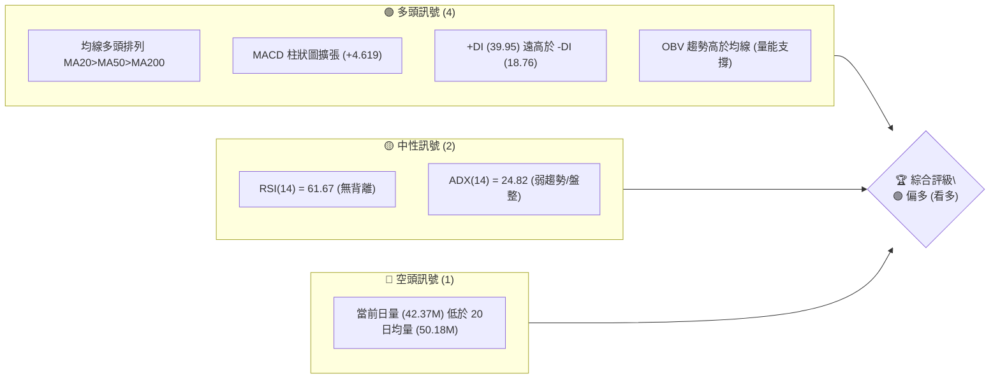
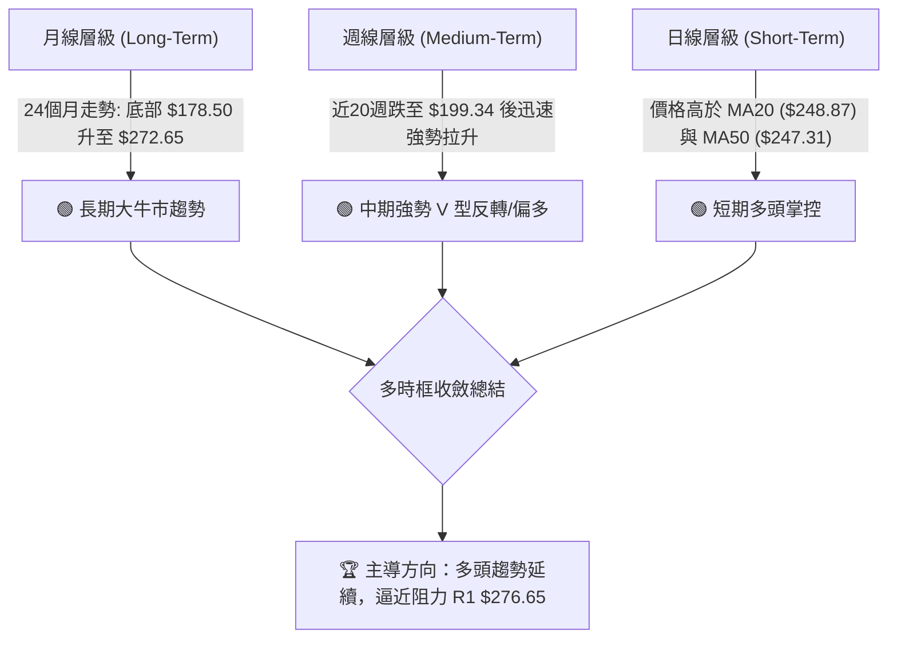
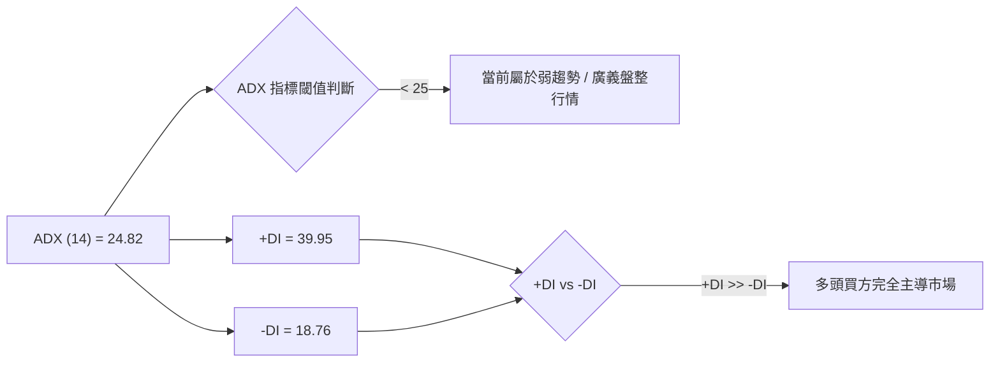
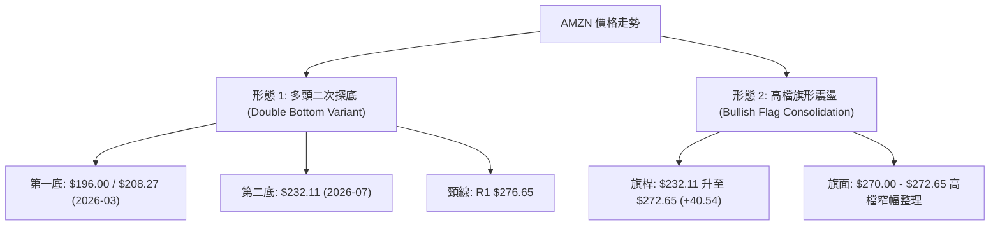
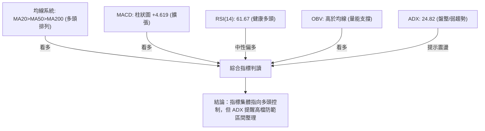
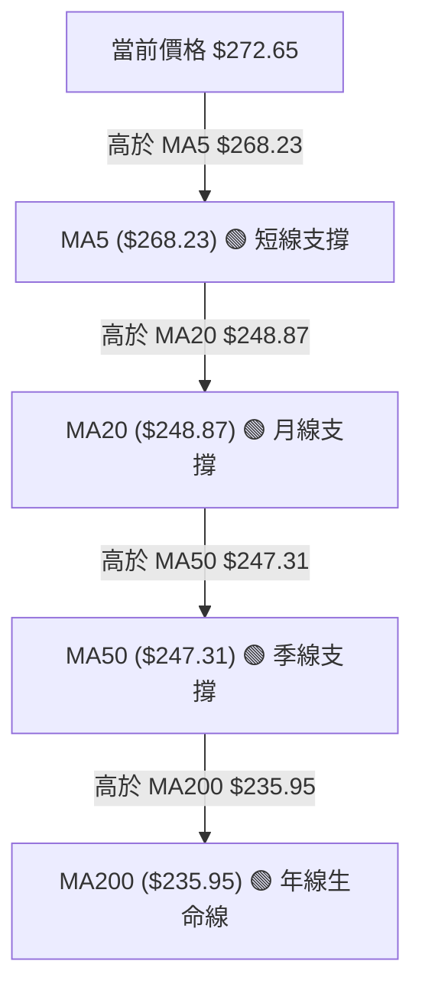
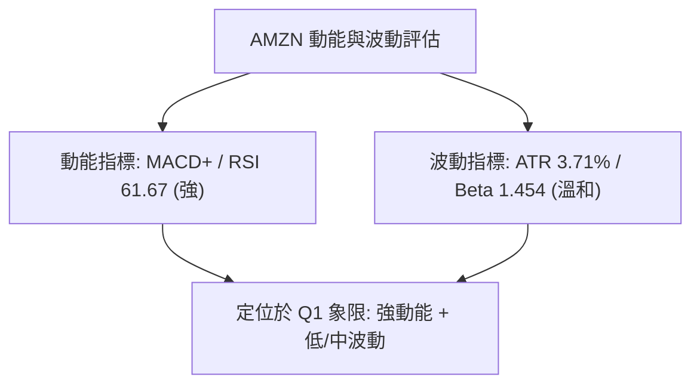
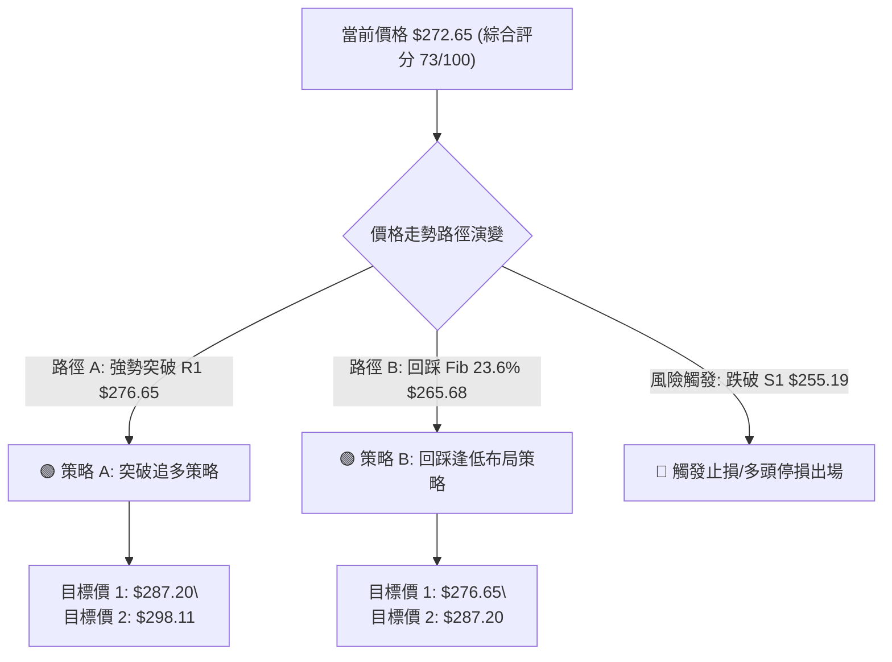
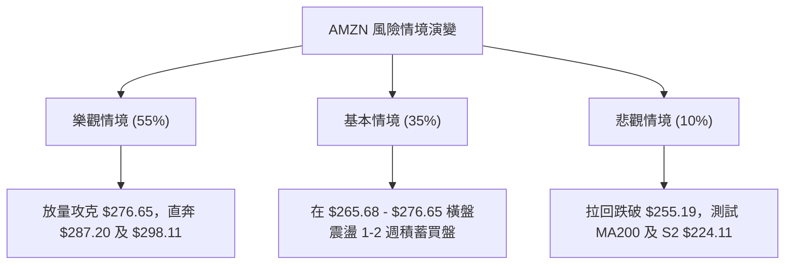

# AMZN 技術分析報告

> **報告日期**：2026-08-05 ｜ **語言**：繁體中文 ｜ **數據來源**：Yahoo Finance ｜ **當前價格**：$272.65

---

## 目錄

| 章節 | 內容 |
|------|------|
| [1. 技術面概覽](#1-技術面概覽) | 訊號儀表板、核心指標、評分卡 |
| [2. 趨勢分析](#2-趨勢分析) | 多時框趨勢、長中短期走勢 |
| [3. 圖表形態分析](#3-圖表形態分析) | 形態識別、K線組合、目標價 |
| [4. 支撐與阻力](#4-支撐與阻力) | 關鍵價位、斐波那契回調 |
| [5. 技術指標深度解讀](#5-技術指標深度解讀) | MA/RSI/MACD/布林/成交量 |
| [6. 動能與波動率](#6-動能與波動率) | 動能評估、ATR、Beta |
| [7. 多時框架總結](#7-多時框架總結) | 時框架評分矩陣 |
| [8. 交易策略建議](#8-交易策略建議) | 多空策略、風險報酬比 |
| [9. 風險提示與監控](#9-風險提示與監控) | 監控指標、風險場景 |

---

## 1. 技術面概覽

### 🎯 技術訊號儀表板



### 📊 核心指標速覽表

| 指標類別 | 指標名稱 | 當前數值 | 訊號 | 解讀 |
|----------|----------|----------|------|------|
| **價格** | 當前價格 | $272.65 | 🟢 | 位於 52 週區間高檔 (84.0%)，突破短期整理平台 |
| **均線** | MA20 | $248.87 | 🟢 | 價格位於 MA20 上方 (+9.55%)，支撐強勁 |
| **均線** | MA50 | $247.31 | 🟢 | 價格位於 MA50 上方 (+10.25%)，中期多頭 |
| **均線** | MA200 | $235.95 | 🟢 | 價格位於 MA200 上方 (+15.55%)，長期牛市 |
| **動能** | RSI(14) | 61.67 | 🟡 | 位於多頭擴張區但未達超買 (>70)，動能健康 |
| **動能** | MACD | 5.999 | 🟢 | MACD 線高於訊號線 (1.380)，柱狀圖正向放大 |
| **波動** | ATR(14) | $10.12 | 🟡 | 日波幅約 3.71%，波動度溫和，有利於設止損 |

### 🏆 技術評分卡

```
╔══════════════════════════════════════════════════════════════╗
║              技術評分卡 — AMZN (2026-08-05)                  ║
╠══════════════════════════════════════════════════════════════╣
║ 趨勢強度      ▓▓▓▓▓▓▓▓▓▓▓▓▓▓░░░░░░  70/100  🟢 看多        ║
║ 動能指標      ▓▓▓▓▓▓▓▓▓▓▓▓▓▓▓░░░░░  75/100  🟢 看多        ║
║ 支撐穩定度    ▓▓▓▓▓▓▓▓▓▓▓▓▓▓▓▓░░░░  80/100  🟢 強勁        ║
║ 成交量配合    ▓▓▓▓▓▓▓▓▓▓▓▓░░░░░░░░  60/100  🟡 中性        ║
║ 形態完整度    ▓▓▓▓▓▓▓▓▓▓▓▓▓░░░░░░░  65/100  🟡 偏多        ║
║ 均線排列      ▓▓▓▓▓▓▓▓▓▓▓▓▓▓▓▓▓▓░░  90/100  🟢 強勢多頭    ║
╠══════════════════════════════════════════════════════════════╣
║ 綜合評分      ▓▓▓▓▓▓▓▓▓▓▓▓▓▓▓░░░░░  73/100  🟢 偏多 (Buy)  ║
╚══════════════════════════════════════════════════════════════╝
```

---

## 2. 趨勢分析

### 🌐 多時框趨勢分析



### 📈 長期趨勢 — 12個月走勢圖（Unicode）

```
AMZN 月線走勢圖（過去 12 個月：2025-09 至 2026-08）
價格軸 ($)
$280 ┤                                                    ● $272.65 (現價)
$270 ┤                                            ●       │
$260 ┤                                    ●       │       │
$250 ┤                    ●               │       │       │
$240 ┤            ●       │   ●           │       │       │
$230 ┤        ●   │   ●   │   │   ●       │   ●   │       │
$220 ┤    ●   │   │   │   │   │   │       │   │   │       │
$210 ┤    │   │   │   │   │   │   │   ●   │   │   │       │
$200 ┤    │   │   │   │   │   │   │   │   │   │   │       │
     └────┴───┴───┴───┴───┴───┴───┴───┴───┴───┴───┴──────
         09  10  11  12  01  02  03  04  05  06  07  08 (月份)
```

**歷史走勢特徵分析**：

| 時間區段 | 價格區間 | 漲跌幅 | 走勢特徵 |
|----------|----------|--------|----------|
| **2025-09 至 2025-10** | $219.57 → $244.22 | +11.23% | 強勢波段上攻，刷新階段高點 |
| **2025-11 至 2026-03** | $244.22 → $208.27 | -14.72% | 築頂拉回，二次探底至 $208.27 形成中期大底部 |
| **2026-04 至 2026-05** | $208.27 → $270.64 | +29.95% | 展現強烈 V 型反轉，單月暴漲突破多重均線 |
| **2026-06** | $270.64 → $238.34 | -11.93% | 高檔獲利回吐，二次回測 50% 斐波那契位 ($241.60 附近) |
| **2026-07 至 2026-08** | $238.34 → $272.65 | +14.39% | 多頭再度發力，重新收復 $270 關卡，挺進歷史高檔區 |

### 📊 中期趨勢（週線分析）

```
AMZN 近期週線壓力與支撐結構
══════════════════════════════════════════════════════════════════
 $287.20 ────────────────────────────────────────── 52W High (0.0% Fib)
 $276.65 ────────────────────────────────────────── 阻力 R1 (關鍵壓力)
 $272.65 ══════════════════════════════════════════ 當前價格 (現價)
 $265.68 ────────────────────────────────────────── 23.6% Fib 回調位
 $255.19 ────────────────────────────────────────── 支撐 S1 (近期波段支撐)
 $248.87 ────────────────────────────────────────── MA20 / BB中軌
 $224.11 ────────────────────────────────────────── 支撐 S2 (強支撐)
 $215.82 ────────────────────────────────────────── 支撐 S3 (78.6% Fib $215.52)
══════════════════════════════════════════════════════════════════
```

### ⚡ 趨勢強度評估（ADX 解讀）



| 指標名稱 | 數值 | 趨勢強度判定 | 交易策略指示 |
|----------|------|--------------|--------------|
| **ADX(14)** | 24.82 | 弱趨勢/盤整 (臨界 25) | 價格雖處於強勁上升軌道，但 ADX 尚未升破 25，提示防範高檔區間震盪 |
| **+DI** | 39.95 | 多頭極度活躍 | 買盤控制力極強，空頭無力反擊 |
| **-DI** | 18.76 | 空頭力量微弱 | 拋售壓力持續萎縮 |

---

## 3. 圖表形態分析

### 🔍 形態識別系統



#### 形態信心度與目標價計算

| 形態名稱 | 信心度 | 判斷依據（引用數據） | 完成度 | 目標價（附精確計算式） |
|----------|--------|----------------------|--------|------------------------|
| **雙底形態 (Double Bottom)** | 70% 🟢 | 2026年3月低點 $208.27 與7月低點 $232.11 構成抬高的雙底結構，頸線為 R1 $276.65 | 85% | **形態高度** = 頸線 $276.65 - 支撐 S1 $255.19 = $21.46<br>**目標價 T2** = $276.65 + $21.46 = **$298.11** |
| **牛市旗形 (Bullish Flag)** | 60% 🟡 | 週線由 $232.11 強勢長紅拉升至 $271.58，近期在 $272.65 附近量縮整理 | 60% | **旗桿高度** = $271.58 - $232.11 = $39.47<br>**突破目標** = $276.65 + $39.47 = **$316.12** |

*註：若無法有效突破 R1 $276.65，則圖表形態將維持在 $255.19 – $276.65 的大區間震盪，依規則 15，信心度低於 50% 之幾何形態不予採計，改採均線與布林通道指標解讀。*

### 🕯️ 重要 K 線形態分析

| 日期/週別 | 收盤價 | K 線形態 | 技術解讀 | 訊號 |
|-----------|--------|----------|----------|------|
| **2026-06-28** | $232.69 | 長下影爆量大陰線 | 5.25 億超大量換手，完成底部洗盤與清算 | 🟢 底訊 |
| **2026-07-26** | $232.11 | 縮量回踩止跌線 | 量縮至 1.76 億，確認二次底部支撐有效 | 🟢 止跌 |
| **2026-08-02** | $271.58 | 光頭長紅 K 線 | 成交量放大至 3.55 億，一舉收復所有均線 | 🟢 強多 |
| **2026-08-09** | $272.65 | 高檔十字星 / 陽線 | 挺進高檔區，成交量 2.02 億保持溫和，等待突破 | 🟡 觀望 |

### 📉 ASCII 走勢形態示意圖

```
AMZN 週線「抬高雙底與牛市旗形」示意圖
─────────────────────────────────────────────────────────────
$287.20 ┤                                  52W High (0.0% Fib)
$276.65 ┤--------------┌─┐-------- 頸線阻力 R1
        │              │ │  ┌─┐
$272.65 ┤............  │ │  │ │  ◄ 現價 (高檔旗形整理中)
        │    ┌─┐       │ │  │ │
$255.19 ┤────┼─┼───────┴─┴──┴─┴─── 支撐 S1 (頸線回踩點/形態下軌)
        │    │ │
$232.11 ┤───┐│ │     ┌─┐ ◄ 第二底 (抬高底)
        │   ││ │     │ │
$208.27 ┤───┴┴─┴─────┴─┴───────── 第一底 (2026-03 低點)
─────────────────────────────────────────────────────────────
```

---

## 4. 支撐與阻力

### 🗺️ 關鍵價位分布圖（Unicode）

```
AMZN 價位結構分布圖
════════════════════════════════════════════════════════════════
 $287.20 ║████████████████████████║ 52 週最高價 / 0.0% 斐波那契位
 $281.41 ║████████████████████    ║ 布林通道上軌 (BB Upper)
 $276.65 ║████████████████████████║ 阻力 R1 (近一年波段高點聚類)
 $272.65 ╠════════════════════════╣ ◄ 當前價格 (現價)
 $265.68 ║▓▓▓▓▓▓▓▓▓▓▓▓▓▓▓▓        ║ 23.6% 斐波那契回調位
 $255.19 ║████████████████████████║ 支撐 S1 (近期波段低點聚類)
 $252.36 ║▓▓▓▓▓▓▓▓▓▓▓▓▓▓          ║ 38.2% 斐波那契回調位
 $248.87 ║▓▓▓▓▓▓▓▓▓▓▓▓▓▓▓▓▓▓▓▓    ║ MA20 均線 / 布林通道中軌
 $241.60 ║▓▓▓▓▓▓▓▓▓▓▓▓            ║ 50.0% 斐波那契回調位
 $224.11 ║████████████████████████║ 支撐 S2 (中期強支撐)
 $215.82 ║████████████████████████║ 支撐 S3 / 78.6% 斐波那契 ($215.52)
════════════════════════════════════════════════════════════════
```

### 🚧 阻力位分析表

| 阻力級別 | 精確價位 | 形成原因 | 突破難度 | 重要性 |
|----------|----------|----------|----------|--------|
| **R1** | **$276.65** | 近一年波段高點聚類區 | 🟡 中等 | 🟢 極高 (突破即開啟新一波牛市行情) |
| **BB 上軌**| **$281.41** | 日線布林通道上軌動態阻力 | 🟡 中等 | 🟡 中等 (短線超買邊界) |
| **52W High**| **$287.20** | 52 週歷史高點 / 0.0% 斐波那契 | 🔴 偏難 | 🟢 極高 (終極歷史天花板) |

### 🛡️ 支撐位分析表

| 支撐級別 | 精確價位 | 形成原因 | 守住機率 | 重要性 |
|----------|----------|----------|----------|--------|
| **Fib 23.6%**| **$265.68** | 斐波那契短線支撐 | 🟢 高 (80%) | 🟡 中等 (短線強弱分水嶺) |
| **S1** | **$255.19** | 近一年波段低點聚類 | 🟢 極高 (85%)| 🟢 極高 (多頭防守主陣地) |
| **S2** | **$224.11** | 歷次修正底部聚類區 | 🟢 極高 (90%)| 🟢 高 (中期強烈買盤支撐) |
| **S3** | **$215.82** | 波段低點聚類 / 78.6% Fib ($215.52) | 🟢 極高 (95%)| 🟢 極高 (多頭生命線) |

### 📐 斐波那契回調位分析（區間 $196.00 → $287.20）

```
斐波那契回調比例及價位分布：
  0.0%  (52W High) ─── $287.20
 23.6%             ─── $265.68  ◄ 現價 $272.65 位於此區間內 (多頭強勢區)
 38.2%             ─── $252.36
 50.0%             ─── $241.60
 61.8%             ─── $230.84
 78.6%             ─── $215.52
100.0%  (52W Low)  ─── $196.00
```

* **現價解讀**：AMZN 當前價位 **$272.65** 完美處於 **0.0% ($287.20)** 與 **23.6% ($265.68)** 之間。這代表股價已收復上一波修復走勢的大部分失地，屬於極為健康的「高位強勢整理」形態，只要價格不跌破 23.6% 回調位 ($265.68)，多頭隨時具備攻克歷史高點的能力。

---

## 5. 技術指標深度解讀

### 🎛️ 指標訊號總纜



### 📈 移動平均線排列分析



* **排列狀態**：MA20 ($248.87) > MA50 ($247.31) > MA200 ($235.95)，呈標準的**多頭排列 (Bullish Alignment)**。
* **乖離率 (Bias)**：現價距離 MA20 乖離率約為 +9.55%，距離 MA200 乖離率約為 +15.55%，技術面略有拉回修復需求，但無嚴重超買現象。

### 📉 RSI(14) 分析

* **當前數值**：**61.67**
* **進度條**：`████████████▓░░░░░░░ 61.67%`
* **區間解讀**：處於 50–70 的多頭控盤區，未進入 >70 的極端超買區，顯示股價上漲有實質買盤推動而非盲目投機。
* **背離判斷**：
  * **頂背離判斷**：無頂背離。近期價格由 $232.11 升至 $272.65，週線與日線 RSI 同步上升（週線 RSI 由 37.3 回升至 61.7），價格與動能方向一致。
  * **底背離判斷**：無底背離（底背離已於 2026 年 6–7 月完成並催化了本輪行情）。

### 📊 MACD(12, 26, 9) 訊號解讀

```
MACD 指標數據快照：
  MACD 快線:     5.999
  MACD 慢線:     1.380
  MACD 柱狀圖:   +4.619  🟢 (買方動能強勁放大)
```

* **解讀**：MACD 快線已深幅穿過慢線（Signal），柱狀圖正值持續擴張至 +4.619，顯示中短期多頭衝刺動能極其充沛。

### 📦 布林通道分析

```
AMZN 布林通道走勢示意圖（日線）
─────────────────────────────────────────────────────────────
 $281.41 ─────── Upper Band (BB 上軌)
                /
 $272.65 ───────● 當前價格 ($272.65, %B = 0.87)
               /
 $248.87 ─────── Middle Band (MA20 中軌)
             /
 $216.34 ─────── Lower Band (BB 下軌)
─────────────────────────────────────────────────────────────
```

* **BB %B 數值**：**0.87** (0 代表下軌，0.5 代表中軌，1.0 代表上軌)。
* **解讀**：價格緊貼上軌 ($281.41) 運行，通道保持開口擴張狀態，為典型的「沿上軌強勢推升」形態。下軌上升至 $216.34，中軌 $248.87 提供極強動態支撐。

### 💹 成交量分析（量價配合度）

* **最新成交量**：42,366,662 股
* **20日均量**：50,184,938 股 (量比: 0.84x)
* **OBV 趨勢**：OBV 指標高於其移動平均線，呈現「價漲量增、價跌量縮」的健康配合。
* **量價背離分析**：日成交量 0.84x 略低於 20 日均量，顯示在接近阻力位 R1 $276.65 時，市場出現暫時的觀望情緒，需要放量突破以確認新一輪漲勢。

---

## 6. 動能與波動率

### ⚡ 動能評估四象限

| 象限區間 | 動能狀態 | 波動率狀態 | AMZN 所處位置 | 評估與策略建議 |
|----------|----------|------------|---------------|----------------|
| **Q1** | 強 (High) | 低 (Low) | **AMZN 🎯** | **最佳買入機會**：動能強勁且波動受控，趨勢可持續性高 |
| **Q2** | 弱 (Low) | 低 (Low) | — | 觀望：橫盤整理，缺乏突破契機 |
| **Q3** | 強 (High) | 高 (High) | — | 高風險高收益：劇烈沖高，防範暴跌 |
| **Q4** | 弱 (Low) | 高 (High) | — | 避開：恐慌性下跌或無序震盪 |



### 📊 ATR 波動率分析

* **ATR(14) 精確值**：**$10.12**（占當前股價 3.71%）
* **止損距離建議**：
  * **短線交易者 (1.5 x ATR)**：$10.12 × 1.5 = **$15.18**（相對於進場價下浮 $15.18）
  * **波段交易者 (2.0 x ATR)**：$10.12 × 2.0 = **$20.24**（相對於進場價下浮 $20.24）

### 📐 Beta 與市場相關性

* **Beta 值**：**1.454**
* **解讀**：AMZN 的波動度高於大盤（S&P 500）約 45.4%。在大盤上漲週期中，AMZN 具有顯著的超額收益（Alpha）潛力；在市場回調時，其下行幅度亦會相對擴大，需嚴格實施止損。

---

## 7. 多時框架總結

### 📋 時框架評分表

| 時框架 | 趨勢方向 | 動能狀態 | 均線排列 | 形態結構 | 綜合評分 | 交易建議 |
|--------|----------|----------|----------|----------|----------|----------|
| **月線 (Long)** | 🟢 偏多 | 🟢 強勁 | 🟢 多頭 | V型修復 | **85/100** | 長線持有/逢低加碼 |
| **週線 (Medium)**| 🟢 偏多 | 🟢 充沛 | 🟢 多頭 | 抬高雙底 | **78/100** | 波段做多 |
| **日線 (Short)** | 🟡 盤整強勢| 🟢 正向 | 🟢 多頭 | 旗形整理 | **70/100** | 突破追多 / 逢拉回買進 |

### 🔲 綜合訊號矩陣

```
時框架訊號收斂分析矩陣：
╔═══════════╦═══════════╦═══════════╦═══════════╦═══════════════════════╗
║  時框架   ║ 趨勢指標  ║ 動能指標  ║ 成交量能  ║      一致性結論       ║
╠═══════════╬═══════════╬═══════════╬═══════════╬═══════════════════════╣
║ 月線      ║ 🟢 多頭   ║ 🟢 偏多   ║ 🟢 充沛   ║ 🟢 長線大趨勢向上     ║
║ 週線      ║ 🟢 多頭   ║ 🟢 偏多   ║ 🟢 健康   ║ 🟢 中期波段多頭主導   ║
║ 日線      ║ 🟡 橫盤   ║ 🟢 偏多   ║ 🟡 稍遜   ║ 🟡 短線挑戰阻力 R1    ║
╚═══════════╩═══════════╩═══════════╩═══════════╩═══════════════════════╝
```

### ⚖️ 多時框收斂結論

依「多時框收斂規則」判斷：
1. **行情性質**：ADX(14) 為 24.82 (< 25)，技術上屬於**弱趨勢至高檔廣義盤整行情**。依規則，主要交易區間介於布林通道上下軌（$216.34 ～ $281.41）。
2. **時框收斂**：然而，日線與週線均線呈現完美的多頭排列（MA20>MA50>MA200），且 +DI (39.95) 遠壓制 -DI (18.76)，月線趨勢明確向上。
3. **最終收斂結論**：**整體維持「多頭強勢震盪上攻」**。短線受制於阻力 R1 $276.65，建議以逢拉回至斐波那契支撐位（$265.68）做多或待有效放量突破 R1 後順勢追多為主，本結論與第 8 章之主策略完全一致。

---

## 8. 交易策略建議

### 🗺️ 策略決策流程圖



### 🧭 策略路由

> **當前主策略方向 = 🟢 多頭偏多策略（依技術綜合評分 73/100）**

由於評分高於 60 分，本報告主推**做多策略**（分佈於突破進場與逢低拉回進場），空頭僅作為風險對沖與反轉防守參考。

### 🎯 價格情境階梯 (Price Scenarios)

| 觸發條件 | 下一目標價 | 後續延伸目標 | 情境技術含義 |
|----------|------------|--------------|--------------|
| **放量突破 R1 $276.65** | **$287.20** (52W High) | **$298.11** (雙底形態目標) | 刷新歷史高點，開啟新一波主升段 |
| **於 $265.68 - $276.65 運行** | — | — | 高檔牛市旗形消化賣壓，積蓄動能 |
| **跌破 S1 $255.19** | **$224.11** (支撐 S2) | **$215.82** (支撐 S3) | 雙底頸線失敗，轉為中期深幅修整 |

### 📊 情境機率分佈

| 情境劇本 | 估計機率 | 主要技術依據 |
|----------|----------|--------------|
| **放量突破上行** | **55%** | MACD 柱狀圖正向擴張 (+4.619)，+DI 高達 39.95，OBV 支撐 |
| **高檔區間震盪** | **35%** | ADX 24.82 未達 25，日成交量 (0.84x) 暫未放量 |
| **深幅拉回探底** | **10%** | 多頭均線支撐密集，S1 $255.19 及 MA20 防守堅固 |

### 🟢 主策略詳情

| 策略要素 | 策略 A（突破追多策略） | 策略 B（拉回低吸策略） |
|----------|------------------------|------------------------|
| **進場條件** | 日線收盤價突破 R1 $276.65 且成交量增 | 價格回踩 23.6% Fib 回調位 $265.68 止跌 |
| **進場價格** | **$276.65** | **$265.68** |
| **目標價 T1** | **$287.20** (52W High) | **$276.65** (阻力 R1) |
| **目標價 T2** | **$298.11** (形態算術目標) | **$287.20** (52W High) |
| **止損價格** | **$265.68** (23.6% Fib 支撐) | **$255.19** (支撐 S1) |
| **風險報酬比 (T1)**| **0.96 : 1** (短線快速目標) | **1.05 : 1** |
| **風險報酬比 (T2)**| **1.96 : 1** (波段推算: $21.46 / $10.97) | **2.05 : 1** (波段推算: $21.52 / $10.49) |
| **估計成功率**| 60% | 68% |
| **建議倉位** | 15% - 20% | 20% - 25% |

*註：策略 A 目標價 T2 $298.11 計算公式：頸線 $276.65 + (頸線 $276.65 - 支撐 S1 $255.19) = $276.65 + $21.46 = $298.11。*

### 🔴 反向風險觸發點（對沖與避險提示）

* **防禦觸發點**：若股價無預警跌破關鍵波段支撐 **S1 $255.19**，多頭結構將遭受破壞。
* **避險動作**：應全面清減多頭頭寸，多單止損出場；極激進者可於跌破 $255.19 後建立輕量空頭對沖，下看 **S2 $224.11**。

### ⭐ 整體訊號強度評星

```
做多訊號強度：★★██☆  (4/5 星) — 均線與動能極佳，僅待量能突破 R1
做空訊號強度：★☆☆☆☆  (1/5 星) — 缺乏空頭訊號，盲目做空風險極高
整體可信度：  ★★██☆  (4/5 星) — 多時框指標高度收斂 confirmation
```

---

## 9. 風險提示與監控

### ✅ 關鍵監控指標 Checklist

```
╔══════════════════════════════════════════════════════════════╗
║                 每日/每週技術面監控清單                     ║
╠══════════════════════════════════════════════════════════════╣
║ [ ] 突破確認：日收盤價是否站穩阻力 R1 $276.65 上方           ║
║ [ ] 成交量能：日成交量是否回升至 50M 股 (20日均量) 以上      ║
║ [ ] 動能防禦：RSI(14) 是否跌破 50 中性分水嶺                  ║
║ [ ] MACD 轉折：MACD 柱狀圖是否出現縮頭 (小於 +4.619)          ║
║ [ ] 關鍵防線：價格是否跌破 23.6% Fib $265.68 或 S1 $255.19    ║
╚══════════════════════════════════════════════════════════════╝
```

### ⚠️ 風險場景分析



### 🛡️ 風險管理重要提醒

1. **ATR 動態止損策略**：依當前 ATR ($10.12)，進場後止損距離切勿低於 $15.00，避免因常態性日波幅被震盪洗出場。
2. **阻力位前不盲目重倉**：當前價 $272.65 距離阻力 R1 $276.65 僅約 1.47%，在突破未經成交量確認前，不宜在阻力位正下方一次性滿倉。
3. **大盤相關性風險**：AMZN Beta 值為 1.454，若美股大盤（S&P 500 / Nasdaq 100）出現整體獲利拉回，AMZN 容易出現放大修正，請留意總體市場環境。

---

## 📋 報告總結

```
╔══════════════════════════════════════════════════════════════╗
║              AMZN 技術分析報告總結 (2026-08-05)              ║
╠══════════════════════════════════════════════════════════════╣
║ 當前價格：$272.65         52週區間：$196.00 - $287.20        ║
║ 分析評級：🟢 偏多 (看多)  技術總評分：73 / 100               ║
╠══════════════════════════════════════════════════════════════╣
║ 關鍵結構判讀：                                              ║
║ ├─ 長期趨勢：🟢 偏多 (月線強勢修復，多頭格局完整)            ║
║ ├─ 中期趨勢：🟢 偏多 (抬高雙底形成，MA20/50/200 多頭排列)    ║
║ ├─ 短期趨勢：🟡 高檔旗形整理 (逼近阻力 R1 $276.65)           ║
║ ├─ 關鍵支撐：$265.68 (23.6% Fib) / $255.19 (S1 支撐)         ║
║ ├─ 關鍵阻力：$276.65 (R1 阻力) / $287.20 (52W High)          ║
║ └─ 分析師目標價：均價 $323.29 (最高 $400.00 / 最低 $207.00)  ║
╠══════════════════════════════════════════════════════════════╣
║ 最優交易策略指引：                                          ║
║ 1. 🥇 首選策略 (低吸)：回踩 $265.68 附近承接，止損 $255.19，  ║
║    目標看至 $276.65 及 $287.20。                             ║
║ 2. 🥈 次選策略 (追多)：日線放量帶勁突破 $276.65 後順勢進場， ║
║    止損設於 $265.68，目標上看 $298.11 (形態測幅高點)。      ║
╚══════════════════════════════════════════════════════════════╝
```

---

> ⚠️ **免責聲明**：本報告為 AI 自動生成之技術分析，所有數據及估算均嚴格基於提供之歷史價格與指標數據。本報告**僅供研究與學術參考**，**不構成任何投資建議或買賣邀約**。投資涉及風險，證券價格可升可跌，入市操作需獨立思考並嚴格執行風險控制。

---

*報告生成時間：2026-08-05 ｜ 數據來源：Yahoo Finance ｜ 分析框架：多時框技術分析系統*