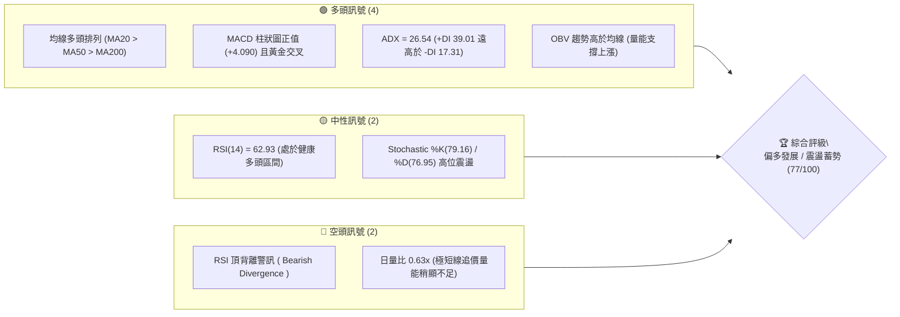
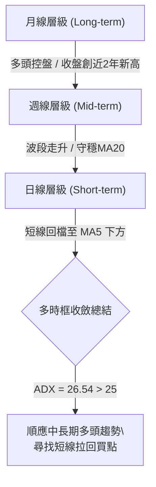
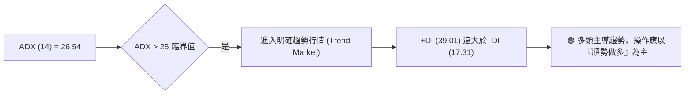
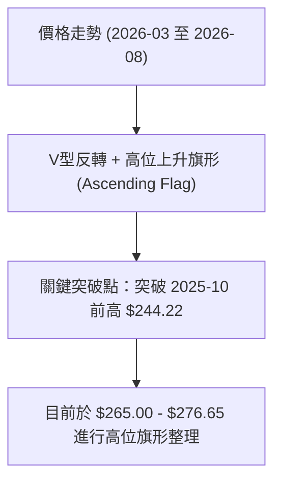
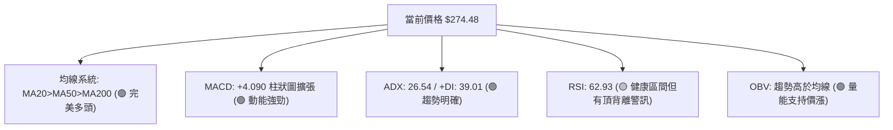
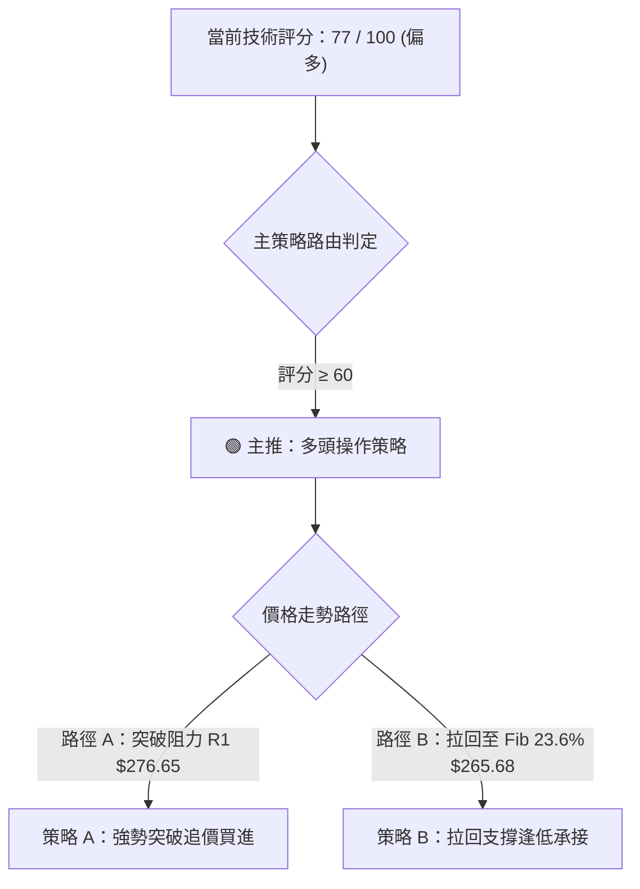
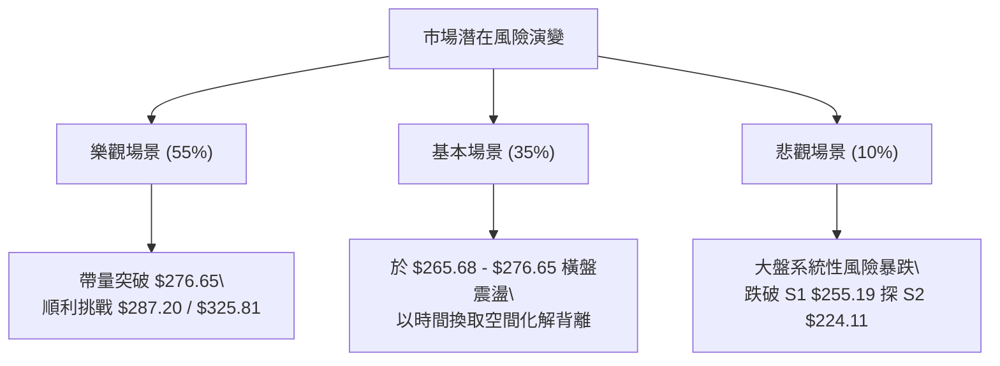

# AMZN 技術分析報告

> **報告日期**：2026-08-07 ｜ **語言**：繁體中文 ｜ **數據來源**：Yahoo Finance ｜ **當前價格**：$274.48

---

## 目錄

| 章節 | 內容 |
|------|------|
| [1. 技術面概覽](#1-技術面概覽) | 訊號儀表板、核心指標、評分卡 |
| [2. 趨勢分析](#2-趨勢分析) | 多時框趨勢、長中短期走勢、ADX解讀 |
| [3. 圖表形態分析](#3-圖表形態分析) | 形態識別、K線組合、目標價計算 |
| [4. 支撐與阻力](#4-支撐與阻力) | 關鍵價位、斐波那契回調層級 |
| [5. 技術指標深度解讀](#5-技術指標深度解讀) | MA/RSI背離/MACD/布林/量價OBV |
| [6. 動能與波動率](#6-動能與波動率) | 動能四象限、ATR風控、Beta特質 |
| [7. 多時框架總結](#7-多時框架總結) | 時框架矩陣與收斂規則結論 |
| [8. 交易策略建議](#8-交易策略建議) | 主策略路由、情境階梯、風報比精算 |
| [9. 風險提示與監控](#9-風險提示與監控) | 監控清單、三情境演練、風控守則 |

---

## 1. 技術面概覽

### 🎯 技術訊號儀表板



### 📊 核心指標速覽表

| 指標類別 | 指標名稱 | 當前數值 | 訊號 | 解讀與狀態分析 |
|----------|----------|----------|------|----------------|
| **價格** | 當前收盤價 | $274.48 | 🟢 | 位於52週高低點區間 86.1% 位置，靠近歷史高點 |
| **均線** | MA20 (月線) | $251.59 | 🟢 | 價格高於 MA20 達 +9.10%，短中期趨勢強勁 |
| **均線** | MA50 (季線) | $247.51 | 🟢 | 價格高於 MA50 達 +10.90%，中期結構穩固 |
| **均線** | MA200 (年線)| $236.54 | 🟢 | 價格高於 MA200 達 +16.04%，長線多頭保護 |
| **動能** | RSI(14) | 62.93 | 🟡 | 處於多頭控制區，但伴隨高位頂背離警訊 |
| **動能** | MACD(12,26,9)| +4.090 | 🟢 | MACD線(7.583)高於訊號線(3.492)，柱狀圖持續擴張 |
| **趨勢** | ADX(14) | 26.54 | 🟢 | ADX > 25 進入強趨勢，+DI(39.01) 壓制 -DI(17.31) |
| **通道** | 布林 %B | 0.82 | 🟢 | 位於布林通道中軌($251.59)與上軌($287.33)之間 |
| **波動** | ATR(14) | $9.99 | 🟡 | 日波動率為 3.64%，屬於中等正常波動水準 |

### 🏆 技術評分卡

```
╔══════════════════════════════════════════════════════════════════╗
║                AMZN 技術評分卡 (2026-08-07)                      ║
╠══════════════════════════════════════════════════════════════════╣
║ 趨勢強度 (ADX/+DI)   █████████████████░░░░  85/100  🟢 強趨勢行情 ║
║ 動能指標 (MACD/RSI)  ██████████████░░░░░░░  70/100  🟡 偏多但有背離║
║ 支撐穩定度 (關鍵價位) ████████████████░░░░  80/100  🟢 兩道防線堅固 ║
║ 成交量配合 (OBV/量比) ████████████░░░░░░░░  60/100  🟡 中長帶量短欠量║
║ 形態完整度 (結構)     ███████████████░░░░░  75/100  🟢 偏多旗形震盪 ║
║ 均線排列 (多頭排列)   ██████████████████░░  90/100  🟢 標準完美排列 ║
╠══════════════════════════════════════════════════════════════════╣
║ 綜合評分             ███████████████░░░░░  77/100  🟢 偏多 (Strong)║
╚══════════════════════════════════════════════════════════════════╝
```

---

## 2. 趨勢分析

### 🌐 多時框趨勢分析



### 📈 長期趨勢 — 24 個月歷史走勢圖

```
AMZN 24個月歷史價格走勢圖 ($)
$287.20 ┤                                                       ● (52W高點)
$270.00 ┤                                                ●  ●   █
$250.00 ┤                                       ●     █  █  █
$230.00 ┤              ●                        █  █  █  █
$210.00 ┤           █  █  █                  █  █  █
$196.00 ┤●   ●   █  █     █  ●   ●   █  █  ● █
        └─┬──┬──┬──┬──┬──┬──┬──┬──┬──┬──┬──┬──┬──┬──┬──┬──┬──┬──┬──► 月份
         08 09 10 11 12 01 02 03 04 05 06 07 08 09 10 11 12 01 02 03 04 05 06 07 08
         '24                                 '25                                 '26
```

#### 24 個月走勢特徵分析：
1. **第一波主升段（2024-08 至 2025-01）**：股價從 $178.50 強勁攀升至 $237.68，展現強烈買盤力道。
2. **中期修正洗盤（2025-02 至 2025-04）**：遭遇獲利回吐，一路修正至 $184.42 尋求底層支撐。
3. **二度攻高與拉回（2025-05 至 2026-03）**：2025年10月一度觸及 $244.22，隨後在2026年3月探底至 $196.00（52週最低價）。
4. **強勢主升浪再起（2026-04 至 2026-08）**：自 $196.00 強勢反彈，連續突破阻力，2026年8月收盤達 $274.48，直指 52 週高點 $287.20。

### 📊 中期趨勢（近 20 週走勢分析）

根據近 20 週數據，AMZN 在 2026 年 3 月底（$199.34）完成築底後展開主升段：
- **第一波噴發**：4月中旬飆升至 $268.26，週 RSI 一度達到 97.5 的極端超買區。
- **健康拉回洗盤**：6月中下旬股價拉回至 $232.69 區間震盪洗籌。
- **二次攻高**：7月底至8月初帶量擴張（週成交量達 3.55 億股），股價一舉推升至 $274.48。

### ⚡ 趨勢強度評估（ADX 解讀）



| 指標名稱 | 當前數值 | 判讀門檻 | 趨勢狀態 | 操作意涵 |
|----------|----------|----------|----------|----------|
| **ADX** | 26.54 | > 25.0 | 強趨勢形成 | 避免使用震盪逆勢指標，順應主流趨勢 |
| **+DI** | 39.01 | > -DI | 多方絕對優勢 | 買方力道強勁，每次回檔皆有買盤承接 |
| **-DI** | 17.31 | < +DI | 空方力道潰散 | 賣壓不具持續性，無崩盤結構 |

---

## 3. 圖表形態分析

### 🔍 形態識別系統



#### 圖表形態信心度評估表：

| 形態名稱 | 信心度 | 判斷依據（引用數據） | 完成度 | 目標價計算式與精確數值 |
|----------|--------|----------------------|--------|------------------------|
| **上升旗形** | **75%** | 自 $196.00 飆升至 $272.68 形成旗桿，近期於 $265-$275 高位狹幅震盪 | 85% | 旗桿高度($272.68 - $196.00 = $76.68) + 旗形底($265.68) = **$342.36** |
| **雙重底反轉** | **90%** | 2025-04 低點 $184.42 與 2026-03 低點 $196.00 形成大雙底，頸線 $244.22 已突破 | 100% (已完成) | 頸線($244.22) + 形態高度($244.22 - $190.26 = $53.96) = **$298.18** |

### 🕯️ 重要 K 線形態分析（近期月線/週線）

| 時間/層級 | 收盤價 | K線形態 | 技術特徵與解讀 | 訊號強度 |
|-----------|--------|---------|----------------|----------|
| **2026-04 (月線)** | $265.06 | 長陽突破大陽線 | 強勢吞噬前期震盪區，單月大漲超 +27% | 🟢 極強多頭 |
| **2026-06 (月線)** | $238.34 | 中陰回檔洗盤線 | 守穩 MA200($236.54)，屬於健康的量縮回檔 | 🟡 中性整理 |
| **2026-07 (月線)** | $271.58 | 強勢包裹陽線 | 完全吞噬6月陰線，重新發動多頭攻勢 | 🟢 強勢多頭 |
| **2026-08-02 (週線)**| $271.58 | 爆量長陽突破 | 週成交量放量至 3.55 億股，主力資金大幅進駐 | 🟢 極強多頭 |

### 📉 ASCII 走勢形態示意圖

```
高位旗形整理 (Ascending Flag) 形態示意圖：

$287.20 ┤                        [52W High]
$276.65 ┤               ┌───●──┐  ◄ R1 阻力位 ($276.65)
$274.48 ┤             ┌─┘   ▲  └─ [現價 $274.48]
$265.68 ┤           ┌─┘     │     ◄ 旗形下軌 / Fib 23.6% ($265.68)
$255.19 ┤         ┌─┘       │     ◄ S1 關鍵支撐 ($255.19)
$236.54 ┤       ┌─┘ (旗桿)  │
$196.00 ┤  ●────┘ (52W Low) └─ 頸線突破點 ($244.22)
```

---

## 4. 支撐與阻力

### 🗺️ 關鍵價位分布圖

```
AMZN 價位結構分布圖
════════════════════════════════════════════════════════════════
$325.81 ║██████████████████████████████████  分析師共識目標價
$287.20 ║████████████████████████            52週歷史高點 / 布林上軌($287.33)
$276.65 ║████████████████                    阻力 R1 (近一年高點聚類)
$274.48 ╠════════════════════════════════════ ◄ 當前價格 $274.48
$265.68 ║▓▓▓▓▓▓▓▓▓▓▓▓▓▓▓▓                    斐波那契 23.6% 回調位
$255.19 ║████████████████████                支撐 S1 (近一年低點聚類)
$251.59 ║▓▓▓▓▓▓▓▓▓▓▓▓▓▓▓▓▓▓▓▓▓▓▓▓            MA20 均線 / 布林中軌
$236.54 ║████████████████████████████        MA200 年線支撐
$224.11 ║████████████████████████            支撐 S2
$215.82 ║████████████████████████████        支撐 S3 / 布林下軌($215.86)
════════════════════════════════════════════════════════════════
```

### 🚧 阻力位分析表

| 阻力級別 | 精確價位 | 形成原因與數據來源 | 突破難度 | 戰略重要性 |
|----------|----------|--------------------|----------|------------|
| **阻力 R1** | **$276.65** | 近一年波段高點聚類 (數據已列出) | 🟡 中等 | 短線多空分水嶺，突破即開啟創新高之旅 |
| **阻力 R2** | **$287.20** | 52週最高價 (52W High) | 🔴 偏高 | 歷史壓力解套區，突破後上方無套牢賣壓 |
| **目標 R3** | **$325.81** | 法人機構共識目標均價 (Analyst Mean) | 🔴 高 | 中長線波段目標位 |

### 🛡️ 支撐位分析表

| 支撐級別 | 精確價位 | 形成原因與數據來源 | 守住機率 | 戰略重要性 |
|----------|----------|--------------------|----------|------------|
| **支撐 S1** | **$255.19** | 近一年波段低點聚類 (距離現價 -7.03%) | 🟢 高 (80%) | 短線多頭防線，靠近 MA20 ($251.59) |
| **支撐 S2** | **$224.11** | 近一年波段低點聚類 (距離現價 -18.35%)| 🟢 極高(90%)| 中期強固支撐，波段防守大本營 |
| **支撐 S3** | **$215.82** | 近一年波段低點聚類 / 布林下軌($215.86) | 🟢 極高(95%)| 長線鐵板支撐，跌破機率極低 |

### 📐 斐波那契回調位分析（基於 52 週區間 $196.00 → $287.20）

```
斐波那契回調位與現價位置：
0.0%  (52W High) ─────────────── $287.20
                                  ▲
現價 $274.48 ─────────────────── ┼─ (目前位於 0.0% 與 23.6% 之間)
                                  ▼
23.6% Retracement ────────────── $265.68  ◄ 第一道動態黃金支撐
38.2% Retracement ────────────── $252.36  ◄ 第二道關鍵防線 (重疊 MA20 $251.59)
50.0% Retracement ────────────── $241.60  ◄ 多空中樞分界
61.8% Retracement ────────────── $230.84  ◄ 黃金分割強支撐
78.6% Retracement ────────────── $215.52  ◄ 重疊 S3 ($215.82)
100.0%(52W Low)  ─────────────── $196.00
```

**解讀**：現價 $274.48 穩穩守在 **23.6% ($265.68)** 回調位之上，顯示市場回檔極淺、買盤強勁，屬於典型的「強勢多頭高位震盪」格局。

---

## 5. 技術指標深度解讀

### 🎛️ 指標訊號總覽



### 📈 移動平均線排列分析

```
均線多頭排列架構：
$274.48  ─── 現價 (高於 MA20/MA50/MA200，僅微幅低於 MA5 $276.17)
$251.59  ─── MA20  (月線，+9.10%)  ▲ 多頭防線
$247.51  ─── MA50  (季線，+10.90%) ▲ 中期支撐
$236.54  ─── MA200 (年線，+16.04%) ▲ 長線生命線
```

- **均線排列狀態**：MA20 ($251.59) > MA50 ($247.51) > MA200 ($236.54)，呈現完美的**多頭排列**。
- **乖離率分析**：現價距離 MA20 乖離率為 **+9.10%**，距離 MA200 為 **+16.04%**。乖離率處於合理擴張狀態，未達到 >25% 的極端危險超買區，顯示上漲趨勢健康。

### 📉 RSI(14) 頂背離深度分析

```
RSI(14) 進度條：
0 ░░░░░░░░░░░░░░░░░░░░░░░░░░░░████████████████████ 100  (62.93)
                     [30 超賣]       [62.93 中性偏多] [70 超買]
```

- **背離診斷**：
  - 在 2026 年 4 月，股價升至 $268.26 時，週 RSI 達到 **97.5** 的高點。
  - 2026 年 8 月，股價突破並攀升至 $274.48（創近期新高），但日 RSI 為 **62.93**，週 RSI 為 **62.9**。
  - **結論**：價格創高而 RSI 未同步創高，確認存在**頂背離（Bearish Divergence）警訊**。這並不代表趨勢會立即反轉，但暗示短線向上推升的加速度放緩，衝高後易面臨高位震盪或拉回洗盤。

### 📊 MACD (12, 26, 9) 訊號解讀

- **MACD 線**：7.583
- **Signal 線**：3.492
- **MACD 柱狀圖**：**+4.090** (🟢 看多)
- **分析**：MACD 快線遠高於慢線，且柱狀圖由前週的 +1.213 快速擴張至 +4.090，顯示買盤力道正在再次聚集發動，有效化解了極短線的整理壓力。

### 📦 布林通道 (Bollinger Bands) 分析

```
布林通道現況示意圖 ($)：
$287.33 ┤─────────────────────────── 布林上軌 (BB Upper)
$274.48 ┤                   ●       現價 (BB %B = 0.82)
$251.59 ┤─────────────────────────── 布林中軌 / MA20 (BB Mid)
$215.86 ┤─────────────────────────── 布林下軌 (BB Lower)
```

- **%B 指標**：0.82。股價運行於中軌與上軌間的強勢區，未觸及上軌（$287.33）擠壓區，顯示通道開口正在擴張，屬於順勢推升形態。

### 💹 成交量與 OBV 分析

- **成交量**：最新單日成交量為 31,375,313 股，相對 20 日均量 (49,937,721) 之量比為 **0.63x**。短線呈現「價漲量縮」的高位觀望，但近 2 週（2026-08-02 當週）曾放出 3.55 億股的波段大量。
- **OBV (能量潮)**：OBV > MA，總體能量潮持續創高，確認大資金籌碼鎖定良好，量能結構支持價格中長期持續走高。

---

## 6. 動能與波動率

### ⚡ 動能評估四象限

| 象限分區 | 動能強度 (RSI/MACD) | 波動率 (ATR/Beta) | AMZN 當前定位 | 策略意涵 |
|----------|---------------------|-------------------|---------------|----------|
| **第一象限 (Q1)** | 強 (MACD+) | 低/中 (ATR 3.64%) | **✓ AMZN 所在位置** | **最佳順勢做多區間**：趨勢明確且波動可控 |
| **第二象限 (Q2)** | 弱 | 低 | - | 觀望沉悶區 |
| **第三象限 (Q3)** | 強 | 高 | - | 暴漲暴跌高風險區 |
| **第四象限 (Q4)** | 弱 | 高 | - | 風險極高避開區 |

### 📊 ATR 波動率與止損精算

- **ATR (14)**：**$9.99**（佔當前股價 **3.64%**）。
- **風控應用**：
  - 短線波段止損距離（1.5 × ATR）：$9.99 × 1.5 = **$14.99**。
  - 中線趨勢止損距離（2.0 × ATR）：$9.99 × 2.0 = **$19.98**。

### 📐 Beta 與市場相關性

- **Beta 係數**：**1.454**。
- **解讀**：AMZN 的波動度約為 S&P 500 大盤的 1.45 倍。在大盤多頭環境下，AMZN 具備顯著的超額收益（Alpha）攻堅能力。

---

## 7. 多時框架總結

### 📋 時框架評分矩陣

| 時框架 | 趨勢方向 | 動能指標 | 均線排列 | 圖表形態 | 綜合評分 | 戰略建議 |
|--------|----------|----------|----------|----------|----------|----------|
| **月線 (Long)** | 🟢 強勢多頭 | 🟢 MACD擴張 | 🟢 多頭排列 | 大雙底完成 | **88/100** | 長線堅決持有 |
| **週線 (Mid)** | 🟢 多頭推升 | 🟡 輕微背離 | 🟢 多頭排列 | 高位旗形 | **80/100** | 逢回拉回佈局 |
| **日線 (Short)**| 🟡 高位震盪 | 🟢 MACD金叉 | 🟢 站穩MA20 | 挑戰 R1 | **72/100** | 等突破或回檔買進 |

### ⚖️ 多時框收斂規則結論

依據多時框收斂規則：
1. **行情性質**：ADX = 26.54 (>25)，明確判定當前為**強趨勢行情**。
2. **主導時框**：以**週線與中長期均線（MA50、MA200）**方向為主導。日線極短線量縮與 RSI 頂背離僅視為「上漲過程中的高位休整」。
3. **最終收斂結論**：**偏多控盤（Bullish）**。操作上嚴禁盲目做空，應利用短線拉回至 key support（如 Fib 23.6% $265.68）或等待有效突破阻力位 R1 ($276.65) 時順勢加碼。

---

## 8. 交易策略建議

### 🗺️ 策略決策流程圖



> **當前主策略方向 = 🟢 偏多做多（依綜合評分 77/100 路由）**

### 🎯 價格情境階梯 (Price Scenarios)

| 觸發條件 | 下一目標價 | 後續延伸目標 | 情境技術含義 |
|----------|------------|--------------|--------------|
| **突破 R1 $276.65** | R2 $287.20 (52W高) | R3 $325.81 (分析師目標) | 旗形發動，開啟新一輪主升浪 |
| **守穩 $265.68 - $275** | — | — | 高位橫盤震盪洗籌，時間換取空間 |
| **跌破 S1 $255.19** | S2 $224.11 | S3 $215.82 | 短線頭部形成，中期進行深幅修正 |

### 📊 情境機率分佈

```
情境機率分佈估計：
┌─────────────────────────────────────────┬───────────────┬───────────┐
│ 情境劇本                                │ 機率預估      │ 依據      │
├─────────────────────────────────────────┼───────────────┼───────────┤
│ 🟢 突破 R1 或震盪後續創新高             │ ██████████ 55% │ ADX/MACD  │
│ 🟡 回檔至 $265.68 - $255.19 支撐區打底 │ ███████ 35%   │ RSI頂背離 │
│ 🔴 深幅回檔跌破 S1 $255.19             │ ██ 10%        │ 低機率    │
└─────────────────────────────────────────┴───────────────┴───────────┘
```

### 🟢 主策略詳情（多頭交易矩陣）

| 策略要素 | 策略 A：突破跟進策略 (Breakout) | 策略 B：逢低承接策略 (Dip Buying) |
|----------|─────────────────────────────────|───────────────────────────────────|
| **進場觸發條件** | 日K收盤價有效突破 R1 **$276.65** | 股價拉回至 23.6% 回調位 **$265.68** 止跌 |
| **建議進場價** | **$277.00** | **$265.68** |
| **目標價 T1** | **$287.20** (52W 高點，預期報酬 +3.68%) | **$276.65** (R1 阻力位，預期報酬 +4.13%) |
| **目標價 T2** | **$325.81** (法人均價，預期報酬 +17.62%)| **$287.20** (52W 高點，預期報酬 +8.10%) |
| **嚴格止損價** | **$265.00** (跌破 23.6% 回調位) | **$251.59** (跌破 MA20 / S1 支撐區) |
| **風險報酬比** | **1 : 4.07** (風險 $12.00 vs 報酬 $48.81)| **1 : 1.52** (風險 $14.09 vs 報酬 $21.52) |
| **預估成功率** | **60%** | **65%** |
| **建議總倉位** | **15% - 20%** | **10% - 15%** |

### 🔴 反向風險觸發點（對沖與風控提示）

若 AMZN 無力突破 $276.65 且**日K收盤價跌破 S1 $255.19**，代表多頭結構遭破壞，所有多頭部位應即刻清場退場觀望，嚴禁加碼攤平。

### ⭐ 整體訊號強度評星

```
做多訊號強度：★★██☆  (4.0/5星)  🟢 強烈偏多
做空訊號強度：█☆☆☆☆  (1.5/5星)  🔴 逆勢高風險
整體可信度：  ★★██☆  (4.2/5星)  🟢 指標高度收斂
```

---

## 9. 風險提示與監控

### ✅ 關鍵監控指標 Checklist

```
╔══════════════════════════════════════════════════════════════════╗
║                   每日盤後監控 Check-List                         ║
╠══════════════════════════════════════════════════════════════════╣
║ [ ] R1 阻力突破確認：成交量是否放大至 > 50,000,000 股？          ║
║ [ ] RSI 背離化解：RSI 是否重新拉升突破 70 順利化解頂背離？       ║
║ [ ] 均線防線：股價是否始終保持在 MA20 ($251.59) 之上？           ║
║ [ ] MACD 柱狀圖：柱狀圖是否持續保持在正值區間 (+4.090)？         ║
║ [ ] 止損執行點：是否觸及 $265.00 (突破策略) 或 $251.59 (拉回策略)║
╚══════════════════════════════════════════════════════════════════╝
```

### ⚠️ 風險場景分析



### 🛡️ 風險管理與倉位控管規則

1. **單筆交易風險上限**：任何交易策略之最大允許虧損額度，不得超過總投資組合資本額的 **1.5%**。
2. **ATR 動態止損策略**：採用 **1.5 × ATR ($14.99)** 作為移動停利/止損依據，隨價格上漲持續向上移動止損點，鎖定既有獲利。
3. **大盤 Beta 避險提示**：AMZN 的 Beta 達 1.454，若 S&P 500 指數出現跌破關鍵均線訊號，應主動縮減 30%-50% 的 AMZN 多頭持倉。

---

## 📋 報告總結

```
╔══════════════════════════════════════════════════════════════════╗
║                     AMZN 技術分析報告總結                        ║
════════════════════════════════════════════════════════════════════
 報告日期：2026-08-07
 當前價格：$274.48
 分析評級：🟢 偏多控盤 (Strong Bullish) ｜ 技術總分：77 / 100

 關鍵價位速查：
 ├─ 長期趨勢：🟢 偏多 (多頭排列 MA20>MA50>MA200)
 ├─ 中期趨勢：🟢 偏多 (高位旗形整理，築底完成)
 ├─ 短期趨勢：🟡 震盪 (蓄勢挑戰 R1 $276.65)
 ├─ 關鍵阻力：R1 $276.65 ｜ R2 $287.20 (52W High)
 ├─ 關鍵支撐：S1 $255.19 ｜ Fib 23.6% $265.68
 └─ 法人目標：均價 $325.81 (最高 $400.00)

 最優策略組合：
 1. 🥇 首選策略 (突破跟進)：突破 $276.65 進場，目標 $287.20 / $325.81，止損 $265.00
 2. 🥈 次選策略 (逢低承接)：拉回 $265.68 承接，目標 $276.65 / $287.20，止損 $251.59
 3. 🥉 嚴格風控：日K收盤跌破 $255.19 無條件全數止損離場
════════════════════════════════════════════════════════════════════
```

---

> ⚠️ **免責聲明**：本報告為專業技術分析模型自動生成之結果，所有價位與指標解讀均基於客觀歷史 OHLCV 財務數據。本報告**僅供研究與學術參考**，**不構成任何形式的投資建議或買賣邀約**。金融市場投資具備風險，投資人應獨立思考並自負盈虧。

---
*報告生成時間：2026-08-07 ｜ 數據來源：Yahoo Finance ｜ 分析框架：多時框技術分析系統*