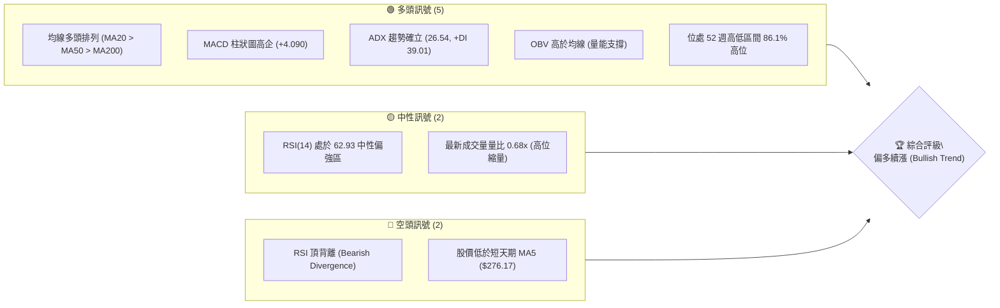
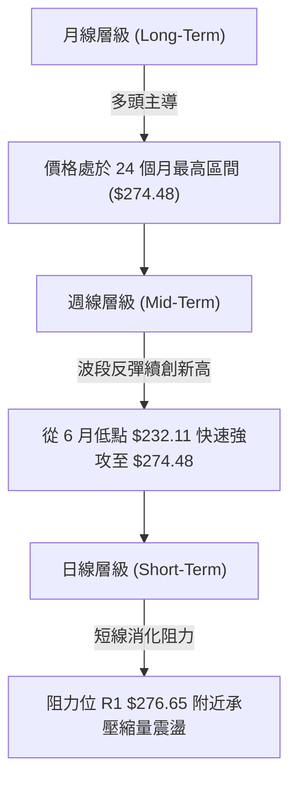
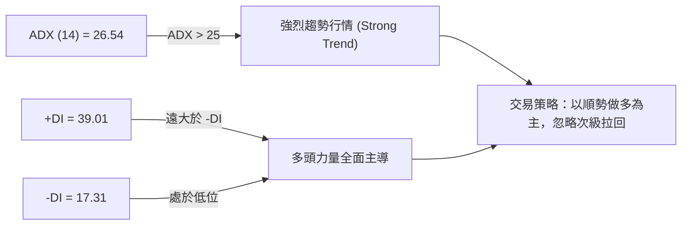
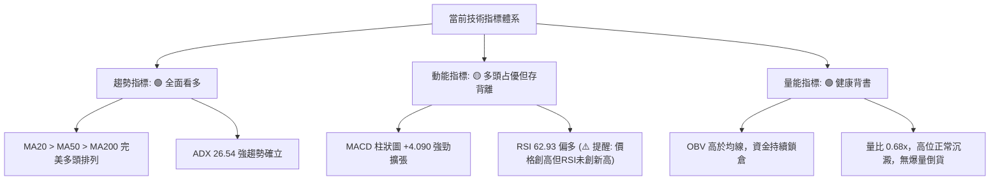
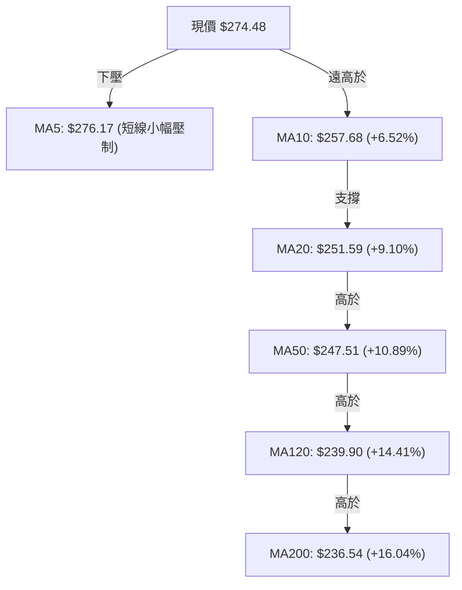
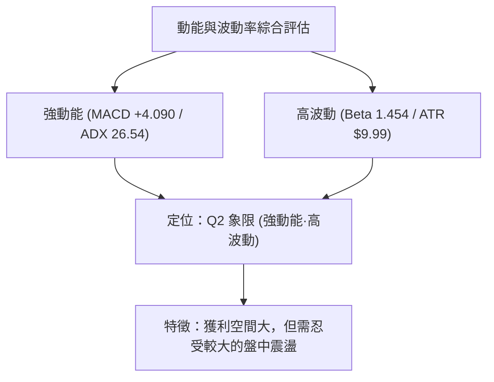
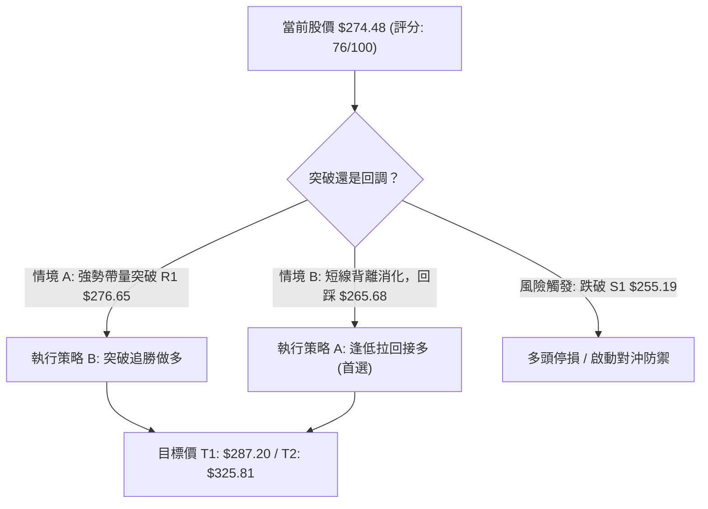
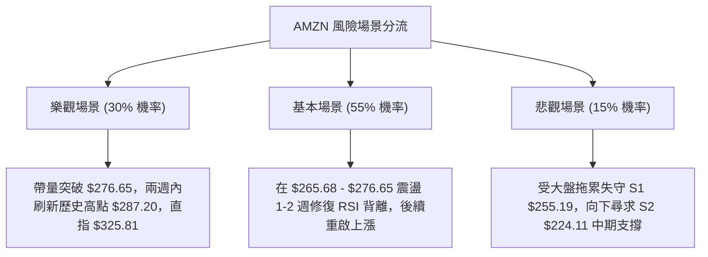

# AMZN 技術分析報告

> **報告日期**：2026-08-08 ｜ **語言**：繁體中文 ｜ **數據來源**：Yahoo Finance ｜ **當前價格**：$274.48

---

## 目錄

| 章節 | 內容 |
|------|------|
| [1. 技術面概覽](#1-技術面概覽) | 訊號儀表板、核心指標、評分卡 |
| [2. 趨勢分析](#2-趨勢分析) | 多時框趨勢、長中短期走勢 |
| [3. 圖表形態分析](#3-圖表形態分析) | 形態識別、K線組合、目標價 |
| [4. 支撐與阻力](#4-支撐與阻力) | 關鍵價位、斐波那契回調 |
| [5. 技術指標深度解讀](#5-技術指標深度解讀) | MA/RSI/MACD/布林/成交量 |
| [6. 動能與波動率](#6-動能與波動率) | 動能評估、ATR、Beta |
| [7. 多時框架總結](#7-多時框架總結) | 時框架評分矩陣 |
| [8. 交易策略建議](#8-交易策略建議) | 多空策略、風險報酬比 |
| [9. 風險提示與監控](#9-風險提示與監控) | 監控指標、風險場景 |

---

## 1. 技術面概覽

### 🎯 技術訊號儀表板



### 📊 核心指標速覽表

| 指標類別 | 指標名稱 | 當前數值 | 訊號 | 解讀 |
|----------|----------|----------|------|------|
| **價格** | 當前價格 | $274.48 | 🟢 多頭 | 緊鄰一年歷史高點區間（86.1% 位置） |
| **均線** | MA20 | $251.59 | 🟢 多頭 | 股價位於 MA20 上方 (+9.10%)，提供短線支撐 |
| **均線** | MA50 | $247.51 | 🟢 多頭 | 股價位於 MA50 上方，生命線強勢向上 |
| **均線** | MA200 | $236.54 | 🟢 多頭 | 長期牛熊分界線穩定上揚，多頭排列完整 |
| **動能** | RSI(14) | 62.93 | 🟡 中性 | 強勢區震盪，未達超買（>70），但存頂背離 |
| **動能** | MACD | +7.583 / Hist +4.090 | 🟢 多頭 | 快慢線雙雙位於零軸上方且柱體擴張 |
| **波動** | ATR(14) | $9.99 (3.64%) | 🟡 中性 | 每日波幅適中，提供合理的止損設置空間 |
| **量能** | OBV / 量比 | OBV > MA / 0.68x | 🟢 多頭 | 長期資金未離場，短線高位呈現觀望縮量 |

### 🏆 技術評分卡

```
╔══════════════════════════════════════════════════════════════╗
║              技術評分卡 — AMZN (2026-08-08)                  ║
╠══════════════════════════════════════════════════════════════╣
║ 趨勢強度      ████████████████░░░░  82/100  🟢 強勢趨勢      ║
║ 動能指標      ██████████████░░░░░░  70/100  🟢 動能充沛      ║
║ 支撐穩定度    ███████████████░░░░░  78/100  🟢 結構穩固      ║
║ 成交量配合    ████████████░░░░░░░░  62/100  🟡 縮量整理      ║
║ 形態完整度    ███████████████░░░░░  75/100  🟢 多頭V型延伸   ║
║ 均線排列      ██████████████████░░  90/100  🟢 完美多頭      ║
╠══════════════════════════════════════════════════════════════╣
║ 綜合評分      ███████████████░░░░░  76/100  🟢 偏多續漲      ║
╚══════════════════════════════════════════════════════════════╝
```

---

## 2. 趨勢分析

### 🌐 多時框趨勢分析



### 📈 長期趨勢 — 12個月走勢圖（Unicode）

```
AMZN 月線走勢圖（2025-08 至 2026-08）
價格軸 ($)
$280 ┤                                                    ● $274.48 (現在)
$260 ┤                                              ●
$240 ┤                                  ●     ●  ●
$220 ┤  ●                 ●     ●    ●     ●
$200 ┤     ●  ●  ●     ●
$180 ┤              ●
     └──────────────────────────────────────────────────────────
       08 09 10 11 12 01 02 03 04 05 06 07 08
       (2025)                           (2026)
```

**走勢特徵分析表格**：

| 階段 | 時間區間 | 價格變動區間 | 漲跌幅 | 走勢特徵與技術驅動 |
|------|----------|--------------|--------|--------------------|
| **1. 底部築底** | 2025-03 ~ 2025-04 | $190.26 → $184.42 | -3.07% | 觸及年度低點，成交量收縮，形成中期大底 |
| **2. 初段回升** | 2025-05 ~ 2025-10 | $205.01 → $244.22 | +19.13% | 突破 MA50，成交量放大，震盪走高 |
| **3. 高位箱體** | 2025-11 ~ 2026-03 | $233.22 → $208.27 | -10.70% | 獲利回吐，回測 200 日均線附近尋求支撐 |
| **4. 強力拉升** | 2026-04 ~ 2026-05 | $265.06 → $270.64 | +29.95% | 業績與利好驅動，突破歷史高點區間 |
| **5. 快速洗盤** | 2026-06 ~ 2026-07 | $238.34 → $232.11 | -2.61% | 回測 Fib 61.8% 支撐帶，形成雙重低點 |
| **6. 主升續漲** | 2026-07 ~ 2026-08 | $232.11 → $274.48 | +18.25% | 大陽線覆蓋，量能跟進，直指 52 週高點 $287.20 |

### 📊 中期趨勢（週線分析）

從最近 20 週的週線數據來看，AMZN 在 2026 年 6 月底於 $232.11（6月28日週收盤）完成二次打底後，7 月底（8月2日週）暴發出一根成交量高達 355.37M 的長紅 K 線，一口氣由 $232.11 飆升至 $271.58，單週漲幅逾 17%。目前週線 MACD 柱狀圖由負轉正（+4.090），RSI 站回 62.93，確立了中期多頭主攻浪的展開。

```
週線支撐與壓力結構示意圖：
$287.20 ────────────────────────────────────────── 52週歷史高點 (天花板)
$276.65 ───[目前突破測試區]─────────────────────── 關鍵波段高點阻力 R1
$274.48 ◄═══ 現價位置 (多頭主控)
$265.68 ────────────────────────────────────────── Fib 23.6% 短期強弱分界
$255.19 ────────────────────────────────────────── 關鍵波段低點支撐 S1
```

### ⚡ 趨勢強度評估（ADX 解讀）



*   **ADX 數值**：26.54。大於 25 的關鍵分界線，表明市場已脫離無方向的盤整階段，進入明確的**單邊趨勢行情**。
*   **方向指標**：+DI（39.01）極大地壓制了 -DI（17.31），多空力量差距懸殊，表明買盤具有絕對控制權。

---

## 3. 圖表形態分析

### 🔍 形態識別系統

根據近一年與近 20 週的價格軌跡，AMZN 目前顯現出兩個經典的圖表形態：**大級別 V 型反轉再突破**與**高位上升旗形（Ascending Flag）**。

| 形態名稱 | 信心度 | 判斷依據（引用數據） | 完成度 | 目標價（附計算式） |
|----------|--------|----------------------|--------|--------------------|
| **V型雙底築底** | 80% | 6月低點 $238.55 與 7月低點 $232.11 形成雙底，隨後帶量突破 $255 頸線 | 90% | 頸線 $255.19 + (頸線 $255.19 - 低點 $232.11) = **$278.27** (已接近達成) |
| **高位上升旗形** | 65% | 7月末爆量強攻至 $271.58（旗桿），近兩週於 $271–$276 高位窄幅消化（旗面） | 70% | 突破 R1 $276.65 後：旗桿高度 ($274.48 - $232.11 = $42.37) + $276.65 = **$319.02** |

### 🕯️ 重要K線形態分析

| 日期/月份 | 收盤價 | K線形態 | 技術特徵解讀 | 訊號 |
|-----------|--------|---------|--------------|------|
| 2026-06-28 | $232.69 | 長下影錘子線 | 巨量（5.25億股）測試 S2/S3 支撐區，主力插針洗盤沉澱籌碼 | 🟢 底訊號 |
| 2026-08-02 | $271.58 | 大陽突破線 | 週成交量爆出 3.55 億股，實體覆蓋前 5 週 K 線，確認扭轉跌勢 | 🟢 強看多 |
| 2026-08-09 | $274.48 | 高位十字星/小陽 | 股價推升至 $274.48，成交量縮至 2.70 億股，呈現突破前的蓄勢整理 | 🟡 觀望/看多 |

### 📉 ASCII 走勢形態示意圖

```
AMZN 高位旗形突破示意圖
===================================================================
$287.20 ┤                                           [52W High]
$276.65 ┤                             ┌───┐  ◄─ R1 阻力線
$274.48 ┤                        /───/   │  ◄─ 現價 ($274.48 旗面整理)
$265.68 ┤                       /   └───┘   ◄─ 旗形下軌 / Fib 23.6%
$255.19 ┤                  /───/            ◄─ 頸線 / S1 支撐
$232.11 ┤        └───┐    /                 ◄─ 雙底低點 (旗桿起點)
        └────────────┴───┴─────────────────────────────────
                     6月  7月  8月
===================================================================
```

### 🎯 形態目標價計算

1.  **V型雙底形態測算目標價**：
    $$\text{低點} = 232.11, \quad \text{頸線} = 255.19$$
    $$\text{形態高度} = 255.19 - 232.11 = 23.08$$
    $$\text{第一最小目標價} = 255.19 + 23.08 = \mathbf{\$278.27}$$
2.  **上升旗形突破測算目標價**：
    $$\text{旗桿起點} = 232.11, \quad \text{旗桿頂點} = 274.48, \quad \text{旗桿高度} = 42.37$$
    $$\text{突破 R1（\$276.65）後延伸目標價} = 276.65 + 42.37 = \mathbf{\$319.02}$$

---

## 4. 支撐與阻力

### 🗺️ 關鍵價位分布圖（Unicode）

```
AMZN 價位結構分布圖
═══════════════════════════════════════════════════════════════════
$287.20 ║████████████████████████████████████████    ║ 52週歷史高點
$276.65 ║████████████████████████████                ║ 關鍵阻力 R1 (+0.79%)
$274.48 ╠════════════════════════════════════════════╣ ◄ 當前價格
$265.68 ║▓▓▓▓▓▓▓▓▓▓▓▓▓▓▓▓▓▓▓▓▓▓▓▓                    ║ Fib 23.6% 首要防線
$255.19 ║████████████████████                        ║ 強力支撐 S1 (-7.03%)
$252.36 ║▓▓▓▓▓▓▓▓▓▓▓▓▓▓▓▓                            ║ Fib 38.2% / MA20 密集群
$224.11 ║████████████                                ║ 結構支撐 S2 (-18.35%)
$215.82 ║████████                                    ║ 鐵板支撐 S3 (-21.37%)
═══════════════════════════════════════════════════════════════════
```

### 🚧 阻力位分析表

| 阻力級別 | 價位 | 形成原因（嚴格引用數據） | 突破難度 | 重要性 |
|----------|------|--------------------------|----------|--------|
| **R1** | **$276.65** | 近一年波段高點聚類位，距離現價僅 +0.79% | 🟡 中等 | 短線多頭臨門一腳，突破即解鎖歷史新高挑戰 |
| **52W High** | **$287.20** | 52 週最高價與布林通道上軌（$287.33）交會處 | 🔴 極高 | 歷史解套盤與獲利結算壓力區，心理極限關卡 |

### 🛡️ 支撐位分析表

| 支撐級別 | 價位 | 形成原因（嚴格引用數據） | 守住機率 | 重要性 |
|----------|------|--------------------------|----------|--------|
| **S1** | **$255.19** | 近一年波段低點聚類位，距現價 -7.03% | 🟢 85% | 中短期多空分界線，靠近 MA20/MA50 均線集結帶 |
| **S2** | **$224.11** | 近一年深層波段低點聚類位，距現價 -18.35% | 🟢 95% | 中長線中期防禦底線 |
| **S3** | **$215.82** | 波段防守極限，與布林下軌（$215.86）完全重合 | 🟢 98% | 長線多頭生死線，若失守宣告中期牛市結束 |

### 📐 斐波那契回調位分析

依據 52 週高低點區間（高點 **$287.20**，低點 **$196.00**，波幅 $91.20）計算：

| 斐波那契比例 | 精確價位 | 技術含義與當前關聯 |
|--------------|----------|--------------------|
| **0.0%** | **$287.20** | 52 週最高點 (天花板) |
| **23.6%** | **$265.68** | **首要回調支撐**：現價（$274.48）位於 0.0% 與 23.6% 之間，屬強勢整理區 |
| **38.2%** | **$252.36** | **黃金支撐區**：與 MA20（$251.59）及 S1（$255.19）高度疊加，支撐力道極強 |
| **50.0%** | **$241.60** | 中性回調位：與 MA120（$239.90）呼應 |
| **61.8%** | **$230.84** | 關鍵多空打底位：7月底低點 $232.11 成功在此精準止跌 |
| **78.6%** | **$215.52** | 深層回調位：與 S3（$215.82）及布林下軌（$215.86）共振 |
| **100.0%** | **$196.00** | 52 週最低點 (地板) |

---

## 5. 技術指標深度解讀

### 🎛️ 指標訊號總覽



### 📈 移動平均線排列分析



*   **排列結構**：呈現典型的「多頭發散排列」（Bullish Alignment）。MA20 ($251.59) > MA50 ($247.51) > MA200 ($236.54)，價格在所有中長期均線之上，長線牛市格局非常明確。
*   **短線乖離率**：目前價格與 MA200 乖離率為 +16.04%，雖然略顯偏高，但鑑於 ADX 高達 26.54，強趨勢下股價有能力維持高乖離橫盤，以時間換取空間。

### 📉 RSI(14) 分析

*   **當前數值**：**62.93**（進度條：█████████████░░░░░░░ 63%）
*   **區間狀態**：處於 50–70 的多頭控盤區，未進入 >70 的極端超買區，顯示上漲空間未被耗盡。
*   **背離分析（⚠️ 關鍵警訊）**：
    *   2026 年 4 月週線高點時 RSI 曾達到 **97.5** 的極端高位。
    *   當前價格重返 **$274.48**（已逼近 4 月高點區域），但 RSI 僅為 **62.93**。
    *   **結論**：RSI 存在明確的**頂背離（Bearish Divergence）**。這暗示直接爆發式突破 $287.20 的動能有所削弱， short-term 更有可能先進行高位震盪或小幅回踩（如回測 $265.68）以修復背離，再行發力。

### 📊 MACD(12/26/9) 訊號解讀

*   **DIF (MACD Line)**：+7.583
*   **DEA (Signal Line)**：+3.492
*   **MACD Histogram**：**+4.090** 🟢
*   **解讀**：DIF 遠高於零軸且快速穿過 DEA，柱狀圖高達 +4.090，顯示多頭衝刺動能極為猛烈。與 RSI 的頂背離不同，MACD 未出現明顯背離，這證明本輪從 $232.11 的反彈是由實質买盤推升的急漲行情。

### 📦 布林通道分析

```
AMZN 布林通道相對位置示意圖 ($215.86 - $287.33)
===================================================================
BB 上軌: $287.33 ───────────────────────────────── (阻力區/52W High)
                 │  ● 現價 $274.48 (位於 BB %B = 0.82)
BB 中軌: $251.59 ───────────────────────────────── (MA20 核心強支撐)
BB 下軌: $215.86 ───────────────────────────────── (S3 超賣底線)
===================================================================
```

*   **通道狀態**：通道正在開口擴張，布林 %B 指標為 **0.82**，表明價格極度貼近上軌（$287.33）運行，屬於強勢的「沿上軌爬升」形態。

### 💹 成交量分析（量價配合度）

*   **最新成交量**：33,833,300 股
*   **20日均量**：50,060,620 股（量比：**0.68x**）
*   **OBV 指標狀態**：OBV > MA，總體維持高位昂首向上趨勢。
*   **量價背離評估**：最新單日成交量偏低（0.68x），主因是股價連漲後臨近前方阻力位 R1 ($276.65)，追高買盤趨於謹慎。然而，籌碼鎖定良好，並未出現高位放量下殺（倒貨）跡象，屬良性的高位無量休整。

---

## 6. 動能與波動率

### ⚡ 動能評估四象限

| 象限分類 | 定義特徵 | AMZN 當前狀態 | 交易含義 |
|----------|----------|---------------|----------|
| **Q1 (強動能 + 低波動)** | 穩健主升浪 | - | 最佳加碼點 |
| **Q2 (強動能 + 高波動)** | **主攻衝刺期** | **✓ AMZN 歸屬此區** | **高位偏多，順勢持股，防範洗盤** |
| **Q3 (弱動能 + 低波動)** | 沉悶盤整期 | - | 觀望為主 |
| **Q4 (弱動能 + 高波動)** | 築底/崩盤期 | - | 嚴禁做多 |



### 📊 ATR 波動率分析

*   **ATR(14)**：**$9.99**（佔當前股價 **3.64%**）
*   **日均波幅應用**：
    *   **短線日內波動區間**：$274.48 ± $9.99 $\rightarrow$ [$264.49, $284.47]
    *   **合理止損距離設置**：通常建議設置為 1.5x 至 2.0x ATR。
        $$\text{1.5x ATR} = 1.5 \times \$9.99 = \mathbf{\$14.99}$$
        $$\text{2.0x ATR} = 2.0 \times \$9.99 = \mathbf{\$19.98}$$

### 📐 Beta 與市場相關性

*   **Beta 係數**：**1.454**
*   **特徵分析**：高 Beta 屬性意味著 AMZN 的波動幅度比標普 500 指數高出 45.4%。在大盤上漲時，AMZN 具有顯著的超額收益（Alpha）彈性；但在市場回調時，亦承擔更高的下行風險。

---

## 7. 多時框架總結

### 📋 時框架評分表

| 時框架 | 趨勢方向 | 動能 (RSI/MACD) | 均線排列 | 形態結構 | 綜合評分 | 交易策略建議 |
|--------|----------|-----------------|----------|----------|----------|--------------|
| **月線 (Long)** | 🟢 強勢多頭 | 🟢 MACD 零軸上方 | 🟢 完美多頭 | 🟢 挑戰歷史高點 | **90/100** | 核心倉位長線鐵鎖不動 |
| **週線 (Mid)** | 🟢 主攻波段 | 🟢 柱體爆發 | 🟢 MA20/50 向上 | 🟢 上升旗形 | **82/100** | 逢拉回重疊支撐位做多 |
| **日線 (Short)**| 🟡 高位消化 | 🔴 RSI 頂背離 | 🟢 多頭排列 | 🟡 R1 阻力下震盪 | **68/100** | 不盲目追高，等待突破或回測 |

### 🔲 綜合訊號矩陣

```
┌──────────┬─────────────┬─────────────┬─────────────┐
│ 時框架   │   短線 (日) │   中線 (週) │   長線 (月) │
├──────────┼─────────────┼─────────────┼─────────────┤
│ 趨勢方向 │  🟡 震盪偏多│  🟢 買盤控盤│  🟢 巨浪主升│
│ 動能狀態 │  🔴 背離提醒│  🟢 動能充沛│  🟢 強勢無虞│
│ 成交量能 │  🟡 高位縮量│  🟢 爆量帶動│  🟢 籌碼穩定│
└──────────┴─────────────┴─────────────┴─────────────┘
```

### ⚖️ 多時框收斂結論

依據多時框收斂規則（ADX = 26.54 > 25，屬於典型**強趨勢行情**）：
*   **主導原則**：必須以中長期（週線與 MA20/MA50）的多頭方向為主導，日線層級的 RSI 頂背離與高位縮量僅視為**短線回調或消化阻力的過程**，不可作為盲目建立大額空單的依據。
*   **最終收斂方向**：**🟢 偏多續漲（主趨勢看多，短線尋求回調加碼）**。第 8 章的交易策略將嚴格圍繞此結論展開。

---

## 8. 交易策略建議

### 🗺️ 策略決策流程圖



### 🧭 策略路由

**當前主策略方向 = 🟢 偏多做多（綜合評分 76/100 ≥ 60，嚴格依規主推多頭策略）**

### 🎯 價格情境階梯（Price Scenarios）

| 觸發條件 | 下一目標 | 後續延伸目標 | 情境含義與操作指引 |
|----------|----------|--------------|--------------------|
| **帶量突破 R1 $276.65** | 52W High **$287.20** | 分析師目標 **$325.81** | 強勢主升浪開啟，可加碼順勢追擊 |
| **守住現價與 $265.68 區間** | R1 **$276.65** | 52W High **$287.20** | 正常高位旗形整理，蓄勢待發 |
| **跌破 S1 $255.19** | S2 **$224.11** | S3 **$215.82** | 中期多頭結構轉弱，觸發防守機制 |

### 📊 情境機率分佈

| 情境 | 機率 | 主要技術依據 |
|------|------|--------------|
| **1. 蓄勢突破 / 偏多續漲** | **60%** | ADX 26.54 強趨勢、均線完美多頭排列、MACD 高位擴張、OBV 支撐 |
| **2. 區間高位震盪 ($265–$276)** | **25%** | RSI 頂背離需要時間修正、短線量比 0.68x 追價意願受限 |
| **3. 深度回落測試 S1 ($255.19)** | **15%** | 美股大盤系統性修正，拉回測試 MA20 支撐 |

### 🟢 主策略詳情

#### 策略 A：逢低拉回買進（首選策略，風險報酬比優）

*   **進場條件**：股價回踩至 Fib 23.6% 支撐帶，出現日線級別止跌訊號（如縮量十字星或下影線）。
*   **進場價格**：**$265.68**（Fib 23.6% 支撐位）
*   **目標價 T1**：**$287.20**（52 週歷史高點，獲利空間 +$21.52 / +8.10%）
*   **目標價 T2**：**$325.81**（分析師共識目標價，獲利空間 +$60.13 / +22.63%）
*   **止損價格**：**$251.59**（跌破 MA20 及 Fib 38.2% 支撐帶，風險空間 -$14.09 / -5.30%）
*   **風險報酬比 (R:R)**：
    $$\text{T1 意向 R:R} = \frac{287.20 - 265.68}{265.68 - 251.59} = \frac{21.52}{14.09} = \mathbf{1.53 : 1}$$
    $$\text{T2 意向 R:R} = \frac{325.81 - 265.68}{265.68 - 251.59} = \frac{60.13}{14.09} = \mathbf{4.27 : 1}$$
*   **成功機率**：65%
*   **建議倉位**：15% – 20% 總資金

#### 策略 B：突破高位追勝（順勢加碼策略）

*   **進場條件**：日線收盤價強勢突破阻力位 R1（$276.65），且當天成交量大於 20 日均量（>50.06M 股）。
*   **進場價格**：**$277.00**（確認突破 R1 後）
*   **目標價 T1**：**$287.20**（52 週高點）
*   **目標價 T2**：**$325.81**（分析師共識目標價）
*   **止損價格**：**$265.68**（假突破防守點，退回 Fib 23.6% 下方，風險空間 -$11.32 / -4.09%）
*   **風險報酬比 (R:R)**：
    $$\text{T2 意向 R:R} = \frac{325.81 - 277.00}{277.00 - 265.68} = \frac{48.81}{11.32} = \mathbf{4.31 : 1}$$
*   **成功機率**：60%
*   **建议倉位**：10% – 15% 總資金

### 🔴 反向風險觸發點（對沖提示）

若 AMZN 無法維持在 $265.68 之上，並帶量跌破關鍵支撐 **S1（$255.19）**，表明多頭攻勢全面衰竭，上升旗形形態失效。此時應全數平倉多頭頭寸，保守者可考慮建立部分 puts 對沖下行至 S2（$224.11）的風險。

### ⭐ 整體訊號強度評星

```
做多訊號強度：★★██☆  (4/5 星)  🟢 多頭占據絕對主導
做空訊號強度：★☆☆☆☆  (1/5 星)  🔴 逆勢做空風險極高
整體可信度：  ★★██☆  (4/5 星)  🟢 多時框數據收斂一致
```

---

## 9. 風險提示與監控

### ✅ 關鍵監控指標 Checklist

```
╔══════════════════════════════════════════════════════════════╗
║                AMZN 每日/每週技術面監控清單                  ║
╠══════════════════════════════════════════════════════════════╣
║ [ ] 阻力突破：收盤價是否站上 R1 $276.65 且成交量 > 50M       ║
║ [ ] RSI 動能：RSI(14) 能否突破 70 消除頂背離疑慮             ║
║ [ ] 均線防守：MA20 ($251.59) 支撐是否完好未被實體陰線穿破     ║
║ [ ] 止損執行：價格若觸及 $251.59 必須無條件執行停損          ║
║ [ ] 大盤 Beta：標普 500 指數是否出現系統性大跌拉低高 Beta 股  ║
╚══════════════════════════════════════════════════════════════╝
```

### ⚠️ 風險場景分析



### 🛡️ 風險管理重要提醒

1.  **波動率控管（ATR 應用）**：AMZN 的 ATR 為 $9.99，單日 3.64% 的波動屬於正常範圍。切忌將止損設定過窄（如小於 1x ATR / $10），否則極易在正常盤中噪音震盪中被掃出場。
2.  **倉位管理**：鑑於當前股價接近歷史高點區間且存在 RSI 背離，建議採取**分批建倉**策略（如策略 A 先建立 50% 底倉，突破 R1 確認後再加碼 50%），總持倉比例不宜超過投資組合總資金的 20%。

---

## 📋 報告總結

```
╔══════════════════════════════════════════════════════════════╗
║               AMZN 技術分析報告總結 (2026-08-08)             ║
╠══════════════════════════════════════════════════════════════╣
║ 當前價格：$274.48          綜合評分：76/100 (🟢 偏多續漲)      ║
║ 52週區間：$196.00 - $287.20  分析師目標均價：$325.81         ║
╠══════════════════════════════════════════════════════════════╣
║ 關鍵結論：                                                   ║
║ ├─ 長期趨勢：🟢 完美多頭排列，巨浪主升結構完整               ║
║ ├─ 中期趨勢：🟢 週線爆量長紅，上升旗形蓄勢待發               ║
║ ├─ 短期趨勢：🟡 阻力位 R1 $276.65 附近消化 RSI 頂背離        ║
║ ├─ 關鍵支撐：S1 $255.19 / Fib 23.6% $265.68                  ║
║ └─ 關鍵阻力：R1 $276.65 / 52W High $287.20                   ║
╠══════════════════════════════════════════════════════════════╣
║ 最優策略組合：                                               ║
║ 1. 🥇 最佳機會：策略 A (逢低拉回 $265.68 建倉，風報比 4.27)  ║
║ 2. 🥈 次選機會：策略 B (帶量突破 $276.65 追勝，風報比 4.31)  ║
║ 3. 🥉 風險防線：跌破 S1 $255.19 嚴格執行多頭停損             ║
╚══════════════════════════════════════════════════════════════╝
```

---

> ⚠️ **免責聲明**：本報告為 AI 自動生成之技術分析，所有數據及估算均基於提供的歷史價格資訊。本報告**僅供研究與學術參考**，**不構成任何投資建議**。投資有風險，入市需謹慎。

---

*報告生成時間：2026-08-08 ｜ 數據來源：Yahoo Finance ｜ 分析框架：多時框技術分析*