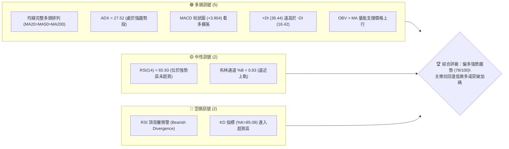
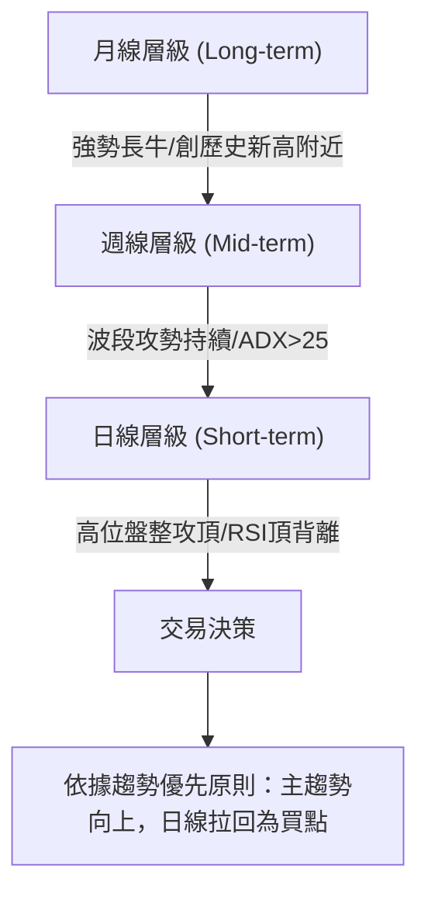
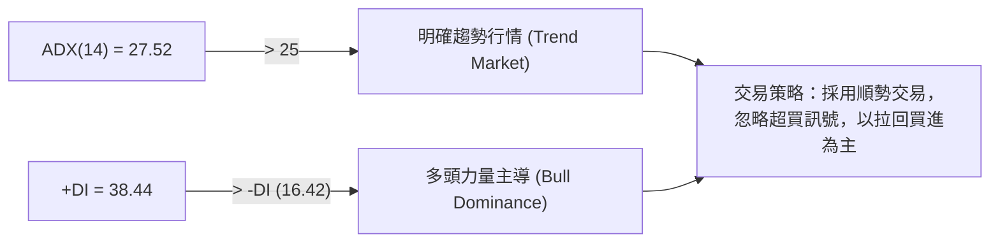
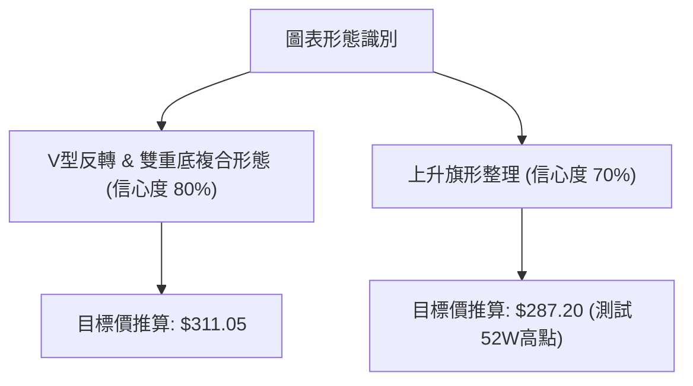
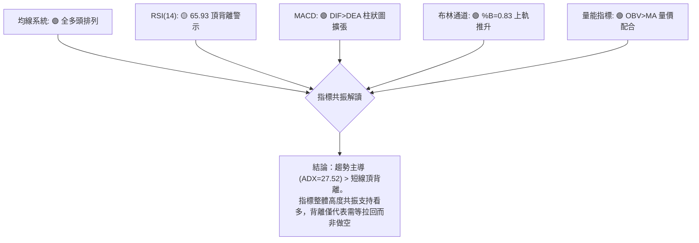
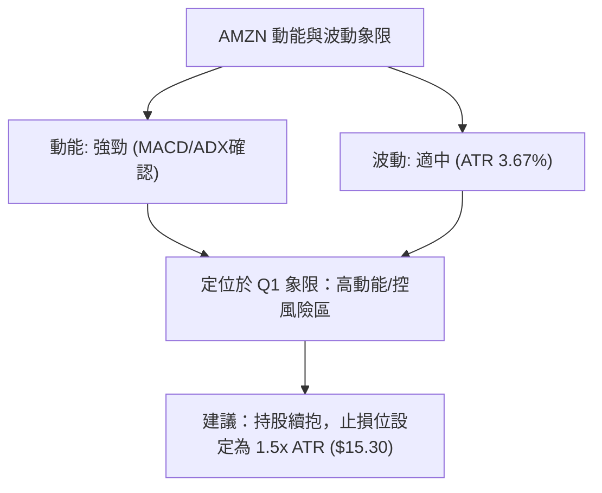
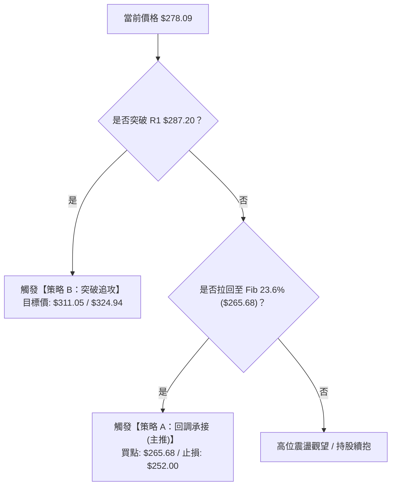
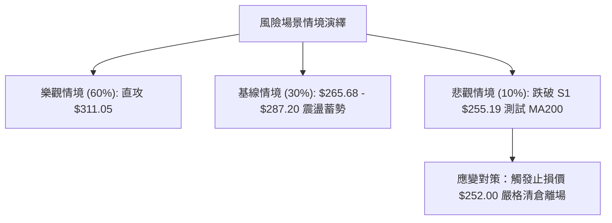

# AMZN 技術分析報告

> **報告日期**：2026-08-10 ｜ **語言**：繁體中文 ｜ **數據來源**：Yahoo Finance ｜ **當前價格**：$278.09

---

## 目錄

| 章節 | 內容 |
|------|------|
| [1. 技術面概覽](#1-技術面概覽) | 訊號儀表板、核心指標、評分卡 |
| [2. 趨勢分析](#2-趨勢分析) | 多時框趨勢、長中短期走勢 |
| [3. 圖表形態分析](#3-圖表形態分析) | 形態識別、K線組合、目標價 |
| [4. 支撐與阻力](#4-支撐與阻力) | 關鍵價位、斐波那契回調 |
| [5. 技術指標深度解讀](#5-技術指標深度解讀) | MA/RSI/MACD/布林/成交量 |
| [6. 動能與波動率](#6-動能與波動率) | 動能評估、ATR、Beta |
| [7. 多時框架總結](#7-多時框架總結) | 時框架評分矩陣 |
| [8. 交易策略建議](#8-交易策略建議) | 多空策略、風險報酬比 |
| [9. 風險提示與監控](#9-風險提示與監控) | 監控指標、風險場景 |

---

## 1. 技術面概覽

### 🎯 技術訊號儀表板



### 📊 核心指標速覽表

| 指標類別 | 指標名稱 | 當前數值 | 訊號 | 解讀 |
|----------|----------|----------|------|------|
| **價格** | 當前價格 | $278.09 | 🟢 多頭 | 距 52 週高點 $287.20 僅差 3.28%，位於 52 週區間 90.0% 高位 |
| **均線** | MA20 | $253.13 | 🟢 多頭 | 價格位於 MA20 上方 +9.86%，短線支撐極為強勁 |
| **均線** | MA50 | $247.59 | 🟢 多頭 | 中期生命線向上傾斜，多頭防線穩固 |
| **均線** | MA200 | $236.82 | 🟢 多頭 | 長線牛熊分界線穩定上升，奠定長牛基調 |
| **動能** | RSI(14) | 65.93 | 🟡 警告 | 處於強勢區間，惟需注意潛在頂背離現象 |
| **動能** | MACD | 8.373 | 🟢 多頭 | DIF > Signal (4.469)，柱狀圖 +3.904 持續擴張 |
| **動能** | ADX(14) | 27.52 | 🟢 多頭 | ADX > 25 且 +DI (38.44) 遠高於 -DI (16.42)，強趨勢展現 |
| **波動** | ATR(14) | $10.20 | 🟡 中性 | 日波幅約 3.67%，提供適當交易空間與止損設定依據 |

### 🏆 技術評分卡

```
╔══════════════════════════════════════════════════════════════════╗
║                   技術評分卡 — AMZN (2026-08-10)                 ║
╠══════════════════════════════════════════════════════════════════╣
║ 趨勢強度      ████████████████░░░░  80/100  🟢 強勢趨勢 (ADX=27.52) ║
║ 動能指標      ██████████████░░░░░░  70/100  🟡 MACD強但RSI頂背離     ║
║ 支撐穩定度    █████████████████░░░  85/100  🟢 S1/Fib重疊區支撐強    ║
║ 成交量配合    █████████████░░░░░░░  65/100  🟡 攻高量能略縮，OBV仍多  ║
║ 形態完整度    ████████████████░░░░  80/100  🟢 多頭旗形/波段攻勢完整 ║
║ 均線排列      ████████████████████  100/100 🟢 標準多頭排列 (20>50>200)║
╠══════════════════════════════════════════════════════════════════╣
║ 綜合評分      ███████████████░░░░░  78/100  🟢 偏多強勢 (Bullish)   ║
╚══════════════════════════════════════════════════════════════════╝
```

---

## 2. 趨勢分析

### 🌐 多時框趨勢分析



### 📈 長期趨勢 — 24個月歷史走勢圖

```
AMZN 24個月月線歷史走勢圖 (2024-08 至 2026-08)
價格軸 ($)
$290 ┤                                                    ● $278.09
$270 ┤                                                ●
$250 ┤                                      ●     ●
$230 ┤                      ●         ●  ●  ●  ●
$210 ┤            ●     ●      ●   ●
$190 ┤      ●  ●     ●            ●
$170 ┤●
     └─┬──┬──┬──┬──┬──┬──┬──┬──┬──┬──┬──┬──┬──┬──┬──┬──┬──┬──┬──┬──┬──┬──┬──
       08 09 10 11 12 01 02 03 04 05 06 07 08 09 10 11 12 01 02 03 04 05 06 07 08
       2024                               2025                               2026
```

#### 月線走勢特徵分析：

| 階段區間 | 起始/結束價 | 階段漲跌幅 | 走勢形態與關鍵特徵 |
|----------|-------------|------------|--------------------|
| **2024/08 - 2025/01** | $178.50 → $237.68 | +33.15% | 強勢主升段，穩步推升創高 |
| **2025/02 - 2025/04** | $237.68 → $184.42 | -22.41% | 中期健康回調，探底 $184.42 後獲得強支撐 |
| **2025/05 - 2025/10** | $205.01 → $244.22 | +19.13% | 突破前高攻勢，多頭重掌發言權 |
| **2025/11 - 2026-03** | $233.22 → $208.27 | -10.70% | 築底箱型整理，低點於 $196.00 (52W Low) 止跌 |
| **2026/04 - 2026/08** | $265.06 → $278.09 | +4.92% (波段高$287.20) | 強勢噴發破頂，目前於歷史高點 $287.20 攻防 |

### 📊 中期趨勢（近 20 週週線分析）

```
週線支撐阻力結構示意圖
$287.20 ─────── Resistance R1 (52週高點 / 歷史強阻力) ─────────────────────
$278.09 ─────── [現價] 近兩週（08/02-08/16）連續大陽線強攻
$265.68 ─────── Fib 23.6% 回調位
$255.19 ─────── Support S1 (7月拉回低點與週線防線) ────────────────────────
$232.11 ─────── 7月下旬波段底點 (強烈打腳位置)
```

1. **攻勢重啟**：在 2026 年 6 月底至 7 月底經過拉回打腳（最低觸及 $232.11）後，8 月首週強勁拉出大陽線（收 $271.58，成交量放大至 3.55 億股），一舉吞噬前期陰線。
2. **結構良好**：週線 MACD 柱狀圖在 8 月初重新翻紅放大（+4.090），顯示中期調整結束，新一輪波段推升展開。

### ⚡ 趨勢強度評估（ADX 解讀）



*   **ADX 強度分級**：當前 ADX 為 **27.52**（>25），確定股票處於強烈的**單邊趨勢行情**中，非無序盤整行情。
*   **多空力量對比**：+DI（38.44）遠高於 -DI（16.42），差距達 22.02 個絕對點位，證明買方佔據絕對壓倒性優勢。

---

## 3. 圖表形態分析

### 🔍 形態識別系統



#### 形態信心度評估表：

| 形態名稱 | 信心度 | 判斷依據（引用數據） | 完成度 | 目標價（附計算式） |
|----------|--------|----------------------|--------|--------------------|
| **雙重底 / V型復甦** | **80%** | 6月低點 $238.34 與 7月低點 $232.11 形成雙底打腳，8月強勢突破頸線 $271.58 | **95%** | 頸線 $271.58 + 形態高度 ($271.58 - $232.11 = $39.47) = **$311.05** |
| **上升旗形** | **70%** | 4-5月飆漲後於6-7月形成下傾旗面整理，8月初以巨量突破旗頭 $271.58 | **90%** | 由突破點推算：第一目標 **$287.20**（歷史高點），第二目標 **$311.05** |

### 🕯️ 重要 K 線形態分析

| 日期/週 | 收盤價 | K 線形態 | 技術解讀 | 訊號強度 |
|---------|--------|----------|----------|----------|
| **2026-06-28** | $232.69 | 爆量長下影線 | 週成交量爆出 5.25 億股天量，低點湧入強烈承接買盤 | 🟢 強烈買進 |
| **2026-07-26** | $232.11 | 二度測底成功 | 價回縮量二次試探 S2/S3 區域，確認底部位階 | 🟢 底部確認 |
| **2026-08-02** | $271.58 | 長紅穿雲箭 | 爆量 3.55 億股收復失地，一舉突破 MA20/MA50 | 🟢🟢 極強攻擊 |
| **2026-08-16** | $278.09 | 攻高小陽線 | 沿日線布林上軌持續向上推升，展現多頭控盤 | 🟢 順勢推進 |

### 📉 ASCII 形態結構示意圖

```
AMZN 日/週線突破雙重底形態示意圖
$311.05 ┤                                                  [形態推算目標價]
$287.20 ┤                                        ┌─── R1 (52W High 壓力)
$278.09 ┤                                  ● [現價]
$271.58 ┤                     ● (頸線突破點) ─── 突破確立
        ┤                    / \
$247.59 ┤       ●           /   \   ●  <-- MA50 ($247.59)
$232.11 ┤────────\─────────/─────\─/───── Support S2 區域
                  ● (底部1)       ● (底部2)
```

---

## 4. 支撐與阻力

### 🗺️ 關鍵價位分布圖

```
AMZN 價位結構分布圖 (由 OHLCV 實測數據導出)
═══════════════════════════════════════════════════════════════════
$287.20 ║████████████████████████████████████████║ 強阻力 R1 (52W High)
$278.09 ╠════════════════════════════════════════╣ ◄ 當前價格 ($278.09)
$265.68 ║▓▓▓▓▓▓▓▓▓▓▓▓▓▓▓▓▓▓▓▓▓▓▓▓                ║ 斐波那契 23.6% 回調位
$255.19 ║████████████████████████                ║ 近期關鍵支撐 S1 (MA20 $253 鄰近)
$241.60 ║▓▓▓▓▓▓▓▓▓▓▓▓▓▓▓▓                        ║ 斐波那契 50.0% 中樞位
$224.11 ║████████████████                        ║ 強支撐 S2 (中期波段低點聚類)
$215.82 ║████████████                            ║ 鐵板支撐 S3 (BB下軌/Fib 78.6%)
═══════════════════════════════════════════════════════════════════
```

### 🚧 阻力位分析表

| 阻力級別 | 精確價位 | 形成原因與數據來源 | 突破難度 | 重要性 |
|----------|----------|--------------------|----------|--------|
| **R1** | **$287.20** | 52 週最高價聚類區（距現價 +3.28%） | 🔴 高 | **極高**。突破即創歷史新高，將開啟無套牢盤的真空上升段 |

### 🛡️ 支撐位分析表

| 支撐級別 | 精確價位 | 形成原因與數據來源 | 守住機率 | 重要性 |
|----------|----------|--------------------|----------|--------|
| **S1** | **$255.19** | 近一年波段低點聚類（距現價 -8.23%），重疊 MA20 ($253.13) | 85% | **高**。短線多頭第一防線，拉回不破視為極佳買點 |
| **S2** | **$224.11** | 近一年中期波段低點聚類（距現價 -19.41%） | 92% | **極高**。中期多空分界線 |
| **S3** | **$215.82** | 波段防禦極限（距現價 -22.39%），重疊布林下軌 $215.57 | 98% | **鐵板**。長線極限買點 |

### 📐 斐波那契回調位分析

以 52 週區間高點 **$287.20** 至低點 **$196.00** 進行斐波那契繪算：

| 回調比例 | 精確價位 | 現價相對位置與技術意義 |
|----------|----------|------------------------|
| **0.0%** | **$287.20** | 52 週高點 (波段頂部阻力 R1) |
| **23.6%** | **$265.68** | **現價 ($278.09) 位於 0.0% 至 23.6% 超強勢區間**。拉回至 $265.68 為第一首選支撐 |
| **38.2%** | **$252.36** | 強烈重疊 MA20 ($253.13) 與 S1 ($255.19)，為「強支撐黃金交叉區」 |
| **50.0%** | **$241.60** | 多空強弱中樞，重疊 MA120 ($240.54) |
| **61.8%** | **$230.84** | 斐波那契黃金分割支撐，接近 7 月底低點 $232.11 |
| **78.6%** | **$215.52** | 重疊 S3 ($215.82) 與布林下軌 ($215.57) |
| **100.0%** | **$196.00** | 52 週低點 |

---

## 5. 技術指標深度解讀

### 🎛️ 指標訊號總覽



### 📈 移動平均線排列分析

```
均線多頭排列分布 (MA20 > MA50 > MA200)
$278.09 ── Current Price
$253.13 ── MA20 (▲ +9.86% 短期支撐)  ▓▓▓▓▓▓▓▓▓▓▓▓▓▓▓▓▓▓ 100%
$247.59 ── MA50 (▲ +12.32% 中期支撐) ▓▓▓▓▓▓▓▓▓▓▓▓▓▓▓░░ 85%
$236.82 ── MA200 (▲ +17.43% 長期鐵板)▓▓▓▓▓▓▓▓▓▓▓▓░░░░░ 70%
```

*   **均線狀態**：所有短中長期均線（MA5 $274.98、MA10 $262.35、MA20 $253.13、MA50 $247.59、MA120 $240.54、MA200 $236.82）呈現完美的**順序多頭發散排列**。
*   **均線偏離度**：價格高於 MA20 約 9.86%，技術上有向 MA20 乖離修正的需求，但均線向上角度陡峭，支撐力道強大。

### 📉 RSI(14) 與背離深度分析

```
RSI(14) 當前狀態：65.93 (強勢看多區間)
0              30                  50         65.93   70             100
├──────────────┼───────────────────┼────────────█─────┼──────────────┤
  超賣區 (Oversold)    中性區間        強勢攻勢區  ▲  超買區 (Overbought)

⚠️ 頂背離 (Bearish Divergence) 分析：
價格 (Price): 2026/05 高點 $270.64 ───> 2026/08 現價 $278.09 (創新高 ▲)
RSI (14):    2026/04 峰值 97.5    ───> 2026/08 當前 65.93  (未創新高 ▼)
```

*   **背離結論**：日/週線層級存在 **RSI 頂背離** 現象。然而，在 ADX > 25 的強趨勢行情中，頂背離通常**不代表趨勢反轉**，而是代表「上升動能邊際減緩」，行情更可能以「高位橫盤」或「小幅拉回（至 Fib 23.6% $265.68）」來消化背離。

### 📊 MACD(12/26/9) 訊號解讀

*   **DIF (MACD線)**：**8.373**
*   **DEA (Signal線)**：**4.469**
*   **MACD柱狀圖**：**+3.904** (🟢 處於強勁正值擴張期)
*   **解讀**：DIF 遠高於 Signal 線且差距拉大，柱狀圖自 8 月初 +1.213 急劇擴張至 +3.904，顯示買盤推升力道依然充沛，毫無轉折向下跡象。

### 📦 布林通道 (Bollinger Bands) 分析

```
布林通道架構 (20, 2.0)
$290.69 ────────────────────────────── BB Upper (上軌阻力)
$278.09 ─────────────── [現價 %B = 0.83]
$253.13 ────────────────────────────── BB Middle (MA20 中軌強支撐)
$215.57 ────────────────────────────── BB Lower (下軌極限)
```

*   **通道位置**：%B 達 **0.83**，價格貼近布林上軌（$290.69）運行，屬於典型「沿上軌強攻」的通道張口擴張形態。
*   **波動帶寬**：通道中軌位於 **$253.13**，若遭遇短線獲利回吐，中軌將提供第一波強勁護盤力道。

### 💹 成交量與 OBV 分析

*   **量能表現**：最新日成交量為 34,530,747 股，對比 20 日均量（50,055,352 股）量比約為 **0.69x**，呈現「高位量縮盤堅」特徵。
*   **OBV 能量潮**：OBV > MA，指標維持向上走勢。配合 8 月首週的 3.55 億股爆量突破，確認主力資金為淨流入，量能結構支持價格維持在高位。

---

## 6. 動能與波動率

### ⚡ 動能評估分析

| 評估維度 | 當前狀態 | 數據依據 | 技術評價 |
|----------|----------|----------|----------|
| **動能強度 (Momentum)** | **極強** | MACD 柱 +3.904 / +DI 38.44 | 🟢 強勁順勢攻勢 |
| **波動率 (Volatility)** | **中高** | ATR $10.20 (3.67%) / Beta 1.454 | 🟡 市場敏感度高 |
| **象限定位** | **Q1 (高動能 / 適中波動)** | 股價處於上升通道擴張期 | **最佳順勢交易環境** |



### 📊 ATR 波動率與止損設定

*   **ATR (14)**：**$10.20**（占當前股價 3.67%）。
*   **動態風控距離建議**：
    *   **緊密止損 (1.0 x ATR)**：$10.20 ➔ 止損設於現價下方 **$267.89**。
    *   **標準止損 (1.5 x ATR)**：$15.30 ➔ 止損設於 **$262.79**（臨近 MA10 $262.35）。
    *   **波段防守 (2.0 x ATR)**：$20.40 ➔ 止損設於 **$257.69**（守護 S1 $255.19 支撐區）。

### 📐 Beta 與市場相關性

*   **Beta 係數**：**1.454**。
*   **市場解讀**：AMZN 的波幅較標普 500 指數高出約 45.4%。在大盤多頭環境下，AMZN 將展現出極佳的超額收益（Alpha）攻勢；但若大盤出現系統性拉回， AMZN 回撤幅度亦會同步放大，需嚴格實施倉位控管。

---

## 7. 多時框架總結

### 📋 時框架評分表

| 時框架 | 趨勢方向 | 動能狀態 | 均線排列 | 圖表形態 | 綜合評分 | 交易建議 |
|--------|----------|----------|----------|----------|----------|----------|
| **月線 (Long)** | 🟢 偏多 | 🟢 強勁 | 🟢 多頭 | 波段創高攻勢 | **85/100** | 長線堅定持有 |
| **週線 (Mid)** | 🟢 偏多 | 🟢 MACD翻紅 | 🟢 多頭 | 雙底突破噴發 | **80/100** | 中線逢低加碼 |
| **日線 (Short)** | 🟡 橫盤/強勢 | 🟡 RSI頂背離 | 🟢 多頭 | 高位逼近 52W 高 | **70/100** | 短線不追高，等拉回 |

### 🔲 綜合訊號矩陣

```
╔══════════════════════════════════════════════════════════════════╗
║                   多時框訊號收斂矩陣 (Multi-Timeframe)           ║
╠══════════════════════════════════════════════════════════════════╣
║ 長期 (月線)  : 🟢 BULLISH (強烈看多)                              ║
║ 中期 (週線)  : 🟢 BULLISH (雙底突破發動)                          ║
║ 短期 (日線)  : 🟡 NEUTRAL-BULLISH (逼近 R1 $287.20 攻堅/震盪)     ║
╠══════════════════════════════════════════════════════════════════╣
║ 訊號收斂結論: **強烈多頭趨勢主導 (ADX=27.52 > 25)**               ║
║ 依多時框收斂規則：日線短線頂背離不改變中長期多頭格局，           ║
║ 操作應以「多頭策略」為主，日線震盪僅視為進場/加碼時機。           ║
╚══════════════════════════════════════════════════════════════════╝
```

---

## 8. 交易策略建議

### 🗺️ 策略決策流程圖



### 🧭 策略路由 (依綜合評分 78/100 分流)

*   **當前主策略方向**：**🟢 多頭主導策略 (Bullish Primary Strategy)**
*   **路由說明**：綜合評分為 78 分（≥60 分），多頭訊號占絕對優勢。交易應以「拉回買進 (Strategy A)」為最優先考量，「突破追攻 (Strategy B)」為次之，空頭僅做為風控對沖之參考，不推薦主動建立空單。

### 🎯 價格情境階梯 (Price Scenarios)

| 觸發條件 | 第一目標 | 第二目標 | 情境含義與操作指引 |
|----------|----------|----------|────────────────────|
| **突破阻力 R1 $287.20** | **$311.05** (形態目標) | **$324.94** (分析師共識均價) | **強勢噴發**：刷新歷史高點，進入無套牢區，開啟新一輪主升段 |
| **站穩現價區間 ($265.68 - $278.09)** | **$287.20** (試探 R1) | — | **高位消化**：利用橫盤消化日線 RSI 頂背離，蓄勢再攻 |
| **跌破支撐 S1 $255.19** | **$241.60** (Fib 50%) | **$224.11** (支撐 S2) | **中期修正**：多頭防線失守，轉為深幅箱型整理 |

### 📊 情境機率分佈

```
╔══════════════════════════════════════════════════════════════════╗
║                   三情境發生機率預估與依據                       ║
╠══════════════════════════════════════════════════════════════════╣
║ 1. 繼續上行突破 (攻克 $287.20) : ████████████░░░░  60%            ║
║    主要依據: MA多頭排列、MACD擴張、ADX=27.52強趨勢、OBV多頭       ║
║                                                                  ║
║ 2. 區間震盪消化 ($265 - $280)  : ██████░░░░░░░░░░  30%            ║
║    主要依據: RSI日線頂背離、52W高點 $287.20 心理壓力大           ║
║                                                                  ║
║ 3. 深幅回落探底 (跌破 $255.19) : ██░░░░░░░░░░░░░░  10%            ║
║    主要依據: 全球總體經濟極端利空衝擊 (目前技術面機率極低)        ║
╚══════════════════════════════════════════════════════════════════╝
```

### 🟢 主策略詳情

#### 策略 A：拉回逢低承接（主推策略 — 勝率高 / 風險報酬比優）

*   **進場條件**：價格順利拉回測試 **斐波那契 23.6% 回調位 $265.68** 至 **MA10 $262.35** 支撐區出現止跌 K 線。
*   **進場價格**：**$265.68**
*   **目標價 T1**：**$287.20**（52 週高點 R1，預期收益 +8.10%）
*   **目標價 T2**：**$311.05**（雙底形態推算目標，預期收益 +17.08%）
*   **止損價格**：**$252.00**（跌破 Fib 38.2% $252.36 與 S1 $255.19 防線，虧損 -5.15%）
*   **風險報酬比**：**( $287.20 - $265.68 ) / ( $265.68 - $252.00 ) = $21.52 / $13.68 = 1.57 : 1 (至 T1)**；**(至 T2 風報比為 3.32 : 1)**
*   **預估成功機率**：**70%**
*   **建議倉位**：**15% - 20%**

#### 策略 B：突破強勢追攻（次選策略 — 順應強烈動能）

*   **進場條件**：日線收盤價強勢帶量突破 **R1 $287.20**。
*   **進場價格**：**$287.50**
*   **目標價 T1**：**$311.05**（形態目標，預期收益 +8.19%）
*   **目標價 T2**：**$324.94**（華爾街分析師平均目標價，預期收益 +13.02%）
*   **止損價格**：**$272.00**（假突破防守，跌破前頸線位 $271.58，虧損 -5.39%）
*   **風險報酬比**：**( $311.05 - $287.50 ) / ( $287.50 - $272.00 ) = $23.55 / $15.50 = 1.52 : 1 (至 T1)**；**(至 T2 風報比為 2.42 : 1)**
*   **預估成功機率**：**60%**
*   **建議倉位**：**10%**

### 🔴 反向風險觸發點（對沖提示）

若 AMZN 價格無預警跌破 **S1 $255.19**，代表短線多頭結構破壞；若進一步跌破 **S2 $224.11**，則中期多頭趨勢終結。多頭交易者應立即全數停損離場，並可考慮進行適度買入 Put 避險。

### ⭐ 整體訊號強度評星

```
做多訊號強度：★★██☆  (4.0 / 5.0 星)  🟢 強烈看多
做空訊號強度：█☆☆☆☆  (1.0 / 5.0 星)  🔴 嚴格禁止主動做空
整體可信度：  ★★██☆  (4.5 / 5.0 星)  🟢 均線與動能高度共振
```

---

## 9. 風險提示與監控

### ✅ 關鍵監控指標 Checklist

```
╔══════════════════════════════════════════════════════════════════╗
║                    每日/每週技術面監控清單 (Checklist)           ║
╠══════════════════════════════════════════════════════════════════╣
║ [ ] 監控 1：價格是否順利衝破阻力 R1 $287.20 並創歷史新高         ║
║ [ ] 監控 2：RSI(14) 頂背離是否藉由高位橫盤成功修復               ║
║ [ ] 監控 3：拉回時能否堅守 Fib 23.6% ($265.68) 與 S1 ($255.19)    ║
║ [ ] 監控 4：成交量能否維持在 20日均量 (5,005萬股) 以上之健康水準 ║
║ [ ] 監控 5：MACD 柱狀圖 (+3.904) 是否出現高位死叉縮小訊號        ║
╚══════════════════════════════════════════════════════════════════╝
```

### ⚠️ 風險場景分析



### 🛡️ 風險管理提醒

1. **乖離過大風險**：當前價格距離 MA20 ($253.13) 偏離度達 +9.86%，追高風險極大。**強烈建議切勿在逼近 R1 $287.20 附近盲目追高**，應等待拉回至 $265.68 附近布局。
2. **波動度防護**：考量目前 ATR 為 **$10.20**，日常震盪劇烈，設定止損時必須留出至少 1.5 倍 ATR ($15.30) 的緩衝空間，避免被正常日內波動洗盤出場。
3. **資金管理紀律**：單一股票個股波段部位不建議超過總投資組合資金的 **15%-20%**，並務必執行「分批建倉、嚴格止損」紀律。

---

## 📋 報告總結

```
╔══════════════════════════════════════════════════════════════════╗
║                   AMZN 技術分析報告總結                          ║
════════════════════════════════════════════════════════════════════
報告日期：2026-08-10
當前價格：$278.09
分析評級：🟢 偏多強勢 (Bullish Trend - 78/100 分)

關鍵技術結論：
├─ 長期趨勢：🟢 偏多（24個月長牛格局，創高推升中）
├─ 中期趨勢：🟢 偏多（週線雙底成形，8月天量發動攻勢）
├─ 短期趨勢：🟡 橫盤強勢（逼近 52週高點 $287.20，日線RSI頂背離）
├─ 關鍵支撐：S1 $255.19 / Fib 23.6% $265.68
├─ 關鍵阻力：R1 $287.20 (52週最高價)
└─ 分析師目標：均價 $324.94 / 最高 $400.00

最優策略組合：
1. 🥇 首選策略（策略 A）：拉回至 $265.68 承接，止損 $252.00，目標 $287.20 / $311.05
2. 🥈 次選策略（策略 B）：帶量突破 $287.20 追攻，止損 $272.00，目標 $311.05 / $324.94
3. 🥉 防禦提醒：跌破 $255.19 即刻執行風控離場
════════════════════════════════════════════════════════════════════
```

---

> ⚠️ **免責聲明**：本報告為 AI 自動生成之技術分析，所有數據及估算均基於提供的歷史價格資訊。本報告**僅供研究與學術參考**，**不構成任何投資建議**。投資有風險，入市需謹慎。

---

*報告生成時間：2026-08-10 ｜ 數據來源：Yahoo Finance ｜ 分析框架：多時框技術分析*