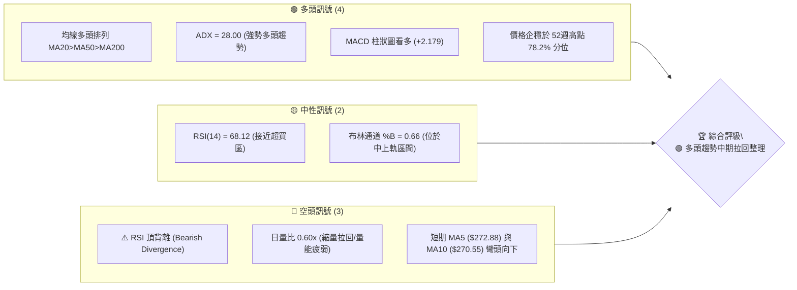
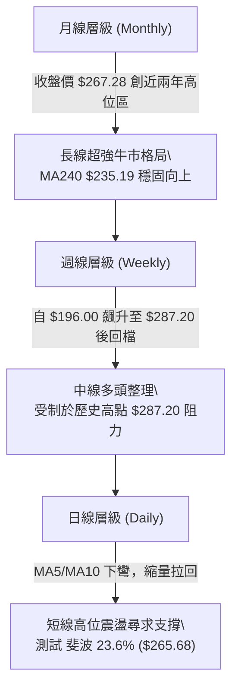
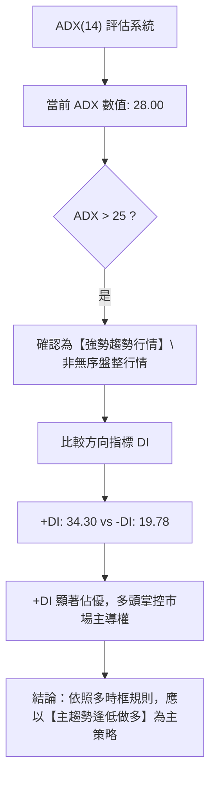
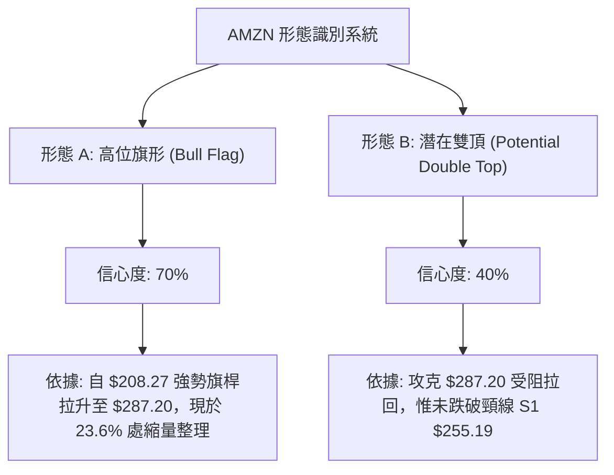
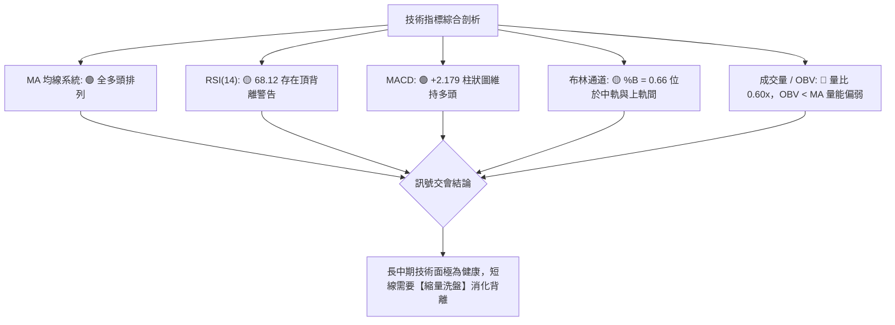
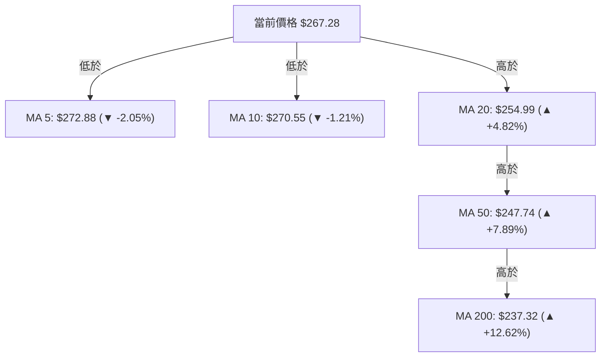
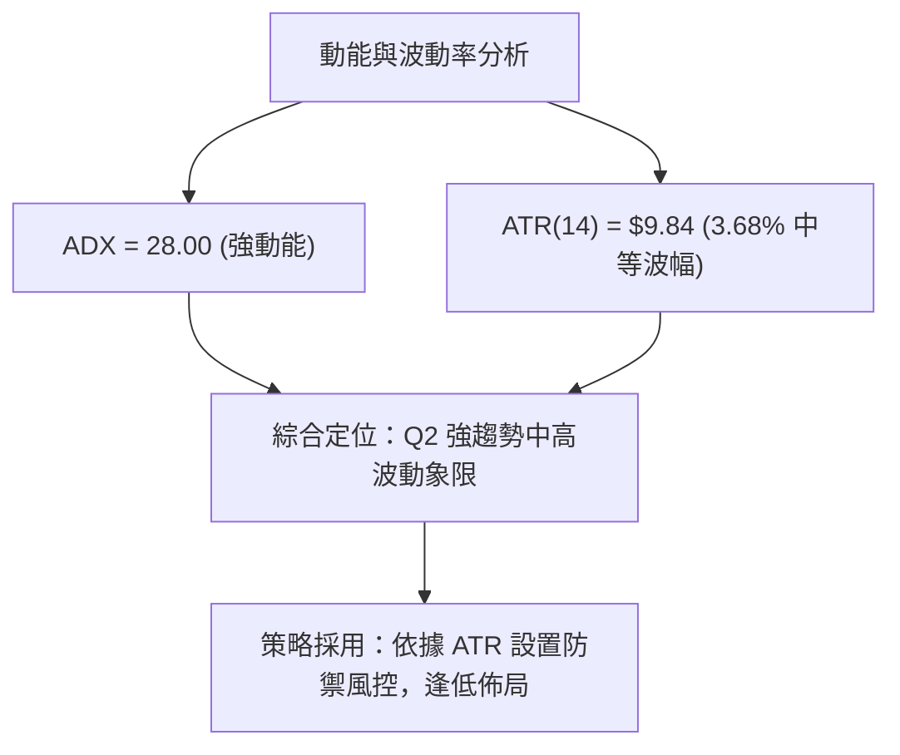
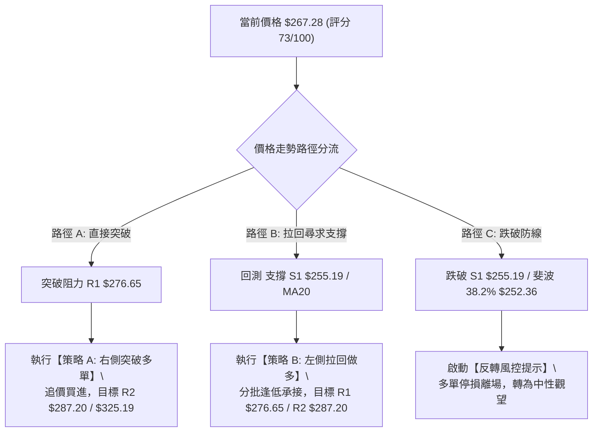
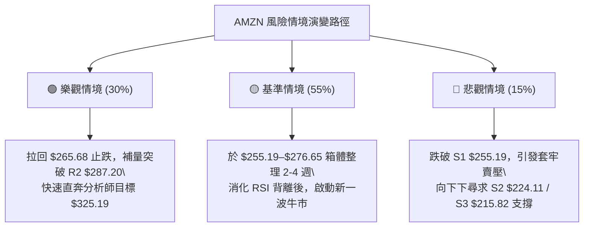

# AMZN 技術分析報告

> **報告日期**：2026-08-12 ｜ **語言**：繁體中文 ｜ **數據來源**：Yahoo Finance ｜ **當前價格**：$267.28

---

## 目錄

| 章節 | 內容 |
|------|------|
| [1. 技術面概覽](#1-技術面概覽) | 訊號儀表板、核心指標、評分卡 |
| [2. 趨勢分析](#2-趨勢分析) | 多時框趨勢、長中短期走勢、ADX強度 |
| [3. 圖表形態分析](#3-圖表形態分析) | 形態識別、信心度評估、目標價算式 |
| [4. 支撐與阻力](#4-支撐與阻力) | 關鍵價位結構、斐波那契回調 |
| [5. 技術指標深度解讀](#5-技術指標深度解讀) | MA/RSI頂背離/MACD/布林通道/量能 |
| [6. 動能與波動率](#6-動能與波動率) | 動能四象限、ATR防禦、Beta分析 |
| [7. 多時框架總結](#7-多時框架總結) | 時框架矩陣、多時框收斂判定 |
| [8. 交易策略建議](#8-交易策略建議) | 策略分流、情境階梯、進出場位與風報比 |
| [9. 風險提示與監控](#9-風險提示與監控) | 監控清單、三態風險情境、倉位控管 |

---

## 1. 技術面概覽

### 🎯 技術訊號儀表板



### 📊 核心指標速覽表

| 指標類別 | 指標名稱 | 當前數值 | 訊號 | 解讀 |
|----------|----------|----------|------|------|
| **價格** | 當前收盤價 | $267.28 | 🟢 | 位於52週區間($196.00–$287.20)之78.2%高位 |
| **均線** | MA20 (月線) | $254.99 | 🟢 | 價格在其上方 +4.82%，提供強烈近端支撐 |
| **均線** | MA50 (季線) | $247.74 | 🟢 | 價格在其上方 +7.89%，中軌防線穩固 |
| **均線** | MA200 (年線)| $237.32 | 🟢 | 價格在其上方 +12.62%，長期牛市基底 |
| **動能** | RSI(14) | 68.12 | 🟡 | 強勢區震盪，惟需警惕高位頂背離風險 |
| **動能** | MACD(12,26,9)| +2.179 | 🟢 | MACD線(7.985)高於訊號線(5.806)，多頭佔優 |
| **動能** | ADX(14) | 28.00 | 🟢 | +DI(34.30) > -DI(19.78)，明確處於強趨勢狀態 |
| **波動** | ATR(14) | $9.84 | 🟡 | 每日波幅 3.68%，屬於中等偏高正常波動區間 |
| **成交量**| 20日均量比 | 0.60x | 🔴 | 成交量 29.4M 低於20日均量 49.4M，量能欠缺 |

### 🏆 技術評分卡

```
╔══════════════════════════════════════════════════════════════════╗
║                   技術評分卡 — AMZN (2026-08-12)                 ║
╠══════════════════════════════════════════════════════════════════╣
║ 趨勢強度 (ADX/DI)   ████████████████░░░░  80/100  🟢 強勢多頭   ║
║ 均線結構 (MA Align) ████████████████████  100/100 🟢 多頭排列   ║
║ 動能指標 (RSI/MACD) ██████████████░░░░░░  70/100  🟡 頂背離疑慮 ║
║ 支撐穩定度 (S1/Fib) ████████████████░░░░  80/100  🟢 密集重疊   ║
║ 成交量配合 (OBV/VOL)████████░░░░░░░░░░░░  40/100  🔴 量能退潮   ║
║ 形態完整度 (Pattern)██████████████░░░░░░  70/100  🟡 高位旗形   ║
╠══════════════════════════════════════════════════════════════════╣
║ 綜合評分            ███████████████░░░░░  73/100  🟢 偏多/拉回買║
╚══════════════════════════════════════════════════════════════════╝
```

---

## 2. 趨勢分析

### 🌐 多時框趨勢分析



### 📈 長期趨勢 — 24個月歷史走勢圖

以歷史數據繪製近 24 個月收盤價變化軌跡與關鍵轉折點：

```
AMZN 月線歷史價格走勢圖 ($)
$280 ┼                                                  ● $271.58
$270 ┼                                         ● $270.64 █  ● $267.28 (現在)
$260 ┼                                         █        █
$250 ┼                                ● $244.22 █        █
$240 ┼                      ● $237.68  █        █        █
$230 ┼                      █        ● $230.82 █        █
$220 ┼             ● $219.39 █          █       █        █
$210 ┼             █        █          █       █
$200 ┼    ● $207.89 █        █  ● $205.01█       █
$190 ┼    █        █  ● $190.26         █
$180 ┼ ● $178.50    ● $184.42 (52W Low $196.00 於此波段形成)
     └─┬──┬──┬──┬──┬──┬──┬──┬──┬──┬──┬──┬──┬──┬──┬──┬──┬──┬──┬──┬──► 時間
      24/08 10 12 25/02 04 06 08 10 12 26/02 04 06 08
```

#### 走勢特徵階段拆解分析

| 階段 | 時間區間 | 收盤價區間 | 變動特徵 | 技術面解讀 |
|------|----------|------------|----------|------------|
| **第一波主升段** | 2024-08 ～ 2025-01 | $178.50 ➔ $237.68 | +33.15% | 強勢突破，奠定長期多頭基礎 |
| **中期回檔清洗** | 2025-02 ～ 2025-04 | $237.68 ➔ $184.42 | -22.41% | 探底至 52週低點 $196.00 區域完成籌碼沉澱 |
| **第二波主升段** | 2025-05 ～ 2025-10 | $205.01 ➔ $244.22 | +19.13% | 震盪過高，攻克前高重圍 |
| **高位箱體整理** | 2025-11 ～ 2026-03 | $233.22 ➔ $208.27 | -10.70% | 築底完成，MA200 形成強大扣抵支撐 |
| **第三波噴出段** | 2026-04 ～ 2026-08 | $208.27 ➔ $287.20 (高點) | +37.90% | 創下歷史新高 $287.20，目前拉回至 $267.28 整理 |

### 📊 中期趨勢（週線與短中期防線）

從近 20 週數據觀察，價格在 2026 年 5 月初攻上 $272.68 高點後，曾出現一波快速拉回至 2026-06-28 的 $232.69（接近 61.8% 斐波那契回調位 $230.84），隨後多頭再次發力，於 2026-08-09 突破創下 52 週新高 $287.20。

**當前中期防線支撐矩陣**：
- 第一道防線：斐波 23.6% 回調位 **$265.68**（現價正於此處徘徊）。
- 第二道防線：波段低點支撐 S1 **$255.19** 配合 MA20 **$254.99** 與 斐波 38.2% **$252.36** 形成的三重強共振支撐。

### ⚡ 趨勢強度評估（ADX 深度解讀）



| 指標名稱 | 數值 | 門檻標準 | 趨勢狀態 | 交易策略導向 |
|----------|------|----------|----------|--------------|
| **ADX(14)** | **28.00** | > 25.0 | 強勢趨勢 | 順勢交易（Trend Following），忽略小幅逆勢訊號 |
| **+DI** | **34.30** | > -DI | 多頭主導 | 做多勝率較高，拉回均線即為潛在買點 |
| **-DI** | **19.78** | < +DI | 空頭萎縮 | 空頭缺乏推動大幅下挫的動能 |

---

## 3. 圖表形態分析

### 🔍 形態識別系統

在日線與週線圖表中，AMZN 在突破歷史高點 $287.20 前後，呈現出**「高位上升旗形（Bull Flag）」**與**「雙重頂部潛在風險（Potential Double Top）」**的交織形態。



#### 圖表形態信心度與目標價計算表

| 形態名稱 | 信心度 | 判斷依據（引用數據） | 完成度 | 形態目標價計算公式 | 計算目標價 |
|----------|--------|----------------------|--------|--------------------|------------|
| **高位上升旗形 (Bull Flag)** | **70%** | 1. 旗桿起點 $208.27，頂點 $287.20；<br>2. 目前拉回成交量 29.4M（比率 0.60x）顯著縮量；<br>3. 守穩於 MA20 ($254.99) 上方。 | 75% | 突破 R1 $276.65 後：<br>突破價 $276.65 + 旗桿高度 ($287.20 - $208.27 = $78.93) | **$355.58** |
| **潛在雙重頂 (Double Top)** | **40%** | 1. 於 52週高點 $287.20 附近受到二次壓制；<br>2. RSI 出現頂背離。 (⚠️ 未跌破頸線，僅屬預警) | 30% | 跌破頸線 S1 $255.19 後：<br>頸線 $255.19 - 頂部高度 ($287.20 - $255.19 = $32.01) | **$223.18**<br>(接近 S2 $224.11) |

*註：由於雙頂形態信心度僅 40% 且未跌破頸線，依規則 15，主要形態解讀以「高位上升旗形」為主。*

### 🕯️ 重要 K 線形態分析

| 日期/週期 | 收盤價 | K 線形態名稱 | 技術面解讀 | 訊號強度 |
|-----------|--------|--------------|------------|----------|
| **2026-08-02 (週)** | $271.58 | 長陽突破線 (Bullish Marubozu) | 大量 355.3M 帶勁突破，奠定攻高基調 | 🟢 趨勢強烈 |
| **2026-08-09 (週)** | $274.48 | 高位十字星/射擊之星 (Shooting Star) | 週天花板觸及 $287.20 後受阻回落，顯示高檔賣壓 | 🔴 短線拉回 |
| **2026-08-16 (最新)**| $267.28 | 縮量陰線 (Low-Volume Pullback) | 伴隨成交量僅 97.0M (日均 29.4M)，顯示無恐慌性拋盤 | 🟡 健康洗盤 |

### 📉 ASCII 走勢形態示意圖

```
AMZN 高位上升旗形 (Bull Flag) 結構示意圖
─────────────────────────────────────────────────────────────────
$287.20 ┤───────────────● (52W High / 阻力 R2)
        │              / \
$276.65 ┤─────────────/───● (阻力 R1 / 旗形上軌)
        │            /     \
$267.28 ┤───────────/───────● (當前價格 / 測試 23.6% 斐波)
        │          /         \
$255.19 ┤─────────/───────────●─────────── (頸線 / 支撐 S1 / MA20)
        │        /  (旗桿長度 = $78.93)
$208.27 ┤───────● (起漲點)
────────┴────────────────────────────────────────────────────────
```

---

## 4. 支撐與阻力

### 🗺️ 關鍵價位分布圖

```
AMZN 價位結構分布圖 (由歷史 OHLCV 聚類計算)
═══════════════════════════════════════════════════════════════════
$287.20 ║██████████████████████████████████████████║ 強阻力 R2 (52W 高點)
$276.65 ║████████████████████████████              ║ 近端阻力 R1
────────╠══════════════════════════════════════════╣ ◄ 現價 $267.28
$265.68 ║▓▓▓▓▓▓▓▓▓▓▓▓▓▓▓▓▓▓▓▓▓▓▓▓▓▓▓▓▓▓▓▓▓▓▓▓▓▓    ║ 斐波那契 23.6% 回調
$255.19 ║████████████████████████████████████      ║ 關鍵支撐 S1 / MA20
$252.36 ║▓▓▓▓▓▓▓▓▓▓▓▓▓▓▓▓▓▓▓▓▓▓▓▓▓▓                ║ 斐波那契 38.2% 回調
$241.60 ║▓▓▓▓▓▓▓▓▓▓▓▓▓▓▓▓▓▓                        ║ 斐波那契 50.0% 回調 / MA120
$224.11 ║████████████████████████                  ║ 強支撐 S2
$215.82 ║████████████                              ║ 底部強支撐 S3 / 78.6%
═══════════════════════════════════════════════════════════════════
```

### 🚧 阻力位分析表

| 阻力級別 | 精確價位 | 形成原因與數據佐證 | 突破難度 | 重要性 |
|----------|----------|--------------------|----------|--------|
| **阻力 R1** | **$276.65** | 近一年波段高點聚類；高位旗形整理的上軌通道位置 (+3.51%) | 🟡 中等 | 短線多空強弱分水嶺 |
| **阻力 R2** | **$287.20** | 52 週歷史高點 (52W High) 聚類；前波攻高受阻點 (+7.45%) | 🔴 極高 | 突破即開啟新一波無天花板行情 |

### 🛡️ 支撐位分析表

| 支撐級別 | 精確價位 | 形成原因與數據佐證 | 守住機率 | 重要性 |
|----------|----------|--------------------|----------|--------|
| **支撐 S1** | **$255.19** | 近一年波段低點聚類 (-4.52%)，與 MA20 ($254.99) 及 38.2% 斐波 ($252.36) 形成強烈支撐帶 | 🟢 85% | 多頭核心防線 (防守不破則牛市不變) |
| **支撐 S2** | **$224.11** | 近一年次級波段低點聚類 (-16.15%) | 🟢 92% | 中期多空轉折頸線 |
| **支撐 S3** | **$215.82** | 近一年深層波段低點聚類 (-19.25%)，與 78.6% 斐波 ($215.52) 重疊 | 🟢 98% | 長期牛熊分界線 |

### 📐 斐波那契回調位分析（52週區間：$196.00 ➔ $287.20）

```
斐波那契回調層級分析：
0.0%  (52W High) ──────────────────────────────── $287.20
23.6% 回調位     ──────────────────────────────── $265.68 ◄◄ 現價 $267.28 在此上方 0.6% 處
38.2% 回調位     ──────────────────────────────── $252.36 ◄◄ 與 S1 ($255.19) / MA20 共振
50.0% 回調位     ──────────────────────────────── $241.60 ◄◄ 與 MA120 ($241.62) 精確重疊
61.8% 黄金回調位 ──────────────────────────────── $230.84
78.6% 回調位     ──────────────────────────────── $215.52 ◄◄ 與 S3 ($215.82) 共振
100.0% (52W Low) ──────────────────────────────── $196.00
```

**解讀**：當前價格 $267.28 精確停留在 23.6% 回調位 ($265.68) 上方。在強勢多頭市場（ADX=28）中，回調通常在 23.6% 至 38.2%（$252.36–$265.68）區間止跌落底，這表示目前的價格回調完全屬於常態且健康的回檔。

---

## 5. 技術指標深度解讀

### 🎛️ 指標訊號總覽



### 📈 移動平均線排列分析



- **均線排列狀態**：標準**多頭排列 (MA20 > MA50 > MA200)**。
- **均線扣抵與扣高解讀**：MA5 與 MA10 出現短線死叉（$272.88 < $270.55），壓制短線價格；但基底 MA20 ($254.99) 與 MA50 ($247.74) 斜率陡峭向上，為下方提供了強大的均線買盤支撐。

### 📉 RSI(14) 分析與背離判定

- **當前數值**：**68.12**（強勢多頭區間，未落入 <50 的弱勢區）。
- **進度條**：`███████████████░░░░░ 68.12%`

```
⚠️ RSI 頂背離 (Bearish Divergence) 剖析：
價格走勢：2026-05 頂點 $270.64 ➔ 2026-08 頂點 $287.20 (價格創歷史新高 ↗)
RSI 走勢 ：2026-05 週 RSI 82.9  ➔ 2026-08 週 RSI 68.12 (RSI 峰值降低 ↘)
結論：指標出現典型「頂背離」現象，意味著推升至 $287.20 的邊際動能正在減弱，市場需要透過橫盤整理或回測 MA20 ($254.99) 來修正背離。
```

### 📊 MACD(12,26,9) 訊號解讀

- **MACD 快線**：`7.985`
- **Signal 慢線**：`5.806`
- **MACD 柱狀圖 (Histogram)**：`+2.179` 🟢（多頭控制）
- **解讀**：MACD 快線持續在零軸上方運行，且快線高於慢線，柱狀圖維持正值，顯示中長期買盤基底並未破壞，動能依然偏向多方。

### 📦 布林通道 (Bollinger Bands) 分析

```
AMZN 布林通道相對位置示意圖
─────────────────────────────────────────────────────────────────
$293.82 ┼───────────────────────────────────────── 布林上軌 (BB Upper)
        │
$267.28 ┼─────────────────────────● (%B = 0.66)   現價
        │
$254.99 ┼───────────────────────────────────────── 布林中軌 (MA20)
        │
$216.15 ┼───────────────────────────────────────── 布林下軌 (BB Lower)
─────────────────────────────────────────────────────────────────
```

- **通道寬度**：上軌 $293.82 與下軌 $216.15 擴張明顯，表明波動度放大。
- **指標 %B**：**0.66**（位於中軌 $254.99 與上軌 $293.82 之間的黃金分割位），顯示價格遠離超賣區，並在中軌上方獲得良好支撐。

### 💹 成交量與 OBV 分析

- **當前成交量**：29,447,706 股。
- **20日均量**：49,416,550 股（**量比 0.60x**）。
- **OBV 能量潮**：`OBV < MA`（能量潮指標低於其移動平均線）。
- **量價配合評估**：價格在高位拉回時，成交量出現急縮（0.60x），這屬於典型的**「縮量洗盤/縮量回檔」**，代表市場主力並未大規模出貨拋售；惟 OBV 疲弱提醒多頭若要突破 R2 $287.20，後續必須有補量至 50M 股以上的動作。

---

## 6. 動能與波動率

### ⚡ 動能評估四象限

| 象限分類 | 趨勢強度 (ADX) | 波動度 (ATR%) | 當前標的狀態 | 交易戰術定位 |
|----------|----------------|---------------|--------------|--------------|
| **Q1: 強趨勢 / 低波動** | 高 (>25) | 低 (<3.0%) | — | 最完美穩健持股區 |
| **Q2: 強趨勢 / 中高波動**| **高 (28.00)** | **中高 (3.68%)**| **AMZN 落在此區 🟢** | **趨勢拉回買進 (Dip Buying)** |
| **Q3: 弱趨勢 / 高波動** | 低 (<25) | 高 (>4.0%) | — | 避開 / 高拋低吸 |
| **Q4: 弱趨勢 / 低波動** | 低 (<25) | 低 (<3.0%) | — | 窄幅盤整待突破 |



### 📊 ATR 波動率防禦計算

- **ATR(14)**：**$9.84**（佔當前股價 3.68%）。
- **日內正常波幅區間**：$267.28 ± $9.84 ➔ **[$257.44 – $277.12]**。
- **波段止損緩衝距 (1.5 × ATR)**：1.5 × $9.84 = **$14.76**。
- **建議風控基準**：若以現價進場，技術止損距不應小於 $14.76，剛好可設於 S1 $255.19 稍微下方（$267.28 - $14.76 = $252.52，極度接近斐波 38.2% $252.36）。

### 📐 Beta 與市場相關性

- **Beta 係數**：**1.454**。
- **解讀**：AMZN 的波動度高於大盤（S&P 500）45.4%。在大盤上漲時 AMZN 具備極強的彈升 Beta 爆發力；同理，當大盤拉回時，AMZN 的波動回檔幅度亦會同步放大，需注意倉位控制。

---

## 7. 多時框架總結

### 📋 時框架評分矩陣

| 時框架 | 趨勢方向 | 動能 (RSI/MACD) | 均線排列 | 形態結構 | 綜合評分 | 戰術建議 |
|--------|----------|-----------------|----------|----------|----------|----------|
| **月線 (Long-term)** | 🟢 強勢看多 | 🟢 多頭掌控 | 🟢 MA全多頭 | 多頭主升段 | **85 / 100** | 長線堅決持股 |
| **週線 (Mid-term)** | 🟢 中期看多 | 🟡 RSI頂背離 | 🟢 MA200/50支撐 | 高位旗形整理 | **75 / 100** | 逢拉回尋求買點 |
| **日線 (Short-term)** | 🟡 短線修正 | 🔴 死叉拉回中 | 🟡 破MA5/10 | 測試 23.6% 斐波 | **60 / 100** | 耐心等待落底訊號 |

### 🔲 綜合訊號矩陣

```
時框架訊號收斂驗證：
長線 (月線) ───► 🟢 看多  (基底穩固)
中期 (週線) ───► 🟢 看多  (旗形整理)  ════► 最終方向收斂：🟢 【順勢看多】
短線 (日線) ───► 🟡 修正  (縮量回檔)
```

### ⚖️ 多時框收斂最終結論

依據多時框收斂規則：**當前 ADX = 28.00 (>25)，市場處於【強勢趨勢行情】**。
優先級應以中長期（週線/月線）的強勢多頭均線結構為主要方向導向，日線層級的短線拉回（MA5/10 下彎、RSI 頂背離）僅視為**主升趨勢中的「籌碼清洗與指標修復」**。

**唯一方向性結論**：**🟢 順勢多頭格局未變，短線拉回即為中長線佈局機會**。

---

## 8. 交易策略建議

### 🗺️ 策略決策流程圖



### 🧭 策略路由 (Strategy Routing)

> **當前主策略方向 = 🟢 順勢逢低做多 / 右側突破加碼（依據綜合評分 73/100 分）**

由於評分高於 60 分，報告主推**多頭交易策略**；空頭情境僅作為風險對沖與停損觸發點。

### 🎯 價格情境階梯 (Price Scenarios)

| 觸發條件 | 下一目標價 | 後續延伸目標 | 情境含義與技術解讀 |
|----------|------------|--------------|────────────────────|
| **突破阻力 R1 ($276.65)** | **$287.20** (R2/52W High) | **$325.19** (分析師均價) | 短線修正結束，旗形發動突破攻勢 |
| **站穩現價區間 ($265.68)** | **$276.65** (R1) | **$287.20** (R2) | 於 23.6% 斐波那契處完成打底 |
| **跌破支撐 S1 ($255.19)** | **$241.60** (50% 斐波) | **$224.11** (S2) | 中線擴大修正，進入深層洗盤 |

### 📊 情境機率分佈

```
AMZN 未來 1-3 個月走勢機率估算：
┌─────────────────────────────────────────────────────────┐
│ 🟢 拉回 S1 止跌反彈 / 突破 R1  [ 60% 機率 ]              │
│ 🟡 於 $255.19 – $276.65 區間震盪 [ 25% 機率 ]           │
│ 🔴 跌破 S1 深入回檔至 S2       [ 15% 機率 ]             │
└─────────────────────────────────────────────────────────┘
```

- **主要依據**：ADX=28.00 確認多頭趨勢，成交量縮量拉回表明主力無出貨意願；配合分析師一致共識為 Strong Buy (目標均價 $325.19)，多頭勝率極高。

### 🟢 主策略詳情

| 策略要素 | 策略 A：右側突破多單 (Breakout) | 策略 B：左側拉回做多 (Pullback) ── **[首選]** |
|----------|─────────────────────────────────|──────────────────────────────────────────────|
| **進場條件** | 實體 K 線強勢突破 R1 **$276.65** 並站穩 | 價格拉回至 S1 **$255.19** (MA20 $254.99 附近) 獲得支撐 |
| **進場價格** | **$277.00** | **$255.50** |
| **第一目標價 (T1)**| **$287.20** (52W 高點, +3.68%) | **$276.65** (阻力 R1, +8.28%) |
| **第二目標價 (T2)**| **$325.19** (分析師目標均價, +17.39%)| **$287.20** (52W 高點, +12.41%) |
| **防守止損價** | **$265.68** (斐波 23.6% 價位) | **$241.60** (斐波 50.0% 價位) |
| **風險報酬比 (R/R)**| **1 : 4.25** (以 T2 計算) | **1 : 2.28** (以 T2 計算) |
| **估計成功機率** | 65% | **75%** |
| **建議倉位配比** | 10% – 15% | **15% – 20%** |

#### 策略 B 風險報酬比計算公式詳解：
- 每股風險 (Risk) = 進場價 $255.50 - 止損價 $241.60 = **$13.90**
- 每股報酬 (Reward T2) = 目標價 $287.20 - 進場價 $255.50 = **$31.70**
- 風險報酬比 = $31.70 / $13.90 = **2.28 : 1** (符合法人優質交易標準 > 2.0)

### 🔴 反向風險觸發點（對沖與撤退提示）

若出現以下訊號，必須**立即撤銷多頭策略並執行減碼或停損**：
1. **價格收盤價跌破 S1 $255.19** 且伴隨單日成交量暴增至 80M 股以上（量大破位）。
2. **週線收盤價跌破 38.2% 斐波那契回調位 $252.36**，導致 MA20 失守。

### ⭐ 整體訊號強度評星

```
做多訊號強度：★★██☆  (4.0/5星)  🟢 強烈
做空訊號強度：★☆☆☆☆  (1.5/5星)  🔴 弱小 (僅屬指標修正)
整體可信度：  ████☆  (4.0/5星)  🟢 高度可信
```

---

## 9. 風險提示與監控

### ✅ 關鍵監控指標 Checklist

```
╔══════════════════════════════════════════════════════════════════╗
║                     關鍵技術面監控 CheckList                     ║
╠══════════════════════════════════════════════════════════════════╣
║ [ ] 價位監控：收盤價是否守住 23.6% 斐波那契位 $265.68            ║
║ [ ] 阻力突破：日線是否帶量攻克 R1 $276.65                       ║
║ [ ] 均線扣抵：MA20 ($254.99) 是否持續保持向上斜率                ║
║ [ ] 動能修復：日線 RSI 是否向上突破 70 重新化解頂背離            ║
║ [ ] 量能擴張：上攻時日成交量是否回升至 50,000,000 股以上         ║
║ [ ] 停損警戒：收盤價是否跌破最終防線 S1 $255.19                  ║
╚══════════════════════════════════════════════════════════════════╝
```

### ⚠️ 風險場景分析



### 🛡️ 風險管理與倉位控制建議

1. **單一標的風險上限**：AMZN 雖然基本面極其強勁（ROE 30.6%, Revenue YoY 19.6%），但 Beta 為 1.454，建議單一股票倉位佔總投資組合比重不宜超過 **15% - 20%**。
2. **動態移動停利 (Trailing Stop)**：當價格突破 R2 $287.20 創歷史新高後，建議將停損點移動至突破點 $276.65，或採用 **2.0 × ATR ($19.68)** 進行動態移動停利，以鎖定波段利潤。

---

## 📋 報告總結

```
╔══════════════════════════════════════════════════════════════════╗
║                     AMZN 技術分析報告總結                        ║
════════════════════════════════════════════════════════════════════
 報告日期：2026-08-12
 當前價格：$267.28
 分析評級：🟢 強勢多頭趨勢中段拉回（Bullish Dip Buying Opportunity）

 關鍵技術指標決議：
 ├─ 長期趨勢 (月線)：🟢 看多 ── MA240 $235.19 向上，牛市基底堅實
 ├─ 中期趨勢 (週線)：🟢 看多 ── 高位旗形整理，受制於歷史高點 $287.20
 ├─ 短期趨勢 (日線)：🟡 整理 ── 縮量拉回測試 23.6% 斐波那契 $265.68
 ├─ 關鍵支撐區間  ：$255.19 (S1) – $252.36 (38.2% 斐波)
 ├─ 關鍵阻力區間  ：$276.65 (R1) – $287.20 (R2 / 52W High)
 └─ 法人目標價均值：$325.19 (隱含 +21.66% 漲幅空間)

 最優策略組合建議：
 1. 🥇 最佳主策略：【策略 B - 左側逢低做多】
    ▸ 於 $255.50 (S1 $255.19 附近) 分批進場
    ▸ 嚴格設定止損於 $241.60 (斐波 50.0%)
    ▸ 目標看至 $276.65 (T1) 與 $287.20 (T2)，風報比高達 2.28 : 1
 2. 🥈 追價加碼策略：【策略 A - 右側突破追多】
    ▸ 待日線帶量突破 R1 $276.65 後順勢加碼，目標直指 $325.19
════════════════════════════════════════════════════════════════════
```

---

> ⚠️ **免責聲明**：本報告為專業技術分析模型產出，所有數據、圖表及價位推估均基於歷史價格與成交量資訊。本報告**僅供研究與學術參考**，**不構成任何形式的投資建議或買賣邀約**。金融市場投資具備風險，投資人應獨立評估個人風險承受能力，入市需謹慎。

---

*報告生成時間：2026-08-12 ｜ 數據來源：Yahoo Finance ｜ 分析框架：多時框量價技術分析學派*