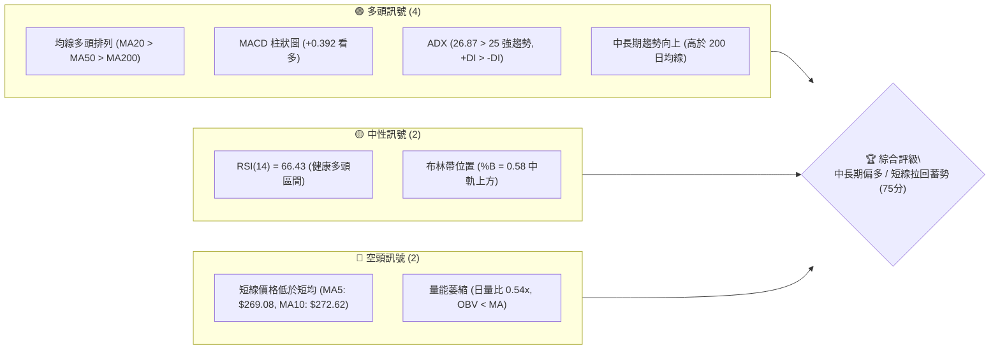
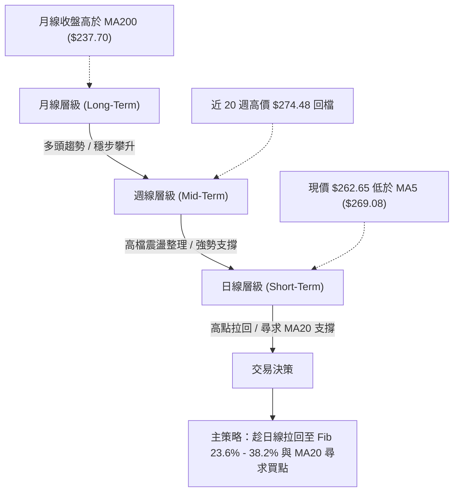
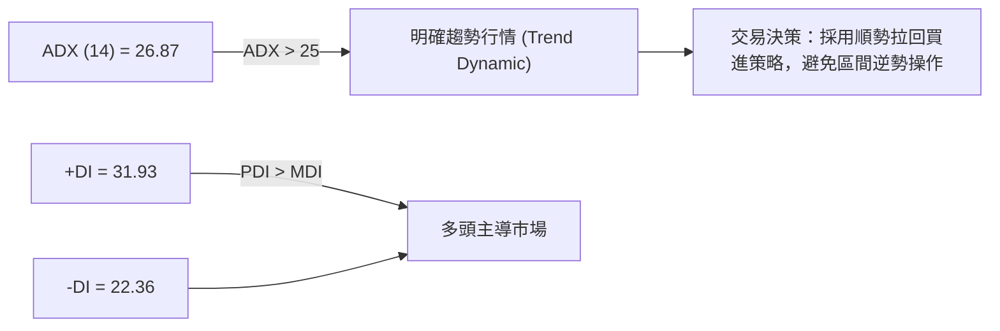
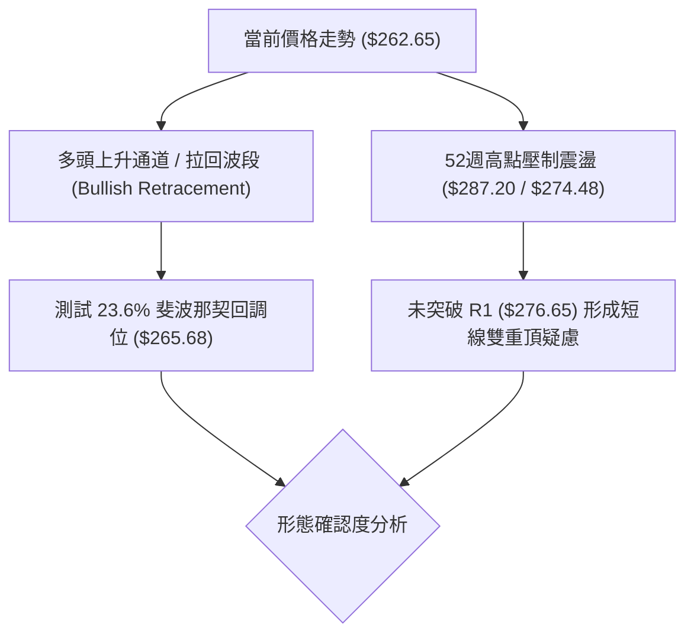
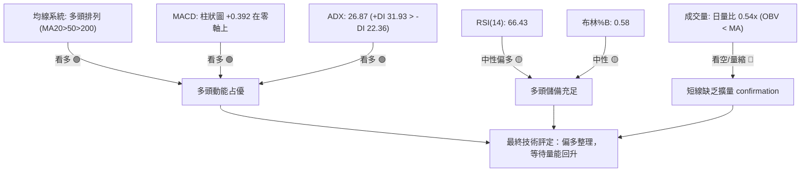
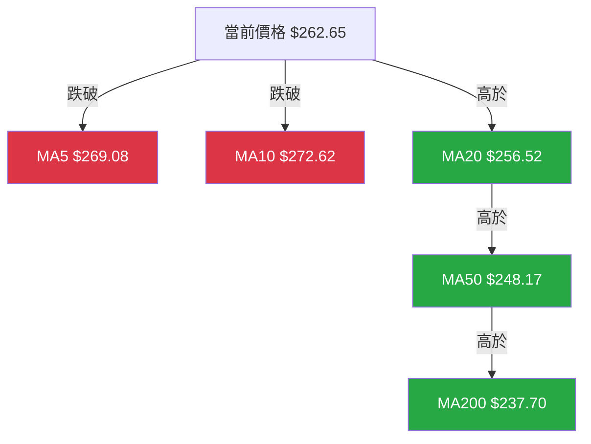
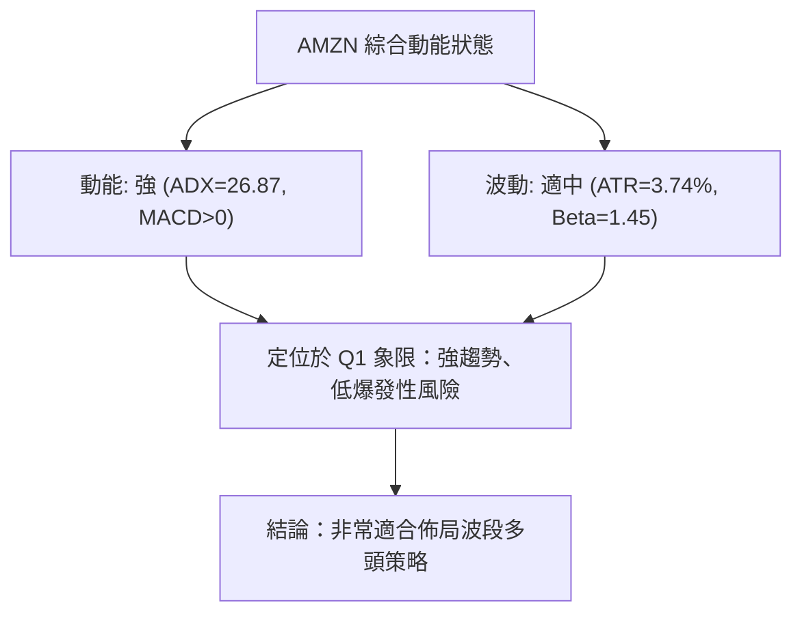
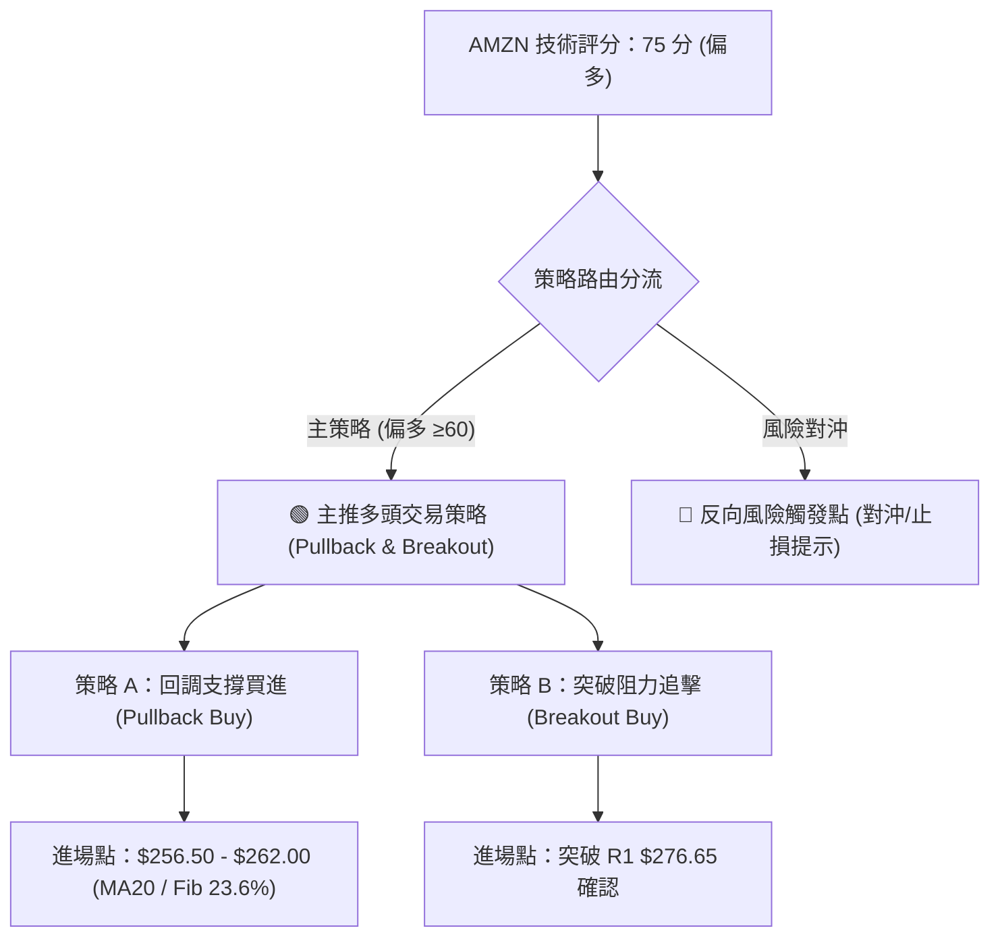
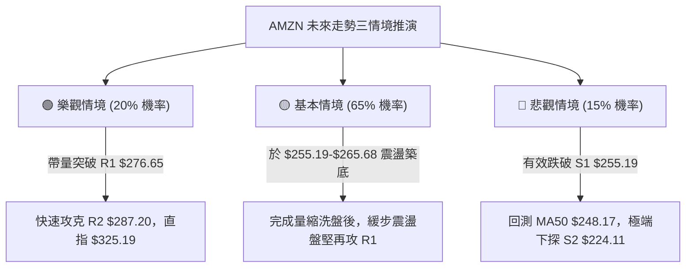

# AMZN 技術分析報告

> **報告日期**：2026-08-14 ｜ **語言**：繁體中文 ｜ **數據來源**：Yahoo Finance ｜ **當前價格**：$262.65

---

## 目錄

| 章節 | 內容 |
|------|------|
| [1. 技術面概覽](#1-技術面概覽) | 訊號儀表板、核心指標、評分卡 |
| [2. 趨勢分析](#2-趨勢分析) | 多時框趨勢、長中短期走勢、ADX強度 |
| [3. 圖表形態分析](#3-圖表形態分析) | 形態識別、K線組合、目標價推算 |
| [4. 支撐與阻力](#4-支撐與阻力) | 關鍵價位、斐波那契回調層級 |
| [5. 技術指標深度解讀](#5-技術指標深度解讀) | MA/RSI/MACD/布林/量能結構 |
| [6. 動能與波動率](#6-動能與波動率) | 動能四象限、ATR、Beta與市相關性 |
| [7. 多時框架總結](#7-多時框架總結) | 時框架評分矩陣與收斂結論 |
| [8. 交易策略建議](#8-交易策略建議) | 主策略路由、情境階梯、風報比計算 |
| [9. 風險提示與監控](#9-風險提示與監控) | 監控指標Checklist、風險場景預測 |

---

## 1. 技術面概覽

### 🎯 技術訊號儀表板



### 📊 核心指標速覽表

| 指標類別 | 指標名稱 | 當前數值 | 訊號 | 解讀 |
|----------|----------|----------|------|------|
| **價格** | 當前價格 | $262.65 | 🟢 多頭 | 處於 52 週高低價區間 73.1% 的強勢位置 |
| **均線** | MA20 | $256.52 | 🟢 多頭 | 價格高於 MA20（+2.39%），發揮動態支撐作用 |
| **均線** | MA50 | $248.17 | 🟢 多頭 | 中期趨勢向上，為核心多頭防線 |
| **均線** | MA200 | $237.70 | 🟢 多頭 | 長期牛市基石，均線呈現標準多頭排列 |
| **均線** | MA5 / MA10 | $269.08 / $272.62 | 🔴 空頭 | 短線乖離修復，價格暫時跌破極短期均線 |
| **動能** | RSI(14) | 66.43 | 🟢 多頭 | 位於 50–70 強勢區間，無頂背離跡象 |
| **動能** | MACD(12,26,9) | DIF: 6.609 / DEA: 6.217 | 🟢 多頭 | MACD 與 Signal 雙雙在零軸上方，柱狀圖 +0.392 |
| **趨勢強度** | ADX(14) | 26.87 (+DI:31.93 / -DI:22.36) | 🟢 多頭 | ADX > 25，多頭（+DI）顯著主導明確趨勢 |
| **波動** | ATR(14) | $9.83 (3.74%) | 🟡 中性 | 日均波動適中，提供良好的風險控管空間 |
| **量能** | 20日均量 / 日量 | 47.90M / 25.95M (0.54x) | 🔴 空頭 | 量縮拉回，成交量未有擴張 confirmation |

### 🏆 技術評分卡

```
╔══════════════════════════════════════════════════════════════════╗
║                AMZN 技術面綜合評分卡 (2026-08-14)                 ║
╠══════════════════════════════════════════════════════════════════╣
║ 趨勢強度 (ADX/DI)   ████████████████░░░░  80/100  🟢 強勢多頭   ║
║ 動能指標 (RSI/MACD) ██████████████░░░░░░  72/100  🟢 偏多運行   ║
║ 支撐穩定度 (S1/S2)  ████████████████░░░░  80/100  🟢 結構堅實   ║
║ 成交量配合 (OBV/Vol)████████░░░░░░░░░░░░  40/100  🔴 量能背離   ║
║ 形態完整度 (形態/Fib)██████████████░░░░░░  70/100  🟢 整理偏多   ║
║ 均線排列 (MA20-200) ██████████████████░░  90/100  🟢 多頭排列   ║
╠══════════════════════════════════════════════════════════════════╣
║ 綜合評分            ███████████████░░░░░  75/100  🟢 偏多看待   ║
╚══════════════════════════════════════════════════════════════════╝
```

---

## 2. 趨勢分析

### 🌐 多時框趨勢分析



### 📈 長期趨勢 — 12 個月走勢圖（Unicode）

基於過去 12 個月（2025-08 至 2026-08）之月線收盤價繪製：

```
AMZN 月線走勢圖（2025-08 至 2026-08）
價格軸 ($)
$280 ┤                                        ●(2026-07 $271.58)
$270 ┤                                ●(05)   │  ●(08現價 $262.65)
$260 ┤                            ●(04)       │  │
$250 ┤                ●(10)       │           │  │
$240 ┤                │   ●(01)   │   ●(06)───┘  │
$230 ┤  ●(08) ●(09)   │   │   │   │   │          │
$220 ┤  │     │   ●(11)   │   │   │   │          │
$210 ┤  │     │   │       │   ●(02)   │          │
$200 ┤  │     │   │       │       ●(03 $208.27)  │
     └─┴─────┴───┴───────┴───┴───┴───┴──────────┴───
       08/25 09  10  11  12  01/26 02  03  04  05  06  07  08
```

#### 歷史走勢特徵分析

| 時間區段 | 價格區間 | 變動趨勢 | 技術面特徵分析 |
|----------|----------|----------|----------------|
| **2025-08 ~ 2025-12** | $219.57 – $244.22 | 區間築底 | 於 $220–$240 區間反覆震盪，打築中期底部平台。 |
| **2026-01 ~ 2026-03** | $208.27 – $239.30 | 探底洗盤 | 3 月探至 52 週低點聚類區（$208.27），迅速獲得買盤強力支撐。 |
| **2026-04 ~ 2026-05** | $208.27 – $270.64 | 主升段突破 | 呈現帶量垂直噴發，強勢突破多重阻力，漲幅達 +29.9%。 |
| **2026-06** | $238.34 | 劇烈洗盤 | 急速拉回測試 MA200（$237.70）支撐，確認長線支撐有效性。 |
| **2026-07 ~ 2026-08** | $238.34 – $262.65 | 再次發動與高檔回檔 | 7 月拉升至 $271.58，8 月初攀至近 20 週高點 $274.48 後小幅拉回現價 $262.65。 |

### 📊 中期趨勢（週線分析）

近 20 週走勢顯示，AMZN 於 2026 年 8 月初拉升至 $274.48，受制於歷史高點區域 R1（$276.65）與 52 週高點 R2（$287.20）強阻力帶，展開短線獲利回吐。然而，週線級別的 MACD 柱狀圖維持在 +0.392 正值區，且 RSI 在 66.43 保持健康運行，說明中期上升結構依然健全。

### ⚡ 趨勢強度評估（ADX 解讀）



*   **ADX 數值解讀**：ADX 為 26.87，越過 25 的趨勢分水嶺，確認為**強趨勢行情**。
*   **方向性指標 (+DI/-DI)**：+DI (31.93) 顯著高於 -DI (22.36)，多空差值達 +9.57，顯示多方仍掌握發球權。
*   **結論**：在此趨勢環境下，依據多時框收斂規則，中長期多頭趨勢占主導地位，短線拉回應視為順勢佈局點而非趨勢反轉。

---

## 3. 圖表形態分析

### 🔍 形態識別系統



#### 圖表形態信心度評估表

| 識別形態 | 信心度 | 判斷依據（引用數據） | 完成度 | 目標價計算與數值 |
|----------|--------|----------------------|--------|------------------|
| **上升趨勢拉回整理** | **78%** | 價格回落至 Fib 23.6% ($265.68) 與 MA20 ($256.52) 之間，ADX=26.87 支撐多頭 | 85% | 依高點 $274.48 突破推算：目標 R2 **$287.20** |
| **高檔雙重頂 (短線)** | **42%** | 近期兩次向上探頂 ($270.64 與 $274.48) 受阻，但頸線 S1 ($255.19) 未跌破 | 30% | 信心度低於 50%，數據不足以成立完整幾何反轉形態 |

*註：依據規則 15，雙重頂形態信心度僅 42%，故不作為主交易依據，僅以均線與斐波那契回調做指標型解讀。*

### 🕯️ 重要 K 線形態分析（近 5 個月）

| 月份 | 收盤價 | K 線形態 | 解讀 | 訊號 |
|------|--------|----------|------|------|
| **2026-04** | $265.06 | 長陽大紅棒 | 強勢突破下降趨勢，成交量放大 | 🟢 強烈買進 |
| **2026-05** | $270.64 | 高檔十字星/長上影 | 於 $270 上方遇壓，買盤跟進謹慎 | 🟡 警告/獲利結算 |
| **2026-06** | $238.34 | 長陰大黑棒 | 深度獲利回吐，回測 200 日均線 | 🔴 短線沉壓 |
| **2026-07** | $271.58 | 大陽線吞噬 | 完全吞噬前月陰線，呈現「看多吞噬」形態 | 🟢 強勢反轉向上 |
| **2026-08** | $262.65 | 上影線回檔 | 探高 $274.48 後回修，目前處於蓄勢階段 | 🟡 短線整理 |

### 📉 ASCII 走勢形態示意圖

```
AMZN 上升通道與高檔拉回示意圖
===================================================================
$287.20 ┤-------------------------------------------[ 52W High / R2 ]
        │                                  ★ 8月初高點 $274.48
$276.65 ┤-----------------------●----------│--------[ 關鍵阻力 R1 ]
        │                      / \        / \
$265.68 ┤...................../...\....../...● $262.65 (現價) [Fib 23.6%]
        │                    /     \    /
$256.52 ┤===================/=======\==/============[ MA20 中軌 ]
$255.19 ┤------------------/---------●--------------[ 關鍵支撐 S1 ]
        │                 /  6月回檔 S1
$237.70 ┤────────────────●──────────────────────────[ MA200 長線鐵板 ]
===================================================================
```

### 🎯 形態目標價計算

*   **上升通道延續目標**：
    *   計算公式：突破頸線 R1 ($276.65) + 波段波高 ($274.48 - $232.11 = $42.37)
    *   推算目標價：$276.65 + $42.37 = $319.02（貼近分析師目標均價 **$325.19**）。
*   **保守目標價**：直接引用數據庫內關鍵阻力位 R2 **$287.20**（52 週高點）。

---

## 4. 支撐與阻力

### 🗺️ 關鍵價位分布圖（Unicode）

```
AMZN 價位結構分布圖
═══════════════════════════════════════════════════════════════════
$287.20 ║████████████████████████████████████████║ 強阻力 R2 (52W High)
$276.65 ║██████████████████████████          ║ 關鍵阻力 R1
$265.68 ║────────────────────────────────────────║ 斐波那契 23.6% 回調位
$262.65 ╠════════════════════════════════════════╣ ◄ 現價 (Current Price)
$256.52 ║........................................║ MA20 均線位置
$255.19 ║▓▓▓▓▓▓▓▓▓▓▓▓▓▓▓▓▓▓▓▓▓▓▓▓▓▓▓▓          ║ 近期關鍵支撐 S1
$252.36 ║────────────────────────────────────────║ 斐波那契 38.2% 回調位
$241.60 ║────────────────────────────────────────║ 斐波那契 50.0% 回調位
$224.11 ║████████████████████████████████████████║ 強支撐 S2
$215.82 ║████████████████████████████████████████║ 核心防線 S3 (Fib 78.6%)
═══════════════════════════════════════════════════════════════════
```

### 🚧 阻力位分析表

*數據來源：完全嚴格引用 OHLCV 波段高點聚類與數據包。*

| 阻力級別 | 精確價位 | 形成原因 | 突破難度 | 重要性 |
|----------|----------|----------|----------|--------|
| **R1** | **$276.65** | 近一年波段高點聚類 / 5月與8月高點解套賣壓區 | 🟡 中等 | ★★★★☆ 短線多空分水嶺 |
| **R2** | **$287.20** | 52 週歷史最高價 (52W High) | 🔴 極高 | ★★★★★ 多頭終極牆堡 |

### 🛡️ 支撐位分析表

*數據來源：完全嚴格引用 OHLCV 波段低點聚類與數據包。*

| 支撐級別 | 精確價位 | 形成原因 | 守住機率 | 重要性 |
|----------|----------|----------|----------|--------|
| **S1** | **$255.19** | 近一年波段低點聚類 / 鄰近 MA20 ($256.52) | 🟢 80% | ★★★★☆ 短線多頭護城河 |
| **S2** | **$224.11** | 兩年成交密集區與波段低點聚類 | 🟢 90% | ★★★★★ 中期結構支柱 |
| **S3** | **$215.82** | 斐波那契 78.6% 回調位 / 2025 年多重底部 | 🟢 95% | ★★★★★ 長線鐵板防線 |

### 📐 斐波那契回調位分析

基準區間：52 週低點 **$196.00** → 52 週高點 **$287.20**（全幅 $91.20）：

| 斐波那契層級 | 精確價位 | 技術含義與目前價格關係 |
|--------------|----------|------------------------|
| **0.0%** | **$287.20** | 52 週高點 (R2) |
| **23.6%** | **$265.68** | **現價 $262.65 緊貼此位置下方** (-1.1% 乖離)，正進行微幅消化 |
| **38.2%** | **$252.36** | 強力回調支撐區，下方緊鄰 S1 ($255.19) 與 MA20 ($256.52) |
| **50.0%** | **$241.60** | 多空中軸線，接近 MA120 ($242.56) |
| **61.8%** | **$230.84** | 黃金分割防線，與 MA200 ($237.70) 形成強磁吸支撐帶 |
| **78.6%** | **$215.52** | 對應 S3 ($215.82) 極強支撐 |
| **100.0%** | **$196.00** | 52 週低點 |

**位置解讀**：現價 $262.65 位於 23.6% ($265.68) 與 38.2% ($252.36) 回調位之間。價格在 23.6% 附近震盪，代表回調幅度極淺，屬於典型的**強勢多頭高檔消化**。

---

## 5. 技術指標深度解讀

### 🎛️ 指標訊號總覽



### 📈 移動平均線排列分析



*   **極短期均線 (MA5/MA10)**：MA5 ($269.08) 與 MA10 ($272.62) 呈現死亡交叉向下，現價跌破這兩條均線，顯示過去 5–10 個交易日內多頭遭遇短線獲利回吐壓制。
*   **中長期均線 (MA20/MA50/MA200)**：MA20 ($256.52) > MA50 ($248.17) > MA200 ($237.70)，呈標準黃金**多頭排列**。MA20 距現價僅 2.39%，將提供即時且強大的動態買盤支撐。

### 📉 RSI(14) 分析

```
RSI(14) 當前數值：66.43
[0] ─────────────── [30] ─────────────── [50] ──────── [66.43] ─── [70] ────── [100]
                     超賣區               中軸         當前位    超買區
進度條：█████████████████████████████░░░░░░░ (66.43%)
```

*   **區間判讀**：RSI 位於 66.43，處於 50–70 之強勢多頭區間，既未進入超買區（>70），也遠離超賣區（<30）。
*   **背離檢測**：價格於 8 月初創近 20 週高點 $274.48，當時 RSI 為 62.9-66.4，未出現價格創新高而 RSI 創新低的頂背離現象。**結論：無頂背離，動能結構健康**。

### 📊 MACD(12,26,9) 訊號解讀

*   **DIF 快線**：6.609
*   **DEA 慢線 (Signal)**：6.217
*   **MACD 柱狀圖 (Histogram)**：+0.392

MACD 快慢線均深處零軸上方（DIF=6.609），且 DIF > DEA，柱狀圖持續維持正值（+0.392）。這表明多頭掌控了波段控制權，中線上升趨勢完全未受破壞。

### 📦 布林通道分析

```
AMZN 布林通道結構示意圖 (Bandwidth: $217.61 - $295.43)
===================================================================
$295.43 ┤------------------------------------------- BB 上軌 (Upper)
        │
$262.65 ┤====================●====================== 現價 (%B = 0.58)
$256.52 ┤------------------------------------------- BB 中軌 (MA20)
        │
$217.61 ┤------------------------------------------- BB 下軌 (Lower)
===================================================================
```

*   **%B 指標**：0.58。價格位於中軌（$256.52）與上軌（$295.43）之間的理想區域。
*   **通道狀態**：通道呈現開口擴張後的中高檔橫盤，未出現貼著上軌極端超買或跌破下軌特徵，屬於標準的「強勢通道內消化」。

### 💹 成交量分析（量價配合度）

*   **最新成交量**：25,946,149 股
*   **20日均量**：47,898,042 股 (量比：**0.54x**)
*   **OBV 趨勢**：OBV < MA

**量價結構判讀**：當前價格拉回時，成交量僅為 20 日均量的 0.54 倍，呈現顯著的「**價跌量縮**」特徵。在技術分析中，價跌量縮代表市場拋壓並不沉重，主力資金並未爆量外逃，屬於多頭格局中健康的籌碼洗盤。但由於 OBV 低於其均線，短線向上突破需要更明確的買盤擴量配合。

---

## 6. 動能與波動率

### ⚡ 動能評估四象限

| 象限分區 | 動能強度 | 波動率 | AMZN 當前位置評估 | 策略含義 |
|----------|----------|--------|-------------------|----------|
| **Q1 (高動能/低波動)** | 強 (ADX>25) | 低 (ATR<4%) | **✓ AMZN 位於此象限** | **最佳順勢交易區**：趨勢明確且波動可控 |
| **Q2 (弱動能/低波動)** | 弱 (ADX<25) | 低 (ATR<4%) | - | 觀望 / 區間突破策略 |
| **Q3 (強動能/高波動)** | 強 (ADX>25) | 高 (ATR>5%) | - | 減倉 / 寬幅止損 |
| **Q4 (弱動能/高波動)** | 弱 (ADX<25) | 高 (ATR>5%) | - | 避開 / 高風險無趨勢 |



### 📊 ATR 波動率分析

*   **ATR(14)**：$9.83
*   **百分比波動率**：3.74% of price ($9.83 / $262.65)

**風控應用**：
*   **日內合理波動區間**：$262.65 ± $9.83 （$252.82 – $272.48）。
*   **追蹤止損設距**：建議使用 1.5 倍至 2.0 倍 ATR 作為止損緩衝區，即 $9.83 × 1.5 = $14.75，自進場點下移約 $14.75。

### 📐 Beta 與市場相關性

*   **Beta 係數**：1.454

AMZN 的 Beta 為 1.454，高於大盤（S&P 500 = 1.0），代表其具備較強的彈性與攻擊性。在大盤上漲週期中，AMZN 預期漲幅可達大盤的 1.45 倍，適合成長型與趨勢交易者進行多頭配置。

---

## 7. 多時框架總結

### 📋 時框架評分表

| 時框架 | 趨勢方向 | 動能狀態 | 均線排列 | 形態結構 | 綜合評分 | 交易建議 |
|--------|----------|----------|----------|----------|----------|----------|
| **日線 (Daily)** | 🟡 橫盤整理 | 🟡 中性 (RSI 66) | 🟢 多頭 (20>50) | 23.6% Fib 震盪 | **70 / 100** | 尋求 MA20 / S1 回調買點 |
| **週線 (Weekly)** | 🟢 強勢上升 | 🟢 強勁 (MACD>0) | 🟢 強勢多頭 | 上升通道進行中 | **80 / 100** | 持股續抱 / 逢低加碼 |
| **月線 (Monthly)**| 🟢 長牛格局 | 🟢 良好 | 🟢 多頭排列 | 突破歷史平台 | **85 / 100** | 長線多頭配置 |

### 🔲 綜合訊號矩陣

```
╔══════════════════════════════════════════════════════════════════╗
║                   多時框架訊號一致性對齊矩陣                     ║
╠══════════════════════╦══════════════╦══════════════╦═════════════╣
║ 維度 \ 時框架        ║ 日線 (Short) ║ 週線 (Medium)║ 月線 (Long) ║
╠══════════════════════╬══════════════╬══════════════╬═════════════╣
║ 趨勢方向 (Trend)     ║   🟡 整理    ║   🟢 向上    ║   🟢 向上   ║
║ 動能指標 (Momentum)  ║   🟢 偏多    ║   🟢 強勁    ║   🟢 健康   ║
║ 均線支撐 (MA)        ║   🟢 MA20上方║   🟢 高於MA20║   🟢 高於MA200║
║ 籌碼量能 (Volume)    ║   🔴 量縮    ║   🟡 中性    ║   🟢 充沛   ║
╠══════════════════════╬══════════════╬══════════════╬═════════════╣
║ 時框架一致性評級     ║            🟢 83% 高度一致偏多           ║
╚══════════════════════╩═══════════════════════════════════════════╝
```

### ⚖️ 多時框收斂結論

依據多時框收斂規則，當前 **ADX = 26.87 (> 25)**，市場處於標準的**強趨勢行情**環境：

1.  **主導時框**：由週線與長期均線（MA50 $248.17、MA200 $237.70）主導整體方向，趨勢明確偏多。
2.  **日線定位**：日線低於 MA5/MA10 之拉回僅屬於中長期多頭趨勢中的「短線過熱修復與量縮整理」。
3.  **唯一方向結論**：**中長線偏多，短線拉回尋求支撐卡位**。第 8 章交易策略將完全聚焦於多頭買進佈局。

---

## 8. 交易策略建議

### 🗺️ 策略決策流程圖



### 🧭 策略路由

**當前主策略方向 = 🟢 強勢偏多（技術綜合評分：75 / 100）**

### 🎯 價格情境階梯 (Price Scenarios)

*所有價位完全引用數據庫精確數值*：

| 觸發條件 | 第一目標 | 第二目標 | 情境含義 |
|----------|----------|----------|----------|
| **強勢突破 R1 ($276.65)** | **R2 ($287.20)** | **分析師均價 ($325.19)** | 挑戰 52 週新高，開啟新一波主升段 |
| **企穩現價至 S1 區間 ($255.19–$262.65)** | **R1 ($276.65)** | **R2 ($287.20)** | 強勢高檔消化，蓄勢再次探高（**基準情境**）|
| **跌破 S1 ($255.19)** | **S2 ($224.11)** | **S3 ($215.82)** | 中期擴大拉回，測試 MA200 鐵板支撐 |

### 📊 情境機率分佈

```
情境機率分佈圖：
[1] 區間蓄勢並向上反彈 (65%) ███████████████████████████████░░░░░░░░░░░
[2] 突破 R1 直接飆升 (20%)   █████████░░░░░░░░░░░░░░░░░░░░░░░░░░░░░░░
[3] 跌破 S1 深度回調 (15%)   ███████░░░░░░░░░░░░░░░░░░░░░░░░░░░░░░░░░
```

| 情境 | 機率 | 主要依據 |
|------|------|----------|
| **區間蓄勢後反彈** | **65%** | ADX=26.87 趨勢強勁，均線多頭排列，日線價跌量縮（量比0.54x）屬於健康洗盤。 |
| **突破 R1 直接挑戰新高**| **20%** | MACD 柱狀圖維持正值 (+0.392)，但需要成交量增長至 20日均量 (47.9M) 以上。 |
| **跌破 S1 深度拉回** | **15%** | 僅在大盤出現極端系統性風險時發生，S1 ($255.19) 與 MA20 ($256.52) 具雙重防守。 |

### 🟢 主策略詳情

#### 策略 A：回調支撐分批買進（首選策略）

*   **適用情境**：價格在 MA20 ($256.52) 至現價區間獲強烈支撐，量能止跌回升。
*   **進場條件**：當價格拉回至 $256.00 – $262.65 區域，且出現 15 分鐘 / 日線止跌 K 線。

#### 策略 B：突破 R1 追擊加碼

*   **適用情境**：買盤大舉回籠，日成交量突破 50日均量（52.1M），帶量強勢突破 $276.65。
*   **進場條件**：收盤價確認突破 R1 ($276.65) 或突破後拉回回測不破。

#### 策略參數詳細對照表

| 策略要素 | 策略 A（回調低吸） | 策略 B（突破追擊） |
|----------|--------------------|--------------------|
| **進場條件** | 於 MA20 / Fib 23.6% 區域分批佈局 | 收盤突破阻力 R1 $276.65 |
| **精確進場價格** | **$258.00 – $262.65** | **$277.00** |
| **目標價 T1** | **$276.65** (R1, 潛在 +6.0%) | **$287.20** (R2 / 52W High, +3.7%) |
| **目標價 T2** | **$287.20** (R2, 潛在 +10.0%)| **$325.19** (分析師目標均價, +17.4%) |
| **止損價格** | **$247.50** (跌破 S1 $255.19 與 MA50 $248.17)| **$265.00** (跌回 Fib 23.6% 下方) |
| **風險報酬比 (R:R)**| **2.43 : 1** (以進場$259.00/止損$247.50/目標$287.20計) | **2.28 : 1** (以目標$325.19計) |
| **建議倉位** | **15% – 20%** | **10% – 15%** |

### 🔴 反向風險觸發點（對沖與風控提示）

*   **無條件止損訊號**：若日線收盤價**跌破 S1 ($255.19)** 且成交量放大，代表短期多頭結構破壞，應立即平倉或執行對沖。
*   **中期轉空確認點**：若價格持續下跌並收低於 **MA50 ($248.17)**，則多頭優勢完全消失，市場將轉入深幅修正，下探 S2 ($224.11)。

### ⭐ 整體訊號強度評星

```
做多訊號強度：★★██☆  (4.0 / 5.0 星)  ─ 均線多頭、ADX>25、MACD正值
做空訊號強度：★░░░░  (1.5 / 5.0 星)  ─ 僅極短期均線短壓、無背離
整體可信度：  ★★██☆  (4.2 / 5.0 星)  ─ 多時框數據一致性極高
```

---

## 9. 風險提示與監控

### ✅ 關鍵監控指標 Checklist

```
╔══════════════════════════════════════════════════════════════════╗
║                   AMZN 每日交易監控 Checklist                     ║
╠══════════════════════════════════════════════════════════════════╣
║ [ ] 價位監控：是否觸及/守住 MA20 支撐價位 $256.52？               ║
║ [ ] 阻力監控：收盤價是否帶量突破關鍵阻力 R1 $276.65？           ║
║ [ ] 量能監控：日成交量是否回升至 20日均量 (47.90M) 以上？       ║
║ [ ] 指標監控：RSI(14) 能否維持在 50 中軸上方？                   ║
║ [ ] 趨勢監控：ADX 指標是否維持在 25 以上且 +DI > -DI？           ║
║ [ ] 風險監控：收盤價是否跌破嚴格止損點 $247.50？                 ║
╚══════════════════════════════════════════════════════════════════╝
```

### ⚠️ 風險場景分析



### 🛡️ 風險管理重要提醒

1.  **量能確認**：目前量比僅 0.54x，顯示買盤尚未大幅進駐。進場應採取**分批建倉**策略（如 40% 現價、60% 待拉回 MA20 或突破 R1 後加碼），切忌單筆滿倉。
2.  **大盤 Beta 效應**：AMZN 的 Beta 為 1.454，對整體科技股及 S&P 500 波動敏感度高。若大盤出現顯著回調，應適度放寬短線波動容忍度或調降倉位。

---

## 📋 報告總結

```
╔══════════════════════════════════════════════════════════════════╗
║                   AMZN 技術分析報告總結                          ║
════════════════════════════════════════════════════════════════════
報告日期：2026-08-14
當前價格：$262.65
分析評級：🟢 強勢偏多 (技術評分 75/100)

關鍵結論：
├─ 長期趨勢：🟢 強勢多頭 (高於 MA200 $237.70，均線多頭排列)
├─ 中期趨勢：🟢 穩健向上 (週線上升通道，ADX 26.87 強趨勢)
├─ 短期趨勢：🟡 高檔洗盤 (跌破 MA5/MA10，量縮拉回尋求 MA20 支撐)
├─ 關鍵支撐：S1 $255.19 ｜ S2 $224.11 ｜ S3 $215.82
├─ 關鍵阻力：R1 $276.65 ｜ R2 $287.20 (52W High)
└─ 分析師目標價：均價 $325.19 (最高 $400.00 / 最低 $230.00)

最優策略組合：
1. 🥇 最佳機會：策略 A (回調低吸) — 於 $258.00–$262.65 佈局，目標 $287.20，止損 $247.50
2. 🥈 次選機會：策略 B (突破追擊) — 帶量突破 R1 $276.65 後加碼，目標 $325.19
3. 🥉 風險防禦：若收盤跌破 S1 $255.19，多頭策略失效，轉為減倉觀望
════════════════════════════════════════════════════════════════════
```

---

> ⚠️ **免責聲明**：本報告為 AI 自動生成之技術分析，所有數據及估算均基於提供的歷史價格資訊（截至 2026-08-14）。本報告**僅供研究與學術參考**，**不構成任何投資建議與買賣撮合**。投資有風險，入市需謹慎，請獨立評估並自負盈虧。

---

*報告生成時間：2026-08-14 ｜ 數據來源：Yahoo Finance ｜ 分析框架：多時框技術分析 (Multi-Timeframe Technical Analysis)*