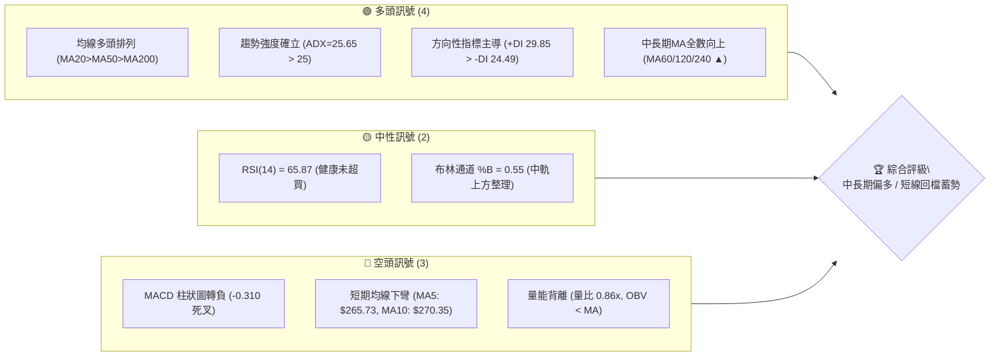
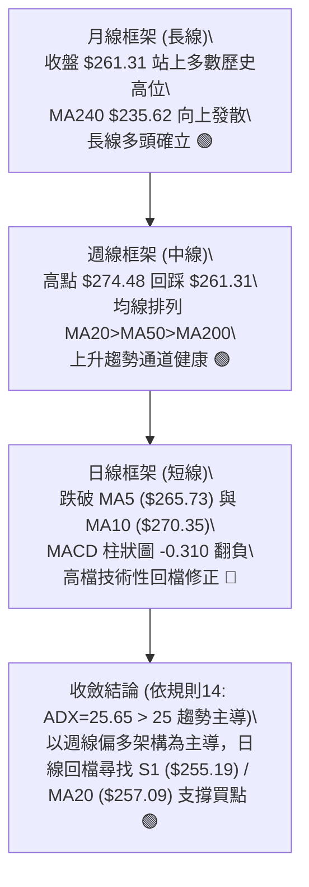
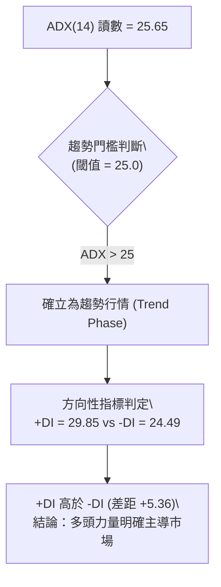
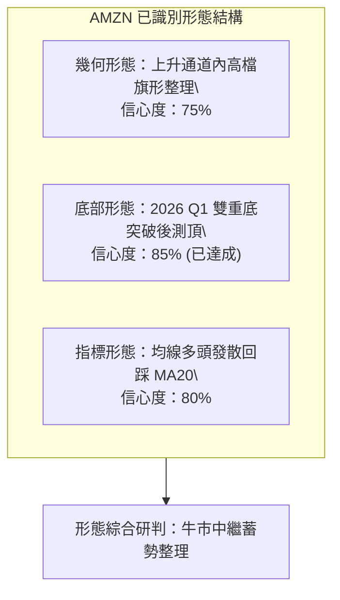
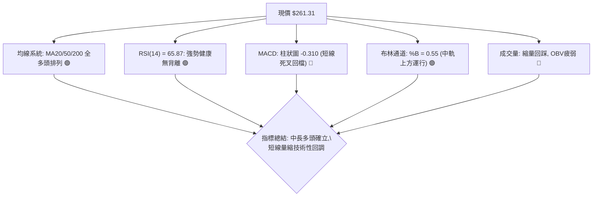
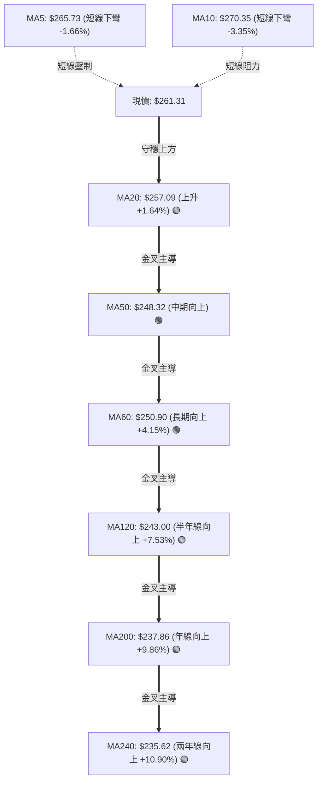
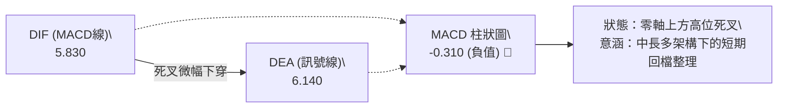
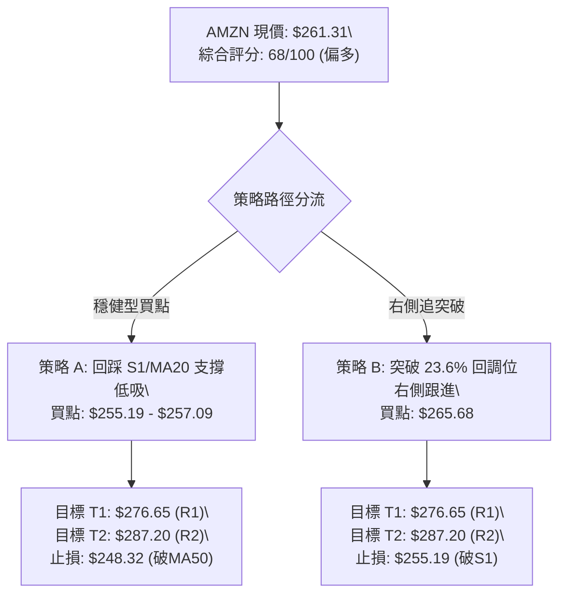
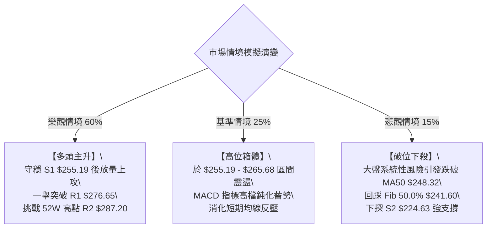

# AMZN 技術分析報告

> **報告日期**：2026-08-17 ｜ **語言**：繁體中文 ｜ **數據來源**：Yahoo Finance ｜ **當前價格**：$261.31

---

## 目錄

| 章節 | 內容 |
|------|------|
| [1. 技術面概覽](#1-技術面概覽) | 訊號儀表板、核心指標、評分卡 |
| [2. 趨勢分析](#2-趨勢分析) | 多時框趨勢、長中短期走勢 |
| [3. 圖表形態分析](#3-圖表形態分析) | 形態識別、K線組合、目標價 |
| [4. 支撐與阻力](#4-支撐與阻力) | 關鍵價位、斐波那契回調 |
| [5. 技術指標深度解讀](#5-技術指標深度解讀) | MA/RSI/MACD/布林/成交量 |
| [6. 動能與波動率](#6-動能與波動率) | 動能評估、ATR、Beta |
| [7. 多時框架總結](#7-多時框架總結) | 時框架評分矩陣 |
| [8. 交易策略建議](#8-交易策略建議) | 多空策略、風險報酬比 |
| [9. 風險提示與監控](#9-風險提示與監控) | 監控指標、風險場景 |

---

## 1. 技術面概覽

### 🎯 技術訊號儀表板



### 📊 核心指標速覽表

| 指標類別 | 指標名稱 | 當前數值 | 訊號 | 解讀 |
|:---|:---|:---|:---:|:---|
| **價格** | 當前收盤價 | $261.31 | 🟢 | 位於52週區間 71.6% 位置，處於中長期多頭主升通道 |
| **均線** | MA20 | $257.09 | 🟢 | 現價高於MA20 (+1.64%)，維持短期生命線上強勢運行 |
| **均線** | MA50 | $248.32 | 🟢 | 現價高於MA50 (+5.23%)，中期多頭支撐結構紮實 |
| **均線** | MA200 | $237.86 | 🟢 | 現價高於MA200 (+9.86%)，長期牛熊分界線上揚，大趨勢向上 |
| **動能** | RSI(14) | 65.87 | 🟡 | 位於 50–70 強勢中性區間，無頂背離，動能充沛但未過熱 |
| **動能** | MACD (12,26,9) | 5.830 / 6.140 | 🔴 | MACD 柱狀圖 -0.310 翻負，短線出現高位死叉回檔訊號 |
| **動能** | Stoch %K / %D | 57.59 / 60.40 | 🟡 | 位於中軸附近死叉微幅向下，確認短線處於技術性修正 |
| **趨勢** | ADX(14) / ±DI | 25.65 | 🟢 | ADX > 25 且 +DI (29.85) > -DI (24.49)，確認處於多頭趨勢行情 |
| **通道** | 布林通道 | $218.24–$295.93 | 🟢 | 帶寬張開，現價在中軌($257.09)之上，%B=0.55 屬強勢整理 |
| **量能** | 20日均量比 / OBV | 0.86x / 疲弱 | 🔴 | 成交量 4,150 萬低於均量，OBV < MA，上攻量能稍顯不足 |
| **波動** | ATR(14) | $10.00 | 🟡 | 每日平均波幅 3.83%，波動度適中，適合波段布局與設定防守 |

### 🏆 技術評分卡

```
╔══════════════════════════════════════════════════════════════╗
║               技術評分卡 — AMZN (2026-08-17)                 ║
╠══════════════════════════════════════════════════════════════╣
║ 趨勢強度      ██████████████░░░░░░  72/100  🟢 強趨勢延續    ║
║ 動能指標      ██████████░░░░░░░░░░  54/100  🟡 短線動能轉弱  ║
║ 支撐穩定度    ████████████████░░░░  80/100  🟢 密集支撐帶    ║
║ 成交量配合    ████████░░░░░░░░░░░░  42/100  🔴 量能萎縮背離  ║
║ 形態完整度    ██████████████░░░░░░  70/100  🟢 上升階梯形態  ║
║ 均線排列      ██████████████████░░  90/100  🟢 標準多頭排列  ║
╠══════════════════════════════════════════════════════════════╣
║ 綜合評分      █████████████░░░░░░░  68/100  🟢 偏多回踩買進  ║
╚══════════════════════════════════════════════════════════════╝
```

---

## 2. 趨勢分析

### 🌐 多時框趨勢分析

依據多時框收斂原則，當日線短線與週線衝突時，由中長期方向主導：



### 📈 長期趨勢 — 12個月走勢圖（Unicode）

```
AMZN 月線走勢圖（過去12個月：2025-09 至 2026-08）
價格軸 ($)
$280 ┤                                      ● $271.58 (07月)
$270 ┤                            ● $270.64 ┼───────● $261.31 (現價 08月)
$260 ┤                        ● $265.06     │
$250 ┤                                      │
$240 ┤        ● $244.22   ● $239.30         │   ● $238.34 (06月回踩)
$230 ┤        │   ● $233.22   ● $230.82     │   │
$220 ┤● $219.57                             │   │
$210 ┤                        ● $210.00     │   │
$200 ┤                            ● $208.27 (03月低點)
     └───────────────────────────────────────────────────────
       09  10  11  12  01  02  03  04  05  06  07  08 (月份)
```

**24個月走勢特徵分析表格**：

| 階段區間 | 起止價格 | 漲跌幅 | 走勢特徵與結構分析 |
|:---|:---|:---:|:---|
| **2024-08 ~ 2025-01** | $178.50 → $237.68 | +33.15% | 初升段發動，連續突破 $200 整數關卡，形成強勁上升浪。 |
| **2025-02 ~ 2025-04** | $237.68 → $184.42 | -22.41% | 深度洗盤回調，於 2025-04 探底 $184.42 確立長期底部結構。 |
| **2025-05 ~ 2025-10** | $184.42 → $244.22 | +32.43% | 主升浪推進，創下階段新高 $244.22 後進入高位箱體整理。 |
| **2025-11 ~ 2026-03** | $244.22 → $208.27 | -14.72% | 次級回檔構築雙重底底座（$210.00 / $208.27），洗清浮額。 |
| **2026-04 ~ 2026-07** | $208.27 → $271.58 | +30.40% | 強力向上噴出，一舉突破前高並創出 52 週高點 $287.20 聚類區。 |
| **2026-08 (當前)** | $271.58 → $261.31 | -3.78% | 高檔獲利回吐，回踩 MA20 支撐尋求確認，屬上升通道內健康蓄勢。 |

### 📊 中期趨勢（週線分析）

```
AMZN 週線波段走勢結構示意圖
$287.20 ───┬───────────────────────────────── 52W 高點 / 強阻力 (R2)
           │     ▲ 08-09 波段高點 $274.48
$276.65 ───┼─────┼─────────────────────────── 波段阻力 (R1)
$261.31 ───┼─────┼────────── ◄ 現價 ($261.31，高檔拉回整理)
$255.19 ───┼─────┴─────────────────────────── 近期支撐帶 (S1) / 接近 MA20 ($257.09)
           │
$241.60 ───┴───────────────────────────────── 斐波那契 50.0% / 中期防守中樞
```

週線數據顯示，AMZN 在 2026-06 底下探 $232.69 築底完成後，於 2026-08-09 當週拉升至 $274.48 高點，隨後兩週成交量自 3.55 億股縮至 1.56 億股並進一步降至 4,150 萬股，呈現典型的「**量縮回踩支撐**」特徵。

### ⚡ 趨勢強度評估（ADX 解讀）



| 指標名稱 | 當前數值 | 參考標準 | 狀態評估 | 實戰意涵 |
|:---|:---:|:---:|:---:|:---|
| **ADX(14)** | **25.65** | <20 盤整 / 20-25 醞釀 / >25 趨勢確立 | 🟢 趨勢形成 | 剛跨越 25 強度門檻，表示行情非無方向震盪，趨勢交易策略有效 |
| **+DI** | **29.85** | >25 偏強 | 🟢 多頭進攻 | 買盤動能依然維持在相對高檔，掌握價格控制權 |
| **-DI** | **24.49** | <20 偏弱 / >25 轉強 | 🟡 空頭試探 | 空方力量微幅回升但仍受制於 +DI 之下，未構成反轉威脅 |

---

## 3. 圖表形態分析

### 🔍 形態識別系統



**圖表形態信心度評估表**：

| 形態名稱 | 信心度 | 判斷依據（引用數據） | 完成度 | 目標價（附精確計算式） |
|:---|:---:|:---|:---:|:---|
| **上升旗形 (Bull Flag)** | **75%** | 旗桿由 2026-07 底 $232.11 快速噴出至 $274.48（漲幅 $42.37）；目前於 $261.31 呈現量縮向下微傾斜整理通道。 | **60%** | 突破點 $274.48 + 旗桿高度 $42.37 = **$316.85**（中期理論目標） |
| **雙重底 (W-Bottom)** | **85%** | 兩次底部低點分別為 2026-02 的 $210.00 與 2026-03 的 $208.27，頸線為 2026-01 高點 $239.30。 | **100%** (已完成) | 頸線 $239.30 + 高度 ($239.30 - $208.27 = $31.03) = **$270.33**（已於 2026-07 達到 $271.58） |
| **頂部反轉形態 (頭肩頂/雙頂)** | **<30%** | 數據中未偵測到頭肩頂或巨量雙頂結構，RSI(14) 亦無頂背離現象。 | — | 訊號不足，僅做指標型回檔解讀 |

### 🕯️ 重要K線形態分析

| 週期/月份 | 收盤價 | K線形態特徵 | 技術解讀 | 訊號 |
|:---|:---:|:---|:---|:---:|
| **2026-04** | $265.06 | 長陽實體突破線 | 一舉吞噬前3個月整理區，帶量突破 $240 阻力，開啟新主升浪 | 🟢 強烈買訊 |
| **2026-05** | $270.64 | 高檔十字星/滯漲線 | 測試 $270 上方遭遇獲利了結賣壓，實體縮小，預示回調修正 | 🟡 短線震盪 |
| **2026-06** | $238.34 | 大陰線回調踩頸線 | 快速下殺回測前頸線 $238 附近支撐，釋放獲利盤浮額 | 🔴 短線修正 |
| **2026-07** | $271.58 | 長下影中陽反轉線 | 探底 $232.11 後強勁拉升，收復前月失地，確立次級回調結束 | 🟢 多頭重啟 |
| **2026-08 (當前)** | $261.31 | 縮量小陰線回踩 | 上攻 $274.48 後縮量回落，目前實體守於 MA20 之上，屬健康洗盤 | 🟡 蓄勢整理 |

### 📉 ASCII 走勢形態示意圖

```
AMZN 上升旗形 (Bull Flag) 與均線支撐示意圖
$287.20 ────────────────────────────────────────── 52W 高點阻力 (R2)
                 ▲ 08-09 高點 $274.48
                ╱ ╲
               ╱   ╲ 旗面通道上限 ($265.73 MA5)
              ╱     ╲
             ╱   ●   ╲ ◄── 現價 $261.31 (旗面整理中軸)
            ╱   ╱ ╲   ╲
           ╱   ╱   ╲   ╲ 旗面通道下限 ($255.19 S1)
          ╱   ╱     ▼─── MA20 動態支撐 $257.09
         ╱   ╱
        ╱   ╱ 旗桿起點：2026-07-26 低點 $232.11 (起漲高度 +$42.37)
       ╱   ╱
$232.11 ──┴───
```

### 🎯 形態目標價計算

1. **旗形突破理論目標價（極度樂觀目標）**：
   - 旗桿起點（2026-07-26 收盤）：$232.11
   - 旗桿頂點（2026-08-09 高點）：$274.48
   - 形態旗桿垂直高度：$\$274.48 - \$232.11 = \$42.37$
   - 突破確認點（假設突破 R1）：$276.65
   - **推算目標價** = $\$276.65 + \$42.37 =$ **$319.02**（此處接近分析師共識平均目標價 **$327.00**）

2. **區間震盪保守目標價（基準目標）**：
   - 近一年波段高點阻力 R1 = **$276.65**
   - 52 週最高阻力位 R2 = **$287.20**

---

## 4. 支撐與阻力

### 🗺️ 關鍵價位分布圖（Unicode）

```
AMZN 價位結構分布圖
═════════════════════════════════════════════════════════════════
$287.20 ║████████████████████████████████████████║ 強阻力 R2 (52W High / Fib 0.0%)
$276.65 ║████████████████████████████            ║ 關鍵波段阻力 R1 (+5.87%)
$265.68 ║▓▓▓▓▓▓▓▓▓▓▓▓▓▓▓▓▓▓                      ║ 斐波那契 23.6% 回調阻力
$261.31 ╠════════════════════════════════════════╣ ◄ 當前收盤價 ($261.31)
$257.09 ║░░░░░░░░░░░░░░░░░░░░░░                  ║ 動態生命線 MA20 / BB中軌
$255.19 ║████████████████████████████            ║ 近期波段支撐 S1 (-2.34%)
$252.36 ║▓▓▓▓▓▓▓▓▓▓▓▓▓▓▓▓▓▓                      ║ 斐波那契 38.2% 回調支撐
$248.32 ║░░░░░░░░░░░░░░░░░░░░░░░░░░░░░░░░        ║ 中期均線 MA50 支撐
$224.63 ║████████████████████████████████        ║ 中期強支撐 S2 (-14.04%)
$215.82 ║████████████████████████████████████████║ 長期底部強支撐 S3 (-17.41%)
═════════════════════════════════════════════════════════════════
```

### 🚧 阻力位分析表

所有阻力價位均引用 OHLCV 計算出的波段關鍵點位：

| 阻力級別 | 價位 | 與現價距離 | 形成原因與結構強度 | 突破難度 | 重要性評級 |
|:---|:---:|:---:|:---|:---:|:---:|
| **短線阻力** | **$265.68** | +1.67% | 52週斐波那契 23.6% 回調位，重合 MA5 ($265.73)。 | 中等 | 🟡 次要阻力 |
| **關鍵阻力 (R1)** | **$276.65** | +5.87% | 近一年波段高點聚類區，前波反彈高點 $274.48 延伸壓力。 | 較高 | 🟢 關鍵突破點 |
| **強阻力 (R2)** | **$287.20** | +9.91% | 52週歷史最高點（Fib 0.0%），歷史籌碼套牢與心理極限壓力。 | 極高 | 🔴 終極強阻力 |

### 🛡️ 支撐位分析表

所有支撐價位均引用 OHLCV 計算出的波段關鍵點位：

| 支撐級別 | 價位 | 與現價距離 | 形成原因與結構強度 | 守住機率 | 重要性評級 |
|:---|:---:|:---:|:---|:---:|:---:|
| **近期支撐 (S1)** | **$255.19** | -2.34% | 近一年波段低點聚類區，緊鄰 MA20 ($257.09) 與布林中軌。 | **75%** | 🟢 第一防守線 |
| **技術支撐** | **$252.36** | -3.42% | 斐波那契 38.2% 回調位，多頭防守核心中繼站。 | **80%** | 🟡 緩衝支撐區 |
| **中期強支撐 (S2)** | **$224.63** | -14.04% | 2026 Q2 洗盤低點聚類區，接近布林下軌 ($218.24)。 | **90%** | 🔴 波段生命線 |
| **長期強支撐 (S3)** | **$215.82** | -17.41% | 斐波那契 78.6% ($215.52) 與歷史深層底部密集區。 | **95%** | 🔴 牛市底線 |

### 📐 斐波那契回調位分析

依據 52 週區間波段低點 **$196.00** 至 52 週波段高點 **$287.20** 計算所得之斐波那契回調位如下：

```
斐波那契回調結構（區間波幅：$91.20）
  0.0%  (52W High)   $287.20 ────────────────── 頂部天花板 (R2)
  23.6%              $265.68 ──────── 上方第一道關卡
                     $261.31 ◄─────── 【當前價格位置：落於 23.6% ~ 38.2% 區間】
  38.2%              $252.36 ──────── 回調健康支撐
  50.0%              $241.60 ──────── 多空強弱分水嶺
  61.8%              $230.84 ──────── 黃金分割極限防守位
  78.6%              $215.52 ──────── 深度回撤支撐 (S3: $215.82 聚類)
 100.0% (52W Low)    $196.00 ────────────────── 52週底部基準
```

**斐波那契位解讀**：
- 現價 **$261.31** 位於 **23.6% ($265.68)** 與 **38.2% ($252.36)** 回調位之間。
- 價格在回調過程中僅跌破 23.6% 回調位，但穩穩守在 38.2%（$252.36）之上，顯示此波回調為典型強勢市場中的「**淺度回撤（Shallow Retracement）**」，多頭結構未受破壞。

---

## 5. 技術指標深度解讀

### 🎛️ 指標訊號總覽



### 📈 移動平均線排列分析



- **排列格局**：呈現完美的**多頭排列（MA20 > MA50 > MA60 > MA120 > MA200 > MA240）**。
- **均線乖離**：現價距離 MA200 乖離率為 $+9.86\%$，距離 MA20 僅 $+1.64\%$，乖離率已由前期高點充分修復，無過度延伸風險。
- **短均特徵**：MA5 ($265.73) 與 MA10 ($270.35) 呈現短期下彎，構成現價上方第一道動態阻力。

### 📉 RSI(14) 分析

```
RSI(14) 讀數儀表：
0 ────── 30 (超賣) ──────────── 50 (中軸) ──────── 65.87 ──── 70 (超買) ────── 100
[░░░░░░░░░░░░░░░░░░░░░░░░░░░░░░░░░░░░░░░░░████████████████░░░░░░░░] 65.87%
```

- **讀數解讀**：RSI(14) 當前為 **65.87**，位於 50–70 強勢多頭控制區。
- **超買超賣判定**：價格此前於 2026-04 達到 97.5 極端超買，經過數月橫盤震盪，目前 RSI 回落至 65.87，既維持多方動能，又完全解除了超買鈍化危機。
- **背離分析**：
  - 前波 2026-05-10 高點收盤 $272.68（RSI 79.6）。
  - 2026-08-09 高點收盤 $274.48（RSI 62.9）。
  - *背離結論*：雖然週線級別 RSI 峰值隨價格創高微幅收斂，但**日線 RSI(14) 數據中未出現連續形態底背離或破壞性頂背離**，屬於強勢走勢中的動能正常收斂。

### 📊 MACD(12/26/9) 訊號解讀



- **數值狀態**：DIF = 5.830，DEA = 6.140，柱狀圖 = **-0.310**。
- **多空意涵**：MACD 位於遠高於零軸（0.00）之正值區域，代表中長期趨勢依然由多頭掌控；但柱狀圖翻負且出現死叉，明確指示當前處於日線級別的「**技術性回檔修正波**」，不宜盲目追高。

### 📦 布林通道分析

```
AMZN 布林通道位置示意圖 (BB 20, 2)
$295.93 ────────────────────────────────────────── BB 上軌 (極度擴張壓力區)
        │
        │
$261.31 ┼──────────────────────── ◄ 現價 ($261.31, %B = 0.55)
$257.09 ┼──────────────────────── BB 中軌 / MA20 (多頭重要支撐)
        │
        │
$218.24 ────────────────────────────────────────── BB 下軌 (波段終極防守)
```

- **通道數據**：上軌 **$295.93**，中軌 **$257.09**，下軌 **$218.24**，帶寬達 $77.69。
- **%B 指標**：當前 **%B = 0.55**（介於 0.5 與 1.0 之間），確認價格運行於中軌與上軌組成的「**強勢進攻通道**」內，且緊貼中軌蓄勢，具備隨時受到中軌支撐反彈的技術條件。

### 💹 成交量分析（量價配合度）

- **量比與均量**：最新成交量為 **41,504,334 股**，相較 20 日均量（48,418,062 股）量比為 **0.86x**，呈現明顯「**價跌量縮**」。
- **OBV 趨勢**：數據顯示 OBV < MA，能量潮指標落後於均線，反映大資金在當前 $260–$275 區間處於觀望與換手狀態，並未出現巨量出逃跡象。
- **量價結論**：回調縮量為健康的洗盤特徵，若後續放量突破 MA5 ($265.73) 及 R1 ($276.65)，將確認量價共振向上。

---

## 6. 動能與波動率

### ⚡ 動能評估四象限


| 象限區塊 | 動能強度 | 波動率特徵 | AMZN 判定 | 戰略應對 |
|:---:|:---:|:---:|:---:|:---|
| **Q1 (最佳機會)** | 強 (RSI>60, ADX>25) | 低/中 (ATR<4%) | 🟢 即將轉入 | 一旦突破 $265.68 將進入此區，應果斷加碼 |
| **Q2 (高危追高)** | 強 (RSI>75) | 高 (ATR>5%) | ⚪ 否 | 前期 2026-04 曾處於此狀態，現已冷卻 |
| **Q3 (蓄勢觀望)** | 中 (RSI=65, MACD柱<0)| 中 (ATR=3.83%) | 🟡 **當前狀態** | **縮量回踩支撐，耐心等待回踩確認點低吸** |
| **Q4 (風險迴避)** | 弱 (RSI<40) | 高 (放量下殺) | ⚪ 否 | 結構完好，無此風險 |

### 📊 ATR 波動率分析

- **ATR(14) 數值**：**$10.00**（佔當前股價之 **3.83%**）。
- **實戰風控建議**：
  - **日內正常波幅**：±$10.00（正常波動區間為 $251.31 – $271.31）。
  - **動態止損緩衝距**：建議設定為 **1.0x ~ 1.5x ATR**（即 $10.00 ~ $15.00）。
  - **防守設定實例**：以現價 $261.31 計算，1.0x ATR 止損位約為 **$251.31**，剛好涵蓋斐波那契 38.2% 支撐位（$252.36）與 S1（$255.19），能有效避免被市場隨機雜訊掃出場。

### 📐 Beta 與市場相關性

- **Beta 係數**：**1.454**。
- **特性解讀**：AMZN 具備顯著的高彈性特徵（高於大盤 45.4% 波動度）。當美股大盤（S&P 500 / Nasdaq）處於風險偏好上升期時，AMZN 具備極強的超額報酬（Alpha）潛力；但在大盤震盪時，其回調幅度亦相對劇烈，操作上必須嚴格依據支撐位分批建倉。

---

## 7. 多時框架總結

### 📋 時框架評分表

| 時框架 | 趨勢方向 | 動能狀態 | 均線排列 | 形態結構 | 綜合評分 | 操作建議 |
|:---|:---:|:---:|:---:|:---:|:---:|:---|
| **長期 (月線)** | 🟢 強烈多頭 | 🟢 RSI 65 健康 | 🟢 MA200/240 強勁上揚 | 🟢 突破大箱體創高 | **88/100** | 長線堅定做多，持股續抱 |
| **中期 (週線)** | 🟢 偏多上升 | 🟡 動能高檔整理 | 🟢 MA20>MA50 多頭 | 🟢 上升旗形蓄勢 | **75/100** | 逢拉回支撐分批布局 |
| **短期 (日線)** | 🔴 震盪回調 | 🔴 MACD柱狀翻負 | 🟡 跌破MA5/10, 守MA20 | 🟡 旗面縮量回踩 | **52/100** | 嚴禁追高，等待止跌訊號 |

### 🔲 綜合訊號矩陣

```
┌─────────────────┬─────────────────┬─────────────────┐
│  長期維度 (月線) │  中期維度 (週線) │  短期維度 (日線) │
│  方向：多頭 🟢   │  方向：多頭 🟢   │  方向：回調 🔴   │
│  評分：88分     │  評分：75分     │  評分：52分     │
└────────┬────────┴────────┬────────┴────────┬────────┘
         │                 │                 │
         └─────────────────┼─────────────────┘
                           ▼
 依規則14收斂：ADX(14) = 25.65 > 25 (趨勢行情主導)
 結論：以「中長期偏多方向」為主導，日線短空格局僅為「進場尋找買點」之時機
```

### ⚖️ 多時框收斂結論

> **唯一方向性結論：中長期多頭架構完好，短期技術回檔提供高勝率低吸契機（偏多評級：68/100）**

**收斂取捨邏輯**：
雖然日線級別 MACD 出現死叉、MA5/MA10 下彎，但由於趨勢強度指標 **ADX(14) = 25.65 確立為趨勢主導行情**，且週線與月線均線呈現完美多頭排列（MA20 > MA50 > MA200），依照多時框收斂優先級規則，長中期趨勢完全壓制短期空頭雜訊。日線的量縮回踩是健康的獲利盤換手，而非反轉暴跌。

---

## 8. 交易策略建議

### 🗺️ 策略決策流程圖



### 🧭 策略路由

**當前主策略方向 = 主推多頭策略（依技術評分卡 68/100 偏多判定）**

依據評分規則（≥60），本報告全力推薦**多頭逢低布局與突破交易策略**，空頭僅列為關鍵防守破位後的風控對沖提示。

### 🎯 價格情境階梯（Price Scenarios）

所有觸發價位嚴格引用關鍵價位與斐波那契計算數值：

| 觸發條件 | 第一目標 | 後續延伸目標 | 情境技術含義與應對 |
|:---|:---:|:---:|:---|
| **向上突破 $265.68** (Fib 23.6%) | **$276.65** (R1) | **$287.20** (R2) | 短線回調結束，重啟主升浪，多頭右側加碼 |
| **站穩現價 $257.09 – $261.31** | **$265.68** | **$276.65** (R1) | 於 MA20 生命線築底蓄勢，維持箱體健康整理 |
| **向下跌破 $255.19** (S1) | **$252.36** (Fib 38.2%) | **$248.32** (MA50) | 短線回調加深，考驗中期均線 MA50 支撐力道 |
| **極端跌破 $248.32** (MA50) | **$224.63** (S2) | **$215.82** (S3) | 中期多頭趨勢遭破壞，轉為深層次箱體震盪 |

### 📊 情境機率分佈

| 情境劇本 | 機率 | 主要技術依據 |
|:---|:---:|:---|
| **情境一：守穩支撐，重啟上攻** | **60%** | ADX=25.65 趨勢確立、均線多頭排列、回踩量縮健康、RSI(14)=65.87 處強勢區。 |
| **情境二：區間窄幅震盪消化** | **25%** | 短線 MACD 死叉柱狀負值、成交量暫時萎縮，需時間換取空間消化上方套牢盤。 |
| **情境三：深度破位回調** | **15%** | 若大盤劇烈系統性回檔，跌破 MA50 ($248.32) 則引發程式化停損賣壓。 |

### 🟢 主策略詳情

本報告擬定兩套精確執行策略，所有點位均嚴格基於關鍵技術位設定：

| 策略要素 | 策略 A：左側逢低低吸策略（穩健首選） | 策略 B：右側突破確認策略（積極進取） |
|:---|:---|:---|
| **進場邏輯** | 回踩 MA20 ($257.09) 至 S1 ($255.19) 支撐區止跌 | 帶量突破 Fib 23.6% ($265.68) 及 MA5 右側進場 |
| **進場價格** | **$257.00**（限價掛單於 MA20 附近） | **$266.00**（突破 $265.68 後市價追進） |
| **目標價 T1** | **$276.65**（阻力 R1，預期報酬 +7.65%） | **$276.65**（阻力 R1，預期報酬 +4.00%） |
| **目標價 T2** | **$287.20**（阻力 R2，預期報酬 +11.75%） | **$287.20**（阻力 R2，預期報酬 +7.97%） |
| **止損價格** | **$248.00**（跌破 MA50 $248.32 防守點） | **$255.00**（跌破 S1 $255.19 支撐點） |
| **風險空間** | $-\$9.00$ (-3.50%) | $-\$11.00$ (-4.14%) |
| **風險報酬比 (T1)** | **1 : 2.18**（極佳） | **1 : 0.97**（短線） |
| **風險報酬比 (T2)** | **1 : 3.36**（極具吸引力） | **1 : 1.93**（良好） |
| **估計勝率** | **68%** | **62%** |
| **建議倉位** | **總資金 15% - 20%**（分批建倉） | **總資金 10% - 15%**（突破確認後買進） |

### 🔴 反向風險觸發點（對沖與風控提示）

- **多頭結構破壞點**：若日K線收盤價**實體跌破 MA50 ($248.32)** 且伴隨成交量放大至 5,000 萬股以上，宣告中期待續升結構失敗。
- **風控應對處置**：多頭部位應即刻減倉 50% 以上；若進一步跌破 **Fib 50.0% ($241.60)**，多頭應全數離場觀望或建立相應的反向 Put 選擇權對沖。

### ⭐ 整體訊號強度評星

```
╔══════════════════════════════════════════════════════════════╗
║ 做多訊號強度：★★★★☆  (4/5星 — 中長趨勢優異，回踩買點浮現) ║
║ 做空訊號強度：★☆☆☆☆  (1/5星 — 僅短線逆勢修正，逆勢做空極危)║
║ 整體可信度：  ★★★★☆  (4/5星 — 多時框訊號一致性高)          ║
╚══════════════════════════════════════════════════════════════╝
```

---

## 9. 風險提示與監控

### ✅ 關鍵監控指標 Checklist

```
╔══════════════════════════════════════════════════════════════╗
║               AMZN 每日盤後技術監控清單 (Checklist)          ║
╠══════════════════════════════════════════════════════════════╣
║ [ ] 價格是否維持在 MA20 ($257.09) 與 S1 ($255.19) 之上？     ║
║ [ ] 日成交量是否回升至 20日均量 (48.4M) 以上且配合陽線？    ║
║ [ ] MACD 柱狀圖是否自 -0.310 開始收斂翻紅（死叉結束）？     ║
║ [ ] RSI(14) 是否穩守 50 中軸分水嶺之上（目前 65.87）？       ║
║ [ ] 向上是否放量實體突破 Fib 23.6% 阻力位 $265.68？          ║
║ [ ] ADX 讀數是否持續維持在 25 以上（確認趨勢未衰竭）？       ║
╚══════════════════════════════════════════════════════════════╝
```

### ⚠️ 風險場景分析



### 🛡️ 風險管理重要提醒

1. **嚴格執行停損紀律**：
   - 絕不可在跌破關鍵支撐 MA50 ($248.32) 後進行盲目攤平。
   - 單筆交易最大虧損額度應嚴格控制在總投資組合淨值的 **1.0% – 1.5%** 範圍內。

2. **高 Beta 波動管理**：
   - AMZN Beta 為 **1.454**，隱含市場波動會被放大 1.45 倍，部位規模應較防禦型股票縮小約 20%–30%，避免因單日大幅跳空承受過度心理壓力。

3. **分批建倉原則**：
   - 採用 **「4-3-3」分批進場法**：在 $257.09 (MA20) 附近建立 40% 底倉；回踩 $255.19 (S1) 確認支撐加碼 30%；確認向上突破 $265.68 再加碼最後 30%，確保建倉成本處於優勢區間。

---

## 📋 報告總結

```
╔══════════════════════════════════════════════════════════════════╗
║                    AMZN 技術分析報告總結                         ║
╠══════════════════════════════════════════════════════════════════╣
║ 報告日期：2026-08-17                                             ║
║ 當前價格：$261.31                                                ║
║ 技術評級：🟢 68/100 (偏多回踩買進 / 趨勢主導)                    ║
╠══════════════════════════════════════════════════════════════════╣
║ 關鍵結論：                                                       ║
║ ├─ 長期趨勢：🟢 多頭強勁 (月線大級別箱體突破，年線 MA200 向上) ║
║ ├─ 中期趨勢：🟢 偏多格局 (週線標準多頭排列，上升旗形中繼蓄勢)  ║
║ ├─ 短期趨勢：🔴 縮量回踩 (MACD死叉修正，回測 MA20 支撐)         ║
║ ├─ 關鍵支撐：S1: $255.19  /  技術防守: $252.36  /  MA50: $248.32║
║ ├─ 關鍵阻力：Fib 23.6%: $265.68  /  R1: $276.65  /  R2: $287.20 ║
║ └─ 分析師共識：🟢 Strong Buy (60位分析師平均目標價: $327.00)     ║
╠══════════════════════════════════════════════════════════════════╣
║ 最優策略組合：                                                   ║
║ 1. 🥇 最佳機會 (策略 A)：回踩 $255.19–$257.09 支撐低吸，         ║
║    止損設於 $248.00 (破MA50)，目標上看 $276.65 / $287.20 (R:R 3.36)║
║ 2. 🥈 次選機會 (策略 B)：帶量突破 $265.68 右側追進，止損 $255.00  ║
║ 3. 🥉 保守選擇：等待 MACD 柱狀圖翻正且日K收復 MA5 後再行介入    ║
╚══════════════════════════════════════════════════════════════════╝
```

---

> ⚠️ **免責聲明**：本報告為技術分析研究成果，所有數據及價位均基於歷史價格與客觀技術指標運算生成。本報告**僅供研究與學術參考**，**不構成任何形式的要約、招攬或投資買賣建議**。金融市場瞬息萬變，投資人應獨立評估風險並自負盈虧。

---

*報告生成時間：2026-08-17 ｜ 數據來源：Yahoo Finance ｜ 分析框架：多時框技術分析體系*