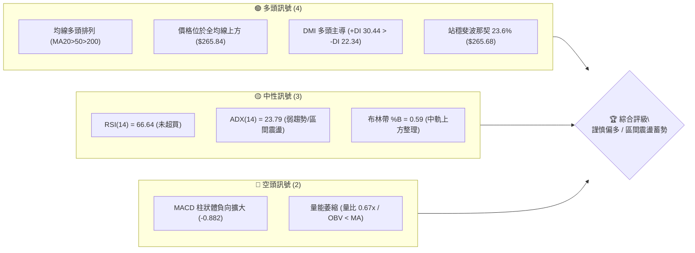
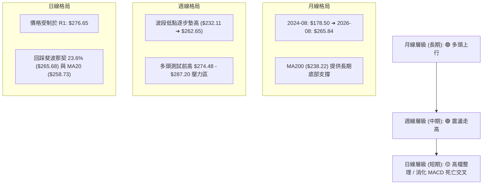
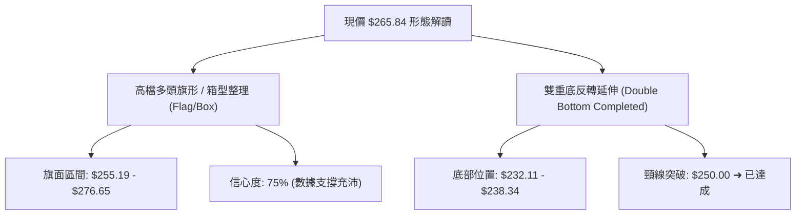
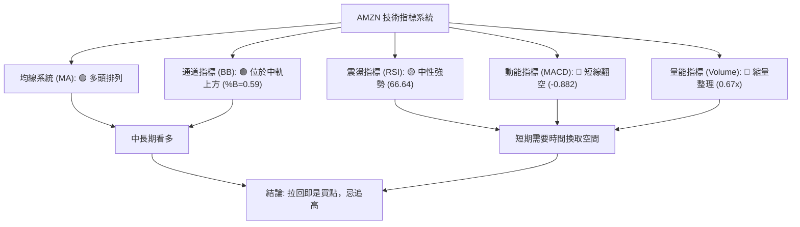
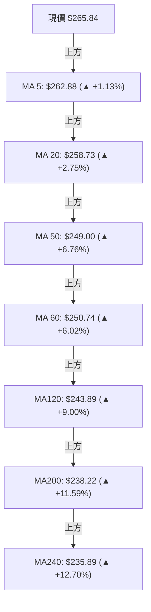
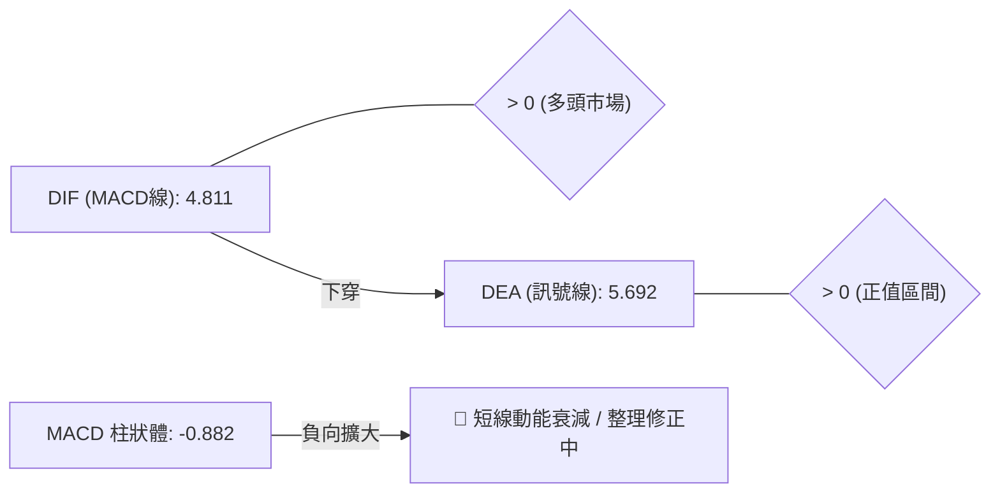
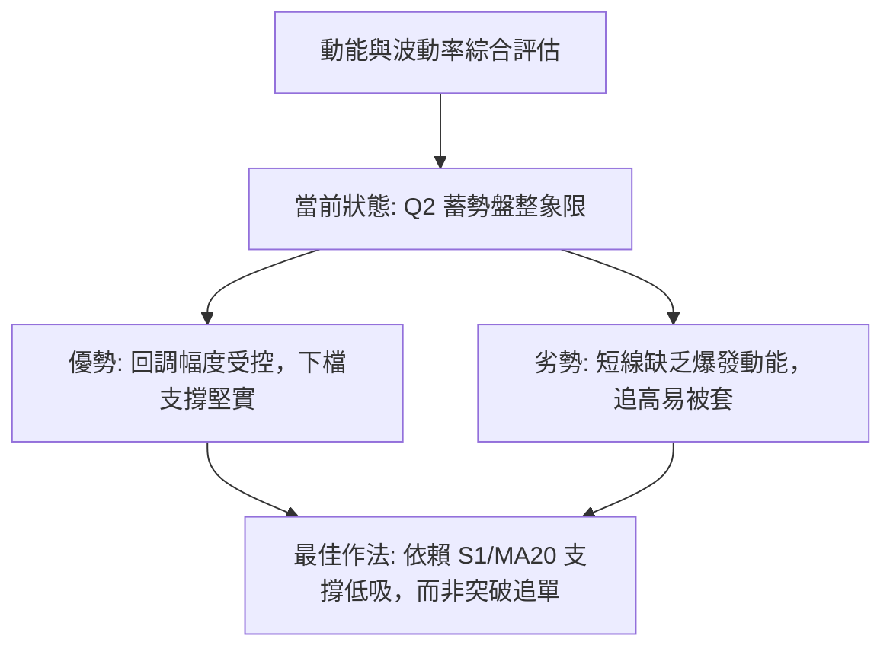
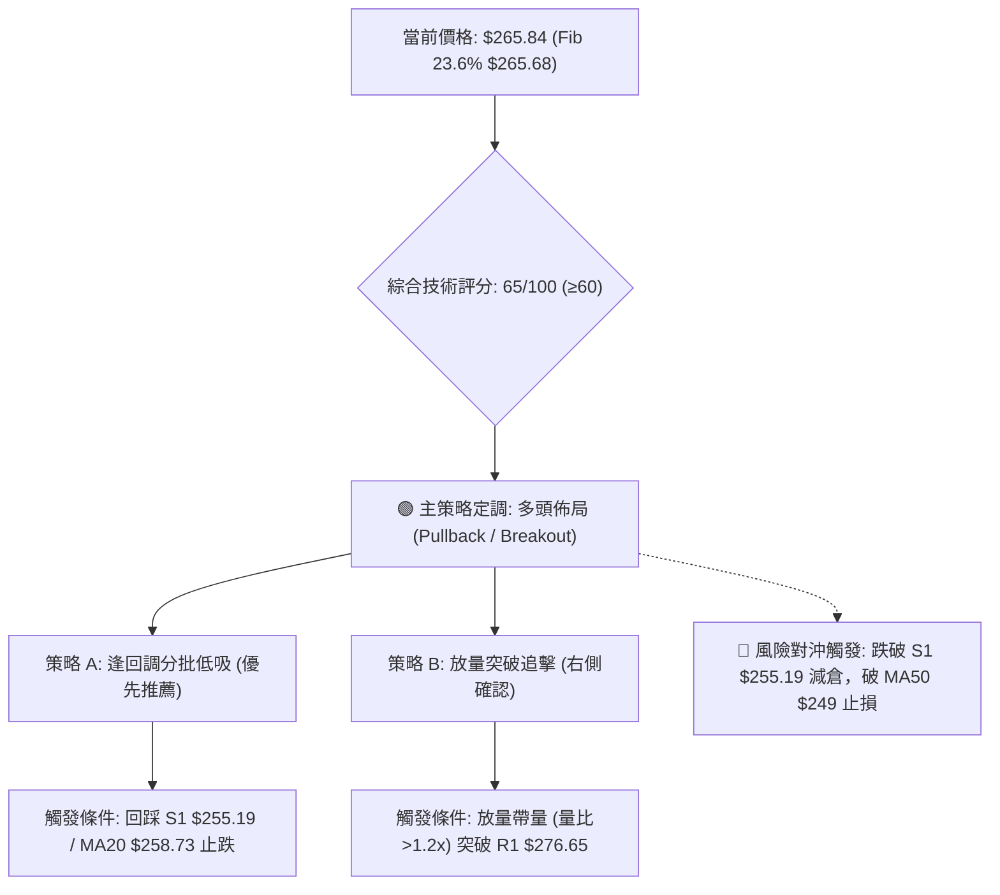
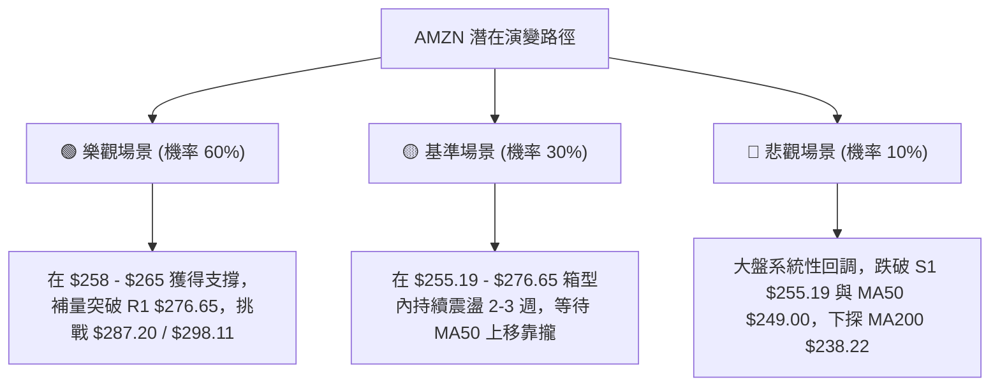

# AMZN 技術分析報告

> **報告日期**：2026-08-19 ｜ **語言**：繁體中文 ｜ **數據來源**：Yahoo Finance ｜ **當前價格**：$265.84

---

## 目錄

| 章節 | 內容 |
|------|------|
| [1. 技術面概覽](#1-技術面概覽) | 訊號儀表板、核心指標速覽、技術評分卡 |
| [2. 趨勢分析](#2-趨勢分析) | 多時框趨勢判斷、12個月歷史走勢圖、ADX趨勢強度評估 |
| [3. 圖表形態分析](#3-圖表形態分析) | 形態識別與信心度、K線組合解讀、ASCII形態示意與目標價 |
| [4. 支撐與阻力](#4-支撐與阻力) | 關鍵價位分佈圖、阻力/支撐層級分析、斐波那契回調結構 |
| [5. 技術指標深度解讀](#5-技術指標深度解讀) | 均線系統、RSI/MACD動能與背離、布林通道與成交量OBV |
| [6. 動能與波動率](#6-動能與波動率) | 動能四象限、ATR波動分析與止損設定、Beta市場關聯度 |
| [7. 多時框架總結](#7-多時框架總結) | 時框架評分表、訊號矩陣、多時框收斂定調 |
| [8. 交易策略建議](#8-交易策略建議) | 策略決策流、主策略詳情（進場/止損/目標/盈虧比）、風險對沖 |
| [9. 風險提示與監控](#9-風險提示與監控) | 關鍵監控Checklist、情境風險分析、資金管理守則 |

---

## 1. 技術面概覽

### 🎯 技術訊號儀表板



---

### 📊 核心指標速覽表

| 指標類別 | 指標名稱 | 當前數值 | 訊號 | 技術解讀與影響 |
|:---|:---|:---|:---:|:---|
| **現價基準** | 收盤價 | **$265.84** | 🟢 | 位於52週區間 76.6% 高位，距離 52W 高點 $287.20 僅差 8.03% |
| **短期均線** | MA20 | **$258.73** | 🟢 | 價格在均線上方 +2.75%，提供短期強勁動態支撐 |
| **中期均線** | MA50 | **$249.00** | 🟢 | 價格在均線上方 +6.76%，中期多頭防線穩固 |
| **長期均線** | MA200 | **$238.22** | 🟢 | 長期牛熊分界線上揚，中長線多頭基底堅實 |
| **震盪指標** | RSI(14) | **66.64** | 🟡 | 位於強勢中性區，無頂背離跡象，具備上攻空間 |
| **趨勢指標** | MACD (12,26,9) | **4.811 / Sig: 5.692** | 🔴 | DIF < DEA，MACD Hist 為 **-0.882**，日線層級處於短線回調修復 |
| **趨勢強度** | ADX(14) | **23.79** | 🟡 | 數值 < 25，顯示當前缺乏單邊爆發力，處於多頭架構下的區間盤整 |
| **波動指標** | ATR(14) | **$9.46** (3.56%) | 🟡 | 波動度適中，提供交易者合理的止損空間與波段獲利預期 |
| **通道指標** | 布林通道 | **$258.73 - $296.99** | 🟢 | %B 為 0.59，價格處於中軌之上，未觸及上軌超買壓制 |
| **量能指標** | 成交量比 | **0.67x** (32.46M/48.73M) | 🔴 | 縮量整理，OBV 低於均線，顯示買盤追高意願減弱，需補量突破 |

---

### 🏆 技術評分卡

```
╔══════════════════════════════════════════════════════════════════╗
║                技術評分卡 — AMZN (2026-08-19)                   ║
╠══════════════════════════════════════════════════════════════════╣
║ 均線排列 (MA System)     ████████████████░░░░  80/100  🟢 強勢多頭 ║
║ 支撐穩定度 (Support)     ██████████████░░░░░░  70/100  🟢 階梯支撐 ║
║ 動能指標 (Momentum/RSI)  ████████████░░░░░░░░  60/100  🟡 中性偏強 ║
║ 形態結構 (Pattern)       ████████████░░░░░░░░  60/100  🟡 高檔旗形 ║
║ 趨勢強度 (ADX/DMI)       ██████████░░░░░░░░░░  50/100  🟡 弱勢盤整 ║
║ 成交量配合 (Volume/OBV)  ████████░░░░░░░░░░░░  40/100  🔴 量能萎縮 ║
╠══════════════════════════════════════════════════════════════════╣
║ 綜合技術評分             █████████████░░░░░░░  65/100  🟢 謹慎偏多 ║
╚══════════════════════════════════════════════════════════════════╝
```

---

## 2. 趨勢分析

### 🌐 多時框趨勢分析



---

### 📈 長期趨勢 — 12個月走勢圖（Unicode）

```
AMZN 月線走勢圖（2025-08 至 2026-08）
價格軸 ($)
$290 ┤                                                    
$280 ┤                                         ● $271.58  
$270 ┤                                 ● $270.64    │     ● $265.84 (現價)
$260 ┤                         ● $265.06     │      │     │
$250 ┤                   ● $244.22     │     │      │     │
$240 ┤             ● $239.30     │     │     │  ● $238.34 │
$230 ┤ ● $229.00   │     │       │     │     │  │   │     │
$220 ┤   │  ● $219.57    │       │     │     │  │   │     │
$210 ┤   │    │    │     │ ● $210.00   │     │  │   │     │
$200 ┤   │    │    │     │   │   ● $208.27   │  │   │     │
     └─┬───┬───┬───┬───┬───┬───┬───┬───┬───┬───┬───┬───┬────
      08  09  10  11  12  01  02  03  04  05  06  07  08 (月份)
      25  25  25  25  25  26  26  26  26  26  26  26  26 (年份)
```

#### 走勢特徵分析表格

| 階段區間 | 起始-結束價位 | 區間漲跌幅 | 形態與量價特徵 | 趨勢定調 |
|:---|:---:|:---:|:---|:---:|
| **2025 Q3-Q4** | $229.00 ➜ $230.82 | +0.79% | 於 $219.57 至 $244.22 間構築高檔箱型平台 | 🟡 平台整理 |
| **2026 Q1** | $239.30 ➜ $208.27 | -12.97% | 春季深度回撤，探明 52W 低點 $196.00 附近的波段低點 $208.27 | 🔴 築底回踩 |
| **2026 Q2** | $208.27 ➜ $270.64 | **+29.95%** | 強勢 V 型反轉，放量突破 $240 與 $260 關卡 | 🟢 主升波段 |
| **2026 Q3 (至今)** | $238.34 ➜ $265.84 | +11.54% | 回踩 $238.34 洗盤後快速拉升至 $274.48，現於 $265.84 窄幅蓄勢 | 🟢 高檔震盪 |

---

### 📊 中期趨勢（週線分析）

```
週線支撐阻力結構示意圖
$287.20 ───────────────────────────────────────── 52W 高點 (R2 強阻力)
                     ▲
$276.65 ────────────┼──────────────────────────── 波段高點聚類 (R1 阻力)
                    │  [當前價格 $265.84 / Fib 23.6% $265.68]
$258.73 ────────────┴──────────────────────────── MA20 / 布林中軌
$255.19 ───────────────────────────────────────── 近期波段支撐 (S1)
$249.00 ───────────────────────────────────────── MA50 中期生命線
$238.22 ───────────────────────────────────────── MA200 牛熊分水嶺
```

從近 20 週數據觀察，AMZN 在 2026 年 7 月底（2026-07-26 收盤 $232.11）完成強力洗盤後，於 8 月初放量大陽線拉升至 $271.58（單週成交量達 355.37M），隨後創下波段高點 $274.48。近兩週（08-16 收盤 $262.65、08-23 當週 $265.84）呈現典型的高檔縮量回洗，守穩於 S1 支撐 $255.19 之上。

---

### ⚡ 趨勢強度評估（ADX 解讀）

```mermaid
graph TD
    ADX_VAL["ADX (14) = 23.79"] --> ADX_JUDGE{"趨勢強度判定"}
    ADX_JUDGE -->|"< 25|"> NON_TREND["弱趨勢 / 處於區間震盪收斂"]
    
    DMI_PLUS["+DI = 30.44"] & DMI_MINUS["-DI = 22.34"] --> DMI_JUDGE{"方向主導判定"}
    DMI_JUDGE -->|"+DI > -DI"| BULL_DOM["多方力量仍佔據主導優勢"]
    
    NON_TREND & BULL_DOM --> SYNTHESIS["綜合解讀: 多頭架構完好，但缺乏單邊爆發力，適合區間操作"]
```

| 指標名稱 | 當前數值 | 參考閾值 | 狀態評估 | 技術含義 |
|:---|:---:|:---:|:---:|:---|
| **ADX(14)** | **23.79** | 25.00 | 🟡 盤整狀態 | 低於 25 臨界值，表明當前非單邊強趨勢行情，價格容易在區間內反覆拉鋸 |
| **+DI** | **30.44** | 20.00 | 🟢 多方佔優 | 多方力量高於基準線，顯示多頭動能依然主導整體格局 |
| **-DI** | **22.34** | 20.00 | 🟡 空方受抑 | 空方動能雖然回升但仍明顯落後於 +DI，未構成系統性反轉威脅 |

---

## 3. 圖表形態分析

### 🔍 形態識別系統



#### 形態信心度與目標價評估表

| 識別形態 | 信心度 | 判斷依據（數據引用） | 形態完成度 | 目標價計算公式與數值 |
|:---|:---:|:---|:---:|:---|
| **高檔多頭旗形 (Bull Flag)** | **75%** | 8月初由 $232.11 急拉至 $274.48 形成旗桿；現於 $262.65 - $271.58 縮量整理 | 70% | 突破 R1 後目標 = 突破點 $276.65 + 旗桿高度 ($274.48 - $232.11 = $42.37) = **$319.02** |
| **區間震盪箱型 (Range Box)** | **85%** | 價格受壓於阻力 R1 $276.65，獲得支撐 S1 $255.19 承接 | 90% | 箱頂突破目標 = R1 $276.65 + 箱高 ($276.65 - $255.19 = $21.46) = **$298.11** |
| **頭肩底延伸型態** | **45%** | 2026年3月低點 $208.27 為頭部，6/7月為左右肩，但右肩波動偏大 | 100% (已完成) | 訊號不足且已走完，僅做均線趨勢與指標型解讀 |

---

### 🕯️ 重要K線形態分析

| 月份/週期 | 收盤價 | 典型 K 線組合 | 技術解讀 | 多空訊號 |
|:---|:---:|:---|:---|:---:|
| **2026-06** | $238.34 | 長下影錘頭線 (Hammer) | 探底 $232.69 後強勁回升，確認長期 MA200 ($238.22) 支撐有效 | 🟢 強烈買訊 |
| **2026-07** | $271.58 | 光頭大陽線 (Marubozu) | 單月暴漲 +13.9%，實體大陽線收復所有失地，奠定多頭攻勢 | 🟢 多頭確立 |
| **2026-08 (當前)** | $265.84 | 高檔窄幅孕線 (Harami) | 在前月大陽線內部縮量整理，反映多空雙方在 R1 $276.65 前觀望 | 🟡 蓄勢整理 |

---

### 📉 ASCII 走勢形態示意圖

```
AMZN 高檔旗形與箱型結構解析
$287.20 ────────────────────────────────────────────── [52W 歷史極值 R2]
                   ▲
$276.65 ───────┐  │ (R1 阻力) 突破點 
               │  │
$271.58 ───●───┼──┼─────────────────────────────── 旗形上軌
            ╲  │  │   ● $265.84 (現價蓄勢)
$265.68 ─────╲─┼──┼───╱────────────────────────── Fib 23.6% 關鍵平衡線
              ╲│  │  ╱
$258.73 ───────●──┴─●───────────────────────────── MA20 / 旗形下軌支撐
               │
$255.19 ───────┴────────────────────────────────── [波段低點聚類 S1 防線]
               
旗桿起點: $232.11 (2026-07-26) ──► 旗桿頂點: $274.48 (2026-08-09) [旗桿長度: $42.37]
```

---

### 🎯 形態目標價計算

1. **第一道幾何目標（箱型突破目標）**：
   * 計算公式：$\text{突破點 (R1)} + (\text{R1} - \text{S1}) = 276.65 + (276.65 - 255.19) = 276.65 + 21.46$
   * 數值：**$298.11**（與布林上軌 $296.99 產生技術共振）。
2. **第二道幾何目標（多頭旗形等長測幅）**：
   * 計算公式：$\text{突破點 (R1)} + \text{旗桿高度} = 276.65 + (274.48 - 232.11) = 276.65 + 42.37$
   * 數值：**$319.02**（逼近華爾街分析師平均目標價 $327.00）。

---

## 4. 支撐與阻力

### 🗺️ 關鍵價位分布圖（Unicode）

```
AMZN 價位結構分布圖
══════════════════════════════════════════════════════════════════
$287.20 ║████████████████████████████████║ 52週最高點 / 強阻力 R2
$276.65 ║████████████████████            ║ 波段高點聚類 / 關鍵阻力 R1
══════════════════════════════════════════════════════════════════
$265.84 ╠════════════════════════════════╣ ◄ 現價 (Fib 23.6% $265.68)
══════════════════════════════════════════════════════════════════
$258.73 ║▓▓▓▓▓▓▓▓▓▓▓▓▓▓▓▓▓▓▓▓▓▓          ║ 動態支撐 (MA20 / 布林中軌)
$255.19 ║████████████████████████        ║ 近期波段支撐 S1
$249.00 ║▓▓▓▓▓▓▓▓▓▓▓▓▓▓                  ║ 中期生命線 (MA50)
$241.60 ║▓▓▓▓▓▓▓▓▓▓▓▓                    ║ 斐波那契 50.0% 回調位
$238.22 ║████████████████████████████    ║ 長期多空分水嶺 (MA200)
$224.63 ║████████████████████            ║ 中期強支撐 S2
$215.82 ║████████████████                ║ 極限支撐 S3 (Fib 78.6% $215.52)
══════════════════════════════════════════════════════════════════
```

---

### 🚧 阻力位分析表

| 阻力級別 | 精確價位 | 距離現價 | 形成原因與技術意義 | 突破難度 | 重要性評級 |
|:---|:---:|:---:|:---|:---:|:---:|
| **阻力位 R1** | **$276.65** | +4.07% | 近一年波段高點密集聚類區，前波反彈高點 $274.48 附近壓力 | 🟡 中等 | 🟢🟢🟢 關鍵樞紐 |
| **阻力位 R2** | **$287.20** | +8.03% | 52週歷史最高點，波段獲利了結與歷史套牢盤解套重壓區 | 🔴 極高 | 🟢🟢🟢 極限目標 |

---

### 🛡️ 支撐位分析表

| 支撐級別 | 精確價位 | 距離現價 | 形成原因與技術意義 | 守住機率 | 重要性評級 |
|:---|:---:|:---:|:---|:---:|:---:|
| **支撐位 S1** | **$255.19** | -4.01% | 近期波段低點聚類，與 MA20 ($258.73) 構成複合防守緩衝帶 | 🟢 80% | 🟢🟢🟢 短線生命線 |
| **支撐位 S2** | **$224.63** | -15.50% | 2025年下半年多次觸底反彈的平台頂部與起漲點結構 | 🟢 90% | 🟢🟢 中期防線 |
| **支撐位 S3** | **$215.82** | -18.81% | 2025-2026年大底部密集交易區，與 Fib 78.6% ($215.52) 重疊 | 🟢 98% | 🟢 長期鐵底 |

---

### 📐 斐波那契回調位分析

依據 52 週區間（低點 **$196.00** $\rightarrow$ 高點 **$287.20**，振幅 **$91.20**）嚴格計算：

| 斐波那契回調層級 | 計算價位 | 當前位置解讀與操作含義 |
|:---|:---:|:---|
| **0.0% (52W High)** | **$287.20** | 終極多頭目標區，若有效突破將開啟無套牢盤的新牛市空間 |
| **23.6%** | **$265.68** | **◄ 現價 $265.84 完美重合處**。極淺層回調位，代表多頭控制力極強 |
| **38.2%** | **$252.36** | 關鍵多頭防守位，落於 S1 ($255.19) 與 MA50 ($249.00) 之間 |
| **50.0%** | **$241.60** | 多空平衡中軸線，接近 MA200 ($238.22) |
| **61.8%** | **$230.84** | 黃金分割防守位，跌破代表本輪 $196.00 起漲之上升趨勢遭破壞 |
| **78.6%** | **$215.52** | 深度回調極限，與 S3 支撐 $215.82 形成雙重技術共振 |
| **100.0% (52W Low)** | **$196.00** | 52 週最低點，長期價值投資築底區間 |

---

## 5. 技術指標深度解讀

### 🎛️ 指標訊號總覽



---

### 📈 移動平均線排列分析



| 均線名稱 | 當前數值 | 與現價差距 | 斜率方向 | 技術評價 |
|:---|:---:|:---:|:---:|:---|
| **MA 5** | $262.88 | +1.13% | 向上 ↗ | 短線微幅反彈，收復極短期失地 |
| **MA 10** | $267.88 | -0.76% | 向下 ↘ | 短線微幅受阻，現價位於其下方，形成第一道日內壓制 |
| **MA 20** | $258.73 | +2.75% | 向上 ↗ | 短期月線生命線，提供強勁多頭推進力 |
| **MA 50** | $249.00 | +6.76% | 向上 ↗ | 中期季線防線，多頭排列核心支柱 |
| **MA 200** | $238.22 | +11.59% | 向上 ↗ | 長期年線牛熊分界，斜率穩定向上，長多格局無虞 |

---

### 📉 RSI(14) 分析

```
RSI(14) 當前數值: 66.64
[0] ─────────────── [30 超賣] ─────────────── [50 中軸] ────── [66.64 現值] ── [70 超買] ─────────────── [100]
進度條: ███████████████████████████████████░░░░░░░░░░░░░░░░░  66.64%
```

* **數值評估**：RSI(14) 位於 **66.64**，處於 50–70 之強勢多頭區間，尚未進入 >70 之嚴重超買過熱區，具備進一步向上拓展的彈性。
* **背離檢驗**：
  * 2026-04-19 週線 RSI 曾高達 97.5（對應收盤 $250.56）；隨後 2026-08-09 價格創出 $274.48 新高時，週線 RSI 為 62.9。
  * **結論**：日線維度未見典型頂背離，但週線動能自 4 月極端值後逐步正常化降溫，目前進入健康動能修復期，**無立即性崩跌背離風險**。

---

### 📊 MACD(12,26,9) 訊號解讀



* **數據狀態**：DIF (**4.811**) 位於零軸之上，DEA (**5.692**) 亦在零軸之上，表明大格局仍屬於零軸上的強勢多頭市場。
* **交叉分析**：DIF 運行於 DEA 之下，MACD Histogram 呈現 **-0.882**，確認短期進入死叉修正波段，此為近兩週價格自 $274.48 回踩的主因。由於雙線仍在零軸上方深處，屬多頭回調而非轉空。

---

### 📦 布林通道分析

```
AMZN 布林通道位置示意圖 (BB 20, 2)
$296.99 ────────────────────────────────────────── BB 上軌 (波動極限壓力)
                    │
                    │   [%B = 0.59]
$265.84 ────────────● ◄ 現價位於中軌與上軌之間
                    │
$258.73 ────────────────────────────────────────── BB 中軌 (MA20 強支撐)
                    │
                    │
$220.47 ────────────────────────────────────────── BB 下軌 (超賣極限保護)
```

* **帶寬與位置**：通道帶寬開口適度，中軌 $258.73 向上傾斜。當前 %B 為 **0.59**，表明價格平穩運行在中軌上方，健康消化獲利籌碼，下方空間受中軌與 S1 ($255.19) 雙重保護。

---

### 💹 成交量分析（量價配合度）

* **量能指標**：最新單日成交量為 **32,458,494 股**，對比 20 日均量 **48,730,260 股**，量比僅為 **0.67x**（縮量 33.4%）。
* **OBV (能量潮)**：OBV < MA，量能指標落後於價格走勢，呈現「價漲量縮」的高檔背離現象。
* **解讀**：縮量回調屬於良性洗盤（主力未大幅出逃），但若欲向上實質突破 R1 ($276.65) 與 52W 高點 R2 ($287.20)，單日成交量必須放大至 50M 股以上（量比 > 1.2x）方能確認突破有效。

---

## 6. 動能與波動率

### ⚡ 動能評估四象限

| 象限分區 | 動能強度 | 波動率水準 | 當前 AMZN 狀態 | 交易策略導向 |
|:---:|:---:|:---:|:---:|:---|
| **Q1 (最佳爆發)** | 強動能 (ADX>25) | 低波動 (ATR%<3%) | ❌ | 順勢重倉追突破 |
| **Q2 (蓄勢盤整)** | **弱動能 (ADX 23.79)** | **適中偏低 (ATR% 3.56%)** | **✅ 當前狀態** | **逢低分批佈局，耐心等待區間突破** |
| **Q3 (高危博弈)** | 強動能 (ADX>35) | 高波動 (ATR%>5%) | ❌ | 嚴格緊跟移動止損 |
| **Q4 (流動性衰退)** | 弱動能 (ADX<20) | 高波動 (ATR%>5%) | ❌ | 觀望離場 |



---

### 📊 ATR 波動率分析

* **ATR(14) 數值**：**$9.46**（佔當前股價之 **3.56%**）。
* **每日預期波動區間**：$265.84 $\pm$ $9.46 $\rightarrow$ **$256.38 - $275.30**。
* **交易止損設定指引**：
  * **激進日內/短線交易**：1.0 $\times$ ATR = **$9.46** 緩衝 $\rightarrow$ 止損點設於 $265.84 - $9.46 = **$256.38**（貼近 MA20 $258.73）。
  * **波段趨勢交易**：1.5 $\times$ ATR = **$14.19** 緩衝 $\rightarrow$ 止損點設於 $265.84 - $14.19 = **$251.65**（置於 S1 $255.19 之下、MA50 $249.00 之上）。

---

### 📐 Beta 與市場相關性

* **Beta 係數**：**1.454**。
* **市場特徵**：AMZN 具備顯著的高彈性成長股特徵，波動幅度約為 S&P 500 大盤的 **1.45 倍**。在大盤處於多頭或反彈格局時具備超額 Alpha 收益潛力，但若市場整體遭遇流動性衝擊，其回撤速度亦快於大盤。
* **籌碼結構**：機構持股佔比達 **68.8%**，內部人持股 **8.9%**，空頭比例僅 **1.0%**（Short Ratio 2.1 天），籌碼面極為穩定，無逼空或被大舉做空的系統性籌碼風險。

---

## 7. 多時框架總結

### 📋 時框架評分表

| 時框架 | 趨勢方向 | 動能狀態 | 均線排列 | 形態特徵 | 綜合評分 | 戰術建議 |
|:---|:---:|:---:|:---:|:---:|:---:|:---|
| **月線 (長期)** | 🟢 多頭向上 | 🟢 強勁 | 🟢 MA200上揚 | 底部反轉後的主升波 | **85/100** | 長線堅定持股，逢大回調加碼 |
| **週線 (中期)** | 🟢 震盪走高 | 🟡 高檔降溫 | 🟢 MA20>MA50 | 回踩 $232 後放量上攻 | **75/100** | 波段多頭持有，以 MA50 為界 |
| **日線 (短期)** | 🟡 區間蓄勢 | 🔴 MACD死叉 | 🟢 均線多頭 | 高檔旗形/箱型縮量 | **60/100** | 區間低吸高拋，等待補量突破 |

---

### 🔲 綜合訊號矩陣

| 分析維度 | 多頭訊號 | 中性訊號 | 空頭訊號 | 一致性研判 |
|:---|:---:|:---:|:---:|:---|
| **趨勢 (Trend)** | ✔ (月/週/日均線多頭) | — | — | 100% 多頭一致性 |
| **動能 (Momentum)** | — | ✔ (RSI 66.64) | ✔ (MACD Hist < 0) | 短期動能分歧，處於回調期 |
| **價量 (Volume/Price)** | — | ✔ (布林中軌運行) | ✔ (OBV < MA, 縮量) | 需量能確認突破 |
| **空間 (S/R Levels)** | ✔ (站穩 Fib 23.6%) | — | — | 支撐結構完整且密集 |

---

### ⚖️ 多時框收斂結論

> **依據多時框收斂規則（ADX = 23.79 < 25 判定為盤整行情）**：
>
> 1. **主導維度定調**：日線 ADX < 25 表明短期處於非趨勢的區間盤整階段，短期交易應以**日線布林通道 ($258.73 - $296.99) 與關鍵價位 S1 ($255.19) - R1 ($276.65)** 為主要運作區間。
> 2. **中長期趨勢背書**：中長期週線與月線均線呈現完整的多頭排列（MA20 > MA50 > MA200），表明中長線牛市格局未變。因此，**日線級別的盤整與指標修復，是中長期多頭行情中的「中繼洗盤」而非反轉**。
> 3. **唯一方向性結論**：**【謹慎偏多 — 區間回踩低吸】**。

---

## 8. 交易策略建議

### 🗺️ 策略決策流程圖



---

### 🧭 策略路由

**當前主策略方向 = 🟢 偏多多頭策略（依據綜合評分 65/100，大於 60 分閾值）**。

空頭方向不作為主推交易策略，僅列為下行風險對沖與止損防禦參考。

---

### 🎯 價格情境階梯（Price Scenarios）

| 觸發條件 | 即時路徑 | 下一目標 | 後續延伸目標 | 行情結構與含義 |
|:---|:---:|:---:|:---:|:---|
| **向上突破 R1 $276.65** | 站上 $277.00 | **R2 $287.20** | **$298.11 / $319.02** | 短線整理結束，開啟主升浪挑戰歷史新高 |
| **維持現價區間震盪** | $258.73 - $276.65 | **$265.68** | — | 於 Fib 23.6% 與布林中軌間消化獲利賣壓 |
| **向下跌破 S1 $255.19** | 跌穿 $255.00 | **MA50 $249.00** | **S2 $224.63** | 日線多頭架構轉弱，進入深次回調洗盤 |

---

### 📊 情境機率分佈

```
情境機率分佈圖
繼續上行突破 (60%): ██████████████████████████████
區間橫盤震盪 (30%): ███████████████
跌破支撐轉弱 (10%): █████
```

| 預期情境 | 發生機率 | 主要技術依據 |
|:---|:---:|:---|
| **情境一：震盪後向上突破** | **60%** | 均線多頭排列完好，RSI 未超買 (66.64)，基本面強勁支撐，高檔洗盤接近尾聲 |
| **情境二：維持區間橫盤** | **30%** | ADX 僅 23.79 缺乏動能，MACD 處於死叉修復期，成交量低迷 (量比 0.67x) |
| **情境三：向下回踩深跌** | **10%** | S1 $255.19 與 MA20/MA50 構成重重均線防護網，除非大盤遭遇黑天鵝暴跌 |

---

### 🟢 主策略詳情

依據嚴格技術紀律，提供兩套操作路徑，所有價位均嚴格錨定關鍵支撐阻力數值：

| 策略要素 | 策略 A：支撐位逢低佈局（左側/中繼） | 策略 B：阻力位突破追擊（右側確認） |
|:---|:---|:---|
| **交易類型** | 回調低吸（Pullback Buy） | 動能突破（Breakout Buy） |
| **進場條件** | 價格回踩 S1 與 MA20 區間且出現日內止跌K線 | 日K收盤價實體突破 R1，且當日量比 > 1.2x |
| **精確進場價格** | **$256.00 - $258.73** | **$277.00**（突破 $276.65 後確認） |
| **第一目標價 T1** | **$276.65**（阻力 R1，預期獲利 +7.4%） | **$287.20**（52W高點 R2，預期獲利 +3.7%） |
| **第二目標價 T2** | **$287.20**（阻力 R2，預期獲利 +11.5%） | **$298.11**（形態測幅目標，預期獲利 +7.6%） |
| **精確止損價格** | **$251.50**（跌破 S1 $255.19 及 1.5 ATR 緩衝） | **$268.00**（跌回 R1 原阻力轉支撐下方） |
| **風險報酬比 (R:R)**| **1 : 3.25**（以 T2 計算：風險 $5.50 / 獲利 $17.90） | **1 : 2.34**（以 T2 計算：風險 $9.00 / 獲利 $21.11） |
| **成功預估機率** | **65%** | **60%** |
| **建議配置倉位** | **總資金 15% - 20%**（分兩批建倉） | **總資金 10% - 15%**（突破後順勢加碼） |

---

### 🔴 反向風險觸發點（對沖與風控提示）

若市場出現不利變化，觸發以下條件應立即執行風控，切勿盲目死守：
1. **多頭警戒線**：若日K收盤**跌破 S1 ($255.19)**，多頭形態受損，應主動將多頭倉位削減 50%。
2. **多頭停損線**：若收盤價**跌破 MA50 ($249.00)**，代表中期上升趨勢遭到破壞，應全面清倉多頭並離場觀望。
3. **反手對沖觸發點**：若價格帶量跌破 **$241.60 (Fib 50.0%)**，可建立小額反向空頭或購買 Put 期權進行避險對沖，下看 S2 ($224.63)。

---

### ⭐ 整體訊號強度評星

```
做多訊號強度：★★★★☆  (4.0/5星 — 均線與多時框多頭，受限於短線MACD)
做空訊號強度：★☆☆☆☆  (1.0/5星 — 逆大趨勢，下檔均線支撐密集)
整體可信度：  ★★★★☆  (4.0/5星 — 價位結構清晰，斐波那契與S/R共振強)
```

---

## 9. 風險提示與監控

### ✅ 關鍵監控指標 Checklist

```
╔══════════════════════════════════════════════════════════════════╗
║                   每日交易監控 Checklist                         ║
╠══════════════════════════════════════════════════════════════════╣
║ [ ] 價格能否守穩 Fib 23.6% ($265.68) 及 MA20 ($258.73)          ║
║ [ ] MACD 柱狀體何時收斂（數值由 -0.882 向上拐頭靠近 0 軸）        ║
║ [ ] 日成交量能否回升至 20日均量 (48.73M 股) 之上（補量訊號）       ║
║ [ ] RSI(14) 能否維持在 50 中軸之上運作（多方動能底線）            ║
║ [ ] 向上挑戰 R1 ($276.65) 時，是否存在假突破長上影線            ║
║ [ ] 跌破 S1 ($255.19) 時，是否果斷執行 50% 倉位減免               ║
╚══════════════════════════════════════════════════════════════════╝
```

---

### ⚠️ 風險場景分析



---

### 🛡️ 風險管理重要提醒

1. **波動管理（ATR 與倉位計算）**：
   * 鑑於 AMZN 的 ATR 為 **$9.46 (3.56%)**，單日波動較大，單筆交易虧損金額切勿超過總投資組合淨值的 **1.0% - 1.5%**。
   * 若使用策略 A（止損空間約 $7.23），以總資本 $100,000 為例，單次最大風險額度為 $1,000，則建議最大持股數量為：
     $$\text{持股股數} = \frac{\$1,000}{\$7.23} \approx 138 \text{ 股（約佔總資金 \$35,000 / 35% 倉位上限）}$$
2. **Beta 風險乘數**：
   * AMZN Beta 為 **1.454**，具有放大市場波動的特質。在大盤（如 QQQ、SPY）出現單日大跌超過 1.5% 時，應暫停任何突破追買操作，靜待市場情緒企穩。
3. **無通靈紀律**：
   * 嚴格按照「破支撐停損、過阻力加碼」的右側交易原則執行，不得在 MACD 柱狀體大幅擴大下跌時盲目接飛刀。

---

## 📋 報告總結

```
╔══════════════════════════════════════════════════════════════════╗
║                    AMZN 技術分析報告總結                         ║
╠══════════════════════════════════════════════════════════════════╣
║ 報告日期：2026-08-19                當前價格：$265.84           ║
║ 分析評級：🟢 謹慎偏多 (蓄勢待發)    技術評分：65 / 100          ║
╠══════════════════════════════════════════════════════════════════╣
║ 關鍵結論：                                                       ║
║ ├─ 長期趨勢：🟢 強勢多頭 (月線與 MA200 $238.22 穩定向上)        ║
║ ├─ 中期趨勢：🟢 震盪走高 (守穩週線回調位與 MA50 $249.00)         ║
║ ├─ 短期趨勢：🟡 高檔蓄勢 (MACD 死叉修正中，受制於 R1 $276.65)    ║
║ ├─ 關鍵支撐：S1: $255.19 ｜ MA20: $258.73 ｜ MA50: $249.00     ║
║ ├─ 關鍵阻力：R1: $276.65 ｜ R2 (52W高點): $287.20               ║
║ └─ 華爾街目標價：平均 $327.00 (最高 $405.00 / 最低 $230.00)     ║
╠══════════════════════════════════════════════════════════════════╣
║ 最優策略組合：                                                   ║
║ 1. 🥇 最佳機會（策略 A）：於 $256.00 - $258.73 分批低吸，        ║
║    止損 $251.50，目標 $276.65 / $287.20 (R:R = 1:3.25)。        ║
║ 2. 🥈 次選機會（策略 B）：帶量突破 R1 $276.65 追擊，            ║
║    止損 $268.00，目標 $287.20 / $298.11 (R:R = 1:2.34)。        ║
║ 3. 🥉 保守選擇：維持 30% 基本多頭部位，等待 ADX > 25 且 MACD 轉  ║
║    正後再行加碼。                                               ║
╚══════════════════════════════════════════════════════════════════╝
```

---

> ⚠️ **免責聲明**：本報告為依據量化技術指標與價格數據生成之專業技術分析研究，所有點位與估算均基於歷史價格與數學模型計算。本報告**僅供學術研究與投資參考**，**不構成任何形式的個人化投資建議或買賣邀約**。金融市場瞬息萬變，投資人應獨立審慎評估風險並自負盈虧。

---

*報告生成時間：2026-08-19 ｜ 數據來源：Yahoo Finance ｜ 分析框架：多時框技術量化系統*