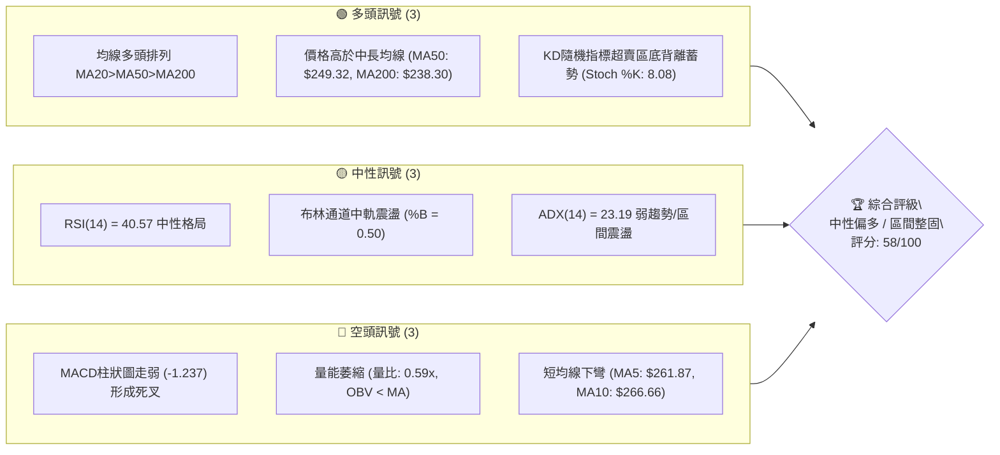
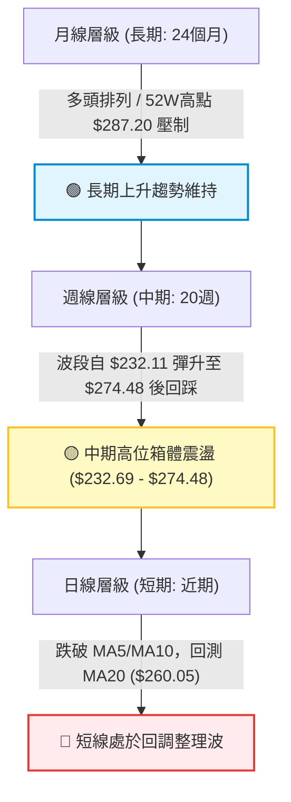
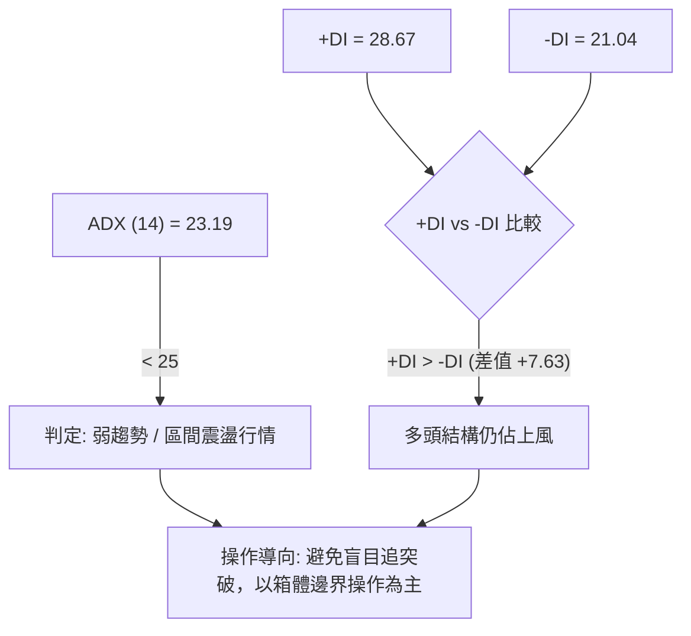
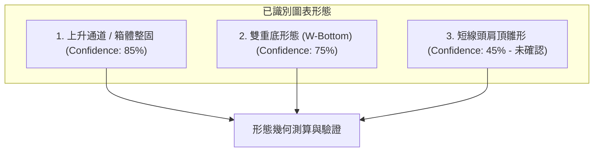
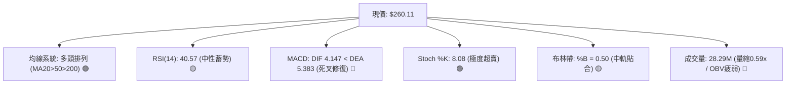
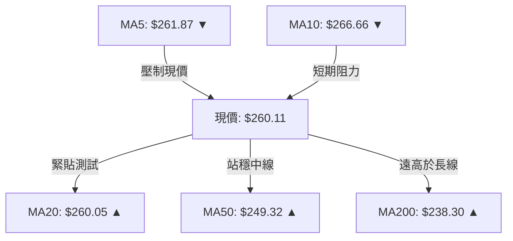
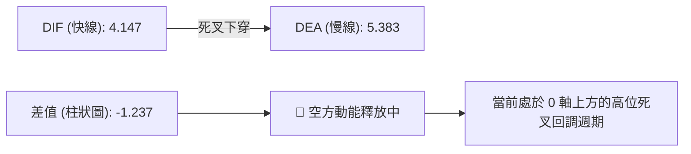
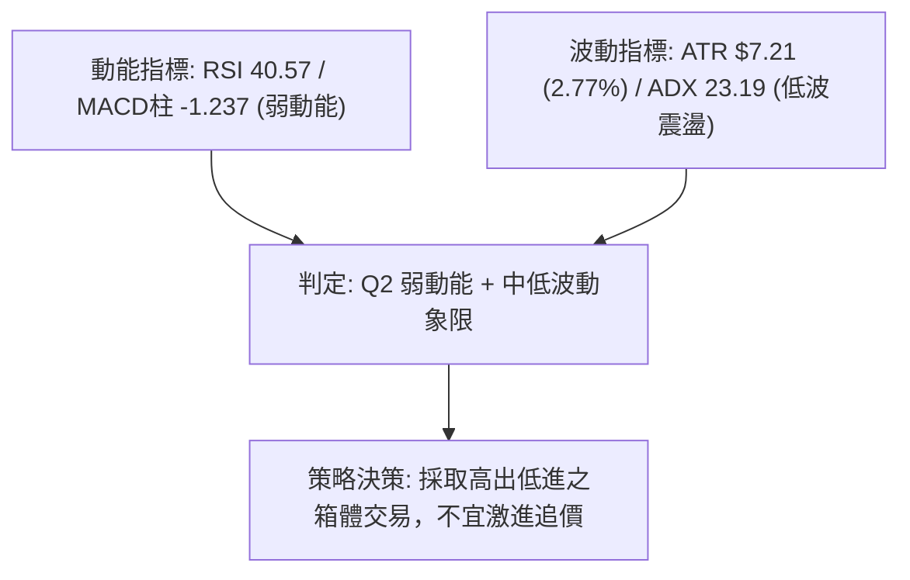
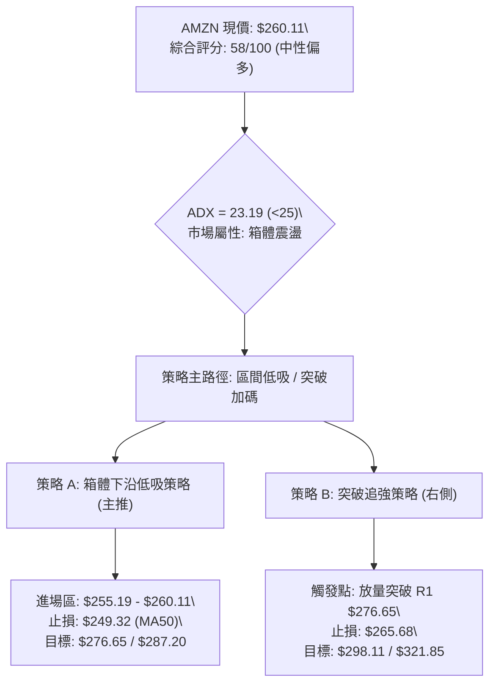
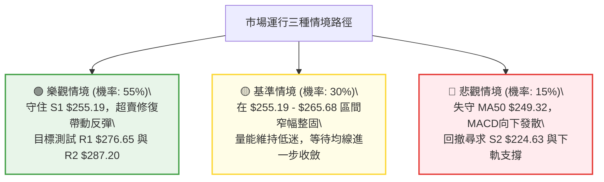

# AMZN 技術分析報告

> **報告日期**：2026-08-20 ｜ **語言**：繁體中文 ｜ **數據來源**：Yahoo Finance ｜ **當前價格**：$260.11

---

## 目錄

| 章節 | 內容 |
|------|------|
| [1. 技術面概覽](#1-技術面概覽) | 訊號儀表板、核心指標、評分卡 |
| [2. 趨勢分析](#2-趨勢分析) | 多時框趨勢、長中短期走勢 |
| [3. 圖表形態分析](#3-圖表形態分析) | 形態識別、K線組合、目標價 |
| [4. 支撐與阻力](#4-支撐與阻力) | 關鍵價位、斐波那契回調 |
| [5. 技術指標深度解讀](#5-技術指標深度解讀) | MA/RSI/MACD/布林/成交量 |
| [6. 動能與波動率](#6-動能與波動率) | 動能評估、ATR、Beta |
| [7. 多時框架總結](#7-多時框架總結) | 時框架評分矩陣 |
| [8. 交易策略建議](#8-交易策略建議) | 多空策略、風險報酬比 |
| [9. 風險提示與監控](#9-風險提示與監控) | 監控指標、風險場景 |

---

## 1. 技術面概覽

### 🎯 技術訊號儀表板



### 📊 核心指標速覽表

| 指標類別 | 指標名稱 | 當前數值 | 訊號 | 解讀 |
|:---|:---|:---|:---:|:---|
| **價格** | 當前收盤價 | $260.11 | 🟡 | 位於52週區間 70.3% 分位，處於波段高位回調整理階段 |
| **均線** | MA20 (月線) | $260.05 | 🟢 | 現價微幅高於 MA20 (+0.02%)，短線爭奪中軌支撐 |
| **均線** | MA50 (季線) | $249.32 | 🟢 | 現價高於 MA50 (+4.33%)，中期上升通道保持完整 |
| **均線** | MA200 (年線) | $238.30 | 🟢 | 現價高於 MA200 (+9.15%)，長期牛市基底穩固 |
| **動能** | RSI(14) | 40.57 | 🟡 | 中性偏弱區間，未見明顯頂底背離，下行動能有所收斂 |
| **動能** | MACD (12,26,9) | 4.147 / 5.383 / -1.237 | 🔴 | DIF自高位跌破DEA形成死叉，柱狀圖負值擴大，短線處於回調波 |
| **震盪** | Stoch %K / %D | 8.08 / 28.72 | 🟢 | %K 進入極度超賣區間 (<10)，短線具備技術性反彈動能 |
| **趨勢** | ADX(14) | 23.19 (+DI: 28.67, -DI: 21.04) | 🟡 | ADX < 25 表明處於盤整震盪行情，+DI仍大於-DI多頭佔優 |
| **波動** | ATR(14) | $7.21 (2.77%) | 🟡 | 每日平均波動幅度 $7.21，波動處於中等可控水準 |
| **通道** | Bollinger Bands | 上: $296.45 / 中: $260.05 / 下: $223.65 | 🟡 | 現價緊貼中軌 (%B = 0.50)，通道開口走平，呈現箱體運行 |
| **量能** | 20日成交量比 | 0.59x (28.29M / 47.94M) | 🔴 | 成交量顯著萎縮，量縮回調，OBV處於均線下方 |

### 🏆 技術評分卡

```
╔══════════════════════════════════════════════════════════════╗
║              技術評分卡 — AMZN (2026-08-20)                  ║
╠══════════════════════════════════════════════════════════════╣
║ 均線架構 (Trend)    ████████████████░░░░  80/100  🟢 強多    ║
║ 動能指標 (Momentum) ████████░░░░░░░░░░░░  40/100  🔴 偏弱    ║
║ 擺動超賣 (Stoch/KD) ██████████████░░░░░░  70/100  🟢 偏多    ║
║ 支撐強度 (Support)  ████████████░░░░░░░░  60/100  🟡 中性    ║
║ 量能配合 (Volume)   ██████░░░░░░░░░░░░░░  30/100  🔴 疲弱    ║
║ 形態結構 (Pattern)  ██████████████░░░░░░  70/100  🟢 偏多    ║
╠══════════════════════════════════════════════════════════════╣
║ 綜合技術評分        ███████████░░░░░░░░░  58/100  🟡 中性整固║
║ 交易建議導向        區間操作 / 逢低佈局 (Range-Bound Trading)║
╚══════════════════════════════════════════════════════════════╝
```

---

## 2. 趨勢分析

### 🌐 多時框趨勢分析



### 📈 長期趨勢 — 12個月走勢圖（Unicode）

```
AMZN 月線收盤走勢圖（2025-08 至 2026-08）
價格 ($)
$280 ┤                                      ● $271.58 (26-07)
$270 ┤                                  ● $270.64 (26-05)  ● $260.11 (現價)
$260 ┤                              ● $265.06 (26-04)
$250 ┤
$240 ┤                  ● $244.22   ● $239.30 (26-01)  ● $238.34 (26-06)
$230 ┤  ● $229.00       ● $233.22   ● $230.82
$220 ┤      ● $219.57
$210 ┤                                  ● $210.00  ● $208.27 (26-03低點)
$200 ┤
     └─────────────────────────────────────────────────────────────►
        08   09   10   11   12   01   02   03   04   05   06   07   08 (月份)
        2025                                 2026
```

#### 走勢特徵分析表格

| 階段區間 | 起始-結束價格 | 區間漲跌幅 | 主要走勢特徵與結構解讀 |
|:---|:---|:---:|:---|
| **2025-08 ~ 2025-10** | $229.00 → $244.22 | +6.65% | 震盪蓄勢向上，突破前高 $234.11，形成中期多頭結構 |
| **2025-11 ~ 2026-03** | $233.22 → $208.27 | -10.70% | 構築箱體底部，2026年3月下探 $208.27（接近52週低點 $196.00）完成洗盤 |
| **2026-04 ~ 2026-05** | $265.06 → $270.64 | +29.95% | 強勢主升浪，月線連續大陽線突破 $250.00 頸線，成交量大幅放大 |
| **2026-06** | $238.34 | -11.93% | 獲利回吐急跌回踩 MA200 區域（$238.30），迅速獲得買盤承接 |
| **2026-07 ~ 2026-08** | $271.58 → $260.11 | -4.22% | 衝擊波段高點 $274.48（52週高點為 $287.20）受阻，目前處於高位蓄勢回調 |

### 📊 中期趨勢（週線分析）

從過去 20 週的收盤價走勢來看，AMZN 在 2026-06-28 創下成交量天量（525.2M）並探底 $232.69 後，展開強勁的「V型反轉+上升通道」。隨後於 2026-08-09 攀升至 $274.48，隨後兩週（08-16 收 $262.65、08-23 收 $260.11）出現量縮回落。週線 MACD 柱狀圖由正轉負（從 +4.090 降至 -1.237），週線 RSI 降至 40.6，顯示中期處於健康的回檔確認支撐波段。

### ⚡ 趨勢強度評估（ADX 解讀）



| 趨勢強度指標 | 當前數值 | 門檻區間 | 市場狀態解讀 |
|:---|:---:|:---:|:---|
| **ADX (14)** | **23.19** | `< 25` | 處於無明確單邊趨勢之盤整/蓄勢期；趨勢動能不強 |
| **+DI (正向動向)** | **28.67** | `> 20` | 多方買盤仍維持在相對擴張水位 |
| **-DI (負向動向)** | **21.04** | `< +DI` | 空方賣壓雖有上升，但尚未取得主導權 |
| **趨勢綜合研判** | **震盪偏多** | ADX<25, +DI>-DI | 屬於「大趨勢向上保護下的次級折返盤整」，適宜以區間低吸策略應對 |

---

## 3. 圖表形態分析

### 🔍 形態識別系統



#### 形態識別與信心度評估表

| 形態名稱 | 信心度 | 判斷依據（引用數據） | 完成度 | 目標價（附嚴格計算式） |
|:---|:---:|:---|:---:|:---|
| **雙重底 (W底)** | **75%** | 第一底 $208.27 (26-03)，第二底 $232.69 (26-06)，頸線突破點 $265.06 | 100% (已達標) | 頸線 $265.06 + 形態高度 ($265.06 - $208.27 = $56.79) = **$321.85** |
| **高位箱體整理** | **85%** | 箱體頂部為阻力 R1 $276.65 (52W高 $287.20)，箱體底部為支撐 S1 $255.19 (MA50 $249.32) | 65% (震盪中) | 箱體上軌突破目標 = $276.65 + ($276.65 - $255.19) = **$298.11** |
| **短線頂部形態** | **45%** | 左肩 $272.68、頭部 $274.48、現價回測 $260.11。**因跌破頸線尚未確認，信心度不足50%** | 30% (未成形) | 訊號不足，僅做指標型回調解讀，不得預判為確定性大頂 |

### 🕯️ 重要K線形態分析

| 日期 / 週期 | 收盤價 | K線形態特徵 | 技術解讀 | 訊號方向 |
|:---|:---:|:---|:---|:---:|
| **2026-06-28 週** | $232.69 | 天量長下影錘頭線 (Hammer) | 單週爆出 5.25 億股天量，空頭竭盡，主力逢低強勢建倉 | 🟢 強烈看多 |
| **2026-08-09 週** | $274.48 | 高位流星線 (Shooting Star) | 衝擊波段高點受阻，上影線觸及 $276.65 壓力區，多頭動能消耗 | 🔴 短線見頂 |
| **2026-08-23 週** | $260.11 | 量縮紡錘線 (Spinning Top) | 跌勢減緩，成交量萎縮至 1.41 億股，多空在中軌 $260.05 達成短暫均衡 | 🟡 觀望變盤 |

### 📉 ASCII 走勢形態示意圖

```
AMZN 中期雙底突破與高位箱體震盪形態示意圖
═══════════════════════════════════════════════════════════════════
$287.20 ┤                                      ┌─ 52W 歷史高點 R2
$276.65 ┤                       ●──────────────┼─ 箱體阻力 R1 ($276.65)
        │                      / \   ● (現價 $260.11)
$265.06 ┤       頸線突破 ─────/───\─/──────────┼─ 頸線 / 突破支撐
$255.19 ┤                    /     V           └─ 箱體下沿支撐 S1 ($255.19)
$240.00 ┤        /\         /   第二底 $232.69 (2026-06)
$230.00 ┤       /  \       /
$220.00 ┤      /    \_____/ 
$208.27 ┤_____/ 第一底 $208.27 (2026-03)
═══════════════════════════════════════════════════════════════════
```

### 🎯 形態目標價計算

1. **W底形態高度測算**：
   - 形態底部低點：$208.27
   - 形態頸線高點：$265.06
   - 形態垂直高度 $H = \$265.06 - \$208.27 = \$56.79$
   - 形態中期量度目標價 $T_{W} = \$265.06 + \$56.79 = \mathbf{\$321.85}$（此數值高度契合分析師平均目標價 $326.84）。
2. **高位箱體區間測算**：
   - 上軌阻力 $R_1 = \$276.65$；下軌支撐 $S_1 = \$255.19$。
   - 箱體振幅 $\Delta P = \$276.65 - \$255.19 = \$21.46$。
   - 向上突破量度目標價 $T_{Box} = \$276.65 + \$21.46 = \mathbf{\$298.11}$（接近布林通道上軌 $296.45）。

---

## 4. 支撐與阻力

### 🗺️ 關鍵價位分布圖（Unicode）

```
AMZN 價位結構分布圖
═════════════════════════════════════════════════════════════════════
$287.20 ║████████████████████████████████████████║ 強阻力 R2 (52週最高點 / 0.0% Fib)
$276.65 ║████████████████████████████            ║ 關鍵波段阻力 R1 (近期高點聚類)
$265.68 ║▓▓▓▓▓▓▓▓▓▓▓▓▓▓▓▓▓▓▓▓                    ║ 阻力轉化區 (23.6% Fib / MA10: $266.66)
$260.11 ╠════════════════════════════════════════╣ ◄ 當前現價 ($260.11, MA20: $260.05)
$255.19 ║▓▓▓▓▓▓▓▓▓▓▓▓▓▓▓▓▓▓▓▓                    ║ 近期關鍵支撐 S1 (波段低點聚類)
$252.36 ║██████████████████                      ║ 斐波那契強支撐 (38.2% Fib / MA50: $249.32)
$241.60 ║████████████████████████                ║ 多空分水嶺 (50.0% Fib)
$224.63 ║████████████████████████████████        ║ 波段強支撐 S2 (下軌 $223.65 區域)
$215.82 ║████████████████████████████████████    ║ 長期防守支撐 S3 (78.6% Fib: $215.52)
═════════════════════════════════════════════════════════════════════
```

### 🚧 阻力位分析表

| 阻力級別 | 價位 | 形成原因（依據數據） | 突破難度 | 技術重要性 |
|:---|:---:|:---|:---:|:---|
| **阻力 R1** | **$276.65** | 近一年波段高點聚類；2026-08-09 週線衝高回落高點區 | 高 | ⭐⭐⭐⭐ 極高（突破將打開邁向歷史高點空間） |
| **阻力 R2** | **$287.20** | 52週歷史高點；斐波那契 0.0% 回調位 | 極高 | ⭐⭐⭐⭐⭐ 歷史級天花板壓力 |

### 🛡️ 支撐位分析表

| 支撐級別 | 價位 | 形成原因（依據數據） | 守住機率 | 技術重要性 |
|:---|:---:|:---|:---:|:---|
| **支撐 S1** | **$255.19** | 近一年波段低點聚類；緊鄰 38.2% Fib ($252.36) 與 MA50 ($249.32) | 70% | ⭐⭐⭐⭐ 短線多頭生命線 |
| **支撐 S2** | **$224.63** | 波段低點聚類；布林通道下軌 ($223.65) 與 61.8% Fib ($230.84) 共振 | 85% | ⭐⭐⭐⭐⭐ 中期多頭防禦底線 |
| **支撐 S3** | **$215.82** | 歷史波段低點聚類；契合 78.6% Fib ($215.52) | 95% | ⭐⭐⭐⭐⭐ 長期牛市終極鐵底 |

### 📐 斐波那契回調位分析

> **計算基數**：以 52 週低點 **$196.00** 至 52 週高點 **$287.20** 進行斐波那契黃金分割測算（總波幅 $91.20）。

```
0.0%  (52W High)  ─── $287.20 ─── 頂部極限
23.6% 回調位       ─── $265.68 ─── 短線反彈第一道壓力 (現價上方 $5.57)
[現價位置]         ─── $260.11 ─── 處於 23.6% 與 38.2% 回調位之間
38.2% 回調位       ─── $252.36 ─── 黃金分割第一支撐 (現價下方 $7.75)
50.0% 回調位       ─── $241.60 ─── 中期多空中軸線
61.8% 回調位       ─── $230.84 ─── 關鍵防禦位 (黃金分割強支撐)
78.6% 回調位       ─── $215.52 ─── 深度回撤支撐
100.0% (52W Low)  ─── $196.00 ─── 底部基準
```

**技術解讀**：現價 $260.11 處於 **23.6% ($265.68)** 與 **38.2% ($252.36)** 回調區間內。股價在健康回調中守住 38.2% 回調位（$252.36），意味著自 $196.00 起漲以來的強勢多頭格局未遭破壞；若進一步跌破 $252.36，下方 50.0% 回調位 $241.60 將與 MA200 ($238.30) 形成雙重共振支撐區。

---

## 5. 技術指標深度解讀

### 🎛️ 指標訊號總覽



### 📈 移動平均線排列分析



- **短均線壓制**：MA5 ($261.87) 與 MA10 ($266.66) 呈下彎趨勢，對股價構成短線壓制。
- **中長均線多頭排列**：MA20 ($260.05) > MA50 ($249.32) > MA200 ($238.30)，中長期均線呈現經典多頭排列，且均處於向上發散狀態（MA60: $250.66、MA120: $244.31、MA240: $236.00 全數向上）。
- **均線支撐結論**：MA20 處於多空爭奪一線，MA50 ($249.32) 構成堅實的中期防線。

### 📉 RSI(14) 分析

```
RSI(14) 數值展示：
0       20      30        40.57      50             70      80     100
├───────┼───────┼───────────█────────┼──────────────┼───────┼──────┤
 超賣區   極弱    弱勢區      [現值]   中軸           超買區   極強
RSI 進度條：████████░░░░░░░░░░░░ 40.57% (中性偏弱)
```

- **背離檢驗**：RSI 在 40.57 水平，近期股價由 $274.48 回調至 $260.11，RSI 同步自 66.4 回落至 40.6，**未出現頂背離或底背離**，屬於指標隨價格正常回調的降溫過程。
- **動能解讀**：未跌入 30 以下極度超賣區，顯示空頭並非恐慌拋售，而是多頭獲利了結盤，為後續震盪築底提供空間。

### 📊 MACD(12,26,9) 訊號解讀



- **MACD狀態**：DIF 與 DEA 均位於零軸上方（4.147 與 5.383），表明長週期仍處於強勢多頭市場；然而短期柱狀圖為 -1.237，顯示次級折返走勢仍在進行，需等待柱狀圖縮腳或出現低位金叉。

### 📦 布林通道分析

```
AMZN 布林通道結構 (20, 2)
═══════════════════════════════════════════════════════════════════
$296.45 ┤ ────────────────────────────────── 上軌 (Upper Band)
        │
$278.00 ┤
        │
$260.05 ┤ ───────────● $260.11 (現價, %B=0.50) ── 中軌 (MA20)
        │
$240.00 ┤
        │
$223.65 ┤ ────────────────────────────────── 下軌 (Lower Band)
═══════════════════════════════════════════════════════════════════
```

- **布林帶寬與位置**：%B 為 **0.50**，現價精準貼合中軌 $260.05。
- **帶寬特徵**：通道帶寬為 $72.80 ($296.45 - $223.65)，處於收口後的橫盤走平階段，表明價格正在中軌附近尋求方向突破。

### 💹 成交量分析（量價配合度）

- **量能萎縮**：最新單日成交量為 28,294,255 股，相較於 20 日均量 47,936,903 股，**量比僅 0.59x**。
- **OBV 量能分析**：OBV 指標小於其均線，顯示資金呈現淨流出或觀望態度。
- **量價背離結論**：股價自高位拉回時成交量急劇萎縮（週成交量從 3.55 億降至 1.41 億），屬於典型的「**量縮回檔**」，並未出現爆量殺跌行情，確認目前回調為良性整固。

---

## 6. 動能與波動率

### ⚡ 動能評估四象限

| 象限 | 動能維度 (Momentum) | 波動維度 (Volatility) | AMZN 當前狀態 | 交易策略評估 |
|:---:|:---:|:---:|:---:|:---|
| **Q1** | 強動能 (High) | 低波動 (Low) | ── | 最優單邊趨勢加倉區 |
| **Q2** | **弱動能 (Low)** | **低波動 (Low)** | **✓ (當前所處象限)** | **區間震盪 / 逢支撐低吸 / 觀望蓄勢** |
| **Q3** | 強動能 (High) | 高波動 (High) | ── | 突破追單 / 嚴設止損 |
| **Q4** | 弱動能 (Low) | 高波動 (High) | ── | 恐慌殺跌 / 避免介入 |



### 📊 ATR 波動率分析

- **ATR(14) 數值**：**$7.21**，佔當前股價比例為 **2.77%**。
- **交易風控意涵**：
  - **日內正常雜訊區間**：$\pm 1.0 \times \text{ATR} = \pm \$7.21$（波動區間 $252.90 \sim $267.32）。
  - **防守止損距離**：短線進場建議設定 $1.5 \sim 2.0 \times \text{ATR}$（即 $\$10.82 \sim \$14.42$ 之風險緩衝空間），以避免被日內正常波動洗出場。

### 📐 Beta 與市場相關性

- **Beta 係數**：**1.454**。
- **大盤敏感度分析**：AMZN 具備高彈性（高 Beta）成長股特質，理論上對標普500指數（S&P 500）的波動敏感度為 1.45 倍。在大盤處於盤整或微調環境下，AMZN 會呈現放大震盪；一旦市場風險偏好回暖，其反彈動能亦將顯著超越大盤。

---

## 7. 多時框架總結

### 📋 時框架評分表

| 時框架 | 趨勢方向 | 動能狀態 | 均線排列 | 形態結構 | 綜合評分 | 建議操作導向 |
|:---|:---:|:---:|:---:|:---:|:---:|:---|
| **長期 (月線)** | 🟢 多頭 | 🟡 中性整理 | 🟢 完美多頭 (MA200向上) | 🟢 突破大底回踩 | **85/100** | 逢低堅定做多 / 長線持有 |
| **中期 (週線)** | 🟡 震盪 | 🔴 回調修正 | 🟢 MA50向上支撐 | 🟡 高位箱體整理 | **60/100** | 箱體區間高拋低吸 |
| **短期 (日線)** | 🔴 回調 | 🟢 超賣蓄勢 | 🟡 跌破MA5/10，測試MA20 | 🟡 測試S1支撐 | **50/100** | 等待止跌訊號 / 輕倉試單 |

### 🔲 綜合訊號矩陣

```
┌─────────────────────────────────────────────────────────────┐
│                   多時框訊號收斂矩陣                        │
├──────────────┬─────────────┬─────────────┬──────────────────┤
│   指標類別   │  長期 (月)  │  中期 (週)  │    短期 (日)     │
├──────────────┼─────────────┼─────────────┼──────────────────┤
│   趨勢方向   │ 🟢 強烈看多 │ 🟡 箱體震盪 │ 🔴 短線偏弱      │
│   均線架構   │ 🟢 MA200上揚│ 🟢 MA50支撐 │ 🟡 MA20爭奪      │
│   擺動動能   │ 🟢 多頭控制 │ 🔴 MACD死叉 │ 🟢 Stoch極度超賣 │
│   量能配合   │ 🟢 長期量增 │ 🟡 週量萎縮 │ 🔴 量能低迷      │
└──────────────┴─────────────┴─────────────┴──────────────────┘
```

### ⚖️ 多時框收斂結論

依據多時框收斂規則（規則 14）：
1. **行情性質判定**：當前 ADX(14) = 23.19（$< 25$），定義為**盤整/箱體震盪行情**。
2. **主導時框與權重分配**：
   - 趨勢背景由中長期（週線 MA50 $249.32 與 MA200 $238.30 多頭排列）提供強力底部支撐；
   - 短期日線雖然跌破 MA5/MA10，但 Stoch %K (8.08) 已進入極度超賣區，且價格緊貼日線布林中軌 $260.05 與支撐 S1 $255.19。
3. **收斂唯一方向**：**中性偏多（箱體逢低做多）**。短線的回調不改長期牛市基調，當前為箱體整理下沿的佈局時機，而非順勢做空點。

---

## 8. 交易策略建議

### 🗺️ 策略決策流程圖



### 🧭 策略路由

> **當前主策略方向 = 🟡 中性偏多 / 箱體下沿逢低佈局（依綜合評分 58/100）**
> 
> 因綜合評分處於 40–60 區間且 ADX < 25，操作主軸定為「**區間操作、低吸為主、不追高**」。多頭策略為核心交易計劃，空方僅設定防禦性觸發條件。

### 🎯 價格情境階梯（Price Scenarios）

| 觸發條件 | 第一目標 (T1) | 第二目標 (T2) | 後續延伸 (T3) | 情境技術含義 |
|:---|:---:|:---:|:---:|:---|
| **強勢突破 R1 ($276.65)** | R2: **$287.20** | 箱體延伸: **$298.11** | W底目標: **$321.85** | 結束震盪，開啟新一輪主升浪 |
| **站穩現價區間 ($260.05)**| Fib 23.6%: **$265.68**| R1: **$276.65** | R2: **$287.20** | 中軌確認有撐，展開區間反彈 |
| **跌破 S1 ($255.19)** | Fib 38.2%: **$252.36**| MA50: **$249.32** | S2: **$224.63** | 短線轉弱，回踩中期均線尋找支撐 |

### 📊 情境機率分佈

| 運行情境 | 發生機率 | 主要技術依據 |
|:---|:---:|:---|
| **情境一：守穩支撐，區間反彈向上** | **55%** | 均線長線多頭排列；Stoch極度超賣 (%K=8.08)；下有 S1 ($255.19) 與 MA50 強力護盤 |
| **情境二：窄幅橫盤，中軌持續拉鋸** | **30%** | ADX = 23.19 顯示缺乏方向性動能；量能萎縮 (0.59x) 導致突破阻力需要時間換取空間 |
| **情境三：跌破支撐，深度回撤探底** | **15%** | MACD 柱狀圖負值發散 (-1.237)；若大盤劇烈回檔可能引發 Beta=1.454 的連鎖下殺 |

### 🟢 主策略詳情

| 策略要素 | 策略 A：左側/區間低吸策略 (主策略) | 策略 B：右側/突破動能策略 (備選策略) |
|:---|:---|:---|
| **適用場景** | 測試現價中軌與 S1 支撐獲得買盤承接 | 放量突破關鍵阻力 R1 展開單邊行情 |
| **進場條件** | 日線於 $255.19 ~ $260.11 區間出現下影線或止跌K線 | 日K線收盤價突破 $276.65 且成交量比 > 1.2x |
| **進場價格** | **$260.11** (現價或回踩 $255.19 分批建倉) | **$276.65** (突破確認後進場) |
| **目標價 T1** | **$276.65** (阻力位 R1，預期收益 +6.36%) | **$287.20** (52W高點 R2，預期收益 +3.82%) |
| **目標價 T2** | **$287.20** (52W高點 R2，預期收益 +10.41%) | **$298.11** (箱體測算目標，預期收益 +7.76%) |
| **止損價格** | **$249.32** (跌破 MA50 季線與 38.2% Fib) | **$265.68** (跌回 23.6% Fib 頸線下方) |
| **風險報酬比 (R/R)**| **1 : 2.51** (風險 $10.79 vs 收益 $27.09 至 T2) | **1 : 1.96** (風險 $10.97 vs 收益 $21.46 至 T2) |
| **成功機率** | **65%** | **60%** |
| **建議倉位** | **15% ~ 20%** 基礎倉位 | **10% ~ 15%** 動能追突破倉位 |

### 🔴 反向風險觸發點（對沖提示）

若日線收盤價**實體跌破 $249.32 (MA50)**，且伴隨成交量放大，意味著中期上升通道遭到破壞，技術面將向下考驗 **S2 ($224.63)** 及布林下軌。此時應：
1. 主動將多頭部位停損或減倉 50% 以上；
2. 暫停任何低吸操作，等待股價在 S2 ($224.63) 重新構築底部形態。

### ⭐ 整體訊號強度評星

```
做多訊號強度：★★★★☆  (4.0/5星) — 均線多頭保護，擺動指標超賣
做空訊號強度：★☆☆☆☆  (1.5/5星) — 長期趨勢向上，逆勢做空盈虧比差
整體可信度：  ★★★★☆  (4.0/5星) — 價位由歷史密集區與Fib黃金分割嚴格共振
```

---

## 9. 風險提示與監控

### ✅ 關鍵監控指標 Checklist

```
╔══════════════════════════════════════════════════════════════╗
║                   每日盤後技術監控清單                       ║
╠══════════════════════════════════════════════════════════════╣
║ [ ] 價格防守：收盤價是否守穩 S1 ($255.19) 及 MA20 ($260.05)  ║
║ [ ] 動能修復：Stoch %K 是否自超賣區向上金叉 %D (目前 8.08)   ║
║ [ ] MACD追蹤：MACD柱狀圖負值是否開始收斂 (目前 -1.237)       ║
║ [ ] 量能變化：單日成交量是否回升至 20日均量 (47.94M) 以上    ║
║ [ ] 阻力測試：向上反彈時能否有效收復 23.6% Fib ($265.68)     ║
║ [ ] 趨勢突破：ADX 是否自 23.19 上升突破 25 形成單邊動能      ║
╚══════════════════════════════════════════════════════════════╝
```

### ⚠️ 風險場景分析



### 🛡️ 風險管理重要提醒

1. **嚴格執行止損紀律**：
   - 區間進場之最大容忍底線為 **$249.32**（MA50 與 38.2% Fib 共振位），嚴禁在破位後盲目向下攤平。
2. **高 Beta 波動控制**：
   - AMZN 的 Beta 值為 **1.454**，在科技股或大盤拉回時波動顯著擴大，單一標的持倉建議不超過總投資組合的 **20%**。
3. **ATR 動態部位管理**：
   - 鑑於當前 ATR 為 **$7.21**，持倉部位應以「單筆交易承擔總資產 1%~2% 風險」進行反推計量，倉位規模公式：
     $$\text{部位股數} = \frac{\text{總資金} \times 1\%}{\text{進場價} - \text{止損價} (\$260.11 - \$249.32 = \$10.79)}$$

---

## 📋 報告總結

```
╔══════════════════════════════════════════════════════════════╗
║                 AMZN 技術分析報告總結                        ║
╠══════════════════════════════════════════════════════════════╣
║ 報告日期：2026-08-20                                         ║
║ 當前價格：$260.11                                            ║
║ 分析評級：⚖️ 中性偏多 / 區間震盪佈局 (評分: 58/100)          ║
╠══════════════════════════════════════════════════════════════╣
║ 關鍵結論：                                                   ║
║ ├─ 長期趨勢：🟢 強烈多頭 (MA200: $238.30 向上發散)           ║
║ ├─ 中期趨勢：🟡 箱體整理 ($255.19 - $276.65 區間蓄勢)        ║
║ ├─ 短期趨勢：🔴 弱勢回調但 Stoch (%K: 8.08) 進入極度超賣     ║
║ ├─ 關鍵支撐：S1: $255.19 / S2: $224.63 / MA50: $249.32       ║
║ ├─ 關鍵阻力：R1: $276.65 / R2: $287.20 (52W High)            ║
║ └─ 分析師目標：均價 $326.84 (最高 $405.00 / 最低 $230.00)     ║
╠══════════════════════════════════════════════════════════════╣
║ 最優策略組合：                                               ║
║ 1. 🥇 最佳機會：現價 $260.11 或回踩 S1 $255.19 逢低分批佈局  ║
║    (止損: $249.32, 目標 T1: $276.65, T2: $287.20, R/R: 1:2.51)║
║ 2. 🥈 次選機會：放量突破 R1 $276.65 後右側追強              ║
║    (止損: $265.68, 目標 T1: $287.20, T2: $298.11, R/R: 1:1.96)║
║ 3. 🥉 保守選擇：等待股價回測 MA50 ($249.32) 出現右側拐點再介入║
╚══════════════════════════════════════════════════════════════╝
```

---

> ⚠️ **免責聲明**：本報告為 AI 自動生成之技術分析，所有數據及估算均基於提供的歷史價格資訊。本報告**僅供研究與學術參考**，**不構成任何投資建議**。投資有風險，入市需謹慎。

---

*報告生成時間：2026-08-20 ｜ 數據來源：Yahoo Finance ｜ 分析框架：多時框技術分析*