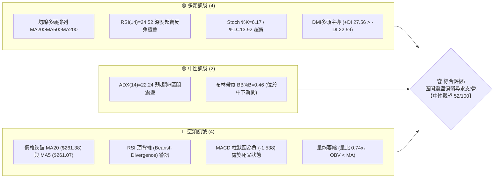
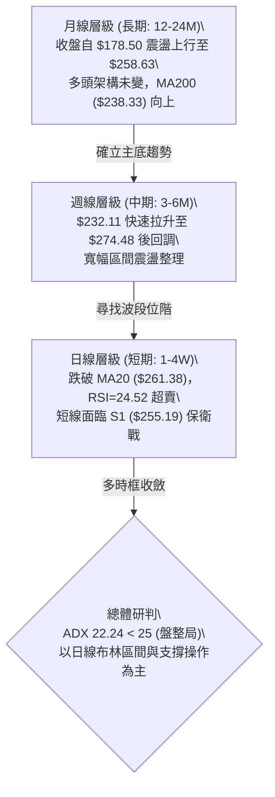
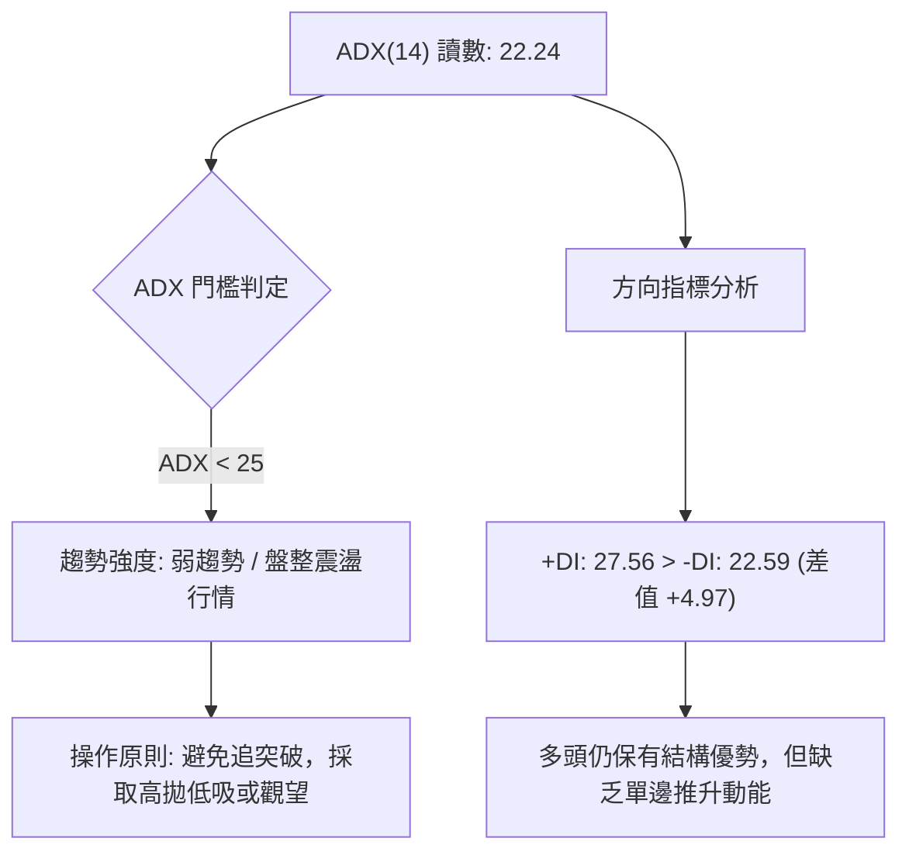
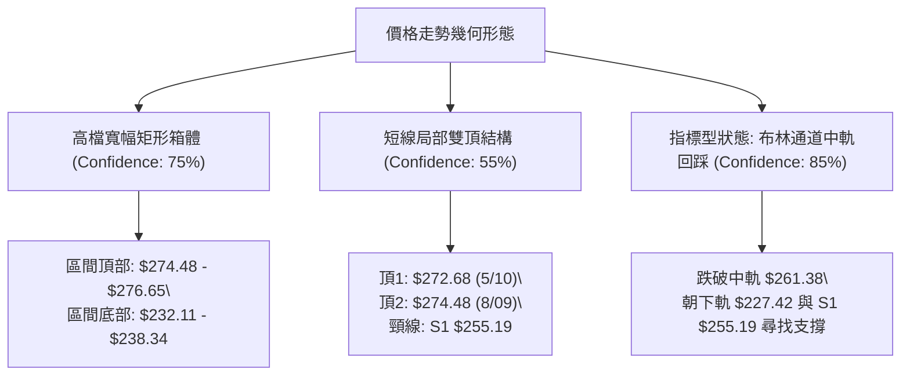
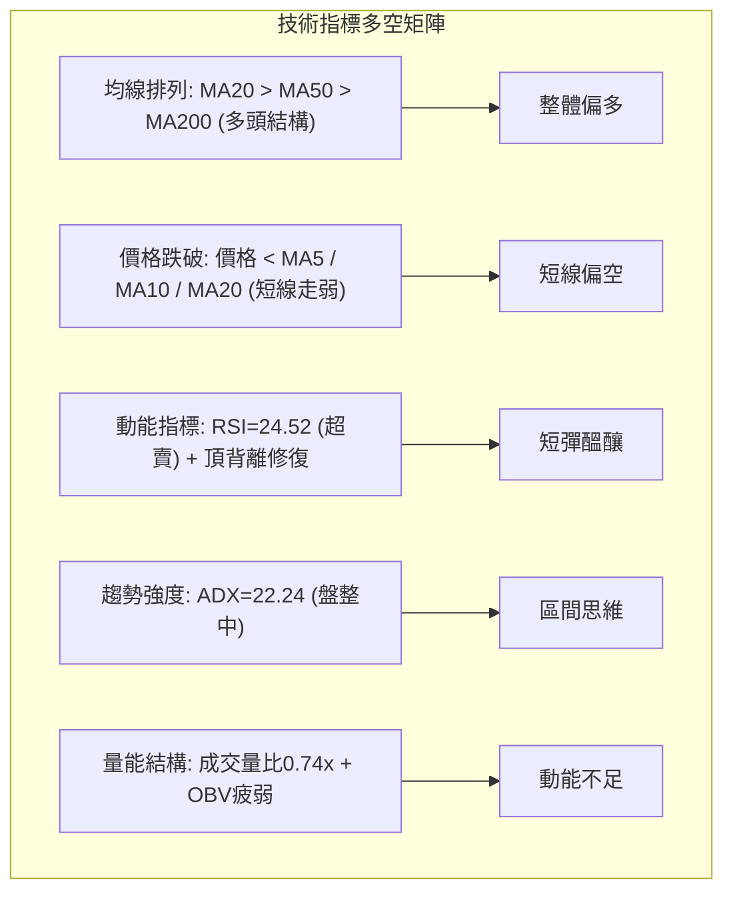
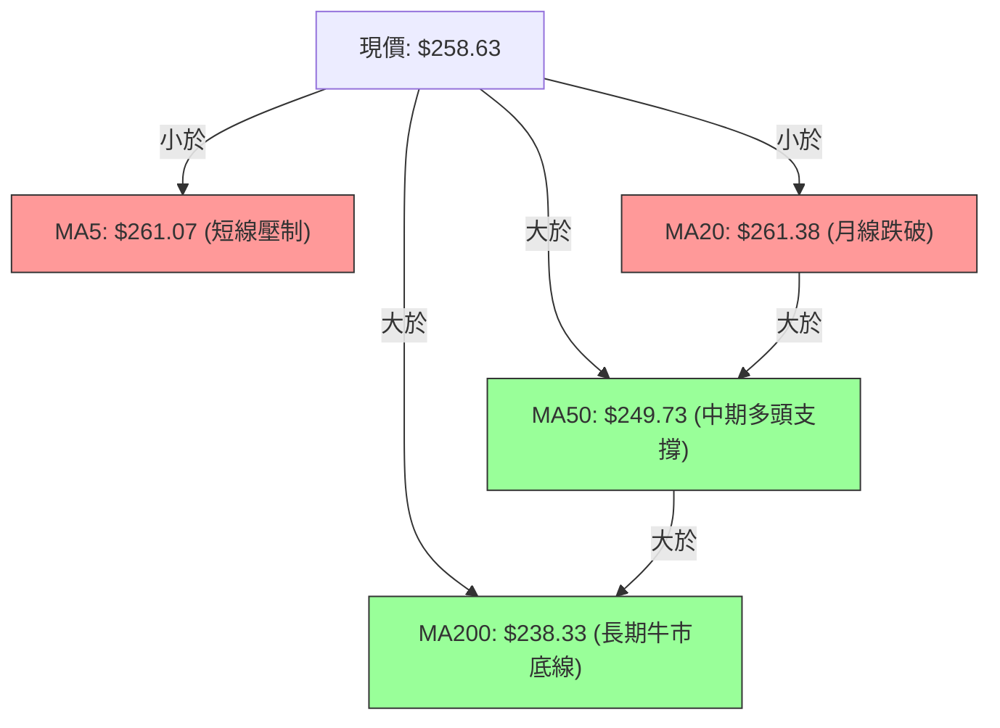
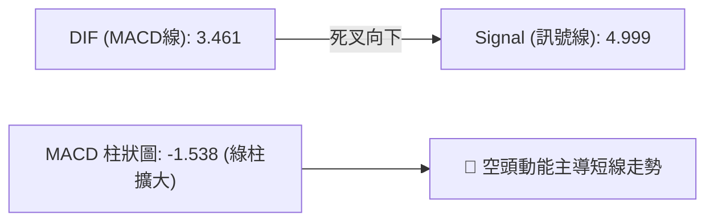
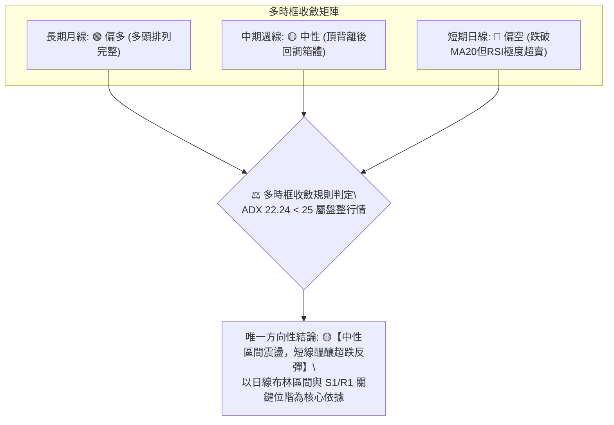
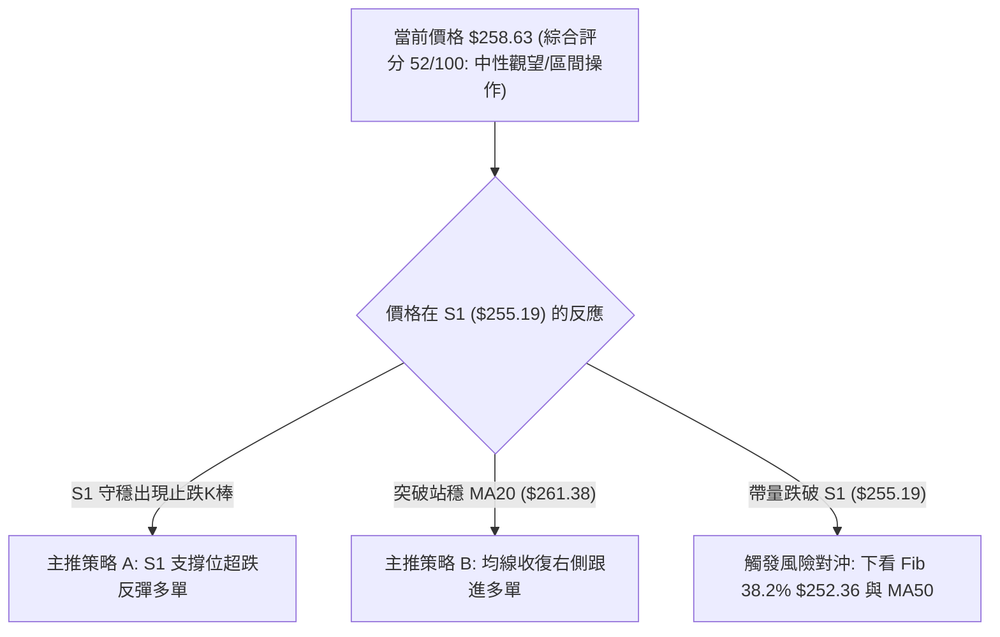
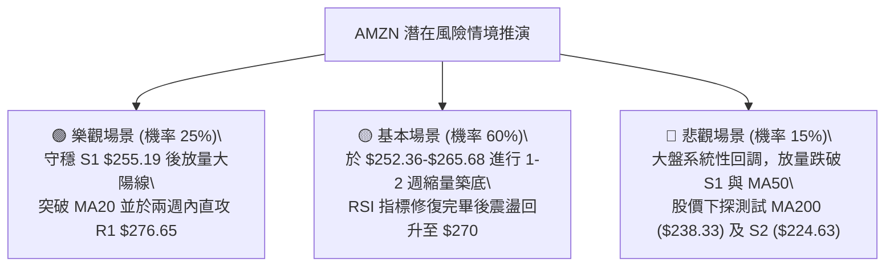

# AMZN 技術分析報告

> **報告日期**：2026-08-22 ｜ **語言**：繁體中文 ｜ **數據來源**：Yahoo Finance ｜ **當前價格**：$258.63

---

## 目錄

| 章節 | 內容 |
|------|------|
| [1. 技術面概覽](#1-技術面概覽) | 訊號儀表板、核心指標、評分卡 |
| [2. 趨勢分析](#2-趨勢分析) | 多時框趨勢、長中短期走勢、ADX解讀 |
| [3. 圖表形態分析](#3-圖表形態分析) | 形態識別、信心度評估、K線組合 |
| [4. 支撐與阻力](#4-支撐與阻力) | 關鍵價位、斐波那契回調結構 |
| [5. 技術指標深度解讀](#5-技術指標深度解讀) | MA/RSI/MACD/布林/成交量全面剖析 |
| [6. 動能與波動率](#6-動能與波動率) | 動能象限、ATR波動分析、Beta風險 |
| [7. 多時框架總結](#7-多時框架總結) | 時框架評分矩陣與收斂結論 |
| [8. 交易策略建議](#8-交易策略建議) | 策略路由、情境階梯、進出場規劃 |
| [9. 風險提示與監控](#9-風險提示與監控) | 監控指標Checklist、風險情境與資金管理 |
| [10. 報告總結](#-報告總結) | 核心技術總結與決策指引 |

---

## 1. 技術面概覽

### 🎯 技術訊號儀表板



### 📊 核心指標速覽表

| 指標類別 | 指標名稱 | 當前數值 | 訊號 | 解讀 |
|----------|----------|----------|------|------|
| **價格** | 當前價格 | $258.63 | 🟡 | 位於52週區間68.7%處，短線承壓回調 |
| **均線** | MA20 (短中) | $261.38 | 🔴 | 價格低於MA20 (-1.05%)，短線跌破月線支撐 |
| **均線** | MA50 (中期) | $249.73 | 🟢 | 價格高於MA50 (+3.56%)，中期上升趨勢未破 |
| **均線** | MA200 (長期)| $238.33 | 🟢 | 價格高於MA200 (+8.52%)，長期牛市基底穩固 |
| **動能** | RSI(14) | 24.52 | 🟢 | 進入深度超賣區 (<30)，但伴隨前期頂背離修復 |
| **動能** | MACD | 3.461 / 4.999 | 🔴 | 柱狀圖 -1.538，快慢線死叉且綠柱擴散 |
| **隨機動能** | Stoch %K / %D | 6.17 / 13.92 | 🟢 | 位於極端低檔超賣，隨時醞釀短線技術反抽 |
| **趨勢強度** | ADX(14) | 22.24 | 🟡 | 數值 <25，屬盤整弱趨勢，以區間震盪應對 |
| **方向指標** | +DI / -DI | 27.56 / 22.59 | 🟢 | 多方力量仍略高於空方力量 |
| **波動** | ATR(14) | $6.39 (2.47%) | 🟡 | 波動度適中，日均波動區間約 $6.40 |
| **通道位置** | BB %B | 0.46 | 🟡 | 略低於中軌 ($261.38)，向中下軌尋找支撐 |
| **量能** | 成交量 / 量比 | 35.65M / 0.74x | 🔴 | 量能疲弱，OBV低於均線，買盤追價意願不足 |

### 🏆 技術評分卡

```
╔══════════════════════════════════════════════════════════════════╗
║              技術評分卡 — AMZN (2026-08-22)                      ║
╠══════════════════════════════════════════════════════════════════╣
║ 趨勢強度 (ADX/DMI)  ██████████░░░░░░░░░░  50/100  🟡 弱趨勢盤整 ║
║ 動能指標 (RSI/MACD) ████████░░░░░░░░░░░░  40/100  🔴 MACD死叉   ║
║ 支撐穩定度 (S1/S2)   ██████████████░░░░░░  70/100  🟢 S1鄰近守穩 ║
║ 成交量配合 (OBV/VOL) ██████░░░░░░░░░░░░░░  30/100  🔴 量能顯著萎縮 ║
║ 形態完整度 (區間)    ████████████░░░░░░░░  60/100  🟡 寬幅箱體整理 ║
║ 均線排列 (多頭結構)  ████████████░░░░░░░░  60/100  🟢 長多短空震盪 ║
╠══════════════════════════════════════════════════════════════════╣
║ 綜合評分             ██████████░░░░░░░░░░  52/100  ⚖️ 中性觀望   ║
╚══════════════════════════════════════════════════════════════════╝
```

---

## 2. 趨勢分析

### 🌐 多時框趨勢分析



### 📈 長期趨勢 — 12個月走勢圖（ASCII）

```
AMZN 月線收盤走勢圖（2025-09 至 2026-08）
價格軸 ($)
$275 ┤                                  ●(07月 $271.58)
$270 ┤                            ●(05月 $270.64)
$265 ┤                      ●(04月 $265.06)      ●(現在 $258.63)
$245 ┤            ●(10月 $244.22)          ●(06月 $238.34)
$240 ┤                  ●(01月 $239.30)
$230 ┤            ●(11月 $233.22)
$220 ┤      ●(09月 $219.57)
$210 ┤                            ●(02-03月 $208.27 低點)
     └──────────────────────────────────────────────────────────
       09   10   11   12   01   02   03   04   05   06   07   08 (月份)
```

#### 走勢特徵分析表格

| 階段區間 | 時間跨度 | 起訖價格區間 | 區間漲跌幅 | 走勢特徵與技術意涵 |
|----------|----------|--------------|------------|--------------------|
| 階段一：前波上攻 | 2025/09 - 2025/10 | $219.57 → $244.22 | +11.23% | 突破前波壓力，建立 $240 之上籌碼平台 |
| 階段二：高位回測 | 2025/11 - 2026/03 | $244.22 → $208.27 | -14.72% | 連續五個月回調築底，於 $208-$210 確立強烈支撐 |
| 階段三：主升拉抬 | 2026/03 - 2026/05 | $208.27 → $270.64 | +29.95% | 強勢V型反轉，突破歷史與波段壓力帶 |
| 階段四：高檔劇震 | 2026/06 - 2026/08 | $270.64 → $258.63 | -4.44% | 於 $238-$274 進行寬幅洗盤，目前自 $274.48 壓回 |

### 📊 中期趨勢（週線分析）

中期走勢呈現「高檔寬幅箱體震盪」，近20週高點出現在 2026/08/09 週收盤 $274.48（波段高點聚類於 R1 $276.65 及 52W高點 $287.20），低點出現在 2026/07/26 週收盤 $232.11。

```
週線關鍵壓力與支撐結構：
  [阻力帶 R2] $287.20  (52W最高點 / 斐波那契 0.0%)
      ▲
  [阻力帶 R1] $276.65  (近一年波段高點聚類 / 8月上旬高點壓力)
      │      ─── 當前價格回調中 ───
  [現價位階] $258.63  (跌破 MA20 $261.38，尋找支撐)
      │
  [支撐帶 S1] $255.19  (近一年波段低點聚類 / 斐波那契 38.2% $252.36)
      ▼
  [強支撐 S2] $224.63  (中期箱體底部 / 靠近 MA200 $238.33)
```

### ⚡ 趨勢強度評估（ADX 解讀）



#### ADX 強度對照表

| ADX 數值區間 | 趨勢強度分類 | 當前狀態 | 交易策略對策 |
|--------------|--------------|----------|--------------|
| 0 – 20 | 極弱 / 無方向盤整 | ── | 嚴禁趨勢追單，嚴格做窄幅區間網格 |
| **20 – 25** | **弱趨勢 / 盤整轉換期** | **✓ (22.24)** | **以支撐阻力位為邊界操作，多時框收斂以區間震盪為主** |
| 25 – 40 | 強趨勢（單邊主升/主跌）| ── | 順勢交易，沿 MA20/MA50 順勢加碼 |
| 40 – 60 | 極強趨勢（加速趕頂/探底）| ── | 注意乖離過大，做好分批停利準備 |

---

## 3. 圖表形態分析

### 🔍 形態識別系統



#### 圖表形態信心度與目標評估

| 形態名稱 | 信心度 | 判斷依據（引用數據） | 完成度 | 目標價（附嚴格計算式） |
|----------|--------|----------------------|--------|------------------------|
| **高檔寬幅箱體整理** | 75% | 價格在 2026/04-08 月間多次於 $232.11-$238.34 獲支撐，並於 $270.64-$274.48 承壓 | 70% | 箱體震盪區間：下限 **$232.69**（6/28收盤）至上限 **$276.65**（阻力R1） |
| **短線局部雙重頂** | 55% | 5月高點 $272.68 與 8月高點 $274.48 形成雙峰，目前回測頸線 S1 $255.19 | 45% (未跌破頸線) | 若跌破頸線 $255.19：<br>形態高度 = $274.48 - $255.19 = $19.29<br>量度跌幅 = $255.19 - $19.29 = **$235.90**（鄰近 MA200 $238.33） |
| **布林通道中軌回調** | 85% | 現價 $258.63 跌破中軌 $261.38，BB %B 降至 0.46 | 100% (已觸發) | 預期回踩下軌目標：**$227.42**（布林下軌）或前置於 S1 **$255.19** 止跌 |

### 🕯️ 重要K線形態分析

| 週/月份 | 收盤價 | K線形態特徵 | 技術意涵解讀 | 訊號 |
|---------|--------|-------------|--------------|------|
| 2026-06 (月線) | $238.34 | 長下影陰線 (回測MA200) | 測試 $230 帶有強烈承接買盤，確認長期均線支撐有效 | 🟢 |
| 2026-07 (月線) | $271.58 | 長陽實體大紅K | 多頭強勢反撲，完全吞噬6月跌幅，形成月線看漲吞沒 | 🟢 |
| 2026-08-09 (週線)| $274.48 | 衝高回落十字星/倒錘 | 於 R1 $276.65 附近遇阻，主力資金追高意願減弱 | 🔴 |
| 2026-08-16 (週線)| $262.65 | 中長陰線跌破短均 | 獲利了結賣壓湧現，確立短線自高點拉回 | 🔴 |
| 2026-08-23 (週線)| $258.63 | 實體陰線續跌 | 跌破日線 MA20，直接考驗下方支撐 S1 $255.19 | 🔴 |

### 📉 ASCII 走勢形態示意圖

```
AMZN 局部雙頂與箱體形態示意圖
$276.65 阻力 R1 ────────── Top 1 ($272.68)       Top 2 ($274.48)
                           ╭───╮                ╭───╮
$265.00                   ╭╯   ╰╮              ╭╯   ╰╮
$261.38 MA20 ────────────╯──────╰─────────────╯──────╰───▼ 現價 $258.63
$255.19 頸線 S1 ─────────────────────────────────────────── [關鍵防守點]
                          │                           │
$238.33 MA200 ─────────── ┴ 底部回測 ($232.11) ─────── ┴ 若跌破S1之量度目標 ($235.90)
```

---

## 4. 支撐與阻力

### 🗺️ 關鍵價位分布圖（ASCII）

```
AMZN 價位結構分布圖
══════════════════════════════════════════════════════════════════
$287.20 ║██████████████████████████████║ 強阻力 R2 (52W最高點 / Fib 0.0%)
$276.65 ║████████████████████          ║ 關鍵阻力 R1 (近一年波段高點聚類)
$265.68 ║▓▓▓▓▓▓▓▓▓▓▓▓▓▓▓▓▓▓            ║ 斐波那契 23.6% 回調位 / MA10 ($265.08)
$261.38 ║▓▓▓▓▓▓▓▓▓▓▓▓                  ║ 布林中軌 / MA20
$258.63 ╠══════════════════════════════╣ ◄ 現價 $258.63 (目前位於52W區間 68.7%)
$255.19 ║▓▓▓▓▓▓▓▓▓▓▓▓▓▓▓▓▓▓            ║ 近期第一支撐 S1 (波段低點聚類)
$252.36 ║▓▓▓▓▓▓▓▓▓▓▓▓▓▓▓▓▓▓▓▓          ║ 斐波那契 38.2% 回調位 / 鄰近 MA50 ($249.73)
$241.60 ║████████████████              ║ 斐波那契 50.0% 中樞強支撐
$238.33 ║████████████████████          ║ MA200 長期生命線支撐
$224.63 ║██████████████████████████████║ 強支撐 S2 (波段低點聚類 / 靠近BB下軌)
$215.82 ║██████████████████████████████║ 極強支撐 S3 (Fib 78.6% $215.52)
══════════════════════════════════════════════════════════════════
```

### 🚧 阻力位分析表

| 阻力級別 | 價位 | 形成原因 | 突破難度 | 重要性 |
|----------|------|----------|----------|--------|
| **R1** | **$276.65** | 近一年波段高點聚類、8月上旬衝高回落阻力區（距離現價 +6.97%） | 🔴 高 | ★★★★☆ |
| **R2** | **$287.20** | 52週最高點、斐波那契 0.0% 極限壓力位（距離現價 +11.05%） | 🔴 極高 | ★★★★★ |

### 🛡️ 支撐位分析表

| 支撐級別 | 價位 | 形成原因 | 守住機率 | 重要性 |
|----------|------|----------|----------|--------|
| **S1** | **$255.19** | 近一年波段低點聚類，短線多頭第一道防線（距離現價 -1.33%） | 🟡 60% | ★★★★☆ |
| **S2** | **$224.63** | 近一年深次回調波段低點聚類，布林下軌 ($227.42) 附近（距離現價 -13.15%）| 🟢 85% | ★★★★★ |
| **S3** | **$215.82** | 歷史強支撐密集區，重合斐波那契 78.6% $215.52（距離現價 -16.55%） | 🟢 95% | ★★★★★ |

### 📐 斐波那契回調位分析

依據 52 週完整波動區間（低點 **$196.00** 至 高點 **$287.20**，總跨度 $91.20）計算：

| 斐波那契回調層級 | 精確價位 | 技術意涵解讀 | 當前價格相對位置 |
|------------------|----------|--------------|------------------|
| **0.0% (52W High)** | **$287.20** | 牛市波段頂部，長期多頭終極目標阻力 | 現價下方 -11.05% |
| **23.6%** | **$265.68** | 強勢回調防守位，現與 MA10 ($265.08) 形成共振阻力 | 現價上方 +2.73% |
| **38.2%** | **$252.36** | 弱勢回調支撐位，與 S1 ($255.19) 及 MA50 ($249.73) 形成多頭防禦帶 | 現價下方 -2.42% |
| **50.0%** | **$241.60** | 多空分水嶺中樞，跌破代表行情由多轉空 | 現價下方 -6.58% |
| **61.8%** | **$230.84** | 黃金分割強支撐，與 2026/06 月收盤 $238.34 及 6/28 週低 $232.69 構成底座 | 現價下方 -10.74% |
| **78.6%** | **$215.52** | 深度回撤極限位，與 S3 ($215.82) 完美共振 | 現價下方 -16.67% |
| **100.0% (52W Low)**| **$196.00** | 52週基準底部支撐 | 現價下方 -24.22% |

> **位階研判**：現價 **$258.63** 精確運行於 **23.6% ($265.68)** 與 **38.2% ($252.36)** 之間。短線跌破 23.6% 回調位後，技術上正尋求在 38.2% 回調位（$252.36）與波段支撐 S1（$255.19）之間構築反彈防線。

---

## 5. 技術指標深度解讀

### 🎛️ 指標訊號總覽



### 📈 移動平均線排列分析



#### 均線各週期狀態解析

- **短天期均線 (MA5 $261.07 / MA10 $265.08 / MA20 $261.38)**：呈現向下彎頭排列，且 MA5 與 MA20 形成高檔死叉，現價 $258.63 壓在所有短均線之下，短線賣壓尚未完全釋放。
- **中長天期均線 (MA60 $250.44 / MA120 $244.73 / MA200 $238.33 / MA240 $236.10)**：斜率全部保持正向向上（MA200 呈上升趨勢），中長期「多頭排列」未遭破壞。回調屬於大牛市架構中的中級洗盤。

### 📉 RSI(14) 分析

```
RSI(14) 讀數: 24.52 ─── [ 深度超賣區間 (<30) ]
0 ─────── 20 ──[24.52]── 30 ──────────────────────── 70 ─────── 100
[ 極度超賣區 ]    ▲          [ 常態震盪區間 ]            [ 超買區 ]
```

- **超賣解讀**：RSI(14) 驟降至 **24.52**，進入技術性深度超賣區，短線殺跌動能已達極限，隨時存在技術性抽腳反彈契機。
- **背離分析**：
  - **前期頂背離確認**：2026/04/19 週收盤價 $250.56 時 RSI 高達 97.5，隨後 2026/08/09 價格創波段新高 $274.48 時，RSI 僅達 62.9，形成標準的**中長期週線級頂背離 (Bearish Divergence)**。當前自 $274.48 回跌至 $258.63 即為該頂背離之動能釋放與修正過程。
  - **目前底背離狀態**：日線雖然超賣，但目前尚未出現二次下探不破低之底背離結構，暫以超跌反彈視之。

### 📊 MACD(12/26/9) 訊號解讀



- **數值狀態**：DIF 3.461 低於 Signal 4.999，柱狀圖差值為 **-1.538**。雖然快慢線仍在零軸之上（代表大週期多頭未死），但零軸上方的死叉代表高檔強勢修正，空方動能仍在主導日線節奏。

### 📦 布林通道分析（ASCII）

```
AMZN 布林通道（20日基準，帶寬上軌至下軌）示意圖
$295.34 ┬  上軌 (+2.0 StdDev)
        │
$261.38 ┼  中軌 (MA20: $261.38) ── 短線阻力
        │   現價 $258.63 (BB %B = 0.46)
        │
$227.42 ┴  下軌 (-2.0 StdDev) ── 潛在極限支撐 (靠近 S2 $224.63)
```

- **%B 指標解讀**：當前 **BB %B = 0.46**，價格跌破中軌（0.50）後微幅向下探測，通道口呈現常態平行震盪，並未大幅開口，印證 ADX=22.24 的盤整格局。

### 💹 成交量分析（量價配合度）

- **量比萎縮**：最新單日成交量 **35,652,900**，顯著低於 20日均量（47.97M，量比 0.74x）及 50日均量（51.52M）。
- **量價背離與 OBV**：OBV 指標持續低於其移動平均線，顯示資金呈現淨流出狀態；上漲無巨量推升，下跌縮量整理，反映市場追高意願薄弱，多方力量正處於防守積累期。

---

## 6. 動能與波動率

### ⚡ 動能評估四象限

| 象限 | 動能維度 (Momentum) | 波動維度 (Volatility) | AMZN 當前所屬狀態 | 策略應對方針 |
|------|---------------------|-----------------------|-------------------|--------------|
| Q1 | 高動能 (強趨勢) | 低波動 (穩定推升) | ── | 最佳順勢持股階段 |
| **Q2**| **弱動能 (MACD死叉/縮量)** | **低/中波動 (ATR 2.47%)**| **✓ 當前狀態 (Q2區間震盪)**| **嚴格依支撐阻力高拋低吸，不可追高** |
| Q3 | 高動能 (主升加速) | 高波動 (劇烈洗盤) | ── | 高風險高回報，動態停利 |
| Q4 | 弱動能 (破位恐慌) | 高波動 (跳空暴跌) | ── | 全面離場觀望，嚴禁抄底 |

### 📊 ATR 波動率分析

- **ATR(14) 數值**：**$6.39**（佔當前股價之 **2.47%**）。
- **波動率含義**：每日正常統計波動區間約為 $6.40。
- **止損距離建議**：
  - **短線交易止損幅度 (1.0 × ATR)**：$6.39
  - **波段防守止損幅度 (1.5 × ATR)**：$9.59（若以現價 $258.63 佈局，波段合理止損應設於 $249.04，正好吻合 MA50 $249.73 防守位）

### 📐 Beta 與市場相關性

- **Beta 係數**：**1.454**。
- **市場敏感度**：AMZN 屬於高彈性大型科技權值股，波動幅度約為標普500指數的 1.45 倍。當大盤反彈時，AMZN 反彈力道相對充沛；但當大盤承壓時，回調速度亦較快。

---

## 7. 多時框架總結

### 📋 時框架評分表

| 時框架 | 趨勢方向 | 動能狀態 | 均線排列 | 形態結構 | 綜合評分 | 操作建議 |
|--------|----------|----------|----------|----------|----------|----------|
| **月線 (長期)** | 🟢 多頭上升 | 🟢 良好 (+19.6% YoY) | 🟢 MA200 強勁向上 | 🟢 大多頭推升 | **80/100** | 長期投資者堅定持股 |
| **週線 (中期)** | 🟡 寬幅箱體 | 🔴 頂背離修正中 | 🟢 MA50/200 多頭 | 🟡 箱體高檔受阻 | **55/100** | 波段區間操作，逢低吸納 |
| **日線 (短期)** | 🔴 回調探底 | 🟢 RSI深度超賣 | 🔴 跌破MA20月線 | 🔴 測試S1頸線支撐 | **45/100** | 待S1止跌確認後搶反彈 |

### 🔲 綜合訊號矩陣



### ⚖️ 多時框收斂結論

依據多時框收斂規則（規則 14）：當前 **ADX(14) = 22.24 (< 25)**，明確定義當前市場處於**盤整震盪行情**而非單邊趨勢行情。

因此，交易決策**以日線布林通道上下軌與關鍵水平支撐/阻力為主要依據**。日線雖跌破短期均線呈現偏空回調，但由於 RSI(14)=24.52 與 Stoch %K=6.17 已達極限超賣，且下方距關鍵波段支撐 **S1 $255.19** 僅 -1.33% 之遙，在長期均線 MA50/MA200 依然向上托底的多頭大格局下，**得出唯一收斂結論：中性偏多區間震盪，短線不殺跌，等待 S1 支撐確認後博弈超跌反彈**。

---

## 8. 交易策略建議

### 🗺️ 策略決策流程圖



### 🧭 策略路由

> **當前主策略方向 = 🟡 區間震盪逢低做多（依綜合評分 52/100，處於 40–60 區間操作帶，以守護 S1 為核心前提）**

### 🎯 價格情境階梯（Price Scenarios）

| 觸發條件 | 下一目標 | 後續延伸 | 情境技術含義 |
|----------|----------|----------|--------------|
| **強勢突破 R1 ($276.65)** | **R2 ($287.20)** | 挑戰歷史新高 | 頂背離修正結束，重啟中長線單邊多頭主升浪 |
| **突破站穩 MA20 ($261.38)** | **Fib 23.6% ($265.68)** | 阻力 R1 ($276.65) | 突破短線壓制，確認超跌反彈成立，回歸箱體上緣 |
| **守穩 S1 ($255.19)** | **MA20 ($261.38)** | Fib 23.6% ($265.68) | 完成超賣修復，維持在 $255-$275 寬幅箱體內震盪 |
| **跌破 S1 ($255.19)** | **Fib 38.2% ($252.36)** | MA50 ($249.73) | 短線雙頂形態成立，回測中期生命線 |
| **跌破 MA50 ($249.73)** | **MA200 ($238.33)** | 支撐 S2 ($224.63) | 中期多頭架構轉弱，回測長期年線箱底 |

### 📊 情境機率分佈

| 情境劇本 | 機率估計 | 主要技術指標依據 |
|----------|----------|------------------|
| **情境一：S1止跌並展開超跌反彈** | **55%** | RSI(14)=24.52 深度超賣、Stoch超賣鈍化、多頭均線排列 (MA20>MA50>MA200) |
| **情境二：在 $252-$265 窄幅區間震盪** | **30%** | ADX=22.24 弱趨勢特徵、量能持續萎縮 (量比0.74x)、布林中軌受阻 |
| **情境三：放量跌破 S1 深次回踩 MA50** | **15%** | MACD綠柱擴散死叉、OBV跌破均線量能背離、週線頂背離餘波 |

### 🟢 主策略詳情

本報告依據中性偏多評分，制定以下兩套進場策略：

| 策略要素 | 策略 A：左側 S1 支撐超跌反彈策略 | 策略 B：右側突破 MA20 確認加碼策略 |
|----------|----------------------------------|------------------------------------|
| **進場邏輯** | 股價回踩波段支撐 S1，博弈超賣 RSI 反轉 | 股價放量突破並站穩月線 MA20，確認反轉 |
| **精確進場點** | **$255.50**（S1 $255.19 剛好上方） | **$262.00**（站穩 MA20 $261.38 之後） |
| **第一目標價 (T1)**| **$265.68**（斐波那契 23.6% 回調位） | **$276.65**（阻力位 R1） |
| **第二目標價 (T2)**| **$276.65**（阻力位 R1 波段高點） | **$287.20**（阻力位 R2 / 52W新高） |
| **精確止損點** | **$251.80**（跌破 Fib 38.2% $252.36 止損）| **$254.50**（跌破 S1 $255.19 止損） |
| **風險空間 (Risk)** | $3.70 ($255.50 - $251.80) | $7.50 ($262.00 - $254.50) |
| **報酬空間 (Reward T1)** | $10.18 ($265.68 - $255.50) | $14.65 ($276.65 - $262.00) |
| **風險報酬比 (R:R)** | **1 : 2.75** (至 T1) / **1 : 5.72** (至 T2) | **1 : 1.95** (至 T1) / **1 : 3.36** (至 T2) |
| **成功機率預估** | 60% | 65% |
| **建議倉位上限** | 10% - 15% 總資金 | 15% - 20% 總資金 |

### 🔴 反向風險觸發點（對沖提示）

- **空方破位觸發價**：若日線實體陰線**收盤跌破 $255.19 (S1)**，且成交量放大至 50M 以上，代表局部雙頂形態被確認。
- **對沖應對指引**：應立即將多頭倉位止損出局或減倉 70%，短線空方下看目標為 **$252.36 (Fib 38.2%)** 及 **$249.73 (MA50)**。

### ⭐ 整體訊號強度評星

```
做多訊號強度：★★★☆☆  (3.0/5星 — 超賣支撐具吸引力，惟需等待止跌K確認)
做空訊號強度：★★☆☆☆  (2.0/5星 — 均線長多排列，逆大勢做空空間有限)
整體分析可信度：★★★★☆  (4.0/5星 — 數據完整，支撐阻力結構極度清晰)
```

---

## 9. 風險提示與監控

### ✅ 關鍵監控指標 Checklist

```
╔══════════════════════════════════════════════════════════════════╗
║              AMZN 日常交易監控 Checklist                         ║
╠══════════════════════════════════════════════════════════════════╣
║ [ ] 價格是否跌破 S1 支撐 $255.19（跌破需無條件啟動風控）         ║
║ [ ] RSI(14) 是否自超賣區（<30）向上回升重返 40 之上              ║
║ [ ] 日成交量是否回升至 20日均量（47.97M）之上以確認買盤進駐     ║
║ [ ] MACD 柱狀圖是否收斂（數值由 -1.538 向上往 0 軸收斂）        ║
║ [ ] 價格能否收復並站穩 MA20（$261.38）                           ║
║ [ ] 大盤 Nasdaq/S&P500 是否出現系統性破位（因 Beta=1.454 波動大） ║
╚══════════════════════════════════════════════════════════════════╝
```

### ⚠️ 風險場景分析



### 🛡️ 風險管理重要提醒

1. **嚴格控制單筆虧損**：單筆交易的最大容許損失不得超過投資組合總資產的 **1.0% - 1.5%**。若採用策略 A（止損幅度 $3.70），10萬美元帳戶之部位規模上限約為 300 股（約 $76,500 名義價值，佔總資產約需相應調整槓桿或僅以現貨 10-15% 資金建倉）。
2. **警惕量能陷阱**：目前成交量比僅 0.74x，在未見放量陽線之前，切忌急躁重倉追價，以分批掛單方式於支撐位低吸為宜。
3. **Beta 聯動風險防範**：由於 Beta 高達 1.454，在美股大盤科技板塊波動劇烈期間，必須配合指數期貨或 ETF 進行整體投資組合之 Beta 對沖。

---

## 📋 報告總結

```
╔══════════════════════════════════════════════════════════════════╗
║              AMZN 技術分析報告總結                                ║
╠══════════════════════════════════════════════════════════════════╣
║ 報告日期：2026-08-22                                             ║
║ 當前價格：$258.63                                                ║
║ 分析評級：⚖️ 中性偏多觀望 (綜合評分 52/100，區間震盪)           ║
║                                                                  ║
║ 關鍵結論：                                                       ║
║ ├─ 長期趨勢：🟢 強勢多頭 (MA200 $238.33 穩固向上)               ║
║ ├─ 中期趨勢：🟡 寬幅箱體 ($232 - $276 震盪整理)                 ║
║ ├─ 短期趨勢：🔴 弱勢回調 (跌破 MA20，但 RSI=24.52 進入深度超賣) ║
║ ├─ 關鍵支撐：S1 $255.19 / Fib 38.2% $252.36 / S2 $224.63         ║
║ ├─ 關鍵阻力：MA20 $261.38 / R1 $276.65 / R2 $287.20              ║
║ └─ 分析師目標：共識均價 $327.00 (評級: Strong Buy)               ║
║                                                                  ║
║ 最優交易執行方案：                                               ║
║ 1. 🥇 最佳機會：於 S1 $255.50 附近輕倉低吸，止損 $251.80，目標 $265.68 ║
║ 2. 🥈 次選機會：待放量突破 MA20 ($262.00) 後右側跟進，目標 $276.65 ║
║ 3. 🥉 保守選擇：完全空倉觀望，等待日線 MACD 重新金叉後再行介入  ║
╚══════════════════════════════════════════════════════════════════╝
```

---

> ⚠️ **免責聲明**：本報告為技術分析研究，所有技術指標、圖表形態及支撐阻力數值均基於歷史市場數據計算。本報告**僅供研究與學術參考**，**不構成任何形式的投資要約或買賣建議**。金融市場投資具有本金虧損風險，投資人應獨立評估自身風險承受能力並自負盈虧。

---

*報告生成時間：2026-08-22 ｜ 數據來源：Yahoo Finance ｜ 分析框架：多時框技術分析模型*