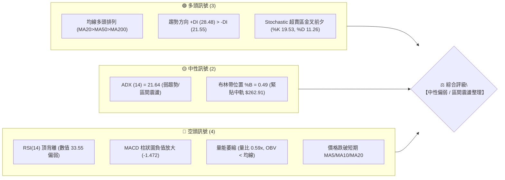
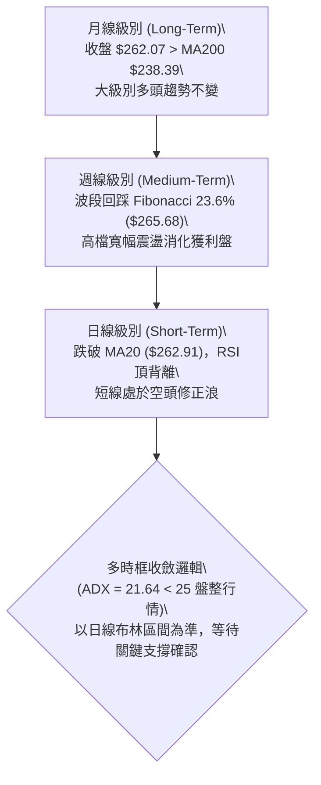
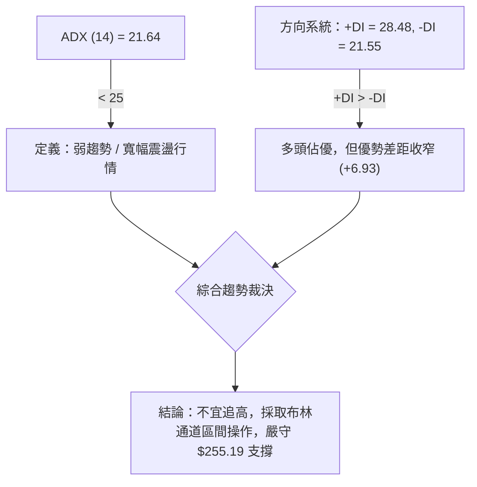
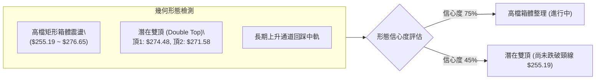
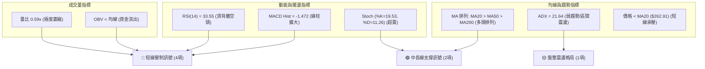
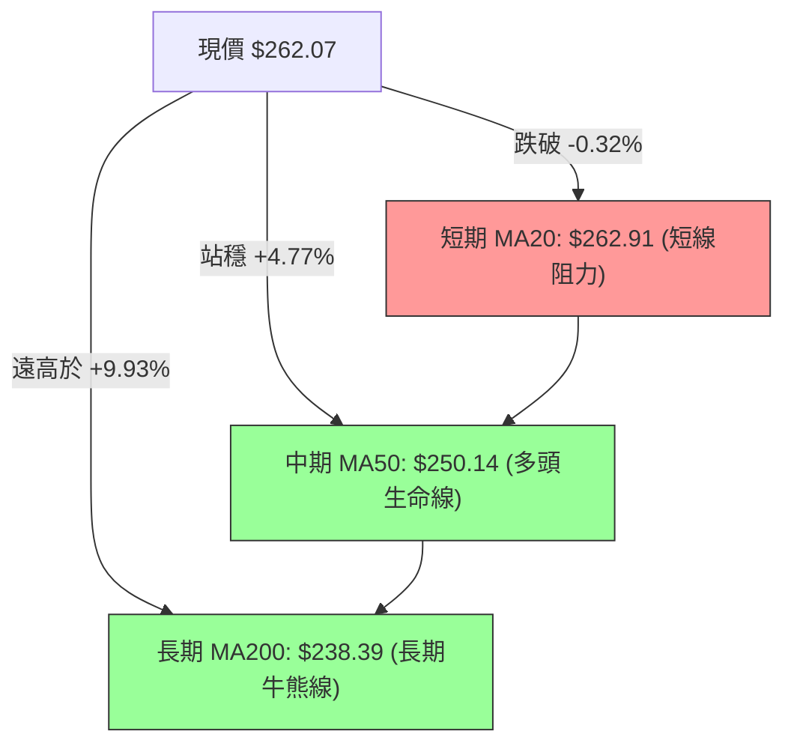
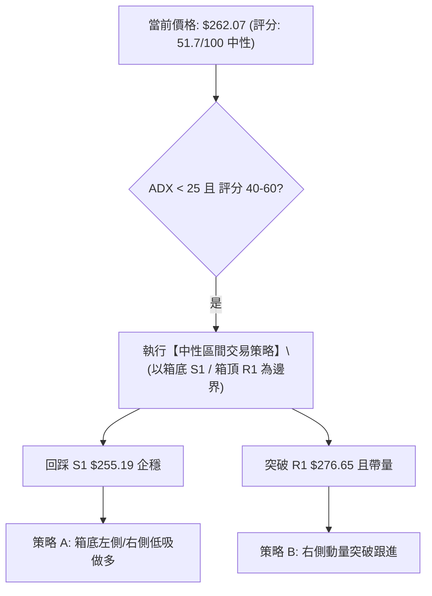
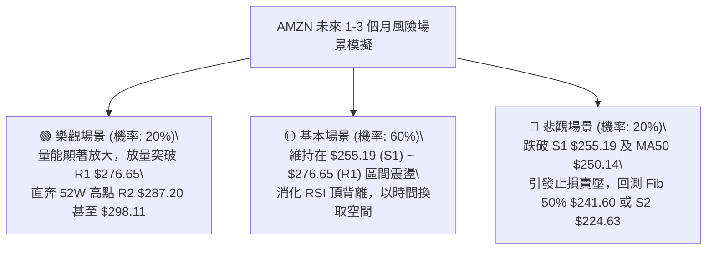

# AMZN 技術分析報告

> **報告日期**：2026-08-24 ｜ **語言**：繁體中文 ｜ **數據來源**：Yahoo Finance ｜ **當前價格**：$262.07

---

## 目錄

| 章節 | 內容 |
|------|------|
| [1. 技術面概覽](#1-技術面概覽) | 訊號儀表板、核心指標、評分卡 |
| [2. 趨勢分析](#2-趨勢分析) | 多時框趨勢、長中短期走勢 |
| [3. 圖表形態分析](#3-圖表形態分析) | 形態識別、K線組合、目標價 |
| [4. 支撐與阻力](#4-支撐與阻力) | 關鍵價位、斐波那契回調 |
| [5. 技術指標深度解讀](#5-技術指標深度解讀) | MA/RSI/MACD/布林/成交量 |
| [6. 動能與波動率](#6-動能與波動率) | 動能評估、ATR、Beta |
| [7. 多時框架總結](#7-多時框架總結) | 時框架評分矩陣 |
| [8. 交易策略建議](#8-交易策略建議) | 多空策略、風險報酬比 |
| [9. 風險提示與監控](#9-風險提示與監控) | 監控指標、風險場景 |

---

## 1. 技術面概覽

### 🎯 技術訊號儀表板



### 📊 核心指標速覽表

| 指標類別 | 指標名稱 | 當前數值 | 訊號 | 解讀 |
|:---|:---|:---|:---:|:---|
| **價格** | 當前價格 | $262.07 | 🟡 | 位於52週區間 72.4% 高位，短線承壓回調 |
| **均線** | MA20 | $262.91 | 🔴 | 現價位於 MA20 下方 (-0.32%)，短線多空分水嶺受阻 |
| **均線** | MA50 | $250.14 | 🟢 | 現價高於 MA50 (+4.77%)，中期多頭支撐穩固 |
| **均線** | MA200 | $238.39 | 🟢 | 現價顯著高於 MA200 (+9.93%)，長線牛市格局未破 |
| **動能** | RSI(14) | 33.55 | 🔴 | 接近超賣但出現明確**頂背離**，下行動能仍需消化 |
| **動能** | MACD (12,26,9) | 3.159 / 4.631 | 🔴 | DIF 下穿 DEA，柱狀圖負值 (-1.472)，空頭動能主導 |
| **隨機指標** | Stoch %K / %D | 19.53 / 11.26 | 🟢 | 進入深度超賣區，醞釀短線技術性反彈 |
| **趨勢** | ADX (14) | 21.64 | 🟡 | ADX < 25 表明處於弱趨勢／寬幅盤整階段 |
| **通道** | Bollinger Bands | $232.02 ~ $293.80 | 🟡 | %B = 0.49，價格回到中軌下方，通道維持橫向走平 |
| **成交量** | Volume / 20MA | 27.98M / 47.62M | 🔴 | 量比 0.59x，量能大幅衰退，OBV 低於均線確認買盤不足 |
| **波動** | ATR(14) | $6.14 (2.34%) | 🟡 | 每日平均波幅正常，日內波動風險可控 |

### 🏆 技術評分卡

```
╔══════════════════════════════════════════════════════════════════╗
║              技術評分卡 — AMZN (2026-08-24)                      ║
╠══════════════════════════════════════════════════════════════════╣
║ 趨勢強度 (ADX/DI)   ████████░░░░░░░░░░░░  45/100  🟡 弱勢盤整    ║
║ 動能指標 (RSI/MACD) ██████░░░░░░░░░░░░░░  32/100  🔴 動能轉弱    ║
║ 支撐穩定度 (S1/S2)   ██████████████░░░░░░  70/100  🟢 支撐明確    ║
║ 成交量配合 (OBV/Vol) ████░░░░░░░░░░░░░░░░  28/100  🔴 量價背離    ║
║ 形態完整度 (結構)   ██████████░░░░░░░░░░  55/100  🟡 寬幅箱體    ║
║ 均線排列 (MA體系)   ████████████████░░░░  80/100  🟢 大均線多頭  ║
╠══════════════════════════════════════════════════════════════════╣
║ 綜合技術評分        ██████████░░░░░░░░░░  51.7/100 ⚖️ 中性觀望   ║
╚══════════════════════════════════════════════════════════════════╝
```

---

## 2. 趨勢分析

### 🌐 多時框趨勢分析



### 📈 長期趨勢 — 12個月走勢圖（Unicode）

```
AMZN 月線收盤走勢圖（過去12個月：2025-09 至 2026-08）
價格 ($)
$280 ┤                                      ● $271.58
$270 ┤                            ● $270.64       ● $262.07(現價)
$260 ┤                       ● $265.06
$250 ┤          ● $244.22
$240 ┤                     ● $239.30     ● $238.34
$230 ┤     ● $229.00  ● $233.22  ● $230.82
$220 ┤● $219.57
$210 ┤                               ● $210.00
$200 ┤                                    ● $208.27(波段底)
     └─────────────────────────────────────────────────────────────
       09   10   11   12   01   02   03   04   05   06   07   08 (月份)
      (25) (25) (25) (25) (26) (26) (26) (26) (26) (26) (26) (26)
```

#### 走勢特徵分析表格

| 階段區間 | 起止月份 | 價格區間 ($) | 漲跌幅 | 走勢特徵解讀 |
|:---|:---:|:---:|:---:|:---|
| **第一階段：高位震盪** | 2025-09 ~ 2026-01 | $219.57 → $239.30 | +8.99% | 箱體震盪上行，在 $244.22 遇阻回落 |
| **第二階段：春季深度回踩** | 2026-01 ~ 2026-03 | $239.30 → $208.27 | -12.97% | 快速回撤確認 52週低點 $196.00 上方支撐區 |
| **第三階段：主升浪爆發** | 2026-03 ~ 2026-05 | $208.27 → $270.64 | +29.95% | 強勢拉升創波段新高，均線系統全面轉為多頭 |
| **第四階段：高檔震盪整理** | 2026-05 ~ 2026-08 | $270.64 → $262.07 | -3.17% | 於 $238.34~$271.58 間反覆洗盤，目前自高點回落 |

### 📊 中期趨勢（週線分析）

```
近期週線壓力與支撐示意圖：
$287.20 ────────────────────────────────────────── 52W 高點 / 強阻力 R2
$276.65 ------------------------------------------ 波段高點阻力 R1
$265.68 ·········································· Fibonacci 23.6% 回調
$262.07 ══════════════════════════════════════════ ◄ 當前價格
$255.19 ------------------------------------------ 近期密集支撐 S1 (週線防守)
$250.14 ·········································· 日線 MA50 支撐位
$238.39 ────────────────────────────────────────── MA200 長期牛熊分水嶺 / 6月低點
```

週線走勢顯示，AMZN 在 2026 年 8 月初拉出 $271.58 的週收盤高點後，動能隨即衰退，連續兩週收陰（$262.65、$258.63），本週反彈至 $262.07 但量能顯著不足（本週量 27.98M 對比上週 176.86M），顯示買盤追價意願薄弱，處於中期向上格局中的次級折返走勢。

### ⚡ 趨勢強度評估（ADX 解讀）



| 指標變量 | 當前數值 | 門檻標準 | 狀態評估 | 實戰指導含義 |
|:---|:---:|:---:|:---:|:---|
| **ADX(14)** | **21.64** | 25.00 | 🟡 弱趨勢／無方向 | 單邊突破概率低，假突破頻繁，不可追漲殺跌 |
| **+DI (14)** | **28.48** | 20.00 | 🟢 多方主導 | 買盤仍佔據中長期優勢 |
| **-DI (14)** | **21.55** | 20.00 | 🔴 空方抬頭 | 空方力量自低檔抬升，短線壓制價格 |

---

## 3. 圖表形態分析

### 🔍 形態識別系統



#### 形態信心度評估表

| 形態名稱 | 信心度 | 判斷依據（引用數據） | 完成度 | 目標價（附計算式） |
|:---|:---:|:---|:---:|:---|
| **高檔矩形箱體** | **75%** | 價格在阻力 $276.65 與支撐 $255.19 間反覆震盪 4 週以上 | 70% | 向上突破：$276.65 + ($276.65 - $255.19) = **$298.11**<br>向下跌破：$255.19 - ($276.65 - $255.19) = **$233.73** |
| **潛在雙重頂 (M頭)** | **45%** | 8/09 週高 $274.48 與 8/02 週高 $271.58 形成雙峰，但未破頸線 | 40% | 跌破頸線 $255.19 後測量目標：<br>頸線 $255.19 - (頂部 $274.48 - 頸線 $255.19) = **$235.90** |
| **頭肩底 / 旗形** | **<30%** | 數據中未偵測到完整幾何頭肩結構 | 0% | *訊號不足，僅做指標型解讀* |

### 🕯️ 重要K線形態分析

| 週/月份 | 收盤價 ($) | K線形態特徵 | 技術面解讀 | 訊號 |
|:---|:---:|:---|:---|:---:|
| **2026-06-28** | $232.69 | 放量長下影十字星 (週量 525.2M) | 主力恐慌盤清洗完畢，確立波段鐵底支撐 | 🟢 強烈買訊 |
| **2026-08-02** | $271.58 | 大陽線突破 (週量 355.37M) | 業績/評級利多刺激跳空大漲，奠定箱體上軌 | 🟢 多頭表態 |
| **2026-08-09** | $274.48 | 衝高回落倒錘子線 (週量 270.23M) | 逼近 52W 高點 $287.20 遇強大拋壓，多頭力竭 | 🔴 頂部預警 |
| **2026-08-23** | $258.63 | 中陰線下挫，跌破 MA20 | 空方回補缺口，測試 S1 支撐 $255.19 支撐力道 | 🔴 空方控盤 |
| **2026-08-30 (當前)** | $262.07 | 縮量小陽星線 (量比 0.59x) | 止跌回穩但反彈無量，屬於典型的弱勢中繼整理 | 🟡 觀望確認 |

### 📉 ASCII 走勢形態示意圖

```
AMZN 高檔箱體與雙頂頸線測試示意圖
$276.65 ┬─────────────────● (8/09 頂1: $274.48)
        │                / \        ● (8/02 頂2: $271.58)  ← 箱體上軌阻力
        │               /   \      / \
$265.68 ┼──────────────/─────\────/───\───────────── (Fib 23.6%)
$262.07 │             /       \  /     \  ▲ 現價 $262.07
        │            /         \/       ▼ (測試中軌)
$255.19 ┼───────────● (頸線支撐 S1)──────────────── (雙頂頸線 / 箱體下軌)
        │          /
$250.14 ┼─────────/───────────────────────────────── (MA50 均線防線)
        └────────────────────────────────────────────
```

### 🎯 形態目標價計算

1. **箱體向上突破情境**（需伴隨日成交量 > 5,000萬股確認）：
   - 計算式：$\text{突破目標價} = \text{箱頂 } \$276.65 + (\text{箱頂 } \$276.65 - \text{箱底 } \$255.19) = \$276.65 + \$21.46 = \mathbf{\$298.11}$
2. **雙頂跌破頸線情境**（跌破 $255.19 且連續 2 日無法收復）：
   - 計算式：$\text{回撤目標價} = \text{頸線 } \$255.19 - (\text{波段最高 } \$274.48 - \text{頸線 } \$255.19) = \$255.19 - \$19.29 = \mathbf{\$235.90}$
   - *註：該測算價位與 MA200 ($238.39) 及波段低點 S3 ($215.82) 形成共振支撐帶。*

---

## 4. 支撐與阻力

### 🗺️ 關鍵價位分布圖（Unicode）

```
AMZN 關鍵價位結構分布圖 (引用自 OHLCV 計算數據)
═══════════════════════════════════════════════════════════════════
$287.20 ║████████████████████████████████║ 強阻力 R2 (52週歷史高點)
$276.65 ║██████████████████████          ║ 關鍵阻力 R1 (近期波段高點聚類)
$265.68 ║▓▓▓▓▓▓▓▓▓▓▓▓▓▓                  ║ Fibonacci 23.6% 回調壓力位
$262.07 ╠════════════════════════════════╣ ◄ 當前價格 $262.07
$255.19 ║▓▓▓▓▓▓▓▓▓▓▓▓▓▓▓▓▓▓              ║ 近期關鍵支撐 S1 (近一年波段低點聚類)
$252.36 ║▓▓▓▓▓▓▓▓▓▓                      ║ Fibonacci 38.2% 回調位
$250.14 ║████████████████                ║ MA50 生命線支撐
$238.39 ║████████████████████████        ║ MA200 牛熊分界線
$224.63 ║██████████████████████████      ║ 強支撐 S2 (波段深度回調支撐)
$215.82 ║██████████████████████████████  ║ 強支撐 S3 (中長期鐵底聚類)
═══════════════════════════════════════════════════════════════════
```

### 🚧 阻力位分析表

| 阻力級別 | 價位 ($) | 距離現價 | 形成原因（嚴格引用數據） | 突破難度 | 重要性 |
|:---|:---:|:---:|:---|:---:|:---:|
| **R1** | **$276.65** | +5.57% | 近一年波段高點聚類、8月上旬密集套牢籌碼區 | 🟡 中等 | ★★★★☆ |
| **R2** | **$287.20** | +9.59% | 52週最高點、整數心理關卡、Fibonacci 0.0% 極限位 | 🔴 極高 | ★★★★★ |

### 🛡️ 支撐位分析表

| 支撐級別 | 價位 ($) | 距離現價 | 形成原因（嚴格引用數據） | 守住機率 | 重要性 |
|:---|:---:|:---:|:---|:---:|:---:|
| **S1** | **$255.19** | -2.63% | 近一年波段低點聚類、箱體下軌、近期日線回調低點 | 🟢 70% | ★★★★★ |
| **S2** | **$224.63** | -14.29% | 近一年波段低點聚類、跌破 MA200 後的深度技術緩衝帶 | 🟢 85% | ★★★★☆ |
| **S3** | **$215.82** | -17.65% | 近一年密集底部聚類、接近 78.6% 斐波那契回調位 ($215.52) | 🟢 95% | ★★★★★ |

### 📐 斐波那契回調位分析

依據 52 週完整波動區間（低點 **$196.00** → 高點 **$287.20**，總波幅 $91.20）計算：

```
斐波那契回調階梯與現價定位：
  0.0%  (52W High)   $287.20 ──────────────────────────────
  23.6%              $265.68 ────────────────────────────── ▲ 阻力 ($265.68)
                               ▲ 現價 $262.07 落在此區間 (弱勢整理)
  38.2%              $252.36 ────────────────────────────── ▼ 支撐 ($252.36)
  50.0%              $241.60 ──────────────────────────────
  61.8%  (黃金分割)   $230.84 ──────────────────────────────
  78.6%              $215.52 ──────────────────────────────
 100.0%  (52W Low)   $196.00 ──────────────────────────────
```

- **位置解讀**：現價 $262.07 運行於 **23.6% ($265.68)** 與 **38.2% ($252.36)** 回調位之間。
- **技術意涵**：在強勢牛市回調中，回調幅度不破 38.2%（即 $252.36）均屬於健康洗盤。若本輪跌破 $255.19 (S1) 並下探 $252.36 獲得支撐，則多頭結構未遭破壞；若進一步跌破 50.0% ($241.60)，則意味著趨勢將轉為深度調整。

---

## 5. 技術指標深度解讀

### 🎛️ 指標訊號總覽



### 📈 移動平均線排列分析



| 均線名稱 | 數值 ($) | 價格相對位置 | 偏離率 (%) | 均線走勢形態 | 解讀 |
|:---|:---:|:---:|:---:|:---|:---|
| **MA 5** | $261.22 | 價格在上方 | +0.33% | ▅▇██████▇▇▆ 走平 | 超短線跌勢減緩，嘗試構築微型雙底 |
| **MA 10** | $263.47 | 價格在下方 | -0.53% | ▄▅▆▇████▇▇ 下彎 | 短期下行壓制明顯，第一動態壓力 |
| **MA 20** | $262.91 | 價格在下方 | -0.32% | ▃▄▅▆▇██ 高檔鈍化 | 跌破布林中軌，短線進入多空拉鋸 |
| **MA 60** | $250.24 | 價格在上方 | +4.73% | ▂▂▂▂▂▂▁ 緩步上揚 | 中期上升趨勢完好，多頭主要防線 |
| **MA 120** | $245.17 | 價格在上方 | +6.89% | ▂▃▄▅▆▇██ 持續走多 | 半年線支撐強勁 |
| **MA 240** | $236.20 | 價格在上方 | +10.95% | ▃▄▅▆▇████ 強勢向上 | 年線走牛，奠定長期上行基石 |

**均線結構綜合判定**：雖然大週期均線呈現完美多頭排列（MA20 > MA50 > MA200），但短週期 MA5/MA10/MA20 出現糾結下彎，顯示長期趨勢雖多，但短期處於「均線乖離修正」階段。

### 📉 RSI(14) 分析

```
RSI(14) 當前數值：33.55
0 ──────────── 30 ─────────────────────── 70 ──────────── 100
[███████████░░░░░░░░░░░░░░░░░░░░░░░░░░░░░░] 33.55 (中性偏弱/逼近超賣)
```

- **超買超賣評估**：RSI 處於 33.55，脫離 50 中軸，接近 30 超賣線，短線賣壓釋放已進入中尾聲。
- **背離深度檢驗（⚠️ 頂背離確認）**：
  - **價格走勢**：2026 年 5 月高點收盤 $270.64 → 2026 年 8 月創出 $274.48 波段新高（更高的高點，HH）。
  - **RSI 走勢**：5 月高點時 RSI 為 **82.90** → 8 月波段高點時 RSI 僅為 **62.90**（更低的高點，LH）。
  - **背離結論**：價格創新高而動能大幅衰退，形成標準的**日/週線級別頂背離 (Bearish Divergence)**。當前價格自 $274.48 回跌至 $262.07 正是該頂背離引發的動能修復過程。

### 📊 MACD(12/26/9) 訊號解讀


MACD 雙線目前仍在零軸上方（DIF 3.159 > 0），表明大週期多頭未死，但 DIF 在高檔死叉 DEA 且負柱狀圖放大至 -1.472，顯示短線空頭下行慣性依然存在，不可盲目左側抄底。

### 📦 布林通道分析

```
AMZN 布林通道 (Bollinger Bands 20, 2) 結構圖
$293.80 ┬────────────────────────────────────────── BB 上軌
        │
        │
$262.91 ┼ - - - - - - - - - - - - - - - - - - - -  BB 中軌 (MA20)
$262.07 │ ◄ 現價 $262.07 (%B = 0.49，緊貼中軌下方)
        │
        │
$232.02 ┴────────────────────────────────────────── BB 下軌
```

- **通道帶寬分析**：帶寬目前保持穩定，未見異常收口或開口，代表市場處於標準區間震盪。
- **%B 位置解讀**：$\%B = \frac{262.07 - 232.02}{293.80 - 232.02} = \mathbf{0.49}$。價格位於中軌下方微幅位置，中軌 $262.91 轉化為短線動態阻力。若無法快速重返中軌上方，價格將有沿中下軌尋找下軌 $232.02 支撐的風險。

### 💹 成交量分析（量價配合度）

1. **量價配合評估**：
   - 當前單日成交量 27.98M 遠低於 20日均量 47.62M（**量比僅 0.59x**），亦遠低於 50日均量 51.25M。
   - 上漲縮量、回調亦縮量，顯示市場觀望情緒濃厚，機構主力資金在當前價位無大規模進出動作。
2. **OBV (能量潮) 趨勢**：
   - 當前 **OBV < OBV_MA**，能量潮指標呈下行趨勢，確認資金短線處於淨流出狀態，量能無法支撐立即發動向上突破。

---

## 6. 動能與波動率

### ⚡ 動能評估四象限

```
動能與波動率定位矩陣
       高動能 │ 
              │    Q3: 高風險突破區      Q1: 強勢主升區
              │    (高動能 / 高波動)     (高動能 / 低波動)
              │
──────────────┼────────────────────────────────────────────
       低動能 │ 
              │    Q4: 弱勢下行區        Q2: 區間沉寂區 ◄ 【AMZN 落點】
              │    (低動能 / 高波動)     (低動能 / 低波動: ADX=21.64, ATR=2.34%)
              │
              └────────────────────────────────────────────
                     高波動 ◄─────────► 低波動
```

| 象限 | 動能維度 | 波動維度 | AMZN 狀態檢驗 | 戰略指導建議 |
|:---:|:---:|:---:|:---:|:---|
| **Q1** | 強 | 低 | 不符合 (動能指標低迷) | 適合趨勢加碼 |
| **Q2 (當前)** | **弱** | **低** | **✓ 符合 (RSI 33.55, ADX 21.64, ATR 2.34%)** | **謹慎觀望，以區間低吸高拋為主，耐心等待動能重聚** |
| **Q3** | 強 | 高 | 不符合 (量能不足) | 突破追單 |
| **Q4** | 弱 | 高 | 不符合 (波動率未失控) | 停損離場 |

### 📊 ATR 波動率分析

- **ATR(14) 數值**：**$6.14**，佔當前股價比例為 **2.34%**，處於歷史常態中位水平。
- **風控與止損建議**：
  - **短線交易止損距離**：建議設定為 $1.5 \times \text{ATR} = 1.5 \times \$6.14 = \mathbf{\$9.21}$。
  - **波段交易止損距離**：建議設定為 $2.0 \times \text{ATR} = 2.0 \times \$6.14 = \mathbf{\$12.28}$。
  - *實戰應用*：若於現價 $262.07 進場多單，基於波動率的保護性止損不應小於 $\$262.07 - \$9.21 = \$252.86$（此價位恰與 Fib 38.2% 回調位 $252.36 相吻合）。

### 📐 Beta 與市場相關性

- **Beta 係數**：**1.454**。
- **波動特性解讀**：AMZN 屬於高彈性大型科技成長股，相較於標普500指數 (S&P 500) 具有 1.45 倍的波動放大效應。當大盤處於調整期時，AMZN 回撤幅度通常大於大盤；反之，大盤企穩時其反彈彈性亦顯著優於大盤。

---

## 7. 多時框架總結

### 📋 時框架評分表

| 時框架 | 趨勢方向 | 動能狀態 | 均線系統排列 | 形態結構 | 綜合評分 | 交易指導建議 |
|:---|:---:|:---:|:---:|:---:|:---:|:---|
| **月線 (長期)** | 🟢 多頭 | 🟡 中性走平 | 🟢 完美多頭 (價格 > MA200) | 🟢 震盪上行大通道 | **85 / 100** | 長期投資者堅定持有，無轉熊訊號 |
| **週線 (中期)** | 🟡 震盪 | 🔴 動能回落 | 🟢 均線支撐完好 (MA50上揚) | 🟡 高檔箱體 ($255~$276) | **58 / 100** | 回調至箱體下軌 $255.19 分批低吸 |
| **日線 (短期)** | 🔴 偏空 | 🔴 頂背離釋放 | 🔴 跌破短期均線 (價格 < MA20)| 🔴 短期震盪下行整理 | **38 / 100** | 嚴禁盲目追高，等待止跌訊號 |

### 🔲 綜合訊號矩陣

```
時框一致性分析矩陣：
┌───────────────┬───────────────────────────────┬───────────────────────────────┐
│   週期維度    │          多頭支持因素         │          空頭壓制因素         │
├───────────────┼───────────────────────────────┼───────────────────────────────┤
│ 長期 (月線)   │ • 52W 區間高位 (72.4%)        │ • 估值與獲利盤積累            │
│               │ • MA200 ($238.39) 強大支撐    │                               │
├───────────────┼───────────────────────────────┼───────────────────────────────┤
│ 中期 (週線)   │ • +DI (28.48) 仍大於 -DI      │ • 週線 RSI 自 97 超買區回落   │
│               │ • S1 ($255.19) 密集低點支撐   │ • 週 MACD 負柱狀圖出現        │
├───────────────┼───────────────────────────────┼───────────────────────────────┤
│ 短期 (日線)   │ • Stoch 超賣 (%K 19.53) 醞釀反彈│ • RSI 頂背離持續消化          │
│               │ • 價格接近 Fib 23.6% 區域     │ • 量比 0.59x，買盤動能枯竭    │
└───────────────┴───────────────────────────────┴───────────────────────────────┘
```

### ⚖️ 多時框收斂結論

依據多時框收斂規則（**ADX = 21.64 < 25，判定為盤整行情**）：
- **主導時框**：以**日線布林通道 ($232.02 ~ $293.80) 與 S1/R1 箱體**為核心交易區間。
- **時框衝突取捨**：雖然長期月線與中長均線（MA50/MA200）呈強烈多頭，但日線動能出現頂背離且跌破 MA20。在 ADX < 25 的盤整環境中，大級別不會發動單邊暴漲，必須優先尊重日線級別的動能修復需求。
- **唯一方向性結論**：**【中性觀望 / 逢低區間操作】**。目前不具備趨勢突破條件，策略上以等待價格回踩支撐位進行防守型做多為主。

---

## 8. 交易策略建議

### 🗺️ 策略決策流程圖



### 🧭 策略路由

> **當前主策略方向 = 中性區間操作（依評分卡綜合評分 51.7 / 100）**
> 
> *基於評分處於 40–60 區間且 ADX 弱勢盤整，主推「箱體邊界區間操作策略」，重點布局回踩 S1 支撐之多頭機會；空頭僅作為風險對沖防護。*

### 🎯 價格情境階梯（Price Scenarios）

| 觸發條件 | 下一目標 | 後續延伸 | 情境含義與技術解讀（嚴格引用數據） |
|:---|:---:|:---:|:---|
| **向上突破 R1 $276.65** | **R2 $287.20** | **$298.11** *(形態推算)* | 短線轉強，完成箱體突破，挑戰 52W 歷史高點 |
| **守住 S1 $255.19 區間** | **MA20 $262.91** | **R1 $276.65** | 區間震盪延續，回踩確認支撐有效，重回箱體內部運作 |
| **跌破 S1 $255.19** | **Fib 38.2% $252.36** | **S2 $224.63 / S3 $215.82** | 中期走弱，雙頂形態隱憂浮現，向下尋求 MA200 及 S2 強支撐 |

### 📊 情境機率分佈

| 價格走勢情境 | 發生機率 | 主要技術依據 |
|:---|:---:|:---|
| **情境一：區間震盪 / 回踩反彈** | **60%** | ADX=21.64 壓制單邊趨勢；均線多頭排列提供底部防護；Stoch 進入深度超賣區 |
| **情境二：跌破 S1 深度回調** | **25%** | RSI 日線頂背離尚未完全消化；MACD 負柱狀圖擴大；量能疲弱 (OBV < 均線) |
| **情境三：直接向上突破 R1/R2** | **15%** | 量比僅 0.59x，缺乏足夠買盤推動價格逆勢突破歷史高點區域 |

### 🟢 主策略詳情（區間多頭策略）

```
主策略進場與風控價位標注：
$276.65 ────────────────────────────────────────── 目標價 T2
$268.00 ------------------------------------------ 目標價 T1 (接近 Fib 23.6%)
$262.07 ══════════════════════════════════════════ 現價
$255.50 ·········································· 策略 A 進場點 (S1 支撐上方)
$250.00 ────────────────────────────────────────── 策略 A 止損點 (跌破 MA50 / Fib 38.2%)
```

| 策略要素 | 策略 A：箱底支撐低吸（主策略） | 策略 B：突破確認追多（右側策略） |
|:---|:---|:---|
| **進場條件** | 價格回踩 S1 ($255.19) 附近出企穩K線，Stoch 金叉 | 價格強勢放量（日量 > 5,000萬股）突破 R1 ($276.65) |
| **進場價格** | **$255.50** | **$277.00** |
| **目標價 T1** | **$268.00** *(Fib 23.6% 壓力帶)* | **$287.20** *(52W 歷史高點 R2)* |
| **目標價 T2** | **$276.65** *(波段高點阻力 R1)* | **$298.11** *(形態推算高度目標)* |
| **止損價格** | **$250.00** *(跌破 MA50 $250.14 及 Fib 38.2%)* | **$271.00** *(跌回箱體上軌下方)* |
| **風險報酬比** | **1 : 3.85** *(風險 $5.50 / 獲利 $21.15)* | **1 : 3.52** *(風險 $6.00 / 獲利 $21.11)* |
| **成功機率** | **65%** | **55%** |
| **建議倉位** | **15% ~ 20%** | **10% ~ 15%** |

### 🔴 反向風險觸發點（對沖提示）

若發生以下條件，宣告主多頭策略失效，應啟動風控防禦或建立空頭對沖：
- **觸發條件 1**：日收盤價有效**跌破 $255.19 (S1)** 且伴隨成交量放大至 5,000 萬股以上。
- **觸發條件 2**：反彈測試 **MA20 ($262.91)** 或 **Fib 23.6% ($265.68)** 連續兩日受阻並收出長上影線。
- **對沖目標區域**：第一下行目標 **$241.60 (Fib 50.0%)**，極端目標 **$224.63 (S2)**。

### ⭐ 整體訊號強度評星

```
╔══════════════════════════════════════════════════════════════════╗
║ 做多訊號強度：  ★★★☆☆  (3.0/5 星) — 中長多頭在，短線等待回踩     ║
║ 做空訊號強度：  ★★☆☆☆  (2.5/5 星) — 動能偏空但下方均線支撐密集   ║
║ 整體可信度：    ★★★★☆  (4.0/5 星) — 區間震盪指標結構清晰         ║
╚══════════════════════════════════════════════════════════════════╝
```

---

## 9. 風險提示與監控

### ✅ 關鍵監控指標 Checklist

```
╔══════════════════════════════════════════════════════════════════╗
║              AMZN 日常交易關鍵監控 Checklist                     ║
╠══════════════════════════════════════════════════════════════════╣
║ [ ] 價格能否在 3 個交易日內收復 MA20 ($262.91)？                 ║
║ [ ] 回調時 S1 支撐位 ($255.19) 是否有買盤承接？                  ║
║ [ ] RSI(14) 數值是否在 30 附近止跌並出現底背離金叉？             ║
║ [ ] MACD 柱狀圖負值 (-1.472) 是否開始由長變短出現收斂？          ║
║ [ ] 單日成交量是否回升至 20日均量 (4,762萬股) 之上？             ║
║ [ ] 跌破 $250.14 (MA50) 時是否嚴格執行止損紀律？                 ║
╚══════════════════════════════════════════════════════════════════╝
```

### ⚠️ 風險場景分析



### 🛡️ 風險管理重要提醒

1. **頂背離修正風險**：
   - 儘管 60 位華爾街分析師平均目標價給予 **$327.00**（評級 Strong Buy），但技術面的 RSI/MACD 頂背離具有冷酷的均值回歸特性，基本面利多無法完全免疫短線技術回撤。
2. **量能不足風險**：
   - 0.59x 的極低量比意味著當前價格缺乏機構買盤背書，切忌在當前價位（$262.07）附近急於追高，應嚴格等待回踩 S1 ($255.19) 確認或突破 R1 ($276.65) 之右側訊號。
3. **倉位與資金控管**：
   - 單一個股持倉佔總投資組合比重建議控制在 **15% 以內**。
   - 嚴格執行 $250.00 停損線，若觸發停損，單筆交易虧損應控制在總資金的 **1% ~ 1.5%** 之內。

---

## 📋 報告總結

```
╔══════════════════════════════════════════════════════════════════╗
║                   AMZN 技術分析報告總結                          ║
╠══════════════════════════════════════════════════════════════════╣
║ 報告日期：2026-08-24                                             ║
║ 當前價格：$262.07                                                ║
║ 技術評級：⚖️ 中性觀望 / 區間震盪 (綜合評分: 51.7 / 100)           ║
╠══════════════════════════════════════════════════════════════════╣
║ 關鍵結論：                                                       ║
║ ├─ 長期趨勢：🟢 強勢多頭 (MA20>MA50>MA200，價格遠高於 MA200)    ║
║ ├─ 中期趨勢：🟡 寬幅震盪 (運行於 $255.19 ~ $276.65 箱體內)        ║
║ ├─ 短期趨勢：🔴 弱勢修正 (跌破 MA20，RSI 頂背離消化中，量能枯竭) ║
║ ├─ 關鍵支撐：S1: $255.19 ｜ S2: $224.63 ｜ S3: $215.82          ║
║ ├─ 關鍵阻力：R1: $276.65 ｜ R2: $287.20 (52W高點)                ║
║ └─ 分析師目標：平均 $327.00 (最低 $230.00 / 最高 $405.00)        ║
╠══════════════════════════════════════════════════════════════════╣
║ 最優策略組合：                                                   ║
║ 1. 🥇 最佳機會：回踩支撐 S1 $255.50 低吸多單，止損 $250.00       ║
║ 2. 🥈 次選機會：放量突破 R1 $277.00 追多，目標 $287.20 / $298.11 ║
║ 3. 🥉 保守選擇：空倉觀望，等待日線 MACD 柱狀圖翻紅與量能回升     ║
╚══════════════════════════════════════════════════════════════════╝
```

---

> ⚠️ **免責聲明**：本報告為技術分析研究，所有數據及估算均基於歷史價格與客觀技術指標計算。本報告**僅供研究與學術參考**，**不構成任何投資建議或買賣邀約**。金融市場投資具有高度風險，交易者應獨立判斷並自負盈虧。

---

*報告生成時間：2026-08-24 ｜ 數據來源：Yahoo Finance ｜ 分析框架：多時框技術分析體系*