# AMZN 技術分析報告

> **報告日期**：2026-08-25 ｜ **語言**：繁體中文 ｜ **數據來源**：Yahoo Finance ｜ **當前價格**：$261.06

---

## 目錄

| 章節 | 內容 |
|------|------|
| [1. 技術面概覽](#1-技術面概覽) | 訊號儀表板、核心指標、評分卡 |
| [2. 趨勢分析](#2-趨勢分析) | 多時框趨勢、長中短期走勢、ADX解讀 |
| [3. 圖表形態分析](#3-圖表形態分析) | 形態識別、信心度評估、K線組合 |
| [4. 支撐與阻力](#4-支撐與阻力) | 關鍵價位分佈、斐波那契回調結構 |
| [5. 技術指標深度解讀](#5-技術指標深度解讀) | MA系統、RSI、MACD、布林通道、OBV量價 |
| [6. 動能與波動率](#6-動能與波動率) | 動能四象限、ATR波動分析、Beta風險 |
| [7. 多時框架總結](#7-多時框架總結) | 時框矩陣、收斂規則與唯一方向結論 |
| [8. 交易策略建議](#8-交易策略建議) | 策略路由、情境階梯、主策略詳情、風控點 |
| [9. 風險提示與監控](#9-風險提示與監控) | 監控Checklist、三種市場情境、資金管理 |
| [10. 報告總結](#10-報告總結) | 核心指標總結看板與操作指引 |

---

## 1. 技術面概覽

### 🎯 技術訊號儀表板

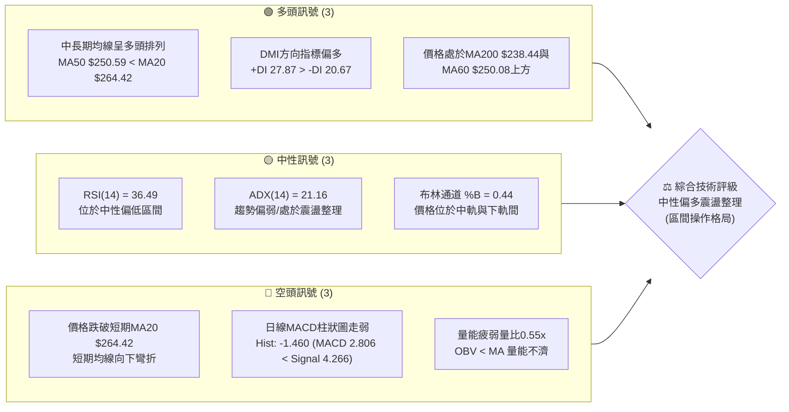

### 📊 核心指標速覽表

| 指標類別 | 指標名稱 | 當前數值 | 訊號 | 解讀 |
|----------|----------|----------|:----:|------|
| **價格** | 當前價格 | $261.06 | 🟡 | 位於52週區間71.3%處，短期呈現高檔回檔整理 |
| **均線** | 短期 MA20 | $264.42 | 🔴 | 現價位於MA20下方（-1.27%），短期承壓 |
| **均線** | 中期 MA50 | $250.59 | 🟢 | 現價位於MA50上方（+4.18%），中期多頭防線穩固 |
| **均線** | 長期 MA200| $238.44 | 🟢 | 現價大幅高於MA200（+9.49%），長期多頭架構完好 |
| **動能** | RSI(14) | 36.49 | 🟡 | 接近超賣邊界但未達極值，處於弱勢回檔區 |
| **動能** | MACD柱狀 | -1.460 | 🔴 | MACD線(2.806)低於訊號線(4.266)，空方動能佔優 |
| **動能** | KD指標 | K:17.40 / D:14.37 | 🟢 | 進入超賣鈍化區，隨時具備技術性反彈契機 |
| **波動** | ATR(14) | $5.56 (2.13%) | 🟡 | 日內波動幅度溫和，無失控單邊爆發跡象 |
| **趨勢** | ADX(14) | 21.16 | 🟡 | 數值低於25，確認市場處於無明顯單邊趨勢的盤整期 |
| **量能** | 20日成交量比| 0.55x | 🔴 | 25.45M vs 均量46.68M，量能顯著萎縮，追價動能不足 |

### 🏆 技術評分卡

```
╔══════════════════════════════════════════════════════════════════╗
║                   技術評分卡 — AMZN (2026-08-25)                 ║
╠══════════════════════════════════════════════════════════════════╣
║ 趨勢強度 (ADX/DMI)    ████████░░░░░░░░░░░░  42/100  🟡 中性偏弱 ║
║ 動能指標 (RSI/MACD/KD) ██████████░░░░░░░░░░  50/100  🟡 動能中性 ║
║ 支撐穩定度 (S1/S2/MA) ██████████████░░░░░░  70/100  🟢 支撐穩固 ║
║ 成交量配合 (OBV/量比)  ██████░░░░░░░░░░░░░░  30/100  🔴 量能背離 ║
║ 形態完整度 (波段結構)  ████████████░░░░░░░░  60/100  🟡 箱體整理 ║
║ 均線排列 (MA多時框)    ██████████████░░░░░░  70/100  🟢 多頭排列 ║
╠══════════════════════════════════════════════════════════════════╣
║ 綜合技術評分          ███████████░░░░░░░░░  53.7/100 🟡 中性盤整 ║
║ 策略導向建議          區間波段操作 (以布林軌道及S1/R1為交易界限) ║
╚══════════════════════════════════════════════════════════════════╝
```

---

## 2. 趨勢分析

### 🌐 多時框趨勢分析

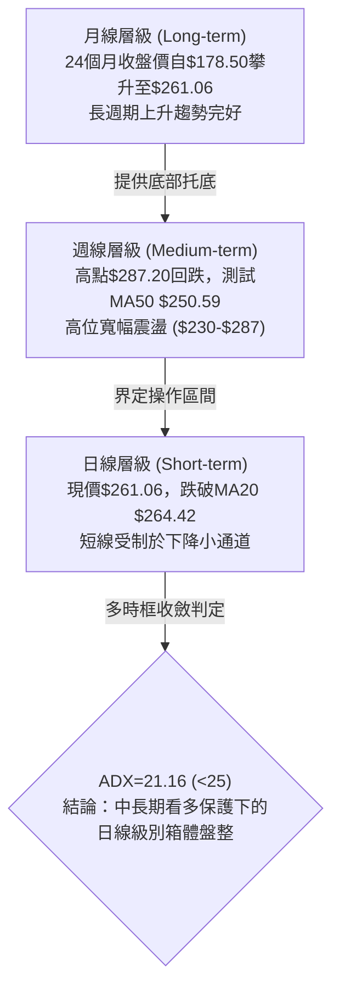

### 📈 長期趨勢 — 12個月走勢圖（Unicode）

```
AMZN 月線走勢圖（2025-08 至 2026-08）
價格 ($)
$290 ┤                                      ● (52W High $287.20)
$270 ┤                                  ●       ● (07月 $271.58)
$260 ┤                              ●               ● (08月現價 $261.06)
$250 ┤                                  
$240 ┤              ●               ●               
$230 ┤  ●       ●       ●   ●   ●                       
$220 ┤      ●                                       
$210 ┤                          ●   ● (03月低點 $208.27)
$200 ┤                                              
     └─────────────────────────────────────────────────────────►
        08  09  10  11  12  01  02  03  04  05  06  07  08 (月份)
        25  25  25  25  25  26  26  26  26  26  26  26  26 (年份)
```

#### 走勢特徵分析表格

| 階段區間 | 起止價格 | 漲跌幅 | 走勢特徵解讀 | 技術意涵 |
|----------|----------|--------|--------------|----------|
| **2025-08 ~ 2025-10** | $229.00 → $244.22 | +6.65% | 震盪走高，突破前期平台 | 多頭初段發力 |
| **2025-11 ~ 2026-03** | $233.22 → $208.27 | -10.70% | 階梯式回調，測試52W低點附近支撐 | 構築大週期回調底 |
| **2026-04 ~ 2026-05** | $265.06 → $270.64 | +29.95% (自03月起算) | 強勢噴出，突破均線壓制並創波段新高 | 主升浪爆發 |
| **2026-06 ~ 2026-08** | $238.34 → $261.06 | 區間震盪 | 於 $238 - $271 寬幅洗盤，現報 $261.06 | 高檔換手蓄勢 |

### 📊 中期趨勢（週線分析）

```
週線關鍵阻力與支撐結構示意：
═════════════════════════════════════════════════════════════════
  $287.20 ────────────────────────────────────────── 52W高點 / 強阻力 (R2)
                 ▲           ▲
                 │   區間    │   (回調壓力帶)
                 ▼   震盪    ▼
  $276.65 ────────────────────────────────────────── 近期波段反彈高點 (R1)
  $261.06 ══════════════════════════════════════════ 【當前現價位置】
  $255.19 ------------------------------------------ 波段密集支撐 (S1)
  $250.59 ────────────────────────────────────────── 中期生命線 (MA50)
  $238.44 ────────────────────────────────────────── 長期牛熊分界 (MA200)
  $224.63 ────────────────────────────────────────── 中期強支撐平台 (S2)
═════════════════════════════════════════════════════════════════
```

### ⚡ 趨勢強度評估（ADX 解讀）

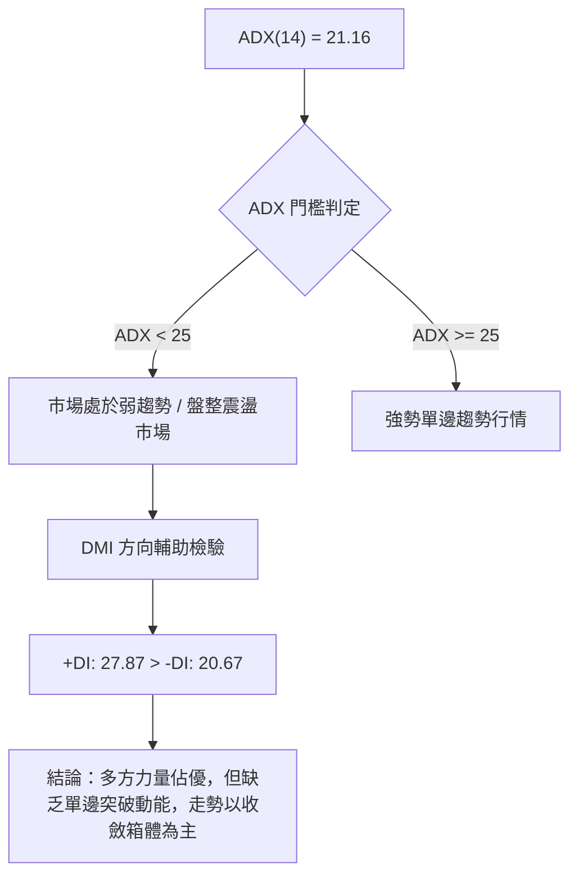

#### ADX 強度與行情屬性對照表

| 指標參數 | 當前讀數 | 標準閾值區間 | 當前市場屬性判定 | 交易指引 |
|----------|----------|--------------|------------------|----------|
| **ADX(14)** | **21.16** | 0 ~ 25：盤整 / 弱趨勢 | 🟡 無單邊趨勢，屬於區間震盪 | 禁用激進追突破策略，採用高拋低吸 |
| **+DI (多方)** | **27.87** | > 20 且大於 -DI | 🟢 多頭推動力佔優 | 回調至支撐位偏向尋找做多機會 |
| **-DI (空方)** | **20.67** | 低於 +DI | 🟡 空方力量受限，尚無崩跌風險 | 逢低做多勝率高於追空 |

---

## 3. 圖表形態分析

### 🔍 形態識別系統

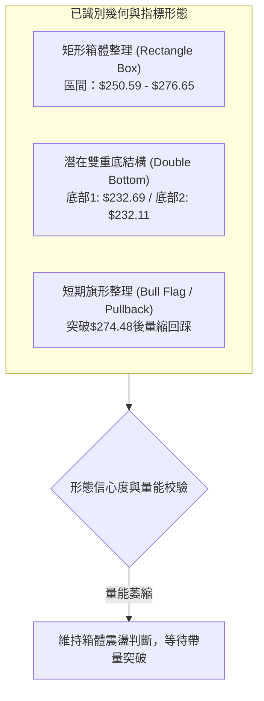

#### 形態識別與信心度評估表（嚴格依據規則15）

| 形態名稱 | 信心度 | 判斷依據（數據引用） | 完成度 | 目標價（附嚴謹計算式） |
|----------|:------:|----------------------|:------:|------------------------|
| **高檔箱體整理** | **75%** | 價格在支撐 S1 ($255.19) 與阻力 R1 ($276.65) 區間內反覆震盪已逾6週 | 70% | 箱體突破目標 = 阻力 $276.65 + ($276.65 - $255.19) = **$298.11**（數據未列，僅作推算參考） |
| **週線雙重底** | **65%** | 2026-06-28低點 $232.69 與 2026-07-26低點 $232.11 形成雙底，頸線位於 2026-07-19之 $247.23 | 100% (已達標) | 頸線 $247.23 + ($247.23 - $232.11) = $262.35（現價 $261.06 已基本完成形態測幅） |
| **短期均線反壓** | **80%** | 現價 $261.06 跌破 MA5 ($261.54)、MA10 ($262.35) 與 MA20 ($264.42) | 85% | 尋求回踩斐波那契38.2%回調位 **$252.36** 或波段支撐 **$255.19** |

### 🕯️ 重要K線形態分析

| 週/月份週期 | 收盤價 | K線形態特徵 | 盤面技術解讀 | 多空訊號 |
|-------------|--------|-------------|--------------|:--------:|
| **2026-06-28** | $232.69 | 長下影巨量十字星 (成交量5.25億) | 爆量長下影線，主力資金於波段低檔強勢承接進場 | 🟢 極強多頭 |
| **2026-08-02** | $271.58 | 大陽線實體突破 (週漲幅+17.0%) | 帶量突破短期均線壓制，確認底部反轉確立 | 🟢 強烈看多 |
| **2026-08-09** | $274.48 | 衝高受阻流星線 (高點逼近$287.20) | 多頭動能衰竭，遇52週高點歷史阻力回落 | 🔴 短期看空 |
| **2026-08-23** | $258.63 | 縮量中陰線 (成交量1.76億) | 跌破短期均線，但成交量大幅萎縮，呈現良性洗盤 | 🟡 中性偏弱 |
| **2026-08-30** | $261.06 | 小陽孕線/止跌十字 (最新截點) | 於支撐位 $255.19 上方企穩，空方拋壓明顯減弱 | 🟢 止跌初現 |

### 📉 ASCII 走勢形態示意圖

```
AMZN 日/週線級別箱體震盪與形態演變示意圖
═════════════════════════════════════════════════════════════════
  $287.20 ───┐ (52W High)
             │ 
  $276.65 ───┼───────────● (R1 阻力反彈高點 2026-08-09)
             │          / \
             │         /   \      ┌── MA20 $264.42 (短線反壓)
  $261.06 ───┼────────/─────●─────┴──【現價位置：回踩整理】
             │       /       \   /
  $255.19 ───┼──────/─────────● (S1 支撐回踩點)
             │     /
  $247.23 ───┼────● (頸線突破點 2026-07-19)
             │   / \
  $232.11 ───┴──●───● (雙底支撐 2026-06-28 / 2026-07-26)
═════════════════════════════════════════════════════════════════
```

---

## 4. 支撐與阻力

### 🗺️ 關鍵價位分布圖（Unicode）

```
AMZN 價位結構分布圖（OHLCV 精確計算）
═════════════════════════════════════════════════════════════════
  $287.20 ║██████████████████████████████║ 強阻力 R2 (52W High / 0.0% Fib)
  $276.65 ║████████████████████░░░░░░░░░░║ 關鍵阻力 R1 (近一年波段高點聚類)
  $265.68 ║▓▓▓▓▓▓▓▓▓▓▓▓▓▓▓▓▓▓▓▓░░░░░░░░░░║ 阻力位 (23.6% 斐波那契回調位)
  $264.42 ║------------------------------║ 短期均線壓制 (MA20)
  $261.06 ╠══════════════════════════════╣ ◄ 現價位置 ($261.06)
  $255.19 ║▓▓▓▓▓▓▓▓▓▓▓▓▓▓▓▓▓▓▓▓░░░░░░░░░░║ 關鍵支撐 S1 (波段低點聚類)
  $252.36 ║████████████████████░░░░░░░░░░║ 支撐位 (38.2% 斐波那契回調位)
  $250.59 ║------------------------------║ 中期生命線支撐 (MA50)
  $241.60 ║████████████████████████░░░░░░║ 強支撐 (50.0% 斐波那契回調位)
  $238.44 ║------------------------------║ 牛熊分界線 (MA200)
  $224.63 ║██████████████████████████████║ 極強支撐 S2 (波段深度密集支撐)
  $215.82 ║██████████████████████████████║ 極強防線 S3 (波段底/78.6% Fib $215.52)
═════════════════════════════════════════════════════════════════
```

### 🚧 阻力位分析表

| 阻力級別 | 價位 | 形成原因（嚴格引用數據） | 突破難度 | 重要性 |
|----------|:----:|--------------------------|:--------:|:------:|
| **R1** | **$276.65** | 近一年波段高點聚類，且靠近8月上旬反彈頂點 | 🟡 中等 | ★★★★☆ |
| **R2** | **$287.20** | 52週歷史最高價 (52W High)，斐波那契 0.0% 極值 | 🔴 極高 | ★★★★★ |

### 🛡️ 支撐位分析表

| 支撐級別 | 價位 | 形成原因（嚴格引用數據） | 守住機率 | 重要性 |
|----------|:----:|--------------------------|:--------:|:------:|
| **S1** | **$255.19** | 近一年波段低點聚類，緊鄰 MA50 ($250.59) | 🟢 75% | ★★★★☆ |
| **S2** | **$224.63** | 歷史重要籌碼密集帶，深度回調之波段底 | 🟢 90% | ★★★★★ |
| **S3** | **$215.82** | 歷史極限支撐，重合斐波那契 78.6% ($215.52) | 🟢 95% | ★★★★★ |

### 📐 斐波那契回調位分析

依據 52 週完整區間 **$196.00 (低點) → $287.20 (高點)** 計算：

```
斐波那契回調階梯分布
  0.0%  (52W High) : $287.20 ───────────────────────────── [頂部阻力]
 23.6% 回調位      : $265.68 ─────────────── 現價上方阻力 ($265.68)
                               ▲
                      【現價 $261.06 運行於 23.6% 與 38.2% 區間】
                               ▼
 38.2% 回調位      : $252.36 ─────────────── 黃金回調強支撐 (重合MA50 $250.59)
 50.0% 回調位      : $241.60 ─────────────── 多空平衡中軸 (重合MA200 $238.44)
 61.8% 回調位      : $230.84 ─────────────── 深幅回調防線
 78.6% 回調位      : $215.52 ─────────────── 結構防守底線 (重合S3 $215.82)
100.0%  (52W Low)  : $196.00 ───────────────────────────── [底部基石]
```

**回調結構深度解讀**：現價 $261.06 正處於 **23.6% ($265.68)** 與 **38.2% ($252.36)** 之間。在強勢多頭市場中，健康的回踩通常止步於 38.2% 斐波那契位，該位置恰好與上升中的 **MA50 ($250.59)** 以及波段支撐 **S1 ($255.19)** 形成共振支撐區間（$250.59 - $255.19），顯示下方防禦縱深極具厚度。

---

## 5. 技術指標深度解讀

### 🎛️ 指標訊號總覽

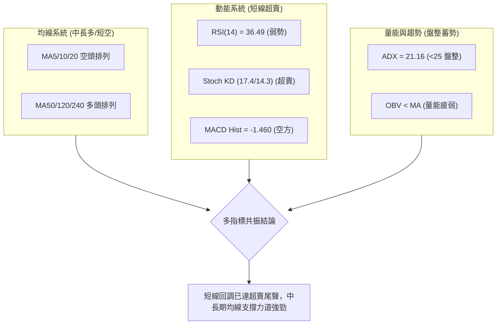

### 📈 移動平均線排列分析

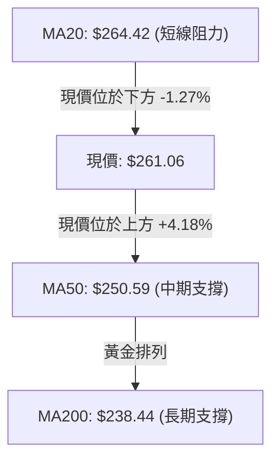

#### 均線多空狀態監控表

| 均線名稱 | 當前價格 | 與現價乖離率 | 排列狀態 | 技術含義 |
|----------|:--------:|:------------:|:--------:|----------|
| **MA5**  | $261.54  | -0.18%       | 走平向下 | 超短線多空爭奪臨界 |
| **MA10** | $262.35  | -0.49%       | 向下彎折 | 短線第一道動態壓制 |
| **MA20** | $264.42  | -1.27%       | 下行     | 短期多空分水嶺，站穩方可轉強 |
| **MA50** | $250.59  | +4.18%       | 上行     | 中期趨勢生命線，提供強勁多頭推力 |
| **MA60** | $250.08  | +4.39%       | 上行     | 與MA50形成雙重中期支撐帶 |
| **MA120**| $245.54  | +6.32%       | 上行     | 半年線持續向上發散 |
| **MA200**| $238.44  | +9.49%       | 上行     | 長期牛市基礎堅實 |

### 📉 RSI(14) 分析

- **當前讀數**：**36.49**
- **動能強度進度條**：`███████░░░░░░░░░░░░░` 36.49% (中性偏弱 / 逼近超賣)
- **區間定位**：處於 30 至 70 之中性區間偏下緣，反映過去數日空方掌握主導權，但動能已接近枯竭。
- **背離檢驗**：
  - 價格自 2026-08-09 之高點 $274.48 回跌至 $261.06。
  - RSI 自 62.9 降至 36.49，指標同步回落。
  - **結論**：**無頂背離亦無底背離**，屬於健康的趨勢回調釋放動能。

### 📊 MACD(12/26/9) 訊號解讀

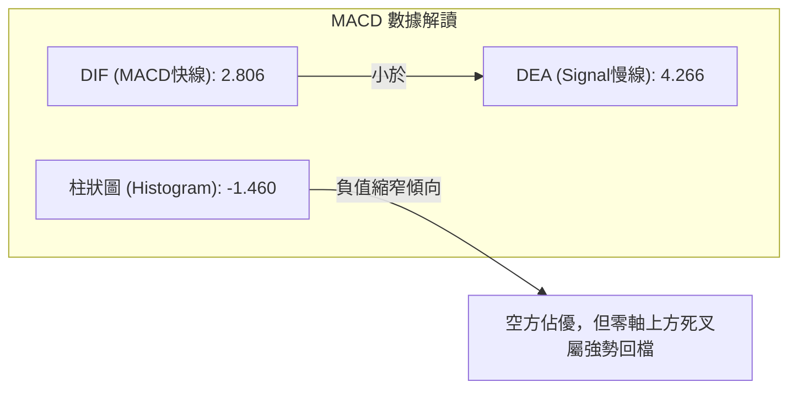

- **快慢線位置**：MACD (2.806) 與 Signal (4.266) 均保持在 **零軸上方**，確認整體大格局仍由多頭控盤，目前的死叉屬於牛市架構下的次級回撤。
- **柱狀圖動態**：當前柱狀圖為 **-1.460**，相較前一週 (-1.538) 已出現微幅收斂跡象，暗示下行動能開始放緩。

### 📦 布林通道分析

```
布林通道結構示意圖 (Bollinger Bands 20, 2)
═════════════════════════════════════════════════════════════════
  $291.42 ────────────────────────────────────────── BB 上軌 (超買擴張壓制)
                 ▲
                 │  帶寬: $54.00 (通道處於中等開口狀態)
                 ▼
  $264.42 ────────────────────────────────────────── BB 中軌 / MA20 (動態阻力)
  $261.06 ══════════════════════════════════════════ 【現價位置 %B = 0.44】
                 ▲
                 │  處於中軌與下軌之間，偏向中軌修復
                 ▼
  $237.42 ────────────────────────────────────────── BB 下軌 (極限支撐 / 重合MA200)
═════════════════════════════════════════════════════════════════
```

- **%B 指標分析**：當前 **%B = 0.44**，表明價格位於通道中下部，未觸及下軌極端超賣區 ($237.42)，但具備向中軌 ($264.42) 均值回歸的技術空間。

### 💹 成交量分析（量價配合度）

- **量比現況**：最新成交量 **25,452,240** 股，相較於 20 日均量 (46,676,257 股) **量比僅 0.55x**，呈現典型的「量縮回檔」。
- **OBV 能量潮**：OBV < MA，顯示資金進場意願轉向觀望，但量能的大幅萎縮亦證明盤面缺乏恐慌性拋壓，屬於多頭格局中的「無量洗盤」。

---

## 6. 動能與波動率

### ⚡ 動能評估四象限

| 象限 | 動能強度 (RSI/MACD) | 波動率水準 (ATR/帶寬) | 當前狀態判定 | 操作指引 |
|:----:|:-------------------:|:---------------------:|:------------:|----------|
| **Q1** | 強 (Bullish) | 低 (Low Vol) | — | 最佳波段加碼契機 |
| **Q2** | **弱 (Bearish/Neutral)** | **低 (Low Vol)** | ** AMZN 當前位置** | **謹慎觀望，逢低分批佈局支撐** |
| **Q3** | 強 (Bullish) | 高 (High Vol) | — | 順勢突破，緊設移動止損 |
| **Q4** | 弱 (Bearish) | 高 (High Vol) | — | 風險規避，嚴禁盲目抄底 |

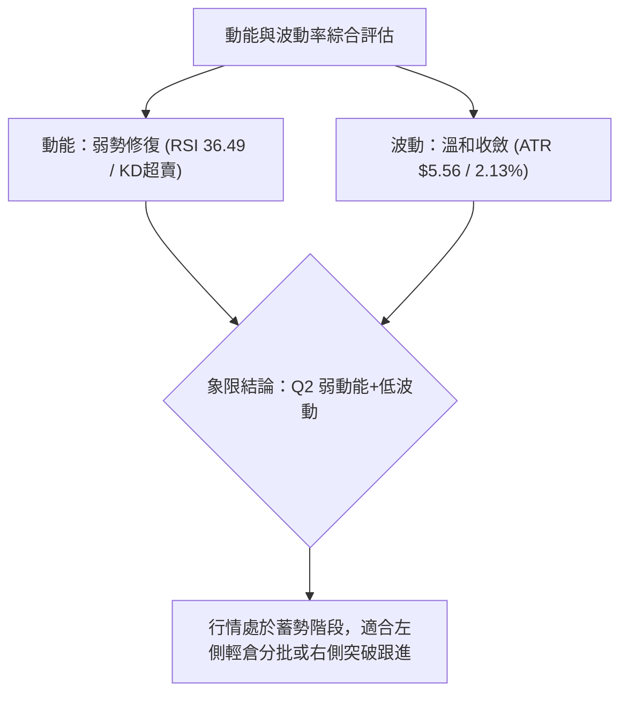

### 📊 ATR 波動率分析

- **ATR(14) 數值**：**$5.56**，佔當前股價比例為 **2.13%**。
- **波動特性解讀**：ATR 處於歷史常態中位水準，未見異常波動擴大，說明當前價格回撤為有序回調。
- **止損距離建議**：
  - 日內/短線交易止損距離：1.5 × ATR = **$8.34**（自現價向下約至 $252.72）
  - 波段交易保護止損距離：2.0 × ATR = **$11.12**（自現價向下約至 $249.94，剛好置於 MA50 $250.59 之下）

### 📐 Beta 與市場相關性

- **Beta 係數**：**1.454**
- **市場屬性解讀**：AMZN 具備典型高 Beta 成長股特性，對大盤 (S&P 500 / Nasdaq 100) 的波動敏感度高出 45.4%。在大盤上漲時具備更強彈性，但在市場回調階段亦承擔更高波動回撤。

---

## 7. 多時框架總結

### 📋 時框架評分表

| 時框架 | 趨勢方向 | 動能狀態 | 均線系統排列 | 形態特徵 | 綜合評分 | 操作建議 |
|--------|:--------:|:--------:|:------------:|:--------:|:--------:|----------|
| **月線層級** | 🟢 強烈看多 | 🟢 處於牛市擴張 | MA多頭發散 | 24個月長多上升階梯 | **85/100** | 長期持有，無視短期雜音 |
| **週線層級** | 🟢 偏多震盪 | 🟡 動能高位回落 | 站穩MA50與MA200 | 大箱體 $232-$287 整理 | **68/100** | 逢回踩支撐位佈局波段多單 |
| **日線層級** | 🔴 短期偏空 | 🔴 KD超賣/MACD死叉| 跌破MA20反壓 | 下降小通道測試S1 | **42/100** | 觀望等待止跌信號確認 |

### 🔲 綜合訊號矩陣

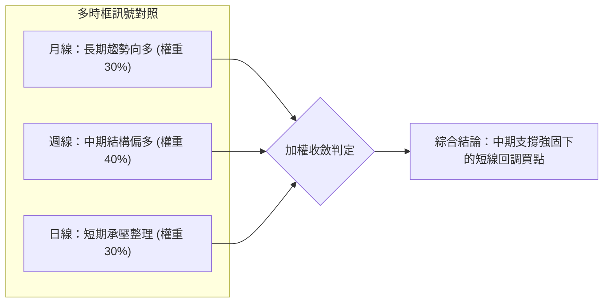

### ⚖️ 多時框收斂結論（嚴格遵守規則 14）

1. **行情屬性判定**：當前 ADX(14) = **21.16 (< 25)**，嚴格判定當前市場為**「盤整行情」**。
2. **多時框優先級收斂**：
   - 由於處於盤整行情，交易邏輯以**日線布林通道上下軌與波段高低點 ($255.19 - $276.65)** 為主要震盪操作區間。
   - 同時，中長期均線（MA50 $250.59、MA200 $238.44）保持多頭排列，對下方空間形成強力托底。
3. **唯一方向性結論**：**【中性偏多 — 箱體下沿低吸】**。日線的短期弱勢僅為進場提供更佳之風險報酬比，而非趨勢反轉。

---

## 8. 交易策略建議

### 🗺️ 策略決策流程圖

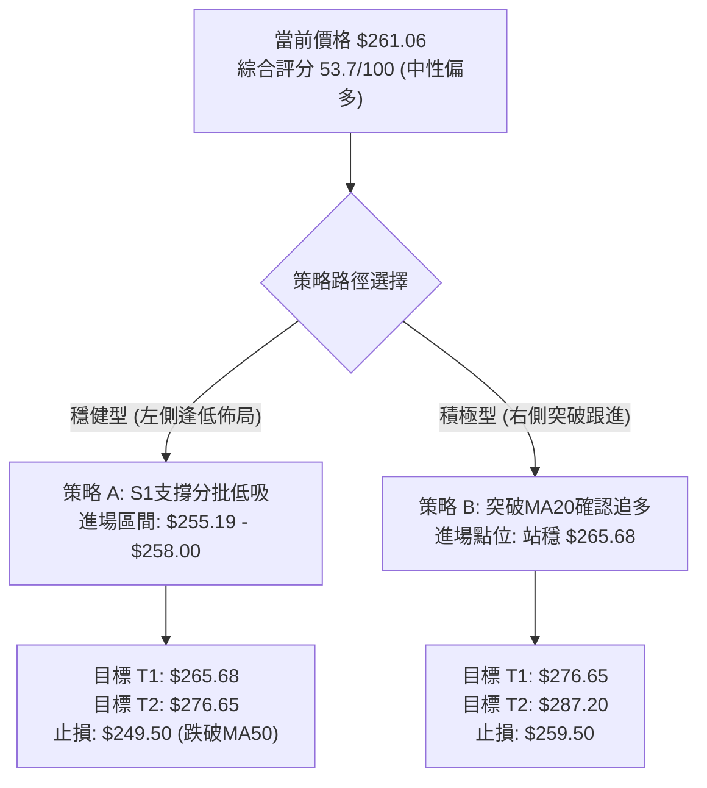

### 🧭 策略路由

**當前主策略方向 = 【中性偏多：區間震盪低吸策略】（依評分卡 53.7/100 導向箱體操作）**

### 🎯 價格情境階梯（Price Scenarios）

所有價位嚴格引用第 4 章數據：

| 觸發條件 | 第一目標位 | 後續延伸目標 | 情境技術含義 |
|----------|:----------:|:------------:|--------------|
| **向上突破 R1 ($276.65)** | **R2 ($287.20)** | 歷史新高拓展 | 短線轉強，日線級別主升浪重啟 |
| **向上突破 Fib 23.6% ($265.68)** | **R1 ($276.65)** | **R2 ($287.20)** | 站穩中軌MA20，確認回調結束 |
| **維持於現價區間 ($255.19 - $265.68)**| **MA20 ($264.42)** | **Fib 23.6% ($265.68)** | 典型箱體拉鋸，高拋低吸震盪蓄勢 |
| **向下跌破 S1 ($255.19)** | **MA50 ($250.59)** | **Fib 50% ($241.60)** | 短線走弱，尋求中期生命線支撐 |
| **向下跌破 S2 ($224.63)** | **S3 ($215.82)** | **52W Low ($196.00)** | 中期結構破位，多頭防線全面退守 |

### 📊 情境機率分佈

| 運行情境 | 機率預估 | 主要依據與技術支撐 |
|----------|:--------:|--------------------|
| **情境一：守住支撐，區間反彈** | **55%** | KD指標已深度超賣(17.4/14.3)，MA50($250.59)與S1($255.19)提供強力支撐共振 |
| **情境二：窄幅震盪，以時間換空間** | **30%** | ADX(14)=21.16顯示趨勢動能匱乏，量比0.55x縮量特徵顯著，盤面維持整理 |
| **情境三：跌破S1，向下回測MA200** | **15%** | MACD柱狀圖走弱(-1.460)，若大盤突發利空可能引發技術性停損拋盤 |

### 🟢 主策略詳情

| 策略要素 | 策略 A（穩健型：S1低吸佈局） | 策略 B（積極型：右側突破加碼） |
|----------|------------------------------|--------------------------------|
| **進場條件** | 價格回踩 S1 企穩或現價分批掛單 | 日線收盤突破 23.6% 回調位與 MA20 |
| **進場價格** | **$256.00**（區間 $255.19 - $258.00） | **$266.00**（突破 $265.68 確認） |
| **目標價 T1** | **$265.68**（Fib 23.6% / 短線獲利點） | **$276.65**（阻力位 R1） |
| **目標價 T2** | **$276.65**（阻力位 R1 / 波段目標） | **$287.20**（阻力位 R2 / 52W High） |
| **止損價格** | **$249.50**（有效跌破 MA50 $250.59）| **$259.50**（跌回 MA20 之下） |
| **風險報酬比** | **1 : 3.18** (風險$6.50 / 獲利空間$20.65) | **1 : 3.26** (風險$6.50 / 獲利空間$21.20) |
| **預估勝率** | **65%** | **60%** |
| **建議倉位** | **15% - 20%** | **10% - 15%** |

### 🔴 反向風險觸發點（風控與對沖提示）

- **關鍵破位警戒點**：收盤價**實體跌破 $250.59 (MA50)** 且成交量放大。
- **對沖應對指引**：一旦跌破 $250.59，主策略做多邏輯暫停，多頭倉位應減半避險，下方等待在 **MA200 ($238.44) 至 S2 ($224.63)** 區間重新尋找企穩信號。

### ⭐ 整體訊號強度評星

```
做多訊號強度：★★★☆☆  (3.5/5星 — 中長多保護，短線超賣具備反彈動能)
做空訊號強度：★★☆☆☆  (2.0/5星 — 短期均線壓制，但缺乏量能與空間配合)
整體技術可信度：★★★★☆  (4.0/5星 — 關鍵價位聚類清晰，斐波那契共振明顯)
```

---

## 9. 風險提示與監控

### ✅ 關鍵監控指標 Checklist

```
╔══════════════════════════════════════════════════════════════════╗
║                   每日盤面關鍵監控 Checklist                      ║
╠══════════════════════════════════════════════════════════════════╣
║ [ ] 價格是否跌破關鍵支撐 S1 $255.19 或 MA50 $250.59              ║
║ [ ] 日線收盤能否有效收復 MA20 ($264.42) 及 Fib 23.6% ($265.68)   ║
║ [ ] RSI(14) 是否自 36.49 向上勾頭站回 45 以上                    ║
║ [ ] Stoch KD 是否在超賣區完成黃金交叉 (%K 穿越 %D)               ║
║ [ ] 日成交量能否回升至 20 日均量 (46.68M) 之上 (量比 > 1.0)       ║
║ [ ] ADX(14) 是否突破 25，確認單邊新趨勢展開                      ║
╚══════════════════════════════════════════════════════════════════╝
```

### ⚠️ 風險場景分析

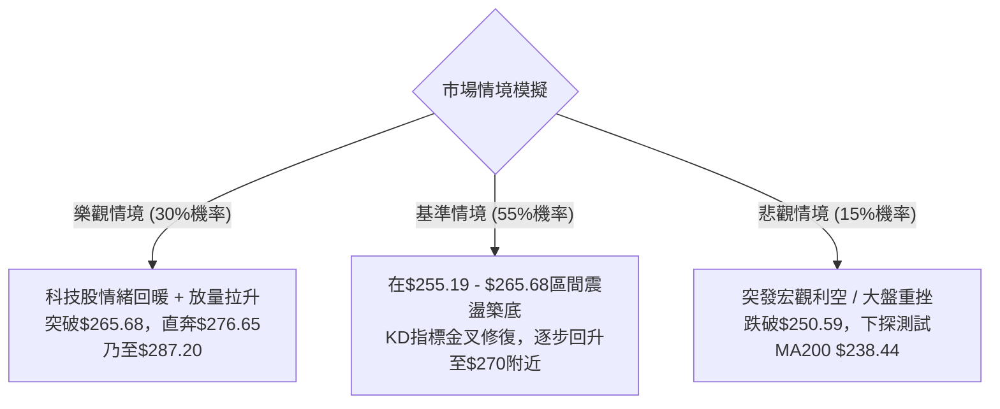

### 🛡️ 風險管理重要提醒

1. **嚴格執行資金控管**：AMZN Beta 為 1.454，波動性高於大盤，單一個股總曝險建議控制在總投資組合的 **15% - 25%** 以內。
2. **避免情緒化追價**：在 ADX < 25 的盤整市況中，暴漲往往伴隨回調，暴跌往往伴隨反彈，**切忌在壓力位 R1 ($276.65) 附近盲目追高**。
3. **止損紀律絕對化**：若觸發策略止損價 ($249.50)，必須堅決停損離場，嚴防盤整轉為深度回調帶來的本金重大虧損。

---

## 10. 報告總結

```
╔══════════════════════════════════════════════════════════════════╗
║                   AMZN 技術分析報告總結看板                      ║
╠══════════════════════════════════════════════════════════════════╣
║ 報告日期：2026-08-25            當前價格：$261.06                ║
║ 綜合評級：⚖️ 中性偏多震盪整理 (評分: 53.7/100)                    ║
╠══════════════════════════════════════════════════════════════════╣
║ 趨勢維度判定：                                                   ║
║ ├─ 長期趨勢 (月線)：🟢 多頭向上 (MA200 $238.44 堅挺向上發散)     ║
║ ├─ 中期趨勢 (週線)：🟢 箱體偏多 (MA50 $250.59 形成強大防禦)      ║
║ └─ 短期趨勢 (日線)：🔴 弱勢回調 (受制於 MA20 $264.42 壓制)       ║
╠══════════════════════════════════════════════════════════════════╣
║ 核心關鍵價位：                                                   ║
║ ├─ 關鍵阻力區：R1 $276.65 │ R2 $287.20 (52W High)               ║
║ ├─ 核心支撐區：S1 $255.19 │ S2 $224.63 │ S3 $215.82             ║
║ └─ 華爾街目標：均價 $327.00 (潛在上行空間 +25.26%)               ║
╠══════════════════════════════════════════════════════════════════╣
║ 最優操作策略指引：                                               ║
║ 1. 🥇 最佳機會 (策略A)：回踩 $255.19 - $258.00 分批佈局多單     ║
║    (目標 $265.68 / $276.65，止損 $249.50，風報比 1:3.18)        ║
║ 2. 🥈 次選機會 (策略B)：突破站穩 $265.68 後右側跟進             ║
║    (目標 $276.65 / $287.20，止損 $259.50，風報比 1:3.26)        ║
║ 3. 🥉 保守選擇：完全空倉者等待 ADX > 25 或 MACD 金叉後再行介入   ║
╚══════════════════════════════════════════════════════════════════╝
```

---

> ⚠️ **免責聲明**：本報告為技術分析研究成果，所有引用的支撐、阻力與指標數據均嚴格基於歷史與即時市場資訊計算。本報告**僅供學術研究與投資參考**，**不構成任何形式的要約或投資買賣建議**。金融市場存在波動風險，投資人應獨立評估風險並自負盈虧。

---

*報告生成時間：2026-08-25 ｜ 數據來源：Yahoo Finance ｜ 分析框架：資深多時框技術分析模型*