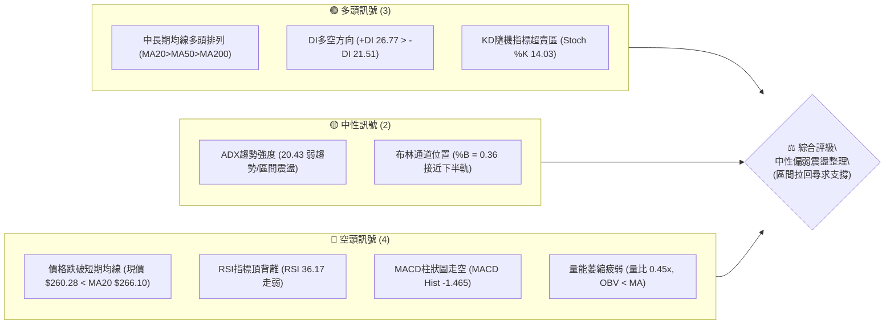
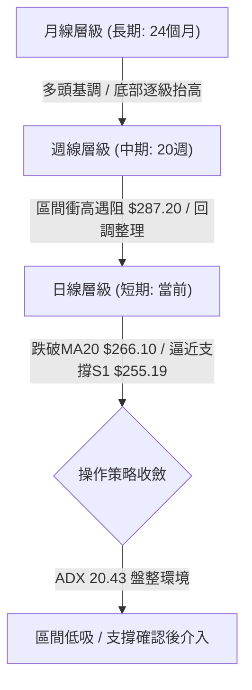
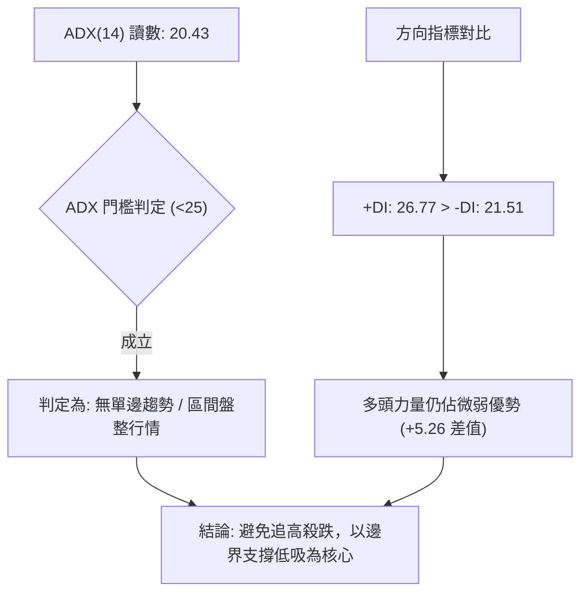
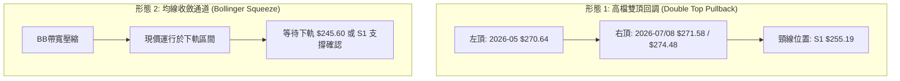
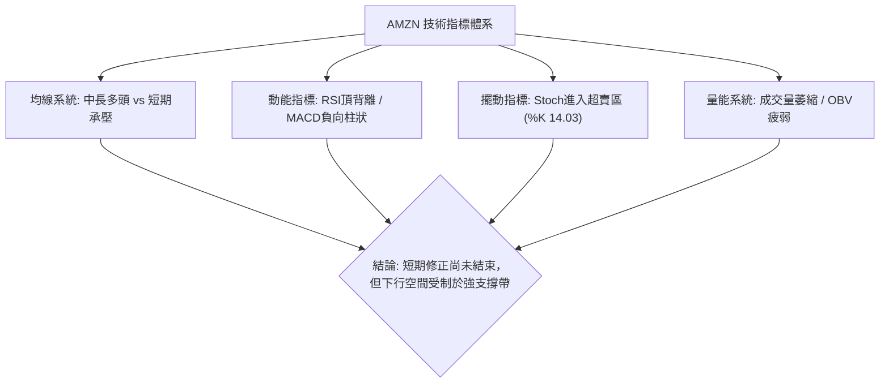
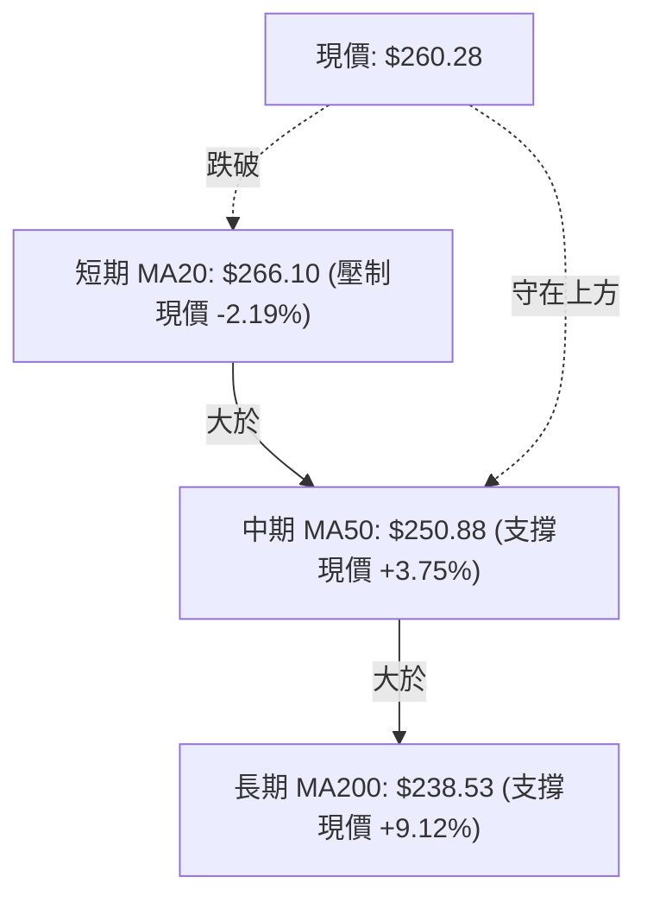
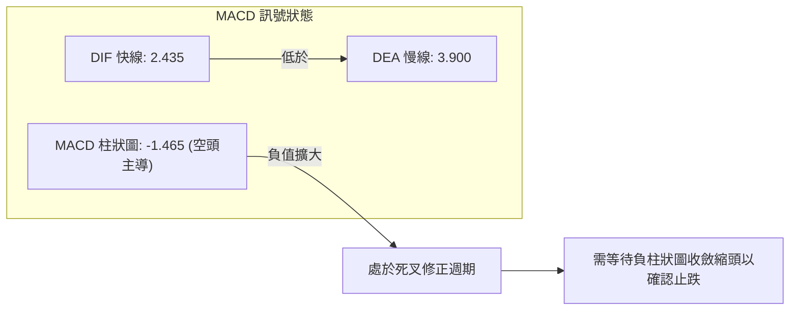
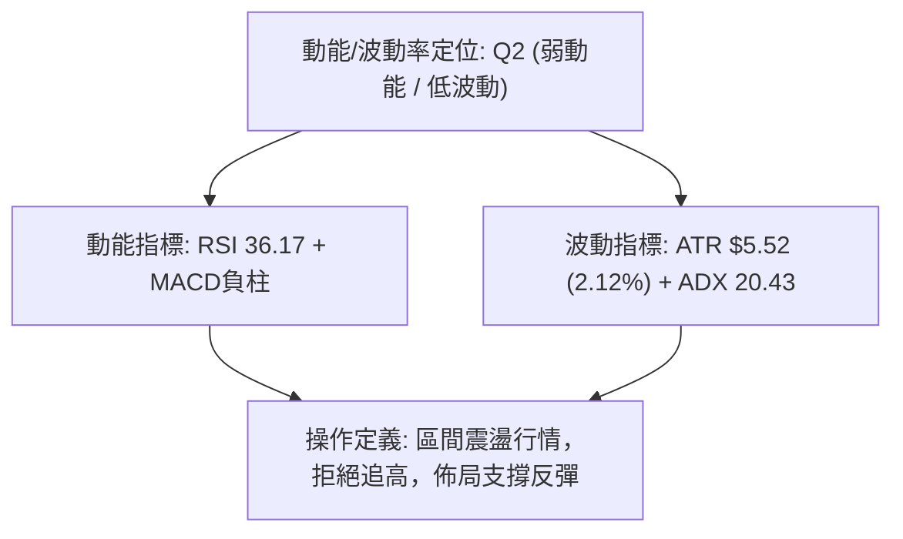
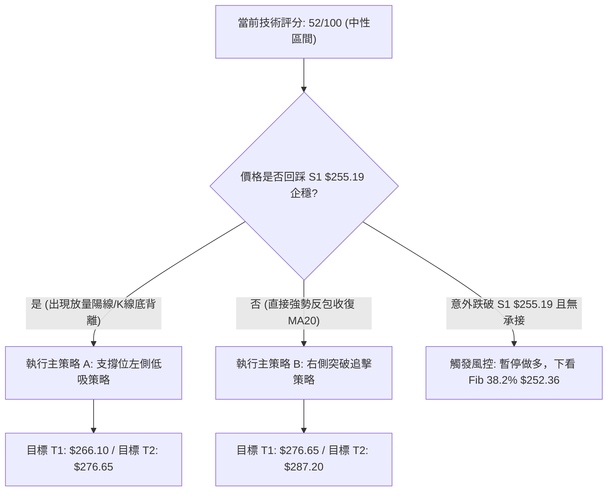
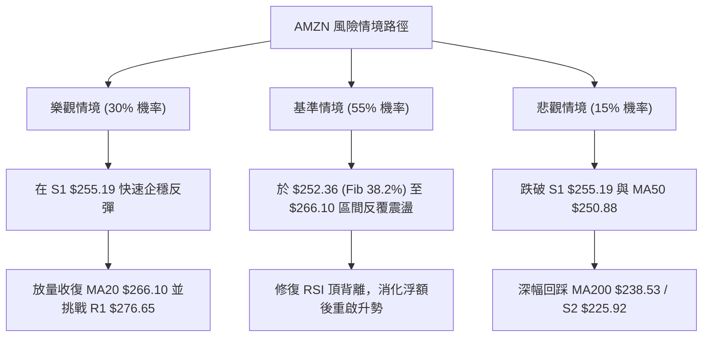

# AMZN 技術分析報告

> **報告日期**：2026-08-27 ｜ **語言**：繁體中文 ｜ **數據來源**：Yahoo Finance ｜ **當前價格**：$260.28

---

## 目錄

| 章節 | 內容 |
|------|------|
| [1. 技術面概覽](#1-技術面概覽) | 訊號儀表板、核心指標、評分卡 |
| [2. 趨勢分析](#2-趨勢分析) | 多時框趨勢、長中短期走勢、ADX趨勢強度 |
| [3. 圖表形態分析](#3-圖表形態分析) | 形態識別、K線組合、目標價計算 |
| [4. 支撐與阻力](#4-支撐與阻力) | 關鍵價位、斐波那契回調結構 |
| [5. 技術指標深度解讀](#5-技術指標深度解讀) | MA均線/RSI/MACD/布林通道/成交量 |
| [6. 動能與波動率](#6-動能與波動率) | 動能象限、ATR波動率、Beta風險 |
| [7. 多時框架總結](#7-多時框架總結) | 時框架評分矩陣與收斂結論 |
| [8. 交易策略建議](#8-交易策略建議) | 策略路由、多空情境、風險報酬比 |
| [9. 風險提示與監控](#9-風險提示與監控) | 監控Checklist、情境路徑、風控規則 |

---

## 1. 技術面概覽

### 🎯 技術訊號儀表板



---

### 📊 核心指標速覽表

| 指標類別 | 指標名稱 | 當前數值 | 訊號 | 專業解讀 |
|:---|:---|:---:|:---:|:---|
| **價格** | 當前價格 | $260.28 | 🟡 | 位於52週區間 ($196.00 - $287.20) 之 70.5% 分位 |
| **短期均線** | MA20 | $266.10 | 🔴 | 現價位於MA20下方 -2.19%，短線動能承壓 |
| **中期均線** | MA50 | $250.88 | 🟢 | 現價位於MA50上方 +3.75%，中期上升架構尚存 |
| **長期均線** | MA200 | $238.53 | 🟢 | 現價位於MA200上方 +9.12%，長期牛市基底穩固 |
| **超買超賣** | RSI(14) | 36.17 | 🟡 | 中性偏弱接近超賣區，且日線級別存在頂背離警訊 |
| **趨勢動能** | MACD (12,26,9) | 2.435 / 3.900 | 🔴 | MACD低於訊號線，柱狀圖 -1.465 持續收縮走空 |
| **隨機指標** | Stoch %K / %D | 14.03 / 16.99 | 🟢 | 進入深度超賣區間，短線存在技術性反彈動能 |
| **趨勢強度** | ADX(14) | 20.43 | 🟡 | ADX < 25 表明非單邊趨勢，當前為箱體震盪行情 |
| **通道位置** | Bollinger Bands | 上 $286.61 / 下 $245.60 | 🟡 | %B 為 0.36，價格運行於中軌 ($266.10) 與下軌之間 |
| **波動幅度** | ATR(14) | $5.52 (2.12%) | 🟢 | 每日波動幅度適中，有利於設定清晰的風控邊界 |
| **量能指標** | 成交量 / OBV | 20.67M (量比 0.45x) | 🔴 | 量能大幅萎縮低於20日均量，OBV跌破均線顯示買盤觀望 |

---

### 🏆 技術評分卡

```
╔══════════════════════════════════════════════════════════════╗
║              技術評分卡 — AMZN (2026-08-27)                  ║
╠══════════════════════════════════════════════════════════════╣
║ 趨勢強度 (Trend)     ████████░░░░░░░░░░░░  42/100 🟡 中性震盪 ║
║ 動能指標 (Momentum)  ██████░░░░░░░░░░░░░░  35/100 🔴 動能衰退 ║
║ 支撐穩定度 (Support) ██████████████░░░░░░  70/100 🟢 支撐紮實 ║
║ 成交量配合 (Volume)  ██████░░░░░░░░░░░░░░  30/100 🔴 量能匱乏 ║
║ 形態完整度 (Pattern) ████████████░░░░░░░░  60/100 🟡 區間收斂 ║
║ 均線架構 (Moving Avg)██████████████░░░░░░  75/100 🟢 多頭排列 ║
╠══════════════════════════════════════════════════════════════╣
║ 綜合技術評分         ██████████░░░░░░░░░░  52/100 ⚖️ 中性觀望 ║
╚══════════════════════════════════════════════════════════════╝
```

---

## 2. 趨勢分析

### 🌐 多時框趨勢分析



---

### 📈 長期趨勢 — 12個月走勢圖（Unicode）

```
AMZN 月線走勢圖（2025-08 至 2026-08）
價格 ($)
$290 ┤                                                     
$280 ┤                                              ● $271.58 (2026-07)
$270 ┤                                  ● $270.64    │ 
$260 ┤                              ● $265.06        └──● $260.28 (現在)
$250 ┤                  ● $244.22           │ 
$240 ┤              ●   │       ● $239.30   └──● $238.34
$230 ┤  ● $229.00   └───┼───● $230.82
$220 ┤      ● $219.57   │
$210 ┤                  └───● $210.00 ───● $208.27 (2026-03 低點)
     └─────────────────────────────────────────────────────────────
       08   09   10   11   12   01   02   03   04   05   06   07   08 (月份)
```

#### 走勢特徵分析表格

| 階段區間 | 時間跨度 | 起訖價位 | 區間漲跌幅 | 結構特徵與技術解讀 |
|:---|:---:|:---:|:---:|:---|
| **第一階段：高檔震盪** | 2025-08 ~ 2025-12 | $229.00 → $230.82 | +0.79% | 於 $219.57 至 $244.22 構築箱體，多空拉鋸 |
| **第二階段：春季回踩** | 2026-01 ~ 2026-03 | $239.30 → $208.27 | -12.97% | 連續三個月下行測試底部，確立 $208.27 築底 |
| **第三階段：主升衝刺** | 2026-04 ~ 2026-05 | $208.27 → $270.64 | +29.95% | 強勢突破中長期均線，創下波段歷史新高區間 |
| **第四階段：高位拉回** | 2026-06 ~ 2026-08 | $270.64 → $260.28 | -3.83% | 衝高 $287.20 遇阻回調，現處於健康二次回踩 |

---

### 📊 中期趨勢（週線分析）

```
近20週關鍵壓力與支撐結構圖
$290 ────────────────── 52週最高點阻力 R2: $287.20 ──────────────────
                     ▲ (2026-08-09 週收盤 $274.48 衝高受阻)
$275 ────────────────── 近期波段壓力 R1: $276.65 ────────────────────
                     │
$260 ══════════════════ 現價: $260.28 (受壓於 Fib 23.6% $265.68) ═════
                     │
$250 ────────────────── 波段核心支撐 S1: $255.19 / Fib 38.2% $252.36 ─
                     ▼
$240 ────────────────── 長期均線重合支撐 MA200: $238.53 / Fib 50.0% $241.60
```

週線層級自 2026-04-19（收盤 $250.56，RSI 97.5）展開強烈超買噴出，隨後在 2026-08-09 衝刺 $274.48（RSI 62.9，MACD柱 +4.090）形成高位鈍化，隨後連續兩週回吐至當前 $260.28。MACD柱狀圖由正轉負（-1.465），確認中期行情進入旗形修正階段。

---

### ⚡ 趨勢強度評估（ADX 解讀）



| 指標名稱 | 數值 | 參考標準 | 當前狀態解讀 |
|:---|:---:|:---:|:---|
| **ADX (14)** | **20.43** | < 20 弱無趨勢 / 20–25 盤整 / > 25 強趨勢 | 處於盤整與弱趨勢臨界點，趨勢動能不明顯 |
| **+DI (正向動向)** | **26.77** | 數值越高多頭動能越強 | 仍高於 -DI，顯示多方在中長週期具有主控權 |
| **-DI (負向動向)** | **21.51** | 數值越高空頭動能越強 | 空方近期發力推動價格自高點回落，但尚未反超 |

---

## 3. 圖表形態分析

### 🔍 形態識別系統



#### 形態評估與信心度矩陣

| 識別形態名稱 | 信心度 | 判斷依據（嚴格引用數據） | 完成度 | 理論目標價（附計算式） |
|:---|:---:|:---|:---:|:---|
| **高位雙重頂回調** | **70%** | 兩次衝高受阻於 $270.64 (2026-05) 與 $271.58 (2026-07)，52週最高阻力 $287.20 | 75% | 跌破頸線 $255.19 則測量目標：<br>`$255.19 - ($274.48 - $255.19) = $235.90` (逼近 MA200 $238.53) |
| **上升通道中繼回踩** | **65%** | 價格回踩 Fib 38.2% ($252.36) 與 MA50 ($250.88)，月線長期多頭排列未破 | 60% | 企穩反彈測量目標：<br>`$255.19 + ($276.65 - $255.19) = $298.11` (挑戰 R2 $287.20 上方) |

---

### 🕯️ 重要K線形態分析

| 週/月份週期 | 收盤價 | K線形態特徵 | 技術面解讀 | 多空訊號 |
|:---|:---:|:---|:---|:---:|
| **2026-04** | $265.06 | 長陽大突破 | 帶量脫離底部箱體 $208.27，確立多頭主升段 | 🟢 強烈看多 |
| **2026-05** | $270.64 | 高檔衝高十字星 | 多空在 $270 上方激烈交鋒，多頭動能首度出現衰竭 | 🟡 警惕滯漲 |
| **2026-06** | $238.34 | 大陰線快速回洗 | 快速回踩 MA200 ($238.53) 洗盤，下影線獲得買盤承接 | 🟢 支撐確認 |
| **2026-07** | $271.58 | 長陽包覆反彈 | 快速修復跌幅，收復 $270 大關，測試前高 | 🟢 多頭反攻 |
| **2026-08 (當前)** | $260.28 | 上影陰線回調 | 衝高 $287.20 後承壓回落，現受制於短期均線 MA20 | 🔴 短線偏空 |

---

### 📉 ASCII 走勢形態示意圖

```
高位箱體與回調形態示意圖
$287.20 ──────────────────────── 52W High (頂部阻力 R2)
                 ▲           ▲
                ╱ ╲         ╱ ╲
$270-$274 ─────●───●───────●───●波段高點聚類 (R1: $276.65 區域)
              ╱     ╲     ╱     ╲
             ╱       ╲   ╱       ▼ 現價 $260.28 (承壓回落中)
$255.19 ────●─────────●─●───────[ 頸線關鍵支撐 S1 ]
           ╱  (2026-06洗盤)
$238.53 ──● MA200 / 06月低點 (長期牛熊分水嶺)
```

---

## 4. 支撐與阻力

### 🗺️ 關鍵價位分布圖（Unicode）

```
AMZN 價位結構分布圖
═════════════════════════════════════════════════════════════════
$287.20 ║██████████████████████████████║ 52W 最高點 / 極強阻力 (R2 / Fib 0.0%)
$276.65 ║████████████████████          ║ 近一年波段高點聚類 / 關鍵阻力 (R1)
$266.10 ║██████████████                ║ 短期均線壓制 (MA20 / 布林中軌 / Fib 23.6% $265.68)
$260.28 ╠══════════════════════════════╣ ◄◄◄ 當前收盤價 (Current Price)
$255.19 ║▓▓▓▓▓▓▓▓▓▓▓▓▓▓▓▓▓▓            ║ 近一年波段低點聚類 / 第一支撐 (S1)
$250.88 ║▓▓▓▓▓▓▓▓▓▓▓▓▓▓                ║ 中期均線支撐 (MA50 $250.88 / Fib 38.2% $252.36)
$245.60 ║▓▓▓▓▓▓▓▓▓▓                    ║ 布林通道下軌支撐
$238.53 ║██████████████████████████████║ 長期生命線 / 強支撐 (MA200 / Fib 50.0% $241.60)
$225.92 ║████████████████████          ║ 次級波段防守支撐 (S2)
$220.99 ║████████████████████████      ║ 核心底部結構支撐 (S3)
$196.00 ║██████████████████████████████║ 52W 最低點 / 極限防守 (Fib 100.0%)
═════════════════════════════════════════════════════════════════
```

---

### 🚧 阻力位分析表

| 阻力級別 | 精確價位 | 形成技術依據 | 突破難度評估 | 戰略重要性 |
|:---|:---:|:---|:---:|:---:|
| **阻力 R1** | **$276.65** | 近一年波段高點聚類密集區（+6.29%） | ★★★☆☆ | **高**：多頭唯有放量突破該位，方能重啟主升浪架構 |
| **阻力 R2** | **$287.20** | 52週歷史最高點 / 斐波那契 0.0%（+10.34%） | ★★★★★ | **極高**：年度頂部強壓力，需大盤與基本面強烈共振方能攻克 |

---

### 🛡️ 支撐位分析表

| 支撐級別 | 精確價位 | 形成技術依據 | 守住機率評估 | 戰略重要性 |
|:---|:---:|:---|:---:|:---:|
| **第一支撐 S1** | **$255.19** | 近一年波段低點聚類（距現價 -1.96%） | 70% | **關鍵防線**：短線多頭生命線，失守則引發進一步技術性回調 |
| **第二支撐 S2** | **$225.92** | 中期波段歷史平台整理低點（距現價 -13.20%） | 85% | **強力支撐**：跌破 MA200 後的中期緩衝防區 |
| **第三支撐 S3** | **$220.99** | 2025年秋季底部密集換手區（距現價 -15.10%） | 95% | **牛熊底線**：長期多頭格局的終極防守基準 |

---

### 📐 斐波那契回調位分析

依據 52 週完整波動區間（低點 **$196.00** 至 高點 **$287.20**，振幅 **$91.20**）計算之精確回調位：

| 斐波那契比例 | 精確價位 | 空間距離 (相對現價 $260.28) | 技術面角色與共振指標分析 |
|:---:|:---:|:---:|:---|
| **0.0%** | **$287.20** | +10.34% | 52週頂部阻力 R2，多頭極限目標 |
| **23.6%** | **$265.68** | +2.07% | 短期反彈第一阻力，與 MA20 ($266.10) 形成雙重壓制帶 |
| **38.2%** | **$252.36** | -3.04% | **當前主要回調目標**，與 MA50 ($250.88) 及 S1 ($255.19) 形成共振支撐區 |
| **50.0%** | **$241.60** | -7.18% | 中期多空中軸線，與 MA200 ($238.53) 極度貼近 |
| **61.8%** | **$230.84** | -11.31% | 黃金分割強防守位，歷史多重月線收盤價聚集處 |
| **78.6%** | **$215.52** | -17.20% | 深幅回踩防禦位 |
| **100.0%** | **$196.00** | -24.70% | 52週歷史最低點 |

> **回調區間判定**：現價 **$260.28** 處於 **Fib 23.6% ($265.68)** 與 **Fib 38.2% ($252.36)** 之間。當前技術結構顯示，價格正在向下尋求 Fib 38.2% 與 S1 ($255.19) 的支撐共振，尚未跌破健康回調的安全閥值。

---

## 5. 技術指標深度解讀

### 🎛️ 指標訊號總覽



---

### 📈 移動平均線排列分析



#### 均線梯度分析表

| 均線名稱 | 當前價位 | 乖離率 (相對現價) | 走勢斜率與狀態 | 技術意涵 |
|:---|:---:|:---:|:---:|:---|
| **MA 5** | $260.43 | -0.06% | 微微向下 (▼) | 短線極度貼近現價，形成極短線反壓 |
| **MA 10** | $261.65 | -0.52% | 持續走低 (▼) | 5日與10日均線死叉向下，壓制短線反彈 |
| **MA 20** | $266.10 | -2.19% | 拐頭向下 (▼) | 短期多空分水嶺，現已轉為上方反壓 |
| **MA 50 / 60** | $250.88 / $250.06 | +3.75% / +4.09% | 穩健向上 (▲) | 中期多頭保護帶，首次回踩具備強大支撐力 |
| **MA 120** | $245.88 | +5.85% | 向上攀升 (▲) | 半年線持續抬升，多頭趨勢基礎良好 |
| **MA 200 / 240**| $238.53 / $236.45 | +9.12% / +10.08%| 穩步上行 (▲) | 年線多頭排列完整，定義長期牛市未變 |

---

### 📉 RSI(14) 分析

- **當前讀數**：`36.17`
- **量化進度條**：`███████░░░░░░░░░░░░░ 36.17%`（處於弱勢區間，接近 30.00 超賣門檻）
- **背離診斷**：⚠️ **明確頂背離 (Bearish Divergence)**
  - *背離細節*：股價在 2026-04 達到 $250.56 時 RSI 達到極端值 **97.5**；隨後在 2026-05 衝高至 $272.68 時 RSI 降至 **79.6**；而在 2026-08-09 股價攀升至 $274.48 創波段高點時，RSI 僅錄得 **62.9**。價格創高而動能峰值顯著遞減，引發近兩週的技術性修正。

---

### 📊 MACD (12, 26, 9) 訊號解讀



- **MACD 快線**：`2.435` 處於零軸上方，表明長週期仍屬強勢市場。
- **Signal 訊號線**：`3.900`
- **MACD Histogram 柱狀圖**：`-1.465`，連續兩週位於負值區間，空方正在釋放回調動能。

---

### 📦 布林通道分析

```
布林通道結構示意圖 (Bandwidth: $41.01)
$286.61 ─────────────────────────────── 上軌 Upper Band (+10.12%)
                     │
$266.10 ─────────────────────────────── 中軌 Middle Band (MA20: $266.10)
                     │
$260.28 ═══════════════════════════════ 現價 (%B = 0.36, 弱勢震盪區)
                     │
$245.60 ─────────────────────────────── 下軌 Lower Band (-5.64%)
```

- **BB %B 指標**：`0.36`。價格跌破中軌後，目前處於下半通道運行。
- **帶寬意涵**：通道開口未顯著放大，伴隨 ADX 20.43，表明下軌 **$245.60** 具備極強的邊界約束支撐效應。

---

### 💹 成交量與 OBV 分析

- **成交量對比**：最新成交量 **20,669,810 股**，僅為 20 日均量（45,466,770 股）的 **0.45 倍（量比 0.45x）**，且遠低於 50 日均量（50,323,950 股）。
- **量價關係解讀**：價格回落伴隨成交量急遽萎縮（縮量回調），顯示市場並無恐慌性拋盤，下跌主要由多頭追價意願不足所致。
- **OBV 能量潮**：`OBV < MA`，能量潮處於均線下方，量能確認了價格的短期修正，多頭需等待放量陽線重新激活買盤。

---

## 6. 動能與波動率

### ⚡ 動能評估四象限

| 象限分區 | 動能維度 | 波動維度 | 當前狀態 | 戰術指引與操作策略 |
|:---:|:---:|:---:|:---:|:---|
| **第一象限 (Q1)** | 強動能 (High Momentum) | 低波動 (Low Volatility) | — | 趨勢穩健爆發，最佳右側追漲點 |
| **第二象限 (Q2)** | **弱動能 (Low Momentum)** | **低波動 (Low Volatility)** | **✓ (AMZN 當前位置)** | **震盪築底階段，適合左側在關鍵支撐分批低吸** |
| **第三象限 (Q3)** | 強動能 (High Momentum) | 高波動 (High Volatility) | — | 高風險博弈，適合日內激進突破交易 |
| **第四象限 (Q4)** | 弱動能 (Low Momentum) | 高波動 (High Volatility) | — | 恐慌崩跌，嚴格禁止進場接刀 |



---

### 📊 ATR 波動率分析

- **ATR(14) 絕對值**：`$5.52`
- **ATR 相對百分比**：`2.12%`
- **風控參數計算**：
  - **1.0 × ATR（窄幅日內止損距離）**：`$5.52`
  - **1.5 × ATR（波段常規止損距離）**：`$8.28`
  - **2.0 × ATR（寬鬆趨勢止損距離）**：`$11.04`

---

### 📐 Beta 與市場相關性

- **Beta 係數**：`1.454`
- **風險特徵解讀**：AMZN 具備高彈性特質，理論上標普500指數波動 1.0% 時，AMZN 將同向放大波動約 **1.45%**。在大盤震盪整理期，該股容易出現放大回調；而在市場企穩時，其反彈爆發力亦顯著領先大盤。

---

## 7. 多時框架總結

### 📋 時框架評分表

| 時框架 | 趨勢方向 | 動能狀態 | 均線排列 | 核心形態 | 綜合評分 | 建議戰術 |
|:---|:---:|:---:|:---:|:---:|:---:|:---|
| **月線 (長期)** | 🟢 多頭上行 | 🟡 高檔整理 | 🟢 多頭排列 | 歷史高點區間蓄勢 | **80/100** | 逢低戰略配置 |
| **週線 (中期)** | 🟢 震盪偏多 | 🔴 動能回吐 | 🟢 MA50/200完好 | 雙頂衝高後旗形回調 | **65/100** | 支撐位掛單低吸 |
| **日線 (短期)** | 🔴 弱勢回調 | 🔴 死叉向下 | 🔴 跌破MA20 | 跌破短均下探S1 | **38/100** | 耐心等待止跌訊號 |

---

### 🔲 綜合訊號矩陣

```
┌─────────────────────────────────────────────────────────────┐
│ 多時框共振矩陣 (Multi-Timeframe Convergence Matrix)        │
├──────────────┬──────────────┬──────────────┬────────────────┤
│ 週期層級     │ 趨勢架構     │ 核心指標訊號 │ 關鍵攻防點位   │
├──────────────┼──────────────┼──────────────┼────────────────┤
│ 長期 (Monthly│ 🟢 穩固牛市  │ OBV長期向上  │ MA200: $238.53 │
│ 中期 (Weekly)│ 🟡 旗形震盪  │ MACD負柱擴大 │ MA50:  $250.88 │
│ 短期 (Daily) │ 🔴 回踩尋底  │ Stoch超賣14  │ S1:    $255.19 │
└──────────────┴──────────────┴──────────────┴────────────────┘
```

---

### ⚖️ 多時框收斂結論

> **收斂依據（嚴格執行多時框優先級）**：
> 1. **行情屬性判定**：當前 ADX(14) 讀數為 **20.43 (<25)**，明確定義為**盤整/震盪行情**而非單邊趨勢。
> 2. **主導維度**：依據規則，在盤整行情中以**日線布林通道上下軌 ($245.60 - $286.61) 及波段支撐阻力**為主要交易區間。
> 3. **方向性唯一結論**：**中性偏多，短線回調尋求支撐（區間震盪低吸）**。
>    - 中長期均線（MA50 $250.88、MA200 $238.53）提供強大保護。
>    - 短期日線雖然超跌且跌破 MA20，但隨機指標（Stoch %K 14.03）已進入深度超賣區，且縮量回踩顯示下跌動能衰竭。
>    - **戰術方針**：不盲目殺跌，嚴格在 **S1 ($255.19) 至 Fib 38.2% ($252.36)** 支撐帶等待企穩反轉訊號進場。

---

## 8. 交易策略建議

### 🗺️ 策略決策流程圖



---

### 🧭 策略路由

**當前主策略方向 = 區間震盪回調低吸（依綜合評分 52/100 分流）**
- 評分處於 40–60 區間，屬於典型箱體震盪行情。操作上嚴格遵循「支撐低吸、阻力分批止盈」，不追高、不盲目做空。

---

### 🎯 價格情境階梯（Price Scenarios）

| 觸發條件 | 下一目標價 | 後續延伸目標 | 情境含義與操作指引 |
|:---|:---:|:---:|:---|
| **放量突破 R1 $276.65** | **R2 $287.20** | **$300.00** | 短線轉強，多頭主升浪重啟，加碼跟進 |
| **突破 MA20 $266.10** | **R1 $276.65** | **R2 $287.20** | 短期修正結束，重回上升通道中軌上方 |
| **守住 S1 $255.19 ~ $252.36**| **MA20 $266.10** | **R1 $276.65** | 最佳支撐低吸區，震盪箱體下沿企穩 |
| **跌破 S1 $255.19** | **MA50 $250.88** | **MA200 $238.53**| 短期破位，回踩 Fib 38.2% / MA50 尋求二次築底 |
| **跌破 MA200 $238.53** | **S2 $225.92** | **S3 $220.99** | 中期趨勢破位轉空，多頭全面停損離場 |

---

### 📊 情境機率分佈

```
情境機率預測圖
┌─────────────────────────────────────────────────────────────┐
│ 區間支撐反彈 (55%)   ███████████████████████████░░░░░░░░░░░ │
│ 橫盤窄幅震盪 (30%)   ███████████████░░░░░░░░░░░░░░░░░░░░░░░ │
│ 跌破支撐下探 (15%)   ███████░░░░░░░░░░░░░░░░░░░░░░░░░░░░░░░ │
└─────────────────────────────────────────────────────────────┘
```

| 情境劃分 | 機率估計 | 主要技術指標依據 |
|:---|:---:|:---|
| **支撐企穩反彈** | **55%** | Stoch 超賣 (%K 14.03)、縮量回調顯示拋壓衰竭、MA50/200 多頭排列完好 |
| **區間橫盤震盪** | **30%** | ADX 20.43 無方向性趨勢、布林帶寬中性收斂、成交量比僅 0.45x 買盤觀望 |
| **破位向下深調** | **15%** | RSI 頂背離尚未完全釋放、MACD 柱狀圖 -1.465 空頭排列 |

---

### 🟢 主策略詳情

#### 策略 A：支撐區低吸策略（左側穩健型）
- **進場條件**：價格回踩至 S1 ($255.19) 至 Fib 38.2% ($252.36) 區間，日K線出現止跌下影線或 1小時圖出現 RSI 底背離。
- **進場價格**：`$255.19`（掛單或右側確認進場）
- **止損價格**：`$249.50`（跌破 MA50 $250.88 及整數關卡，風險點位 $5.69，約 1.0 × ATR）
- **第一目標價 (T1)**：`$266.10`（阻力：MA20 / 布林中軌，潛在獲利 +$10.91）
- **第二目標價 (T2)**：`$276.65`（阻力：R1 波段高點，潛在獲利 +$21.46）
- **風險報酬比**：
  - 至 T1：`$10.91 / $5.69 = 1.92 : 1`
  - 至 T2：`$21.46 / $5.69 = 3.77 : 1`
- **成功機率**：`65%`
- **建議倉位**：`15% - 20%`

#### 策略 B：突破跟進策略（右側順勢型）
- **進場條件**：日K線強勢放量收復 MA20 ($266.10) 及 Fib 23.6% ($265.68)，且成交量放大至 20日均量以上。
- **進場價格**：`$266.50`
- **止損價格**：`$259.50`（跌破現價區間，風險點位 $7.00，約 1.25 × ATR）
- **第一目標價 (T1)**：`$276.65`（阻力：R1，潛在獲利 +$10.15）
- **第二目標價 (T2)**：`$287.20`（阻力：R2 52週歷史高點，潛在獲利 +$20.70）
- **風險報酬比**：
  - 至 T1：`$10.15 / $7.00 = 1.45 : 1`
  - 至 T2：`$20.70 / $7.00 = 2.96 : 1`
- **成功機率**：`60%`
- **建議倉位**：`10% - 15%`

---

### 🔴 反向風險觸發點（對沖與風控提示）

- **關鍵破位觸發點**：若收盤價**有效跌破 S1 $255.19 且成交量放大**，表明高位雙頂頸線失守。
- **風險應對措施**：
  1. 多頭部位立即減倉 50% 以上。
  2. 暫停任何多頭加碼操作。
  3. 下方防禦轉移至 **MA200 ($238.53)** 與 **Fib 50.0% ($241.60)** 區域。

---

### ⭐ 整體訊號強度評星

```
╔══════════════════════════════════════════════════════════════╗
║ 做多訊號強度：  ★★★☆☆  (3.0/5 星) — 偏向區間低吸，等待止跌   ║
║ 做空訊號強度：  ★★☆☆☆  (2.0/5 星) — 均線多頭壓制空方空間     ║
║ 整體訊號可信度：★★★★☆  (4.0/5 星) — 數據指標一致指向震盪整理 ║
╚══════════════════════════════════════════════════════════════╝
```

---

## 9. 風險提示與監控

### ✅ 關鍵監控指標 Checklist

```
╔══════════════════════════════════════════════════════════════╗
║              每日技術面關鍵監控清單 (Checklist)              ║
╠══════════════════════════════════════════════════════════════╣
║ [ ] 價格是否跌破波段第一支撐 S1 ($255.19)                    ║
║ [ ] RSI(14) 是否在跌至 30.00 附近出現底背離或拐頭向上訊號    ║
║ [ ] MACD Histogram 負柱是否由 -1.465 開始收窄 (縮頭)         ║
║ [ ] 成交量是否放大至 45M 股 (超過 20日均量 45,466,770)       ║
║ [ ] 價格能否重新放量站穩 MA20 ($266.10)                      ║
║ [ ] Stoch %K 是否向上金叉 %D (從超賣區 <20 反彈)             ║
╚══════════════════════════════════════════════════════════════╝
```

---

### ⚠️ 風險場景分析



---

### 🛡️ 風險管理重要提醒

1. **波動率管理**：AMZN Beta 為 **1.454**，ATR 每日波動為 **$5.52**，在制定持倉規模時應適當降低槓桿，單筆交易最大虧損嚴格控制在總資金的 **1.0% - 1.5%** 以內。
2. **量能陷阱防範**：當前成交量僅 0.45x，處於極度縮量狀態。在無成交量確認前，不可將小幅反彈視為反轉信號，謹防「無量誘多」再次探底。
3. **時框衝突防範**：日線雖然偏空，但不可忽視月線與週線的長期多頭格局，切忌在支撐位 S1 ($255.19) 附近進行追空操作。

---

## 📋 報告總結

```
╔══════════════════════════════════════════════════════════════════════════════╗
║                        AMZN 技術分析報告總結                                 ║
╠══════════════════════════════════════════════════════════════════════════════╣
║ 報告日期：2026-08-27                                                         ║
║ 當前價格：$260.28                                                            ║
║ 綜合技術評分：52/100 ｜ 分析評級：⚖️ 中性觀望（區間回調蓄勢）                 ║
╠══════════════════════════════════════════════════════════════════════════════╣
║ 關鍵結構結論：                                                               ║
║ ├─ 長期趨勢 (月線)：🟢 多頭排列完好，歷史新高區域強勢蓄勢                    ║
║ ├─ 中期趨勢 (週線)：🟡 雙頂衝高受阻於 $287.20 後回調，進入健康旗形整理      ║
║ ├─ 短期趨勢 (日線)：🔴 跌破 MA20 ($266.10)，縮量尋求 S1 ($255.19) 支撐       ║
║ ├─ 核心支撐矩陣：  S1: $255.19 ｜ Fib 38.2%: $252.36 ｜ MA200: $238.53      ║
║ ├─ 核心阻力矩陣：  MA20: $266.10 ｜ R1: $276.65 ｜ R2 (52W高): $287.20       ║
║ └─ 華爾街共識目標：Mean: $327.00 (區間: $230.00 - $405.00，60位分析師評級)   ║
╠══════════════════════════════════════════════════════════════════════════════╣
║ 最優操作策略：                                                               ║
║ 1. 🥇 最佳機會：於 S1 ($255.19) 至 Fib 38.2% ($252.36) 區間分批低吸 (策略 A)║
║                 目標 $266.10 / $276.65，嚴格止損 $249.50 (盈虧比 3.77:1)     ║
║ 2. 🥈 次選機會：等待日線放量收復 MA20 ($266.10) 執行右側突破追擊 (策略 B)    ║
║ 3. 🥉 保守選擇：場外空倉觀望，等待 MACD 負柱狀圖收窄與 RSI 底背離確認        ║
╚══════════════════════════════════════════════════════════════════════════════╝
```

---

> ⚠️ **免責聲明**：本報告為依據量化技術指標與圖表形態所生成之專業技術分析研究，所有數據與價位均嚴格基於提供之歷史市場數據。本報告**僅供研究與學術參考**，**不構成任何形式的投資要約、招攬或操作建議**。金融市場瞬息萬變，投資人應獨立評估風險並自負盈虧。

---

*報告生成時間：2026-08-27 ｜ 數據來源：Yahoo Finance ｜ 分析框架：多時框技術量化系統*