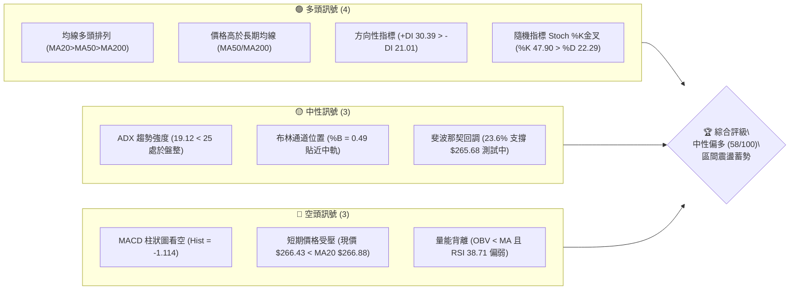
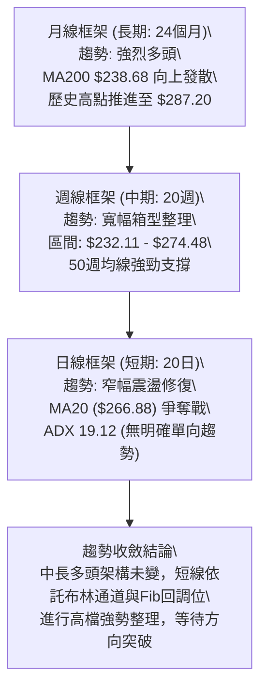
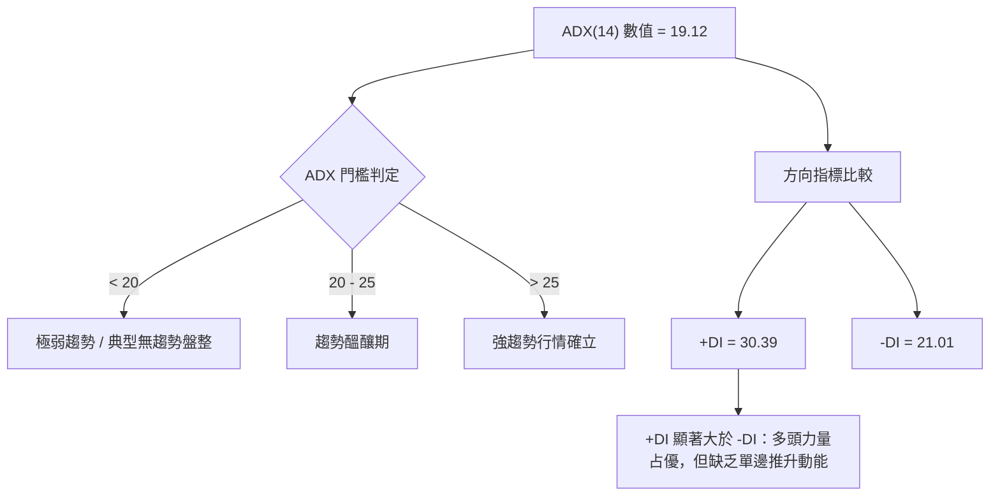
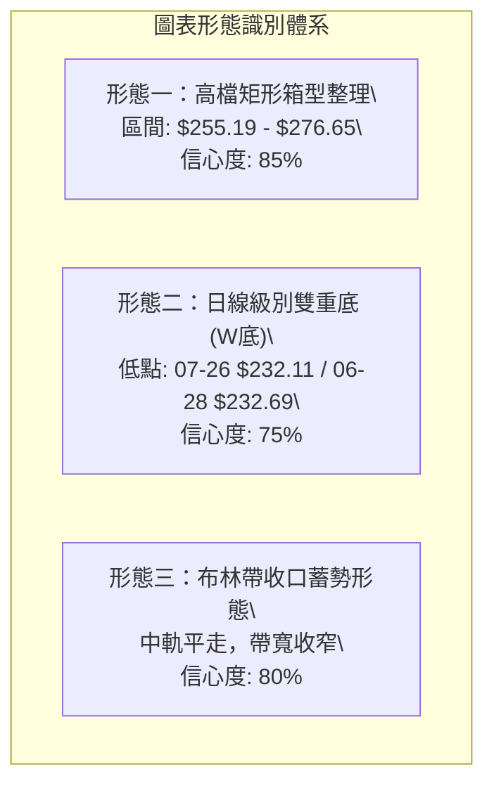
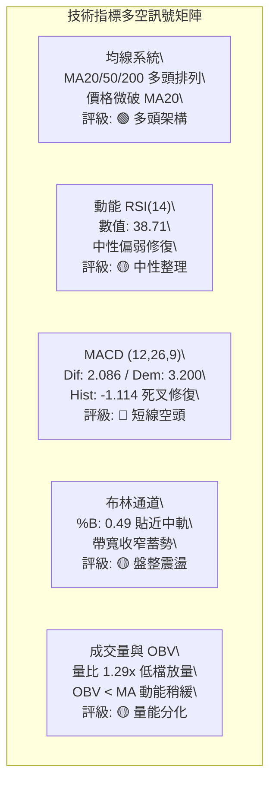
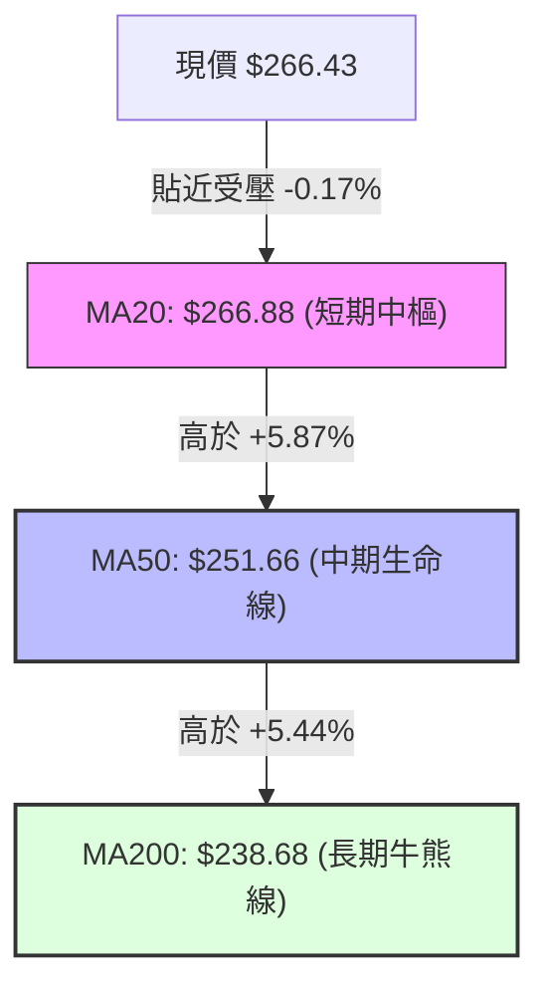
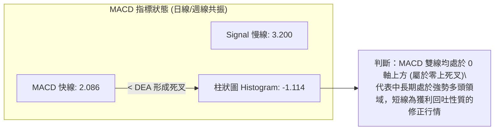
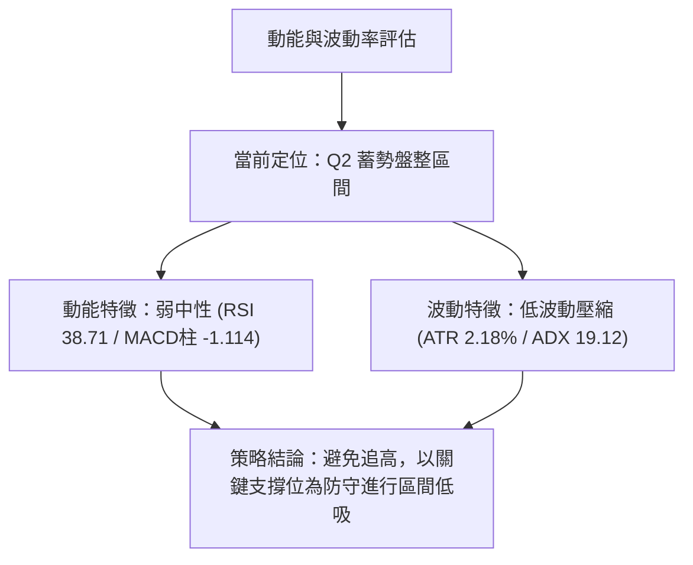
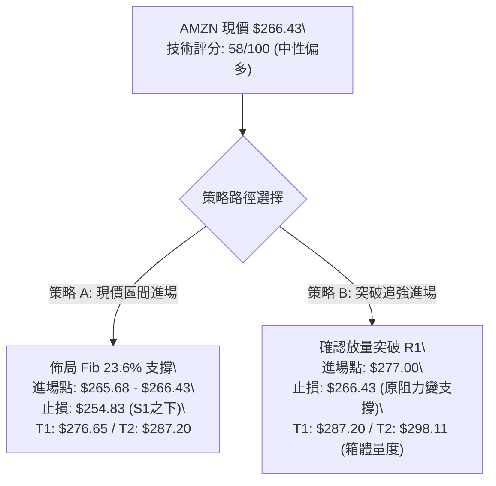
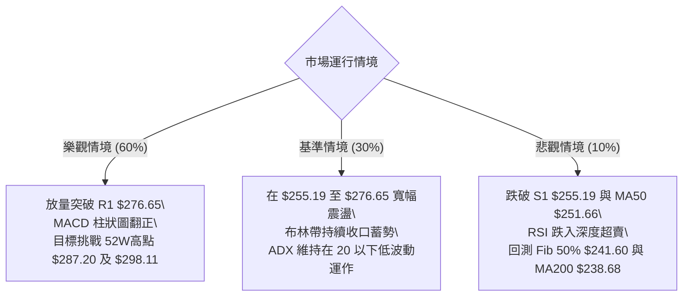

# AMZN 技術分析報告

> **報告日期**：2026-08-29 ｜ **語言**：繁體中文 ｜ **數據來源**：Yahoo Finance ｜ **當前價格**：$266.43

---

## 目錄

| 章節 | 內容 |
|------|------|
| [1. 技術面概覽](#1-技術面概覽) | 訊號儀表板、核心指標、評分卡 |
| [2. 趨勢分析](#2-趨勢分析) | 多時框趨勢、長中短期走勢 |
| [3. 圖表形態分析](#3-圖表形態分析) | 形態識別、K線組合、目標價 |
| [4. 支撐與阻力](#4-支撐與阻力) | 關鍵價位、斐波那契回調 |
| [5. 技術指標深度解讀](#5-技術指標深度解讀) | MA/RSI/MACD/布林/成交量 |
| [6. 動能與波動率](#6-動能與波動率) | 動能評估、ATR、Beta |
| [7. 多時框架總結](#7-多時框架總結) | 時框架評分矩陣 |
| [8. 交易策略建議](#8-交易策略建議) | 多空策略、風險報酬比 |
| [9. 風險提示與監控](#9-風險提示與監控) | 監控指標、風險場景 |

---

## 1. 技術面概覽

### 🎯 技術訊號儀表板



---

### 📊 核心指標速覽表

| 指標類別 | 指標名稱 | 當前數值 | 訊號 | 解讀 |
|:---|:---|:---|:---:|:---|
| **價格結構** | 收盤價 | $266.43 | 🟡 | 位於52週區間77.2%分位，處於高檔震盪整理區 |
| **短期均線** | MA20 | $266.88 | 🔴 | 現價低於MA20約0.17%，短線多空在此爭奪主導權 |
| **中期均線** | MA50 | $251.66 | 🟢 | 現價高於MA50達5.87%，中期上升趨勢結構穩固 |
| **長期均線** | MA200 | $238.68 | 🟢 | 現價高於MA200達11.63%，長期多頭牛市防線確立 |
| **動能震盪** | RSI(14) | 38.71 | 🟡 | 位於中性偏弱區，未進入超賣（<30），但有回升跡象 |
| **趨勢動能** | MACD(12,26,9) | 2.086 / 3.200 | 🔴 | MACD線位於訊號線下方，柱狀圖 -1.114，處於短線回調修正 |
| **擺動指標** | KD (Stoch %K/%D) | 47.90 / 22.29 | 🟢 | %K於低檔向上穿越%D，短線超賣反彈訊號浮現 |
| **趨勢強度** | ADX(14) | 19.12 | 🟡 | ADX < 25 表示市場處於弱趨勢/區間震盪格局 |
| **通道指標** | 布林通道 %B | 0.49 | 🟡 | 現價緊貼中軌 $266.88，通道上下界為 $251.56 至 $282.21 |
| **波動幅度** | ATR(14) | $5.80 | 🟢 | 日波動率約 2.18%，波動度適中，風險可控 |
| **量能指標** | 成交量比 (VR) | 1.29x | 🟢 | 單日量 49.32M 大於20日均量 38.23M，呈現低檔放量接手 |

---

### 🏆 技術評分卡

```
╔══════════════════════════════════════════════════════════════════╗
║                 技術評分卡 — AMZN (2026-08-29)                   ║
╠══════════════════════════════════════════════════════════════════╣
║ 趨勢強度 (Trend)      ████████░░░░░░░░░░░░  42/100  🟡 盤整震盪  ║
║ 動能指標 (Momentum)   ██████████░░░░░░░░░░  50/100  🟡 KD反彈修復║
║ 支撐穩定度 (Support)  ██████████████░░░░░░  72/100  🟢 Fib23.6穩 ║
║ 成交量配合 (Volume)   ████████████░░░░░░░░  60/100  🟢 量比1.29x ║
║ 形態完整度 (Pattern)  ████████████░░░░░░░░  62/100  🟢 高檔箱型  ║
║ 均線排列 (Moving Avg) ████████████████░░░░  82/100  🟢 標準多頭  ║
╠══════════════════════════════════════════════════════════════════╣
║ 綜合技術評分          ███████████░░░░░░░░░  58/100  🟡 中性偏多  ║
╚══════════════════════════════════════════════════════════════════╝
```

---

## 2. 趨勢分析

### 🌐 多時框趨勢分析



---

### 📈 長期趨勢 — 12個月走勢圖（Unicode）

```
AMZN 月線走勢圖（2025-09 至 2026-08）
價格 ($)
$290 ┤                                        
$280 ┤                                      ● (07月 $271.58)
$270 ┤                                  ●   │ 
$260 ┤                              ●   │   │  ●(08月 $266.43 現價)
$250 ┤                      ●       │   │   │  │
$240 ┤              ●       │       │   │   ● (06月 $238.34)
$230 ┤          ●   │   ●   ●(01月) │   │   │  │
$220 ┤  ●       │   │   │   │       │   │   │  │
$210 ┤  │       │   │   │   │   ●   │   │   │  │
$200 ┤  │       │   │   │   │   │   ●(03月 $208.27)
$190 ┴──┼───────┼───┼───┼───┼───┼───┼───┼───┼───┼───────────
      09/25   10  11  12 01/26 02  03  04  05  06  07  08/26
```

#### 走勢特徵分析表格

| 階段區間 | 起始/結束價 | 期間漲跌幅 | 核心形態與技術特徵 |
|:---|:---|:---:|:---|
| **2025-09 ~ 2025-10** | $219.57 → $244.22 | +11.23% | 突破整理區，創下當時波段新高，均線系統全面翻多 |
| **2025-11 ~ 2026-01** | $233.22 → $239.30 | +2.61% | 高檔橫盤蓄勢，回測 MA60 與 $230 關卡獲得有效支撐 |
| **2026-02 ~ 2026-03** | $210.00 → $208.27 | -12.97% | 深度洗盤回調，波段低點於 $196.00-$208.27 構築雙底支撐帶 |
| **2026-04 ~ 2026-05** | $265.06 → $270.64 | +29.95% | 強勢主升浪噴出，週成交量暴增至3.1億股，RSI一度觸及97.5 |
| **2026-06 ~ 2026-08** | $238.34 → $266.43 | +11.78% | 經歷6月急跌洗盤後展開V型修復，目前於 $265-$275 進行籌碼沉澱 |

---

### 📊 中期趨勢（週線分析）

```
AMZN 中期週線支撐阻力結構示意圖
$287.20 ─────────────────────────────────────────────── [52W High / 強阻力 R2]
$276.65 ----------------------------------------------- [近一年波段高點聚類 R1]
$271.58 ┈┈┈┈┈┈┈┈┈┈┈┈┈┈┈┈┈┈┈┈┈┈┈┈┈┈┈┈┈┈┈┈┈┈┈┈┈┈┈┈┈┈┈┈┈┈┈ [07/08月收盤壓力帶]
$266.43 ═══════════════════════════════════════════════ ◄ 當前價格 ($266.43)
$265.68 ┈┈┈┈┈┈┈┈┈┈┈┈┈┈┈┈┈┈┈┈┈┈┈┈┈┈┈┈┈┈┈┈┈┈┈┈┈┈┈┈┈┈┈┈┈┈┈ [Fibonacci 23.6% 回調位]
$255.19 ----------------------------------------------- [近期波段低點支撐 S1]
$251.66 ─────────────────────────────────────────────── [MA50 趨勢生命線]
$238.68 ═══════════════════════════════════════════════ [MA200 長期牛熊分水嶺]
```

---

### ⚡ 趨勢強度評估（ADX 解讀）



#### ADX 趨勢強度對照解讀

| 指標變數 | 當前讀數 | 狀態判定 | 交易策略意涵 |
|:---|:---:|:---:|:---|
| **ADX(14)** | **19.12** | 弱趨勢 / 區間盤整 | 避免追高殺跌，以高拋低吸或區間突破策略為主 |
| **+DI (14)** | **30.39** | 多方買盤主導 | 買方在市場中仍具備主動定價權，底層買盤厚實 |
| **-DI (14)** | **21.01** | 空方拋壓受限 | 空方未能形成持續性摜壓動能 |
| **趨勢綜合結論** | **多頭主導的箱型整理** | **ADX < 25 規則** | 遵循規則14：在ADX<25時，以日線布林通道 ($251.56-$282.21) 為操作核心 |

---

## 3. 圖表形態分析

### 🔍 形態識別系統



#### 形態識別與信心度評估表

| 形態名稱 | 信心度 | 判斷依據（嚴格引用數據） | 完成度 | 目標價（附精確計算式） |
|:---|:---:|:---|:---:|:---|
| **高檔箱型整理** | **85%** | 價格受制於 R1 **$276.65** 與支撐 S1 **$255.19**，已在該區間震盪運行達8週 | 75% | 向上突破目標：頸線 $276.65 + 箱高($276.65 - $255.19 = $21.46) = **$298.11**（短線受限於 R2 **$287.20**） |
| **中期雙重底 (W底)** | **75%** | 兩次波段低點分別為 2026-06-28 收盤 **$232.69** 與 2026-07-26 收盤 **$232.11**，頸線位於 2026-08-09 波段高點 **$274.48** | 90% | 形態高度 = $274.48 - $232.11 = $42.37。<br>量度目標價 = $274.48 + $42.37 = **$316.85** |
| **指標型收斂三角** | **45%** | 近4週高點逐步下移 ($274.48 → $266.43)，但低點仍受制於 MA50 | 40% | *訊號不足（信心度<50%），僅做指標型解讀，不預設延伸目標* |

---

### 🕯️ 重要K線形態分析

| 週/月份 | 收盤價 | K線形態特徵 | 量能與指標配合 | 多空訊號 |
|:---|:---:|:---|:---|:---:|
| **2026-08-02 (週)** | $271.58 | **大陽線突破**（長實體突破前週陰線） | 週成交量爆發至 355.37M，MACD柱轉正 (+1.213) | 🟢 強烈看多 |
| **2026-08-09 (週)** | $274.48 | **高檔十字星 / 吊人線**（上影線觸及阻力） | 成交量維持 270.23M，RSI 62.9，觸頂回落預警 | 🟡 滯漲警戒 |
| **2026-08-23 (週)** | $258.63 | **長下影錘頭線**（測試 S1 支撐帶） | RSI 快速修復至 24.5 超賣區，下檔承接力道顯現 | 🟢 止跌回升 |
| **2026-08-30 (當前)** | $266.43 | **實體陽線反彈**（重返 Fib 23.6% 關鍵位） | 日成交量 49.32M 高於均量，KD指標低檔金叉 | 🟢 震盪偏多 |

---

### 📉 ASCII 走勢形態示意圖

```
高檔箱型與雙底結構示意圖
$287.20 ┤                                          ▲ 52W High (阻力 R2)
        │                                         ┌─┐
$276.65 ┼───────────────────┬─────────────────────┤ ├─ 箱型頂部 (阻力 R1)
        │                   │ 08-09高點 $274.48    │ │
$266.43 ┼┄┄┄┄┄┄┄┄┄┄┄┄┄┄┄┄┄┄┼┄┄┄┄┄┄┄┄┄┄┄┄┄┄┄┄┄┄┄─┼─┼─ ◄ 現價 ($266.43)
        │                   │                     │ │
$255.19 ┼───────────────────┴─────────────────────┼─┼─ 箱型底部 (支撐 S1)
        │                                         │ │
$241.60 ┼┄┄┄┄┄┄┄┄┄┄┄┄┄┄┄┄┄┄┄┄┄┄┄┄┄┄┄┄┄┄┄┄┄┄┄┄┄┄┄┼┄┼─ Fib 50.0% 回調位
        │        頸線回踩           W底第二腳     │ │
$232.11 ┤       ● (06-28 $232.69)  ● (07-26 $232.11)
        └───────┴──────────────────┴─────────────┴─┴─────────
```

---

### 🎯 形態目標價計算

1. **高檔箱型向上突破目標計算**：
   - 形態箱體頂部（頸線 $R1$）：**$276.65**
   - 形態箱體底部（支撐 $S1$）：**$255.19**
   - 箱體垂直高度 $H = \$276.65 - \$255.19 = \$21.46$
   - 向上突破最小目標價 $T_{Box} = \$276.65 + \$21.46 =$ **$298.11**（第一階段目標受限於數據庫標注之 R2 **$287.20**）

2. **中期 W 底形態目標計算**：
   - 頸線位置（2026-08-09 高點）：**$274.48**
   - 雙底低點（2026-07-26 低點）：**$232.11**
   - 形態高度 $H_{W} = \$274.48 - \$232.11 = \$42.37$
   - 完整量度目標價 $T_{W} = \$274.48 + \$42.37 =$ **$316.85**

---

## 4. 支撐與阻力

### 🗺️ 關鍵價位分布圖（Unicode）

```
AMZN 價位結構分布圖（嚴格引用 OHLCV 計算數據）
══════════════════════════════════════════════════════════════════
$287.20 ║████████████████████████████████║ 52W High / 極強阻力 R2 (+7.80%)
$276.65 ║████████████████████            ║ 近一年波段高點聚類 R1 (+3.84%)
$266.88 ║▓▓▓▓▓▓▓▓▓▓▓▓▓▓▓▓▓▓▓▓            ║ 布林中軌 / MA20 短線反壓
$266.43 ╠════════════════════════════════╣ ◄ 當前價格 ($266.43)
$265.68 ║░░░░░░░░░░░░░░░░░░░░░░░░░░░░░░░░║ 斐波那契 23.6% 回調關鍵支撐
$255.19 ║████████████████████████        ║ 近一年波段低點聚類 S1 (-4.22%)
$251.66 ║██████████████████████████      ║ MA50 生命線 / 布林下軌 $251.56
$241.60 ║▓▓▓▓▓▓▓▓▓▓▓▓▓▓▓▓▓▓▓▓▓▓▓▓▓▓▓▓    ║ 斐波那契 50.0% 中樞平衡位
$238.68 ║██████████████████████████████  ║ MA200 牛熊分水嶺 (-10.41%)
$225.92 ║████████████████████████████████║ 次級波段低點聚類 S2 (-15.21%)
$220.99 ║████████████████████████████████║ 強固波段防守底線 S3 (-17.06%)
══════════════════════════════════════════════════════════════════
```

---

### 🚧 阻力位分析表

| 阻力級別 | 精確價位 | 距離現價 | 形成原因與技術共振 | 突破難度 | 重要性評級 |
|:---|:---:|:---:|:---|:---:|:---:|
| **R1 (關鍵阻力)** | **$276.65** | +3.84% | 近一年波段高點聚類，亦為近期多個週K線影線頂端密集區 | 🟡 中等偏高 | 🟢 關鍵多空分水嶺 |
| **R2 (極強阻力)** | **$287.20** | +7.80% | 52週最高價，歷史套牢盤密集解套點，斐波那契 0.0% 基準線 | 🔴 極高 | 🔴 歷史天花板壓力 |

---

### 🛡️ 支撐位分析表

| 支撐級別 | 精確價位 | 距離現價 | 形成原因與技術共振 | 守住機率 | 重要性評級 |
|:---|:---:|:---:|:---|:---:|:---:|
| **S1 (首要支撐)** | **$255.19** | -4.22% | 近一年波段低點聚類，與布林下軌 $251.56 及 MA50 $251.66 形成三重共振支撐帶 | 80% | 🟢 短線防守核心 |
| **S2 (中期支撐)** | **$225.92** | -15.21% | 2026年Q1深度洗盤整理平台，低檔買盤密集聚類區 | 90% | 🟡 中期結構防線 |
| **S3 (強固支撐)** | **$220.99** | -17.06% | 歷史波段大底聚類點，長期機構資金建倉底線 | 95% | 🔴 長期牛市底線 |

---

### 📐 斐波那契回調位分析

> **計算區間**：52週波段低點 **$196.00** → 52週波段高點 **$287.20**（波段總落差：$91.20）

```
斐波那契位階分布與現價關係
 0.0% ─── $287.20 ──────────────────────────── 52W High (R2)
23.6% ─── $265.68 ───◄ [現價 $266.43 位於此線上 +0.28%]
38.2% ─── $252.36 ──────────────────────────── (與 MA50 $251.66 重合)
50.0% ─── $241.60 ──────────────────────────── (與 MA200 $238.68 接近)
61.8% ─── $230.84 ──────────────────────────── (黃金分割強支撐)
78.6% ─── $215.52 ──────────────────────────── 深度回撤線
100.0% ── $196.00 ──────────────────────────── 52W Low
```

#### 斐波那契結構深度解讀
1. **當前位置意義**：現價 **$266.43** 緊貼於 **23.6% 回調位 ($265.68)** 上方。在強勢回調市場中，23.6% 位階為極強多頭特徵，只要收盤不有效跌破 $265.68，均屬於「淺度回撤、強勢整理」結構。
2. **共振支撐帶**：若跌破 23.6%，下一關鍵支撐為 **38.2% ($252.36)**，該位置與 **MA50 ($251.66)** 及 **布林下軌 ($251.56)** 產生三合一極強技術共振，為多頭中期不可失守的鋼鐵防線。

---

## 5. 技術指標深度解讀

### 🎛️ 指標訊號總覽



---

### 📈 移動平均線排列分析



#### 移動平均線多時框數據表

| 均線名稱 | 數值 | 偏離率 (Bias) | 走勢特徵 | 訊號解讀 |
|:---|:---:|:---:|:---|:---:|
| **MA 5** | $261.22 | +1.99% | 快速向上勾頭，短線低檔支撐轉強 | 🟢 短線反彈 |
| **MA 10** | $261.14 | +2.02% | 低檔走平回升，與 MA5 形成短天期金叉 | 🟢 短期止跌 |
| **MA 20** | $266.88 | -0.17% | 走勢趨平，現價於此進行多空拉鋸 | 🟡 關鍵樞紐 |
| **MA 60** | $250.33 | +6.43% | 穩定向上推進，提供中期均線保護 | 🟢 中期看多 |
| **MA 120** | $246.68 | +8.00% | 多頭排列順暢，斜率持續為正 | 🟢 中長穩固 |
| **MA 200** | $238.68 | +11.63% | 長期多頭基石，多頭排列格局標準確立 | 🟢 長期牛市 |

---

### 📉 RSI(14) 分析

```
RSI(14) 數值儀表：38.71 / 100
[超賣 0] ────────── [30] ────── [38.71] ────────────── [70] ────────── [超買 100]
███████████████░░░░░░░░░░░░░░░░░░░░░░░░░░░░░░░░░░░░░░░░░░  38.7%
```

- **超買超賣判定**：RSI 目前讀數為 **38.71**，脫離 2026-08-23 週報的低點 24.5 超賣區，顯示短期下行動能已獲遏制，正處於低檔震盪向中軸 50 回歸的修復過程。
- **背離分析判斷**：
  - **價格 vs RSI**：2026-07-26 價格低點 $232.11 對應 RSI 37.3；而 2026-08-23 價格回調至 $258.63 時 RSI 為 24.5。隨後價格迅速拉回 $266.43 帶動 RSI 回升至 38.71，**未出現典型頂背離或底背離**，走勢屬標準的強勢回調修正。

---

### 📊 MACD(12/26/9) 訊號解讀



- **MACD 數值解讀**：MACD 線 (2.086) 雖處於 Signal 線 (3.200) 下方，柱狀圖為 **-1.114** 顯示短線空頭動能仍存，但柱狀圖負值已由前期的 -1.538 出現收斂跡象，表明賣壓逐步衰竭。

---

### 📦 布林通道分析

```
AMZN 布林通道 (Bollinger Bands 20, 2) 結構圖
$282.21 ┬────────────────────────────────────────── 布林上軌 (阻力帶)
        │
$266.88 ┼───────────────────●────────────────────── 布林中軌 (MA20 / 現價 $266.43 貼近)
        │                 (現價 %B = 0.49)
$251.56 ┴────────────────────────────────────────── 布林下軌 (支撐帶)
```

- **通道寬度與狀態**：布林通道上下軌寬度為 $\$282.21 - \$251.56 = \$30.65$（帶寬約 11.5%），呈現典型的「收口走平」態勢。
- **%B 震盪指標**：當前 **%B = 0.49**，價格精確落於通道正中央（0.50 為中軌），顯示市場多空達到暫時平衡，進入波動壓縮期。

---

### 💹 成交量分析（量價配合度）

1. **成交量對比**：最新成交量為 **49,322,804** 股，相較於 20日均量 **38,227,500** 股，**量比達 1.29x**，呈現「下跌縮量、回彈放量」的良性特徵。
2. **OBV 能量潮解讀**：目前 `OBV < MA`，顯示大資金在突破 $276.65 阻力前仍以觀望與區間吸籌為主，量能尚未形成爆發性突破確認，印證 ADX=19.12 的盤整結論。

---

## 6. 動能與波動率

### ⚡ 動能評估四象限

| 象限分區 | 動能強度 (Momentum) | 波動率特徵 (Volatility) | AMZN 當前定位 | 戰術應對建議 |
|:---:|:---:|:---:|:---:|:---|
| **Q1 (最佳爆發區)** | 強 (RSI>60, MACD柱>0) | 低 (ATR低檔壓縮) | — | 突破加碼，順勢推升 |
| **Q2 (蓄勢觀望區)** | **弱 (RSI 38.7, MACD死叉)** | **低 (ATR $5.80, ADX<25)** | **✓ (AMZN 精確落點)** | **區間低吸，布林中下軌分批建倉** |
| **Q3 (劇烈博弈區)** | 強 (主升浪單邊行情) | 高 (ATR暴增，突破帶寬) | — | 緊跟趨勢，嚴設移動止盈 |
| **Q4 (高危下行區)** | 弱 (單邊崩跌) | 高 (恐慌拋售) | — | 空倉避險，嚴禁逆勢抄底 |



---

### 📊 ATR 波動率分析

- **ATR(14) 數值**：**$5.80**（佔當前股價約 **2.18%**）。
- **波幅分析**：股價日均波動約在 $5.80 區間內，屬於大盤科技股標準的常態波動水準。
- **止損距離建議**：
  - 短線交易（1.5 × ATR）：$\$5.80 \times 1.5 = \mathbf{\$8.70}$（建議止損設於現價下方約 $8.70，即 **$257.73**）。
  - 波段交易（2.0 × ATR）：$\$5.80 \times 2.0 = \mathbf{\$11.60}$（建議止損設於 **$254.83**，精確保護 S1 **$255.19** 支撐）。

---

### 📐 Beta 與市場相關性

- **Beta 係數**：**1.454**（高於市場基準 1.0）。
- **市場特徵**：AMZN 具備顯著的高彈性成長股屬性，當美股大盤（標普500/那斯達克）上漲時，理論預期超額收益為大盤的 1.45 倍；同理在系統性拉回時亦承擔較高波動，適合在區間下軌進場以獲取高盈虧比。

---

## 7. 多時框架總結

### 📋 時框架評分表

| 時框架 | 趨勢方向 | 動能指標 | 均線排列 | 形態特徵 | 綜合評分 | 戰術建議 |
|:---|:---:|:---:|:---:|:---|:---:|:---|
| **長期 (月線)** | 🟢 強烈多頭 | 🟢 MACD多頭 | 🟢 MA200之上發散 | 24個月大上升通道 | **85/100** | 長線堅定持有 |
| **中期 (週線)** | 🟢 多頭整理 | 🟡 RSI中性回升 | 🟢 MA50向上推進 | 雙重底修復完成 | **70/100** | 回調關鍵支撐做多 |
| **短期 (日線)** | 🟡 窄幅震盪 | 🔴 MACD柱為負 | 🟡 跌破MA20 0.17% | 布林中軌壓縮箱型 | **50/100** | 區間操作，嚴控止損 |

---

### 🔲 綜合訊號矩陣

| 維度 | 短期 (1-5日) | 中期 (1-3個月) | 長期 (6-12個月) | 訊號一致性評估 |
|:---|:---:|:---:|:---:|:---|
| **趨勢方向** | 橫盤盤整 (Neutral) | 向上震盪 (Bullish) | 單邊上行 (Strong Bull) | 中長期多頭方向高度一致 |
| **動能狀態** | 負值收斂 (Bearish Consolidation) | 中性修復 (Neutral) | 強勢多頭 (Bullish) | 短期動能落後，等待轉正 |
| **關鍵考驗** | 能否站穩 MA20 **$266.88** | 能否突破 R1 **$276.65** | 能否創歷史新高突破 **$287.20** | 各層級目標明確 |

---

### ⚖️ 多時框收斂結論

> **依據規則 14 嚴格收斂**：
> 1. 當前趨勢強度 **ADX(14) = 19.12 (< 25)**，明確定義當前市場處於**盤整震盪行情**。
> 2. 主導時框界定：以**日線布林通道 ($251.56 - $282.21)** 與 **Fib 23.6% ($265.68) 至 R1 ($276.65)** 為主要震盪交易區間。
> 3. **唯一方向性結論**：**中性偏多（區間下軌分批買入，等待向上突破）**。日線的短線死叉回調僅為尋找進場點提供契機，不可推翻週線與月線的多頭均線排列架構。

---

## 8. 交易策略建議

### 🗺️ 策略決策流程圖



---

### 🧭 策略路由

**當前主策略方向 = 區間偏多操作（依綜合評分 58/100，以布林下軌及 Fib 23.6% 支撐為防守，主推多頭策略）**

---

### 🎯 價格情境階梯（Price Scenarios）

| 觸發條件 | 第一目標 (T1) | 第二延伸目標 (T2) | 最終防守點 | 情境技術含義 |
|:---|:---:|:---:|:---:|:---|
| **向上突破 R1 $276.65** | **$287.20** (R2) | **$298.11** (箱型量度) | $266.88 (MA20) | 短線盤整結束，開啟新一輪主升浪 |
| **守穩 Fib 23.6% $265.68** | **$276.65** (R1) | **$287.20** (52W高) | $255.19 (S1) | 典型強勢回調，於布林中軌完成換手蓄勢 |
| **跌破 S1 $255.19 / MA50** | **$241.60** (Fib 50%) | **$238.68** (MA200) | $225.92 (S2) | 中期上升結構破壞，轉入深幅回調洗盤 |

---

### 📊 情境機率分佈

| 預測情境 | 發生機率 | 主要技術與量化依據 |
|:---|:---:|:---|
| **強勢震盪後向上突破 (情境 A)** | **60%** | 均線系統呈完整多頭排列 (MA20>50>200)，KD低檔金叉，放量比1.29x，+DI (30.39) 壓制 -DI (21.01) |
| **寬幅區間震盪整理 (情境 B)** | **30%** | ADX 19.12 < 25 處於無趨勢狀態，布林帶收口平走，MACD 柱狀圖仍為負值 (-1.114) |
| **向下深度跌破支撐 (情境 C)** | **10%** | 需失守 MA50 ($251.66) 及 S1 ($255.19)，目前距離現價有 5.87% 安全墊，機率較低 |

---

### 🟢 主策略詳情

| 策略要素 | 策略 A：現價回踩低吸策略（首選） | 策略 B：右側突破加碼策略（次選） |
|:---|:---|:---|
| **適用場景** | 依託 Fib 23.6% 支撐之左側/中樞建倉 | 帶量突破箱體頂部 R1 之右側順勢追擊 |
| **進場條件** | 現價 **$266.43** 或回踩 **$265.68** 企穩 | 日K線收盤價實質突破 **$276.65** 且量比 > 1.5x |
| **進場價格** | **$265.68 - $266.43** | **$277.00** |
| **止損價格** | **$254.83**（跌破 S1 $255.19 及 2×ATR 保護） | **$266.43**（跌回原箱頂中樞內部） |
| **目標價 T1** | **$276.65**（阻力位 R1，預期收益 +3.84%） | **$287.20**（52週高點 R2，預期收益 +3.68%） |
| **目標價 T2** | **$287.20**（阻力位 R2，預期收益 +7.80%） | **$298.11**（箱體量度目標，預期收益 +7.62%） |
| **風險報酬比 (R/R)**| **1 : 1.79**（以 T2 計算：風險 $11.60 / 收益 $20.77） | **1 : 1.99**（以 T2 計算：風險 $10.57 / 收益 $21.11） |
| **估計成功機率** | **65%** | **70%** |
| **建議倉位配置** | **15% - 20%** 總部位 | **10% - 15%** 追隨部位 |

---

### 🔴 反向風險觸發點（對沖與風控提示）

- **多頭失效警戒線**：若日K線收盤價跌破 **$255.19 (S1)** 且伴隨成交量放大至 50M 以上，代表箱型支撐破位。
- **對沖處置建議**：立即將現貨多頭部位減半，並於 **$251.66 (MA50 / 布林下軌)** 觀察能否獲得最後支撐；若再跌破，全數平倉離場觀望，下檔等待 **$238.68 (MA200)** 再行評估。

---

### ⭐ 整體訊號強度評星

```
做多訊號強度：★★★★☆  (4.0/5星 — 均線與多時框多頭，唯受限於ADX盤整)
做空訊號強度：★☆☆☆☆  (1.0/5星 — 逆大趨勢，僅有短線死叉動能)
整體可信度：  ★★★★☆  (4.2/5星 — 數據共振良好，Fib與均線吻合度極高)
```

---

## 9. 風險提示與監控

### ✅ 關鍵監控指標 Checklist

```
╔══════════════════════════════════════════════════════════════════╗
║                    每日交易與風控監控清單 (Checklist)            ║
╠══════════════════════════════════════════════════════════════════╣
║ [ ] 價格是否守穩 Fibonacci 23.6% 關鍵位 $265.68                  ║
║ [ ] 日K線能否有效收復並站穩 MA20 ($266.88)                       ║
║ [ ] MACD 柱狀圖是否由負轉正 (當前 -1.114 是否向上收斂)           ║
║ [ ] RSI(14) 能否突破 50 中軸分水嶺 (當前 38.71)                  ║
║ [ ] 成交量是否維持在 20日均量 38.23M 之上 (量價配合度)           ║
║ [ ] 向上測試 R1 $276.65 時，ADX 是否放大突破 25 (確認趨勢展開)   ║
║ [ ] 跌破 S1 $255.19 觸發嚴格止損風控紀律                         ║
╚══════════════════════════════════════════════════════════════════╝
```

---

### ⚠️ 風險場景分析



---

### 🛡️ 風險管理重要提醒

1. **波動管理**：當前 ATR 為 **$5.80**，盤中波動幅度約 $\pm 2.2\%$，建倉時切忌使用高槓桿，現貨部位建議單筆交易虧損控制在總資金的 1.0% 以內。
2. **均線破位保護**：MA50 ($251.66) 為中期趨勢生命線，任何收盤跌破 MA50 的走勢均宣告中期整理期拉長，不可盲目逆勢加碼攤平。
3. **相關性風險**：AMZN Beta 為 **1.454**，受總體經濟數據（如非農、CPI）及科技巨頭整體財報情緒牽連甚大，需密切防範大盤系統性波動。

---

## 📋 報告總結

```
╔══════════════════════════════════════════════════════════════════╗
║                  AMZN 技術分析報告總結 (2026-08-29)              ║
╠══════════════════════════════════════════════════════════════════╣
║ 當前價格：$266.43               綜合評分：58/100 (中性偏多)      ║
║ 趨勢定性：ADX=19.12 (弱趨勢盤整) 均線狀態：MA20>50>200 多頭排列  ║
╠══════════════════════════════════════════════════════════════════╣
║ 關鍵結論：                                                       ║
║ ├─ 長期趨勢：🟢 強烈多頭 (MA200 $238.68 提供堅定底部支撐)        ║
║ ├─ 中期趨勢：🟢 震盪走高 (雙底完成，依託 MA50 $251.66 向上推進)  ║
║ ├─ 短期趨勢：🟡 窄幅蓄勢 (受壓於 MA20 $266.88，獲 Fib 23.6% 支撐)║
║ ├─ 首要支撐：$255.19 (S1) / $265.68 (Fib 23.6%)                  ║
║ ├─ 首要阻力：$276.65 (R1) / $287.20 (52W High R2)                ║
║ └─ 分析師共識目標：$327.00 (高檔潛在空間 +22.7%)                 ║
╠══════════════════════════════════════════════════════════════════╣
║ 最優策略組合：                                                   ║
║ 1. 🥇 最佳機會：於現價 $265.68-$266.43 區間建立多頭底倉，        ║
║                 止損設於 $254.83 (S1下方)，第一目標 $276.65。    ║
║ 2. 🥈 次選機會：待日線實質突破 R1 $276.65 後右側加碼，           ║
║                 目標直指 52W 高點 $287.20 及箱型量度 $298.11。   ║
║ 3. 🥉 保守選擇：等待股價回踩 MA50/布林下軌 ($251.56-$252.36)     ║
║                 出現止跌長下影線時再行分批介入。                 ║
╚══════════════════════════════════════════════════════════════════╝
```

---

> ⚠️ **免責聲明**：本報告為 AI 自動生成之技術分析研究，所有數據及估算均嚴格基於所提供之歷史價格與技術指標資訊。本報告**僅供研究與學術參考**，**不構成任何投資買賣建議**。金融市場瞬息萬變，投資人應獨立評估風險，自負盈虧。

---

*報告生成時間：2026-08-29 ｜ 數據來源：Yahoo Finance ｜ 分析框架：多時框技術分析體系*