# AMZN 技術分析報告

> **報告日期**：2026-08-30 ｜ **語言**：繁體中文 ｜ **數據來源**：Yahoo Finance ｜ **當前價格**：$266.43

---

## 目錄

| 章節 | 內容 |
|------|------|
| [1. 技術面概覽](#1-技術面概覽) | 訊號儀表板、核心指標、評分卡 |
| [2. 趨勢分析](#2-趨勢分析) | 多時框趨勢、長中短期走勢 |
| [3. 圖表形態分析](#3-圖表形態分析) | 形態識別、K線組合、目標價 |
| [4. 支撐與阻力](#4-支撐與阻力) | 關鍵價位、斐波那契回調 |
| [5. 技術指標深度解讀](#5-技術指標深度解讀) | MA/RSI/MACD/布林/成交量 |
| [6. 動能與波動率](#6-動能與波動率) | 動能評估、ATR、Beta |
| [7. 多時框架總結](#7-多時框架總結) | 時框架評分矩陣 |
| [8. 交易策略建議](#8-交易策略建議) | 多空策略、風險報酬比 |
| [9. 風險提示與監控](#9-風險提示與監控) | 監控指標、風險場景 |
| [10. 報告總結](#-報告總結) | 總結儀表板與核心結論 |

---

## 1. 技術面概覽

### 🎯 技術訊號儀表板

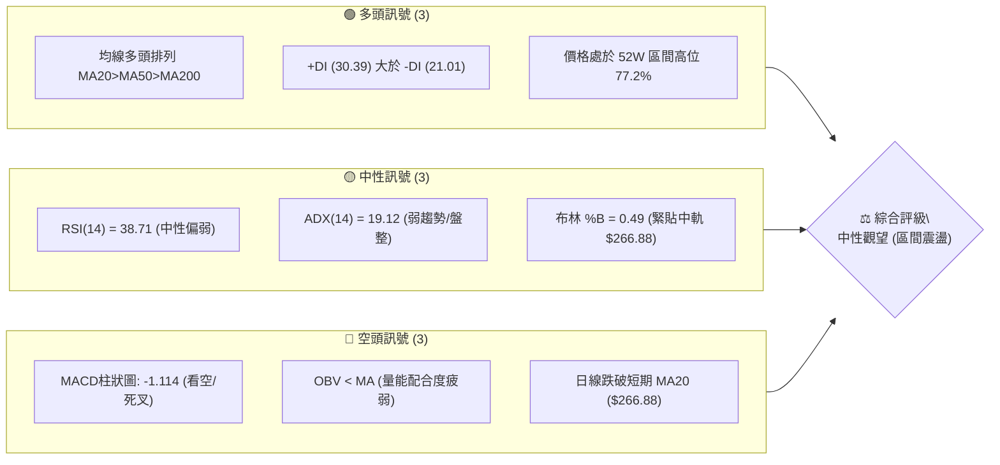

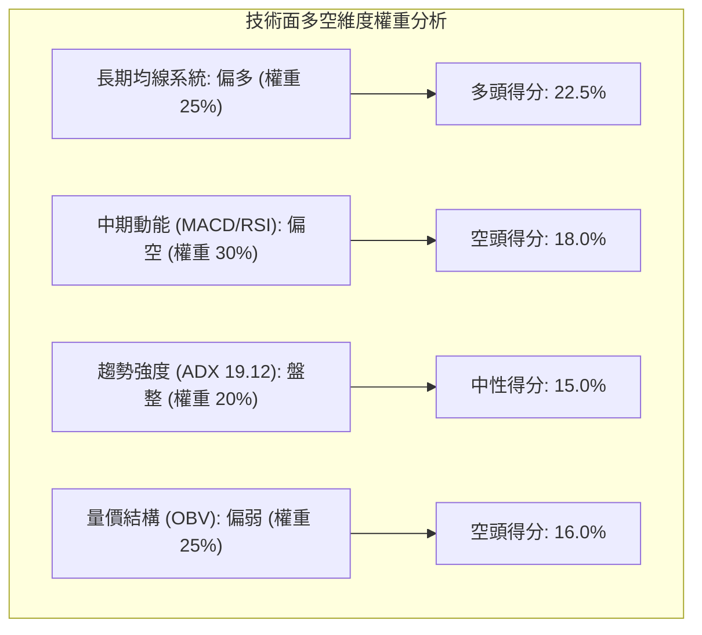

### 📊 核心指標速覽表

| 指標類別 | 指標名稱 | 當前數值 | 訊號 | 解讀 |
|----------|----------|----------|------|------|
| **價格** | 當前價格 | $266.43 | 🟡 | 位於52週高點 $287.20 與低點 $196.00 之 77.2% 分位 |
| **均線** | MA20 (月線) | $266.88 | 🔴 | 價格略微跌破中軌/MA20 (-0.17%)，短期承壓 |
| **均線** | MA50 (季線) | $251.66 | 🟢 | 價格位於MA50上方 (+5.87%)，中期多頭架構完好 |
| **均線** | MA200 (年線)| $238.68 | 🟢 | 價格高於長期年線 (+11.63%)，長期牛市基調穩固 |
| **動能** | RSI(14) | 38.71 | 🟡 | 位於中性偏弱區間 (30-70)，尚未進入超賣區 |
| **動能** | MACD (12,26,9)| 2.086 / 3.200 | 🔴 | MACD線低於訊號線，柱狀圖為 -1.114，短線回調修正中 |
| **趨勢** | ADX(14) | 19.12 | 🟡 | 數值 < 25 表明趨勢動能衰竭，市場進入箱體震盪盤整 |
| **通道** | Bollinger Bands | $251.56 - $282.21 | 🟡 | %B 為 0.49，價格正精確測試布林中軌 $266.88 |
| **量能** | OBV 趨勢 | OBV < MA | 🔴 | 成交量動能指標落後於均線，資金推升意願暫歇 |
| **波動** | ATR(14) | $5.80 | 🟢 | 波動率為 2.18%，處於相對收斂的正常波動區間 |

### 🏆 技術評分卡

```
╔══════════════════════════════════════════════════════════════╗
║              技術評分卡 — AMZN (2026-08-30)                  ║
╠══════════════════════════════════════════════════════════════╣
║ 均線架構 (MA)     ████████████████░░░░  80/100  🟢 強勢多頭   ║
║ 動能指標 (Momentum)████████░░░░░░░░░░░░  40/100  🔴 短線轉弱   ║
║ 趨勢強度 (ADX)     ██████░░░░░░░░░░░░░░  30/100  🟡 盤整無勢   ║
║ 支撐穩定度 (Sup)   ██████████████░░░░░░  70/100  🟢 支撐明確   ║
║ 成交量配合 (Volume)████████░░░░░░░░░░░░  40/100  🔴 量能背離   ║
║ 通道位置 (BBands)  ██████████░░░░░░░░░░  50/100  🟡 中軌爭奪   ║
╠══════════════════════════════════════════════════════════════╣
║ 綜合評分           ███████████░░░░░░░░░  55/100  🟡 中性觀望   ║
║ 交易導向           【中性震盪 / 箱體邊緣低吸高拋策略】          ║
╚══════════════════════════════════════════════════════════════╝
```

---

## 2. 趨勢分析

### 🌐 多時框趨勢分析

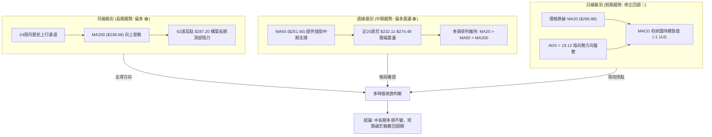

### 📈 長期趨勢 — 12個月走勢圖（Unicode）

```
AMZN 月線走勢圖（2025-08 至 2026-08）
價格 ($)
$280 ┤                                      ● $271.58 (07月)
$270 ┤                                  ● $270.64 (05月)  ● $266.43 (現價)
$260 ┤                              ● $265.06 (04月)
$250 ┤                  ● $244.22 (10月)
$240 ┤              ● $239.30 (01月)        ● $238.34 (06月)
$230 ┤  ● $229.00   ● $230.82 (12月)
$220 ┤      ● $219.57 (09月)
$210 ┤                          ● $210.00 (02月)
$200 ┤                              ● $208.27 (03月低點)
     └─────────────────────────────────────────────────────────────
        08   09   10   11   12   01   02   03   04   05   06   07   08
       '25  '25  '25  '25  '25  '26  '26  '26  '26  '26  '26  '26  '26
```

**走勢特徵分析表格**：

| 階段區間 | 時間跨度 | 起始/結束價 | 區間漲跌幅 | 走勢特徵與量價解讀 |
|----------|----------|-------------|------------|-------------------|
| **第一階段：高位盤整** | 2025-08 ~ 2025-10 | $229.00 → $244.22 | +6.65% | 震盪走高，於 2025 年 10 月觸及 $244.22 波段高點 |
| **第二階段：中期回撤** | 2025-11 ~ 2026-03 | $233.22 → $208.27 | -10.70% | 震盪下行，2026年3月探底 $208.27（接近52W低點 $196.00） |
| **第三階段：主升浪潮** | 2026-04 ~ 2026-05 | $265.06 → $270.64 | +29.95% | 強勢突破均線密集區，日/週成交量放大，創階段新高 |
| **第四階段：寬幅震盪** | 2026-06 ~ 2026-08 | $238.34 → $266.43 | +11.78% | 06月急跌至 $238.34 後於 07月拉升至 $271.58，現價收於 $266.43 |

### 📊 中期趨勢（週線分析）

```
AMZN 近期週線壓力與支撐結構示意圖
$290 ┤                                           [52W 高點 $287.20 / R2]
$280 ┤                            ▲ 08/09 $274.48
$270 ┤          ▲ 05/10 $272.68  ─── 08/02 $271.58 ─── [阻力 R1 $276.65]
$260 ┤  ─ 04/26 $263.99 ──────────────────────────── ◄ 現價 $266.43 (BB中軌 $266.88)
$250 ┤    ▲ 04/19 $250.56                        [支撐 S1 $255.19 / MA50 $251.66]
$240 ┤              ▼ 06/14 $238.55  ▲ 07/19 $247.23
$230 ┤                      ▼ 06/28 $232.69 ─ 07/26 $232.11 [強支撐 S2 $225.92]
```

### ⚡ 趨勢強度評估（ADX 解讀）

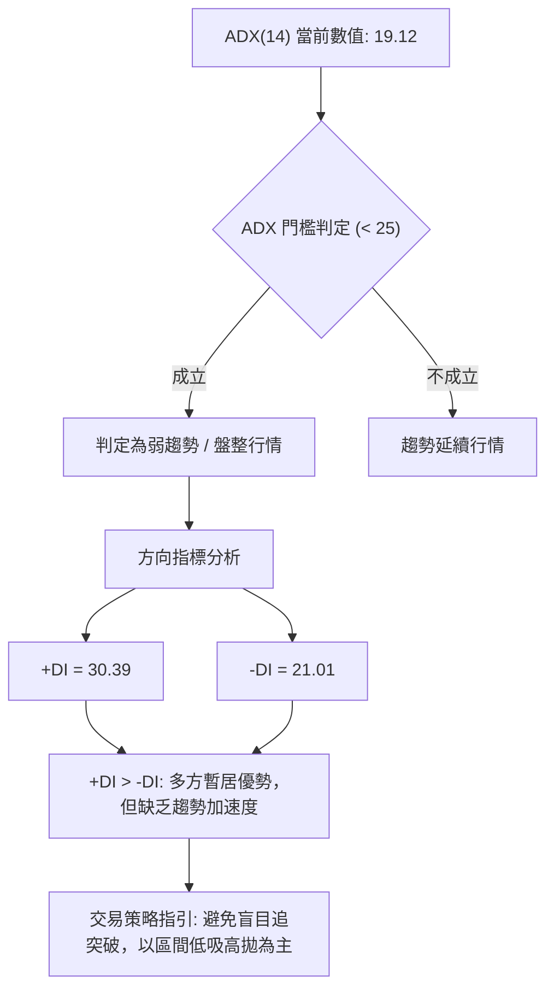

| 指標變數 | 當前讀數 | 狀態門檻 | 技術意義解讀 |
|----------|----------|----------|--------------|
| **ADX(14)** | **19.12** | < 20 (極弱趨勢/盤整) | 市場動能大幅發散後進入收斂整理，單邊趨勢暫停 |
| **+DI (多頭動向)** | **30.39** | > -DI | 買盤力量仍略高於賣盤，多頭底氣尚存 |
| **-DI (空頭動向)** | **21.01** | < +DI | 空頭主動性拋壓未成氣候，未進入單邊下跌趨勢 |
| **綜合判定** | **無方向性整理** | ADX < 25 | 依照多時框收斂規則，以日線布林通道 ($251.56-$282.21) 為操作邊界 |

---

## 3. 圖表形態分析

### 🔍 形態識別系統

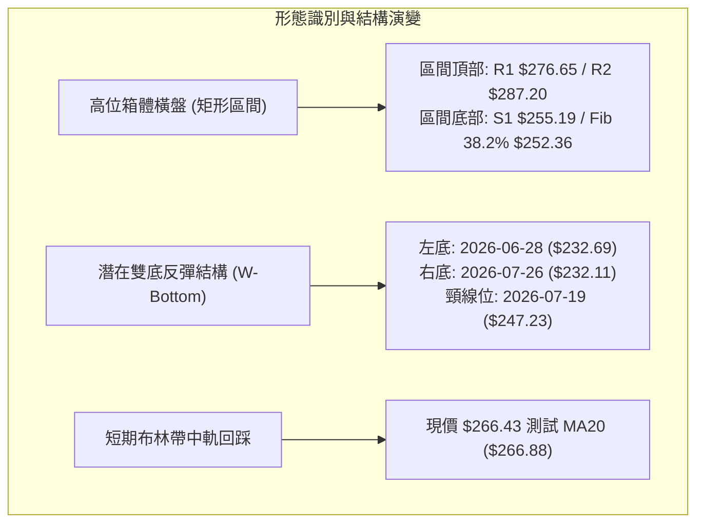

**形態識別與信心度評估表**：

| 形態名稱 | 信心度 | 判斷依據（引用數據） | 完成度 | 目標價（附精確計算式） |
|----------|--------|----------------------|--------|------------------------|
| **雙底形態 (W-Bottom)** | **75%** | 週線兩次探底 $232.69 (06/28) 與 $232.11 (07/26)，形成雙重底支撐，並放量突破頸線 $247.23 | 100% (已達標) | 頸線 $247.23 + 形態高度 ($247.23 - $232.11 = $15.12) = **$262.35**（08/02 已漲至 $271.58 超額完成） |
| **高位矩形箱體 (Rectangle)** | **65%** | 上軌阻力受制於 R1 $276.65 與 52W 高點 R2 $287.20，下軌獲得 S1 $255.19 與 MA50 $251.66 承接 | 70% (內部震盪) | 突破箱頂 R1 $276.65 後，量度目標為 52W 高點 **$287.20** |
| **頭肩頂形態** | **< 30%** | **訊號不足，僅做指標型解讀**：未出現右肩破頸線跡象，MA50 依然向上，不構成頭肩形態 | -- | 不適用 |

### 🕯️ 重要K線形態分析（近 10 週核心K線）

| 週別日期 | 收盤價 | K線形態特徵 | 量價解讀 | 訊號 |
|----------|--------|-------------|----------|------|
| **2026-06-28** | $232.69 | 長下影錘頭線 (巨量 5.25億股) | 恐慌盤湧出後主力資金強力進場承接，探明波段底部 | 🟢 |
| **2026-07-26** | $232.11 | 二次探底縮量十字星 (1.76億股) | 拋壓顯著衰竭，與 06/28 形成經典「縮量雙底」結構 | 🟢 |
| **2026-08-02** | $271.58 | 長陽實體大突破 (放量 3.55億股) | 強勢跳空大陽線，一舉收復 MA20 與 MA50，確認底部反轉 | 🟢 |
| **2026-08-09** | $274.48 | 高位吊頸線 / 流星十字 (2.70億股) | 逼近 R1 $276.65 遭遇獲利了結賣壓，MACD 柱達 +4.090 峰值 | 🟡 |
| **2026-08-23** | $258.63 | 陰線回踩跌破 MA20 (1.76億股) | 短線獲利盤回吐，考驗 S1 $255.19 支撐有效性 | 🔴 |
| **2026-08-30** | $266.43 | 縮量陽線反抽 (1.60億股) | 現價重回斐波那契 23.6% ($265.68) 上方，量能萎縮表明觀望 | 🟡 |

### 📉 ASCII 走勢形態示意圖

```
AMZN 雙底反彈與高位箱體震盪示意圖
$287.20 ┤                                                [52W 高點 R2]
$276.65 ┤                            ┌─ 08/09 $274.48 ── [箱體頂部 R1]
$266.88 ┤                           ┌┴┐ ◄ 現價 $266.43 (BB中軌/MA20)
$255.19 ┤          [頸線 $247.23]   │ │                 [箱體底部 S1]
$247.23 ┤                ▲         │ │
$238.55 ┤      ┌─┐      ┌┴┐        │ │
$232.11 ┤──────┴─┴──────┴─┴────────┘ └── [雙底 Low: 06/28 $232.69 & 07/26 $232.11]
```

### 🎯 形態目標價計算

```
1. 雙底突破目標價（歷史驗證）：
   - 形態底部：$232.11
   - 形態頸線：$247.23
   - 形態垂直高度 H = $247.23 - $232.11 = $15.12
   - 最小量度目標價 Target = $247.23 + $15.12 = $262.35 (已於 2026-08-02 達成)

2. 當前高位矩形箱體目標價（推算）：
   - 箱體底部支撐 S1：$255.19
   - 箱體頂部阻力 R1：$276.65
   - 箱體高度 H_box = $276.65 - $255.19 = $21.46
   - 向上突破目標價 = $276.65 + $21.46 = $298.11 (若突破 R1 則指向 $287.20 及 $298.11)
   - 向下跌破目標價 = $255.19 - $21.46 = $233.73 (指向支撐密集區 S2 $225.92 / S3 $220.99)
```

---

## 4. 支撐與阻力

### 🗺️ 關鍵價位分布圖（Unicode）

```
AMZN 價位結構分布圖
══════════════════════════════════════════════════════════════════
$287.20 ║████████████████████████████████████████║ 52W歷史極值阻力 R2
$276.65 ║██████████████████████████              ║ 近期波段高點阻力 R1
$266.88 ║▓▓▓▓▓▓▓▓▓▓▓▓▓▓▓▓▓▓                      ║ BB中軌 / MA20
$266.43 ╠════════════════════════════════════════╣ ◄ 現價 (Fib 23.6% $265.68)
$255.19 ║▓▓▓▓▓▓▓▓▓▓▓▓▓▓▓▓▓▓▓▓                    ║ 近期波段支撐 S1
$251.56 ║████████████████████                    ║ BB下軌 / MA50 ($251.66)
$241.60 ║████████████████                        ║ Fib 50.0% 中樞支撐
$238.68 ║████████████████████████                ║ 長期牛熊分界 MA200
$225.92 ║████████████████████████████            ║ 強支撐 S2 (波段起漲點)
$220.99 ║████████████████████████████████        ║ 極限防守支撐 S3
══════════════════════════════════════════════════════════════════
```

### 🚧 阻力位分析表

| 阻力級別 | 精確價位 | 形成原因（波段高點聚類） | 突破難度 | 技術重要性 |
|----------|----------|--------------------------|----------|------------|
| **R1 (波段阻力)** | **$276.65** | 近一年波段高點聚類區，2026-08-09 週線觸及 $274.48 後回落，上方套牢盤密集 | 中等偏高 | 🔴 突破此處方能重啟單邊上升浪 |
| **R2 (極限阻力)** | **$287.20** | 52週最高點 (52W High)，斐波那契 0.0% 基準點，機構獲利了結重大分水嶺 | 極高 | 🔴 多頭終極防線，需突破歷史巨量配合 |

### 🛡️ 支撐位分析表

| 支撐級別 | 精確價位 | 形成原因（波段低點聚類） | 守住機率 | 技術重要性 |
|----------|----------|--------------------------|----------|------------|
| **S1 (初級支撐)** | **$255.19** | 近一年波段低點聚類，貼近 MA50 ($251.66) 與斐波那契 38.2% ($252.36) | 70% | 🟢 短線多頭防守底線，跌破則轉入深度回調 |
| **S2 (強級支撐)** | **$225.92** | 2026年6-7月雙底盤整區上方關鍵回踩點，具備強力實體買盤 | 85% | 🟢 中期趨勢防守位，牛市生命線支撐 |
| **S3 (極限支撐)** | **$220.99** | 歷史密集成交區，接近 2025年8-9月震盪平台低點 ($219.57) | 95% | 🟢 長期價值買盤進駐區 |

### 📐 斐波那契回調位分析

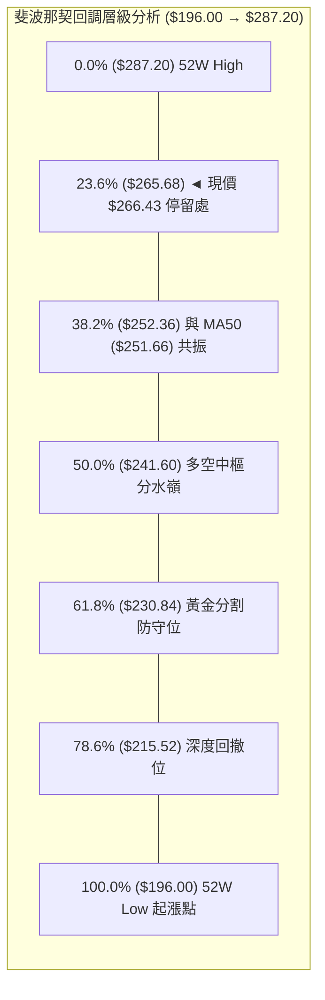

- **現價位置解讀**：當前價格 **$266.43** 精確運行於 **斐波那契 23.6% 回調位 ($265.68)** 與 **0.0% 高點 ($287.20)** 之間。
- **技術意義**：
  1. $265.68 是第一道關鍵黃金分割支撐，現價高出該位置僅 $0.75 (+0.28%)，處於極為敏感的支撐測試點。
  2. 若現價有效守穩 $265.68，則多頭隨時具備向上挑戰 R1 ($276.65) 的條件。
  3. 若失守 $265.68，下方將直接回測 **斐波那契 38.2% ($252.36)**，該位置與 **MA50 ($251.66)** 及 **布林下軌 ($251.56)** 形成強大的**三重複合共振支撐區**。

---

## 5. 技術指標深度解讀

### 🎛️ 指標訊號總覽

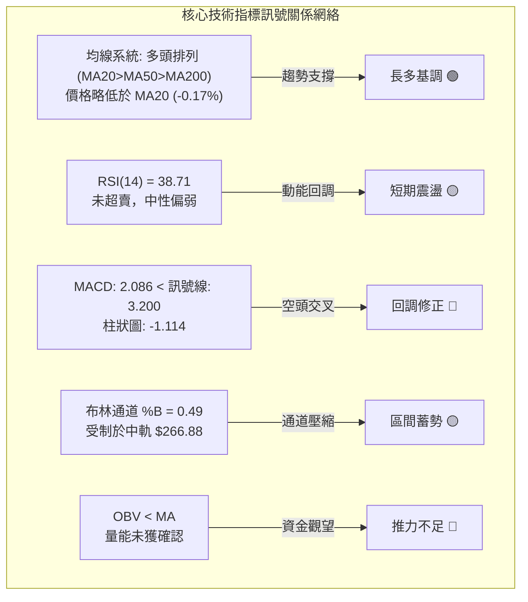

### 📈 移動平均線排列分析

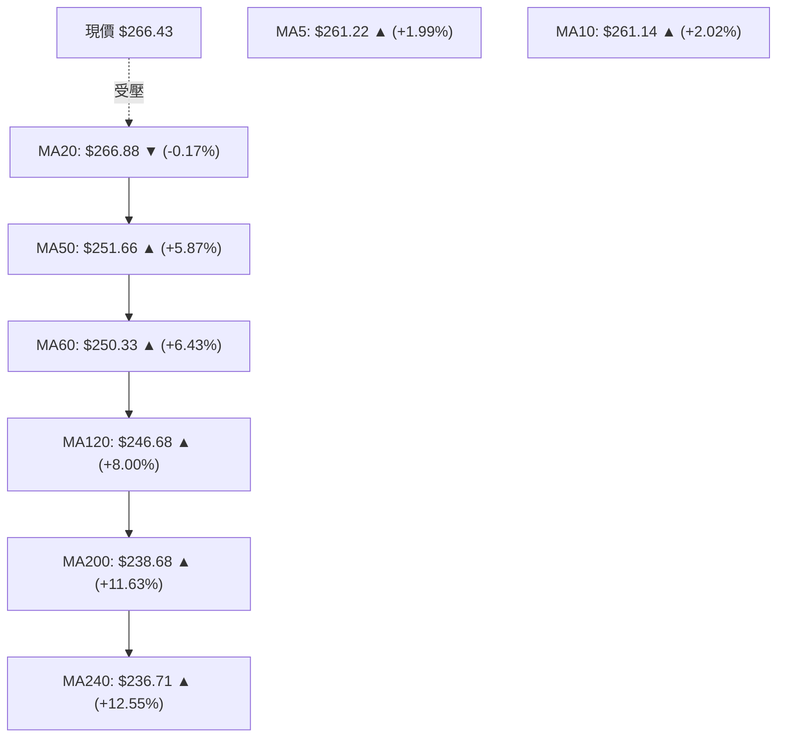

- **均線排列結構**：`MA20 ($266.88) > MA50 ($251.66) > MA200 ($238.68)`。中長期均線呈現經典**多頭排列**，長期均線 (MA60, MA120, MA200, MA240) 斜率全數向上發散。
- **短期均線動態**：現價 $266.43 站於 MA5 ($261.22) 與 MA10 ($261.14) 之上，但略低於 MA20 ($266.88)，顯示短線超跌後出現技術性抽頭，但尚未完全扭轉 20 日均線的短壓。

### 📉 RSI(14) 分析

```
RSI(14) 刻度儀表板
0 ────────── 30 ────── 38.71 ──────────── 70 ────────── 100
[  超賣區   ]    ▲現價 [   中性震盪區   ]     [  超買區   ]
進度條: ███████████████░░░░░░░░░░░░░░░░░░░░░░░ 38.71%
```

- **數值解讀**：RSI(14) 當前讀數為 **38.71**，處於 30-70 的中性區間偏下緣。
- **背離分析**：
  - **頂背離判定**：2026-08-09 價格創波段高點 $274.48 時，週線 RSI 為 62.9（此前 04/19 高點 $250.56 時週線 RSI 高達 97.5），顯示中期上行動能存在動能衰減，但日線級別在近期 $258.63 回調中未見極端背離。
  - **底背離判定**：**無明顯底背離**。近期低點由 $232.11 回升後，RSI 由 24.5 快速回彈至 38.71，為指標常規修復，尚未構築多重底背離。

### 📊 MACD(12,26,9) 訊號解讀

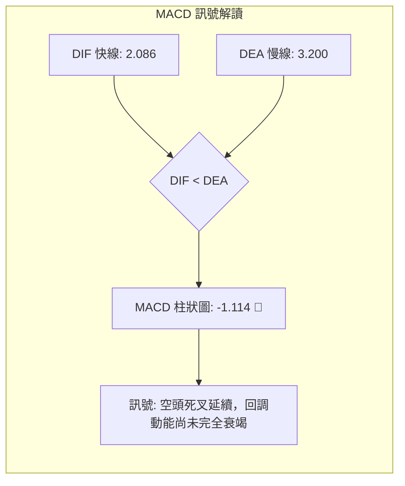

- **快慢線位置**：MACD 快線 (2.086) 處於零軸上方，但已下穿訊號線 (3.200)，形成零軸上方的**高位死叉**。
- **柱狀圖動態**：柱狀圖讀數為 **-1.114**。觀察近三週變化：08/09 (+4.090) → 08/16 (+0.392) → 08/23 (-1.538) → 08/30 (-1.114)。負向柱體出現微幅收斂（由 -1.538 縮至 -1.114），暗示空頭拋壓高峰已過，短線可能迎來弱勢反彈或橫盤築底。

### 📦 布林通道分析

```
AMZN 布林通道 (Bollinger Bands, 20, 2) 結構圖
$282.21 ┬────────────────────────────────────────── 上軌 (BB Upper)
        │
$274.20 ┤                     (08/09 高點 $274.48 觸及上軌附近回落)
        │
$266.88 ┼────────────────────────────────────────── 中軌 (BB Middle / MA20)
$266.43 ┼  ◄ 現價 (BB %B = 0.49，緊貼中軌)
        │
$251.56 ┴────────────────────────────────────────── 下軌 (BB Lower / 與 MA50 $251.66 重合)
```

- **通道帶寬與位置**：通道寬度為 $30.65 ($251.56 至 $282.21)。現價 $266.43 的 **%B 為 0.49**，幾乎完美落於通道幾何中心（中軌 $266.88）。
- **走勢涵義**：價格自 08/09 上軌回落後在中軌獲得短暫支撐。在 ADX < 25 的盤整環境下，布林通道中軌將成為短期多空爭奪的軸心，上下軌將分別構成強阻力與強支撐。

### 💹 成交量分析（量價配合度）

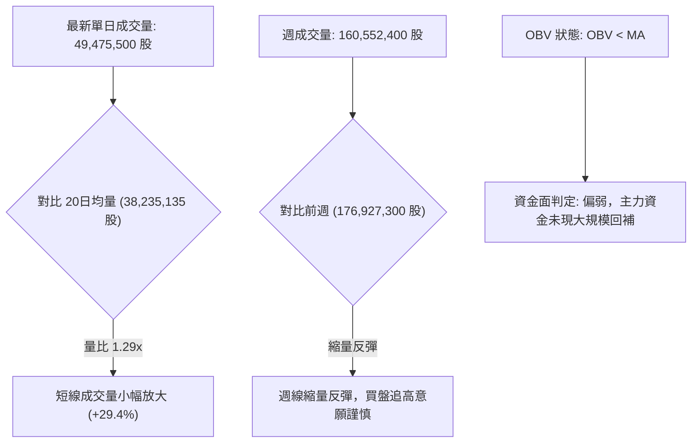

- **量價背離分析**：本週收盤由 $258.63 回升至 $266.43 (+3.02%)，但週成交量由 1.769億股縮減至 1.605億股，呈現典型的「**量縮價漲**」背離特徵。
- **OBV 解讀**：OBV 仍運行於其均線下方，顯示當前的反彈仍屬於技術性修復，尚未獲得機構增量資金的實質確認。

---

## 6. 動能與波動率

### ⚡ 動能評估四象限

| 象限標籤 | 動能維度 (RSI / MACD) | 波動維度 (ATR / 帶寬) | 當前落點 | 技術特徵與策略評估 |
|----------|----------------------|----------------------|----------|--------------------|
| **Q1：主升浪象限** | 強動能 (RSI>60, MACD>0) | 高波動 (ATR>3%) | ─ | 強勢單邊趨勢，順勢追突破 |
| **Q2：低波蓄勢象限** | 強動能 (多頭排列) | 低波動 (ATR<2.5%) | ─ | 爆發前夜，適合左側埋伏 |
| **Q3：高危出貨象限** | 弱動能 (MACD死叉) | 高波動 (ATR>3%) | ─ | 劇烈震盪出貨，應堅決離場 |
| **Q4：震盪收斂象限** | **弱動能 (MACD<0, RSI 38.7)** | **低波動 (ATR 2.18%)** | **✓ AMZN** | **動能放緩且波動收縮，適合區間網格或觀望** |

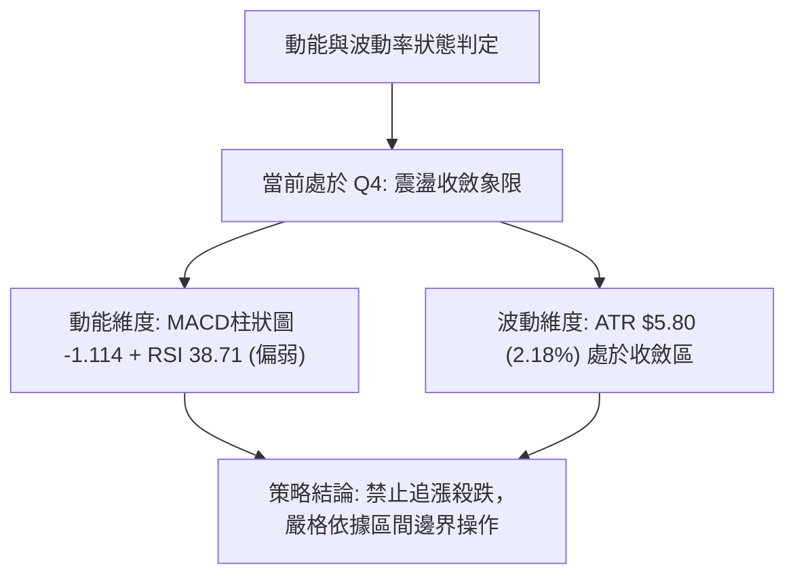

### 📊 ATR 波動率分析

```
ATR (14) 波動區間量度
當前數值: $5.80 (佔當前價格 2.18%)
████████░░░░░░░░░░░░░░░░░░░░░░░░ (中低波動區間)
```

- **日常波動區間**：以現價 $266.43 計算，單日正常波動幅度為 `[$260.63 - $272.23]`。
- **動態止損設定基準**：
  - **保守型交易（短線）**：採用 1.0 × ATR = **$5.80** 止損空間。
  - **波段型交易（中線）**：採用 2.0 × ATR = **$11.60** 止損空間。
  - **趨勢型交易（長線）**：採用 3.0 × ATR = **$17.40** 止損空間。

### 📐 Beta 與市場相關性

- **Beta 係數**：**1.454**。表明 AMZN 屬於高彈性成長股，波動幅度平均為標普500指數的 1.454 倍。
- **市場環境敏感度**：在大盤處於多頭攻擊階段時將具備高額 Alpha，但在大盤回調或震盪整理期，其下行波動亦會被放大。
- **機構持股與放空比**：機構持股佔比達 **68.7%**，空頭佔流通盤僅 **1.0%**（Short Ratio 2.04），顯示籌碼面結構非常穩固，並無實質性機構做空壓力。

---

## 7. 多時框架總結

### 📋 時框架評分表

| 時框架 | 趨勢方向 | 動能指標 | 均線排列 | 圖表形態 | 綜合評分 | 交易指引 |
|--------|----------|----------|----------|----------|----------|----------|
| **月線級別 (長期)** | 偏多 🟢 | 中性 🟡 | 多頭排列 (MA200向上) | 長期上升通道 | **75/100** | 長期多頭持有，以 MA200 為終極防線 |
| **週線級別 (中期)** | 震盪偏多 🟢 | 偏弱 🔴 | 多頭排列 (MA50完好) | 雙底反彈後高位震盪 | **60/100** | 回踩 MA50 ($251.66) / S1 布局多單 |
| **日線級別 (短期)** | 震盪偏空 🔴 | 偏弱 🔴 | 跌破 MA20，站上 MA5/10 | 布林中軌爭奪中 | **45/100** | 短線不宜追高，等待突破或回踩確認 |

### 🔲 綜合訊號矩陣

```
╔══════════════════════════════════════════════════════════════════╗
║                    多時框綜合訊號對齊矩陣                        ║
╠══════════════════════════════════════════════════════════════════╣
║ 時框維度    趨勢方向    MA均線    動能(RSI/MACD)   成交量配合    ║
║ 短期 (日線) 震盪偏空 🔴 跌破MA20🔴  空頭死叉 🔴     縮量反彈 🔴  ║
║ 中期 (週線) 震盪偏多 🟢 站穩MA50🟢  柱狀圖收斂 🟡   量能中性 🟡  ║
║ 長期 (月線) 強勢多頭 🟢 多頭排列🟢  長線多頭 🟢     籌碼集中 🟢  ║
╠══════════════════════════════════════════════════════════════════╣
║ 訊號收斂    中長期多頭格局未破，短期受制於動能指標修正。         ║
╚══════════════════════════════════════════════════════════════════╝
```

### ⚖️ 多時框收斂結論

依據多時框收斂優先級規則判定：
1. **趨勢/盤整性質**：當前日線 **ADX(14) = 19.12 < 25**，明確定義當前市場處於**盤整行情**而非單邊趨勢行情。
2. **操作主軸收斂**：在盤整行情中，依規則應以**日線布林通道上下軌 ($251.56 - $282.21)** 作為核心交易區間；同時中長期均線（MA50 $251.66 / MA200 $238.68）方向依然向上，確立了整體架構為「**牛市途中的高位箱體震盪**」。
3. **唯一方向性結論**：**【中性偏多觀望，區間低吸為主】**。日內與短期不可盲目追漲，耐心等待價格回踩箱體下軌支撐區進行右側低吸。

---

## 8. 交易策略建議

### 🗺️ 策略決策流程圖

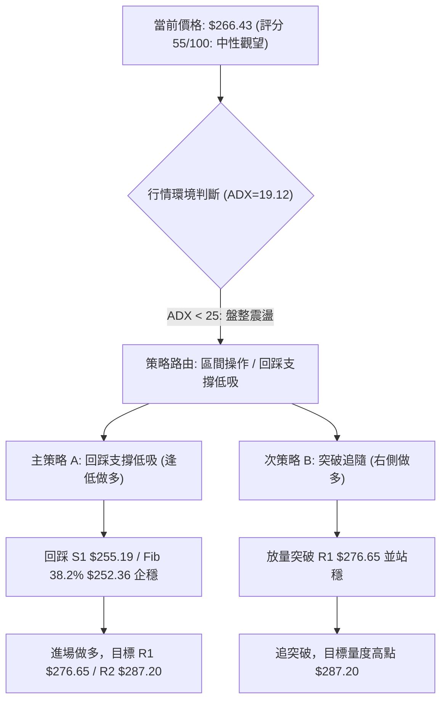

### 🧭 策略路由（依評分卡分流）

> **當前主策略方向 = 中性震盪偏多（依評分 55/100）**
> 綜合評分落於 40–60 分的中性區間，且 ADX < 25。主推**區間逢低做多策略（策略A）**與**右側突破確認策略（策略B）**，不推薦直接在布林中軌進行重倉押注。

### 🎯 價格情境階梯（Price Scenarios）

所有價位均嚴格引用第 4 章關鍵價位：

| 觸發條件 | 第一目標 | 第二目標 (延伸) | 情境含義與操作指引 |
|----------|----------|-----------------|-------------------|
| **向上放量突破 R1 $276.65** | **R2 $287.20** | **$298.11** (箱體高度推算) | 短線完全轉強，發動新一輪主升浪，全面加碼多頭 |
| **維持於 $255.19 - $276.65** | **中軌 $266.88**| **Fib 23.6% $265.68** | 標準箱體震盪，執行布林帶高拋低吸，維持輕倉 |
| **向下跌破 S1 $255.19** | **S2 $225.92** | **S3 $220.99** | 中期結構轉弱，考驗年線 MA200 ($238.68) 與波段起漲點 |

### 📊 情境機率分佈

```
情境機率分佈圖
繼續上行/突破 (35%) ▓▓▓▓▓▓▓▓▓▓▓░░░░░░░░░░░░░░░░░░░░░
區間震盪整理 (50%) ▓▓▓▓▓▓▓▓▓▓▓▓▓▓▓▓░░░░░░░░░░░░░░
回落再探底部 (15%) ▓▓▓▓▓░░░░░░░░░░░░░░░░░░░░░░░░░░░
```

| 情境類別 | 機率預估 | 主要技術依據 |
|----------|----------|--------------|
| **區間震盪整理 (基準情境)** | **50%** | ADX(14)=19.12 無趨勢特徵、布林 %B=0.49 處於中軌、OBV<MA 量能未放大 |
| **繼續上行 / 突破 (樂觀情境)** | **35%** | 均線系統呈標準多頭排列、+DI (30.39) > -DI (21.01)、華爾街共識目標價達 $327.00 |
| **回落再探底部 (悲觀情境)** | **15%** | MACD 柱狀圖負值 (-1.114)、週線縮量反彈呈現量價背離 |

### 🟢 主策略詳情

| 策略要素 | 策略 A：支撐區逢低吸納 (左側/主策略) | 策略 B：突破強阻力追隨 (右側/次策略) |
|----------|---------------------------------------|---------------------------------------|
| **適用時機** | 價格回踩關鍵支撐企穩時 | 價格帶量突破近一年波段高點時 |
| **進場條件** | 回踩 S1 $255.19 ~ Fib 38.2% $252.36 區間出現止跌K線 | 日線收盤價帶量突破 R1 $276.65 (成交量>5000萬股) |
| **進場價格** | **$254.00** (於支撐區間內分批進場) | **$277.50** (突破確認後進場) |
| **目標價 T1** | **$276.65** (波段阻力 R1) | **$287.20** (52W歷史高點 R2) |
| **目標價 T2** | **$287.20** (52W歷史高點 R2) | **$298.11** (箱體向上量度目標價) |
| **止損價格** | **$248.00** (跌破 MA50 $251.66 及 BB下軌 $251.56) | **$271.50** (跌回 08/02 平台與突破點下方) |
| **風險空間** | $6.00 ($254.00 - $248.00) | $6.00 ($277.50 - $271.50) |
| **報酬空間 (T1)** | $22.65 ($276.65 - $254.00) | $9.70 ($287.20 - $277.50) |
| **報酬空間 (T2)** | $33.20 ($287.20 - $254.00) | $20.61 ($298.11 - $277.50) |
| **風險報酬比** | **1 : 3.78** (以 T1 計算) / **1 : 5.53** (以 T2 計算) | **1 : 1.62** (以 T1 計算) / **1 : 3.44** (以 T2 計算) |
| **成功機率** | **65%** | **55%** |
| **建議倉位** | **15% - 20%** | **10% - 15%** |

### 🔴 反向風險觸發點（對沖提示）

- **空頭風險觸發價位**：**$251.56 (布林下軌 / MA50 重疊處)**。
- **對沖觸發機制**：若日線收盤價跌破 $251.56 且伴隨成交量放大至 5000 萬股以上，宣告中期均線支撐破位，投資人應立即將現貨多頭倉位降至 5% 以下，或利用反向標的對沖下行至 S2 **$225.92** 的潛在風險。

### ⭐ 整體訊號強度評星

```
做多訊號強度：★★★☆☆  (3.0/5星 — 長期均線偏多，但短線動能不足)
做空訊號強度：★★☆☆☆  (2.0/5星 — 僅為技術性回調，空頭無單邊趨勢)
整體可信度：  ★★★★☆  (4.0/5星 — 數據結構完備，指標共振明確)
```

---

## 9. 風險提示與監控

### ✅ 關鍵監控指標 Checklist

```
╔══════════════════════════════════════════════════════════════╗
║                   每日交易監控清單 (Checklist)               ║
╠══════════════════════════════════════════════════════════════╣
║ [ ] 價格是否跌破斐波那契 23.6% ($265.68)？                   ║
║ [ ] MACD 柱狀圖是否持續收窄（由 -1.114 翻紅至 0 軸上方）？   ║
║ [ ] RSI(14) 能否重返 50 中軸上方？                          ║
║ [ ] 日成交量是否重回 20日均量 (38,235,135 股) 的 1.2 倍以上？║
║ [ ] ADX(14) 是否由 19.12 開始向上勾頭突破 25（趨勢啟動）？  ║
║ [ ] 價格測試 S1 ($255.19) 或 MA50 ($251.66) 是否出現長下影？║
╚══════════════════════════════════════════════════════════════╝
```

### ⚠️ 風險場景分析

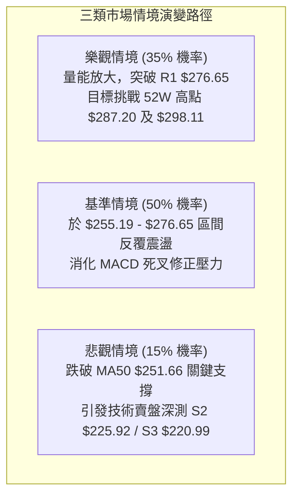

### 🛡️ 風險管理重要提醒

1. **ATR 倉位管理法**：當前單日 ATR 為 **$5.80**，以單筆交易最大容忍虧損為總資金的 1.5% 計算，若採取 $6.00 的止損空間，單一標的最大持倉部位不得超過總資產的 **25%**。
2. **防範假突破風險**：由於 ADX 僅為 19.12，任何未伴隨 5000 萬股以上巨量突破 R1 ($276.65) 的走勢，均極易演變為「假突破真誘多」，切勿在阻力位上方盲目追高。
3. **重大事件防禦**：密切留意大盤 Beta 波動對 AMZN 的聯動影響（Beta 達 1.454），嚴格執行紀律止損，絕不在跌破 S1 ($255.19) 後進行盲目逆勢攤平。

---

## 📋 報告總結

```
╔══════════════════════════════════════════════════════════════════╗
║                   AMZN 技術分析報告總結儀表板                    ║
╠══════════════════════════════════════════════════════════════════╣
║ 報告日期：2026-08-30                                         ║
║ 當前價格：$266.43 (處於 52週區間 77.2% 分位)                 ║
║ 技術評級：⚖️ 中性觀望 (評分: 55/100 — 弱趨勢箱體盤整)        ║
╠══════════════════════════════════════════════════════════════════╣
║ 趨勢結構診斷：                                               ║
║ ├─ 長期趨勢：🟢 強勢多頭 (MA200 $238.68 向上發散)           ║
║ ├─ 中期趨勢：🟢 震盪偏多 (MA50 $251.66 提供強勁支撐)         ║
║ ├─ 短期趨勢：🔴 回調整理 (跌破 MA20 $266.88，MACD 柱 -1.114) ║
║ ├─ 關鍵阻力：R1: $276.65  ｜  R2: $287.20 (52W High)         ║
║ ├─ 關鍵支撐：S1: $255.19  ｜  S2: $225.92  ｜  S3: $220.99  ║
║ └─ 機構共識：🟢 Strong Buy (60位分析師平均目標價: $327.00)   ║
╠══════════════════════════════════════════════════════════════════╣
║ 最優交易策略組合：                                           ║
║ 1. 🥇 最佳機會（策略A）：回踩 S1 $255.19 / Fib 38.2% $252.36 ║
║    逢低分批布局多單，止損設於 $248.00，目標上看 $276.65 /    ║
║    $287.20，預期風險報酬比高達 1:3.78 以上。                 ║
║ 2. 🥈 次選機會（策略B）：耐心等待帶量突破 R1 $276.65 進行右  ║
║    側順勢追隨，止損設於 $271.50，目標看至 $287.20。          ║
║ 3. 🥉 保守選擇：在 ADX < 25 且 MACD 未翻紅前維持輕倉觀望，  ║
║    靜待布林通道開口發散。                                    ║
╚══════════════════════════════════════════════════════════════════╝
```

---

> ⚠️ **免責聲明**：本報告為技術分析研究，所有數據、圖表及價位推算均基於歷史市場交易資訊。本報告**僅供學術研究與投資策略參考**，**不構成任何要約、招攬或具體投資建議**。金融市場瞬息萬變，交易具備固有虧損風險，投資人應獨立評估自身風險承受能力並嚴格執行資金控管。

---

*報告生成時間：2026-08-30 ｜ 數據來源：Yahoo Finance ｜ 分析框架：資深多時框技術分析體系*