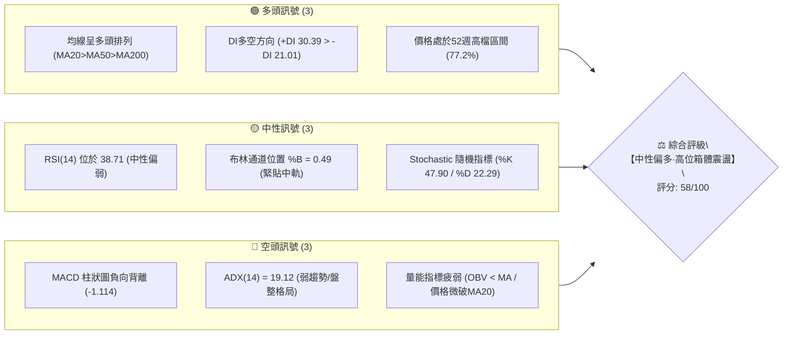
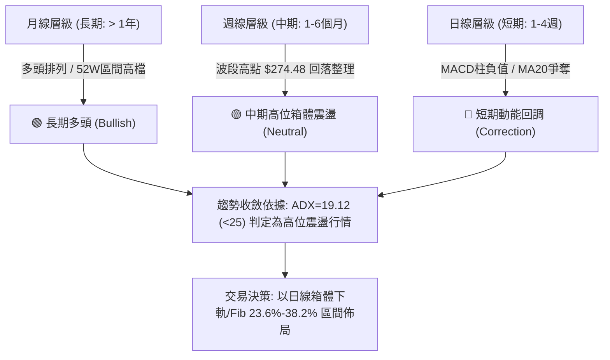
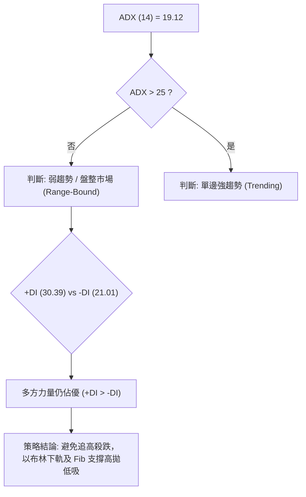
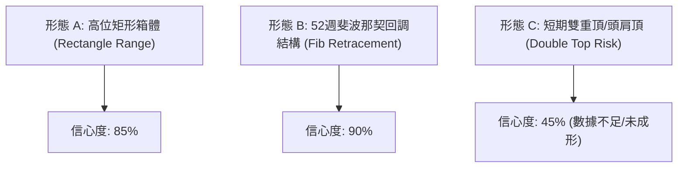
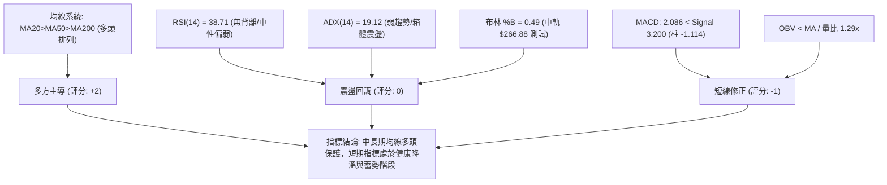
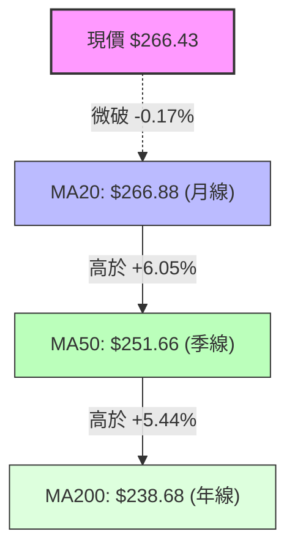
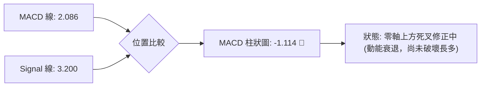
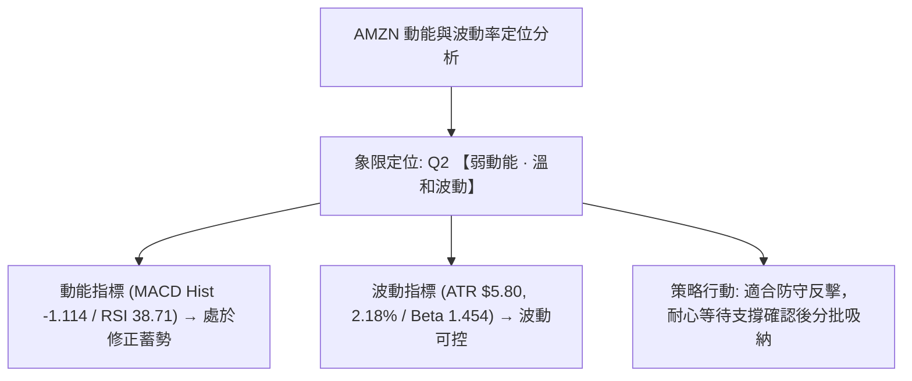
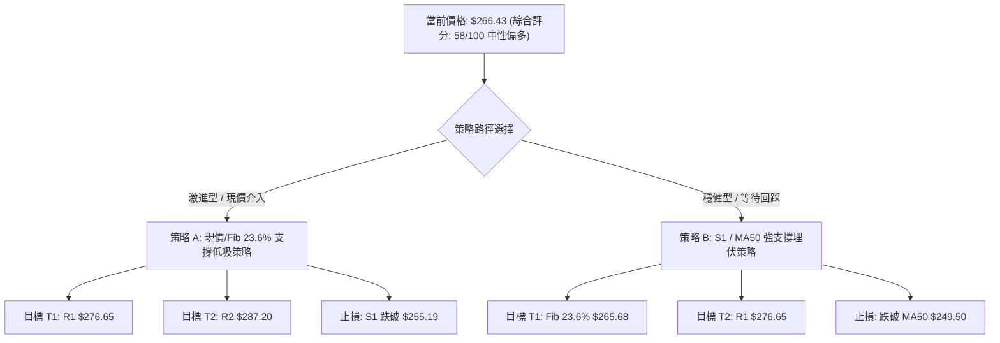
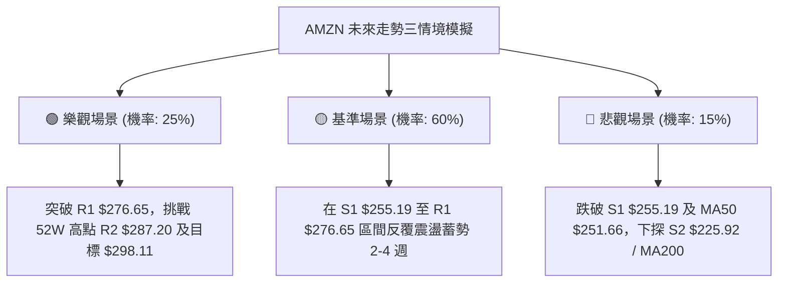

# AMZN 技術分析報告

> **報告日期**：2026-08-31 ｜ **語言**：繁體中文 ｜ **數據來源**：Yahoo Finance ｜ **當前價格**：$266.43

---

## 目錄

| 章節 | 內容 |
|------|------|
| [1. 技術面概覽](#1-技術面概覽) | 訊號儀表板、核心指標、評分卡 |
| [2. 趨勢分析](#2-趨勢分析) | 多時框趨勢、長中短期走勢、ADX解讀 |
| [3. 圖表形態分析](#3-圖表形態分析) | 形態識別、K線組合、目標價推算 |
| [4. 支撐與阻力](#4-支撐與阻力) | 關鍵價位、斐波那契回調 |
| [5. 技術指標深度解讀](#5-技術指標深度解讀) | MA/RSI/MACD/布林/成交量/OBV |
| [6. 動能與波動率](#6-動能與波動率) | 動能四象限、ATR、Beta係數 |
| [7. 多時框架總結](#7-多時框架總結) | 時框架矩陣與多時框收斂結論 |
| [8. 交易策略建議](#8-交易策略建議) | 策略路由、情境階梯、主策略詳解 |
| [9. 風險提示與監控](#9-風險提示與監控) | 監控清單、情境樹、風控原則 |
| [10. 報告總結](#10-報告總結) | 總結儀表板與核心結論 |

---

## 1. 技術面概覽

### 🎯 技術訊號儀表板



### 📊 核心指標速覽表

| 指標類別 | 指標名稱 | 當前數值 | 訊號 | 解讀 |
|----------|----------|----------|------|------|
| **價格** | 當前價格 | $266.43 | 🟡 | 位於52週區間 77.2% 位置，微幅低於 MA20（$266.88） |
| **均線** | MA20 | $266.88 | 🔴 | 價格低於短期均線 -0.17%，短期動能趨緩 |
| **均線** | MA50 | $251.66 | 🟢 | 價格高於中期均線 +5.87%，中期多頭結構穩固 |
| **均線** | MA200 | $238.68 | 🟢 | 價格高於長期均線 +11.63%，長期多頭趨勢不變 |
| **動能** | RSI(14) | 38.71 | 🟡 | 位於中性偏弱區，無超買超賣，短線處於回調消化期 |
| **動能** | MACD (12,26,9) | 2.086 / 3.200 | 🔴 | MACD線低於訊號線，柱狀圖為 -1.114，呈死叉空頭修正 |
| **趨勢** | ADX (14) | 19.12 | 🟡 | ADX < 25 處於無明顯單邊趨勢之盤整整理行情 |
| **波動** | ATR (14) | $5.80 | 🟢 | 每日波幅 2.18%，波動率溫和受控 |
| **通道** | Bollinger Bands | $251.56 - $282.21 | 🟡 | %B = 0.49，價格正精準測試布林中軌（$266.88）支撐 |
| **量能** | 20日均量比 | 1.29x (49.48M) | 🟡 | 最新量能高於均量，但 OBV 低於其均線，資金呈現觀望 |

### 🏆 技術評分卡

```
╔══════════════════════════════════════════════════════════════════╗
║                技術評分卡 — AMZN (2026-08-31)                   ║
╠══════════════════════════════════════════════════════════════════╣
║ 趨勢強度 (ADX/DI)   ████████░░░░░░░░░░░░  42/100  🟡 弱勢盤整    ║
║ 動能指標 (RSI/MACD) ██████████░░░░░░░░░░  50/100  🟡 修正整理    ║
║ 支撐穩定度 (S1-S3)  ████████████████░░░░  80/100  🟢 支撐強固    ║
║ 成交量能 (VOL/OBV)  ██████████░░░░░░░░░░  52/100  🟡 量價分歧    ║
║ 均線排列 (MA系統)   ████████████████░░░░  82/100  🟢 多頭排列    ║
║ 形態結構 (區間箱體) ████████████░░░░░░░░  62/100  🟢 箱體成形    ║
╠══════════════════════════════════════════════════════════════════╣
║ 綜合技術評分        ███████████░░░░░░░░░  58/100  🟡 區間震盪    ║
╚══════════════════════════════════════════════════════════════════╝
```

---

## 2. 趨勢分析

### 🌐 多時框趨勢分析



### 📈 長期趨勢 — 12個月走勢圖（Unicode）

```
AMZN 月線走勢圖（2025-09 至 2026-08）
價格 ($)
$275 ┤                                                 ● $271.58
$270 ┤                                         ● $270.64   │
$265 ┤                                 ● $265.06           ● $266.43 (現價)
$260 ┤                                     │               │
$255 ┤                                     │               │
$250 ┤                                     │               │
$245 ┤         ● $244.22                   │               │
$240 ┤             │               ● $239.30       ● $238.34
$235 ┤             ● $233.22               │
$230 ┤                 ● $230.82           │
$220 ┤ ● $219.57                           │
$210 ┤                         ● $210.00   │
$205 ┤                             ● $208.27
     └─┬───────┬───────┬───────┬───────┬───────┬───────┬───────┬─
     25-09   25-10   25-11   25-12   26-01   26-02   26-03   26-04   26-05   26-06   26-07   26-08
```

#### 走勢特徵分析表格

| 階段區間 | 起始價 → 終止價 | 區間漲跌幅 | 主要走勢特徵 | 量能與形態解讀 |
|----------|-----------------|------------|--------------|----------------|
| **2025-09 ~ 2025-10** | $219.57 → $244.22 | +11.23% | 突破前波平台 | 帶量上攻，確立長期上升通道下軌支撐 |
| **2025-11 ~ 2026-03** | $233.22 → $208.27 | -10.70% | 築底深蹲整理 | 回踩測試 52W 低點區間（$196.00 上方築底），確立 $208-$210 強支撐帶 |
| **2026-04 ~ 2026-05** | $265.06 → $270.64 | +29.95% (由3月計) | 爆發性主升段 | 巨量推升，單月自 $208.27 飆升至 $265.06，確立多頭大週期 |
| **2026-06 ~ 2026-08** | $238.34 → $266.43 | +11.78% | 高位箱體震盪 | 6月急挫洗盤至 $238.34 後迅速收復，7月創 $271.58，8月收 $266.43 盤整 |

### 📊 中期趨勢（週線分析）

近20週收盤數據展現清晰的高檔換手特徵：
1. **2026-04-19 ~ 2026-05-10**：RSI 飆升至 79.6 ~ 97.5 極端超買區，隨後展開降溫回調。
2. **2026-06-28**：創下 525,209,900 股歷史級天量，收盤 $232.69，完成中期恐慌清洗底點。
3. **2026-08-02 ~ 2026-08-30**：價格回升至 $271.58-$274.48 後再度遭遇阻力，週線 RSI 回落至 38.7，MACD 柱轉為 -1.114，確認進入週線級別的箱體收斂三角整理。

### ⚡ 趨勢強度評估（ADX 解讀）



| ADX 數值區間 | 趨勢強度定義 | AMZN 當前狀態 | 交易指導方針 |
|--------------|--------------|---------------|--------------|
| 00.00 - 19.99 | 無趨勢 / 盤整 | **19.12 (當前數值)** | **區間震盪交易，震盪指標（RSI/Stoch）為主，均線跟隨為輔** |
| 20.00 - 24.99 | 弱趨勢 / 醞釀期 | - | 觀察突破方向與量能確認 |
| 25.00 - 49.99 | 強趨勢建立 | - | 順勢交易，回調均線加碼 |
| 50.00 - 100.0 | 極強趨勢 / 過熱 | - | 趨勢末端，提防背離反轉 |

---

## 3. 圖表形態分析

### 🔍 形態識別系統



#### 形態識別與信心度評估表

| 形態名稱 | 信心度 | 判斷依據（引用數據） | 完成度 | 目標價（附嚴格計算式） |
|----------|--------|----------------------|--------|------------------------|
| **高位整理箱體** | **85%** | 箱頂為 R2（$287.20）與 8月波段高點（$274.48），箱底為 S1（$255.19）及 MA50（$251.66） | **75%** | 突破箱頂目標：頸線 $276.65 + 箱高 ($276.65 - $255.19 = $21.46) = **$298.11**（未突破前以區間操作） |
| **52W Fib 23.6% 支撐帶** | **90%** | 52W 區間 $196.00 → $287.20 之 23.6% 回調位為 **$265.68**，現價 $266.43 正在測試此線 | **95%** | 回踩確認後目標為 0.0% 高點 = **$287.20** |
| **短期複合頂部形態** | **40%** | 8-09 衝高 $274.48 後回落，但未破 S1 $255.19，未成形 | **30%** | 訊號不足，僅做指標型震盪解讀，不預設立場 |

### 🕯️ 重要K線形態分析

| 週期/月份 | 收盤價 | K線形態 | 解讀 | 多空訊號 |
|-----------|--------|---------|------|----------|
| **2026-06 週線** | $232.69 | 巨量長下影槌頭線 (Hammer) | 5.25億天量下影線測試 S2（$225.92）上方獲強勁承接 | 🟢 強烈看多底部確立 |
| **2026-07-26 週** | $232.11 | 二次探底縮量陽十字星 (Doji) | 測試6月低點不破，成交量銳減至1.76億，形成堅實雙底頸線結構 | 🟢 底部確認轉折 |
| **2026-08-02 週** | $271.58 | 長陽大突破 (Bullish Engulfing) | 3.55億大成交量實體陽線吞沒前四週陰線，多頭強勢回歸 | 🟢 多頭主升確立 |
| **2026-08-30 日/週** | $266.43 | 窄幅整理小陰小陽 (Consolidation) | 於布林中軌 $266.88 及 Fib 23.6% ($265.68) 形成縮量孕線整理 | 🟡 中性蓄勢等待方向 |

### 📉 ASCII 走勢形態示意圖

```
AMZN 高位箱體結構與斐波那契關鍵位置示意圖
$287.20 ─────────────────────────────────────────────── [52W High / R2 阻力線]
             ▲                       ▲
            ╱ ╲  波段高 $274.48     ╱ ╲  7月高 $271.58
$276.65 ───┼───╲───────────────────┼───╲────────────── [R1 阻力位]
           │    ╲                 │    ╲
$266.43 ───┼─────● 現價 ──────────┼─────● 現價 ($266.43 緊貼 Fib 23.6% $265.68 / BB中軌)
           │      ╲               │
$255.19 ───┼───────▼─────────────┼──────────────────── [S1 支撐位 / 箱體下軌]
          ╱         波段低 $246.03
$251.66 ─┴──────────────────────────────────────────── [MA50 中期生命線 / BB下軌 $251.56]
```

### 🎯 形態目標價計算

1. **箱體等距向上測量目標**：
   - 箱體頂部（R1 聚類）：$276.65
   - 箱體底部（S1 聚類）：$255.19
   - 箱體高度 $H = \$276.65 - \$255.19 = \$21.46$
   - 向上突破測算目標價 $T_{Up} = \$276.65 + \$21.46 =$ **$298.11**
2. **箱體向下破位測算目標（風險情境）**：
   - 向下跌破測算目標價 $T_{Down} = \$255.19 - \$21.46 =$ **$233.73**（該價位緊鄰 Fib 61.8% $230.84 與 MA200 $238.68 緩衝區）

---

## 4. 支撐與阻力

### 🗺️ 關鍵價位分布圖（Unicode）

```
AMZN 價位結構分布圖
══════════════════════════════════════════════════════════════════
$287.20 ║██████████████████████████████║ 強阻力 R2 (52週歷史高點 / Fib 0.0%)
$282.21 ║▓▓▓▓▓▓▓▓▓▓▓▓▓▓▓▓▓▓▓▓▓▓        ║ 動態阻力 (布林通道上軌)
$276.65 ║████████████████████████      ║ 關鍵阻力 R1 (近一年波段高點聚類)
$266.88 ║▒▒▒▒▒▒▒▒▒▒▒▒▒▒▒▒▒▒            ║ 動態平衡 (布林中軌 MA20)
$266.43 ╠══════════════════════════════╣ ◄ 現價 ($266.43)
$265.68 ║▓▓▓▓▓▓▓▓▓▓▓▓▓▓▓▓▓▓▓▓▓▓▓▓▓▓▓▓  ║ 關鍵回調支撐 (Fib 23.6%)
$255.19 ║██████████████████████████████║ 近期強支撐 S1 (近一年波段低點聚類)
$251.66 ║▓▓▓▓▓▓▓▓▓▓▓▓▓▓▓▓▓▓▓▓▓▓▓▓▓▓    ║ 雙重共振支撐 (MA50: $251.66 / BB下軌: $251.56)
$238.68 ║██████████████████████████████║ 長期牛熊分水嶺 (MA200 / Fib 50.0%: $241.60)
$225.92 ║██████████████████████████████║ 中期底部支撐 S2 (波段深谷支撐)
$220.99 ║██████████████████████████████║ 極限防守支撐 S3
══════════════════════════════════════════════════════════════════
```

### 🚧 阻力位分析表

| 阻力級別 | 價位 | 形成原因 | 突破難度 | 重要性 |
|----------|------|----------|----------|--------|
| **動態阻力** | **$282.21** | 日線布林通道上軌，短線擴張極限壓制點 | 中等 | 🟡 短線超買反轉警戒區 |
| **關鍵阻力 R1** | **$276.65** | 近一年波段高點聚類，8月中旬反彈高點壓力區（+3.84%） | 較高 | 🔴 中期箱體上沿，突破確立新主升段 |
| **強阻力 R2** | **$287.20** | 52週歷史最高點（Fib 0.0% 回調原點，+7.80%） | 極高 | 🔴 歷史天花板，需巨量確認方可突破 |

### 🛡️ 支撐位分析表

| 支撐級別 | 價位 | 形成原因 | 守住機率 | 重要性 |
|----------|------|----------|----------|--------|
| **即時支撐** | **$265.68** | 斐波那契 23.6% 黃金回調位，距現價僅 -0.28% | 75% | 🟢 短線多空分水嶺，守穩維持強勢整理 |
| **關鍵支撐 S1** | **$255.19** | 近一年波段低點密集聚類區（距現價 -4.22%） | 85% | 🟢 箱體下軌支撐，跌破則多頭結構受損 |
| **均線共振支撐** | **$251.56 - $251.66** | 布林下軌（$251.56）與 MA50（$251.66）雙重共振帶 | 90% | 🟢 中期生命線，多頭波段防線 |
| **強支撐 S2** | **$225.92** | 近一年大型波段低點聚類（距現價 -15.21%） | 95% | 🟢 戰略級長線抄底買盤區間 |
| **極限支撐 S3** | **$220.99** | 2025年9月起漲平台聚類低點（距現價 -17.06%） | 98% | 🟢 大週期絕對防守底線 |

### 📐 斐波那契回調位分析

*以 52 週低點 $196.00 至 52 週高點 $287.20 之完整上升波段進行測算：*

```
0.0%  (52W High)  $287.20 ────────────────────────────────────────── 阻力 R2
                            ↑  空間 +7.80%
23.6%             $265.68 ───► 【現價 $266.43 落於 23.6% 與 0.0% 之間】
                            ↓  空間 -5.02%
38.2%             $252.36 ───► 與 MA50 ($251.66) / BB下軌 ($251.56) 形成多重共振
50.0%             $241.60 ───► 接近 MA200 ($238.68) 長期牛熊線
61.8%             $230.84 ───► 黃金分割強支撐
78.6%             $215.52 ───► 深度回調防守位
100.0% (52W Low)  $196.00 ────────────────────────────────────────── 週期起漲起點
```

- **位置解讀**：現價 $266.43 僅微幅高於 23.6% 回調位（$265.68），顯示回調幅度極為淺層，屬於典型的強勢多頭高檔回吐整理結構。

---

## 5. 技術指標深度解讀

### 🎛️ 指標訊號總覽



### 📈 移動平均線排列分析



- **均線排列狀態**：當前呈現標準的多頭排列（MA20 > MA50 > MA200 及 MA5 $261.22 > MA10 $261.14），長中短期均線方向皆朝上發散。
- **均線乖離率**：
  - 現價 vs MA20：-0.17%（極度收斂）
  - 現價 vs MA50：+5.87%（健康回調空間）
  - 現價 vs MA200：+11.63%（維持長線擴張）

### 📉 RSI(14) 分析

```
RSI(14) 當前數值: 38.71
0 ══════════ 30 ══════════════ 50 ══════════════ 70 ══════════ 100
░░░░░░░░░░░░░░░████████░░░░░░░░░░░░░░░░░░░░░░░░░░░░░░░░░░░░░░░░░
             [超賣區]      ▲ [38.71 當前位置]  [超買區]
```

- **超買超賣判定**：RSI 位於 38.71，自 5 月初極端超買區（82.9 - 97.5）完成大幅度降溫，已脫離過熱區間，進入中性偏弱的蓄勢區。
- **背離判斷**：
  - **頂背離**：無。8-09 高點 $274.48 伴隨 RSI 62.9，屬正常高檔回落。
  - **底背離**：無。近期價格自 $274.48 回跌至 $258.63 時，RSI 同步自 62.9 降至 24.5 後反彈至 38.71，指標與價格同向，無背離現象。

### 📊 MACD(12/26/9) 訊號解讀



- **指標讀數**：DIF = 2.086，DEA = 3.200，Histogram = -1.114。
- **訊號詮釋**：MACD 雙線均位於零軸上方（維持大週期多頭架構），但快線下穿慢線呈現死叉，柱狀圖持續處於負值區間，表明短期內仍需時間震盪換手，以消化上方套牢浮額。

### 📦 布林通道分析

```
AMZN 布林通道示意圖 (20日 / 2倍標準差)
$282.21 ┬────────────────────────────────────────── 布林上軌 (Upper Band)
        │
        │
$266.88 ┼───────────────────●────────────────────── 布林中軌 (MA20)
$266.43 ┼───────────────────▲ 現價 (%B = 0.49)
        │
        │
$251.56 ┴────────────────────────────────────────── 布林下軌 (Lower Band)
```

- **通道帶寬與位置**：通道上限 $282.21，下限 $251.56，中軌 $266.88。
- **%B 指標**：0.49。現價 $266.43 緊貼布林中軌（MA20），通道無明顯開口發散跡象，配合 ADX=19.12，確認為標準的通道內部震盪收斂。

### 💹 成交量分析（量價配合度）

1. **量能對比**：
   - 最新成交量：49,475,500 股
   - 20日均量：38,235,135 股（量比 1.29x）
   - 50日均量：50,449,824 股
2. **OBV 能量潮解讀**：
   - 目前 OBV < MA（OBV 移動平均線），顯示近幾週回調過程中量能略有釋出，籌碼處於清洗換手狀態。
   - **量價背離檢視**：在 8-23 週跌至 $258.63 時週成交量縮減至 1.76 億股，8-30 當週回升至 $266.43 時量能為 1.60 億股，呈現「跌縮量、漲微擴」的良性整理特徵，並無惡意出貨跡象。

---

## 6. 動能與波動率

### ⚡ 動能評估四象限



| 象限分類 | 動能強度 | 波動率水準 | 當前狀態 | 交易環境與戰術解讀 |
|----------|----------|------------|----------|--------------------|
| **Q1 (最佳動能區)** | 強動能 (Bullish) | 低/溫和波動 | — | 最佳順勢加碼區間 |
| **Q2 (震盪蓄勢區)** | **弱動能 (Correcting)** | **溫和波動 (ATR 2.18%)** | **✓ AMZN (當前)** | **箱體操作 / 逢低吸納，忌盲目追高** |
| **Q3 (高風險博弈)** | 強動能 (Spike) | 高波動率 | — | 突破追價，嚴設移動止損 |
| **Q4 (高危下行區)** | 弱動能 (Bearish) | 高波動率 | — | 恐慌拋售，嚴格觀望或避險 |

### 📊 ATR 波動率分析

- **ATR(14) 絕對值**：**$5.80**
- **價格佔比**：2.18%（屬於大型科技股常規波動區間）
- **止損與風控設置指引**：
  - 短線波段交易止損距離建議設為 $1.5 \times \text{ATR} = 1.5 \times \$5.80 =$ **$8.70**
  - 中長線波段止損距離建議設為 $2.0 \times \text{ATR} = 2.0 \times \$5.80 =$ **$11.60**

### 📐 Beta 與市場相關性

- **Beta 係數**：**1.454**
- **市場特徵**：AMZN 具備顯著的高貝塔彈性（相較 S&P 500 波動大 45.4%）。在盤整蓄勢完畢迎來突破時，其波段爆發力極強；但在大盤回調時，亦需防範其放大回撤的風險。

---

## 7. 多時框架總結

### 📋 時框架評分表

| 時框架 | 趨勢方向 | 動能指標 | 均線排列 | 關鍵價位關聯 | 綜合評分 | 建議動作 |
|--------|----------|----------|----------|--------------|----------|----------|
| **長期 (月線)** | 🟢 強烈看多 | 🟢 強勁向上 | 🟢 多頭發散 (MA200 $238.68 向上) | 穩居 52W 區間 77.2% | **88/100** | 逢低堅定做多 |
| **中期 (週線)** | 🟡 箱體震盪 | 🟡 修正完畢 | 🟢 MA50 ($251.66) 支撐強固 | 箱體 $255.19 - $276.65 | **62/100** | 箱體逢低買入 |
| **短期 (日線)** | 🔴 弱勢整理 | 🔴 MACD死叉 | 🟡 測試 MA20 ($266.88) | 測試 Fib 23.6% ($265.68) | **45/100** | 等待止跌訊號 |

### 🔲 綜合訊號矩陣

| 分析維度 | 多頭訊號確認 | 空頭訊號警戒 | 權重收斂評估 |
|----------|--------------|--------------|--------------|
| **趨勢 (40%)** | 均線多頭排列完整，月線大趨勢向上 | 日線微破 MA20，短期缺乏單邊上攻動能 | **偏多 (Bullish Bias)** |
| **動能 (30%)** | RSI 脫離超賣區回升至 38.71 | MACD 負柱狀圖未翻正 (-1.114) | **中性偏弱 (Neutral-Bearish)** |
| **結構 (30%)** | Fib 23.6% ($265.68) 與 S1 ($255.19) 支撐強 | R1 ($276.65) 與 R2 ($287.20) 壓制顯著 | **區間震盪 (Range-Bound)** |

### ⚖️ 多時框收斂結論

> **收斂裁決**：
> 依據嚴格規則 14，當前 **ADX(14) = 19.12 (< 25)**，明確定義市場處於 **【盤整/箱體震盪行情】**。
>
> 雖然月線長期趨勢向上（MA20 > MA50 > MA200），但短期受制於日線 MACD 修正，單邊突破條件尚不成熟。因此，時框架優先級由日線布林通道上下軌（$251.56 - $282.21）及斐波那契關鍵位主導。
> 
> **唯一方向性結論：【中性偏多·區間震盪佈局】** —— 嚴禁在高位追價，主要交易機會在於回踩支撐位（Fib 23.6% $265.68 及 S1 $255.19）時分批建倉，向上博弈箱體頂部 R1（$276.65）及 R2（$287.20）。

---

## 8. 交易策略建議

### 🗺️ 策略決策流程圖



### 🧭 策略路由

> **當前主策略方向 = 【中性偏多·區間低吸主策略】（依評分 58/100）**
> 
> 評分落在 40–60 震盪偏強區間，長線多頭架構完好。操作上以「支撐位分批低吸」為主，空頭訊號僅作為多單風控止損與獲利了結的觸發依據，不建議反手開空。

### 🎯 價格情境階梯（Price Scenarios）

| 觸發條件 | 關鍵價位 | 下一目標 | 後續延伸 | 情境含義與操作指引 |
|----------|----------|----------|----------|--------------------|
| **向上突破** | 帶量站穩 **R1 $276.65** | **R2 $287.20** | 形態目標 **$298.11** | 短線轉強，箱體向上突破，順勢加碼 |
| **現價震盪** | 守穩 **Fib 23.6% $265.68** | **布林上軌 $282.21** | **R1 $276.65** | 區間震盪蓄勢，維持底倉並高拋低吸 |
| **深度回調** | 跌破 **S1 $255.19** | **MA50 $251.66** | **S2 $225.92** | 中期動能轉弱，啟動嚴格風控止損 |

### 📊 情境機率分佈

| 情境劇本 | 估計機率 | 主要技術依據 |
|----------|----------|--------------|
| **情境一：守穩支撐，區間反彈至 R1/R2** | **55%** | 長期均線多頭排列完整、+DI (30.39) 壓制 -DI (21.01)、回踩 Fib 23.6% 未破 |
| **情境二：維持在 $255.19 - $276.65 箱體震盪** | **30%** | ADX = 19.12 顯示弱趨勢、MACD 處於零軸上死叉修復期、量能溫和 |
| **情境三：跌破 S1，深度回踩 MA50/S2** | **15%** | 日線微破 MA20、OBV 低於均線、若大盤遭遇系統性風險壓制 |

### 🟢 主策略詳情

| 策略要素 | 策略 A（現價/Fib 23.6% 輕倉試單） | 策略 B（S1 / MA50 穩健埋伏） |
|----------|----------------------------------|------------------------------|
| **適用對象** | 積極型短線/波段交易者 | 穩健型中長線投資者 |
| **進場條件** | 現價 $266.43 守穩 Fib 23.6%（$265.68） | 價格回踩 S1（$255.19）至 MA50（$251.66）出現止跌K線 |
| **進場價格** | **$266.00 - $266.43** | **$253.00 - $255.19** |
| **目標價 T1** | **$276.65**（阻力 R1，潛在 +3.84%） | **$265.68**（Fib 23.6%，潛在 +4.11%） |
| **目標價 T2** | **$287.20**（阻力 R2，潛在 +7.80%） | **$276.65**（阻力 R1，潛在 +8.41%） |
| **止損價格** | **$254.50**（有效跌破 S1 $255.19） | **$249.50**（跌破 MA50 $251.66 及布林下軌） |
| **風險空間** | 約 -$11.93 (-4.48%) | 約 -$4.50 (-1.77%) |
| **獲利空間(T2)**| 約 +$20.77 (+7.80%) | 約 +$22.46 (+8.80%) |
| **風險報酬比** | **1 : 1.74** | **1 : 4.99** |
| **成功機率** | **55%** | **70%** |
| **建議倉位** | 10% - 15% 總資金 | 20% - 25% 總資金 |

### 🔴 反向風險觸發點（對沖提示）

- **多單全面離場警戒線**：若日線收盤價**實體跌破 S1（$255.19）**且 MACD 柱狀圖負值持續擴大，表明高位箱體破位，應立即停損或降倉至 5% 以下。
- **波段轉空確認點**：若進一步擊穿 **MA50（$251.66）** 與 **Fib 38.2%（$252.36）**，中期多頭架構將遭到破壞，後續可能下探 **S2（$225.92）** 及 **Fib 61.8%（$230.84）**。

### ⭐ 整體訊號強度評星

```
╔══════════════════════════════════════════════════════╗
║ 做多訊號強度：  ★★★☆☆  (3.5/5星 — 均線與大週期看多)  ║
║ 做空訊號強度：  ★☆☆☆☆  (1.5/5星 — 僅屬技術性修正)  ║
║ 整體訊號可信度：★★★★☆  (4.0/5星 — 關鍵價位共振強)    ║
╚══════════════════════════════════════════════════════╝
```

---

## 9. 風險提示與監控

### ✅ 關鍵監控指標 Checklist

```
╔══════════════════════════════════════════════════════════════════╗
║               AMZN 技術面日常監控 Checklist                      ║
╠══════════════════════════════════════════════════════════════════╣
║ [ ] 價格是否跌破 Fib 23.6% 支撐 ($265.68)                        ║
║ [ ] 日線布林中軌 MA20 ($266.88) 是否能於 3 日內重新收復           ║
║ [ ] MACD 柱狀圖是否由負值 (-1.114) 開始收斂並翻紅                 ║
║ [ ] 日成交量是否回升至 50日均量 (50.45M) 之上                    ║
║ [ ] RSI(14) 是否跌破 35 進入弱勢區，或突破 50 轉強               ║
║ [ ] ADX(14) 是否升破 25 並伴隨 +DI 向上發散                     ║
╚══════════════════════════════════════════════════════════════════╝
```

### ⚠️ 風險場景分析



### 🛡️ 風險管理重要提醒

1. **波動管理（依 ATR 指引）**：AMZN 日 ATR 為 $5.80（2.18%），單日上下震盪 $6-$8 屬常規現象。切忌因日內正常噪聲頻繁停損，止損點應以日線收盤價為判定準則。
2. **Beta 敏感性控制**：AMZN Beta 為 1.454，在科技股財報季或總經議息期間波動劇烈，建議總持倉暴露不宜超過個人投資組合之 25%-30%。
3. **嚴守止損紀律**：所有多單交易均須將 S1（$255.19）或 MA50（$251.66）作為硬性防護底線，一旦破位不可抱持僥倖心理盲目攤平。

---

## 10. 報告總結

```
╔══════════════════════════════════════════════════════════════════╗
║                    AMZN 技術分析報告總結                         ║
╠══════════════════════════════════════════════════════════════════╣
║ 報告日期：2026-08-31            當前價格：$266.43                ║
║ 技術評級：🟡 58/100 (中性偏多 · 高位箱體震盪整理)                 ║
╠══════════════════════════════════════════════════════════════════╣
║ 關鍵結論：                                                       ║
║ ├─ 長期趨勢 (月線)：🟢 強烈看多 (MA20>MA50>MA200，處 52W 77.2% 高檔)║
║ ├─ 中期趨勢 (週線)：🟡 箱體震盪 ($255.19 - $276.65 換手整理)      ║
║ ├─ 短期趨勢 (日線)：🔴 弱勢修正 (MACD 死叉，測試布林中軌/Fib 23.6%) ║
║ ├─ 關鍵支撐區域：$265.68 (Fib 23.6%) / $255.19 (S1) / $251.66 (MA50)║
║ ├─ 關鍵阻力區域：$276.65 (R1) / $282.21 (BB上軌) / $287.20 (52W高)║
║ └─ 華爾街共識目標：$327.67 (60 位分析師 Strong Buy)              ║
╠══════════════════════════════════════════════════════════════════╣
║ 最優交易策略組合：                                               ║
║ 1. 🥇 最佳機會 (策略 B)：回踩 S1 ($255.19) 至 MA50 ($251.66) 逢低買入║
║    目標 $276.65 / $287.20，止損 $249.50，風報比 1 : 4.99        ║
║ 2. 🥈 次選機會 (策略 A)：現價 $266.00-$266.43 輕倉試單博弈支撐反彈║
║    目標 $276.65，止損 $254.50，風報比 1 : 1.74                  ║
║ 3. 🥉 保守選擇：保持觀望，等待日線放量突破 R1 $276.65 後右側追隨 ║
╚══════════════════════════════════════════════════════════════════╝
```

---

> ⚠️ **免責聲明**：本報告為依據量化技術指標與圖表形態所生成之專業技術分析研究，所有數據及計算均基於歷史市場資訊。本報告**僅供研究與學術參考**，**不構成任何形式的個別投資要約或買賣建議**。金融市場投資具有本金損失風險，投資人應依自身風險承受能力審慎評估，並自負盈虧。

---

*報告生成時間：2026-08-31 ｜ 數據來源：Yahoo Finance ｜ 分析框架：多時框量化技術分析系統*