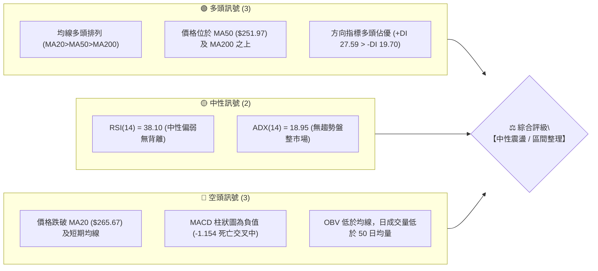
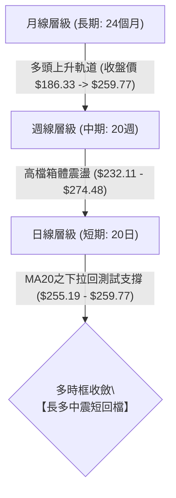
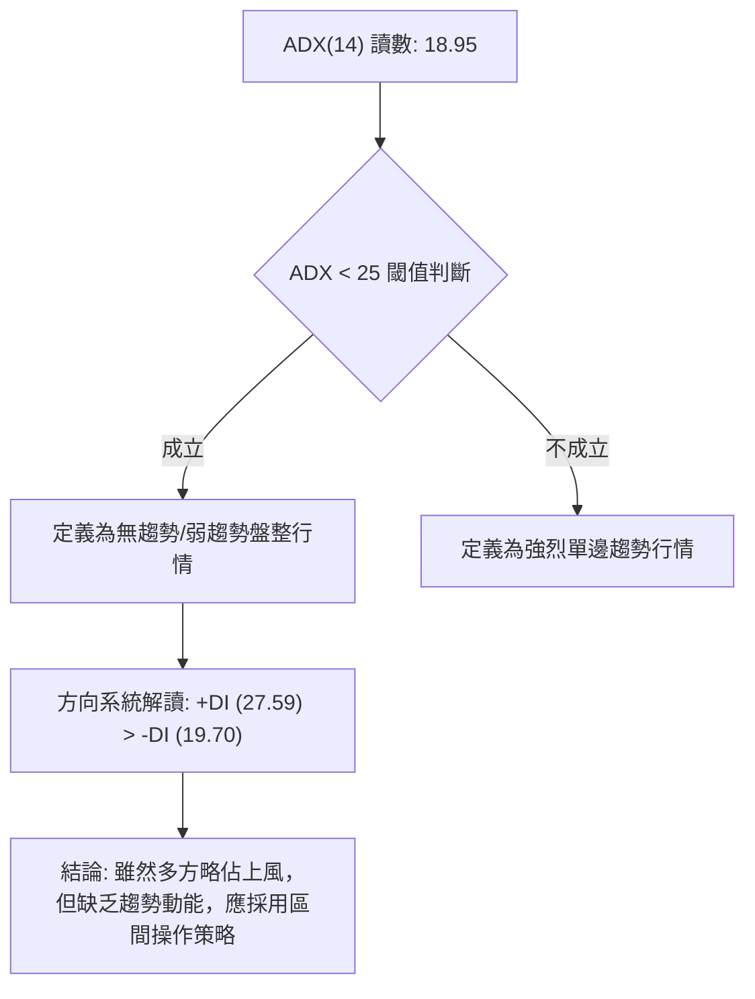
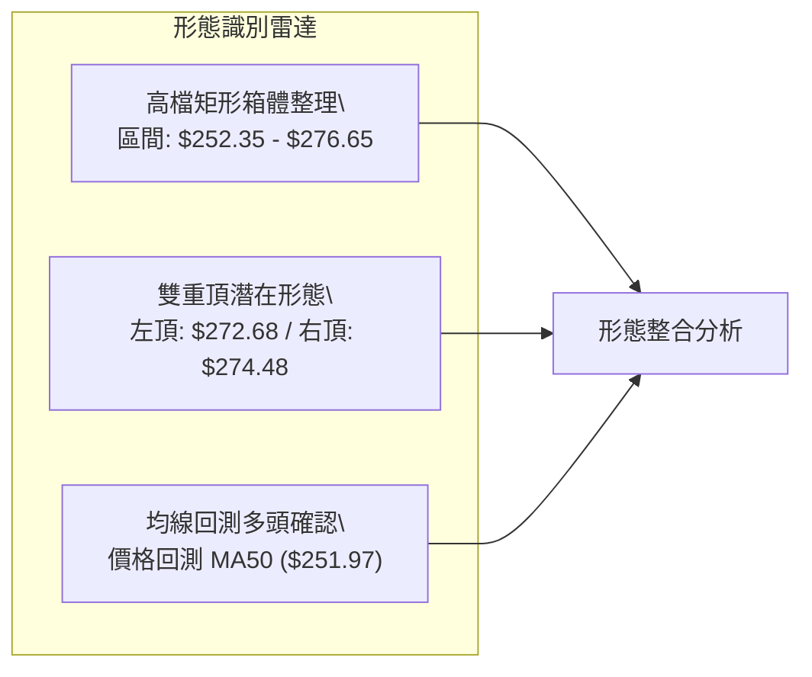
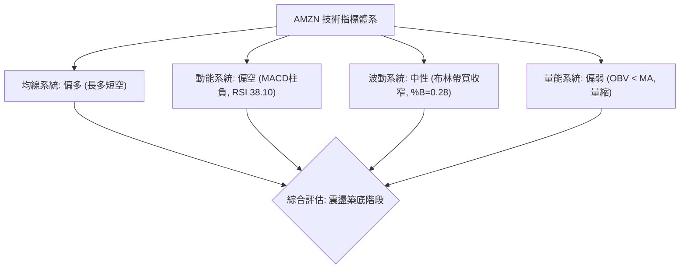
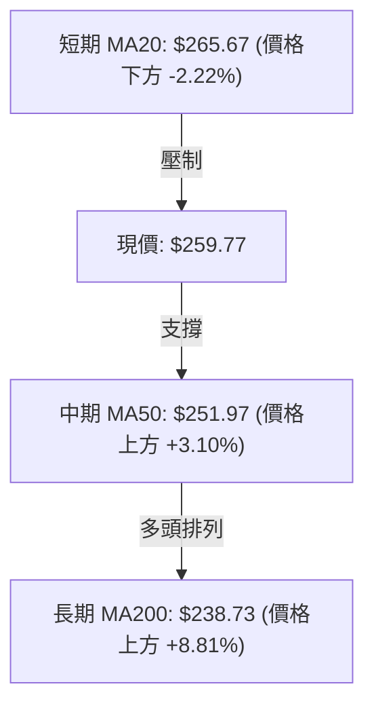
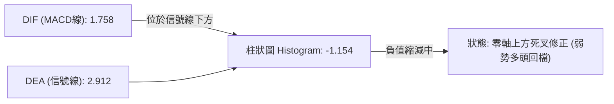
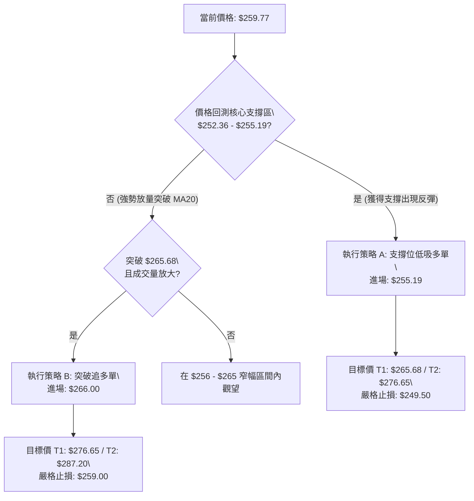
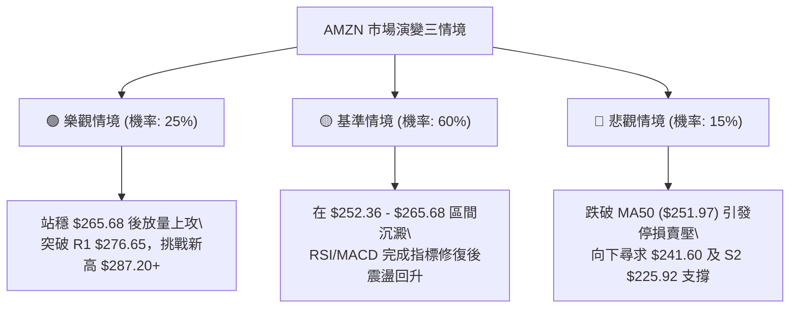

# AMZN 技術分析報告

> **報告日期**：2026-09-01 ｜ **語言**：繁體中文 ｜ **數據來源**：Yahoo Finance ｜ **當前價格**：$259.77

---

## 目錄

| 章節 | 內容 |
|------|------|
| [1. 技術面概覽](#1-技術面概覽) | 訊號儀表板、核心指標、評分卡 |
| [2. 趨勢分析](#2-趨勢分析) | 多時框趨勢、長中短期走勢、ADX解讀 |
| [3. 圖表形態分析](#3-圖表形態分析) | 形態識別、K線組合、目標價推算 |
| [4. 支撐與阻力](#4-支撐與阻力) | 關鍵價位、斐波那契回調結構 |
| [5. 技術指標深度解讀](#5-技術指標深度解讀) | MA/RSI/MACD/布林通道/量能分析 |
| [6. 動能與波動率](#6-動能與波動率) | 動能象限、ATR波動分析、Beta風險 |
| [7. 多時框架總結](#7-多時框架總結) | 時框架評分矩陣與收斂結論 |
| [8. 交易策略建議](#8-交易策略建議) | 區間震盪策略、價格階梯、風報比 |
| [9. 風險提示與監控](#9-風險提示與監控) | 監控指標Checklist、風險情境模型 |
| [10. 報告總結](#-報告總結) | 核心總結與策略彙整 |

---

## 1. 技術面概覽

### 🎯 技術訊號儀表板



### 📊 核心指標速覽表

| 指標類別 | 指標名稱 | 當前數值 | 訊號 | 解讀 |
|----------|----------|----------|------|------|
| **價格** | 當前價格 | $259.77 | 🟡 | 位於52週區間 69.9% 水平，短線處於自高點拉回後的震盪修正期 |
| **均線** | MA20 | $265.67 | 🔴 | 價格低於 MA20（-2.22%），短線由空方主導回檔動能 |
| **均線** | MA50 | $251.97 | 🟢 | 價格高於 MA50（+3.10%），中期多頭結構尚未遭到破壞 |
| **均線** | MA200 | $238.73 | 🟢 | 價格高於長期生命線 MA200（+8.81%），長線多頭基底穩固 |
| **動能** | RSI(14) | 38.10 | 🟡 | 落入 30–70 中性區間下沿，動能偏弱但尚未觸及超賣（<30） |
| **動能** | MACD (12,26,9) | 1.758 / Sig: 2.912 | 🔴 | 柱狀圖為 -1.154，處於死叉修正波段，空方動能釋放中 |
| **波動** | ATR(14) | $5.93 (2.28%) | 🟡 | 波動度處於中等收斂狀態，提示盤整蓄勢特徵 |

### 🏆 技術評分卡

```
╔══════════════════════════════════════════════════════════════╗
║              技術評分卡 — AMZN (2026-09-01)                  ║
╠══════════════════════════════════════════════════════════════╣
║ 趨勢強度 (ADX=18.95)   █████░░░░░░░░░░░░░░░  28/100  🔴 弱趨勢║
║ 動能指標 (RSI/MACD)   ████████░░░░░░░░░░░░  40/100  🔴 偏空修正║
║ 支撐穩定度 (S1/MA50)  ██████████████░░░░░░  72/100  🟢 支撐密集║
║ 成交量配合 (OBV<MA)   ████████░░░░░░░░░░░░  42/100  🔴 量能退潮║
║ 形態完整度 (箱體整理) ████████████░░░░░░░░  60/100  🟡 區間收斂║
║ 均線長線結構 (排列)   ████████████████░░░░  80/100  🟢 多頭排列║
╠══════════════════════════════════════════════════════════════╣
║ 綜合技術評分           ███████████░░░░░░░░░  54/100  🟡 中性震盪║
╚══════════════════════════════════════════════════════════════╝
```

---

## 2. 趨勢分析

### 🌐 多時框趨勢分析



### 📈 長期趨勢 — 12個月走勢圖（Unicode）

```
AMZN 月線走勢圖（過去12個月：2025-09 至 2026-08）
價格軸 ($)
$275 ┤                                  ●(07: $271.58)
$270 ┤                            ●(05)     ●(08: $259.77 現價)
$265 ┤                      ●(04: $265.06)
$245 ┤            ●(10: $244.22)              ●(06: $238.34)
$235 ┤                ●(11) ●(01: $239.30)
$230 ┤                    ●(12: $230.82)
$220 ┤●(09: $219.57)
$210 ┤                            ●(02: $210.00)
$205 ┤                                ●(03: $208.27 低點)
     └────────────────────────────────────────────────────────
       09  10  11  12  01  02  03  04  05  06  07  08 (月份)
```

**走勢特徵分析表格**：

| 階段週期 | 時間區間 | 起始/結束價 | 區間漲跌幅 | 走勢特徵與結構解讀 |
|----------|----------|-------------|------------|-------------------|
| **第一階段：高檔震盪** | 2025-09 ~ 2026-01 | $219.57 → $239.30 | +8.99% | 沿 $230–$244 區間整理，長線多頭打底 |
| **第二階段：深幅回洗** | 2026-01 ~ 2026-03 | $239.30 → $208.27 | -12.97% | 接觸近12個月波段低點 $208.27，測試底部支撐 |
| **第三階段：主升突破** | 2026-03 ~ 2026-05 | $208.27 → $270.64 | +29.95% | 強勢V型反轉突破歷史整理區，進入新高估值區 |
| **第四階段：高檔箱體** | 2026-05 ~ 2026-08 | $270.64 → $259.77 | -4.02% | 於 $238–$274 間寬幅震盪，沉澱籌碼 |

### 📊 中期趨勢（週線分析）

```
近期週線壓力與支撐結構示意圖：
$287.20 ──────────────────────────────────────── 52W 歷史極值阻力 (R2)
$276.65 ───┬──────────────────┬───────────────── 近期波段阻力聚類 (R1)
           │ 週線高點 $274.48 │
$265.67 ───┴──────────────────┴───────────────── 布林中軌 / MA20
$259.77 ◄═══════════════════════════════════════ 當前現價收盤位
$255.19 ───┬──────────────────────────────────── 近一年關鍵波段支撐 (S1)
$252.35 ───┴──────────────────────────────────── 布林下軌 / 斐波 38.2% / MA50 ($251.97)
$232.11 ──────────────────────────────────────── 週線強支撐低點聚類 ($232.69 / $232.11)
```

### ⚡ 趨勢強度評估（ADX 解讀）



| 指標變數 | 當前數值 | 參考標準 | 狀態評估 | 交易策略意涵 |
|----------|----------|----------|----------|--------------|
| **ADX(14)** | 18.95 | < 20 弱趨勢; > 25 趨勢確立 | 弱盤整 | 禁止追價單邊趨勢單，應以邊界高拋低吸為主 |
| **+DI(14)** | 27.59 | 高於 -DI 代表多方優勢 | 多方主導 | 逢低回測支撐位時，多方防守意願較強 |
| **-DI(14)** | 19.70 | 低於 +DI 代表空方壓制減弱 | 空方減弱 | 下跌多為獲利了結或洗盤，非崩跌型走勢 |

---

## 3. 圖表形態分析

### 🔍 形態識別系統



**形態信心度與目標價評估表**：

| 形態類別 | 信心度 | 判斷依據（引用數據） | 完成度 | 目標價（附嚴格計算式） |
|----------|--------|----------------------|--------|------------------------|
| **高檔寬幅箱體整理** | 78% | 價格多次受阻於 R1 $276.65，並在 S1 $255.19 及斐波 38.2% ($252.36) 獲得支撐 | 85% | 向上突破：箱頂 $276.65 + 箱高 ($276.65 - $252.36 = $24.29) = **$300.94**（數據外推，僅供參考）；向下跌破：箱底 $252.36 - 箱高 $24.29 = **$228.07**（接近 S2 $225.92） |
| **潛在雙頂 (Double Top)** | 48% | 2026-05-10 週高點 $272.68 與 2026-08-09 週高點 $274.48 構成雙峰，但頸線尚未有效跌破 | 50% | 頸線為 2026-07-26 低點 $232.11。若跌破：$232.11 - ($274.48 - $232.11 = $42.37) = **$189.74**（信度不足50%，僅供防守警戒） |
| **指標型布林通道震盪** | 85% | ADX 18.95 確認無趨勢，價格在布林下軌 $252.35 至上軌 $278.99 間規律震盪 | 90% | 均值回歸目標價為中軌 MA20 **$265.67**，進一步阻力為上軌 **$278.99** |

### 🕯️ 重要K線形態分析

| 週/月份週期 | 收盤價 | K線形態特徵 | 技術面解讀 | 訊號 |
|-------------|--------|-------------|------------|------|
| **2026-08-02 (週)** | $271.58 | 大陽線實體放量突破 | 放量 355.37M 股長紅突破整理，展現強大買盤承接力道 | 🟢 強多 |
| **2026-08-09 (週)** | $274.48 | 高檔長上影線流星線 | 上攻 52W 高點 $287.20 未果，獲利賣壓出籠，MACD柱高檔見頂 | 🔴 轉弱 |
| **2026-08-23 (週)** | $258.63 | 中陰線跌破短期均線 | 量能萎縮下跌，RSI 快速回落至 24.5 超賣邊緣，呈現清洗浮額特徵 | 🟡 修正 |
| **2026-08-30 (週)** | $266.43 | 帶下影線小陽線 | 逢低買盤於 S1 $255.19 前介入，回測 MA20 形成技術性抵抗 | 🟢 止跌 |
| **2026-09-06 (即時)**| $259.77 | 窄幅十字震盪星 | 成交量急劇萎縮至 45.42M，市場觀望氣氛濃厚，處於方向選擇前夕 | 🟡 觀望 |

### 📉 ASCII 走勢形態示意圖

```
高檔箱體震盪形態示意圖 (2026-05 至 2026-09)
$287.20 ──────────────────────────────── 52W 最高點
               頂1: $272.68    頂2: $274.48
$276.65 ─────────╭──╮────────────╭──╮─── 箱頂阻力區 (R1)
                │  │            │  │
$265.67 ────────┼──┼───╭──╮────┼──┼─── 箱體中軸 (MA20)
                │  │   │  │    │  │ 
$259.77 ════════╪══╪═══╪══╪════╪══╪═══ 現價位置 ($259.77)
                │  │   │  │    │  │
$252.36 ────────┴──┼───┴──┴────┼──┴─── 箱底支撐區 (MA50 / S1)
                   ╰────────────╯
                   頸線低點: $232.11
```

---

## 4. 支撐與阻力

### 🗺️ 關鍵價位分布圖（Unicode）

```
AMZN 價位結構分布圖
═════════════════════════════════════════════════════════════════
$287.20 ║██████████████████████████████║ 強阻力 R2 (52W 歷史高點 / 斐波 0.0%)
$276.65 ║████████████████████░░░░░░░░░░║ 關鍵阻力 R1 (波段高點聚類)
$265.68 ║████████████░░░░░░░░░░░░░░░░░░║ 短線阻力 (MA20 / 斐波 23.6%)
$259.77 ╠══════════════════════════════╣ ◄ 當前價格 ($259.77)
$255.19 ║▓▓▓▓▓▓▓▓▓▓▓▓▓▓▓▓▓▓▓▓░░░░░░░░░░║ 近期關鍵支撐 S1 (波段低點聚類)
$252.36 ║▓▓▓▓▓▓▓▓▓▓▓▓▓▓▓▓▓▓▓▓▓▓▓▓▓▓░░░░║ 核心防守支撐 (MA50 / 布林下軌 / 斐波 38.2%)
$241.60 ║████████████████░░░░░░░░░░░░░░║ 中期樞紐支撐 (斐波 50.0%)
$225.92 ║██████████████████████████████║ 強支撐 S2 (波段深度回調支撐)
$220.99 ║██████████████████████████████║ 極限防守支撐 S3
═════════════════════════════════════════════════════════════════
```

### 🚧 阻力位分析表

| 阻力級別 | 價位 | 形成原因 | 突破難度 | 重要性 |
|----------|------|----------|----------|--------|
| **短線阻力** | **$265.68** | MA20 均線位置 + 斐波那契 23.6% 回調重合點 | 中等 🟡 | ★★★☆☆ (短線多空分水嶺) |
| **關鍵阻力 (R1)** | **$276.65** | 近一年波段高點密集聚類區 + 布林上軌 ($278.99) 壓制 | 較高 🔴 | ★★★★☆ (向上突破打開空間的關鍵) |
| **強阻力 (R2)** | **$287.20** | 52週歷史最高點 (52W High) + 斐波 0.0% 極值 | 極高 🔴 | ★★★★★ (歷史天花板壓力) |

### 🛡️ 支撐位分析表

| 支撐級別 | 價位 | 形成原因 | 守住機率 | 重要性 |
|----------|------|----------|----------|--------|
| **關鍵支撐 (S1)** | **$255.19** | 近一年波段低點聚類，距離現價僅 -1.76% | 75% 🟢 | ★★★★☆ (短線第一防守線) |
| **核心支撐 (共振)**| **$252.36** | 斐波 38.2% ($252.36) + MA50 ($251.97) + 布林下軌 ($252.35) 三重共振 | 85% 🟢 | ★★★★★ (中期多頭生命線) |
| **強支撐 (S2)** | **$225.92** | 近一年大型箱體底部波段低點聚類 | 90% 🟢 | ★★★★☆ (深幅回調強支撐) |
| **極限支撐 (S3)** | **$220.99** | 2025-09起漲點低點聚類區 | 95% 🟢 | ★★★★★ (長線趨勢反轉底線) |

### 📐 斐波那契回調位分析

依據 52 週極值區間（低點 **$196.00** 至 高點 **$287.20**，總振幅 $91.20）計算：

```
0.0%  (52W High) ────────────────────────── $287.20
23.6% 回調位     ────────────────────────── $265.68 ─── [阻力區間頂]
當前價格         ══════════════════════════ $259.77 ─── [位於 23.6% 與 38.2% 之間]
38.2% 回調位     ────────────────────────── $252.36 ─── [核心支撐位]
50.0% 均衡位     ────────────────────────── $241.60
61.8% 黃金分割   ────────────────────────── $230.84
78.6% 極限回調   ────────────────────────── $215.52
100.0%(52W Low)  ────────────────────────── $196.00
```

- **結構深度解讀**：現價 $259.77 處於 **23.6% ($265.68)** 與 **38.2% ($252.36)** 的狹幅區間內。在經典技術分析中，回調守在 38.2% 之上的走勢屬於「強勢回檔整理」。若能在此區間築底成功，後續挑戰新高的機率極大；一旦跌破 38.2%，行情將向下尋求 50.0% ($241.60) 及 61.8% ($230.84) 支撐。

---

## 5. 技術指標深度解讀

### 🎛️ 指標訊號總覽



### 📈 移動平均線排列分析



| 均線週期 | 數值 | 價格相對位置 | 偏離度 (%) | 均線斜率/走勢特徵 | 訊號解讀 |
|----------|------|--------------|------------|-------------------|----------|
| **MA 5** | $260.76 | 價格在均線下方 | -0.38% | 短線快速下彎後趨平 | 🔴 短線空方壓制 |
| **MA 10** | $260.99 | 價格在均線下方 | -0.47% | 走平微跌，形成蓋頭壓力 | 🔴 短期反彈阻力 |
| **MA 20** | $265.67 | 價格在均線下方 | -2.22% | 高檔下彎，為布林中軌 | 🔴 中短線空方主導 |
| **MA 50** | $251.97 | 價格在均線上方法 | +3.10% | 向上運行，多頭主要防線 | 🟢 中期多頭支撐 |
| **MA 60** | $250.43 | 價格在均線上方 | +3.73% | 穩定向上，支撐力道強 | 🟢 季線支撐確立 |
| **MA 120** | $247.06 | 價格在均線上方 | +5.14% | 持續走多，半年線支撐 | 🟢 長期趨勢向上 |
| **MA 200** | $238.73 | 價格在均線上方 | +8.81% | 穩步上行，長線牛熊分水嶺 | 🟢 牛市結構完好 |
| **MA 240** | $236.82 | 價格在均線上方 | +9.69% | 年線上揚，多頭底氣充足 | 🟢 超長多頭趨勢 |

### 📉 RSI(14) 分析

```
RSI(14) 刻度表：當前讀數 38.10
0 ──────────── 30 ─────── 38.10 ──────────────── 70 ─────────── 100
[   超賣區   ] [   中性偏弱   ▲      中性偏強   ] [   超買區   ]
進度條：███████████████░░░░░░░░░░░░░░░░░░░░░░░░ 38.10%
```

- **超買超賣判定**：RSI(14) 自 2026-08-16 的 66.4 高點連續回落至 38.10，脫離超買區並接近超賣警戒線（30），顯示短線空頭拋壓已大部分釋放，進入拋壓耗盡區。
- **背離分析判斷**：
  - **頂背離檢查**：2026-08-09 價格創出波段次高 $274.48 時，週線 RSI 為 62.9，低於 2026-04-26 的 94.6，存在中期動能減弱現象；但近 3 週價格下跌伴隨 RSI 快速回調，屬於正常技術修正。
  - **底背離檢查**：目前 RSI 與價格同步下行，未出現價格破底而 RSI 抬高的底背離結構。**結論：無底背離，為順勢回檔指標釋放。**

### 📊 MACD(12/26/9) 訊號解讀



- **MACD 指標數據**：DIF = **1.758**，DEA = **2.912**，柱狀圖 = **-1.154**。
- **深入剖析**：雖然柱狀圖為負值，確認短線處於空頭修正波段，但 DIF 與 DEA 雙線仍牢牢運行在**零軸（0.00）之上**。這表明目前的下跌並非熊市單邊下跌，而是「牛市上升途中的次級折返走勢」。

### 📦 布林通道分析

```
AMZN 布林通道 (BB 20, 2) 結構圖
$278.99 ────────────────────────────────────────── BB 上軌
        │
$265.67 ────────────────────────────────────────── BB 中軌 (MA20)
        │ 
$259.77 ══════════════════════════════════════════ 當前現價 (%B = 0.28)
        │
$252.35 ────────────────────────────────────────── BB 下軌
```

- **通道帶寬與位置**：BB 上軌為 **$278.99**，中軌為 **$265.67**，下軌為 **$252.35**。
- **%B 指標解讀**：當前 %B 為 **0.28**，價格位於中軌至下軌的下半區間（靠近下軌），具備均值回歸向中軌反彈的技術需求。下軌 $252.35 與 MA50 ($251.97) 及斐波 38.2% ($252.36) 高度吻合，構成鋼鐵防線。

### 💹 成交量分析（量價配合度）

```
成交量比較柱狀圖：
最新日成交量  [ 45.42M ]  ███████████░░░░░░░░░░░░░░ (量比: 1.26x vs 20MA)
20日平均量    [ 35.96M ]  █████████░░░░░░░░░░░░░░░░
50日平均量    [ 49.85M ]  ████████████░░░░░░░░░░░░░
```

- **量價關係**：最新日成交量 45.42M 較 20 日均量放大（1.26x），但顯著低於 50 日均量（49.85M），且遠低於 2026-06-28 的歷史放量週（525.21M）。
- **OBV 能量潮解讀**：OBV 低於其移動平均線，提示量能動能呈現弱勢退潮，法人機構大資金目前並無激進追價意願，更多以逢低掛單吸籌為主，確認當前市場為典型的「量縮整理蓄勢」格局。

---

## 6. 動能與波動率

### ⚡ 動能評估四象限

| 象限區間 | 動能強度 (RSI/MACD) | 波動率水準 (ATR/帶寬) | 當前狀態判定 | 交易策略指導 |
|----------|---------------------|-----------------------|--------------|--------------|
| **第一象限 (Q1)** | 強動能 (RSI>60, MACD>0) | 低波動 (ATR<2%) | — | 順勢突破追買，主升段持股 |
| **第二象限 (Q2)** | 弱動能 (RSI<45, MACD柱<0) | 低/中波動 (ATR=2.28%) | **✓ 當前 AMZN 處於此象限** | **區間低吸高拋，嚴設止損，耐心等待收斂** |
| **第三象限 (Q3)** | 強動能 (多空劇烈博弈) | 高波動 (ATR>3.5%) | — | 突破單操作，擴大止損區間 |
| **第四象限 (Q4)** | 弱動能 (單邊陰跌無承接) | 高波動 (恐慌拋售) | — | 空手觀望，嚴禁盲目抄底 |

### 📊 ATR 波動率分析

```
ATR(14) 統計與止損倍數階梯：
當前 ATR(14) 數值: $5.93 (佔股價 2.28%)
1.0x ATR 止損距離: $5.93  ─── 價格對應: $253.84 (超短線日內)
1.5x ATR 止損距離: $8.90  ─── 價格對應: $250.87 (波段防守，低於 MA50)
2.0x ATR 止損距離: $11.86 ─── 價格對應: $247.91 (中線寬幅防守)
```

- **ATR 意涵**：日均震盪幅度為 $5.93，表明日內正常雜訊在 ±$6.00 左右。建立任何波段多頭倉位時，止損點應至少設在進場價下方 **1.5x ATR（約 $8.90）** 之外，以避免被正常市場隨機波動震盪洗出場。

### 📐 Beta 與市場相關性

- **Beta 係數**：**1.454**。
- **特徵解讀**：AMZN 具備顯著的高彈性特質（高於標普 500 指數 45.4% 的波動彈性）。當大盤納斯達克 100 指數反彈時，AMZN 將展現更強的動能爆發力；反之，若大盤系統性下挫，其回調幅度亦將大於指數，需配合大盤環境控制整體倉位曝險。

---

## 7. 多時框架總結

### 📋 時框架評分表

| 時框架 | 趨勢方向 | 動能狀態 | 均線排列 | 形態結構 | 綜合評分 | 戰術建議 |
|--------|----------|----------|----------|----------|----------|----------|
| **月線 (長期)** | 🟢 多頭上行 | 🟢 多方掌控 | 🟢 完全多頭排列 | 上升通道延伸 | **85/100** | 長線堅定持股，逢回買進 |
| **週線 (中期)** | 🟡 高檔震盪 | 🟡 柱狀收斂 | 🟢 位於中長期MA上方 | 寬幅矩形箱體 | **62/100** | 箱體邊界操作，不破底續抱 |
| **日線 (短期)** | 🔴 弱勢回檔 | 🔴 MACD死叉/RSI低 | 🔴 跌破短期均線 | 測試下軌支撐 | **42/100** | 等待止跌訊號，不盲目追空 |

### 🔲 綜合訊號矩陣

```
時框維度      趨勢訊號    均線排列    動能指標    成交量能    綜合判定
─────────────────────────────────────────────────────────────────
日線 (短期)    🔴 偏空     🔴 空頭壓制  🔴 弱勢修正  🔴 量能退潮  🔴 短期回檔
週線 (中期)    🟡 震盪     🟢 多頭排列  🟡 偏弱修正  🟡 均量水準  🟡 區間蓄勢
月線 (長期)    🟢 強多     🟢 完美多頭  🟢 長多充沛  🟢 多方主導  🟢 長多不變
─────────────────────────────────────────────────────────────────
綜合收斂權重    長多中震短回檔 ─── 以【中長期多頭背景下的日線區間操作】為核心依據
```

### ⚖️ 多時框收斂結論

> **依據「嚴格要求 14」多時框收斂規則：**
> 1. **趨勢強度定性**：當前 ADX(14) = **18.95 < 25**，市場明確處於**盤整行情**。
> 2. **主導維度收斂**：在 ADX < 25 的盤整環境中，單邊趨勢策略失效，**以日線布林通道上下軌（$252.35 – $278.99）為主要交易區間**。
> 3. **方向性唯一結論**：**【🟡 中性偏多觀望 / 區間下沿逢低佈局】**。長線多頭結構未破（MA50/MA200 完好），短期空頭動能已釋放至 RSI 38.10，價格逼近核心支撐共振區 $252.36–$255.19，主策略鎖定「區間下軌防守型低吸」，嚴禁在下軌附近殺跌做空。

---

## 8. 交易策略建議

### 🗺️ 策略決策流程圖



### 🧭 策略路由

**當前主策略方向 = 【區間多頭低吸 / 均值回歸策略】（綜合評分 54/100，技術位落於布林下軌支撐區）**

### 🎯 價格情境階梯（Price Scenarios）

| 觸發條件 | 第一目標 (T1) | 第二目標 (T2) | 後續延伸 (T3) | 情境技術含義 |
|----------|---------------|---------------|---------------|--------------|
| **向上突破 R1 $276.65** | $287.20 (52W高點) | $300.94 (形態外推) | — | 確立結束中期箱體，開啟全新主升浪 |
| **向上站上 MA20 $265.68** | $276.65 (R1) | $287.20 (R2) | — | 短線轉強，重回布林通道上半區 |
| **守住現價 / S1 $255.19** | $265.68 (MA20) | $276.65 (R1) | — | 於斐波 38.2% 與 23.6% 間維持區間震盪 |
| **有效跌破 S1 $255.19** | $252.36 (MA50/下軌) | $241.60 (斐波50%) | — | 短線跌勢擴大，測試中期多頭生命線 |
| **跌破核心共振 $252.36** | $241.60 (斐波50%) | $225.92 (S2) | $220.99 (S3) | 中期多頭形態破位，轉為深度回檔整理 |

### 📊 情境機率分佈

```
情境機率分佈圖：
區間震盪築底後反彈 (主情境) ── [ 55% ] ██████████████░░░░░░░░░░░░
直接窄幅橫盤整理   (次情境) ── [ 30% ] ████████░░░░░░░░░░░░░░░░
向下破位深度探底   (風險情境) ── [ 15% ] ████░░░░░░░░░░░░░░░░░░░░
```

| 情境分類 | 機率 | 主要依據與技術邏輯 |
|----------|------|--------------------|
| **繼續上行 / 反彈築底** | **55%** | 均線長多排列完好，價格逼近 MA50 ($251.97) 及布林下軌 ($252.35)，RSI 38.10 拋壓衰竭 |
| **區間橫盤震盪** | **30%** | ADX 僅 18.95，市場缺乏方向性動能，量能維持萎縮，大資金處於觀望休整期 |
| **破位回落再探底** | **15%** | MACD 柱狀圖仍為負值 (-1.154)，若大盤系統性走弱，恐引發向 S2 ($225.92) 的補跌 |

### 🟢 主策略詳情

| 策略要素 | 策略 A（左側/支撐低吸型） | 策略 B（右側/突破確認型） |
|----------|---------------------------|---------------------------|
| **策略定位** | 回測支撐位逢低佈局（主推） | 突破布林中軌順勢加碼 |
| **進場條件** | 價格回測 S1 附近獲得技術支撐止跌 | 日K收盤價有效站穩 MA20 / 斐波 23.6% |
| **進場價格** | **$255.19**（或現價 $259.77 分批） | **$266.00**（確認站上 $265.68） |
| **目標價 T1** | **$265.68**（MA20 位置，獲利 +4.11%） | **$276.65**（R1 阻力，獲利 +4.00%） |
| **目標價 T2** | **$276.65**（R1 阻力，獲利 +8.41%） | **$287.20**（52W高點，獲利 +7.97%） |
| **止損價格** | **$249.50**（跌破 MA50 及布林下軌） | **$259.00**（跌回 MA20 之下假突破） |
| **風險空間** | $5.69 (2.23%) | $7.00 (2.63%) |
| **報酬空間 (T2)**| $21.46 (8.41%) | $21.20 (7.97%) |
| **風險報酬比** | **1 : 3.77** 🟢 極佳 | **1 : 3.03** 🟢 優異 |
| **預估成功率** | 65% | 60% |
| **建議倉位** | 15% - 20% | 10% - 15% |

### 🔴 反向風險觸發點（對沖提示）

- **做空/對沖觸發條件**：若日K線以放量實體跌破 **$251.97 (MA50)** 及 **$252.35 (布林下軌)**，且次日未能收復。
- **對沖應對策略**：多頭部位應全面止損或減倉 50% 以上；激進投資人可建立短期對沖空單，向下看至 斐波 50% **$241.60** 及強支撐 S2 **$225.92**。

### ⭐ 整體訊號強度評星

```
╔══════════════════════════════════════════════════════════════╗
║ 做多訊號強度：★★★☆☆  (3.2/5星 — 均線長多支撐，但短線動能偏弱)║
║ 做空訊號強度：★★☆☆☆  (1.8/5星 — 接近強支撐區，做空盈虧比差)║
║ 整體可信度：  ★★★★☆  (4.0/5星 — 價位重合度高，邊界結構清晰)║
╚══════════════════════════════════════════════════════════════╝
```

---

## 9. 風險提示與監控

### ✅ 關鍵監控指標 Checklist

```
╔══════════════════════════════════════════════════════════════╗
║               AMZN 每日交易決策監控清單 (Checklist)           ║
╠══════════════════════════════════════════════════════════════╣
║ [ ] 價格是否守穩核心共振位 $252.36 (MA50 / 斐波 38.2%) ?       ║
║ [ ] MACD 負柱狀圖是否縮短至 -0.50 以上，醞釀金叉 ?             ║
║ [ ] RSI(14) 能否自 38.10 向上突破 50.00 多空中軸線 ?          ║
║ [ ] 日成交量能否放大超越 20 日均量 (35.96M) 展現買盤承接 ?   ║
║ [ ] 方向指標 ADX 是否自 18.95 抬升並伴隨 +DI 擴大領先優勢 ?  ║
║ [ ] 價格能否重新站上 MA20 ($265.67) 扭轉短線空頭排列 ?        ║
╚══════════════════════════════════════════════════════════════╝
```

### ⚠️ 風險場景分析



### 🛡️ 風險管理重要提醒

1. **嚴格執行資金控管**：單筆交易虧損金額切勿超過總交易資本的 **1.5% - 2.0%**。在 ADX < 25 的盤整格局下，切忌使用高槓桿或過度重倉。
2. **警惕假突破與假跌破**：盤整市況中常出現下影線刺破支撐位後迅速拉回的「洗盤」動作，建議以**日K線收盤價**作為有效跌破與否的最終評判標準，避免盤中雜訊干擾。
3. **宏觀與基本面配合**：AMZN 當前本益比 P/E 為 20.88，PEG 為 1.36，營收年增 19.6%，基本面極度扎實（60 位分析師平均目標價達 $327.67），技術面回調提供中長線投資人良好的防守型切入點。

---

## 📋 報告總結

```
╔══════════════════════════════════════════════════════════════╗
║                 AMZN 技術分析報告總結                        ║
╠══════════════════════════════════════════════════════════════╣
║ 報告日期：2026-09-01             當前價格：$259.77          ║
║ 分析評級：⚖️ 【中性偏多 / 區間震盪築底】 (技術評分: 54/100)  ║
╠══════════════════════════════════════════════════════════════╣
║ 關鍵結論：                                                   ║
║ ├─ 長期趨勢：🟢 多頭排列完好 (MA20>MA50>MA200，價格在MA200上)║
║ ├─ 中期趨勢：🟡 高檔寬幅箱體震盪 ($252.36 - $276.65)         ║
║ ├─ 短期趨勢：🔴 弱勢回檔修正 (位於 MA20 下方，MACD 柱狀為負)║
║ ├─ 關鍵支撐：S1 $255.19 ｜ 核心共振支撐 $252.36 (MA50/斐波)  ║
║ ├─ 關鍵阻力：MA20 $265.68 ｜ 關鍵阻力 R1 $276.65 ｜ R2 $287.2║
║ └─ 法人共識：評級 strong_buy ｜ 分析師平均目標價 $327.67     ║
╠══════════════════════════════════════════════════════════════╣
║ 最優策略組合：                                               ║
║ 1. 🥇 最佳機會：於 $255.19 - $259.77 區間分批佈局多單，      ║
║                 止損 $249.50，目標 T1 $265.68，T2 $276.65   ║
║                 (風險報酬比 1 : 3.77)                        ║
║ 2. 🥈 次選機會：突破 $265.68 並站穩後右側追多，             ║
║                 止損 $259.00，目標 T1 $276.65，T2 $287.20   ║
║                 (風險報酬比 1 : 3.03)                        ║
║ 3. 🥉 保守選擇：空手觀望，等待日線 MACD 零軸上金叉後再行進場║
╚══════════════════════════════════════════════════════════════╝
```

---

> ⚠️ **免責聲明**：本報告為技術分析研究，所有數據及估算均基於歷史價格與客觀技術指標運算。本報告**僅供研究與學術參考**，**不構成任何投資建議**。投資人應獨立判斷並自負投資風險。

---

*報告生成時間：2026-09-01 ｜ 數據來源：Yahoo Finance ｜ 分析框架：多時框架量化技術分析*