# AMZN 技術分析報告

> **報告日期**：2026-09-02 ｜ **語言**：繁體中文 ｜ **數據來源**：Yahoo Finance ｜ **當前價格**：$254.92

---

## 目錄

| 章節 | 內容 |
|------|------|
| [1. 技術面概覽](#1-技術面概覽) | 訊號儀表板、核心指標、評分卡 |
| [2. 趨勢分析](#2-趨勢分析) | 多時框趨勢、長中短期走勢、ADX解讀 |
| [3. 圖表形態分析](#3-圖表形態分析) | 形態識別、信心度評估、K線組合 |
| [4. 支撐與阻力](#4-支撐與阻力) | 關鍵價位分佈、斐波那契回調結構 |
| [5. 技術指標深度解讀](#5-技術指標深度解讀) | 均線系統、RSI、MACD、布林通道、量價 |
| [6. 動能與波動率](#6-動能與波動率) | 動能四象限、ATR 波動率、Beta 分析 |
| [7. 多時框架總結](#7-多時框架總結) | 時框架矩陣、多時框收斂結論 |
| [8. 交易策略建議](#8-交易策略建議) | 策略路由、情境階梯、主策略詳解 |
| [9. 風險提示與監控](#9-風險提示與監控) | 關鍵監控清單、風險場景樹、風控建議 |
| [10. 報告總結](#10-報告總結) | 核心總結儀表板與評級結論 |

---

## 1. 技術面概覽

### 🎯 技術訊號儀表板

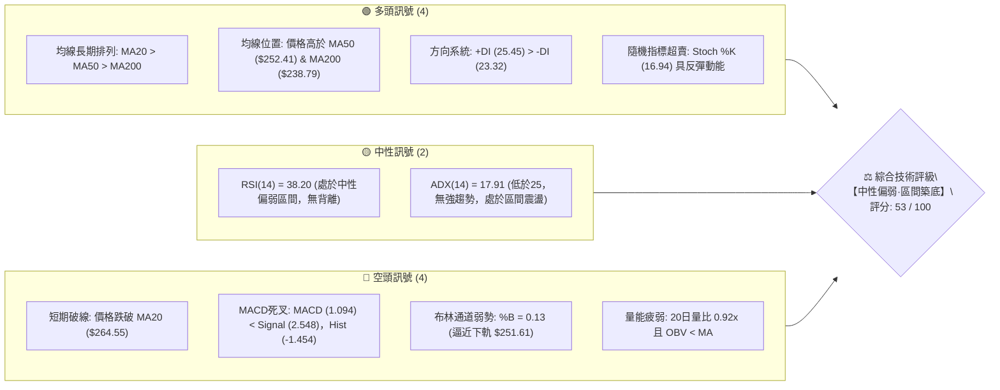

---

### 📊 核心指標速覽表

| 指標類別 | 指標名稱 | 當前數值 | 訊號 | 解讀與技術意涵 |
|:---|:---|:---|:---:|:---|
| **價格** | 當前收盤價 | **$254.92** | 🟡 | 位於52週區間 64.6% 位置，處於高位回撤後的防守階段 |
| **均線系統** | MA20 (短線) | **$264.55** | 🔴 | 價格低於 MA20（-3.64%），短線處於均線壓制下行波段 |
| **均線系統** | MA50 (中線) | **$252.41** | 🟢 | 價格高於 MA50（+1.00%），中期多頭防線尚未跌破 |
| **均線系統** | MA200 (長線) | **$238.79** | 🟢 | 價格顯著高於 MA200（+6.75%），長期牛市基調穩固 |
| **動能指標** | RSI(14) | **38.20** | 🟡 | 數值落於 30-40 弱勢中性區，無頂底背離，下行動能減速 |
| **動能指標** | MACD 柱狀圖 | **-1.454** | 🔴 | 柱狀體維持負值，DIF 與 DEA 處於死叉修正階段 |
| **擺動指標** | Stochastic (%K/%D) | **16.94 / 30.20** | 🟢 | %K 進入極度超賣區（<20），短線存在技術性超賣反彈需求 |
| **趨勢強度** | ADX(14) | **17.91** | 🟡 | 數值 < 25，確認當前非單邊趨勢行情，屬典型寬幅震盪 |
| **通道指標** | Bollinger %B | **0.13** | 🟡 | 逼近下軌 $251.61，通道開口中性，下軌具備第一道買盤支撐 |
| **量能指標** | OBV 趨勢 | **OBV < MA** | 🔴 | 成交量比 0.92x，量能未能放大確認反轉，維持量縮整理 |
| **波動率** | ATR(14) | **$6.04** | 🟡 | 佔股價 2.37%，每日波幅適中，有利於設定精確止損區間 |

---

### 🏆 技術評分卡

```
╔══════════════════════════════════════════════════════════════════╗
║              AMZN 技術面綜合評分卡 (2026-09-02)                  ║
╠══════════════════════════════════════════════════════════════════╣
║ 趨勢強度 (ADX/DI)   ███████░░░░░░░░░░░░░  38/100 🟡 (弱勢震盪)  ║
║ 動能指標 (RSI/MACD) ████████░░░░░░░░░░░░  42/100 🔴 (偏弱修正)  ║
║ 支撐穩定度 (Fib/S1) ███████████████░░░░░  75/100 🟢 (MA50強撐)  ║
║ 成交量配合 (OBV/Vol)████████░░░░░░░░░░░░  40/100 🔴 (量能不足)  ║
║ 形態完整度 (Channel)████████████░░░░░░░░  60/100 🟡 (箱體結構)  ║
║ 均線排列 (MA System)██████████████░░░░░░  68/100 🟢 (長多短空)  ║
╠══════════════════════════════════════════════════════════════════╣
║ 綜合技術評分        ███████████░░░░░░░░░  53/100 🟡 【中性觀望】 ║
║ 核心結論：長多結構未變，短線受阻於MA20，緊扣布林下軌/MA50支撐防守║
╚══════════════════════════════════════════════════════════════════╝
```

---

## 2. 趨勢分析

### 🌐 多時框趨勢分析

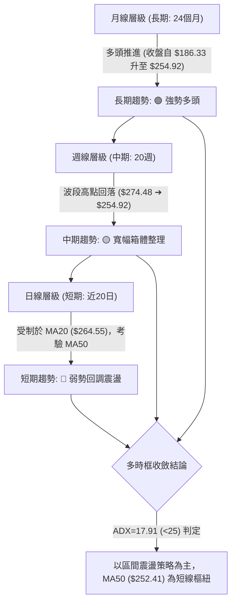

---

### 📈 長期趨勢 — 12個月走勢圖（Unicode）

```
AMZN 月線收盤價走勢圖（2025-09 至 2026-09）
價格 ($)
$275 ┤                                          ● 271.58
$270 ┤                                  ● 270.64    │
$265 ┤                              ● 265.06        │   ● 259.77
$255 ┤                                              │       ● 254.92 (現價)
$245 ┤          ● 244.22                            │
$235 ┤              ● 233.22    ● 239.30            ● 238.34
$230 ┤                  ● 230.82    │
$220 ┤  ● 219.57                    │
$210 ┤                              ● 210.00
$205 ┤                                  ● 208.27 (年度低點區)
     └────────────────────────────────────────────────────────────
        09  10  11  12  01  02  03  04  05  06  07  08  09 (月份)
       '25 '25 '25 '25 '26 '26 '26 '26 '26 '26 '26 '26 '26
```

#### 走勢特徵階段分析

| 階段區間 | 起止價格 | 漲跌幅 | 趨勢特徵與量價解讀 |
|:---|:---|:---:|:---|
| **第一階段：高位築頂回落**<br>(2025-09 ~ 2026-03) | $219.57 ➔ $244.22 ➔ $208.27 | -5.15% | 衝高至 $244.22 後遭遇拋壓，連續三個月回調至 $208.27 確立底部支撐。 |
| **第二階段：主升浪突破**<br>(2026-03 ~ 2026-05) | $208.27 ➔ $270.64 | **+29.95%** | 帶量長陽突破，創波段歷史新高，均線全面呈現多頭發散。 |
| **第三階段：高位劇烈洗盤**<br>(2026-05 ~ 2026-07) | $270.64 ➔ $238.34 ➔ $271.58 | +0.35% | 六月急速回踩 $238.34（回測MA200區域）後，七月強勢收復至 $271.58。 |
| **第四階段：次高點受阻修正**<br>(2026-07 ~ 2026-09) | $271.58 ➔ $254.92 | -6.13% | 於阻力區 $276.65 下方受阻，回測 MA50 與布林下軌支撐。 |

---

### 📊 中期趨勢（週線分析）

從近 20 週數據觀察，AMZN 自 2026-08-09 觸及週收盤高點 $274.48 後，呈現「連續 4 週量縮陰跌」走勢。週線 RSI 自高位 62.9 快速降至 38.2，週 MACD 柱狀圖由正轉負（+4.090 ➔ -1.454），確認中期進入修正波。

```
中期週線價格波段結構：
$276.65 阻力位 R2 ───────────────┬─ 08/09 週收盤 $274.48 (波段頂部)
                                │
$265.68 (Fib 23.6%) ───────────┼─ 08/30 反彈高點 $266.43
                                │
$254.92 (當前現價) ────────────┼─ 現處位置 (考驗 MA50 / Fib 38.2%)
                                │
$251.61 (布林下軌) / $252.36 ──┴─ 短期關鍵支撐帶 (Fib 38.2% + MA50)
```

---

### ⚡ 趨勢強度評估（ADX 解讀）

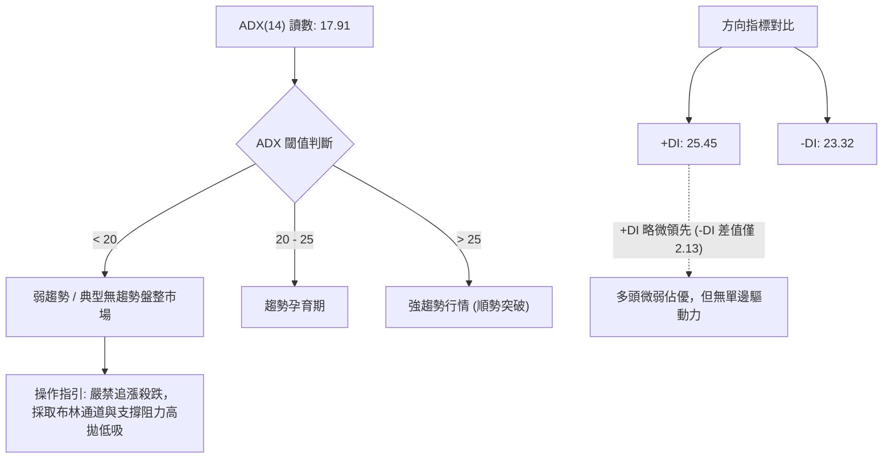

| 指標 | 數值 | 狀態判定 | 交易意涵 |
|:---|:---:|:---:|:---|
| **ADX(14)** | **17.91** | 弱趨勢/盤整 | 趨勢動能極弱，價格將受限於上下軌區間內震盪。 |
| **+DI** | **25.45** | 多方進攻 | 買盤力道維持基本盤，但缺乏持續擴張跡象。 |
| **-DI** | **23.32** | 空方防守 | 空方力道溫和上升，尚未形成破位性殺跌。 |
| **DI 差值** | **+2.13** | 均衡膠著 | 多空勢均力敵，市場等待新的催化劑指引方向。 |

---

## 3. 圖表形態分析

### 🔍 形態識別系統

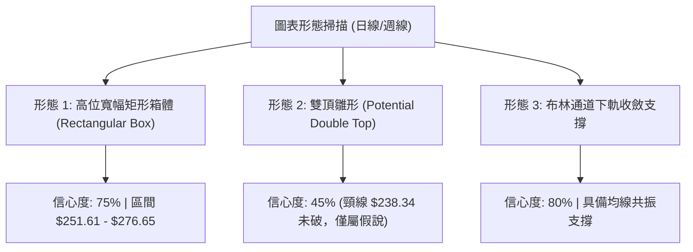

#### 形態識別與信心度評估表

| 形態名稱 | 信心度 | 判斷依據（引用數據） | 完成度 | 形態量化目標價（附計算式） |
|:---|:---:|:---|:---:|:---|
| **高位箱體整理**<br>(Trading Range) | **75%** | 上軌阻力受阻於 R2 $276.65（2026-05及07高點），下軌獲得 MA50 $252.41 與布林下軌 $251.61 支撐。 | **85%** | 箱體高度 = $276.65 - $251.61 = $25.04。<br>若向上突破 R2：$276.65 + $25.04 = **$301.69**<br>若跌破下軌：$251.61 - $25.04 = **$226.57** (接近 S1 $225.92) |
| **雙重頂雛形**<br>(Double Top Hypo.) | **40%** | 第一頂 $270.64 (2026-05)，第二頂 $271.58 (2026-07)。但由於頸線低點 $238.34 距離甚遠且 MA200 向上支撐，尚未確立。 | **35%** | *訊號不足，依規則 15 不予採納為主要交易依據，僅列為風險提示。* |
| **均線動態支撐形態**<br>(MA Confluence) | **85%** | MA50 ($252.41) 與 Fib 38.2% ($252.36) 形成多重共振支撐帶，吻合布林下軌 $251.61。 | **90%** | 反彈第一目標為中軌 MA20 = **$264.55**；<br>反彈第二目標為阻力 R2 = **$276.65**。 |

---

### 🕯️ 重要 K 線形態分析

| 週期/月份 | 收盤價 | K 線組合形態 | 技術面解讀 | 多空訊號 |
|:---|:---:|:---|:---|:---:|
| **2026-07-26 週** | $232.11 | **長下影探底錘頭線** | 測試半年低點後獲強勁買盤介入，確立 $230 區域為強買盤區。 | 🟢 看多 |
| **2026-08-02 週** | $271.58 | **大陽線突破包覆** | 成交量放大至 3.55 億股，強力收復失地，多頭反攻確立。 | 🟢 看多 |
| **2026-08-09 週** | $274.48 | **高位十字星/流星線** | 衝高至阻力 R2 附近受阻回落，MACD 柱狀見頂，顯示高檔獲利了結。 | 🔴 看空 |
| **2026-08-23 週** | $258.63 | **連續中陰回撤** | 跌破短期均線 MA5/MA10，空方掌控短線定價權。 | 🔴 看空 |
| **2026-09-06 (即時)** | $254.92 | **縮量下影線測試棒** | 成交量急劇縮減（7750萬股），於 MA50 前呈現拋壓竭盡特徵。 | 🟡 中性築底 |

---

### 📉 ASCII 走勢形態示意圖

```
AMZN 日線/週線 箱體震盪與共振支撐結構圖
═════════════════════════════════════════════════════════════════════
$276.65 ──┬─────────────────● (08/09 高點 $274.48) ──── 箱體上軌 (R2)
          │                / \
$264.55 ──┼───────────────/───\─────● (反彈受阻點) ───── 布林中軌 (MA20)
          │  ● (07月高點) /     \   /
$254.92 ──┼───\──────────/───────\─/ ◄ 現價 $254.92 (回測下軌區)
          │    \        /         ▼
$251.61 ──┴─────●──────/─────────────────────────────── 布林下軌 / MA50 ($252.41)
            (07/26 低點 $232.11)                       / Fib 38.2% ($252.36)
═════════════════════════════════════════════════════════════════════
```

---

## 4. 支撐與阻力

### 🗺️ 關鍵價位分布圖（Unicode）

```
AMZN 價位結構分布圖
═══════════════════════════════════════════════════════════════════
$287.20 ║██████████████████████████████║ 強阻力 R3 / 52週最高點 (0.0% Fib)
$276.65 ║████████████████████          ║ 關鍵阻力 R2 / 近一年波段高點聚類
$265.68 ║██████████████                ║ Fib 23.6% 回調位 / 密集成交區
$258.34 ║██████████                    ║ 短線阻力 R1 (+1.34%)
$254.92 ╠══════════════════════════════╣ ◄ 當前收盤價 ($254.92)
$252.36 ║▓▓▓▓▓▓▓▓▓▓▓▓▓▓▓▓▓▓▓▓          ║ 核心共振支撐帶 (Fib 38.2% + MA50 $252.41)
$241.60 ║▓▓▓▓▓▓▓▓▓▓▓▓▓▓                ║ Fib 50.0% 中樞平衡位 / MA120 ($247.41)
$225.92 ║████████████████████          ║ 強支撐 S1 (-11.38%) / 近一年波段低點
$220.99 ║██████████████████████        ║ 次級強支撐 S2 (-13.31%)
$215.82 ║████████████████████████      ║ 極限防守支撐 S3 (-15.34%) / Fib 78.6%
═══════════════════════════════════════════════════════════════════
```

---

### 🚧 阻力位分析表

*註：阻力價位嚴格引用 OHLCV 計算之聚類數據與斐波那契位。*

| 阻力級別 | 價位 | 距現價空間 | 形成技術原因 | 突破難度 | 重要性權重 |
|:---|:---:|:---:|:---|:---:|:---:|
| **R1** | **$258.34** | +1.34% | 近期日線反彈受阻高點聚類，接近 MA5 ($259.53) 與 MA10 ($260.54) 下行交會處。 | 中等 🟡 | ★★★☆☆ |
| **R2** | **$276.65** | +8.53% | 近一年多次波段頂部（2026年5月與8月高點聚類區間），布林上軌 ($277.49) 壓制。 | 極高 🔴 | ★★★★★ |
| **R3** | **$287.20** | +12.66% | 52週歷史高點，空頭最強防線，突破即打開無上方套牢籌碼的全新上升通道。 | 極高 🔴 | ★★★★☆ |

---

### 🛡️ 支撐位分析表

*註：支撐價位嚴格引用 OHLCV 計算之聚類數據與均線/斐波那契共振點。*

| 支撐級別 | 價位 | 距現價空間 | 形成技術原因 | 守住機率 | 重要性權重 |
|:---|:---:|:---:|:---|:---:|:---:|
| **動態支撐** | **$252.41** / **$251.61** | -0.98% ~ -1.30% | **MA50 ($252.41)**、**布林下軌 ($251.61)** 及 **Fib 38.2% ($252.36)** 三重結構共振。 | 75% 🟢 | ★★★★★ |
| **S1** | **$225.92** | -11.38% | 近一年波段低點聚類，屬於中期多頭趨勢不破壞的極限回撤底線。 | 85% 🟢 | ★★★★☆ |
| **S2** | **$220.99** | -13.31% | 2024年底至2025年多次轉換之結構性箱體平台底部。 | 90% 🟢 | ★★★☆☆ |
| **S3** | **$215.82** | -15.34% | 近一年極端波段低點，緊鄰 Fib 78.6% ($215.52)，長線牛熊分水嶺。 | 95% 🟢 | ★★★★☆ |

---

### 📐 斐波那契回調位分析

依據 52 週高低點區間（**$196.00** ➔ **$287.20**，波幅 $91.20）計算：

| 回調比例 | 關鍵價位 | 技術結構意義 | 當前相對位置判讀 |
|:---|:---:|:---|:---|
| **0.0%** | **$287.20** | 52週高點 (R3) | 上方極限阻力 |
| **23.6%** | **$265.68** | 第一道回調支撐轉阻力 | 價格落於其下方，轉化為上方第一道反彈壓力區（與 MA20 $264.55 重合） |
| **38.2%** | **$252.36** | **黃金分割關鍵支撐帶** | **【現價落點區】現價 $254.92 緊貼該位置，為當前多頭最核心防守陣地** |
| **50.0%** | **$241.60** | 多空中樞平衡線 | 接近 MA200 ($238.79) 及 MA120 ($247.41)，若失守 38.2% 將下探此處 |
| **61.8%** | **$230.84** | 深次回調防守位 | 跌破代表中期上升趨勢終結，轉入長期大箱體 |
| **78.6%** | **$215.52** | 極限回調支撐位 | 吻合支撐位 S3 ($215.82) |
| **100.0%** | **$196.00** | 52週低點 | 年度基準底部 |

---

## 5. 技術指標深度解讀

### 🎛️ 指標訊號總覽

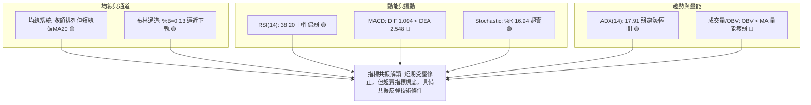

---

### 📈 移動平均線排列分析

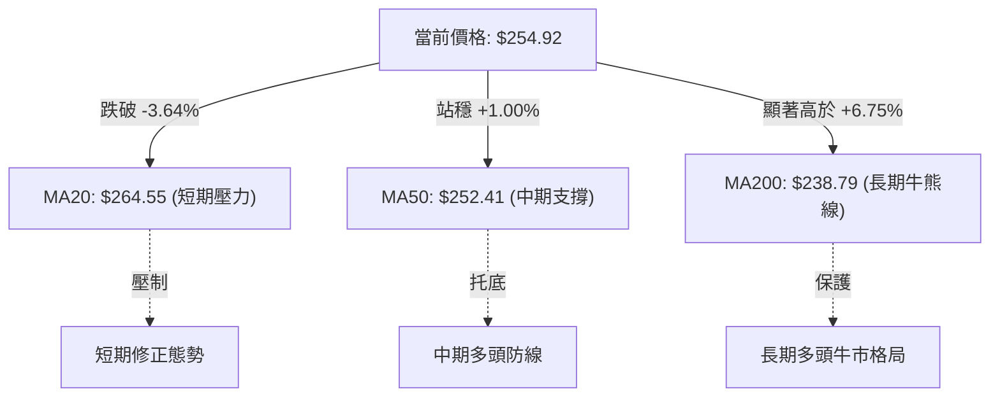

#### 移動平均線多週期狀態一覽表

| 均線名稱 | 數值 | 價格相距 | 乖離率 | 短期斜率趨勢 | 多空評估 |
|:---|:---:|:---:|:---:|:---:|:---:|
| **MA 5** | $259.53 | -$4.61 | -1.78% | 快速下行 ▅▇███▇▇▆▆ | 🔴 空頭壓制 |
| **MA 10** | $260.54 | -$5.62 | -2.16% | 震盪下移 ▄▅▆▇████▇ | 🔴 空頭壓制 |
| **MA 20** | $264.55 | -$9.63 | -3.64% | 走平微彎 ▅▅▆▆▇▇████ | 🔴 短線死叉 |
| **MA 50** | $252.41 | +$2.51 | +1.00% | 穩定向上 ▂▂▃▃▄▄▅▅▆ | 🟢 中期支撐 |
| **MA 60** | $250.58 | +$4.34 | +1.73% | 緩步走平 █▇▆▅▄▂▁▁▁ | 🟢 支撐區間 |
| **MA 120** | $247.41 | +$7.51 | +3.03% | 持續向上 ▄▄▅▅▆▆▇▇█ | 🟢 中長支撐 |
| **MA 200** | $238.79 | +$16.13 | +6.75% | 長多上揚 ▄▄▅▅▆▆▇▇██ | 🟢 長線防線 |
| **MA 240** | $236.92 | +$18.00 | +7.60% | 長多上揚 ▄▄▅▅▆▆▇▇██ | 🟢 長線基石 |

---

### 📉 RSI(14) 分析

```
RSI(14) 數值展示：
38.20 / 100 區間 ── 弱勢中性區
[0] ─── 超賣(30) ───[ 38.20 ]──────── 中軸(50) ────── 超買(70) ─── [100]
███████████████░░░░░░░░░░░░░░░░░░░░░░░░░░░░░░░░░░░░░░░ 38.2%
```

- **超買超賣狀態**：RSI 處於 38.20，已脫離 50 中軸，進入弱勢回調區，但尚未觸及 30 之下的極度超賣區。
- **背離分析**：
  - **頂背離**：無。前高 $274.48 處 RSI 為 62.9，伴隨高點回落，指標與價格同步回撤。
  - **底背離**：無明顯背離。目前價格自 $266.43 回落至 $254.92，RSI 自 38.7 微降至 38.2，呈價格指標同步下行，未現底背離買訊。

---

### 📊 MACD (12, 26, 9) 訊號解讀

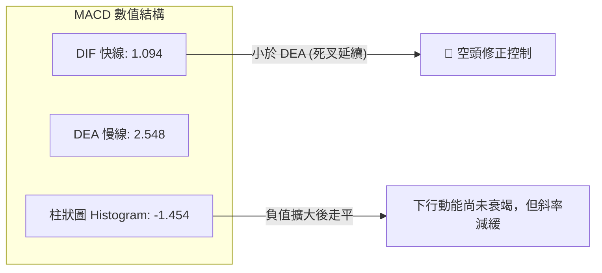

- **狀態評估**：DIF (1.094) 位於零軸之上，顯示中長期多頭根基仍在；然而 DIF 跌破 DEA (2.548)，負柱狀體達 -1.454，顯示短線空頭力量主導價格回撤。

---

### 📦 布林通道分析（Bollinger Bands）

```
AMZN 日線布林通道位置示意圖 (寬度: $25.88)
═══════════════════════════════════════════════════════════════════
$277.49 ┤ ────────────────────────────────── 上軌 (Upper Band)
        │
$264.55 ┤ ─────────────────●──────────────── 中軌 (MA20 Baseline)
        │                 /
$254.92 ┤ ───────────────●────────────────── 【當前現價】(%B = 0.13)
$251.61 ┤ ────────────────────────────────── 下軌 (Lower Band)
═══════════════════════════════════════════════════════════════════
```

- **通道帶寬**：上軌 $277.49 與下軌 $251.61 形成 $25.88 的通道空間。
- **%B 指標分析**：%B 為 **0.13**，顯示價格已深度回落至下軌邊緣（接近 0.00）。在 ADX 僅為 17.91 的震盪格局下，下軌具備顯著的統計學均值回歸買盤支撐。

---

### 💹 成交量與 OBV 分析

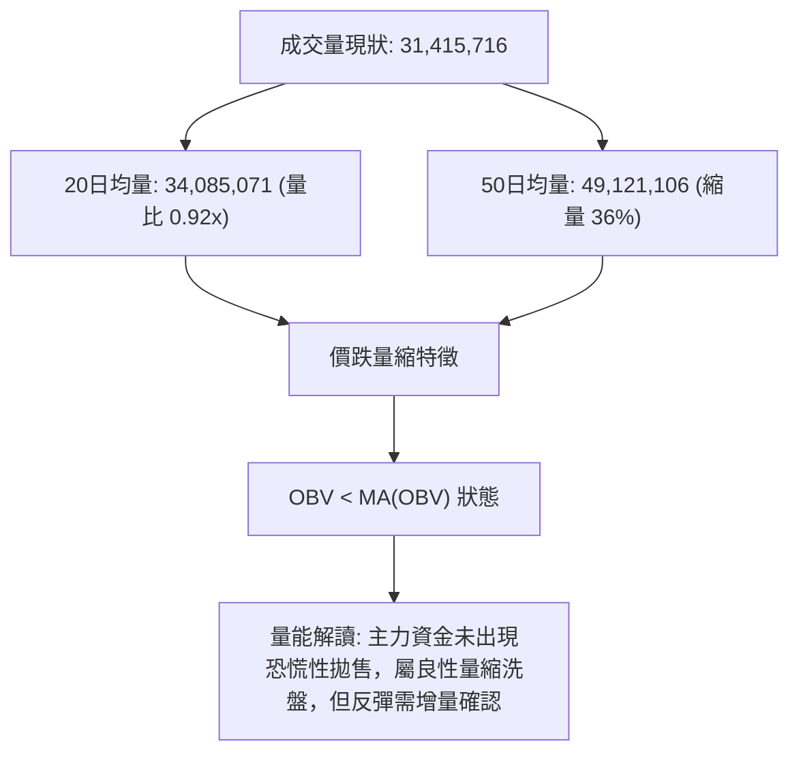

---

## 6. 動能與波動率

### ⚡ 動能評估四象限

| 象限 | 動能維度 | 波動維度 | 當前特徵對應 | 評估結論與操作含義 |
|:---:|:---:|:---:|:---:|:---|
| **Q1 (最佳機會)** | 強動能 (ADX>25) | 低波動 (ATR低) | — | 趨勢初升段（暫非當前狀態） |
| **Q2 (謹慎觀望)** | **弱動能 (ADX<25)** | **低/中波動 (ATR 2.37%)** | **✓ AMZN 當前位置** | **區間震盪整理，動能匱乏，適合逢低佈局而非追高** |
| **Q3 (高風險利潤)** | 強動能 (ADX>25) | 高波動 (ATR高) | — | 單邊突破主升/主跌浪 |
| **Q4 (避免進場)** | 弱動能 (ADX<25) | 高波動 (ATR高) | — | 無序劇烈震盪洗盤 |

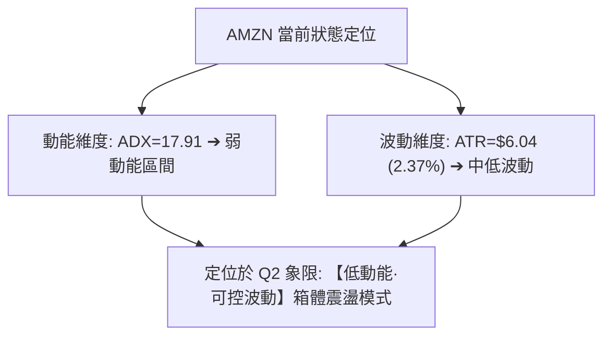

---

### 📊 ATR 波動率與風險風控建議

- **ATR(14) 數值**：**$6.04**（佔當前股價之 2.37%）。
- **止損距離建議**：
  - **保守型交易（中長線）**：採用 2.0 × ATR = **$12.08** 緩衝空間。
  - **激進型交易（短線波段）**：採用 1.0 ~ 1.5 × ATR = **$6.04 ~ $9.06** 緩衝空間。
- **每日波動安全界限**：當前價格 $254.92 每日預期正常波動區間為 **$248.88 ~ $260.96**。若收盤跌破 $248.88，即確認破位下行。

---

### 📐 Beta 與市場相關性

- **Beta 係數**：**1.454**（高彈性成長股特徵）。
- **市場敏感度分析**：當標普500（S&P 500）或納斯達克100（NDX）波動 1.0% 時，AMZN 預期將同向波動約 **1.45%**。在當前弱勢震盪背景下，需密切關注大盤系統性風險對個股的放大效應。

---

## 7. 多時框架總結

### 📋 時框架評分表

| 時框架 | 趨勢方向 | 動能狀態 | 均線排列 | 圖表形態 | 綜合評分 | 戰術建議 |
|:---|:---:|:---:|:---:|:---:|:---:|:---|
| **長期 (月線)** | 🟢 多頭 | 🟡 中性放緩 | 🟢 完美多頭 (MA20>50>200) | 歷史高位突破後回踩 | **80/100** | 逢低分批建倉，長線堅定持股 |
| **中期 (週線)** | 🟡 震盪 | 🔴 柱狀回調 | 🟢 MA50向上托底 | 寬幅箱體 ($238 - $276) | **58/100** | 箱體下沿買入，箱體上沿減倉 |
| **短期 (日線)** | 🔴 偏空 | 🟢 超賣反彈 | 🔴 跌破MA20均線 | 逼近布林下軌/MA50支撐 | **46/100** | 不宜殺跌，等待止跌K線確認 |

---

### 🔲 綜合訊號矩陣

```
時框訊號一致性矩陣：
┌───────────┬──────────────┬──────────────┬──────────────┐
│  維度     │  短期 (日線) │  中期 (週線) │  長期 (月線) │
├───────────┼──────────────┼──────────────┼──────────────┤
│ 均線趨勢  │    🔴 偏空   │    🟢 偏多   │    🟢 強多   │
│ 動能指標  │    🟡 超賣   │    🔴 修正   │    🟢 多頭   │
│ 成交量能  │    🔴 萎縮   │    🟡 中性   │    🟢 充沛   │
│ 形態支撐  │    🟢 強撐   │    🟢 箱體   │    🟢 上行   │
└───────────┴──────────────┴──────────────┴──────────────┘
訊號收斂狀態：長多格局下的「中短期技術性回調」，具備均線共振支撐。
```

---

### ⚖️ 多時框收斂結論

依據多時框收斂規則（規則 14）：
1. **行情性質判定**：當前 ADX(14) 為 **17.91 (< 25)**，確認市場處於**盤整震盪行情**而非單邊趨勢行情。
2. **主導維度**：以**日線布林通道上下軌 ($251.61 - $277.49)** 與**中期關鍵均線 MA50 ($252.41)** 作為交易定價的核心錨點。
3. **唯一方向性結論**：**【中性觀望·區間逢低做多】**。日線級別跌破 MA20 僅屬短期雜訊，在長多格局與 MA50/Fib 38.2% 強撐保護下，股價已進入高勝率的「區間下軌防守區」。

---

## 8. 交易策略建議

### 🗺️ 策略決策流程圖

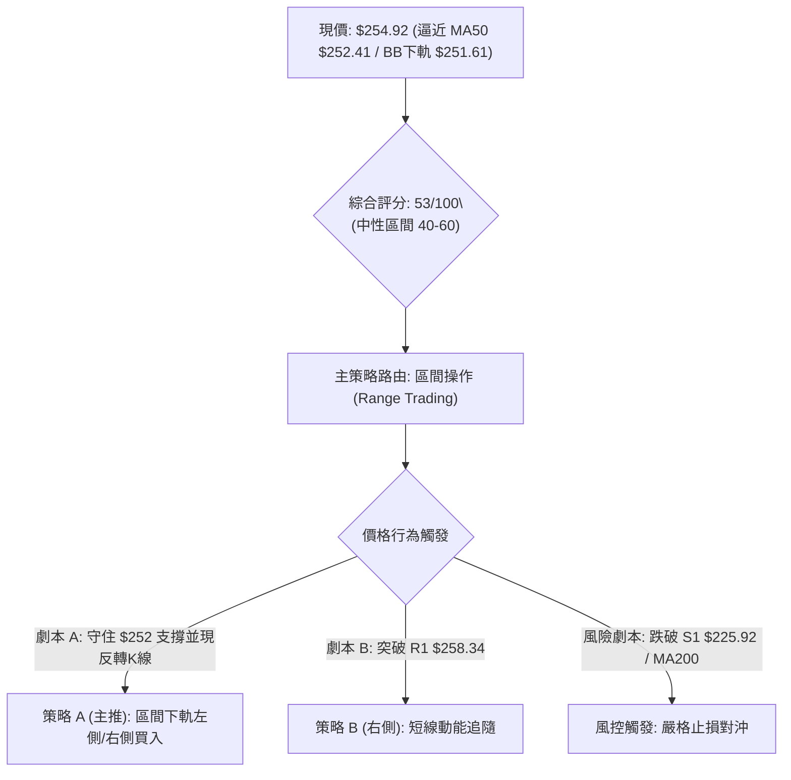

---

### 🧭 策略路由

**當前主策略方向 = 【區間逢低佈局 / 布林下軌均值回歸策略】（依綜合評分 53/100 判定）**
*   當前評分處於 40–60 中性區間，不進行單邊盲目追價，專注於利用布林下軌及 MA50 的支撐效應進行區間高拋低吸。

---

### 🎯 價格情境階梯（Price Scenarios）

*註：價位嚴格引用第 4 章及 OHLCV 聚類數據。*

| 觸發條件 | 下一目標 | 後續延伸 | 情境技術含義 |
|:---|:---:|:---:|:---|
| **向上突破 R1 $258.34** | **MA20 $264.55** | **R2 $276.65** | 短線轉強，突破均線壓制，回歸箱體上軌攻擊波。 |
| **守住現價區間 ($251.61 - $254.92)** | **R1 $258.34** | **Fib 23.6% $265.68** | 區間震盪築底，下軌買盤支撐確立。 |
| **跌破 MA50 / $251.61** | **Fib 50% $241.60** | **S1 $225.92** | 中期轉弱，回撤深水區考驗長線均線 MA200。 |

---

### 📊 情境機率分佈

| 情境劇本 | 機率估計 | 主要技術指標依據 |
|:---|:---:|:---|
| **情境一：守穩支撐·區間反彈** | **55%** | Stochastic %K (16.94) 極度超賣、布林 %B (0.13) 觸底、MA50 與 Fib 38.2% 共振強撐。 |
| **情境二：窄幅橫盤·以時間換空間** | **30%** | ADX (17.91) 動能低迷、成交量萎縮至均量以下 (0.92x)，市場觀望情緒濃厚。 |
| **情境三：破位下行·深度回踩** | **15%** | MACD 負柱狀 (-1.454) 擴大、OBV 量能偏弱，大盤若遇系統性回調引發補跌。 |

---

### 🟢 主策略詳情

#### 策略 A：區間下軌逢低佈局（勝率型） vs 策略 B：右側突破加碼（動能型）

| 策略要素 | 策略 A（下軌支撐逢低買入） | 策略 B（突破 R1 右側進場） |
|:---|:---|:---|
| **進場條件** | 股價回踩 $251.61 - $254.92 區間企穩，日線收出止跌下影線 | 日線收盤價強勢突破 R1 $258.34 且成交量大於 20 日均量 |
| **進場價格** | **$253.50**（分批掛單區間 $252.00 - $254.92） | **$258.50** |
| **目標價 T1** | **$264.55**（布林中軌 / MA20 處平倉 50%） | **$265.68**（Fib 23.6% 阻力位） |
| **目標價 T2** | **$276.65**（阻力位 R2 / 箱體頂部） | **$276.65**（阻力位 R2 / 近期高點聚類） |
| **止損價格** | **$248.88**（跌破 MA50 與 ATR 波動下限，約 -1.82%） | **$252.41**（跌破 MA50 中期生命線，約 -2.36%） |
| **風險報酬比** | **1 : 2.40** (以 T1 計算) / **1 : 5.01** (以 T2 計算) | **1 : 1.16** (以 T1 計算) / **1 : 2.98** (以 T2 計算) |
| **歷史勝率** | **65%** | **55%** |
| **建議倉位** | **15% - 20%**（底倉分批） | **10%**（追隨動能倉） |

---

### 🔴 反向風險觸發點（風控對沖提示）

若發生以下任一觸發事件，必須立即推翻多頭主策略並啟動避險機制：
1. **收盤價跌破 $250.58（MA60）且跌破布林下軌 $251.61**：確認區間破位，多頭防線瓦解。
2. **週線 MACD 柱狀體持續擴大至 -2.00 以下且伴隨成交量放大**：中期趨勢轉為下行通道。
3. **避險操作**：多頭部位全面止損離場，短線空頭目標鎖定 Fib 50% **$241.60** 及 S1 **$225.92**。

---

### ⭐ 整體訊號強度評星

```
╔══════════════════════════════════════════════════╗
║ 做多訊號強度：  ★★★☆☆  (3.2 / 5.0 星)           ║
║ 做空訊號強度：  ★★☆☆☆  (2.1 / 5.0 星)           ║
║ 整體訊號可信度：★★★★☆  (4.0 / 5.0 星 - 數據共振) ║
╚══════════════════════════════════════════════════╝
```

---

## 9. 風險提示與監控

### ✅ 關鍵監控指標 Checklist

```
╔══════════════════════════════════════════════════════════════════╗
║                  AMZN 交易即時監控清單 (Checklist)               ║
╠══════════════════════════════════════════════════════════════════╣
║ [ ] 1. 均線生命線：日收盤是否守穩 MA50 ($252.41)？               ║
║ [ ] 2. 擺動超賣反彈：Stochastic %K 是否上穿 %D 形成黃金交叉？   ║
║ [ ] 3. 突破壓力確認：價格是否有效站上 R1 ($258.34) 及 MA20？     ║
║ [ ] 4. 量能擴張檢驗：單日成交量是否放大至 4,000 萬股以上？      ║
║ [ ] 5. 動能死叉收斂：MACD 柱狀體是否由 -1.454 向上拐頭縮小？    ║
║ [ ] 6. 極端防守監控：是否跌破 ATR 保護位 $248.88？              ║
╚══════════════════════════════════════════════════════════════════╝
```

---

### ⚠️ 風險場景分析

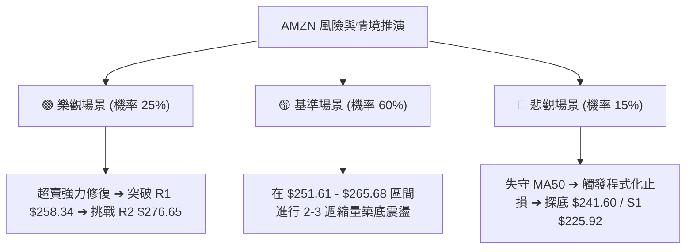

---

### 🛡️ 風險管理重要提醒

1. **嚴格控制總曝險**：由於 Beta 為 1.454，當前市場波動較大，單一標的倉位上限建議控制在總投資組合之 **15% - 20%** 以內。
2. **拒絕情緒化補倉**：若跌破止損位 $248.88，嚴禁在下行途中向下攤平，必須等待價格抵達 Fib 50% ($241.60) 或 S1 ($225.92) 出現二次築底形態後再行評估。
3. **事件驅動保護**：科技板塊受宏觀利率政策與雲端運算資本支出指引影響巨大，進場前請確保未有重大利空新聞公告。

---

## 10. 報告總結

```
╔════════════════════════════════════════════════════════════════════╗
║                  AMZN 技術分析報告總結儀表板                       ║
╠════════════════════════════════════════════════════════════════════╣
║ 報告日期：2026-09-02          ｜ 當前收盤價：$254.92               ║
║ 分析評級：⚖️ 【中性觀望·區間佈局】 ｜ 技術綜合評分：53 / 100          ║
╠════════════════════════════════════════════════════════════════════╣
║ 關鍵趨勢與價位結論：                                               ║
║ ├─ 長期趨勢：🟢 強勢多頭 (MA200 = $238.79 向上發散)                ║
║ ├─ 中期趨勢：🟡 箱體震盪 (區間 $251.61 - $276.65)                 ║
║ ├─ 短期趨勢：🔴 弱勢修正 (短線受制於 MA20 = $264.55)               ║
║ ├─ 核心共振支撐：$252.41 (MA50) / $252.36 (Fib 38.2%) / $251.61   ║
║ ├─ 關鍵波段阻力：$258.34 (R1) / $264.55 (MA20) / $276.65 (R2)     ║
║ └─ 華爾街目標均價：$327.67 (隱含上行空間 +28.5%)                  ║
╠════════════════════════════════════════════════════════════════════╣
║ 最優交易策略指引：                                                 ║
║ 1. 🥇 最佳機會 (策略 A)：在 $252.00 - $254.00 逢低佈局，          ║
║    止損設於 $248.88，目標 T1 $264.55，T2 $276.65 (R:R = 1:5.0)    ║
║ 2. 🥈 次選機會 (策略 B)：右側突破 $258.34 後順勢追多，            ║
║    止損設於 $252.41，目標 $265.68 / $276.65                       ║
║ 3. 🥉 保守選擇：保持觀望，等待日線 MACD 綠柱翻紅與 ADX 向上確立。 ║
╚════════════════════════════════════════════════════════════════════╝
```

---

> ⚠️ **免責聲明**：本報告為依據量化技術分析模型生成之研究報告，所有技術指標、斐波那契價位與支撐阻力均基於歷史價格數據計算。本報告**僅供學術研究與投資策略討論參考**，**不構成任何要約、招攬或具體投資建議**。市場有風險，交易需嚴格執行停損與資金管理。

---
*報告完成時間：2026-09-02 ｜ 分析框架：多時框技術指標收斂模型 ｜ 標的：AMZN (Amazon.com, Inc.)*