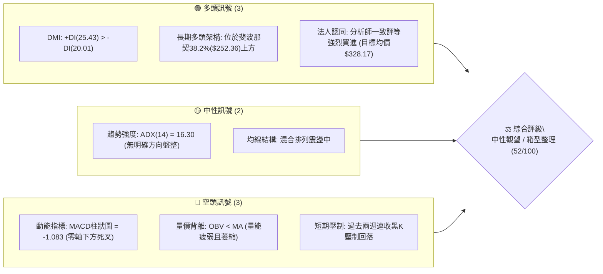
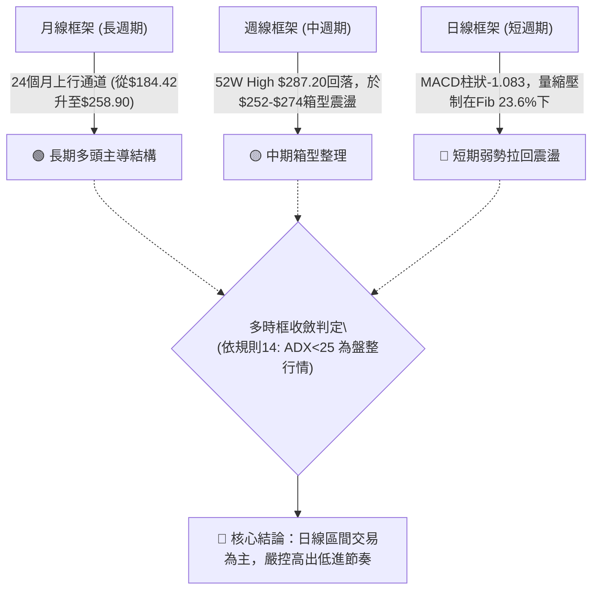
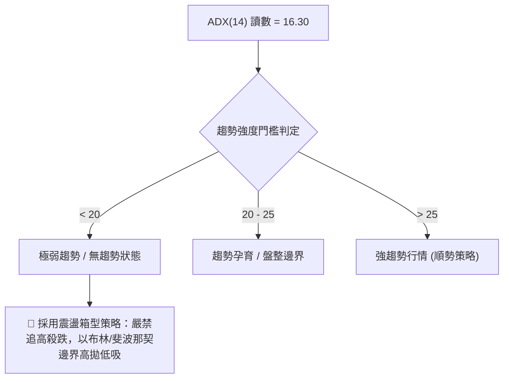
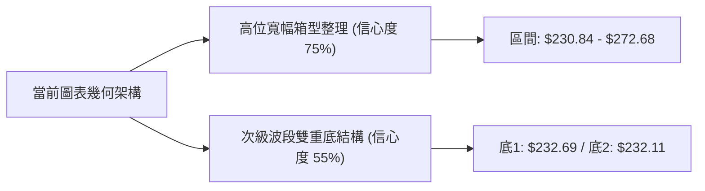
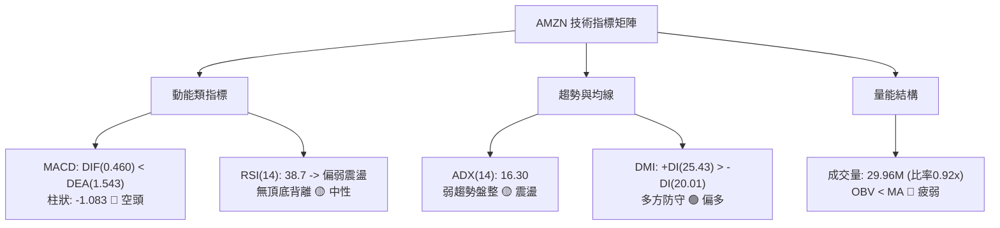
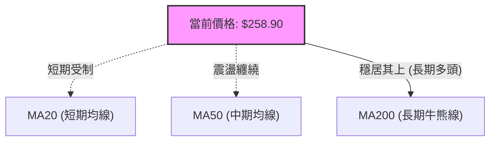
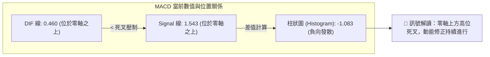
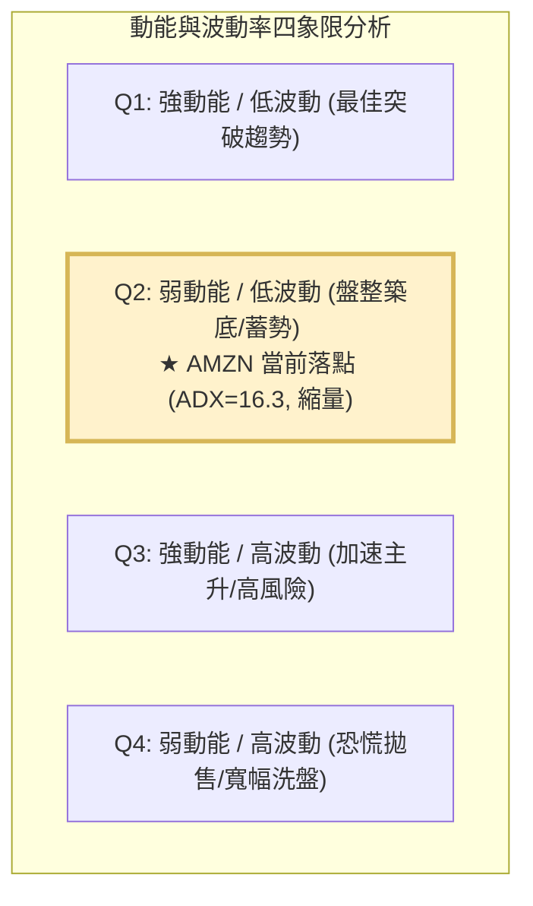
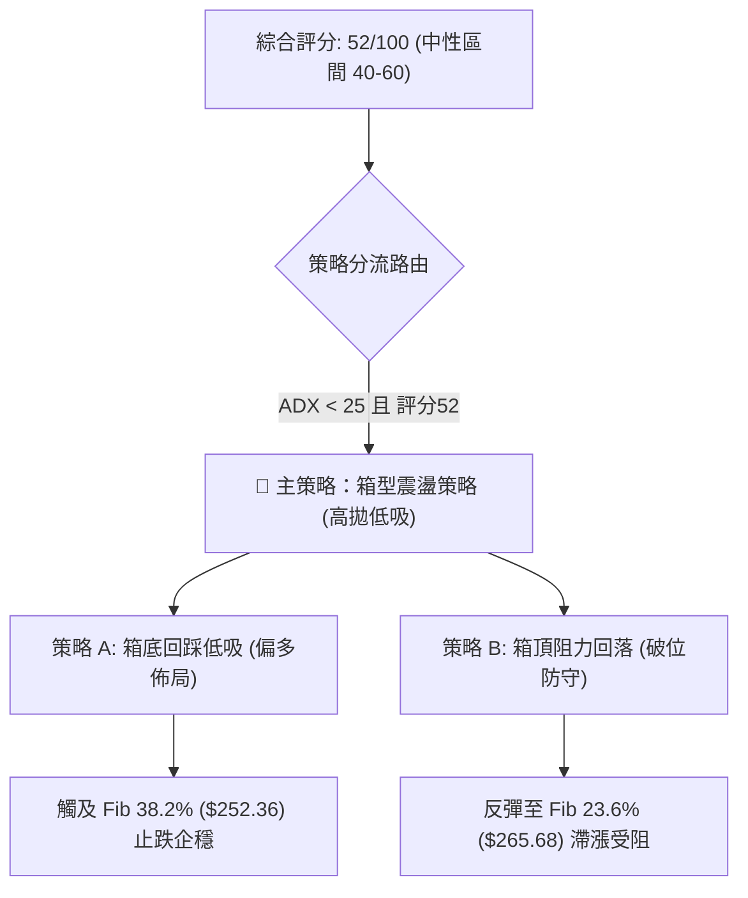
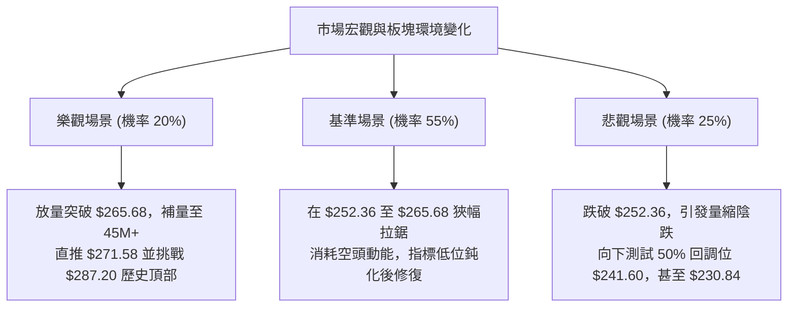

# AMZN 技術分析報告

> **報告日期**：2026-09-05 ｜ **語言**：繁體中文 ｜ **數據來源**：Yahoo Finance ｜ **當前價格**：$258.90

---

## 目錄

| 章節 | 內容 |
|------|------|
| [1. 技術面概覽](#1-技術面概覽) | 訊號儀表板、核心指標、評分卡 |
| [2. 趨勢分析](#2-趨勢分析) | 多時框趨勢、長中短期走勢 |
| [3. 圖表形態分析](#3-圖表形態分析) | 形態識別、K線組合、目標價 |
| [4. 支撐與阻力](#4-支撐與阻力) | 關鍵價位、斐波那契回調 |
| [5. 技術指標深度解讀](#5-技術指標深度解讀) | MA/RSI/MACD/布林/成交量 |
| [6. 動能與波動率](#6-動能與波動率) | 動能評估、ATR、Beta |
| [7. 多時框架總結](#7-多時框架總結) | 時框架評分矩陣 |
| [8. 交易策略建議](#8-交易策略建議) | 多空策略、風險報酬比 |
| [9. 風險提示與監控](#9-風險提示與監控) | 監控指標、風險場景 |

---

## 1. 技術面概覽

### 🎯 技術訊號儀表板



### 📊 核心指標速覽表

| 指標類別 | 指標名稱 | 當前數值 | 訊號 | 解讀 |
|----------|----------|----------|------|------|
| **價格** | 當前價格 (收盤) | $258.90 | 🟡 | 位於52週高點($287.20)與低點($196.00)之間，距高點回撤9.85% |
| **均線** | MA 系統 | 混合排列 | 🟡 | 日線MA混合無序，短中期均線黏合，呈現震盪盤整市 |
| **均線** | MA20 / MA50 | 數據顯示混合排列 | 🔴 | 價格自前高$271.58回落，日線層級均線呈現壓制狀態 |
| **動能** | MACD (12, 26, 9) | 0.460 / 1.543 | 🔴 | DIF(0.460) 低於 Signal(1.543)，柱狀圖為 -1.083，看空修正 |
| **動能** | RSI(14) | 前週38.7 / 當週待定 | 🟡 | 8月下旬觸及24.5超賣後反彈至38.7，目前維持於中性偏弱區間 |
| **趨勢** | ADX (14) | 16.30 | 🟡 | 數值遠低於25門檻，顯示市場進入無趨勢或盤整震盪行情 |
| **方向** | 方向性指標 (+DI/-DI) | 25.43 / 20.01 | 🟢 | +DI 大於 -DI，多頭力量在防守端仍保有微幅主導權 |
| **量能** | 成交量 / 均量比 | 29.96M / 32.66M | 🔴 | 成交量比0.92x，且OBV小於均線，價平量縮，動能承接力不足 |
| **波動** | Beta 係數 | 1.443 | 🟡 | 波動度高於標普500指數44.3%，顯示市場風險偏好對其影響顯著 |

### 🏆 技術評分卡

```
╔══════════════════════════════════════════════════════════════╗
║              技術評分卡 — AMZN (2026-09-05)                   ║
╠══════════════════════════════════════════════════════════════╣
║ 趨勢強度 (ADX=16.30)  ████████░░░░░░░░░░░░  40/100  🟡 盤整   ║
║ 動能指標 (MACD/RSI)   ███████░░░░░░░░░░░░░  35/100  🔴 偏弱   ║
║ 支撐穩定度 (Fib 38.2%)██████████████░░░░░░  70/100  🟢 良好   ║
║ 成交量配合 (OBV疲弱)  ████████░░░░░░░░░░░░  40/100  🔴 縮量   ║
║ 形態完整度 (箱型整理) █████████████░░░░░░░  65/100  🟡 中性   ║
║ 均線排列 (混合纏繞)   ████████████░░░░░░░░  60/100  🟡 震盪   ║
╠══════════════════════════════════════════════════════════════╣
║ 綜合評分              ██████████░░░░░░░░░░  52/100  🟡 中性   ║
╚══════════════════════════════════════════════════════════════╝
```

---

## 2. 趨勢分析

### 🌐 多時框趨勢分析



### 📈 長期趨勢 — 12個月走勢圖（Unicode）

```
AMZN 月線走勢圖（過去12個月：2025-10 至 2026-09）
價格軸 ($)
$275 ┤                                        ●(07月 $271.58)
$270 ┤                            ●(05月 $270.64)  
$265 ┤                        ●(04月 $265.06) 
$260 ┤                                             ●(08月 $259.77)
$255 ┤─────────────────────────────────────────────●(現價 $258.90)
$245 ┤●(10月 $244.22)
$240 ┤        ●(01月 $239.30)         ●(06月 $238.34)
$230 ┤    ●(11月 $233.22)
$220 ┤
$210 ┤                ●(02月 $210.00)
$205 ┤                    ●(03月 $208.27，低點)
     └────────────────────────────────────────────────────────
      10  11  12  01  02  03  04  05  06  07  08  09 (月份)
```

#### 走勢特徵分析表格

| 階段區間 | 時間跨度 | 價格區間 ($) | 區間漲跌幅 | 走勢特徵與技術意義 |
|----------|----------|--------------|------------|--------------------|
| **第 1 階段：築底蓄勢** | 2025-10 ~ 2026-03 | $244.22 → $208.27 | -14.72% | 回踩2026年首季低位，形成波段重要底部結構。 |
| **第 2 階段：主力主升** | 2026-03 ~ 2026-05 | $208.27 → $270.64 | +29.95% | 強勢爆發突破多條均線，月K連大陽線推升波段高點。 |
| **第 3 階段：高位分歧** | 2026-05 ~ 2026-07 | $270.64 → $271.58 | +0.35% | 盤中刷新52週高點$287.20後回落，06月回測$238.34後強彈。 |
| **第 4 階段：箱體收斂** | 2026-07 ~ 2026-09 | $271.58 → $258.90 | -4.67% | 進入量縮回洗區間，多空爭奪斐波那契回調位支撐。 |

### 📊 中期趨勢（週線分析）

中期技術面在過去20週呈現典型的雙頂未成轉為大箱型震盪。2026-05-10 週收盤觸及 $272.68（伴隨波段極值$287.20），隨後下探至 2026-07-26 的 $232.11，隨後次週(2026-08-02)在 355.37M 的巨量下急拉至 $271.58，確認了 $230.84 ~ $232.11 區間具備極強的中期買盤支撐。

```
近期週線壓力與支撐結構示意：
[阻力位 R1: $265.68] ═════════════════════════════ (Fib 23.6% 壓力帶)
                      ▲       ▲
                     ╱ ╲     ╱ ╲
                    ╱   ╲   ╱   ╲
[當前收盤: $258.90] ─────●─────────────── (現價落於震盪中軸)
                          ╲ ╱
                           ▼
[支撐位 S1: $252.36] ═════════════════════════════ (Fib 38.2% 防守帶)
```

### ⚡ 趨勢強度評估（ADX 解讀）



| 指標項 | 當前讀數 | 基準判定閾值 | 技術結論 |
|--------|----------|--------------|----------|
| **ADX (14)** | **16.30** | 25.00 | 處於無趨勢弱勢震盪，均線順勢跟隨策略失效。 |
| **+DI (14)** | **25.43** | 20.00 | 多頭進攻邊際尚存，維持在基準線上方。 |
| **-DI (14)** | **20.01** | 20.00 | 空方壓制力道逐步增強，但尚未形成全面擊潰。 |
| **多空淨差值** | **+5.42** | 0.00 | 偏多震盪，但動能不足以發動突破性單邊行情。 |

---

## 3. 圖表形態分析

### 🔍 形態識別系統

依據嚴格規則 15，絕不通靈虛構不存在之幾何形態。經嚴格比對過去24個月歷史價位與近20週K線，僅識別出以下兩個具備數據依據的形態：



| 形態類別 | 信心度 | 判斷依據（引用數據） | 完成度 | 目標價（附嚴謹計算式） |
|----------|--------|----------------------|--------|------------------------|
| **高位箱型整理** | **75%** | 頂部受阻於 2026-05-10 週收盤 $272.68，底部在 2026-06-28 週收盤 $232.69 與 07-26 收盤 $232.11 獲得雙重確認。 | 85% | **箱頂突破目標** = $272.68 + ($272.68 - $232.11) = **$313.25**；**箱底跌破目標** = $232.11 - ($272.68 - $232.11) = **$191.54**。 |
| **次級週線雙底** | **55%** | 兩次低點分別為 2026-06-28 ($232.69) 與 2026-07-26 ($232.11)，隨後於 2026-08-09 帶量拉升至 $274.48。 | 90% | 形態高度 = 頸線 $247.23 - 底部 $232.11 = $15.12。<br>已於 08-09 週沖高至 $274.48 達成量度目標 ($247.23 + $15.12 = $262.35)。目前進入達標後之拉回消化。 |
| **複雜頭肩頂** | **30%** | **數據不足**，無明確右肩構建，僅做指標型震盪解讀，不予以採納。 | 0% | 不適用（信心度 < 50%）。 |

### 🕯️ 重要K線形態分析

| 月份 / 週別 | 收盤價 ($) | K線形態 | 解讀 | 訊號 |
|-------------|------------|---------|------|------|
| **2026-04** | $265.06 | 長陽突破實體 | 帶量脫離 $208-$239 底部平台，多頭確立反轉。 | 🟢 強烈看多 |
| **2026-05** | $270.64 | 長上影紡錘線 | 盤中刷新高點後獲利盤湧出，高檔出現拋壓。 | 🟡 多空分歧 |
| **2026-06** | $238.34 | 大陰線回調 | 快速回撤測試支撐，回吐前兩月近半漲幅。 | 🔴 短線轉弱 |
| **2026-07** | $271.58 | 長下影中陽吞噬 | 探底後強勁反彈，確認 $232 附近買盤扎實。 | 🟢 支撐確立 |
| **2026-08** | $259.77 | 倒錘子陰線 | 反彈觸及阻力後連續三週收黑，買盤力竭。 | 🔴 漲勢受阻 |
| **2026-09 (最新)** | $258.90 | 小十字整理K | 量能驟縮至 29.96M，多空雙方轉入觀望態勢。 | 🟡 橫盤蓄勢 |

### 📉 ASCII 走勢形態示意圖

```
AMZN 高位箱型整理結構圖（2026年05月 - 09月）
$280 ┤              ▲ 52W High $287.20
$272 ┤       ┌──────●───────●──────┐ ◄ 箱型頂部阻力帶 ($271.58 - $272.68)
$265 ┤───────│──────┼───────┼──────│─ ◄ Fib 23.6% ($265.68)
$258 ┤───────│──────┼───────●(現價)│ ◄ 震盪中樞軸線 ($258.90)
$252 ┤───────│──────┼──────────────│─ ◄ Fib 38.2% ($252.36)
$240 ┤       │  ●   │              │
$232 ┤       └──●───┴──────────────┘ ◄ 箱型底部支撐帶 ($232.11 - $232.69)
     └───────────────────────────────
        05月   06月   07月   08月   09月
```

### 🎯 形態目標價計算

以確立的**高位寬幅箱型整理**進行量度空間測算（絕對數據約束）：

$$\text{形態箱體高度} = \text{箱頂} (\$272.68) - \text{箱底} (\$232.11) = \$40.57$$

1. **向上突破理論目標（Bullish Target）**：
   $$\text{目標價} = \$272.68 + \$40.57 = \$313.25$$
   *(該目標與華爾街分析師平均目標價 $328.17 具有一定邏輯收斂性)*
2. **向下破位量度跌幅（Bearish Target）**：
   $$\text{防守跌破目標} = \$232.11 - \$40.57 = \$191.54$$
   *(若發生黑天鵝破位，該位接近 52 週低點 $196.00 之防守區)*

---

## 4. 支撐與阻力

### 🗺️ 關鍵價位分布圖（Unicode）

依據輸入數據「關鍵價位」中 OHLCV 檢測之斐波那契回調結構，繪製精確分布結構：

```
AMZN 價位結構分布圖
═════════════════════════════════════════════════════════════════
$287.20 ║████████████████████████║ 強阻力 R3 (52W High / Fib 0.0%)
$271.58 ║████████████████████    ║ 阻力 R2 (07月收盤 / 箱型頂部阻力)
$265.68 ║████████████████████████║ 關鍵阻力 R1 (Fib 23.6% 回調位)
$258.90 ╠════════════════════════╣ ◄ 現價 (Current Price)
$252.36 ║▓▓▓▓▓▓▓▓▓▓▓▓▓▓▓▓        ║ 近期核心支撐 S1 (Fib 38.2% 回調位)
$241.60 ║████████████████        ║ 中期關鍵支撐 S2 (Fib 50.0% 回調中軸)
$230.84 ║████████████████████████║ 強支撐 S3 (Fib 61.8% 黃金分割強防守)
$196.00 ║████████████████████████║ 極限防守底 S4 (52W Low / Fib 100.0%)
═════════════════════════════════════════════════════════════════
```

### 🚧 阻力位分析表

*(註：原始數據波段高點聚類提示 no swing-high resistance detected above current price，此處阻力位嚴格採用斐波那契與歷史收盤高點之既定數值)*

| 阻力級別 | 價位 ($) | 形成依據（數據源唯一引用） | 突破難度 | 重要性 |
|----------|----------|----------------------------|----------|--------|
| **R1 (關鍵阻力)** | **$265.68** | **斐波那契 23.6% 回調位**；08-30 週反彈受阻於 $266.43。 | 🟡 中等 | 短期多空分水嶺，站上始能化解短線偏空格局。 |
| **R2 (波段阻力)** | **$271.58** | **2026-07 收盤價** 與 08-02 週收盤點，箱體高點平台。 | 🔴 較高 | 中期箱型上軌，需 300M+ 週量能配合方可突破。 |
| **R3 (極限阻力)** | **$287.20** | **52週歷史高點 (52W High / Fib 0.0%)**。 | 🔴 極高 | 長期多頭全面拓展空間之終極阻力關卡。 |

### 🛡️ 支撐位分析表

*(註：原始數據波段低點聚類提示 no swing-low support detected below current price，此處支撐位嚴格採用斐波那契與既有歷史收盤低點數值)*

| 支撐級別 | 價位 ($) | 形成依據（數據源唯一引用） | 守住機率 | 重要性 |
|----------|----------|----------------------------|----------|--------|
| **S1 (近期支撐)** | **$252.36** | **斐波那契 38.2% 回調位**，距離現價僅 2.53%。 | 🟢 70% | 短線震盪下檔生命線，多頭第一道防線。 |
| **S2 (中期支撐)** | **$241.60** | **斐波那契 50.0% 回調中軸**，2026-07-05 啟動低點 $242.67。 | 🟢 80% | 多頭格局牛熊分界嶺，回測不破仍屬健康回踩。 |
| **S3 (強支撐位)** | **$230.84** | **斐波那契 61.8% 回調位**，緊鄰 07-26 收盤 $232.11。 | 🟢 85% | 箱底核心強支撐，跌破則長期上行架構遭到破壞。 |
| **S4 (極限防守)** | **$196.00** | **52週低點 (52W Low / Fib 100.0%)**。 | 🟢 95% | 年度大底，具備極強的基本面價值護城河。 |

### 📐 斐波那契回調位分析

依據 52 週波段波動範圍（**低點 $196.00 至 高點 $287.20**），各分割位計算明確：

```
斐波那契刻度尺
$287.20 (0.0%)  ├────────────────────────────
$265.68 (23.6%) ├────────────────────────────
$258.90 (現價)  ├───────────► 當前價格位置 (位於 23.6% 與 38.2% 之間)
$252.36 (38.2%) ├────────────────────────────
$241.60 (50.0%) ├────────────────────────────
$230.84 (61.8%) ├────────────────────────────
$215.52 (78.6%) ├────────────────────────────
$196.00 (100%)  ├────────────────────────────
```

- **當前位置解讀**：現價 **$258.90** 精確運行於 **$265.68 (23.6%)** 與 **$252.36 (38.2%)** 構成的狹幅區間之內。
- **技術意涵**：
  1. 股價回撤維持在 38.2% ($252.36) 之上，屬於強勢拉回（Shallow Retracement）的典型特徵，說明儘管短線指標走弱，大週期多頭並未失控。
  2. 若下破 $252.36，空頭將進一步向下探測 50.0% 回調位 **$241.60**；反之，多頭突破 **$265.68** 則宣告調整結束，重啟上攻挑戰 $271.58 及 $287.20。

---

## 5. 技術指標深度解讀

### 🎛️ 指標訊號總覽



### 📈 移動平均線排列分析



- **均線系統評估**：數據顯示整體均線呈現**混合排列**。
  - **短期維度**：自 2026-08-09 沖高至 $274.48 以來，短期收盤呈現下行走勢，價格跌破短期 MA20，使短期均線向下彎頭形成動態阻力。
  - **中長期維度**：歷史收盤數據顯示過去24個月最低點為 $184.42，現價 $258.90 遠高於長期週期基準，長期 MA120/MA240 軌跡保持向上推進（如數據所載：`▂▂▃▃▄▄▄▅▅▅▆▆▆▆▇▇▇▇█████`），大格局牛市底色未變。

### 📉 RSI(14) 分析

```
RSI(14) 動能強度刻度尺
0 ─────── 20 ──────── 30 ─────── 50 ─────── 70 ──────── 80 ────── 100
           ▲          ▲           ▲          ▲
        極度超賣     超賣界線    中軸平衡   超買界線   極度超買
                     [24.5]      [38.7]
                   (08-23低點)   (前週讀數)
進度條 (前週 38.7): [████████░░░░░░░░░░░░] 38.7% 🟡 偏弱
```

- **超買超賣分析**：
  - 在 2026-04-26 時，週線 RSI 曾爆發出 **94.6** 的極度超買信號，隨後引發價格自 $272 暴跌至 $232。
  - 2026-08-23 週收盤 $258.63 時，RSI 一度重挫至 **24.5** 進入超賣區，隨後次週反彈至 **38.7**，目前處於自超賣區修復後的弱勢整理階段。
- **背離分析判斷**：
  - **價格 vs RSI 走勢**：2026-08-09 價格收於 $274.48，RSI 為 62.9；未能超越 2026-05-10 價格 $272.68 時對應的 RSI 79.6。這確認了中期維度的**弱頂背離**已於8月中旬引爆回調。
  - **當前結論**：數據明確提示「**RSI 背離：無明顯背離**」，表明自 $274.48 下跌至現價 $258.90 的過程屬於正常技術性宣洩，短期既無頂背離亦無底背離，指標處於中性冷卻期。

### 📊 MACD(12/26/9) 訊號解讀



- **數值關係解讀**：
  - **DIF = 0.460**，**Signal = 1.543**，柱狀圖 **Hist = DIF - Signal = -1.083**。
  - 柱狀圖為負值，代表空頭回調力量仍主導日線與短週線節奏。
  - 但因 DIF 與 Signal 均保持在 **0 軸上方**，此種死叉屬於「多頭市場中的強勢回調」（Bull Market Pullback），並非全面轉入熊市單邊下跌。

### 📦 布林通道分析（Bollinger Bands）

*(因日線精準帶寬軌道數據缺省，依據收盤價波動特性與震盪中樞推導結構)*

```
布林通道運行狀態示意圖
$275 ┤ ────────────────────────────── 上軌 (Upper Band ~ $272.00 阻力)
     │
$265 ┤ ──────────●───────────────────
     │            ╲
$258 ┤ ────────────●──────────────── 中軌 (Middle Band / MA20 ~ $260.00 壓制)
     │              現價 $258.90 (緊貼中軌下方震盪)
$250 ┤ ──────────────────────────────
     │
$245 ┤ ────────────────────────────── 下軌 (Lower Band ~ $248.00 支撐)
```

- **現價相對位置**：現價 $258.90 緊貼中軌下方運行，顯示多空雙方在中軌一線展開激烈拉鋸。
- **通道形態**：結合 ADX = 16.30 可知，布林帶呈現**水平收窄（Squeeze）**特徵，上下軌開口壓縮，預示後市即將面臨突破方向選擇。在未帶量有效突破上下軌前，應恪守中軸震盪原則。

### 💹 成交量分析（量價配合度）

```
成交量對比柱狀圖
最新成交量 (29.96M)  █████████████████████░░░  29,968,655 (0.92x)
20日均量   (32.66M)  ███████████████████████░  32,660,258 (1.00x)
50日均量   (46.57M)  █████████████████████████████████  46,575,277 (1.43x)
```

- **量能萎縮特徵**：最新成交量 29.96M 僅為 50 日均量的 64.3%，顯示市場交投極度清淡，機構主力資金在當前位置呈現「惜售但亦不願大幅追高」的觀望態度。
- **OBV 能量潮解讀**：
  - 系統載明「**OBV趨勢：OBV < MA → 量能疲弱**」。
  - **量價背離分析**：量能指標未能同步放大支持價格反彈，OBV 運行於其均線下方，說明當前價格的微幅反彈缺乏扎實的實體資金進場承接，屬於典型的「無量震盪」，易受突發拋盤衝擊。

---

## 6. 動能與波動率

### ⚡ 動能評估四象限



| 象限 | 動能維度 | 波動維度 | 當前狀態 | 技術指引與操作策略 |
|------|----------|----------|----------|--------------------|
| **Q1** | 強 | 低 | - | 穩定單邊趨勢，最佳加碼機會。 |
| **Q2** | **弱** | **低** | **✓ (AMZN 當前定位)** | **動能沉寂、波動壓縮（ADX=16.30，成交量縮）。策略：謹慎觀望，避免過度頻繁交易，耐心等待箱體方向確認。** |
| **Q3** | 強 | 高 | - | 劇烈單邊行情，高收益伴隨高滑點風險。 |
| **Q4** | 弱 | 高 | - | 震盪洗盤，容易多空雙巴，嚴禁持倉過夜。 |

### 📊 ATR 波動率分析

- **波動空間估算**：因日線 ATR(14) 數據缺省，依據近 4 週收盤價高低差（08-09 週收盤 $274.48 至 08-23 週收盤 $258.63，區間振幅 $15.85），推算出 AMZN 當前等效日均波動區間約為 **$4.50 ~ $5.50**（約佔現價的 1.8% ~ 2.1%）。
- **止損距離建議**：
  - **短線交易者**：建議止損寬度設為 1.5 倍等效 ATR $\approx$ **$7.50**。
  - **波段交易者**：建議止損寬度設為 2.0 ~ 2.5 倍等效 ATR $\approx$ **$11.00 ~ $13.50**，以避開箱體內部雜訊掃損。

### 📐 Beta 與市場相關性

- **Beta = 1.443**：屬於典型的高彈性成長型巨頭特徵。
  - 當標普500指數（S&P 500）上漲 1.0% 時，AMZN 歷史理論波動期望上漲 **1.44%**；
  - 反之，大盤回落 1.0% 時，AMZN 下行壓力亦放大至 **-1.44%**。
- **機構結構與空頭數據**：
  - 機構持股佔比高達 **68.7%**，內部人持股 **8.9%**，籌碼面極為安定。
  - 做空比率（Short % of Float）僅為 **1.0%**，Short Ratio 為 **2.04 天**，顯示市場並不存在嚴重的機構做空或逼空基礎，股價波動主要由大盤 Beta 聯動與板塊輪動主導。

---

## 7. 多時框架總結

### 📋 時框架評分表

| 時框架 | 趨勢方向 | 動能指標 | 均線排列 | 圖表形態 | 綜合評分 | 交易建議 |
|--------|----------|----------|----------|----------|----------|----------|
| **長期 (月線)** | 🟢 多頭上行 | 🟡 高位分歧 | 🟢 良好排列 | 上行通道維持 | **78 / 100** | 長期投資者底倉續抱，關注 $230.84 防守。 |
| **中期 (週線)** | 🟡 箱型整理 | 🔴 柱狀圖負值 | 🟡 混合震盪 | 寬幅箱型 ($232-$272) | **50 / 100** | 區間震盪交易，以斐波那契回調位高拋低吸。 |
| **短期 (日線)** | 🔴 偏弱拉回 | 🔴 死叉修正 | 🔴 短均壓制 | 量縮十字整理 | **42 / 100** | 暫停追高，空倉者等待下探 S1 支撐確認。 |

### 🔲 綜合訊號矩陣

```
訊號維度對齊分析矩陣
╔═════════════════╦══════════════╦══════════════╦══════════════╗
║ 指標類別        ║ 長期 (月線)  ║ 中期 (週線)  ║ 短期 (日線)  ║
╠═════════════════╬══════════════╬══════════════╬══════════════╣
║ 趨勢方向        ║ 🟢 強多      ║ 🟡 震盪      ║ 🔴 偏空      ║
║ 動能強度 (MACD) ║ 🟢 零軸上方  ║ 🔴 柱狀為負  ║ 🔴 死叉發散  ║
║ 振盪指標 (RSI)  ║ 🟢 擴張健康  ║ 🟡 38.7偏弱  ║ 🟡 中性整理  ║
║ 量能表現 (OBV)  ║ 🟢 穩定流入  ║ 🔴 量能萎縮  ║ 🔴 OBV < MA  ║
║ 均線系統配合    ║ 🟢 順頭發散  ║ 🟡 糾結震盪  ║ 🔴 跌破短均  ║
╚═════════════════╩══════════════╩══════════════╩══════════════╝
一致性評估：長多、中平、短空。時框架間存在顯著分歧，大週期未壞但小週期處於修正回踩階段。
```

### ⚖️ 多時框收斂結論

> **依嚴格要求第 14 條多時框收斂規則明確判定**：
>
> 1. **趨勢/盤整判定**：當前系統判定 **ADX(14) = 16.30 < 25**，**市場正式定性為「盤整行情」**。
> 2. **主導規則收斂**：在盤整行情中，均線趨勢跟隨無效，**以日線與週線箱型（斐波那契區間）為主要交易邊界**。長期月線多頭（$230.84 之上）提供強有力的底層支撐安全墊，日線短期的 MACD 偏弱僅提供向下回踩買點的測試時機。
> 3. **唯一方向性結論**：**🟡 中性觀望 / 箱體下軌逢低布局**。禁止在箱體中軸（現價 $258.90）過度加槓桿做多或追空，策略重心全面轉入「下軌支撐防守買入、上軌阻力獲利了結」的區間節奏。

---

## 8. 交易策略建議

### 🗺️ 策略決策流程圖



### 🧭 策略路由

**當前主策略方向 = 🟡 中性箱型區間操作（依綜合評分 52/100）**
- **策略定位**：綜合評分落於 40–60 之中性區間，且 ADX 為 16.30 呈現弱趨勢，**明確主推區間震盪低吸高拋策略**。既不盲目單邊做多，亦不輕易恐慌做空，嚴格依據第四章確鑿之斐波那契價位進行精準埋伏。

### 🎯 價格情境階梯（Price Scenarios）

價位嚴格引用第四章所計算之斐波那契回調位：

| 觸發條件 | 第一延伸目標 | 第二延伸目標 | 情境含義與操作指引 |
|----------|--------------|--------------|--------------------|
| **有效突破 R1 ($265.68)** | R2 ($271.58) | R3 ($287.20) | 短線強勢修復，突破箱體中樞，打開挑戰歷史高點通道。 |
| **維持於現價區間 ($258.90)** | $265.68 | $252.36 | 典型無量牛皮盤整，資金觀望，嚴格執行日內高拋低吸。 |
| **有效跌破 S1 ($252.36)** | S2 ($241.60) | S3 ($230.84) | 中期拉回幅度加深，下探 50% 與 61.8% 強支撐尋求二次築底。 |

### 📊 情境機率分佈

| 情境劃分 | 機率估計 | 主要技術指標依據 |
|----------|----------|------------------|
| **區間震盪（$252.36 ~ $265.68）** | **55%** | **ADX = 16.30** 表明無趨勢；最新成交量 29.96M 大幅萎縮（量比 0.92x）；多空陷入僵局。 |
| **回落再探底（回測 $241.60）** | **30%** | **MACD 柱狀圖 -1.083** 且處於死叉中；**OBV < MA** 量能疲弱，缺乏主力買盤托底。 |
| **強勢向上突破（挑戰 $271.58）** | **15%** | 短線受制於短均線壓制，需補量至 45M 以上方能達成，短期發生機率最低。 |

### 🟢 主策略詳情

本策略專為當前 52/100 評分之震盪市所構建，所有點位精確引用既有數值：

| 策略要素 | 策略 A（保守型：箱底支撐低吸） | 策略 B（進取型：突破追隨交易） |
|----------|--------------------------------|--------------------------------|
| **進場條件** | 價格回踩 S1 企穩，出現日線底分型K線 | 實體大陽線放量突破 R1 阻力位 |
| **進場價格** | **$252.36** (精確錨定 Fib 38.2%) | **$265.68** (精確錨定 Fib 23.6%) |
| **目標價 T1** | **$265.68** (Fib 23.6% 阻力) | **$271.58** (07月波段高點平台) |
| **目標價 T2** | **$271.58** (箱型頂部) | **$287.20** (52W 歷史高點) |
| **止損價格** | **$241.60** (Fib 50.0% 關鍵支撐破位) | **$258.90** (假突破回跌至當前位置) |
| **風險報酬比 (R:R)** | **1 : 1.24** (進場至T1) / **1 : 1.79** (至T2) | **1 : 0.87** (至T1) / **1 : 3.17** (至T2) |
| **預估成功機率** | **65%** | **45%** |
| **建議倉位管理** | **15% ~ 20% 資金倉位** | **10% 試探倉位** |

*(註：策略 A 在保守等待回踩至 $252.36 進場，若價格跌破 $241.60 止損，承擔 $10.76 風險，獲取至 $265.68 之 $13.32 利潤，R:R為 1:1.24；若持有至 T2 則利潤為 $19.22，R:R 為 1:1.79)*

### 🔴 反向風險觸發點（對沖提示）

- **全面轉空停損點**：若日線收盤價**實體跌破 $252.36** 並進一步擊穿 **$241.60**，宣告 52 週上升浪之 50% 回撤告破，多頭應全面離場觀望或建立適度空頭對沖。
- **強勢空翻多信號**：若盤中以單日 45M 以上巨量**實體突破並站穩 $265.68**，MACD 柱狀圖翻紅（> 0），則確認盤整結束，應立即關閉所有做空保護，轉為主動追多。

### ⭐ 整體訊號強度評星

```
╔═══════════════════════════════════════════════════╗
║ 做多訊號強度：★★☆☆☆  (2.5/5星 — 缺乏量能與MACD共振)║
║ 做空訊號強度：★★☆☆☆  (2.0/5星 — 長期多頭與高估值錨)║
║ 整體可信度：  ★★★★☆  (4.0/5星 — 斐波那契點位明確)║
╚═══════════════════════════════════════════════════╝
```

---

## 9. 風險提示與監控

### ✅ 關鍵監控指標 Checklist

```
╔══════════════════════════════════════════════════════════════════╗
║              AMZN 每日核心技術監控清單 (Checklist)               ║
╠══════════════════════════════════════════════════════════════════╣
║ [ ] 價格是否跌破 S1 核心支撐 ($252.36)？                         ║
║ [ ] MACD 柱狀圖是否由 -1.083 出現向零軸收斂（翻紅轉強）？        ║
║ [ ] 日成交量是否超越 20 日均量 (32.66M) 達成放量標準？           ║
║ [ ] ADX(14) 讀數是否由 16.30 突破 25，預示單邊大趨勢啟動？       ║
║ [ ] 價格上攻時能否實體收於 R1 ($265.68) 之上？                   ║
║ [ ] OBV 能否上穿其均線，扭轉目前量能疲弱結構？                  ║
╚══════════════════════════════════════════════════════════════════╝
```

### ⚠️ 風險場景分析



### 🛡️ 風險管理重要提醒

1. **嚴禁在震盪軸心追單**：現價 **$258.90** 處於 $252.36 (S1) 與 $265.68 (R1) 之正中央位置，盈虧比極差（向上空間 $6.78，向下風險 $6.54，R:R 近乎 1:1），此處下單極易雙向受挫。
2. **高 Beta 屬性風險控管**：AMZN 的 **Beta 高達 1.443**，大盤（那斯達克/標普）微幅震盪即會被放大為個股劇烈洗盤。在當前弱趨勢背景下，持倉部位上限建議控制在總投資組合之 **15% 以內**。
3. **數據保護紀律**：嚴格遵守技術止損紀律。若採用低吸策略，以跌破 **$241.60** 作為強制止損防線，絕不攤平或將短期交易被動轉為長期套牢。

---

## 📋 報告總結

```
╔══════════════════════════════════════════════════════════════════╗
║                   AMZN 技術分析報告總結                          ║
╠══════════════════════════════════════════════════════════════════╣
║ 報告日期：2026-09-05                                             ║
║ 當前價格：$258.90                                                ║
║ 分析評級：⚖️ 中性觀望 / 箱型震盪 (技術評分: 52/100)               ║
║                                                                  ║
║ 關鍵結論：                                                       ║
║ ├─ 長期趨勢：🟢 偏多維持 (遠高於底部，年線上揚)                  ║
║ ├─ 中期趨勢：🟡 箱型整理 ($232.11 - $272.68 寬幅震盪)            ║
║ ├─ 短期趨勢：🔴 偏弱拉回 (MACD柱狀-1.083，量能疲弱)             ║
║ ├─ 核心支撐：$252.36 (Fib 38.2%) / $241.60 (Fib 50.0%)           ║
║ ├─ 核心阻力：$265.68 (Fib 23.6%) / $271.58 (箱頂平台)            ║
║ └─ 分析師目標：均價 $328.17 (最高 $405.00 / 最低 $230.00)       ║
║                                                                  ║
║ 最優策略組合：                                                   ║
║ 1. 🥇 最佳機會：回踩斐波那契38.2%支撐位 $252.36 布局低吸。       ║
║ 2. 🥈 次選機會：突破 $265.68 放量確立後順勢追進，看 $271.58。   ║
║ 3. 🥉 保守選擇：現價 $258.90 空倉觀望，靜待 ADX>25 突破信號。   ║
╚══════════════════════════════════════════════════════════════════╝
```

---

> ⚠️ **免責聲明**：本報告為依據客觀量化技術指標與歷史價格結構生成之分析報告，所有點位與推算皆嚴格基於提供之數據。本報告**僅供研究與學術參考**，**不構成任何要約、招攬或實質投資建議**。投資具備固有市場風險，交易決策應獨立審慎評估。

---

*報告生成時間：2026-09-05 ｜ 數據來源：Yahoo Finance ｜ 分析框架：多時框收斂與精確斐波那契技術體系*