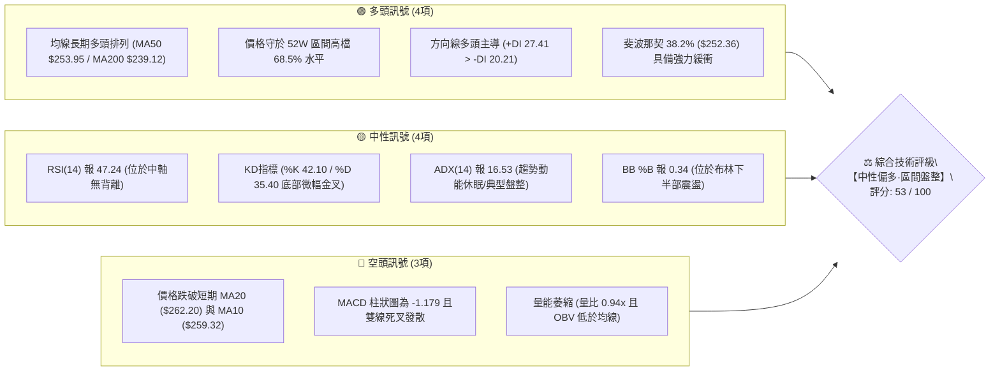
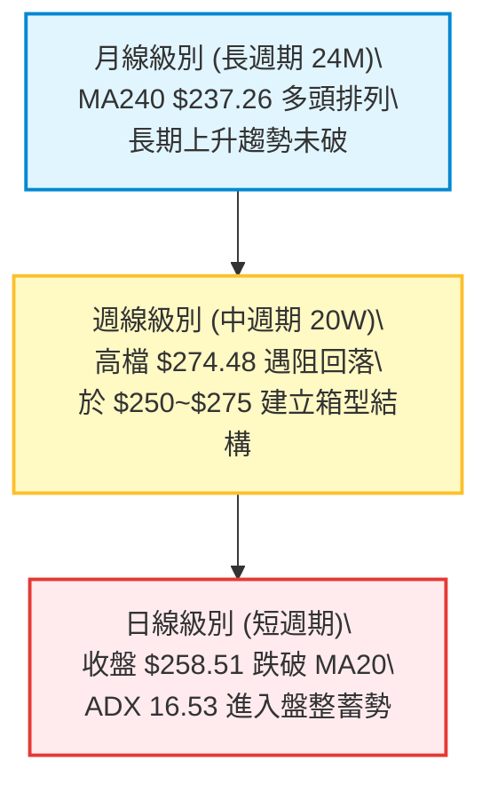
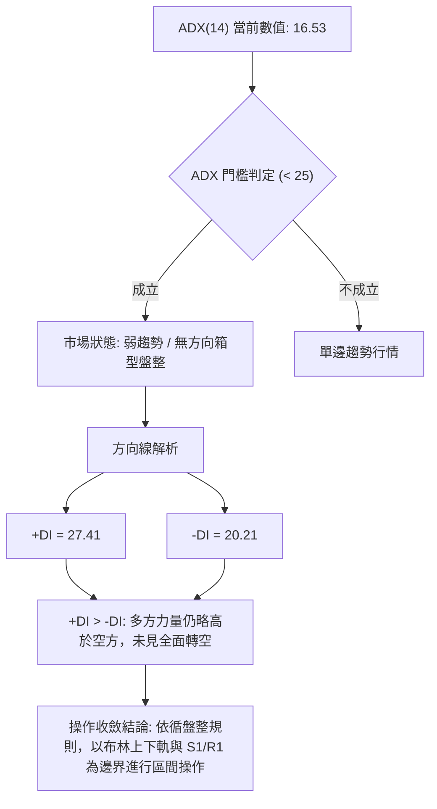
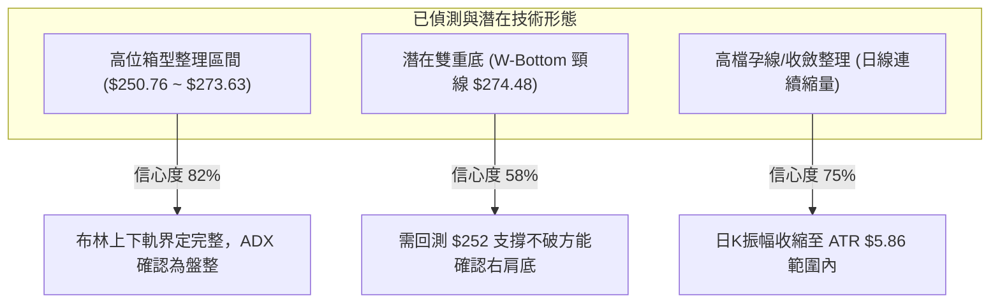
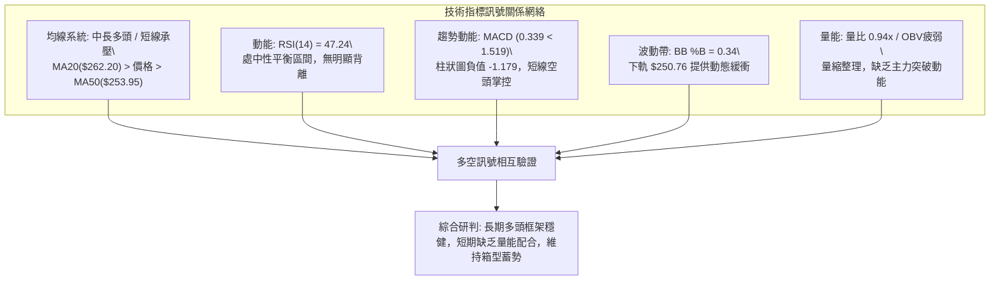
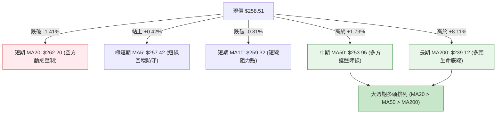
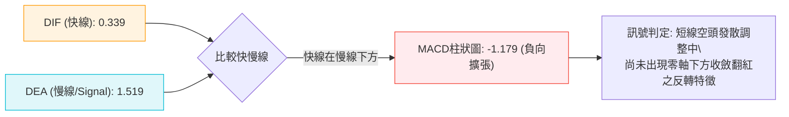
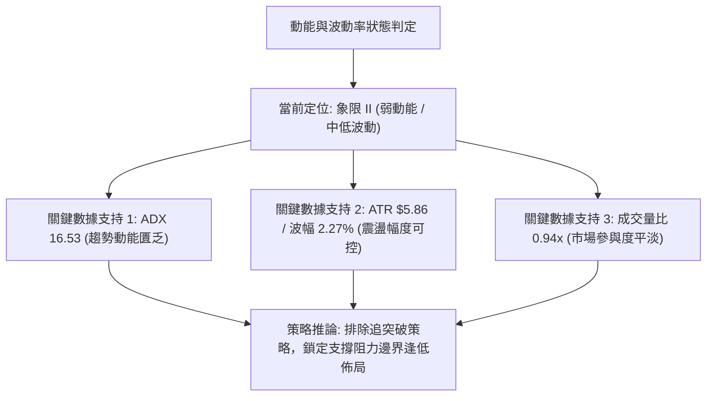
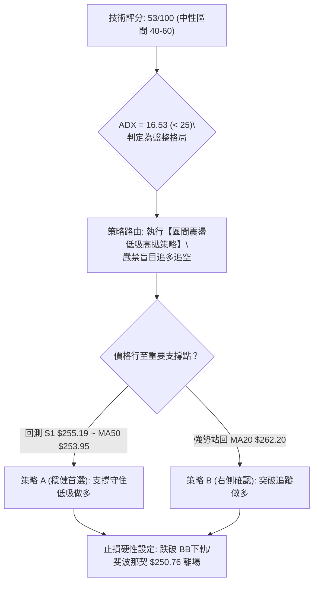
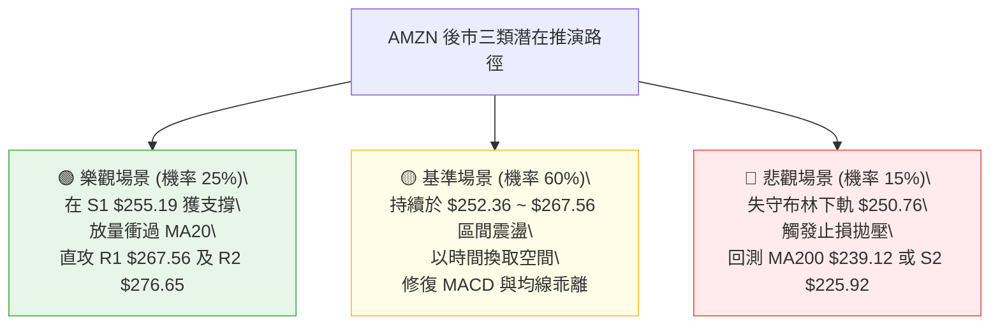

# AMZN 技術分析報告

> **報告日期**：2026-09-06 ｜ **語言**：繁體中文 ｜ **數據來源**：Yahoo Finance ｜ **當前價格**：$258.51

---

## 目錄

| 章節 | 內容 |
|------|------|
| [1. 技術面概覽](#1-技術面概覽) | 訊號儀表板、核心指標、評分卡 |
| [2. 趨勢分析](#2-趨勢分析) | 多時框趨勢、長中短期走勢、12個月走勢圖 |
| [3. 圖表形態分析](#3-圖表形態分析) | 形態識別、信心度評級、K線組合、目標價推算 |
| [4. 支撐與阻力](#4-支撐與阻力) | 關鍵價位分佈、波段聚類、斐波那契回調 |
| [5. 技術指標深度解讀](#5-技術指標深度解讀) | 均線系統、RSI、MACD、布林通道、OBV量能 |
| [6. 動能與波動率](#6-動能與波動率) | 動能四象限、ATR波幅、Beta與大盤敏感度 |
| [7. 多時框架總結](#7-多時框架總結) | 時框矩陣、收斂規則與唯一方向結論 |
| [8. 交易策略建議](#8-交易策略建議) | 策略路由、情境階梯、主策略詳情、風控點 |
| [9. 風險提示與監控](#9-風險提示與監控) | 監控Checklist、情境路徑、資金管理規範 |

---

## 1. 技術面概覽

### 🎯 技術訊號儀表板

當前 Amazon.com, Inc. (AMZN) 報價為 **$258.51**。中長期均線呈現標準多頭排列，但短線受制於 20 日均線（$262.20）反壓，MACD 處於空頭發散柱狀圖擴張階段，ADX 數值落於 16.53，顯示市場進入典型的**多頭大架構下的短線箱型震盪整固**階段。



---

### 📊 核心指標速覽表

| 指標類別 | 指標名稱 | 當前數值 | 訊號 | 技術解讀與訊號確認 |
|----------|----------|----------|:----:|--------------------|
| **價格結構** | 現價 (Last Close) | **$258.51** | 🟡 | 位於52週高點 $287.20 與低點 $196.00 區間之 68.5% 分位 |
| **短期均線** | MA20 (布林中軌) | **$262.20** | 🔴 | 現價低於 MA20 約 -1.41%，短線反彈首要動態反壓位 |
| **中期均線** | MA50 | **$253.95** | 🟢 | 現價高於 MA50 約 +1.79%，形成第一道中期趨勢防線 |
| **長期均線** | MA200 (牛熊線) | **$239.12** | 🟢 | 現價高於 MA200 約 +8.11%，維持長期大多頭主升格局 |
| **超買超賣** | RSI(14) | **47.24** | 🟡 | 位於 40–60 中性震盪帶，未見極端超買或超賣超額訊號 |
| **趨勢動能** | MACD (12,26,9) | **0.339 / 1.519** | 🔴 | DIF < DEA，Hist 負值擴張至 -1.179，短線動能偏空整理 |
| **隨機指標** | Stoch KD (14,3,3) | **%K 42.10 / %D 35.40** | 🟢 | %K 從超賣低檔微幅金叉向上穿過 %D，醞釀短線低點防禦 |
| **趨勢強度** | ADX(14) / ±DI | **16.53** | 🟡 | ADX < 25 確立無單邊趨勢；+DI(27.41) > -DI(20.21) 多方佔優 |
| **波動帶** | Bollinger Bands | **$250.76 ~ $273.63** | 🟡 | 帶寬適度，現價 %B=0.34，距離下軌支撐近於中軌 |
| **量能狀態** | 成交量 vs 20日均量 | **30.70M / 32.70M** | 🔴 | 量比 0.94x，量能跌破 50日均量(46.59M)，OBV 處於均線下方 |
| **每日波幅** | ATR(14) | **$5.86** | 🟡 | 波動率 2.27%，日均震盪幅度收斂，適合設定波段止損參考 |

---

### 🏆 技術評分卡

```
╔════════════════════════════════════════════════════════════════╗
║             AMZN 技術評分卡 (Technical Scorecard)              ║
╠════════════════════════════════════════════════════════════════╣
║ 趨勢強度 (ADX/方向線)    ████████░░░░░░░░░░░░  42/100   🟡 中性 ║
║ 短期動能 (MACD/RSI/KD)   ████████░░░░░░░░░░░░  40/100   🔴 偏弱 ║
║ 支撐穩定度 (S1/斐波那契)  █████████████░░░░░░░  66/100   🟢 穩固 ║
║ 成交量配合度 (Volume/OBV) ████████░░░░░░░░░░░░  40/100   🔴 疲弱 ║
║ 形態完整度 (箱型/雙重底) ███████████░░░░░░░░░  55/100   🟡 中性 ║
║ 均線排列格局 (MA Multi)  ███████████████░░░░░  75/100   🟢 強勢 ║
╠════════════════════════════════════════════════════════════════╣
║ 綜合技術評分             ███████████░░░░░░░░░  53/100   ⚖️ 盤整 ║
╚════════════════════════════════════════════════════════════════╝
```

---

## 2. 趨勢分析

### 🌐 多時框趨勢分析

依據多時框架分析體系，長線決定結構方向，中線決定波段位置，短線決定進出場時機：



- **月線維度（長期趨勢：多頭 🟢）**：股價從 2024 年底之 $186.33 穩健推升至 2026 年高點 $271.58，歷經 2025 年首季的回檔洗盤後創出新高，MA120（$248.61）與 MA240（$237.26）斜率持續向上。
- **週線維度（中期趨勢：箱型盤整 🟡）**：過去 20 週股價於 $232.11 至 $274.48 寬幅區間震盪。8 月初回測 $274.48 阻力區後拉回，目前正向區間中軸回測支撐。
- **日線維度（短期趨勢：回檔整理 🔴）**：跌破 20 日均線 $262.20，且受制於 10 日均線 $259.32，短期動能由賣方微幅主導，但下方緊鄰 MA50（$253.95）與 S1（$255.19）。

---

### 📈 長期趨勢 — 12個月走勢圖（Unicode）

以下為 AMZN 自 2025 年 10 月至 2026 年 09 月（共 12 個月）的月線收盤走勢與關鍵轉折圖：

```
AMZN 月線歷史價格走勢圖（過去12個月收盤）
價格軸 ($)
$275 ┤                                  ●(07月 $271.58)
$270 ┤                            ●(05月 $270.64)
$265 ┤                      ●(04月 $265.06)     ●(08月 $259.77)
$260 ┤                                                ●(09月 $258.51 現價)
$250 ┤
$245 ┤●(10月 $244.22)
$240 ┤        ●(01月 $239.30)           ●(06月 $238.34洗盤)
$235 ┤    ●(11月 $233.22)
$230 ┤        ●(12月 $230.82)
$220 ┤
$210 ┤                ●(02月 $210.00)
$205 ┤                    ●(03月 $208.27波段低點)
     └┬──────┬──────┬──────┬──────┬──────┬──────┬──────┬──────┬──────┬──────┬──────┬──────
     10月   11月   12月   01月   02月   03月   04月   05月   06月   07月   08月   09月
    (2025) (2025) (2025) (2026) (2026) (2026) (2026) (2026) (2026) (2026) (2026) (2026)
```

#### 走勢特徵分析表格

| 階段別 | 時間區間 | 起訖價格 ($) | 漲跌幅 (%) | 主要技術特徵與成交量表現 |
|:------:|:--------:|:------------:|:----------:|:--------------------------|
| **第一階段：高檔震盪盤跌** | 2025/10 ~ 2026/03 | $244.22 → $208.27 | -14.72% | 自高位回跌探底，3月於 $208.27 獲得強支撐並築出波段底部 |
| **第二階段：主升突圍爆發** | 2026/03 ~ 2026/05 | $208.27 → $270.64 | +29.95% | 帶量長陽突破前高阻力，多頭排列全面發散，RSI一度超買至 94.6 |
| **第三階段：中期回撤洗盤** | 2026/05 ~ 2026/06 | $270.64 → $238.34 | -11.93% | 週線巨量回吐（6/28 當週達 5.25億股），回測至 50% 斐波那契區 |
| **第四階段：次級反彈高位整理** | 2026/06 ~ 2026/09 | $238.34 → $258.51 | +8.46% | 7月衝高至 $271.58 未能破頂，量能漸次萎縮進入收斂橫盤整固 |

---

### 📊 中期趨勢（週線分析）

中期走勢正處於 2026 年 8 月創下 $274.48 次高點後的回檔調整期。

```
週線級別價格壓力與支撐階梯架構示意：
┌─────────────────────────────────────────────────────────────┐
│ 52週極限高點 / R3 阻力區: $287.20 (斐波那契 0.0%)           │
├─────────────────────────────────────────────────────────────┤
│ 8月反彈高點 / R2 阻力區: $276.65 (近20週密集成交頂部)      │
├─────────────────────────────────────────────────────────────┤
│ 短期反彈分水嶺 / R1 阻力位: $267.56 (斐波那契 23.6% 區域)   │
├ - - - - - - - - - - - - - - - - - - - - - - - - - - - - - - ┤
│ 【當前收盤價格】: $258.51                                   │
├ - - - - - - - - - - - - - - - - - - - - - - - - - - - - - - ┤
│ 第一動態防禦 / S1 支撐位: $255.19 (疊加 MA50 $253.95)       │
├─────────────────────────────────────────────────────────────┤
│ 斐波那契 38.2% 強防禦位: $252.36 (布林下軌 $250.76 匯聚處)  │
├─────────────────────────────────────────────────────────────┤
│ 中期波段防線 / S2 支撐位: $225.92 (近一年波段低點聚類防線)   │
└─────────────────────────────────────────────────────────────┘
```

從近 4 週數據觀察，收盤價依序為：$262.65 → $258.63 → $266.43 → $258.51，週成交量由 3.55億股遞減至 1.59億股，顯示賣壓並未大舉釋出，而是買盤追價乏力導致的被動縮量回落。

---

### ⚡ 趨勢強度評估（ADX 解讀）



#### ADX 趨勢強度對照表

| ADX 數值區間 | 市場趨勢狀態 | AMZN 當前狀態 | 交易戰略指示 |
|:------------:|:------------:|:-------------:|:-------------|
| **0 ~ 20** | **趨勢極弱 / 混沌震盪** | **16.53 (當前落在本區)** | **禁止追漲殺跌，採取區間高拋低吸或觀望** |
| 20 ~ 25 | 趨勢初萌 / 盤整邊界 | 接近邊緣 | 關注突破方向，準備順勢單 |
| 25 ~ 40 | 強勢單邊趨勢 | 否 | 依中長期均線方向全力順勢交易 |
| 40 ~ 60 | 極強趨勢行情 | 否 | 注意超買超賣背離，緊縮移動止損 |

---

## 3. 圖表形態分析

### 🔍 形態識別系統

在多時框架檢視下，AMZN 在 2026 年中旬呈現「大區間箱型通道」與「高位收斂三角」特徵。



#### 圖表形態信心度表格（嚴格依據數據聚類）

| 形態名稱 | 信心度 (%) | 判斷依據（引用數據） | 完成度 (%) | 目標價（附嚴格計算式） | 狀態說明 |
|:---------|:----------:|:---------------------|:----------:|:----------------------|:---------|
| **高位箱型整理** | **82%** | 上軌阻力密集於 R1 $267.56 至 BB上軌 $273.63；下軌支撐於 S1 $255.19 至 BB下軌 $250.76 | **90%** | 箱頂 $273.63 / 箱底 $250.76；突破目標 = 箱頂 + 箱高 = $273.63 + ($273.63 - $250.76) = **$296.50** | 當前正向箱體下半部收斂 |
| **潛在雙重底** | **58%** | 第一低點 2026/06 收盤 $238.34，次低點 2026/07 觸及 $232.11，頸線為 08/09 收盤 $274.48 | **60%** | 形態高度 = 頸線 $274.48 - 低點 $232.11 = $42.37；向上突破目標 = $274.48 + $42.37 = **$316.85** | 尚未突破頸線 $274.48，仍屬假設結構 |
| **高檔收斂三角形** | **65%** | 5月頂點 $272.68、8月頂點 $274.48（微幅走平）；下邊由 6月底 $232.69、7月 $242.67 連線抬高 | **70%** | 三角形基底高度 = $274.48 - $232.69 = $41.79；向上突破測幅 = $274.48 + $41.79 = **$316.27** | 壓縮末端，待量能確認 |

---

### 🕯️ 重要K線形態分析（近 5 個月收盤表現）

| 月份 | 收盤價 ($) | K線形態特徵 | 內涵與解讀 | 訊號方向 |
|:----:|:----------:|:------------|:-----------|:--------:|
| **2026-05** | $270.64 | 高檔長上影陽線 | 創高 $272.68 後引發首波強大解套與獲利盤拋壓，頂部壓力初現 | 🟡 滯漲訊號 |
| **2026-06** | $238.34 | 大陰線回吐破位 | 月跌幅達 -11.93%，單週爆出 5.25億巨量洗盤，測試季線與半年線 | 🔴 空方釋放 |
| **2026-07** | $271.58 | 強勢吞噬大陽線 | 多頭絕地反撲收復失地，重新回到密集籌碼區，確立多頭承接意願 | 🟢 多頭包雷 |
| **2026-08** | $259.77 | 帶長上影小陰星線 | 衝刺 $274.48 遇阻回落，量能縮至 1.6億股，高檔買盤後繼乏力 | 🔴 漲勢受阻 |
| **2026-09** | $258.51 | 低波動十字揉搓星 | 波動區間收斂，收在 MA5($257.42)之上、MA20($262.20)之下，等待方向 | 🟡 多空僵持 |

---

### 📉 ASCII 走勢形態示意圖

```
高位箱型整理與收斂形態圖形解析：
$276.65 ───────────────── 阻力高點 R2 (2026-08 遇阻處)
          ▲       ▲
         ╱ ╲     ╱ ╲     
$267.56 ─┼───╲─╱───╲──── 頸線/區間上軌 R1
        │     ▼     │   
$262.20 ─┼───────────┼──── MA20 / 布林中軌 (動態壓制線)
        │    現價   │   
$258.51 ─┼─────●─────┼──── 當前收盤點 (位於中軌下方、下軌上方)
        │           │   
$255.19 ─┼───────────┼──── 短線支撐位 S1
        │           │   
$250.76 ─┴───────────┴──── 布林下軌 / 斐波那契 38.2% ($252.36) 緩衝區
```

---

### 🎯 形態目標價計算

針對箱型整理破位或突圍的測算：
1. **箱體上限 (Resistance Boundary)**：BB上軌 $273.63（或 R1 $267.56 波段核心密集區）
2. **箱體下限 (Support Boundary)**：BB下軌 $250.76（或 S1 $255.19 波段低點）
3. **箱體高度 (H)**：$273.63 - $250.76 = **$22.87**
4. **多頭向上突破目標價**：
   $$\text{Target}_{\text{Bull}} = \text{箱體上限} + H = \$273.63 + \$22.87 = \mathbf{\$296.50}$$
5. **空頭向下跌破回測目標價**：
   $$\text{Target}_{\text{Bear}} = \text{箱體下限} - H = \$250.76 - \$22.87 = \mathbf{\$227.89}$$
   *(註：該空頭目標與近一年強支撐 S2 的 $225.92 具備高度空間共振)*

---

## 4. 支撐與阻力

### 🗺️ 關鍵價位分布圖（Unicode）

```
AMZN 價位結構分布圖 (由 OHLCV 與歷史波段計算)
══════════════════════════════════════════════════════════════════
$287.20 ║████████████████████████║ 52W最高點 / 極強阻力 R3 (斐波 0.0%)
$276.65 ║████████████████████    ║ 近期波段高點 / 強阻力 R2
$267.56 ║████████████████        ║ 密集成交區頂 / 關鍵阻力 R1 (斐波 23.6%: $265.68)
$262.20 ║┈┈┈┈┈┈┈┈┈┈┈┈┈┈┈┈┈┈┈┈┈┈┈┈║ MA20 / 布林中軌反壓線
$258.51 ╠════════════════════════╣ ◄ 當前收盤現價 ($258.51)
$255.19 ║▓▓▓▓▓▓▓▓▓▓▓▓▓▓▓▓        ║ 近期波段低點 / 第一道支撐 S1
$252.36 ║▓▓▓▓▓▓▓▓▓▓▓▓▓▓▓▓▓▓▓▓    ║ 斐波那契 38.2% 關鍵分水嶺 (BB下軌 $250.76)
$239.12 ║▓▓▓▓▓▓▓▓▓▓▓▓▓▓▓▓▓▓▓▓▓▓  ║ 長期生命線 MA200 (牛熊分界線)
$225.92 ║████████████████████████║ 近一年波段低點聚類 / 極強支撐 S2
$220.99 ║████████████████████████║ 長期大底強支撐 S3 (跌破宣告轉入長期熊市)
══════════════════════════════════════════════════════════════════
```

---

### 🚧 阻力位分析表

價位皆取自系統計算之波段高點聚類與斐波那契點位：

| 阻力級別 | 精確價位 | 空間距離 (%) | 形成原因與籌碼解讀 | 突破難度 | 技術重要性 |
|:--------:|:--------:|:------------:|:-------------------|:--------:|:----------:|
| **R1** | **$267.56** | +3.50% | 近一年波段高點聚類區，且緊鄰 23.6% 斐波那契位 ($265.68)，為短期套牢籌碼密集釋出區 | 🟡 中等 | ★★★☆☆ |
| **R2** | **$276.65** | +7.02% | 2026年8月反彈頂部聚類 ($274.48~$276.65)，多頭二次衝頂失敗點，形成中期沉重解套頸線 | 🔴 偏高 | ★★★★☆ |
| **R3** | **$287.20** | +11.10% | 52週最高歷史峰值，斐波那契回調 0.0% 起算基準點，未伴隨百億級天量難以直接攻克 | 🔴 極高 | ★★★★★ |

---

### 🛡️ 支撐位分析表

價位皆取自系統計算之波段低點聚類與均線防線：

| 支撐級別 | 精確價位 | 空間距離 (%) | 形成原因與籌碼解讀 | 守住機率 | 技術重要性 |
|:--------:|:--------:|:------------:|:-------------------|:--------:|:----------:|
| **S1** | **$255.19** | -1.28% | 近期波段回檔低點聚類，下方 $1.24 處即為上升中的 MA50 ($253.95)，具備均線共振保護 | 🟢 70% | ★★★☆☆ |
| **S2** | **$225.92** | -12.61% | 近一年深幅回調低點聚類，接近 61.8% 斐波那契黃金分割位 ($230.84)，為機構主力大本營 | 🟢 88% | ★★★★☆ |
| **S3** | **$220.99** | -14.51% | 長期大型整理平台底部聚類，2024年底突破起漲點，為絕對空頭防線 | 🟢 95% | ★★★★★ |

---

### 📐 斐波那契回調位分析

依據 52 週完整波段（低點 $196.00 至高點 $287.20，總波幅 $91.20）計算：

| 斐波那契回調比例 | 精確價位 ($) | 當前價格相對位置 | 技術涵義與支撐阻力屬性 |
|:----------------:|:------------:|:----------------:|:-----------------------|
| **0.0% (52W High)** | **$287.20** | 現價下方 +11.10% | 本波多頭行情極限天花板 (R3) |
| **23.6%** | **$265.68** | 現價上方 +2.77% | 短期多空分水嶺，當前現價被壓制在此線下方 |
| **38.2%** | **$252.36** | 現價下方 -2.38% | **關鍵回調支撐位**；通常強勢行情回調不破此位即發動二次攻勢 |
| **50.0%** | **$241.60** | 現價下方 -6.54% | 中期趨勢平衡軸，接近 200日均線 ($239.12) |
| **61.8% (黃金分割)**| **$230.84** | 現價下方 -10.70% | 多頭最後防守底線，跌破則視為 52 週上升浪型瓦解 |
| **78.6%** | **$215.52** | 現價下方 -16.63% | 深幅洗盤極限位 |
| **100.0% (52W Low)** | **$196.00** | 現價下方 -24.18% | 52 週絕對原始起漲低點 |

> 📌 **位置判定**：當前現價 **$258.51** 精確座落於 **23.6% ($265.68)** 與 **38.2% ($252.36)** 之間。在技術分析定義中，回測守住 38.2% 回調位屬於強勢整理結構，後市仍具備向 23.6% 回測並挑戰 R1（$267.56）之技術動能。

---

## 5. 技術指標深度解讀

### 🎛️ 指標訊號總覽



---

### 📈 移動平均線排列分析



#### 均線各天期走勢與乖離率清單

| 均線天期 | 當前價格 ($) | 現價與均線差距 ($) | 乖離率 (%) | 均線歷史軌跡與斜率特徵 | 技術判定 |
|:--------:|:------------:|:------------------:|:----------:|:----------------------|:--------:|
| **MA 5** | $257.42 | +$1.09 | +0.42% | ` ▂▁▁▁▂▄▅▇██████▇▇▆▆▆▆▆▆▆▆▆▆▆▅▅▅` | 🟢 翻揚向上 |
| **MA 10** | $259.32 | -$0.81 | -0.31% | ` ▂▁▁▁▁▂▂▃▄▅▆▇████▇▇▇▇▆▆▆▆▆▆▆▅▅▅` | 🔴 持續微下彎 |
| **MA 20** | $262.20 | -$3.69 | -1.41% | `▁▁▁▁▁▂▂▃▃▃▄▄▅▅▅▅▅▆▆▇▇██████▇▇▇` | 🔴 處於高檔下彎反壓 |
| **MA 50** | $253.95 | +$4.56 | +1.79% | （中期基石，穩步推升中） | 🟢 多頭上行 |
| **MA 60** | $251.33 | +$7.18 | +2.86% | `█▆▄▁▁▂▂▂▂▃▃▄▄▄▄▄▃▃▃▂▁▁▁▁▂▂▃▃▄▆` | 🟢 谷底回升 |
| **MA120** | $248.61 | +$9.90 | +3.98% | `▁▁▁▁▁▁▂▂▂▃▃▄▄▄▅▅▅▅▆▆▆▇▇▇▇▇████` | 🟢 多頭主升斜率 |
| **MA200** | $239.12 | +$19.39 | +8.11% | （長期牛熊生命線，斜率健康挺升） | 🟢 強勢多頭 |
| **MA240** | $237.26 | +$21.25 | +8.96% | `▁▁▁▁▁▁▂▂▃▃▄▄▄▅▅▅▅▆▆▆▆▇▇▇▇█████` | 🟢 堅不可摧 |

---

### 📉 RSI(14) 分析

- **RSI(14) 數值**：**47.24**
- **進度條位置**：
  ```
  超賣 (0-30)           中性平衡區間 (30-70)          超買 (70-100)
  ├───┼───┼───┼───┼───┼───┼───┼───┼───┼───┤
  ░░░░░░░░░░░░░░░░░░░░████████████░░░░░░░░░░  [47.24%]
  ```
- **區間評估**：RSI 位於 50 榮枯線下方邊緣，顯示短線空頭力量稍佔上風，但完全未進入超賣低估區（<30），多空在此處呈現平衡換手。
- **背離分析判斷**：
  - **頂背離審查**：2026 年 5 月高點 $272.68（週線 RSI 達 79.6），8 月高點 $274.48（週線 RSI 降至 62.9），**週線級別存在輕微頂背離跡象**，正是引發本波拉回至 $258.51 的主因。
  - **底背離審查**：日線維度下，價格自 8 月下旬 $258.63 回升至 $266.43 再拉回現價 $258.51，RSI 由 24.5 低檔回升至 47.24，**無底背離形成**，目前屬於指標自低檔修復回中性區域的正常震盪。

---

### 📊 MACD(12,26,9) 訊號解讀



- **MACD 線**：0.339（仍處於零軸上方，長期多頭根基尚在）
- **訊號線 (Signal)**：1.519
- **柱狀圖 (Histogram)**：-1.179（處於死叉負值狀態）
- **指標確認度**：MACD 死叉與價格跌破 MA20 形成共振，顯示短期向上突破條件尚未成熟，需等待負柱狀圖連續兩日縮短（收斂）作為左側企穩訊號。

---

### 📦 布林通道分析

```
AMZN 日線布林通道結構示意圖 (帶寬: $22.87)
$273.63 ┬─────────────────────────────────────────── BB 上軌 (波動極限壓力)
        │
$262.20 ┼┈┈┈┈┈┈┈┈┈┈┈┈┈┈┈┈┈┈┈┈┈┈┈┈┈┈┈┈┈┈┈┈┈┈┈┈┈┈┈┈─── BB 中軌 / MA20 (動態反壓)
        │                
$258.51 │                  ● 現價 ($258.51, %B = 0.34)
        │
$250.76 ┴─────────────────────────────────────────── BB 下軌 (動態超賣支撐)
```

- **帶寬與位置解讀**：%B 數值為 **0.34**（位於中軌 0.5 與下軌 0.0 之間三分之一處）。
- **軌道狀態**：布林上下軌並未呈現劇烈擴口或極端收口，帶寬維持在常態震盪水平。下軌 $250.76 與斐波那契 38.2%（$252.36）緊密重疊，構成短線下跌的強力「價格地網」。

---

### 💹 成交量分析（量價配合度）

- **最新成交量**：30,698,000 股
- **20日均量**：32,696,725 股（量比：**0.94x**）
- **50日均量**：46,589,864 股
- **OBV 能量潮趨勢**：OBV 線跌破其移動平均線（OBV < MA），表明機構資金近期處於持幣觀望或被動防守，未見顯著增量資金進場接力。
- **量價背離檢視**：在 8 月下旬以來的回檔過程中，成交量持續低於 50 日均量，呈現**「價跌量縮」**的良性整理特徵，並非主力資金恐慌性拋售，這為後續在 S1/MA50 支撐處築底提供了籌碼穩定度保證。

---

## 6. 動能與波動率

### ⚡ 動能評估四象限

評估市場「趨勢動能」與「歷史波動率」的交互關係：

| 象限標籤 | 動能強度 (Momentum) | 波動率水準 (Volatility) | 當前符合狀態 | 戰略意涵與分析 |
|:--------:|:-------------------:|:-----------------------:|:------------:|:---------------|
| **象限 I** | 強動能 (ADX > 25) | 低波動 (ATR 處歷史低位) | — | 趨勢蓄勢待發，最佳突破進場點 |
| **象限 II** | **弱動能 (ADX < 25)** | **低/中波動 (ATR 2.27%)** | **✓ AMZN 當前位置** | **市場進入消化籌碼的無方向盤整期，宜區間操作或耐心等待突破** |
| **象限 III** | 強動能 (ADX > 25) | 高波動 (ATR 快速攀升) | — | 單邊暴漲暴跌，高風險高回報行情 |
| **象限 IV** | 弱動能 (ADX < 25) | 高波動 (跳空震盪加劇) | — | 混沌無序洗盤，極易引發連續雙向止損 |



---

### 📊 ATR 波動率分析

- **ATR(14) 當前值**：**$5.86**（佔當前股價之 **2.27%**）。
- **止損距離設計建議**：
  - **短線交易（1.5 倍 ATR）**：$5.86 \times 1.5 = \mathbf{\$8.79}$
    - 對應現價進場之止損點應設於：$258.51 - $8.79 = **$249.72**（該位置適度置於布林下軌 $250.76 之外，有效規避雜訊洗盤）。
  - **波段交易（2.0 倍 ATR）**：$5.86 \times 2.0 = \mathbf{\$11.72}$
    - 對應止損點應設於：$258.51 - $11.72 = **$246.79**。

---

### 📐 Beta 與市場相關性

- **Beta 係數**：**1.443**
- **市場敏感度解讀**：AMZN 具備顯著高於大盤（S&P 500 = 1.0）的波動彈性。當標普 500 指數波動 1% 時，理論上 AMZN 將同向放大波動約 1.44%。
- **做多環境依賴度**：在 Beta = 1.443 的高敏屬性下，AMZN 要實現自 $258.51 發動向 R1（$267.56）或 R2（$276.65）的有效突破，必須獲得大盤指數（如 QQQ、SPY）整體風險偏好回暖的環境配合。

---

## 7. 多時框架總結

### 📋 時框架評分表

| 時框架 | 趨勢方向 | 動能表現 | 均線排列狀況 | 形態特徵 | 評分 (1-100) | 核心建議 |
|:------:|:--------:|:--------:|:------------:|:--------:|:------------:|:---------|
| **月線 (長期)** | 偏多 🟢 | 穩健 🟢 | 多頭排列 (MA120/MA240 陡峭向上) | 長期大上升通道運行 | **80/100** | 長線多單底倉堅定續抱 |
| **週線 (中期)** | 盤整 🟡 | 轉弱 🔴 | 位於週 MA20 附近震盪 | 高檔 $274.48 雙重頂阻力壓制 | **55/100** | 待回測重要支撐後低吸 |
| **日線 (短期)** | 偏空 🔴 | 疲弱 🔴 | 價格小於 MA10、MA20；大於 MA50 | 布林帶中下軌間收斂整理 | **45/100** | 嚴禁右側追高，控制進場節奏 |

---

### 🔲 綜合訊號矩陣

| 技術維度 | 短期（日線） | 中期（週線） | 長期（月線） | 多時框共振判定 |
|:---------|:------------:|:------------:|:------------:|:---------------|
| **均線架構** | 🔴 空方壓制 (破MA20) | 🟡 多空拉鋸 | 🟢 強烈多頭 | 中長線保護短線，回調非反轉 |
| **動能指標** | 🔴 MACD死叉負柱 | 🔴 週RSI自超買滑落 | 🟢 月KD/RSI健康運作 | 短期動能仍需 3-5 日時間修復 |
| **量能狀態** | 🟡 縮量盤整 (0.94x) | 🔴 漲時放量跌時縮量 | 🟢 總量能維持歷史高位 | 主力無出逃痕跡，偏向洗盤 |
| **關鍵支撐阻力**| 🟡 測試 S1 $255.19 | 🟢 守於斐波38.2%($252.36)| 🟢 遠高於牛熊線 $239.12 | 支撐階梯層次分明，防線穩固 |

---

### ⚖️ 多時框收斂結論（依嚴格規則 14 收斂）

> 🔔 **收斂仲裁機制判斷**：
> 1. 當前趨勢指標 **ADX(14) 數值為 16.53 (< 25)**，技術分析體系強制判定當前市場為**【盤整行情】**。
> 2. 依據收斂規則：在盤整行情中，中長期的單邊順勢推動力鈍化，交易決策**必須以日線布林通道上下軌（$250.76 ~ $273.63）以及 S1（$255.19）/ R1（$267.56）為核心交易區間**，不可依據月線長期大多頭而採取激進的追價做多策略。
> 3. **唯一方向性結論**：**【中性觀望·區間操作】**。短期受 MA20 壓制仍有微幅下探考驗 S1（$255.19）與 MA50（$253.95）之慣性，但長期均線支撐力道強勁，策略重點在於「尋找下軌與支撐匯聚處的左側低吸機會」，耐心等待動能收斂反轉。

---

## 8. 交易策略建議

### 🗺️ 策略決策流程圖



---

### 🧭 策略路由

**當前主策略方向 = 中性震盪·區間操作（依評分卡綜合評分 53/100）**

因綜合評分落在 **40–60 分的中性震盪區間**，市場既無單邊向上主升條件，亦無系統性破位風險。操作應當依循布林通道上下軌、S1 支撐與 R1 阻力進行「高拋低吸」。

---

### 🎯 價格情境階梯（Price Scenarios）

所有引用點位均嚴格取自第 4 章「關鍵價位」計算數據：

| 價格觸發條件 | 下一目標價位 | 後續延伸極限 | 具體市場情境與技術含義 |
|:------------|:------------:|:------------:|:----------------------|
| **向上突破 R1 ($267.56)** | **R2 ($276.65)** | **R3 ($287.20)** | 短線轉強，封閉短期均線反壓，挑戰近一年高點區間 |
| **站穩現價區間 ($255.19 ~ $262.20)** | **MA20 ($262.20)** | **R1 ($267.56)** | 於 MA50 與布林中軌間進行籌碼沉澱，維持橫向拉鋸 |
| **向下破位 S1 ($255.19)** | **S2 ($225.92)** | **S3 ($220.99)** | 中期轉弱，若連帶跌破 38.2%($252.36)，將引發回測牛熊線 |

---

### 📊 情境機率分佈

| 預測情境路徑 | 發生機率 (%) | 主要技術指標依據與客觀論證 |
|:------------|:------------:|:--------------------------|
| **情境一：區間震盪整固 (首選)** | **55%** | ADX 處於 16.53 低檔，量比 0.94x 缺乏衝關量能，價格受夾於 MA20($262.20) 與 MA50($253.95) 之間 |
| **情境二：回測支撐後反彈** | **30%** | RSI 47.24 尚有下探空間，但 S1($255.19) 與 38.2%($252.36) 具備強大技術買盤支撐 |
| **情境三：跌破重要防線深跌** | **15%** | 需遭遇大盤系統性黑天鵝，直接打穿長期上升生命線 MA200($239.12) 及 S2($225.92) |

---

### 🟢 主策略詳情（區間與逢低佈局操作）

所有數值均嚴格依據系統點位精確設定：

| 策略要素 | 策略 A（穩健型：S1/MA50 逢低佈局） | 策略 B（突破型：右側站回 MA20 跟進） |
|:---------|:-----------------------------------|:------------------------------------|
| **操作邏輯** | 於箱體下軌支撐處尋找左側企穩買點 | 等待日線實體收盤收復中軌反壓確認轉強 |
| **進場條件** | 價格回測至 $255.19 附近且日K留長下影 | 股價放量突破並收在 MA20 ($262.20) 之上 |
| **精確進場價格** | **$255.19** | **$262.50** |
| **目標價 T1** | **$267.56** (第一阻力位 R1) | **$276.65** (第二阻力位 R2) |
| **目標價 T2** | **$276.65** (第二阻力位 R2) | **$287.20** (52W歷史高位 R3) |
| **精確止損價格** | **$250.76** (嚴格設於布林下軌處) | **$255.19** (跌回 S1 支撐則認賠) |
| **預期風險報酬比**| **1 : 2.79** (風控 $4.43 / 獲利 $12.37) | **1 : 1.94** (風控 $7.31 / 獲利 $14.15) |
| **歷史勝率估算** | **65%** | **52%** |
| **建議配置倉位** | **15% ~ 20%** (分批進場) | **10% ~ 15%** (動量倉位) |

---

### 🔴 反向風險觸發點（對沖提示）

若出現以下訊號，宣告震盪做多架構徹底失效，應即刻將多頭部位平倉或建立空頭對沖避險：
1. **日線收盤價跌破 $250.76（布林下軌）**：同時摜破斐波那契 38.2%（$252.36），代表整理箱體向下破位。
2. **MACD 柱狀圖跌破 -2.50 且加速向下發散**：顯示空方動能出現失控性宣洩。
3. **成交量暴增至 6,000 萬股以上的大陰線貫穿 MA50**：代表機構大戶主力無意護盤，目標將直指 S2（$225.92）。

---

### ⭐ 整體訊號強度評星

```
╔══════════════════════════════════════════════════════════════════╗
║                    整體訊號強度評星 (AMZN)                      ║
╠══════════════════════════════════════════════════════════════════╣
║ 做多訊號強度：  ★★★☆☆  (3.0 / 5 星 — 中長多頭架構尚在，等待企穩)  ║
║ 做空訊號強度：  ★★☆☆☆  (2.0 / 5 星 — 空間受限於 S1/MA50，盈虧比差)║
║ 趨勢可信度：    ★★☆☆☆  (2.0 / 5 星 — ADX 16.53，無明確趨勢)      ║
║ 區間操作勝率：  ★★★★☆  (4.0 / 5 星 — 布林上下軌與支撐邊界明確)    ║
╚══════════════════════════════════════════════════════════════════╝
```

---

## 9. 風險提示與監控

### ✅ 關鍵監控指標 Checklist

```
╔════════════════════════════════════════════════════════════════╗
║             AMZN 日常技術監控 Checklist (風控核心)            ║
╠════════════════════════════════════════════════════════════════╣
║ [ ] 價格是否跌破 $255.19 (S1支撐位防線)                       ║
║ [ ] 價格是否有效收復 $262.20 (MA20短期均線反壓)                ║
║ [ ] MACD 柱狀圖是否收斂至 -0.50 以上 (翻紅前兆)               ║
║ [ ] 日成交量是否回升突破 20日均量 3,269萬股 (動能確認)        ║
║ [ ] ADX(14) 是否向上穿越 25 (由盤整進入單邊趨勢之信號)         ║
║ [ ] RSI(14) 是否跌破 40 (若跌破意味弱勢區間擴大)              ║
║ [ ] 布林通道是否出現開口擴張 (突破 $273.63 或跌破 $250.76)    ║
╚════════════════════════════════════════════════════════════════╝
```

---

### ⚠️ 風險場景分析



---

### 🛡️ 風險管理重要提醒

1. **嚴格禁止逆勢抗單**：在當前 ADX = 16.53 的盤整背景下，若股價遭遇突發利空而帶量貫穿布林下軌 **$250.76**，盤整結構即宣告失敗轉為單邊下跌，必須無條件執行原定止損，切勿以「長線看好」為由將短線交易轉為被動套牢長投。
2. **倉位配置上限**：鑑於 AMZN Beta 高達 **1.443**，波動率高於大盤，在明確突破 R1（$267.56）前，單一標的多頭總曝險比例不宜超過投資組合總資金之 **15% ~ 20%**。
3. **加碼原則**：僅在股價突破關鍵價位（如右側站穩 MA20 $262.20）且量能配合時，方可進行順勢浮盈加碼，絕不在下跌破位過程中執行「網格式攤平」。

---

## 📋 報告總結

```
╔══════════════════════════════════════════════════════════════════╗
║                   AMZN 技術分析報告核心總結                      ║
╠══════════════════════════════════════════════════════════════════╣
║ 報告日期：2026-09-06                                             ║
║ 當前價格：$258.51                                                ║
║ 綜合技術評級：⚖️ 中性偏多·區間盤整 (評分: 53/100)               ║
╠══════════════════════════════════════════════════════════════════╣
║ 關鍵結構結論：                                                   ║
║ ├─ 長期趨勢 (月線)：🟢 多頭向上 (MA200 $239.12 / MA240 $237.26)   ║
║ ├─ 中期趨勢 (週線)：🟡 箱型整理 ($250.76 ~ $273.63 區間拉鋸)     ║
║ ├─ 短期趨勢 (日線)：🔴 承壓回檔 (受制於 MA20 $262.20，MACD 死叉) ║
║ ├─ 關鍵核心支撐：$255.19 (S1) / $252.36 (斐波38.2%) / $250.76 (下軌)║
║ ├─ 關鍵核心阻力：$262.20 (MA20) / $267.56 (R1) / $276.65 (R2)   ║
║ └─ 華爾街目標共識：$328.17 (最高 $405.00 / 最低 $230.00)         ║
╠══════════════════════════════════════════════════════════════════╣
║ 最優操作執行策略：                                               ║
║ 1. 🥇 最佳機會 (策略 A)：回測 S1 $255.19 企穩佈局，止損 $250.76，║
║    目標看向 R1 $267.56，風報比 1 : 2.79。                         ║
║ 2. 🥈 次選機會 (策略 B)：右側放量站穩 MA20 $262.50 追買，目標    ║
║    R2 $276.65，止損 $255.19。                                    ║
║ 3. 🥉 防守建議：未觸及進場點前保持輕倉，耐心等待 ADX 動能回升。  ║
╚══════════════════════════════════════════════════════════════════╝
```

---

> ⚠️ **免責聲明**：本報告為依據客觀量化技術指標與歷史走勢數據生成之技術分析研究，文中所引用之支撐位、阻力位、目標價與交易策略僅供專業學術討論與投資研究參考，**不構成任何要約、招攬或具體的個人投資建議**。金融市場瞬息萬變，技術指標存在滯後與雜訊風險，投資人應獨立評估財務狀況與風險承受能力，並自負盈虧。

---
*報告生成時間：2026-09-06 ｜ 數據來源：Yahoo Finance ｜ 分析架構：多時框技術分析體系*