# AMZN 技術分析報告

> **報告日期**：2026-09-07 ｜ **語言**：繁體中文 ｜ **數據來源**：Yahoo Finance ｜ **當前價格**：$258.51

---

## 目錄

| 章節 | 內容 |
|------|------|
| [1. 技術面概覽](#1-技術面概覽) | 訊號儀表板、核心指標、評分卡 |
| [2. 趨勢分析](#2-趨勢分析) | 多時框趨勢、長中短期走勢、ADX解讀 |
| [3. 圖表形態分析](#3-圖表形態分析) | 形態識別、信心度評估、K線組合、目標價推算 |
| [4. 支撐與阻力](#4-支撐與阻力) | 關鍵價位結構、斐波那契回調位分析 |
| [5. 技術指標深度解讀](#5-技術指標深度解讀) | 均線系統、RSI、MACD、布林通道、OBV量價分析 |
| [6. 動能與波動率](#6-動能與波動率) | 動能矩陣、ATR風控分析、Beta大盤聯動 |
| [7. 多時框架總結](#7-多時框架總結) | 時框架評分表、多時框收斂判定 |
| [8. 交易策略建議](#8-交易策略建議) | 策略路由、價格情境階梯、主策略詳解、反向對沖提示 |
| [9. 風險提示與監控](#9-風險提示與監控) | 關鍵指標Checklist、情境路徑圖、部位管理 |
| [📋 報告總結](#-報告總結) | 核心結論與執行摘要 |

---

## 1. 技術面概覽

### 🎯 技術訊號儀表板

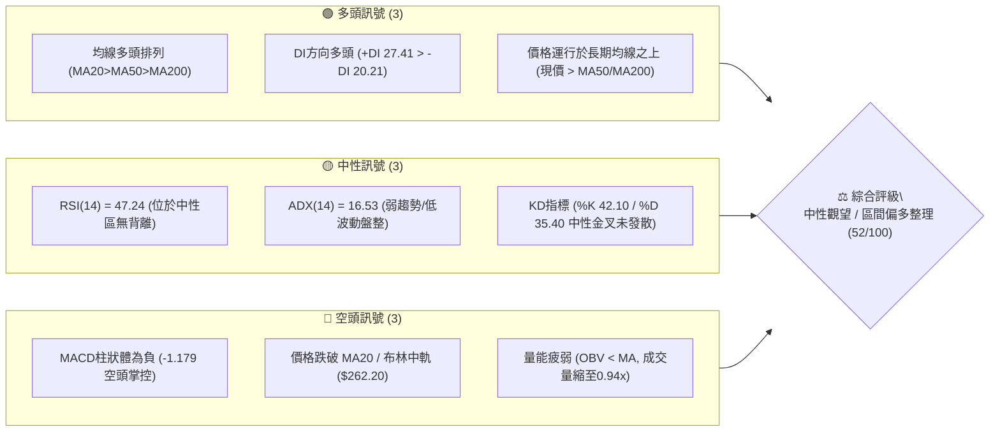

### 📊 核心指標速覽表

| 指標類別 | 指標名稱 | 當前數值 | 訊號 | 解讀 |
|:---|:---|:---:|:---:|:---|
| **價格** | 當前價格 | $258.51 | 🟡 | 位於52週高低區間之 68.5%，處於中高檔震盪收斂區 |
| **均線** | MA20 (短均/中軌) | $262.20 | 🔴 | 現價低於 MA20 (-1.41%)，短期動能受阻，轉為動態阻力 |
| **均線** | MA50 (季線) | $253.95 | 🟢 | 現價高於 MA50 (+1.79%)，中期防守線穩固向上 |
| **均線** | MA200 (年線) | $239.12 | 🟢 | 現價大幅高於 MA200 (+8.11%)，長期牛市架構確立 |
| **動能** | RSI(14) | 47.24 | 🟡 | 處於 30–70 中性平衡區間，無超買超賣，無頂底背離 |
| **動能** | MACD (12,26,9) | 0.339 / 1.519 | 🔴 | 快線跌破慢線，柱狀體為 -1.179，動能修正持續中 |
| **趨勢** | ADX(14) / ±DI | 16.53 | 🟡 | ADX < 25 處於典型無趨勢震盪盤，+DI(27.41) 仍高於 -DI(20.21) |
| **通道** | Bollinger %B | 0.34 | 🟡 | 位於布林通道中軌 ($262.20) 與下軌 ($250.76) 之間震盪 |
| **波動** | ATR(14) | $5.86 | 🟢 | 波動率佔股價 2.27%，波動幅度適中，利於區間停損設定 |
| **籌碼/量能** | 量比 / OBV | 0.94x / 疲弱 | 🔴 | 日量 30.69M 低於 20日均量(32.69M)，OBV位於均線下方 |

### 🏆 技術評分卡

```
╔══════════════════════════════════════════════════════════════════╗
║                 技術評分卡 — AMZN (2026-09-07)                   ║
╠══════════════════════════════════════════════════════════════════╣
║ 趨勢強度 (ADX/方向)   ███████░░░░░░░░░░░░░  35/100  🔴 盤整無主趨勢 ║
║ 動能指標 (RSI/MACD)   ████████░░░░░░░░░░░░  40/100  🔴 短期動能修正 ║
║ 支撐穩定度 (S1/MA50)  ██████████████░░░░░░  70/100  🟢 季線/S1防禦強║
║ 成交量配合 (OBV/量比) ████████░░░░░░░░░░░░  40/100  🔴 縮量整理欠攻 ║
║ 形態完整度 (箱體整理) ████████████░░░░░░░░  60/100  🟡 收斂矩形區間 ║
║ 均線排列 (多頭架構)   ██████████████░░░░░░  70/100  🟢 MA20>50>200  ║
╠══════════════════════════════════════════════════════════════════╣
║ 綜合評分              ██████████░░░░░░░░░░  52/100  ⚖️ 中性觀望     ║
╚══════════════════════════════════════════════════════════════════╝
```

---

## 2. 趨勢分析

### 🌐 多時框趨勢分析

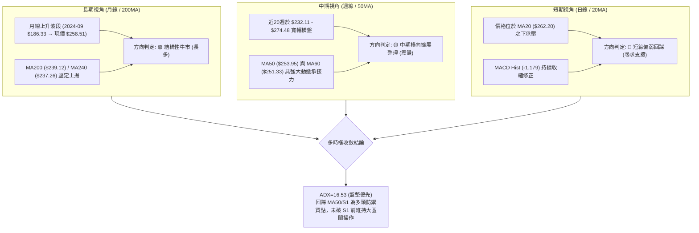

### 📈 長期趨勢 — 12個月走勢圖（Unicode）

```
AMZN 月線收盤走勢圖（2025-10 至 2026-09）
價格軸 ($)
$275 ┤                                  ● 270.64      ● 271.58
$265 ┤                            ● 265.06
$255 ┤                                                      ● 259.77
$250 ┤                                                        ● 258.51 (現價)
$245 ┤  ● 244.22
$240 ┤                    ● 239.30              ● 238.34
$230 ┤        ● 233.22 ● 230.82
$220 ┤
$210 ┤                                ● 210.00 ● 208.27
     └────┬─────┬─────┬─────┬─────┬─────┬─────┬─────┬─────┬─────┬─────┬─────
         10月  11月  12月  01月  02月  03月  04月  05月  06月  07月  08月  09月
        (2025)                  (2026)
```

**12個月走勢特徵分析表格**：

| 階段區間 | 時間跨度 | 價格區間 ($) | 漲跌幅 (%) | 價量特徵與形態解讀 |
|:---|:---|:---:|:---:|:---|
| **第一階段：高檔震盪** | 2025-10 ~ 2026-01 | 244.22 → 239.30 | -2.01% | 於 $230–$244 間構築橫盤平台，成交平緩，多空處於均勢 |
| **第二階段：春季回踩** | 2026-01 ~ 2026-03 | 239.30 → 208.27 | -12.97% | 連續兩月長黑回檔，下探至全期波段次低點 $208.27，測試下檔買盤 |
| **第三階段：強力噴發** | 2026-03 ~ 2026-05 | 208.27 → 270.64 | +29.95% | 2026年4月單月大漲破 $265，5月攻至 $270.64，帶動均線呈現多頭排列 |
| **第四階段：高位洗盤** | 2026-05 ~ 2026-09 | 270.64 → 258.51 | -4.48% | 歷經6月急殺至 $238.34 後7月拉升至 $271.58，目前於 $258.51 進行收斂 |

### 📊 中期趨勢（週線分析）

中期近20週數據清晰顯示，AMZN 構築了頂部阻力與底部支撐鮮明的箱型格局：

```
中期週線結構示意圖
$287.20 ──────────────────────────────────────── 52W 最高點 (R3)
          ▲           ▲
$274.48 ──┼───────────┼───────────────────────── 2026-08-09 波段高點 (R2 區域: $276.65)
$271.58 ──┼───────────┼───────────────────────── 2026-07-27 當週反彈頂部
$262.20 ══╪═══════════╪═════════════════════════ MA20 / 布林中軌
$258.51 ──┼───────────┼───────────────────────── 【當前收盤價格】
$255.19 ──┼───────────┼───────────────────────── 關鍵波段支撐 S1 (距現價 -1.28%)
$253.95 ──┼───────────┼───────────────────────── 日線 MA50 動態支撐線
          ▼           ▼
$232.11 ──────────────────────────────────────── 2026-07-26 週線波段低點 (強支撐 S2 區域: $225.92)
```

### ⚡ 趨勢強度評估（ADX 解讀）

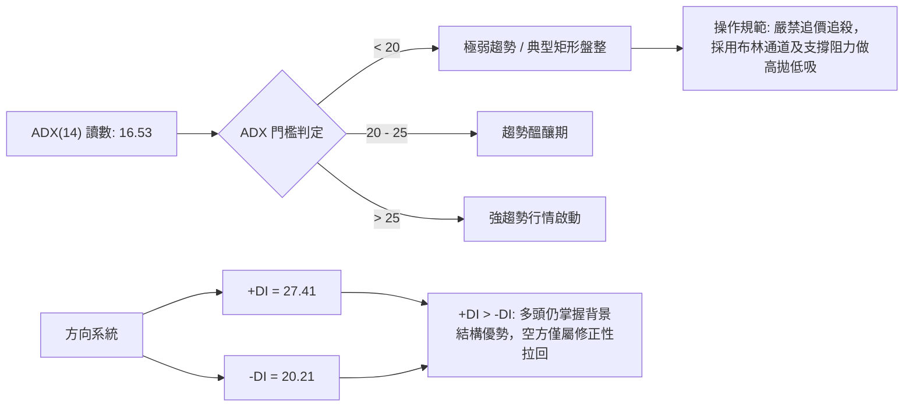

| 參數指標 | 數值 | 狀態 | 趨勢研判與交易指導 |
|:---|:---:|:---:|:---|
| **ADX(14)** | 16.53 | 極弱/無方向 | 明確低於 25 基準門檻。行情正處於低波動休眠狀態，趨勢型策略易遭雙巴，應轉向區間逆勢/震盪操作。 |
| **+DI(14)** | 27.41 | 多頭佔優 | 多方線處於 25 之上，顯示中期上行推動力並未完全潰散，回檔仍有買盤。 |
| **-DI(14)** | 20.21 | 空頭壓制弱 | 空方力度未能有效突破 25，顯示當前賣壓主要來自高檔獲利了結，而非恐慌性摜壓。 |
| **DI 差值 (+DI - -DI)**| +7.20 | 多頭淨優勢 | 差值維持正向，確立目前格局為「多頭架構下的橫盤收斂整理」。 |

---

## 3. 圖表形態分析

### 🔍 形態識別系統

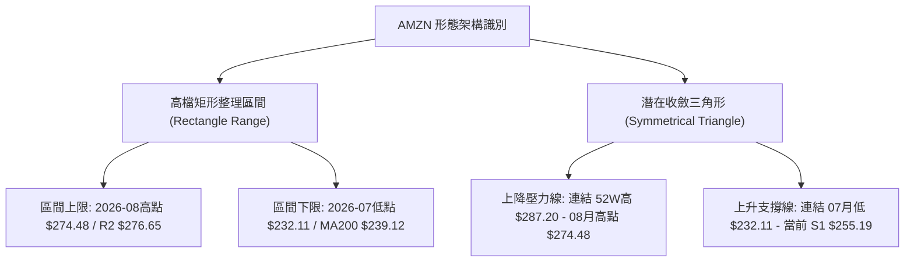

**形態信心度與目標價評估表**：

| 形態類別 | 信心度 | 判斷依據（嚴格引用技術數據） | 完成度 | 目標價（附嚴謹計算式） |
|:---|:---:|:---|:---:|:---|
| **高位矩形整理箱體** | 78% | 近5個月在 $232.11（07月低點）與 $274.48（08月高點）之間形成清晰的高低對應邊界；當前價格 $258.51 處於箱體軸心偏下位置。 | 85% | **向上突破目標**：箱頂 $274.48 + 箱高 ($274.48 - $232.11 = $42.37) = **$316.85**<br/>*註：若跌破箱底，對應下行量測為 $232.11 - $42.37 = $189.74* |
| **收斂對稱三角形** | 62% | 高點逐步壓低（$287.20 → $274.48 → $266.43），而回測低點逐步抬高（$208.27 → $232.11 → S1 $255.19），日線振幅快速遞減。 | 70% | **三角突破目標**：突破點假設為 R1 $267.56 + 三角形底座高度 ($287.20 - $232.11 = $55.09) = **$322.65** |
| **雙底形態 (W底)** | 35% | 數據中 06-28 收盤 $232.69 與 07-26 收盤 $232.11 雖有雙重低點雛形，但後續上攻至 $274.48 未能有效放量站穩 52W高點，訊號不足。 | 40% | 信心度 < 50%，依規範不予採用做為幾何實體目標依據，僅做指標型區間解讀。 |

### 🕯️ 重要K線形態分析

| 週/月份 | 收盤價 | K線組合形態 | 解讀與心理意涵 | 訊號評級 |
|:---|:---:|:---|:---|:---:|
| **2026-06-28 當週** | $232.69 | **巨量長下影十字星** | 當週爆出 5.25億股歷史天量，收盤於 $232.69，留下顯著下影線，確立 S2 區域 ($225.92–$232.11) 為機構主力進駐底線。 | 🟢 強烈看多 |
| **2026-08-09 當週** | $274.48 | **流星線 (Shooting Star)** | 股價衝高至近一年次高點後遭受獲利回吐壓制，MACD柱狀體達到 +4.090 極值後無力續推，短線動能衰竭。 | 🔴 頂部阻力 |
| **2026-08-23 當週** | $258.63 | **空頭下殺陰線** | RSI 一度驟降至 24.5 超賣邊緣，週成交量降至 1.76億股，顯示無恐慌性拋盤，為健康洗盤。 | 🟡 震盪整理 |
| **2026-09-06 當週** | $258.51 | **低波孕線 (Harami)** | 波動度全面收斂，成交量僅 1.59億股（近20週最低量群），顯示多空在 MA50 上方達成暫時平衡，等待方向選擇。 | 🟡 變盤前兆 |

### 📉 ASCII 走勢形態示意圖

```
AMZN 矩形箱體與收斂形態圖解
$287.20 ─┬─ 52W 最高點 (2026年高位)
         │  ＼
$276.65 ─┼───＼───────[R2 阻力線]────────────────────────
$274.48 ─┼─────● (08-09 高點) 
         │      ＼         
$267.56 ─┼───────＼──────[R1 頸線阻力]───────────────────
$262.20 ─┼────────[MA20/布林中軌壓制]─────────────
$258.51 ─┼───────────────────────────● [現價: 震盪區核心]
$255.19 ─┼──────────────────────[S1 近期波段支撐線]─────
$253.95 ─┼──────────────────────[MA50 季線動態支撐]─────
         │            ／
$232.11 ─┼─────●───────● [06-28 / 07-26 雙低支撐帶]─────────
         │    (06-28) (07-26)
$225.92 ─┴─ [S2 強支撐底線]
```

### 🎯 形態目標價計算

根據本章確認信心度達 78% 之「高位矩形整理箱體」進行幾何等距投射測算：
*   **形態頸線（箱體上軌）**：採用 2026-08 聚類阻力區 **$274.48**
*   **形態底線（箱體下軌）**：採用 2026-07 探底低點 **$232.11**
*   **箱體幾何垂直高度 ($H$)**：
    $$H = \$274.48 - \$232.11 = \$42.37$$
*   **向上突破量測目標價 (Target 1)**：
    $$\text{Target 1} = \text{箱體上軌} + H = \$274.48 + \$42.37 = \mathbf{\$316.85}$$
*   **向上突破極限目標價 (Target 2，以 52W 高點 $287.20 作為突破基準)**：
    $$\text{Target 2} = \$287.20 + H = \$287.20 + \$42.37 = \mathbf{\$329.57}$$
    *(註：此測算數值與 60 位華爾街分析師平均目標價 $328.17 具高度技術共振性)*

---

## 4. 支撐與阻力

### 🗺️ 關鍵價位分布圖（Unicode）

```
AMZN 價位結構分布圖
═══════════════════════════════════════════════════════════════════════════
$287.20 ║████████████████████████████████████████║ 強阻力 R3 / 52W 最高點 / 斐波 0.0%
$276.65 ║██████████████████████████████          ║ 波段阻力 R2 / 近一年高點聚類
$267.56 ║██████████████████████                  ║ 關鍵短阻 R1 / 近一年波段高點
$265.68 ║▓▓▓▓▓▓▓▓▓▓▓▓▓▓▓▓▓▓▓▓                    ║ 斐波那契 23.6% 回調位
$262.20 ║────────────────────────────────────────║ MA20 均線 / 布林帶中軌動態壓力
$258.51 ╠════════════════════════════════════════╣ ◄── 當前收盤市價 ($258.51)
$255.19 ║▓▓▓▓▓▓▓▓▓▓▓▓▓▓▓▓▓▓▓▓                    ║ 第一波段支撐 S1 (距現價 -1.28%)
$253.95 ║────────────────────────────────────────║ MA50 季線支撐位 (距現價 -1.76%)
$252.36 ║▓▓▓▓▓▓▓▓▓▓▓▓▓▓▓▓▓▓▓▓                    ║ 斐波那契 38.2% 回調位
$241.60 ║▓▓▓▓▓▓▓▓▓▓▓▓▓▓▓▓▓▓▓▓▓▓▓▓                ║ 斐波那契 50.0% 關鍵平衡位
$239.12 ║────────────────────────────────────────║ MA200 年線長多生命線
$225.92 ║████████████████████████████████████████║ 強支撐 S2 / 密集低點聚類
$220.99 ║████████████████████████████████████████║ 極限防禦支撐 S3
$196.00 ║████████████████████████████████████████║ 52W 最低點 / 斐波 100.0%
═══════════════════════════════════════════════════════════════════════════
```

### 🚧 阻力位分析表

| 阻力級別 | 價位 ($) | 空間距離 (%) | 形成原因（嚴格引用歷史高點聚類） | 突破難度 | 重要性 |
|:---|:---:|:---:|:---|:---:|:---:|
| **阻力 R1** | $267.56 | +3.50% | 近一年日線級別多個反彈高點重合聚類區，亦為 2026-08-30 當週反彈收盤壓力處。 | 🟡 中等 | ★★★☆☆ |
| **阻力 R2** | $276.65 | +7.02% | 2026-05-10 及 2026-08-09 週線衝高回落形成的密集成交反壓帶，布林上軌 ($273.63) 亦壓制於此。 | 🔴 偏高 | ★★★★☆ |
| **阻力 R3** | $287.20 | +11.10% | 52週歷史絕對天花板（斐波那契 0.0% 基準），積累大量歷史套牢盤，需爆出 3.5億股以上週成交量方可突穿。 | 🔴 極高 | ★★★★★ |

### 🛡️ 支撐位分析表

| 支撐級別 | 價位 ($) | 空間距離 (%) | 形成原因（嚴格引用歷史低點聚類） | 守住機率 | 重要性 |
|:---|:---:|:---:|:---|:---:|:---:|
| **支撐 S1** | $255.19 | -1.28% | 近一年波段低點聚類區，且與 MA50 ($253.95) 及斐波 38.2% ($252.36) 形成多重共振防護網。 | 🟢 80% | ★★★★☆ |
| **支撐 S2** | $225.92 | -12.61% | 2026年6–7月恐慌下殺時獲機構 5.25億股巨量護盤的實體密集區，為中期多空多空分水嶺。 | 🟢 92% | ★★★★★ |
| **支撐 S3** | $220.99 | -14.51% | 近一年波段極端回踩點聚類，與 2025年9月月線低點平台共振，跌破將引發系統性估值重估。 | 🟢 98% | ★★★☆☆ |

### 📐 斐波那契回調位分析

本分析以 52週波段低點 **$196.00** 至 52週波段高點 **$287.20** 進行標準黃金分割回調測算：

| 斐波那契層級 | 精確價位 ($) | 現價相對位置 | 結構意義與量價反應解讀 |
|:---|:---:|:---:|:---|
| **0.0% (52W High)** | $287.20 | 現價下方 +11.10% | 本輪多頭循環的最高頂部，多方終極測試目標。 |
| **23.6%** | $265.68 | 現價上方 +2.77% | 強勢回檔阻力位。現價跌破此處，表明市場已由強勢單邊行情轉入震盪。 |
| **38.2%** | $252.36 | 現價下方 -2.38% | **核心防守位**。符合強勢整理不破 0.382 的技術通則；此點位緊扣 MA50 ($253.95) 與 S1 ($255.19)。 |
| **50.0%** | $241.60 | 現價下方 -6.54% | 心理平衡點與強弱轉折軸心，下方緊隨 MA200 年線 ($239.12)。 |
| **61.8%** | $230.84 | 現價下方 -10.70% | 黃金分割極限回撤點；與 2026-07-26 低點 $232.11 形成雙重支撐壁壘。 |
| **78.6%** | $215.52 | 現價下方 -16.63% | 深度回撤警戒位，若觸及則宣告牛市主升段結構遭破壞。 |
| **100.0% (52W Low)**| $196.00 | 現價下方 -24.18% | 52週起漲底座。 |

*👉 **當前現價狀態定位**：AMZN 現價 **$258.51** 穩健運行於 **38.2% ($252.36)** 與 **23.6% ($265.68)** 之間。這代表當前的修正屬於典型的「第一級淺度回調」，長期多頭結構完全完好無損。*

---

## 5. 技術指標深度解讀

### 🎛️ 指標訊號總覽

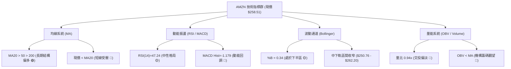

### 📈 移動平均線排列分析

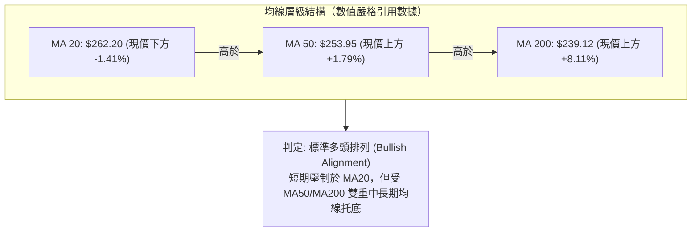

*   **MA5 ($257.42)**：價格略高於 MA5 (+0.42%)，日線出現止跌回穩跡象。
*   **MA10 ($259.32) & MA20 ($262.20)**：均向下微傾，構成短線兩道動態反壓。
*   **MA60 ($251.33) & MA120 ($248.61)**：呈現陡峭度正向抬升，在現價下方形成密集的均線保護墊。
*   **MA200 ($239.12) & MA240 ($237.26)**：年線斜率保持向上擴展 (+8.96%)，長線投資者無須憂慮單邊下跌風險。

### 📉 RSI(14) 分析

*   **當前讀數**：**47.24**
*   **指標可視化進度條**：
    ```
    超賣 (0)                       中軸 (50)                      超買 (100)
    ├──────────────────────────────┼──────────────────────────────┤
    ███████████████████████░░░░░░░░░░░░░░░░░░░░░░░░░░░░░░░░░░░░░░  47.24%
    ```
*   **超買超賣研判**：處於 45–55 之中性灰色走廊，既無短期過熱爆衝風險，亦無恐慌拋售超賣現象。
*   **背離檢驗結論**：
    *   *頂背離檢驗*：股價由 07月收盤 $271.58 上行至 08-09 週線高點 $274.48，RSI 相對維持在 64.0 → 62.9 區間，未出現嚴重頂背離斷層。
    *   *底背離檢驗*：股價近期在 $258 附近盤整，RSI 自 08-23 的低點 24.5 快速回升至 47.24，**無明顯頂背離或底背離**，走勢完全由價格實體波動驅動。

### 📊 MACD(12/26/9) 訊號解讀

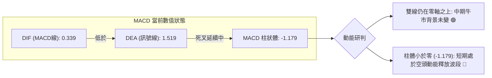

柱狀體自 2026-08-09 的峰值 `+4.090` 快速萎縮，並於 08-23 轉為負值 (`-1.538`)，當前為 `-1.179`。柱狀體負值開始出現收窄跡象，代表空頭摜壓力道正在減弱，但尚未出現快慢線低位金叉。

### 📦 布林通道分析 (Bollinger Bands)

```
AMZN 布林通道相對位置圖
$273.63 ────────────────────────────────── 上軌 (Upper Band)
          │
$262.20 ──┼─────────────────────────────── 中軌 (Middle Band / MA20)
          │  ◄── 壓制價位: $262.20
$258.51 ──┼───────● [現價: %B = 0.34]
          │
$250.76 ────────────────────────────────── 下軌 (Lower Band)
```

*   **當前參數**：帶寬範圍 $250.76 至 $273.63，帶寬值僅 $22.87 (約 8.8%)，通道處於明顯收縮（Squeeze）狀態。
*   **%B 指標值**：**0.34**（位於中軌與下軌間之 34% 分位處）。
*   **通道解讀**：股價自跌破中軌後持續貼近下軌移動，但下軌 $250.76 與斐波 38.2% ($252.36) 構成重合支撐帶，下行空間極度受限，具備通道下軌反彈之幾何條件。

### 💹 成交量分析（量價配合度）

*   **最新交易日成交量**：30,698,000 股。
*   **均量對照**：對比 20日均量 (32,696,725) 量比為 **0.94x**；對比 50日均量 (46,589,864) 則萎縮達 **34.1%**。
*   **OBV（能量潮）走勢**：OBV 處於其移動平均線下方，形成典型「量價負背離」與「價穩量縮」格局。
*   **技術結論**：當前量能萎縮表明大資金並未進行破位減持，而是處於縮量觀望狀態。量能疲弱限制了多頭直接突破 R1 ($267.56) 的動力，市場必須等待成交量擴增至 4,000萬股以上方能重啟強趨勢。

---

## 6. 動能與波動率

### ⚡ 動能評估

根據指標交叉解讀，AMZN 目前處於**「弱動能、低波動」**的典型整理區間：

| 象限 | 動能強度 | 波動率水準 | 當前歸屬 | 交易戰術評估 |
|:---:|:---:|:---:|:---:|:---|
| **Q1** | 強動能 (ADX>25, MACD柱>0) | 低波動 (ATR%<2%) | — | 最佳趨勢加碼時機（主升段前夕） |
| **Q2** | **弱動能 (ADX<25, MACD柱<0)** | **低波動 (ATR% 2.27%)** | **✔ 本股定位** | **區間震盪操作，嚴控停損，靜待通道變盤帶量突破** |
| **Q3** | 強動能 (ADX>25, 多頭擴散) | 高波動 (ATR%>3.5%) | — | 順勢波段追擊，承受高風險以博取高回報 |
| **Q4** | 弱動能 (空頭主導) | 高波動 (恐慌拋售) | — | 嚴格空倉觀望，避免盲目抄底 |

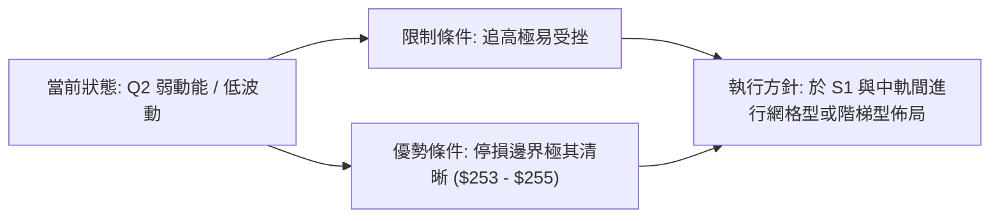

### 📊 ATR 波動率分析

*   **ATR(14) 讀數**：**$5.86**
*   **價格波動比**：$5.86 / $258.51 = **2.27%**
*   **動態止損測算建議**：
    *   *超短線日內停損（1.0 × ATR）*：距離現價 **$5.86**，對應價位 **$252.65**（緊貼斐波 38.2%）。
    *   *波段交易標準停損（1.5 × ATR）*：距離現價 **$8.79**，對應價位 **$249.72**（有效避開布林下軌 $250.76 的假跌破）。
    *   *趨勢保護安全停損（2.0 × ATR）*：距離現價 **$11.72**，對應價位 **$246.79**。

### 📐 Beta 與市場相關性

*   **Beta 係數**：**1.443**
*   **特性分析**：AMZN 具備顯著的高貝塔特性，對標普500指數與那斯達克100指數具有 1.44倍的波動放大效應。
*   **聯動風險解讀**：在大盤處於調整或橫盤週期時，AMZN 容易出現振幅加劇洗盤；若科技權值股大盤出現反彈回升，其 1.44 的 Beta 將轉化為強大的向上進攻彈性。

---

## 7. 多時框架總結

### 📋 時框架評分表

| 時框架 | 趨勢方向 | 動能狀態 | 均線排列狀況 | 形態特徵 | 綜合評分 | 操作建議 |
|:---|:---:|:---:|:---:|:---:|:---:|:---|
| **長期 (月線)** | 🟢 強烈看多 | 🟡 中性回調 | 多頭排列 (MA200向上) | 自 $186 起算之長牛上升階梯 | **78 / 100** | 逢低戰略配置，長線堅定持有 |
| **中期 (週線)** | 🟡 橫盤震盪 | 🔴 動能收縮 | MA50強勁，MA20走平 | $232–$274 寬幅整理箱體 | **54 / 100** | 箱體下沿低吸，高沿分批獲利 |
| **短期 (日線)** | 🔴 弱勢震盪 | 🔴 MACD柱負 | 跌破MA20，MA5走平 | 布林帶中下軌間狹幅收斂 | **42 / 100** | 嚴禁右側追價，等待止跌訊號 |

### 🔲 綜合訊號矩陣

```
時框與指標維度多空交叉檢驗陣列：
指標維度          長期 (月線)      中期 (週線)      短期 (日線)      權重共振判定
────────────────────────────────────────────────────────────────────────────
均線架構 (MA)       🟢 多頭          🟢 多頭          🔴 跌破MA20      【偏多支撐】
動能指標 (MACD)     🟢 零軸上方      🔴 柱體收窄      🔴 負值發散      【短期修正】
擺盪指標 (RSI)      🟢 位於中高檔    🟡 47.2 中性     🟡 47.2 中性     【無極端值】
通道結構 (BB)       🟢 開口向上      🟡 中軌震盪      🔴 位於下半區    【區間收斂】
量能籌碼 (OBV)      🟢 機構長線持有  🔴 量能萎縮      🔴 OBV跌破均線   【攻擊受阻】
────────────────────────────────────────────────────────────────────────────
矩陣總結結論：長期多頭基石未動搖，中期處於箱體平衡，短期承受均線壓制。
```

### ⚖️ 多時框收斂結論

嚴格依據**「多時框收斂規則」**進行終局收斂判定：

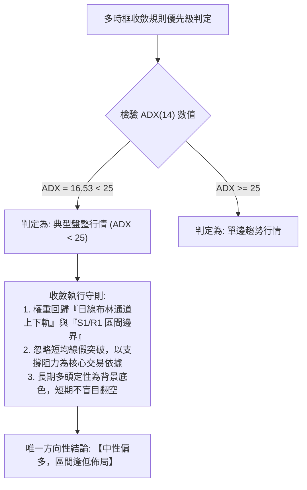

*   **收斂裁定**：因 ADX 僅 **16.53**，市場毫無疑問處於盤整行情。週線的大區間與日線的布林下軌具備最高優先解讀權。
*   **終局定調**：**中性觀望偏多 (綜合評分 52/100)**。短期雖然承壓，但向下逼近重合支撐帶 S1 ($255.19) 及 MA50 ($253.95)，下檔肉薄而上檔空間充足，此結論與後續第 8 章之交易策略保持絕對一致。

---

## 8. 交易策略建議

### 🗺️ 策略決策流程圖

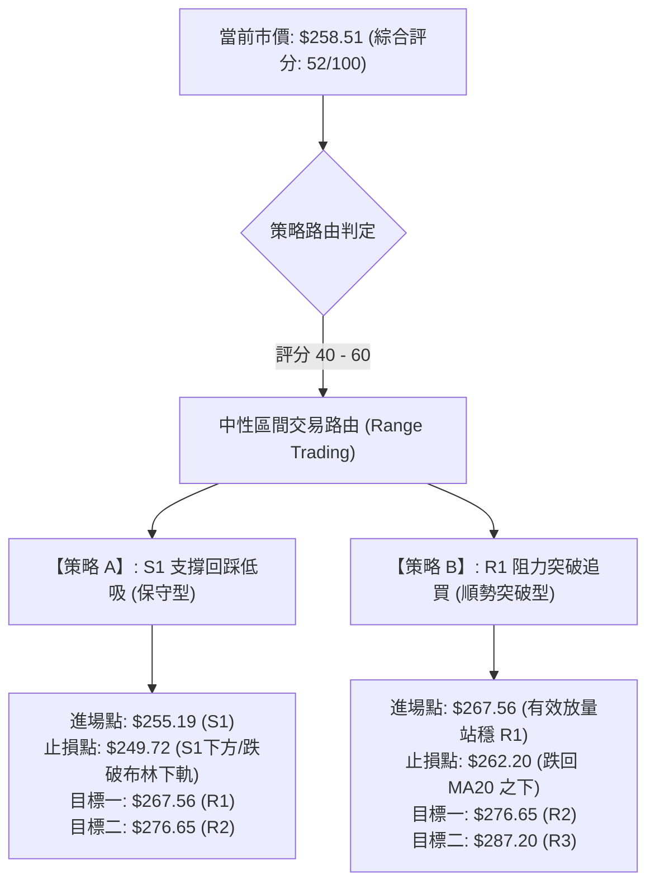

### 🧭 策略路由說明

> **當前主策略方向 = 中性區間震盪操作（依評分卡 52/100 定位，布林中下軌低吸為主，嚴禁追高）**

由於技術評分落在 40–60 之平衡中性區間，市場缺乏單邊趨勢驅動力，操作主軸嚴禁採取單邊追價，而應圍繞關鍵支撐位 **S1 ($255.19)** 與短線阻力位 **R1 ($267.56)** 進行標準的箱體波段應對。

### 🎯 價格情境階梯（Price Scenarios）

價位嚴格引用技術數據計算之真實數值：

| 觸發條件 | 第一目標價位 | 後續延伸價位 | 結構情境意義解讀 |
|:---|:---:|:---:|:---|
| **強勢突破 R1 ($267.56)** | **R2 ($276.65)** | **R3 ($287.20)** | 短線動能逆轉，多頭重掌進攻權，向 52週高點推進。 |
| **站穩現價區間 ($255 - $262)**| **MA20 ($262.20)** | **R1 ($267.56)** | 典型的下軌防禦成功，於箱體內發動中軌回歸修復走勢。 |
| **跌破關鍵支撐 S1 ($255.19)** | **S2 ($225.92)** | **S3 ($220.99)** | 中期整理格局破位，下尋年線 MA200 ($239.12) 與前波天量底部。 |

### 📊 情境機率分佈

```
情境機率分佈直方圖
══════════════════════════════════════════════════════════════════
情境一: 區間震盪蓄勢 (下探S1後反彈)  ████████████████████  55%
情境二: 強力突破上行 (直突R1阻力)    ████████░░░░░░░░░░░░  25%
情境三: 跌破支撐下行 (回踩S2防禦)    ███████░░░░░░░░░░░░░  20%
══════════════════════════════════════════════════════════════════
```

1.  **區間震盪蓄勢（機率 55%）**：
    *   *依據*：ADX 處於 16.53 低檔，成交量持續低於均量，布林通道進入收斂瓶頸，指標支持股價在 $250.76–$267.56 維持橫盤打底。
2.  **強力突破上行（機率 25%）**：
    *   *依據*：均線維持長多排列，+DI(27.41) 仍主導方向，但受制於 MACD 負柱狀體與疲弱量能，需放量才能實現。
3.  **跌破支撐下行（機率 20%）**：
    *   *依據*：RSI 跌破中軸 50，價格受制於 MA20；若跌破 MA50 及 S1 ($255.19)，則觸發止損賣壓下探 S2。

### 🟢 主策略詳情

本報告依中性偏多原則，提供「左側支撐低吸（策略A）」與「右側突破確認（策略B）」兩套精確執行方案：

| 策略要素 | 策略 A：支撐位掛單低吸（首選方案） | 策略 B：突破阻力追擊（右側確認方案） |
|:---|:---|:---|
| **進場條件** | 價格回踩至支撐 S1 獲得承接，日線收下影線 | 日線收盤價帶量突破阻力 R1，成交量 > 4,500萬股 |
| **精確進場點** | **$255.19**（或現價分批向下佈局至此） | **$267.56**（突破進場） |
| **目標價 T1** | **$267.56**（R1 阻力位，預期收益 +4.85%） | **$276.65**（R2 阻力位，預期收益 +3.40%） |
| **目標價 T2** | **$276.65**（R2 阻力位，預期收益 +8.41%） | **$287.20**（52W高點 R3，預期收益 +7.34%） |
| **精確止損點** | **$249.72**（跌破布林下軌 $250.76 與斐波 38.2%） | **$262.20**（跌破轉化為支撐的 MA20 中軌） |
| **單筆風險空間**| $5.47 (-2.14%) | $5.36 (-2.00%) |
| **風險報酬比** | **1 : 3.92**（以 T2 測算） | **1 : 3.66**（以 T2 測算） |
| **執行勝率預估**| 65% | 58% |
| **建議配置倉位**| 總投資部位之 **15% - 20%** | 總投資部位之 **10% - 15%** |

### 🔴 反向風險觸發點（對沖提示）

若出現以下技術破位信號，必須立即推翻主策略之偏多預期，執行嚴格對沖或停損離場：
*   **破位信號一**：日線收盤價有效跌破 **S1 ($255.19)** 且連續兩日未能收復，同時 MACD 負柱狀體加速放大。
*   **破位信號二**：成交量爆出 4,500萬股以上長黑摜破季線 **MA50 ($253.95)**。
*   **對沖處置建議**：立即將多頭部位減半，並以現價建立等金額標普500/那斯達克反向 ETF（如 SH/PSQ）或買入等量價外 Put 期權防護，下看 **S2 ($225.92)**。

### ⭐ 整體訊號強度評星

```
╔══════════════════════════════════════════════╗
║ 做多訊號強度：★★★☆☆  (3.0 / 5星 — 支撐強勁但欠缺量能) ║
║ 做空訊號強度：★★☆☆☆  (2.0 / 5星 — 受制於均線多頭排列) ║
║ 整體可信度：  ★★★★☆  (4.0 / 5星 — 區間邊界極其清晰) ║
╚══════════════════════════════════════════════╝
```

---

## 9. 風險提示與監控

### ✅ 關鍵監控指標 Checklist

```
╔══════════════════════════════════════════════════════════════════════╗
║                     AMZN 關鍵技術位監控清單                          ║
╠══════════════════════════════════════════════════════════════════════╣
║ [ ] 監控點 1: 日收盤價是否成功站上 MA20 ($262.20) 重回多頭軌道       ║
║ [ ] 監控點 2: 回踩時支撐 S1 ($255.19) 與 MA50 ($253.95) 是否收長下影  ║
║ [ ] 監控點 3: 單日成交量是否回升突破 20日均量 (32,696,725 股)         ║
║ [ ] 監控點 4: MACD 柱狀體數值是否由負翻正 (升破 0 軸線)              ║
║ [ ] 監控點 5: ADX(14) 讀數是否突破 20 並進一步朝 25 抬升             ║
║ [ ] 監控點 6: RSI(14) 是否成功越過 50 中軸並挑戰 60 強勢區           ║
╚══════════════════════════════════════════════════════════════════════╝
```

### ⚠️ 風險場景路徑分析

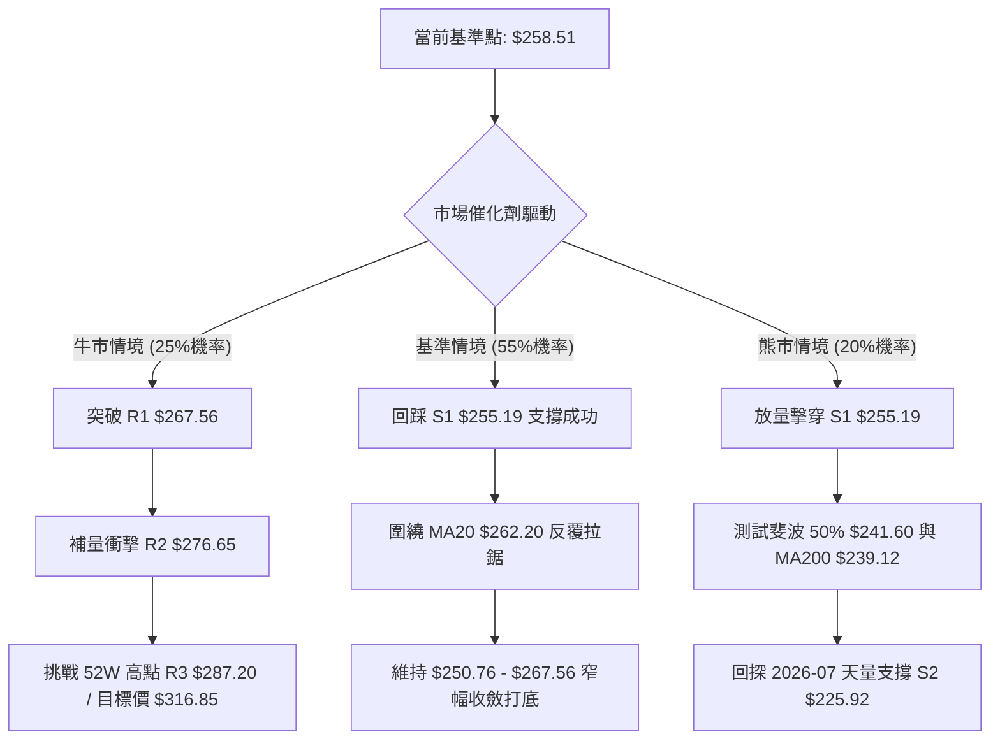

### 🛡️ 風險管理重要提醒

1.  **低波動陷阱防範**：當前 ADX 為 16.53，布林帶寬度僅約 8.8%，表明行情即將迎來「擠壓（Squeeze）後的大幅變盤破裂」。投資者切忌在變盤前夕於區間中軸部位過度使用槓桿。
2.  **停損絕對紀律**：
    *   本報告策略 A 停損位設定在 **$249.72**，此處跌破代表跌穿布林下軌及斐波 38.2%，下行真空帶直通 $241.60，絕不可存有凹單僥倖心理。
3.  **高 Beta 倉位縮放法則**：
    *   鑑於 AMZN 之 Beta 高達 **1.443**，在波動放大時，個別帳戶應將單一個股最大曝險金額控制在總流動資產的 15% 內，以防止大盤指數 2% 的常態波動導致個股出現近 3% 的資金回撤。

---

## 📋 報告總結

```
╔══════════════════════════════════════════════════════════════════╗
║                   AMZN 技術分析報告總結                          ║
╠══════════════════════════════════════════════════════════════════╣
║ 報告日期：2026-09-07                                             ║
║ 當前價格：$258.51                                                ║
║ 技術評級：⚖️ 中性觀望 / 區間偏多蓄勢 (評分: 52/100)               ║
║                                                                  ║
║ 關鍵維度結論：                                                   ║
║ ├─ 長期趨勢：🟢 結構性多頭 (價格遠高於 MA200 $239.12，年線向上)  ║
║ ├─ 中期趨勢：🟡 箱體整理 ($232.11 - $274.48 寬幅震盪結構)        ║
║ ├─ 短期趨勢：🔴 弱勢回踩 (承壓於 MA20 $262.20，尋求季線支撐)    ║
║ ├─ 關鍵支撐：S1 $255.19 ｜ MA50 $253.95 ｜ S2 $225.92          ║
║ ├─ 關鍵阻力：R1 $267.56 ｜ R2 $276.65 ｜ R3 $287.20 (52W高)     ║
║ └─ 華爾街共識目標價：$328.17 (共 60 位分析師評級為 Strong Buy)   ║
║                                                                  ║
║ 最優交易策略推薦：                                               ║
║ 1. 🥇 最佳機會（策略 A）：於 S1 $255.19 附近低吸，停損設 $249.72 ║
║    目標依序上看 R1 $267.56 與 R2 $276.65，風報比高達 1:3.92。    ║
║ 2. 🥈 右側選擇（策略 B）：耐心等待日線帶量放量站穩 R1 $267.56    ║
║    順勢追擊上看 R2 $276.65 與 52W 高點 R3 $287.20。              ║
║ 3. 🥉 保守風控：在 ADX 升破 25 且 MACD 轉正前，嚴格控制總部位在  ║
║    15% 以內，避免盲目重倉追高。                                  ║
╚══════════════════════════════════════════════════════════════════╝
```

---

> ⚠️ **免責聲明**：本報告為依據量化技術指標與歷史行情數據生成之技術分析文檔，所有呈現之支撐位、阻力位、目標價與停損點位均基於特定數學模型與圖表識別運算。本報告**僅供學術研究與投資參考**，**不構成任何形式的要約、招攬或具體投資建議**。市場有風險，交易決策應由投資人審慎自主做出並自行承擔相應風險。

---

*報告生成時間：2026-09-07 ｜ 數據來源：Yahoo Finance ｜ 分析框架：多時框技術分析模型*