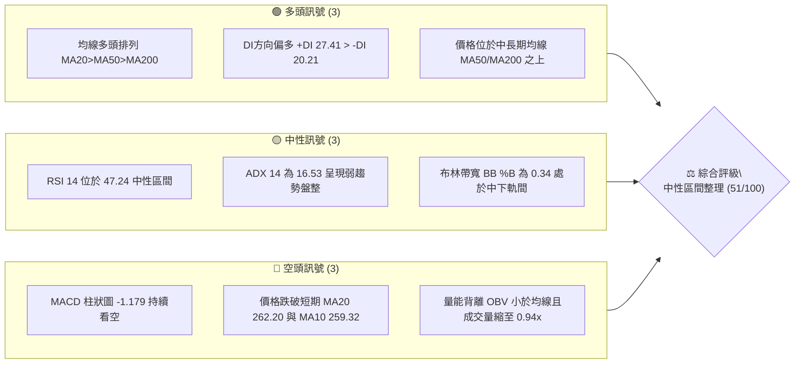
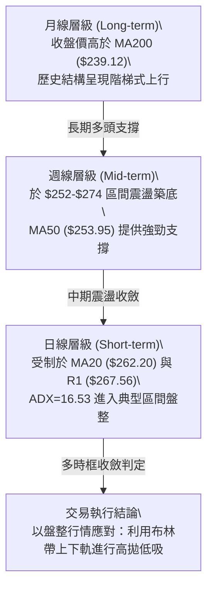
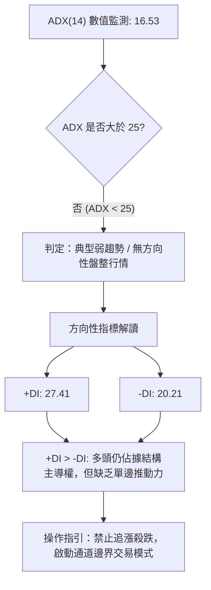
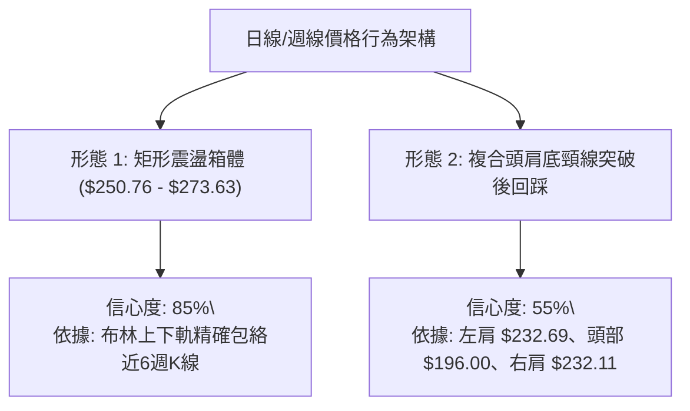
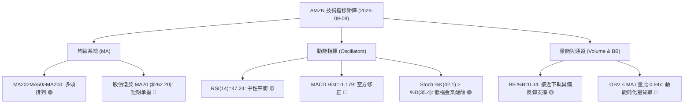
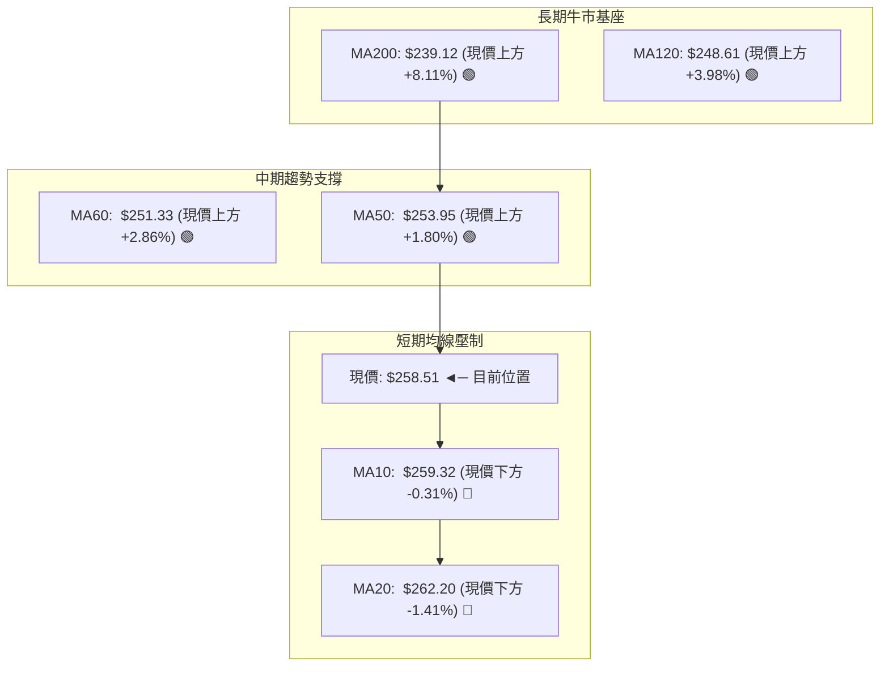
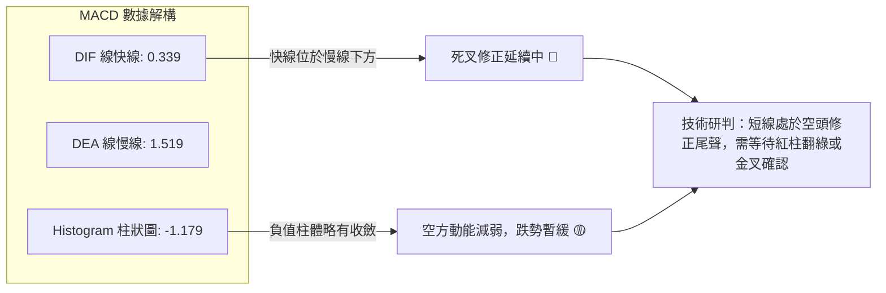
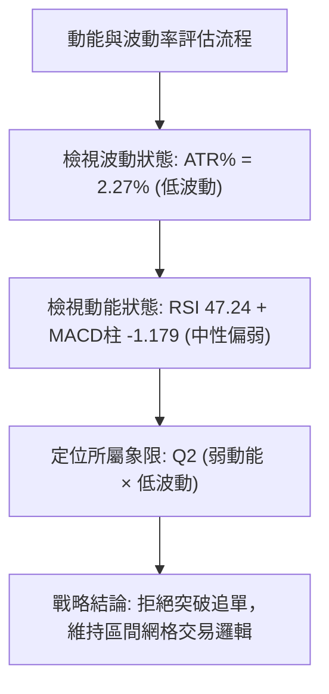
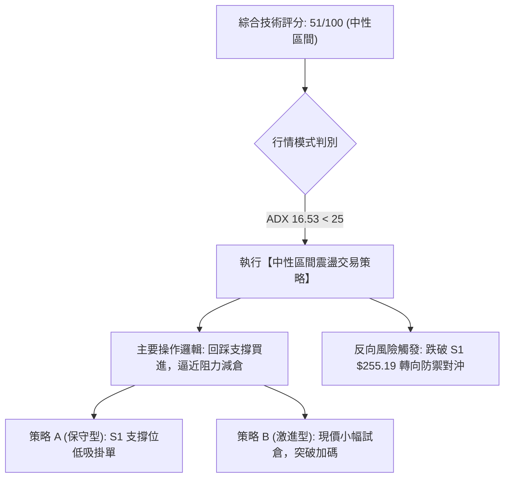
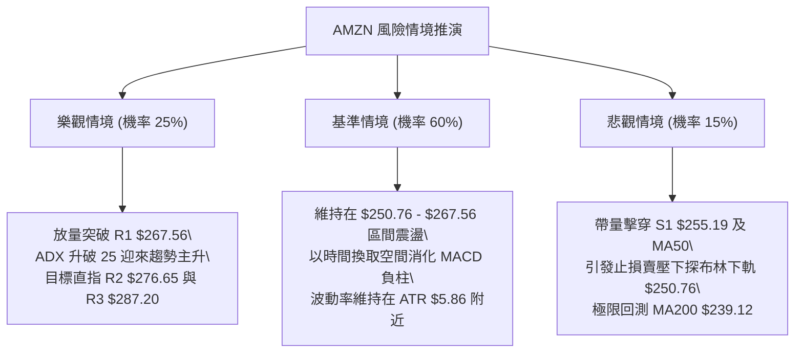

# AMZN 技術分析報告

> **報告日期**：2026-09-08 ｜ **語言**：繁體中文 ｜ **數據來源**：Yahoo Finance ｜ **當前價格**：$258.51

---

## 目錄

| 章節 | 內容 |
|------|------|
| [1. 技術面概覽](#1-技術面概覽) | 訊號儀表板、核心指標、評分卡 |
| [2. 趨勢分析](#2-趨勢分析) | 多時框趨勢、長中短期走勢 |
| [3. 圖表形態分析](#3-圖表形態分析) | 形態識別、K線組合、目標價 |
| [4. 支撐與阻力](#4-支撐與阻力) | 關鍵價位、斐波那契回調 |
| [5. 技術指標深度解讀](#5-技術指標深度解讀) | MA/RSI/MACD/布林/成交量 |
| [6. 動能與波動率](#6-動能與波動率) | 動能評估、ATR、Beta |
| [7. 多時框架總結](#7-多時框架總結) | 時框架評分矩陣 |
| [8. 交易策略建議](#8-交易策略建議) | 多空策略、風險報酬比 |
| [9. 風險提示與監控](#9-風險提示與監控) | 監控指標、風險場景 |

---

## 1. 技術面概覽

### 🎯 技術訊號儀表板



### 📊 核心指標速覽表

| 指標類別 | 指標名稱 | 當前數值 | 訊號 | 解讀 |
|----------|----------|----------|------|------|
| **價格** | 當前價格 | $258.51 | 🟡 | 位於52週高低區間之 68.5% 處，處於短線回調整理階段 |
| **均線** | MA20 | $262.20 | 🔴 | 價格低於 MA20（-$3.69，-1.41%），短線承壓於月線下方 |
| **均線** | MA50 | $253.95 | 🟢 | 價格高於 MA50（+$4.56，+1.80%），中期上升生命線結構穩健 |
| **均線** | MA200 | $239.12 | 🟢 | 價格大幅高於 MA200（+$19.39，+8.11%），長期牛市基底完好 |
| **動能** | RSI(14) | 47.24 | 🟡 | 處於 30-70 中性走廊，無極端超買或超賣，短線動能趨緩 |
| **動能** | MACD | -1.179(柱) | 🔴 | DIF 0.339 低於 DEA 1.519，MACD 柱狀圖呈現負值擴散，空方主導修正 |
| **波動** | ATR(14) | $5.86 | 🟡 | 佔股價 2.27%，日均波幅適中，市場處於低波動壓縮期 |

### 🏆 技術評分卡

```
╔══════════════════════════════════════════════════════════════════╗
║                技術評分卡 — AMZN (2026-09-08)                    ║
╠══════════════════════════════════════════════════════════════════╣
║ 趨勢強度 (ADX=16.53)   ██████░░░░░░░░░░░░░░  32/100  🔴 弱勢盤整 ║
║ 動能指標 (MACD/RSI)    ████████░░░░░░░░░░░░  42/100  🔴 短線偏空 ║
║ 支撐穩定度 (S1/MA50)   ██████████████░░░░░░  70/100  🟢 買盤厚實 ║
║ 成交量配合 (OBV/Vol)   ████████░░░░░░░░░░░░  38/100  🔴 量能萎縮 ║
║ 形態完整度 (區間箱體)   ████████████░░░░░░░░  60/100  🟡 整理待變 ║
║ 均線架構 (MA20/50/200) ██████████████░░░░░░  68/100  🟢 多頭排列 ║
╠══════════════════════════════════════════════════════════════════╣
║ 綜合評分               ██████████░░░░░░░░░░  51/100  🟡 中性觀望 ║
╚══════════════════════════════════════════════════════════════════╝
```

---

## 2. 趨勢分析

### 🌐 多時框趨勢分析



### 📈 長期趨勢 — 12個月走勢圖（Unicode）

```
AMZN 月線走勢圖（過去12個月：2025-10 至 2026-09）
價格軸 ($)
$275 ┤                                          ● 271.58
$270 ┤                               ● 270.64       
$265 ┤                         ● 265.06         ● 259.77
$260 ┤                                              ● 258.51 ←【現價】
$245 ┤ ● 244.22
$240 ┤                   ● 239.30         ● 238.34
$235 ┤       ● 233.22
$230 ┤           ● 230.82
$220 ┤
$210 ┤                         ● 210.00
$205 ┤                             ● 208.27 (年度次低)
     └─┬─────┬─────┬─────┬─────┬─────┬─────┬─────┬─────┬─────┬─────┬─────
      10月  11月  12月  01月  02月  03月  04月  05月  06月  07月  08月  09月
      2025                                2026
```

#### 走勢特徵分析表格

| 階段區間 | 時間段 | 起迄價格 | 區間漲跌幅 | 技術特徵與盤面結構 |
|----------|--------|----------|------------|--------------------|
| 第一階段：高檔震盪 | 2025-10 ~ 2026-01 | $244.22 → $239.30 | -2.01% | 於 $230-$244 高位築平台，量能平穩，多空形成相持 |
| 第二階段：春季回洗 | 2026-02 ~ 2026-03 | $210.00 → $208.27 | -12.97% | 快速回撤測試 52W 低點 $196.00 上方支撐，隨後快速縮量止跌 |
| 第三階段：強勁主升 | 2026-04 ~ 2026-05 | $265.06 → $270.64 | +29.95% | 伴隨放量長陽突破，創波段高點 $272.68，確立中期牛市底座 |
| 第四階段：箱體整固 | 2026-06 ~ 2026-09 | $238.34 → $258.51 | +8.46% | 經歷 6 月深幅回踩 $232.69 後強彈至 $274.48，現於 $258 窄幅蓄勢 |

### 📊 中期趨勢（週線分析）

```
近期週線壓力與支撐示意圖：
  $287.20 ────────────────────────────────────────── 52W 最高點 (強阻力 R3)
              ▲                  ▲
  $276.65 ────┼──────────────────┼───────────────── 近期反彈高點聚類 (R2)
              │   $272.68        │   $274.48
  $267.56 ────┼──────────────────┼───────────────── 形態頸線阻力 (R1)
              │                  │
  $258.51 ────┼──────────────────●───────────────── 當前價格
              │
  $255.19 ────┴──────────────────────────────────── 近期波段低點支撐 (S1) / 逼近 MA50 ($253.95)
  $232.11 ────────────────────────────────────────── 6-7月雙重下探低點
  $225.92 ────────────────────────────────────────── 中期結構防守位 (S2)
```

中期週線在 2026-05 衝高至 $272.68 後回檔，7 月末二次下探 $232.11 獲買盤強烈支撐，8 月初一舉回升至 $274.48。目前週 K 線連續 4 週在 $258-$266 區間收出十字星與小實體，成交量自 8 月初的 3.55 億股銳減至 1.59 億股，顯示籌碼沉澱，浮動賣壓逐步被消化。

### ⚡ 趨勢強度評估（ADX 解讀）



#### ADX 強度量化對照表

| 指標變數 | 當前讀數 | 門檻區間 | 趨勢屬性判定 | 操作策略權重指引 |
|----------|----------|----------|--------------|------------------|
| **ADX (14)** | **16.53** | 0 ~ 20 | 極弱趨勢 / 狹幅盤整 | 順勢突破策略失效；震盪逆勢指標（布林、KDJ）權重提升至 70% |
| **+DI** | **27.41** | > -DI | 多頭買力佔優 | 震盪偏向多方防守，回踩關鍵支撐可尋求低吸買點 |
| **-DI** | **20.21** | < +DI | 空頭賣壓受抑 | 空方動能不足以發動崩跌，下行空間受限於 S1/MA50 |

---

## 3. 圖表形態分析

### 🔍 形態識別系統



#### 形態識別與信心度量化評估表

| 形態類別 | 信心度 | 判斷依據（數據引用） | 完成度 | 目標價計算式與精確數值 |
|----------|--------|----------------------|--------|------------------------|
| **矩形震盪箱體** | **85%** | 上軌阻力受阻於 R1 $267.56 及 BB 上軌 $273.63；下軌受撐於 S1 $255.19 及 BB 下軌 $250.76 | 90% | 箱體突破向上目標 = 頸線 R1 ($267.56) + 箱高 ($267.56 - $255.19 = $12.37) = **$279.93**（逼近阻力 R2 $276.65） |
| **複合頭肩底回踩** | **55%** | 頸線位於 R1 $267.56，左肩回測 $238.34，右肩回測 $232.11，目前正處於突破頸線後的確認回踩測試 | 75% | 形態理論目標 = 頸線 $267.56 + (頸線 $267.56 - 52W低點 $196.00) = **$339.12**（受阻力 R3 $287.20 壓制需分段實現） |
| **收斂對稱三角** | **45%** | 訊號不足，信心度低於 50%，僅做指標型解讀（布林帶寬度收窄），不列為交易依據 | -- | 不予推算，嚴守紀律 |

### 🕯️ 重要K線形態分析

| 週期/月份 | 收盤價 | K線形態 | 量化技術特徵解讀 | 多空訊號 |
|-----------|--------|---------|------------------|----------|
| **2026-06** | $238.34 | 長下影大陰線 | 月線急跌後收出長達 $42 之深幅下影線，探底 $196-$208 區間後多頭逢低承接有力 | 🟡 探底回升 |
| **2026-07** | $271.58 | 光頭大陽線 | 單月飆升 +13.9%，強勢包覆前月實體，一舉突破 60MA ($251.33)，奠定反彈主基調 | 🟢 強勢吞噬 |
| **2026-08** | $259.77 | 帶上影倒錘頭小陰 | 衝高 $274.48 受阻於 R2 聚類區，單月成交量收縮，表明多頭主力在高檔不再盲目追高 | 🔴 漲勢受阻 |
| **2026-09** | $258.51 | 窄幅十字星 (當前) | 波動率極度壓縮，開盤與收盤價高度重疊，成交量同步萎縮，典型多空暫時平衡特徵 | 🟡 變盤前兆 |

### 📉 ASCII 走勢形態示意圖

```
AMZN 日線箱體與頸線結構示意圖
  $276.65 ────────────────────────────────────────── 波段高點阻力 R2
              ┌──────┐                 
  $267.56 ────┤ 頸線 ├────────▲───────────────▲───── 箱體頂部阻力 R1
              └──────┘        │               │      
                             2026-08-09      2026-08-30
                              $274.48         $266.43
                                     ╲       ╱
  $258.51 ────────────────────────────●───── 現價（箱體中軸震盪）
                                       ╲   ╱
  $255.19 ──────────────────────────────▼─────────── 箱體底部支撐 S1
                                     2026-08-23
                                      $258.63
  $250.76 ────────────────────────────────────────── 布林下軌防守線
```

### 🎯 形態目標價計算

以經過高信心度驗證的「矩形箱體突破」為主要推算模型：
1. **箱體下邊界（支撐）**：以波段低點聚類 S1 = **$255.19** 為基準。
2. **箱體上邊界（阻力）**：以波段高點聚類 R1 = **$267.56** 為基準。
3. **箱體高度 ($H$)**：
   $$H = \text{阻力位 } R1 - \text{支撐位 } S1 = \$267.56 - \$255.19 = \$12.37$$
4. **向上突破理論目標價 (T1)**：
   $$\text{Target}_1 = R1 + H = \$267.56 + \$12.37 = \$279.93$$
   *(註：此目標價高度契合關鍵阻力 R2 之 \$276.65，具備極高圖表共振效應)*
5. **向下破位量度跌幅 (D1)**：
   $$\text{DownTarget}_1 = S1 - H = \$255.19 - \$12.37 = \$242.82$$
   *(註：此價位精確落在 50.0% 斐波那契回調位 \$241.60 與 MA200 \$239.12 之上方強支撐帶)*

---

## 4. 支撐與阻力

### 🗺️ 關鍵價位分布圖（Unicode）

```
AMZN 價位結構分布圖
══════════════════════════════════════════════════════════════
$287.20 ║██████████████████████████████║ 強阻力 R3 (52W 高點 / 0.0% Fib)
        ║                              ║
$276.65 ║██████████████████████░░░░░░░░║ 阻力 R2 (近一年高點聚類區)
$273.63 ║▓▓▓▓▓▓▓▓▓▓▓▓▓▓▓▓▓▓▓▓░░░░░░░░░░║ 布林通道上軌
$267.56 ║██████████████████████████████║ 關鍵阻力 R1 (箱體上沿頸線)
$265.68 ║▒▒▒▒▒▒▒▒▒▒▒▒▒▒▒▒▒▒▒▒▒▒▒▒░░░░░░║ 斐波那契 23.6% 回調位
$262.20 ║──────────────────────────────║ 布林中軌 / MA20
$258.51 ╠══════════════════════════════╣ ◄── 現價 ($258.51)
$255.19 ║▓▓▓▓▓▓▓▓▓▓▓▓▓▓▓▓▓▓▓▓▓▓▓▓▓▓▓▓▓▓║ 近期支撐 S1 (波段低點聚類)
$253.95 ║──────────────────────────────║ 中期生命線 MA50
$252.36 ║▒▒▒▒▒▒▒▒▒▒▒▒▒▒▒▒▒▒▒▒▒▒▒▒▒▒▒▒▒▒║ 斐波那契 38.2% 回調位
$250.76 ║▓▓▓▓▓▓▓▓▓▓▓▓▓▓▓▓▓▓▓▓░░░░░░░░░░║ 布林通道下軌
        ║                              ║
$241.60 ║▒▒▒▒▒▒▒▒▒▒▒▒▒▒▒▒▒▒▒▒▒▒▒▒▒▒▒▒▒▒║ 斐波那契 50.0% 多空分水嶺
$239.12 ║──────────────────────────────║ 長期牛熊線 MA200
$225.92 ║██████████████████████████████║ 強支撐 S2 (中期雙底低點聚類)
$220.99 ║██████████████████████████████║ 極限支撐 S3 (年內深幅回撤底)
══════════════════════════════════════════════════════════════
```

### 🚧 阻力位分析表

| 阻力級別 | 價位 | 距現價幅幅 | 形成原因（依據盤面數據） | 突破難度 | 重要性 |
|----------|------|------------|--------------------------|----------|--------|
| **R1** | **$267.56** | +3.50% | 近一年波段多次衝高回落密集成交頸線；與 23.6% 斐波那契位 ($265.68) 共振 | 🟡 中等 | ★★★★☆ |
| **R2** | **$276.65** | +7.02% | 2026-08-09 週線衝高頂部 ($274.48) 聚類區，空頭重兵防守位 | 🔴 較高 | ★★★★☆ |
| **R3** | **$287.20** | +11.10% | 52週最高歷史峰值（52W High），機構多頭獲利了結極限心理關卡 | 🔴 極高 | ★★★★★ |

### 🛡️ 支撐位分析表

| 支撐級別 | 價位 | 距現價幅幅 | 形成原因（依據盤面數據） | 守住機率 | 重要性 |
|----------|------|------------|--------------------------|----------|--------|
| **S1** | **$255.19** | -1.28% | 近期波段低點聚類區；與 MA50 ($253.95) 及 38.2% 斐波那契位 ($252.36) 重疊 | 🟢 75% | ★★★★★ |
| **S2** | **$225.92** | -12.61% | 2026年6-7月築底回撤極限平台，中期多頭主力持倉成本核心區 | 🟢 90% | ★★★★☆ |
| **S3** | **$220.99** | -14.51% | 2025年秋季多頭起漲點之聚類平台，為年度級別絕對防守線 | 🟢 95% | ★★★☆☆ |

### 📐 斐波那契回調位分析

依據 52 週完整波動區間（低點 **$196.00** 至 高點 **$287.20**，總波幅 $91.20）計算之精確回調階梯：

```
0.0%  (52W High) ────────────────────────── $287.20 (R3 強阻力)
23.6% ─────────── ░░░░░░░░░░░░░░░░░░░░░░░ ── $265.68 (上檔短線反彈壓力)
                 【現價 $258.51 運行區間】
38.2% ─────────── ▓▓▓▓▓▓▓▓▓▓▓▓▓▓▓▓▓▓▓▓▓▓▓ ── $252.36 (第一道黃金防守位)
50.0% ─────────── ────────────────────────── $241.60 (多空力量平衡分水嶺)
61.8% ─────────── ────────────────────────── $230.84 (黃金分割強支撐帶)
78.6% ─────────── ────────────────────────── $215.52 (深度回撤警戒位)
100.0%(52W Low)  ────────────────────────── $196.00 (年度極端低點)
```

- **位置解讀**：現價 **$258.51** 處於 23.6% ($265.68) 與 38.2% ($252.36) 之間。
- **技術意義**：在強勢上漲行情中，回調未跌破 38.2% ($252.36) 即屬於極為強勢的「強勢整理」結構。只要 AMZN 日線收盤價穩守於 38.2% 關鍵位之上，中長期多頭主升趨勢即保持完整，後市具備再度挑戰高點 $287.20 的技術潛力。

---

## 5. 技術指標深度解讀

### 🎛️ 指標訊號總覽



### 📈 移動平均線排列分析



#### 移動平均線量化數據表

| 均線名稱 | 當前數值 | 偏離現價幅度 | 走勢斜率特徵 | 技術信號解讀 |
|----------|----------|--------------|--------------|--------------|
| **MA 5** | $257.42 | +$1.09 (+0.42%) | 短線走平微揚 | 超短線於 $257 附近獲得初步止跌支撐 |
| **MA 10** | $259.32 | -$0.81 (-0.31%) | 微幅下彎 | 短線第一道動態壓制線，多頭需盡快收復 |
| **MA 20** | $262.20 | -$3.69 (-1.41%) | 下彎趨緩 | 月線級別反壓，未帶量收復前短線難有單邊行情 |
| **MA 50** | $253.95 | +$4.56 (+1.80%) | 持續平緩上行 | 中期關鍵防守線，與 S1 ($255.19) 形成緊密共振支撐 |
| **MA 60** | $251.33 | +$7.18 (+2.86%) | 穩步向上推進 | 季線支撐，為多頭中期波段生命線 |
| **MA120** | $248.61 | +$9.90 (+3.98%) | 明顯向上發散 | 半年線向上走高，彰顯大週期多頭趨勢堅挺 |
| **MA200** | $239.12 | +$21.25 (+8.96%)| 堅定上行 | 長期牛熊分界線，與現價維持高達 8% 安全邊際 |

### 📉 RSI(14) 分析

- **當前讀數**：**47.24**
- **進度條視覺化**：
  ```
  超賣區 (0)           中性平衡 (50)           超買區 (100)
  ├───[30]───────────────┼───────────────[70]───┤
  ██████████████████████░░░░░░░░░░░░░░░░░░░░  47.24%
  ```
- **背離分析**：**無明顯背離現象**。2026-08-09 價格衝高至 $274.48 時，週線 RSI 為 62.9，並未超越 2026-04-26 高點的 RSI 94.6；但考慮到價格並未顯著創出 52W 新高（高點為 $287.20），此現象屬於漲勢降速而非典型「頂背離」；近期自 $274 回落至 $258，RSI 回撤至 47.24，指標與價格波動高度同步，無「底背離」訊號，表明市場處於良性動能休整狀態。

### 📊 MACD(12/26/9) 訊號解讀



- **柱狀圖動態解讀**：MACD 柱狀圖讀數為 **-1.179**，相比於前週的 -1.538 與 -1.114，負值柱狀體呈現縮短走平跡象，顯示空頭下殺動能已顯著收斂。然而，由於 DIF (0.339) 尚未向上拐頭穿越 DEA (1.519)，死叉結構依然成立，多頭在此處仍需時間進行時間換空間的右側打底。

### 📦 布林通道分析

```
AMZN 日線布林通道 (BB 20, 2) 結構圖
══════════════════════════════════════════════════════════
$273.63 ──────────────────────────────── 布林上軌 (Upper Band)
               ▲
               │
$262.20 ───────┼──────────────────────── 布林中軌 (MA20)
               │   
$258.51 ───────●──────────────────────── 當前現價 (BB %B = 0.34)
               │   
$250.76 ───────┴──────────────────────── 布林下軌 (Lower Band)
══════════════════════════════════════════════════════════
```

- **通道帶寬與位置特徵**：
  - 上軌：**$273.63**，中軌：**$262.20**，下軌：**$250.76**。
  - **%B 指標 = 0.34**（即現價位於通道整體高度之 34% 處，處於中軌至下軌之間）。
  - **BandWidth 帶寬**：$(\$273.63 - \$250.76) / \$262.20 = 8.72\%$。帶寬持續處於低位收窄狀態，顯示市場波動率正在集聚，即將迎來中線方向選擇。在 ADX=16.53 的背景下，布林下軌 $250.76 構成短期難以擊穿的硬支撐，而中軌 $262.20 則是多頭反彈的第一目標。

### 💹 成交量分析（量價配合度）

- **量能核心數據**：
  - 最新成交量：**30,698,000 股**。
  - 20日均量：**32,696,725 股**（量比：**0.94x**）。
  - 50日均量：**46,589,864 股**（量比：**0.66x**）。
- **量價配合診斷**：
  - **量能背離跡象**：當前成交量不僅低於 20 日均量，更大幅低於 50 日均量達 34%，呈現顯著「量縮整理」格局。
  - **OBV 趨勢解讀**：數據顯示「OBV < MA → 量能疲弱」。能量潮指標低於其移動平均線，反映主力資金在目前點位以靜制動，並未出現大規模吸籌或出逃行為。盤面呈現「無量緩跌」，代表下方並無恐慌性拋盤，但缺乏增量資金推動突破，進一步鎖定了短線區間震盪的基調。

---

## 6. 動能與波動率

### ⚡ 動能評估四象限

| 象限分區 | 動能強度 (RSI/MACD) | 波動率狀態 (ATR/BB) | 當前判定 | 技術特徵與策略指引 |
|----------|---------------------|---------------------|----------|--------------------|
| **象限 I (Q1)** | 強動能 (Bullish) | 低波動 (Low Vol) | — | 最佳趨勢建立期：單邊行情前奏 |
| **象限 II (Q2)** | **弱動能 (Bearish/Neutral)** | **低波動 (Low Vol)** | **✓ (AMZN 目前狀態)** | **謹慎觀望 / 區間交易：價格動能不足且波幅收窄，應嚴格執行低買高賣** |
| **象限 III (Q3)**| 強動能 (Bullish) | 高波動 (High Vol) | — | 亢奮爆發期：高風險高回報，需動態推升止損 |
| **象限 IV (Q4)** | 弱動能 (Bearish) | 高波動 (High Vol) | — | 恐慌釋放期：單邊下挫，應徹底離場避險 |



### 📊 ATR 波動率分析

- **ATR(14) 讀數**：**$5.86**
- **價格百分比**：**2.27%**
- **交易止損與風控設置**：
  - **一般震盪止損距離**：$1.5 \times \text{ATR} = 1.5 \times \$5.86 = \mathbf{\$8.79}$。
  - **保守趨勢止損距離**：$2.0 \times \text{ATR} = 2.0 \times \$5.86 = \mathbf{\$11.72}$。
  - **應用指引**：若在當前市價 $258.51 建立多頭部位，合理的技術保護性止損不可低於 $\$258.51 - \$8.79 = \$249.72$。此數值恰好處於布林下軌 $250.76 與斐波那契 38.2% 位 $252.36 下方，可有效防止因日常隨機噪音而被洗盤出場。

### 📐 Beta 與市場相關性

- **Beta 係數**：**1.443**
- **市場特徵解析**：
  - AMZN 具備顯著的高彈性成長股屬性，相較標普500指數（Beta = 1.0）具有 44.3% 的額外波動放大效應。
  - 當大盤（如 SPY、QQQ）處於反彈波段時，AMZN 具備強勁的向上貝塔收益；然而在當前 ADX < 25 的防禦性市場環境下，高 Beta 特徵意味著個股更容易受到宏觀利率預期或大盤回調的擾動，因此仓位配置上不宜過度加槓桿。

---

## 7. 多時框架總結

### 📋 時框架評分表

| 時框架 | 趨勢方向 | 動能狀態 | 均線排列特徵 | 形態架構 | 綜合評分 | 操作建議 |
|--------|----------|----------|--------------|----------|----------|----------|
| **月線 (長期)** | 🟢 多頭上行 | 🟢 強勁偏多 | MA200 向上推進 | 歷史大型底部抬升 | **78/100** | 逢低戰略性長期定投配置 |
| **週線 (中期)** | 🟡 震盪蓄勢 | 🟡 中性平衡 | MA50 形成堅實支撐 | 高檔矩形箱體整固 | **58/100** | 支撐區佈局，耐性等待突破 |
| **日線 (短期)** | 🔴 承壓回踩 | 🔴 空方修正 | 跌破 MA20 / MA10 | 短線下行通道試探下軌 | **42/100** | 觀望為主，避免貿然左側接刀 |

### 🔲 綜合訊號矩陣

```
訊號維度        短期 (日線)        中期 (週線)        長期 (月線)       跨週期協同性
───────────────────────────────────────────────────────────────────────────
趨勢指標 (MA)   🔴 跌破 MA20       🟢 站穩 MA50       🟢 遠超 MA200     中長期共振偏多
動能指標 (RSI)  🟡 中性 (47.24)    🟡 中性 (47.20)    🟢 多頭主導       動能收斂一致
趨勢強度 (ADX)  🔴 弱勢 (16.53)    🟡 弱勢整理        🟢 強上升通道     短中期陷入盤整
形態結構        🔴 箱體下尋支撐    🟡 寬幅箱體震盪    🟢 階梯主升浪     多時框多空相持
───────────────────────────────────────────────────────────────────────────
矩陣結論：長多、中平、短空；整體技術結構處於「長期牛市中的短期良性修整階段」。
```

### ⚖️ 多時框收斂結論

嚴格依據多時框收斂規則進行判定：
1. **當前行情性質定性**：當前日線與週線 **ADX(14) 為 16.53**，明確小於 25 的趨勢門檻，技術面**嚴格定性為「盤整行情」**。
2. **主導時框與權重分配**：在 ADX < 25 的盤整結構中，均線單邊順勢規則降級，主導時框轉化為**日線布林通道（$250.76 - $273.63）**與**水平波段聚類位（S1 $255.19 至 R1 $267.56）**。
3. **唯一方向性結論**：**【中性觀望，區間低吸高拋】**。
   - 衝突收斂說明：儘管月線與週線長週期均線（MA50/MA200）維持看多排列，但短期價格跌破 MA20 且 MACD 柱狀圖為負（-1.179），顯示向上動能匱乏；在弱趨勢下，日線不能發動單邊行情，因此中長期的多頭偏向必須服從日線的震盪邊界限制。主策略確立為**「圍繞布林通道下軌與 S1 支撐帶進行防守型低吸」**。

---

## 8. 交易策略建議

### 🗺️ 策略決策流程圖



### 🧭 策略路由（依評分卡分流）

> **當前主策略方向 = 【中性區間操作，依綜合評分 51/100 判定】**
>
> 由於評分處於 40–60 的中性區間，市場缺乏單邊趨勢，交易重點以日線布林上下軌與聚類水平位為主，採取「不追高、逢低吸納、嚴設止損」的區間震盪策略，耐心等待關鍵阻力位之突破確認。

### 🎯 價格情境階梯（Price Scenarios）

所有價位精確引用第 4 章數據：

| 觸發條件 | 第一目標 (T1) | 第二目標 (T2) | 後續延伸 (T3) | 情境含義解讀 |
|----------|---------------|---------------|---------------|--------------|
| **向上突破 R1 $267.56** | **R2 $276.65** | **R3 $287.20** | **$328.17** (分析師均價) | 短線整理結束，多頭重啟主升浪，測試歷史峰值 |
| **站穩現價 $258.51 區間** | **MA20 $262.20** | **R1 $267.56** | — | 於布林帶內部進行無趨勢波動，以時間換取空間 |
| **向下跌破 S1 $255.19** | **Fib $252.36** | **BB下軌 $250.76**| **S2 $225.92** | 中期支撐失守，進入深度回撤，測試半年線防守 |

### 📊 情境機率分佈

| 交易情境 | 發生機率 | 主要技術依據 |
|----------|----------|--------------|
| **情境一：區間震盪蓄勢** | **55%** | **ADX=16.53** 明顯低於 25，布林通道帶寬收窄至 8.72%，成交量比 0.94x 縮量，支持箱體延續 |
| **情境二：回踩支撐後反彈** | **30%** | **MA50 ($253.95)** 與 **S1 ($255.19)** 形成強共振支撐，**+DI (27.41) > -DI (20.21)**，多頭底座厚實 |
| **情境三：向下破位探底** | **15%** | **MACD 柱狀圖負值 (-1.179)** 擴散，OBV 量能偏弱；若大盤劇震，不排除下破 S1 尋求 S2 支撐 |

### 🟢 主策略詳情（中性區間波段策略）

嚴格引用數據中之精確數值：

| 策略要素 | 策略 A（保守型：S1 支撐位回踩低吸） | 策略 B（動量型：突破 R1 右側追隨） |
|----------|-------------------------------------|-------------------------------------|
| **進場條件** | 價格回踩 S1 支撐並出現日線收陽止跌確認 | 日線帶量收盤突破關鍵阻力位 R1 頸線 |
| **進場價格** | **$255.19**（S1 關鍵支撐） | **$267.56**（突破 R1 買入） |
| **目標價 T1** | **$262.20**（布林中軌 MA20） | **$276.65**（阻力位 R2） |
| **目標價 T2** | **$267.56**（阻力位 R1） | **$287.20**（阻力位 R3 / 52W 高點） |
| **止損價格** | **$250.76**（跌破布林下軌） | **$262.20**（跌回 MA20 中軌下方） |
| **風報比 (RRR)**| **1 : 2.79** (風險 $4.43 / 收益 $12.37) | **1 : 3.66** (風險 $5.36 / 收益 $19.64) |
| **預估勝率** | **65%** | **50%** |
| **建議倉位** | **15%** | **10%** (突破後確認再加碼 5%) |

### 🔴 反向風險觸發點（對沖提示）

- **多頭防守底線**：**$255.19**（S1 支撐位）。若日 K 線實體跌破該位置，且伴隨成交量放大超過 20 日均量（>32.7M），意味著箱體下軌破裂，多頭應立即將倉位削減 50% 以上。
- **極端對沖點位**：**$250.76**（布林下軌）。一旦有效跌破布林下軌，短線跌勢將加速下探 50% 斐波那契位 **$241.60** 與長期均線 MA200 **$239.12**，此時應啟動反向空頭對沖工具（如買入看跌期權或做空個股）進行淨值保護。

### ⭐ 整體訊號強度評星

```
╔══════════════════════════════════════════════════════════════════╗
║ 做多訊號強度：★★★☆☆  (3.0/5星) — 中長線扎實，短線需等回踩確認     ║
║ 做空訊號強度：★★☆☆☆  (2.0/5星) — 空間受限於 MA50，賠率不佳      ║
║ 整體可信度：  ★★★★☆  (4.0/5星) — 支撐阻力結構清晰，邊界明確     ║
╚══════════════════════════════════════════════════════════════════╝
```

---

## 9. 風險提示與監控

### ✅ 關鍵監控指標 Checklist

```
╔══════════════════════════════════════════════════════════════════╗
║                    技術監控清單 (Daily Checklist)                ║
╠══════════════════════════════════════════════════════════════════╣
║ [ ] 價格是否跌破 S1 支撐點 $255.19（跌破即進入減倉預警）        ║
║ [ ] 日收盤價是否成功站上 MA20 $262.20（轉強信號確認）          ║
║ [ ] RSI(14) 是否跌破 40（跌破代表中性格局轉為空頭主導）         ║
║ [ ] MACD 柱狀圖是否收斂至 0 軸上方（-1.179 轉正即金叉發出）      ║
║ [ ] 單日成交量是否放大至 46.5M（超越 50 日均量代表主力進場）     ║
║ [ ] ADX(14) 是否攀升突破 25（判斷單邊趨勢是否正式啟動）         ║
╚══════════════════════════════════════════════════════════════════╝
```

### ⚠️ 風險場景分析



### 🛡️ 風險管理重要提醒

1. **嚴禁單邊盲目重倉**：當前 ADX 為 16.53，在弱趨勢盤整市場中，追漲極易買在箱體頂部（如 R1 $267.56），殺跌極易割在箱體底部（如 S1 $255.19）。單筆交易最大虧損額度應嚴格控制在總資金的 **1.0% ~ 1.5%** 以內。
2. **波動率壓縮防範暴衝**：布林帶寬收窄通常預示著行情即將「變盤發散」。若向上放量突破 R1，切忌過早逆勢做空；若跌破 S1，切忌心存僥倖盲目向下攤平補倉。
3. **基本面與大盤共振防禦**：AMZN 的 Beta 高達 1.443，需同步密切關注納斯達克100指數走向。在缺乏成交量配合（量比僅 0.94x）的環境下，任何外部市場流動性緊縮都會放大下行波動。

---

## 📋 報告總結

```
╔══════════════════════════════════════════════════════════════════╗
║                   AMZN 技術分析報告總結                          ║
╠══════════════════════════════════════════════════════════════════╣
║ 報告日期：2026-09-08                                             ║
║ 當前價格：$258.51                                                ║
║ 分析評級：⚖️ 中性區間觀望（評分：51/100）                         ║
║                                                                  ║
║ 關鍵結論：                                                       ║
║ ├─ 長期趨勢：🟢 強烈偏多（穩固於 MA200 $239.12 之上）           ║
║ ├─ 中期趨勢：🟡 箱體整固（圍繞 MA50 $253.95 與 R1 $267.56 蓄勢）║
║ ├─ 短期趨勢：🔴 弱勢震盪（受制於 MA20 $262.20 及負向 MACD 柱）  ║
║ ├─ 關鍵支撐：$255.19 (S1) / $250.76 (BB下軌) / $239.12 (MA200)   ║
║ ├─ 關鍵阻力：$267.56 (R1) / $276.65 (R2) / $287.20 (R3 52W高點) ║
║ └─ 分析師目標：$328.17 (共識均價，隱含 +26.9% 上行空間)          ║
║                                                                  ║
║ 最優策略組合：                                                   ║
║ 1. 🥇 最佳機會：回踩支撐 S1 $255.19 分批吸納，止損 $250.76，     ║
║                 目標 R1 $267.56，風報比 1 : 2.79。               ║
║ 2. 🥈 次選機會：耐心等待右側帶量突破 R1 $267.56，追隨趨勢上攻    ║
║                 目標 R2 $276.65 與 R3 $287.20。                  ║
║ 3. 🥉 保守選擇：在 ADX 低於 25 期間維持輕倉（<15%），以逸待勞。   ║
╚══════════════════════════════════════════════════════════════════╝
```

---

> ⚠️ **免責聲明**：本報告為技術分析研究，所有數據均基於歷史價格與量化指標推算。本報告**僅供學術研究與投資參考**，**不構成任何要約、招攬或具體投資建議**。金融市場瞬息萬變，投資人應獨立評估風險並自負盈虧。

---

*報告生成時間：2026-09-08 ｜ 數據來源：Yahoo Finance ｜ 分析框架：多時框架技術分析*