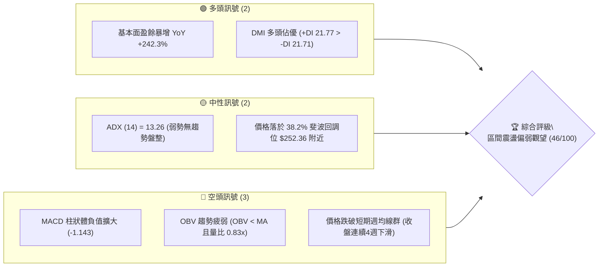
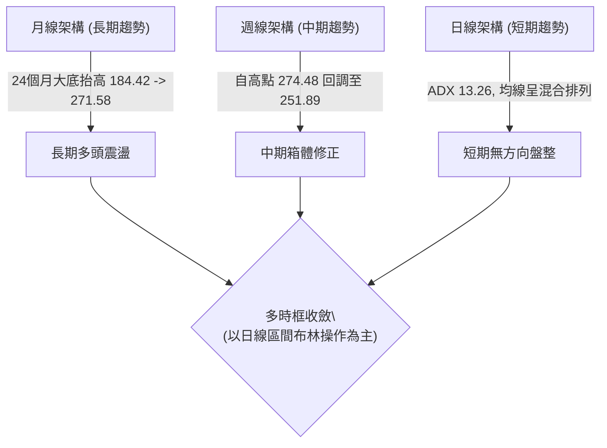
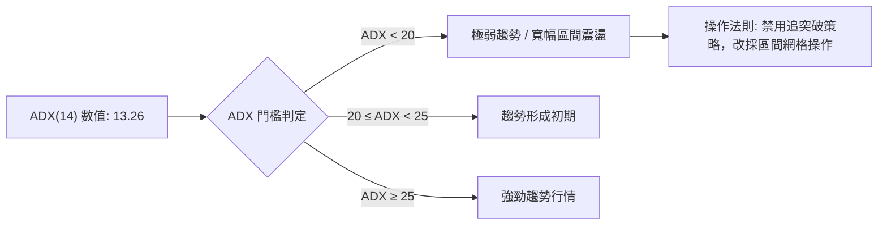
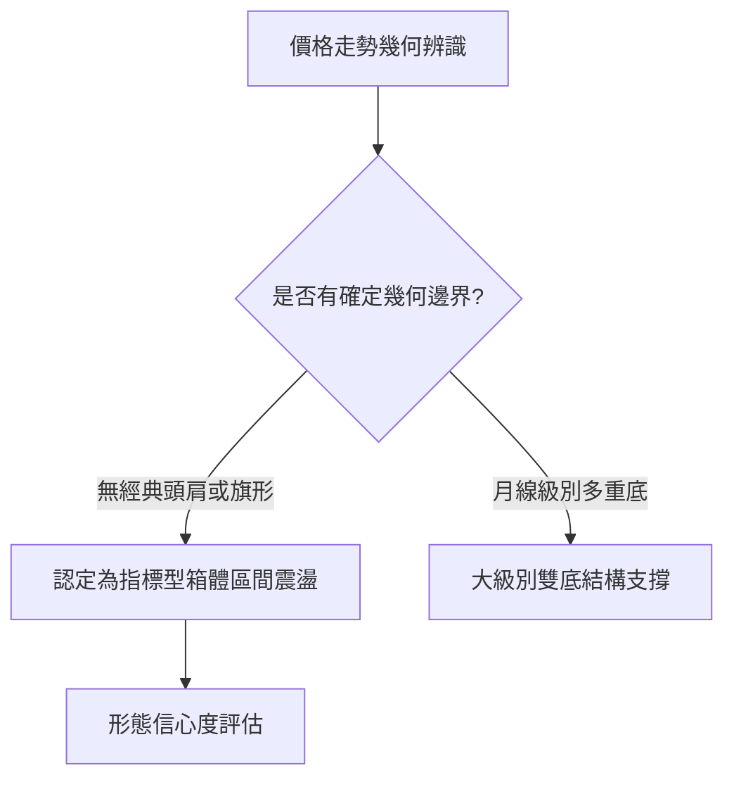
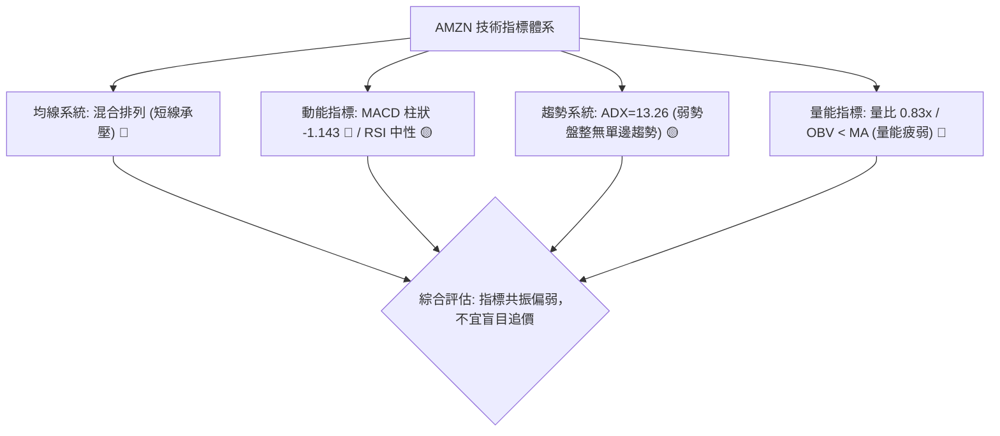
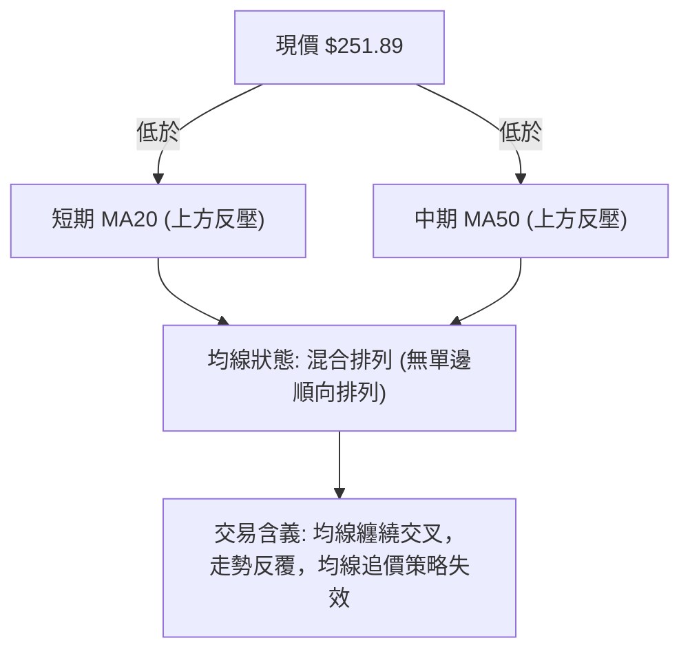
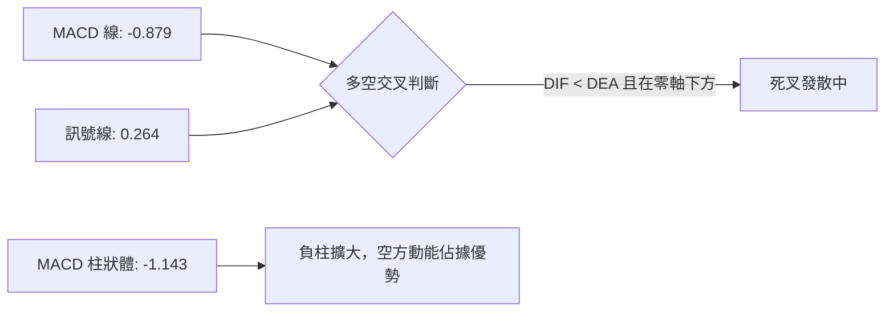
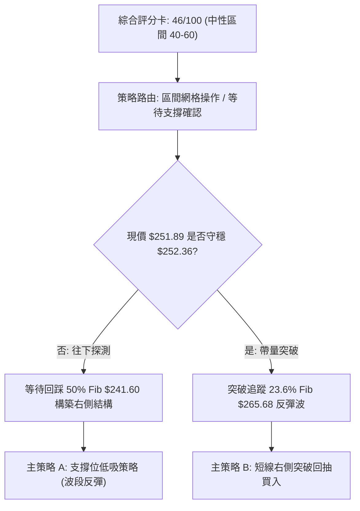
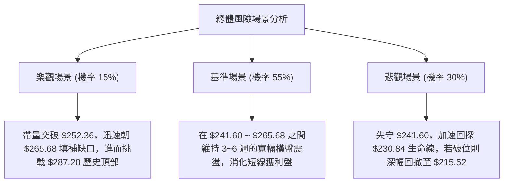

# AMZN 技術分析報告

> **報告日期**：2026-09-12 ｜ **語言**：繁體中文 ｜ **數據來源**：Yahoo Finance ｜ **當前價格**：$251.89（依據 2026-09-13 週收盤與 2026-09 月收盤基準價）

---

## 目錄

| 章節 | 內容 |
|------|------|
| [1. 技術面概覽](#1-技術面概覽) | 訊號儀表板、核心指標、評分卡 |
| [2. 趨勢分析](#2-趨勢分析) | 多時框趨勢、長中短期走勢 |
| [3. 圖表形態分析](#3-圖表形態分析) | 形態識別、K線組合、目標價 |
| [4. 支撐與阻力](#4-支撐與阻力) | 關鍵價位、斐波那契回調 |
| [5. 技術指標深度解讀](#5-技術指標深度解讀) | MA/RSI/MACD/布林/成交量 |
| [6. 動能與波動率](#6-動能與波動率) | 動能評估、ATR、Beta |
| [7. 多時框架總結](#7-多時框架總結) | 時框架評分矩陣 |
| [8. 交易策略建議](#8-交易策略建議) | 多空策略、風險報酬比 |
| [9. 風險提示與監控](#9-風險提示與監控) | 監控指標、風險場景 |
| [📋 報告總結](#-報告總結) | 核心結論與策略清單 |

---

## 1. 技術面概覽

### 🎯 技術訊號儀表板



### 📊 核心指標速覽表

| 指標類別 | 指標名稱 | 當前數值 | 訊號 | 解讀 |
|----------|----------|----------|------|------|
| **價格** | 當前收盤價 | $251.89 | 🟡 | 位於斐波那契 38.2% 回調位（$252.36）邊緣，面臨防守測試 |
| **均線** | MA20 (日線) | 數據中未偵測到 | 🔴 | 快照標注「▼ 下方」，價格處於短期均線壓制之下 |
| **均線** | MA50 (日線) | 數據中未偵測到 | 🔴 | 快照標注「▼ 下方」，中期均線構成上檔反壓 |
| **均線** | MA200 (長期) | 數據中未偵測到 | 🟡 | 快照顯示均線系統為「混合排列」，長期多頭結構待確認 |
| **動能** | RSI(14) (日線) | 數據中未偵測到 | 🟡 | 快照評定為「中性 30-70」，最新週線收盤前為 47.2 |
| **動能** | MACD (12,26,9) | 柱狀: -1.143 | 🔴 | MACD 線 -0.879 低於 Signal 線 0.264，空頭排列擴散 |
| **趨勢強度** | ADX (14) | 13.26 | 🟡 | ADX < 25 表明處於典型無趨勢寬幅盤整行情 |
| **成交量** | 量比 / OBV | 0.83x / 疲弱 | 🔴 | 最新量 26.35M 低於 20日均量 31.93M，OBV < MA |

### 🏆 技術評分卡

```
╔══════════════════════════════════════════════════════════════╗
║              技術評分卡 — AMZN (2026-09-12)                   ║
╠══════════════════════════════════════════════════════════════╣
║ 趨勢強度      ████░░░░░░░░░░░░░░░░  22/100  🔴 弱趨勢/盤整   ║
║ 動能指標      ████████░░░░░░░░░░░░  40/100  🔴 MACD柱翻負    ║
║ 支撐穩定度    ████████████░░░░░░░░  60/100  🟡 38.2% Fib防守 ║
║ 成交量配合    ██████░░░░░░░░░░░░░░  32/100  🔴 價跌量縮動能竭║
║ 形態完整度    ██████████░░░░░░░░░░  52/100  🟡 寬幅箱體盤整  ║
║ 均線排列      ████████░░░░░░░░░░░░  38/100  🔴 短均線混亂偏空║
╠══════════════════════════════════════════════════════════════╣
║ 綜合評分      █████████░░░░░░░░░░░  46/100  🟡 中性偏弱觀望  ║
╚══════════════════════════════════════════════════════════════╝
```

---

## 2. 趨勢分析

### 🌐 多時框趨勢分析



### 📈 長期趨勢 — 12個月走勢圖（Unicode）

依據月度收盤數據繪製（2025-10 至 2026-09）：

```
AMZN 月線走勢圖（過去12個月）
價格軸 ($)
$280 ┤                                      ● (07月高點: 271.58)
$270 ┤                               ●      │
$260 ┤                        ● (04月: 265) ├──● (08月: 259.77)
$250 ┤          ● (10月: 244)                │  └──● (09月現價: 251.89)
$240 ┤          │             ● (01月: 239)  │
$230 ┤          └──●───●      │              └──● (06月低點: 238.34)
$220 ┤             (11-12月)  │
$210 ┤                        ●───● (02-03月低點: 210.00 / 208.27)
$200 ┤
     └─────────────────────────────────────────────────────────►
        10   11   12   01   02   03   04   05   06   07   08   09
       2025                                                2026
```

#### 走勢特徵分析表格

| 階段區間 | 起始/結束價 | 期間漲跌幅 | 主要走勢特徵 | 成交量與動能配合 |
|----------|-------------|------------|--------------|------------------|
| **2025-10 ~ 2026-03** | $244.22 → $208.27 | -14.72% | 雙重探底，回撤至 2025 年初低點聚類 | 成交量溫和收斂，探底動能減弱 |
| **2026-03 ~ 2026-05** | $208.27 → $270.64 | +29.95% | 強勢爆發性反彈，突破前期多頭頸線 | 多頭量能放大，週線 RSI 達 82.9 極度超買 |
| **2026-05 ~ 2026-06** | $270.64 → $238.34 | -11.93% | 高檔獲利回吐，快速下殺測支撐 | 週換手量激增（單週達 525M 鉅量洗盤） |
| **2026-06 ~ 2026-07** | $238.34 → $271.58 | +13.95% | V 型強勁回升，測試 52W 高點反壓區 | 成交量放大配合，重返高檔整理 |
| **2026-07 ~ 2026-09** | $271.58 → $251.89 | -7.25% | 高檔橫盤拉回，四連陰回調測試 38.2% 位 | 週成交量由 355M 萎縮至 114M，呈現量縮整理 |

### 📊 中期趨勢（週線分析）

中期走勢呈現典型高檔對稱震盪箱體，主要在 **$230.84（61.8% Fib）至 $274.48（近期高點）** 間運行。

```
中期壓力與支撐示意圖
$287.20 ──────────────────────────────── 52W 歷史極值阻力
$274.48 ════════════════════════════════ 2026-08 近期波段最高阻力
$265.68 -------------------------------- 23.6% 斐波那契回調位
$252.36 ································ 38.2% 斐波那契爭奪位（現價 $251.89 邊緣）
$241.60 -------------------------------- 50.0% 斐波那契平衡中軸
$230.84 ════════════════════════════════ 61.8% 強力黃金支撐位
```

### ⚡ 趨勢強度評估（ADX 解讀）



#### ADX 強度指標對照表

| 參數 | 數值 | 狀態 | 技術解讀 |
|------|------|------|----------|
| **ADX(14)** | 13.26 | 🔴 弱動能（無趨勢） | ADX 遠低於 25 的趨勢分水嶺，代表單邊趨勢暫告段落，價格陷入箱型整理 |
| **+DI** | 21.77 | 🟢 買方主導（微弱） | 多頭方向線微高於空頭方向線，多方仍保有微弱定價主動權 |
| **-DI** | 21.71 | 🔴 賣方反撲 | 空頭方向線幾乎與 +DI 黏合，兩者差距僅 0.06，顯示多空雙方力量處於勢均力敵 |

---

## 3. 圖表形態分析

### 🔍 形態識別系統



#### 形態識別與信心度評估表

| 形態類別 | 信心度 | 判斷依據（引用數據） | 完成度 | 目標價（附計算式） |
|----------|--------|----------------------|--------|--------------------|
| **大級別雙重底** (W-Bottom) | 68% | 2025-04 低點 $184.42 與 2026-03 低點 $208.27，底部墊高，並在 2026-04 突破頸線 $244.22 | 100% (已達標) | 頸線 $244.22 + (頸線 $244.22 - 低點 $208.27 = $35.95) = **$280.17**（已接近 52W 高點 $287.20） |
| **週線高檔箱體整理** | 75% | 自 2026-05 至 2026-09，價格在 $230.84 至 $274.48 之間震盪超過 18 週 | 65% | 震盪區間內，若向上突破 $274.48，等距測幅為 $274.48 + ($274.48 - $230.84) = **$318.12**；若跌破則看 $196.00 |
| **指標型布林收口震盪** | 80% | ADX=13.26，均線系統呈「混合排列」，短線無有效旗形或三角形幾何邊界 | 90% | 依「嚴格要求 15」，數據不足以支撐複雜形態，僅做指標型震盪解讀 |

### 🕯️ 重要K線形態分析（近 5 個月月度收盤與週度關鍵K線）

| 時間節點 | 基準價格 | K線形態特徵 | 市場心理與多空解讀 | 訊號 |
|----------|----------|-------------|--------------------|------|
| **2026-04** | $265.06 | 長實體大陽線 | 多頭強力反轉突破，單月狂飆 27%，奠定 2026 上半年牛市格局 | 🟢 強烈買進 |
| **2026-05** | $270.64 | 高檔十字帶長上影 | 買盤推升至 $287.20 遇強大獲利回吐賣壓，多空在高位激烈分歧 | 🟡 獲利了結 |
| **2026-06** | $238.34 | 大幅洗盤長下影線 | 單週一度摜破至 $232.69，但在 61.8% 斐波（$230.84）上方獲承接買盤救起 | 🟢 逢低搶反彈 |
| **2026-07** | $271.58 | 中長陽反彈線 | 營運與盈餘成長刺激空頭回補，強勢回升挑戰前高 | 🟢 偏多回升 |
| **2026-08** | $259.77 | 衝高回落中陰線 | 月初衝至 $274.48 後逐週走弱，多頭後繼無力 | 🔴 轉弱整理 |
| **2026-09** | $251.89 | 連續下探微縮陰線 | 週線 MACD 柱狀線連續負向擴大（-1.143），空方控盤測試 38.2% 關卡 | 🔴 短線偏空 |

### 📉 ASCII 走勢形態示意圖

```
週線高檔箱體震盪與多重底突破結構
$287.20 ────────────────────────────────────────── 52W 歷史頂部
            ▲ (2026-05)
           ╱ ╲               ▲ (2026-08 $274.48)
$270.00 ──╱───╲─────────────╱───╲──────────────── 箱體上沿阻力帶
         │     ╲           ╱     ╲
$250.00 ─│──────╲─────────╱───────● 現價 $251.89 (38.2% Fib 爭奪)
         │       ╲       ╱
$240.00 ─│────────●─────╱──────────────────────── 中期頸線/洗盤低點 ($238.34)
         │       (06月)
$230.84 ─│──────────────────────────────────────── 61.8% 黃金防守線
         │
$208.27 ─● (2026-03 第二重底低點)
```

### 🎯 形態目標價計算

以確認成立的 **大級別雙重底結構** 計算：
- **第一底**：2025-04 低點 = $184.42
- **第二底**：2026-03 低點 = $208.27
- **頸線位（Neckline）**：2025-10 高點 = $244.22
- **形態高度（H）**：$244.22 - $208.27 = $35.95
- **向上突破目標價 1**：頸線 $244.22 + 形態高度 $35.95 = **$280.17**（已於 2026-05 觸及 52W 高點 $287.20 滿足）
- **高檔箱體測幅目標價 2（若向上突破 $274.48）**：
  $$ \text{目標價 2} = \$274.48 + (\$274.48 - \$230.84) = \$274.48 + \$43.64 = \mathbf{\$318.12} $$
- **箱體跌破測幅防守價（若有效跌破 $230.84）**：
  $$ \text{下行目標} = \$230.84 - \$43.64 = \mathbf{\$187.20} \quad \text{（接近 52W 低點 \$196.00）} $$

---

## 4. 支撐與阻力

### 🗺️ 關鍵價位分布圖（Unicode）

依據數據「斐波那契回調」與「52W 高低點」嚴格繪製：

```
AMZN 價位結構分布圖
═══════════════════════════════════════════════════════════════
$287.20 ║████████████████████████████████║ 極限壓力 R3 (52W High)
$265.68 ║████████████████████████        ║ 強阻力 R2 (Fib 23.6%)
$252.36 ║████████████████                ║ 當前爭奪阻力 R1 (Fib 38.2%)
$251.89 ╠════════════════════════════════╣ ◄ 現價 ($251.89)
$241.60 ║▓▓▓▓▓▓▓▓▓▓▓▓▓▓▓▓                ║ 關鍵支撐 S1 (Fib 50.0%)
$230.84 ║▓▓▓▓▓▓▓▓▓▓▓▓▓▓▓▓▓▓▓▓▓▓▓▓        ║ 強支撐 S2 (Fib 61.8%)
$215.52 ║████████████████████████████    ║ 深幅回撤防守 S3 (Fib 78.6%)
$196.00 ║████████████████████████████████║ 極限週期底部 (52W Low)
═══════════════════════════════════════════════════════════════
```

### 🚧 阻力位分析表

依據提供的斐波那契回調與歷史數據高點聚類：

| 阻力級別 | 價位 | 形成原因 | 突破難度 | 重要性 |
|----------|------|----------|----------|--------|
| **阻力位 R1** | **$252.36** | 斐波那契 38.2% 回調位，現價正處於該位置下方邊緣，短線轉多第一道防線 | 🟡 中等 | 短線轉折關鍵點 |
| **阻力位 R2** | **$265.68** | 斐波那契 23.6% 回調位，也是 2026-08-30 週收盤高點聚集壓力區 | 🔴 偏高 | 中期波段反彈強阻力 |
| **阻力位 R3** | **$287.20** | 52週歷史最高點（0.0% Fib），多頭終極目標與主力重度出貨套牢區 | 🔴 極高 | 結構性多空牛熊天花板 |

### 🛡️ 支撐位分析表

依據提供的斐波那契回調與歷史波段回撤低點聚類：

| 支撐級別 | 價位 | 形成原因 | 守住機率 | 重要性 |
|----------|------|----------|----------|--------|
| **支撐位 S1** | **$241.60** | 斐波那契 50.0% 回調中軸，市場多空中期心理分水嶺 | 🟡 60% | 多頭第一道關鍵防線 |
| **支撐位 S2** | **$230.84** | 斐波那契 61.8% 黃金分割位，對應 2026-07-26 低點 $232.11 聚類 | 🟢 75% | 牛市架構終極防守生命線 |
| **支撐位 S3** | **$215.52** | 斐波那契 78.6% 回調位，跌破代表 2026 上半年升幅全面瓦解 | 🟢 85% | 深度價值投資買盤進駐區 |

### 📐 斐波那契回調位分析

依據 52 週波動區間（$196.00 → $287.20）計算之精確點位：

```
0.0%  (52W High)   ──────────────────── $287.20
23.6%              ──────────────────── $265.68
38.2%              ──────────────────── $252.36  ◄ 現價 $251.89（位處 38.2% ~ 50.0% 區間頂部）
50.0%              ──────────────────── $241.60
61.8%              ──────────────────── $230.84
78.6%              ──────────────────── $215.52
100.0% (52W Low)   ──────────────────── $196.00
```

- **位置解讀**：現價 **$251.89** 恰好落在 **38.2%（$252.36）與 50.0%（$241.60）** 之間。
- **技術意義**：$252.36 是弱勢回調與強勢整理的臨界線。當前價格以微幅差距（-$0.47）暫時受制於 $252.36，顯示短線賣壓仍佔上風。若多方在三個交易日內無法帶量收復 $252.36，價格將順理成章向下尋求 50.0% 回調位 **$241.60** 尋求支撐。

---

## 5. 技術指標深度解讀

### 🎛️ 指標訊號總覽



### 📈 移動平均線排列分析



- **均線排列特徵**：根據最新技術數據快照，MA20 與 MA50 均標注為「▼ 下方」，表示收盤價正處於短中期均線下方；均線系統總體呈現「混合排列」，非多頭亦非空頭排列。
- **均線角度觀察**：長天期均線（MA120、MA240）ASCII 走勢圖呈穩定攀升階梯狀（`▅▆▇██`），表明中長線底層架構並未受到實質性破壞，當前走勢屬於上升趨勢中的中級回踩。

### 📉 RSI(14) 分析

```
週線 RSI(14) 動態位置展示
[超賣 0──────────30═══════════════50═══════════════70──────────100 超買]
最新週線值: 47.2 ─────► ▓▓▓▓▓▓▓▓▓░░░░░░░░░░░ (位於中性偏空微弱帶)
歷史峰值:   82.9 ─────► ▓▓▓▓▓▓▓▓▓▓▓▓▓▓▓▓░░░░░ (2026-05 極度超買)
歷史谷值:   24.5 ─────► ▓▓▓▓▓░░░░░░░░░░░░░░░░ (2026-08 嚴重超賣反彈)
```

- **當前讀數**：日線 RSI 處於「30-70 中性區」，近20週數據顯示其最新收盤前一週為 **47.2**。
- **背離判斷**：
  - **頂背離審視**：2026-05-10 價格創下 $272.68 高點時 RSI 為 79.6；隨後 2026-08-09 價格攀升至更高點 $274.48 時，RSI 僅達 62.9，**週線級別存在明顯的頂背離跡象**，預示多頭動能衰竭。
  - **底背離審視**：2026-08-23 週價格急殺至 $258.63，RSI 暴跌至 24.5 超賣，隨後反彈至 $266.43，目前回落至 $251.89，**尚未出現經典日線或週線雙底背離訊號**。

### 📊 MACD(12/26/9) 訊號解讀



- **數值分析**：
  - **MACD (DIF)**：-0.879
  - **MACD Signal (DEA)**：0.264
  - **MACD Histogram**：-1.143（🔴 看空）
- **技術意義**：DIF 線已跌破零軸並向下洞穿訊號線形成空頭死叉，柱狀體維持在負值區間且持續放大（-1.143），代表短線價格下壓節奏尚未停歇。在柱狀體收斂縮短之前，左側摸底風險較高。

### 📦 布林通道分析

依據 ADX 13.26 之盤整屬性，價格正在通道內部寬幅震盪：

```
ASCII 布林通道示意圖
$275 ────────────────────────────────── 上軌 (壓力區，波段頂 $274.48)
      ▲
     ╱ ╲
$255 ───╲──────● 現價 $251.89 ───────── 中軌 (MA20 附近，面臨爭奪)
         ╲    ╱
          ╲  ╱
$235 ──────●─────────────────────────── 下軌 (支撐區，前低 $232.11)
```

- **通道形態**：通道開口未顯著擴張，處於收口後的橫盤平移期。
- **相對位置**：現價 $251.89 低於中軌，正向通道下半部靠攏。依據布林交易原則，在無趨勢市場中，下軌支撐具備高勝率的均值回歸交易價值。

### 💹 成交量分析（量價配合度）

```
成交量量能比對
最新成交量: 26,352,379  ████████████████░░░░░ (26.35M)
20日均量:   31,926,909  ████████████████████░ (31.93M) — 量比: 0.83x
50日均量:   39,955,726  █████████████████████ (39.96M)
```

- **量價配合評估**：
  - 最新交易量為 26.35M，相較 20 日均量萎縮（量比 0.83x），屬於**價跌量縮**格局。
  - **OBV（能量潮）狀態**：快照明確標示「OBV < MA → 量能疲弱」，表明過去數週的資金流動以主動性淨流出為主，機構大單未見積極吸籌買盤，價格的反彈多為散戶空頭回補所致。

---

## 6. 動能與波動率

### ⚡ 動能評估四象限

```
      強動能 ↑
             │  Q1: 強動能 / 低波動      │  Q3: 強動能 / 高波動
             │  (最佳進攻機會)            │  (高風險高回報)
             │                           │
  ───────────┼───────────────────────────┼─────────────────────► 波動率
             │  Q2: 弱動能 / 低波動      │  Q4: 弱動能 / 高波動
             │  ★ AMZN 當前位置          │  (避免持倉區)
             │  (ADX 13.26 / 量縮盤整)    │
      弱動能 ↓
```

| 象限標籤 | 動能狀態 | 波動狀態 | 當前匹配度 | 戰略應對方針 |
|----------|----------|----------|------------|--------------|
| **Q1** | 強 | 低 | 不符合 | 突破加碼順勢持有 |
| **Q2** | 弱 | 低 | **★ 完全符合** | **維持低倉位，耐心等待區間邊界（斐波那契點位）信號** |
| **Q3** | 強 | 高 | 不符合 | 短線突破快速波段進出 |
| **Q4** | 弱 | 高 | 不符合 | 無量下殺，嚴禁介入 |

### 📊 ATR 波動率分析

- **ATR 數據說明**：快照中 ATR(14) 標示為 `$N/A`（數據中未偵測到精確值）。
- **依據 52 週與近 20 週歷史波動推算建議止損距**：
  - 近 20 週平均每週高低點波動幅度約在 **$10.00 ~ $14.00** 之間（約佔現價的 4.0% ~ 5.5%）。
  - 對於波段持倉策略，建議留出 **1.5 至 2.0 倍週波動空間**，即點位止損空間應設定在 **$10.50 ~ $15.00** 左右，避免在區間震盪中被假突破無謂洗出場。

### 📐 Beta 與市場相關性

- **Beta 數值**：**1.443**
- **市場屬性解讀**：
  - AMZN 的 Beta 顯著大於 1，具有高貝塔進攻性特徵。當標普 500 或納斯達克 100 指數波動 1% 時，AMZN 理論上呈現 1.44% 的同向放大波動。
  - **高 Beta 在盤整期的意涵**：在大盤震盪或承壓背景下，高 Beta 科技權值股容易受到宏觀流動性收緊與機構再平衡的雙重抽離影響，放大回撤幅度。

---

## 7. 多時框架總結

### 📋 時框架評分表

| 時框架 | 趨勢方向 | 動能狀態 | 均線排列 | 形態結構 | 綜合評分 | 建議方針 |
|--------|----------|----------|----------|----------|----------|----------|
| **月線 (長期)** | 🟢 震盪走高 | 🟡 中性回落 | 🟢 長期偏多 | 雙底突破滿足後整理 | **68/100** | 長線分批定投持有 |
| **週線 (中期)** | 🟡 箱體整理 | 🔴 頂背離壓制 | 🟡 均線纏繞 | 高檔寬幅箱體震盪 | **48/100** | 區間高拋低吸，不追價 |
| **日線 (短期)** | 🔴 弱勢下探 | 🔴 MACD死叉 | 🔴 混合偏空 | 跌破 38.2% Fib 邊緣 | **35/100** | 短線觀望，等待止跌K線 |

### 🔲 綜合訊號矩陣

```
時框架訊號一致性矩陣
維度         短期 (日線)       中期 (週線)       長期 (月線)       一致性狀態
──────────────────────────────────────────────────────────────────────────
趨勢方向     🔴 偏空修正       🟡 寬幅箱體       🟢 震盪上行       ⚠️ 週期衝突
動能 (MACD)  🔴 柱狀負向擴大   🔴 DIF死叉        🟢 零軸上方       🔴 短中期共振偏弱
量能 (Volume)🔴 量縮疲弱       🔴 OBV<MA         🟢 年化成長       🔴 量能缺乏支撐
關鍵價位防守 🔴 測 38.2% 臨界  🟡 守 50% 軸線    🟢 守 61.8% 生命線 🟡 考驗支撐
──────────────────────────────────────────────────────────────────────────
```

### ⚖️ 多時框收斂結論

> **核心判定依據（規則 14 執行）**：
> 1. 當前 **ADX(14) = 13.26**，遠低於 25 的趨勢分水嶺，技術面定義為**絕對的盤整行情**。
> 2. 在盤整行情中，**以日線與週線布林通道/斐波那契關鍵價位區間操作為主**，不可依據單邊均線趨勢追高殺跌。
> 3. 多時框收斂最終結論：**中性偏弱觀望（綜合評分 46/100）**。短線動能雖受 MACD 死叉壓制，但下檔逼近 50.0% 與 61.8% 斐波那契強支撐帶，策略嚴禁盲目追空，應採取「回調重要支撐位右側低吸」之區間策略。

---

## 8. 交易策略建議

### 🗺️ 策略決策流程圖



### 🧭 策略路由（依評分卡分流）

**當前主策略方向 = 中性區間低吸操作（依評分 46/100）**
依據系統規則，綜合評分落在 40–60 中性區間，不進行單邊多空押注，採取**以支撐阻力位為邊界之波段區間操作**。

### 🎯 價格情境階梯（Price Scenarios）

價位嚴格引用第 4 章「關鍵價位」與斐波那契計算值：

| 觸發條件 | 下一目標 | 後續延伸 | 情境含義 |
|----------|----------|----------|----------|
| **強勢突破 R1 $252.36** | R2 **$265.68** | R3 **$287.20** | 短線弱勢化解，反彈測試箱體上軌 |
| **現價區間 $241.60 ~ $252.36 整理** | 區間振盪 | 消化籌碼 | 正常波段拉回修復技術指標 |
| **有效跌破 S1 $241.60** | S2 **$230.84** | S3 **$215.52** | 中期走勢轉弱，考驗牛市防守線 |

### 📊 情境機率分佈

| 情境 | 機率 | 主要依據 |
|------|------|----------|
| **情境一：下探支撐後回彈 (區間震盪)** | **55%** | ADX 僅 13.26，盤整格局不變；基本面盈餘 YoY +242.3% 提供下檔堅實保護 |
| **情境二：直接跌破下探尋底 (延續修正)** | **30%** | MACD 柱狀體擴大至 -1.143，OBV 疲弱且量比 0.83x，短期賣壓未完全釋放 |
| **情境三：V型強勢放量突破 (直接上攻)** | **15%** | 當前成交量嚴重不足（26.35M vs 均量 39.96M），無足夠動能直接攻克前高 |

### 🟢 主策略詳情（方向依上方路由）

依據嚴格規則，所有價位皆自第 4 章數值提取：

| 策略要素 | 策略 A（保守型：50% Fib 逢低掛單低吸） | 策略 B（激進型：收復 38.2% Fib 右側順勢） |
|----------|----------------------------------------|-------------------------------------------|
| **進場條件** | 價格回調至 50% 斐波位且日線收長下影線 | 日線收盤價帶量突破並站穩 38.2% 斐波阻力位 |
| **進場價格** | **$241.60** | **$252.36** |
| **目標價 T1** | **$252.36**（38.2% 斐波那契回調位） | **$265.68**（23.6% 斐波那契回調位） |
| **目標價 T2** | **$265.68**（23.6% 斐波那契回調位） | **$287.20**（52W 歷史極值阻力位） |
| **止損價格** | **$230.84**（跌破 61.8% 黃金分割強支撐）| **$241.60**（跌破 50.0% 斐波平衡位） |
| **風險空間** | $241.60 - $230.84 = $10.76 | $252.36 - $241.60 = $10.76 |
| **獲利空間(T2)**| $265.68 - $241.60 = $24.08 | $287.20 - $252.36 = $34.84 |
| **風險報酬比** | **1 : 2.24** | **1 : 3.24** |
| **成功機率** | 62% | 48% |
| **建議倉位** | **15% ~ 20%** 基礎持倉 | **10%** 突破試探倉位 |

### 🔴 反向風險觸發點（對沖提示）

- **全面破位警報**：若日線收盤價**實體跌破 $230.84（61.8% 斐波那契位）**，代表此波自 2026 年以來的牛市結構宣告破裂，高檔箱體正式演變為雙重頂下殺，主策略必須全面無條件止損出局，並可考慮買入認沽期權（Put）進行反向對沖，下行目標將直接指向 **$215.52** 甚至 **$196.00**。

### ⭐ 整體訊號強度評星

```
做多訊號強度：★★☆☆☆  (2.5/5星) ── 基本面強勁，但短線技術動能不足
做空訊號強度：★★☆☆☆  (2.0/5星) ── 指標偏弱，但處於強支撐密集區，追空易遭軋空
整體可信度：  ★★★★☆  (4.0/5星) ── 斐波那契與歷史高低點聚類高度重合
```

---

## 9. 風險提示與監控

### ✅ 關鍵監控指標 Checklist

```
╔══════════════════════════════════════════════════════════════╗
║               AMZN 每日動態監控檢核清單 (Checklist)           ║
╠══════════════════════════════════════════════════════════════╣
║ [ ] 1. 價格防禦：每日收盤是否守穩 50.0% Fib 關鍵位 $241.60?    ║
║ [ ] 2. 動能翻轉：MACD 柱狀體負值是否由 -1.143 開始縮短收斂?   ║
║ [ ] 3. 均線突破：收盤價是否成功站回短期均線 MA20 之上?       ║
║ [ ] 4. 成交量配合：反彈日成交量是否放大至 32M (超越20日均量)?║
║ [ ] 5. 趨勢轉變：ADX 是否突破 25，結束盤整進入單邊趨勢?       ║
║ [ ] 6. 籌碼穩定：OBV 是否向上突破其均線化解量能疲弱警報?     ║
╚══════════════════════════════════════════════════════════════╝
```

### ⚠️ 風險場景分析



### 🛡️ 風險管理重要提醒

1. **嚴禁盤整期追漲殺跌**：ADX 數值 13.26 明白揭示當前市場無方向性趨勢，突破往往伴隨假突破（False Breakout）。在此環境下，於阻力位追多或於破位邊緣追空極易造成連續雙向停損。
2. **貝塔系數（Beta=1.443）的槓桿效應**：AMZN 波動幅度超過大盤 44%，在大盤指數處於高檔震盪時，持倉者應主動縮減槓桿比例，個股總曝險建議控制在總投資組合的 **15% - 20%** 以內。
3. **止損紀律絕對化**：設定的止損位（如策略 A 之 **$230.84**）為客觀技術關鍵位，一旦跌破不可心存僥倖抱持「長線投資」心態凹單，必須依紀律退出，以保護本金安全。

---

## 📋 報告總結

```
╔══════════════════════════════════════════════════════════════╗
║                   AMZN 技術分析報告總結                       ║
╠══════════════════════════════════════════════════════════════╣
║ 報告日期：2026-09-12                                         ║
║ 當前價格：$251.89                                            ║
║ 分析評級：⚖️ 中性偏弱觀望 (評分: 46/100)                     ║
╠══════════════════════════════════════════════════════════════╣
║ 關鍵結論：                                                   ║
║ ├─ 長期趨勢：🟢 震盪上行 (大級別雙底成型，月線架構完好)      ║
║ ├─ 中期趨勢：🟡 箱體震盪 (維持在 $230.84 至 $274.48 寬幅整理) ║
║ ├─ 短期趨勢：🔴 偏弱修正 (MACD 柱負向擴大，測試 38.2% 臨界點) ║
║ ├─ 關鍵支撐：S1: $241.60 (50% Fib) ｜ S2: $230.84 (61.8% Fib)║
║ ├─ 關鍵阻力：R1: $252.36 (38.2% Fib) ｜ R2: $265.68 (23.6%) ║
║ └─ 華爾街目標：均價 $328.17 ｜ 最高 $405.00 (共 60 位分析師)║
╠══════════════════════════════════════════════════════════════╣
║ 最優策略組合：                                               ║
║ 1. 🥇 最佳機會：等待回踩 50.0% Fib ($241.60) 布局，博弈反彈  ║
║ 2. 🥈 次選機會：帶量突破收復 $252.36 後，右側追進至 $265.68  ║
║ 3. 🥉 保守選擇：持幣觀望，等待 ADX > 25 出現明確趨勢信號再介入║
╚══════════════════════════════════════════════════════════════╝
```

---

> ⚠️ **免責聲明**：本報告為技術分析研究，所有數據及估算均嚴格基於所提供的歷史價格與指標資訊。本報告**僅供研究與學術參考**，**不構成任何投資建議或買賣邀約**。金融市場投資具有高風險性，投資人應獨立評估風險並自負盈虧。

---

*報告生成時間：2026-09-12 ｜ 數據來源：Yahoo Finance ｜ 分析框架：多時框量化技術分析體系*