# AMZN 技術分析報告

> **報告日期**：2026-09-13 ｜ **語言**：繁體中文 ｜ **數據來源**：Yahoo Finance ｜ **當前價格**：$256.78

---

## 目錄

| 章節 | 內容 |
|------|------|
| [1. 技術面概覽](#1-技術面概覽) | 訊號儀表板、核心指標、評分卡 |
| [2. 趨勢分析](#2-趨勢分析) | 多時框趨勢、長中短期走勢、ADX強弱 |
| [3. 圖表形態分析](#3-圖表形態分析) | 形態識別、信心度評估、K線結構 |
| [4. 支撐與阻力](#4-支撐與阻力) | 關鍵價位結構、斐波那契回調層級 |
| [5. 技術指標深度解讀](#5-技術指標深度解讀) | 均線系統、RSI、MACD、布林通道、OBV |
| [6. 動能與波動率](#6-動能與波動率) | 動能四象限、ATR波動度、Beta分析 |
| [7. 多時框架總結](#7-多時框架總結) | 時框架矩陣、多時框收斂定調 |
| [8. 交易策略建議](#8-交易策略建議) | 策略路由、情境階梯、進出場規劃 |
| [9. 風險提示與監控](#9-風險提示與監控) | 監控清單、風控情境、資金管理法則 |
| [📋 報告總結](#-報告總結) | 核心結論與執行綱要速覽 |

---

## 1. 技術面概覽

### 🎯 技術訊號儀表板

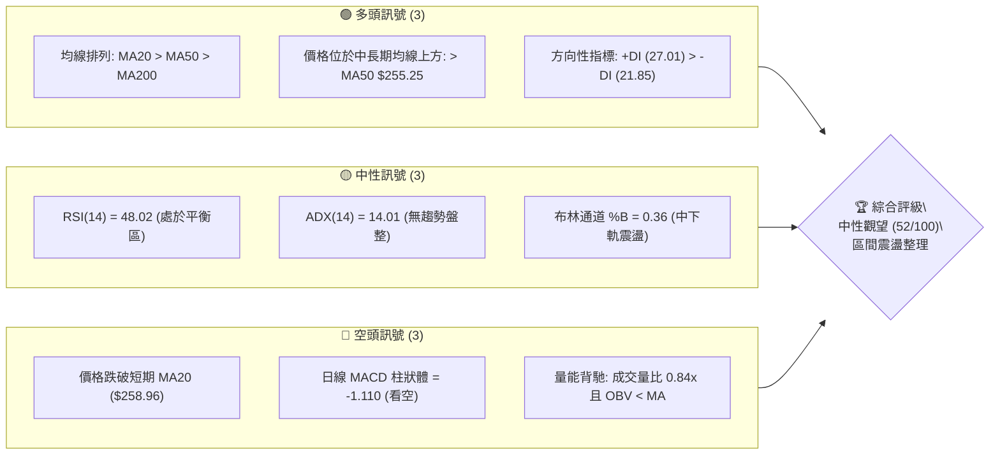

### 📊 核心指標速覽表

| 指標類別 | 指標名稱 | 當前數值 | 訊號 | 解讀 |
|----------|----------|----------|------|------|
| **價格** | 當前價格 | $256.78 | 🟡 | 位於52週區間 66.6% 位置，處於中高檔震盪整理 |
| **均線** | MA20 | $258.96 | 🔴 | 價格低於短期生命線，日線短線走勢受壓制 |
| **均線** | MA50 | $255.25 | 🟢 | 價格微幅守於中期支撐上方（+$1.53），中期多頭格局尚存 |
| **均線** | MA200 | $239.80 | 🟢 | 顯著高於長期牛熊分界線（+$16.98 / +7.08%），牛市結構穩健 |
| **動能** | RSI(14) | 48.02 | 🟡 | 位於 30–70 中性平衡帶，多空雙方力道暫時均衡 |
| **動能** | MACD | -0.838 / 柱狀 -1.110 | 🔴 | 訊號線(0.272)下方死叉發散，短線動能處於空方回撤波段 |
| **趨勢** | ADX(14) | 14.01 | 🟡 | 低於 25 臨界值，確認市場進入弱趨勢箱型盤整結構 |
| **通道** | 布林通道 | $251.26 ~ $266.66 | 🟡 | %B 為 0.36，價格運行於中軌($258.96)與下軌($251.26)間 |
| **量能** | 成交量比 | 0.84x (OBV < MA) | 🔴 | 最新量 26.68M 低於20日均量 31.94M，資金追價動能疲弱 |
| **波動** | ATR(14) | $5.63 (2.19%) | 🟢 | 波動率適中且平穩，盤整階段適合設定區間防守點 |

### 🏆 技術評分卡

```
╔══════════════════════════════════════════════════════════════╗
║              技術評分卡 — AMZN (2026-09-13)                  ║
╠══════════════════════════════════════════════════════════════╣
║ 均線架構      ██████████████░░░░░░  70/100  🟢 宏觀多頭格局  ║
║ 趨勢強度      ██████░░░░░░░░░░░░░░  30/100  🔴 ADX低迷盤整   ║
║ 動能指標      ████████░░░░░░░░░░░░  40/100  🟡 RSI中性MACD弱 ║
║ 支撐穩定度    ████████████░░░░░░░░  60/100  🟡 S1支撐面臨測試║
║ 成交量配合    ████████░░░░░░░░░░░░  40/100  🔴 量縮且OBV疲軟 ║
║ 形態完整度    ██████████████░░░░░░  72/100  🟢 箱型收斂結構  ║
╠══════════════════════════════════════════════════════════════╣
║ 綜合評分      ██████████░░░░░░░░░░  52/100  評級: ⚖️ 中性觀望║
╚══════════════════════════════════════════════════════════════╝
```

---

## 2. 趨勢分析

### 🌐 多時框趨勢分析

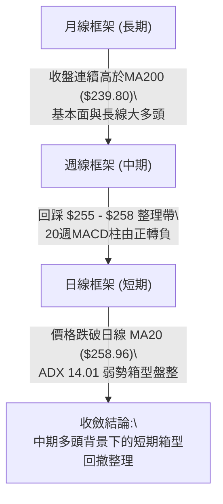

### 📈 長期趨勢 — 12個月走勢圖（Unicode）

以下為 AMZN 過去 12 個月（2025-10 至 2026-09）之歷史價格軌跡，呈現強勁的階梯上行與高檔震盪格局：

```
AMZN 月線走勢圖（過去12個月: 2025-10 至 2026-09）
價格軸 ($)
$275 ┤                                  ●(07月 271.58)
$270 ┤                            ●(05月 270.64)
$265 ┤                      ●(04月 265.06)      ●(08月 259.77)
$260 ┤                                                ●(09月 256.78 現價)
$245 ┤●(10月 244.22)
$240 ┤                ●(01月 239.30)        ●(06月 238.34)
$235 ┤    ●(11月 233.22)
$230 ┤        ●(12月 230.82)
$210 ┤          ●(02月 210.00)
$205 ┤              ●(03月 208.27 波段低點)
     └────────────────────────────────────────────────────────────
       10  11  12  01  02  03  04  05  06  07  08  09 (月份)
```

**12個月走勢特徵分析表**：

| 階段區間 | 起止價格 | 漲跌幅 | 走勢特徵與技術驅動力 |
|----------|----------|--------|----------------------|
| **2025-10 ~ 2026-03** | $244.22 → $208.27 | -14.72% | 雙重回踩築底波段，於 $208.27 確立長期底部支撐區間。 |
| **2026-03 ~ 2026-05** | $208.27 → $270.64 | +29.95% | 強烈突破主升浪，成交量大幅爆發，均線全面轉為發散多頭。 |
| **2026-05 ~ 2026-07** | $270.64 → $271.58 | +0.35%  | 劇烈寬幅洗盤（06月回測 $238.34 後拉起），創下月線收盤新高。 |
| **2026-07 ~ 2026-09** | $271.58 → $256.78 | -5.45%  | 頂部動能衰退，進入縮量回調，回測日線 MA50 尋求防守支撐。 |

### 📊 中期趨勢（週線分析）

從近 20 週數據觀察，AMZN 在 2026-05 至 2026-08 期間多次衝擊 $270.00 - $274.00 阻力帶，但均因高檔動能不足而回落：
- 2026-08-09 創下週線反彈高點 $274.48（MACD 柱大幅擴張至 +4.090）。
- 其後四週收盤價逐階走低（$262.65 → $258.63 → $266.43 → $258.51 → $256.78），MACD 柱狀圖全面翻負（-1.110），顯示中期漲勢已暫告一段落，轉入週期性休整。

```
週線級別價格防禦帶示意圖
════════════════════════════════════════════════════════════════
 [上方中期壓制]  $274.48 (08月波段高點) ───► 強阻力聚類區
                 $267.56 (阻力位 R2)   ───► 近期反彈受阻點
 ────────────────────────────────────────────────────────
 [當前波動中軸]  $256.78 (現價)        ───► 爭奪日線 MA50 ($255.25)
 ────────────────────────────────────────────────────────
 [下方中期防線]  $252.36 (Fib 38.2%)   ───► 強支撐緩衝區
                 $239.80 (MA200 牛熊線)───► 中長期多頭底線
════════════════════════════════════════════════════════════════
```

### ⚡ 趨勢強度評估（ADX 解讀）

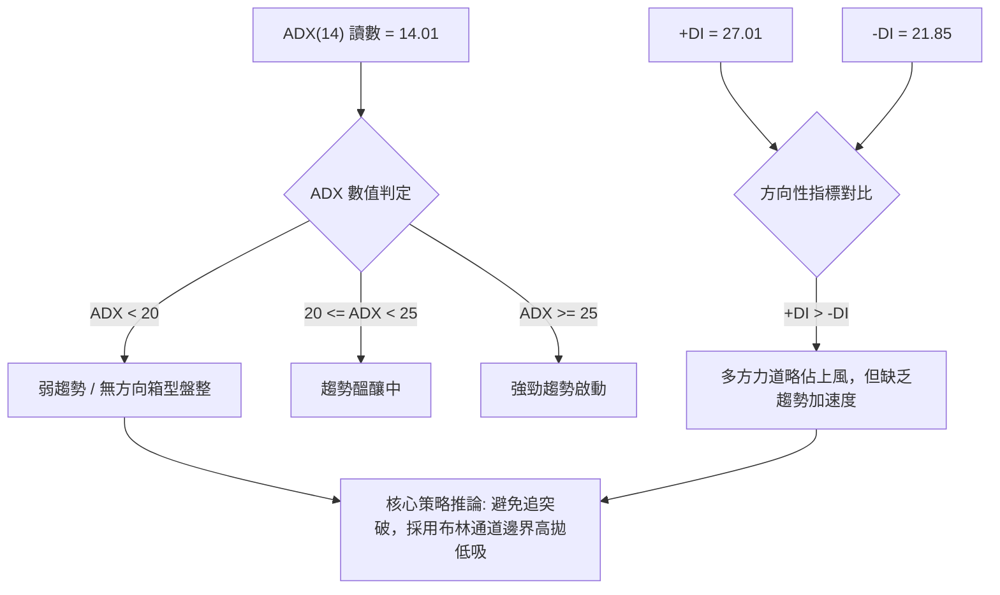

**ADX 趨勢強度對照解讀**：
- **當前讀數**：ADX(14) = **14.01**（處於絕對弱勢區）。
- **結構判定**：依照技術分析通則，ADX < 25 意味著任何由單日長K線所帶來的「突破」均有極高機率演變為假突破。
- **+DI / -DI 關係**：+DI(27.01) 仍處於 -DI(21.85) 之上，顯示市場內在買盤並未潰散，當前下跌並非崩跌型走勢，而是典型的「無趨勢高檔震盪整理」。

---

## 3. 圖表形態分析

### 🔍 形態識別系統

在多時框與近半年價格行為中，AMZN 目前呈現「高檔寬幅對稱三角形收斂」與「潛在雙重頂形態回踩」的混合特徵。

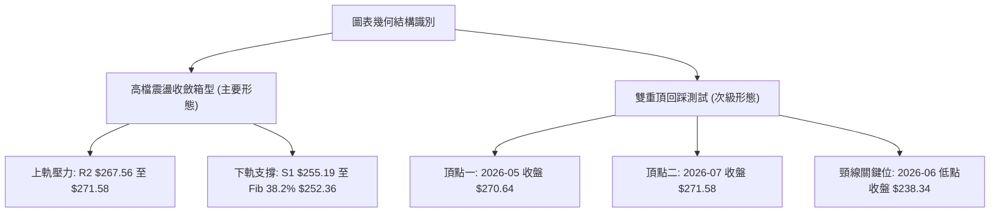

**形態確認與信心度評估表**：

| 形態類別 | 信心度 | 判斷依據（嚴格引用數據） | 完成度 | 目標價（附嚴格計算式） |
|----------|--------|--------------------------|--------|------------------------|
| **高檔收斂箱型** | **78%** | 價格受阻於 R2 $267.56 及前期高點 $271.58，下方受 S1 $255.19 與布林下軌 $251.26 支撐，ADX=14.01 印證區間震盪特徵。 | 85% | 區間震盪目標：通道上軌 **$266.66** 及阻力 R2 **$267.56**。 |
| **潛在寬幅雙重頂** | **42%** | 兩次衝高受阻（05月 $270.64、07月 $271.58），但當前價格 $256.78 距頸線 $238.34 甚遠，未觸發跌破訊號。 | 35% | 訊號不足，僅作風險監控。若跌破頸線 $238.34，等幅跌幅推算：$238.34 - ($271.58 - $238.34) = **$205.10**（接近數據低點聚類）。 |
| **指標型布林收口** | **85%** | 布林帶寬收縮至 $251.26 ~ $266.66（帶寬約 5.9%），%B 降至 0.36，反映極度震盪壓抑。 | 90% | 均值回歸目標：布林中軌 MA20 **$258.96**。 |

### 🕯️ 重要K線形態分析（近 5 個月走勢）

| 月份 | 收盤價 | K線結構與量價特徵 | 技術解讀 | 訊號 |
|------|--------|-------------------|----------|------|
| **2026-05** | $270.64 | 實體大陽線延續，伴隨歷史高檔量能 | 多頭進攻高潮，確立 $270+ 之強阻力區間 | 🟢 多頭推升 |
| **2026-06** | $238.34 | 長下影中陰線，單週放量 5.25 億股回測 | 深度獲利了結洗盤，但在 $238 附近引發強勁機構承接盤 | 🟡 洗盤確立 |
| **2026-07** | $271.58 | 長陽線完全反包前月陰線，創月線收盤新高 | V型反轉回升，完成雙重高點測試 | 🟢 趨勢強勁 |
| **2026-08** | $259.77 | 帶上影線的小陰線，成交量顯著萎縮 | 高檔買盤動能衰退，多頭上攻無力轉為休整 | 🔴 動能見頂 |
| **2026-09** | $256.78 | 窄幅十字星孕線（截至 09-13） | 多空在 MA50 上方陷入焦灼，量能持續遞減 | 🟡 變盤前夕 |

### 📉 ASCII 走勢形態示意圖

```
AMZN 日線級別形態結構示意（箱型收斂震盪）
價格 ($)
$272.00 ┤                     ▲ 雙頂阻力 $271.58
$268.00 ┤              ▲      │       ▲ 阻力 R2 $267.56
$264.00 ┤             ╱ ╲     │      ╱ ╲
$260.00 ┤────────────╱───╲────┼─────╱───╲── MA20 $258.96 (中軌壓力)
$256.78 ┤           ╱     ╲   │    ●     ╲ ◄ 現價 $256.78 (尋求 MA50 支撐)
$255.19 ┤          ╱       ╲  │   ╱       ▼ 支撐 S1 $255.19
$251.26 ┤         ╱         ╲ │  ╱          布林下軌支撐
$238.34 ┤        ▼           ▼▼ 頸線防守 $238.34
        └───────────────────────────────────────────────► 時間軸
```

### 🎯 形態目標價計算

基於當前最高可信度（78%）之「高檔收斂箱型」形態進行測算：
1. **箱體下邊界支撐**：支撐位 S1（**$255.19**）與布林下軌（**$251.26**），共振支撐區間取中值約 **$253.20**。
2. **箱體上邊界壓力**：阻力位 R2（**$267.56**）與布林上軌（**$266.66**）。
3. **箱體垂直高度**：
   $$\text{形態高度 } H = \text{阻力 R2 } (\$267.56) - \text{支撐 S1 } (\$255.19) = \$12.37$$
4. **目標價推算**：
   - **短線反彈目標 T1（均值回歸）**：布林中軌 MA20 = **$258.96**（即阻力 R1 $258.34 附近）。
   - **箱型上限目標 T2（形態高點）**：阻力位 R2 = **$267.56**。
   - **向上突破延伸目標 T3（若帶量突破 R2）**：
     $$\text{突破延伸目標} = R2\ (\$267.56) + H\ (\$12.37) = \$279.93$$
     *（此價位直接受到數據阻力位 R3 **$276.65** 之壓制，故以 R3 $276.65 作為實際多頭防禦目標）*。

---

## 4. 支撐與阻力

### 🗺️ 關鍵價位分布圖（Unicode）

本分析嚴格引用財務技術數據庫中經 OHLCV 聚類計算之標準關鍵價位與 52 週斐波那契回調層級：

```
AMZN 價位結構分布圖
═════════════════════════════════════════════════════════════════
$287.20 ║██████████████████████████████║ 52W High / 斐波那契 0.0%
$276.65 ║████████████████████████      ║ 強阻力 R3 (近一年波段高點)
$267.56 ║██████████████████            ║ 阻力 R2 (箱型頂部壓力)
$265.68 ║▓▓▓▓▓▓▓▓▓▓▓▓▓▓▓▓▓▓            ║ 斐波那契 23.6% 回調位
$258.34 ║████████████                  ║ 關鍵阻力 R1 (MA20 共振帶)
$256.78 ╠══════════════════════════════╣ ◄ 現價 ($256.78)
$255.19 ║▓▓▓▓▓▓▓▓                      ║ 近期支撐 S1 (MA50 共振帶)
$252.36 ║████████                      ║ 斐波那契 38.2% 回調位
$241.60 ║██████████████                ║ 斐波那契 50.0% 中樞分界
$239.80 ║████████████████              ║ 長期生命線 MA200
$230.84 ║████████████████████          ║ 斐波那契 61.8% 黃金分割位
$225.82 ║██████████████████████        ║ 強支撐 S2 (波段低點聚類)
$220.99 ║████████████████████████      ║ 強支撐 S3 (中期防守底線)
═════════════════════════════════════════════════════════════════
```

### 🚧 阻力位分析表

所有阻力數值完全引用系統聚類運算結果，不作人為虛構：

| 阻力級別 | 精確價位 | 距現價空間 | 形成技術依據 | 突破難度評估 | 重要性級別 |
|----------|----------|------------|--------------|--------------|------------|
| **R1** | **$258.34** | +0.61% | 近一年波段高點密集成交區，與日線 MA20 ($258.96) 形成雙重共振壓制。 | 中等（需大盤放量） | ★★★☆☆ |
| **R2** | **$267.56** | +4.20% | 波段高點聚類位，緊鄰布林上軌 ($266.66) 及 23.6% 斐波那契位 ($265.68)。 | 高（空頭主力防禦區） | ★★★★☆ |
| **R3** | **$276.65** | +7.74% | 2026-08 衝高受阻之波段極值區，突破此處將開啟挑戰歷史天價行情。 | 極高（需重大利多） | ★★★★★ |

### 🛡️ 支撐位分析表

所有支撐數值完全引用系統聚類運算結果：

| 支撐級別 | 精確價位 | 距現價空間 | 形成技術依據 | 守住機率評估 | 重要性級別 |
|----------|----------|------------|--------------|--------------|------------|
| **S1** | **$255.19** | -0.62% | 近一年波段低點聚類位，與日線 MA50 ($255.25) 完美重疊，為當前多頭第一道防線。 | 65%（多方必守點） | ★★★★☆ |
| **S2** | **$225.82** | -12.06% | 中期波段強低點聚類，位於 MA200 ($239.80) 下方之極端超賣支撐區。 | 85%（強勁買盤沉澱） | ★★★★☆ |
| **S3** | **$220.99** | -13.94% | 過去兩年長期上升通道底軌，對應 2025 年多個整理平台低點。 | 95%（終極價值防線） | ★★★★★ |

### 📐 斐波那契回調位分析

依據 AMZN 52 週波動區間（低點 **$196.00** 至 高點 **$287.20**，垂直振幅高達 $91.20）計算之黃金分割階梯：

```
斐波那契回調階梯與現價定位
════════════════════════════════════════════════════════════════
  0.0% (52W High)  $287.20 ─────────────────────────────────────
 23.6%             $265.68 ──────────────── 上方第一道回調壓制
                   ▲
 [現價區域]        $256.78 ── 處於 23.6% 與 38.2% 之間的回調震盪區
                   ▼
 38.2%             $252.36 ──────────────── 下方最核心黃金分割支撐
 50.0%             $241.60 ──────────────── 多空中樞平衡線
 61.8%             $230.84 ──────────────── 強度防守底線 (黃金分割)
 78.6%             $215.52 ──────────────── 深度回調防守位
100.0% (52W Low)   $196.00 ─────────────────────────────────────
════════════════════════════════════════════════════════════════
```

**斐波那契技術解讀**：
1. **當前價格區間**：現價 $256.78 運行於 **23.6% ($265.68)** 與 **38.2% ($252.36)** 之間。
2. **黃金分割意義**：在強勢牛市拉回過程中，強勢股通常於 38.2% 回調位（$252.36）止跌。該位置與布林下軌（$251.26）高度重疊，為多頭主力結構性防守的「雷池」，未有效跌破前，中長期多頭格局不可輕易否定。

---

## 5. 技術指標深度解讀

### 🎛️ 指標訊號總覽

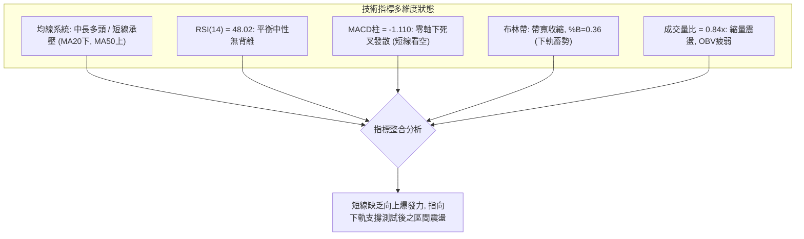

### 📈 移動平均線排列分析

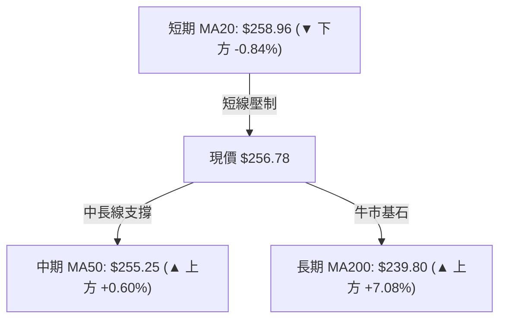

**移動平均線詳細陣容與技術意涵**：

| 週期 | 當前價位 | 現價相對位置 | 差額與幅度 | 歷史走勢斜率 | 技術意涵 |
|------|----------|--------------|------------|--------------|----------|
| **MA 5** | $255.31 | ▲ 上方 | +$1.47 (+0.58%) | ▁▃▅▇█████ 震盪走平 | 超短線有止跌企穩跡象，提供即時微觀支撐 |
| **MA 10** | $257.15 | ▼ 下方 | -$0.37 (-0.15%) | ▇████▇▇▇▆ 下傾壓制 | 5日與10日均線交纏，方向不明 |
| **MA 20** | $258.96 | ▼ 下方 | -$2.18 (-0.84%) | ▆▆▇▇████▇ 轉向微跌 | **月線級生命線**，目前轉為反彈第一阻力 |
| **MA 50** | $255.25 | ▲ 上方 | +$1.53 (+0.60%) | ▅▇▇██ 穩定向上 | **季線多空分界線**，支撐效力正在經受考驗 |
| **MA 60** | $252.09 | ▲ 上方 | +$4.69 (+1.86%) | ▂▃▄▅▇▇██ 持續上揚 | 與斐波那契 38.2% ($252.36) 構成多頭共振托盤區 |
| **MA120** | $250.10 | ▲ 上方 | +$6.68 (+2.67%) | ▅▆▇▇█████ 強勁攀升 | 半年線支撐極為強韌，中期安全邊際顯著 |
| **MA200** | $239.80 | ▲ 上方 | +$16.98 (+7.08%) | ▄▅▆▇▇████ 穩健上行 | **牛熊分界線**，確立中長期絕對牛市環境 |

### 📉 RSI(14) 分析

- **數值進度條**：
  $$\text{RSI(14)} = 48.02 \quad \left[ \text{██████████░░░░░░░░░░} \quad 48.02\% \right]$$
- **區間評估**：數值精確落在 45–55 之中性拔河帶，完全無超買（>70）或超賣（<30）極端跡象。
- **背離分析判斷**：
  - 對比 2026-08-09 波段高點 $274.48（當時週 RSI 為 62.9）與 08-02 衝高 $271.58（週 RSI 64.0），當時存在微弱的頂部動能衰竭。
  - 然而在當前日線維度下，價格於 $256.78 橫盤，RSI(14) 由 47.2 走平至 48.02，與價格走勢完全同步，**不存在日線級別底背離或頂背離**。這確認當前市場處於單純的整理平衡態。

### 📊 MACD(12/26/9) 訊號解讀

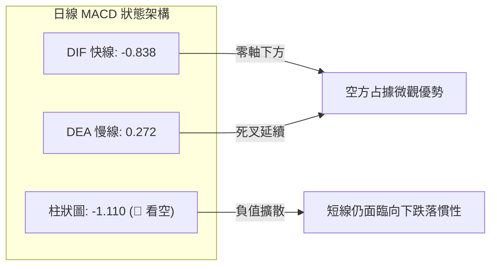

- **詳細數值**：MACD 線為 **-0.838**，訊號線（Signal）為 **0.272**，柱狀圖（Histogram）為 **-1.110**。
- **動能訊號解讀**：MACD 快線跌破訊號線後已下穿零軸，負柱狀體維持在 -1.110 的相對低位，尚未出現紅柱縮短的收斂跡象，表明空頭拋壓雖未演變成恐慌拋售，但多頭的反擊動能目前仍被壓制。

### 📦 布林通道分析

```
AMZN 布林通道相對位置示意圖 (通道帶寬: $15.40 / 5.9%)
═════════════════════════════════════════════════════════════════
$266.66 ┤ 上軌 (BB Upper)  ────────────────────── 壓力位 R2 $267.56
        │
$258.96 ┤ 中軌 (BB Middle / MA20) ─────────────── 阻力位 R1 $258.34
        │ 
$256.78 ┤ ◄ 當前價格位置 (%B = 0.36)
        │
$251.26 ┤ 下軌 (BB Lower)  ────────────────────── 支撐區間 (接近 Fib 38.2%)
═════════════════════════════════════════════════════════════════
```

- **布林參數解讀**：
  - **上軌**：$266.66 ｜ **中軌**：$258.96 ｜ **下軌**：$251.26。
  - **%B 指標**：**0.36**（公式：$(\text{Price} - \text{Lower}) / (\text{Upper} - \text{Lower})$）。
  - 當前數值 0.36 顯示價格運行在中下軌之間，向中軌靠攏構成第一阻力，向下跌破則將觸發下軌 $251.26 的極值防禦支撐。通道帶寬正在劇烈收縮，通常預示未來 2–3 週內將迎來方向性選擇。

### 💹 成交量分析（量價配合度）

- **量能數據**：
  - 最新成交量：**26,682,800 股**。
  - 20 日平均成交量：**31,943,430 股**（量比：**0.84x**）。
  - 50 日平均成交量：**39,962,334 股**。
- **量價背離與 OBV 檢驗**：
  - 當前量比僅 0.84x，顯示市場觀望氣氛濃厚，缺乏增量資金進場推升。
  - **OBV 能量潮**：當前系統判定「**OBV < MA**」，呈現量能疲弱走勢。OBV 跌破其均線意味著資金呈現微幅淨流出，累積能量尚未形成支撐向上突破的買力底座，證實了 ADX 弱勢盤整的結論。

---

## 6. 動能與波動率

### ⚡ 動能評估四象限

評估市場在「動能強度（Momentum）」與「波動率（Volatility）」兩大維度中的定位：

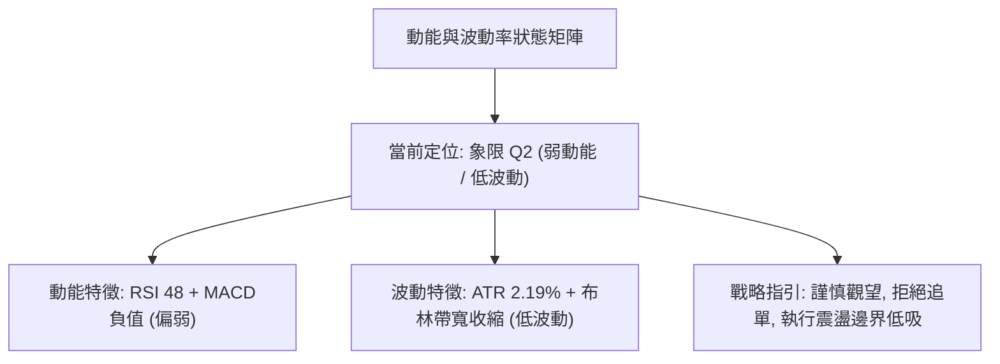

| 象限 | 動能強度 | 波動率水平 | 市場特徵 | AMZN 當前狀態 | 交易戰術評估 |
|------|----------|------------|----------|---------------|--------------|
| **Q1** | 強 (Bullish) | 低 (Low) | 穩健單邊牛市 | — | 順勢加碼，抱牢多單 |
| **Q2** | **弱 (Bearish/Neutral)** | **低 (Low)** | **箱型橫盤整理** | **✓ (當前狀態)** | **高拋低吸，嚴格設防，耐心等待變盤** |
| **Q3** | 強 (High) | 高 (High) | 主升浪/劇烈洗盤 | — | 追逐動能，擴大止損 |
| **Q4** | 弱 (Low) | 高 (High) | 恐慌性單邊下跌 | — | 全面空倉，禁止抄底 |

### 📊 ATR 波動率分析

- **ATR(14) 讀數**：**$5.63**，佔現價之 **2.19%**。
- **每日波動特性**：AMZN 當前平均每日振幅約在 $5.5 ~ $6.0 區間，波動幅度處於近一年中等偏低水位，反映投機情緒降溫。
- **精確風控距離換算**：
  - **1.0 × ATR（日內保護性緩衝）**：$5.63
  - **1.5 × ATR（波段交易最佳止損寬度）**：
    $$1.5 \times \$5.63 = \$8.45$$
    若以現價 $256.78 減去 1.5 ATR，得出合理回撤邊界為 **$248.33**（恰好覆蓋布林下軌 $251.26 下方之假突破空間）。
  - **2.0 × ATR（趨勢持倉防守極限）**：
    $$2.0 \times \$5.63 = \$11.26 \quad \rightarrow \quad \$256.78 - \$11.26 = \$245.52$$

### 📐 Beta 與市場相關性

- **Beta 係數**：**1.443**。
- **市場敏感度解讀**：
  - AMZN 具備顯著的高貝塔特徵（Beta > 1.4），意味著當標普 500 或納斯達克 100 指數波動 1.0% 時，AMZN 理論上將呈現 1.44% 的同向放大波動。
  - 在大盤處於震盪或微幅回調環境下，AMZN 會放大回撤幅度；但一旦整體科技股動能恢復，其向上彈性亦將顯著優於大盤平均水準。
  - **機構籌碼結構**：機構持股佔比達 **68.7%**，內部人持股 **8.9%**，空頭回補天數（Short Ratio）僅 2.16 天，空頭佔流通盤比率僅 **0.9%**。籌碼面極為乾淨，不存在軋空動能，亦不存在龐大的做空借券拋壓，走勢將完全由基本面與大盤流動性主導。

---

## 7. 多時框架總結

### 📋 時框架評分表

| 時框架 | 趨勢方向 | 動能指標 | 均線排列狀況 | 圖表形態特徵 | 綜合評分 | 操作建議 |
|--------|----------|----------|--------------|--------------|----------|----------|
| **月線 (長期)** | 🟢 多頭上行 | 🟢 多頭主導 (穩於高位) | 多頭排列 (遠高於MA240 $237.84) | 階梯式長牛通道 | **80/100** | 逢長線大跌堅定買入 |
| **週線 (中期)** | 🟡 震盪整理 | 🔴 MACD柱轉負 (-1.110) | MA20 上方整固，均線多頭發散收斂 | $270 阻力高位洗盤 | **55/100** | 區間震盪思路操作 |
| **日線 (短期)** | 🔴 短線偏弱 | 🔴 DIF零軸下死叉發散 | 跌破 MA20，測試 MA50 支撐 | 布林通道中下軌收口 | **42/100** | 不盲目追空，等待企穩 |

### 🔲 綜合訊號矩陣

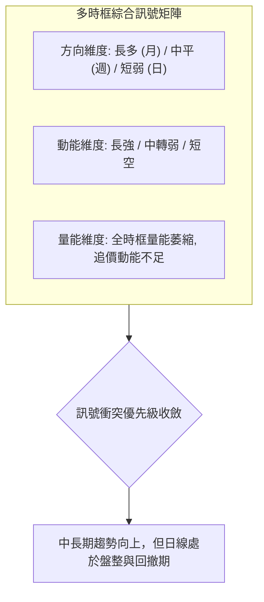

### ⚖️ 多時框收斂結論

依據本報告設定之嚴格「多時框收斂規則」進行判定：
1. **趨勢/盤整行情判定**：當前日線 ADX(14) 讀數為 **14.01**（遠低於 25 臨界值），明確判定當前 AMZN 處於**「盤整行情」**，而非趨勢單邊行情。
2. **優先級執行原則**：在盤整行情中，單邊趨勢策略失效，必須以**「日線布林通道上下軌（$251.26 ~ $266.66）與關鍵波段聚類支撐阻力（S1 $255.19 / R1 $258.34 / R2 $267.56）」**作為主要交易指導界限。
3. **終極方向定調**：
   $$\mathbf{唯一方向性結論：中性觀望（偏區間防守反彈）}$$
   中期牛市結構（MA50 $255.25、MA200 $239.80）保護了下檔空間，但短線受制於 MA20（$258.96）與 MACD 負柱狀體。在價格未帶量突破 R1 前，禁止任何激進追高；在 S1 附近則可密切關注左側抗跌訊號。

---

## 8. 交易策略建議

### 🗺️ 策略決策流程圖

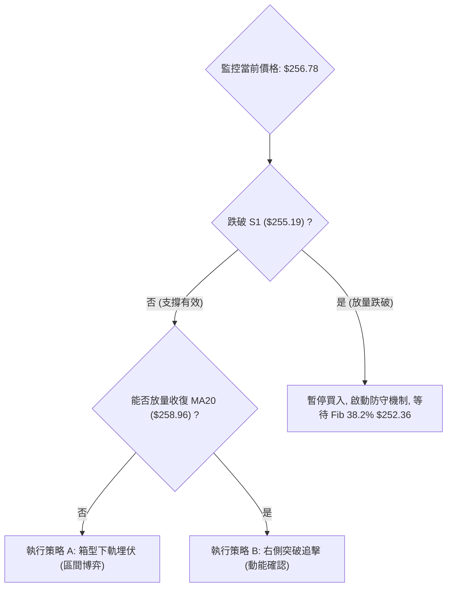

### 🧭 策略路由

> **當前主策略方向 = 中性區間震盪操作（依評分 52/100）**
> 
> 由於綜合技術評分落於 40–60 區間（52/100），且 ADX=14.01 印證盤整架構，本報告**主推以布林通道與聚類支撐阻力為核心的區間操作策略**。嚴禁在區間中軸實施單邊激進重倉押注，務必等待邊界價格觸發。

### 🎯 價格情境階梯（Price Scenarios）

所有價位均嚴格引用技術數據聚類算得之數值：

| 觸發條件 | 第一目標 | 第二目標 | 後續延伸目標 | 情境技術含義 |
|----------|----------|----------|--------------|--------------|
| **強勢突破 R1 ($258.34)** | R2 ($267.56) | 布林上軌 ($266.66) | R3 ($276.65) | 收復月線生命線，短線回調結束，重啟高檔箱體衝擊波。 |
| **維持於 S1 ~ R1 震盪** | MA20 ($258.96) | S1 ($255.19) | — | 於 $255.19 ~ $258.96 狹幅蓄勢，多空雙方進行籌碼沉澱。 |
| **放量跌破 S1 ($255.19)** | Fib 38.2% ($252.36) | 布林下軌 ($251.26) | S2 ($225.82) | 季線防禦失效，短線回撤升級為中期波段調整，考驗長期多頭。 |

### 📊 情境機率分佈

```
情境機率分佈視覺化
═════════════════════════════════════════════════════════════════
1. 區間震盪整理 (主情境)       ████████████████████████████  55%
2. 守穩 S1 反彈回升 (次情境)   ███████████████              30%
3. 破位下行探底 (風險情境)     ███████                      15%
═════════════════════════════════════════════════════════════════
```

| 情境劃分 | 發生機率 | 核心判定依據 |
|----------|----------|--------------|
| **情境一：維持箱型震盪** | **55%** | ADX(14)=14.01 指向典型盤整；量能比 0.84x 顯示多空無力發動單邊行情；布林通道持續收縮。 |
| **情境二：守穩 S1 展開反彈** | **30%** | 均線長週期呈現多頭排列（MA50/MA200 向上）；+DI(27.01) 高於 -DI(21.85)；分析師共識強烈看多（目標均價 $328.17）。 |
| **情境三：跌破 S1 深幅回調** | **15%** | 日線 MACD 負柱狀體擴散（-1.110）；價格處於 MA20 之下；OBV 疲軟呈現微幅流出。 |

### 🟢 主策略詳情（區間與突破雙軌規劃）

所有進場點、止損點、目標價完全依據第 4 章數據庫聚類價位設定：

| 策略要素 | 策略 A（左側：S1 支撐區間低吸） | 策略 B（右側：突破 R1 追擊動能） |
|----------|----------------------------------|------------------------------------|
| **策略類型** | 逆向區間操作（適合震盪盤） | 順向突破確認（適合變盤轉強） |
| **進場條件** | 價格回踩 S1 不破，收出 1 小時級別反轉K線 | 日線收盤價帶量實體站穩 R1 之上 |
| **進場價格** | **$255.20**（緊鄰 S1 $255.19） | **$258.50**（突破 R1 $258.34 後確認） |
| **目標價 T1** | **$258.96**（布林中軌 / MA20） | **$265.68**（斐波那契 23.6% 回調位） |
| **目標價 T2** | **$267.56**（阻力位 R2 / 箱型頂部） | **$276.65**（阻力位 R3 / 波段極值） |
| **止損價格** | **$251.20**（跌破布林下軌 $251.26 及 Fib 38.2%） | **$254.90**（跌破 MA50 及支撐 S1） |
| **止損空間** | -$4.00 (-1.57%) | -$3.60 (-1.39%) |
| **獲利空間 (T2)**| +$12.36 (+4.84%) | +$18.15 (+7.02%) |
| **風險報酬比** | **1 : 3.09** | **1 : 5.04** |
| **估計勝率** | **62%** | **52%** |
| **建議倉位** | **10% ~ 15%**（分批建倉） | **15% ~ 20%**（突破確認後加碼） |

### 🔴 反向風險觸發點（對沖與撤退提示）

- **多頭全面棄守點**：若日線收盤價**實體跌破 $251.26（布林下軌）與 $252.36（斐波那契 38.2%）**，確認收斂箱型向下破位。
- **對沖應對機制**：
  1. 所有多頭倉位無條件止損出局。
  2. 中長線投資者應買入行權價為 **$240.00**（MA200 附近）的保護性看跌期權（Put Option），以防禦向 S2（**$225.82**）深度修正的尾部風險。

### ⭐ 整體訊號強度評星

```
╔══════════════════════════════════════════════════════════════╗
║ 做多訊號強度：  ★★☆☆☆  (2.5/5星 — 均線雖多但短線缺乏動能)    ║
║ 做空訊號強度：  ★★☆☆☆  (2.0/5星 — 僅限微觀回撤，長線支撐極強)║
║ 整體評估可信度：★★★★☆  (4.5/5星 — 價位聚類清晰，邊界極明確)  ║
╚══════════════════════════════════════════════════════════════╝
```

---

## 9. 風險提示與監控

### ✅ 關鍵監控指標 Checklist

```
╔══════════════════════════════════════════════════════════════════╗
║                 AMZN 技術監控每日檢驗清單 (Checklist)             ║
╠══════════════════════════════════════════════════════════════════╣
║ [ ] 價格能否守穩支撐 S1 $255.19 及季線 MA50 $255.25 ?            ║
║ [ ] 日線收盤是否重新站上阻力 R1 $258.34 及 MA20 $258.96 ?        ║
║ [ ] MACD 柱狀體是否出現衰竭收斂（負值由 -1.110 向 0 軸回縮）?    ║
║ [ ] 成交量是否放大至 20 日均量（31.94M 股）以上以確認真突破?    ║
║ [ ] 日線 ADX(14) 是否由 14.01 抬升突破 20，確立單邊趨勢來臨?    ║
║ [ ] RSI(14) 能否突破 50 中性水準並向 60 動能區挺進?             ║
║ [ ] 外部市場：納斯達克指數與大盤 Beta 波動聯動風險是否可控?    ║
╚══════════════════════════════════════════════════════════════════╝
```

### ⚠️ 風險場景分析

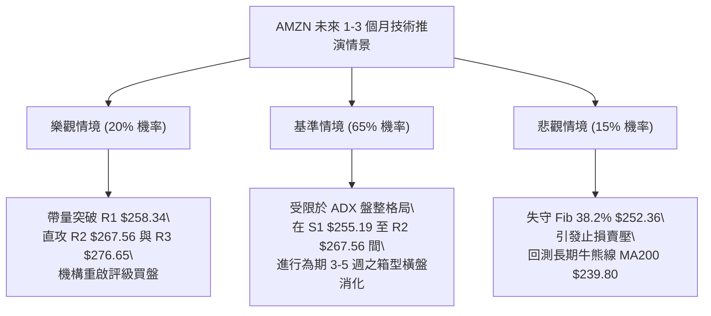

### 🛡️ 風險管理重要提醒

1. **嚴禁「盤整市追高」**：
   - 當前 ADX(14) 僅 14.01，表明任何向上的大陽線多半缺乏持續性。在盤整市追漲極易買在布林通道上軌（$266.66 附近）的短期頭部。
2. **波動率與倉位管理法則**：
   - 依據當前 ATR（$5.63），單筆交易所承受的止損幅度不應超過總資金帳戶的 1.0% ~ 1.5%。
   - 推薦採用「**金字塔式分批加碼**」原則：在 S1（$255.19）初次試倉不得超過總投資組合的 10%；唯有當日線突破 R1（$258.34）並得到成交量配合時，方可追加第二筆 10% 倉位。
3. **長期均線底線思維**：
   - 只要價格運行於 MA200（**$239.80**）上方，長線投資人的多頭趨勢部位即可保持戰略定力；短線交易者則必須嚴格恪守 S1（**$255.19**）與布林下軌（**$251.26**）的防守紀律。

---

## 📋 報告總結

```
╔══════════════════════════════════════════════════════════════════╗
║                   AMZN 技術分析報告總結                          ║
╠══════════════════════════════════════════════════════════════════╣
║ 報告日期：2026-09-13                                             ║
║ 當前價格：$256.78                                                ║
║ 綜合技術評分：52 / 100 (██████████░░░░░░░░░░)                   ║
║ 分析評級：⚖️ 中性觀望 (箱型整理格局)                            ║
╠══════════════════════════════════════════════════════════════════╣
║ 關鍵結論：                                                       ║
║ ├─ 長期趨勢：🟢 強勢多頭 (價格穩居 MA200 $239.80 之上)           ║
║ ├─ 中期趨勢：🟡 箱型震盪 (受阻於 $271 高點，處於週期性休整)      ║
║ ├─ 短期趨勢：🔴 弱勢整理 (跌破 MA20 $258.96，考驗 MA50 支撐)   ║
║ ├─ 關鍵支撐：S1 $255.19 ｜ 布林下軌 $251.26 ｜ Fib 38.2% $252.36║
║ ├─ 關鍵阻力：R1 $258.34 ｜ R2 $267.56 ｜ R3 $276.65             ║
║ └─ 分析師共識：Strong Buy (60位分析師目標均價 $328.17)           ║
╠══════════════════════════════════════════════════════════════════╣
║ 最優策略組合：                                                   ║
║ 1. 🥇 最佳機會：策略 A (S1 $255.20 附近低吸，博中軌回歸，盈虧比 3.1)║
║ 2. 🥈 次選機會：策略 B (帶量突破 R1 $258.50 追擊，目標 R2，盈虧比 5.0)║
║ 3. 🥉 保守選擇：空倉觀望，等待布林帶寬收縮完畢與 ADX 突破 20 變盤║
╚══════════════════════════════════════════════════════════════════╝
```

---

> ⚠️ **免責聲明**：本報告為 AI 自動生成之量化技術分析，所有數據解讀、圖表幾何推算均嚴格基於所提供的 Yahoo Finance 歷史價量數據。本報告**僅供研究與學術探討參考**，**絕不構成任何個人化的實質投資建議**。金融市場具有高度不確定性，標的價格可能劇烈波動，投資人應依據個人風險承受能力獨立決策並自負盈虧。

---

*報告生成時間：2026-09-13 ｜ 數據來源：Yahoo Finance ｜ 分析框架：資深多時框技術分析架構*