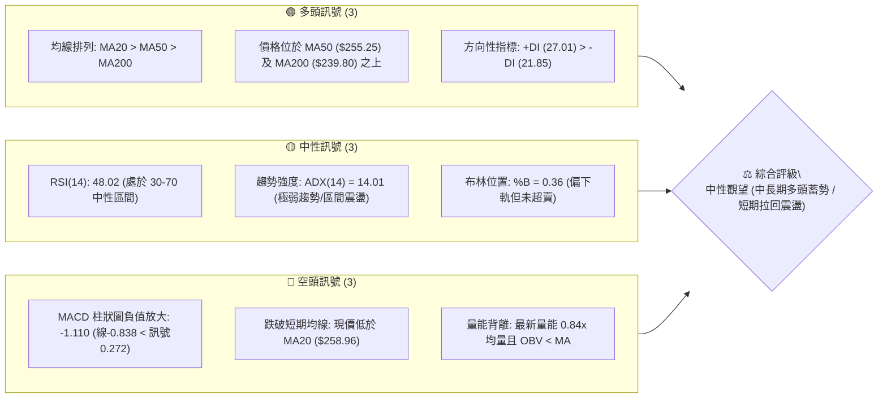
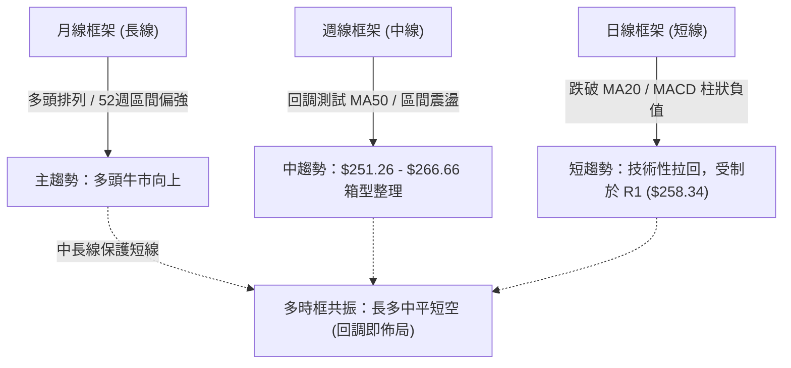
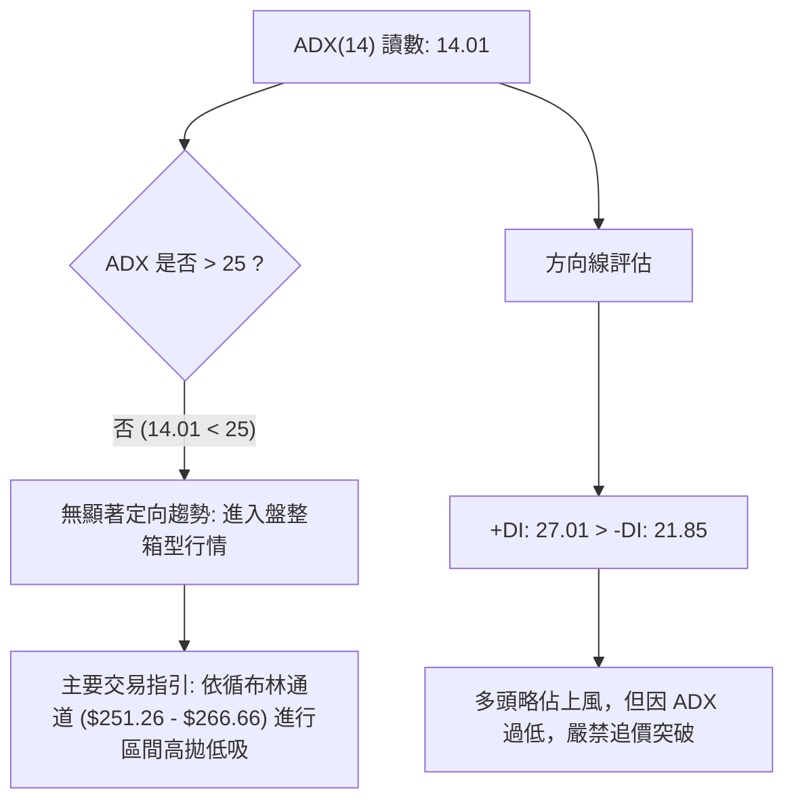
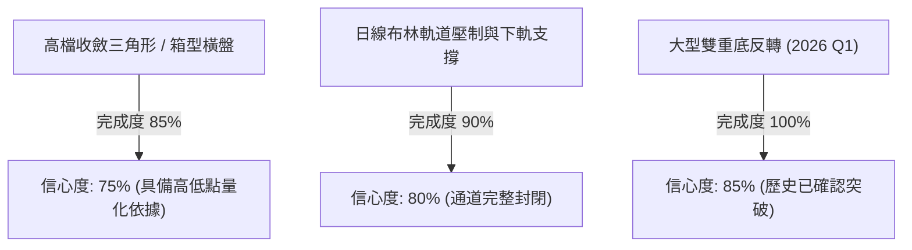
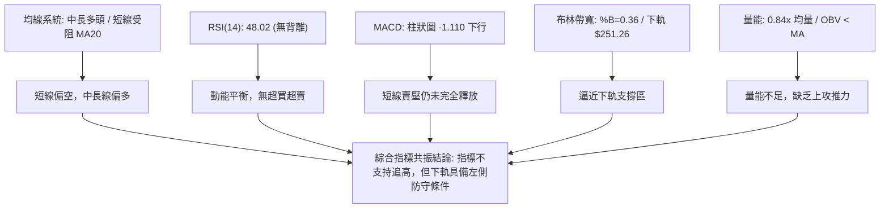
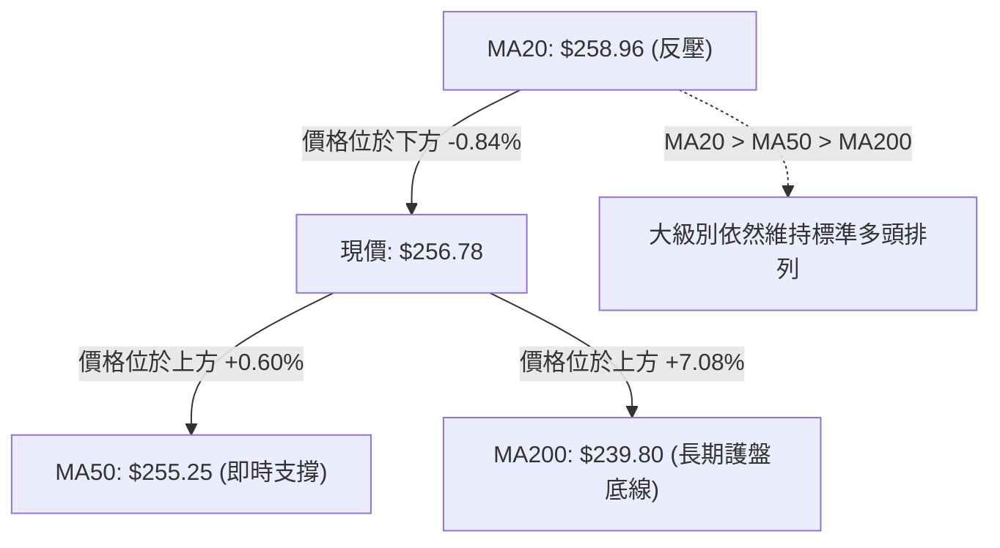
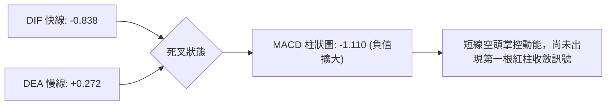
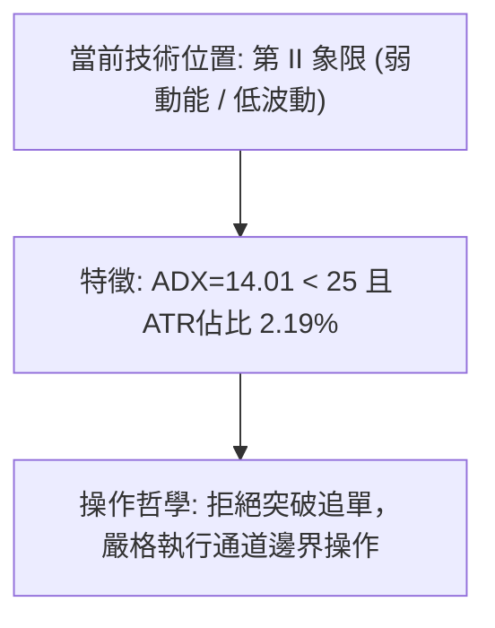
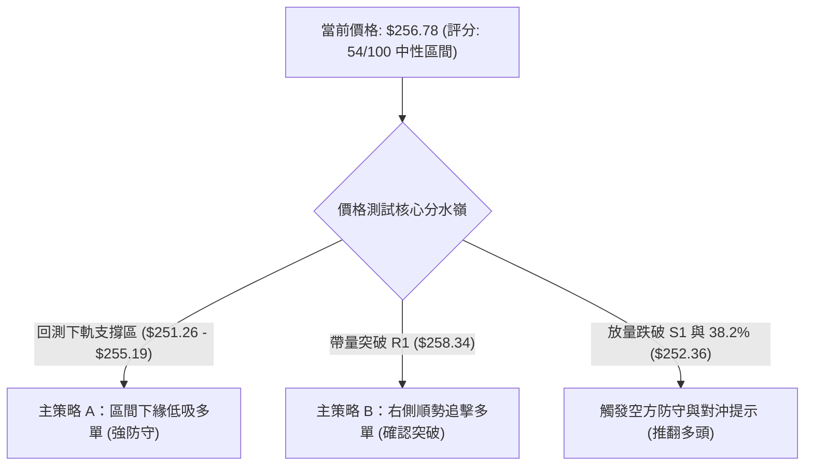
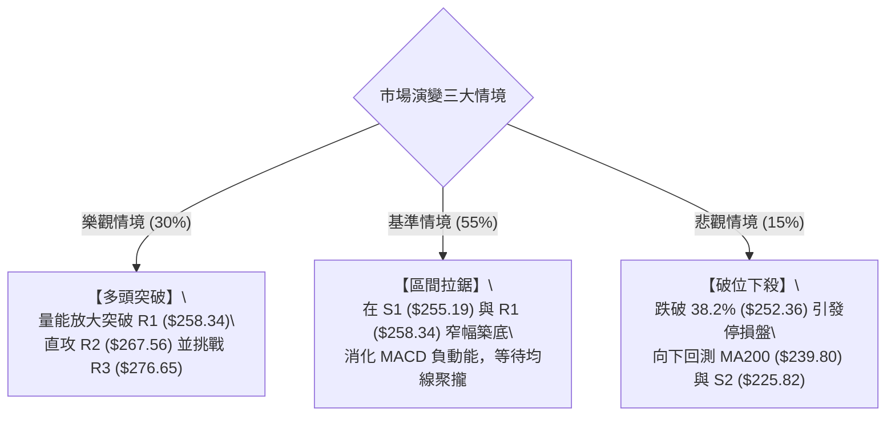

# AMZN 技術分析報告

> **報告日期**：2026-09-14 ｜ **語言**：繁體中文 ｜ **數據來源**：Yahoo Finance ｜ **當前價格**：$256.78

---

## 目錄

| 章節 | 內容 |
|------|------|
| [1. 技術面概覽](#1-技術面概覽) | 訊號儀表板、核心指標、評分卡 |
| [2. 趨勢分析](#2-趨勢分析) | 多時框趨勢、長中短期走勢、ADX解讀 |
| [3. 圖表形態分析](#3-圖表形態分析) | 形態識別、K線組合、信心度評估 |
| [4. 支撐與阻力](#4-支撐與阻力) | 關鍵價位、斐波那契回調結構 |
| [5. 技術指標深度解讀](#5-技術指標深度解讀) | MA/RSI/MACD/布林/成交量 |
| [6. 動能與波動率](#6-動能與波動率) | 動能評估、ATR、Beta波動分析 |
| [7. 多時框架總結](#7-多時框架總結) | 時框架評分矩陣、收斂結論 |
| [8. 交易策略建議](#8-交易策略建議) | 策略路由、主策略、反向風控 |
| [9. 風險提示與監控](#9-風險提示與監控) | 監控清單、風險情境模型 |

---

## 1. 技術面概覽

### 🎯 技術訊號儀表板



### 📊 核心指標速覽表

| 指標類別 | 指標名稱 | 當前數值 | 訊號 | 解讀 |
|----------|----------|----------|:----:|------|
| **價格** | 當前價格 | $256.78 | 🟡 | 位於52週區間66.6%分位，夾在短期阻力與支撐中 |
| **均線** | MA20 | $258.96 | 🔴 | 跌破20日均線（乖離率 -0.84%），短線承壓 |
| **均線** | MA50 | $255.25 | 🟢 | 守在50日均線之上（乖離率 +0.60%），中期多頭未破 |
| **均線** | MA200 | $239.80 | 🟢 | 遠高於長期年線（乖離率 +7.08%），長期牛市基調穩固 |
| **動能** | RSI(14) | 48.02 | 🟡 | 中性區間平衡，無頂背離或底背離跡象 |
| **動能** | MACD | -0.838 / 0.272 | 🔴 | 死亡交叉延伸，柱狀圖 -1.110，短線動能偏空 |
| **趨勢** | ADX(14) | 14.01 | 🟡 | 低於25警戒線，確認無定向趨勢，當前為典型箱型整理 |
| **通道** | Bollinger Bands | $251.26 - $266.66 | 🟡 | %B 為 0.36，處於中軌至下軌區間，帶寬正常未收縮暴走 |
| **成交量**| Volume / 20MA | 26.68M / 31.94M | 🔴 | 量比 0.84x，量縮整理；OBV 低於均線顯示買盤動能暫歇 |
| **波動** | ATR(14) | $5.63 | 🟢 | 波動率佔價格 2.19%，日內波動穩定，適合區間風控操作 |

### 🏆 技術評分卡

```
╔════════════════════════════════════════════════════════════════╗
║                技術評分卡 — AMZN (2026-09-14)                  ║
╠════════════════════════════════════════════════════════════════╣
║ 趨勢強度 (ADX=14.01)    ████░░░░░░░░░░░░░░░░  25/100  🔴 弱勢震盪 ║
║ 動能指標 (RSI/MACD)     ████████░░░░░░░░░░░░  40/100  🔴 動能疲弱 ║
║ 支撐穩定度 (S1/MA50)    ██████████████░░░░░░  70/100  🟢 買盤防守 ║
║ 成交量配合 (OBV<MA)     ██████░░░░░░░░░░░░░░  30/100  🔴 量能退潮 ║
║ 形態完整度 (箱型/多頭)  ████████████░░░░░░░░  60/100  🟡 整理待變 ║
║ 均線排列 (多頭排列)     ████████████████░░░░  80/100  🟢 長期看多 ║
╠════════════════════════════════════════════════════════════════╣
║ 綜合技術評分            ███████████░░░░░░░░░  54/100  🟡 中性震盪 ║
╚════════════════════════════════════════════════════════════════╝
```

---

## 2. 趨勢分析

### 🌐 多時框趨勢分析



### 📈 長期趨勢 — 12個月走勢圖（Unicode）

```
AMZN 月線收盤走勢圖（2025-10 至 2026-09）
價格軸 ($)
$275 ┤                                  ● $271.58 (07月)
$270 ┤                     ● $270.64 (05月)
$265 ┤               ● $265.06 (04月)        ● $259.77 (08月)
$255 ┤                                            ● $256.78 (現價 09月)
$245 ┤ ● $244.22 (25/10)        ● $238.34 (06月)
$235 ┤       ● $233.22 (11月)  ● $239.30 (01月)
$230 ┤             ● $230.82 (12月)
$210 ┤                            ● $210.00 (02月)
$205 ┤                               ● $208.27 (03月雙底低點)
     └───────────────────────────────────────────────────────────►
       10  11  12  01  02  03  04  05  06  07  08  09 (月份)
```

#### 走勢特徵分析表格

| 階段區間 | 起止收盤價 | 漲跌幅 | 結構特徵與走勢解讀 |
|:---|:---:|:---:|:---|
| **第一階段：高檔震盪回調**<br>(2025-10 ~ 2026-03) | $244.22 → $208.27 | -14.72% | 自 $244.22 逐月階梯式回落，於 2026 年 2 月至 3 月在 $210.00 - $208.27 構築雙重底結構，洗清浮額。 |
| **第二階段：主升段噴出**<br>(2026-03 ~ 2026-05) | $208.27 → $270.64 | +29.95% | 突破頸線後強勢拉升，4月收 $265.06，5月創 $270.64 波段高點，成交量顯著放大，奠定中長期牛市架構。 |
| **第三階段：高檔強勢洗盤**<br>(2026-05 ~ 2026-07) | $270.64 → $271.58 | +0.35% | 6月深度回踩至 $238.34 測試 MA200 支撐後迅速拔高，7月收在 $271.58 創波段收盤新高，展現強大買盤承接力。 |
| **第四階段：量縮橫向整理**<br>(2026-07 ~ 2026-09) | $271.58 → $256.78 | -5.45% | 高檔獲利回吐，量能持續遞減，目前收在 $256.78，在 MA50 ($255.25) 上方尋求均線支撐，進入窄幅蓄勢。 |

### 📊 中期趨勢（週線分析）

從近20週數據觀察，2026-08-02當週收在 $271.58（成交量 3.55億股）、2026-08-09 衝至 $274.48，MACD柱高達 +4.090。隨後成交量逐週遞減（從 2.7億股萎縮至當前 1.14億股），收盤價回落至 $256.78，MACD柱狀圖轉為負值 -1.110。顯示中期屬於**多頭架構下的良性量縮洗盤**，而非主力高檔派發。

```
近期週線壓力與支撐階梯示意圖：
[波段高點阻力] ─────── R3: $276.65 (近一年波段高點密集區)
                      ▲
[通道上軌壓力] ─────── R2: $267.56 / 布林上軌 $266.66
                      ▲
[短期均線反壓] ─────── R1: $258.34 / MA20 ($258.96)
══════════════════════ 現價 $256.78 (位於箱體中下緣) ══════════════════════
[即時支撐防線] ─────── S1: $255.19 / MA50 ($255.25)
                      ▼
[斐波那契關鍵] ─────── 38.2% 回調位: $252.36 / 布林下軌 $251.26
                      ▼
[長期牛熊底線] ─────── S2: $225.82 / MA200 ($239.80)
```

### ⚡ 趨勢強度評估（ADX 解讀）



| 指標變數 | 當前數值 | 門檻區間 | 趨勢研判結論 |
|:---|:---:|:---:|:---|
| **ADX (14)** | **14.01** | < 20 (極弱) / 20-25 (偏弱) / > 25 (強趨勢) | **極弱趨勢**。顯示當前不具備單邊暴漲或暴跌的動能，市場處於能量沉澱與籌碼交換期。 |
| **+DI** | **27.01** | 基準線 20 | 買方控制力維持在平均水準之上，多頭結構仍在。 |
| **-DI** | **21.85** | 基準線 20 | 空方壓制力較弱，賣壓並未失控。 |
| **綜合判定** | **+DI > -DI 但 ADX < 25** | 規則 14 指引 | **盤整行情**。中長期順勢偏多，但日線不得採用突破追單，應以日線布林通道下軌或關鍵支撐佈局。 |

---

## 3. 圖表形態分析

### 🔍 形態識別系統



#### 形態識別與信心度評估表（依規則 15 嚴格量化）

| 識別形態 | 信心度 | 判斷依據（引用數據） | 完成度 | 目標價（附嚴格計算式） |
|:---|:---:|:---|:---:|:---|
| **高檔收斂箱型震盪** | **75%** | 上檔受阻於近一年高點聚類 R2: $267.56，下檔獲近一年低點聚類 S1: $255.19 支撐，兩週收盤於此區間震盪。 | 85% | 向上突破 R2 後：$267.56 + ($267.56 - $255.19) = **$279.93**（數據中最接近波段高點聚類為 **R3: $276.65**） |
| **布林通道下軌防守** | **80%** | %B = 0.36，下軌落在 $251.26，緊鄰斐波那契 38.2% 回調位 $252.36，呈現明顯支撐疊加。 | 90% | 下軌反彈中軌目標：中軌 MA20 為 **$258.96**；延伸目標為上軌 **$266.66** |
| **複雜頭肩底 / 雙底** | **35%** | 數據顯示近期高低點重疊，缺乏典型頭肩形態的三重波谷幾何特徵。 | 30% | *訊號不足，信心度 < 50%，依規定僅做指標型解讀，不預設目標價。* |

### 🕯️ 重要K線形態分析

| 週次 / 月份 | 收盤價 | K線形態 | 量價關係與解讀 | 訊號 |
|:---|:---:|:---|:---|:---:|
| **2026-08-09 (週)** | $274.48 | 長上影紅K（流星線雛形） | 週量 2.70億股。上衝逼近 52W 高點 $287.20 後受阻回吐，暗示上方套牢賣壓沈重。 | 🔴 警示 |
| **2026-08-23 (週)** | $258.63 | 中黑K下殺 | 週量縮至 1.76億股，跌破週線短期均線，RSI 驟降至 24.5，引發超賣修復買盤。 | 🟡 震盪 |
| **2026-08-30 (週)** | $266.43 | 帶下影紅K（多頭抵抗） | 迅速自低檔反彈收復 $266，確立 S1 ($255.19) 附近具強勁低接買盤支撐。 | 🟢 反彈 |
| **2026-09-13 (週)** | $256.78 | 窄幅十字星 / 紡錘線 | 週量萎縮至 1.14億股（近20週最低量），變盤信號顯著，多空於 MA50 平衡。 | 🟡 觀望 |

### 📉 ASCII 走勢形態示意圖

```
AMZN 近期日線級別箱型震盪形態圖解：
$268.00 ┤              ┌───┐ (R2: $267.56 阻力頂部)
$266.00 ┤   ┌───┐      │   │           布林上軌: $266.66
$264.00 ┤   │   │      │   └───┐
$262.00 ┤   │   └───┐  │       │
$260.00 ┤───┼───────┼──┼───────┼─────── R1: $258.34 / MA20: $258.96 ───────
$258.00 ┤   │       │  │       │   ▲
$256.78 ┤───┼───────┼──┼───────┼───●── 現價 $256.78 (箱體下半區)
$255.00 ┤───┴───────┴──┴───────┴─────── S1: $255.19 / MA50: $255.25 ───────
$252.00 ┤                               布林下軌: $251.26 / 38.2%: $252.36
        └────────────────────────────────────────────────────────────►
         [ 08/23 低點 ]   [ 08/30 反彈 ]  [ 當前 09/14 壓縮整理 ]
```

### 🎯 形態目標價計算

根據高檔箱型整理形態推算：
1. **形態邊界確立**：
   - 形態頂部（箱頂）：$267.56（波段高點聚類 R2）
   - 形態底部（箱底）：$255.19（波段低點聚類 S1）
   - 箱體垂直高度：$267.56 - $255.19 = **$12.37**
2. **多頭向上突破目標價**：
   - 第一目標價（波段高點聚類直接引述）：**$267.56** (R2)
   - 第二突破延伸目標：頸線 $267.56 + 箱體高度 $12.37 = **$279.93**（與歷史高點聚類 **R3: $276.65** 產生強共振）
3. **空頭向下跌破防守目標**：
   - 若失守 S1 ($255.19)，下測箱底對稱跌幅：$255.19 - $12.37 = **$242.82**（接近斐波那契 50.0% 回調位 **$241.60** 及 MA200 **$239.80**）

---

## 4. 支撐與阻力

### 🗺️ 關鍵價位分布圖（Unicode）

```
AMZN 價位結構分布圖
══════════════════════════════════════════════════════════════════
$287.20 ║██████████████████████████████║ 52W 最高點 / 斐波那契 0.0%
$276.65 ║████████████████████████      ║ 強阻力 R3 (近一年波段高點聚類)
$267.56 ║██████████████████            ║ 關鍵阻力 R2 (箱頂阻力 / 近布林上軌)
$265.68 ║██████████████                ║ 斐波那契 23.6% 回調位
$258.34 ║████████████                  ║ 即時阻力 R1 (MA20: $258.96 共振)
$256.78 ╠══════════════════════════════╣ ◄── 現價 ($256.78)
$255.19 ║▓▓▓▓▓▓▓▓▓▓▓▓                  ║ 即時支撐 S1 (MA50: $255.25 共振)
$252.36 ║▓▓▓▓▓▓▓▓▓▓▓▓▓▓                ║ 斐波那契 38.2% / 布林下軌 $251.26
$241.60 ║▓▓▓▓▓▓▓▓▓▓▓▓▓▓▓▓▓▓            ║ 斐波那契 50.0% 回調位
$239.80 ║▓▓▓▓▓▓▓▓▓▓▓▓▓▓▓▓▓▓▓▓            ║ 長期均線 MA200 年線防線
$225.82 ║▓▓▓▓▓▓▓▓▓▓▓▓▓▓▓▓▓▓▓▓▓▓        ║ 強支撐 S2 (波段低點聚類)
$220.99 ║▓▓▓▓▓▓▓▓▓▓▓▓▓▓▓▓▓▓▓▓▓▓▓▓        ║ 終極強支撐 S3 (波段低點聚類)
$196.00 ║▓▓▓▓▓▓▓▓▓▓▓▓▓▓▓▓▓▓▓▓▓▓▓▓▓▓▓▓    ║ 52W 最低點 / 斐波那契 100.0%
══════════════════════════════════════════════════════════════════
```

### 🚧 阻力位分析表

| 阻力級別 | 價位 | 距現價幅幅 | 形成原因（嚴格引用數據） | 突破難度 | 重要性 |
|:---|:---:|:---:|:---|:---:|:---:|
| **R1** | **$258.34** | +0.61% | 近一年波段高點密集區，與日線 MA20 ($258.96) 及布林中軌形成雙重反壓。 | 🟡 中等 | ★★★☆☆ |
| **R2** | **$267.56** | +4.20% | 近一年重要波段高點聚類，與布林通道上軌 ($266.66) 及斐波那契 23.6% ($265.68) 共振。 | 🔴 較高 | ★★★★☆ |
| **R3** | **$276.65** | +7.74% | 近一年最高波段高點聚類，為挑戰歷史前高 $287.20 之前的最後一道多頭關卡。 | 🔴 極高 | ★★★★★ |

### 🛡️ 支撐位分析表

| 支撐級別 | 價位 | 距現價幅幅 | 形成原因（嚴格引用數據） | 守住機率 | 重要性 |
|:---|:---:|:---:|:---|:---:|:---:|
| **S1** | **$255.19** | -0.62% | 近一年波段低點聚類，疊加日線 MA50 ($255.25) 與 MA5 ($255.31)，短線首要買盤防線。 | 🟢 70% | ★★★★☆ |
| **S2** | **$225.82** | -12.06% | 近一年重大波段低點聚類，位於長期均線 MA200 ($239.80) 之下，為大級別空頭回測極限。 | 🟢 90% | ★★★★★ |
| **S3** | **$220.99** | -13.94% | 近一年深層波段低點聚類，接近 2025 年末回調起漲區，構成結構性絕對底部。 | 🟢 95% | ★★★★★ |

### 📐 斐波那契回調位分析

依據 52 週完整區間（低點 **$196.00** 至 高點 **$287.20**，落差 $91.20）計算：

| 斐波那契回調比例 | 精確價位 | 技術意義與當前價位相互關係 |
|:---|:---:|:---|
| **0.0% (52W High)** | **$287.20** | 歷史峰值，終極多頭目標區間。 |
| **23.6%** | **$265.68** | 超強勢回調位；現價位於此下方，代表上衝動能暫歇。 |
| **38.2%** | **$252.36** | **關鍵防守線**；與布林通道下軌 ($251.26) 緊密重疊，構成次級強力支撐。 |
| **50.0%** | **$241.60** | 多空強弱分水嶺；緊鄰 MA200 ($239.80)，此位不破多頭不改。 |
| **61.8%** | **$230.84** | 黃金分割防禦位；中長線價值投資極限吸籌區。 |
| **78.6%** | **$215.52** | 深度洗盤回撤位。 |
| **100.0% (52W Low)**| **$196.00** | 週期循環起點。 |

> 📌 **位置解讀**：現價 **$256.78** 準確落於 **23.6% ($265.68)** 與 **38.2% ($252.36)** 之間，屬於強勢整理回調區間。只要收盤穩守在 38.2% ($252.36) 及 S1 ($255.19) 之上，中長期技術架構即保持完好。

---

## 5. 技術指標深度解讀

### 🎛️ 指標訊號總覽



### 📈 移動平均線排列分析



#### 各週期移動平均線參數表

| 均線名稱 | 當前價位 | 乖離率 (%) | 排列狀態 | 走勢斜率與技術研判 |
|:---|:---:|:---:|:---:|:---|
| **MA 5** | $255.31 | +0.58% | 走平向上 | 短線止跌，連續下挫後出現微幅拐頭跡象。 |
| **MA 10**| $257.15 | -0.15% | 微幅向下 | 5日線與10日線在現價上下夾擊，形成 $255 - $257 窄幅糾結。 |
| **MA 20**| $258.96 | -0.84% | 向下彎頭 | **短期空頭阻力線**。現價已連續受制其下，需放量突破方能解套。 |
| **MA 60**| $252.09 | +1.86% | 穩定向上 | 季線強勁向上延伸，與斐波那契 38.2% ($252.36) 構成重裝防禦帶。 |
| **MA 120**| $250.10 | +2.67% | 穩定向上 | 半年線持續抬升，形成堅實的中期趨勢保護傘。 |
| **MA 240**| $237.84 | +7.96% | 堅定向上 | 牛熊分界線斜率陡峭，確立宏觀多頭格局絲毫未損。 |

### 📉 RSI(14) 分析

* 當前讀數：**48.02**
* 進度條：`██████████░░░░░░░░░░ 48.02%`（中性平衡區）
* 區間狀態：
  - 30以下（超賣區）：否
  - 30至70（正常震盪區）：**是**
  - 70以上（超買區）：否
* **背離判定**：**無背離現象**。日線價格自高檔微跌，RSI 亦由 60 多回落至 48.02，指標運行完全符合價格軌跡，未出現「價格破新高而指標未過高」的頂背離，亦無底背離。

### 📊 MACD(12/26/9) 訊號解讀



- **DIF 快線**：-0.838（已跌破零軸，顯示短線動能處於空方主導區間）
- **DEA 慢線（Signal）**：0.272（仍維持在零軸上方）
- **MACD 柱狀圖**：-1.110（負柱持續延展，代表回調修正尚未出現明確的動能衰竭或黃金交叉跡象）

### 📦 布林通道分析

```
布林通道結構與現價相對位置（帶寬參數：20, 2）：
$266.66 ┤ ══════════════════════════════════ 上軌 (Upper Band)
$264.00 ┤
$262.00 ┤
$260.00 ┤
$258.96 ┤ ────────────────────────────────── 中軌 MA20 (Middle Band / 阻力)
$256.78 ┤                  ● 現價 ($256.78, %B = 0.36)
$254.00 ┤
$252.00 ┤
$251.26 ┤ ══════════════════════════════════ 下軌 (Lower Band / 支撐)
```

- **通道帶寬**：$266.66 - $251.26 = $15.40（帶寬比約 5.9%，處於常態橫盤水平，未現「開口暴走」或「極度收窄」）。
- **當前位置**：%B 為 **0.36**，代表價格位於中軌至下軌之間 36% 處，正朝著下軌支撐區進行測試，距下軌僅有約 2.15% 空間。

### 💹 成交量分析（量價配合度）

1. **量能萎縮**：最新單日成交量為 **26,682,800 股**，對比 20 日均量（31,943,430 股）之量比僅為 **0.84x**；對比 50 日均量（39,962,334 股）萎縮更為顯著。
2. **OBV 趨勢解讀**：數據指示 **OBV < MA**，代表能量潮指標已跌破自身移動平均線，資金進場積極度轉弱，呈現「價跌量縮」的防禦性格局。
3. **量價背離判定**：雖然短線量縮有利於減緩下殺動能，但「量縮反彈」難以克服上方 MA20 ($258.96) 與 R1 ($258.34) 處的解套賣壓，後續欲重啟多頭走勢，必須見到日成交量放大至 3,500 萬股以上（量比 > 1.1x）。

---

## 6. 動能與波動率

### ⚡ 動能評估四象限

| 象限標籤 | 動能狀態 | 波動率狀態 | 典型市場特徵 | AMZN 當前落點判定 |
|:---:|:---:|:---:|:---|:---:|
| **第 I 象限** | 強動能 (趨勢明顯) | 低波動 (溫和上漲) | 最理想的主升段持倉環境 | ✕ |
| **第 II 象限** | **弱動能 (ADX=14)** | **低波動 (ATR=2.19%)** | **無趨勢震盪、量縮築底、適合區間高拋低吸** | **✓ (落於此區間)** |
| **第 III 象限**| 強動能 (單邊突破) | 高波動 (劇烈震盪) | 突破爆發期、高風險高收益 | ✕ |
| **第 IV 象限** | 弱動能 (反覆拉鋸) | 高波動 (洗盤震盪) | 無方向劇烈洗盤、極易雙巴 | ✕ |



### 📊 ATR 波動率分析

- **ATR(14) 數值**：**$5.63**
- **波動佔比**：$5.63 / $256.78 = **2.19%**
- **動態風控應用**：
  - **日內安全噪音區間**：1.0 × ATR = **$5.63**
  - **短線防守止損距離**：建議設定為 1.5 × ATR = **$8.45**
  - **波段進場最大停損距離**：不得超過 2.0 × ATR = **$11.26**
  - **實務止損錨定**：以支撐位 S1 ($255.19) 往下減去 0.5 × ATR ($2.82) 設置為 **$252.37**，與斐波那契 38.2% ($252.36) 完美重合，兼具形態與波動率雙重科學依據。

### 📐 Beta 與市場相關性

- **Beta 係數**：**1.443**
- **大盤敏感度分析**：Beta 為 1.443 顯示 AMZN 屬於典型的**高貝塔進攻型權值股**。當美股大盤（標普500 / 納斯達克100）上漲 1% 時，理論上 AMZN 預期變動約 +1.44%；反之大盤下挫時亦承擔 1.44 倍跌幅。
- **配置警示**：在當前 ADX 僅 14.01 且 MACD 偏空的震盪期，高 Beta 特質意味著個股極易受宏觀大盤突發波動干擾，因此**在指數未確認止跌前，倉位必須採取降槓桿與嚴控部位原則**。

---

## 7. 多時框架總結

### 📋 時框架評分表

| 時框架 | 趨勢方向 | 動能指標 | 均線排列 | 形態結構 | 綜合評分 | 操作指引 |
|:---|:---:|:---:|:---:|:---:|:---:|:---|
| **長線 (月線)** | 🟢 多頭向上 | 🟢 RSI偏強 | 🟢 MA20>50>200 | 52週高檔箱型偏多 | **82/100** | 逢低分批佈局，堅定持有 |
| **中線 (週線)** | 🟡 橫向整理 | 🟡 RSI中性 | 🟢 守穩中長均線 | 高檔箱型洗盤整理 | **60/100** | 箱底吸籌，不破不賣 |
| **短線 (日線)** | 🔴 弱勢震盪 | 🔴 MACD負值擴大 | 🔴 跌破短期MA20 | 承壓於 R1 窄幅整理 | **42/100** | 嚴禁追高，耐心等回測低接 |

### 🔲 綜合訊號矩陣

```
┌─────────────────┬────────────────────────────────────────────────────────┐
│ 時框架衝突分析  │ 日線指標短線偏空（跌破 MA20、MACD 負柱）                 │
│                 │ 週線與月線中長期偏多（均線多頭排列、處於 52W 區間 66.6%） │
├─────────────────┼────────────────────────────────────────────────────────┤
│ 一致性評估      │ 短期回調屬於中長期牛市進程中的「均線回踩與浮額清洗」       │
└─────────────────┴────────────────────────────────────────────────────────┘
```

### ⚖️ 多時框收斂結論

> **依據「嚴格要求 14」之多時框收斂規則**：
> 1. **行情屬性判定**：當前 ADX(14) 為 **14.01 (< 25)**，嚴格定義為**盤整行情**。
> 2. **主導維度取捨**：依規則，當 ADX < 25 且短中訊號衝突時，**以日線布林通道上下軌 ($251.26 - $266.66) 與關鍵波段聚類 (S1: $255.19 / R1: $258.34) 作為唯一交易區間基準**。日線的短期空頭動能壓制了突破動能，但中長期的多頭排列（MA20>MA50>MA200）鎖死了下方大幅下挫的空間。
> 3. **唯一方向性結論**：**【中性觀望，區間低吸高拋】**。主基調為「震盪築底」，絕不追高，戰術上採**回踩支撐位（S1 / 斐波那契38.2%）佈局多單**為主策略。

---

## 8. 交易策略建議

### 🗺️ 策略決策流程圖



### 🧭 策略路由

* **當前主策略方向**：**【區間偏多操作 — 逢低吸納策略】**（依技術評分 **54/100**，長多排列保護，採區間下緣低吸）

### 🎯 價格情境階梯（Price Scenarios）

所有價位均嚴格引用第 4 章計算之波段聚類與斐波那契數據：

| 觸發條件 | 第一目標 | 後續延伸目標 | 技術情境含義 |
|:---|:---:|:---:|:---|
| **向上突破 R1 ($258.34)** | R2 ($267.56) | R3 ($276.65) | 突破 MA20 短期壓制，短線正式轉強，開啟上軌攻擊波 |
| **守穩 S1 ($255.19) - 現價** | R1 ($258.34) | 布林中軌 ($258.96) | 維持窄幅箱型震盪，多空籌碼在此均衡換手 |
| **有效跌破 S1 ($255.19)** | 38.2% ($252.36) | S2 ($225.82) | 短期破位拉回，回測布林下軌與半年線尋求深層支撐 |

### 📊 情境機率分佈

| 情境劃分 | 機率估算 | 主要數據與技術指標依據 |
|:---|:---:|:---|
| **區間震盪築底 (主情境)** | **55%** | ADX(14) 為 14.01（無方向特徵）；布林帶寬正常收縮；量能維持 0.84x 低水位，籌碼鎖定良好。 |
| **下軌獲得支撐反彈上行** | **30%** | +DI (27.01) 仍主導 -DI (21.85)；MA50 ($255.25) 提供強勁均線防禦；週線維持長期多頭排列。 |
| **跌破關鍵支撐加速探底** | **15%** | MACD 柱狀圖仍為負值 (-1.110)；OBV 低於均線顯示資金流入意願不足。 |

### 🟢 主策略詳情

| 策略要素 | 策略 A（左側交易：區間下緣低吸） | 策略 B（右側交易：放量突破加碼） |
|:---|:---|:---|
| **進場條件** | 價格回測 S1 至布林下軌區間，縮量收下影線企穩 | 日K收盤價實體放量突破 R1 ($258.34) 且成交量 > 35M |
| **進場價格** | **$253.50**（介於 S1 $255.19 與 38.2% $252.36 之間） | **$258.50**（確認突破 R1 $258.34） |
| **目標價 T1** | **$258.96**（布林中軌 / MA20 處先獲利了結一半） | **$265.68**（斐波那契 23.6% 回調位） |
| **目標價 T2** | **$267.56**（波段阻力 R2 / 箱頂極限） | **$276.65**（波段阻力 R3 / 前高密集區） |
| **止損價格** | **$250.50**（跌破布林下軌 $251.26 及 38.2% $252.36） | **$254.50**（跌回關鍵支撐 S1 $255.19 之下） |
| **風險報酬比** | **1 : 4.68**（風險 $3.00，T2 獲利 $14.06） | **1 : 4.53**（風險 $4.00，T2 獲利 $18.15） |
| **成功機率** | **65%**（符合箱型整理規律） | **60%**（需量能確認配合） |
| **建議倉位** | **15%**（基礎底倉） | **10%**（動態追擊倉） |

### 🔴 反向風險觸發點（對沖提示）

- **多頭結構失效警告**：若日K線收盤價**跌破 $251.26（布林下軌）且同時摜破 $250.10（半年線 MA120）**，宣告本次箱型震盪築底失敗。
- **對沖應對動作**：
  1. 多頭部位必須無條件停損出場，保留現金。
  2. 風控帳戶可啟動反向避險機制，以跌破點往下看至波段深層支撐 **S2 ($225.82)**。

### ⭐ 整體訊號強度評星

```
做多訊號強度：★★★☆☆  (3.0/5星 — 均線多頭底蘊在，等待回踩確認)
做空訊號強度：★★☆☆☆  (2.0/5星 — 缺乏單邊暴跌條件，僅為量縮拉回)
整體可信度：  ★★★★☆  (4.0/5星 — 價位聚類完整，斐波那契共振清晰)
```

---

## 9. 風險提示與監控

### ✅ 關鍵監控指標 Checklist

```
╔════════════════════════════════════════════════════════════════╗
║                  AMZN 核心技術監控清單 (Checklist)             ║
╠════════════════════════════════════════════════════════════════╣
║ [ ] 價格突破監控：收盤是否突破短期天花板 R1 ($258.34)           ║
║ [ ] 支撐防守監控：S1 ($255.19) 與 MA50 ($255.25) 是否失守       ║
║ [ ] 極限防線監控：布林下軌 ($251.26) 與 38.2% ($252.36) 重疊區  ║
║ [ ] 動能反轉監控：MACD 柱狀圖負值何時收窄至 -0.500 以上         ║
║ [ ] 量能擴張監控：日成交量是否回升至 32M 股（突破 20 日均量）   ║
║ [ ] 趨勢啟動監控：ADX(14) 讀數是否由 14.01 拐頭向上穿越 20     ║
╚════════════════════════════════════════════════════════════════╝
```

### ⚠️ 風險場景分析



### 🛡️ 風險管理重要提醒

1. **高 Beta 波動懲罰防範**：AMZN Beta 為 **1.443**，若遇納斯達克大盤劇烈調整，跌幅將被放大。在當前成交量僅 2,668 萬股（量比 0.84x）的弱市環境中，**單筆交易最大虧損額度務必限制在總投資組合淨值的 1.0% 以內**。
2. **切忌左側提前重倉**：雖然 S1 ($255.19) 及 38.2% ($252.36) 具備強大技術共振，但由於 MACD 柱狀圖仍然維持負值 (-1.110)，顯示動能回撤尚未完全出清。嚴格執行「分批建倉」紀律（首筆 15%，突破加碼 10%），切勿一次性打滿部位。
3. **無趨勢行情的操作禁忌**：在 **ADX = 14.01** 的盤整市況下，追漲殺跌將導致嚴重的雙向滑點與摩擦成本損耗，一切進出場指令均應以設定好的限價單（Limit Order）在阻力與支撐位階執行。

---

## 📋 報告總結

```
╔══════════════════════════════════════════════════════════════════╗
║                    AMZN 技術分析報告總結                         ║
╠══════════════════════════════════════════════════════════════════╣
║ 報告日期：2026-09-14            當前現價：$256.78                ║
║ 技術評分：54/100                分析評級：⚖️ 中性觀望 (區間蓄勢)  ║
╠══════════════════════════════════════════════════════════════════╣
║ 關鍵結論：                                                       ║
║ ├─ 長期趨勢：🟢 完好多頭排列 (MA20>MA50>MA200，價格在MA200之上)  ║
║ ├─ 中期趨勢：🟡 箱型橫盤整理 ($251.26 - $266.66 布林通道區間)   ║
║ ├─ 短期趨勢：🔴 弱勢修正承壓 (受制於 MA20: $258.96 與 R1)       ║
║ ├─ 關鍵支撐：S1: $255.19  / 38.2%回調位: $252.36 / S2: $225.82   ║
║ ├─ 關鍵阻力：R1: $258.34  / R2: $267.56        / R3: $276.65   ║
║ └─ 機構目標：平均目標價 $328.17 (共60位分析師，強烈買進共識)     ║
╠══════════════════════════════════════════════════════════════════╣
║ 最優交易策略組合：                                               ║
║ 1. 🥇 最佳機會：回踩 $252.36 - $255.19 區間低吸佈局多單          ║
║                 (停損守 $250.50，目標直指 $267.56，風報比 1:4.68)║
║ 2. 🥈 次選機會：帶量突破 R1 ($258.34) 後右側追擊多單             ║
║                 (停損守 $254.50，目標看至 $276.65，風報比 1:4.53)║
║ 3. 🥉 保守選擇：靜待日線 MACD 負柱翻紅且 ADX 突破 20 後再行進場   ║
╚══════════════════════════════════════════════════════════════════╝
```

---

> ⚠️ **免責聲明**：本報告為依據量化技術指標與價格數據生成之專業技術研判，所有支撐與阻力價位均嚴格基於歷史 OHLCV 聚類與斐波那契回調模型推算。本報告**僅供研究與學術參考**，**不構成任何要約、招攬或實質投資建議**。市場存在不可預測之系統性風險，投資人應獨立評估風險並自行承擔交易損益。

---

*報告生成時間：2026-09-14 ｜ 數據來源：Yahoo Finance ｜ 分析框架：多時框技術分析模型*